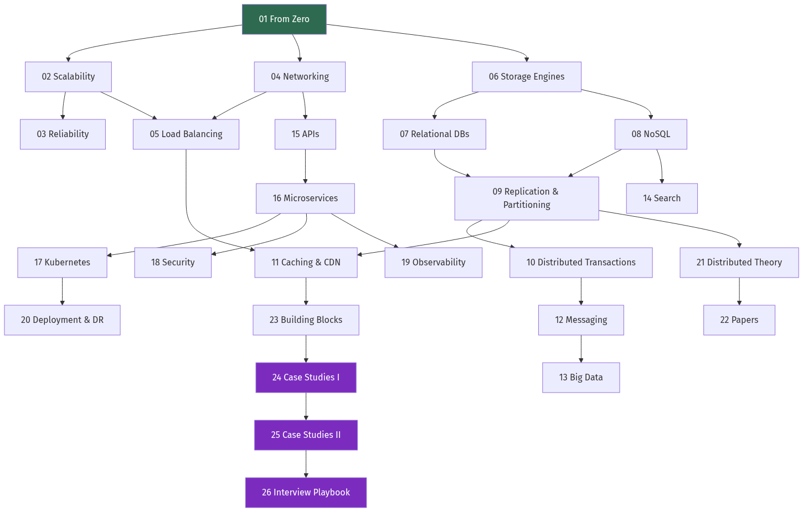
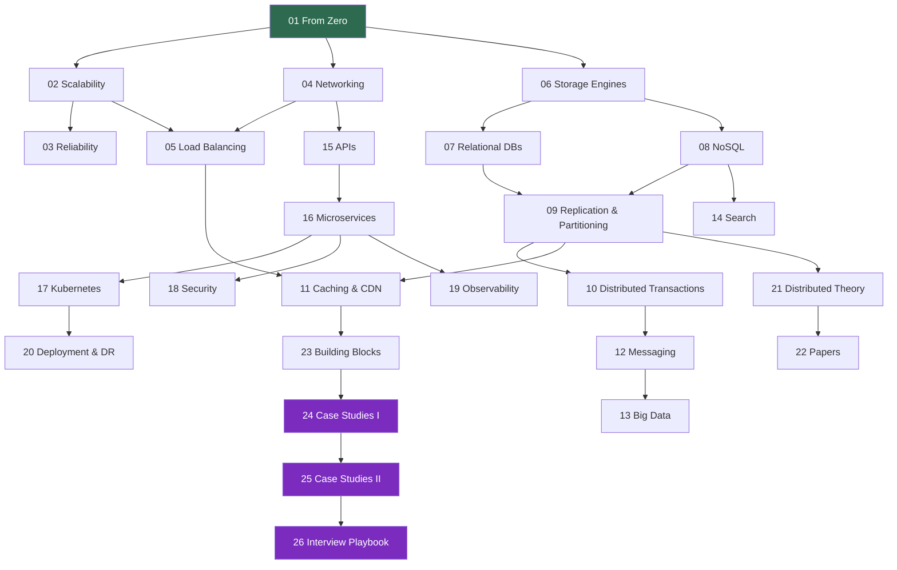

# How to Use This Book

[← Back to contents](./README.md) · [Next: Chapter 1 →](./01_from_zero_computers_networks_web.md)

---

## Who this is for

There are four kinds of reader, and this book is written so that all four can use the same
text without any of them being bored or lost.

**The complete beginner.** You can write code — a script, a web page, maybe a small app —
but you have never thought about what happens when a thousand people use it at once. You
don't know what a load balancer is. That's fine. Chapter 1 starts below that level.

**The interview candidate.** You have a system design round coming and you need to be able
to hold a whiteboard for 45 minutes without freezing. Read Chapter 26 first — it tells you
what you're actually being scored on — then work backwards.

**The working engineer.** You've shipped services, you know Docker, but you've never had
to explain *why* the database is the bottleneck, and you'd like to stop guessing. Start at
Part 2.

**The architect.** You make the calls. You want the trade-off tables, the failure modes,
and the papers. Parts 5, 6 and 7.

---

## The dependency graph

Chapters are not independent. This shows what depends on what, so you can skip safely.

Diagram source (Mermaid)

Every chapter also states its **Prerequisites** on the first line. If you're lost, that
line tells you where to go back to.

---

## The four learning paths in detail

### Path A — Complete beginner (the full build)

You are constructing vocabulary before theory. The order below deliberately delays the
hard distributed-systems material until you have something concrete to attach it to.

| Order | Chapter | Why here |
| --- | --- | --- |
| 1 | 01 From Zero | Machines, networks, why one server isn't enough |
| 2 | 02 Scalability | The two ways to grow, and how to estimate |
| 3 | 03 Reliability | What "99.9%" actually costs |
| 4 | 04 Networking | What a request physically does |
| 5 | 05 Load Balancing | The first real piece of infrastructure |
| 6 | 07 Relational DBs | Databases before database *internals* |
| 7 | 11 Caching | The single highest-leverage technique |
| 8 | 15 APIs | How services talk |
| 9 | 06 Storage Engines | *Now* go under the database |
| 10 | 08 NoSQL | The alternatives, once you know the default |
| 11 | 09 Replication | Copies and shards |
| 12 | 12 Messaging | Decoupling with queues |
| 13 | 16 Microservices | Splitting the system |
| 14 | 17 Kubernetes | Running the split system |
| 15 | 24 Case Studies I | Put it together |

Then continue with 10, 13, 14, 18–23, 25, 26 in any order.

### Path B — Interview in two weeks

Days 1–2: Chapter 26 (know the rubric), Chapter 02 (estimation is scored explicitly).
Days 3–5: Chapters 03, 09, 11.
Days 6–8: Chapters 12, 23.
Days 9–12: Chapters 24 and 25 — do each design on paper *before* reading the solution.
Days 13–14: Chapter 26's question bank and the mock transcripts.

⚠️ The most common failure in interviews is not lack of knowledge — it is not driving the
conversation. Chapter 26 has scripts for this. Practise them out loud.

### Path C — Working engineer levelling up

`06 → 07 → 09 → 10 → 12 → 16 → 19 → 20 → 21 → 22`

You already have the vocabulary. What you're missing is (a) what happens below the API of
the tools you use, and (b) the operational failure modes that only show up at scale.

### Path D — Architect

`03 → 09 → 10 → 16 → 20 → 21 → 22 → 23 → 25`

Focused on trade-off analysis, consistency guarantees, multi-region topology, and the
source material. Chapter 22 is the highest-density chapter in the book for this audience.

---

## How to actually study this

**Redraw the diagram.** Every chapter has one "mental model" diagram. Close the book and
reproduce it from memory. If you can't, you didn't learn the chapter — you recognised it.

**Do the arithmetic yourself.** Every worked example shows its steps. Cover the answer,
compute it, then check. Estimation is a physical skill; reading someone else's estimate
builds nothing.

**Argue with the trade-off tables.** For each row, ask: *under what circumstance would I
choose the other one?* If you can't answer, you've memorised a table instead of
understanding a decision.

**Design before you read.** For Chapters 24 and 25, spend 30 minutes designing the system
yourself on paper first. Then read. The gap between your design and the chapter's is
exactly your learning for that day.

**Explain it to someone.** Or to an empty room. The point at which you start hedging is the
point at which your understanding stops.

---

## What this book will not do

It will not teach you a programming language. The Go code in [`code/`](./code/) is
readable if you know any C-family language, and every non-obvious line is commented, but
this is not a Go tutorial.

It will not teach you to *operate* a specific cloud. There is no "click here in the AWS
console". The concepts transfer; the consoles don't.

It will not give you a template to memorise. Interviewers can tell. What it gives you is
enough understanding that you can derive the design in the room.

---

## Notation

| Symbol | Meaning |
| --- | --- |
| **Bold term** | First appearance of a concept — being defined right here |
| `code font` | Literal command, identifier, HTTP header, or config key |
| ⚠️ | A trap that causes real production incidents |
| 💡 | A non-obvious insight worth remembering |
| 📐 | A formula or a piece of arithmetic |
| 🎯 | Comes up in interviews specifically |

### Units

Storage and network numbers in this book use **decimal** units for capacity planning
(1 KB = 1,000 bytes, 1 GB = 10⁹ bytes) because that is what disk vendors, cloud billing
and network engineers use. Binary units appear as KiB/MiB/GiB where the hardware genuinely
works in powers of two — memory sizes, page sizes, and block sizes.

The difference is not trivial: a "1 TB" disk holds 10¹² bytes = 931 GiB. That 7% gap has
caused more than one capacity incident.

### Time units

| Unit | Symbol | Seconds |
| --- | --- | --- |
| Nanosecond | ns | 10⁻⁹ |
| Microsecond | µs | 10⁻⁶ |
| Millisecond | ms | 10⁻³ |
| Second | s | 1 |

💡 A useful anchor: if one CPU cycle were one second, then a disk seek would be about
**four months**. Keep that ratio in your head — it explains most of system design.

---

## Errata and honesty

Where this book states a performance number, it is either (a) from vendor documentation,
(b) from a published paper or engineering blog, or (c) a rounded order-of-magnitude figure
explicitly labelled as such. Hardware improves; the *ratios* between memory, disk, and
network are far more stable than the absolute values, so the book leans on ratios.

Where something is genuinely contested among practitioners — and several things are — the
book says so rather than pretending there's consensus.

---

**Ready → [Chapter 1: From Zero — Computers, Networks and the Web](./01_from_zero_computers_networks_web.md)**
