# Chapter 1 — From Zero: Computers, Networks and the Web

[← Contents](./README.md) · [← How to use this book](./00_how_to_use_this_book.md) · [Next: Chapter 2 →](./02_scalability_and_estimation.md)

**Prerequisites:** None. This is the beginning.

---

## What you'll learn

By the end of this chapter you will be able to:

- Explain what a computer physically does when it runs your code, and why some operations are a billion times slower than others
- Define **process**, **thread**, **socket**, **port** and **server** precisely enough to use them in an argument
- Trace what happens between pressing Enter on `google.com` and seeing a page — every hop, with a latency number attached
- Explain the difference between **stateless** and **stateful**, and why it is the single most important property in scaling
- List the five distinct resources a single machine can run out of, and recognise which one you're hitting

If you can already do all five, skip to [Chapter 2](./02_scalability_and_estimation.md).

---

## Start from zero

Imagine a restaurant kitchen.

There is a **chef** who does all the actual cooking. There is a **counter** next to the chef
holding the ingredients currently in use — chopped onions, a pan, a knife. There is a
**walk-in freezer** at the back of the building holding everything else. And there is a
**delivery truck** that brings ingredients from a warehouse across town.

The chef can grab something from the counter instantly. Walking to the freezer takes a
few seconds. Waiting for the delivery truck takes an hour.

That's a computer.

| Kitchen | Computer | Why it matters |
| --- | --- | --- |
| Chef | **CPU** (processor) — does the actual work | Extremely fast, but can only do one thing at a time per "hand" |
| Counter | **RAM** (memory) — data currently in use | Fast, small, and *forgotten when the power goes off* |
| Walk-in freezer | **Disk** (SSD or hard drive) — permanent storage | Slower, much bigger, survives a reboot |
| Delivery truck | **Network** — data from another machine | Slowest by far, and sometimes the truck crashes |

Every single technique in this entire book — caching, replication, sharding, message
queues, CDNs — is ultimately a strategy for **avoiding the freezer and the truck**, or for
**hiring more chefs**.

That's it. That's the whole subject. Everything else is detail.

---

## The mental model

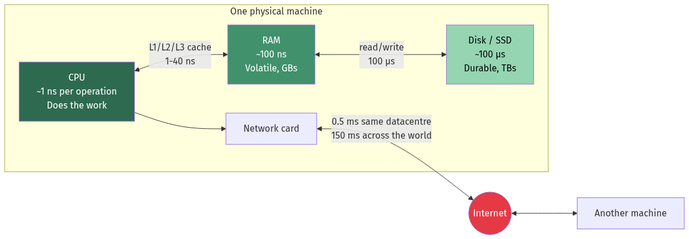

<details>
<summary>Diagram source (Mermaid)</summary>

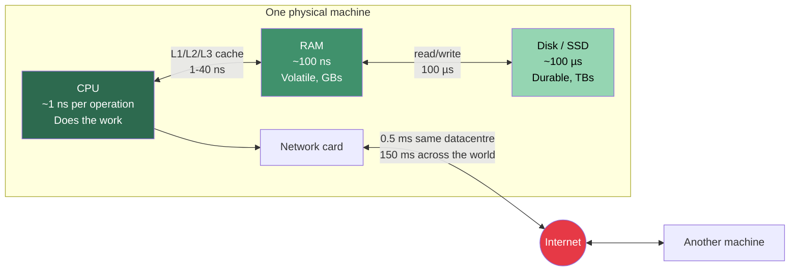

</details>

The single most important thing on this diagram is the **numbers on the arrows**. They span
eight orders of magnitude. Internalise them and half of system design becomes obvious.

---

## Deep dive

### 1.1 The speed of things — the only table you must memorise

These are approximate, order-of-magnitude figures. The absolute values drift as hardware
improves; the **ratios** barely move, and it's the ratios that drive design.

| Operation | Time | If 1 CPU cycle = 1 second… |
| --- | --- | --- |
| 1 CPU cycle | 0.3 ns | 1 second |
| L1 cache reference | 1 ns | 3 seconds |
| Branch mispredict | 3 ns | 10 seconds |
| L2 cache reference | 4 ns | 13 seconds |
| Mutex lock/unlock | 17 ns | 1 minute |
| Main memory (RAM) reference | 100 ns | 5 minutes |
| Compress 1 KB with Snappy | 2 µs | 1.8 hours |
| Read 1 MB sequentially from RAM | 3 µs | 2.8 hours |
| Send 1 KB over 1 Gbps network | 10 µs | 9 hours |
| Read 4 KB randomly from SSD | 150 µs | 5.5 days |
| Read 1 MB sequentially from SSD | 250 µs | 9.6 days |
| Round trip within same datacentre | 500 µs | 19 days |
| Hard disk seek | 10 ms | **1 year** |
| Read 1 MB sequentially from spinning disk | 20 ms | 2 years |
| Round trip California → Netherlands | 150 ms | **15 years** |

📐 **The three ratios that matter:**

- RAM is about **1,000× faster** than SSD. (100 ns vs 100 µs)
- SSD is about **100× faster** than a spinning-disk seek. (100 µs vs 10 ms)
- A local datacentre round trip is about **300× faster** than a transcontinental one.

💡 This is why the answer to "how do I make it faster?" is almost always **"keep it in
RAM, and keep it nearby."** Caching (Chapter 11) is RAM. CDNs (Chapter 11) are nearby.
Replication (Chapter 9) is both.

⚠️ **Sequential vs random matters more than people expect.** Reading 1 MB sequentially
from an SSD takes 250 µs. Reading that same 1 MB as 256 random 4 KB reads takes
256 × 150 µs ≈ 38 ms — **150× slower for the same amount of data.** This single fact is
why log-structured storage engines exist (Chapter 6) and why Kafka is fast (Chapter 12).

### 1.2 What a program actually is

You write a file of text. A **compiler** or **interpreter** turns it into machine
instructions. When you run it, the operating system creates a **process**.

**Process** — a running program, together with everything it owns: its own private region
of memory, its open files, its network connections, and its permissions. Two processes
cannot see each other's memory. If one crashes, the other is unaffected. This isolation is
enforced by the CPU's memory-management hardware, not by politeness.

**Thread** — a single sequence of execution *inside* a process. One process can have many
threads, and **they all share the same memory**. That sharing is what makes threads fast to
create and cheap to communicate between — and it's also what makes concurrent programming
hard, because two threads writing the same variable at the same time produce garbage.

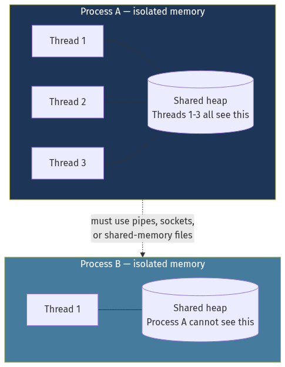

<details>
<summary>Diagram source (Mermaid)</summary>

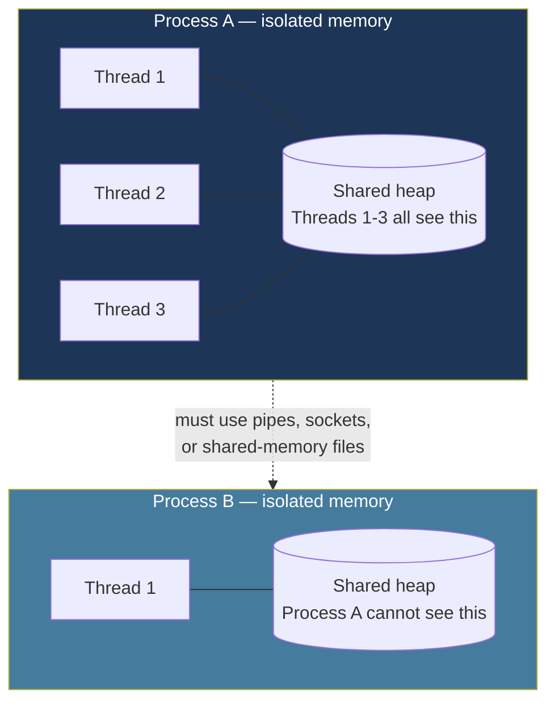

</details>

**Rough costs** (Linux, typical hardware):

| Thing | Creation cost | Memory overhead |
| --- | --- | --- |
| Process | ~1 ms | ~1–10 MB |
| OS thread | ~10–100 µs | ~1–8 MB of stack (mostly virtual) |
| Goroutine / green thread / coroutine | ~1 µs | ~2–8 KB, grows on demand |

That last row is why Go, and languages with similar lightweight-concurrency models, can
handle hundreds of thousands of simultaneous connections on one machine while a
thread-per-connection design in a traditional model tops out in the low thousands.

📐 **Worked check:** 10,000 OS threads × 2 MB of stack = 20 GB of address space. Even
though most of that is virtual and never touched, the **context-switching** cost — the CPU
saving one thread's registers and loading another's — becomes the bottleneck long before
that. 10,000 goroutines × 4 KB = 40 MB. Different universe.

### 1.3 Concurrency is not parallelism

This distinction gets asked in interviews and confused constantly.

**Concurrency** — dealing with many things at once. A structure of your program.
**Parallelism** — doing many things at once. A property of your hardware.

One chef juggling three dishes — starting the pasta, then chopping while it boils, then
returning to the pasta — is **concurrent**. He is never doing two things in the same
instant, but nothing sits idle.

Three chefs each cooking one dish is **parallel**.

A single-core CPU can be concurrent but never parallel. A four-core CPU can be both.
Concurrency is about *not waiting*; parallelism is about *having more hands*.

💡 Most backend performance work is a concurrency problem, not a parallelism problem.
A web server spends the overwhelming majority of its time *waiting* — for the database,
for the disk, for another service. The goal is to stop it sitting idle while it waits.

### 1.4 Blocking vs non-blocking I/O

**I/O** means input/output — reading from disk, sending over the network. It's slow (see
the table above). The question is what your program does while it waits.

**Blocking I/O:** the thread calls `read()` and stops. It is parked by the operating
system, consuming memory but no CPU, until the data arrives. Simple to write. One thread
per concurrent operation.

```
Thread 1: [work 1ms] [======== waiting for DB, 20ms ========] [work 1ms]
Thread 2: [work 1ms] [======== waiting for DB, 20ms ========] [work 1ms]
```
To serve 1,000 concurrent requests, you need 1,000 threads.

**Non-blocking I/O:** the thread says "start this read, and tell me when it's done", then
immediately goes and does something else. The operating system provides a mechanism
(`epoll` on Linux, `kqueue` on BSD/macOS, IOCP on Windows) to ask "which of my 10,000
pending operations have finished?" in one cheap call.

```
Thread 1: [req A work] [req B work] [req C work] [req A resumes] [req B resumes] ...
```
To serve 1,000 concurrent requests, you need **one** thread — as long as none of them
does heavy CPU work.

This is the model behind Node.js, nginx, Redis, and (with the complexity hidden by the
runtime) Go. It is the reason nginx can serve tens of thousands of connections on hardware
where a thread-per-connection server would collapse.

⚠️ **The trap:** in a non-blocking, single-threaded system, *one* slow CPU-bound operation
blocks *everything*. A single request that spends 500 ms computing stalls all 10,000 other
connections for 500 ms. This class of bug is invisible in testing and catastrophic in
production.

### 1.5 What a "server" actually is

The word is overloaded. It means three different things:

1. **A physical machine** in a datacentre — a box with CPUs, RAM and disks.
2. **A program** that waits for incoming requests and responds to them. `nginx` is a
   server. So is PostgreSQL.
3. **A role** in a conversation — the party that responds, as opposed to the client that asks.

When engineers say "add another server," they usually mean sense 1. When they say "the
server returned a 500," they mean sense 2.

A server program does exactly four things in a loop:

```
1. Bind to a port and announce "I am listening here"
2. Wait for a connection
3. Read the request, do work, write the response
4. Go back to step 2
```

Here is a genuinely complete HTTP server in Go — this is not pseudocode, it runs:

```go
package main

import (
    "fmt"
    "net/http"
)

func main() {
    http.HandleFunc("/hello", func(w http.ResponseWriter, r *http.Request) {
        fmt.Fprintf(w, "Hello, %s\n", r.URL.Query().Get("name"))
    })
    // Blocks forever, accepting connections on port 8080.
    http.ListenAndServe(":8080", nil)
}
```

Everything in the following 25 chapters is about what happens when *a lot of people* call
that endpoint.

### 1.6 Addresses, ports and sockets

To send data to a program on another machine you need two pieces of information.

**IP address** — identifies the *machine*. Like a street address for a building.
`142.250.185.78` is IPv4 (four numbers 0–255, about 4.3 billion possible addresses — we
ran out, which is why IPv6 exists with 128-bit addresses).

**Port** — identifies the *program* on that machine. Like an apartment number. A 16-bit
number, so 0–65535.

| Port | Conventionally used by |
| --- | --- |
| 22 | SSH |
| 53 | DNS |
| 80 | HTTP |
| 443 | HTTPS |
| 3306 | MySQL |
| 5432 | PostgreSQL |
| 6379 | Redis |
| 9092 | Kafka |

**Socket** — one end of a connection. A connection is uniquely identified by four things:

```
(source IP, source port, destination IP, destination port)
```

📐 This four-tuple is why a single server on port 443 can hold millions of simultaneous
connections. Every client has a *different* source IP or source port, so every connection
has a different tuple. The "65,535 connection limit" you may have heard is a myth for
servers — it applies to *outbound* connections from one machine to one specific
destination, because that's the only part that varies.

⚠️ **This does bite in one place:** a proxy or load balancer making outbound connections to
a single backend IP:port *is* limited to ~28,000 concurrent connections by default
(the ephemeral port range), and to ~64,000 absolute. This is called **ephemeral port
exhaustion** and it's a real production failure mode. The fixes are connection pooling
(Chapter 4) or giving the proxy multiple source IPs.

### 1.7 The client–server model, and its alternative

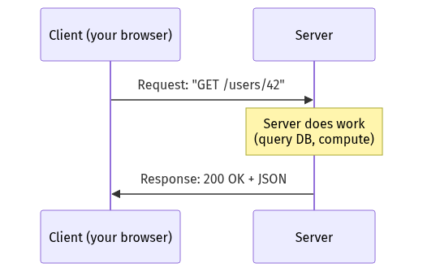

<details>
<summary>Diagram source (Mermaid)</summary>

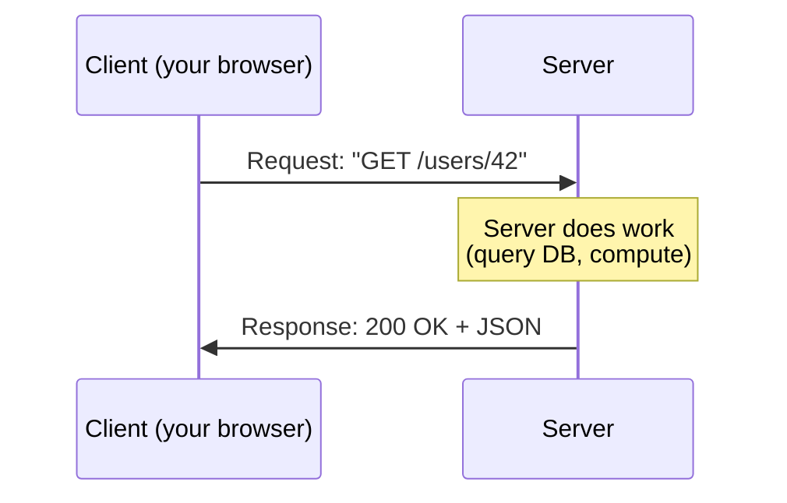

</details>

Key property: **the client initiates**. The server cannot spontaneously push data to a
client in this model — it can only answer. Getting around that limitation is exactly why
WebSockets, Server-Sent Events and long polling exist (Chapter 15).

The alternative is **peer-to-peer**, where every node is both client and server —
BitTorrent, blockchain networks. Vastly harder to reason about, so almost every system in
this book is client–server.

### 1.8 Stateless vs stateful — the most important idea in this chapter

**State** is any information a program remembers between requests.

A **stateful** server remembers things about a specific client in its own memory:

```
Request 1 → Server A:  "log me in"        → Server A stores session in RAM
Request 2 → Server A:  "show my cart"     → works ✓
Request 3 → Server B:  "show my cart"     → "who are you?" ✗
```

A **stateless** server remembers nothing. Every request contains everything needed to
process it, and any shared state lives in an external store:

```
Request 1 → Server A:  "log me in"                    → session written to Redis
Request 2 → Server B:  "show my cart" + session token → Server B reads Redis ✓
Request 3 → Server C:  "show my cart" + session token → Server C reads Redis ✓
```

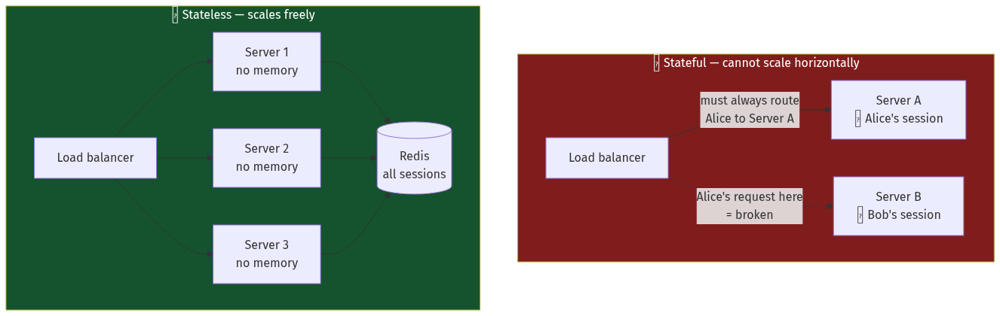

<details>
<summary>Diagram source (Mermaid)</summary>

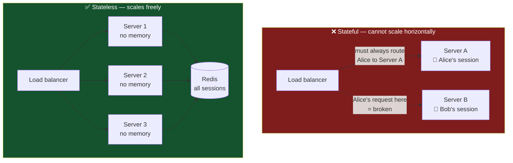

</details>

💡 **Why this is the whole ballgame:** if your servers are stateless, adding capacity is
trivial — start another identical one and point traffic at it. If a server dies, nothing
is lost. If your servers are stateful, every one of those operations becomes a distributed
systems problem.

Almost every scaling technique in this book has "make it stateless" as a precondition.
When you *can't* — databases are inherently stateful — you get Chapter 9.

### 1.9 What actually happens when you type `google.com`

This is the classic interview question, and it's a genuinely excellent one because it
touches every layer. Here is the full path, with a latency budget.

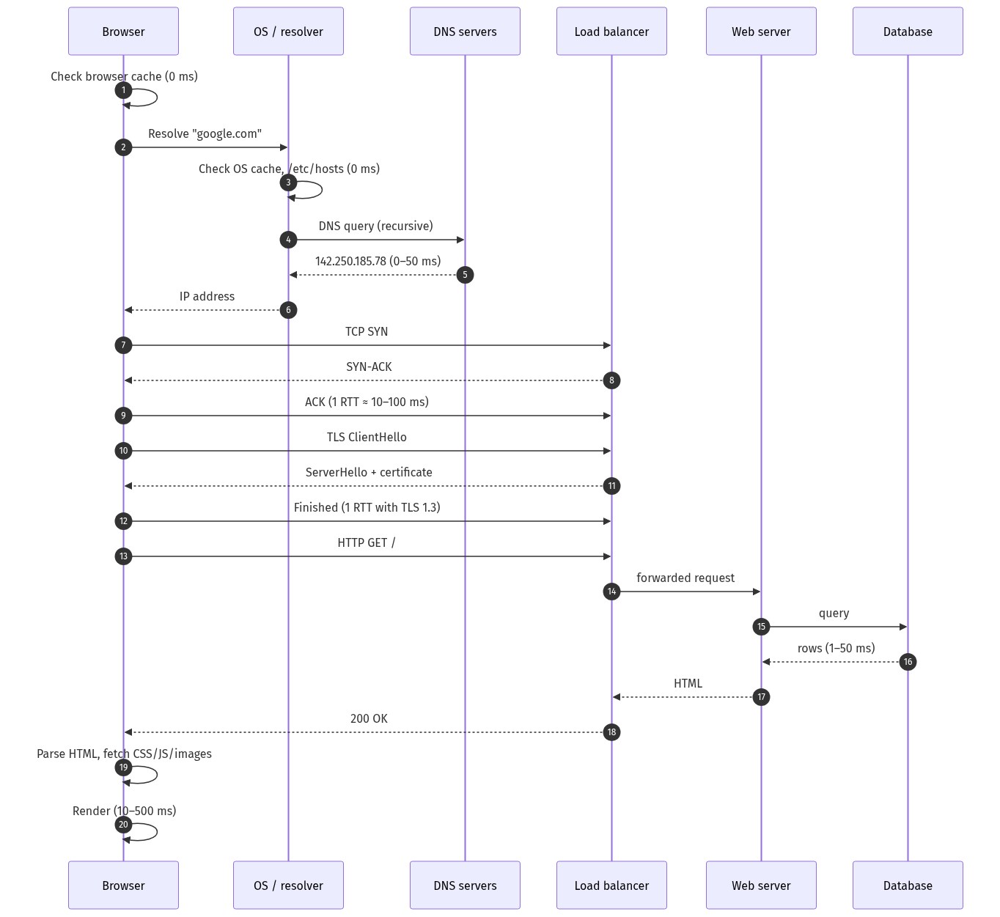

<details>
<summary>Diagram source (Mermaid)</summary>

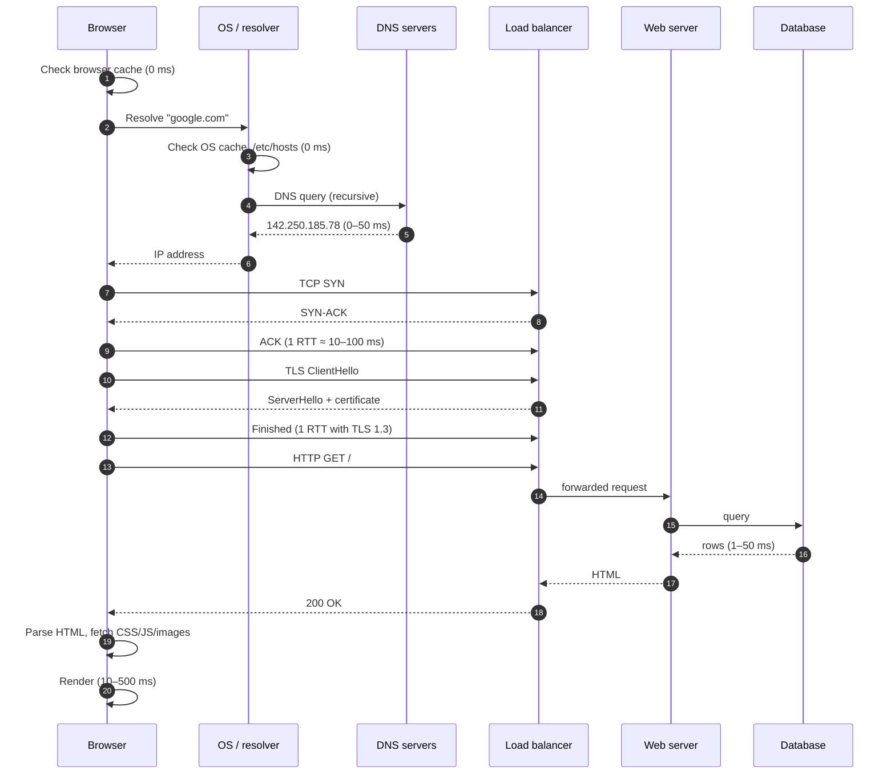

</details>

**Step by step:**

**1. The browser checks its own caches.** Has it resolved this name recently? Does it have
the page cached? If yes, we might be done in 0 ms. This is why caching is chapter 11 and
not chapter 24.

**2. DNS resolution.** `google.com` is a name; the network needs a number. The browser
asks the operating system, which asks a **recursive resolver** (usually your ISP's, or
`8.8.8.8`, or `1.1.1.1`). If the resolver doesn't know, it walks the hierarchy:

```
Resolver → Root servers    : "who handles .com?"
Resolver → .com TLD servers: "who handles google.com?"
Resolver → Google's servers: "what is the A record for google.com?"
                           → 142.250.185.78
```

Every level caches the answer for a **TTL** (time to live). A cold lookup might take
50–200 ms; a warm one is 0 ms. Full detail in [Chapter 4](./04_networking_deep_dive.md).

**3. TCP connection.** Before any data flows, the browser and server perform a **three-way
handshake**: SYN → SYN-ACK → ACK. That costs one full **round trip time (RTT)**. If the
server is 100 ms away, you've spent 100 ms before sending a single byte of your request.

**4. TLS handshake.** For HTTPS, an encrypted channel must be negotiated. TLS 1.3 costs one
more RTT (TLS 1.2 cost two). Now you're 200 ms in, still with zero bytes of content.

📐 This is why **connection reuse matters enormously**. HTTP keep-alive, connection pools
and HTTP/2 multiplexing all exist to amortise these two round trips across many requests.

**5. The HTTP request.** Finally:

```http
GET / HTTP/1.1
Host: google.com
User-Agent: Mozilla/5.0 ...
Accept: text/html
```

**6. The request hits infrastructure, not a server.** In reality it lands on a load
balancer (Chapter 5), which picks a healthy backend. That backend may call a cache, a
database, and half a dozen other services (Chapter 16).

**7. The response comes back**, and the browser parses the HTML, discovers it needs CSS,
JavaScript and images, and repeats steps 2–6 for each of them — which is why the number of
requests a page makes matters as much as their size.

🎯 **Interview note:** the point of this question is not the trivia. It's to see whether
you can hold a whole system in your head and go to the right depth for the interviewer.
Start high-level, then say *"I can go deeper on any of these — DNS, TLS, or the server
side?"* and let them steer.

### 1.10 Why one machine is not enough — the five walls

You have a server. Traffic grows. Something breaks. It will be exactly one of these five
things, and diagnosing *which* is the first skill of performance work.

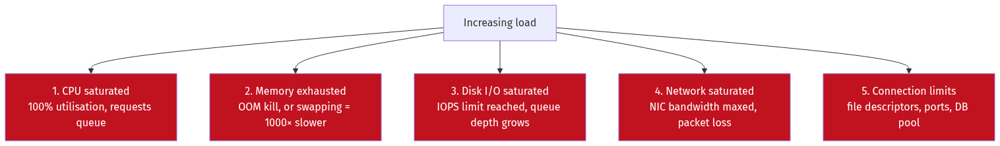

<details>
<summary>Diagram source (Mermaid)</summary>

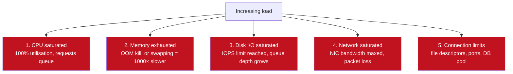

</details>

**Wall 1 — CPU.** You're computing too much: JSON serialisation, encryption, compression,
image resizing, or an accidental O(n²) loop. Symptom: CPU at 100%, latency climbing,
throughput flat. Diagnose with a **profiler** (Chapter 19).

**Wall 2 — Memory.** Two failure modes, and they look completely different:
- **Out of memory (OOM):** the kernel kills your process outright. Abrupt, obvious.
- **Swapping:** the OS starts using disk as pretend-RAM. Everything becomes 1,000× slower
  but nothing crashes. This is far worse — a slow system is harder to detect and harder to
  recover than a dead one.

**Wall 3 — Disk I/O.** Disks have a hard ceiling on **IOPS** (I/O operations per second).

| Storage | Random IOPS | Sequential throughput |
| --- | --- | --- |
| 7200 RPM hard disk | ~100 | ~150 MB/s |
| SATA SSD | ~50,000–90,000 | ~550 MB/s |
| NVMe SSD | ~500,000–1,000,000 | 3–7 GB/s |
| AWS gp3 EBS volume (default) | 3,000 (provisionable to 16,000) | 125 MB/s (to 1,000) |

⚠️ That last row catches people constantly. A cloud disk is a *network* device with a
*billed* IOPS budget. Exceeding it doesn't error — it silently queues, and your P99 latency
goes from 5 ms to 5 seconds.

**Wall 4 — Network.** A 1 Gbps link carries at most 125 MB/s. A 10 Gbps link, 1.25 GB/s.

📐 If you serve a 2 MB image, a 1 Gbps link supports 125 MB/s ÷ 2 MB = **62 requests per
second**. Not 62,000. Sixty-two. This is why static assets go on a CDN.

**Wall 5 — Connections.** Every open connection consumes a **file descriptor**. Linux
defaults to 1,024 per process — trivially low. Databases have their own hard limit
(PostgreSQL defaults to 100 connections, and each one costs several megabytes).

⚠️ The classic cascade: 50 app servers × a pool of 20 connections each = 1,000 connections
demanded from a database configured for 100. Nine hundred requests fail instantly. The fix
is a connection **pooler** like PgBouncer (Chapter 7), not a bigger database.

### 1.11 The two ways out

Once you hit a wall you have exactly two options, and the rest of this book elaborates on
both.

**Scale up (vertical):** buy a bigger machine. Simple, immediate, requires zero code
change — and hits a hard ceiling. There is a largest machine money can buy, and the price
curve is super-linear: doubling the cores usually more than doubles the cost.

**Scale out (horizontal):** buy more machines. Effectively unlimited, and gives you fault
tolerance for free — but now you have a **distributed system**, and distributed systems
fail in ways single machines never do. Chapters 9, 10 and 21 exist entirely because of
this choice.

[Chapter 2](./02_scalability_and_estimation.md) takes this apart properly.

### 1.12 Inside the CPU: caches, cache lines and why your code is slower than you think

§1.1 said RAM takes 100 ns and L1 cache takes 1 ns. That 100× gap is the most important
performance fact in single-machine programming, and it is invisible in your source code.

Modern CPUs have a hierarchy:

| Level | Size | Latency | Shared between |
| --- | --- | --- | --- |
| Registers | ~1 KB | 0 cycles | Nothing — per core |
| L1 data cache | 32–48 KB | ~4 cycles (~1 ns) | One core |
| L2 cache | 512 KB – 2 MB | ~14 cycles (~4 ns) | One core (usually) |
| L3 cache | 8–64 MB | ~50 cycles (~15 ns) | **All cores on a socket** |
| Main memory | GBs | ~200 cycles (~80–100 ns) | Everything |

#### The cache line

The CPU never fetches a byte. It fetches a **cache line** — **64 bytes** on essentially every
x86 and ARM processor in production.

💡 **This means reading one `int` costs you the same as reading the sixteen `int`s next to
it.** Which is why data layout, not algorithmic complexity, often decides performance.

📐 **Worked example — the same algorithm, 10× apart.**

Summing a 2D array of 10,000 × 10,000 `int32` (400 MB):

```
Row-major traversal (a[i][j], j innermost — matches memory layout):
  Each 64-byte cache line holds 16 ints; 1 miss serves 16 accesses.
  Cache misses = 100,000,000 / 16 = 6,250,000
  Time ≈ 6.25M × 100 ns = 0.63 seconds

Column-major traversal (a[j][i] — strides 40,000 bytes each step):
  Every single access lands on a different cache line. Every access misses.
  Cache misses = 100,000,000
  Time ≈ 100M × 100 ns = 10 seconds
```

**Identical big-O. 16× the runtime.** The loop order is the entire difference.

#### Arrays vs linked lists — the practical consequence

| | Array of 1M ints | Linked list of 1M ints |
| --- | --- | --- |
| Memory layout | Contiguous | Scattered across the heap |
| Traversal cache misses | ~62,500 | ~1,000,000 |
| Traversal time | ~6 ms | ~100 ms |
| Big-O | O(n) | O(n) |

⚠️ This is why `std::vector` beats `std::list` for traversal even when the textbook says
they're equivalent, and why "array of structs vs struct of arrays" is a real design decision
in performance-sensitive code. It's also why Go slices, Java's `ArrayList` and Python's
`list` are all array-backed.

#### ⚠️ False sharing — the concurrency bug that looks like magic

Two threads write to two *different* variables. No lock, no shared data, no bug. And yet
the code is 10× slower than single-threaded.

```go
type Counters struct {
    a int64  // written only by goroutine 1
    b int64  // written only by goroutine 2
}
// a and b are 8 bytes apart → SAME 64-byte cache line.
```

Because cache coherency operates on **whole lines**, every write by thread 1 invalidates
thread 2's copy of the line, and vice versa. The line ping-pongs between cores at ~50–100 ns
per bounce. This is **false sharing**: the threads share no data, but they share a cache line.

**The fix is padding:**

```go
type Counters struct {
    a int64
    _ [56]byte // pad to a full 64-byte cache line
    b int64
    _ [56]byte
}
```

💡 Go's runtime, the Linux kernel and every high-performance concurrent data structure do
this deliberately. Go even exposes `golang.org/x/sys/cpu.CacheLinePad` for it. If you ever
see a struct with mysterious padding fields, this is why.

#### NUMA

On multi-socket servers, memory is physically attached to a specific CPU socket.
**Non-Uniform Memory Access** means reading memory attached to *your* socket costs ~80 ns;
reading memory attached to the *other* socket costs ~140 ns and consumes the inter-socket
link.

⚠️ A database process that allocates all its memory on socket 0 but runs threads on both
sockets will see roughly half its memory accesses at the remote latency. This is why
PostgreSQL, Redis and JVM tuning guides discuss `numactl`, and why cloud instances larger
than one socket sometimes perform *worse* per core than smaller ones.

### 1.13 How the operating system decides who runs

You have 8 cores and 500 runnable threads. Something must choose.

The **scheduler** maintains run queues and gives each thread a **time slice** (Linux CFS:
typically 1–10 ms, adaptive). When the slice expires — or the thread blocks on I/O — the
kernel performs a **context switch**.

**What a context switch actually costs:**

| Component | Cost |
| --- | --- |
| Save/restore registers | ~100 ns |
| Kernel bookkeeping | ~1 µs |
| **TLB and cache pollution** | **~10–100 µs of degraded performance afterwards** |

⚠️ The direct cost is small; the *indirect* cost dominates. The incoming thread finds the L1
and L2 caches full of the previous thread's data, so it runs slowly until it re-warms them.
This is why the total cost of a context switch is usually quoted as several microseconds
rather than the ~1 µs of actual switching.

📐 **Worked consequence:**
```
1,000 threads each doing 10 µs of work between blocking calls:
  Useful work per switch:  10 µs
  Switch overhead:         ~5 µs
  Efficiency: 10/15 = 67%  ⚠️ a third of your CPU is spent switching

Same work in 8 goroutines on 8 OS threads:
  Goroutine switch happens in userspace: ~0.2 µs, no kernel transition, no TLB flush
  Efficiency: 10/10.2 = 98%
```

💡 **This is the whole argument for green threads / goroutines / async runtimes.** They
schedule in userspace, so switching between concurrent tasks avoids the kernel entirely.
Go's scheduler is often described as **M:N** — M goroutines multiplexed onto N OS threads —
with **work stealing**: an idle processor steals tasks from a busy one's queue rather than
sitting idle.

**Voluntary vs involuntary switches** is a useful diagnostic distinction:

| Type | Cause | Seen in |
| --- | --- | --- |
| **Voluntary** | Thread blocked on I/O, lock, or `sleep` | Healthy for I/O-bound work |
| **Involuntary** | Time slice expired; preempted | High values mean **CPU contention** |

`pidstat -w` or `/proc/<pid>/status` shows both. High involuntary switches with high CPU is
the signature of too many runnable threads for the cores available — the fix is fewer
threads, not more.

### 1.14 Filesystems in ninety seconds

Between your `write()` call and the disk sits a filesystem, and three of its concepts leak
into system design.

**Inodes.** A file's *metadata* — size, permissions, timestamps, and pointers to its data
blocks — lives in an **inode**. The filename is separate: a directory is just a table mapping
names to inode numbers.

⚠️ **Consequences that surprise people:**
- Two names can point to the same inode (a **hard link**). "Deleting" a file only removes a
  directory entry; the data survives until the last link *and* the last open file descriptor
  are gone. This is why deleting a huge log file doesn't free space while a process still has
  it open — you must restart the process or truncate the file.
- **You can run out of inodes while the disk shows free space.** A filesystem with millions
  of tiny files hits the inode limit first. `df -i` shows this; `df -h` does not. It presents
  as "No space left on device" on a disk that is 40% full.

**The page cache.** The kernel caches file contents in otherwise-free RAM. This is why the
*second* read of a file is 1,000× faster than the first, and why "free" memory on a healthy
Linux server is near zero — the kernel is using it as cache, and will evict it instantly if
you need it.

⚠️ This also means your benchmarks lie. A test that reads the same 1 GB file repeatedly is
measuring RAM, not disk. Drop the cache (`echo 3 > /proc/sys/vm/drop_caches`) or use a
dataset larger than RAM.

**Journalling.** After a crash, a filesystem must not be left half-updated. A **journal**
records intended metadata changes before applying them — the same write-ahead logging idea
that databases use ([Chapter 6](./06_storage_engines_internals.md) §6.7). `ext4`'s default
(`data=ordered`) journals metadata only, which is why a crash can leave a file with the
right size but garbage contents unless the application called `fsync`.

### 1.15 Bytes on the wire: encoding and serialisation

Two machines must agree on what a sequence of bytes means.

**Text encodings.** ASCII covers 128 characters in 1 byte. **UTF-8** encodes all of Unicode
in 1–4 bytes, and is backwards-compatible with ASCII — which is why it won.

⚠️ Three bugs that come from ignoring this:
- **Length is not character count.** `"café"` is 4 characters but 5 bytes in UTF-8. A
  `VARCHAR(4)` column, a 4-byte buffer, or a substring operation at byte offsets will corrupt
  it.
- **MySQL's `utf8` is not UTF-8.** It is a 3-byte subset that cannot store emoji or many CJK
  characters. The real one is `utf8mb4`. This has caused a genuinely large number of
  production incidents.
- **Byte order (endianness)** matters for binary protocols. Network byte order is big-endian;
  x86 is little-endian. Every binary protocol must specify which.

**Serialisation formats** — the trade space:

| Format | Size (relative) | Human-readable | Schema | Speed |
| --- | --- | --- | --- | --- |
| JSON | 1.0× (baseline) | ✅ | Optional | Slow (text parsing) |
| XML | ~1.5× | ✅ | XSD | Slowest |
| MessagePack / CBOR | ~0.6× | ❌ | No | Fast |
| **Protocol Buffers** | **~0.2–0.3×** | ❌ | **Required** | Very fast |
| Avro | ~0.2× | ❌ | Required, ships with data | Very fast |
| FlatBuffers / Cap'n Proto | ~0.3× | ❌ | Required | **Zero-copy — no parse step** |

📐 **Why the size difference matters more than it looks:**
```
1 million events/second, 500-byte JSON payloads:
  JSON:     500 MB/s of network — needs a 10 Gbps link (4 Gbps used)
  Protobuf: 125 MB/s           — comfortable on 1 Gbps

Plus: JSON parsing costs roughly 100 ns per field. At 20 fields and 1M events/s,
that's 2 CPU-seconds per second — two full cores spent on parsing alone.
```

💡 **The rule of thumb this book uses:** JSON at the edge (browsers, public APIs,
debuggability) and a binary schema format internally (service-to-service, storage, streams).
[Chapter 15](./15_apis_and_protocols.md) decodes the protobuf wire format byte by byte.

---

## Worked example — sizing your first server

*A photo-sharing app. 100,000 daily active users. Each opens the app 5 times a day and
views 20 photos per session. Average photo size after compression: 300 KB. Can one server
handle it?*

**Step 1 — requests per day.**
```
100,000 users × 5 sessions × 20 photos = 10,000,000 photo requests/day
```

**Step 2 — average requests per second.**
```
10,000,000 ÷ 86,400 seconds ≈ 116 requests/second
```

**Step 3 — peak requests per second.** Traffic is never flat. A common rule of thumb is
that peak is 2–5× the average; for a consumer app with evening usage, use 3×.
```
116 × 3 ≈ 350 requests/second at peak
```

**Step 4 — check each wall.**

*Network:*
```
350 req/s × 300 KB = 105 MB/s
A 1 Gbps NIC delivers 125 MB/s.
→ 84% utilisation. ❌ FAILS. Any spike drops packets.
```

*Disk I/O (if photos are read from local SSD):*
```
350 random reads/second against a SATA SSD (~50,000 IOPS)
→ 0.7% utilisation. ✅ Fine.
```

*CPU:* serving a static file is nearly free — a few hundred microseconds each.
```
350 × 0.5 ms = 0.175 CPU-seconds per second → 18% of one core. ✅ Fine.
```

*Memory:* if we cache the hot 10% of photos:
```
Total photos ≈ 100,000 users × 200 photos = 20,000,000 photos
Hot 10% = 2,000,000 × 300 KB = 600 GB. ❌ Won't fit in RAM.
Cache the hot 0.1% instead: 20,000 × 300 KB = 6 GB. ✅ Fits.
```

**Step 5 — the verdict.** The bottleneck is the **network**, at 84% of a 1 Gbps link. Not
CPU, not disk. And that's the average day — a viral post breaks it instantly.

**Step 6 — the fix.** Do not buy a bigger server. Put the photos on a **CDN** (Chapter 11).
The CDN serves 95%+ of image requests from an edge location near the user, which:
- drops origin bandwidth from 105 MB/s to ~5 MB/s (4% utilisation ✅)
- cuts user-perceived latency from ~150 ms to ~20 ms
- costs less than the bandwidth would have

💡 **This is the shape of almost every real system design answer:** estimate, find the
binding constraint, then remove that specific constraint. Not "add more servers."

---

## Trade-offs

| Decision | Option A | Option B | Choose A when | Never choose A when |
| --- | --- | --- | --- | --- |
| Concurrency model | Thread per request | Event loop / async | Work is CPU-bound; code simplicity matters; concurrency < ~1,000 | You need > 10,000 concurrent connections |
| State location | In server memory | External store (Redis/DB) | Single server, prototype, data is disposable | You have more than one server. Which you will. |
| Storage | Local disk | Network storage (EBS/S3) | You need > 100k IOPS; latency-critical | Data must survive the machine dying |
| Growth | Scale up | Scale out | Under ~$5k/month of hardware; team is small; workload is inherently single-node (e.g. a write-heavy SQL primary) | You need availability during a machine failure |
| Protocol | HTTP/1.1 | HTTP/2 | Debuggability matters; clients are dumb | Many small assets over one connection |

---

## How real companies do it

**Stack Overflow** famously ran one of the world's top-50 websites on **nine web servers
and one SQL Server primary** for years. Their published numbers: ~6,000 requests/second
peak, with the database server sitting around 5% CPU. Their approach was ruthless vertical
scaling plus obsessive caching — a direct rebuttal to the idea that scale requires
microservices. Read their architecture posts before you split anything.

**WhatsApp** in 2012 served 2 million concurrent TCP connections **on a single server**,
using Erlang's lightweight processes (the same idea as goroutines, taken further). At
acquisition they had ~450 million users and ~32 engineers. Their trick was not clever
distribution — it was choosing a runtime whose concurrency primitive cost kilobytes
instead of megabytes.

**Google** publishes the latency numbers in §1.1 (originally compiled by Jeff Dean) as
internal training material, precisely because engineers who don't know them design systems
that make a network call inside a loop.

**Netflix** moved essentially all bytes to their own CDN (Open Connect), with appliances
installed inside ISP networks. At peak they are a double-digit percentage of North American
internet traffic. Their origin serves almost none of it — the same Wall 4 fix as our
worked example, at planetary scale.

---

## Common mistakes

**Making a network call inside a loop.** A local function call is ~1 ns. A network call is
~500,000 ns. Putting one inside a loop over 1,000 items turns a 1 µs operation into 500 ms.
This is the **N+1 query problem** and it is the single most common performance bug in
existence. Fix: batch the call (Chapters 7 and 15).

**Assuming the network is reliable.** It is not. It drops packets, reorders them, delays
them for seconds, and partitions. Any code that calls another machine must have a
**timeout**, and most must have a **retry**. Code without a timeout will eventually hang
forever. (See the eight fallacies in [Chapter 21](./21_distributed_systems_theory_consensus.md).)

**Storing session state in server memory.** It works perfectly on your laptop and on the
single staging server, and breaks the moment a second production instance appears — with
symptoms ("users randomly logged out") that look nothing like the cause.

**Confusing bandwidth with latency.** They are independent. A satellite link can have huge
bandwidth (a lot of data per second) and terrible latency (600 ms per round trip). Adding
bandwidth does not make a chatty protocol fast; reducing round trips does.

**Optimising the wrong wall.** Adding CPU when you're disk-bound, or RAM when you're
network-bound, achieves precisely nothing and costs money. Measure first. Always.

**Ignoring P99.** Your average response time can be 50 ms while 1% of users wait 5 seconds.
At 100 requests per page load, *most page loads* contain at least one of those. Chapter 3
does the math.

---

## Interview angle

**Q: What happens when you type google.com and press Enter?**

*Weak answer:* "It sends a request to Google's server and gets back the page."

*Strong answer:* Walk the layers with a latency budget — browser cache, DNS resolution
(recursive, with TTL caching at each level), TCP three-way handshake costing one RTT, TLS
1.3 handshake costing another, the HTTP request landing on a load balancer rather than an
origin server, the backend fanning out to caches and databases, then the response and the
browser's subsequent asset fetches. Then offer: *"The interesting part is that we've spent
two round trips before sending a byte of content — which is exactly why connection reuse
and HTTP/2 exist. Want me to go deeper on the DNS side or the TLS side?"*

**Q: What's the difference between a process and a thread?**

*Strong answer:* A process has isolated memory; threads within a process share memory.
That makes threads cheap to create (~10 µs vs ~1 ms) and cheap to communicate between (a
shared variable vs a pipe), at the cost of needing synchronisation. Add the practical
consequence: a crash kills the whole process including all its threads, which is why
worker-process models (nginx, Chrome tabs) trade some efficiency for isolation.

**Q: Why can't you just buy a bigger server?**

*Strong answer:* Three reasons. (1) There is a physical ceiling — the largest cloud
instances top out around 448 vCPUs and 24 TB of RAM. (2) The price curve is super-linear;
you pay a large premium for the biggest machine. (3) Most importantly, one machine is one
failure domain — no amount of vertical scaling gives you availability during a hardware
failure or a kernel panic. Then add the honest caveat: vertical scaling is *underrated*,
and companies split into microservices far earlier than they need to.

**Q: What's the difference between concurrency and parallelism?**

*Strong answer:* Concurrency is a structural property of your program — dealing with
multiple things by interleaving. Parallelism is a hardware property — actually executing
simultaneously. A single core can be concurrent but not parallel. Then make it concrete:
backend services are usually I/O-bound, so what you need is concurrency (don't idle while
waiting), not parallelism (more cores won't help you wait faster).

**Q: A server is slow. How do you find out why?**

*Strong answer:* Name the five resources and check them in order of likelihood — CPU
(`top`, then a profiler), memory (RSS growth, swap activity, OOM logs), disk
(`iostat` — look at await and utilisation, not just throughput), network (`ss`, NIC
counters, retransmits), and connection limits (file descriptors, DB pool saturation).
Emphasise: measure before changing anything, and check whether it's the *server* that's
slow or something it's waiting on.

**Q: Two threads increment two separate counters with no locks. Why might this be slower than one thread?**

*Strong answer:* **False sharing.** The CPU's cache coherency protocol operates on 64-byte
cache lines, not individual variables. If the two counters are adjacent in memory they land
on the same line, so every write by one core invalidates the other core's copy. The line
ping-pongs between cores at 50–100 ns per bounce, and you can end up slower than
single-threaded despite there being no logical contention at all. The fix is padding each
counter to its own cache line — which is exactly why you see mysterious padding fields in
the Linux kernel, in Go's runtime, and in any high-performance concurrent data structure.

**Q: Why can two implementations of the same O(n) algorithm differ by 10×?**

*Strong answer:* **Memory locality.** Big-O counts operations and assumes every memory access
costs the same, which is false by two orders of magnitude — L1 cache is ~1 ns, main memory
is ~100 ns. The CPU fetches 64-byte cache lines, so sequential access amortises one miss
across sixteen 4-byte values while random access misses on every one. Traversing a
contiguous array versus a linked list of the same length is roughly 6 ms versus 100 ms for a
million elements. Same complexity, sixteenfold difference in cache misses. This is why array
traversal order matters, why `std::vector` beats `std::list` in practice, and why data
layout is a real design decision rather than a micro-optimisation.

**Q: You have 10,000 concurrent requests. Would you use 10,000 threads?**

*Strong answer:* No, for two reasons. Memory: 10,000 OS threads at 1–8 MB of stack each is
tens of gigabytes of address space. But the binding constraint is **context switching** —
the direct cost is about a microsecond, but the real cost is cache and TLB pollution, so the
incoming thread runs slowly until it re-warms L1 and L2. With more runnable threads than
cores you spend a large fraction of CPU switching rather than working. The right model is a
small number of OS threads — roughly one per core — with either non-blocking I/O and an
event loop, or userspace green threads like goroutines that switch in ~200 ns without a
kernel transition. One caveat: if the work is genuinely CPU-bound rather than I/O-bound,
neither helps; you need more cores or less work.

**Q: Why would you use Protocol Buffers instead of JSON?**

*Strong answer:* Size and parse cost. Protobuf payloads are typically 3–5× smaller because
fields are identified by integer tags rather than repeated string keys, and integers are
varint-encoded. At a million events per second with 500-byte JSON payloads, that's 500 MB/s
of network versus about 125 MB/s — the difference between needing 10 Gbps and being fine on
1 Gbps. And JSON parsing costs roughly 100 ns per field, so twenty fields at a million
events per second is two full CPU cores spent parsing. The trade-off is that protobuf isn't
human-readable and requires schema distribution, so the usual answer is JSON at the edge for
debuggability and public APIs, binary internally.

**Q: `df -h` shows 40% free but writes fail with "No space left on device". What's happening?**

*Strong answer:* Most likely **inode exhaustion** — check `df -i`. Every file consumes an
inode, and the inode table is fixed at filesystem creation, so millions of tiny files can
exhaust it while blocks remain free. The other candidate is a **deleted-but-open file**: if
a process still holds a file descriptor, unlinking it removes the directory entry but not
the data, so the space isn't reclaimed until the process closes it or exits. `lsof +L1`
finds these. It's the classic "we deleted the huge log file and nothing happened" situation —
you have to truncate the file or restart the process rather than `rm` it.

---

## Recap

- A computer is a fast chef (CPU), a small counter (RAM), a slow freezer (disk), and a
  very slow delivery truck (network). Spanning **eight orders of magnitude**.
- **RAM is 1,000× faster than SSD. Sequential I/O is ~150× faster than random.** These two
  ratios explain most storage design.
- A **process** has isolated memory; **threads** share it. Lightweight coroutines cost
  kilobytes where OS threads cost megabytes.
- **Concurrency** (not idling) ≠ **parallelism** (more hands). Backends usually need the
  former.
- A connection is a four-tuple of (source IP, source port, dest IP, dest port) — which is
  why servers can hold millions of connections but *outbound* connections to one
  destination cap out around 28,000.
- **Stateless servers can be added and removed freely. Stateful ones cannot.** This
  property underpins nearly every scaling technique in this book.
- A single machine hits exactly **five walls**: CPU, memory, disk IOPS, network bandwidth,
  connection limits. Identify which one before spending money.
- The two escapes are **scale up** (simple, capped, single failure domain) and **scale out**
  (unbounded, fault-tolerant, and now you own a distributed system).
- The CPU fetches **64-byte cache lines**, so memory *layout* changes runtime by 10× at
  identical big-O. Adjacent variables written by different cores cause **false sharing**.
- A **context switch** costs ~1 µs directly and ~10–100 µs indirectly through cache
  pollution — which is why userspace scheduling (goroutines, async) exists.
- **Inodes** are separate from filenames: you can exhaust inodes with free blocks, and an
  open deleted file holds its space.
- **UTF-8 length ≠ character count**, and MySQL's `utf8` isn't UTF-8 — it's `utf8mb4`.
- **Binary serialisation is 3–5× smaller and far cheaper to parse** than JSON. Text at the
  edge, binary internally.

---

## Test yourself

1. If RAM access is 100 ns and an SSD read is 150 µs, how many RAM accesses fit in the time
   of one SSD read?
2. Your service returns 50 KB JSON responses over a 1 Gbps link. What is the maximum
   requests per second before the network saturates?
3. Why can a server hold 1,000,000 inbound connections on port 443, but a proxy can only
   open about 28,000 outbound connections to a single backend?
4. You store a user's shopping cart in a Go map in the web server's memory. Everything
   works. You add a second server behind a load balancer. Describe precisely what the user
   experiences and why.
5. A single-threaded event-loop server handles 10,000 connections happily. One endpoint
   starts doing 200 ms of image resizing per request, called 5 times a second. What happens
   to the other 9,995 connections?
6. Reading 1 MB sequentially from SSD takes 250 µs. Reading it as 4 KB random reads takes
   150 µs each. How much slower is the random version, and what design principle follows?
7. You sum a 10,000 × 10,000 `int32` matrix. Iterating rows-then-columns takes 0.6 s;
   columns-then-rows takes 10 s. Same algorithm, same data. Explain the 16× gap numerically.
8. Your monitoring shows 40,000 involuntary context switches per second on an 8-core box with
   CPU at 100%. What does "involuntary" tell you, and what is the fix?
9. A colleague adds `_ [56]byte` padding fields between two counters in a struct and
   throughput doubles. What was the bug?
10. Your service emits 2 million events per second as JSON, 400 bytes each, over a 10 Gbps
    link, and CPU is pinned at 100% with the profiler showing JSON encoding on top. Quantify
    both problems and propose a fix.

<details>
<summary>Answers</summary>

1. 150 µs ÷ 100 ns = **1,500 RAM accesses**. This is why a cache miss that goes to disk is
   worth avoiding even at the cost of significant extra computation.

2. 125 MB/s ÷ 50 KB = **2,500 requests/second**. Note this is a hard ceiling independent of
   how fast your code is. If you need more, you compress (gzip/brotli typically gets JSON
   down 70–90%), return less data, or add links.

3. Inbound connections are distinguished by the *client's* IP and port, which vary freely
   across millions of clients. Outbound connections to one fixed (dest IP, dest port) can
   only vary the *source port*, and Linux's default ephemeral range is roughly
   32768–60999 ≈ 28,000 ports. Fixes: connection pooling and reuse, multiple source IPs, or
   `SO_REUSEPORT` with distinct destinations.

4. Roughly half of requests appear to have an empty cart, non-deterministically, depending
   on which server the load balancer picks. Items "disappear" and "reappear". The cause is
   state held in a single server's memory while requests are distributed across servers.
   Fix: move the cart to Redis or a database, making the servers stateless.

5. 5 requests/second × 200 ms = **1 full second of CPU work demanded per second** on a
   single-threaded loop. The event loop is saturated: all 10,000 connections see latency
   spike into the seconds, and the server appears to hang despite low apparent request
   volume. Fix: move CPU-bound work to a worker pool, a separate process, or a background
   queue (Chapter 12).

6. 1 MB as 256 random 4 KB reads = 256 × 150 µs = 38.4 ms, versus 250 µs sequential —
   **~150× slower**. Principle: **design for sequential access**. This is the entire
   justification for log-structured storage (Chapter 6), append-only commit logs
   (Chapter 12), and why databases read whole pages rather than individual rows.

7. A cache line is 64 bytes = 16 `int32` values. Row-major traversal matches the memory
   layout, so one cache miss serves 16 accesses: 100,000,000 / 16 = **6.25 million misses**.
   Column-major strides 10,000 × 4 = 40,000 bytes per step, so every access lands on a new
   line: **100 million misses**. At ~100 ns each that's 0.63 s versus 10 s — a 16× gap that
   is exactly the 16 values per cache line. (In practice hardware prefetching helps the
   sequential case further, widening the gap.)

8. **Involuntary** switches mean threads are being *preempted* because their time slice
   expired, not because they blocked on I/O. Combined with 100% CPU, that means you have far
   more runnable threads than cores and the scheduler is thrashing — a meaningful fraction of
   CPU is going to switching and post-switch cache re-warming rather than work. **Fix: reduce
   concurrency**, not increase it. Cap the worker pool near the core count and use
   non-blocking I/O or green threads for concurrency. Adding threads here makes it strictly
   worse.

9. **False sharing.** The two counters were within the same 64-byte cache line, so although
   the threads shared no logical data, every write by one core invalidated the other core's
   cached copy, bouncing the line between cores at 50–100 ns per bounce. Padding each counter
   onto its own cache line eliminates the coherency traffic. Note this is a *hardware*
   effect — nothing in the source code suggests the variables interact.

10. **Network:** 2,000,000 × 400 B = 800 MB/s = 6.4 Gbps against a 10 Gbps (1.25 GB/s) link —
    **64% utilisation**, past the point where bursts cause loss.
    **CPU:** JSON encoding at roughly 100 ns per field × ~20 fields = 2 µs per event × 2M/s =
    **4 CPU-seconds per second**, i.e. four cores doing nothing but serialisation.
    **Fix:** switch to a binary schema format — Protocol Buffers or Avro. Payloads drop to
    roughly 100–120 bytes (≈5×), taking network to ~1.6 Gbps, and encoding cost falls by
    roughly an order of magnitude because there's no text formatting or key repetition.
    Compression (Snappy/ZSTD) on top would help the network further but adds CPU, so measure
    which resource is actually binding first.

</details>

---

## Further reading

- Jeff Dean, *Latency Numbers Every Programmer Should Know* — the source of §1.1
- Brendan Gregg, *Systems Performance* — chapters 5–9 for CPU, memory, disk and network in depth
- *The C10K Problem* (Dan Kegel, 1999) — the essay that started the shift to event-driven servers
- Stack Overflow's architecture posts by Nick Craver — vertical scaling done seriously

---

[← Contents](./README.md) · [Next: Chapter 2 — Scalability and Estimation →](./02_scalability_and_estimation.md)
