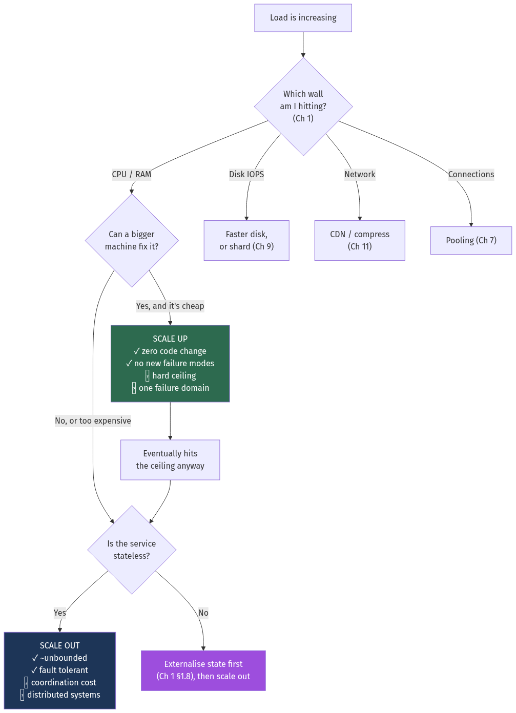
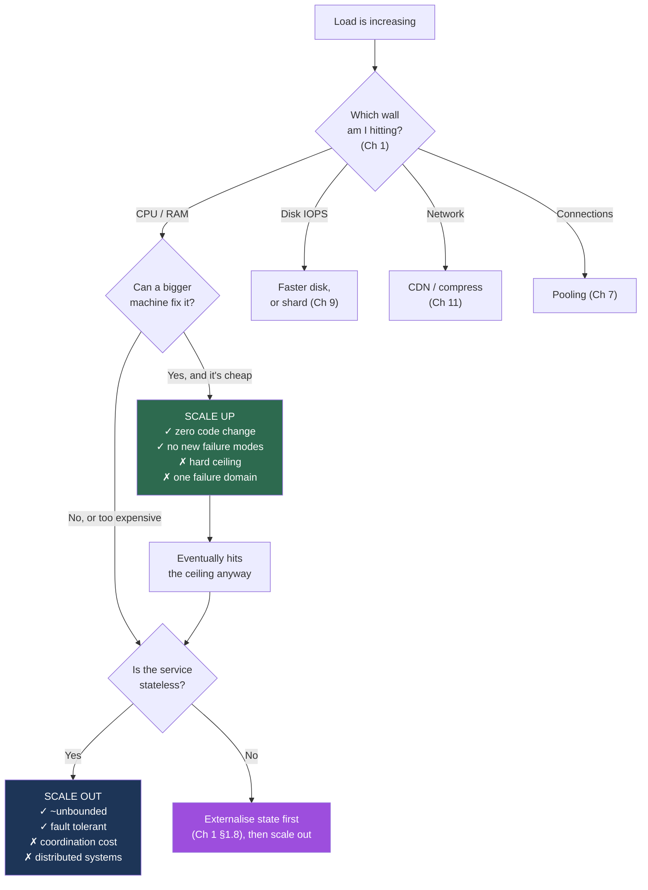
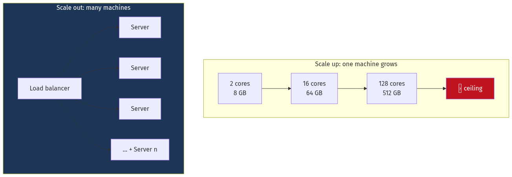
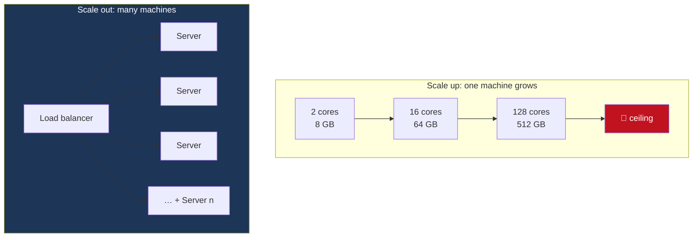

# Chapter 2 — Scalability and Back-of-the-Envelope Estimation

[← Chapter 1](./01_from_zero_computers_networks_web.md) · [Contents](./README.md) · [Next: Chapter 3 →](./03_reliability_availability_performance.md)

**Prerequisites:** [Chapter 1](./01_from_zero_computers_networks_web.md) — you need the latency table and the five walls.

---

## What you'll learn

- The precise difference between scaling **up** and scaling **out**, including the exact point where the price curve makes the decision for you
- How to estimate queries per second, storage, bandwidth and memory for any system in under five minutes, with six fully worked examples
- **Little's Law** — the one formula that lets you size a thread pool, a connection pool, or a queue correctly instead of guessing
- **Amdahl's Law** and the **Universal Scalability Law** — why adding servers stops helping, and why it eventually makes things *worse*
- Why a system at 80% utilisation has *five times* the latency of one at 50%, and what that means for capacity planning

---

## Start from zero

You run a coffee shop with one barista. She serves 30 customers an hour. The queue is
getting long. You have two choices.

**Option A: train her.** Send her on a course, buy a faster machine, give her a better
layout. Now she serves 45 an hour. This is **scaling up** — making one worker more capable.
It's easy: nothing about your shop changes. But there's a limit. No human serves 500
customers an hour, no matter how good the espresso machine is.

**Option B: hire more baristas.** Two baristas serve 60 an hour. Ten serve 300. This is
**scaling out** — adding workers. There's no obvious ceiling. But now you have new problems
that didn't exist before: they collide at the milk fridge, they need a shared queue system,
they need to agree on who takes the next customer, and if two of them make the same drink
for the same person you've wasted a cup.

That second list of problems — coordination, contention, consistency — *is* distributed
systems. You didn't have them with one barista. You bought scale with complexity.

**Estimation** is the other half of this chapter. Before you decide how many baristas, you
should know roughly how many customers are coming. Not exactly — roughly. If the answer is
"about 300 an hour" you need ten baristas; if it's "about 30" you need one. Being off by
20% doesn't change your decision. Being off by 100× does. That's the whole art: get to the
right **order of magnitude**, fast.

---

## The mental model



<details>
<summary>Diagram source (Mermaid)</summary>



</details>

---

## Deep dive

### 2.1 Scaling up — and its real ceiling

**Vertical scaling** means replacing your machine with a more powerful one: more cores,
more RAM, faster disks.

Its appeal is that **nothing else changes**. Your code, your architecture, your mental
model, your debugging tools — all identical. There is no consistency problem, no network
partition, no coordination overhead. For a small team this is worth an enormous amount.

Here is roughly where the ceiling actually is, using AWS EC2 as a reference point (2024–25
figures; the specific numbers age, the shape does not):

| Instance | vCPUs | RAM | ~On-demand $/month | $ per vCPU/month |
| --- | --- | --- | --- | --- |
| `t3.medium` | 2 | 4 GB | ~$30 | $15.00 |
| `m6i.large` | 2 | 8 GB | ~$70 | $35.00 |
| `m6i.4xlarge` | 16 | 64 GB | ~$560 | $35.00 |
| `m6i.32xlarge` | 128 | 512 GB | ~$4,480 | $35.00 |
| `u-24tb1.metal` | 448 | 24,576 GB | ~$200,000+ | $450+ |

💡 **Read that last column carefully.** Cost per vCPU is *flat* through the mainstream
range and only explodes at the extreme high end. The common claim that "vertical scaling
gets exponentially expensive" is **mostly wrong** in the cloud until you reach the top few
instance types. Within the normal range, vertical scaling is priced linearly and is often
the cheapest possible answer once you include engineering time.

So why scale out at all? Three real reasons:

**1. The hard ceiling exists.** 448 vCPUs and 24 TB of RAM is the largest thing you can
rent. Google, Meta and Amazon each pass that on a single service.

**2. One machine is one failure domain.** This is the decisive argument. A single server —
however large — gives you zero availability during a kernel panic, a failed power supply,
a bad deploy, or a datacentre incident. You cannot buy 99.99% availability from one box.
[Chapter 3](./03_reliability_availability_performance.md) does this math.

**3. Vertical scaling requires downtime.** Resizing an instance means stopping it. Scaling
out means adding capacity while running.

⚠️ **The most common mistake in this whole book:** teams adopt microservices and horizontal
scaling at a load that a single well-tuned machine would handle at 5% CPU. They buy the
distributed-systems complexity without needing any of the benefit. Stack Overflow served
the top-50-website tier from nine web servers and one database primary for a decade. Do
not split until a number tells you to.

### 2.2 Scaling out — and its precondition

**Horizontal scaling** means adding more machines and dividing work between them.



<details>
<summary>Diagram source (Mermaid)</summary>



</details>

**The precondition is statelessness** (Chapter 1, §1.8). You cannot distribute requests
across identical servers if the servers aren't identical. Before you can scale out you must
push all per-user state into a shared store.

That store is now your bottleneck, and it is inherently stateful. Everything from
[Chapter 6](./06_storage_engines_internals.md) to
[Chapter 10](./10_distributed_transactions_and_integrity.md) is about that problem.

**The standard scaling progression**, roughly in the order real systems go through it:

| Stage | Typical load | What you do |
| --- | --- | --- |
| 0 | < 100 QPS | One server: app + database on the same box |
| 1 | ~1,000 QPS | Split app and database onto separate machines |
| 2 | ~2,000 QPS | Add a cache (Redis) in front of the database |
| 3 | ~5,000 QPS | Multiple app servers behind a load balancer; sessions externalised |
| 4 | ~10,000 QPS | Database **read replicas** — reads scale, writes don't (Ch 9) |
| 5 | ~20,000 QPS | CDN for static assets; async work moved to a queue (Ch 12) |
| 6 | ~50,000 QPS | **Shard** the database, or move hot data to a purpose-built store (Ch 9) |
| 7 | > 100,000 QPS | Multi-region, cell-based architecture (Ch 20) |

🎯 In an interview, walking this ladder explicitly — *"at this load I'd do X; the next thing
to break would be Y"* — scores very well. It shows you're sizing rather than pattern-matching.

### 2.3 The estimation toolkit

Estimation is a mechanical skill. Learn four tables and one procedure.

#### Table 1 — Powers of two

| Power | Exact value | Approximate | Name |
| --- | --- | --- | --- |
| 2¹⁰ | 1,024 | 1 thousand | 1 KB |
| 2²⁰ | 1,048,576 | 1 million | 1 MB |
| 2³⁰ | 1,073,741,824 | 1 billion | 1 GB |
| 2⁴⁰ | ~1.1 × 10¹² | 1 trillion | 1 TB |
| 2⁵⁰ | ~1.1 × 10¹⁵ | 1 quadrillion | 1 PB |

The point is not the exact values. It's that **2¹⁰ ≈ 10³**, so every 10 powers of two is
another ×1,000. That lets you do storage math in your head.

#### Table 2 — Time

| Interval | Seconds | Rounded |
| --- | --- | --- |
| 1 day | 86,400 | **~100,000** |
| 1 month (30 d) | 2,592,000 | ~2.5 million |
| 1 year | 31,536,000 | **~30 million** |

💡 **The single most useful estimation shortcut in existence:** there are ~100,000 seconds
in a day. So *"N events per day"* → *"N ÷ 100,000 events per second."* One million events
a day is **10 per second**. A billion a day is **10,000 per second**. You can do this
without a calculator, and interviewers notice.

#### Table 3 — Sizes of common things

| Item | Typical size |
| --- | --- |
| ASCII character | 1 byte |
| UTF-8 character | 1–4 bytes |
| `int64` / timestamp | 8 bytes |
| UUID (binary / string) | 16 B / 36 B |
| A tweet-length text post | ~300 bytes |
| A row of user metadata | ~1 KB |
| A JSON API response | 1–10 KB |
| A web page (HTML only) | ~100 KB |
| A compressed photo | 200 KB – 2 MB |
| A minute of 1080p video | ~50 MB |
| A minute of 4K video | ~200 MB |

#### Table 4 — What one machine can do

| Resource | Realistic per-server figure |
| --- | --- |
| Simple HTTP requests | 10,000–50,000/s (nginx static), 1,000–10,000/s (application logic) |
| Redis operations | 100,000/s single-threaded, ~1M/s pipelined |
| PostgreSQL simple reads | 10,000–50,000/s with a warm cache |
| PostgreSQL writes | 1,000–10,000/s (fsync-bound) |
| Kafka | ~1,000,000 messages/s per broker (small messages, batched) |
| Network (1 / 10 Gbps) | 125 MB/s / 1.25 GB/s |
| NVMe SSD | ~500,000 random IOPS, 3–7 GB/s sequential |

#### The procedure

1. **Users** — daily active users (DAU), and actions per user per day.
2. **QPS** — total actions ÷ 100,000. Then **peak QPS** = average × 2 to 5.
3. **Storage** — bytes per item × items per day × retention × replication factor.
4. **Bandwidth** — QPS × bytes per request, in both directions.
5. **Memory** — what fraction is hot? Cache that.
6. **Servers** — required QPS ÷ per-server QPS, then add headroom.

⚠️ **Always separate reads from writes.** They have wildly different costs and different
scaling solutions. A 100:1 read:write ratio means caching solves your problem; a 1:1 ratio
means it won't.

### 2.4 Little's Law — the formula that sizes your pools

This is the most practically useful formula in the book, and almost nobody uses it.

📐 **L = λ × W**

- **L** = average number of items in the system (concurrency)
- **λ** (lambda) = average arrival rate (requests per second)
- **W** = average time each item spends in the system (latency, in seconds)

It holds for *any* stable system, regardless of distribution, scheduling or arrival
pattern. It is essentially a conservation law.

**Use 1 — sizing a thread pool.**

> Your service handles 500 requests/second. Average request latency is 200 ms. How many
> threads do you need?

```
L = 500 req/s × 0.2 s = 100 concurrent requests
→ You need at least 100 threads (or 100 units of concurrency).
```

Configure 50 and you have created an artificial bottleneck: your throughput caps at
50 ÷ 0.2 = 250 req/s no matter how idle the CPU is. This is an extremely common
misconfiguration.

**Use 2 — sizing a database connection pool.**

> 1,000 requests/second, each making 2 database queries, each query taking 5 ms.

```
Database time per request = 2 × 5 ms = 10 ms = 0.01 s
L = 1,000 × 0.01 = 10 connections
```

Ten. Not two hundred. 💡 Oversized connection pools are *harmful*: each PostgreSQL
connection costs memory and adds contention, and a pool larger than the database's optimal
concurrency actively reduces throughput. The frequently-cited rule of thumb
`connections ≈ (2 × cores) + effective_spindle_count` lands in the same neighbourhood —
Little's Law tells you *why*.

**Use 3 — predicting queue depth.**

> A queue receives 1,000 messages/second. Consumers process 5 ms each, and you run 4
> consumers.

```
Consumer capacity = 4 ÷ 0.005 = 800 messages/s
Arrival rate      = 1,000 messages/s
→ Arrivals exceed capacity. The queue grows by 200 msg/s, forever.
```

Little's Law gives you no steady state here because **there isn't one**. The system is
unstable. You need at least `1,000 × 0.005 = 5` consumers, and in practice 7–8 for
headroom. This calculation is how you avoid discovering the problem at 3 a.m.

**Use 4 — inferring latency you can't measure.**

Rearranged: `W = L / λ`. If you can see 200 in-flight requests and 400 requests/second
arriving, average latency is 200/400 = **500 ms** — even without instrumenting it.

### 2.5 Amdahl's Law — why more servers stop helping

📐 **Speedup(N) = 1 / (s + p/N)**

where `s` is the fraction of work that is **inherently serial**, `p = 1 − s` is the
parallel fraction, and `N` is the number of workers.

The consequence is brutal. As N → ∞, speedup → **1/s**. If 5% of your work cannot be
parallelised, your maximum possible speedup is **20×**, no matter how many machines you buy.

| Serial fraction | Max speedup | Speedup at N=16 | Speedup at N=256 |
| --- | --- | --- | --- |
| 0% | ∞ | 16.0× | 256.0× |
| 1% | 100× | 13.9× | 72.1× |
| 5% | 20× | 9.1× | 16.7× |
| 10% | 10× | 6.4× | 9.7× |
| 25% | 4× | 3.4× | 4.0× |

Read the 5% row: going from 16 servers to 256 servers — a **16× increase in cost** — buys
you 9.1× → 16.7×, less than **1.9×** more throughput.

**What is the "serial fraction" in a real backend?** Anything every request must funnel
through:
- A single database primary handling all writes
- A global lock or a shared counter
- A single-leader coordination service
- A sequence generator handing out IDs

🎯 This is the rigorous answer to *"why does adding servers stop helping?"* — and the
reason sharding (Chapter 9) is the technique that actually removes the ceiling: it attacks
`s` itself by splitting the serial resource.

### 2.6 The Universal Scalability Law — why more servers make it *worse*

Amdahl is optimistic. It assumes extra workers never interfere with each other. They do.

📐 **C(N) = N / (1 + α(N−1) + βN(N−1))**

- **α** = **contention** — waiting for a shared resource (queueing at the lock). This is
  Amdahl's serial fraction.
- **β** = **coherency** — the cost of keeping workers *consistent* with each other. Every
  worker must talk to every other worker, so this term grows as **N²**.

The β term is why the curve doesn't just flatten — it **turns over and goes down**.

```
Throughput
    ^
    |            ....••••....
    |        ..••          ••..          ← USL: peak, then decline
    |     .••                  ••..
    |   .•       ______________________  ← Amdahl: flattens
    |  •    ____/
    | • ___/
    |•_/                                 ← Linear (the fantasy)
    +-------------------------------------> Number of servers
                    N_peak
```

📐 The peak is at **N_opt = √((1 − α) / β)**.

**Concrete example.** A distributed cache where every node gossips membership to every
other node. With α = 0.03 and β = 0.0001:

```
N_opt = √(0.97 / 0.0001) = √9700 ≈ 98 nodes
```

At 98 nodes you get maximum throughput. At **150 nodes you get less throughput than at 98**,
while paying 53% more. Adding hardware made the system slower.

💡 **This is not theoretical.** Real systems that hit the β wall:
- Chatty microservice meshes where each request fans out to many services
- Multi-leader databases where every write is replicated to every node
- Clusters with all-to-all gossip and no hierarchy
- Distributed locks held across many participants

**How you reduce β:** partition so nodes *don't* need to coordinate. Shard the data
(Chapter 9). Use hierarchical gossip instead of all-to-all (Chapter 21). Use CRDTs so
replicas merge without agreeing (Chapter 21). Every one of those is an attack on the N²
term.

### 2.7 Utilisation and the latency hockey stick

Here is the fact that governs capacity planning, and it surprises almost everyone.

For a system with random (Poisson) arrivals, the average wait time relates to utilisation
ρ (rho, the fraction of capacity in use) as:

📐 **Wait ∝ ρ / (1 − ρ)**

| Utilisation ρ | ρ/(1−ρ) | Relative wait |
| --- | --- | --- |
| 10% | 0.11 | 1× (baseline) |
| 50% | 1.00 | **9×** |
| 70% | 2.33 | 21× |
| 80% | 4.00 | **36×** |
| 90% | 9.00 | 81× |
| 95% | 19.00 | 171× |
| 99% | 99.00 | **891×** |

```
Latency
   ^
   |                                      |
   |                                     /
   |                                   /
   |                                _/
   |                            __/
   |                    ______/
   |________________/
   +---------------------------------------> Utilisation
   0%     50%      70%   80%  90%  95% 99%
                              ↑
                    "the knee" — do not operate right of here
```

⚠️ **Practical consequences:**

- **A CPU at 100% is not "efficient", it is failing.** Latency is unbounded there.
- Target **60–70% utilisation** for latency-sensitive services. The 30–40% "wasted"
  capacity is buying you a stable P99.
- Autoscaling thresholds set at 80% CPU are usually too late — by the time new capacity
  boots (60–300 seconds), latency has already blown through your SLO.
- Batch/offline systems that don't care about latency *should* run at 90%+. The rule is
  about latency, not about virtue.

💡 This also explains why **variance is the enemy**. A service with perfectly uniform 10 ms
requests can run at 95% happily. Real traffic is bursty, and burstiness is what turns
utilisation into latency.

### 2.8 Three real scaling journeys

Theory is cleaner than history. Here is what actually happened at three companies, because
the *sequence* of their decisions is more instructive than any of the decisions individually.

#### Instagram — the case for scaling up as long as possible

| Stage | Users | What they did |
| --- | --- | --- |
| 2010 launch | 25k on day 1 | Django + PostgreSQL, **one server** |
| Weeks in | ~100k | Moved to AWS, split app and DB |
| 2011 | ~10M | **Read replicas**, memcached, moved media to S3 + CDN |
| 2012 | ~30M | **Sharded PostgreSQL** by `user_id` into thousands of logical shards |
| Acquisition | 30M users | **13 engineers.** Still PostgreSQL. |

💡 **The two decisions worth stealing.** First, they used **logical shards** — thousands of
schemas spread across a handful of physical machines. Growing meant moving schemas between
machines, not re-sharding data. That converts a terrifying migration into a routine one.
Second, they sharded by `user_id`, so every query for a user's data hits exactly one shard —
no scatter-gather. **The shard key was chosen to match the access pattern**, which
[Chapter 9](./09_replication_partitioning_consistency.md) argues is the single most
consequential decision in a distributed database.

#### Twitter — the case for changing the data model, not the hardware

The famous "fail whale" era was not a hardware problem. Twitter's original design computed
each user's timeline **at read time** by querying for tweets from everyone you follow and
merging them. At 300 million users that's a fan-out query across an enormous index, executed
several times per second per user.

```
Read-time computation:  ~35,000 timeline reads/second, each a large merge  ❌
Write-time computation: ~5,000 tweets/second, each written into followers' inboxes  ✅
```

They inverted it: when you tweet, the tweet is **pushed into a precomputed timeline** for
each of your followers. Reads become a single sequential lookup.

⚠️ Then Justin Bieber broke it. A user with 100 million followers generates 100 million
writes per tweet. So the final design is **hybrid**: fan-out on write for ordinary users,
fan-out on read for celebrities, merged at query time. Full treatment in
[Chapter 25](./25_case_studies_part2.md).

💡 **The lesson: they changed *when* the work happened, not *how much* hardware did it.**
Read-heavy workloads should pay at write time. This is the same instinct as materialised
views, CQRS ([Chapter 12](./12_messaging_and_event_streaming.md)), and caching.

#### Uber — the case for building your own only when you must

| Stage | What broke | What they built |
| --- | --- | --- |
| 2011 | Python monolith, single PostgreSQL | — |
| 2014 | Write throughput on trips | **Schemaless** — used MySQL as an append-only key-value store, with their own sharding and indexing on top |
| 2015 | Dispatch latency; Python's concurrency | Rewrote dispatch in **Go**; **Ringpop** for consistent hashing + gossip membership |
| 2016+ | Cross-service observability | **M3** metrics platform, Jaeger tracing (both open-sourced) |

💡 **The instructive part is the ordering.** They did not start with microservices, custom
datastores and a service mesh. Each was built only after a specific, measured constraint
made the off-the-shelf option untenable — and each one they built, they later open-sourced,
which is a decent signal that it was a real problem rather than an invented one.

⚠️ **The counter-lesson.** Uber also publicly documented that their move to microservices
went too far — they ended up with thousands of services and a coordination problem, and have
since consolidated into larger "domain" groupings. **Splitting is not free and it is not
irreversible-free.** [Chapter 16](./16_microservices_and_service_architecture.md) covers when
not to.

#### What all three have in common

1. **They scaled up until they physically couldn't.** None of them started distributed.
2. **The fix was almost never "more servers."** It was a different data model, a different
   shard key, or moving work from read time to write time.
3. **They measured first.** Every migration in these timelines was triggered by a specific
   number, not by an architecture trend.

### 2.9 Access patterns: why caching works at all

Caching only helps if access is **skewed**. If every item is equally likely to be requested,
a cache holding 1% of your data gets a 1% hit rate and is worthless. Real workloads are
almost never uniform.

**Zipf's law** describes the distribution most human-generated traffic follows: the
frequency of the *k*-th most popular item is proportional to 1/k^s, with s typically near 1.

📐 **What that means concretely.** With s = 1 and N items, the fraction of all requests
captured by the top *m* items is:

```
coverage(m) = H(m) / H(N)     where H(n) ≈ ln(n) + 0.577  (harmonic number)
```

For a catalogue of 10 million items:

| Cache holds | % of catalogue | Requests served (hit rate) |
| --- | --- | --- |
| 1,000 items | 0.01% | **43%** |
| 10,000 | 0.1% | 57% |
| 100,000 | 1% | **72%** |
| 1,000,000 | 10% | 86% |
| 5,000,000 | 50% | 96% |

💡 **Read the 1% row.** Caching one percent of your catalogue removes 72% of your database
load. That is why caching is the highest-leverage technique in system design, and why the
first thing you do when a database is struggling is put Redis in front of it.

⚠️ **But read the curve's shape too.** Going from 1% to 10% of the catalogue — a **10× larger
cache** — takes you from 72% to 86%. You paid 10× for 14 points. **Cache hit rate has sharply
diminishing returns**, so the correct sizing question is never "how big should the cache be?"
but "what hit rate justifies the next doubling?"

📐 **Convert hit rate into what you actually care about:**
```
Cache hit: 1 ms.  Database miss: 50 ms.

Hit rate 72%:  0.72 × 1 + 0.28 × 50 = 14.7 ms average, DB sees 28% of traffic
Hit rate 86%:  0.86 × 1 + 0.14 × 50 =  7.9 ms average, DB sees 14% of traffic
Hit rate 95%:  0.95 × 1 + 0.05 × 50 =  3.5 ms average, DB sees  5% of traffic
Hit rate 99%:  0.99 × 1 + 0.01 × 50 =  1.5 ms average, DB sees  1% of traffic
```

💡 The **database load** halves with each step even as the latency gain shrinks. If your
constraint is database capacity rather than latency, the expensive cache is worth it. If
it's latency, it isn't. **Know which one you're buying.**

⚠️ **Where Zipf does not apply**, and caching therefore won't save you:
- **Time-series and log ingestion** — every write is new; there is no popular subset
- **Per-user private data** with no sharing (each user reads only their own rows)
- **Unique-key lookups** like session tokens or idempotency keys, where each key is read
  once or twice
- **Analytics scans** — every query touches everything

If someone proposes a cache for one of those, ask what the expected hit rate is. Frequently
the honest answer is "near zero."

### 2.10 Estimating cost, not just capacity

Interviews increasingly ask "and what does that cost?" More importantly, cost is often the
*actual* constraint. These are order-of-magnitude cloud prices (2024–25, US regions):

| Resource | Approximate price |
| --- | --- |
| Compute (on-demand vCPU) | ~$25–35 / vCPU / month |
| Compute (3-year reserved) | ~40% of on-demand |
| Compute (spot) | ~10–30% of on-demand |
| Memory | ~$3–4 / GB / month |
| Block storage (gp3 SSD) | ~$80 / TB / month |
| Object storage (S3 Standard) | ~$23 / TB / month |
| Object storage (S3 Glacier Deep Archive) | ~$1 / TB / month |
| **Data transfer out to internet** | **~$50–90 / TB** ⚠️ |
| Cross-AZ data transfer | ~$10–20 / TB (both directions) |
| Same-AZ transfer | Free |
| CDN transfer | ~$10–85 / TB, cheaper at volume |
| Managed database premium | ~2–3× the raw instance cost |

⚠️ **Egress is the line item that surprises everyone.** Notice that transferring 1 TB out
costs roughly the same as *storing* 2–4 TB for a month. A design that moves data across the
internet or across AZs unnecessarily can cost more in bandwidth than in servers.

📐 **Worked example — the same feature, three architectures.**

*Serve 500 TB/month of video to users.*

```
A) Direct from EC2 origin:
     500 TB × $85/TB egress            = $42,500/month

B) Behind a CDN at 95% hit rate:
     Origin → CDN:  25 TB × $85        =  $2,125
     CDN → users:  500 TB × $25 (volume) = $12,500
     Total                             = $14,625/month   (66% cheaper)

C) CDN + S3 origin with a private CDN link (egress to CloudFront is free from S3):
     Origin → CDN:  25 TB × $0         =      $0
     CDN → users:  500 TB × $25        = $12,500
     Storage: 50 TB × $23              =  $1,150
     Total                             = $13,650/month   (68% cheaper)
```

💡 The CDN paid for itself **on bandwidth alone**, before counting the latency benefit. This
is a genuinely common real-world result and worth saying out loud in an interview.

📐 **Cross-AZ traffic — the silent tax.**

```
Microservices chatting across AZs: 100,000 req/s × 10 KB avg = 1 GB/s
1 GB/s × 2,592,000 s/month = 2.6 PB/month
2,600 TB × $20/TB = $52,000/month  ⚠️

...purely in internal network charges, for traffic that never leaves the cloud.
```

**Mitigations:** AZ-aware routing (prefer a replica in your own AZ), compression, batching,
and reducing chattiness. Cloud providers' own guidance and Envoy/Istio's `localityLbSetting`
exist substantially for this.

📐 **Unit economics — the number to actually track.**

```
Total monthly infrastructure cost ÷ business unit
  = $ per active user, or $ per order, or $ per GB stored

Example:
  $180,000/month infrastructure, 3 million MAU → $0.06 per user per month
  If ARPU is $0.50, infrastructure is 12% of revenue → healthy
  If ARPU is $0.08, infrastructure is 75% of revenue → the business doesn't work
```

💡 **This is the most senior-sounding thing you can say in a design interview.** Tying an
architecture to a per-unit cost, and noting whether it scales sub-linearly with users,
demonstrates that you understand engineering decisions are business decisions.

### 2.11 Autoscaling: the arithmetic of reacting in time

Autoscaling looks automatic. It isn't instant, and the delay is where outages live.

📐 **Total time to add capacity:**
```
  metric collection interval     30–60 s
+ alarm evaluation periods       60–180 s
+ instance provisioning          30–60 s
+ OS + container start           10–60 s
+ application warm-up            10–300 s   (JIT, cache fill, connection pools)
+ health check passes            10–30 s
= 2.5 to 12 minutes before the new instance serves traffic
```

⚠️ **If your traffic can double in under 5 minutes, reactive autoscaling cannot save you.**
By the time capacity arrives you have already breached your SLO — and possibly cascaded.

**The four responses, in order of preference:**

| Approach | How it works | Cost |
| --- | --- | --- |
| **Over-provision headroom** | Run at 50–60% so you can absorb 1.6–2× instantly | Wasted capacity, but cheap insurance |
| **Predictive scaling** | Scale on a schedule or forecast, not on current load | Requires predictable patterns |
| **Pre-warming** | Scale up before a known event (sale, launch, match) | Manual, but reliable |
| **Load shedding** | Reject excess rather than fall over ([Ch 5](./05_load_balancing_proxies_traffic.md) §5.6) | Degraded service, but survives |

📐 **Sizing the scale-up step.** Scaling by one instance at a time is too slow under a spike:
```
20 instances at 80% utilisation, traffic increases 50%:
  Needed: 20 × 1.5 / 0.7 target = 43 instances
  Adding 1 per 5-minute cycle → 23 cycles → ~2 hours ❌
  Percentage-based (+30% per cycle): 20 → 26 → 34 → 44 → ~20 minutes ✅
```
Use **percentage-based or target-tracking** scaling, and set a **step policy** that scales
more aggressively the further you are from target.

⚠️ **Scale-in must be far more conservative than scale-out.** Scaling out too eagerly costs
money; scaling in too eagerly causes an outage. Standard practice is a long cooldown
(10–15 minutes) on scale-in and a short one (1–2 minutes) on scale-out, plus removing at most
one or two instances per cycle.

⚠️ **Never autoscale on a metric your scaling affects non-monotonically.** Scaling on average
latency is a classic trap: if latency is high because a *downstream database* is saturated,
adding app servers sends the database more traffic and makes latency worse, which triggers
more scaling. Scale on **CPU, request rate, or queue depth** — inputs, not outcomes.

---

## Worked examples

Six complete estimations. Do each one yourself with the answer covered before reading.

### Example 1 — Twitter-scale news feed

*500 million daily active users. Each posts 2 tweets/day and reads their feed 20 times/day.
Average tweet: 300 bytes of text; 10% include a 200 KB image. Retain 5 years.*

**Writes:**
```
500M users × 2 tweets = 1 billion tweets/day
1,000,000,000 ÷ 100,000 s = 10,000 tweets/second average
Peak (×3)                  = 30,000 tweets/second
```

**Reads:**
```
500M × 20 feed loads = 10 billion feed loads/day
10,000,000,000 ÷ 100,000 = 100,000 feed loads/second average
Peak                      = 300,000 feed loads/second
Read:write ratio          = 100:1  ← heavily read-dominated, so cache aggressively
```

**Storage — text:**
```
1B tweets/day × 300 B = 300 GB/day
× 365 × 5 years       = 547 TB
× 3 (replication)     = 1.6 PB
```

**Storage — images:**
```
10% of 1B = 100M images/day × 200 KB = 20 TB/day
× 365 × 5 = 36.5 PB
× 3       = 110 PB
```

💡 Images are **68× more storage than text**. This immediately tells you the architecture:
tweets go in a database, images go in object storage (S3) behind a CDN. They are different
systems with different costs. Getting to this conclusion in 90 seconds is the point of
estimation.

**Bandwidth (read path):**
```
Assume a feed load returns 20 tweets ≈ 6 KB of text.
300,000 feed loads/s × 6 KB = 1.8 GB/s of text
Images: assume 2 images visible per feed load, served from CDN
300,000 × 2 × 200 KB = 120 GB/s  ← CDN, absolutely not origin
```

**Cache sizing:** the classic 80/20 rule — 20% of tweets generate 80% of reads.
```
Hot set = 1 day of tweets × 20% = 200M tweets × 300 B = 60 GB
→ Fits comfortably in a small Redis cluster. Excellent return.
```

### Example 2 — WhatsApp-style chat

*2 billion users, 500 million daily active. 40 messages sent per active user per day.
Average message: 100 bytes. Retain 30 days on the server. Messages must be delivered to
online users in real time.*

**Message rate:**
```
500M × 40 = 20 billion messages/day
20,000,000,000 ÷ 100,000 = 200,000 messages/second average
Peak (×2, chat is smoother than social)  = 400,000/second
```

**Storage:**
```
20B/day × 100 B = 2 TB/day
× 30 days       = 60 TB
× 3 replication = 180 TB
```
Very manageable — chat is a *connection* problem, not a storage problem.

**The real constraint — concurrent connections:**
```
Assume 10% of DAU online simultaneously = 50 million concurrent WebSockets.
One well-tuned server holds ~500,000 connections (needs tuned file descriptors,
   ~4 KB per connection minimum, plus buffers ≈ 50 KB realistic).
50,000,000 ÷ 500,000 = 100 connection servers.
Memory per server: 500,000 × 50 KB = 25 GB. ✓ feasible.
```

💡 The estimation revealed the actual design driver: **connection management**, not storage
or CPU. That's why the chat design in [Chapter 25](./25_case_studies_part2.md) centres on a
connection registry and pub/sub routing.

### Example 3 — YouTube-style video platform

*2 billion monthly users, 500 hours of video uploaded per minute, 1 billion hours watched
per day.*

**Upload storage:**
```
500 hours/min × 60 × 24 = 720,000 hours/day uploaded
Raw upload at ~2 GB/hour (1080p) = 1.44 PB/day of source
Transcode into 5 renditions (240p→4K) ≈ 1.5× the source size
Total ≈ 3.6 PB/day → 1.3 exabytes/year
```

**Watch bandwidth:**
```
1 billion hours watched/day ÷ 86,400 s = ~11.6 million hours watched per second
   (i.e. 11.6M concurrent streams on average)
At 1080p ≈ 5 Mbps per stream:
11,600,000 × 5 Mbps = 58 Tbps
```

⚠️ 58 terabits per second. For comparison, a large internet exchange point handles
single-digit Tbps. **No origin can serve this.** This single number is the entire
justification for Netflix's Open Connect and YouTube's edge caches: you must move the bytes
physically close to users and out of the backbone.

### Example 4 — Uber-style ride matching

*5 million drivers, 1 million concurrent during peak. Drivers report location every 4
seconds. 20 million rides per day.*

**Location write rate:**
```
1,000,000 drivers ÷ 4 seconds = 250,000 location writes/second
```

**Can a database take that?** A PostgreSQL primary does maybe 10,000 writes/second.
250,000 ÷ 10,000 = **25 shards**, just for location updates.

**Better answer:** locations are (a) tiny, (b) constantly overwritten, and (c) worthless
after 10 seconds. Don't persist them at all.
```
Store in Redis: 1M drivers × ~100 B = 100 MB. Trivially in memory.
Redis handles 250,000 ops/s on a single node.
→ 1 Redis node replaces 25 database shards.
```

💡 **This is the highest-value move in system design: notice that data doesn't need the
guarantee you were about to pay for.** Durable storage for ephemeral data is the most
common over-engineering there is.

**Ride storage** (this *does* need durability):
```
20M rides/day × 2 KB = 40 GB/day → 14.6 TB/year × 3 = 44 TB. Fine.
```

### Example 5 — A metrics/monitoring platform

*10,000 servers, each emitting 500 distinct metrics every 10 seconds. Retain raw data 7
days, 1-minute rollups for 30 days, 1-hour rollups for 2 years.*

**Ingest rate:**
```
10,000 servers × 500 metrics ÷ 10 s = 500,000 data points/second
```

**Raw storage, naively:**
```
A data point = timestamp (8 B) + value (8 B) + series identifier (~50 B) = 66 B
500,000/s × 86,400 = 43.2 billion points/day
43.2B × 66 B = 2.85 TB/day → × 7 days = 20 TB
```

**Storage with time-series compression** — this is why specialised TSDBs exist:
- The series identifier is stored **once per series**, not per point (5 million series ×
  50 B = 250 MB total, not per-point)
- Timestamps are **delta-of-delta** encoded: regular 10-second intervals compress to ~1 bit
- Values are **XOR** encoded (Gorilla/Prometheus scheme): typically ~1.3 bytes

```
Realistic: ~1.4 bytes per point (Prometheus/Gorilla achieve ~1.37 B)
43.2B × 1.4 B = 60 GB/day → 7 days = 420 GB
```

📐 **48× reduction.** This is the single most important fact about time-series data, and
why you must not store metrics in PostgreSQL.

**Rollups:**
```
1-min rollups: 5M series × 1,440/day × 1.4 B × 30 d = 302 GB
1-hour:        5M series × 24/day × 1.4 B × 730 d = 123 GB
```

### Example 6 — Object storage (S3-like), and the cost of durability

*Store 100 PB of customer data with 99.999999999% ("eleven nines") durability.*

**How do you actually get eleven nines?** Not with replication alone — with **erasure
coding**.

Replication with 3 copies costs 3× storage. Erasure coding splits each object into `k`
data shards and `m` parity shards; any `k` of the `k+m` reconstruct the object.

```
Reed-Solomon (k=10, m=4):
  Storage overhead = 14/10 = 1.4×   (vs 3× for triple replication)
  Tolerates any 4 simultaneous shard losses
```

```
Raw capacity for 100 PB logical:
  Triple replication: 300 PB
  Erasure coding:     140 PB
  → Saves 160 PB. At ~$20/TB/month for raw disk that is ~$3.2M/month.
```

⚠️ **The trade-off you must state:** erasure coding is cheaper in storage but *more
expensive in reads* — reconstructing a lost shard requires reading from 10 nodes instead of
1, which multiplies network I/O and adds latency. This is exactly why S3 uses erasure coding
for the Standard tier (large, cold-ish objects) while hot-path databases use replication.

---

## Trade-offs

| Dimension | Scale up | Scale out |
| --- | --- | --- |
| Complexity | Low — no code changes | High — you now own a distributed system |
| Ceiling | ~448 vCPU / 24 TB RAM | Effectively unbounded |
| Cost curve | Linear until the extreme high end | Linear, plus coordination overhead (USL β) |
| Availability during failure | **Zero** — one failure domain | High — survives node loss |
| Consistency | Trivial (one copy of everything) | Hard (Chapters 9, 10, 21) |
| Deploy/resize | Requires downtime | Rolling, no downtime |
| Debugging | One machine, one log | Distributed tracing required (Ch 19) |
| **Choose when** | Load fits one machine; team is small; workload is inherently single-node (write-heavy SQL primary) | You need availability guarantees; you've hit a real ceiling; workload partitions naturally |
| **Never choose when** | You need > 99.9% availability | Your traffic fits on one machine at 20% CPU |

| Estimation shortcut | Use when | Danger |
| --- | --- | --- |
| Round 86,400 → 100,000 s/day | Always | None — 16% conservative, in the safe direction |
| Peak = 3× average | Consumer apps with daily cycles | Flash sales / viral events are 50–100× |
| 80/20 rule for cache sizing | Read-heavy, Zipf-distributed access | Uniform access patterns — caching won't help at all |
| Ignore constant factors | Comparing architectures | Comparing two options within 2× of each other |
| 3× replication for storage | Default assumption | Erasure-coded systems (use 1.4×) |

---

## How real companies do it

**Discord** stores trillions of messages. Their engineering blog documents the progression:
MongoDB → Cassandra (2017) → ScyllaDB (2022). The Cassandra migration was driven by an
estimation — they projected 100 million messages/month and hit it, then projected billions.
The ScyllaDB move was driven by a *different* number: garbage-collection pauses in the JVM
were producing P99 latency spikes, and they replaced the whole datastore to eliminate a tail
latency problem, not a throughput problem.

**Shopify** publishes Black Friday numbers: peak requests in the millions per minute, with
traffic 10–20× a normal day. They handle it with **pods** (cell-based architecture,
[Chapter 20](./20_deployment_multiregion_dr_cost.md)) — each pod is a complete, independent
copy of the stack serving a subset of shops. That's a direct architectural response to the
USL: pods don't coordinate, so β stays near zero.

**Prometheus** achieves the ~1.37 bytes/sample figure from Example 5 using the encoding
scheme published in Facebook's *Gorilla* paper. That paper is worth reading purely as an
example of how a well-chosen encoding beats a bigger cluster.

**Stack Overflow** (again, because it's the best counter-example) published that in 2016
they served 66 million pageviews/day from 9 web servers running at ~5–10% CPU, with a
single SQL Server primary. Their conclusion: most companies scale out far too early.

---

## Common mistakes

**Estimating with false precision.** "We'll have 1,247,893 users." You don't know that.
Use one significant figure. The purpose of estimation is to choose between architectures
that differ by 10×, not to produce a budget.

**Forgetting the peak multiplier.** Designing for average load guarantees you fall over
every evening. Always state your peak assumption explicitly — and remember that a flash
sale or a viral post is not 3×, it's 50×.

**Forgetting replication in storage math.** Every storage estimate must be multiplied by
the replication factor (3× typical) or the erasure-coding overhead (1.4× typical).
Forgetting this understates cost by 200%.

**Sizing thread pools by intuition.** "Let's use 200 threads" with no calculation. Use
Little's Law. Both oversizing and undersizing cost you throughput.

**Assuming linear scaling.** "We need 10× throughput, so 10× servers." Amdahl says no, and
the USL says you might get *less*. Always ask what the serial component is.

**Running at high utilisation to "save money."** At 90% utilisation your latency is 81×
your baseline. The savings evaporate the moment you breach your SLO.

**Not separating reads from writes.** They scale completely differently. Reads scale with
replicas and caches — cheap and easy. Writes scale only with sharding — expensive and hard.
A design that doesn't state the read:write ratio hasn't started.

**Treating ephemeral data as durable.** Uber's driver locations, presence indicators, live
view counts, session heartbeats — none of these need a durable database. Recognising this
routinely removes an order of magnitude of infrastructure.

---

## Interview angle

**Q: How would you estimate the storage needed for a photo-sharing app?**

*Weak:* "A lot. Probably petabytes."

*Strong:* State your assumptions out loud, then compute. *"Let's say 100 million DAU, each
uploading 2 photos a day. Average photo 2 MB after compression, plus we generate three
thumbnails at roughly 10% of that. So 100M × 2 = 200 million photos/day × 2.2 MB = 440
TB/day. Over 5 years that's 800 PB, and with 1.4× erasure coding, about 1.1 exabytes. That
tells me two things: this must be object storage, not a database, and the storage cost
alone dominates the entire architecture — so lifecycle policies moving old photos to cold
tiers are a first-class design concern, not an afterthought."*

The grader is watching for: stated assumptions, correct arithmetic, replication included,
and — crucially — **a conclusion drawn from the number**.

**Q: You need 10× more throughput. Do you add 10× the servers?**

*Strong:* "Not necessarily, and possibly it would make things worse. Amdahl's Law says my
speedup is capped at 1/s where s is the serial fraction — if 5% of every request goes
through a single database primary, my ceiling is 20× regardless of server count. And the
Universal Scalability Law adds a coherency term that grows as N², so past some point
throughput actually declines. So my first question is: what's the serial resource? If it's
the database primary, adding app servers achieves nothing — I need to shard, or move
reads to replicas, or eliminate the coordination."

**Q: How many database connections should the pool have?**

*Strong:* Little's Law. "L = λW. At 1,000 requests/second with 10 ms of database time per
request, that's 1,000 × 0.01 = 10 concurrent connections. I'd configure maybe 20 for
headroom. Notably, going much higher is actively harmful — each PostgreSQL connection is a
process costing several MB, and exceeding the database's optimal concurrency increases
contention and *lowers* throughput. If I genuinely needed thousands of client-side
connections I'd put PgBouncer in transaction-pooling mode in front."

**Q: Why is your service slow at 85% CPU when it was fine at 60%?**

*Strong:* "Queueing theory. Wait time scales as ρ/(1−ρ), so going from 60% to 85%
utilisation roughly quadruples queueing delay — and that's the *average*; the P99 is far
worse because real arrivals are bursty, not uniform. The fix isn't to optimise code, it's
to add capacity so we're back at 60–70%. Sustained operation above ~80% for a
latency-sensitive service is a capacity-planning error."

**Q: What's the difference between throughput and latency? Can you improve both?**

*Strong:* "Latency is time per operation; throughput is operations per second. They're
independent — batching improves throughput while *worsening* latency, which is exactly the
trade Kafka makes. Sometimes you get both: caching cuts latency and, by removing load from
the database, raises throughput too. But usually you're choosing. Little's Law connects
them: L = λW, so at fixed concurrency, halving latency doubles throughput."

**Q: How would you estimate the cost of this system?**

*Strong:* "I'd separate compute, storage and — usually the surprise — **egress**. Rough cloud
numbers: about $30 per vCPU-month, $80 per TB-month for block storage, $23 per TB-month for
object storage, but **$50–90 per TB transferred out to the internet**. That last one means
moving a terabyte costs about what storing three terabytes for a month costs, so bandwidth
often dominates. For a video service serving 500 TB a month, going direct from origin is
around $42,000 in egress; putting a CDN in front at a 95% hit rate cuts that to roughly
$14,000 — the CDN pays for itself on bandwidth before you even count the latency benefit.
I'd also watch cross-AZ traffic, which is billed in both directions and can quietly reach
tens of thousands a month for chatty services. And I'd express the result as **unit
economics** — dollars per active user or per order — because that's the number that tells you
whether the architecture is viable, not the absolute total."

**Q: How big should the cache be?**

*Strong:* "It depends on the access distribution, and the answer is usually 'much smaller
than people think.' Most human-facing traffic follows roughly a Zipf distribution, so for a
10-million-item catalogue, caching the top 100,000 — one percent — gets you about a 72% hit
rate. Going to 10% of the catalogue, a tenfold larger cache, only takes you to about 86%.
Sharply diminishing returns. So I'd size for the knee of that curve and then ask which
resource I'm actually protecting: if it's **latency**, the gain from 72% to 86% is small —
average response goes from 15 ms to 8 ms. If it's **database load**, it's large — the
database goes from seeing 28% of traffic to 14%, a halving. And I'd sanity-check that the
workload is skewed at all: for time-series ingestion, per-user private data or unique-token
lookups there's no popular subset, and a cache would have a near-zero hit rate."

**Q: Your traffic triples in two minutes during a flash sale. Will autoscaling handle it?**

*Strong:* "No. End to end, reactive autoscaling takes somewhere between two and twelve
minutes — metric collection interval, alarm evaluation periods, instance provisioning, OS and
container start, application warm-up for JIT and cache fill, then health checks passing. If
traffic triples in two minutes, you've breached your SLO before the first new instance
serves a request, and you may have cascaded. So the answer is a combination: **pre-warm**
ahead of a known event, run with enough **headroom** — 50–60% utilisation buys you an
instant 1.6–2× — use **percentage-based step scaling** rather than adding one instance per
cycle, and critically have **load shedding** as the backstop so that when you do exceed
capacity you reject a fraction cheaply instead of collapsing. One more thing: I'd scale on
CPU or request rate, never on latency — if latency is high because the database is saturated,
adding app servers makes it worse and the scaling loop runs away."

**Q: When would you NOT use microservices?**

*Strong:* "Almost always, at first. Microservices buy independent deployment and independent
scaling, and they cost you network calls where you had function calls, distributed
transactions where you had ACID, and distributed tracing where you had a stack trace. If the
whole system fits on one machine at 20% CPU — which covers the vast majority of companies —
a modular monolith gives you all the organisational benefit with none of the
distributed-systems cost. Stack Overflow served 66 million pageviews a day from nine servers
and one database. There's also an availability argument: ten synchronous dependencies at
99.9% each cap you at 99.0%, worse than any of the parts. I'd split when a specific component
has a genuinely different scaling profile, or when team coordination on deploys becomes the
bottleneck — not before."

---

## Recap

- **Scale up** = bigger machine. Simple, linearly priced in the mainstream range, but caps
  at ~448 vCPU / 24 TB and is a single failure domain.
- **Scale out** = more machines. Unbounded and fault-tolerant, but requires
  **statelessness** and buys you a distributed system.
- **~100,000 seconds in a day.** Events/day ÷ 100,000 = events/second. Peak = 2–5× average.
- **Little's Law: L = λW.** Sizes thread pools, connection pools and queues. Ten
  connections, not two hundred.
- **Amdahl's Law:** max speedup = 1/(serial fraction). 5% serial → 20× ceiling forever.
- **Universal Scalability Law:** the N² coherency term makes throughput *decline* past
  N_opt = √((1−α)/β). More servers can mean less throughput.
- **Wait ∝ ρ/(1−ρ).** 80% utilisation has 4× the queueing delay of 50%. Target 60–70% for
  latency-sensitive services.
- Estimation exists to **pick an architecture**, not to produce a budget. One significant
  figure. Always draw a conclusion from the number.
- **Caching works because access is Zipf-skewed:** 1% of a catalogue serves ~72% of requests.
  But 10× the cache only buys ~14 more points — know whether you're buying latency or
  database load.
- **Egress dominates cloud bills.** $50–90/TB out means a CDN often pays for itself on
  bandwidth alone. Track **unit economics** ($ per user), not totals.
- **Reactive autoscaling takes 2–12 minutes.** If traffic can double faster than that, you
  need headroom, pre-warming and load shedding — not a better scaling policy.

---

## Test yourself

1. A service gets 5 billion requests per day. What is the average QPS? What would you plan
   for as peak?
2. You have 2,000 requests/second, each holding a database connection for 20 ms. How large
   should the connection pool be?
3. Your workload is 90% parallelisable. You currently run 8 servers. If you go to 64
   servers (8× the cost), what speedup do you get relative to 1 server, and what did the
   extra 56 servers buy you?
4. A monitoring system ingests 1 million data points per second. Estimate one year of
   storage (a) stored naively at 66 bytes/point, and (b) with time-series compression at
   1.4 bytes/point.
5. Your API is at 92% CPU utilisation and P99 latency has gone from 80 ms to 900 ms.
   Explain why, and give the fix.
6. You need to store 50 PB with high durability. Compare the raw capacity required for
   3× replication versus Reed-Solomon (k=10, m=4), and state the trade-off you're making.
7. A cluster of 40 nodes gossips membership all-to-all. Measured α = 0.02, β = 0.0002. At
   what cluster size does throughput peak? What happens at 120 nodes?
8. Your catalogue has 5 million items with Zipf-distributed access (s ≈ 1). You can afford a
   cache holding 50,000 items. Estimate the hit rate, and the resulting database load
   reduction.
9. Your service transfers 80 TB/month to users and 400 TB/month between services in different
   availability zones. Estimate the monthly network bill and name the single biggest fix.
10. You run 30 instances at 75% CPU. Traffic increases 60%. Your scaling policy adds 2
    instances per 5-minute evaluation. How long until you're back at 70% utilisation, and
    what should the policy be instead?

<details>
<summary>Answers</summary>

1. 5,000,000,000 ÷ 100,000 = **50,000 QPS average**. Peak at 3× = **150,000 QPS**. Note
   that using the exact 86,400 gives 57,870 — the rounding is 16% conservative, which is
   the right direction to be wrong in.

2. L = 2,000 × 0.020 = **40 connections**. Add headroom → configure 50–60. If someone
   proposed 500, that pool would consume ~2.5 GB of database memory and increase contention
   for no throughput benefit.

3. Amdahl with s = 0.10:
   - N=8: 1/(0.1 + 0.9/8) = 1/0.2125 = **4.7×**
   - N=64: 1/(0.1 + 0.9/64) = 1/0.1141 = **8.8×**

   So 8× the servers bought **1.87×** more throughput. The theoretical ceiling is 10×, so
   you have already captured 88% of everything that's available. The correct move is to
   attack the 10% serial fraction, not to buy more servers.

4. (a) 1,000,000/s × 31,536,000 s/year = 3.15 × 10¹³ points × 66 B = **2.08 PB/year**.
   (b) Same point count × 1.4 B = **44 TB/year**. A 47× difference — the reason Prometheus,
   InfluxDB and TimescaleDB exist as separate products.

5. Queueing theory: at ρ = 0.92, ρ/(1−ρ) = 11.5, versus 1.0 at 50% — roughly an 11× increase
   in queueing delay, and P99 is amplified further because arrivals are bursty. The system
   is operating past the knee of the curve. **Fix: add capacity to return to 60–70%
   utilisation.** Code optimisation is the slow path here; the immediate problem is
   capacity, not efficiency.

6. 3× replication = **150 PB** raw. RS(10,4) = 50 × 1.4 = **70 PB** raw. Erasure coding
   saves 80 PB of raw capacity. The trade-off: reconstructing a degraded read requires
   fetching 10 shards from 10 different nodes instead of reading 1 replica — higher read
   latency, much higher internal network traffic, and more CPU for the Reed-Solomon math.
   Correct for large cold objects (S3 Standard); wrong for a latency-critical hot path.

7. N_opt = √((1 − α)/β) = √(0.98 / 0.0002) = √4900 = **70 nodes**.
   At 120 nodes:
   C(120) = 120 / (1 + 0.02×119 + 0.0002×120×119) = 120 / (1 + 2.38 + 2.856) = 120/6.236 =
   **19.2×**, versus C(70) = 70/(1 + 1.38 + 0.966) = 70/3.346 = **20.9×**.
   So 120 nodes deliver **less** throughput than 70 nodes while costing 71% more. Fix:
   eliminate the all-to-all gossip — use a hierarchical or randomised-subset protocol
   (SWIM, [Chapter 21](./21_distributed_systems_theory_consensus.md)) to collapse β.

8. Using coverage(m) = H(m)/H(N) with H(n) ≈ ln(n) + 0.577:
   H(50,000) ≈ ln(50,000) + 0.577 = 10.82 + 0.577 = 11.40
   H(5,000,000) ≈ ln(5,000,000) + 0.577 = 15.42 + 0.577 = 16.00
   Hit rate ≈ 11.40 / 16.00 = **71%**, from caching just 1% of the catalogue.
   Database load drops to 29% of what it was — a **3.4× reduction**. Worth noting: doubling
   the cache to 100,000 items only takes you to about 75%, so this is already near the knee.

9. Internet egress: 80 TB × ~$85/TB = **$6,800**.
   Cross-AZ: 400 TB × ~$20/TB = **$8,000** (and note it's often billed on both ends).
   Total ≈ **$14,800/month**, of which more than half is traffic that never leaves the cloud.
   **Biggest fix: AZ-aware routing** — prefer a replica or service instance in the caller's
   own availability zone, since same-AZ transfer is free. Envoy/Istio locality-weighted load
   balancing does this. Secondary fixes: compress inter-service payloads, batch chatty calls,
   and put a CDN in front of the internet egress.

10. Required instances = 30 × 1.6 / 0.70 = 68.6 → **69 instances**, so you need to add 39.
    At 2 per 5-minute cycle that's 20 cycles = **100 minutes**. Long before that you're
    running at 30 × 1.6 / 30 = 120% of capacity, i.e. saturated, so latency goes past the
    knee of the ρ/(1−ρ) curve and you're effectively down.
    **The policy should be percentage-based target tracking**: scaling by +40% per cycle gives
    30 → 42 → 59 → 83, reaching sufficiency in **3 cycles (~15 minutes)**. Better still,
    start from 60% steady-state utilisation rather than 75% so the first 1.6× is absorbed
    instantly, and have load shedding configured so the gap is served degraded rather than
    failing.

</details>

---

## Further reading

- Neil Gunther, *Guerrilla Capacity Planning* — the origin of the Universal Scalability Law
- Kleppmann, *Designing Data-Intensive Applications*, Chapter 1 — scalability defined rigorously
- Google SRE Book, Chapter 18 — "Software Engineering in SRE" on load and capacity
- Facebook, *Gorilla: A Fast, Scalable, In-Memory Time Series Database* (VLDB 2015)
- Brendan Gregg's USE method — the discipline behind "which wall am I hitting"

---

[← Chapter 1](./01_from_zero_computers_networks_web.md) · [Contents](./README.md) · [Next: Chapter 3 — Reliability, Availability and Performance →](./03_reliability_availability_performance.md)
