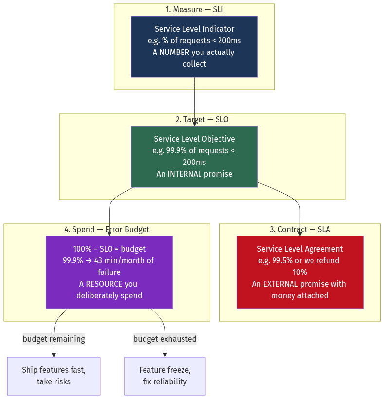
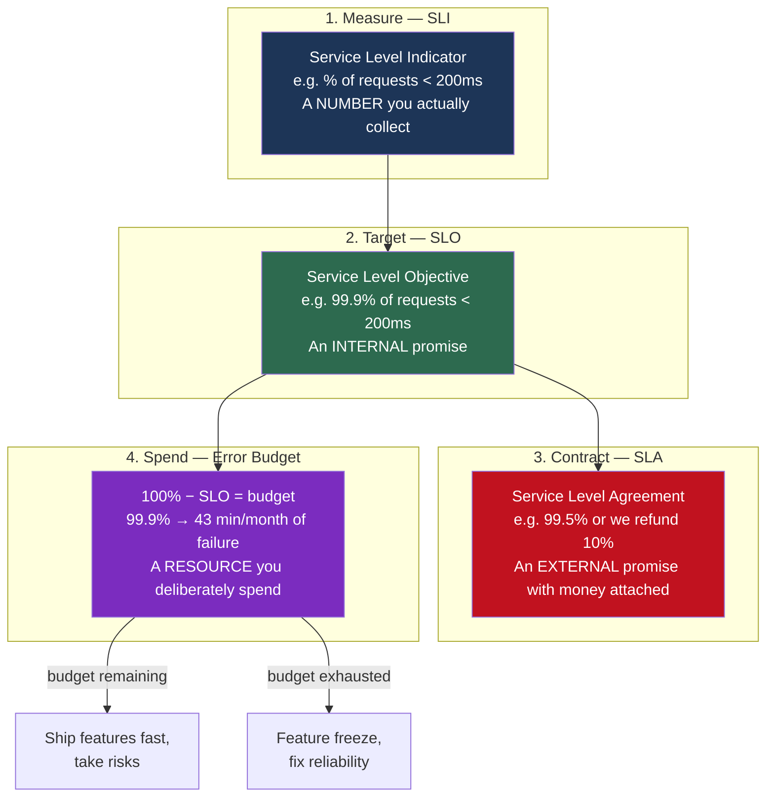
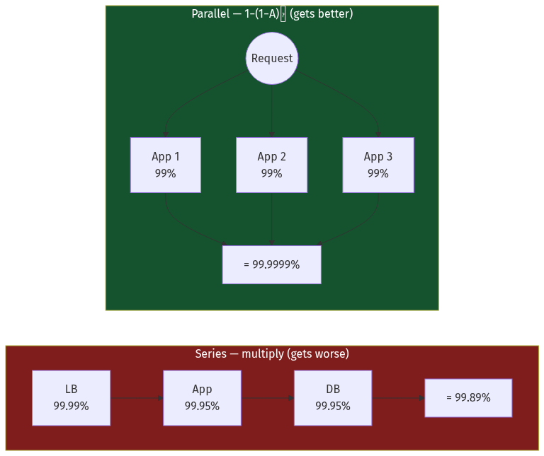
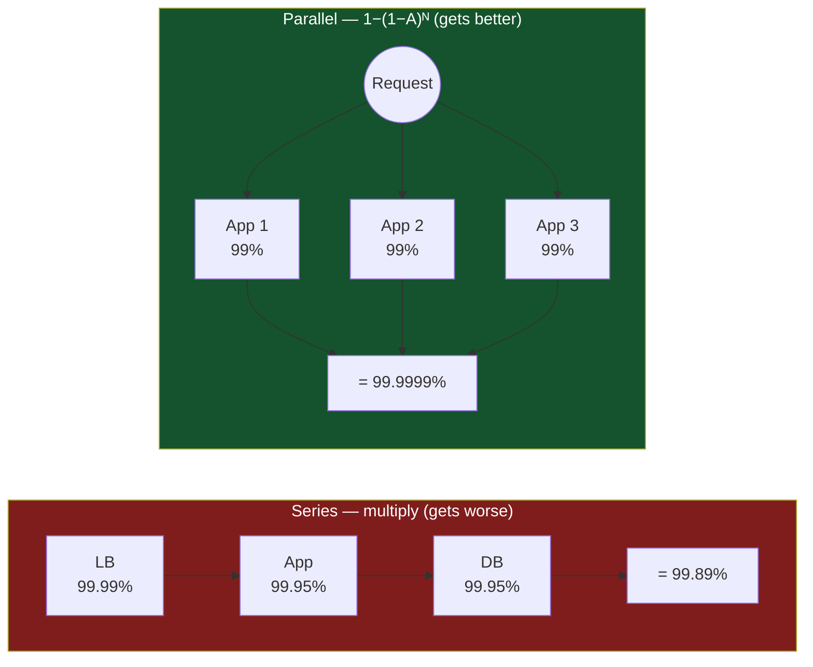
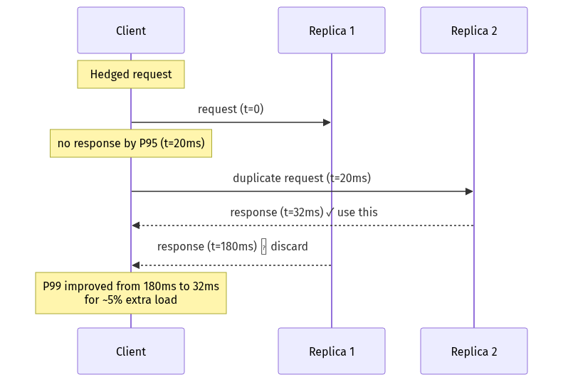
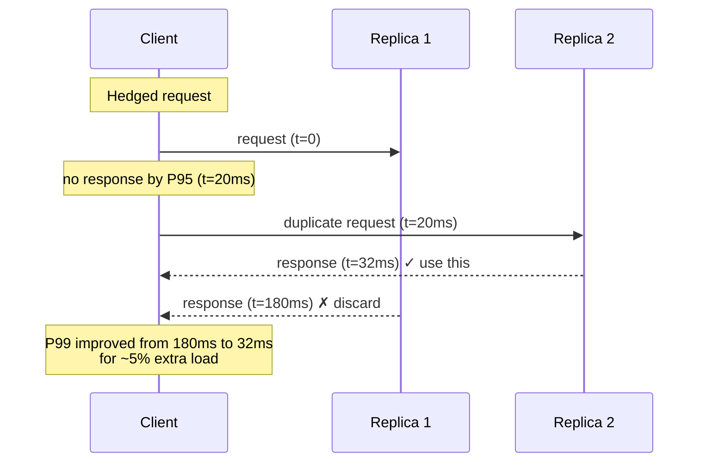

# Chapter 3 — Reliability, Availability and Performance

[← Chapter 2](./02_scalability_and_estimation.md) · [Contents](./README.md) · [Next: Chapter 4 →](./04_networking_deep_dive.md)

**Prerequisites:** [Chapter 2](./02_scalability_and_estimation.md) — the utilisation/latency relationship in §2.7 is used throughout.

---

## What you'll learn

- What "99.99% availability" actually costs, and why each additional nine is roughly **10× harder**
- How to compute the availability of a system from the availability of its parts — and why adding a dependency almost always makes things *worse*
- The difference between **reliability**, **availability** and **durability**, which are constantly confused
- **SLI, SLO and SLA** — what they are, who they're for, and how an **error budget** turns reliability into a negotiable resource
- Why **the average latency is a lie**, and how a 1% slow tail becomes a 63% slow user experience
- How to load test without fooling yourself (**coordinated omission** is the trap)

---

## Start from zero

Two claims about a car:

> "This car breaks down once every five years."
> "When it breaks down, it's fixed in one hour."

The first is **reliability** — how often it fails. The second is about **recovery** — how
fast it comes back. Together they determine **availability** — what fraction of the time
the car is usable.

If it breaks once every five years and is fixed in an hour, it's available
`(5 years − 1 hour) / 5 years` = 99.99998% of the time. Excellent.

If it breaks once a week but is fixed in one second, it's available 99.9998% of the time.
Also excellent — even though it's dramatically *less reliable*.

💡 **This is the most important insight in reliability engineering:** you can achieve high
availability either by failing rarely or by recovering fast. **Recovering fast is almost
always cheaper.** A system that fails often but heals in milliseconds beats a system that
fails rarely but takes an hour to fix. This is why the industry moved from "prevent all
failure" to "expect failure, recover automatically."

A third property is different again. If the car breaks down, do you still have your
luggage? That's **durability** — whether the *data* survives, independent of whether the
*service* is up. S3 offers 99.99% availability but 99.999999999% durability: the service
might be unreachable for an hour a year, but it will essentially never lose your bytes.

| Property | Question it answers | Typical target |
| --- | --- | --- |
| **Reliability** | How often does it fail? | MTBF measured in months/years |
| **Availability** | What fraction of time is it working? | 99.9% – 99.999% |
| **Durability** | Will my data survive? | 99.999999999% (11 nines) |
| **Recoverability** | How fast does it come back? | MTTR measured in seconds/minutes |

---

## The mental model



<details>
<summary>Diagram source (Mermaid)</summary>



</details>

The chain is: **you measure an SLI, you promise an SLO internally, you sell an SLA
externally, and the gap between 100% and your SLO is an error budget you are allowed to
spend.**

---

## Deep dive

### 3.1 The nines

📐 **Availability = Uptime / (Uptime + Downtime)**

| Availability | Name | Downtime/year | Downtime/month | Downtime/week | Downtime/day |
| --- | --- | --- | --- | --- | --- |
| 90% | "one nine" | 36.5 days | 73 hours | 16.8 hours | 2.4 hours |
| 99% | "two nines" | 3.65 days | 7.3 hours | 1.7 hours | 14.4 min |
| 99.5% | | 1.83 days | 3.65 hours | 50 min | 7.2 min |
| 99.9% | "three nines" | **8.77 hours** | **43.8 min** | 10.1 min | 1.44 min |
| 99.95% | | 4.38 hours | 21.9 min | 5 min | 43 s |
| 99.99% | "four nines" | **52.6 min** | **4.38 min** | 1.01 min | 8.6 s |
| 99.999% | "five nines" | **5.26 min** | 26.3 s | 6.05 s | 864 ms |
| 99.9999% | "six nines" | 31.6 s | 2.63 s | 605 ms | 86 ms |

⚠️ **Look at the four-nines row.** 4.38 minutes of downtime *per month*. A single deploy
that goes wrong and takes 5 minutes to roll back has consumed your **entire monthly
budget**. Now consider: can a human even be paged, log in, diagnose and fix something in
4 minutes? No. **Four nines requires automated recovery.** Five nines requires that the
failure be invisible — the system must route around it without any human involvement at all.

💡 **Each nine is roughly 10× harder and 10× more expensive.** Going from 99% to 99.9% might
mean adding a load balancer and a replica. Going from 99.9% to 99.99% means multi-AZ,
automated failover, and rigorous deploy safety. Going from 99.99% to 99.999% means
multi-region, cell isolation, and an organisation built around it.

🎯 **The right interview instinct is to ask what the business actually needs.** Most
products do not need five nines. A B2B tool used 9-to-5 in one timezone genuinely does not
care about 3 a.m. downtime. Saying *"I'd target 99.9% here because the cost of the next
nine exceeds the revenue impact"* is a stronger answer than reflexively designing for
five nines.

### 3.2 MTBF, MTTR, and the lever that actually moves

📐 **Availability = MTBF / (MTBF + MTTR)**

- **MTBF** — Mean Time Between Failures. How reliable the component is.
- **MTTR** — Mean Time To Recovery. How fast you heal.

Sometimes broken out further:
- **MTTD** — Mean Time To Detect (how long before anyone notices)
- **MTTA** — Mean Time To Acknowledge (how long before someone starts working)
- **MTTR** = MTTD + MTTA + actual repair time

⚠️ **In most organisations, MTTD dominates MTTR.** The outage lasted 45 minutes and the fix
took 3 minutes — the other 42 were spent not knowing. This is why
[Chapter 19](./19_observability_and_operations.md) (observability) is a reliability chapter,
not a nice-to-have.

**Worked comparison.** Two strategies to reach the same availability:

*Strategy A — make it reliable.* MTBF = 1 year (8,760 h), MTTR = 4 h.
```
8760 / (8760 + 4) = 99.954%
```

*Strategy B — make it recover fast.* MTBF = 1 week (168 h), MTTR = 30 seconds (0.00833 h).
```
168 / (168 + 0.00833) = 99.995%
```

Strategy B fails **52× more often** and is **10× more available**.

💡 That's the whole argument for automated failover, health checks, circuit breakers,
auto-restart, and blue-green deploys. You are not trying to prevent failure. You are trying
to make failure boring.

### 3.3 Composing availability — the arithmetic that surprises people

Real systems are made of parts. The availability of the whole depends on how they're wired.

#### Components in series (all must work)

If your request must pass through a load balancer, an app server, and a database, and any
one of them failing breaks the request:

📐 **A_total = A₁ × A₂ × A₃ × …**

```
Load balancer: 99.99%
App server:    99.95%
Database:      99.95%
Cache:         99.9%

A = 0.9999 × 0.9995 × 0.9995 × 0.999 = 0.99790 = 99.79%
```

**Downtime: 18.4 hours/year** — despite every individual component being better than 99.9%.

⚠️ **Availability in series always gets worse.** Every dependency you add makes your service
less available. A microservice that calls 10 other services, each at 99.9%, has a ceiling
of 0.999¹⁰ = **99.0%** — 3.65 days of downtime a year, before any of its *own* bugs.

🎯 This is one of the strongest arguments against fine-grained microservices, and one of the
best things you can say in an interview. It's also why the resilience patterns in
[Chapter 16](./16_microservices_and_service_architecture.md) exist: a **circuit breaker with
a fallback converts a hard dependency into a soft one**, removing it from the series
product entirely.

#### Components in parallel (any one is enough)

If you have N redundant copies and need only one:

📐 **A_total = 1 − (1 − A)ᴺ**

```
One server at 99%:    99%          (3.65 days/year down)
Two servers at 99%:   1 − 0.01²   = 99.99%      (52 min/year)
Three servers at 99%: 1 − 0.01³   = 99.9999%    (31 s/year)
```

💡 **Redundancy is astonishingly powerful.** Two mediocre components in parallel beat one
excellent component. This is the entire reason horizontal scaling improves availability as
a side effect.



<details>
<summary>Diagram source (Mermaid)</summary>



</details>

#### The real system: parallel groups in series

```
Tier                     Config              Availability
------------------------------------------------------------
Load balancers    2 in parallel @ 99.9%     1 − 0.001²  = 99.9999%
App servers       5 in parallel @ 99.5%     1 − 0.005⁵  = 99.99999997%
Database          primary + replica @ 99.9% 1 − 0.001²  = 99.9999%
                  (with automatic failover)

Total (series of the three tiers):
0.999999 × 0.9999999997 × 0.999999 = 99.9998%
```

**About 63 seconds of downtime per year.** Every component is unremarkable; the
*arrangement* produces five-plus nines.

### 3.4 ⚠️ Why that number is a lie: correlated failure

The formula `1 − (1−A)ᴺ` assumes failures are **independent**. In reality they are often
not, and this is where the model breaks.

**Correlated failure modes that defeat redundancy:**

| Failure | Why redundancy doesn't help |
| --- | --- |
| All replicas in the same rack | One top-of-rack switch dies, all go |
| All replicas in the same availability zone | One AZ power event, all go |
| Same bad deploy on every instance | The bug is *in* all of them |
| Same expired TLS certificate | Time is shared infrastructure |
| Same corrupt config pushed cluster-wide | Config is a shared dependency |
| Same dependency (all call one auth service) | The auth service is in series |
| Thundering herd after recovery | All replicas retry simultaneously and re-kill the backend |
| Disk batch from the same manufacturing lot | Correlated hardware failure — genuinely happens |

💡 **The 2017 S3 outage** in us-east-1 was caused by a typo in a command during routine
debugging, which removed more capacity than intended. Redundancy within the region did not
help because the *operator action* was the shared failure mode. Many services that thought
they were highly available discovered they were in series with S3.

**Mitigations, in increasing order of cost:**
1. **Anti-affinity** — force replicas onto different racks, hosts and AZs (Kubernetes
   `podAntiAffinity` and topology spread constraints, [Chapter 17](./17_containers_docker_kubernetes.md))
2. **Staged rollouts** — canary deploys so a bad build hits 1% before 100% ([Chapter 20](./20_deployment_multiregion_dr_cost.md))
3. **Cell-based architecture** — fully independent stacks, so a bad config can only poison one cell
4. **Multi-region** — different physical geography, different power, different control plane
5. **Diversity** — different cloud providers, different software versions. Extremely
   expensive, and rarely justified.

⚠️ **Be honest in interviews:** if you present `1 − (1−A)ᴺ` and then add *"but this assumes
independent failures, which is usually false — the real limit is the shared failure
domain,"* you have said something most candidates don't.

### 3.5 Failure modes — a taxonomy

"It failed" is not a useful description. Systems fail in categories, and each category
needs a different defence. Ordered from easiest to hardest to handle:

| # | Mode | What happens | How you detect it | Defence |
| --- | --- | --- | --- | --- |
| 1 | **Crash (fail-stop)** | Process dies cleanly and stays dead | Health check fails; connection refused | Redundancy + restart. **The easy case.** |
| 2 | **Omission** | Request or response silently disappears | Timeout | Retry with backoff + idempotency |
| 3 | **Timing** | Correct answer, far too late | Latency SLI breach | Timeouts, hedged requests, circuit breaker |
| 4 | **Response (semantic)** | Responds successfully with **wrong data** | ⚠️ Nothing catches this automatically | Checksums, validation, canary comparison, invariant checks |
| 5 | **Byzantine** | Arbitrary, possibly malicious, inconsistent behaviour — tells different nodes different things | Cross-node comparison | BFT consensus (expensive), or don't trust the node at all |

💡 **Why this ordering matters.** Everyone designs for mode 1. Almost nobody designs for
modes 3 and 4 — and those are the ones that cause the long, confusing outages.

⚠️ **The "grey failure" is the worst case in practice.** A node that is 90% broken is far
more damaging than one that is 100% broken, because:
- Health checks pass (it responds!), so the load balancer keeps sending it traffic
- It's not down, so no alert fires
- It poisons a fraction of requests, so error rates look like "noise"
- Every retry has a chance of landing on it again

**A dead node removes itself. A sick node doesn't.** This is precisely why passive health
checking and outlier detection ([Chapter 5](./05_load_balancing_proxies_traffic.md) §5.4)
matter more than active probes, and why some systems deliberately **crash on unexpected
error** — converting a mode-4 failure into a mode-1 failure, which the infrastructure
already knows how to handle. Erlang's "let it crash" philosophy is exactly this trade.

🎯 A strong interview move: when asked "what if service X fails?", ask back *"which kind of
failure — does it crash, hang, or return wrong answers? Because my design differs for
each."*

### 3.6 Redundancy models

| Model | Meaning | Cost overhead | Example |
| --- | --- | --- | --- |
| **N** | Exactly enough capacity | 0% | No redundancy at all |
| **N+1** | One spare beyond need | 1/N | 4 servers where 3 suffice |
| **N+2** | Two spares | 2/N | Survives a failure *during* maintenance |
| **2N** | Full duplicate | 100% | Active-passive pair |
| **2N+1** | Full duplicate plus a spare | >100% | Critical infrastructure |

⚠️ **The N+1 trap:** N+1 protects you against one failure at a time. During a planned
maintenance window you are temporarily at N — so a single failure during maintenance is an
outage. If you patch monthly and maintenance takes an hour, you have 12 hours a year of
zero redundancy. **N+2 exists precisely for this.**

📐 **The capacity question people forget:** if you run 3 servers at 70% utilisation and one
dies, the remaining two must absorb 105% of capacity. They can't. You cascade.
For N+1 to actually work, steady-state utilisation must be **≤ (N−1)/N**. With 3 servers
that's 67%; with 10 servers, 90%.

### 3.7 SLI, SLO, SLA

These three get used interchangeably. They are not the same.

**SLI — Service Level Indicator.** A number you measure.
> "The proportion of HTTP requests that completed successfully in under 200 ms."

A good SLI is expressed as `good events / valid events`, because that form is directly
comparable to a target.

**SLO — Service Level Objective.** An internal target for an SLI.
> "99.9% of requests complete successfully in under 200 ms, measured over 28 days."

**SLA — Service Level Agreement.** An external contract with consequences.
> "99.5% availability monthly, or you receive a 10% service credit."

💡 **Your SLA should always be looser than your SLO.** If your SLO is 99.9% and your SLA is
99.9%, you pay out the moment you miss your internal target — no margin. Standard practice
is roughly one nine of gap: SLO 99.9%, SLA 99.5%.

**Choosing good SLIs.** The four categories that cover almost everything:

| Category | SLI | Applies to |
| --- | --- | --- |
| **Availability** | successful requests / total requests | Request-driven services |
| **Latency** | requests faster than threshold / total | Request-driven services |
| **Quality** | full-fidelity responses / total (degradation counts as bad) | Services with fallbacks |
| **Freshness** | records updated within X / total | Pipelines, caches, replicas |
| **Correctness** | records processed correctly / total | Data pipelines |
| **Coverage** | records processed / records that should be | Batch jobs |

⚠️ **Measure the SLI where the user is, not where it's convenient.** Server-side latency
excludes DNS, TLS, network and client rendering. If your server-side P99 is 50 ms and the
user's experience is 3 seconds, your SLI is measuring the wrong thing.

### 3.8 Error budgets — the idea that changes how teams behave

📐 **Error budget = 100% − SLO**

An SLO of 99.9% over 30 days means:
```
0.1% × 30 days × 24 h × 60 min = 43.2 minutes of "allowed" failure per month
```

Or in request terms, at 100 million requests/month: **100,000 requests may fail.**

💡 **The reframe:** those 43 minutes are not a tolerance to be minimised. They are a
**budget to be spent**. Reliability beyond your SLO has *negative* value — you paid for it
with engineering time and deploy velocity that could have gone to features.

**The error budget policy** — agreed *in advance*, in writing, by engineering and product:

| Budget remaining | Policy |
| --- | --- |
| > 50% | Ship freely. Take risks. Deploy on Friday. Run chaos experiments. |
| 20–50% | Normal caution. Canary all deploys. |
| < 20% | Only reliability work and low-risk changes. |
| Exhausted | **Feature freeze.** All engineering effort goes to reliability until the budget recovers. |

This converts an unproductive argument ("ship faster!" vs "it's not stable!") into
arithmetic. Nobody has to win the argument; the number decides.

**Burn rate** — how fast you're consuming the budget.

📐 **Burn rate = (observed error rate) / (budgeted error rate)**

A burn rate of 1 means you'll exactly exhaust the budget at the end of the window. A burn
rate of 14.4 means you'll exhaust a 30-day budget in about 2 days.

This is the correct way to alert. **Multi-window, multi-burn-rate alerting** (from the
Google SRE workbook):

| Burn rate | Budget consumed in | Window | Severity |
| --- | --- | --- | --- |
| 14.4× | 2 days | 1 h and 5 min | **Page immediately** |
| 6× | 5 days | 6 h and 30 min | Page |
| 3× | 10 days | 1 day and 2 h | Ticket |
| 1× | 30 days | 3 days and 6 h | Ticket |

⚠️ The **short window** is checked alongside the long one specifically so the alert
*resolves* quickly once the problem stops. Without it, a 5-minute incident keeps a 6-hour
alert firing for 6 hours. See [Chapter 19](./19_observability_and_operations.md).

### 3.9 Latency: why the average is a lie

Ten requests, latencies in milliseconds:
```
10, 12, 11, 13, 10, 12, 11, 14, 10, 2000
```
**Average = 210 ms.** Not a single request took anywhere near 210 ms. The average describes
nothing that happened.

Use **percentiles** instead.

| Percentile | Meaning | Who it describes |
| --- | --- | --- |
| P50 (median) | Half of requests are faster | The typical experience |
| P90 | 90% faster | Slightly unlucky users |
| P95 | 95% faster | Where problems become visible |
| P99 | 99% faster | **Your worst 1% — and your loudest users** |
| P99.9 | 999 in 1,000 faster | Where infrastructure problems show up |
| P100 (max) | The single worst | Usually noise, but sometimes a real bug |

For the numbers above: P50 = 11 ms, P90 = 14 ms, **P99 = 2000 ms**. Now you can see the
problem.

💡 **Why P99 matters more than it looks.** Your heaviest users make the most requests, so
they hit the slow tail most often. The 1% of *requests* that are slow are concentrated in a
much smaller percentage of *users* — who are typically your most valuable ones.

⚠️ **You cannot average percentiles.** If server A has P99 = 100 ms and server B has
P99 = 200 ms, the combined P99 is **not** 150 ms. Percentiles must be computed from the
underlying distribution. This is why monitoring systems store **histograms**
(Prometheus buckets, t-digest, HdrHistogram) rather than pre-computed percentiles.
Averaging percentiles across instances is one of the most common monitoring errors in
existence.

### 3.10 📐 Tail-at-scale amplification — the math that justifies everything

This is the single most important calculation in this chapter.

**Setup:** a single service where 1% of requests take over 1 second. Sounds fine — 99% of
requests are fast.

Now your page load fans out to **100** such services (a completely normal number for a
modern front page), and the page isn't complete until all 100 respond.

📐 **P(at least one is slow) = 1 − (0.99)¹⁰⁰ = 1 − 0.366 = 63.4%**

**63% of your page loads contain a 1-second stall.** Your "1% slow" service produced a
majority-slow product.

| Fan-out | P(no slow call) | P(at least one slow) |
| --- | --- | --- |
| 1 | 99.0% | 1.0% |
| 5 | 95.1% | 4.9% |
| 10 | 90.4% | 9.6% |
| 50 | 60.5% | 39.5% |
| 100 | 36.6% | **63.4%** |
| 500 | 0.66% | 99.3% |

💡 **General rule:** with a fan-out of N, your user-facing P50 is roughly your backend's
P(100/N) percentile. Fan out to 100 services and the *median* page load is determined by
your backend's **P99**. This is why Google's *The Tail at Scale* paper argues that at scale,
**tail latency is the only latency that matters**.

**Fixes, in increasing order of sophistication:**

1. **Reduce fan-out.** Batch, denormalise, precompute. The cheapest fix by far.
2. **Hedged requests.** Send the request; if no response by P95, send a duplicate to a
   different replica and take whichever returns first. Costs ~5% extra load, and can cut
   P99 by more than half. Used in Google's BigTable and in gRPC.
3. **Tied requests.** Send to two replicas, each of which cancels the other when it starts
   executing. Better than hedging (less wasted work) but requires cooperation between
   replicas.
4. **Micro-partitioning + selective replication.** Split data into far more partitions than
   machines so hot partitions can be moved and hot data can get extra replicas.
5. **Return incomplete results.** If 95 of 100 services responded, render the page with 95.
   Facebook, Google and Amazon all do this — **graceful degradation** is a latency
   technique, not just an availability one.



<details>
<summary>Diagram source (Mermaid)</summary>



</details>

### 3.11 Load testing without fooling yourself

**Closed-model load testing** (what most tools do by default): N virtual users, each sending
a request, waiting for the response, then sending the next.

**Open-model load testing:** requests arrive at a fixed rate regardless of whether previous
ones completed. This is what real traffic does.

⚠️ The difference is not academic. In a closed model, **if your server slows down, the load
generator slows down too** — it stops applying pressure exactly when pressure matters most.
Real users don't do that. Real users keep arriving, and the queue grows.

**Coordinated omission** is the classic manifestation, named by Gil Tene.

> Your load generator intends to send a request every 10 ms. The server hangs for 1 second.
> A naive generator sends one request, waits 1 second, records "one request took 1000 ms,"
> and moves on. It records **one** slow sample.
>
> In reality, 100 requests *should* have been sent during that second. The first would have
> waited 1000 ms, the second 990 ms, the third 980 ms… The generator omitted 99 slow samples
> and recorded only the best one.

The measured P99 comes out at maybe 15 ms. The true P99 is over 500 ms. **Your load test
told you the opposite of the truth.**

**How to avoid it:**
- Use an open-model tool (`wrk2`, `k6` with constant-arrival-rate, Gatling's open model,
  `vegeta`) — these correct for coordinated omission by recording *intended* send time
- Record latency as `now − intended_send_time`, not `now − actual_send_time`
- Always report the full histogram, not just a mean and a P99
- Test past the knee: find where latency inflects, don't just confirm the happy path

**A checklist for a load test that's actually worth running:**

| ✓ | Requirement |
| --- | --- |
| ☐ | Open model / coordinated-omission corrected |
| ☐ | Realistic request mix (not 100% of the cheapest endpoint) |
| ☐ | Realistic data volume (a 1,000-row table behaves nothing like a 100M-row table) |
| ☐ | Cold caches tested separately from warm |
| ☐ | Run long enough to hit GC pauses, log rotation, cert refresh, connection churn |
| ☐ | Ramp past the breaking point, so you know *where* it is |
| ☐ | Failure injection: kill a node mid-test |
| ☐ | Full histogram published, P99.9 included |

### 3.12 📐 Choosing timeouts — the number everyone guesses

A timeout that is too long turns a fast failure into a hang. A timeout that is too short
turns a healthy slow request into an error and adds retry load. Both are common, and both
are avoidable with arithmetic.

**Rule 1 — set the timeout from the latency distribution, not from a round number.**

```
Downstream service: P50 = 20 ms, P99 = 180 ms, P99.9 = 400 ms

Timeout = 100 ms  → cuts off 1%+ of legitimate requests ❌
Timeout = 500 ms  → allows P99.9 through, fails genuinely stuck requests ✅
Timeout = 30 s    → a hung dependency occupies a worker for 30 seconds ❌
```

💡 **A reasonable default is P99.9 plus a margin**, and never a number chosen because it
looked tidy. The most common real-world value — 30 seconds, inherited from an HTTP client
library default — is almost always wrong by two orders of magnitude.

**Rule 2 — timeouts must decrease as you go deeper.**

```
User's browser:        10 s
  API gateway:          8 s
    Order service:      5 s
      Payment service:  3 s
        Database:       1 s
```

⚠️ If an inner timeout exceeds an outer one, the outer caller gives up while the inner call
is still running — you burn the resource *and* return an error. Worse, retries at the outer
layer stack on top of work still executing at the inner one.

💡 The clean way to enforce this is a **deadline propagated in the request context** rather
than independent per-hop timeouts. Each hop passes the remaining budget downstream, so nobody
starts work that cannot finish in time. gRPC does this natively with `grpc-timeout`; Go's
`context.WithDeadline` is the same idea.

**Rule 3 — a timeout without a bounded retry is a load amplifier.**

📐 **Retry amplification.** Each layer retrying 3× across 4 layers:
```
1 user request → 3 → 9 → 27 → 81 backend requests
```
Under a partial failure, retries generate the load that completes the outage. This is
**retry storm**, and it has taken down large services repeatedly.

**The three controls, all of which you need:**

| Control | What it does | Typical setting |
| --- | --- | --- |
| **Exponential backoff with jitter** | Spreads retries in time so they don't synchronise | `sleep = random(0, min(cap, base × 2^attempt))` |
| **Retry budget** | Caps retries as a *fraction of total requests* | Retries ≤ 10% of requests; beyond that, fail fast |
| **Retry only at one layer** | Prevents multiplicative stacking | Retry at the edge or the client, not both |

⚠️ **Full jitter, not "backoff plus a little randomness."** AWS's published analysis found
that `sleep = random(0, backoff)` — full jitter — dramatically outperforms both fixed backoff
and partial jitter, because it maximally decorrelates the retrying clients. Without jitter,
every client that failed at the same instant retries at the same instant, forever.

⚠️ **Only retry idempotent operations**, or operations protected by an idempotency key
([Chapter 10](./10_distributed_transactions_and_integrity.md)). A retried `POST /payments`
that actually succeeded the first time charges the customer twice.

### 3.13 Graceful degradation — the availability you get for free

The binary framing — the service is up or it's down — is a false choice. Most systems can
serve *something* useful when a dependency fails, and doing so converts an outage into a
minor incident.

**The technique is to classify every dependency before you need to.**

| Class | Meaning | On failure |
| --- | --- | --- |
| **Critical** | The request is meaningless without it | Fail the request (fast, with a clear error) |
| **Important** | Degrades quality but not correctness | Serve stale, cached, or default data |
| **Optional** | Enhancement only | Omit silently |

**Worked classification — an e-commerce product page:**

```
Product name, price, availability   → CRITICAL   (no page without them)
Product images                      → IMPORTANT  (serve placeholder)
Recommendations ("you may also like") → OPTIONAL (omit the section)
Reviews                             → IMPORTANT  (serve cached, or hide)
Live inventory count                → IMPORTANT  (show "in stock" without a number)
Personalisation / A-B assignment    → OPTIONAL   (serve the default variant)
Analytics beacons                   → OPTIONAL   (fire and forget, never block)
```

💡 With this classification, the recommendation service can be completely down and the page
still sells the product. Without it, one optional dependency takes down checkout. **The
classification is the design work; the code is trivial.**

**Concrete degradation techniques:**

| Technique | Example |
| --- | --- |
| **Serve stale** | Return the last cached value past its TTL rather than an error (`stale-if-error`) |
| **Serve a default** | Global top-10 instead of personalised recommendations |
| **Reduce fidelity** | Lower-resolution images; fewer search results; shorter feed |
| **Disable features** | Turn off the expensive "similar items" query under load, via a feature flag |
| **Queue and defer** | Accept the write into a durable queue; process it when the dependency returns |
| **Read-only mode** | Serve reads while writes are unavailable — often 90%+ of traffic |

⚠️ **Degraded mode must be tested, and it must be observable.** Two failure patterns:
- Degradation code paths that are never exercised and are themselves broken
- Silent degradation — the system serves stale data for three days and nobody notices,
  because "serving stale" doesn't trip an error-rate alarm

The fix for both: exercise the degraded path continuously (chaos experiments), and emit a
**distinct metric** for degraded responses so you can alert on the *quality* SLI from §3.7,
not just availability.

### 3.14 The availability of multi-region

⚠️ Multi-region is often assumed to multiply availability. It doesn't automatically, and the
reason is worth understanding.

📐 **Two regions at 99.9% each, if genuinely independent:**
```
1 − (0.001)² = 99.9999%
```

**But this only holds if all four of these are true:**

1. **Failover is automatic.** Manual failover takes 15–60 minutes; that dominates and your
   real availability is barely better than one region.
2. **The standby actually works.** Untested failover fails. Both AWS and Google publish
   incidents where the recovery path was itself broken.
3. **The standby has capacity.** An active-passive standby running at 20% cannot absorb 100%
   of production. You must size it for full load, or accept degradation.
4. **The failover mechanism is not itself a shared dependency.** ⚠️ This is the one people
   miss — if failover depends on a global control plane, a global config store, or DNS, and
   that component fails, both regions become unavailable *simultaneously*. This is precisely
   what happened to Facebook in 2021: the BGP withdrawal took out DNS, and DNS was needed to
   reach the tools that could fix it.

💡 **Static stability** is the principle that resolves this: the system must continue
operating correctly using only pre-existing state, without needing the control plane. AWS
designs this way explicitly — an EC2 instance keeps running even if the EC2 control plane is
unavailable, and a load balancer keeps routing to its last-known-healthy targets even if
service discovery is down.

📐 **Realistic multi-region math, with correlation:**
```
Region A: 99.95%
Region B: 99.95%
Failover mechanism itself: 99.9%  (this is in SERIES with the pair)
Shared global dependency (DNS/control plane): 99.99%  (also in series)

Naive:      1 − 0.0005² = 99.999975%
Realistic:  (1 − 0.0005²) × 0.999 × 0.9999 = 99.89%
```

**The failover mechanism is now the least reliable component** and dominates the result. A
single well-run region at 99.95% would have been *better* than a badly-implemented
two-region setup at 99.89%. This is not a hypothetical — it is a common outcome.

🎯 Saying this in an interview — *"multi-region only helps if the failover path is more
reliable than the thing it's protecting"* — is a genuinely senior observation.

---

## Worked example — designing to a 99.95% SLO

*You're building a payments API. The business wants **99.95% availability** (21.9 minutes
of downtime per month) and **P99 latency under 300 ms**. Design it and prove the numbers.*

**Step 1 — Enumerate the request path.**

```
Client → DNS → CDN/WAF → Load balancer → API service → ┬→ Auth service
                                                       ├→ Postgres (primary)
                                                       ├→ Redis (idempotency keys)
                                                       └→ Payment processor (3rd party)
```

**Step 2 — Availability of the naive series design.**

| Component | Availability | Note |
| --- | --- | --- |
| DNS (Route 53) | 100% | AWS's published SLA |
| CDN / WAF | 99.99% | |
| Load balancer | 99.99% | |
| API service (1 instance) | 99.5% | Deploys, restarts, OOMs |
| Auth service | 99.9% | |
| Postgres primary | 99.9% | |
| Redis | 99.9% | |
| Payment processor | 99.9% | Third party — **you don't control this** |

```
1.0 × 0.9999 × 0.9999 × 0.995 × 0.999 × 0.999 × 0.999 × 0.999
= 0.99104 = 99.10%
```

**Downtime: 6.5 hours/month.** We need 21.9 minutes. We are off by **18×**.

**Step 3 — Apply redundancy where it's cheap.**

*API service:* run 6 instances across 3 availability zones.
```
1 − (0.005)⁶ ≈ 99.99999999%  → effectively removed from the equation
```
⚠️ But correlated failure caps this: a bad deploy hits all six. With canary deploys limiting
blast radius, model this realistically as **99.99%**, not eleven nines.

*Postgres:* primary + synchronous standby in another AZ, with automated failover taking
~30 s.
```
Failure rate unchanged, but MTTR drops from ~1 hour to 30 s.
MTBF 720 h (monthly), MTTR 0.0083 h → 720/(720.0083) = 99.9988%
```

*Redis:* it holds idempotency keys. Make it a **soft dependency** — if Redis is down, fall
back to a database-backed check (slower, but correct). Redis moves out of the series product.
```
Effective availability with fallback ≈ 99.99% (the fallback itself can fail)
```

*Auth service:* cache validated tokens locally for 60 seconds. During an auth outage,
already-authenticated users continue working. Another soft dependency.
```
Effective ≈ 99.99%
```

*Payment processor:* **you cannot make a third party more reliable.** Two real options:
- Integrate a **second processor** and fail over. `1 − 0.001² = 99.9999%`.
- Or: **accept the payment request into a durable queue** and settle asynchronously. The
  user-facing API returns 202 Accepted and stays up even when the processor is down. This
  removes it from the synchronous path entirely — the strongest answer.

**Step 4 — Recompute.**

```
1.0 × 0.9999 × 0.9999 × 0.9999 × 0.9999 × 0.999988 × 0.9999 × 1.0(async)
= 0.99951 = 99.951%
```

**Downtime: 21.2 minutes/month.** ✅ Meets the 99.95% SLO, with almost no margin — which is
honest. Note that the two decisive moves were **not** adding redundancy; they were
**converting hard dependencies into soft ones** (auth cache, Redis fallback) and **removing
a dependency from the synchronous path** (async settlement).

**Step 5 — The latency budget.**

Target: P99 < 300 ms. Budget every hop, using P99 not average:

| Hop | P99 budget | Notes |
| --- | --- | --- |
| TLS + LB | 20 ms | Connection reuse assumed |
| API service compute | 30 ms | JSON, validation, business logic |
| Auth check | 5 ms | Cached locally; a miss is 40 ms |
| Idempotency check (Redis) | 5 ms | |
| Postgres write | 40 ms | Includes fsync and sync replica ack |
| Queue publish (Kafka) | 20 ms | `acks=all` |
| Response serialisation | 10 ms | |
| **Sum** | **130 ms** | |
| Headroom | 170 ms | For GC pauses, retries, network jitter |

💡 Budget to roughly **half** your target. The remaining half absorbs the things you can't
predict: a garbage-collection pause, a TCP retransmission, a noisy neighbour. A design
whose P99 budget exactly equals its SLO will miss it.

**Step 6 — The error budget policy.**

```
99.95% SLO → 0.05% × 43,200 min/month = 21.6 minutes/month
At 50M requests/month → 25,000 requests may fail
Burn-rate alerts: page at 14.4× (1h + 5min windows), ticket at 3× (1d + 2h)
Policy: < 20% budget remaining → freeze features, reliability work only
```

---

## Trade-offs

| Decision | Option A | Option B | Choose A when | Never choose A when |
| --- | --- | --- | --- | --- |
| Reliability strategy | Increase MTBF (better components) | Decrease MTTR (fast recovery) | Failures are catastrophic and irreversible (payments settlement, medical) | Automation can heal it — B is cheaper for the same availability |
| Redundancy | Active-passive (2N) | Active-active | Failover is simple and state is hard to share | You need the standby's capacity, or failover time exceeds your MTTR budget |
| Consistency during failure | Fail closed (reject) | Fail open (degrade) | Correctness is non-negotiable — payments, auth | Availability matters more than completeness — feeds, recommendations |
| Dependency handling | Hard dependency | Soft dependency + fallback | The data is genuinely required for correctness | Any case where a cached/default/degraded answer is acceptable |
| Latency measurement | Average | Percentiles + histogram | Never | Always use percentiles. Averages hide everything. |
| Tail latency | Optimise the slow path | Hedge requests | The slowness has a single identifiable cause | Slowness is inherent variance (GC, scheduling, noisy neighbours) — then hedge |
| SLO target | 99.9% | 99.99% | Users tolerate ~44 min/month; cost of the next nine is high | Revenue is directly per-minute; downtime is unrecoverable |

---

## How real companies do it

**Google** invented most of this vocabulary. The SRE book's core claim is that
**100% is the wrong reliability target for everything** — because users can't tell the
difference between 99.99% and 100% (their own ISP and device are less reliable than that),
and the marginal cost of the last nine is enormous. The error budget exists to make that
argument arithmetic instead of opinion.

**Amazon** publishes S3's split targets: **99.99% availability, 99.999999999% durability.**
The gap is deliberate and instructive — they will let you be unable to reach your data for
an hour a year, but essentially never lose it. Durability comes from erasure coding across
independent failure domains; availability comes from front-end redundancy. Different
problems, different solutions.

**Netflix** built Chaos Monkey to attack the correlated-failure problem directly: if you
randomly kill instances in production continuously, you cannot accumulate hidden
single-points-of-failure. Their Simian Army extended this to killing entire availability
zones (Chaos Gorilla) and regions (Chaos Kong). The insight: **untested failover doesn't
work**, so test it constantly rather than during an incident.

**Google's *The Tail at Scale*** (Dean & Barroso, CACM 2013) is the source of §3.10. Their
reported figure: in one BigTable service, hedged requests reduced P99 latency **from 1,800
ms to 74 ms** while adding only 2% to total request volume. That ratio — a 24× latency
improvement for 2% cost — is why hedging is now built into gRPC.

**AWS's SLA structure** is worth reading as a lesson in SLA design: EC2 promises 99.99%
*per region*, but the credit is only 10% at 99.0–99.99% and 100% below 95%. The credits are
tiny relative to your actual business loss — which is exactly why an SLA is not a
reliability strategy.

---

## Common mistakes

**Confusing availability with durability.** "The database is 99.99% available so my data is
99.99% safe" — no. Availability is about reachability; durability is about persistence.
Design them separately.

**Adding dependencies without checking the series math.** Every synchronous call to another
service multiplies into your availability. Ten 99.9% dependencies cap you at 99.0%. If you
must have them, make them soft.

**Assuming independent failures.** The `1 − (1−A)ᴺ` formula is an upper bound, not a
prediction. Same rack, same AZ, same deploy, same config, same certificate — all defeat it.

**Averaging percentiles across instances.** P99 of the fleet ≠ mean of per-instance P99s.
Use histograms and compute the percentile from merged buckets.

**Alerting on symptoms you can't act on.** "CPU > 80%" pages someone at 3 a.m. for a
condition that may be entirely fine. Alert on **SLO burn rate** — user-visible impact —
not on resource metrics.

**Setting the SLA equal to the SLO.** No margin. You'll be paying credits for meeting your
own internal target.

**Load testing with a closed model and believing the P99.** Coordinated omission routinely
understates tail latency by 10–100×. Your load test will say the system is fine right up
until production says otherwise.

**Chasing nines nobody asked for.** Engineering 99.999% for an internal tool used by 40
people during business hours is a waste of the company's money and your time. Ask what
downtime actually costs before choosing a target.

**Ignoring the capacity side of redundancy.** Three servers at 80% utilisation are not N+1
redundant — losing one demands 120% from the survivors, and they cascade. Redundancy needs
*capacity* headroom, not just instance count.

---

## Interview angle

**Q: What does 99.99% availability mean, and what does it take to achieve?**

*Weak:* "It means the service is up almost all the time."

*Strong:* "52 minutes of downtime a year, or 4.4 minutes a month. The critical implication
is that **no human can respond in that window** — you can't page someone, have them log in,
diagnose and fix inside 4 minutes. So four nines requires automated failover, health-check-
driven traffic removal, and rollback that doesn't need a human decision. It also requires
that deploys can't cause outages, which means canary and instant rollback. Architecturally:
multi-AZ, N+2 redundancy, and every synchronous dependency either replicated or made soft."

**Q: Your service depends on 5 services each at 99.9%. What's your maximum availability?**

*Strong:* "0.999⁵ = 99.5%, so about 3.6 hours of downtime a month — before any bug in my own
code. That's usually unacceptable, so I'd attack it three ways. First, remove dependencies
from the synchronous path — can any of these be async, or precomputed? Second, convert hard
dependencies to soft ones with circuit breakers and fallbacks: a cached auth token, a
default recommendation, a degraded response. A dependency with a working fallback drops out
of the series product. Third, for anything genuinely required, add redundancy at that
service. The general principle: **availability in series always degrades, so the goal is to
have as few things in series as possible.**"

**Q: Why do you care about P99 when 99% of users are fine?**

*Strong:* "Two reasons. First, tail amplification: if a page fans out to 100 backend calls
and each has a 1% slow tail, then 1 − 0.99¹⁰⁰ = **63% of page loads** contain a slow call.
The 1% tail becomes the majority experience. Second, the slow tail concentrates on heavy
users — the ones making the most requests are the most likely to hit it, and they're often
the most valuable. At scale, tail latency *is* the latency. The fixes are reducing fan-out,
hedged requests, and returning partial results."

**Q: What's an error budget and why would a team deliberately allow failures?**

*Strong:* "Error budget is 100% minus the SLO — at 99.9%, that's 43 minutes a month. The
reframe is that reliability beyond your SLO has negative value: you bought it with
engineering time and deploy velocity. So the budget is a resource to spend on shipping
fast, on risky migrations, on chaos experiments. And it settles the perennial fight between
product and SRE without anybody having to win it — the policy is agreed in advance: budget
healthy means ship freely, budget exhausted means feature freeze. It turns a values
argument into arithmetic."

**Q: How do you choose a timeout?**

*Weak:* "Thirty seconds is standard."

*Strong:* "From the downstream latency distribution, not a round number. I'd set it around
P99.9 plus a margin — so if P99.9 is 400 ms, maybe 500 ms. Too short and you fail healthy
slow requests and add retry load; too long and a hung dependency occupies a worker for the
whole duration, which is how thread pools exhaust. The second rule is that timeouts must
**decrease** as you go deeper into the call stack — if an inner timeout exceeds an outer one,
the caller gives up while work is still running and you've burned the resource for nothing.
The clean way to enforce that is a **deadline propagated in the request context** rather than
independent per-hop timeouts: each hop passes the remaining budget down, so nobody starts
work that can't finish in time. gRPC does this natively."

**Q: Your service retries failed calls 3 times. What's the risk?**

*Strong:* "**Retry amplification.** If four layers each retry three times, one user request
becomes 81 backend requests. Under a partial failure that's exactly when you least want
extra load — retries generate the traffic that turns a degradation into an outage. Three
controls, and you need all of them. First, **exponential backoff with full jitter** —
`sleep = random(0, min(cap, base × 2^attempt))`. AWS's analysis shows full jitter clearly
beats fixed or partial jitter because it maximally decorrelates clients; without it,
everything that failed together retries together forever. Second, a **retry budget** — cap
retries at around 10% of total requests and fail fast beyond that, so retries can never
dominate. Third, **retry at exactly one layer**, not every layer, to stop the multiplication.
And only retry idempotent operations, or ones protected by an idempotency key."

**Q: A non-critical dependency is down. Should your service return an error?**

*Strong:* "Almost never. The up-or-down framing is a false choice — most systems can serve
something useful. The design work is **classifying every dependency in advance** as critical,
important, or optional. On an e-commerce product page, name and price are critical; images
and reviews are important, so serve a placeholder or cached copy; recommendations and
personalisation are optional, so omit them silently. With that classification, the
recommendation service can be entirely down and the page still sells the product. Two
caveats though. The degraded path must be **exercised continuously**, or it'll be broken
when you need it — that's what chaos experiments are for. And it must emit a **distinct
metric**, because silent degradation is the failure where you serve stale data for three days
and nobody notices, since stale responses don't trip an error-rate alarm."

**Q: Does going multi-region give you five nines?**

*Strong:* "Only if four things hold, and usually at least one doesn't. Failover has to be
**automatic** — manual failover takes 15 to 60 minutes and dominates the math. The standby
has to actually **work**, which means it's tested, not assumed. It has to have **capacity** —
a passive region at 20% utilisation can't absorb 100% of production. And critically, the
**failover mechanism must not be a shared dependency**. If failover relies on a global
control plane or DNS and that fails, both regions go dark simultaneously — which is exactly
what happened to Facebook in 2021, where the BGP withdrawal took out the DNS needed to reach
the tools to fix it. Concretely: two regions at 99.95% each, but a failover mechanism at
99.9%, gives you about 99.89% — **worse than a single well-run region**, because the failover
path is now the least reliable component and it's in series. So the principle is **static
stability**: the system keeps working from pre-existing state without needing the control
plane."

**Q: How do you set an SLO for a new service?**

*Strong:* "Start from the user, not the system. What does the user actually notice? For an
API, usually availability and latency; for a pipeline, freshness and correctness. Then
measure the current behaviour for a few weeks before promising anything — an SLO you're
already violating is worthless. Set the target just above current performance so it's
achievable but meaningful, and make sure it's measured **client-side or at the load
balancer**, not deep in the backend where you'll miss DNS, TLS and network. Then write the
error budget policy before you need it, because writing it during an incident is too late."

**Q: A load test says P99 is 15 ms but users complain. What's wrong?**

*Strong:* "Most likely coordinated omission. If the load generator uses a closed model —
each virtual user waits for a response before sending the next — then when the server
stalls, the generator stops applying load, and it records one slow sample where real
traffic would have produced a hundred queued ones. That understates P99 by an order of
magnitude or more. I'd rerun with an open-model tool like wrk2 or k6's constant-arrival-rate
executor, which record latency against *intended* send time. I'd also check whether the test
used realistic data volumes and a realistic request mix, and whether it ran long enough to
capture GC pauses."

---

## Recap

- **Reliability** = how often it fails. **Availability** = fraction of time it works.
  **Durability** = whether data survives. Three different properties.
- **Availability = MTBF/(MTBF+MTTR).** Reducing MTTR is usually far cheaper than increasing
  MTBF. Fail often, heal instantly.
- **Series multiplies** (`A₁ × A₂ × …`) — every dependency makes you worse.
  **Parallel improves** (`1 − (1−A)ᴺ`) — two mediocre components beat one good one.
- The parallel formula assumes **independence**, which correlated failures (same rack, same
  AZ, same deploy, same config) routinely violate. It's an upper bound.
- **99.99% = 4.4 min/month** — too fast for a human. Four nines means automation.
- **SLI** = measured number. **SLO** = internal target. **SLA** = external contract with
  money. Keep SLA looser than SLO.
- **Error budget = 100% − SLO**, and it's a resource to *spend*. Alert on **burn rate**,
  multi-window.
- **Averages lie.** Use percentiles, and never average percentiles across instances — merge
  histograms.
- **Tail at scale:** 1% slow × 100 fan-out = **63% of page loads slow**. Fix with less
  fan-out, hedged requests, or partial results.
- **Coordinated omission** makes closed-model load tests understate P99 by 10–100×. Use
  open-model tools.
- **Set timeouts from P99.9, not from round numbers**, and make them *decrease* with depth —
  ideally via a propagated deadline.
- **Retries multiply**: 3 retries × 4 layers = 81× load. Need full jitter, a retry budget
  (~10%), and retries at exactly one layer.
- **Classify every dependency as critical / important / optional** before you need to.
  Graceful degradation is the cheapest availability you can buy — but it must be tested and
  separately measured.
- ⚠️ **Multi-region only helps if the failover path is more reliable than what it protects.**
  Aim for **static stability** — keep working from pre-existing state without the control
  plane.

---

## Test yourself

1. Your service has 99.9% availability. How much downtime is that per month? Per week?
2. A request passes through 4 components at 99.95%, 99.9%, 99.99% and 99.9%. What is the
   end-to-end availability, and how much downtime per year?
3. You have 4 servers each at 98%. What is the availability if you need at least one? What
   real-world factor might make this optimistic?
4. Component A: MTBF 6 months, MTTR 2 hours. Component B: MTBF 3 days, MTTR 10 seconds.
   Which is more available? By how much?
5. Your page makes 40 backend calls. Each backend has a P99 of 500 ms. What fraction of page
   loads will contain at least one 500 ms call? What's the cheapest fix?
6. Your SLO is 99.9% monthly. Three days into the month you've already burned 60% of the
   error budget. What is the burn rate and what should happen?
7. You run 5 app servers at 85% CPU utilisation. One fails. What happens, and what
   utilisation should you have been running at?
8. Why is a 99.99% SLA from a vendor not the same as your service being 99.99% available?
9. A downstream service has P50 = 15 ms, P99 = 120 ms, P99.9 = 350 ms. Your client library
   defaults to a 30-second timeout and 3 retries. Describe what happens during a downstream
   slowdown, and give the corrected configuration.
10. Two regions at 99.97% each, automatic failover whose mechanism is 99.95% reliable, plus a
    global DNS dependency at 99.99%. What is the realistic end-to-end availability, and how
    does it compare to a single region?

<details>
<summary>Answers</summary>

1. 99.9% → 0.1% downtime. Per month: 0.001 × 30 × 24 × 60 = **43.2 minutes**.
   Per week: 0.001 × 7 × 24 × 60 = **10.1 minutes**.

2. 0.9995 × 0.999 × 0.9999 × 0.999 = **0.99740 = 99.74%**.
   Downtime: 0.0026 × 8,760 h = **22.8 hours/year**. Note that every component was ≥ 99.9%
   and the system is 99.74% — series composition is unforgiving.

3. 1 − (0.02)⁴ = 1 − 0.00000016 = **99.999984%** (about 5 seconds/year).
   Optimistic because failures are rarely independent: same rack or AZ, same deploy, same
   config push, same certificate expiry, or a thundering herd on recovery. Also, if the
   4 servers were running above 75% utilisation, losing one would overload the rest and
   cascade — an availability failure the formula doesn't model at all.

4. A: MTBF = 4,380 h, MTTR = 2 h → 4380/4382 = **99.954%** (4 h/year down).
   B: MTBF = 72 h, MTTR = 0.00278 h → 72/72.00278 = **99.9961%** (20 min/year down).
   **B is more available**, by roughly 12× less downtime, despite failing 60× more often.
   This is the MTTR argument in one line.

5. 1 − (0.99)⁴⁰ = 1 − 0.669 = **33.1%** of page loads. Cheapest fix: **reduce fan-out** —
   batch the calls, denormalise, or precompute the aggregate. Hedged requests are the next
   option (roughly 5% extra load for a large P99 reduction), and returning partial results
   is the most robust.

6. Budget for the month = 43.2 min. Consumed 60% in 3/30 = 10% of the window.
   **Burn rate = 60% / 10% = 6×.** At this rate the budget is exhausted on day 5 of 30.
   Per the multi-burn-rate table, 6× warrants a **page**. Action: stop feature deploys,
   investigate the source of errors, and if the budget hits zero, enter feature freeze per
   the pre-agreed policy.

7. 5 servers × 85% = 425% of one server's capacity in use, spread over 5. Losing one leaves
   4 servers needing to carry 425% → **106% each**. They saturate, latency goes past the
   knee of the ρ/(1−ρ) curve, health checks start failing, more servers are removed, and
   you get a **cascading failure**. For N+1 with N=5, maximum safe steady-state utilisation
   is (5−1)/5 = **80%**, and in practice you'd run at 60–65% to leave latency headroom too.

8. Three reasons. (a) The SLA is a *refund policy*, not a guarantee — a 10% service credit
   doesn't compensate for your lost revenue. (b) The vendor's SLA usually covers a narrow
   definition of "unavailable" with exclusions for maintenance windows, and is measured
   their way, not yours. (c) Most importantly, their availability composes into yours **in
   series** — if you call them synchronously, you can never be more available than they are.
   The only real answer is redundancy across vendors, or making the dependency asynchronous
   or soft.

9. With a 30-second timeout, a stuck downstream call occupies a worker (and its connection
   and memory) for 30 seconds. At even modest request rates the worker pool exhausts within
   seconds, so the *entire* service stops responding — including endpoints that don't touch
   that dependency. Then 3 retries triple the offered load on an already-struggling
   downstream, and if callers above you also retry, it multiplies again. A partial
   degradation becomes a full outage.
   **Corrected:** timeout ≈ **500 ms** (P99.9 of 350 ms plus margin); **at most 1 retry**, and
   only on connection errors or idempotent operations; **exponential backoff with full
   jitter**; a **retry budget** capping retries at ~10% of requests; a **circuit breaker** so
   that after N consecutive failures you fail fast for a cooldown rather than queueing; and a
   **bulkhead** so calls to this dependency use a bounded, separate pool and cannot consume
   every worker.

10. Region pair: 1 − (0.0003)² = 99.999991%.
    But the failover mechanism and DNS are **in series** with the pair:
    0.99999991 × 0.9995 × 0.9999 = **99.94%**.
    A single region alone is **99.97%**. So this two-region setup is *worse* than one region —
    roughly 26 minutes/month of downtime versus 13 — because the failover machinery is now the
    least reliable component and everything depends on it. The lesson: redundancy added
    *behind* a fragile coordination layer reduces availability. To actually benefit you must
    either make the failover path more reliable than the regions it protects (hard), or remove
    it from the critical path via **static stability** — e.g. run active-active with both
    regions already serving traffic, so "failover" is just removing a health-checked endpoint
    rather than orchestrating a switch.

</details>

---

## Further reading

- Google, *Site Reliability Engineering* and *The SRE Workbook* — free online. Chapters on SLOs, error budgets and alerting are the canonical reference.
- Dean & Barroso, *The Tail at Scale*, CACM 2013 — the source of §3.10
- Gil Tene, *How NOT to Measure Latency* (talk) — coordinated omission explained properly
- Michael Nygard, *Release It!* — failure modes, stability patterns, and why systems cascade
- Amazon Builders' Library, *Static Stability Using Availability Zones* — how to survive an AZ loss without a control-plane dependency

---

[← Chapter 2](./02_scalability_and_estimation.md) · [Contents](./README.md) · [Next: Chapter 4 — Networking Deep Dive →](./04_networking_deep_dive.md)
