# Chapter 4 — Networking Deep Dive

[← Chapter 3](./03_reliability_availability_performance.md) · [Contents](./README.md) · [Next: Chapter 5 →](./05_load_balancing_proxies_traffic.md)

**Prerequisites:** [Chapter 1](./01_from_zero_computers_networks_web.md) §1.6 (IP, ports, sockets) and §1.9 (the URL walkthrough).

---

## What you'll learn

- The layered model of networking, and which layer each technology you've heard of belongs to
- Exactly what TCP does that UDP doesn't, and what each round trip costs you in milliseconds
- How **congestion control** decides your throughput, and why a new connection starts slow
- The TLS 1.3 handshake step by step, why it saved a round trip over TLS 1.2, and what **0-RTT** costs you in security
- DNS end to end — the full recursive resolution, every record type you'll use, and why TTLs make DNS failover unreliable
- What **BGP** and **anycast** are, and how a single IP address can exist in 300 cities at once
- The real differences between HTTP/1.1, HTTP/2 and HTTP/3, including where each one still has head-of-line blocking

---

## Start from zero

You want to send a letter to a friend in another country.

You write the letter (that's your **application data**). You put it in an envelope with an
address (that's **addressing**). The postal service figures out a route through sorting
offices (that's **routing**). A truck carries it down a road (that's the **physical
medium**).

Crucially, **each layer doesn't care what the others do**. You don't choose which truck.
The truck driver doesn't read your letter. The sorting office doesn't know if you used a
pen or a printer. Each layer only talks to the layer directly above and below it.

That separation is the single idea behind all networking. It's why you can run the same
web page over WiFi, over fibre, over 5G, or over a satellite link without changing a line
of code — you swapped the truck, not the letter.

Now three complications that make networking *interesting*:

1. **Letters get lost.** The postal service doesn't guarantee delivery. If you need
   guaranteed delivery, you need a system on top: numbered letters, acknowledgement
   postcards, and resending anything unacknowledged. **That system is TCP.**
2. **Letters get read.** Anyone handling the envelope can open it. If you need privacy, you
   need to write in a code only your friend can decipher. **That's TLS.**
3. **You know your friend's name, not their address.** You need a phone book. **That's DNS.**

TCP, TLS and DNS. That's the chapter.

---

## The mental model

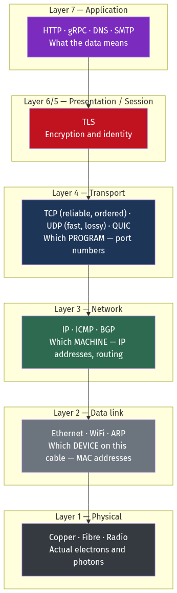

<details>
<summary>Diagram source (Mermaid)</summary>

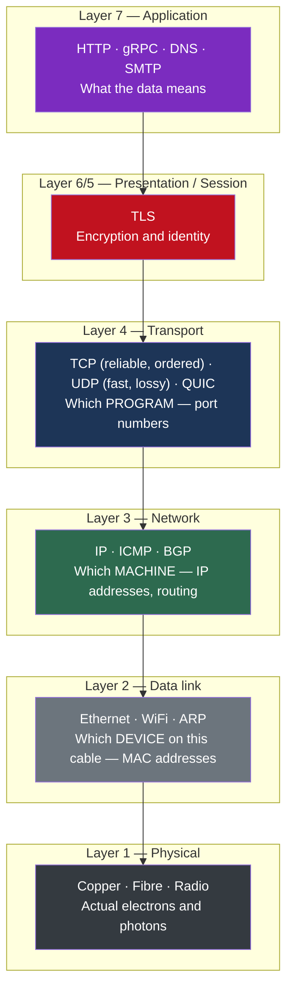

</details>

💡 **The two questions that define layers 3 and 4:**
- Layer 3 (**IP address**) answers *"which machine?"*
- Layer 4 (**port**) answers *"which program on that machine?"*

Everything else in this chapter is elaboration on those two questions plus "how do I make
it reliable, private and fast."

---

## Deep dive

### 4.1 IP — getting to the right machine

**IP (Internet Protocol)** does one job: deliver a packet from one machine to another. It
makes **no promises**. Packets may be lost, duplicated, reordered, or delayed arbitrarily.
This is called **best-effort delivery**, and it is not a flaw — it's what makes IP simple
enough to run on every network in the world.

#### IPv4

32 bits, written as four numbers 0–255: `192.168.1.1`. That's 2³² ≈ **4.3 billion**
addresses. We ran out in 2011.

**CIDR notation** describes a *range* of addresses: `10.0.0.0/8` means "the first 8 bits are
fixed, the remaining 24 vary." That's 2²⁴ = 16.7 million addresses.

| Notation | Fixed bits | Number of addresses | Common use |
| --- | --- | --- | --- |
| `/8` | 8 | 16,777,216 | A whole private range |
| `/16` | 16 | 65,536 | A VPC |
| `/20` | 20 | 4,096 | A large subnet |
| `/24` | 24 | 256 | A typical subnet |
| `/32` | 32 | 1 | A single host |

📐 **The formula:** a `/N` block contains **2^(32−N)** addresses. Cloud providers reserve
5 addresses per subnet (network address, broadcast, and three for the platform), so a `/24`
gives you 251 usable.

**Private ranges** (RFC 1918) — not routable on the public internet:

| Range | Size | Typically used for |
| --- | --- | --- |
| `10.0.0.0/8` | 16.7M | Large corporate networks, cloud VPCs |
| `172.16.0.0/12` | 1M | Docker's default bridge is in here (`172.17.0.0/16`) |
| `192.168.0.0/16` | 65K | Home routers |

#### NAT — how 4.3 billion addresses served 20 billion devices

**NAT (Network Address Translation)** lets many machines share one public IP. Your router
rewrites the source address and port on the way out, remembers the mapping, and rewrites
it back on the way in.

```
Laptop 192.168.1.5:51234 → Router → 203.0.113.7:62001 → Server
Router's table: 203.0.113.7:62001 ⇄ 192.168.1.5:51234
```

⚠️ **NAT's consequences for system design:**
- **Inbound connections don't work.** The router doesn't know which internal machine a new
  inbound packet is for. This is why peer-to-peer systems need STUN/TURN servers, and why
  you can't just "connect back" to a client.
- **NAT tables have timeouts** (typically 30 s – 5 min for UDP, 2–24 h for TCP). An idle
  connection silently dies. This is why **TCP keepalives** and WebSocket **ping frames**
  exist — they're not for detecting failure, they're for keeping the NAT entry alive.
- **Ports are a limited resource.** One NAT gateway can multiplex roughly 64,000
  connections per destination IP:port pair. AWS NAT Gateways enforce exactly this and
  produce `ErrorPortAllocation` when exceeded.

#### IPv6

128 bits: `2001:0db8:85a3::8a2e:0370:7334`. That's 3.4 × 10³⁸ addresses — enough for every
atom on Earth's surface to have several. No NAT needed; every device gets a public address.

Adoption is around 40–45% of Google's traffic. In practice you design for **dual-stack**:
support both, prefer IPv6 when available.

### 4.2 TCP — making an unreliable network reliable

**TCP (Transmission Control Protocol)** adds four guarantees on top of IP:

1. **Reliability** — lost packets are retransmitted
2. **Ordering** — bytes arrive in the order sent
3. **Flow control** — a fast sender won't overwhelm a slow receiver
4. **Congestion control** — a fast sender won't overwhelm the *network*

Each guarantee costs something. Understanding the cost is the point.

#### The three-way handshake

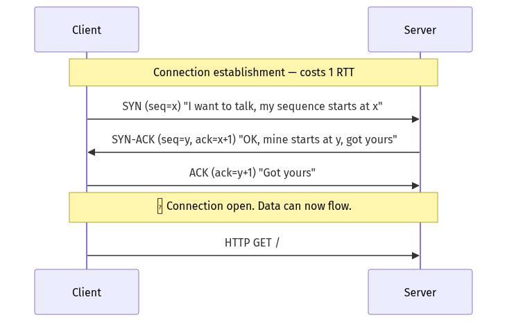

<details>
<summary>Diagram source (Mermaid)</summary>

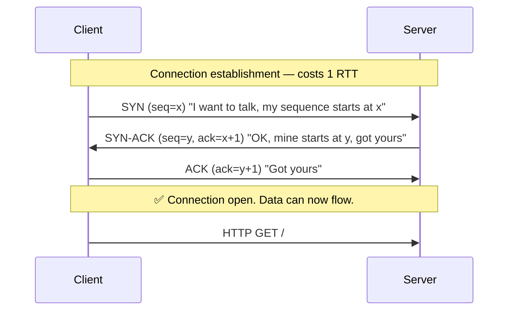

</details>

📐 **This costs exactly one round trip before a single byte of your data moves.** If the
server is 80 ms away, you have spent 80 ms doing nothing useful.

**Why three messages and not two?** Both sides need to (a) announce their starting sequence
number and (b) confirm they received the other's. That's inherently four pieces of
information, and the middle message combines two of them.

#### Connection teardown

Closing takes **four** messages (FIN, ACK, FIN, ACK) because each direction closes
independently — TCP is full-duplex, and one side may still have data to send.

⚠️ **`TIME_WAIT`** is a real operational problem. After closing, the initiating side holds
the socket in `TIME_WAIT` for **2 × MSL** (Maximum Segment Lifetime), typically **60
seconds on Linux**. This exists to absorb stray delayed packets from the dead connection.

The consequence: a proxy opening and closing 1,000 connections/second to one backend
accumulates 60,000 sockets in `TIME_WAIT` and exhausts its ephemeral ports. Symptoms are
`EADDRNOTAVAIL` errors and a service that appears to fail under load for no visible reason.

**Fixes, in order of preference:**
1. **Reuse connections** (keep-alive, connection pooling). Solves it properly.
2. `net.ipv4.tcp_tw_reuse = 1` — lets outbound connections reuse `TIME_WAIT` sockets safely.
3. Widen the ephemeral range: `net.ipv4.ip_local_port_range = 10000 65000`.
4. ⚠️ **Not** `tcp_tw_recycle` — it was removed from Linux 4.12 because it breaks clients
   behind NAT. If a blog post recommends it, the blog post is out of date.

#### Reliability: sequence numbers and acknowledgements

Every byte has a sequence number. The receiver acknowledges the highest contiguous byte
received. If the sender doesn't get an ACK within the **RTO (retransmission timeout)**, it
resends.

Two ways loss is detected:

| Mechanism | Trigger | Cost |
| --- | --- | --- |
| **Fast retransmit** | 3 duplicate ACKs (receiver saw a gap) | ~1 RTT |
| **RTO timeout** | Timer expires; initial RTO is **1 second** on Linux | **≥ 1 second** |

⚠️ **This is why a single lost packet can add a full second to a request.** If the loss is
at the *end* of a transfer, there are no subsequent packets to trigger duplicate ACKs, so
you fall back to the timeout. A "mysterious 1-second P99" is very often exactly this.
Mitigations: **Tail Loss Probe** (enabled by default on modern Linux) and RACK-TLP.

#### Flow control: the receive window

The receiver advertises a **window** — how many bytes it can currently buffer. The sender
must not have more than that in flight.

📐 **Maximum throughput = Window / RTT**

This is the **bandwidth-delay product**, and it's the most under-appreciated formula in
network performance.

```
Window = 64 KB (the maximum without window scaling), RTT = 100 ms
Throughput = 65,536 bytes / 0.1 s = 655 KB/s = 5.2 Mbps
```

⚠️ **On a 10 Gbps link.** You would get 5.2 Mbps — 0.05% of the available bandwidth —
purely because of the window size. This is why **TCP window scaling** (RFC 1323) exists,
allowing windows up to 1 GB. It's on by default now, but the formula still binds:

```
To saturate 10 Gbps over a 100 ms RTT:
Window needed = 10,000,000,000 bits/s × 0.1 s ÷ 8 = 125 MB
```

💡 **You cannot fix latency with bandwidth.** A long-distance high-bandwidth transfer needs
a large window *and* an operating system tuned to allow it. This is why bulk transfer
between continents often uses many parallel TCP connections — each gets its own window.

#### Congestion control: why your connection starts slow

The sender maintains a **congestion window (cwnd)** — its own estimate of how much the
*network* can absorb. The actual limit is `min(receive window, cwnd)`.

**Slow start:** cwnd begins at about 10 packets (~14 KB) and **doubles every RTT**.

```
RTT 1:  10 packets  (~14 KB)
RTT 2:  20 packets  (~29 KB)
RTT 3:  40 packets  (~58 KB)
RTT 4:  80 packets  (~116 KB)
RTT 5: 160 packets  (~232 KB)
```

📐 **Worked consequence:** to transfer a 1 MB file over a 100 ms RTT link, slow start alone
requires ~7 round trips = **700 ms**, regardless of whether the link is 10 Mbps or 10 Gbps.

💡 **This is why connection reuse is worth so much.** A warm connection has already grown
its cwnd. A new connection starts over at 14 KB. HTTP keep-alive, connection pooling and
HTTP/2 multiplexing all exist substantially to avoid paying slow start repeatedly.

**Congestion control algorithms:**

| Algorithm | Signal it reacts to | Behaviour | Where used |
| --- | --- | --- | --- |
| **Reno / NewReno** | Packet loss | Halve cwnd on loss, +1 per RTT otherwise | Historical default |
| **CUBIC** | Packet loss | Cubic growth curve; recovers faster on high-BDP links | **Linux default** |
| **BBR** | Bandwidth and RTT measurement | Models the path directly; ignores loss as a signal | Google, YouTube, many CDNs |

⚠️ **The problem CUBIC has:** it treats *any* loss as congestion. On a wireless link where
loss is caused by radio interference rather than congestion, CUBIC needlessly halves its
rate. **BBR** measures the actual bottleneck bandwidth and round-trip time instead, and on
lossy long-haul links routinely delivers **2–25× more throughput**. Google reported a 4%
average throughput improvement on YouTube globally and far more on poor connections.

⚠️ **Bufferbloat:** intermediate routers with large buffers absorb excess packets rather
than dropping them. Loss-based algorithms interpret "no loss" as "send faster," filling
those buffers and adding *seconds* of latency without any loss at all. BBR was designed
specifically to avoid this.

### 4.3 UDP — when you don't want any of that

**UDP (User Datagram Protocol)** is IP plus port numbers plus a checksum. No handshake, no
retransmission, no ordering, no congestion control.

| | TCP | UDP |
| --- | --- | --- |
| Connection setup | 1 RTT handshake | None — send immediately |
| Reliability | Guaranteed | None |
| Ordering | Guaranteed | None |
| Congestion control | Yes | None (you must implement it) |
| Header size | 20 bytes | **8 bytes** |
| Head-of-line blocking | Yes | No |
| Use it for | HTTP, databases, anything where correctness matters | DNS, video calls, gaming, QUIC, metrics |

💡 **The key insight about UDP:** for real-time media, a packet that arrives late is
*worse than useless*. If a video frame from 300 ms ago finally arrives, you don't want it —
you've already moved on. TCP would stall the whole stream waiting for it. UDP lets you skip
it and keep going. **Retransmission is only valuable if the data still matters when it
arrives.**

⚠️ UDP has no congestion control, so an application using it must implement its own or it
will contribute to internet congestion collapse. QUIC and WebRTC both implement congestion
control in userspace on top of UDP.

### 4.4 TLS — privacy and identity

**TLS (Transport Layer Security)**, the successor to SSL, provides three things:

1. **Confidentiality** — nobody in between can read it
2. **Integrity** — nobody can modify it undetected
3. **Authentication** — you're talking to who you think you are

That third one is what certificates are for, and it's the part people understand least.

#### TLS 1.2 handshake — 2 RTT

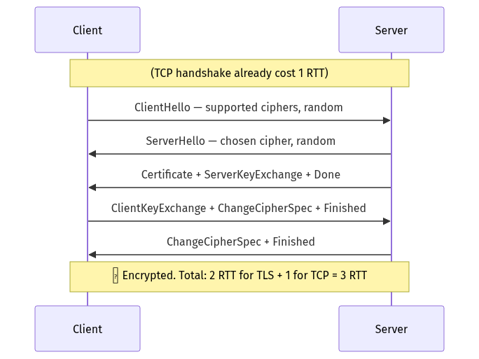

<details>
<summary>Diagram source (Mermaid)</summary>

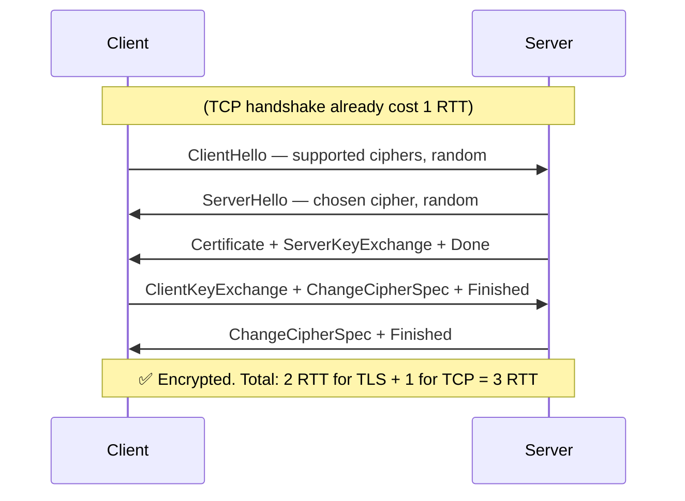

</details>

#### TLS 1.3 handshake — 1 RTT

TLS 1.3's key change: the client **guesses** which key-exchange group the server will pick
and sends its key share in the very first message. If it guesses right (it almost always
does — X25519), the server can complete the exchange immediately.

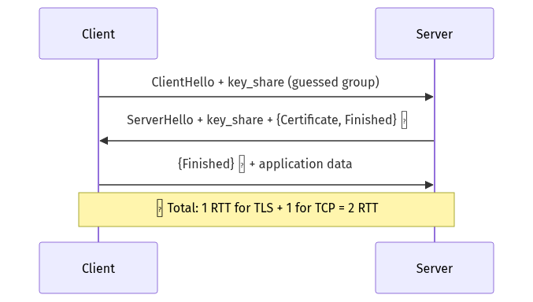

<details>
<summary>Diagram source (Mermaid)</summary>

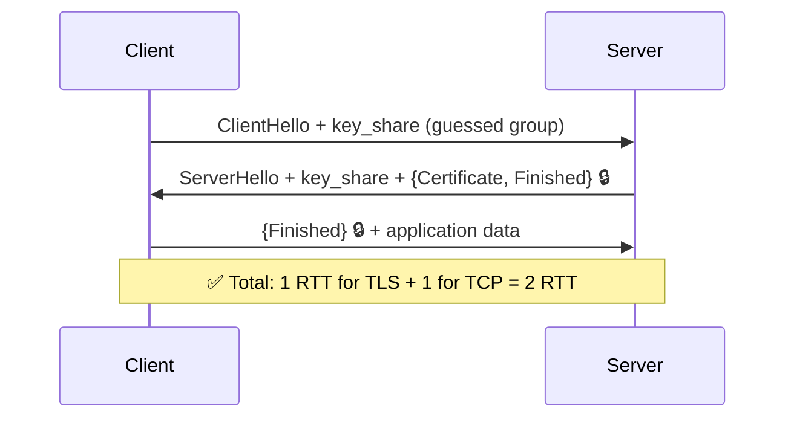

</details>

📐 **At a 100 ms RTT:**

| Version | Total to first byte of response |
| --- | --- |
| HTTP (no TLS) | 1 RTT TCP + 1 RTT request = **200 ms** |
| HTTPS with TLS 1.2 | 1 + 2 + 1 = **400 ms** |
| HTTPS with TLS 1.3 | 1 + 1 + 1 = **300 ms** |
| HTTP/3 (QUIC) | 1 combined + 1 = **200 ms** |
| HTTP/3 with 0-RTT | **100 ms** |

TLS 1.3 also **removed all the broken cryptography**: RSA key transport (no forward
secrecy), CBC mode ciphers, RC4, SHA-1, compression, and renegotiation. Fewer choices means
fewer ways to configure it insecurely.

#### 0-RTT resumption — and its real cost

If you've talked to this server before, TLS 1.3 lets you send application data in the
**very first packet**, using a pre-shared key from the previous session. Zero round trips.

⚠️ **0-RTT data is replayable.** An attacker who captures that first packet can resend it
later, and the server has no way to know it's a duplicate — there's been no round trip to
establish freshness.

**Rule: only send idempotent requests in 0-RTT.** A `GET` is fine. A
`POST /transfer?amount=1000` is a catastrophe. Most servers restrict 0-RTT to safe methods
by default; if you're implementing this, verify it.

#### Certificates and the chain of trust

A **certificate** binds a public key to a domain name, signed by a **Certificate Authority
(CA)** your operating system already trusts.

```
Root CA (in your OS trust store, self-signed, offline, 20-year validity)
  └─ signs → Intermediate CA (online, 5-10 years)
       └─ signs → your-site.com (90 days for Let's Encrypt)
```

The server sends its certificate **plus the intermediates**. The client walks the chain up
to a root it trusts.

⚠️ **The single most common TLS misconfiguration:** forgetting to serve the intermediate
certificate. It works in your browser (which has cached the intermediate from another site)
and fails in `curl`, in mobile apps, and in service-to-service calls. Always test with
`openssl s_client -connect host:443 -showcerts`.

**SNI (Server Name Indication):** the client sends the requested hostname *in plaintext* in
the ClientHello, so a server hosting many sites on one IP knows which certificate to
present. ⚠️ Because it's plaintext, SNI leaks which site you're visiting even over HTTPS.
**Encrypted Client Hello (ECH)** fixes this and is rolling out now.

**mTLS (mutual TLS):** the *client* also presents a certificate, so both sides authenticate.
This is the standard for service-to-service authentication inside a cluster, and it's what
a service mesh gives you automatically ([Chapter 16](./16_microservices_and_service_architecture.md)).

### 4.5 DNS — the internet's phone book

DNS translates `example.com` into `93.184.216.34`. It is a hierarchical, aggressively
cached, distributed database — and it's the most common cause of "the internet is broken."

#### Full recursive resolution

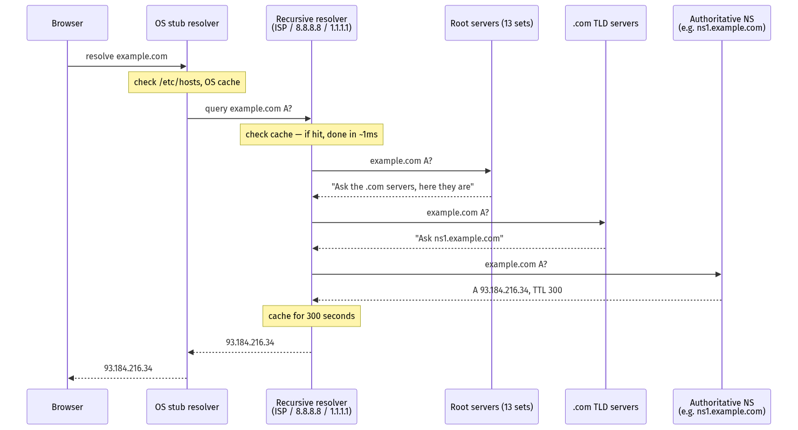

<details>
<summary>Diagram source (Mermaid)</summary>

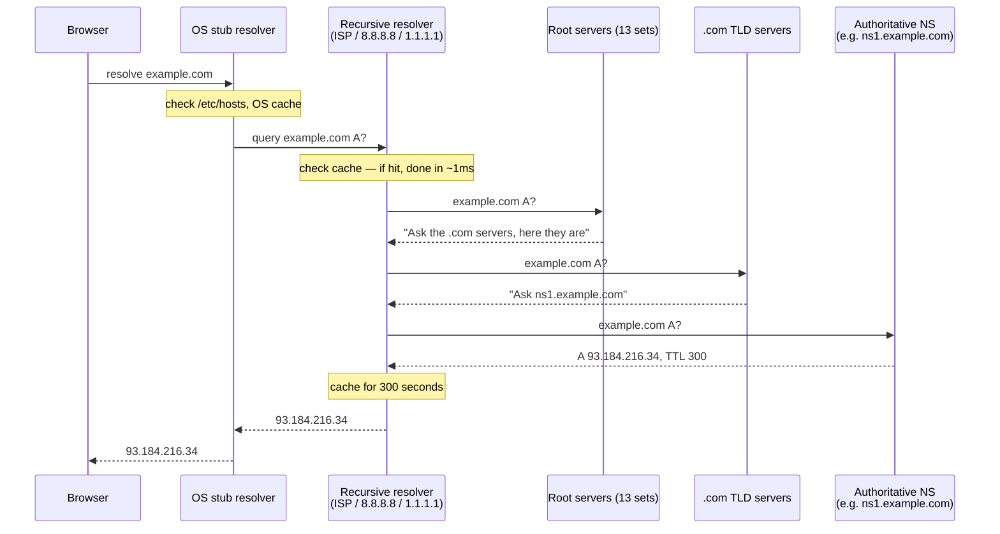

</details>

**Latency:** a fully cold lookup is 3 round trips to potentially distant servers —
**50–300 ms**. A warm one from the recursive resolver's cache is **1–5 ms**. From the OS
cache, **0 ms**.

💡 **The root servers.** There are 13 root server *addresses* (a limit imposed by the
original 512-byte DNS-over-UDP packet size), but over 1,900 physical instances worldwide,
reachable via **anycast** (§4.6). They handle the entire internet's fallback DNS load
because almost everything is cached before reaching them.

#### Record types

| Type | Maps | Example | Notes |
| --- | --- | --- | --- |
| **A** | Name → IPv4 | `example.com → 93.184.216.34` | |
| **AAAA** | Name → IPv6 | `example.com → 2606:2800:220:1::` | |
| **CNAME** | Name → another name | `www → example.com` | ⚠️ Cannot coexist with other records at the same name, so **cannot be used at the zone apex** (`example.com` itself) |
| **ALIAS / ANAME** | Name → another name, resolved server-side | `example.com → lb.aws.com` | Non-standard; provider-specific fix for the apex-CNAME problem |
| **MX** | Domain → mail server | `example.com → 10 mail.example.com` | Number is priority (lower wins) |
| **NS** | Domain → its authoritative servers | `example.com → ns1.provider.net` | This is what delegation looks like |
| **TXT** | Arbitrary text | SPF, DKIM, domain verification | |
| **SRV** | Service → host + port | `_sip._tcp.example.com → 10 60 5060 sip.example.com` | Used by Kubernetes headless services |
| **CAA** | Which CAs may issue certs | `example.com → 0 issue "letsencrypt.org"` | Prevents mis-issuance |
| **PTR** | IP → name (reverse) | `34.216.184.93.in-addr.arpa` | Mail servers check this |

#### TTL, and why DNS is a bad failover mechanism

Every record has a **TTL (time to live)** in seconds — how long resolvers may cache it.

| TTL | Effect |
| --- | --- |
| 60 s | Fast changes, high query load on your DNS |
| 300 s (5 min) | Common default |
| 3600 s (1 h) | Good for stable records |
| 86400 s (1 d) | NS records, MX records |

⚠️ **DNS-based failover is unreliable and you must say so in interviews.** Reasons:
1. **Resolvers ignore your TTL.** Many ISPs enforce a minimum (often 30–60 minutes)
   regardless of what you set.
2. **Browsers cache independently.** Chrome pins DNS for ~60 seconds minimum and doesn't
   always honour TTL.
3. **Applications cache forever.** The JVM historically cached DNS results for the process
   lifetime (`networkaddress.cache.ttl` defaulted to −1). Countless outages have come from
   a Java service holding a dead IP for hours.
4. **The propagation tail is long.** Even with a 60 s TTL, a meaningful fraction of clients
   take 10+ minutes.

💡 **What to do instead:** use DNS to point at a *stable* address — a load balancer VIP or
an anycast IP — and do the actual failover **below** DNS, at the load balancer or in BGP.
Change the destination behind a fixed name, not the name.

**Lower your TTL before a planned migration.** Drop it to 60 s a full TTL-period *ahead* of
the change, so caches have expired the old long TTL by the time you cut over.

#### DNS over UDP, TCP, TLS and HTTPS

DNS traditionally uses **UDP port 53**, with a 512-byte limit. Responses larger than that
set a truncation bit and the client retries over **TCP**. EDNS(0) raised the UDP limit to
4096 bytes.

⚠️ **A firewall that blocks DNS over TCP will break DNSSEC and large responses** in ways
that look completely random. Allow both.

| Protocol | Port | Privacy | Notes |
| --- | --- | --- | --- |
| DNS | UDP/TCP 53 | None — plaintext | The default |
| **DoT** (DNS over TLS) | 853 | Encrypted | Distinguishable by port |
| **DoH** (DNS over HTTPS) | 443 | Encrypted, indistinguishable from web traffic | Bypasses network-level DNS filtering — a feature or a problem depending on who you are |

### 4.6 BGP and anycast — how the internet routes

**BGP (Border Gateway Protocol)** is how independent networks (called **Autonomous
Systems**) tell each other which IP ranges they can reach. The entire global routing table —
about 950,000 routes — is maintained by networks announcing prefixes to their neighbours.

⚠️ **BGP has essentially no built-in authentication.** A network can announce a prefix it
doesn't own, and traffic will follow. This has caused major incidents:
- 2008: Pakistan Telecom announced a YouTube prefix, taking YouTube offline globally
- 2021: Facebook withdrew its own BGP routes during a config change, making its entire
  network — including the DNS servers needed to reach the tools to fix it — unreachable for
  six hours

**RPKI (Resource Public Key Infrastructure)** cryptographically validates route origins and
is now widely deployed, but adoption is not universal.

#### Anycast

**Anycast** means announcing the **same IP address from many locations**. BGP naturally
routes each user to the topologically nearest announcement.

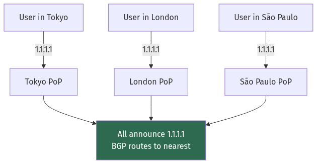

<details>
<summary>Diagram source (Mermaid)</summary>

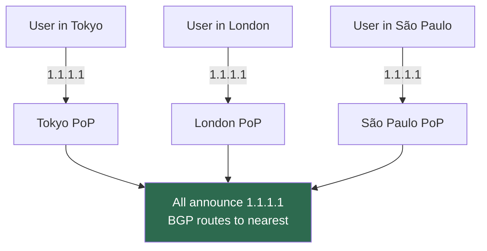

</details>

| Property | Consequence |
| --- | --- |
| Automatic geographic routing | No GeoDNS needed; no client-side logic |
| Automatic failover | Withdraw the announcement and traffic reroutes in seconds |
| DDoS absorption | Attack traffic is split across every PoP rather than concentrated |
| ⚠️ Route flap breaks TCP | If BGP re-converges mid-connection, packets land at a different server with no state → connection resets |

💡 That last row is why anycast is used heavily for **stateless UDP** services (DNS —
`8.8.8.8` and `1.1.1.1` are both anycast) and for **CDN edge entry points** where a reset is
cheap, but is used carefully for long-lived stateful TCP connections. Modern CDNs handle
this with stable flow hashing at the edge.

### 4.7 HTTP — 1.1 vs 2 vs 3

#### HTTP/1.1 (1997)

Text-based, one request at a time per connection.

```http
GET /api/users/42 HTTP/1.1
Host: api.example.com
Accept: application/json
```

**Head-of-line blocking at the application layer:** a connection can only carry one
request/response at a time. If request 1 is slow, requests 2 and 3 wait.

The workaround browsers adopted: **open 6 connections per hostname**. Which is why
"domain sharding" (serving assets from `static1.example.com`, `static2.example.com`) was a
real optimisation — it multiplied 6 by the number of hostnames.

⚠️ **HTTP pipelining** was supposed to fix this by allowing multiple in-flight requests.
It failed: responses still had to come back in order, so one slow response blocked
everything anyway, and buggy proxies mangled it. Essentially every browser disabled it.

#### HTTP/2 (2015)

Binary, and **multiplexed**: many independent **streams** share one TCP connection.

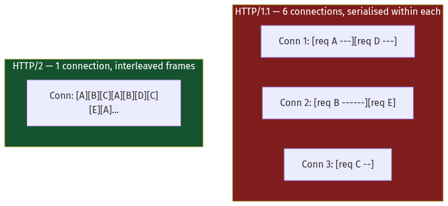

<details>
<summary>Diagram source (Mermaid)</summary>

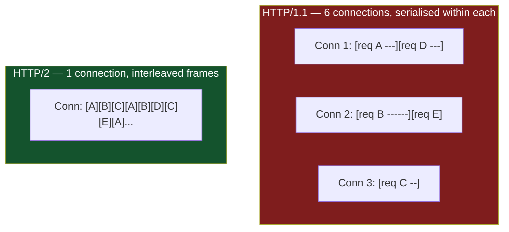

</details>

Key features:

| Feature | What it does | Real benefit |
| --- | --- | --- |
| **Multiplexing** | Many streams on one connection | Removes application-layer HOL blocking; one TCP connection instead of 6 |
| **Binary framing** | Length-prefixed frames instead of text parsing | Faster, unambiguous parsing |
| **HPACK header compression** | Static + dynamic table of header names/values | Typical requests carry ~800 bytes of headers, mostly identical. HPACK cuts this by 80–90%. |
| **Stream priority** | Client hints at what matters | Poorly implemented in practice; removed in HTTP/3's original form |
| **Server push** | Server sends resources unrequested | ⚠️ **Deprecated.** Chrome removed it in 2022 — it wasted bandwidth pushing things the client already had cached. Use `103 Early Hints` instead. |

⚠️ **HTTP/2 did NOT fix head-of-line blocking. It moved it down a layer.** All streams share
one TCP connection, and TCP guarantees in-order delivery of the *byte stream*. If one packet
is lost, TCP holds back **every** stream's data until it's retransmitted — even streams
whose data arrived fine.

On a clean network, HTTP/2 is clearly better. On a lossy network (mobile, congested WiFi),
HTTP/2 over one connection can be **worse than HTTP/1.1 over six**, because six connections
means one loss only stalls one sixth of your requests.

#### HTTP/3 and QUIC (2022)

**QUIC** rebuilds the transport layer on top of UDP, in userspace, and this fixes the
remaining problem.

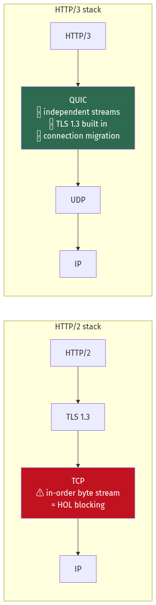

<details>
<summary>Diagram source (Mermaid)</summary>

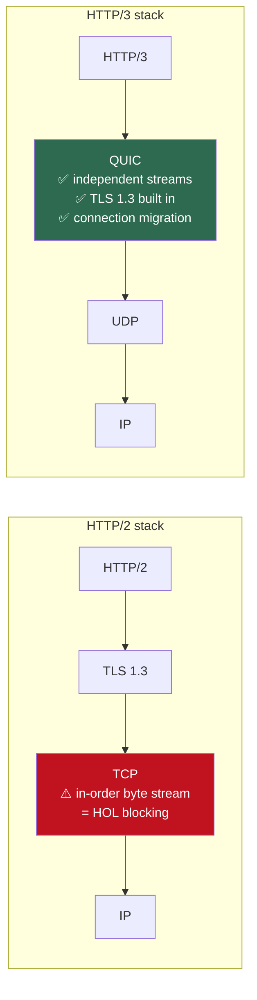

</details>

| QUIC feature | Why it matters |
| --- | --- |
| **Independent streams** | Loss on stream 3 does not stall streams 1, 2, 4. **True HOL-blocking elimination.** |
| **Combined transport + crypto handshake** | 1 RTT to fully established (vs TCP's 1 + TLS's 1 = 2). 0-RTT on resumption. |
| **Connection IDs, not 4-tuples** | Your connection survives changing networks. Walk out of WiFi onto 5G mid-download and it continues — TCP would reset. |
| **Userspace implementation** | Congestion control can be updated by shipping an app, not a kernel |
| **Always encrypted** | Even the transport headers. Middleboxes can't inspect or "help". |

⚠️ **QUIC's costs, which are real:**
- **Higher CPU.** UDP packets are processed individually rather than with kernel offloads
  built for TCP. Early deployments saw 2–3× the CPU per byte; this has improved with GSO/GRO
  support but hasn't fully closed.
- **UDP is blocked or throttled** on some corporate and mobile networks (~3–5% of clients).
  All HTTP/3 deployments must fall back to HTTP/2.
- **Harder to debug and load balance.** No SYN to hook, connection IDs instead of 4-tuples.

**Adoption:** roughly 30% of Google's traffic, supported by Cloudflare, Fastly, Akamai and
all major browsers. Advertised via the `Alt-Svc` header, so clients discover it after their
first HTTP/2 connection.

### 4.8 Connection pooling — putting it together

Everything above says the same thing: **establishing a connection is expensive**. TCP
handshake (1 RTT) + TLS handshake (1 RTT) + slow start (several RTTs to reach full speed).

A **connection pool** keeps connections open and reuses them.

```go
// Go's default HTTP client is a trap: DefaultMaxIdleConnsPerHost is 2.
// Under concurrency it constantly opens and closes connections, and you
// pay handshake + slow start on nearly every request.
transport := &http.Transport{
    MaxIdleConns:        200,              // total idle across all hosts
    MaxIdleConnsPerHost: 100,              // ⚠️ the one that actually matters
    MaxConnsPerHost:     200,              // hard cap; 0 = unlimited
    IdleConnTimeout:     90 * time.Second, // must be < server's keep-alive timeout
    // Fail fast rather than hanging forever.
    DialContext: (&net.Dialer{
        Timeout:   3 * time.Second,
        KeepAlive: 30 * time.Second,
    }).DialContext,
    TLSHandshakeTimeout:   3 * time.Second,
    ResponseHeaderTimeout: 5 * time.Second,
    ExpectContinueTimeout: 1 * time.Second,
    ForceAttemptHTTP2:     true,
}
client := &http.Client{Transport: transport, Timeout: 10 * time.Second}
```

📐 **How large should the pool be?** Little's Law from [Chapter 2](./02_scalability_and_estimation.md) §2.4:
```
L = λ × W
At 500 req/s with 40 ms downstream latency:
L = 500 × 0.040 = 20 connections
```

⚠️ **Set the pool's idle timeout *shorter* than the server's keep-alive timeout.** Otherwise
you will periodically pick a connection the server has already closed, and get a mysterious
`EOF` or `connection reset by peer` on a small fraction of requests. This is one of the most
common and most confusing production bugs in HTTP clients.

### 4.9 Certificates in production

The TLS handshake in §4.4 assumed a valid certificate appeared. Getting and keeping one is
its own operational discipline, and certificate expiry is a recurring cause of large outages.

**The lifecycle:**

```
1. Generate a private key (never leaves the server, or lives in an HSM/KMS)
2. Create a Certificate Signing Request (CSR) containing the public key + domain
3. Prove domain control:
     HTTP-01  — serve a token at /.well-known/acme-challenge/… (needs port 80)
     DNS-01   — publish a TXT record (works for wildcards and private hosts)
     TLS-ALPN — respond on port 443 with a special ALPN protocol
4. CA issues the certificate
5. Install cert + intermediate chain
6. RENEW before expiry — and this is where things go wrong
```

⚠️ **Let's Encrypt certificates last 90 days**, and the industry is moving shorter (the CA/B
Forum has agreed a path toward 47-day maximum validity). Manual renewal is not viable.
Automate with ACME (`certbot`, `lego`, `cert-manager` in Kubernetes) and — critically —
**alert on days-until-expiry**, not on renewal job success. A renewal job that silently stops
running produces no failed-job alert.

**Revocation, and why it barely works:**

| Mechanism | How | Problem |
| --- | --- | --- |
| **CRL** | Download a list of revoked serials | Lists are huge; clients often skip them |
| **OCSP** | Ask the CA "is this cert still valid?" | ⚠️ Adds a round trip to a third party on the critical path; privacy leak; **fails open** in most browsers |
| **OCSP stapling** | The *server* fetches a signed OCSP response periodically and includes it in the handshake | ✅ No client round trip, no privacy leak. **Enable this.** |
| **Short lifetimes** | Don't revoke — let it expire | The direction the industry is actually going |

💡 The honest summary: **revocation checking is largely ineffective on the public web**
because clients fail open — if the OCSP responder is unreachable, they proceed anyway.
Short-lived certificates are the real mitigation, which is why validity periods keep
shrinking.

**Certificate pinning.** A client hard-codes which certificate or public key it will accept,
so a compromised CA can't impersonate the server.

⚠️ **Pinning is dangerous.** If you pin a certificate and rotate the key, every pinned client
is bricked until it ships an update — which for a mobile app means an app-store review cycle.
The safe pattern is to pin the **public key** (not the certificate), pin a **backup key** as
well, and set a short `max-age`. HTTP Public Key Pinning (HPKP) for browsers was deprecated
and removed precisely because it let sites permanently destroy themselves. **Certificate
Transparency** plus **CAA records** achieve most of the benefit without the footgun.

**mTLS at scale.** For service-to-service authentication, every workload needs a certificate,
and doing this by hand is impossible. The pattern is a **workload identity system** — SPIFFE/
SPIRE, Istio's Citadel, or Linkerd's identity service — which issues short-lived certificates
(often 24 hours or less) automatically based on the workload's platform identity. Rotation
becomes continuous rather than an event, which removes expiry as a failure mode entirely.
See [Chapter 18](./18_security_and_identity.md).

### 4.10 Diagnosing network problems

When something is slow or broken, these are the tools and the order to reach for them.

| Question | Tool | What to look at |
| --- | --- | --- |
| Is the name resolving? | `dig +trace example.com` | Full delegation path; compare against `dig @8.8.8.8` |
| Is the host reachable? | `ping`, `mtr example.com` | ⚠️ `mtr` over `traceroute` — it shows loss *per hop* over time |
| Where is the latency? | `mtr --report --report-cycles 100` | Loss at an intermediate hop that doesn't persist to the destination is usually ICMP rate-limiting, not real loss |
| Is the port open? | `nc -zv host 443`, `telnet` | Distinguishes DNS/routing from a firewall or a dead listener |
| What's my TLS doing? | `openssl s_client -connect h:443 -showcerts` | Chain completeness, protocol version, cipher, expiry |
| How many connections? | `ss -s`, `ss -tan state time-wait \| wc -l` | TIME_WAIT accumulation, socket states |
| Are packets being dropped? | `netstat -s`, `nstat` | Retransmits, listen-queue overflows |
| What's actually on the wire? | `tcpdump -i any -nn port 443 -w cap.pcap` | Then read it in Wireshark |
| Is the app or the network slow? | `curl -w @format.txt` | Splits DNS, connect, TLS, TTFB, total |

💡 **The single most useful command** for "is it my server or the network?":

```bash
curl -w "dns:%{time_namelookup}s connect:%{time_connect}s tls:%{time_appconnect}s \
ttfb:%{time_starttransfer}s total:%{time_total}s\n" -o /dev/null -s https://api.example.com
```

Interpreting the output:

```
dns: 0.004  connect: 0.031  tls: 0.068  ttfb: 0.520  total: 0.522
                                              ↑
   Connect and TLS are fast, so the network is fine.
   The 450 ms gap between tls and ttfb is SERVER processing time.

dns: 0.004  connect: 0.212  tls: 0.430  ttfb: 0.445  total: 0.447
                    ↑
   Connect alone took 212 ms → one RTT of ~200 ms. This is DISTANCE.
   The server is only responsible for ~15 ms. Put an edge PoP closer.
```

⚠️ **Two counter-intuitive things about `traceroute`/`mtr` output:**
1. **Loss at an intermediate hop that doesn't appear at later hops is not real loss.** Routers
   deprioritise generating ICMP responses for their own control plane. Only loss that
   *persists to the final hop* matters.
2. **Paths are asymmetric.** The return path may differ entirely from the forward path, and
   `traceroute` only shows you the forward one. A problem you can't see may be on the way back.

**Kernel counters worth knowing** (`netstat -s` / `nstat`):

| Counter | Meaning |
| --- | --- |
| `TCPSynRetrans` | SYNs retransmitted — connection setup failing, often a saturated backlog |
| `ListenOverflows` / `ListenDrops` | ⚠️ The accept queue is full — your app isn't calling `accept()` fast enough. Raise `somaxconn` **and** fix the app. |
| `TCPTimeouts` | RTO fired — real loss or a stalled peer |
| `TCPLostRetransmit` | A retransmission was itself lost — genuinely bad path |
| `PruneCalled` / `RcvPruned` | Receive buffers exhausted; packets dropped at the socket |

### 4.11 Inside the datacentre

The networking above assumed the internet. Traffic *inside* a datacentre has different
properties, and two of them affect design.

**Clos / leaf-spine topology.** Modern datacentres abandon the old three-tier design in favour
of a two-layer fabric: every **leaf** (top-of-rack) switch connects to every **spine** switch.
Any server is exactly two hops from any other, and capacity scales by adding spines.

📐 **Oversubscription ratio** is the number to ask about:
```
Rack: 48 servers × 25 Gbps = 1,200 Gbps of server capacity
Uplinks: 8 × 100 Gbps = 800 Gbps to the spine
Oversubscription = 1200 : 800 = 1.5 : 1
```
At 3:1 or worse — still common — a rack whose servers all transmit simultaneously will
saturate its uplinks regardless of what the NICs can do.

💡 **This is why rack and AZ placement matters.** Two chatty services in the same rack use
only the leaf switch. The same two services spread across racks consume oversubscribed spine
capacity, and across AZs they consume metro links *and* incur cross-AZ transfer charges
([Chapter 2](./02_scalability_and_estimation.md) §2.10). Kubernetes topology-aware routing and
Envoy's locality-weighted load balancing exist to exploit this.

**Incast — the datacentre-specific failure.** A scatter-gather query fans out to 40 servers,
all of which respond at the same instant to the same client. Their combined burst overflows
the shallow buffer on the last switch port, packets are dropped, and TCP falls back to an
RTO — which in a datacentre where RTT is 250 µs means a **200 ms** stall, a factor of 800.

⚠️ This is why P99 latency in fan-out architectures is often dominated by a small number of
requests that took exactly ~200 ms. Mitigations: lower `RTO_min`, ECN/DCTCP for early
congestion signalling, staggering responses, and reducing fan-out width
([Chapter 3](./03_reliability_availability_performance.md) §3.10).

---

## Worked example — where did 800 ms go?

*Users in Sydney report your API (hosted in `us-east-1`, Virginia) feels slow. Server-side
metrics say P50 is 25 ms. Find the missing time.*

**Step 1 — Establish the physical floor.**
```
Sydney → Virginia great-circle distance ≈ 15,900 km
Speed of light in fibre ≈ 200,000 km/s (about ⅔ of c)
One-way minimum = 15,900 / 200,000 = 79.5 ms
Round trip minimum = 159 ms
Real-world (routing is not a straight line): ~200 ms RTT
```

⚠️ **You cannot beat this with better code.** 200 ms is physics plus routing.

**Step 2 — Count the round trips for a cold request.**

| Step | RTTs | Time @ 200 ms |
| --- | --- | --- |
| DNS (uncached, recursive) | ~2 | 400 ms* |
| TCP handshake | 1 | 200 ms |
| TLS 1.2 handshake | 2 | 400 ms |
| HTTP request/response | 1 | 200 ms |
| Server processing | — | 25 ms |
| **Total (cold)** | | **~1,225 ms** |

*DNS is usually to a nearer resolver, so call it 100 ms in practice → ~925 ms.

**Step 3 — Identify each fix and quantify it.**

| Fix | Mechanism | Saving |
| --- | --- | --- |
| Upgrade TLS 1.2 → 1.3 | One fewer handshake RTT | **−200 ms** |
| Connection keep-alive | Amortise TCP+TLS over many requests | **−600 ms** on all but the first |
| HTTP/3 (QUIC) | Combined transport+crypto handshake | **−200 ms** more |
| 0-RTT resumption (GETs only) | Zero handshake on repeat visits | **−200 ms** more |
| **Put a CDN/edge PoP in Sydney** | RTT drops from 200 ms to ~5 ms | **The real fix** |

**Step 4 — With an edge PoP in Sydney terminating TLS:**

```
User → Sydney edge:     5 ms RTT
  TCP handshake:        5 ms
  TLS 1.3 handshake:    5 ms
  Request:              5 ms
Edge → Virginia origin: connection already warm and pooled
  Origin round trip:  200 ms
  Server processing:   25 ms
Total: 15 + 225 = 240 ms   (down from 925 ms)
```

**Step 5 — And if the response is cacheable at the edge:**
```
Total: 15 ms
```

💡 **The lesson.** The server was never the problem — it was 25 ms out of 925. **Round trips
were the problem.** The fixes, in order of leverage: (1) reduce the *distance*, (2) reduce
the *number* of round trips, (3) only then optimise the server. This ordering is correct for
almost every latency investigation involving geography.

---

## Trade-offs

| Decision | Option A | Option B | Choose A when | Never choose A when |
| --- | --- | --- | --- | --- |
| Transport | TCP | UDP | You need reliability and ordering | Late data is worthless — media, gaming, telemetry |
| HTTP version | HTTP/1.1 | HTTP/2 | Debuggability matters; few large requests; proxies in the path are old | Many small resources over one connection |
| HTTP version | HTTP/2 | HTTP/3 | Network is reliable; CPU is constrained; UDP may be blocked | Mobile/lossy networks, or clients that change networks mid-session |
| TLS resumption | Full handshake | 0-RTT | Any non-idempotent request | Replay would cause harm — never 0-RTT a POST |
| Failover mechanism | DNS TTL change | Anycast / LB VIP | You're migrating providers entirely | You need failover in seconds — DNS caching makes this unreliable |
| Geographic routing | GeoDNS | Anycast | You need explicit control over which region serves whom | Long-lived stateful TCP where route flap causes resets |
| Congestion control | CUBIC | BBR | Standard datacentre links, low loss | Lossy/wireless/long-haul paths — BBR is dramatically better there |
| Connection handling | New connection per request | Pooled keep-alive | Never, in practice | Always pool. The handshake + slow-start cost dominates. |

---

## How real companies do it

**Cloudflare** announces `1.1.1.1` from over 300 cities via anycast. Their published median
DNS resolution time is around 11 ms globally — achieved not by faster servers but by being
physically close to everyone. They were also among the first to deploy HTTP/3 at scale and
publish detailed data on its wins for mobile clients specifically.

**Google** developed both QUIC and BBR. Their BBR paper reports throughput improvements of
**2–25×** on high-loss long-haul paths versus CUBIC, and Google.com/YouTube ran QUIC in
production for years before it was standardised as HTTP/3. Both were driven by the same
observation: the internet's assumptions (loss means congestion; connections are tied to IP
addresses) stopped being true.

**Facebook's October 2021 outage** is the definitive BGP cautionary tale. A command intended
to assess backbone capacity withdrew the BGP routes to Facebook's DNS servers. With DNS
unreachable, every Facebook property vanished from the internet — and because their internal
tools and even their physical badge readers depended on the same infrastructure, engineers
couldn't remotely fix it or physically enter the datacentre. Six hours. **The lesson: your
recovery path must not depend on the thing that's broken.**

**Netflix** places Open Connect Appliances inside ISP networks — hardware boxes sitting in
the ISP's own datacentre. This eliminates transit entirely: the bytes never traverse the
public internet. It's the most extreme version of "reduce the distance," and it's why
Netflix can be a double-digit percentage of North American traffic without saturating
backbones.

---

## Common mistakes

**Opening a new connection per request.** You pay TCP handshake + TLS handshake + slow start
every time — potentially 600+ ms on a long link. Pool your connections. This is the single
highest-leverage networking fix in most applications.

**Assuming DNS changes propagate quickly.** They don't. Resolvers override your TTL,
browsers pin, and JVMs used to cache forever. Never use DNS as your failover mechanism for
anything that needs to fail over in under an hour.

**Setting the client's idle timeout longer than the server's.** You will periodically grab a
connection the server already closed and get intermittent `EOF` errors that are maddening to
reproduce.

**Not setting timeouts at all.** A TCP connection with no timeout can hang indefinitely —
the default OS retransmission behaviour can take **15+ minutes** to give up. Set dial,
TLS handshake, response-header and total timeouts explicitly.

**Believing HTTP/2 eliminated head-of-line blocking.** It eliminated it at the application
layer and inherited it at the transport layer. On lossy networks, one TCP connection
multiplexing 50 streams can be worse than six connections.

**Using `tcp_tw_recycle`.** It was removed from Linux for breaking NAT'd clients. Use
`tcp_tw_reuse` and connection reuse instead.

**Forgetting the intermediate certificate.** Works in your browser, fails everywhere else.

**Sending non-idempotent requests in TLS 0-RTT.** Replayable. A duplicated payment is the
canonical disaster.

**Confusing bandwidth with latency.** Doubling bandwidth does nothing for a chatty protocol.
Count round trips first.

**Ignoring the bandwidth-delay product.** You cannot saturate a high-bandwidth long-distance
link without a correspondingly large TCP window. `Throughput = Window / RTT` — check it
before blaming the application.

---

## Interview angle

**Q: Walk me through what happens when a request goes from a browser to your server.**

*Strong:* Layer it, with round trips counted. "DNS resolution — check browser cache, OS
cache, then the recursive resolver, which may walk root → TLD → authoritative, so 0 to 3
RTTs. Then TCP three-way handshake, 1 RTT. Then TLS — 1 RTT for 1.3, 2 for 1.2. Then the
HTTP request itself, 1 RTT. So on a 100 ms link we've spent 200–400 ms before the server
does any work. That's why connection reuse and edge termination matter so much more than
server optimisation for geographically distant users."

**Q: TCP or UDP for a video call?**

*Strong:* "UDP, and the reasoning matters more than the answer. In real-time media, a packet
that arrives 300 ms late is worse than a lost one — you've already played past that point.
TCP would stall the entire stream retransmitting it, adding latency to everything after.
UDP lets you drop it and continue, and the codec conceals the gap. WebRTC does exactly this,
implementing its own congestion control on top of UDP since UDP provides none. **The general
principle: retransmission is only valuable if the data still matters when it arrives.**"

**Q: Why is HTTP/3 built on UDP? Isn't UDP unreliable?**

*Strong:* "QUIC reimplements reliability in userspace on top of UDP, so you get reliability
without TCP's constraints. Three wins. First, streams are genuinely independent — a lost
packet stalls only its own stream, whereas HTTP/2 over TCP stalls all of them because TCP
delivers one ordered byte stream. Second, the transport and crypto handshakes are combined,
so it's 1 RTT instead of 2. Third, connections are identified by a connection ID rather than
the IP 4-tuple, so switching from WiFi to cellular doesn't reset the connection. The cost is
higher CPU per byte and roughly 3–5% of networks blocking UDP, so you always need HTTP/2
fallback."

**Q: Your service is slow for users in another continent. What do you do?**

*Strong:* "First establish the floor — the speed of light in fibre is about 200,000 km/s, so
a 16,000 km path has a hard 160 ms round-trip minimum. Nothing I do to the server changes
that. So I count round trips: DNS, TCP, TLS, then the request. On a cold connection that's
4–6 RTTs. My fixes in order of leverage: put an edge PoP near the user so TLS terminates
locally and the origin connection is pooled and warm — that alone cuts the user-visible
handshakes from 200 ms each to 5 ms each. Cache at the edge if the content allows it.
Upgrade to TLS 1.3 and HTTP/3 to remove RTTs. And only then look at the server, which in my
experience is usually a small fraction of the total."

**Q: Why does DNS-based failover not work well?**

*Strong:* "Because you don't control the caches. Resolvers frequently enforce their own
minimum TTL — ISPs commonly clamp to 30 minutes regardless of what you publish. Browsers
pin DNS independently. And application runtimes cache; the JVM historically cached DNS for
the entire process lifetime, which has caused multi-hour outages after a failover. So the
propagation tail is long and unpredictable. The correct pattern is to point DNS at a stable
address — an anycast IP or a load balancer VIP — and do the failover *below* DNS, where you
control it and it takes seconds."

**Q: What is TIME_WAIT and when does it hurt you?**

*Strong:* "After closing a TCP connection, the side that initiated the close holds the
socket in TIME_WAIT for 2× MSL — 60 seconds on Linux — to absorb any delayed packets from
the old connection that might otherwise be misinterpreted by a new connection reusing the
same 4-tuple. It bites when a proxy opens and closes many short-lived connections to one
backend: at 1,000 connections/second you accumulate 60,000 sockets in TIME_WAIT and exhaust
the ephemeral port range, producing EADDRNOTAVAIL. The right fix is connection reuse; the
tuning fixes are `tcp_tw_reuse` and widening `ip_local_port_range`. Not `tcp_tw_recycle` —
that was removed from the kernel for breaking NAT'd clients."

**Q: A request is slow. How do you tell whether it's the network or the server?**

*Strong:* "Split the request into phases with `curl -w`, which reports DNS lookup, TCP
connect, TLS handshake, time-to-first-byte and total separately. If `connect` is 200 ms,
that's one round trip — a distance problem, and no amount of server optimisation helps. If
connect and TLS are fast but there's a large gap between the TLS completion and TTFB, that
gap *is* server processing time. From there I'd use `mtr` rather than `traceroute` to find
where loss is, with one caveat: loss shown at an intermediate hop that doesn't persist to the
final hop is usually just ICMP rate-limiting on that router's control plane, not real loss.
And I'd check `nstat` for `ListenOverflows`, which means the accept queue is full — that's
the application failing to call `accept()` fast enough, and it looks exactly like a network
problem from the outside."

**Q: How do you manage TLS certificates for hundreds of services?**

*Strong:* "Not with certificates that a human renews. For public endpoints, ACME automation —
certbot or cert-manager — with **DNS-01** challenges so it works for wildcards and hosts that
aren't publicly reachable. Critically, I'd alert on **days-until-expiry measured from the
live endpoint**, not on the renewal job succeeding, because a job that silently stops running
generates no failure alert. For service-to-service mTLS I'd use a workload identity system —
SPIFFE/SPIRE or a service mesh's built-in identity — issuing certificates with lifetimes of a
day or less, keyed to the platform's notion of workload identity. When rotation is continuous
rather than an event, expiry stops being a failure mode. I'd also enable **OCSP stapling**,
since client-side OCSP adds a third-party round trip to the handshake and most clients fail
open anyway. And I'd avoid certificate pinning unless there's a specific threat model that
demands it — pinning without a backup key is how you brick a mobile app for an app-store
review cycle."

**Q: Your fan-out queries have a P99 of exactly 200 ms while P50 is 2 ms. What's happening?**

*Strong:* "That 200 ms figure is suspiciously close to Linux's minimum retransmission
timeout, which strongly suggests **TCP incast**. A scatter-gather query fans out to many
servers that all respond at the same instant to the same client; their combined burst
overflows the shallow buffer on the last switch port, a packet is dropped, and because it's
at the tail of a small response there are no subsequent packets to trigger fast retransmit —
so you fall back to the RTO timer. In a datacentre where RTT is 250 microseconds, waiting
200 ms is an 800× penalty. Mitigations: reduce fan-out width, stagger or jitter the
responses, enable ECN/DCTCP so congestion is signalled before drops occur, lower `RTO_min`,
and at the application layer use hedged requests so one stalled response doesn't determine
the result."

**Q: Explain the difference between anycast and GeoDNS.**

*Strong:* "Both route users to a nearby location, but at different layers. GeoDNS returns a
*different IP* depending on where the query came from — a DNS-layer decision that gives you
explicit control, but it inherits all of DNS's caching problems and it sees the *resolver's*
location rather than the user's, which for a centralised resolver can be a continent away.
Anycast announces the *same IP* from many locations and lets BGP pick the topologically
nearest — automatic, fails over in seconds by withdrawing a route, and absorbs DDoS by
splitting the attack across every PoP. The catch is that BGP re-convergence mid-connection
can land packets at a different PoP that has no TCP state for that flow, causing a reset. So
anycast is ideal for stateless UDP like DNS — `8.8.8.8` and `1.1.1.1` are both anycast — and
for CDN entry points where a reset is cheap, and needs more care for long-lived stateful TCP."

---

## Recap

- Networking is **layered**: IP answers "which machine," ports answer "which program," TLS
  adds privacy and identity, HTTP defines meaning.
- **IP is best-effort** — no delivery, ordering or duplication guarantees. **TCP** adds all
  of them, at the cost of round trips.
- **TCP handshake = 1 RTT. TLS 1.2 = 2 more; TLS 1.3 = 1 more; QUIC combines them into 1
  total.** Count round trips before optimising code.
- **Slow start** means a new connection begins at ~14 KB and doubles per RTT — so connection
  reuse is worth hundreds of milliseconds.
- 📐 **Throughput = Window / RTT.** You cannot saturate a long fat link with a small window.
- **BBR** beats CUBIC substantially on lossy paths because it measures bandwidth instead of
  treating loss as congestion.
- **DNS is hierarchical and aggressively cached.** TTLs are advisory — never rely on DNS for
  fast failover.
- **Anycast** puts one IP in many places and lets BGP route to the nearest. Great for DNS
  and CDN edges; risky for long-lived stateful TCP.
- **HTTP/2 moved head-of-line blocking from the application layer to TCP. HTTP/3 removes it**
  by giving each stream independent delivery over UDP.
- **Pool your connections.** Size the pool with Little's Law, and keep the client's idle
  timeout below the server's.
- **Certificates expire and that causes outages.** Automate with ACME, alert on
  days-until-expiry from the live endpoint, enable **OCSP stapling**, and use short-lived
  workload identities for mTLS rather than long-lived certs.
- **`curl -w` splits DNS / connect / TLS / TTFB** and answers "network or server?" in one
  command. In `mtr`, only loss that persists to the final hop is real.
- **Datacentre fabrics are oversubscribed** (often 3:1), so rack and AZ placement changes
  real throughput — and **TCP incast** produces a signature ~200 ms P99 from RTO fallback.

---

## Test yourself

1. A server is 60 ms away (RTT). Using HTTPS with TLS 1.2 on a fresh connection, how long
   before the first byte of the response arrives, ignoring server processing? What about
   with TLS 1.3? With HTTP/3?
2. Your TCP receive window is 256 KB and RTT is 80 ms. What is the maximum throughput on a
   single connection? Is a 1 Gbps link the bottleneck?
3. Why does downloading a 500 KB file over a fresh connection with 100 ms RTT take
   noticeably longer than the file size and bandwidth alone would suggest?
4. You set a DNS TTL of 60 seconds and change the record. Ten minutes later, some users are
   still hitting the old IP. Give three reasons.
5. Your HTTP client intermittently gets `EOF` on roughly 0.5% of requests, with no pattern.
   What is the most likely cause?
6. A proxy makes 2,000 short-lived connections per second to a single backend IP:port. What
   fails, when, and what are the fixes in priority order?
7. On a mobile network with 2% packet loss, would you expect HTTP/2 or HTTP/1.1 with 6
   connections to perform better? Why? What about HTTP/3?
8. Why can't you use a CNAME record at `example.com` itself, and what do you use instead?
9. `curl -w` reports `dns:0.005 connect:0.008 tls:0.014 ttfb:1.230 total:1.244`. Where is the
   time going, and what would you investigate?
10. Your certificate renewal cron job has been failing silently for 80 days. What monitoring
    would have caught this, and why wouldn't "alert if the renewal job fails" have worked?

<details>
<summary>Answers</summary>

1. TLS 1.2: TCP (1 RTT) + TLS (2 RTT) + request (1 RTT) = 4 RTT = **240 ms**.
   TLS 1.3: 1 + 1 + 1 = 3 RTT = **180 ms**.
   HTTP/3: combined QUIC handshake (1 RTT) + request (1 RTT) = 2 RTT = **120 ms**.
   With QUIC 0-RTT on a resumed session: 1 RTT = **60 ms**.

2. Throughput = 262,144 bytes / 0.080 s = 3.28 MB/s = **26 Mbps**. The 1 Gbps link is *not*
   the bottleneck — the window is. To saturate 1 Gbps at 80 ms you'd need a window of
   1,000,000,000 × 0.08 / 8 = **10 MB**. Fix: enable window scaling and raise
   `net.ipv4.tcp_rmem`/`tcp_wmem`, or use multiple parallel connections.

3. **Slow start.** cwnd begins at ~10 packets (~14 KB) and doubles per RTT: 14, 29, 58, 116,
   232, 464 KB — so about 6 RTTs = 600 ms just to reach the point where 500 KB can be in
   flight. On top of that, TCP + TLS handshakes add 2–3 RTTs. The link's bandwidth barely
   matters for a transfer this small; it's dominated by round trips.

4. (a) The recursive resolver enforced its own minimum TTL, commonly 30–60 minutes,
   overriding your 60 s. (b) The client application cached the resolution — JVMs
   historically cached for the process lifetime, and many HTTP clients resolve once per
   connection pool. (c) The browser pinned the DNS result independently of TTL, or an
   intermediate corporate/ISP resolver is serving stale data. A fourth possibility: a
   long-lived TCP connection to the old IP is still open and being reused.

5. The client's connection pool is holding idle connections **longer than the server's
   keep-alive timeout**. The server closes them; the client later picks one from the pool,
   writes a request into a half-closed socket, and gets EOF. Fix: set the client's
   `IdleConnTimeout` below the server's keep-alive timeout (e.g. client 90 s vs server
   120 s), and enable retry-on-idempotent-request for this specific case.

6. **Ephemeral port exhaustion from TIME_WAIT.** At 2,000 conn/s × 60 s of TIME_WAIT =
   120,000 sockets, against a default ephemeral range of ~28,000 ports. It fails within
   ~15 seconds of reaching that rate, with `EADDRNOTAVAIL`/`cannot assign requested address`.
   Fixes in order: (1) **connection pooling and keep-alive** — this eliminates the problem
   rather than mitigating it; (2) `net.ipv4.tcp_tw_reuse=1`; (3) widen
   `net.ipv4.ip_local_port_range`; (4) add source IPs or backend IP:port pairs to expand the
   4-tuple space. Not `tcp_tw_recycle`.

7. At 2% loss, **HTTP/1.1 with 6 connections may well beat HTTP/2 on one connection.** With
   HTTP/2, a single lost packet stalls *all* multiplexed streams until retransmission,
   because TCP delivers an ordered byte stream. With 6 separate connections, a loss stalls
   only the streams on that one connection — the other five keep flowing. **HTTP/3 wins
   clearly** here: QUIC streams are independently delivered, so a lost packet stalls only
   its own stream, giving you HTTP/2's multiplexing benefits without inheriting TCP's HOL
   blocking.

8. A CNAME means "this name is an alias for that name" and, per the DNS specification, a
   name with a CNAME **cannot have any other records**. The zone apex must have NS and SOA
   records by definition, so a CNAME there is illegal. Solutions: (a) an **A record** pointing
   at a stable IP; (b) a provider-specific **ALIAS/ANAME** record (Route 53 alias, Cloudflare
   CNAME flattening) which resolves the target server-side and returns an A record; or (c)
   redirect `example.com` → `www.example.com` at the HTTP layer and CNAME only the `www`.

</details>

---

## Further reading

- Ilya Grigorik, *High Performance Browser Networking* — free online, and the best single
  resource on everything in this chapter
- Cardwell et al., *BBR: Congestion-Based Congestion Control*, ACM Queue 2016
- RFC 9000 (QUIC), RFC 9114 (HTTP/3), RFC 8446 (TLS 1.3) — surprisingly readable
- Cloudflare's blog on anycast, HTTP/3 and BGP — consistently excellent primary material
- Facebook Engineering, *More details about the October 4 outage* — the BGP incident report

---

[← Chapter 3](./03_reliability_availability_performance.md) · [Contents](./README.md) · [Next: Chapter 5 — Load Balancing, Proxies and Traffic Management →](./05_load_balancing_proxies_traffic.md)
