# Chapter 5 — Load Balancing, Proxies and Traffic Management

[← Chapter 4](./04_networking_deep_dive.md) · [Contents](./README.md) · [Next: Chapter 6 →](./06_storage_engines_internals.md)

**Prerequisites:** [Chapter 4](./04_networking_deep_dive.md) (layers, TCP, TLS, anycast) and [Chapter 3](./03_reliability_availability_performance.md) §3.3 (parallel availability).

---

## What you'll learn

- The precise difference between a **forward proxy**, a **reverse proxy**, a **load
  balancer**, an **API gateway** and a **service mesh** — five things people use
  interchangeably and shouldn't
- **Layer 4 vs Layer 7** load balancing, including how Direct Server Return works and when
  it's worth the complexity
- Eight balancing algorithms, and why **power-of-two-choices** beats least-connections while
  being far cheaper
- How **health checks** actually work, why passive checks catch things active checks can't,
  and how a badly-configured health check causes an outage
- Why **sticky sessions** are a trap, and the two cases where they're legitimate
- How the load balancer itself is made highly available (VIP, VRRP, ECMP, anycast)
- **Load shedding** and **admission control** — how to fail 5% of requests to save the other
  95%

---

## Start from zero

A busy restaurant has six identical tables and a host at the door.

The host's job is to look at the room and decide where to seat the next party. That's a
load balancer: **one entry point, many identical workers, a decision about which one.**

The host has options. She could go strictly in rotation — table 1, 2, 3, 4, 5, 6, back to 1.
Simple, but table 3 might have a party ordering a twelve-course tasting menu while table 4
had two coffees. She could instead seat people at whichever table has the fewest guests.
Better, but she has to keep looking. She could remember that table 5's waiter is the fastest
and favour it. Better still, and more work.

She also has to notice when a table is unusable — a spill, a broken chair — and stop seating
people there. And when the kitchen is completely overwhelmed, the right answer is to tell
people at the door *"forty minute wait"* rather than seating them and letting everyone's
food take two hours. **Turning some customers away to protect the experience of the rest is
load shedding**, and it is the single most counter-intuitive idea in this chapter.

Now: the host herself is a single point of failure. If she faints, nobody gets seated even
though all six tables are fine. So you need a second host ready to take over — and that
problem, "how do you make the thing that provides redundancy itself redundant," is §5.7.

---

## The mental model

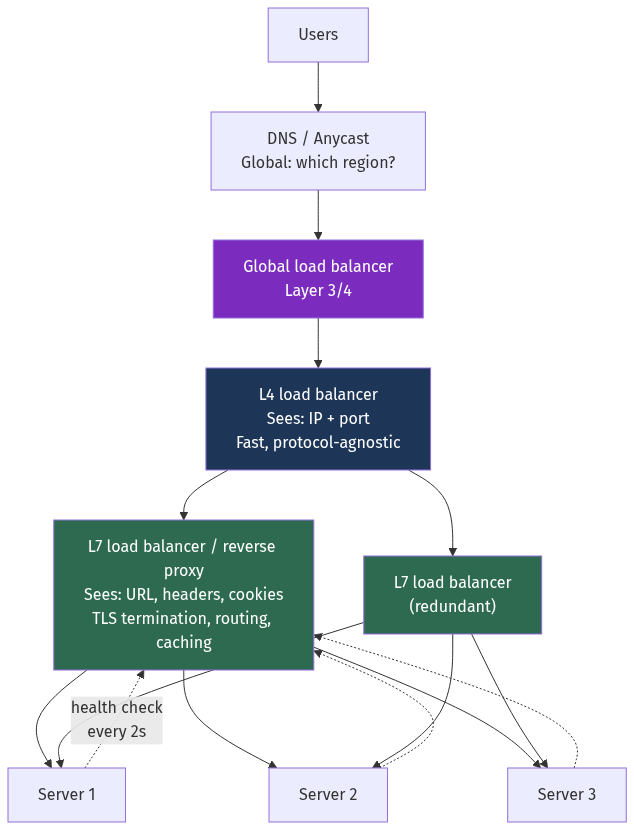

<details>
<summary>Diagram source (Mermaid)</summary>

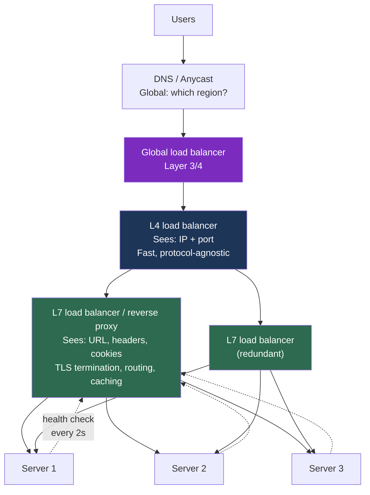

</details>

💡 **Real systems have several layers of balancing**, each solving a different problem:
anycast/DNS picks a *region*, L4 picks a *proxy*, L7 picks a *server*. Each layer is
cheaper and dumber than the one below it.

---

## Deep dive

### 5.1 Five things that are not the same

This table is worth memorising, because these terms get used interchangeably and it makes
conversations confusing.

| Thing | Sits in front of | Whose benefit | Knows about | Classic examples |
| --- | --- | --- | --- | --- |
| **Forward proxy** | **Clients** | The client's | The client's identity | Corporate egress proxy, Squid, VPN |
| **Reverse proxy** | **Servers** | The server's | The server pool | nginx, HAProxy, Envoy |
| **Load balancer** | **Servers** | Distribution + availability | Server health and load | ELB/ALB/NLB, HAProxy, MetalLB |
| **API gateway** | **Services** | The API's boundary concerns | Auth, quotas, schemas, versions | Kong, Apigee, AWS API Gateway |
| **Service mesh** | **Every service, as a sidecar** | Service-to-service traffic | mTLS, retries, tracing, policy | Istio/Envoy, Linkerd, Cilium |

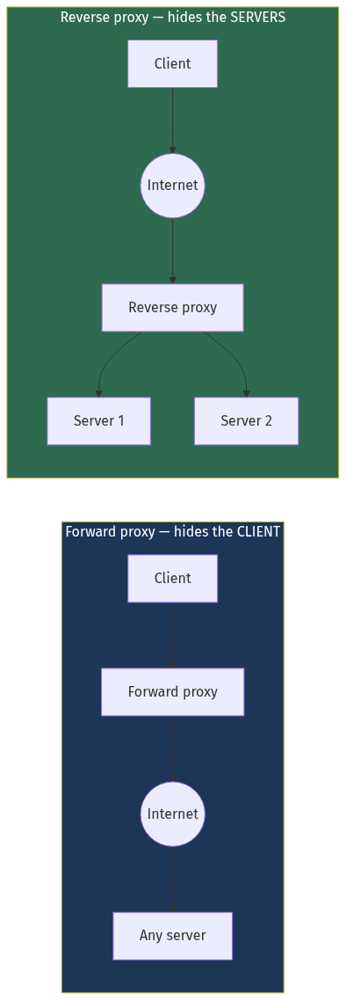

<details>
<summary>Diagram source (Mermaid)</summary>

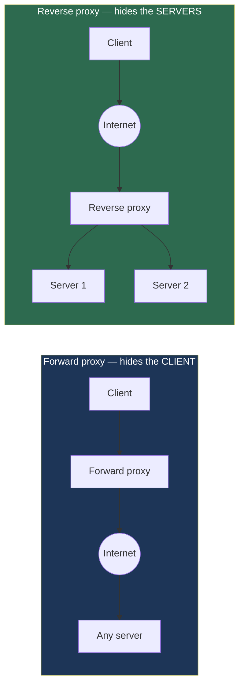

</details>

🎯 **The one-line distinction for interviews:** a forward proxy hides the *client* from the
server; a reverse proxy hides the *servers* from the client. Everything else follows from
that.

**Why a reverse proxy is worth having even with one backend server:**

| Job | What it buys you |
| --- | --- |
| **TLS termination** | Certificates in one place; backends speak plain HTTP; TLS CPU concentrated where you can size for it |
| **Compression** | gzip/brotli applied uniformly without touching application code |
| **Static file serving** | nginx serves static files ~10× faster than an application runtime |
| **Request buffering** | Slow clients don't tie up an expensive application worker (this is the whole reason for `proxy_buffering`) |
| **Rate limiting** | Abuse stopped before it costs you application resources |
| **Routing** | `/api` → service A, `/static` → CDN, `/admin` → restricted pool |
| **Header manipulation** | Add `X-Request-ID`, strip internal headers, set security headers |
| **Access logging** | One consistent log format for all traffic |
| **Blast-radius control** | Backends aren't directly addressable from the internet |

⚠️ **Slow-client protection is underrated.** Without buffering, a client on a 3G connection
uploading a 5 MB file occupies an application worker for 30 seconds. With 200 workers and
200 such clients, your service is down — despite near-zero CPU usage. This is exactly the
**Slowloris** attack, and a buffering reverse proxy neutralises it.

### 5.2 Layer 4 vs Layer 7

#### Layer 4 — the transport layer

An **L4 load balancer** makes decisions using only the IP header and TCP/UDP ports. It
never looks at the payload. It cannot: with TLS, the payload is encrypted.

```
Sees: source IP, source port, dest IP, dest port, protocol
Does NOT see: URL, headers, cookies, HTTP method, body
```

Two ways it forwards traffic:

**NAT mode** — rewrite the destination IP, forward, and rewrite the source on the way back.
Both directions pass through the balancer.

**DSR (Direct Server Return)** — rewrite only the destination MAC address. The server
responds **directly to the client**, bypassing the balancer entirely on the return path.

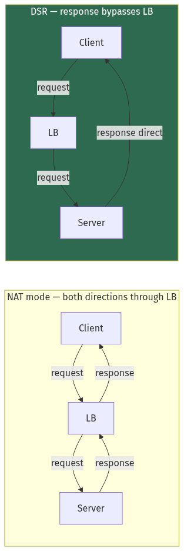

<details>
<summary>Diagram source (Mermaid)</summary>

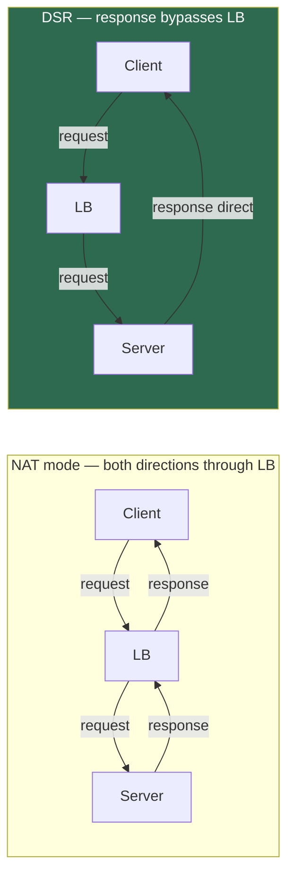

</details>

💡 **Why DSR matters:** web traffic is wildly asymmetric — a 500-byte request produces a
500 KB response, so responses are ~1,000× the bytes. With DSR, the load balancer handles
only 0.1% of the traffic volume. A single modest machine can front tens of gigabits.

⚠️ **DSR's costs:** the balancer and servers must be on the same L2 network segment (or you
need IP-in-IP tunnelling); every server must be configured with the VIP on a loopback
interface with ARP suppressed; and because the balancer never sees responses, it can't do
health inference from response codes or any L7 work at all. It's a specialist tool.

#### Layer 7 — the application layer

An **L7 load balancer** terminates the connection, decrypts TLS, parses HTTP, and decides
based on content.

```
Sees: everything — URL path, method, headers, cookies, body
Can do: content routing, header rewriting, caching, retries, response inspection
```

#### The comparison

| | L4 | L7 |
| --- | --- | --- |
| Decides on | IP + port | URL, headers, cookies, body |
| TLS | Passes through encrypted | **Terminates** — sees plaintext |
| Throughput | Millions of packets/s | Tens of thousands of req/s per core |
| Added latency | ~microseconds | ~1 ms |
| Content-based routing | ❌ | ✅ |
| Retries on failure | ❌ (connection-level only) | ✅ (can retry idempotent requests) |
| Caching | ❌ | ✅ |
| Works with any protocol | ✅ (TCP/UDP: MySQL, Redis, custom) | ❌ (needs HTTP/gRPC awareness) |
| Cost | Cheap | More CPU (TLS + parsing) |
| Examples | AWS NLB, IPVS, Maglev, F5 | AWS ALB, nginx, HAProxy, Envoy, Traefik |

💡 **The standard production pattern is both.** L4 in front for raw throughput and DDoS
absorption, L7 behind it for intelligence. AWS's NLB → ALB → targets is exactly this.

⚠️ **One HTTP/2 subtlety that catches teams out:** an L4 balancer distributing **connections**
does not distribute **requests**. With HTTP/2 or gRPC, a client opens *one* long-lived
connection and sends thousands of requests down it. The L4 balancer pins that connection to
one backend, and load becomes wildly uneven. **gRPC behind an L4 load balancer is a
well-known anti-pattern.** You need an L7 balancer that understands HTTP/2 streams, or
client-side load balancing ([Chapter 15](./15_apis_and_protocols.md)).

### 5.3 Balancing algorithms

#### Round robin

Rotate through servers in order. Stateless, trivially fair by *request count*.

```
Request 1 → A,  2 → B,  3 → C,  4 → A,  5 → B, ...
```

⚠️ Assumes all requests cost the same and all servers are equally capable. Both are usually
false. A single `/report/generate` request may cost 1,000× a `/health` request.

#### Weighted round robin

Assign each server a weight; distribute proportionally.

```
A (weight 3), B (weight 1)  →  A, A, A, B, A, A, A, B, ...
```

Useful for heterogeneous hardware, or for **gradual rollouts** — give the new version
weight 1 against the old version's weight 99, and you've built a canary
([Chapter 20](./20_deployment_multiregion_dr_cost.md)).

#### Least connections

Send to the server with the fewest open connections. Adapts automatically to variable
request costs, because expensive requests hold connections longer.

⚠️ **The trap:** a server that is failing *fast* has very few open connections, so
least-connections sends it **more** traffic. A backend returning instant 500s becomes a
black hole that attracts the entire fleet's traffic. This is a real and common failure mode.
Mitigate with passive health checks / outlier ejection (§5.4).

#### Least response time

Combine connection count with observed latency: `score = active_connections × avg_latency`.
More accurate, more state to maintain.

#### 💡 Power of two choices (P2C)

This is the algorithm you should know and most people don't.

```
1. Pick two servers at random.
2. Send the request to whichever has fewer active connections.
```

That's it. Two random samples, not a full scan.

📐 **Why this works so well.** With `n` servers and random assignment, the expected maximum
load is `O(log n / log log n)`. With power-of-two-choices it drops to `O(log log n)`.

For 1,000 servers:
```
Pure random:    max load ≈ log(1000)/log log(1000) ≈ 3.5× the average
P2C:            max load ≈ log log(1000) ≈ 2.0
Full least-conn: max load ≈ 1 (optimal)
```

P2C captures **most of the benefit of a full scan at O(1) cost**, and — critically —
without the global state a full least-connections view requires.

⚠️ **The distributed-systems reason P2C wins in practice:** with many independent load
balancers, "least connections" is computed against *stale* information. Every balancer sees
the same idle server and stampedes it simultaneously — the **herd effect**. The randomness
in P2C breaks that synchronisation. This is why Envoy, Nginx Plus, HAProxy, Netflix's
Ribbon and Finagle all default to or offer P2C.

#### IP hash / session affinity

`server = hash(client_IP) % N`. The same client always lands on the same server.

⚠️ Two serious problems: (1) it breaks completely when N changes — see consistent hashing
below; (2) clients behind a corporate NAT or a mobile carrier gateway all share one IP and
all land on one server.

#### Consistent hashing

The fix for problem (1). Instead of `hash(key) % N`, place servers and keys on a conceptual
ring and assign each key to the next server clockwise.

📐 **The difference:**
```
Modulo hashing, N: 4 → 5   →  ~80% of keys move to a different server
Consistent hashing, N: 4 → 5 → ~20% (1/N) of keys move
```

This is essential for **cache** balancing — with modulo hashing, adding one cache node
invalidates almost the entire cache at once and stampedes your database. Full derivation and
implementation in [Chapter 23](./23_building_blocks_and_algorithms.md).

#### Maglev hashing

Google's algorithm, designed for L4 balancers where every balancer must independently agree
on the same mapping without coordination. It builds a fixed-size lookup table (a prime,
typically 65,537) that gives near-perfect balance with minimal disruption on membership
change, and lookups are a single array index. Used in Google's frontend and in Cilium.

#### The summary table

| Algorithm | State needed | Handles variable cost | Sticky | Use when |
| --- | --- | --- | --- | --- |
| Round robin | None | ❌ | ❌ | Uniform requests, uniform servers |
| Weighted RR | Static weights | ❌ | ❌ | Heterogeneous servers; canary rollouts |
| Least connections | Per-server counters | ✅ | ❌ | Highly variable request cost |
| Least response time | Counters + latency EWMA | ✅✅ | ❌ | Heterogeneous servers *and* requests |
| **Power of two choices** | Per-server counters | ✅ | ❌ | **Sensible default at scale** |
| IP hash | None | ❌ | ✅ | Legacy sticky requirement |
| Consistent hashing | Ring | ❌ | ✅ | **Caches, sharded stateful backends** |
| Maglev | Lookup table | ❌ | ✅ | L4 balancers needing consistent independent decisions |

### 5.4 Health checks — and how they cause outages

A load balancer must know which backends are usable. Two mechanisms, and you need both.

#### Active health checks

The balancer periodically probes each backend.

```nginx
# nginx (open source uses passive; nginx Plus adds active)
upstream backend {
    server 10.0.1.10:8080 max_fails=3 fail_timeout=10s;
    server 10.0.1.11:8080 max_fails=3 fail_timeout=10s;
}
```

```yaml
# Envoy — active health checking
health_checks:
  - timeout: 1s
    interval: 2s
    unhealthy_threshold: 3     # 3 consecutive failures → eject
    healthy_threshold: 2       # 2 consecutive successes → restore
    http_health_check:
      path: /healthz
```

📐 **Detection time = interval × unhealthy_threshold.** Above: 2 s × 3 = **6 seconds** of
sending traffic to a dead server. Tune this against your SLO — if you promise 99.99% you
cannot afford 60-second detection.

⚠️ **The asymmetry that matters:** be **fast to eject, slow to restore**. Ejecting a healthy
server briefly costs a little capacity. Restoring a still-broken server costs you errors and
can cause flapping. Hence `unhealthy_threshold: 3, healthy_threshold: 2` with a longer
observation on the way back in.

#### Passive health checks (outlier detection)

Watch real traffic. If a backend returns errors or times out, eject it — no probe needed.

```yaml
# Envoy — outlier detection
outlier_detection:
  consecutive_5xx: 5
  interval: 10s
  base_ejection_time: 30s        # doubles on each subsequent ejection
  max_ejection_percent: 50       # ⚠️ never eject more than half the fleet
```

💡 **Passive checks catch what active checks can't.** A backend can return 200 on `/healthz`
while failing every real request — because the health endpoint doesn't touch the database,
or the failure is specific to one code path. Passive detection sees actual user impact.

⚠️ **`max_ejection_percent` is the most important line in that config.** Without it, a
downstream failure (the database is down, so every backend returns 500) causes the balancer
to eject *every* backend, turning a degraded service into a total outage. Capping ejection
at 50% means that when everything is failing, you at least keep serving whatever can be
served. This behaviour is sometimes called **panic mode** — when too few hosts are healthy,
Envoy deliberately ignores health status and load-balances across everything, on the theory
that a possibly-broken backend beats no backend.

#### The three kinds of health endpoint

| Endpoint | Question | If it fails | Should check |
| --- | --- | --- | --- |
| **Liveness** | Is the process wedged? | **Restart** the process | Nothing external. Just "am I responsive?" |
| **Readiness** | Can I serve traffic *right now*? | **Remove from LB**, don't restart | Dependencies I need: DB pool, cache, warm state |
| **Startup** | Has initialisation finished? | Keep waiting | Init progress |

⚠️ **The classic self-inflicted outage:** the liveness probe checks the database. The
database has a brief hiccup. Every instance's liveness probe fails. Kubernetes restarts
**every instance simultaneously**. Now you have zero capacity, cold caches, and a thundering
herd of reconnections hitting the already-struggling database.

**The rule: liveness must never check external dependencies.** Readiness may. See
[Chapter 17](./17_containers_docker_kubernetes.md) §probes.

#### Connection draining / graceful shutdown

When you remove a server deliberately (deploy, scale-down), you must not cut existing
requests off mid-flight.

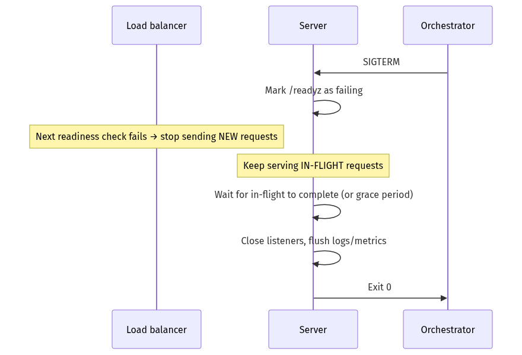

<details>
<summary>Diagram source (Mermaid)</summary>

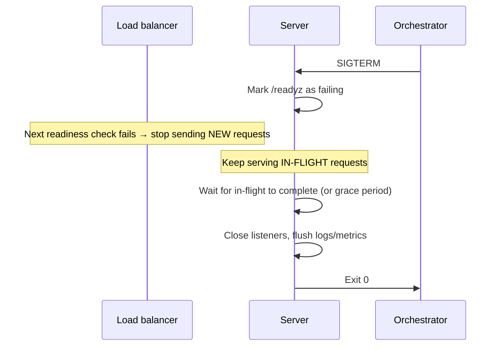

</details>

📐 **The timing must satisfy:**
```
termination_grace_period  >  readiness_check_interval × failure_threshold
                             + longest_in_flight_request
```

⚠️ **The most common deployment bug in Kubernetes:** the pod stops accepting connections the
instant it receives SIGTERM, but the load balancer's endpoint list takes 2–10 seconds to
update. Every request routed in that window fails. The fix is a **`preStop` sleep** — on
SIGTERM, fail readiness but keep serving for 5–15 seconds before actually shutting down.
This single change eliminates most "errors during deploy" reports.

### 5.5 Sticky sessions — why they're a trap

**Session affinity** routes a given client to the same backend every time, usually via a
cookie the balancer sets.

```nginx
upstream backend {
    sticky cookie srv_id expires=1h domain=.example.com path=/;
    server backend1.example.com;
    server backend2.example.com;
}
```

⚠️ **Everything it breaks:**

| Problem | Consequence |
| --- | --- |
| Uneven load | Long-lived sessions pile up unevenly; one server saturates while others idle |
| Deploys lose state | Every restart destroys the sessions pinned to that server |
| Scaling doesn't help | New servers get only *new* sessions; existing hot sessions stay put |
| Autoscale-down is destructive | Removing a server logs out everyone on it |
| Can't drain gracefully | Draining a server with 10,000 pinned sessions takes as long as the longest session |
| Defeats availability math | You're no longer N parallel servers; you're 1 server per user ([Chapter 3](./03_reliability_availability_performance.md) §3.3) |

💡 **The correct answer is almost always to externalise the state** ([Chapter 1](./01_from_zero_computers_networks_web.md) §1.8) — put sessions in Redis and make the servers
stateless. Then any server can serve any request and every problem above evaporates.

**The two legitimate uses of stickiness:**

1. **WebSockets and other long-lived connections.** The connection is inherently pinned to
   one server for its lifetime — that's not a choice, it's physics. What you do is keep the
   *application* state elsewhere so a reconnect can land anywhere.
2. **Local cache warmth.** If each server maintains an in-process cache, routing a user
   consistently improves the hit rate. Use **consistent hashing**, not a cookie, so that
   adding a server moves only 1/N of traffic instead of reshuffling everything.

### 5.6 Load shedding and admission control

Here's the counter-intuitive part of the chapter.

When a system is overloaded, the instinct is to try to serve everything. That's wrong.
Beyond capacity, accepting more work makes **every** request slower, until all of them time
out and **nothing** succeeds. You did infinite work and delivered zero value.

```
Throughput
   ^
   |         ....
   |      ..'    '..
   |    .'           '..
   |  .'                 '....        ← without shedding: collapse
   | .'                       '''...
   |.'
   +---------------------------------------> Offered load
              ↑ capacity
```

**Load shedding** means deliberately rejecting a fraction of requests — quickly and cheaply
— so the rest complete successfully.

```
Throughput
   ^
   |         ....―――――――――――――――――      ← with shedding: plateau
   |      ..'
   |    .'
   |  .'
   | .'
   |.'
   +---------------------------------------> Offered load
```

**Techniques, in increasing order of sophistication:**

**1. Concurrency limits.** Cap in-flight requests; reject immediately beyond it.
```go
sem := make(chan struct{}, 100) // Little's Law sizes this: L = λW

func handler(w http.ResponseWriter, r *http.Request) {
    select {
    case sem <- struct{}{}:
        defer func() { <-sem }()
        serve(w, r)
    default:
        // Reject in microseconds, not after a 30s timeout.
        w.Header().Set("Retry-After", "1")
        http.Error(w, "overloaded", http.StatusServiceUnavailable)
    }
}
```

**2. Queue timeouts (⚠️ the LIFO trick).** If a request has been queued for 2 seconds and
the client's timeout is 1 second, **processing it is pure waste** — nobody is listening.
Drop it and serve a fresh one.

💡 **Under overload, LIFO beats FIFO.** With FIFO, every request waits the full queue depth
and *all* of them time out. With LIFO, the newest requests are served immediately and
succeed, while the oldest (already-doomed) ones are dropped. FIFO fails 100%; LIFO succeeds
for a large fraction. This is genuinely surprising and it's why Facebook's and Google's
overload handling uses adaptive LIFO.

**3. Priority shedding.** Not all traffic is equal.
```
Priority 0: payments, checkout, auth        → never shed
Priority 1: normal browsing                 → shed at 90% capacity
Priority 2: recommendations, analytics      → shed at 70% capacity
Priority 3: prefetch, background sync       → shed at 50% capacity
```

**4. Adaptive concurrency (Little's Law in reverse).** Rather than a fixed limit, continuously
estimate capacity from observed latency — this is TCP Vegas' idea applied to RPC. Netflix's
`concurrency-limits` library and Envoy's adaptive concurrency filter do exactly this.

```
gradient = min_observed_latency / current_latency
new_limit = current_limit × gradient + queue_allowance
```
Latency rising means you're past capacity; shrink the limit. It self-tunes without you
guessing a number.

**5. Backpressure.** Propagate the "slow down" signal upstream rather than absorbing it.
Covered in [Chapter 12](./12_messaging_and_event_streaming.md).

⚠️ **Shed cheaply or it doesn't help.** If rejecting a request costs as much as serving one
(because you authenticate, parse, and query first), shedding provides no relief. Reject at
the *earliest* possible point — ideally at the load balancer, before the request reaches
your application at all.

### 5.7 Making the load balancer itself highly available

The balancer is now a single point of failure. Four solutions, in increasing scale.

#### Active-passive with a floating VIP

Two balancers share a **Virtual IP**. Only one holds it. **VRRP** (via `keepalived`) does
the failover.

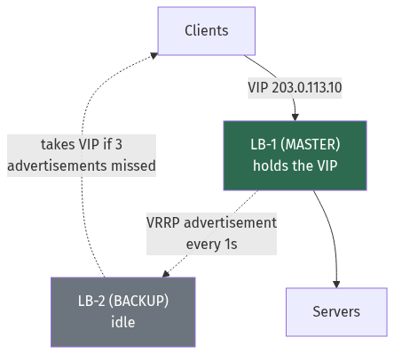

<details>
<summary>Diagram source (Mermaid)</summary>

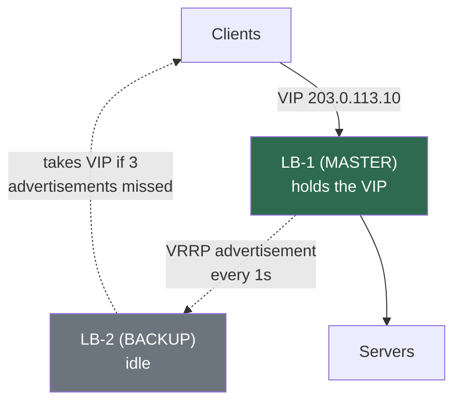

</details>

Failover takes ~3 seconds (3 missed advertisements) plus a **gratuitous ARP** to tell the
switch the MAC address moved.

⚠️ **Split brain:** if the two balancers can't see each other but both can see clients, both
claim the VIP. Mitigate with a third witness node or a shared quorum device.
([Chapter 21](./21_distributed_systems_theory_consensus.md) covers this properly.)

#### Active-active with ECMP

**ECMP (Equal-Cost Multi-Path)** lets the upstream router hash each flow across several
balancers that all announce the same route. All of them work; capacity is additive.

⚠️ The router hashes on the 4-tuple, so existing connections stay pinned — but if the set of
balancers changes, the hash changes and **existing connections break**. Maglev hashing (§5.3)
was designed specifically to minimise this disruption.

#### Anycast

Announce the same IP from many datacentres via BGP ([Chapter 4](./04_networking_deep_dive.md)
§4.6). Failover is a route withdrawal — seconds, globally, with no DNS involvement.

#### Managed cloud balancers

AWS NLB/ALB, GCP Cloud Load Balancing, Azure Load Balancer. The provider runs the redundancy.

⚠️ **Two things people forget about cloud balancers:**
1. **They scale, but not instantly.** AWS ALBs scale out over minutes. A flash sale that goes
   from 1,000 to 100,000 RPS in 30 seconds will get 503s from the *balancer*. AWS offers
   pre-warming for exactly this. Load test the ramp, not just the plateau.
2. **ALB is DNS-based.** It resolves to a changing set of IPs. Clients that cache DNS
   forever (§4.5) will pin to IPs that get decommissioned. Yes, this happens.

### 5.8 A complete, production-shaped config

```nginx
# /etc/nginx/nginx.conf — annotated for the decisions that matter

upstream api_backend {
    # Fewest active connections among two random picks — P2C.
    # Available in nginx 1.15.2+ as "random two least_conn".
    random two least_conn;

    # max_fails/fail_timeout = passive health checking.
    server 10.0.1.10:8080 max_fails=3 fail_timeout=10s;
    server 10.0.1.11:8080 max_fails=3 fail_timeout=10s;
    server 10.0.1.12:8080 max_fails=3 fail_timeout=10s;
    # Only used when every primary is down — better than serving nothing.
    server 10.0.1.99:8080 backup;

    # Keep-alive to backends: avoids TCP+TLS handshake per request (Ch 4).
    keepalive 64;
    keepalive_timeout 60s;
    keepalive_requests 1000;
}

# Rate limit state, shared across worker processes.
# 10 MB holds roughly 160,000 IP entries.
limit_req_zone $binary_remote_addr zone=perip:10m rate=10r/s;
limit_conn_zone $binary_remote_addr zone=perip_conn:10m;

server {
    listen 443 ssl http2;
    server_name api.example.com;

    ssl_certificate     /etc/ssl/fullchain.pem;   # ⚠️ FULL chain, not just leaf (Ch 4)
    ssl_certificate_key /etc/ssl/privkey.pem;
    ssl_protocols       TLSv1.2 TLSv1.3;
    ssl_session_cache   shared:SSL:50m;           # Resumption: saves a handshake RTT
    ssl_session_timeout 1d;
    ssl_early_data      off;                      # ⚠️ 0-RTT is replayable (Ch 4 §4.4)

    # burst allows short spikes; nodelay serves the burst immediately
    # instead of trickling it out at exactly 10r/s.
    limit_req  zone=perip burst=20 nodelay;
    limit_conn perip_conn 50;
    limit_req_status 429;

    location /healthz {
        access_log off;              # Don't drown real logs in probe noise
        return 200 "ok\n";
    }

    location / {
        proxy_pass http://api_backend;

        # Required for keepalive to the upstream to work at all.
        proxy_http_version 1.1;
        proxy_set_header Connection "";

        proxy_set_header Host              $host;
        proxy_set_header X-Real-IP         $remote_addr;
        proxy_set_header X-Forwarded-For   $proxy_add_x_forwarded_for;
        proxy_set_header X-Forwarded-Proto $scheme;
        proxy_set_header X-Request-ID      $request_id;   # For tracing (Ch 19)

        proxy_connect_timeout 2s;    # Fail fast on a dead backend
        proxy_send_timeout   30s;
        proxy_read_timeout   30s;

        # ⚠️ non_idempotent is deliberately ABSENT: never auto-retry POSTs.
        proxy_next_upstream error timeout http_502 http_503 http_504;
        proxy_next_upstream_tries 2;
        proxy_next_upstream_timeout 10s;

        # Buffer slow clients so they can't occupy an app worker (§5.1).
        proxy_buffering on;
        proxy_buffers 8 16k;
        proxy_busy_buffers_size 32k;
    }
}
```

⚠️ **`X-Forwarded-For` is client-controllable and must be sanitised.** A client can send
`X-Forwarded-For: 1.2.3.4` and, if your *outermost* proxy appends rather than replaces, your
application may trust a forged IP for rate limiting, geo-blocking or audit logs. The
outermost proxy must **overwrite** it; only proxies you control may append.

### 5.9 Rate limiting at the edge

Rate limiting belongs at the load balancer, not in your application — the whole point is to
reject abusive traffic before it costs you anything. The algorithms themselves are derived in
[Chapter 23](./23_building_blocks_and_algorithms.md); here we cover *where* and *by what*.

**Choosing the limiting key** is the design decision that matters:

| Key | Good for | ⚠️ Fails when |
| --- | --- | --- |
| Source IP | Anonymous traffic, crude abuse control | Corporate NAT and mobile carriers put thousands of users behind one IP |
| API key / token | B2B APIs, per-customer quotas | Doesn't exist for anonymous traffic |
| User ID | Fair per-user limits | Requires authenticating first — so auth itself is unprotected |
| IP + endpoint | Protecting one expensive route | More state to maintain |
| `/24` subnet | Defeating trivially-rotated IPs | Collateral damage to legitimate neighbours |

💡 **Use layered limits, not one limit.** A realistic policy:
```
Global:            500,000 req/s   → protects the platform
Per IP:                 100 req/s  → stops a single abusive client
Per user:                50 req/s  → fairness between customers
Per user on /search:     10 req/s  → protects one expensive backend
Per user on /login:       5 req/min → credential-stuffing defence
```

⚠️ **Rate limit responses must be cheap and correct.** Return **429** (not 503 — 503 means
*you* are broken, 429 means *they* are), and always include:

```http
HTTP/1.1 429 Too Many Requests
Retry-After: 2
RateLimit-Limit: 100
RateLimit-Remaining: 0
RateLimit-Reset: 1735689600
```

Without `Retry-After`, well-behaved clients guess — and usually guess "retry immediately",
which converts your rate limit into a busy loop.

**Distributed rate limiting.** With N load balancers, a per-IP limit of 100/s enforced
independently at each becomes 100 × N. Three options:

| Approach | Accuracy | Cost |
| --- | --- | --- |
| **Local limits divided by N** | Poor when traffic is unevenly hashed | Free |
| **Central store (Redis) per request** | Exact | ⚠️ Adds ~1 ms and a hard dependency to every request |
| **Local counters + async sync** | Good enough (converges within a window) | Cheap; the standard choice |

💡 Envoy's global rate-limit service and Cloudflare's implementation both use the third
pattern: enforce locally from a recently-synced view, reconcile in the background. Being
approximately right without adding a synchronous dependency is the correct trade for
essentially every rate limiter.

**DDoS defence is layered rate limiting.**

| Attack layer | Example | Mitigation |
| --- | --- | --- |
| **L3/L4 volumetric** | UDP flood, DNS/NTP amplification | Anycast to spread it, upstream scrubbing, blackholing. ⚠️ You cannot absorb this at your origin — it must be handled upstream. |
| **L4 protocol** | SYN flood | **SYN cookies** — the kernel encodes connection state in the sequence number so no memory is allocated until the handshake completes |
| **L7 application** | HTTP flood on an expensive endpoint | Rate limits, JS/proof-of-work challenges, CAPTCHA, behavioural fingerprinting |
| **Slowloris** | Many connections, sent one byte at a time | Connection timeouts, `client_header_timeout`, request buffering (§5.1) |

⚠️ **The asymmetry defines the problem:** an attacker sends a 60-byte request; you spend a
database query answering it. Your job is to make rejection cheaper than attack — which is
exactly why rate limiting must be at the edge and must not require a database lookup.

### 5.10 Service discovery — how the balancer knows what exists

A static list of backend IPs stops working the moment you autoscale. **Service discovery** is
how the balancer learns the current set.

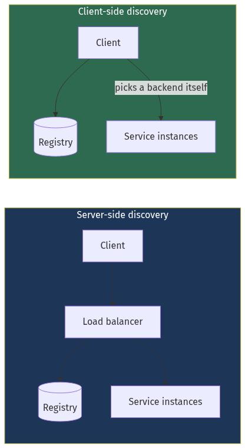

<details>
<summary>Diagram source (Mermaid)</summary>

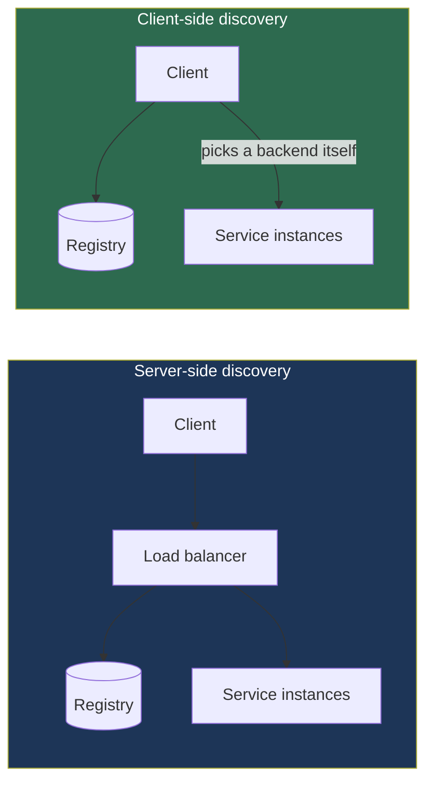

</details>

| | Server-side | Client-side |
| --- | --- | --- |
| Who chooses the backend | The load balancer | The client itself |
| Extra network hop | Yes | **No** |
| Client complexity | None | Needs a discovery-aware library |
| Language support | Any | One library per language ⚠️ |
| Per-request balancing for HTTP/2 | Needs an L7 proxy | **Natural** — the client picks per call |
| Examples | AWS ALB, nginx + Consul-template, Kubernetes Service | gRPC name resolver, Netflix Ribbon, Finagle |

💡 **A service mesh is the third answer**: a sidecar proxy gives you client-side discovery's
per-request balancing and no extra network hop *across the datacentre*, while keeping the
logic out of every language's client library. That's the core value proposition, and it's why
meshes exist. See [Chapter 16](./16_microservices_and_service_architecture.md).

**How registration happens:**

| Pattern | Mechanism | ⚠️ Risk |
| --- | --- | --- |
| **Self-registration** | The instance registers itself and sends heartbeats | A hung process can keep heartbeating while failing real requests |
| **Third-party registration** | The orchestrator registers it (Kubernetes endpoints controller) | ✅ Preferred — the registrar observes health independently |

⚠️ **The propagation delay is real.** In Kubernetes, an instance becoming unready has to
propagate: kubelet notices → endpoints controller updates → kube-proxy or the ingress
controller reprograms. That's typically **2–10 seconds** during which traffic is still routed
to it. This is exactly why the `preStop` delay in §5.4 is necessary, and why **passive health
checking at the balancer** matters — it reacts in milliseconds, while discovery reacts in
seconds.

### 5.11 A production Envoy configuration

nginx (§5.8) is the classic choice. Envoy is what modern infrastructure uses, because its
configuration can be pushed dynamically over the **xDS** API rather than reloaded from files —
which is the mechanism that makes service meshes possible.

```yaml
static_resources:
  listeners:
    - address: { socket_address: { address: 0.0.0.0, port_value: 443 } }
      filter_chains:
        - filters:
            - name: envoy.filters.network.http_connection_manager
              typed_config:
                "@type": type.googleapis.com/envoy.extensions.filters.network.http_connection_manager.v3.HttpConnectionManager
                stat_prefix: ingress
                # Generate a request ID and propagate trace context (Ch 19).
                generate_request_id: true
                tracing: { provider: { name: envoy.tracers.opentelemetry } }
                # ⚠️ Trust exactly one hop of X-Forwarded-For; anything more is forgeable.
                use_remote_address: true
                xff_num_trusted_hops: 1
                # Kill slow-header attacks (Slowloris) at the edge.
                request_timeout: 30s
                stream_idle_timeout: 300s
                http_filters:
                  - name: envoy.filters.http.local_ratelimit
                    typed_config:
                      "@type": type.googleapis.com/udpa.type.v1.TypedStruct
                      type_url: type.googleapis.com/envoy.extensions.filters.http.local_ratelimit.v3.LocalRateLimit
                      value:
                        stat_prefix: http_local_rate_limiter
                        token_bucket:
                          max_tokens: 1000
                          tokens_per_fill: 1000
                          fill_interval: 1s
                  # Sheds load automatically when latency degrades — no fixed guess.
                  - name: envoy.filters.http.adaptive_concurrency
                  - name: envoy.filters.http.router
                route_config:
                  virtual_hosts:
                    - name: api
                      domains: ["*"]
                      routes:
                        - match: { prefix: "/" }
                          route:
                            cluster: api_backend
                            timeout: 5s
                            retry_policy:
                              # ⚠️ 5xx deliberately excluded: not safe to retry non-idempotent calls.
                              retry_on: "connect-failure,refused-stream,unavailable"
                              num_retries: 2
                              # Caps retries fleet-wide so they can never amplify an outage.
                              retry_budget: { budget_percent: { value: 20.0 } }
                              retry_back_off: { base_interval: 0.025s, max_interval: 0.25s }

  clusters:
    - name: api_backend
      connect_timeout: 2s
      # Two random picks, take the less loaded — power of two choices (§5.3).
      lb_policy: LEAST_REQUEST
      least_request_lb_config: { choice_count: 2 }
      type: EDS                      # endpoints pushed dynamically, not from a file
      eds_cluster_config: { eds_config: { ads: {} } }
      health_checks:
        - timeout: 1s
          interval: 2s
          unhealthy_threshold: 3
          healthy_threshold: 2
          http_health_check: { path: /healthz }
      outlier_detection:
        consecutive_5xx: 5
        interval: 10s
        base_ejection_time: 30s
        # ⚠️ Without this, a downstream failure ejects the entire fleet (§5.4).
        max_ejection_percent: 50
      # Bulkhead: bound the blast radius of this dependency.
      circuit_breakers:
        thresholds:
          - priority: DEFAULT
            max_connections: 1024
            max_pending_requests: 256
            max_requests: 1024
            max_retries: 32
      # Prefer backends in our own AZ — latency and cross-AZ cost (Ch 2 §2.10).
      common_lb_config:
        locality_weighted_lb_config: {}
```

💡 **The four lines that matter most** in that file: `max_ejection_percent` (prevents ejecting
everything), `retry_budget` (prevents retry storms), `choice_count: 2` (power of two choices),
and `locality_weighted_lb_config` (keeps traffic in-AZ). Each maps directly to a failure mode
discussed in this chapter or the previous ones.

---

## Worked example — sizing and configuring a tier

*Your API serves 50,000 requests/second at peak. P50 latency is 40 ms, P99 is 300 ms. Each
app server handles 2,000 req/s at 60% CPU. Design the load balancing tier with a 99.99%
availability target.*

**Step 1 — How many app servers?**
```
50,000 ÷ 2,000 = 25 servers at full utilisation
```
But [Chapter 2](./02_scalability_and_estimation.md) §2.7 says don't exceed ~70%, and
[Chapter 3](./03_reliability_availability_performance.md) §3.6 says N+2 must survive a
failure during maintenance:
```
For headroom:  50,000 ÷ (2,000 × 0.70) = 36 servers
For N+2:       36 + 2 = 38
Round to 39 (13 per AZ × 3 AZs — even distribution matters)
```
Verify the N+2 condition: losing 2 of 39 leaves 37 servers carrying 50,000 req/s =
1,351 req/s each = **68% utilisation**. ✅ Still under the knee.

**Step 2 — How many L7 balancer instances?**

An nginx/Envoy instance handling TLS termination does roughly 10,000–20,000 req/s per core.
Assume 4 cores → ~50,000 req/s per instance at saturation. Target 50%:
```
50,000 ÷ (50,000 × 0.5) = 2 instances minimum
For AZ redundancy and N+1: 4 instances (one spare per AZ, 3 AZs → round up)
```

Verify TLS CPU cost:
```
TLS 1.3 handshake ≈ 1–2 ms of CPU (ECDSA P-256 is much cheaper than RSA-2048)
With keep-alive and session resumption, assume 1 handshake per 100 requests:
50,000 req/s ÷ 100 = 500 handshakes/s × 1.5 ms = 0.75 CPU-seconds/second
→ under 1 core across the whole fleet. ✅ Handshakes are not the bottleneck; parsing is.
```

**Step 3 — Choose the algorithm.**

P99/P50 = 300/40 = **7.5×**. That's high variance — request costs differ a lot. Round robin
would produce uneven load.
→ **Power of two choices with least-connections.** Adapts to variable cost, no global state,
no herd effect across the four balancer instances.

**Step 4 — Health check timing against the SLO.**

99.99% = 4.4 minutes of downtime per month.
```
Active check:  interval 2s, unhealthy_threshold 3  → detect in 6s
Passive:       consecutive_5xx 5                    → detect in <1s under load

Impact of one bad server for 6s:
  1/39 of traffic × 6s = 0.154 server-seconds of errors per failure event
  At 1,300 req/s per server × 6s = 7,800 failed requests
  Against 50,000 × 2,592,000 = 1.3 × 10¹¹ monthly requests
  → 0.000006% error budget. ✅ Negligible.
```
Passive detection is doing most of the work here — it catches the failure in under a second
because real traffic reveals it immediately.

**Step 5 — Availability math.**

```
L4 tier (NLB, managed, multi-AZ):        99.99%
L7 tier (4 instances @ 99.5% each):      1 − 0.005⁴ ≈ 99.9999%
                                          (realistically 99.99% after correlation — §3.4)
App tier (39 @ 99.5%, need 37):          effectively 99.9999%
                                          (realistically 99.99% — a bad deploy hits all)

Series: 0.9999 × 0.9999 × 0.9999 = 99.97%
```

⚠️ **99.97% < 99.99%.** We miss the target. The binding constraint is **correlated failure
from deploys**, not instance count. The fixes are architectural, not numerical:
- **Canary deploys** — 1% → 10% → 50% → 100%, with automatic rollback on error-rate
  regression. Reduces the blast radius of a bad build from 100% to 1%.
- **Multi-region** with a global balancer, so a regional control-plane failure isn't total.
- **Static stability** — the data plane keeps working even if the control plane (autoscaling,
  service discovery) is unavailable.

💡 That's the real lesson of this example: past three nines, **you stop buying availability
with instances and start buying it with process and blast-radius control.**

**Step 6 — Load shedding configuration.**

Little's Law sizes the concurrency limit ([Chapter 2](./02_scalability_and_estimation.md) §2.4):
```
Per server: L = λW = 1,300 req/s × 0.040 s = 52 concurrent
Set the limit to 80 (headroom for P99 requests, which hold 300 ms)
Beyond 80: return 503 with Retry-After, in microseconds
```

---

## Trade-offs

| Decision | Option A | Option B | Choose A when | Never choose A when |
| --- | --- | --- | --- | --- |
| Layer | L4 | L7 | Non-HTTP protocols; extreme throughput; minimal latency | You need content routing, retries, or per-request balancing of HTTP/2 |
| L4 forwarding | NAT | DSR | Simplicity; balancer must see responses | Response volume would saturate the balancer |
| Algorithm | Round robin | P2C least-conn | Requests are genuinely uniform | P99/P50 > ~3× — variance makes RR unfair |
| Algorithm | Least connections | Consistent hashing | Backends are interchangeable | Backends hold per-key cache or state |
| Health check | Active only | Active + passive | You have no traffic to observe (cold service) | Always add passive — it catches what probes miss |
| Affinity | Sticky sessions | Stateless + shared store | WebSockets; local cache warmth | You have a choice. Externalise the state. |
| LB redundancy | Active-passive VIP | Active-active ECMP/anycast | Small scale; simple; on-prem | You need the standby's capacity or sub-second failover |
| Overload response | Queue everything | Shed load | Queue drains within the client timeout | Sustained overload — queuing turns degradation into collapse |
| Queue discipline | FIFO | LIFO under overload | Normal operation (fairness) | Overloaded — FIFO times out 100%, LIFO saves the recent ones |
| Deployment | Self-managed nginx/Envoy | Managed cloud LB | You need custom logic, or you're on-prem | You'd be reinventing multi-AZ redundancy badly |

---

## How real companies do it

**Google's Maglev** is a software L4 load balancer running on commodity machines, handling
over 10 Gbps per node with DSR. Two design points are worth stealing: (1) every Maglev node
computes the same backend mapping **independently** using consistent hashing, so no
coordination is needed and any node can handle any packet; (2) they use **connection
tracking plus consistent hashing** so that even when the backend set changes, existing
connections mostly survive. The paper is short and very readable.

**Envoy**, created at Lyft and now the data plane for Istio, popularised several ideas in
this chapter: outlier detection as a first-class feature, **panic mode** (when fewer than
50% of hosts are healthy, ignore health status entirely rather than eject everything), and
adaptive concurrency limits. Its `xDS` API — configuration pushed dynamically rather than
reloaded from files — is what makes service meshes possible.

**Netflix** publishes `concurrency-limits`, which implements adaptive limits using a
TCP-Vegas-derived algorithm: measure the minimum observed latency, compare to current
latency, and shrink the concurrency limit when the ratio degrades. This removes the need to
guess a fixed limit that will be wrong as hardware and code change. They also run Zuul as an
L7 gateway with dynamic filter loading.

**Facebook's Katran** is an L4 balancer built on **XDP/eBPF**, processing packets in the
kernel's network driver *before* the kernel networking stack runs. This gives roughly 10×
the packets-per-second of an IPVS-based approach on the same hardware. Cloudflare's Unimog
and Cilium's balancer use the same eBPF technique.

**Shopify's Black Friday** approach uses aggressive shedding: they classify traffic, and
under extreme load they shed low-priority requests (recommendations, analytics) to protect
checkout. Their published position is that a customer who can't see recommendations but can
complete a purchase is a far better outcome than one who can do neither.

---

## Common mistakes

**Liveness probes that check dependencies.** The database blips, every liveness probe fails,
the orchestrator restarts the entire fleet at once, and you've turned a 30-second degradation
into a 10-minute outage with cold caches. **Liveness = "am I wedged?" only.**

**No `max_ejection_percent`.** A shared downstream failure makes every backend look
unhealthy, the balancer ejects all of them, and a partial outage becomes total.

**Putting gRPC behind an L4 balancer.** One long-lived HTTP/2 connection per client gets
pinned to one backend, and load is wildly uneven. Use an L7 balancer that understands HTTP/2
streams, or client-side balancing.

**No connection draining on deploy.** Requests in flight get reset, and the load balancer
keeps routing to the pod for several seconds after SIGTERM. Add a `preStop` sleep and fail
readiness before you stop serving.

**Retrying non-idempotent requests.** `proxy_next_upstream` including `non_idempotent`, or a
client library retrying POSTs by default, produces duplicate orders and double charges. Only
retry when the operation is idempotent or protected by an idempotency key
([Chapter 10](./10_distributed_transactions_and_integrity.md)).

**Retry storms.** Every layer retries 3×, and you have 4 layers: one user request becomes 81
backend requests. Under load, retries amplify the failure that caused them. Use **retry
budgets** (cap retries at ~10% of total requests) and exponential backoff with jitter
([Chapter 16](./16_microservices_and_service_architecture.md)).

**Trusting `X-Forwarded-For` blindly.** Client-controllable unless your outermost proxy
overwrites it. Forged IPs defeat rate limiting and poison audit logs.

**Sticky sessions as the default.** They break scaling, deploys and availability math to
avoid a Redis instance. Externalise the state.

**Not load testing the ramp.** Cloud balancers scale over minutes. A test that ramps to
100,000 RPS over 20 minutes passes; real traffic that arrives in 30 seconds gets 503s from
the balancer itself.

**Health check endpoints that are too cheap or too expensive.** `return 200` proves nothing
— the process could be serving errors on every real path. Querying the database on every
2-second probe from 6 balancers × 39 servers is 117 pointless queries per second. Check
something meaningful and cache the result for a second or two.

---

## Interview angle

**Q: What's the difference between L4 and L7 load balancing?**

*Strong:* "L4 decides using only the IP and port — it never sees the payload, which with TLS
it couldn't anyway. That makes it extremely fast, protocol-agnostic, and able to do Direct
Server Return so responses bypass it entirely. L7 terminates the connection and parses HTTP,
so it can route on URL and headers, retry failed idempotent requests, cache, and rewrite —
at the cost of TLS termination and parsing CPU. Real systems use both: L4 in front for
throughput and DDoS absorption, L7 behind for intelligence. One important gotcha: with
HTTP/2 or gRPC, an L4 balancer distributes *connections*, not *requests* — a client opens
one connection and sends thousands of requests down it, so load becomes very uneven. gRPC
needs L7 or client-side balancing."

**Q: Which load balancing algorithm would you choose and why?**

*Strong:* "It depends on request-cost variance, and I'd measure P99/P50 to find out. If
requests are uniform, round robin is fine and free. If costs vary — say P99 is 5× P50 —
round robin distributes requests evenly but *load* unevenly, so I'd use least-connections.
At scale, though, I'd specifically pick **power of two choices**: sample two backends at
random and take the less loaded one. It gets you within a small constant of optimal at O(1)
cost, and critically it avoids the herd effect where many independent balancers all see the
same idle server in stale state and stampede it. If backends hold per-key state or cache,
none of those apply and I'd use consistent hashing instead."

**Q: How do you avoid the load balancer being a single point of failure?**

*Strong:* "Depends on scale. At small scale, two balancers with a floating VIP and VRRP —
failover in about 3 seconds, though you need a witness to avoid split brain. At larger
scale, active-active: several balancers announcing the same route with ECMP so the upstream
router hashes flows across them, or anycast so BGP routes users to the nearest and failover
is a route withdrawal. In the cloud, a managed NLB is multi-AZ by default. But the honest
answer is that redundant instances only get you so far — past three nines the binding
constraint becomes correlated failure: a bad config or a bad deploy hits every instance. So
the real work is canary deploys, blast-radius control, and static stability, not more
instances."

**Q: A backend is returning 500s instantly. What happens with least-connections?**

*Strong:* "It becomes a black hole. Instant failures mean it holds almost no open
connections, so least-connections concludes it's the least loaded server and sends it *more*
traffic — potentially most of the fleet's traffic. This is a real and nasty failure mode.
The fix is **passive health checking / outlier detection**: eject a backend after N
consecutive 5xx responses, with exponentially increasing ejection duration. And crucially,
cap `max_ejection_percent` at around 50% — otherwise if the cause is downstream, say the
database is down and *every* backend is returning 500, the balancer ejects the entire fleet
and turns a degraded service into a total outage."

**Q: Your service is overloaded. Do you queue requests or reject them?**

*Strong:* "Reject — and this is counter-intuitive. If offered load exceeds capacity,
queueing makes every request slower until they all exceed the client's timeout, so you do
maximum work and deliver zero value. Shedding a fraction quickly keeps the rest inside their
latency budget. Three refinements. First, shed **cheaply** — reject at the load balancer
before the request costs you a database query, or shedding provides no relief. Second, shed
by **priority**: never shed checkout, shed recommendations first. Third, under sustained
overload switch the queue from FIFO to **LIFO** — with FIFO every request waits the full
queue depth and 100% time out; with LIFO the newest requests are served immediately and
succeed while the already-doomed old ones are dropped. And ideally use adaptive concurrency
limits rather than a fixed number, so the limit tracks actual capacity as hardware and code
change."

**Q: How would you rate limit an API across 20 load balancer instances?**

*Strong:* "The naive approach — enforce the same limit locally on each — gives you 20× the
intended limit, and dividing by 20 breaks whenever traffic hashes unevenly. The exact
approach is a central Redis counter per request, but that adds about a millisecond and a hard
synchronous dependency to every single request, which is a bad trade for a *defensive*
mechanism. So the standard answer is **local counters with asynchronous reconciliation**:
each balancer enforces from a recently-synced view and pushes its counts in the background.
You're approximately right within a window, without a synchronous dependency. That's what
Envoy's rate-limit service and Cloudflare both do. I'd also layer the limits — a global cap,
per-IP, per-user, and a tighter one on expensive endpoints like search and login — and be
careful about the key, since per-IP limiting punishes everyone behind a corporate NAT or a
mobile carrier gateway. And the response must be **429 with `Retry-After`**, not 503; without
`Retry-After` clients typically retry immediately and your rate limit becomes a busy loop."

**Q: How does the load balancer know which backends exist?**

*Strong:* "Service discovery, and there are two shapes. **Server-side**: the balancer queries
a registry — Consul, etcd, or in Kubernetes the endpoints controller — and clients just talk
to a stable address. Simple, language-agnostic, but adds a network hop. **Client-side**: the
client resolves the backend set itself and picks per request. No extra hop, and crucially it
gives you per-request balancing for HTTP/2 and gRPC, where a server-side L4 balancer would
pin a whole connection to one backend. The cost is a discovery-aware library in every
language. A **service mesh** is the third answer — a sidecar gives you client-side behaviour
without per-language libraries, which is essentially its core value proposition. One
operational point regardless of shape: discovery propagation takes seconds — in Kubernetes,
typically 2 to 10 — so you still need passive health checking at the balancer, which reacts
in milliseconds, and a `preStop` delay so pods keep serving while the endpoint list catches
up."

**Q: How do you defend against a DDoS attack?**

*Strong:* "By layer, because the mitigations are completely different. **L3/L4 volumetric** —
a UDP flood or DNS amplification — cannot be absorbed at your origin at all; the bandwidth
arrives before you can act on it. That needs anycast to split the attack across PoPs and an
upstream scrubbing provider. **L4 protocol** attacks like SYN floods are handled by SYN
cookies, where the kernel encodes connection state into the sequence number so no memory is
allocated until the handshake completes. **L7 application** floods — hammering an expensive
endpoint — are the interesting case, because the asymmetry is the whole problem: the attacker
sends 60 bytes and you spend a database query. So the defence is making rejection cheaper
than the attack: rate limits enforced at the edge without a database lookup, then challenges
or CAPTCHAs, then behavioural fingerprinting. And **Slowloris** — many connections trickling
bytes — is defeated by request buffering at the proxy plus header timeouts, which is one of
the underrated reasons to put a reverse proxy in front of an application even with a single
backend."

**Q: Why are sticky sessions bad, and when would you use them anyway?**

*Strong:* "They undo most of what horizontal scaling buys you. Load becomes uneven because
sessions have different lifetimes, deploys destroy pinned state, new servers only get new
sessions so scaling doesn't relieve a hot server, and your availability math changes from
'N parallel servers' to 'one server per user' — a single failure logs out everyone on it.
The right fix is almost always to move session state to Redis and make servers stateless.
Two legitimate exceptions: WebSockets are inherently pinned for the connection's lifetime —
that's not a choice — and local in-process caches genuinely benefit from affinity, in which
case I'd use consistent hashing rather than a cookie so adding a server moves 1/N of traffic
instead of reshuffling everything."

**Q: Walk me through what happens during a zero-downtime deploy.**

*Strong:* "The orchestrator sends SIGTERM. The server immediately starts failing its
**readiness** probe — but keeps serving in-flight requests. The load balancer notices on its
next readiness check and removes the instance from rotation. Here's the critical gap: that
takes a few seconds, and during it the balancer is still routing new requests to a server
that thinks it's shutting down. So the server must keep accepting for a `preStop` grace
period — typically 5 to 15 seconds — *before* closing listeners. Then it drains in-flight
requests, flushes logs and metrics, and exits. The constraint is that the termination grace
period must exceed the readiness check interval times the failure threshold, plus the
longest in-flight request. Missing that `preStop` sleep is probably the most common cause of
'we see errors during every deploy' in Kubernetes."

---

## Recap

- **Forward proxy** hides the client; **reverse proxy** hides the servers. Load balancer,
  API gateway and service mesh are all specialised reverse proxies.
- **L4** sees IP and port — fast, protocol-agnostic, supports DSR. **L7** sees content —
  routing, retries, caching, at the cost of CPU. Use both.
- ⚠️ **L4 + HTTP/2 or gRPC = uneven load**, because it balances connections, not requests.
- **Power of two choices** is the best default at scale: near-optimal balance at O(1) cost,
  and immune to the stale-state herd effect.
- **Consistent hashing** is the right choice when backends hold per-key state or cache.
- **Active + passive health checks together.** Fast to eject, slow to restore. Always cap
  `max_ejection_percent`.
- ⚠️ **Liveness probes must never check external dependencies** — that turns a dependency
  blip into a full-fleet restart.
- **Connection draining needs a `preStop` delay**, because the load balancer takes seconds to
  notice you're gone.
- **Sticky sessions break scaling, deploys and availability math.** Externalise state instead.
- **Load shedding beats queueing under overload.** Shed cheaply, shed by priority, and switch
  to LIFO when overloaded.
- Past three nines, availability is limited by **correlated failure** — canary deploys and
  blast-radius control, not more instances.
- **Rate limit at the edge**, layered (global / IP / user / endpoint), with local counters and
  async reconciliation. Return **429 with `Retry-After`**, never 503.
- **DDoS is layer-specific**: volumetric needs upstream scrubbing and anycast; SYN floods need
  SYN cookies; L7 floods need cheap edge rejection; Slowloris needs request buffering.
- **Service discovery propagation takes seconds**, so passive health checks and a `preStop`
  delay remain necessary regardless of the discovery mechanism.

---

## Test yourself

1. Your requests have P50 = 20 ms and P99 = 2,000 ms. Would you use round robin or
   least-connections? Why?
2. A backend starts returning 500 errors in 1 ms. Under least-connections, what fraction of
   traffic does it receive, and what mechanism prevents this?
3. Explain why an L4 load balancer distributes gRPC traffic unevenly, and give two fixes.
4. Your health check has `interval: 5s` and `unhealthy_threshold: 3`. A server dies. How
   many requests fail, if the fleet is 20 servers serving 40,000 req/s total?
5. You have 10 backends and add an 11th. What percentage of keys move under
   (a) `hash(key) % N` and (b) consistent hashing?
6. During deploys you see a spike of 502 errors. Requests are short (50 ms). What's the most
   likely cause and the fix?
7. Your service can handle 5,000 req/s. 12,000 req/s arrive and stay. Compare the outcome
   with (a) unbounded queueing, (b) FIFO queue with a 1-second timeout, (c) LIFO with load
   shedding.
8. Why should the outermost proxy overwrite `X-Forwarded-For` rather than append to it?
9. You enforce "100 requests per second per IP" independently on each of 12 load balancers.
   What limit does a client actually experience, and what are the three ways to fix it?
10. A Kubernetes pod fails its readiness probe at T=0. Your ingress stops routing to it at
    T=6s. Requests failed between T=0 and T=6s. The pod was healthy the whole time — it was
    shutting down. What went wrong and what's the fix?

<details>
<summary>Answers</summary>

1. **Least-connections** (ideally power-of-two-choices least-conn). P99/P50 = 100× is
   enormous variance — some requests cost 100× others. Round robin equalises *request
   counts*, not *work*, so a server that happens to receive several expensive requests will
   be badly overloaded while others idle. Least-connections tracks work in progress, because
   expensive requests hold their connection longer.

2. Potentially **most or all of it**. Failing in 1 ms means it holds near-zero concurrent
   connections, so it always appears to be the least-loaded server — it becomes a black hole
   attracting the fleet's traffic. The mechanism that prevents it is **passive health
   checking / outlier detection**: eject after N consecutive 5xx with exponential backoff on
   re-admission. Note that an *active* health check on `/healthz` might well pass, since the
   health endpoint may not exercise the broken code path — which is exactly why you need
   passive checks too.

3. gRPC uses HTTP/2, where a client opens **one long-lived connection** and multiplexes
   thousands of requests over it. An L4 balancer makes its decision once, at connection
   setup, and pins that connection to one backend — so all subsequent requests go to the same
   place. With few clients, load is extremely uneven. Fixes: (a) an **L7 balancer** that
   understands HTTP/2 and balances per-stream (Envoy, nginx with `grpc_pass`); (b)
   **client-side load balancing** where the client resolves all backend addresses and picks
   per-request (gRPC's built-in `round_robin` policy with a headless service); (c) periodically
   force reconnection via `MAX_CONNECTION_AGE` on the server so connections redistribute.

4. Detection time = 5 s × 3 = **15 seconds**. Per-server traffic = 40,000 ÷ 20 = 2,000 req/s.
   Failed requests ≈ 2,000 × 15 = **30,000 requests**. That's a lot — and it argues for a
   tighter interval (2 s × 3 = 6 s → 12,000) plus passive detection, which would catch it in
   well under a second under this traffic volume.

5. (a) Modulo: `hash % 10` → `hash % 11` remaps almost everything — roughly **90%** of keys
   move (only keys where `h mod 10 == h mod 11` stay, which is a small fraction).
   (b) Consistent hashing: approximately **1/11 ≈ 9%** of keys move — only those that fall
   between the new node's position and its predecessor on the ring. With virtual nodes the
   distribution is much more even than the raw ring would give.

6. The pods stop accepting connections on SIGTERM, but the load balancer's endpoint list
   takes several seconds to update — so the balancer keeps routing to a socket that's already
   closed, producing 502s. Since requests are only 50 ms, this isn't about draining in-flight
   work. **Fix: a `preStop` hook that sleeps 5–15 seconds after failing the readiness probe
   but before closing listeners**, so the balancer has time to notice and stop routing.
   Verify `terminationGracePeriodSeconds` is longer than the preStop sleep plus request time.

7. (a) **Unbounded queueing:** the queue grows by 7,000 req/s forever. Latency climbs without
   bound; within seconds every request exceeds the client's timeout. Effective success rate
   → **0%**, while the server burns 100% CPU doing work nobody is waiting for. Memory
   eventually exhausts and the process is OOM-killed.
   (b) **FIFO with 1 s timeout:** the queue stabilises at 5,000 items (1 second of work), so
   every request waits ~1 s and times out just as it reaches the front. You do maximum work
   for approximately **0% success**. This is the worst of both.
   (c) **LIFO + shedding:** admit 5,000 req/s, reject 7,000 immediately with 503 and
   `Retry-After`. **~42% of requests succeed** with normal latency, and the rejected ones fail
   in microseconds so clients can retry or degrade. LIFO ensures the requests you *do* serve
   are the freshest ones whose clients are still waiting.

8. Because `X-Forwarded-For` is just an HTTP header and **any client can set it**. If your
   outermost proxy appends, a request arriving with `X-Forwarded-For: 1.2.3.4` becomes
   `1.2.3.4, <real client IP>` — and application code that naively reads the *first* entry
   (the documented convention for "original client") will trust a completely forged value.
   That defeats per-IP rate limiting, geo-blocking, IP allowlists, and corrupts audit logs.
   The outermost proxy — the only one that actually observes the true TCP source address —
   must **overwrite** the header; proxies inside your trust boundary may then append.

9. The client experiences up to **1,200 requests/second** — 12 × 100 — because each balancer
   counts only what it sees. Fixes:
   (a) **Divide the limit** — configure 100/12 ≈ 8 per balancer. Free, but wrong whenever
   traffic isn't evenly distributed, which with connection-level hashing it often isn't; a
   client whose connections all land on one balancer gets 8/s instead of 100/s.
   (b) **Central counter** — every request does an atomic increment in Redis. Exact, but adds
   ~1 ms and a hard synchronous dependency to every request, including a new failure mode if
   Redis is unavailable.
   (c) **Local counters with asynchronous reconciliation** — enforce locally against a
   recently-synced global view, push counts in the background. Approximately correct within a
   window, no synchronous dependency. **This is the standard choice**, used by Envoy's
   rate-limit service and by most CDNs.

10. The pod began **shutting down** — it received SIGTERM and immediately stopped accepting
    new connections (or the process exited) — but the ingress kept routing to it for 6 seconds
    while the readiness change propagated: kubelet observes, the endpoints controller updates,
    then kube-proxy or the ingress controller reprograms. Every request routed during that
    window failed.
    **Fix:** on SIGTERM, fail the readiness probe **but keep serving** for a `preStop` grace
    period longer than the propagation delay — typically `sleep 10` to 15 seconds — then close
    listeners and drain in-flight requests. Ensure `terminationGracePeriodSeconds` exceeds the
    preStop sleep plus the longest in-flight request. Additionally, enable **passive health
    checking / outlier detection** at the balancer, which reacts to real request failures in
    milliseconds rather than waiting for discovery to propagate.

</details>

---

## Further reading

- Eisenbud et al., *Maglev: A Fast and Reliable Software Network Load Balancer*, NSDI 2016
- Mitzenmacher, *The Power of Two Choices in Randomized Load Balancing* — the original analysis
- Envoy documentation on load balancing, outlier detection and adaptive concurrency
- Netflix, *Performance Under Load* — the adaptive concurrency limits post
- Amazon Builders' Library, *Using load shedding to avoid overload*
- Facebook, *Katran: a high performance layer 4 load balancer* (eBPF/XDP)

---

[← Chapter 4](./04_networking_deep_dive.md) · [Contents](./README.md) · [Next: Chapter 6 — Storage Engine Internals →](./06_storage_engines_internals.md)
