# Chapter 6 — Storage Engine Internals

[← Chapter 5](./05_load_balancing_proxies_traffic.md) · [Contents](./README.md) · [Next: Chapter 7 →](./07_relational_databases_and_transactions.md)

**Prerequisites:** [Chapter 1](./01_from_zero_computers_networks_web.md) §1.1 (the latency table) and §1.10 (disk IOPS as a wall).

---

## What you'll learn

- How hard disks and SSDs physically store bytes, and why an SSD's **erase block** makes
  writes fundamentally different from reads
- **Write amplification** — why writing 4 KB can cause 256 KB of physical writes, and what
  that does to your SSD's lifespan
- The **durability chain**: why `write()` returning successfully does not mean your data is
  safe, and what `fsync` actually costs
- **B+trees derived from scratch** — why the fan-out is what it is, why depth is always 3–4,
  and what a page split does to your write path
- **LSM trees derived from scratch** — memtables, SSTables, and the read/write/space
  amplification triangle you cannot escape
- **MVCC** — how a database lets readers and writers not block each other, and where the
  garbage goes
- **Row vs column storage**, and why the same data is 10× smaller in one of them
- **Erasure coding, deduplication and copy-on-write snapshots** — how storage systems get
  eleven nines of durability without 3× the disks

---

## Start from zero

You have a filing cabinet and ten thousand paper records.

**Option A: keep it sorted.** Every record goes in alphabetical order. Finding "Nakamura"
is fast — you jump to the N drawer. But *inserting* "Nakamura" means physically shifting
every record after it to make room. Reads are cheap; writes are expensive.

**Option B: keep an append-only pile.** New records go on top of the pile. Writing is
instant — just drop it on top. But finding "Nakamura" means searching the entire pile, and
if there are three versions of that record you have to work out which is newest. Writes are
cheap; reads are expensive.

**Option B with periodic cleanup:** every evening, you sort the day's pile and merge it into
yesterday's sorted stack. Writes stay instant, reads get better, and you've moved the cost
to a background job.

That's the whole chapter. **Option A is a B-tree. Option B-with-cleanup is an LSM tree.**
PostgreSQL, MySQL and SQLite chose A. Cassandra, RocksDB, LevelDB and ScyllaDB chose B.
Every database you will ever use is one of these two shapes, and the choice determines its
personality more than any other design decision.

The third thing in this chapter is the filing cabinet itself. Paper doesn't care how you
write to it. **Silicon does.** An SSD can read any byte instantly but can only *erase* in
large blocks, which creates a whole category of problems that don't exist on paper — and
which explain why storage systems look the way they do.

---

## The mental model

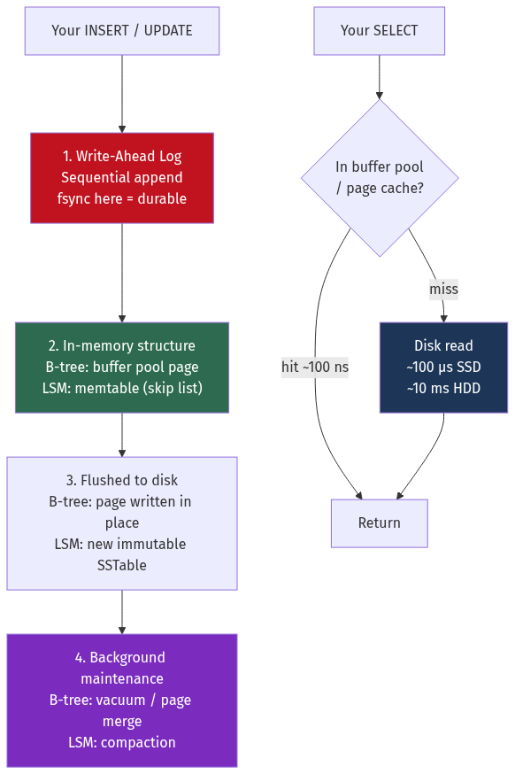

<details>
<summary>Diagram source (Mermaid)</summary>

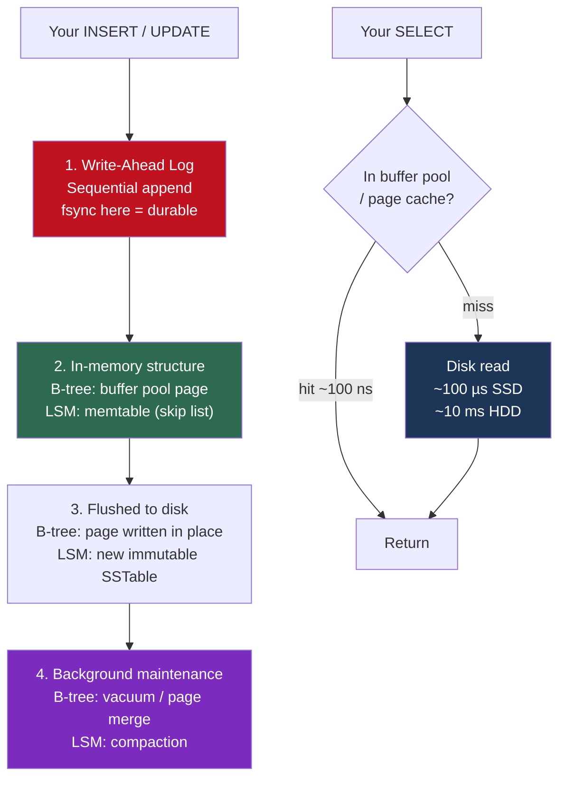

</details>

💡 **Every storage engine ever built is this diagram.** They differ only in what step 2's
structure is and what step 4's maintenance does. Learn the diagram and you can reason about
a database you've never used.

---

## Deep dive

### 6.1 The physical layer: what a disk actually is

#### Spinning disks (HDD)

A stack of magnetic platters rotating at 5,400–15,000 RPM, with a mechanical arm that
positions a read/write head.

Reading a byte requires three delays:

| Delay | What it is | Typical cost |
| --- | --- | --- |
| **Seek time** | Moving the arm to the right track | 4–10 ms |
| **Rotational latency** | Waiting for the sector to spin under the head | Half a rotation: 4.2 ms @ 7200 RPM |
| **Transfer time** | Actually reading the bits | ~0.01 ms for 4 KB |

📐 **The arithmetic that defines HDD behaviour:**
```
Random 4 KB read  = 9 ms seek + 4.2 ms rotation + 0.01 ms transfer ≈ 13 ms
                  → 1 / 0.013 = ~77 IOPS

Sequential 1 MB   = 9 ms seek + 4.2 ms rotation + 6.7 ms transfer ≈ 20 ms
                  → 50 MB/s, and only ONE seek was paid for the whole megabyte
```

💡 **Sequential access on an HDD is roughly 300× more efficient per byte than random
access.** This single fact shaped forty years of database design. It is why B-trees use
large pages, why the write-ahead log is append-only, and why Kafka is fast.

#### Solid-state drives (SSD)

No moving parts. NAND flash cells store charge. But flash has a deeply asymmetric property
that shapes everything:

| Operation | Granularity | Typical latency |
| --- | --- | --- |
| **Read** | Page (4–16 KB) | 25–100 µs |
| **Program (write)** | Page (4–16 KB) | 200–900 µs |
| **Erase** | **Block (128–256 pages, 1–4 MB)** | **2–10 ms** |

⚠️ **You cannot overwrite a page. You can only erase an entire block.**

To change 4 KB in the middle of a 2 MB block, the drive must:
1. Read all the still-valid pages in that block
2. Write them, plus your change, somewhere else
3. Erase the original block
4. Mark it free

This is called **read-modify-write**, and it's why the SSD needs a small computer inside it.

#### The Flash Translation Layer

The **FTL** is firmware that maintains a mapping from logical block addresses (what the OS
thinks) to physical pages (where the data actually is). It does three critical jobs:

**1. Out-of-place writes.** Rather than doing read-modify-write on every update, the FTL
writes your new 4 KB to a fresh, already-erased page and updates the mapping. The old page
is marked **invalid** (garbage), not erased.

**2. Garbage collection.** Eventually there are no fresh pages. The FTL picks a block with
many invalid pages, copies the few remaining valid pages elsewhere, and erases it.

**3. Wear levelling.** Each flash cell survives a limited number of erase cycles. The FTL
spreads writes so no block wears out early.

| Flash type | Bits per cell | Program/erase cycles | Cost | Typical use |
| --- | --- | --- | --- | --- |
| SLC | 1 | ~100,000 | Highest | Caches, industrial |
| MLC | 2 | ~10,000 | High | Enterprise (legacy) |
| TLC | 3 | ~3,000 | Moderate | **Most consumer and cloud SSDs** |
| QLC | 4 | ~1,000 | Lowest | Read-heavy, archival |

#### 📐 Write amplification — the number that kills SSDs

**Write Amplification Factor (WAF)** = bytes physically written to flash ÷ bytes the
application asked to write.

**Worked example.** Your application does a 4 KB random write. The SSD's block is 2 MB
(512 pages of 4 KB). Garbage collection selects a block that is 75% valid:

```
To free one 2 MB block, the FTL must:
  Copy 384 valid pages (75% of 512) elsewhere = 1.5 MB written
  Erase the block
  Write your 4 KB

Physical writes = 1.5 MB + 4 KB ≈ 1.54 MB
Logical write   = 4 KB
WAF = 1,540 / 4 = 385×
```

⚠️ **Your 4 KB write cost 1.5 MB of flash wear.**

**What reduces write amplification:**

| Technique | Effect |
| --- | --- |
| **Over-provisioning** (hiding 7–28% of capacity) | GC has more free blocks to work with; WAF drops sharply |
| **Sequential writes** | Whole blocks become invalid at once → GC copies almost nothing → **WAF ≈ 1** |
| **TRIM / `fstrim`** | OS tells the SSD which blocks are deleted, so GC doesn't preserve dead data |
| **Keeping the drive under ~70% full** | Same as over-provisioning, done voluntarily |
| **Larger write batches** | Fewer partial-block updates |

📐 **The relationship between free space and WAF** (simplified Rosenblum model):
```
WAF ≈ 1 / (2 × over_provision_fraction)     for random writes

At 7% OP  (typical consumer):  WAF ≈ 7
At 28% OP (enterprise):        WAF ≈ 1.8
At 50% OP:                     WAF ≈ 1.0
```

💡 **This is the deep reason LSM trees exist.** An LSM tree writes sequentially and deletes
whole files at a time, so the SSD's blocks become entirely invalid together. WAF at the
device level approaches 1. A B-tree doing random 8 KB page updates fights the FTL constantly.

#### 📐 How long will the drive last?

```
Drive: 1 TB TLC, 3,000 P/E cycles
Total bytes writable to flash = 1 TB × 3,000 = 3 PB (the "endurance")

Workload: 100 GB/day of application writes, WAF = 4
Physical writes = 400 GB/day
Lifetime = 3,000,000 GB / 400 GB/day = 7,500 days ≈ 20 years  ✅

Same workload, WAF = 40 (random small writes, full drive, no TRIM):
Physical writes = 4,000 GB/day
Lifetime = 750 days ≈ 2 years  ⚠️
```

**The same workload, a 10× difference in drive lifetime, decided entirely by write
pattern.** Cloud providers express this budget as **DWPD** (drive writes per day) — an
enterprise SSD rated 3 DWPD over 5 years lets you write 3× its capacity daily.

#### Storage device comparison

| Device | Random 4K IOPS | Sequential | Latency | $/TB (order) |
| --- | --- | --- | --- | --- |
| HDD 7200 RPM | ~80 | 150–250 MB/s | ~13 ms | $15 |
| SATA SSD | 50–90k | ~550 MB/s | ~100 µs | $60 |
| NVMe SSD (PCIe 4.0) | 500k–1M | 3–7 GB/s | ~20–80 µs | $80 |
| Optane / SCM | ~500k | ~2.5 GB/s | **~10 µs** | $500+ |
| RAM | ~10M+ | ~20 GB/s | ~100 ns | $3,000+ |
| AWS gp3 (EBS) | 3,000 baseline (16k max) | 125 MB/s (1 GB/s max) | ~1 ms | $80 + IOPS |
| AWS io2 Block Express | up to 256,000 | 4 GB/s | ~0.5 ms | $125 + IOPS |

⚠️ **Cloud disks are network devices with a billed IOPS quota.** Exceeding the quota doesn't
error — it silently queues, and your P99 goes from 5 ms to 5 seconds. The `iostat` column to
watch is `aqu-sz` (average queue size); if it's persistently above your device's parallelism,
you're throttled.

#### Queue depth — the thing people miss

An NVMe drive achieving 1,000,000 IOPS does **not** do so at queue depth 1.

```
NVMe SSD, single-threaded synchronous reads (QD=1):
  Latency 80 µs → 1 / 0.00008 = 12,500 IOPS

Same drive, 64 concurrent requests in flight (QD=64):
  ~500,000 IOPS, latency still ~130 µs
```

💡 **Modern SSDs deliver throughput through parallelism, not through low latency.** This is
why databases use asynchronous I/O (`io_uring`, `libaio`), why they read ahead, and why a
single-threaded benchmark on an NVMe drive produces a number 40× below the spec sheet.

### 6.2 The durability chain — why `write()` is a lie

When your program calls `write()` and it returns successfully, **your data is not on disk**.


<details>
<summary>Diagram source (Mermaid)</summary>


</details>

| Call | Guarantees | Survives |
| --- | --- | --- |
| `write()` | Data is in the OS page cache | Process crash ✅ · Power loss ❌ |
| `fsync(fd)` | Data **and metadata** pushed to the device and the device's cache flushed | Power loss ✅ |
| `fdatasync(fd)` | Data pushed; metadata only if needed for retrieval | Power loss ✅, marginally faster |
| `O_DIRECT` | Bypasses the page cache entirely | Nothing by itself — still needs a flush |
| `O_SYNC` | Every `write()` behaves like `write()` + `fsync()` | Power loss ✅, very slow |

📐 **What `fsync` costs:**

| Device | fsync latency | Max durable commits/second (serial) |
| --- | --- | --- |
| HDD | ~10 ms (a full rotation) | ~100 |
| SATA SSD | ~0.5–1 ms | ~1,000–2,000 |
| NVMe SSD | ~50–200 µs | ~5,000–20,000 |
| NVMe + capacitor-backed cache | ~20 µs | ~50,000 |
| Battery-backed RAID controller | ~10 µs | ~100,000 |

⚠️ **This is why PostgreSQL tops out around 1,000–10,000 write transactions per second on a
single node.** It's not the CPU and it's not the query planner — it's `fsync` on the WAL.
The fix is **group commit**: batch many transactions into one `fsync`, trading a little
latency for a lot of throughput.

```
Without group commit: 1,000 txn/s × 1 fsync each = 1,000 fsyncs/s → limited by device
With group commit:    1,000 txn/s batched 50 at a time = 20 fsyncs/s → 50× headroom
```

⚠️ **The dangerous shortcuts, and what they actually cost you:**

| Setting | Speed gain | What you lose |
| --- | --- | --- |
| PostgreSQL `synchronous_commit = off` | Large | Up to `wal_writer_delay` (200 ms) of **committed transactions** on power loss. Database stays *consistent* — it just forgets. |
| PostgreSQL `fsync = off` | Large | **Database corruption** on power loss. Never do this outside a throwaway test. |
| Disk write cache without a capacitor | Large | Silent corruption. The drive lied about durability. |
| MySQL `innodb_flush_log_at_trx_commit = 2` | Large | Up to 1 second of committed transactions on OS crash |

💡 **The distinction that matters:** `synchronous_commit = off` loses *recent* transactions
but leaves a valid database. `fsync = off` can leave a *corrupt* one. Losing data is
recoverable from a replica; corruption may not be.

### 6.3 Pages and the buffer pool

Databases never read a row. They read a **page** — a fixed-size block, typically 4, 8 or
16 KB.

| Database | Page size |
| --- | --- |
| PostgreSQL | 8 KB |
| MySQL InnoDB | 16 KB |
| SQLite | 4 KB (default) |
| SQL Server | 8 KB |
| Oracle | 8 KB (configurable) |

**Why pages and not rows?** Three reasons: the disk's own minimum unit is a sector/page
anyway; a fixed size makes caching and free-space management tractable; and locality means
the neighbouring rows you just paid to fetch are likely to be wanted next.

A PostgreSQL 8 KB heap page looks like this:

```
┌──────────────────────────────────────────────────────────┐
│ PageHeader (24 B): LSN, checksum, free space pointers    │
├──────────────────────────────────────────────────────────┤
│ ItemId array →→→  (4 B each: offset + length per tuple)  │
│                                                          │
│                    ← free space →                        │
│                                                          │
│  ←←← Tuples grow upward from the end                     │
│  [tuple 3][tuple 2][tuple 1]                             │
├──────────────────────────────────────────────────────────┤
│ Special space (index-specific data)                      │
└──────────────────────────────────────────────────────────┘
```

💡 The **ItemId indirection** is the clever bit. A row's address is `(page, slot)`. If the
row moves within the page — because an update made it longer — only the slot entry changes,
so indexes pointing at `(page, slot)` stay valid. This is called a **slotted page** and
essentially every database uses it.

**The buffer pool** is the database's own cache of pages in RAM, and it is the single most
important memory setting you will configure.

```
PostgreSQL: shared_buffers    → recommended 25% of system RAM
MySQL:      innodb_buffer_pool_size → recommended 50–70% of system RAM
```

⚠️ **Why PostgreSQL recommends only 25%** while MySQL recommends 70%: PostgreSQL
deliberately relies on the **OS page cache** as a second tier and uses buffered I/O, so
setting `shared_buffers` too high double-caches and wastes memory. InnoDB uses `O_DIRECT`
and bypasses the page cache, so it must cache everything itself.

📐 **The hit rate is what actually matters.**
```
Buffer pool hit rate 99%:  0.99 × 100 ns + 0.01 × 100 µs = 1.1 µs average
Buffer pool hit rate 90%:  0.90 × 100 ns + 0.10 × 100 µs = 10.1 µs average

A 9-point drop in hit rate made every read 9× slower.
```

💡 This non-linearity is why "the database got slow when the table grew past X" happens so
abruptly. Nothing degraded gradually — the working set stopped fitting in RAM.

**Eviction policy:** most databases use a variant of **CLOCK** or **LRU-K** rather than plain
LRU, specifically to survive a sequential scan. A plain LRU would let one `SELECT * FROM
big_table` evict your entire hot working set. PostgreSQL uses a clock-sweep with usage
counters and gives sequential scans a small **ring buffer** so they can't pollute the pool.
This problem is called **cache pollution**, and [Chapter 11](./11_caching_cdn_and_edge.md)
covers the general solutions.

### 6.4 B+trees, derived

#### The problem

You have 100 million rows. Find the one where `id = 74839201`. A full scan reads 100 million
rows. A sorted array allows binary search — 27 comparisons — but insertion requires shifting
data.

You need a structure that is **sorted**, **cheap to update**, and — critically —
**shallow**, because every level costs a disk read.

#### Why B+trees, not binary trees

A binary search tree over 100 million keys has depth log₂(100,000,000) ≈ **27**. Each level
is a random disk read.

```
27 levels × 100 µs (SSD) = 2.7 ms per lookup
27 levels × 10 ms (HDD)  = 270 ms per lookup  ❌
```

The fix: since you must read an entire 8 KB page anyway, **put as many keys in it as
possible**. Instead of 2 children per node, have hundreds.

#### 📐 The fan-out calculation

```
Page size:      8,192 bytes
Page header:       ~24 bytes
Usable:          8,168 bytes

Per entry in an internal node: 8-byte key (bigint) + 8-byte child pointer = 16 bytes
Entries per node = 8,168 / 16 ≈ 510

Depth needed for N keys: log₅₁₀(N)
  510¹ =            510 rows
  510² =        260,100 rows
  510³ =    132,651,000 rows      ← 132 million rows in 3 levels
  510⁴ = 67,652,010,000 rows      ← 67 billion rows in 4 levels
```

💡 **This is the answer to "why is a database index fast":** any row in a 100-million-row
table is **three page reads** away. And the root and the entire second level (510 pages =
4 MB) are permanently in the buffer pool, so in practice it's **one** actual disk read.

```
Realistic lookup on a 100M-row table:
  Level 1 (root):     buffer pool hit,   0.1 µs
  Level 2 (internal): buffer pool hit,   0.1 µs
  Level 3 (leaf):     disk read,       100 µs
  Total ≈ 100 µs, versus 27 reads = 2,700 µs for a binary tree
```

#### Structure

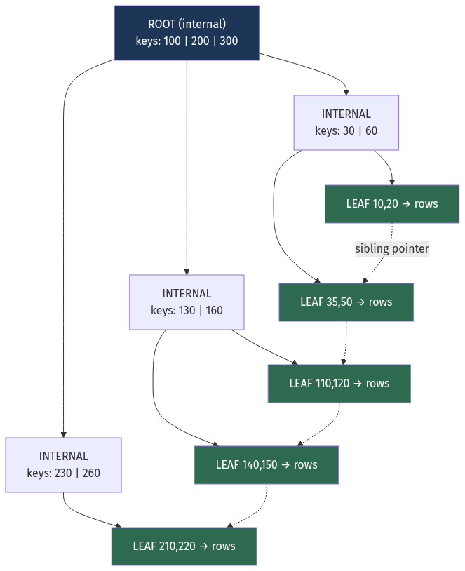

<details>
<summary>Diagram source (Mermaid)</summary>

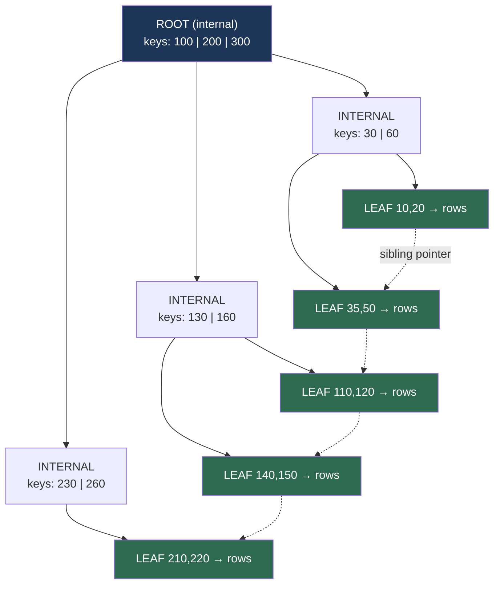

</details>

**B+tree vs B-tree** — the "+" matters:

| | B-tree | B+tree |
| --- | --- | --- |
| Data stored in | Every node | **Leaves only** |
| Internal nodes hold | Keys **and** values | Keys only → **higher fan-out** |
| Leaves linked | No | **Yes, doubly-linked list** |
| Range scan | Tree traversal per row | **Walk the leaf list sequentially** ✅ |

💡 The linked leaves are why `WHERE created_at BETWEEN x AND y ORDER BY created_at` is fast:
descend once, then walk sideways sequentially. Essentially every real database uses a
**B+tree** even when documentation says "B-tree".

#### Insertion and the page split

Inserting into a full leaf forces a **split**: allocate a new page, move half the entries,
and push a separator key up to the parent. If the parent is full, it splits too — potentially
all the way to the root, which is the only way the tree grows taller.

⚠️ **Page splits are why write latency is spiky.** A normal insert touches one page. A split
touches three (old leaf, new leaf, parent) and may cascade. Under a write-heavy load your
P99 write latency is dominated by splits.

⚠️ **Random inserts cause far more splits than sequential ones.**

| Insert pattern | Behaviour | Page fill factor |
| --- | --- | --- |
| **Sequential** (auto-increment, ULID, timestamp) | Always appends to the rightmost leaf; split produces one full + one empty page | ~100% on the left, one hot page |
| **Random** (UUID v4) | Splits everywhere in the tree | **~50–70%** average |

📐 **The UUID v4 penalty, quantified:**
```
1 billion rows, 8 KB pages, ~100 bytes/row
Sequential keys, ~95% fill:  1e9 × 100 / (8192 × 0.95) = 12.8 GB of index
Random UUIDv4, ~65% fill:    1e9 × 100 / (8192 × 0.65) = 18.8 GB of index

47% more space, 47% worse cache hit rate, plus vastly more page splits and
device-level write amplification because writes scatter across the whole file.
```

💡 **This is why UUID v7 and ULID exist.** They put a timestamp in the high bits, so IDs
are *globally unique but locally sequential* — you keep the distributed-generation benefit
of a UUID and the insert locality of an auto-increment. If you are choosing a primary key
type today, this is the answer.
([Chapter 23](./23_building_blocks_and_algorithms.md) covers ID generation properly.)

#### Fragmentation and fill factor

Deletes leave holes. Updates that grow a row may not fit in place. Over time a B-tree
**bloats**: the same data occupies more pages, so more of it must be read.

Mitigations: a configurable **fill factor** (leave 10–30% free per page for future updates),
periodic `REINDEX`/`OPTIMIZE TABLE`, and in PostgreSQL's case **HOT updates** — if the
updated columns aren't indexed and the new version fits on the same page, the indexes don't
need updating at all.

### 6.5 LSM trees, derived

#### The problem with B-trees

Every B-tree write is a **random write to a specific page**. At 10,000 inserts/second across
a large index, that's 10,000 random 8 KB writes/second, each of which:
- Costs a disk seek (or, on SSD, fights the FTL's garbage collector)
- Must also be written to the WAL first, so it's written **twice**
- May trigger a page split, so possibly more

The **Log-Structured Merge tree** asks: what if we only ever wrote sequentially?

#### The structure

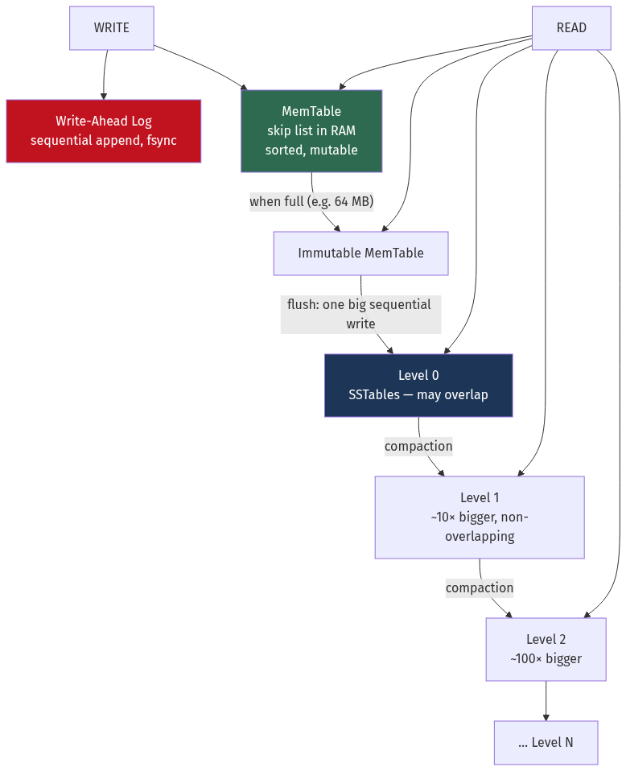

<details>
<summary>Diagram source (Mermaid)</summary>

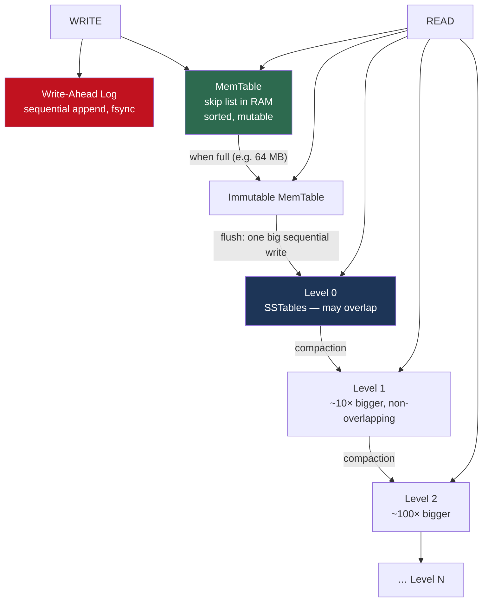

</details>

**The write path:**
1. Append to the WAL (sequential, for crash recovery)
2. Insert into the **memtable** — a sorted in-memory structure, almost always a **skip list**
   because it supports concurrent lock-free-ish inserts and ordered iteration
3. Return success. **The write is done.** No random I/O whatsoever.
4. When the memtable exceeds a threshold, mark it immutable, start a fresh one, and flush the
   old one to disk as an **SSTable** — one large sequential write

**An SSTable (Sorted String Table)** is an immutable file containing sorted key-value pairs:

```
┌─────────────────────────────────────────────┐
│ Data blocks (sorted, compressed, ~4-64 KB)  │
├─────────────────────────────────────────────┤
│ Index block: first key of each data block   │  ← binary search this
├─────────────────────────────────────────────┤
│ Bloom filter: "is key K possibly here?"     │  ← skip the file entirely
├─────────────────────────────────────────────┤
│ Footer: offsets, checksums, metadata        │
└─────────────────────────────────────────────┘
```

**The read path** — and this is where the cost lives:
1. Check the memtable
2. Check the immutable memtable
3. Check every SSTable, newest to oldest, until found

⚠️ **A read may touch many files.** Two mechanisms save it:
- **Bloom filters** ([Chapter 23](./23_building_blocks_and_algorithms.md)) — a per-SSTable
  probabilistic structure answering "definitely not here" or "maybe here". At 10 bits per key
  the false-positive rate is ~1%, so 99% of irrelevant SSTables are skipped without any I/O.
- **Level structure** — in levelled compaction, each level below L0 has **non-overlapping**
  key ranges, so at most one file per level can contain the key.

📐 **Read cost with bloom filters:**
```
7 levels, 1% bloom false-positive rate
Expected wasted disk reads = 7 × 0.01 = 0.07
Plus 1 real read for the level that has it
→ ~1.07 disk reads per point lookup. Nearly as good as a B-tree.
```

💡 Without bloom filters an LSM read would be catastrophic. **The bloom filter is not an
optimisation of the LSM tree; it is a load-bearing component of it.**

#### Deletes and the tombstone problem

You cannot delete from an immutable file. Instead you **write a tombstone** — a marker
saying "this key is deleted" — which shadows older values until compaction physically
removes both.

⚠️ **Tombstones cause one of Cassandra's most notorious production problems.** A table used
as a work queue (insert a row, process it, delete it) accumulates millions of tombstones in
the same partition. A range scan must read and discard every one of them.

```
Partition with 10,000 live rows and 2,000,000 tombstones:
  SELECT * FROM queue WHERE partition_key = 'x' LIMIT 100
  → reads 2,010,000 entries to return 100 rows
  → times out, and generates a "Read 2000000 live rows and 2000000 tombstone
    cells" warning
```

**Rules:** never use an LSM store as a delete-heavy queue; prefer TTL-based expiry over
explicit deletes; and understand `gc_grace_seconds` (default 10 days) — tombstones must
survive long enough to propagate to every replica, or **deleted data resurrects** when a
node that missed the delete comes back.

#### Compaction strategies

Compaction merges SSTables, discards shadowed values and tombstones, and reorganises the
data. **The compaction strategy is the single biggest performance lever in an LSM store.**

**Size-tiered (STCS)** — merge SSTables of similar size into one bigger one.

```
L0: [4MB][4MB][4MB][4MB] → merge → [16MB]
    [16MB][16MB][16MB][16MB] → merge → [64MB]
```
- ✅ Low write amplification (~4–6×) — best for write-heavy loads
- ❌ High **space** amplification: during a merge of four 64 GB tables you temporarily need
  another 64 GB free. Worst case requires ~50% free disk.
- ❌ High read amplification: overlapping tables at every tier

**Levelled (LCS)** — each level holds non-overlapping SSTables, and each level is ~10× the
previous.

```
L0: [overlapping, small]
L1: [10 MB][10 MB]…      total 300 MB, non-overlapping
L2: total 3 GB, non-overlapping
L3: total 30 GB, non-overlapping
```
- ✅ Low read amplification: at most one file per level
- ✅ Low space amplification (~1.1×)
- ❌ **High write amplification (~10–30×)** — a key may be rewritten once per level

**Time-windowed (TWCS)** — group SSTables by time window; never compact across windows.
- ✅ Ideal for **time-series with TTL**: an entire window expires and the file is deleted
  whole, with zero compaction work
- ❌ Useless if you update old data

| Strategy | Write amp | Read amp | Space amp | Use for |
| --- | --- | --- | --- | --- |
| **Size-tiered** | ~4–6× | High | **~2×** ⚠️ | Write-heavy, disk is cheap |
| **Levelled** | **~10–30×** ⚠️ | Low | ~1.1× | Read-heavy, space matters |
| **Time-windowed** | ~1–2× | Low (time-bounded queries) | ~1.1× | Time series with TTL |
| **Universal/Hybrid** | ~5–10× | Medium | ~1.5× | General purpose (RocksDB) |

#### 📐 The amplification triangle — you must pick two

This is the central trade-off of storage engines and a superb interview topic.

```
                    WRITE amplification
                     (bytes written to
                      disk per byte of
                       application data)
                            /\
                           /  \
                          /    \
             LSM levelled/      \ B-tree
                        /        \
                       /  Pick 2  \
                      /            \
                     /______________\
        READ                          SPACE
   amplification                  amplification
   (disk reads per            (disk used per byte
    logical read)              of logical data)
                        ↑
                  LSM size-tiered
```

| Engine | Write amp | Read amp | Space amp |
| --- | --- | --- | --- |
| B+tree | High (WAL + page, random) | **Low (~1)** | Medium (fragmentation, ~1.3×) |
| LSM size-tiered | **Low (~5)** | High | High (~2×) |
| LSM levelled | High (~20) | Low (~1.1) | **Low (~1.1)** |

💡 **There is no configuration that wins all three.** When someone asks "which is better,
B-tree or LSM?", the correct answer names this triangle and asks which corner the workload
cares about.

### 6.6 B+tree vs LSM — the decision

| Dimension | B+tree | LSM tree |
| --- | --- | --- |
| Write path | Random page writes + WAL | **Sequential only** |
| Write throughput | 1,000–10,000/s per node | **50,000–1,000,000/s per node** |
| Read latency | **Predictable, ~1 page read** | Variable; depends on level count and bloom hits |
| Range scans | **Excellent** (linked leaves) | Good, but merges across levels |
| Space | Fragmentation ~1.3× | Levelled ~1.1×, size-tiered ~2× |
| Compression | Poor (in-place pages) | **Excellent** (immutable blocks compress well) |
| Latency predictability | **Consistent** | ⚠️ Compaction causes periodic stalls |
| Transactions | Natural fit | Harder (built on top) |
| Deletes | Immediate | Tombstones + delayed reclamation |
| SSD friendliness | Fights the FTL | **Aligns with it — WAF ≈ 1** |
| Used by | PostgreSQL, MySQL, SQLite, Oracle, SQL Server | Cassandra, RocksDB, LevelDB, ScyllaDB, HBase, InfluxDB, ClickHouse (variant) |

⚠️ **The LSM problem nobody mentions in the comparison table: compaction is not free.**
Compaction competes with foreground traffic for disk bandwidth and CPU. Symptoms:
- **P99 latency spikes** correlated with compaction activity
- **Write stalls** — if flush can't keep up, RocksDB deliberately throttles or blocks writers
  rather than let L0 grow unbounded
- Compaction debt that grows silently until the system falls over

💡 **This is the actual reason Discord moved from Cassandra to ScyllaDB in 2022.** Their
published account: Cassandra's JVM garbage collection *and* compaction were producing
latency spikes severe enough that engineers were paged regularly. ScyllaDB — a C++
reimplementation with a shard-per-core architecture and no GC — cut their P99 dramatically
on a fraction of the nodes. **The datastore was replaced to fix tail latency, not
throughput.**

### 6.7 The write-ahead log and crash recovery

#### The rule

📐 **Write-Ahead Logging protocol:** before any modified page is written to its permanent
location on disk, the **log record describing that modification must already be durable.**

Why it works: if you crash after the log is durable but before the page is written, recovery
replays the log. If you crash before the log is durable, the transaction never committed and
nobody was told it did.

```
┌───────────────────────────────────────────────┐
│ LSN 1001 | txn 42 | BEGIN                     │
│ LSN 1002 | txn 42 | UPDATE page 7: 100 → 150  │  ← old and new value
│ LSN 1003 | txn 42 | UPDATE page 9: 200 → 150  │
│ LSN 1004 | txn 42 | COMMIT                    │  ← fsync HERE
└───────────────────────────────────────────────┘
```

The **LSN (Log Sequence Number)** is monotonically increasing and stamped into each page
header, so recovery knows whether a page already reflects a given log record.

#### Recovery — the three phases (ARIES)

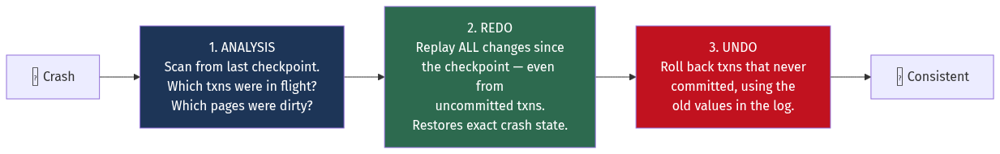

<details>
<summary>Diagram source (Mermaid)</summary>

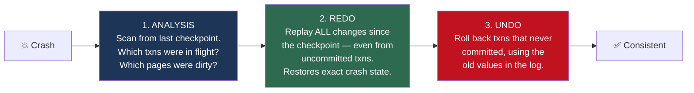

</details>

💡 **Why REDO replays uncommitted transactions too** — this trips people up. The goal of
REDO is to reconstruct the *exact* state at the moment of the crash, including partial work,
so that UNDO's compensating records apply to a known state. This is called
**repeating history**, and it's what makes ARIES able to recover from a crash *during
recovery*.

**Checkpoints** bound recovery time by periodically flushing dirty pages and recording the
point beyond which the log must be replayed.

📐 ```
No checkpoints:    replay the entire log since the database was created ❌
5-minute checkpoints: replay at most ~5 minutes of log ✅
```
⚠️ But checkpoints cause an I/O burst. PostgreSQL spreads it over
`checkpoint_completion_target` (default 0.9 of the interval) specifically to avoid a latency
spike every five minutes.

#### What else the WAL gives you for free

The WAL is a complete, ordered record of every change — which turns out to be exactly what
several other features need:

| Feature | How it uses the WAL |
| --- | --- |
| **Physical replication** | Ship WAL records to a replica and replay them ([Ch 9](./09_replication_partitioning_consistency.md)) |
| **Point-in-time recovery** | Restore a base backup, replay WAL up to a chosen timestamp |
| **Logical replication / CDC** | Decode WAL into row-level change events (Debezium, `pgoutput`) |
| **Transactional outbox** | Read committed changes reliably ([Ch 10](./10_distributed_transactions_and_integrity.md)) |

💡 **"The log is the database"** — a phrase from Jay Kreps' *The Log* — is the single most
generative idea in storage systems. Kafka ([Chapter 12](./12_messaging_and_event_streaming.md))
is what you get when you keep the log and throw away the tables.

### 6.8 MVCC — how readers don't block writers

Naively, a reader must lock a row so a writer can't change it mid-read. That means readers
block writers and writers block readers, and throughput collapses under concurrency.

**Multi-Version Concurrency Control** keeps **multiple versions** of each row. A reader sees
a consistent **snapshot** as of the moment its transaction started; a writer creates a new
version without touching the one the reader is looking at.

```
Row id=1, PostgreSQL heap tuples:

  version A: xmin=100, xmax=205, balance=500   ← visible to txns 100..204
  version B: xmin=205, xmax=NULL, balance=750  ← visible to txns ≥205
```

Each tuple carries `xmin` (the transaction that created it) and `xmax` (the transaction that
deleted/superseded it). A transaction's **snapshot** is the set of transaction IDs that were
committed when it began, and visibility is decided by comparing against it.

#### Two implementations, two different problems

| | **PostgreSQL** (versions in the heap) | **MySQL InnoDB / Oracle** (undo log) |
| --- | --- | --- |
| Where old versions live | In the table itself, as dead tuples | In a separate **undo log** |
| Update cost | Writes a whole new tuple + updates **every** index | Updates in place, writes the old value to undo |
| Read of current row | Direct | Direct |
| Read of old snapshot | Direct (it's right there) | Must **reconstruct** by walking the undo chain backwards |
| Cleanup mechanism | **`VACUUM`** | Purge thread |
| Characteristic failure | ⚠️ **Table bloat** and transaction ID wraparound | ⚠️ **Long-running reads get slow** as undo chains lengthen; undo tablespace grows |

⚠️ **PostgreSQL's most famous operational problem** is a long-running transaction. A report
query open for six hours means `VACUUM` cannot reclaim *any* tuple newer than that
transaction's snapshot — because that transaction might still need to see them. Meanwhile
the table keeps accumulating dead tuples.

```
Table with 1M rows, updated 10× per row during a 6-hour open transaction:
  Live tuples: 1,000,000
  Dead tuples: 10,000,000  ← VACUUM cannot touch any of them
  Table size:  11× what it should be
  Every sequential scan now reads 11× the data
```

Monitor `pg_stat_activity` for long transactions, and set `idle_in_transaction_session_timeout`.
This one setting prevents a large fraction of PostgreSQL production incidents.

⚠️ **Transaction ID wraparound** is the more dangerous version. PostgreSQL's transaction IDs
are 32-bit and wrap around after ~4 billion. If `VACUUM` can't freeze old tuples fast enough,
PostgreSQL will **refuse all writes** to protect data. It's rare, but it has taken down
large sites, and it is always caused by vacuum being blocked or under-resourced.

### 6.9 Row vs column storage

The same table, laid out two ways:

```
Logical table:
  id | name    | country | age | salary
  1  | Alice   | UK      | 30  | 50000
  2  | Bob     | US      | 25  | 60000
  3  | Carol   | UK      | 35  | 70000

ROW storage (OLTP) — one row contiguous:
  [1,Alice,UK,30,50000][2,Bob,US,25,60000][3,Carol,UK,35,70000]

COLUMN storage (OLAP) — one column contiguous:
  ids:       [1,2,3]
  names:     [Alice,Bob,Carol]
  countries: [UK,US,UK]
  ages:      [30,25,35]
  salaries:  [50000,60000,70000]
```

📐 **`SELECT AVG(salary) FROM employees` over 100 million rows, 200 bytes each:**

```
Row store:    must read every row to reach the salary field
              100M × 200 B = 20 GB read
              At 1 GB/s = 20 seconds

Column store: reads only the salary column
              100M × 8 B = 800 MB, and it compresses ~4× → 200 MB
              At 1 GB/s = 0.2 seconds

100× faster.
```

**Why columnar compresses so much better:** a column contains values of the same type and
often low cardinality, so specialised encodings apply:

| Encoding | Works on | Example |
| --- | --- | --- |
| **Run-length (RLE)** | Sorted / repetitive | `UK,UK,UK,UK,US,US` → `(UK,4),(US,2)` |
| **Dictionary** | Low cardinality strings | `{0:UK, 1:US}` then store 1-bit codes |
| **Delta** | Sorted numerics, timestamps | `1000,1001,1003` → `1000,+1,+2` |
| **Delta-of-delta** | Regular intervals | Prometheus timestamps → ~1 bit each |
| **Bit-packing** | Small integer ranges | Ages 0–127 → 7 bits, not 32 |
| **XOR (Gorilla)** | Slowly-changing floats | Time-series values → ~1.3 bytes |

💡 Combined, columnar formats routinely achieve **5–20× compression** where row stores get
2–3×. That's not just disk savings — it is a proportional reduction in **I/O**, which is the
actual bottleneck.

**Two more columnar superpowers:**

**Vectorised execution.** Process a batch of 1,024 values in a tight loop with SIMD
instructions, instead of one row at a time through a virtual-function-call interpreter.
Typically 10–100× faster per operator.

**Predicate pushdown with zone maps.** Store min/max per block. `WHERE age > 90` skips any
block whose max age is 40 — without reading it at all. Parquet calls these row-group
statistics; ClickHouse calls them a sparse primary index; Redshift calls them zone maps.

| | Row store | Column store |
| --- | --- | --- |
| Best at | Fetch/modify whole records by key | Aggregate a few columns over many rows |
| `SELECT *` for one id | ✅ One page read | ❌ N column reads, reassembled |
| `SUM(x)` over 1e9 rows | ❌ Reads everything | ✅ Reads one column |
| Single-row `INSERT` | ✅ Cheap | ❌ Expensive — must be batched |
| `UPDATE` one field | ✅ In place | ❌ Usually rewrite a block, or write a delta |
| Compression | 2–3× | **5–20×** |
| Examples | PostgreSQL, MySQL, Oracle | ClickHouse, Snowflake, BigQuery, Redshift, DuckDB, Parquet |

⚠️ **Column stores hate small writes.** ClickHouse's documentation recommends inserting in
batches of at least 1,000 rows and no more than about one insert per second, because each
insert creates a part that must later be merged. Streaming single rows into a column store
is the most common way to make it unusable.

**Hybrid approaches** exist and are increasingly the norm: PostgreSQL with `columnar`
extensions, MySQL HeatWave, Oracle In-Memory, and **HTAP** systems like TiDB and SingleStore
that keep a row store for writes and a column replica for analytics.

### 6.10 Durability at the systems level

Storage engines protect one machine. These techniques protect the *data*, and they're what
backup, object-storage and data-protection systems are built from.

#### Erasure coding

Replication gives durability at 3× the cost. **Erasure coding** gives comparable durability
at ~1.4×.

**Reed–Solomon(k, m):** split an object into `k` data shards, compute `m` parity shards. Any
`k` of the `k + m` shards reconstruct the original.

```
RS(10, 4): 10 data + 4 parity = 14 shards
  Storage overhead: 14/10 = 1.4×
  Tolerates any 4 simultaneous shard losses
  Compare: 3× replication tolerates 2 losses at 3.0× cost
```

📐 **Durability comparison** (annual shard failure probability p = 2%, independent):
```
3× replication: lose all 3 → p³ = 8 × 10⁻⁶  → ~5 nines
RS(10,4): lose ≥5 of 14 → Σ C(14,i) p^i (1-p)^(14-i) for i≥5 ≈ 2 × 10⁻⁷ → ~7 nines
```
**Better durability at less than half the storage cost.**

⚠️ **What it costs you:**
- **Degraded reads are expensive.** A normal read hits one shard. If a shard is missing, you
  must read `k` shards from `k` different nodes and do the reconstruction math — 10× the
  network I/O and meaningful CPU.
- **Small objects are inefficient.** A 1 KB object split into 14 shards produces 14 tiny
  I/Os. Erasure coding wants large objects, which is why systems pack small objects into
  large containers first.
- **Repair traffic is heavy.** Losing a node means reading `k` shards for every object it
  held. **Local Reconstruction Codes** (Azure) and **Clay codes** exist specifically to cut
  this repair bandwidth.

💡 **The rule of thumb:** replication for hot, small, latency-critical data; erasure coding
for large, cooler objects. S3 Standard uses erasure coding; a database's hot replicas do not.

#### Deduplication

If the same bytes are stored many times, store them once and reference them. Essential for
backups, where consecutive daily backups are 95%+ identical.

**Fixed-size chunking** splits at every 4 KB boundary. It fails catastrophically on
insertion: prepend one byte to a file and every subsequent chunk boundary shifts, so nothing
matches. This is the **boundary-shift problem**.

**Content-defined chunking (CDC)** fixes it. Slide a window over the data computing a
**rolling hash** (Rabin fingerprint, or the faster Gear/FastCDC), and cut a chunk boundary
wherever the hash matches a pattern:

```
if (rolling_hash & 0x1FFF) == 0:   # ~1 in 8192 → average 8 KB chunks
    cut a chunk boundary here
```

Because boundaries depend on **content**, not offset, inserting a byte only changes the one
chunk containing it. Everything downstream still matches.


<details>
<summary>Diagram source (Mermaid)</summary>

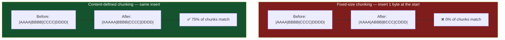

</details>

Each chunk is identified by a strong hash (SHA-256, BLAKE3) and stored once in a
content-addressed store.

📐 **Real dedup ratios:**
```
Daily full backups of a 1 TB dataset changing 2%/day, 30 days retained:
  Without dedup: 30 TB
  With dedup:    1 TB + (29 × 20 GB) = 1.58 TB
  Ratio: 19:1
Virtual machine images (many VMs from the same base OS): 10:1 to 50:1
```

⚠️ **The costs:** the chunk index must be searched on every write, and at petabyte scale that
index doesn't fit in RAM — this is the central engineering problem of a dedup system, solved
with bloom filters, locality-preserving caches and sparse indexing. Deduplication also
**destroys locality**: a single restored file may be scattered across thousands of chunks
written years apart, so restore throughput can be far worse than backup throughput. And
deduplicated data is **fragile** — one lost chunk can corrupt thousands of files, so dedup
systems need aggressive checksumming and redundancy.

#### Copy-on-write snapshots

A snapshot must be instantaneous and cheap, so it cannot copy data. **Copy-on-write** takes
a snapshot by simply not freeing anything:

```
1. Snapshot = record the current root pointer of the tree. O(1), instant.
2. A subsequent write allocates a NEW block and updates pointers up to a NEW root.
3. The old blocks stay reachable from the snapshot's root.
4. Deleting the snapshot frees blocks no longer referenced by any root.
```

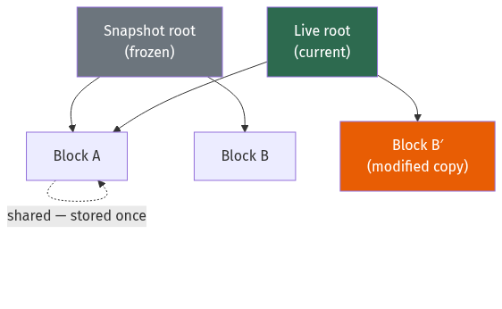

<details>
<summary>Diagram source (Mermaid)</summary>

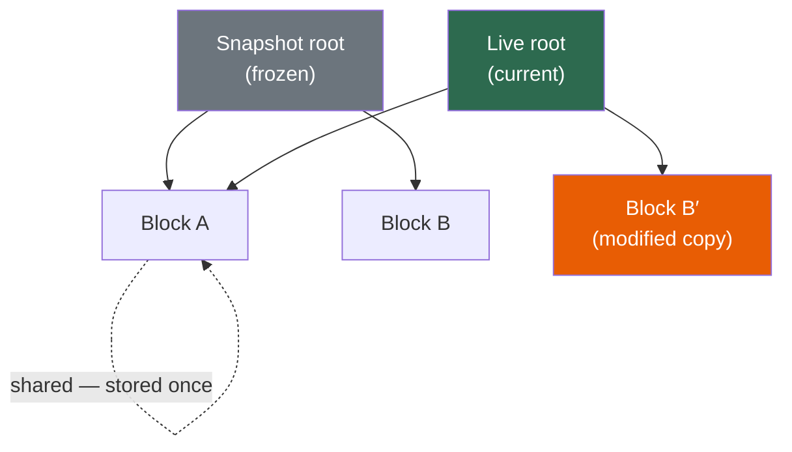

</details>

This is how ZFS, Btrfs, LVM thin snapshots, EBS snapshots and every modern
storage array implement snapshots. **ZFS** additionally checksums every block in its parent
pointer, so it detects **silent data corruption** ("bit rot") that a traditional RAID
controller would happily serve back to you — and can self-heal from a mirror.

⚠️ **The trade-off is fragmentation.** Copy-on-write turns overwrites into new allocations,
so a file that started contiguous becomes scattered. On spinning disks this is severe; ZFS
and Btrfs both perform noticeably worse for random-overwrite workloads like a database file,
which is why running PostgreSQL on ZFS requires deliberate tuning (`recordsize=8k`,
disabling double-caching).

#### Immutability and WORM

For ransomware and insider-threat protection, snapshots aren't enough — an attacker with
admin credentials deletes them. **WORM (Write Once, Read Many)** storage enforces immutability
at the storage layer, with a retention period that **cannot be shortened even by an
administrator**.

S3 Object Lock in **compliance mode** is the canonical example: once set, no principal —
including the account root — can delete or alter the object until the retention date passes.
The related discipline is the **3-2-1 rule**: three copies, on two different media, one
off-site — updated for ransomware to **3-2-1-1-0**: plus one immutable/offline copy, and zero
errors on a *tested* restore.

⚠️ **An untested backup is not a backup.** The failure mode that ends companies is
discovering during a restore that the backups have been silently failing for months. Restore
testing must be automated and scheduled. See
[Chapter 20](./20_deployment_multiregion_dr_cost.md).

---

## Worked example — choosing a storage engine

*You're designing storage for an IoT platform. 100,000 sensors each write one reading every
10 seconds. Readings are 100 bytes. The dominant query is "give me the last 24 hours for
sensor X." Data is retained for 90 days. Occasionally analysts run aggregate queries across
all sensors. Choose an engine and size it.*

**Step 1 — Characterise the workload.**
```
Write rate = 100,000 / 10 = 10,000 writes/second, sustained, forever
Read rate  = low, and always a time-range scan for a single sensor
Updates    = none. Readings are immutable.
Deletes    = only by age (TTL), never individual rows
Analytics  = full-column aggregates, infrequent
```

💡 Three signals point the same direction: **write-heavy, append-only, TTL-based deletion.**

**Step 2 — Would a B-tree work?**
```
10,000 inserts/second into a B+tree index on (sensor_id, timestamp).
Keys are scattered across 100,000 sensors → random insertion across the whole tree.
Each insert: 1 WAL write + 1+ random page write, plus splits.
A single PostgreSQL node does 1,000–10,000 write txn/s at best.
→ We are AT the ceiling on day one, with zero headroom. ❌
```
And index bloat from random inserts (§6.4) will make it worse over time.

**Step 3 — LSM tree.**
```
10,000 sequential appends/second into a memtable = trivial.
Cassandra/ScyllaDB handle 50,000–100,000 writes/second per node.
→ One node has 5–10× headroom. ✅
```

**Step 4 — Choose the compaction strategy.** This is the decision that matters.

The data is time-ordered and expires by age. **Time-Windowed Compaction (TWCS)** with a
1-day window means:
- SSTables never merge across day boundaries
- After 90 days, an entire day's SSTable is **deleted whole** — zero compaction work, zero
  tombstones
- Write amplification ≈ 1–2× instead of levelled's 10–30×

⚠️ With **levelled** compaction instead, every reading would be rewritten ~20 times over its
life, and 90-day expiry would generate billions of tombstones. This choice is worth roughly
an order of magnitude in disk write volume.

**Step 5 — Design the partition key.**

```
PRIMARY KEY ((sensor_id, day), timestamp)
```
`(sensor_id, day)` is the partition key; `timestamp` clusters within it.

📐 **Check the partition size** — this is the check people forget:
```
Readings per sensor per day = 86,400 / 10 = 8,640
Partition size = 8,640 × 100 B = 864 KB  ✅
(Cassandra's guidance: keep partitions under ~100 MB and ~100,000 rows.)

If we had used just (sensor_id) as the partition key:
  8,640 × 90 days = 777,600 rows = 78 MB and growing forever ❌
```
Bucketing by day bounds the partition. **Unbounded partitions are the number one Cassandra
data-modelling mistake.**

The query "last 24 hours for sensor X" now reads **exactly one partition** — a single
sequential read.

**Step 6 — Size the storage.**
```
Raw: 10,000 × 100 B × 86,400 = 86.4 GB/day
90 days = 7.8 TB

Compression: time-series columns compress well inside SSTable blocks.
  Timestamps: delta-of-delta → ~1 byte
  Sensor IDs: dictionary + RLE within a partition → ~0
  Values:     XOR/Gorilla encoding → ~1.5 bytes
  Realistic ~4× overall → 1.95 TB

Replication factor 3 → 5.85 TB
Compaction headroom (TWCS is modest, allow 30%) → ~7.6 TB
Round up: 8 TB across the cluster.
```

**Step 7 — Handle the analytics requirement.**

⚠️ Cassandra is bad at `SELECT AVG(value) FROM readings` across all sensors — that's a full
cluster scan with no index to help.

Don't force it. **Use two stores:**
```
Cassandra/ScyllaDB → serving path: "last 24h for sensor X"  (10k writes/s, low-latency point reads)
ClickHouse         → analytics path: cross-sensor aggregates (columnar, 100× faster for AVG/SUM)
Kafka              → the fan-out that feeds both (Ch 12)
```

📐 The column store's advantage on the analytics query, from §6.9:
```
Cassandra full scan:  7.8 TB read → minutes, and it degrades the serving path
ClickHouse:           reads the value column only, ~400 GB compressed → seconds
```

**Step 8 — The final answer.**

| Concern | Decision | Reason |
| --- | --- | --- |
| Engine | LSM (ScyllaDB) | 10k sustained writes/s; append-only workload |
| Compaction | TWCS, 1-day windows | TTL expiry deletes whole files; ~10× less write amplification |
| Partition key | `(sensor_id, day)` | Bounds partition at 864 KB; serves the primary query in one read |
| Retention | 90-day TTL aligned to windows | No tombstones at all |
| Analytics | Separate ClickHouse, fed by Kafka | Columnar is 100× faster and isolates the serving path |
| Storage | ~8 TB with RF=3 | 1.95 TB compressed × 3 + 30% headroom |

💡 Note that the **compaction strategy and the partition key** — two settings — did more for
this design than any hardware choice. That's typical.

---

## Trade-offs

| Decision | Option A | Option B | Choose A when | Never choose A when |
| --- | --- | --- | --- | --- |
| Engine | B+tree | LSM tree | Read-heavy; range scans; need transactions and predictable latency | Sustained writes exceed ~10k/s per node |
| LSM compaction | Size-tiered | Levelled | Write-heavy; disk is cheap; can afford 2× space | Space-constrained, or read-heavy |
| LSM compaction | Levelled | Time-windowed | Data is updated after insert | Time-series with TTL — TWCS is strictly better |
| Layout | Row store | Column store | Fetch/modify whole records by key (OLTP) | Aggregating few columns over billions of rows |
| Primary key | Auto-increment | UUID v7 / ULID | Single writer; want maximum insert locality | Distributed generation needed — then v7, never v4 |
| Primary key | UUID v4 | UUID v7 | Never, for a clustered index | Almost always. v4 costs ~47% index bloat and heavy splits. |
| Durability | `fsync` every commit | Group commit | Individual commit latency is critical | High throughput needed — group commit is ~50× |
| Durability | `synchronous_commit=on` | `off` | Financial/regulatory data | Analytics ingest where losing 200 ms is acceptable |
| Redundancy | 3× replication | Erasure coding | Hot data, latency-critical, small objects | Large cold objects — EC is 2× cheaper at better durability |
| MVCC | Heap versions (PostgreSQL) | Undo log (InnoDB) | — (usually not your choice) | Watch for bloat vs long-read slowdown respectively |
| Snapshots | Full copy | Copy-on-write | You need an independent physical copy | You need instant, cheap, frequent snapshots |

---

## How real companies do it

**Facebook built RocksDB** by forking LevelDB to run on flash. Their driving constraint was
exactly §6.1: they had fast SSDs and their B-tree-based store couldn't feed them. RocksDB's
configurability — pluggable compaction, column families, tunable bloom filters — exists
because Facebook runs it under wildly different workloads. It is now the storage engine
inside MySQL (MyRocks), CockroachDB (historically), TiKV, Kafka Streams, and dozens of
others. **When someone builds a new database, they usually don't build a new storage engine.**

**Discord's Cassandra → ScyllaDB migration (2022)** is the best public case study on LSM
operational cost. They ran 177 Cassandra nodes storing trillions of messages. The problem was
not throughput — it was **latency spikes from JVM garbage collection and compaction**,
severe enough to page engineers regularly. ScyllaDB (C++, shard-per-core, no GC) replaced
177 nodes with **72**, and cut P99 read latency from ~40 ms to ~15 ms. The lesson: an LSM
store's *tail* behaviour is dominated by background maintenance, not by the algorithm.

**Amazon Aurora** rethought the WAL relationship entirely. Instead of shipping full pages to
storage, Aurora ships **only the log records** to a distributed storage fleet, which applies
them to construct pages on demand. Their paper reports a **~7.7× reduction in network I/O**
versus a conventional MySQL replica setup. It's the sharpest illustration of "the log is the
database" in a commercial product.

**ClickHouse** is what §6.9 looks like taken to its conclusion: columnar, vectorised
execution over 1,024-row blocks, per-column compression codecs (`Delta`, `DoubleDelta`,
`Gorilla`, `T64`), and sparse primary indexes acting as zone maps. Cloudflare's published
account describes replacing a large Postgres/Citus analytics pipeline with ClickHouse and
handling millions of rows per second on far less hardware.

**ZFS** originated at Sun to solve silent corruption. Its key insight — store each block's
checksum in the *parent* pointer rather than beside the data — means corruption is detected
even if the disk returns "successful" garbage, and can be self-healed from a mirror. The
research it was responding to (CERN and NetApp studies) found measurable rates of silent
corruption across large disk populations, which is precisely the mode-4 "response failure"
from [Chapter 3](./03_reliability_availability_performance.md) §3.5.

---

## Common mistakes

**Using UUID v4 as a clustered primary key.** Random insertion order fragments the B-tree,
drops the fill factor to ~65%, causes constant page splits, and scatters writes across the
whole file so the SSD's FTL amplifies them. Use UUID v7 or ULID — same uniqueness, sequential
prefix.

**Believing `write()` means durable.** It means "in the OS page cache." Power loss loses it.
Understand exactly what `fsync`, `fdatasync` and your database's commit settings do before
you tune them for speed.

**Setting `fsync = off` to make benchmarks look good.** This risks *corruption*, not just
data loss. `synchronous_commit = off` is the defensible version — it loses recent
transactions but keeps the database valid.

**Leaving a transaction open.** In PostgreSQL, one long-running transaction blocks `VACUUM`
across the whole database, and the table bloats without bound. Set
`idle_in_transaction_session_timeout`.

**Using an LSM store as a queue.** Insert-then-delete generates tombstones that must be read
and discarded on every scan until `gc_grace_seconds` passes. This is a well-known way to make
Cassandra unusable.

**Unbounded partitions in Cassandra.** `PRIMARY KEY (sensor_id, timestamp)` grows forever.
Bucket the partition key by time. This is the single most common Cassandra data-modelling
error.

**Choosing levelled compaction for time-series.** You'll rewrite every row ~20 times and
generate tombstones at expiry. TWCS deletes whole files instead.

**Streaming single-row inserts into a column store.** ClickHouse, Redshift and BigQuery all
want batches. Row-at-a-time inserts create parts faster than merges can consume them.

**Sizing the buffer pool by guessing.** Measure the hit rate. The difference between 90% and
99% is a 9× change in average read latency, and it happens abruptly when the working set
stops fitting.

**Assuming NVMe performance at queue depth 1.** A single-threaded synchronous benchmark will
show you 12,000 IOPS on a drive rated for 1,000,000. Modern SSDs deliver throughput through
parallelism.

**Using erasure coding for small hot objects.** 14 tiny I/Os per object, expensive degraded
reads. Erasure coding wants large, cool objects.

**Trusting an untested backup.** Restore testing is the only thing that distinguishes a
backup from a hopeful assumption.

---

## Interview angle

**Q: What's the difference between a B-tree and an LSM tree, and when would you use each?**

*Weak:* "B-trees are for reads, LSM trees are for writes."

*Strong:* "They make opposite bets about where to spend I/O. A B+tree keeps data sorted in
place, so a read is one page lookup at a depth of 3 or 4 — predictable and fast — but every
write is a random page update plus a WAL write, which caps you around 10,000 writes per
second per node. An LSM tree only ever writes sequentially: into an in-memory memtable, then
flushed as immutable SSTables, with background compaction merging them. That gets you 50,000
to a million writes per second, but a read may have to check several levels, which is why
bloom filters are load-bearing rather than optional. The framing I'd use is the
**amplification triangle** — write, read and space amplification, and you can only optimise
two. B-trees take low read amplification. LSM with size-tiered compaction takes low write
amplification and pays in space. LSM with levelled takes low read *and* space and pays 10–30×
in write amplification. So the question is which corner the workload cares about. And I'd add
one operational point: LSM tail latency is dominated by compaction, which is exactly why
Discord replaced Cassandra with ScyllaDB — not for throughput, for P99."

**Q: Why is a database index fast?**

*Strong:* "Because it's shallow, and the depth is what costs you. A binary tree over 100
million rows is 27 levels deep, so 27 potential disk reads. A B+tree stores an entire 8 KB
page per node, and with 8-byte keys and 8-byte pointers that's about 510 entries per node —
so 510³ is 132 million rows in **three** levels. And the root and second level are only a few
megabytes, so they're permanently in the buffer pool. In practice a lookup is one real disk
read, about 100 microseconds. The insight is that the fan-out comes directly from the page
size, which comes from the storage device."

**Q: You call `write()` and it returns successfully. Is your data safe?**

*Strong:* "No. It's in the OS page cache — volatile RAM. It survives a process crash but not
a power loss. You need `fsync` to push it to the device *and* flush the device's own write
cache. And that's expensive: 10 ms on a spinning disk, around 50–200 µs on NVMe, which is
exactly why PostgreSQL tops out at a few thousand write transactions per second — it's
`fsync` on the WAL, not the CPU. The standard mitigation is **group commit**: batch many
transactions into one `fsync`, trading a bit of latency for maybe 50× the throughput. And
there's an important distinction in the escape hatches — `synchronous_commit = off` loses
recently committed transactions but leaves a valid database, whereas `fsync = off` risks
actual corruption. The first is a defensible trade for some workloads; the second isn't."

**Q: What is write amplification and why should I care?**

*Strong:* "It's the ratio of physical bytes written to logical bytes requested, and it shows
up at two levels. At the database level, a B-tree writes to the WAL and then to the page, and
a small update may dirty a whole 8 KB page — so a 100-byte update can be 16 KB written. At the
device level it's worse: an SSD can't overwrite a page, only erase a whole 2 MB block, so the
FTL has to relocate the still-valid pages before erasing. If the drive is nearly full, a 4 KB
random write can cost over a megabyte of flash wear. The consequences are real — it determines
whether your SSD lasts twenty years or two under the same workload. The mitigations are
over-provisioning, TRIM, keeping the drive under about 70% full, and above all **writing
sequentially**, which makes whole blocks die together and drives amplification toward 1. That
last point is the deep reason LSM trees suit flash."

**Q: How does MVCC work and what does it cost?**

*Strong:* "It lets readers and writers not block each other by keeping multiple versions of
each row. A transaction takes a snapshot at start and only sees versions committed before it;
a writer creates a new version rather than mutating the one a reader is looking at. Two
implementations with two different failure modes. PostgreSQL keeps old versions in the table
itself as dead tuples, cleaned by `VACUUM` — so its characteristic problem is **bloat**, and
critically, one long-running transaction blocks vacuum globally because those old versions
might still be needed. I'd set `idle_in_transaction_session_timeout` as a matter of course.
InnoDB instead updates in place and puts old versions in an undo log, so its characteristic
problem is that long-running *reads* get progressively slower as they walk longer undo
chains. Same technique, opposite symptom."

**Q: When would you use a column store?**

*Strong:* "When the query reads few columns across many rows — analytics. The concrete
argument: `SELECT AVG(salary)` over 100 million 200-byte rows reads 20 GB in a row store
because it must touch every row to reach one field, versus 800 megabytes in a column store,
and that column compresses maybe 4× because it's homogeneous data amenable to delta and
dictionary encoding. So 20 GB versus 200 MB — a hundredfold difference in I/O, which is the
actual bottleneck. Add vectorised execution over batches and zone maps for predicate
pushdown, and you get another order of magnitude. The flip side is that column stores are bad
at fetching one whole record and terrible at single-row inserts — everything must be batched.
So the usual answer isn't 'switch', it's 'run both': OLTP row store for the serving path, and
a columnar store fed by CDC or a stream for analytics."

**Q: How do you get eleven nines of durability?**

*Strong:* "Not with replication alone — with **erasure coding across independent failure
domains**. Reed–Solomon with 10 data and 4 parity shards means any 10 of 14 reconstruct the
object, tolerating 4 simultaneous losses at 1.4× storage overhead, versus 3× replication
tolerating 2 losses at 3× cost. Better durability, less than half the storage. But you have
to spread the shards across genuinely independent domains — different racks, different power,
ideally different AZs — because the math assumes independent failures and correlated failure
breaks it. The costs are that degraded reads must fetch 10 shards from 10 nodes and do the
reconstruction math, and small objects are inefficient across 14 shards, so you pack them
into large containers first. On top of that you need **background scrubbing** with checksums
to catch silent corruption, since undetected bit rot defeats all of it — and immutability,
because eleven nines of durability doesn't help if ransomware deletes the objects through a
valid API call."

---

## Recap

- **SSDs cannot overwrite; they erase whole blocks.** The FTL hides this with out-of-place
  writes, garbage collection and wear levelling — which produces **write amplification**.
  Sequential writes drive WAF toward 1; random writes on a full drive can push it past 100.
- **NVMe delivers throughput through parallelism.** Queue depth 1 gets you a fortieth of the
  spec-sheet IOPS.
- **`write()` is not durable. `fsync` is** — and it costs 50 µs to 10 ms, which is the real
  ceiling on single-node write transactions. **Group commit** is the standard escape.
- **B+tree fan-out comes from page size:** ~510 entries per 8 KB page → 132 million rows in
  3 levels. That's why indexes are fast.
- ⚠️ **UUID v4 as a clustered key costs ~47% index bloat** plus constant page splits. Use
  UUID v7 or ULID.
- **LSM trees write only sequentially** — memtable → SSTable → compaction. Bloom filters are
  load-bearing, not optional. Tombstones are the characteristic hazard.
- 📐 **The amplification triangle: write, read, space — pick two.** B-tree takes read.
  Size-tiered takes write. Levelled takes read and space.
- **The WAL is the source of truth** — and it also gives you replication, PITR and CDC for
  free.
- **MVCC** trades storage for concurrency. PostgreSQL's symptom is bloat; InnoDB's is slow
  long reads.
- **Columnar is ~100× faster for aggregates** and compresses 5–20×, but hates small writes.
- **Erasure coding beats replication** for large cold data: better durability at 1.4× instead
  of 3×. **Content-defined chunking** makes deduplication survive insertions. **Copy-on-write**
  makes snapshots O(1).

---

## Test yourself

1. An SSD has 2 MB erase blocks of 4 KB pages. Garbage collection runs on a block that is 80%
   valid. What is the write amplification for one 4 KB random write?
2. A B+tree uses 16 KB pages with 16-byte keys and 8-byte pointers. How many rows can it index
   in 3 levels? In 4?
3. Your PostgreSQL instance does 800 write transactions/second and CPU is at 15%. What is the
   bottleneck, and name two fixes with their respective risks.
4. You insert 500 million rows with UUID v4 primary keys. Describe three distinct problems,
   and give the fix.
5. A Cassandra table is used as a job queue: insert a job, process it, delete it. After two
   weeks, reads time out. Explain precisely why, and give two fixes.
6. Compare storage for 10 PB of logical data using 3× replication vs Reed–Solomon(8,3). What
   is the raw capacity for each, and what do you give up?
7. Why does `SELECT AVG(price) FROM orders` run 100× faster on ClickHouse than PostgreSQL,
   given identical hardware? Name three separate mechanisms.
8. Your daily backup of a 2 TB dataset takes 4 hours. You switch from fixed-size to
   content-defined chunking. What improves, what doesn't, and what new problem appears?

<details>
<summary>Answers</summary>

1. The block has 512 pages, 80% valid = 410 valid pages must be relocated = 410 × 4 KB =
   1.64 MB. Plus your 4 KB write. **WAF = (1,640 + 4) / 4 ≈ 411×.** The fix is
   over-provisioning (more free blocks means GC can pick emptier ones), TRIM so GC doesn't
   preserve deleted data, and above all sequential writes so whole blocks become invalid
   together.

2. Usable per page ≈ 16,384 − 24 ≈ 16,360 bytes. Entry = 16 + 8 = 24 bytes.
   Fan-out = 16,360 / 24 ≈ **681**.
   3 levels: 681³ = **315 million rows**. 4 levels: 681⁴ = **215 billion rows**.
   Note the practical consequence: even at billions of rows you're 4 page reads away, and the
   top two levels (681² × 16 KB ≈ 7 GB… actually level 2 alone is 681 pages ≈ 11 MB) are
   cached, so it's still ~1–2 real disk reads.

3. CPU at 15% with only 800 TPS means it is **`fsync` on the WAL**, not compute. Fixes:
   (a) **Group commit** — increase `commit_delay`/`commit_siblings` so multiple transactions
   share one fsync; low risk, can give an order of magnitude. (b) **Faster durable storage** —
   NVMe with a capacitor-backed cache or a battery-backed RAID controller drops fsync from
   ~1 ms to ~20 µs; costs money, no correctness risk. (c) `synchronous_commit = off` — large
   gain but you lose up to `wal_writer_delay` of *committed* transactions on power loss; the
   database stays consistent. Never `fsync = off`, which risks corruption.

4. (a) **Page splits everywhere** — random keys insert across the whole tree rather than
   appending, so splits are constant and write latency is spiky. (b) **Low fill factor** —
   splits leave pages ~50–70% full instead of ~95%, so the index is ~47% larger, meaning a
   worse buffer-pool hit rate for the same RAM. (c) **Device write amplification** — writes
   scatter across the entire file, so the SSD's FTL relocates far more valid data during
   garbage collection. There's also (d) a larger key: 16 bytes vs 8 for a bigint, inflating
   every secondary index too. **Fix: UUID v7 or ULID** — a timestamp in the high bits makes
   IDs monotonically increasing while remaining globally unique, restoring insert locality.

5. Deletes in an LSM store write **tombstones**, not removals. The tombstones live in the same
   partition and are only physically discarded after compaction *and* after
   `gc_grace_seconds` (default 10 days, needed so the delete propagates to every replica —
   otherwise deleted data resurrects). A range scan must read and discard every tombstone to
   find the few live rows, so after two weeks a query reading 100 rows may scan millions of
   entries and exceed the read timeout. **Fixes:** (a) don't use an LSM store as a queue —
   use Kafka, SQS or Redis; (b) if you must, use **TTL-based expiry** with time-bucketed
   partitions and TWCS so whole SSTables expire and are dropped without generating
   per-row tombstones.

6. 3× replication: **30 PB** raw, tolerates 2 losses per object.
   RS(8,3): overhead = 11/8 = 1.375×, so **13.75 PB** raw, tolerates 3 losses per object.
   Erasure coding gives **better fault tolerance at 46% of the raw capacity**. What you give
   up: degraded reads must fetch 8 shards from 8 nodes and run the reconstruction math
   (higher latency, ~8× internal network I/O, CPU cost); small objects are inefficient split
   across 11 shards; and node-repair traffic is much heavier, since rebuilding one node's
   shards requires reading 8 shards for every object it held.

7. (a) **Columnar I/O** — reads only the `price` column instead of every full row; for 200-byte
   rows and an 8-byte column that's a ~25× reduction before compression. (b) **Compression** —
   a homogeneous numeric column with delta/dictionary/bit-packing encoding compresses ~4–10×,
   multiplying the I/O saving, and I/O is the bottleneck. (c) **Vectorised execution** —
   processing 1,024 values per loop iteration with SIMD instead of one row at a time through
   an interpreter, typically 10–100× on the CPU side. A fourth: **zone maps / sparse indexes**
   let it skip entire blocks that can't match a predicate without reading them.

8. **Improves:** dedup ratio, dramatically. Fixed-size chunking fails on insertion because
   every boundary downstream shifts (the boundary-shift problem), so a small edit near the
   start of a file makes the whole file look new. CDC sets boundaries from a rolling hash of
   the *content*, so an insertion only changes the one chunk containing it — dedup ratios go
   from near-nothing to often 10:1 or 20:1 across daily backups.
   **Doesn't improve:** the first full backup still reads all 2 TB — you're bounded by source
   read throughput, and CDC adds rolling-hash CPU cost.
   **New problem:** **restore fragmentation.** A logically contiguous file is now scattered
   across thousands of chunks written at different times, so restore performance can be much
   worse than backup performance. Mitigations are locality-preserving chunk containers,
   periodic "defragmenting" synthetic fulls, and a read-ahead cache. A second new problem:
   deduplicated data is **fragile** — a single lost chunk corrupts every file referencing it —
   so chunk stores need aggressive checksumming and their own redundancy.

</details>

---

## Further reading

- Alex Petrov, *Database Internals* — Parts I and II are the definitive treatment of everything in this chapter
- Mohan et al., *ARIES: A Transaction Recovery Method* (1992) — the WAL recovery algorithm every database uses
- O'Neil et al., *The Log-Structured Merge-Tree* (1996) — the original LSM paper
- Jay Kreps, *The Log: What every software engineer should know about real-time data's unifying abstraction*
- Verbitski et al., *Amazon Aurora: Design Considerations for High Throughput Cloud-Native Relational Databases*, SIGMOD 2017
- Discord Engineering, *How Discord Stores Trillions of Messages* (2023)
- Bonwick & Ahrens, *The Zettabyte File System* — copy-on-write and end-to-end checksums
- Zhu et al., *Avoiding the Disk Bottleneck in the Data Domain Deduplication File System*, FAST 2008

---

[← Chapter 5](./05_load_balancing_proxies_traffic.md) · [Contents](./README.md) · [Next: Chapter 7 — Relational Databases and Transactions →](./07_relational_databases_and_transactions.md)
