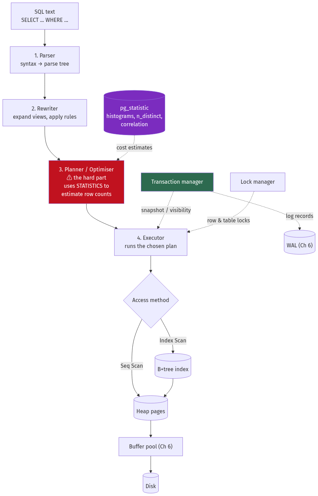
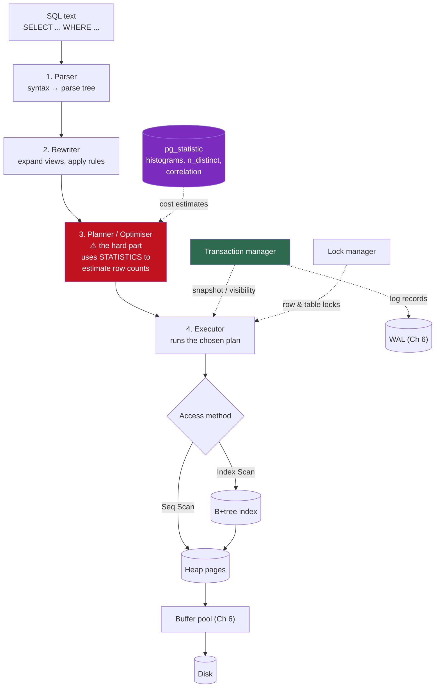
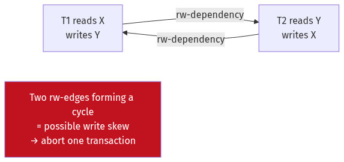
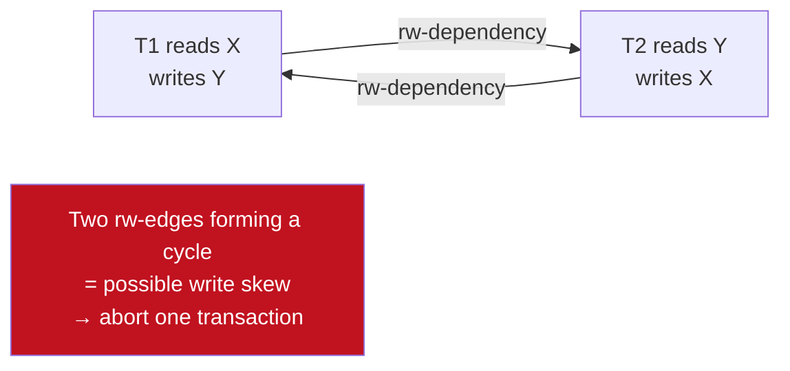
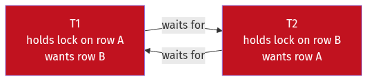
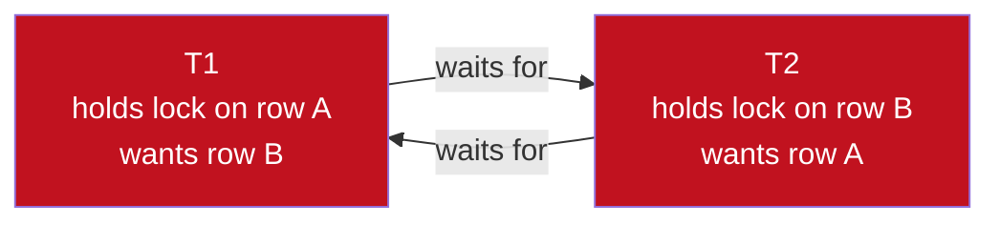

# Chapter 7 — Relational Databases and Transactions

[← Chapter 6](./06_storage_engines_internals.md) · [Contents](./README.md) · [Next: Chapter 8 →](./08_nosql_and_polyglot_persistence.md)

**Prerequisites:** [Chapter 6](./06_storage_engines_internals.md) — pages, the buffer pool, B+trees, the WAL and MVCC. This chapter builds directly on all five.

---

## What you'll learn

- Why the relational model beat everything that came before it, and what "relational" actually means
- **Normalisation** to 3NF and BCNF derived from the anomalies it prevents — and the specific cases where you should deliberately denormalise
- How the **query planner** chooses between three join algorithms, why it sometimes chooses catastrophically wrong, and how to read an `EXPLAIN ANALYZE` plan
- **Seven index types** and when each is correct, plus the leftmost-prefix rule that explains most "why isn't my index used?" questions
- **ACID** traced record by record through the write-ahead log
- Every **isolation level** with the exact interleaving of the anomaly it prevents — including **write skew**, the one that `REPEATABLE READ` does *not* stop
- **Deadlocks**: why they happen, how the database detects them, and the discipline that prevents them
- **Connection pooling** and why 20 connections outperform 500

---

## Start from zero

Before relational databases, if you wanted your customer records you wrote a program that
knew exactly how the data was laid out on disk — which file, which byte offset, which order.
Add a field and every program breaks. Want the data sorted differently and you write a new
program.

In 1970 Edgar Codd proposed something that sounds obvious now and was radical then:
**describe the data as tables of facts, and let the computer figure out how to fetch it.**

You say *what* you want:

```sql
SELECT name FROM customers WHERE city = 'Delhi';
```

You do not say *how*. Scan the whole table? Use an index? Which index? Sort first? The
database decides — and it decides differently as your data grows, without you rewriting
anything.

That separation, called **physical data independence**, is the single reason relational
databases have survived fifty years of predicted obsolescence. Everything else in this
chapter — the query planner, the indexes, the transaction machinery — exists to make that
promise deliverable.

The second radical idea is the **transaction**. Real work is rarely one change. Moving money
means subtracting from one account *and* adding to another. If the power fails between those
two steps, the money must not vanish. A transaction says: *these operations are one
indivisible thing*. Either all of it happened, or none of it did — and nobody ever sees a
half-finished state.

Those two ideas, declarative queries and transactions, are what you're buying when you choose
PostgreSQL over a key-value store.

---

## The mental model



<details>
<summary>Diagram source (Mermaid)</summary>



</details>

💡 **Almost every relational database performance problem is one of three things:** the
planner chose a bad plan because its statistics were wrong, an index is missing or unusable,
or transactions are contending on locks. This chapter is those three problems.

---

## Deep dive

### 7.1 The relational model

A **relation** (table) is a set of **tuples** (rows), each with the same named, typed
**attributes** (columns). That's it. Three rules follow and they matter:

1. **Rows have no order.** `SELECT` without `ORDER BY` may return rows in any order, and the
   order *will* change when the plan changes. ⚠️ Code that relies on incidental ordering
   breaks silently after an upgrade or a data-size change.
2. **Every value is atomic.** No arrays-in-a-cell in the pure model. (Real databases relax
   this — PostgreSQL has arrays and JSONB — but the relaxation has costs, covered in §7.2.)
3. **Rows are identified by value, not by position or pointer.** You find a row by what it
   contains, via a **key**.

**Keys:**

| Key | Meaning |
| --- | --- |
| **Superkey** | Any set of columns that uniquely identifies a row |
| **Candidate key** | A minimal superkey — remove any column and uniqueness breaks |
| **Primary key** | The candidate key you chose as *the* identifier |
| **Foreign key** | A column referencing another table's primary key |
| **Natural key** | A key with business meaning (email, ISBN, national ID) |
| **Surrogate key** | A meaningless generated identifier (`bigint` sequence, UUID) |

⚠️ **Prefer surrogate keys as the primary key.** Natural keys look elegant and then change:
people change email addresses, countries change ISO codes, and "this will never change"
survives about three years. When a natural key changes you must cascade the update through
every referencing table. Keep the natural key as a `UNIQUE` constraint — you get the
integrity guarantee without making it the thing every foreign key points at.

**Referential integrity** is the database enforcing that a foreign key points at a row that
exists. The `ON DELETE` behaviour is a real design decision:

| Clause | Behaviour | Use when |
| --- | --- | --- |
| `NO ACTION` / `RESTRICT` | Refuse the delete | **Default choice.** Fail loudly. |
| `CASCADE` | Delete the children too | Genuine ownership (order → order_items) |
| `SET NULL` | Null the reference | Optional association (employee → manager) |
| `SET DEFAULT` | Point at a default row | Rare |

⚠️ **`ON DELETE CASCADE` is more dangerous than it looks.** Deleting one row can cascade
through six tables and lock millions of rows in a single transaction — a "quick cleanup" that
takes the database down. And each cascade requires an index on the referencing column;
without it, PostgreSQL does a **sequential scan of the child table per deleted parent row**.
This is one of the most common causes of an inexplicably slow `DELETE`.

### 7.2 Normalisation, derived from the problems it solves

Normalisation is not an aesthetic. Each normal form eliminates a specific class of bug.

**Start with a bad table:**

```
orders
order_id | customer_name | customer_city | product      | price | qty
---------+---------------+---------------+--------------+-------+----
1        | Alice         | Delhi         | Keyboard     | 40    | 2
2        | Alice         | Delhi         | Mouse        | 20    | 1
3        | Bob           | Mumbai        | Keyboard     | 40    | 1
```

Three **anomalies** live here:

| Anomaly | Example |
| --- | --- |
| **Update** | Alice moves to Pune → you must update every row of hers. Miss one and the data contradicts itself. |
| **Insert** | You cannot record a new customer until they place an order. |
| **Delete** | Deleting order 3 erases the only record that Bob exists. |

**1NF — atomic values, no repeating groups.**
```
❌  order_id | products
    1        | "Keyboard, Mouse, Cable"
```
You cannot index it, join on it, or aggregate it without string parsing. Split into rows.

**2NF — no partial dependency on part of a composite key.**
If the key is `(order_id, product_id)` then `product_name` depends only on `product_id`, not
on the whole key. Move it to a `products` table.

**3NF — no transitive dependency.**
`customer_city` depends on `customer_name`, which depends on `order_id`. City is two steps
away from the key. Move customers to their own table.

**BCNF** — a stricter 3NF: *every* determinant must be a candidate key. It matters only in
tables with overlapping candidate keys, which is rare in practice.

**The normalised result:**

```sql
CREATE TABLE customers (
    customer_id  BIGSERIAL PRIMARY KEY,
    name         TEXT NOT NULL,
    city         TEXT NOT NULL,
    email        TEXT NOT NULL UNIQUE      -- natural key as a constraint, not the PK
);

CREATE TABLE products (
    product_id   BIGSERIAL PRIMARY KEY,
    name         TEXT NOT NULL,
    price_cents  INTEGER NOT NULL CHECK (price_cents >= 0)  -- ⚠️ never FLOAT for money
);

CREATE TABLE orders (
    order_id     BIGSERIAL PRIMARY KEY,
    customer_id  BIGINT NOT NULL REFERENCES customers(customer_id),
    created_at   TIMESTAMPTZ NOT NULL DEFAULT now()
);

CREATE TABLE order_items (
    order_id     BIGINT NOT NULL REFERENCES orders(order_id) ON DELETE CASCADE,
    product_id   BIGINT NOT NULL REFERENCES products(product_id),
    qty          INTEGER NOT NULL CHECK (qty > 0),
    -- Price COPIED, not referenced: an order must not change when the catalogue does.
    unit_price_cents INTEGER NOT NULL,
    PRIMARY KEY (order_id, product_id)
);

CREATE INDEX ON orders (customer_id);        -- ⚠️ FK columns need indexes
CREATE INDEX ON order_items (product_id);    -- for the cascade AND for lookups
```

💡 **Note `unit_price_cents` is duplicated deliberately.** That is not a normalisation
failure — the price *at the time of the order* is a different fact from the price *now*.
Normalising it away would make historical invoices change when you run a sale. **Temporal
facts must be copied, not referenced.**

⚠️ **Never store money in `FLOAT`/`DOUBLE`.** `0.1 + 0.2 != 0.3` in binary floating point.
Use integer minor units (cents) or `NUMERIC`/`DECIMAL`. Integer cents is faster and exact;
`NUMERIC` handles arbitrary precision at ~10× the CPU cost.

#### When to denormalise — deliberately

Normalisation optimises for **correctness on write**. Denormalisation optimises for **speed
on read**. You denormalise when reads dominate and the join cost is measurable.

| Technique | Example | Cost you accept |
| --- | --- | --- |
| **Duplicate a column** | Store `customer_name` on `orders` | Must update in two places |
| **Pre-computed aggregate** | `order_count` on `customers` | Must maintain on every insert |
| **Materialised view** | Nightly rollup table | Staleness between refreshes |
| **Summary/rollup table** | `daily_sales` | Extra pipeline |
| **JSONB column** | Sparse, schema-flexible attributes | No FK integrity, weaker constraints |

📐 **Justify it with a number, not a feeling:**
```
Query joins 5 tables, runs 50,000×/second, takes 8 ms
Denormalised single-table read: 0.5 ms

CPU saved: 50,000 × 7.5 ms = 375 CPU-seconds/second ≈ 375 cores' worth
Cost: writes must maintain the duplicate — 500 writes/s × extra 1 ms = 0.5 cores

Ratio 750:1. Clearly worth it.
```
If the ratio were 2:1, it would not be.

⚠️ **Every denormalisation is a consistency bug waiting to happen.** The duplicate *will*
drift. Mitigations, in order of reliability: a database **trigger**, a **materialised view**
with scheduled refresh, or a **CDC-driven** update ([Chapter 12](./12_messaging_and_event_streaming.md)).
Application code that "remembers to update both places" is the least reliable option and the
most commonly chosen.

### 7.3 Joins, and the three algorithms

A join matches rows from two tables. The **logical** join types:

| Type | Returns |
| --- | --- |
| `INNER JOIN` | Only matching pairs |
| `LEFT JOIN` | All left rows; NULLs where no match |
| `RIGHT JOIN` | All right rows |
| `FULL OUTER JOIN` | All rows from both |
| `CROSS JOIN` | Cartesian product — every combination ⚠️ |
| `LATERAL JOIN` | Right side may reference the left row — a correlated subquery in join form |

But the **physical** algorithm is what determines performance, and there are only three:

#### Nested loop join

```
for each row R in outer:
    for each matching row S in inner:      ← uses an index if available
        emit (R, S)
```
📐 Cost: `outer_rows × inner_lookup_cost`.
- With an index on the inner side: `N × log(M)` — **excellent for small outer sets**
- Without one: `N × M` — catastrophic

**Best when:** the outer relation is small and the inner side is indexed. This is the plan
you want for `WHERE user_id = 42` joined to that user's 20 orders.

#### Hash join

```
1. Build phase: read the SMALLER table, build a hash table on the join key in memory
2. Probe phase: scan the larger table, probe the hash table for each row
```
📐 Cost: `N + M` — linear. Requires memory for the hash table.

⚠️ **If the hash table doesn't fit in `work_mem`, it spills to disk** in batches, and
performance collapses. In `EXPLAIN ANALYZE` this shows as `Batches: 17  Memory Usage: 4096kB`
— **any `Batches` value above 1 means it spilled.** Raising `work_mem` for that session
frequently turns a 40-second query into a 2-second one.

**Best when:** joining two large tables on equality with no useful index.

#### Merge join

```
1. Sort both inputs by the join key (or read them already-sorted from an index)
2. Walk both in lockstep, like merging two sorted lists
```
📐 Cost: `N log N + M log M` for sorting, then `N + M` to merge. **Free if both sides are
already sorted** — which is exactly what an index scan gives you.

**Best when:** both inputs are already ordered by the join key, or the result must be sorted
anyway.

| | Nested loop | Hash join | Merge join |
| --- | --- | --- | --- |
| Complexity | O(N × log M) with index | O(N + M) | O(N log N + M log M) |
| Memory | Minimal | ⚠️ Needs the build side in RAM | Needs sort space |
| Non-equality joins (`<`, `>`) | ✅ | ❌ equality only | ✅ (merge-band) |
| Output ordering | Preserves outer order | ❌ Unordered | ✅ Sorted |
| Best case | Small outer + indexed inner | Two big tables, equality | Both pre-sorted |

💡 **The planner chooses among these, and its choice depends entirely on its estimate of how
many rows each side produces.** Get the estimate wrong and it picks a nested loop over a
million rows. That's §7.4.

### 7.4 The query planner — and why it goes wrong

The planner enumerates possible plans and picks the cheapest by an estimated cost. Cost is a
made-up unit combining page reads and CPU:

```
seq_page_cost      = 1.0     # read one page sequentially
random_page_cost   = 4.0     # ⚠️ read one page randomly — set to 1.1 on SSD!
cpu_tuple_cost     = 0.01
cpu_index_tuple_cost = 0.005
cpu_operator_cost  = 0.0025
```

⚠️ **`random_page_cost = 4.0` is a 1990s spinning-disk default.** On SSD, random reads are
nearly as cheap as sequential. Leaving it at 4.0 makes the planner systematically
under-value index scans and choose sequential scans on large tables. **Setting it to 1.1 on
SSD is one of the highest-value one-line changes you can make to a PostgreSQL instance.**

#### Statistics — the thing that's actually wrong

The planner estimates row counts from statistics gathered by `ANALYZE`:

| Statistic | What it holds |
| --- | --- |
| `n_distinct` | Number of distinct values in the column |
| **Most Common Values (MCV)** | The top N values and their frequencies |
| **Histogram** | Bucket boundaries describing the rest of the distribution |
| `correlation` | How well physical row order matches column order (drives index-scan cost) |
| `null_frac` | Fraction of NULLs |

📐 **How an estimate is made:**
```
SELECT * FROM orders WHERE status = 'pending';

MCV says 'pending' appears in 3% of rows.
Table has 10,000,000 rows → estimate 300,000 rows.
300,000 of 10M is 3% — too many for an index scan to beat a sequential scan.
→ Planner chooses Seq Scan.
```
That is correct *if* the statistic is current.

⚠️ **The four ways estimates go wrong:**

**1. Stale statistics.** You bulk-load 10 million rows and query immediately. The planner
still thinks the table has 1,000 rows and chooses a nested loop. **Run `ANALYZE` after any
bulk load.** Autovacuum will eventually do it, but "eventually" can be an hour.

**2. Correlated columns.** ⚠️ The planner assumes independence by default:
```
WHERE city = 'Mumbai' AND country = 'India'
Planner: P(Mumbai) × P(India) = 0.02 × 0.20 = 0.004 → 0.4% of rows
Reality: every Mumbai row IS an India row → 2% of rows
Underestimate by 5×  → wrong join algorithm → 100× slower query
```
**Fix (PostgreSQL 10+):**
```sql
CREATE STATISTICS city_country (dependencies, ndistinct)
    ON city, country FROM addresses;
ANALYZE addresses;
```
This is *the* fix for a large class of "why is this query suddenly slow" problems and almost
nobody knows it exists.

**3. Opaque expressions.** `WHERE lower(email) = 'x'` has no statistics for `lower(email)` —
the planner falls back to a fixed guess (0.5% selectivity). Fix with an **expression index**,
which PostgreSQL then gathers statistics on:
```sql
CREATE INDEX ON users (lower(email));
```

**4. Parameter sniffing / generic plans.** A prepared statement executed five times gets a
**generic plan** cached, based on average selectivity. If `status = 'pending'` matches 3% but
`status = 'archived'` matches 90%, one plan is wrong for one of them. PostgreSQL's
`plan_cache_mode = force_custom_plan` disables the caching; SQL Server calls the same problem
"parameter sniffing".

#### Reading `EXPLAIN ANALYZE`

`EXPLAIN` shows the plan. **`EXPLAIN ANALYZE` actually runs it** and shows real numbers —
always use the latter (⚠️ but remember it *executes* the query, so wrap writes in a
transaction you roll back).

```
EXPLAIN (ANALYZE, BUFFERS) SELECT ...;

Nested Loop  (cost=0.43..2847.21 rows=1 width=64)
             (actual time=0.02..3421.55 rows=284718 loops=1)
  Buffers: shared hit=142 read=891204
  ->  Seq Scan on orders  (cost=0.00..1834.00 rows=1 width=32)
                          (actual time=0.01..12.44 rows=284718 loops=1)
        Filter: (status = 'pending')
        Rows Removed by Filter: 15281
  ->  Index Scan using customers_pkey on customers
                          (cost=0.43..1.01 rows=1 width=32)
                          (actual time=0.01..0.01 rows=1 loops=284718)
```

**Read it inside-out and bottom-up.** The four things to look at, in order:

| Signal | What it means |
| --- | --- |
| **`rows=1` estimated vs `rows=284718` actual** | ⚠️ **The smoking gun.** A 284,718× misestimate. The planner chose a nested loop because it expected one row. |
| **`loops=284718`** | The inner side ran 284,718 times. Multiply `actual time` by `loops` for the true cost. |
| **`Buffers: read=891204`** | 891k pages read from disk (~7 GB). `hit` would mean cache. |
| **`Rows Removed by Filter`** | Work done and thrown away — suggests a missing index or a better predicate |

**The diagnosis here:** the row estimate is catastrophically wrong, so fix the *statistics*,
not the query. Likely `ANALYZE` hasn't run, or there's a correlated-column problem.

**Plan node types worth recognising:**

| Node | Meaning | Concern |
| --- | --- | --- |
| `Seq Scan` | Read every page | Fine on small tables; ⚠️ on large ones with a selective filter |
| `Index Scan` | Walk the index, fetch heap rows | Good for selective predicates |
| `Index Only Scan` | ✅ Answered entirely from the index | Best case — no heap access |
| `Bitmap Heap Scan` | Collect matching pages, then read them in physical order | Good middle ground for medium selectivity |
| `Nested Loop` | See §7.3 | ⚠️ Check `loops` |
| `Hash Join` | See §7.3 | ⚠️ Check `Batches > 1` (spilled to disk) |
| `Sort` | Explicit sort | ⚠️ Check `Sort Method: external merge` (spilled) |
| `Materialize` | Cache a subplan's output | Usually fine |

### 7.5 Indexes: seven types and when each is right

#### B-tree — the default, and 95% of what you need

Supports `=`, `<`, `>`, `BETWEEN`, `IN`, `IS NULL`, `ORDER BY`, and `LIKE 'prefix%'`
(⚠️ **not** `LIKE '%suffix'` — a leading wildcard cannot use a B-tree).

#### Hash

O(1) equality lookups, slightly smaller than a B-tree. ⚠️ No ranges, no ordering, no
sorting. Almost never worth it — a B-tree does equality nearly as fast *and* everything else.

#### GIN (Generalised Inverted Index)

For values containing **multiple searchable elements**: arrays, `JSONB`, full-text vectors.
It's an inverted index (see [Chapter 14](./14_search_systems.md)) mapping each element to the
rows containing it.

```sql
CREATE INDEX ON documents USING GIN (tags);           -- array containment: tags @> '{sql}'
CREATE INDEX ON documents USING GIN (metadata);       -- JSONB: metadata @> '{"type":"pdf"}'
CREATE INDEX ON documents USING GIN (to_tsvector('english', body));  -- full text
```
⚠️ GIN indexes are **slow to update** — one row insert may touch many index entries. The
`fastupdate` option buffers them in a pending list, trading read latency for write speed.

#### GiST (Generalised Search Tree)

A framework for indexing data with no natural linear order: geometric shapes, ranges,
nearest-neighbour. Powers **PostGIS**.

```sql
CREATE INDEX ON places USING GIST (location);     -- "within 5 km of this point"
CREATE INDEX ON bookings USING GIST (period);     -- overlapping time ranges
```

💡 **The exclusion constraint** is a GiST superpower that solves double-booking declaratively:
```sql
ALTER TABLE bookings ADD CONSTRAINT no_overlap
    EXCLUDE USING GIST (room_id WITH =, during WITH &&);
```
The database now *cannot* store two overlapping bookings for the same room. No application
logic, no race condition. This is the kind of thing you lose when you leave relational
databases.

#### BRIN (Block Range Index)

Stores only the min/max value per block range. **Tiny** — often thousands of times smaller
than a B-tree — but only works when physical row order correlates with the column value.

```sql
CREATE INDEX ON events USING BRIN (created_at);
```
📐 For a 1 TB append-only time-series table:
```
B-tree on created_at: ~30 GB
BRIN on created_at:   ~5 MB       (6,000× smaller)
```
⚠️ Useless if rows are inserted in random order with respect to the column. Check
`correlation` in `pg_stats` — you want it near 1.0 or −1.0.

#### Partial index

Index only the rows you actually query.
```sql
CREATE INDEX ON orders (created_at) WHERE status = 'pending';
```
📐 If 0.5% of orders are pending, the index is **200× smaller**, fits in cache, and is faster
to update. Excellent for queue-like tables and soft-delete patterns
(`WHERE deleted_at IS NULL`).

#### Expression index

```sql
CREATE INDEX ON users (lower(email));
```
Required for `WHERE lower(email) = $1` to use an index at all — and, as §7.4 noted, it also
gives the planner statistics for the expression.

#### 🎯 Composite indexes and the leftmost-prefix rule

This is the single most-asked index question and the most misunderstood.

```sql
CREATE INDEX idx ON orders (customer_id, status, created_at);
```

The index is sorted by `customer_id`, then within that by `status`, then by `created_at`.
Think of a phone book sorted by (surname, first name). You can find "Smith", or "Smith,
John" — but you **cannot** find everyone named "John" without reading the whole book.

| Query predicate | Uses index? |
| --- | --- |
| `customer_id = 5` | ✅ Fully |
| `customer_id = 5 AND status = 'x'` | ✅ Fully |
| `customer_id = 5 AND status = 'x' AND created_at > d` | ✅ Fully |
| `customer_id = 5 AND created_at > d` | ⚠️ Partially — uses `customer_id`, then filters |
| `status = 'x'` | ❌ Leading column missing |
| `status = 'x' AND created_at > d` | ❌ |
| `customer_id > 5 AND status = 'x'` | ⚠️ Range on the first column stops the second being used for seeking |

📐 **The ordering rule:** put **equality predicates first**, then **the range predicate**,
then **columns needed only for sorting**. A range predicate "consumes" the index — everything
after it can only be filtered, not sought.

**Covering indexes.** If the index contains every column the query needs, the heap is never
touched — an `Index Only Scan`:
```sql
CREATE INDEX ON orders (customer_id) INCLUDE (status, total_cents);
```
📐 Saves one random heap read per row. On a query returning 10,000 rows that's 10,000 × ~100 µs
= **1 second saved**.

⚠️ In PostgreSQL, an index-only scan still needs the **visibility map** to confirm the page is
all-visible; if the table hasn't been vacuumed recently it falls back to heap fetches anyway.
`EXPLAIN` shows this as `Heap Fetches: 9812`.

#### ⚠️ When indexes hurt

Indexes are not free, and this is under-appreciated:

| Cost | Detail |
| --- | --- |
| **Write amplification** | Every `INSERT` updates *every* index. 8 indexes = 9 writes per insert. |
| **Space** | Indexes commonly exceed the table's own size |
| **Buffer pool pressure** | Index pages compete with data pages for RAM |
| **Planner time** | More candidate plans to evaluate |
| **HOT updates blocked** | ⚠️ PostgreSQL can skip index maintenance on an update *only if* no indexed column changed. An index on a frequently-updated column disables that optimisation for the whole row. |

**Find unused indexes:**
```sql
SELECT relname, indexrelname, idx_scan, pg_size_pretty(pg_relation_size(indexrelid))
FROM pg_stat_user_indexes WHERE idx_scan = 0 ORDER BY pg_relation_size(indexrelid) DESC;
```
⚠️ Check this on a **primary** that has been up long enough to be representative, and don't
drop indexes backing constraints.

**Always create indexes concurrently in production:**
```sql
CREATE INDEX CONCURRENTLY ON orders (customer_id);
```
Without `CONCURRENTLY`, `CREATE INDEX` takes an `ACCESS EXCLUSIVE`-adjacent lock that blocks
writes for the entire build — minutes to hours on a large table.

### 7.6 ACID, traced through the log

**Atomicity** — all or nothing.
**Consistency** — constraints hold before and after.
**Isolation** — concurrent transactions don't corrupt each other.
**Durability** — committed data survives a crash.

⚠️ **The "C" is the odd one out.** Atomicity, isolation and durability are properties the
database provides. Consistency is a property *you* define with constraints — the database
only enforces what you declare. Many authors argue C was included to make the acronym work.

**Trace a transfer through the WAL** ([Chapter 6](./06_storage_engines_internals.md) §6.7):

```sql
BEGIN;
UPDATE accounts SET balance = balance - 100 WHERE id = 1;   -- Alice: 500 → 400
UPDATE accounts SET balance = balance + 100 WHERE id = 2;   -- Bob:   200 → 300
COMMIT;
```

```
LSN 5001 | txn 77 | BEGIN
LSN 5002 | txn 77 | UPDATE page 12, tuple 4: balance 500 → 400   [old=500 new=400]
LSN 5003 | txn 77 | UPDATE page 31, tuple 9: balance 200 → 300   [old=200 new=300]
LSN 5004 | txn 77 | COMMIT                    ← fsync() happens HERE
```

**Where atomicity and durability actually come from:**

| Crash point | What recovery does | Guarantee |
| --- | --- | --- |
| After 5002, before 5004 | txn 77 never committed → **UNDO** using `old=500` | Atomicity ✅ |
| After 5004, before pages flushed | txn 77 committed → **REDO** using `new=` values | Durability ✅ |
| During recovery itself | ARIES repeats history, then undoes; idempotent | Both ✅ |

💡 **Notice the money never exists in a half-state to anyone.** Not because the two updates
happen simultaneously — they don't — but because *no other transaction is allowed to see the
intermediate state*. That's isolation, and it's the hardest of the four.

### 7.7 Isolation levels and the anomalies they prevent

The SQL standard defines four levels by which anomalies they permit.

| Level | Dirty read | Non-repeatable read | Phantom | Lost update | Write skew |
| --- | --- | --- | --- | --- | --- |
| `READ UNCOMMITTED` | ⚠️ possible | possible | possible | possible | possible |
| `READ COMMITTED` | ✅ prevented | possible | possible | possible | possible |
| `REPEATABLE READ` | ✅ | ✅ | possible* | ✅* | ⚠️ **possible** |
| `SERIALIZABLE` | ✅ | ✅ | ✅ | ✅ | ✅ |

\* Standard vs implementation differ — see the table at the end of this section.

**Defaults:** PostgreSQL `READ COMMITTED` · MySQL InnoDB `REPEATABLE READ` ·
Oracle `READ COMMITTED` · SQL Server `READ COMMITTED`.

#### Dirty read

Reading data another transaction wrote but hasn't committed.

```
T1: BEGIN; UPDATE accounts SET balance = 0 WHERE id = 1;
T2:                                          SELECT balance FROM accounts WHERE id=1;  → 0
T1: ROLLBACK;                                ← the 0 never existed
T2: (acted on a value that was never real)
```
⚠️ PostgreSQL **cannot** produce dirty reads even if you ask for `READ UNCOMMITTED` — its
MVCC makes them impossible, so it silently upgrades you to `READ COMMITTED`.

#### Non-repeatable read

The same row read twice within one transaction gives different values.

```
T1: BEGIN; SELECT balance FROM accounts WHERE id=1;      → 500
T2:        UPDATE accounts SET balance=400 WHERE id=1; COMMIT;
T1:        SELECT balance FROM accounts WHERE id=1;      → 400   ⚠️ changed mid-transaction
```
Fine for most reporting; fatal if you read a value, compute on it, and write it back.

#### Phantom read

The same *range* query returns different **rows**.

```
T1: BEGIN; SELECT count(*) FROM orders WHERE total > 100;   → 12
T2:        INSERT INTO orders (total) VALUES (500); COMMIT;
T1:        SELECT count(*) FROM orders WHERE total > 100;   → 13   ⚠️ a new row appeared
```
Preventing this requires locking rows *that don't exist yet* — hence **predicate locks** or
**next-key locks**.

#### Lost update

```
T1: BEGIN; SELECT stock FROM products WHERE id=1;   → 10
T2: BEGIN; SELECT stock FROM products WHERE id=1;   → 10
T1:        UPDATE products SET stock = 9 WHERE id=1;  COMMIT;
T2:        UPDATE products SET stock = 9 WHERE id=1;  COMMIT;
                                          ⚠️ Two items sold, stock decreased by one.
```

**Four fixes, in increasing order of strength:**

```sql
-- 1. Atomic in-database update. Simplest and best when applicable.
UPDATE products SET stock = stock - 1 WHERE id = 1 AND stock > 0;

-- 2. Pessimistic lock: serialise the readers.
SELECT stock FROM products WHERE id = 1 FOR UPDATE;

-- 3. Optimistic concurrency control: fail if someone else changed it.
UPDATE products SET stock = 9, version = 6 WHERE id = 1 AND version = 5;
-- 0 rows updated → someone else won → retry

-- 4. SERIALIZABLE isolation, and retry on serialization failure.
```

💡 **Prefer (1).** The database does the read-modify-write atomically; there is no window.
Use (3) when the modification happens in application code or across a user's think-time —
optimistic locking is also what you want for "someone else edited this record" UX.

#### ⚠️ Write skew — the one `REPEATABLE READ` does not stop

This is the anomaly most engineers have never heard of, and it is the reason `SERIALIZABLE`
exists.

**The rule: at least one doctor must always be on call.**

```
Initially: Alice on-call = true, Bob on-call = true

T1 (Alice going off): BEGIN;
    SELECT count(*) FROM doctors WHERE on_call = true;   → 2, fine to leave
T2 (Bob going off):   BEGIN;
    SELECT count(*) FROM doctors WHERE on_call = true;   → 2, fine to leave
T1: UPDATE doctors SET on_call = false WHERE name='Alice';  COMMIT;
T2: UPDATE doctors SET on_call = false WHERE name='Bob';    COMMIT;

Result: ZERO doctors on call. ⚠️ The invariant is broken.
```

**Why `REPEATABLE READ` doesn't help:** the two transactions wrote *different rows*. There is
no write-write conflict to detect. Each read a set of rows, made a decision, and wrote
somewhere else. Snapshot isolation cannot see this.

**Real instances of write skew:**
- Double-booking a meeting room or a cinema seat
- Overdrawing a joint account via two simultaneous withdrawals under a shared-balance check
- Two people claiming the same username after both checked availability
- Approving spend past a shared budget cap

**Three fixes:**
1. **`SERIALIZABLE`** — PostgreSQL's Serializable Snapshot Isolation detects it and aborts one
   transaction with `could not serialize access`. ⚠️ **Your application must retry.**
2. **Materialise the conflict** — introduce a row that both transactions must lock, e.g. a
   `shift` row locked `FOR UPDATE`, forcing a genuine write-write conflict.
3. **Declare it as a constraint** — the GiST exclusion constraint from §7.5 makes
   double-booking structurally impossible.

#### What the levels actually do in each database

⚠️ The names are standardised; the behaviour is not.

| | PostgreSQL | MySQL InnoDB |
| --- | --- | --- |
| `READ UNCOMMITTED` | Behaves as `READ COMMITTED` | True dirty reads |
| `READ COMMITTED` | New snapshot **per statement** | New snapshot per statement |
| `REPEATABLE READ` | Snapshot at transaction start; **prevents phantoms** (stronger than the standard) | Snapshot isolation + **next-key locks** prevent phantoms for locking reads |
| `SERIALIZABLE` | **SSI** — optimistic, detects conflicts, aborts | **Actual 2PL** — pessimistic locking, blocks |

💡 **The practical consequence:** PostgreSQL `SERIALIZABLE` never blocks but *aborts* under
contention, so **you must implement retry logic**. MySQL `SERIALIZABLE` blocks instead, so
you get lock waits and deadlocks rather than serialization errors. Same guarantee, opposite
failure mode, completely different application code.

### 7.8 2PL, MVCC and SSI

**Two-Phase Locking (2PL)** — the classical mechanism. A *growing* phase acquires locks, a
*shrinking* phase releases them; in strict 2PL all locks are held until commit.

| Lock | Compatible with |
| --- | --- |
| Shared (S) — read | Other S locks |
| Exclusive (X) — write | Nothing |

⚠️ Readers block writers and writers block readers. Under mixed read/write load throughput
collapses.

**MVCC** ([Chapter 6](./06_storage_engines_internals.md) §6.8) — readers see a snapshot;
writers create new versions. **Readers never block writers, writers never block readers.**
This is why PostgreSQL, Oracle, InnoDB and essentially every modern database use it. The cost
is version storage and cleanup (vacuum/purge).

**SSI (Serializable Snapshot Isolation)** — snapshot isolation plus conflict *detection*.
PostgreSQL tracks read/write dependencies between concurrent transactions and looks for a
specific structure — a **dangerous pattern** of two consecutive rw-dependencies — that could
produce a non-serializable outcome. If it finds one, it aborts a transaction.



<details>
<summary>Diagram source (Mermaid)</summary>



</details>

📐 **The trade-off:** SSI is optimistic, so it costs almost nothing when contention is low and
produces **false-positive aborts** when contention is high (it is conservative — it may abort
transactions that would actually have been fine).

```
Low contention:  SSI ≈ same throughput as READ COMMITTED
High contention: abort rate can exceed 30% → each retry does the work again
                 → effective throughput can be WORSE than pessimistic locking
```

⚠️ **Every application using `SERIALIZABLE` must retry on SQLSTATE `40001`.** Without retry
logic you have simply converted concurrency bugs into user-visible errors.

```go
// Retry loop for SERIALIZABLE — mandatory, not optional.
for attempt := 0; attempt < 5; attempt++ {
    err := runTransaction(ctx, db)
    var pgErr *pgconn.PgError
    if errors.As(err, &pgErr) && pgErr.Code == "40001" { // serialization_failure
        time.Sleep(time.Duration(rand.Int63n(int64(50<<attempt))) * time.Millisecond)
        continue
    }
    return err
}
```

### 7.9 Locks and deadlocks

**Lock granularity** trades concurrency against bookkeeping overhead:

```
Row lock    → maximum concurrency, most memory for lock state
Page lock   → middle ground
Table lock  → minimal overhead, blocks everyone
```

⚠️ **Lock escalation** (SQL Server, DB2, not PostgreSQL): if a transaction acquires too many
row locks, the engine escalates to a table lock — and a query touching 5,000 rows suddenly
blocks the whole table. PostgreSQL never escalates, which is a real advantage, at the cost of
per-row lock memory.

**PostgreSQL table-level lock modes**, ordered by strictness — the practical thing to know is
which DDL takes which:

| Lock | Taken by | Blocks |
| --- | --- | --- |
| `ACCESS SHARE` | `SELECT` | Only `ACCESS EXCLUSIVE` |
| `ROW SHARE` | `SELECT FOR UPDATE` | Exclusive modes |
| `ROW EXCLUSIVE` | `INSERT`/`UPDATE`/`DELETE` | Share modes |
| `SHARE` | `CREATE INDEX` (non-concurrent) | ⚠️ All writes |
| `ACCESS EXCLUSIVE` | `ALTER TABLE`, `DROP`, `TRUNCATE`, `VACUUM FULL` | ⚠️ **Everything, including `SELECT`** |

#### ⚠️ The lock queue — the outage nobody expects

Postgres lock requests are **queued in order**. A pending `ACCESS EXCLUSIVE` request blocks
every request behind it, even harmless ones.

```
T1: long-running SELECT (holds ACCESS SHARE for 10 minutes)
T2: ALTER TABLE ... (waits for ACCESS EXCLUSIVE)
T3: SELECT ...  ← ⚠️ BLOCKED behind T2, even though it only conflicts with T2, not T1
T4..T500: SELECT ... ← all blocked

Result: total outage on that table, caused by one ALTER behind one slow query.
```

**The fix, and it is essential for any production migration:**
```sql
SET lock_timeout = '3s';
ALTER TABLE orders ADD COLUMN notes TEXT;
-- If the lock isn't acquired in 3 seconds, fail — don't build a queue behind you.
-- Then retry, ideally with a script that retries several times.
```

#### Deadlock

Two transactions each hold what the other needs.



<details>
<summary>Diagram source (Mermaid)</summary>



</details>

```
T1: BEGIN; UPDATE accounts SET .. WHERE id=1;   -- locks row 1
T2: BEGIN; UPDATE accounts SET .. WHERE id=2;   -- locks row 2
T1:        UPDATE accounts SET .. WHERE id=2;   -- waits for T2
T2:        UPDATE accounts SET .. WHERE id=1;   -- waits for T1  → DEADLOCK
```

The database detects the cycle in its wait-for graph (PostgreSQL checks after
`deadlock_timeout`, default 1 s) and **aborts one transaction** — the victim gets
SQLSTATE `40P01`.

**Prevention, in order of effectiveness:**

| Technique | How |
| --- | --- |
| **Consistent lock ordering** | ✅ **The real fix.** Always lock rows in a deterministic order — e.g. ascending primary key. Two transactions can then never hold locks in opposite order. |
| Shorter transactions | Less time holding locks, smaller window |
| Lower isolation where safe | Fewer locks taken |
| `SELECT ... FOR UPDATE` up front | Acquire everything at the start, in order |
| `NOWAIT` / `SKIP LOCKED` | Fail fast, or skip contended rows — the basis of a queue table |

```sql
-- ✅ Deterministic ordering eliminates the deadlock entirely.
SELECT * FROM accounts WHERE id IN (:a, :b) ORDER BY id FOR UPDATE;
```

💡 **`SKIP LOCKED` is how you build a job queue in SQL** without workers colliding:
```sql
UPDATE jobs SET status = 'running'
WHERE id IN (
    SELECT id FROM jobs WHERE status = 'pending'
    ORDER BY created_at LIMIT 10
    FOR UPDATE SKIP LOCKED          -- other workers skip these rows instead of blocking
)
RETURNING *;
```

### 7.10 Connection pooling

Each PostgreSQL connection is an **operating-system process** consuming 5–10 MB, plus a
`work_mem` allocation *per sort or hash node* in its query.

📐 **Why 500 connections is worse than 20:**
```
500 connections × 8 MB               = 4 GB of RAM before any query runs
work_mem 64 MB × 3 nodes × 500       = up to 96 GB if they all run complex queries ⚠️
Context switching among 500 processes on 16 cores → thrashing
Lock manager contention grows with connection count
```

Little's Law ([Chapter 2](./02_scalability_and_estimation.md) §2.4) gives the right number:
```
2,000 queries/second × 5 ms average database time = 10 concurrent connections
Configure ~20 for headroom. Not 500.
```

💡 **Throughput actually *decreases* past a point.** Benchmarks consistently show PostgreSQL
throughput peaking somewhere around `(2 × cores) + effective_spindle_count` and declining
beyond it. More connections means more contention, not more work done.

**PgBouncer pooling modes** — the choice matters enormously:

| Mode | A backend connection is held for | Concurrency | ⚠️ Breaks |
| --- | --- | --- | --- |
| `session` | The whole client session | Low | Nothing |
| **`transaction`** | One transaction | **High — the usual choice** | Session state: `SET`, advisory locks, `LISTEN/NOTIFY`, `WITH HOLD` cursors, and **server-side prepared statements** (pre-PgBouncer 1.21) |
| `statement` | One statement | Highest | Multi-statement transactions entirely |

📐 **What transaction pooling buys:**
```
1,000 application connections → PgBouncer → 20 actual PostgreSQL connections
Because each app connection only holds a backend during its transaction (~5 ms),
not during its think time.
```

⚠️ **The classic transaction-pooling bug:** an application issues `SET search_path` once on
connect and assumes it persists. In transaction mode the next transaction may land on a
different backend without that setting. Symptom: intermittent "relation does not exist"
errors that cannot be reproduced.

### 7.11 Diagnosing a slow database — a runbook

Work through these in order. Most incidents resolve in the first three steps.

**1. What is running right now?**
```sql
SELECT pid, now() - query_start AS duration, state, wait_event_type, wait_event,
       left(query, 100) AS query
FROM pg_stat_activity
WHERE state <> 'idle' AND now() - query_start > interval '5 seconds'
ORDER BY duration DESC;
```
Look at `wait_event_type`: `Lock` means blocking; `IO` means disk; `LWLock` means internal
contention; `CPU` (null wait event) means it's genuinely computing.

**2. ⚠️ Is anything idle in a transaction?**
```sql
SELECT pid, now() - state_change AS idle_duration, left(query, 80)
FROM pg_stat_activity WHERE state = 'idle in transaction'
ORDER BY idle_duration DESC;
```
This blocks vacuum globally and holds locks. It is the highest-frequency root cause in
PostgreSQL incidents. **Set `idle_in_transaction_session_timeout = '60s'` as a default.**

**3. Who is blocking whom?**
```sql
SELECT blocked.pid AS blocked_pid, blocked.query AS blocked_query,
       blocking.pid AS blocking_pid, blocking.query AS blocking_query
FROM pg_stat_activity blocked
JOIN pg_stat_activity blocking
  ON blocking.pid = ANY(pg_blocking_pids(blocked.pid))
WHERE cardinality(pg_blocking_pids(blocked.pid)) > 0;
```

**4. What consumes the most total time?** (needs `pg_stat_statements`)
```sql
SELECT calls, round(mean_exec_time::numeric, 2) AS mean_ms,
       round(total_exec_time::numeric/1000, 1) AS total_s,
       round(100.0 * shared_blks_hit /
             nullif(shared_blks_hit + shared_blks_read, 0), 1) AS hit_pct,
       left(query, 80)
FROM pg_stat_statements ORDER BY total_exec_time DESC LIMIT 20;
```
💡 Sort by **`total_exec_time`, not `mean_exec_time`**. A 2 ms query run 10 million times
costs far more than a 5-second query run twice — and it's the one you can actually fix.

**5. Is the cache working?**
```sql
SELECT sum(heap_blks_hit) * 100.0 / nullif(sum(heap_blks_hit + heap_blks_read), 0)
FROM pg_statio_user_tables;   -- want > 99%
```

**6. Is there bloat, and is vacuum keeping up?**
```sql
SELECT relname, n_live_tup, n_dead_tup,
       round(n_dead_tup * 100.0 / nullif(n_live_tup + n_dead_tup, 0), 1) AS dead_pct,
       last_autovacuum
FROM pg_stat_user_tables WHERE n_dead_tup > 10000
ORDER BY n_dead_tup DESC;
```
⚠️ Dead tuples above ~20%, or `last_autovacuum` hours old on a busy table, means autovacuum
is losing. Tune `autovacuum_vacuum_cost_limit` upward and
`autovacuum_vacuum_scale_factor` down (the default 0.2 means a 100M-row table waits for
20M dead rows before vacuuming — far too late).

**7. Only now, look at the query plan.** `EXPLAIN (ANALYZE, BUFFERS)` per §7.4.

---

## Worked example — a query that got slow overnight

*An orders dashboard query ran in 40 ms for a year. This morning it takes 28 seconds. Nothing
was deployed. Diagnose and fix it.*

```sql
SELECT c.name, count(*) AS order_count, sum(oi.qty * oi.unit_price_cents) AS total
FROM customers c
JOIN orders o       ON o.customer_id = c.customer_id
JOIN order_items oi ON oi.order_id = o.order_id
WHERE o.created_at >= now() - interval '7 days'
  AND o.status = 'completed'
GROUP BY c.name
ORDER BY total DESC LIMIT 50;
```

**Step 1 — Is it running or waiting?**
```
wait_event_type = NULL, state = active  → it is computing, not blocked.
```
Not a locking problem. Move to the plan.

**Step 2 — `EXPLAIN (ANALYZE, BUFFERS)`.**
```
Limit  (actual time=28104.2..28104.3 rows=50 loops=1)
  ->  Sort  (actual time=28104.2..28104.2 rows=50 loops=1)
        Sort Method: external merge  Disk: 84320kB          ⚠️ spilled to disk
        ->  HashAggregate  (actual rows=41208 loops=1)
              ->  Nested Loop  (cost=.. rows=94 ..)         ⚠️ ESTIMATE 94
                                (actual rows=1841203 loops=1)  ⚠️ ACTUAL 1.8M
                    ->  Seq Scan on orders o
                          (cost=.. rows=31 ..) (actual rows=214877 loops=1)
                          Filter: (created_at >= .. AND status = 'completed')
                          Rows Removed by Filter: 8912440
                    ->  Index Scan on order_items oi
                          (actual time=0.09..0.11 rows=9 loops=214877)  ⚠️ 214,877 loops
        Buffers: shared hit=2201 read=1284419
```

**Step 3 — Read the signals.**

| Signal | Reading |
| --- | --- |
| `rows=94` estimated vs `1841203` actual | **19,587× underestimate.** Root cause. |
| `Nested Loop` with `loops=214877` | Chosen *because* of the bad estimate |
| `Seq Scan on orders`, 8.9M rows removed | No usable index on the filter |
| `Sort Method: external merge Disk: 84MB` | `work_mem` too small for this sort |
| `read=1284419` | 1.28M pages ≈ 10 GB from disk |

**Step 4 — Why did the estimate collapse?**

Two independent causes, and both are common:

*(a) Correlated columns.* The planner assumes `created_at >= 7 days ago` and
`status = 'completed'` are independent:
```
P(last 7 days)  ≈ 0.02
P(completed)    ≈ 0.85
Planner: 0.02 × 0.85 = 1.7% of 9.1M = 154,700...
```
but it then compounds this through the join with an assumption of uniformity, and the
selectivity estimate for the *joined* result collapses to 94.

*(b) Stale statistics.* Checking:
```sql
SELECT last_analyze, last_autoanalyze, n_mod_since_analyze
FROM pg_stat_user_tables WHERE relname = 'orders';
→ last_autoanalyze: 9 days ago,  n_mod_since_analyze: 4,100,000
```
**There it is.** A bulk backfill inserted ~4 million rows overnight. Autovacuum's default
`autovacuum_analyze_scale_factor = 0.1` means it waits for 10% of the table to change; the
table grew but the threshold hadn't tripped yet. The planner is estimating against a
distribution that no longer exists.

**Step 5 — Fix, in order of leverage.**

```sql
-- 1. Immediate: refresh the statistics. Often this alone fixes it.
ANALYZE orders;
ANALYZE order_items;
```
After this the estimate becomes ~210,000 and the planner switches to a **hash join**:
28 s → **4.1 s**.

```sql
-- 2. Give the filter a usable index. Partial, because we only ever query completed orders.
CREATE INDEX CONCURRENTLY idx_orders_completed_recent
    ON orders (created_at, customer_id)
    WHERE status = 'completed';
```
📐 Sizing:
```
9.1M orders, 85% completed = 7.7M rows indexed
vs a full index on (status, created_at) covering 9.1M
Partial index is ~15% smaller and, more importantly, the planner
now has an exact match for the predicate.
```
4.1 s → **380 ms**, and `Seq Scan` becomes `Index Scan`.

```sql
-- 3. Teach the planner that the columns are correlated.
CREATE STATISTICS orders_status_created (dependencies, ndistinct)
    ON status, created_at FROM orders;
ANALYZE orders;
```
Prevents the misestimate recurring as data grows.

```sql
-- 4. Stop the sort spilling to disk.
SET work_mem = '256MB';   -- per session / per query, NOT globally
```
⚠️ `work_mem` is allocated **per sort or hash node per connection**. Setting it to 256 MB
globally with 200 connections risks 200 × 256 MB × several nodes = out of memory. Set it for
the reporting session only.
380 ms → **210 ms**.

```sql
-- 5. Prevent recurrence: make autoanalyze more aggressive on this large table.
ALTER TABLE orders SET (
    autovacuum_analyze_scale_factor = 0.02,   -- 2% instead of 10%
    autovacuum_vacuum_scale_factor  = 0.05
);
```

**Step 6 — Result.**

| Fix | Time | Cumulative improvement |
| --- | --- | --- |
| Baseline | 28,000 ms | — |
| `ANALYZE` | 4,100 ms | 6.8× |
| Partial index | 380 ms | 74× |
| Extended statistics | 375 ms | (prevents regression) |
| `work_mem` | 210 ms | **133×** |

💡 **The lesson: the query was never the problem.** Nothing about the SQL changed. The
*statistics* changed, the planner made a different decision, and a nested loop over 1.8 million
rows replaced a hash join. When a query "suddenly" gets slow with no deploy, check statistics
before you touch the SQL.

---

## Trade-offs

| Decision | Option A | Option B | Choose A when | Never choose A when |
| --- | --- | --- | --- | --- |
| Primary key | Surrogate (`bigint`/UUIDv7) | Natural (email, ISBN) | Almost always — natural keys change | — |
| Schema | Normalised (3NF) | Denormalised | Write-heavy; correctness critical; schema evolving | Read:write > 100:1 *and* the join cost is measured |
| Flexible fields | Separate columns | JSONB column | Fields are queried, constrained, or indexed | Genuinely sparse, rarely-queried attributes |
| Isolation | `READ COMMITTED` | `SERIALIZABLE` | Default; no cross-row invariants | You have an invariant across rows (write skew) |
| Concurrency control | Pessimistic (`FOR UPDATE`) | Optimistic (version column) | High contention on the same rows | Low contention, or a user think-time gap |
| Preventing lost update | Read-modify-write in app | `SET x = x - 1` in SQL | Never | Prefer B — it's atomic with no window |
| Index | B-tree | Partial index | General purpose | Query always filters on the same predicate — partial is far smaller |
| Index on time column | B-tree | BRIN | Random insert order, or you need exact lookups | Append-only and correlated — BRIN is 1000× smaller |
| Pooling | Session mode | Transaction mode | You need `SET`, `LISTEN`, advisory locks | You need many app connections on few backends |
| Adding an index | `CREATE INDEX` | `CREATE INDEX CONCURRENTLY` | Offline maintenance window | Production with live writes |
| Deleting children | `ON DELETE CASCADE` | Explicit application deletes | Genuine ownership, bounded fan-out | Deletes could cascade to millions of rows |

---

## How real companies do it

**GitHub** runs one of the largest MySQL deployments in the world and published `gh-ost`, an
online schema-migration tool. Its design point is that `ALTER TABLE` takes locks that make
large migrations impossible on a busy primary; `gh-ost` instead builds a shadow table,
replays changes from the binlog, and does a fast atomic swap — with the ability to pause and
throttle based on replica lag. The general principle it embodies: **on a large table, never
do the migration the database's built-in DDL wants you to do.**

**Instagram**'s engineering posts describe using PostgreSQL partial indexes extensively. One
published example: an index on a "likes" table restricted to a small qualifying subset was
several orders of magnitude smaller than the full index, fit entirely in memory, and turned a
slow query fast without any schema change. It is the highest-leverage index feature that most
teams never use.

**Uber's 2016 move from PostgreSQL to MySQL** is a genuinely instructive case study, and the
reasoning is specific rather than "MySQL is better." Their complaints centred on PostgreSQL's
MVCC implementation: because every update writes a new heap tuple, **every index must be
updated even if the indexed column didn't change**, which amplified writes and replication
volume. InnoDB's clustered-index design plus undo-log MVCC suited their update-heavy workload
better. ⚠️ Note that PostgreSQL's HOT updates mitigate much of this when the updated columns
aren't indexed — and that the post generated significant informed disagreement. The reason to
read it is the *method*: they measured a specific mechanism against their specific workload.

**Stripe** built its API around idempotency keys and strong transactional guarantees, and has
written publicly about why they use `SERIALIZABLE`-grade correctness for money movement while
keeping the hot path fast. The general lesson: **use the strongest isolation only where the
invariant demands it**, not everywhere.

**Discord**'s message storage journey ([Chapter 6](./06_storage_engines_internals.md)) began
with MongoDB and ended with ScyllaDB, but their *metadata* — users, guilds, permissions —
remains in PostgreSQL. That split is the norm, not the exception: relational for the things
that need joins and transactions, purpose-built stores for the things that need volume.

---

## Common mistakes

**Not indexing foreign key columns.** PostgreSQL creates an index for the primary key but
**not** for the referencing side. Without it, every parent `DELETE` or `UPDATE` does a
sequential scan of the child table, and cascades become catastrophic.

**Leaving a transaction idle.** `idle in transaction` holds locks and blocks vacuum across
the whole database. Set `idle_in_transaction_session_timeout`. This one setting prevents more
PostgreSQL incidents than any other.

**`SELECT *` in application code.** Fetches columns you don't need, prevents index-only
scans, breaks when the schema changes, and inflates network transfer. Name the columns.

**Read-modify-write in application code.** `SELECT` then `UPDATE` without a lock or a version
check is a lost update waiting to happen. Use `UPDATE ... SET x = x - 1` or optimistic
locking.

**Assuming `REPEATABLE READ` prevents everything.** It does not prevent **write skew**. If
you have an invariant spanning multiple rows — at least one doctor on call, seats not
double-booked — you need `SERIALIZABLE`, a materialised conflict row, or a constraint.

**Using `SERIALIZABLE` without retry logic.** PostgreSQL aborts transactions with SQLSTATE
`40001`. Without a retry loop you've turned a concurrency problem into a user-facing error.

**Running `ALTER TABLE` without `lock_timeout`.** A pending `ACCESS EXCLUSIVE` request queues
behind a slow `SELECT` and blocks every subsequent query on the table. Always
`SET lock_timeout` before DDL in production.

**`CREATE INDEX` without `CONCURRENTLY`.** Blocks writes for the entire build.

**Setting `work_mem` globally high.** It is per sort/hash node per connection. 200
connections × 256 MB × 3 nodes is out-of-memory territory. Raise it per session.

**Storing money in `FLOAT`.** Use integer minor units or `NUMERIC`.

**Leaving `random_page_cost = 4.0` on SSD.** Systematically biases the planner against index
scans. Set it to 1.1.

**Huge connection pools.** 500 connections is slower than 20. Size with Little's Law and use
PgBouncer in transaction mode if you need many client connections.

**Never running `ANALYZE` after a bulk load.** The planner optimises against a distribution
that no longer exists — the single most common cause of "it got slow and we didn't change
anything."

---

## Interview angle

**Q: What are ACID properties, and which one is the hard one?**

*Weak:* "Atomicity, consistency, isolation, durability — they make transactions safe."

*Strong:* "Atomicity is all-or-nothing, durability is survives-a-crash — and both come from
the same mechanism, the write-ahead log: undo records give you atomicity, redo records give
you durability. Consistency is arguably the odd one out; it's not something the database
provides so much as something *you* declare with constraints. **Isolation is the hard one**,
because it's the only one that's a spectrum rather than a boolean. The database offers you
four levels and each one permits a specific set of anomalies, and choosing correctly requires
knowing which anomaly would actually break your invariant. The one people miss is **write
skew**, which `REPEATABLE READ` doesn't prevent."

**Q: Explain write skew.**

*Strong:* "Two transactions read an overlapping set of rows, each makes a decision based on
what it read, then each writes to a *different* row. Classic example: a rule that at least one
doctor must be on call. Two doctors' transactions each read 'there are 2 on call, so it's fine
for me to leave', and each updates their own row. Both commit. Now zero doctors are on call
and the invariant is broken. Snapshot isolation can't catch it because there's **no
write-write conflict** — they wrote different rows. So `REPEATABLE READ` doesn't help. Three
fixes: `SERIALIZABLE`, which in PostgreSQL uses SSI to detect the read-write dependency cycle
and abort one — but then you must implement retry on SQLSTATE 40001. Or **materialise the
conflict**: introduce a row both transactions must lock, turning it into a real write-write
conflict. Or best, if you can, **declare it as a constraint** — a GiST exclusion constraint
makes double-booking structurally impossible."

**Q: A query that ran in 50 ms now takes 30 seconds and nothing was deployed. Walk me through it.**

*Strong:* "Nothing changed in the query, so something changed in the *plan* or the *data*.
First I'd check `pg_stat_activity` to see whether it's actually running or blocked — if
`wait_event_type` is `Lock` it's a contention problem, not a plan problem. Assuming it's
running, I'd get `EXPLAIN (ANALYZE, BUFFERS)` and compare **estimated rows against actual
rows** at each node. A large divergence there is almost always the root cause: the planner
picked a nested loop because it expected a hundred rows and got two million. Then I'd ask why
the estimate is wrong. The usual suspects are stale statistics after a bulk load — check
`last_autoanalyze` and `n_mod_since_analyze` — or **correlated columns**, because the planner
assumes independence by default, so `city = 'Mumbai' AND country = 'India'` gets multiplied
into a five-fold underestimate. The fixes are `ANALYZE`, `CREATE STATISTICS` for the
correlation, and possibly a partial or covering index. I'd also check `Buffers` for disk
reads and whether a sort or hash spilled — `Sort Method: external merge` or `Batches > 1`
means `work_mem` is too small for that query."

**Q: You have `CREATE INDEX ON orders (customer_id, status, created_at)`. Which queries use it?**

*Strong:* "It's sorted by customer_id, then status, then created_at — like a phone book
sorted by surname then first name. So the **leftmost-prefix rule** applies: any query with an
equality predicate on `customer_id` can use it, optionally extending to `status` and then
`created_at`. A query filtering only on `status` cannot use it at all, because you'd have to
scan the whole index. A query on `customer_id` plus `created_at` uses the index for
`customer_id` and then filters, skipping the `status` level. And importantly, a **range**
predicate consumes the index — `customer_id > 5 AND status = 'x'` can seek on customer_id but
can't then seek on status, because the matching customer_ids span many different status
values. So the ordering rule is: equality predicates first, then the range predicate, then
columns only needed for sorting or output."

**Q: How many database connections should your application have?**

*Strong:* "Far fewer than people configure. Little's Law: L equals lambda times W, so at 2,000
queries per second with 5 ms of database time each, that's 10 concurrent connections — I'd
configure about 20 for headroom. The reason it matters is that in PostgreSQL each connection
is an OS process costing several megabytes, plus `work_mem` allocated per sort or hash node
within its query, so 500 connections is gigabytes of RAM before any work happens, plus
context-switching and lock-manager contention. Throughput actually *decreases* past roughly
two times the core count. If the application genuinely needs thousands of connections — a
serverless deployment, say — I'd put **PgBouncer in transaction mode** in front, which maps a
thousand client connections onto twenty backends because each client only holds a backend for
the duration of a transaction. The caveat is that transaction mode breaks session state: `SET`
commands, advisory locks, `LISTEN/NOTIFY`, and historically server-side prepared statements."

**Q: When would you denormalise?**

*Strong:* "When I can put a number on it. Normalisation optimises correctness on write;
denormalisation optimises speed on read. So I'd measure the join cost and the read:write
ratio. If a five-table join runs 50,000 times a second at 8 ms and a denormalised read is
0.5 ms, that's 375 CPU-seconds per second saved against maybe half a core of extra write
cost — clearly worth it. At a 2:1 ratio it wouldn't be. And I'd be explicit that every
denormalisation is a consistency bug waiting to happen, so I'd maintain it with a **trigger, a
materialised view, or a CDC pipeline** — not with application code that remembers to update
two places, which is the least reliable option and the one most often chosen. One thing worth
distinguishing: copying a price onto an order line isn't denormalisation at all. The price *at
order time* is genuinely a different fact from the price *now*, so storing it is correct
modelling."

**Q: Two transactions deadlock. What happened and how do you prevent it?**

*Strong:* "Each holds a lock the other needs — T1 locked row A and wants B, T2 locked B and
wants A. The database detects the cycle in its wait-for graph, in PostgreSQL after
`deadlock_timeout`, and aborts one as the victim with SQLSTATE 40P01. The real fix is
**consistent lock ordering**: always acquire locks in a deterministic order, typically
ascending primary key, so two transactions can never hold them in opposite order. Concretely,
`SELECT ... WHERE id IN (a, b) ORDER BY id FOR UPDATE` acquires both up front in a fixed
order and the deadlock becomes impossible. Secondary measures: keep transactions short so the
window is small, and for queue-like workloads use `FOR UPDATE SKIP LOCKED` so workers skip
contended rows rather than blocking on them. And regardless, the application needs a retry
loop, because deadlocks can't be eliminated entirely."

**Q: You need to add a column to a 500-million-row table in production. How?**

*Strong:* "First, know your version. In PostgreSQL 11+, `ADD COLUMN` with a constant default
is a **metadata-only change** — it doesn't rewrite the table — so it's fast. Before 11, or
with a volatile default, it rewrites every row and holds `ACCESS EXCLUSIVE` for the duration,
which is an outage. Either way I'd `SET lock_timeout = '3s'` first, because the real danger
isn't the ALTER itself — it's that a pending `ACCESS EXCLUSIVE` request **queues behind a slow
SELECT and blocks every query behind it**, turning a fast DDL into a total table outage. With
a lock timeout it fails cleanly and I retry. For genuinely heavy changes — type changes,
adding a `NOT NULL` to existing rows — I'd use the expand/contract pattern: add the nullable
column, backfill in small batches with pauses to let replicas catch up, then add the
constraint as `NOT VALID` and `VALIDATE` it separately, which takes a weaker lock. Or use an
online migration tool like `gh-ost` or `pg_repack` that builds a shadow table and swaps."

---

## Recap

- The relational model's value is **physical data independence**: you declare *what*, the
  planner decides *how*, and that decision changes as your data grows.
- **Normalise to 3NF by default.** Denormalise only with a measured read:write ratio, and
  maintain the duplicate with a trigger, materialised view or CDC — never by hand.
- Temporal facts (price at order time) must be **copied, not referenced**. That isn't
  denormalisation.
- Three join algorithms: **nested loop** (small outer + indexed inner), **hash join** (big +
  big, equality), **merge join** (pre-sorted). The planner picks based on **row estimates**.
- ⚠️ **Most "suddenly slow" queries are bad estimates**: stale statistics after a bulk load, or
  **correlated columns** the planner assumes are independent. `ANALYZE` and
  `CREATE STATISTICS` are the fixes.
- Set **`random_page_cost = 1.1` on SSD.** The 4.0 default biases against index scans.
- **Leftmost-prefix rule**: equality columns first, then the range column, then sort columns.
  A range predicate consumes the index.
- **Partial indexes** can be orders of magnitude smaller. **BRIN** is ~1000× smaller than a
  B-tree on correlated append-only columns.
- **Write skew is not prevented by `REPEATABLE READ`.** Use `SERIALIZABLE` (with retry on
  40001), a materialised conflict row, or an exclusion constraint.
- **Deadlocks are prevented by consistent lock ordering**, not by retry alone.
- ⚠️ A pending `ACCESS EXCLUSIVE` **blocks everything queued behind it**. Always `SET
  lock_timeout` before DDL.
- **20 connections beat 500.** Size with Little's Law; use PgBouncer transaction mode for fan-in.
- `idle in transaction` blocks vacuum globally. Set `idle_in_transaction_session_timeout`.

---

## Test yourself

1. `CREATE INDEX ON events (tenant_id, event_type, created_at)`. Which of these use the index,
   and how far into it?
   (a) `WHERE tenant_id = 7`
   (b) `WHERE event_type = 'click'`
   (c) `WHERE tenant_id = 7 AND created_at > now() - interval '1 day'`
   (d) `WHERE tenant_id > 7 AND event_type = 'click'`
2. Two users simultaneously run "transfer £100 from A to B" and "transfer £100 from B to A".
   What happens, and how do you prevent it?
3. A booking system checks `SELECT count(*) FROM bookings WHERE room=1 AND period && $1` and
   inserts if zero. Under concurrency, two overlapping bookings appear. Name the anomaly and
   give three fixes.
4. `EXPLAIN ANALYZE` shows `Hash Join ... Batches: 24 Memory Usage: 4096kB`. What is happening
   and what would you change?
5. Your `DELETE FROM customers WHERE id = 1` takes 90 seconds on a table with one row matched.
   The `orders` table has 50 million rows and a foreign key to `customers`. Why?
6. You set `SERIALIZABLE` isolation and users start seeing intermittent errors under load.
   What is the error, and what did you forget?
7. A 200 GB table has an index on `created_at` costing 12 GB. Rows are only ever appended.
   What index type would you use instead, and roughly how large would it be?
8. `pg_stat_statements` shows Query A: 2,000 calls, mean 4,200 ms. Query B: 40,000,000 calls,
   mean 1.8 ms. Which do you optimise and why?
9. Your app has 400 connections to PostgreSQL on a 16-core server and throughput is poor.
   Queries average 6 ms and you handle 3,000 queries/second. What should the pool size be, and
   what would you deploy?
10. You run `ALTER TABLE orders ADD COLUMN note TEXT;` on PostgreSQL 14 and the entire
    application goes down for 8 minutes, though the ALTER itself is metadata-only. Explain.

<details>
<summary>Answers</summary>

1. (a) ✅ **Fully seeks** on `tenant_id`, scanning that whole sub-range.
   (b) ❌ **Cannot use it** — `event_type` is not the leftmost column, so the index isn't
   ordered by it. (PostgreSQL might still choose an inefficient full index scan if the index
   is much narrower than the table, but it cannot *seek*.)
   (c) ⚠️ **Partially** — seeks on `tenant_id`, then must filter on `created_at` because
   `event_type` is skipped and the entries for a tenant are ordered by `event_type` first.
   (d) ⚠️ **Partially** — the **range** on `tenant_id` consumes the index. Within
   `tenant_id > 7` the entries are ordered by tenant then event_type, so event_type can only
   be filtered, not sought. This is why equality predicates should come before range ones.

2. **Deadlock.** T1 locks A then wants B; T2 locks B then wants A. The database detects the
   wait-for cycle and aborts one with SQLSTATE 40P01. **Prevention: consistent lock ordering** —
   always lock accounts in ascending id order, e.g.
   `SELECT * FROM accounts WHERE id IN ($1,$2) ORDER BY id FOR UPDATE` before doing either
   update. Both transactions then acquire A before B and neither can hold locks in the
   opposite order. Retry logic is still needed as a backstop, but ordering is the fix.

3. **Write skew** (a phantom-based variant). Both transactions read a set of rows, both see
   zero conflicts, then both write *different* rows — so there's no write-write conflict for
   snapshot isolation to detect, and `REPEATABLE READ` won't help.
   **Fixes:** (a) `SERIALIZABLE` isolation, which detects the read-write dependency and aborts
   one — with mandatory retry on 40001. (b) **Materialise the conflict**: lock a `rooms` row
   `FOR UPDATE` before checking, forcing both transactions through a real write-write
   conflict. (c) **Best — declare it**: `EXCLUDE USING GIST (room_id WITH =, period WITH &&)`
   makes overlapping bookings structurally impossible, with no application logic and no race.

4. The hash table did not fit in `work_mem`, so PostgreSQL **spilled to disk** and processed
   the join in 24 batches — writing and re-reading both inputs. Any `Batches` value above 1
   means spilling. **Fix:** raise `work_mem` for that session (e.g. `SET work_mem = '256MB'`)
   — ⚠️ not globally, since it's allocated per sort/hash node per connection. Also worth
   checking whether the row estimate feeding the build side is accurate, since an
   underestimate causes an undersized hash table; and whether a different join order or an
   index would avoid the hash join entirely.

5. **The foreign key column on `orders` is not indexed.** PostgreSQL indexes the primary key
   automatically but not the referencing side. To enforce the constraint (or perform a
   cascade) on deleting a customer, it must verify no `orders` rows reference that customer —
   which without an index means a **sequential scan of 50 million rows**. Fix:
   `CREATE INDEX CONCURRENTLY ON orders (customer_id);`. This is one of the most common causes
   of an inexplicably slow DELETE.

6. **SQLSTATE `40001`, `could not serialize access due to read/write dependencies`.** You
   forgot the **retry loop**. PostgreSQL's SSI is optimistic: it lets transactions run and
   aborts one when it detects a dependency cycle that could produce a non-serializable
   outcome. That's the *designed* behaviour, not a fault — but the application must catch
   40001 and retry the whole transaction, ideally with exponential backoff and jitter.
   Without retry you've converted a concurrency bug into a user-visible error. Note also that
   SSI is conservative and produces false positives, so under high contention the abort rate
   can be substantial; if it exceeds ~30% the retries do enough duplicate work that
   pessimistic locking may be faster.

7. **BRIN** (Block Range Index). Append-only insertion means physical row order correlates
   almost perfectly with `created_at`, which is exactly BRIN's requirement — verify with
   `correlation` near 1.0 in `pg_stats`. BRIN stores only a min/max per block range rather
   than an entry per row, so it would be on the order of **a few megabytes** rather than
   12 GB — commonly a 1,000× to 6,000× reduction. The trade-off: BRIN gives block-range
   granularity, so a query scans every block range whose min/max overlaps the predicate and
   filters within it. Excellent for range scans over time, poor for highly selective point
   lookups.

8. **Query B.** Total time is what matters, not mean.
   A: 2,000 × 4,200 ms = 8,400 seconds.
   B: 40,000,000 × 1.8 ms = **72,000 seconds** — nearly 9× more total database time.
   B is also usually the more tractable fix: shaving 1.8 ms to 0.5 ms via an index or a
   covering index removes ~52,000 seconds of load, whereas a 4.2-second analytical query may
   be irreducibly expensive. Sort `pg_stat_statements` by `total_exec_time`, not
   `mean_exec_time`. (Worth also asking whether B needs to run 40 million times at all —
   caching or batching may remove it entirely.)

9. Little's Law: L = λW = 3,000 × 0.006 = **18 concurrent connections**. Configure ~25–30 for
   headroom, not 400. At 400 connections you're paying several gigabytes of RAM for backend
   processes, thrashing 16 cores among 400 OS processes, and adding lock-manager contention —
   throughput typically peaks near `2 × cores` and declines beyond. **Deploy PgBouncer in
   transaction mode**: the application keeps its 400 client connections, PgBouncer multiplexes
   them onto ~25 real backends, because each client only occupies a backend for the ~6 ms of
   its transaction rather than for its entire session. ⚠️ Verify the application doesn't rely
   on session state (`SET`, advisory locks, `LISTEN/NOTIFY`), which transaction mode breaks.

10. The `ALTER` itself is fast — since PostgreSQL 11, adding a nullable column or one with a
    constant default is metadata-only. But it still requires an **`ACCESS EXCLUSIVE` lock**,
    and a long-running `SELECT` was already holding `ACCESS SHARE`. So the ALTER **queued**.
    And because PostgreSQL grants lock requests in order, **every subsequent query queued
    behind the ALTER** — including plain `SELECT`s that would not have conflicted with the
    original slow query at all. One slow query plus one instant DDL produced a total outage on
    that table for as long as the slow query ran.
    **Fix:** always `SET lock_timeout = '3s';` before DDL in production, so the ALTER gives up
    rather than building a queue, and retry it in a loop. Longer term, alert on long-running
    queries and set `statement_timeout` for application roles.

</details>

---

## Further reading

- Codd, *A Relational Model of Data for Large Shared Data Banks* (1970) — the original paper, and readable
- Markus Winand, *SQL Performance Explained* and use-the-index-luke.com — the best practical treatment of indexing
- Kleppmann, *Designing Data-Intensive Applications*, Chapter 7 — the clearest explanation of isolation levels and write skew in print
- Ports & Grittner, *Serializable Snapshot Isolation in PostgreSQL*, VLDB 2012
- PostgreSQL documentation: "Explicit Locking", "Transaction Isolation", "Row Estimation Examples"
- Berenson et al., *A Critique of ANSI SQL Isolation Levels* (1995) — why the standard's definitions are inadequate
- GitHub Engineering, *gh-ost: GitHub's online schema migration tool for MySQL*

---

[← Chapter 6](./06_storage_engines_internals.md) · [Contents](./README.md) · [Next: Chapter 8 — NoSQL and Polyglot Persistence →](./08_nosql_and_polyglot_persistence.md)
