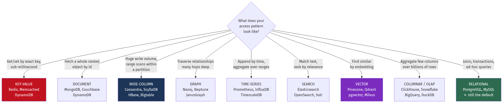
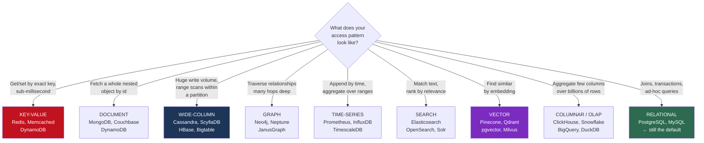
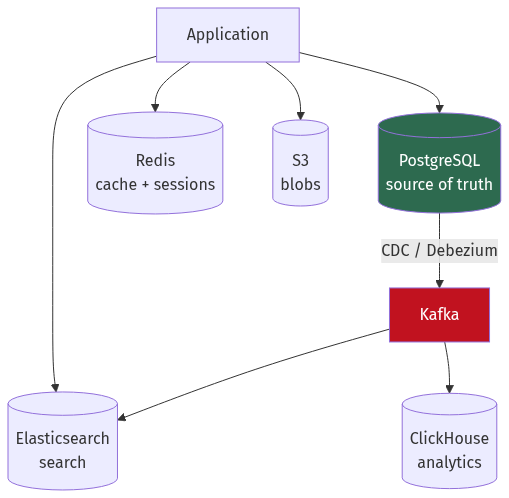
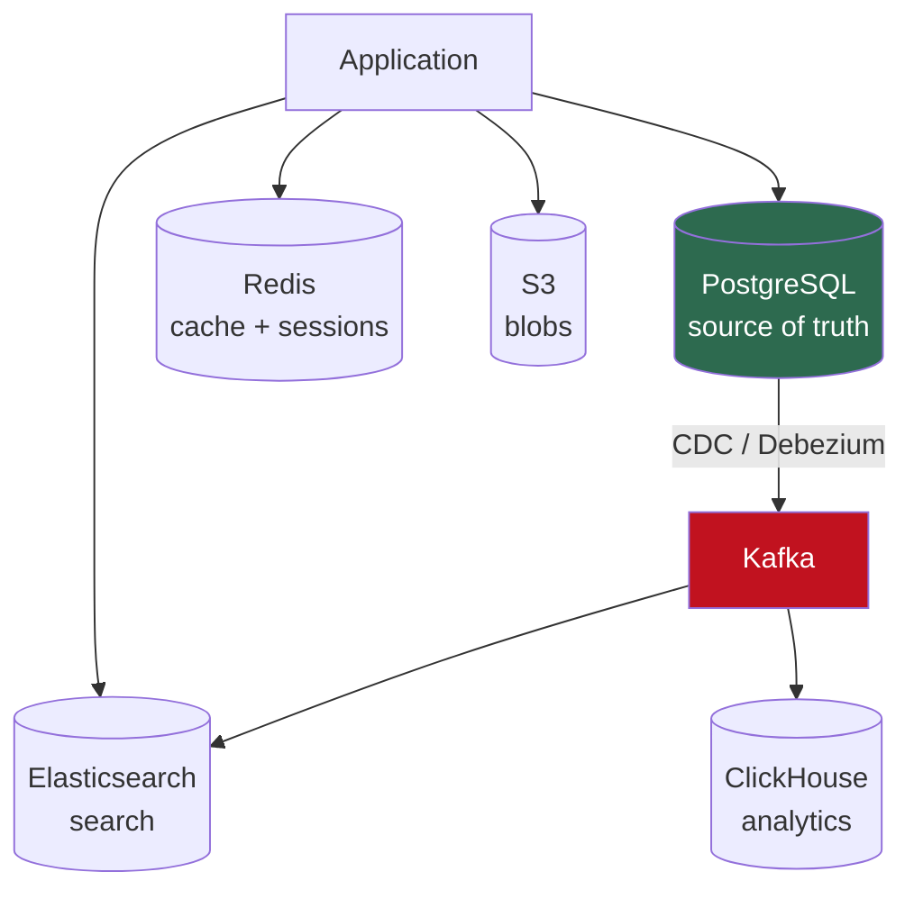
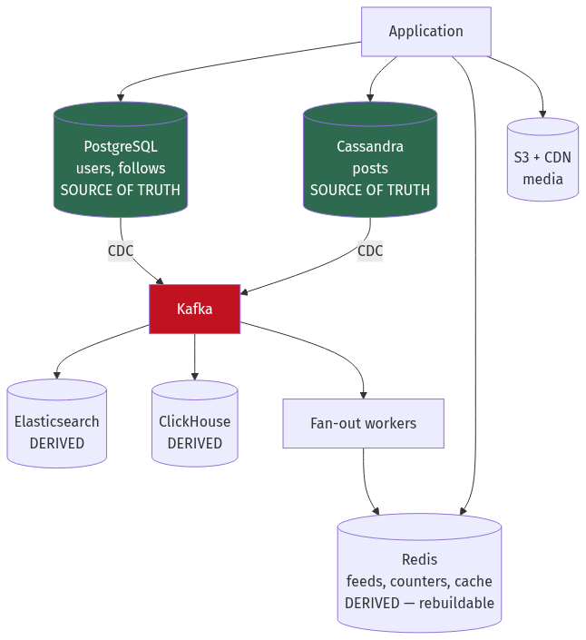
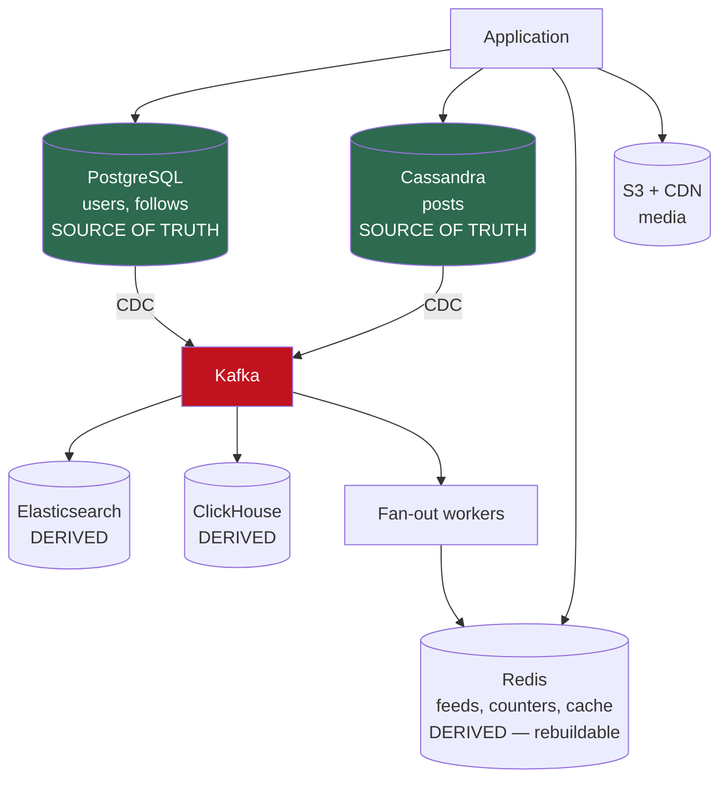

# Chapter 8 — NoSQL and Polyglot Persistence

[← Chapter 7](./07_relational_databases_and_transactions.md) · [Contents](./README.md) · [Next: Chapter 9 →](./09_replication_partitioning_consistency.md)

**Prerequisites:** [Chapter 6](./06_storage_engines_internals.md) (LSM trees, B+trees) and [Chapter 7](./07_relational_databases_and_transactions.md) (ACID, isolation, indexes).

---

## What you'll learn

- What NoSQL databases actually gave up to get what they gained — and why "schemaless" is the least important part
- The **eight families** of non-relational store, with the access pattern each one exists to serve
- **Redis** internals: why single-threaded is fast, all nine data structures with the problem each solves, the expiry algorithm, and the four ways people break it in production
- **Cassandra** data modelling — partition key vs clustering key, query-first design, and the three mistakes that make a cluster unusable
- **DynamoDB** capacity arithmetic, single-table design, and why a GSI can throttle your writes
- **Vector databases** and HNSW — what "approximate nearest neighbour" means and what recall costs
- A **25-case decision matrix** mapping workloads to stores
- **Polyglot persistence** — and an honest accounting of what each additional datastore costs you

---

## Start from zero

A relational database is a very good general-purpose tool. It gives you joins, transactions,
constraints, and a query planner that adapts as your data grows. For most systems, most of
the time, it is the correct answer — and this chapter is not an argument otherwise.

But those features have a price, and around 2007 a handful of companies hit the price.

**Amazon's problem:** the shopping cart must accept a write even when the network between
datacentres is broken. A relational primary can't — if the primary is unreachable, writes
fail. Amazon decided a cart that occasionally resurrects a deleted item is better than a cart
that refuses to accept items. That trade produced **Dynamo**.

**Google's problem:** the web index is petabytes and doesn't fit on any machine. There is no
join to perform — you look up a row key and read some columns. Paying for a query planner and
transaction manager you never use is waste. That produced **Bigtable**.

**Facebook's problem:** inbox search wrote far more than it read, and the write volume
exceeded what a B-tree could absorb. That produced **Cassandra** — Dynamo's distribution model
with Bigtable's data model.

💡 **Notice what these three have in common: none of them is about schemas.** "Schemaless" is
how NoSQL was marketed, and it's the least important property. The real trades were:

| Given up | Bought |
| --- | --- |
| Joins | Horizontal scalability without coordination |
| Multi-row ACID transactions | Availability during partitions |
| A query planner | Predictable, bounded latency |
| Flexible ad-hoc queries | Writes measured in hundreds of thousands per second |
| Strong consistency by default | Tunable consistency per query |

⚠️ **The consequence people underestimate:** in a relational database you model the data and
then write queries. In most NoSQL stores you must **know your queries first**, because the
data layout *is* the access path. Getting it wrong isn't a slow query — it's a migration.

---

## The mental model



<details>
<summary>Diagram source (Mermaid)</summary>



</details>

💡 **The honest default is the green box.** PostgreSQL does key-value (JSONB + GIN), search
(`tsvector`), time-series (BRIN + partitioning), geospatial (PostGIS) and vectors (pgvector)
*adequately*. You move to a specialist store when "adequately" stops being enough — and you
should be able to say what number made it stop.

---

## Deep dive

### 8.1 The taxonomy

| Family | Data model | Read by | Killer feature | Killer limitation |
| --- | --- | --- | --- | --- |
| **Key-value** | Opaque blob | Exact key | Sub-ms latency, trivially shardable | ⚠️ No querying by value |
| **Document** | Nested JSON/BSON | Key, or secondary index | Whole aggregate in one read | Joins are manual and slow |
| **Wide-column** | Row key → sparse columns | Partition key + clustering range | 100k+ writes/s per node | ⚠️ Query patterns fixed at design time |
| **Graph** | Nodes + typed edges | Traversal from a start node | Multi-hop traversal in O(hops) | Hard to shard; global queries are slow |
| **Time-series** | (series, timestamp) → value | Time range per series | 10–50× compression | ⚠️ Updates and deletes are awkward |
| **Search** | Inverted index | Term match, ranked | Relevance, fuzzy, faceting | Near-real-time, not real-time |
| **Vector** | Dense float array | Nearest neighbour | Semantic similarity | Approximate — recall < 100% |
| **Columnar/OLAP** | Column-oriented blocks | Scan + aggregate | 100× faster aggregates | ⚠️ Hates single-row writes |

### 8.2 Redis — the one you will actually use

Redis is the most broadly useful non-relational store, and most teams use perhaps 20% of it.

#### Why single-threaded is fast

Redis executes commands on **one thread**. This sounds like a limitation and is mostly an
advantage:

| Consequence | Why it helps |
| --- | --- |
| No locks, no mutexes | Zero synchronisation overhead — see [Ch 1](./01_from_zero_computers_networks_web.md) §1.12 on false sharing |
| Every command is atomic | No isolation levels needed; no race conditions within a command |
| No context switching | The thread stays hot; caches stay warm |
| Predictable latency | No lock convoy, no scheduler jitter |

📐 The bottleneck is not CPU:
```
Redis single node: ~100,000 ops/second unpipelined
                   ~1,000,000 ops/second pipelined

Per-op cost breakdown at 100k ops/s:
  Network syscall + protocol parse:  ~8 µs   ← dominant
  Actual data structure operation:   ~0.5 µs
```
💡 **You are paying for network round trips, not for Redis.** Which is why **pipelining**
(sending many commands without waiting for each reply) gives a 10× improvement — it amortises
the syscall.

⚠️ Redis 6+ added **I/O threads** for reading/writing sockets, but command *execution* is
still single-threaded. Redis 7 and Valkey have extended this further. The mental model — one
command at a time, atomically — still holds.

#### The data structures, and the problem each solves

| Type | Operations | Use it for |
| --- | --- | --- |
| **String** | `GET/SET/INCR/SETEX` | Cache entries, counters, distributed locks, feature flags |
| **Hash** | `HGET/HSET/HINCRBY` | An object's fields — update one field without rewriting the whole object |
| **List** | `LPUSH/RPOP/BLPOP` | Simple queues (`BLPOP` blocks), recent-items capped with `LTRIM` |
| **Set** | `SADD/SISMEMBER/SINTER` | Unique membership, tags, "who liked this", set intersection |
| **Sorted set (ZSET)** | `ZADD/ZRANGE/ZRANGEBYSCORE` | ⭐ **Leaderboards, priority queues, rate limiters, time-ordered feeds** |
| **Bitmap** | `SETBIT/BITCOUNT/BITOP` | Daily-active-user tracking at 1 bit per user |
| **HyperLogLog** | `PFADD/PFCOUNT` | Approximate unique counts in **12 KB regardless of cardinality** |
| **Stream** | `XADD/XREADGROUP` | Append-only log with consumer groups — a lightweight Kafka |
| **Geospatial** | `GEOADD/GEOSEARCH` | "Drivers within 3 km" (a ZSET with geohash scores underneath) |

💡 **The sorted set is the one to know.** It's a skip list plus a hash map, giving O(log N)
insert and O(log N + M) range queries by score. Almost every "top N", "next N", or "everything
between two timestamps" problem is a ZSET.

```
Leaderboard:      ZADD scores 1500 "alice"      → ZREVRANGE scores 0 9 WITHSCORES
Rate limiter:     ZADD reqs <now> <uuid>        → ZREMRANGEBYSCORE reqs 0 <now-60>
                                                → ZCARD reqs
Time-ordered feed: ZADD feed:42 <ts> <post_id>  → ZREVRANGEBYSCORE feed:42 <ts> -inf LIMIT 0 20
Delayed queue:    ZADD jobs <run_at> <job_id>   → ZRANGEBYSCORE jobs 0 <now> LIMIT 0 10
```

📐 **Bitmaps are dramatic when they apply:**
```
Track which of 50 million users were active today.
  Redis Set:    50M × ~60 bytes = 3 GB
  Redis Bitmap: 50M bits = 6.25 MB     ← 480× smaller
  BITCOUNT gives the daily active count; BITOP AND across 7 days gives weekly retention.
```

#### Persistence: RDB vs AOF

| | RDB (snapshot) | AOF (append-only file) |
| --- | --- | --- |
| What it stores | Point-in-time binary dump | Every write command |
| Recovery loss | ⚠️ Up to the snapshot interval (minutes) | `everysec`: ≤1 s · `always`: none |
| Restart speed | **Fast** — load a compact binary | Slow — replay the whole log |
| File size | Small | Large (rewritten periodically) |
| Fork cost | ⚠️ `fork()` copies page tables; on a 50 GB instance this can pause for hundreds of ms | Same, during rewrite |

💡 **Run both.** RDB for fast restart and backups, AOF for durability. `appendfsync everysec`
is the standard setting — at most one second of loss.

⚠️ **The fork latency spike is a real production surprise.** Redis snapshots by forking; the
child writes the dump while the parent keeps serving using copy-on-write. On a large instance
with a high write rate, the parent must copy pages as it dirties them, and memory usage can
briefly approach 2×. Symptoms: periodic P99 spikes and occasional OOM. Mitigations: smaller
instances (shard), `vm.overcommit_memory = 1`, and disabling transparent huge pages (Redis
warns about this at startup for exactly this reason).

#### Expiry — how Redis actually deletes

Not with a timer per key. Two mechanisms:

1. **Lazy** — when a key is accessed, check whether it expired; if so, delete and return nil.
2. **Active** — 10 times per second, sample 20 random keys with a TTL; delete the expired
   ones; if more than 25% were expired, repeat immediately.

⚠️ **Consequence:** expired keys still occupy memory until sampled. If you set a million keys
to expire at the same instant, memory stays high for a while and the active cycle spikes CPU.
**Jitter your TTLs** — this is the same fix as cache avalanche
([Chapter 11](./11_caching_cdn_and_edge.md)).

**Eviction policies** (when `maxmemory` is reached):

| Policy | Behaviour |
| --- | --- |
| `noeviction` | ⚠️ Writes fail. Correct for a *datastore*, wrong for a *cache*. |
| `allkeys-lru` | Evict least-recently-used across all keys — **the usual cache setting** |
| `allkeys-lfu` | Least-*frequently*-used — better when popularity is stable |
| `volatile-lru` | LRU among keys that have a TTL |
| `volatile-ttl` | Evict the shortest remaining TTL first |

⚠️ **`volatile-*` policies fail closed:** if no key has a TTL, Redis behaves as `noeviction`
and writes start failing. If you use a `volatile-` policy, every key must have a TTL.

#### Clustering

Redis Cluster shards by **hash slot**: `CRC16(key) mod 16384`. Slots are assigned to nodes;
clients cache the map and are redirected with `MOVED` when it changes.

⚠️ **Multi-key operations only work if all keys are in the same slot.** Use **hash tags** —
only the part in braces is hashed:
```
user:{42}:profile   ┐
user:{42}:sessions  ├─ all hash to the same slot → MGET/transactions work
user:{42}:cart      ┘
```

#### ⚠️ The four ways people break Redis

**1. `KEYS *` in production.** O(N), blocks the single thread for the entire scan. On 10
million keys that's seconds of total unavailability. **Use `SCAN`**, which is cursor-based and
incremental.

**2. Big keys.** A single list or hash with a million elements. `DEL` on it blocks for
hundreds of milliseconds (use `UNLINK`, which frees asynchronously). Any range operation over
it blocks everything. **Keep collections under ~10,000 elements**; shard larger ones.

**3. Hot keys.** One key receiving 200,000 requests/second. Sharding doesn't help — the key
lives on one node by definition. Fixes: a local in-process cache in front (L1), or replicate
the key under N suffixed names and read a random one.

**4. Using Redis as a durable database.** It is fast because it's in memory and its durability
is best-effort. `appendfsync everysec` loses up to a second; replication is asynchronous by
default, so a failover loses recent writes. ⚠️ Redis's own documentation is explicit that
**Redlock and Redis replication are not sufficient for correctness-critical locking**. For a
distributed lock protecting money, use etcd or ZooKeeper with fencing tokens
([Chapter 10](./10_distributed_transactions_and_integrity.md)).

### 8.3 Cassandra and wide-column stores

Cassandra is an LSM store ([Chapter 6](./06_storage_engines_internals.md) §6.5) distributed
with Dynamo-style consistent hashing. Its data model is the part people get wrong.

#### The primary key has two halves, and they do different jobs

```sql
CREATE TABLE messages (
    room_id    uuid,
    bucket     date,
    sent_at    timestamp,
    message_id uuid,
    author     text,
    body       text,
    PRIMARY KEY ((room_id, bucket), sent_at, message_id)
);
--             └──── partition key ────┘  └─ clustering columns ─┘
```

| Component | Determines | Consequence |
| --- | --- | --- |
| **Partition key** | Which node stores the row (via consistent hashing) | ⚠️ Every query **must** specify it, or you scan the whole cluster |
| **Clustering columns** | Sort order **within** a partition | Enables efficient range scans and `ORDER BY` |

📐 **Why this makes reads fast:** a query specifying the partition key goes to exactly the
replicas holding it (typically 3 nodes out of hundreds), and within that partition the rows
are already sorted on disk by the clustering columns — so a range scan is one sequential read.

```sql
-- ✅ One partition, sequential range read. Microseconds.
SELECT * FROM messages
WHERE room_id = ? AND bucket = '2026-08-31' AND sent_at > ? LIMIT 50;

-- ❌ No partition key → coordinator queries EVERY node, merges, sorts.
SELECT * FROM messages WHERE author = 'alice';
-- Cassandra refuses unless you add ALLOW FILTERING, which you should read as
-- "ALLOW ME TO TAKE DOWN THE CLUSTER".
```

#### Query-first modelling

⚠️ **In Cassandra you do not model entities. You model queries.** One table per access
pattern, with data duplicated across them, because storage is cheap and scatter-gather is not.

```
Query: "messages in a room, newest first"      → table messages_by_room
Query: "messages by a user across rooms"       → table messages_by_user   (same data, again)
Query: "message by id"                         → table messages_by_id     (again)
```

This feels wrong coming from §7.2. It isn't — the constraint is different. Denormalisation is
the *design*, and keeping the copies consistent is your job (usually via a batch write or a
CDC stream).

#### The three mistakes that kill a cluster

**1. ⚠️ Unbounded partitions.**
```
PRIMARY KEY (room_id, sent_at)     ❌ grows forever
PRIMARY KEY ((room_id, bucket), sent_at)  ✅ bounded by the time bucket
```
📐 **The limits to design against:** keep partitions under **~100 MB** and **~100,000 rows**.
Beyond that, compaction gets expensive, repair gets slow, and a single read can time out.
```
Busy room: 5,000 messages/day × 500 bytes = 2.5 MB/day
  Without bucketing, after 2 years: 1.8 GB in one partition. ❌
  With a daily bucket: 2.5 MB. ✅
```

**2. ⚠️ Hot partitions.** A partition key with low cardinality or skewed traffic sends all
traffic to three nodes while the other 97 idle. `country` is a terrible partition key;
`user_id` is usually a good one.

**3. ⚠️ Tombstones.** Covered in [Chapter 6](./06_storage_engines_internals.md) §6.5 — deletes
write markers that must be read and discarded until `gc_grace_seconds` (default 10 days)
passes. Never use Cassandra as a queue. Prefer TTL with time-windowed compaction.

#### Tunable consistency

Per query, you choose how many replicas must respond:

| Level | Meaning |
| --- | --- |
| `ONE` | One replica. Fast, may be stale. |
| `QUORUM` | ⌊RF/2⌋+1 replicas |
| `LOCAL_QUORUM` | Quorum **within the local datacentre** — avoids cross-region latency |
| `ALL` | Every replica. ⚠️ One node down = query fails. |

📐 **The strong-consistency condition** (proved in [Chapter 9](./09_replication_partitioning_consistency.md)):
```
W + R > RF

RF=3, W=QUORUM(2), R=QUORUM(2):  2 + 2 = 4 > 3  ✅ read-your-writes guaranteed
RF=3, W=ONE(1),    R=ONE(1):     1 + 1 = 2 ≤ 3  ❌ may read stale data
RF=3, W=ALL(3),    R=ONE(1):     3 + 1 = 4 > 3  ✅ fast reads, but writes fail if any node is down
```

💡 **`LOCAL_QUORUM` is almost always the right production setting** in a multi-region
deployment: strong consistency within a region, no cross-ocean round trip on the critical path.

### 8.4 DynamoDB

Managed, serverless, and with a pricing model that *is* the design constraint.

#### Capacity arithmetic

```
1 RCU = one strongly-consistent read of ≤ 4 KB per second
      = two eventually-consistent reads of ≤ 4 KB per second
1 WCU = one write of ≤ 1 KB per second
```

📐 **Worked sizing:**
```
Workload: 5,000 reads/s of 6 KB items (eventually consistent)
          1,000 writes/s of 3 KB items

Reads:  ceil(6/4) = 2 RCU per strongly-consistent read
        eventually consistent halves it → 1 RCU per read
        5,000 × 1 = 5,000 RCU
Writes: ceil(3/1) = 3 WCU per write
        1,000 × 3 = 3,000 WCU

Provisioned cost ≈ 5,000 × $0.00013 + 3,000 × $0.00065 per hour
                 ≈ $0.65 + $1.95 = $2.60/hour ≈ $1,900/month
```

⚠️ **Rounding up is where the money goes.** An item of 4.1 KB costs 2 RCU, not 1.05. Shaving
items below a boundary — by compressing, or by moving a large blob to S3 and storing a pointer
— can halve your bill.

**On-demand vs provisioned:** on-demand costs roughly **6–7× more per request** but requires
no forecasting and absorbs spikes instantly. Use on-demand for unpredictable or spiky
workloads and provisioned-with-autoscaling for steady ones. The crossover is around 15–20%
average utilisation.

#### Partitions and the throughput ceiling

📐 **Every physical partition is capped at 3,000 RCU and 1,000 WCU.**
```
Table provisioned for 30,000 RCU → at least 10 partitions
Items distribute by hash(partition_key)

If 40% of traffic hits one partition key:
  12,000 RCU demanded from a partition capped at 3,000 → THROTTLED
  ...while the table as a whole is well under its provisioned capacity.
```
⚠️ **This is the "hot partition" problem and it is DynamoDB's defining constraint.**
Adaptive capacity now borrows unused capacity from other partitions and can isolate a hot key,
but it reacts in minutes and does not remove the per-partition ceiling.

**Write sharding** is the standard fix:
```
partition_key = "product#123"           ❌ one partition
partition_key = "product#123#" + rand(0,9)   ✅ spread across 10
-- Reads must now query all 10 shards and merge. That's the trade.
```

#### Secondary indexes

| | **LSI** (Local) | **GSI** (Global) |
| --- | --- | --- |
| Partition key | Same as the table | **Different** |
| Sort key | Different | Different |
| Created | ⚠️ Only at table creation | Any time |
| Consistency | Strongly consistent option | ⚠️ **Eventually consistent only** |
| Capacity | Shares the table's | **Its own** |
| Size limit | ⚠️ 10 GB per partition key | Unlimited |

⚠️ **The GSI failure mode that surprises everyone:** a GSI has its own provisioned capacity,
and if it throttles, **writes to the base table are throttled too** — because DynamoDB cannot
let the index fall arbitrarily behind. An under-provisioned index takes down your writes.

#### Single-table design

DynamoDB's canonical pattern: put multiple entity types in one table, using a generic
partition key (`PK`) and sort key (`SK`) with prefixes.

```
PK              | SK                    | attributes
----------------+-----------------------+---------------------------
USER#42         | PROFILE               | name, email
USER#42         | ORDER#1001            | total, status, created_at
USER#42         | ORDER#1002            | total, status, created_at
ORDER#1001      | ITEM#SKU9             | qty, price
```

📐 **Why:** `Query(PK = "USER#42")` returns the user's profile **and** all their orders in
**one request**, because they share a partition and are sorted by `SK`. In a
normalised design that's two round trips minimum.

⚠️ **The honest downsides:** it's genuinely hard to reason about, adding a new access pattern
often needs a new GSI or a migration, and the table is unreadable to anyone who wasn't there
when it was designed. Use it when you have a small, well-understood, stable set of access
patterns. If your access patterns are still moving, single-table design will hurt.

### 8.5 MongoDB and document stores

The core modelling decision is **embed or reference**.

```javascript
// EMBEDDED — one read gets everything
{ _id: 1, name: "Alice",
  addresses: [ { city: "Delhi", pin: "110001" } ],
  recent_orders: [ { id: 99, total: 4000 } ] }

// REFERENCED — normalised, needs a second query or $lookup
{ _id: 1, name: "Alice", address_ids: [7, 8] }
```

| Embed when | Reference when |
| --- | --- |
| Read together, always | Read independently |
| The child has no life of its own | The child is shared between parents |
| Bounded, small ( < ~100 items) | ⚠️ Unbounded growth |
| Updated together | Updated at very different rates |

⚠️ **The 16 MB document limit is a hard wall.** Embedding an unbounded array — comments on a
post, events for a user — eventually fails, and it fails in production rather than in test.
Worse, MongoDB must rewrite the whole document on update, so a 5 MB document being modified
1,000 times a second is 5 GB/s of write amplification. **Bound every embedded array.**

**Write concern and read preference** are the two settings that determine your guarantees:

```javascript
// ⚠️ w:1 acknowledges from the primary only — a failover can lose this write.
db.orders.insertOne(doc, { writeConcern: { w: 1 } })

// ✅ Majority: survives a failover. This is the default since MongoDB 5.0 for good reason.
db.orders.insertOne(doc, { writeConcern: { w: "majority", j: true } })
```

⚠️ `readPreference: "secondaryPreferred"` is often reached for to "scale reads", but
secondaries lag. If a user writes and immediately reads, they may not see their own write.
Use `"primary"` for read-your-writes paths, or read with `readConcern: "majority"` and
causal-consistency sessions.

### 8.6 Graph, time-series and vector stores

#### Graph

The value is **index-free adjacency** — each node stores direct pointers to its neighbours, so
traversing an edge is a pointer dereference rather than an index lookup.

📐 **"Friends of friends of friends" over 1 million users, 50 friends each:**
```
Relational: 3 self-joins over a 50-million-row edge table.
            Each level multiplies: 50 → 2,500 → 125,000 index lookups, with sorting.
            → seconds

Graph:      follow pointers, 125,000 dereferences, no index involved
            → milliseconds
```

⚠️ **Graph databases are hard to shard**, because a good partition is exactly what a graph
doesn't have — edges cross every boundary you draw. Most graph deployments are single-machine
or replicated-not-partitioned. If your graph doesn't fit on one machine, this is a serious
problem. Use a graph database for deep traversal on a bounded dataset; for shallow queries
("who does Alice follow?") a relational table with the right indexes is fine and simpler.

#### Time-series

Covered numerically in [Chapter 2](./02_scalability_and_estimation.md) §2.3 Example 5 — the
key fact is **~1.4 bytes per data point** versus 66 raw, via delta-of-delta timestamps and
XOR-encoded values.

| | Prometheus | InfluxDB | TimescaleDB |
| --- | --- | --- | --- |
| Model | Pull, metrics-focused | Push | PostgreSQL extension |
| Query | PromQL | Flux/InfluxQL | **SQL** |
| Long-term storage | Needs Thanos/Mimir/Cortex | Built in | Built in |
| Joins with relational data | ❌ | ❌ | ✅ |

💡 **TimescaleDB is underrated** when your time-series data needs to join with business data.
It's PostgreSQL, so you keep SQL, transactions and every tool you already have, while getting
automatic partitioning (hypertables), columnar compression and continuous aggregates.

#### Vector databases

An **embedding** is a fixed-length array of floats produced by a model, positioned so that
semantically similar inputs are close together. "Similar" means small cosine distance.

⚠️ **Exact nearest-neighbour search is O(N) per query** — you must compare against every
vector. At 100 million vectors of 768 dimensions:
```
100,000,000 × 768 × 4 bytes = 307 GB just to hold them
One exact query = 76.8 billion float operations. Not viable.
```

So all vector databases use **ANN — approximate nearest neighbour** — trading exactness for
speed.

**HNSW (Hierarchical Navigable Small World)** is the dominant algorithm. Build a layered graph
where upper layers have long-range links and lower layers are dense; search greedily from the
top, descending. Query cost is roughly **O(log N)**.

📐 **The recall/latency/memory trade:**

| Parameter | Raising it… |
| --- | --- |
| `M` (links per node) | ↑ recall, ↑ memory, ↑ build time |
| `efConstruction` | ↑ index quality, ↑ build time |
| `efSearch` | ↑ recall, ↑ query latency (**tune this at runtime**) |

```
100M vectors, 768-dim, HNSW with M=16:
  Raw vectors:  307 GB
  Graph links:  100M × 16 × 2 × 4 B ≈ 13 GB
  Total ≈ 320 GB of RAM  ⚠️ this is why vector search is expensive

With scalar quantisation (float32 → int8): 77 GB, recall drops ~1-2%
With product quantisation:                 ~10 GB, recall drops more
```

⚠️ **Recall is a real number you must measure.** "95% recall" means one in twenty queries
misses a result it should have found. For product search that's fine; for legal or medical
retrieval it may not be. Always evaluate recall@k against an exact baseline on your own data —
published benchmarks use different distributions.

💡 **You probably don't need a dedicated vector database.** `pgvector` in PostgreSQL supports
HNSW and handles tens of millions of vectors comfortably, while letting you filter by ordinary
SQL predicates in the same query — which turns out to be the hard part. Combining a vector
search with `WHERE tenant_id = 42 AND status = 'active'` is awkward in most dedicated vector
stores and trivial in Postgres. Move to Pinecone/Milvus/Qdrant when you exceed what one
Postgres instance can hold.

### 8.7 The decision matrix

| # | Workload | Choose | Because |
| --- | --- | --- | --- |
| 1 | User accounts, orders, payments | **PostgreSQL** | ACID, joins, constraints |
| 2 | Session store | **Redis** | Sub-ms, native TTL, disposable |
| 3 | Application cache | **Redis / Memcached** | In-memory, LRU eviction |
| 4 | Leaderboard | **Redis ZSET** | O(log N) ranked range queries |
| 5 | Rate limiting | **Redis** | Atomic counters, TTL, Lua scripts |
| 6 | Distributed lock (correctness-critical) | **etcd / ZooKeeper** | ⚠️ Not Redis — needs fencing tokens |
| 7 | Chat messages | **Cassandra / ScyllaDB** | Write-heavy, partition by conversation |
| 8 | IoT sensor readings | **Cassandra + TWCS**, or **TimescaleDB** | Append-only with TTL expiry |
| 9 | Application metrics | **Prometheus** → Thanos/Mimir | Pull model, PromQL, ~1.4 B/point |
| 10 | Product catalogue | **PostgreSQL** (+ Elasticsearch for search) | Relational truth, search index |
| 11 | Full-text search | **Elasticsearch / OpenSearch** | BM25, fuzzy, faceting, aggregations |
| 12 | Semantic / RAG search | **pgvector**, then Qdrant/Pinecone | HNSW; start in Postgres |
| 13 | Social graph traversal | **Neo4j**, or Postgres + recursive CTE | Index-free adjacency for deep hops |
| 14 | Shopping cart | **DynamoDB / Redis** | Key-value by user, high availability |
| 15 | Event log / stream | **Kafka** | Ordered, replayable, multi-consumer ([Ch 12](./12_messaging_and_event_streaming.md)) |
| 16 | Analytics over billions of rows | **ClickHouse / BigQuery / Snowflake** | Columnar, vectorised |
| 17 | Data lake | **S3 + Iceberg/Delta** | Cheap, open format ([Ch 13](./13_big_data_batch_stream_analytics.md)) |
| 18 | Images, video, backups | **S3 / object storage** | ⚠️ Never blobs in a database |
| 19 | Feature flags / config | **Redis + local cache** | Tiny, read-hot, needs push updates |
| 20 | Job queue | **Redis / SQS / Kafka**, or Postgres `SKIP LOCKED` | ⚠️ Never Cassandra — tombstones |
| 21 | Geospatial "near me" | **PostGIS**, or Redis GEO | R-tree / geohash indexing |
| 22 | Audit log (immutable) | **Postgres append-only + WORM object storage** | Integrity and retention |
| 23 | Multi-region active-active writes | **DynamoDB Global / CockroachDB / Spanner** | Conflict handling built in |
| 24 | Uniqueness across a cluster | **Postgres unique constraint** | ⚠️ Eventually-consistent stores can't guarantee it |
| 25 | Counting distinct users | **Redis HyperLogLog** | 12 KB for any cardinality, ~0.8% error |

### 8.8 Polyglot persistence — and its real cost

Using the right store per workload is correct in principle. In practice each additional
datastore costs you more than the diagram suggests.



<details>
<summary>Diagram source (Mermaid)</summary>



</details>

📐 **What each store adds:**

| Cost | Detail |
| --- | --- |
| **Operational** | Backups, upgrades, monitoring, capacity planning, on-call runbooks — per store |
| **Expertise** | Someone must know its failure modes at 3 a.m. |
| **Consistency** | ⚠️ Data now exists in N places and **will** diverge |
| **Availability** | Each synchronous dependency multiplies ([Ch 3](./03_reliability_availability_performance.md) §3.3) |
| **Cost** | Minimum viable HA cluster per store, whether or not you use its capacity |

💡 **The rule: one source of truth, everything else derived.** PostgreSQL holds the truth;
Elasticsearch and ClickHouse are **projections** fed by change data capture. If a projection
is lost or corrupted, you rebuild it from the source. If instead two stores each hold
authoritative data, you have a distributed consistency problem you did not need.

⚠️ **Dual writes are the anti-pattern.** Writing to Postgres and then to Elasticsearch from
application code fails partway and leaves them inconsistent, with no mechanism to notice or
repair. Use the **transactional outbox** or **CDC**
([Chapter 10](./10_distributed_transactions_and_integrity.md) §outbox) so the second write is
derived from the first rather than parallel to it.

---

## Worked example — choosing stores for a social product

*A social app: 50 million users, 500 million posts, 5 billion follow edges. Users read feeds,
search posts, view profiles, and get notified. 100,000 feed reads/second at peak, 5,000
posts/second. Choose the datastores and justify each with a number.*

**Step 1 — Enumerate access patterns and their shape.**

| # | Access pattern | Rate | Shape |
| --- | --- | --- | --- |
| A | Fetch user profile by id | 20,000/s | Point lookup |
| B | Fetch a user's feed | 100,000/s | Ordered range, precomputed |
| C | Create a post | 5,000/s | Write, fan out |
| D | Search posts by text | 2,000/s | Ranked full-text |
| E | "Who does X follow?" | 10,000/s | Adjacency list |
| F | "Mutual friends of X and Y" | 500/s | 2-hop traversal |
| G | Notification counts | 50,000/s | Counter |
| H | Analytics: DAU, engagement | 100/s | Aggregate over billions |
| I | Profile photos | 30,000/s | Blob |

**Step 2 — Take each in turn, and justify.**

**A — Profiles → PostgreSQL, behind Redis.**
```
50M users × 2 KB = 100 GB. Fits on one machine comfortably.
Needs: uniqueness on email/handle (⚠️ eventually-consistent stores cannot guarantee this),
       transactions for signup, joins for admin queries.
20,000/s against Postgres is fine, but cache in Redis anyway:
  Zipf-distributed profile views, cache 1M profiles = 2 GB → ~80% hit rate (Ch 2 §2.9)
  Postgres sees 4,000/s instead of 20,000/s.
```

**B — Feeds → Redis sorted sets, precomputed.**
```
100,000 reads/s. Computing a feed at read time means:
  "posts from the 500 people I follow, newest 50" = a large merge, every request. ❌
Precompute at write time (Ch 2 §2.8, Twitter):
  ZADD feed:<user_id> <timestamp> <post_id>
  ZREVRANGE feed:<user_id> 0 49       → O(log N + 50), sub-millisecond

Memory: cap each feed at 800 entries.
  50M users × 800 × ~70 B ≈ 2.8 TB   ⚠️ too much
  Only materialise for active users: 5M DAU × 800 × 70 B = 280 GB ✅
  Inactive users fall back to read-time computation.
```
⚠️ **Fan-out cost check:**
```
5,000 posts/s × average 200 followers = 1,000,000 ZADDs/second
Redis does ~100k ops/s/node unpipelined, ~1M pipelined.
→ Pipeline in batches of 100, shard across 10 nodes. Feasible.

Celebrity problem: a user with 20M followers = 20M writes for one post.
→ HYBRID: fan out on write below 10,000 followers; above that, fan out on read
  and merge at query time. (Ch 25 covers this fully.)
```

**C — Posts (source of truth) → Cassandra.**
```
5,000 writes/s sustained. PostgreSQL does 1,000–10,000 write txn/s — no headroom.
Posts are append-only, never updated, read by (author, time) or by id.
500M posts × 1 KB × 3 replicas = 1.5 TB.

PRIMARY KEY ((author_id, month), created_at, post_id)
  Partition size: a prolific user at 30 posts/day × 30 days × 1 KB = 900 KB ✅
  (Without the month bucket: unbounded. ❌)
```

**D — Search → Elasticsearch, fed by CDC.**
```
2,000 queries/s of ranked full-text with fuzzy matching and faceting.
Postgres tsvector handles maybe 100-500/s at this corpus size and lacks
good relevance tuning and typo tolerance.
500M posts × 1 KB, index ~1.3× source = 650 GB → ~12 data nodes.
⚠️ NOT the source of truth. Fed from Cassandra/Kafka via CDC so it can be rebuilt.
```

**E and F — Follow graph → PostgreSQL, not a graph database.**
```
5 billion edges. Query E ("who does X follow?") is ONE HOP — an adjacency lookup:
  SELECT followee_id FROM follows WHERE follower_id = ?
  With an index this is a range scan. Postgres handles 10,000/s easily.
  5B × 16 B = 80 GB + index. Shardable by follower_id.

Query F ("mutual friends") is TWO hops at only 500/s:
  A set intersection of two adjacency lists — Redis SINTER, or a Postgres INTERSECT.

→ ❌ Do NOT add Neo4j. Graph databases earn their keep at 3+ hops on a bounded
  dataset. Here the deepest query is 2 hops at low volume, and 5 billion edges is
  painful to shard in a graph store. Adding it would cost an operational burden
  for no measured benefit.
```
💡 This is the most important decision in the exercise, and the one most candidates get
wrong — "social network" pattern-matches to "graph database" without checking the hop depth.

**G — Notification counters → Redis.**
```
50,000/s of INCR and GET on a small integer.
Postgres: 50,000 row updates/s on hot rows = lock contention + massive MVCC bloat. ❌
Redis: atomic INCR, ~0.5 µs. 50M users × 8 B = 400 MB. ✅
Durability: these are recomputable from the notifications table. Loss is acceptable.
```

**H — Analytics → ClickHouse, fed by Kafka.**
```
"DAU over 90 days", "engagement by cohort" — aggregates over billions of rows.
Cassandra: full cluster scan, and it would degrade the serving path. ❌
ClickHouse: columnar, reads only the needed columns (Ch 6 §6.9), ~100× faster.
```

**I — Photos → S3 + CDN.**
```
30,000/s × 200 KB = 6 GB/s. ⚠️ Never from an origin — see Ch 2 §2.10.
CDN at 95% hit rate: origin serves 300 MB/s.
⚠️ Never store blobs in the database: it destroys the buffer-pool hit rate,
  inflates backups, and makes replication enormous.
```

**Step 3 — The architecture.**



<details>
<summary>Diagram source (Mermaid)</summary>



</details>

**Step 4 — Audit the decision.**

| Store | Justified by | Could we have avoided it? |
| --- | --- | --- |
| PostgreSQL | Uniqueness, transactions, joins | No — it's the truth |
| Cassandra | 5,000 writes/s exceeds Postgres | ⚠️ Maybe, with sharded Postgres. Worth testing first. |
| Redis | 100k feed reads/s, 50k counters/s | No |
| Elasticsearch | Relevance ranking Postgres can't match | ⚠️ At lower volume, `tsvector` would do |
| ClickHouse | 100× on aggregates | Only if analytics is genuinely needed |
| S3 + CDN | 6 GB/s | No |
| **Neo4j** | — | ✅ **Correctly avoided.** 2 hops at 500/s doesn't justify it. |

💡 **Six stores is a lot.** Each one needs backups, monitoring, upgrades and an on-call
runbook. The justification for every one is a **measured number**, and two stores
(Cassandra, ClickHouse) are explicitly flagged as "start with Postgres and move when the
number says so." The strongest answer in an interview includes the store you *didn't* add and
why.

---

## Trade-offs

| Decision | Option A | Option B | Choose A when | Never choose A when |
| --- | --- | --- | --- | --- |
| Default store | PostgreSQL | A specialist store | Almost always at the start | A measured number says it can't cope |
| Cache | Redis | Memcached | You need data structures, persistence, pub/sub | You need pure multi-threaded LRU caching at max efficiency |
| Redis persistence | RDB only | RDB + AOF | Pure cache, loss is fine | It's a datastore — you need both |
| Redis eviction | `allkeys-lru` | `noeviction` | It's a cache | It's a datastore — but then writes fail at maxmemory |
| Wide-column PK | `(entity_id)` | `(entity_id, time_bucket)` | Bounded row count, guaranteed | ⚠️ Anything that grows forever |
| Consistency (Cassandra) | `ONE` | `LOCAL_QUORUM` | Analytics, tolerant of staleness | User-visible reads after writes |
| DynamoDB capacity | On-demand | Provisioned + autoscaling | Spiky/unpredictable, or < 20% utilisation | Steady load — provisioned is ~6× cheaper |
| DynamoDB schema | Multi-table | Single-table | Access patterns still evolving | Stable, well-understood patterns and you need one-request fetches |
| Document modelling | Embed | Reference | Bounded, read together, updated together | ⚠️ Unbounded growth — 16 MB wall |
| Search | Postgres `tsvector` | Elasticsearch | < ~1M docs, simple relevance | Need fuzzy, faceting, tuned ranking, high QPS |
| Vectors | pgvector | Dedicated vector DB | < ~10M vectors, need SQL filtering | Hundreds of millions of vectors |
| Graph queries | Relational adjacency table | Graph database | ≤ 2 hops, or the graph must shard | 3+ hop traversal on a bounded graph |
| Consistency across stores | Dual writes | CDC / outbox | ⚠️ Never | Always prefer B — dual writes silently diverge |

---

## How real companies do it

**Twitter/X** runs the hybrid fan-out described in the worked example. Their published
architecture materialises timelines in Redis for active users, with a separate path for
high-follower accounts merged at read time. The design driver was exactly the arithmetic in
Step 2: 100,000 reads/second cannot each perform a large merge.

**Discord** ([Chapter 6](./06_storage_engines_internals.md)) keeps messages in ScyllaDB with
`((channel_id, bucket), message_id)` — the bucketed partition key from §8.3, chosen because
their first schema had unbounded partitions on busy channels. Metadata stays in PostgreSQL.
It is the clean version of "source of truth relational, high-volume data in a wide-column
store."

**Amazon's retail site** is where DynamoDB's design came from: the shopping cart must accept
writes during a partition. Their published position is that an "always writeable" cart with
occasional merge conflicts beats a strongly-consistent cart that sometimes rejects an add —
a business decision expressed as a database choice.

**Stack Overflow** — the recurring counter-example — serves its entire workload from SQL
Server plus Redis, with Elasticsearch for search. No document store, no wide-column store, no
graph database, despite having a rich tag graph and a question-and-answer structure that looks
like a perfect NoSQL fit. Their published numbers show the relational tier running at single-
digit CPU percentages.

**Uber's Schemaless** used MySQL as an append-only key-value store, adding their own sharding
and indexing above it. The reasoning is instructive: they wanted MySQL's operational maturity
and durability characteristics but not its relational features, so they kept the engine and
discarded the model.

**Pinterest** documented moving from a sharded MySQL setup to HBase and back for parts of
their workload. The general lesson from these migration stories is consistent: **the migration
that worked was driven by a specific measured constraint**, and the ones that didn't were
driven by a general belief that the new store was better.

---

## Common mistakes

**Choosing NoSQL for "flexible schema".** That's the least valuable property, and you pay for
it with lost constraints. PostgreSQL's `JSONB` gives you schema flexibility *inside* a
relational database, with GIN indexes and transactions intact.

**Unbounded Cassandra partitions.** `PRIMARY KEY (user_id, created_at)` grows forever. Bucket
the partition key by time. Keep partitions under ~100 MB and ~100,000 rows.

**`ALLOW FILTERING`.** It tells Cassandra to scan every node. It is not a fix; it's a warning
you overrode.

**Using Cassandra or DynamoDB as a queue.** Insert-then-delete generates tombstones that must
be read and skipped until `gc_grace_seconds` passes. Use Kafka, SQS, Redis, or Postgres with
`SKIP LOCKED`.

**`KEYS *` in Redis.** O(N) on a single-threaded server — total unavailability for the
duration. Use `SCAN`.

**Treating Redis as durable.** `appendfsync everysec` loses up to a second; replication is
asynchronous, so failover loses recent writes. Redis's own docs warn against using it for
correctness-critical locking.

**Under-provisioning a DynamoDB GSI.** When the index throttles, **writes to the base table
throttle too**.

**Ignoring the DynamoDB per-partition cap.** 3,000 RCU / 1,000 WCU per partition, regardless
of table-level provisioning. A hot key throttles while the table looks idle.

**Unbounded embedded arrays in MongoDB.** The 16 MB document limit is hard, and updates
rewrite the whole document.

**Reading from MongoDB secondaries for read-your-writes paths.** Secondaries lag; users won't
see their own writes.

**Reaching for a graph database because the domain is a graph.** Check the hop depth first.
One- and two-hop queries are adjacency lookups a relational table does well, and graphs are
hard to shard.

**Dual writes.** Writing to two stores from application code will diverge, silently, with no
repair mechanism. Use CDC or the transactional outbox.

**Storing blobs in the database.** It wrecks the buffer-pool hit rate, inflates backups, and
makes replication enormous. Store a pointer to object storage.

**Adding a datastore without a number.** Every store costs backups, monitoring, upgrades and
on-call expertise. If you can't state the measurement that made the previous store
insufficient, you're adding operational burden for free.

---

## Interview angle

**Q: When would you choose NoSQL over a relational database?**

*Weak:* "When you need to scale, or when the schema changes a lot."

*Strong:* "I'd start from what I'd be giving up rather than what I'd be gaining, because the
relational default is strong. I give up joins, multi-row transactions and ad-hoc queries; I
gain horizontal scalability without coordination, availability during partitions, and
predictable latency. So the trigger is a **measured constraint**. Concretely: sustained writes
above roughly 10,000 per second per node, which is where a B-tree's random page writes and
fsync cap out — that points at a wide-column LSM store. Or a hard availability requirement
during a network partition, like Amazon's cart, which points at a Dynamo-style store. Or an
access pattern that's genuinely a single key lookup at sub-millisecond latency, which points
at Redis. What I'd *not* accept as a reason is 'flexible schema' — that's the least valuable
property and Postgres JSONB gives it to you without losing constraints."

**Q: Design the data model for a chat application in Cassandra.**

*Strong:* "`PRIMARY KEY ((room_id, bucket), sent_at, message_id)`. The partition key is
`(room_id, bucket)`, the clustering columns are `sent_at` and `message_id`. Three things
follow. First, every query must specify the partition key, so 'messages in this room, newest
first' hits exactly the three replicas holding it and reads sequentially, because the rows are
already sorted on disk by `sent_at`. Second, the `bucket` — a date — exists to **bound the
partition**; without it, a busy room grows forever, and past about 100 MB or 100,000 rows
compaction and repair degrade badly. A room doing 5,000 messages a day at 500 bytes is 2.5 MB
per daily bucket, which is comfortable. Third, `message_id` is there to break ties on
identical timestamps. I'd also note that if I need 'messages by author across rooms', I write
a **second table** with that partition key and duplicate the data — in Cassandra you model
queries, not entities. And I'd avoid deletes entirely; use TTL with time-windowed compaction
so whole SSTables expire rather than generating tombstones."

**Q: Your DynamoDB table is throttling but you're well under provisioned capacity. Why?**

*Strong:* "Hot partition. DynamoDB caps each physical partition at 3,000 RCU and 1,000 WCU
regardless of what the table is provisioned for. If a large share of traffic targets one
partition key — a viral item, a single tenant, or a `created_at`-style key where everything
new lands together — that partition throttles while the table as a whole looks idle. Adaptive
capacity mitigates it by borrowing unused capacity and isolating hot keys, but it reacts in
minutes and the ceiling doesn't disappear. The fix is **write sharding**: append a random
suffix to the partition key to spread across N partitions, accepting that reads must now query
all N and merge. The other thing I'd check is whether a **GSI** is throttling — a GSI has its
own capacity, and when it throttles, writes to the base table throttle too, which surprises
people."

**Q: Should we use a graph database for our social network?**

*Strong:* "Probably not, and the deciding question is **hop depth**, not whether the domain is
a graph. Graph databases earn their keep through index-free adjacency — each node stores
direct pointers to neighbours, so traversal is a pointer dereference rather than an index
lookup. That's transformative at three or more hops: 'friends of friends of friends' over a
million users with fifty friends each is three self-joins and about 125,000 index lookups
relationally, versus 125,000 pointer dereferences in a graph — seconds versus milliseconds.
But 'who does Alice follow?' is **one hop**, which is just an adjacency lookup a relational
index does perfectly well. And mutual friends is two hops, which is a set intersection. The
counter-argument is significant too: graph databases are **hard to shard**, because a good
partition boundary is exactly what a graph lacks — edges cross every line you draw. So with
five billion edges I'd use a relational adjacency table sharded by follower, and only reach
for a graph store if a specific product feature needed deep traversal on a dataset that fits
on one machine."

**Q: What's the risk of writing to PostgreSQL and Elasticsearch from your application?**

*Strong:* "**Dual writes.** They aren't atomic — the process can crash, the network can fail,
or Elasticsearch can reject the document after Postgres committed. Now the two stores disagree
and there is no mechanism to detect or repair it, so search results silently drift from
reality and nobody notices for months. The fix is to make the second write **derived** from
the first rather than parallel to it: either the **transactional outbox** — write the event to
an outbox table in the same transaction as the data, then a relay publishes it — or **change
data capture** off the WAL with something like Debezium. Either way there's exactly one atomic
write, and the projection is rebuilt from the log if it's lost. The general principle is **one
source of truth, everything else derived and rebuildable**."

**Q: How does Redis achieve 100,000 operations per second on a single thread?**

*Strong:* "Because the thread isn't the bottleneck — the network is. At 100,000 ops/second the
per-operation cost is roughly 8 microseconds of syscall and protocol parsing versus about half
a microsecond for the actual data structure operation. Single-threading is mostly an advantage
here: no locks, no context switching, no cache-line bouncing between cores, and every command
is atomic for free, which is why you never think about isolation levels in Redis. And because
the cost is the round trip, **pipelining** — sending many commands without waiting for each
reply — takes you to around a million ops/second by amortising the syscall. Redis 6 added I/O
threads for socket reads and writes, but command execution is still serialised, so the mental
model holds. The corollary is that a single slow command blocks everything, which is why
`KEYS *` on ten million keys is a total outage rather than a slow query."

**Q: How do vector databases search a billion vectors quickly?**

*Strong:* "They don't search exactly — they approximate. Exact nearest-neighbour is O(N): a
hundred million 768-dimensional vectors is 307 GB and 77 billion float operations per query,
which isn't viable. So they use ANN, and the dominant algorithm is **HNSW** — a layered
proximity graph where upper layers have long-range links for coarse navigation and lower
layers are dense for refinement. You descend greedily, giving roughly O(log N) queries. The
trade-offs are explicit parameters: `M` controls links per node, trading memory and build time
for recall; `efSearch` trades query latency for recall at runtime. The thing to be careful
about is that **recall is a real number you must measure on your own data** — 95% recall means
one query in twenty misses a result it should have found, which is fine for product
recommendations and possibly unacceptable for legal retrieval. Memory is the other surprise:
those 100 million vectors plus graph links is around 320 GB of RAM, which is why quantisation
matters. And practically, I'd start with **pgvector** rather than a dedicated store, because
combining vector search with ordinary SQL filters — tenant, status, date range — is the hard
part and Postgres does it trivially."

---

## Recap

- NoSQL traded **joins, multi-row transactions and ad-hoc queries** for **horizontal
  scalability, partition availability and predictable latency**. "Schemaless" was marketing.
- ⚠️ In most NoSQL stores **the data layout is the access path** — you must know your queries
  before you design the schema, and getting it wrong means a migration, not a slow query.
- **Redis** is single-threaded and network-bound; pipelining gives ~10×. Learn the **sorted
  set** — it solves leaderboards, rate limiters, feeds and delayed queues. Never `KEYS *`.
- **Cassandra**: partition key decides *which node*, clustering columns decide *sort order
  within*. **Bucket the partition key** to bound it. Never use it as a queue.
- 📐 **W + R > RF** gives read-your-writes. `LOCAL_QUORUM` is the usual production setting.
- **DynamoDB** caps each partition at 3,000 RCU / 1,000 WCU — a hot key throttles while the
  table looks idle. An under-provisioned **GSI throttles base-table writes**.
- **MongoDB**: embed when bounded and read together; reference when unbounded. The 16 MB
  document limit is a hard wall.
- **Graph databases** win at 3+ hops and lose at sharding. Check hop depth before adopting one.
- **Vector search is approximate.** HNSW gives O(log N); measure recall on your own data;
  start with `pgvector`.
- **One source of truth, everything else derived via CDC.** ⚠️ Dual writes silently diverge.
- Every additional datastore costs backups, monitoring, upgrades and expertise. **Add one only
  when you can state the number that made the last one insufficient.**

---

## Test yourself

1. `PRIMARY KEY ((tenant_id), created_at)` in Cassandra, with one tenant generating 10,000 rows
   a day for three years. What breaks, when, and what's the fix?
2. A DynamoDB table is provisioned for 40,000 RCU. Traffic is 25,000 reads/second, but 60% of
   it targets one popular product. What happens, and what are your two options?
3. You need "the top 100 scores" and "the rank of player X" at 50,000 requests/second. Which
   Redis structure, which commands, and what is the complexity?
4. Your MongoDB `posts` documents embed a `comments` array. The application has run for two
   years. What failure should you expect, and what's the write-amplification cost before it?
5. Redis is configured with `maxmemory-policy volatile-lru` and 8 GB of memory. Writes start
   failing with OOM even though many keys look evictable. Why?
6. You have 5 billion follow edges and need "who does X follow?" at 10,000/s and "mutual
   follows between X and Y" at 500/s. Do you need a graph database? Justify numerically.
7. Your team writes each new order to PostgreSQL and then indexes it in Elasticsearch from the
   same function. Name the failure mode and give two correct alternatives.
8. You have 8 million 768-dimension embeddings and need semantic search with a filter on
   `tenant_id`. Estimate the memory for HNSW, and say which store you'd choose and why.
9. A Cassandra cluster with RF=3 is queried at `CONSISTENCY ONE` for both reads and writes.
   Users report that data they just wrote sometimes disappears. Explain and fix.
10. Your DynamoDB items average 4.3 KB and you serve 8,000 eventually-consistent reads/second.
    Compute the RCU requirement, then compute it again if you compress items to 3.8 KB.

<details>
<summary>Answers</summary>

1. **Unbounded partition.** 10,000 rows/day × 365 × 3 = ~11 million rows in a single partition.
   At even 200 bytes per row that's 2.2 GB, against a guideline of ~100 MB and ~100,000 rows.
   Symptoms appear gradually then sharply: compaction of that partition becomes very expensive,
   repair takes hours, reads that touch much of the partition time out, and the node holding it
   becomes a hotspot. It would cross the 100,000-row guideline in about **10 days**.
   **Fix:** add a time bucket to the partition key — `PRIMARY KEY ((tenant_id, month),
   created_at)` gives ~300,000 rows/month, or use a day bucket for ~10,000. Queries spanning
   buckets issue one request per bucket and merge, which is cheap for a bounded range.

2. **Hot partition throttling.** 60% of 25,000 = 15,000 reads/second targeting one partition
   key, against a hard per-partition ceiling of **3,000 RCU**. Those requests are throttled
   with `ProvisionedThroughputExceededException` while the table shows well under its 40,000
   RCU provisioned. Adaptive capacity will help somewhat by isolating the hot key onto its own
   partition, but it reacts over minutes and cannot exceed the ceiling.
   **Options:** (a) **Write/read sharding** — suffix the partition key with a random value
   0–9, spreading it over 10 partitions for 30,000 RCU of headroom; reads must fan out to all
   10 and merge. (b) **Cache the hot item** in DAX or Redis in front of DynamoDB, which for a
   read-heavy popular product is simpler and cheaper — a 95% hit rate reduces the partition's
   load to 750 RCU.

3. **Sorted set (ZSET).**
   - Top 100: `ZREVRANGE leaderboard 0 99 WITHSCORES` — O(log N + 100).
   - Rank of X: `ZREVRANK leaderboard "X"` — O(log N).
   - Update: `ZADD leaderboard <score> "X"` — O(log N).
   The structure is a skip list (for ordered range access) plus a hash map (for O(1) member
   lookup), which is what allows both range-by-rank and rank-of-member cheaply. At 50,000
   req/s I'd also front the top-100 query with a short-TTL cache, since it's identical for
   every caller — that turns 50,000 ZREVRANGEs into one per TTL period.

4. **The 16 MB BSON document limit**, reached silently over time and then failing hard in
   production on a popular post. Before that point the real cost is **write amplification**:
   MongoDB rewrites the whole document on update, so adding one 200-byte comment to a post
   whose document has grown to 5 MB writes 5 MB. At 1,000 comments/second across popular posts
   that's gigabytes per second of unnecessary write I/O, plus proportional replication traffic
   and cache churn.
   **Fix:** reference rather than embed — a separate `comments` collection keyed by `post_id` —
   or embed only a bounded preview (the most recent 20) with the full set referenced. The rule
   is: **never embed an unbounded array**.

5. `volatile-lru` only considers keys that have a **TTL set**. If most keys were written
   without an expiry, they are not eligible for eviction, so Redis finds nothing it may evict
   and **behaves like `noeviction`** — rejecting writes with OOM even though memory is full of
   apparently-disposable data. **Fix:** either switch to `allkeys-lru` (correct if Redis is
   being used as a cache), or ensure every key is written with a TTL. This is a common and
   confusing incident precisely because the keys *look* evictable.

6. **No graph database needed.**
   - "Who does X follow?" is **one hop** — a simple adjacency lookup:
     `SELECT followee_id FROM follows WHERE follower_id = ?`. With a B-tree index this is a
     range scan returning a few hundred rows; Postgres handles 10,000/s of these easily, and
     it shards cleanly by `follower_id`.
   - "Mutual follows" is **two hops** — a set intersection of two adjacency lists, at only
     500/s. `SELECT ... INTERSECT ...`, or better, Redis `SINTER` on two sets.
   - Storage: 5 billion × 16 bytes = 80 GB plus indexes — large but very manageable sharded.
   Graph databases pay off at **three or more hops** on a dataset that fits in one machine,
   because index-free adjacency turns index lookups into pointer dereferences. At 2 hops the
   advantage is small, and 5 billion edges is genuinely hard to shard in a graph store since
   edges cross every partition boundary. Adding Neo4j here buys an operational burden for no
   measured benefit.

7. **Dual writes.** The two writes are not atomic — the process can crash between them, the
   network can fail, or Elasticsearch can reject the document after Postgres has committed.
   The stores then disagree permanently, with no detection or repair mechanism, so search
   results silently drift from reality.
   **Alternatives:** (a) **Transactional outbox** — insert the order *and* an outbox row in
   one Postgres transaction; a relay process reads the outbox and publishes to Elasticsearch,
   retrying until it succeeds. (b) **Change data capture** — Debezium reads the PostgreSQL WAL
   and streams committed changes to Kafka, from which an indexer consumes. Both make the
   second write **derived** from the first rather than parallel to it, and both let you rebuild
   the index from scratch if it's lost.

8. Memory estimate:
   ```
   Raw vectors: 8,000,000 × 768 × 4 B = 24.6 GB
   HNSW links (M=16): 8M × 16 × 2 × 4 B ≈ 1.0 GB
   Total ≈ 26 GB
   With int8 scalar quantisation: ~6.5 GB, at a recall cost of roughly 1–2 points.
   ```
   **Choose `pgvector` in PostgreSQL.** 26 GB fits comfortably on a single reasonably-sized
   instance, and the decisive factor is the **`tenant_id` filter** — combining an ANN search
   with an ordinary SQL predicate is trivial in Postgres and genuinely awkward in most
   dedicated vector stores, where pre-filtering degrades the graph traversal and post-filtering
   can return too few results. You also keep transactions, backups and one fewer datastore to
   operate. I'd revisit at roughly 50–100 million vectors, or if vector QPS started competing
   with the transactional workload.

9. `W + R > RF` fails: 1 + 1 = 2, which is **not** greater than 3. A write at `ONE` is
   acknowledged by a single replica and propagates asynchronously to the other two; a
   subsequent read at `ONE` may be served by either of the replicas that hasn't received it
   yet, returning the old value or nothing. Reads are therefore not guaranteed to see recent
   writes, and repeated reads can flip between values.
   **Fix:** use `LOCAL_QUORUM` for both reads and writes — 2 + 2 = 4 > 3 — which guarantees
   the read set and write set overlap in at least one replica. `LOCAL_` keeps the quorum within
   the local datacentre, so you get the guarantee without a cross-region round trip. If reads
   vastly outnumber writes you could instead use `W=ALL, R=ONE` (3 + 1 > 3) for faster reads,
   but then any single node being down fails all writes — usually the wrong trade.

10. **At 4.3 KB:**
    ```
    ceil(4.3 / 4) = 2 RCU per strongly-consistent read
    Eventually consistent halves it → 1 RCU per read
    8,000 × 1 = 8,000 RCU
    ```
    **At 3.8 KB:**
    ```
    ceil(3.8 / 4) = 1 RCU per strongly-consistent read
    Eventually consistent → 0.5 RCU per read
    8,000 × 0.5 = 4,000 RCU
    ```
    **Compressing by 12% halved the read capacity requirement**, because 4.3 KB rounds up
    across the 4 KB boundary while 3.8 KB does not. At roughly $0.00013 per RCU-hour that's
    about $3,800/year saved on this one table. The general lesson: DynamoDB bills in rounded-up
    units, so item sizes sitting just above a 4 KB (read) or 1 KB (write) boundary are worth
    hunting for — compression, or moving a large attribute to S3 and storing a pointer.

</details>

---

## Further reading

- DeCandia et al., *Dynamo: Amazon's Highly Available Key-value Store*, SOSP 2007
- Chang et al., *Bigtable: A Distributed Storage System for Structured Data*, OSDI 2006
- Lakshman & Malik, *Cassandra — A Decentralized Structured Storage System* (2010)
- Elhemali et al., *Amazon DynamoDB: A Scalable, Predictably Performant, and Fully Managed NoSQL Database Service*, USENIX ATC 2022
- Malkov & Yashunin, *Efficient and robust approximate nearest neighbor search using HNSW graphs* (2018)
- Alex DeBrie, *The DynamoDB Book* — the definitive treatment of single-table design
- Redis documentation on data types, expiration, and the "Redis is not a lock service" discussion of Redlock
- Martin Kleppmann, *How to do distributed locking* — the Redlock critique

---

[← Chapter 7](./07_relational_databases_and_transactions.md) · [Contents](./README.md) · [Next: Chapter 9 — Replication, Partitioning and Consistency →](./09_replication_partitioning_consistency.md)
