# Chapter 9 — Replication, Partitioning and Consistency

[← Chapter 8](./08_nosql_and_polyglot_persistence.md) · [Contents](./README.md) · [Next: Chapter 10 →](./10_distributed_transactions_and_integrity.md)

**Prerequisites:** [Chapter 6](./06_storage_engines_internals.md) (the WAL), [Chapter 7](./07_relational_databases_and_transactions.md) (transactions and isolation), [Chapter 3](./03_reliability_availability_performance.md) §3.3 (availability composition).

---

## What you'll learn

- The three reasons to replicate, and why each one pulls the design in a different direction
- **Replication lag** — the four user-visible anomalies it causes and the specific fix for each
- **Leader-follower, multi-leader and leaderless** replication, and the failure each one is bad at
- 📐 **Quorums**: why `W + R > N` works, what **sloppy quorums** silently give up, and how **hinted handoff**, **read repair** and **Merkle trees** keep replicas converging
- Five **partitioning** strategies and the arithmetic of choosing a shard key
- How to **reshard a live system** without downtime — the technique nobody teaches
- Why **global secondary indexes** are so much harder than local ones
- **CAP** proved in four lines, then **PACELC** — which is the version that actually guides design
- The full **consistency ladder** from linearizable to eventual, with an executable example of each

---

## Start from zero

You have one copy of something important. Two problems follow immediately.

**Problem one: if it's destroyed, it's gone.** So you make copies. Now you have durability
and you can survive losing a machine.

**Problem two: it's too big, or too busy, for one place.** So you split it into pieces, each
held somewhere different. Now you can grow past what one machine can hold.

Those are the only two ideas in this chapter.

**Replication** = the same data in several places.
**Partitioning** (sharding) = different data in different places.

They're orthogonal, and real systems do both: shard the data into 16 pieces, then keep 3
copies of each piece. 48 machines' worth of storage for 16 machines' worth of data.

```
        Shard A        Shard B        Shard C
      ┌─────────┐    ┌─────────┐    ┌─────────┐
copy1 │ users   │    │ users   │    │ users   │
copy2 │  1-1000 │    │1001-2000│    │2001-3000│
copy3 └─────────┘    └─────────┘    └─────────┘
```

But copies create a problem that didn't exist before, and it's the hardest problem in this
book: **when I change one copy, what do the others say in the meantime?**

If you insist all copies change together, then when one is unreachable you must refuse the
write. If you allow them to differ briefly, someone will read the old value. There is no
third option — and that fact, formalised, is the CAP theorem.

Everything in this chapter is engineering around that one unavoidable trade.

---

## The mental model

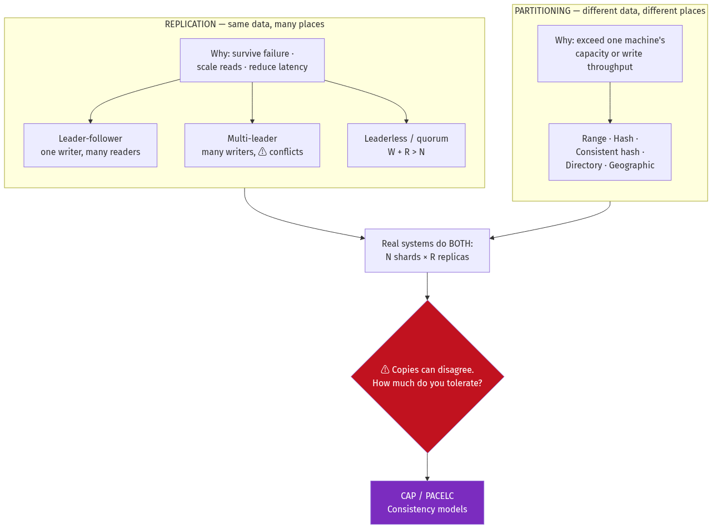

<details>
<summary>Diagram source (Mermaid)</summary>

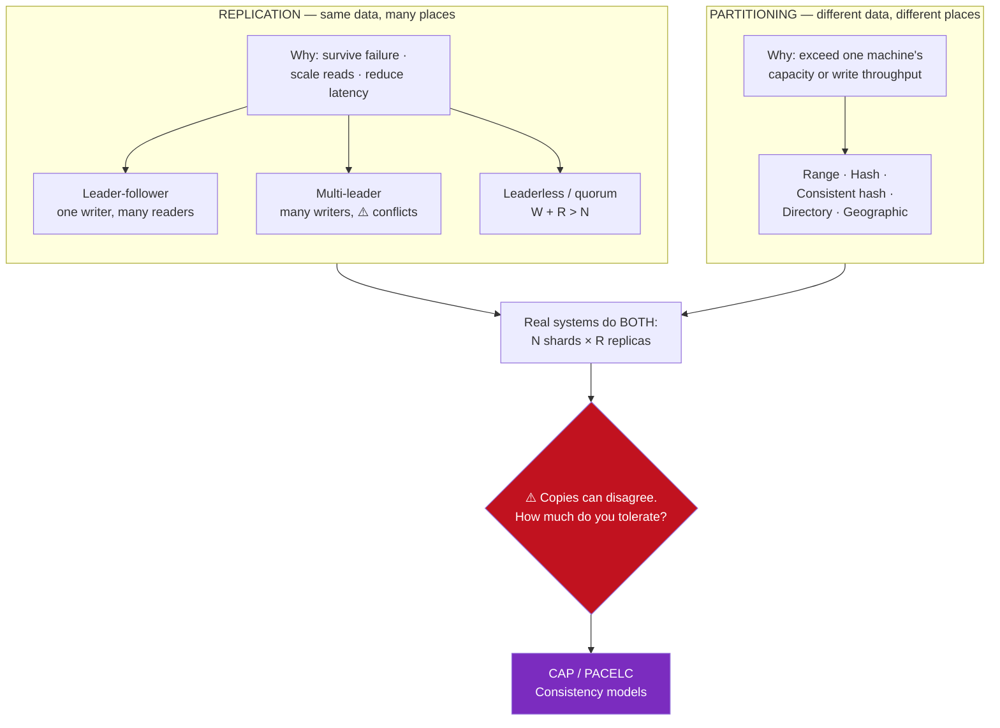

</details>

---

## Deep dive

### 9.1 Three reasons to replicate — and they conflict

| Reason | What you want | Pushes you toward |
| --- | --- | --- |
| **Durability / availability** | Survive losing a machine or a datacentre | More replicas, spread widely |
| **Read scaling** | Serve reads from many machines | Many followers, async replication |
| **Latency / locality** | Serve users from a nearby copy | Replicas in every region |

⚠️ **These pull against each other.** Replicas spread across continents give you the best
availability and locality — and the worst write latency, because a synchronous write must
cross an ocean. Replicas in one rack give you fast writes and no protection against a rack
failure.

📐 **The cost of synchronous cross-region replication:**
```
Write to a local replica:               0.5 ms
Write acknowledged by a replica 100 ms away: 100 ms   ← 200× slower
```
That 200× is why almost every geo-distributed system replicates **asynchronously** across
regions and **synchronously** within one — and why `LOCAL_QUORUM`
([Chapter 8](./08_nosql_and_polyglot_persistence.md) §8.3) is the standard Cassandra setting.

### 9.2 Leader-follower replication

One node accepts writes (the **leader**, or primary). It streams its changes — in
PostgreSQL, literally the WAL from [Chapter 6](./06_storage_engines_internals.md) §6.7 — to
**followers**, which apply them and serve reads.

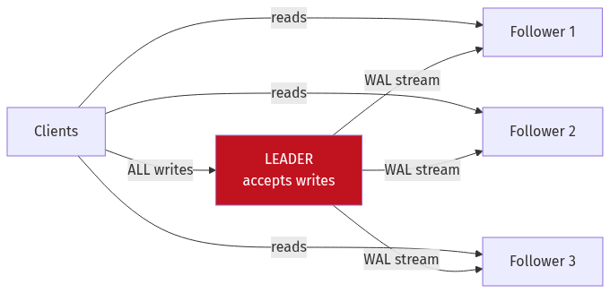

<details>
<summary>Diagram source (Mermaid)</summary>

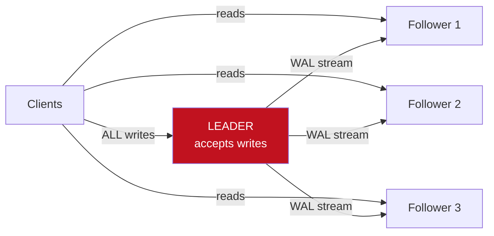

</details>

#### Synchronous, asynchronous, semi-synchronous

| Mode | Leader waits for | Write latency | On leader failure |
| --- | --- | --- | --- |
| **Async** | Nothing — commits locally, streams later | Fast (local fsync only) | ⚠️ **Committed writes can be lost** |
| **Sync (all)** | Every follower to acknowledge | Slowest; ⚠️ one slow follower blocks all writes | No data loss |
| **Semi-sync** | **At least one** follower | Slower than async, bounded | No loss if that follower survives |

💡 **Semi-synchronous is what production systems actually use.** One synchronous replica gives
you durability against leader loss; the rest are asynchronous so a slow or dead follower can't
stall writes.

```
# PostgreSQL
synchronous_commit = on
synchronous_standby_names = 'ANY 1 (replica_a, replica_b, replica_c)'
```

⚠️ **A subtle and dangerous PostgreSQL behaviour:** if `synchronous_standby_names` is set and
*no* listed standby is connected, the leader **blocks all commits indefinitely**, waiting for
an acknowledgement that will never come. The database appears hung with no errors. `ANY 1 (…)`
with several candidates mitigates this; monitoring `pg_stat_replication` for connected
standbys is essential.

#### Types of replication stream

| Type | Ships | Pros | Cons |
| --- | --- | --- | --- |
| **Statement-based** | The SQL text | Compact | ⚠️ Breaks on `now()`, `random()`, triggers, non-deterministic functions |
| **Physical / WAL** | Byte-level page changes | Exact, cheap to apply | Replica must be the same version and architecture; whole-cluster only |
| **Logical / row-based** | The rows that changed | Version-independent, selective, filterable | Larger stream; needs a replica identity |

💡 **Logical replication is what unlocks CDC.** Decoding the WAL into row-level change events
is exactly what Debezium does, and it's how you feed Elasticsearch, ClickHouse and Kafka from
your source of truth without dual writes
([Chapter 8](./08_nosql_and_polyglot_persistence.md) §8.8).

#### Failover, and the ways it goes wrong

When the leader dies, a follower must be promoted. The steps are simple; each one has a
failure mode.

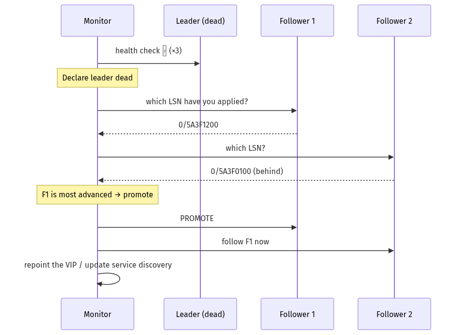

<details>
<summary>Diagram source (Mermaid)</summary>

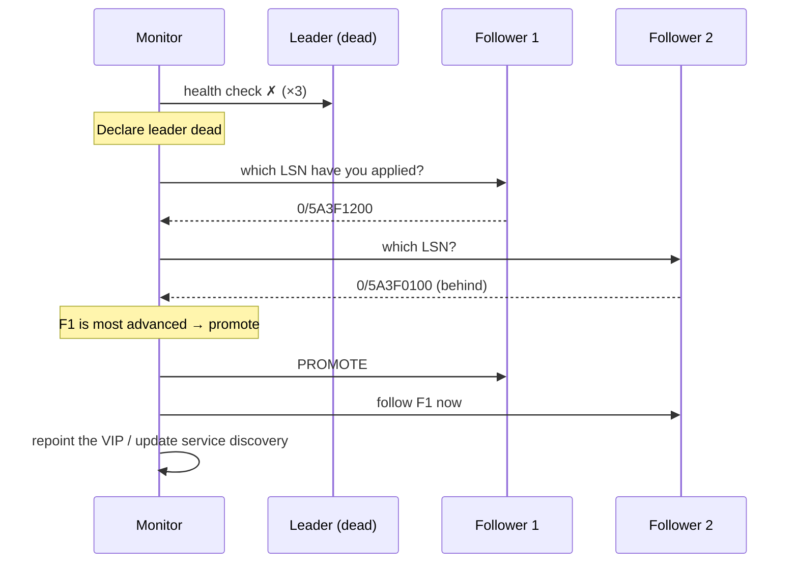

</details>

⚠️ **Four failure modes, all of which have caused real outages:**

**1. Lost writes.** With async replication, writes the leader acknowledged but hadn't shipped
are gone. If the old leader later rejoins, those writes may reappear — or be discarded — and
if the new leader has since reused the same primary keys, you get **silent data corruption**.
GitHub published an incident where exactly this happened, with Redis keys reused after a
promotion.

**2. Split brain.** The old leader isn't dead, just unreachable. Now two nodes accept writes.
Prevention requires **fencing** — STONITH, a quorum-based decision, or storage-level fencing
([Chapter 21](./21_distributed_systems_theory_consensus.md)).

**3. Wrong timeout.** Too short and a GC pause or a network blip triggers an unnecessary
failover — which, under load, causes exactly the pause that triggers the next one. Too long
and you extend the outage. There is no correct value, only a chosen trade.

**4. Cascading load.** The new leader starts with a **cold cache**
([Chapter 6](./06_storage_engines_internals.md) §6.3). Its buffer-pool hit rate is 0%, every
read hits disk, and it may be unable to serve production load at all — so it appears unhealthy
and gets failed over again.

### 9.3 📐 Replication lag and the four anomalies

Async replication means followers are behind. Usually milliseconds; under load, seconds or
minutes. Each of the following is a real bug users report.

#### Anomaly 1 — Read-your-writes violation

```
User posts a comment  → leader
User reloads the page → follower (hasn't received it yet)
"My comment disappeared!"
```

**Fixes, in order of preference:**

| Fix | How | Cost |
| --- | --- | --- |
| Read from the leader after a write | For N seconds after any write by this user, route their reads to the leader | Leader load |
| Read from the leader for *their own* data | Route reads of objects the user can edit to the leader | Needs ownership knowledge |
| **Wait for the LSN** | Client remembers the write's log position; the follower waits until it has applied at least that | ✅ Precise; adds latency only when needed |
| Client-side echo | Render the write optimistically from local state | Doesn't fix the underlying read |

💡 **The LSN approach is the correct one** and is under-used. The leader returns the commit
LSN; the client passes it on subsequent reads; the follower blocks (briefly) until caught up.
PostgreSQL exposes this as `pg_current_wal_lsn()` / `pg_last_wal_replay_lsn()`; MySQL has
`MASTER_POS_WAIT()`. This is sometimes called a **causal token** or **session token**.

#### Anomaly 2 — Monotonic reads violation

```
Read 1 → follower A (up to date):  "12 comments"
Read 2 → follower B (lagging):     "9 comments"
Time appears to move BACKWARDS.
```
**Fix:** route a given user consistently to the same replica — hash the user ID to a replica
rather than picking randomly. ⚠️ If that replica fails you must re-pin, and the user may see
time jump once.

#### Anomaly 3 — Consistent prefix violation

```
Actual order:  Alice: "How long until dinner?"
               Bob:   "About ten minutes"

Observer sees: Bob:   "About ten minutes"
               Alice: "How long until dinner?"
```
Causality is violated — the answer arrives before the question. This happens when related
writes go to **different partitions** replicating at different speeds.
**Fix:** keep causally-related writes in the same partition, or track causal dependencies
explicitly (vector clocks, [Chapter 21](./21_distributed_systems_theory_consensus.md)).

#### Anomaly 4 — Stale reads after failover

A follower promoted while behind silently loses the writes it never received. This is
anomaly 1 made permanent.

📐 **Monitoring lag — measure the right thing:**
```sql
-- ⚠️ Bytes behind tells you volume, not user impact:
SELECT pg_wal_lsn_diff(pg_current_wal_lsn(), replay_lsn) AS bytes_behind
FROM pg_stat_replication;

-- ✅ Time behind is what users experience:
SELECT now() - pg_last_xact_replay_timestamp() AS lag_seconds;  -- on the replica
```
⚠️ On an idle system `lag_seconds` grows even though the replica is perfectly caught up —
there simply are no new transactions. Alert on lag **combined with** write activity.

### 9.4 Multi-leader replication

Several nodes accept writes and replicate to each other.

**When it's genuinely justified:**
- **Multi-datacentre with local writes** — users write to their nearest region
- **Offline-capable clients** — a phone is effectively a leader that syncs later
- **Collaborative editing** — every browser is a replica accepting local edits

⚠️ **The price is write conflicts**, which simply do not exist in single-leader replication.

```
DC-East:  UPDATE title = "A"  at t=100
DC-West:  UPDATE title = "B"  at t=100
Both succeed locally. They replicate. Now what?
```

#### Conflict resolution strategies

| Strategy | Mechanism | ⚠️ Problem |
| --- | --- | --- |
| **Last Write Wins (LWW)** | Highest timestamp wins | **Silently discards data**, and depends on clock sync |
| Highest node ID | Deterministic tiebreak | Arbitrary; also loses data |
| **Merge / union** | Keep both (e.g. union the shopping carts) | Domain-specific; can resurrect deletes |
| **CRDTs** | Data types that merge deterministically by construction | Limited to expressible types ([Ch 21](./21_distributed_systems_theory_consensus.md)) |
| **Application resolution** | Store both versions; ask the user or a rule | Complexity pushed to the app |
| **Avoid conflicts** | Route all writes for a given key to one region | ✅ Usually the right answer |

⚠️ **LWW is the default in Cassandra and many other systems, and it loses data by design.**
Two concurrent writes: one wins, one vanishes, with no error. Worse, "highest timestamp"
depends on clocks agreeing — and NTP-synchronised clocks routinely differ by tens of
milliseconds ([Chapter 21](./21_distributed_systems_theory_consensus.md) §clocks). A write
that happened *later* in real time can lose.

💡 **The best conflict resolution is not having conflicts.** Partition writes by key so each
key has a single home region. You keep local reads everywhere, and writes for a key always go
to one place. Most "multi-leader" systems in production are really this.

### 9.5 Leaderless replication and quorums

The Dynamo model ([Chapter 8](./08_nosql_and_polyglot_persistence.md)): no leader. The client
(or a coordinator on its behalf) writes to several replicas and reads from several.

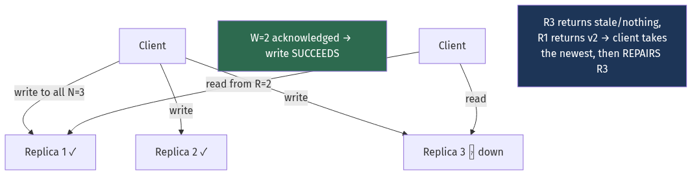

<details>
<summary>Diagram source (Mermaid)</summary>

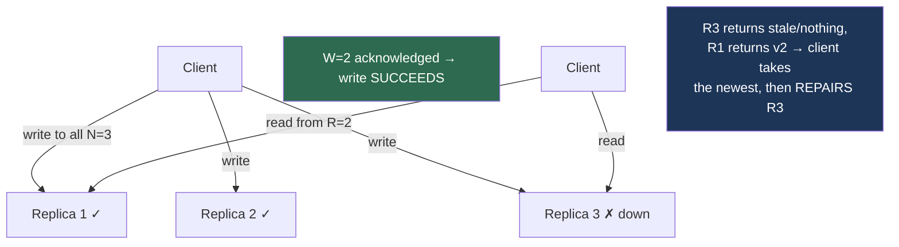

</details>

#### 📐 Why `W + R > N` works

The proof is a one-line pigeonhole argument, and it's worth being able to state:

> A write goes to `W` replicas. A read contacts `R` replicas. If `W + R > N`, then the write
> set and the read set **must** overlap in at least one replica — there aren't enough replicas
> for them to be disjoint. That overlapping replica has the latest value, and versioning tells
> the reader which value that is.

| N | W | R | W+R > N? | Character |
| --- | --- | --- | --- | --- |
| 3 | 1 | 1 | ❌ 2 ≤ 3 | Fastest, eventually consistent |
| 3 | 2 | 2 | ✅ 4 > 3 | **Balanced — the standard choice** |
| 3 | 3 | 1 | ✅ 4 > 3 | Fast reads; ⚠️ any node down blocks writes |
| 3 | 1 | 3 | ✅ 4 > 3 | Fast writes; ⚠️ any node down blocks reads |
| 5 | 3 | 3 | ✅ 6 > 5 | Tolerates 2 failures |

📐 **Failure tolerance:** with `W = R = ⌊N/2⌋ + 1` you tolerate `⌊(N−1)/2⌋` replica failures
while keeping strong consistency.

#### ⚠️ Sloppy quorums — the fine print

When some of the "home" replicas for a key are unreachable, Dynamo-style systems don't
necessarily fail the write. They write to **any** `W` available nodes — including nodes that
don't normally own that key.

```
Key K normally lives on nodes {A, B, C}.
A and B are unreachable.
Sloppy quorum: write to {C, D, E} instead.  Write "succeeds" with W=3.
```

⚠️ **`W + R > N` no longer guarantees anything.** A subsequent read of {A, B, C} may contact
only nodes that never received the write. Sloppy quorums buy **availability** and give up the
overlap guarantee — which is a legitimate trade, but you must know you made it.

**Hinted handoff** is the repair: node D remembers that it holds data belonging to A, and
hands it over when A returns.

#### Keeping replicas converged

Three mechanisms, operating on different timescales:

| Mechanism | When | How |
| --- | --- | --- |
| **Read repair** | On every read | If replicas disagree, write the newest value back to the stale ones. ✅ Free, but only fixes data that is read. |
| **Hinted handoff** | After a node returns | Deliver writes buffered on its behalf |
| **Anti-entropy repair** | Scheduled (weekly) | Compare full datasets via **Merkle trees** and fix all divergence |

⚠️ **Read repair alone is not enough.** Rarely-read data never gets repaired, and in Cassandra
that interacts fatally with tombstones: if a delete isn't propagated within
`gc_grace_seconds` (default 10 days) and the tombstone is then garbage-collected, the **deleted
data resurrects** from the replica that never heard about the delete. This is why scheduled
repair (`nodetool repair`) within the grace period is mandatory operational hygiene, not
optional tuning.

#### Merkle trees

Comparing two 500 GB replicas byte by byte is impossible. A **Merkle tree** hashes the data
hierarchically so you can find the differences in `O(log n)` comparisons.

```
                    ROOT hash
                   /         \
            hash(L)           hash(R)
            /    \            /     \
       h(A)      h(B)     h(C)      h(D)
        |         |        |         |
    [range A] [range B] [range C] [range D]
```

```
Compare roots:          equal → done, zero further work
                        differ → descend
Compare children:       find which subtree differs
Recurse to the leaf:    exchange only that key range
```
📐 Finding one differing key among a million requires ~20 hash comparisons instead of a million
key comparisons. Used by Cassandra, DynamoDB, Riak, Git and blockchains.

### 9.6 Partitioning strategies

| Strategy | Assignment | ✅ | ⚠️ |
| --- | --- | --- | --- |
| **Range** | Ordered key ranges | Efficient range scans | **Hotspots** — sequential keys all hit the last shard |
| **Hash** | `hash(key) mod N` | Even distribution | No range scans; **resharding moves ~all keys** |
| **Consistent hash** | Position on a ring | Even + only `1/N` keys move on change | Slightly more complex |
| **Directory** | Explicit lookup table | Maximum flexibility, easy rebalancing | The directory is a dependency and a SPOF |
| **Geographic** | By region | Locality, data-residency compliance | Uneven population; cross-region queries |

📐 **Why plain modulo hashing is unusable at scale:**
```
hash(key) mod 4  →  hash(key) mod 5
A key maps to the same shard only when h mod 4 == h mod 5.
Across a uniform key space that's roughly 1 in 20.
→ ~95% of all keys must move.
```
For a cache, that's a total cache flush and a database stampede. For a database, it's a full
data migration to add one node. **Consistent hashing** ([Chapter 23](./23_building_blocks_and_algorithms.md))
reduces this to `1/N`.

💡 **Most production systems use a fourth option: fixed logical partitions.** Create far more
partitions than machines — say 1,024 — and assign partitions to machines via a directory.
Adding a machine moves whole partitions, never individual keys.

```
1,024 logical partitions across 8 machines = 128 partitions each
Add a 9th machine → move 114 partitions (1,024/9 − 1,024/8 rebalanced)
No key ever changes its partition. Only partitions change machines.
```
This is exactly Instagram's approach ([Chapter 2](./02_scalability_and_estimation.md) §2.8),
and it's what Kafka, Elasticsearch and Riak do.

### 9.7 🎯 Choosing a shard key

**This is the highest-consequence decision in a distributed database**, and it is very
expensive to change.

**A good shard key has four properties:**

| Property | Why | Bad example |
| --- | --- | --- |
| **High cardinality** | Enough distinct values to spread across shards | `country` — 200 values, and 40% are one |
| **Even distribution** | No value dominates | `status` — 95% are `'active'` |
| **Query-aligned** | Your common queries include it | Sharding by `created_at` when you query by `user_id` |
| **Immutable** | Changing it means moving the row between shards | `email`, `team_id` |

⚠️ **Never shard by a monotonically increasing key** (`created_at`, auto-increment ID) with
range partitioning. Every new write goes to the last shard while the rest idle. This is the
single most common sharding mistake.

**Real choices and their reasoning:**

| Company | Shard key | Why it works |
| --- | --- | --- |
| **Instagram** | `user_id` | All of a user's data co-locates; the dominant query is "this user's posts" |
| **Discord** | `(channel_id, time_bucket)` | Query is always "this channel's recent messages"; bucket bounds the partition |
| **Notion** | `workspace_id` | A workspace is a natural isolation boundary; queries never cross workspaces |
| **Slack** | `team_id` | Same reasoning — the tenant is the boundary |
| **Uber** | Custom (Schemaless over MySQL) | Trip data keyed by trip UUID; no cross-trip queries |

💡 **The pattern:** in a multi-tenant system, **shard by tenant**. Queries almost never cross
tenants, so almost every query hits one shard.

⚠️ **The exception that breaks it:** one enormous tenant. If a single workspace is 30% of your
data, sharding by workspace gives you a shard 30% of the total size. Mitigations: a
**composite key** (`(workspace_id, sub_bucket)`) for large tenants only, or moving giant
tenants onto dedicated infrastructure — which is what most multi-tenant SaaS eventually does.

**Composite keys buy you a middle ground:**
```
Shard key: (user_id, month)
  ✅ Bounded partitions
  ✅ "This user this month" hits one shard
  ⚠️ "This user, all time" now fans out across months
```

### 9.8 Hotspots

Even a well-chosen key can develop a hotspot when one value goes viral.

📐 **The arithmetic:**
```
16 shards, uniform traffic: each handles 6.25%
One celebrity account = 30% of reads:
  That shard handles 30% + (70%/16) = 34.4%
  = 5.5× the average → it saturates while 15 shards idle
```

**Mitigations:**

| Technique | How | Cost |
| --- | --- | --- |
| **Key salting** | `hot_key#0` … `hot_key#9` across 10 shards | ⚠️ Reads must query all 10 and merge |
| **Cache the hot key** | Redis, or an in-process L1 cache | Staleness; only helps reads |
| **Dedicated shard** | Move the hot tenant to its own machines | Operational complexity |
| **Split the partition** | Halve the range around the hot key | Only helps range partitioning |
| **Read replicas for that shard** | Extra copies of just the hot partition | Only helps reads |

💡 **Salt selectively.** Salting every key makes every read a fan-out. The right design detects
hot keys at runtime and salts only those — DynamoDB's adaptive capacity does this
automatically, and it's why hot-key handling improved dramatically after 2019.

### 9.9 Resharding a live system

The technique that separates "I've read about sharding" from "I've done it."

⚠️ **You cannot stop writes.** You cannot lose data. You cannot serve wrong data. The
migration takes hours or days.

**The double-write and backfill pattern:**

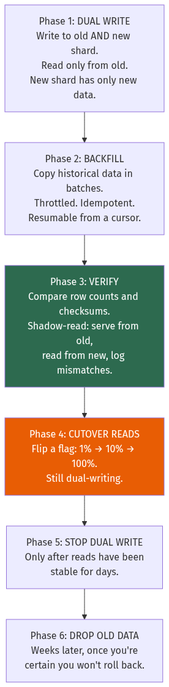

<details>
<summary>Diagram source (Mermaid)</summary>

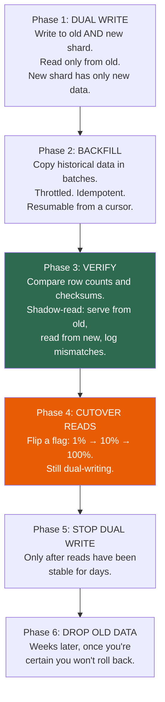

</details>

**The details that matter:**

**Backfill must be idempotent and resumable.** It will fail partway — a network blip, a
deploy, a full disk. Use upserts keyed by the primary key, and record a cursor so you restart
where you stopped rather than from the beginning.

**Throttle the backfill.** A backfill at full speed saturates the source's disk and inflates
replication lag, which breaks production reads. Rate-limit it and — better — make it
**adaptive**: monitor replica lag and pause when it exceeds a threshold. `gh-ost`
([Chapter 7](./07_relational_databases_and_transactions.md)) does exactly this.

⚠️ **The ordering hazard.** During dual-write, a row is written to the new shard, then the
backfill copies the *older* version over it. **The backfill must not overwrite newer data** —
use a version or `updated_at` comparison, or backfill only rows whose key isn't already
present.

**Shadow reads are the verification that matters.** Serve the response from the old shard, but
also read from the new one and log any mismatch without affecting the user. Run this for days.
Row counts matching is necessary but nowhere near sufficient.

**Cutover must be reversible.** A feature flag with per-percentage control, so you can go back
to 0% in seconds. Do not cut over with a deploy.

### 9.10 Secondary indexes across shards

Sharding by `user_id` makes "find by `user_id`" fast. It makes "find by `email`" hard.

**Local (document-partitioned) index** — each shard indexes only its own rows.

```
Shard 1: index on email → {alice@x → user 5}
Shard 2: index on email → {bob@y   → user 900}

Query "email = alice@x": ⚠️ must ask EVERY shard. Scatter-gather.
```
- ✅ Writes touch one shard, so they stay cheap and atomic
- ⚠️ Reads fan out to all shards — and by [Chapter 3](./03_reliability_availability_performance.md)
  §3.10, your latency becomes the **slowest** shard's, not the average

**Global (term-partitioned) index** — the index itself is sharded by the indexed term.

```
Index shard A (emails a–m): {alice@x → user 5}
Index shard B (emails n–z): {bob@y   → user 900}

Query "email = alice@x": one lookup on index shard A, then fetch from the data shard.
```
- ✅ Reads hit one index shard
- ⚠️ **Writes now touch two shards** — the data shard and the index shard — which is a
  distributed transaction ([Chapter 10](./10_distributed_transactions_and_integrity.md))

💡 **This is why DynamoDB's Global Secondary Indexes are eventually consistent.** Keeping a
global index synchronously consistent with the data would require a distributed transaction on
every write. DynamoDB updates the index asynchronously instead — which is also why an
under-provisioned GSI throttles base-table writes
([Chapter 8](./08_nosql_and_polyglot_persistence.md) §8.4): the system won't let the index fall
arbitrarily behind.

📐 **When scatter-gather is acceptable:**
```
16 shards, per-shard P99 = 20 ms
Scatter-gather P99 ≈ the max of 16 samples ≈ the per-shard P99.9 ≈ 80 ms
At 8 shards it's ~50 ms. At 256 shards it's the P99.996 — potentially seconds.
```
**Rule of thumb: scatter-gather is fine up to tens of shards and unusable at hundreds.**

### 9.11 CAP, proved

**CAP:** in the presence of a network **P**artition, you must choose between **C**onsistency
and **A**vailability.

**The four-line proof:**
```
1. Nodes A and B both hold value X. The network between them fails.
2. A client writes X=2 to node A.
3. Another client reads X from node B.
4. Node B must either:
     (a) return X=1 — the stale value          → AVAILABLE, not consistent
     (b) refuse to answer until it reaches A   → CONSISTENT, not available
   There is no third option.
```

⚠️ **The most common misunderstanding:** "we chose AP" or "we chose CA."

- **P is not optional.** Networks partition. A "CA system" is one that has not thought about
  partitions, not one that has defeated them.
- **The choice only applies during a partition.** The rest of the time — which is almost all
  the time — you can have both.
- **It's per-operation, not per-system.** Cassandra with `QUORUM` is CP for that query and AP
  with `ONE`. The same database, different guarantees.

🎯 **In an interview, say "CP or AP *during a partition*, and it's a per-operation choice."**
That single qualification separates people who understand CAP from people who've memorised
the triangle.

### 9.12 PACELC — the version you should actually use

CAP only describes behaviour during a partition, which is rare. **PACELC** describes the rest
of the time too:

> **If P**artition: choose **A**vailability or **C**onsistency.
> **E**lse: choose **L**atency or **C**onsistency.

The `ELC` half is the one that governs your system 99.9% of the time, and CAP is silent on it.

| System | Classification | Meaning |
| --- | --- | --- |
| **DynamoDB** (default) | **PA/EL** | Available during partitions; prioritises latency normally |
| **DynamoDB** (strong reads) | **PC/EC** | Consistency both ways |
| **Cassandra** (`ONE`) | **PA/EL** | Fast and eventually consistent |
| **Cassandra** (`QUORUM`) | **PC/EC** | Consistent, slower |
| **MongoDB** (`w:majority`) | **PC/EC** | Consistent |
| **PostgreSQL** (sync replica) | **PC/EC** | Refuses writes rather than diverge |
| **PostgreSQL** (async replica) | **PC/EL** | Consistent on the leader; low-latency stale reads |
| **Google Spanner** | **PC/EC** | Consistent always — and pays for it in commit-wait |
| **CockroachDB** | **PC/EC** | Same |
| **Riak** | **PA/EL** | Always writeable |
| **ZooKeeper / etcd** | **PC/EC** | Refuses to serve without a quorum |

💡 **The `EL` column is where your latency budget goes.** Spanner is `EC` because it uses
TrueTime commit-wait — it deliberately *waits out* clock uncertainty (a few milliseconds) on
every write to guarantee external consistency. That's a real, permanent latency cost paid for
a real, permanent guarantee.

### 9.13 The consistency ladder

From strongest to weakest. Each level is cheaper and permits more anomalies.

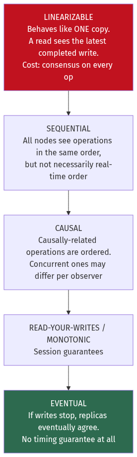

<details>
<summary>Diagram source (Mermaid)</summary>

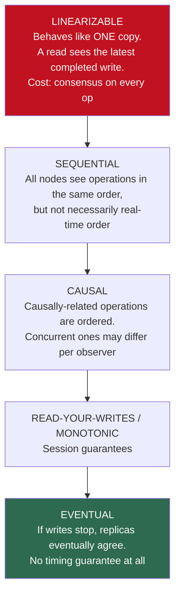

</details>

| Level | Guarantee | Cost | Example |
| --- | --- | --- | --- |
| **Linearizable** | Indistinguishable from a single copy; respects real time | Consensus per operation (~ms + quorum RTT) | etcd, ZooKeeper, Spanner |
| **Sequential** | Same order everywhere, not necessarily real-time | Cheaper — no global clock needed | ZooKeeper reads |
| **Causal** | "Happens-before" is respected | Track dependencies (vector clocks) | MongoDB causal sessions, COPS |
| **Read-your-writes** | You see your own writes | Session pinning or an LSN token | Most well-built web apps |
| **Monotonic reads** | Time never goes backwards for you | Sticky routing | Same |
| **Eventual** | Convergence, eventually | Almost free | DNS, S3 listings (historically), Cassandra `ONE` |

**When each is genuinely required:**

| Requirement | Minimum level | Why |
| --- | --- | --- |
| Distributed lock, leader election | **Linearizable** | Two leaders is catastrophic |
| Unique username / email | **Linearizable** | Two concurrent claims must not both win |
| Bank balance, inventory decrement | **Linearizable** for the check-and-set | Overselling is real money |
| "Did my comment post?" | Read-your-writes | Only this user's perception matters |
| Chat message ordering | Causal | Replies must not precede questions |
| Like counts, view counts | Eventual | Nobody notices or cares |
| DNS, CDN cache | Eventual | Convergence within a TTL is the design |

⚠️ **Uniqueness genuinely requires linearizability**, and this is under-appreciated. In an
eventually-consistent store, two nodes can each accept "register alice@example.com" during a
partition and both succeed. There is no version of quorum tuning that fixes this — you need
consensus, which is why systems with eventually-consistent primary storage still keep a
strongly-consistent store (Postgres, etcd, ZooKeeper) for uniqueness constraints.

---

## Worked example — sharding a multi-tenant SaaS

*A project-management SaaS. 50,000 organisations, 8 million users, 2 billion tasks. The
largest organisation has 200,000 users and 400 million tasks — 20% of everything. Queries are
almost always scoped to an organisation. Global search across all tasks is needed for
administrators. Design the sharding and replication.*

**Step 1 — Establish the constraint.**
```
2 billion tasks × 2 KB = 4 TB of task data
Plus indexes (~40%) = 5.6 TB
Write rate: 20,000 tasks/second at peak
```
📐 A single PostgreSQL primary does 1,000–10,000 write transactions/second
([Chapter 6](./06_storage_engines_internals.md) §6.2, fsync-bound). **20,000/s exceeds one
node.** Sharding is required — this is the number that justifies the complexity.

**Step 2 — Choose the shard key.**

Test `org_id` against the four properties from §9.7:

| Property | `org_id` | Verdict |
| --- | --- | --- |
| High cardinality | 50,000 distinct values | ✅ |
| Even distribution | ⚠️ One org is 20% of data | ❌ **Fails** |
| Query-aligned | Nearly all queries are org-scoped | ✅✅ |
| Immutable | An org never changes its ID | ✅ |

Three out of four. The distribution failure is the problem — and it's the classic
multi-tenant one.

**Step 3 — Handle the whale tenant.**

Options:
```
(a) Shard by (org_id, project_id) for everyone
    ⚠️ Breaks org-wide queries — they now fan out across all projects.

(b) Shard by org_id, put the whale on dedicated shards
    ✅ Small orgs keep single-shard queries.
    ✅ The whale gets its own capacity, isolated from noisy neighbours.
    ⚠️ Requires a directory that can route per-org.

(c) Shard by user_id
    ❌ Org-wide queries would fan out to every shard. Worst option.
```

**Choose (b)** — and note this is what Salesforce, Slack, Notion and most mature multi-tenant
SaaS converge on. Very large tenants get dedicated infrastructure; it's a product tier as
much as an architecture.

**Step 4 — Use logical partitions, not physical ones.**

```
1,024 logical partitions.  partition = hash(org_id) mod 1024
Directory table maps partition → physical shard.

Initial layout:
  Partitions 0–1023 (49,999 normal orgs) → 16 physical shards, 64 partitions each
  Whale org                              → 4 dedicated shards, keyed by project_id
```

📐 **Why 1,024 and not 16:**
```
Adding a 17th shard with 16 physical partitions: rehash everything. ❌
Adding a 17th shard with 1,024 logical partitions:
  move 1024/17 = 60 partitions ≈ 6% of data. ✅
No key ever changes partition. Only partitions move.
```

**Step 5 — Size the shards.**
```
Normal orgs: 4 TB × 80% = 3.2 TB over 16 shards = 200 GB each ✅
Whale:       4 TB × 20% = 800 GB over 4 shards  = 200 GB each ✅
Writes:      20,000/s × 80% = 16,000/s over 16 shards = 1,000/s each ✅
             (well within a single Postgres primary's capability)
```

**Step 6 — Replication per shard.**
```
Each shard: 1 leader + 2 followers
  1 SYNCHRONOUS follower in another AZ  → no data loss on leader failure
  1 ASYNCHRONOUS follower               → read scaling, and a slow follower can't stall writes

synchronous_standby_names = 'ANY 1 (replica_az2, replica_az3)'
```
📐 Availability per shard ([Chapter 3](./03_reliability_availability_performance.md) §3.3):
```
Leader alone:            99.9%
With automatic failover to a sync replica, MTTR 30 s instead of 1 h:
  720/(720 + 0.0083) = 99.9988%
Across 20 shards IN SERIES (a request may touch any one):
  0.999988^20 = 99.976%   ⚠️ sharding REDUCES availability
```
⚠️ **This is important and rarely stated: sharding multiplies your failure surface.** With 20
shards, a request that touches any shard is only as available as the product. Mitigation:
ensure most requests touch exactly one shard (which the `org_id` key achieves), so a single
shard's failure affects only 1/20 of tenants rather than everyone.

**Step 7 — Global search for administrators.**

⚠️ Scatter-gather across 20 shards for admin search: per §9.10, P99 becomes the P99.95 of a
single shard — hundreds of milliseconds, and it loads every shard.

**Instead, build a derived global index:**
```
Postgres (all shards) → CDC/Debezium → Kafka → Elasticsearch
Admin search queries Elasticsearch only. One system, one query.
⚠️ Eventually consistent (seconds behind) — acceptable for admin search.
✅ Rebuildable from the source of truth if lost.
```
This is [Chapter 8](./08_nosql_and_polyglot_persistence.md) §8.8's "one source of truth,
everything else derived."

**Step 8 — Uniqueness constraints.**

⚠️ "Email must be unique across all organisations" cannot be enforced per-shard — shard 3
doesn't know what shard 11 contains.

```
Solution: a small, unsharded PostgreSQL "identity" database holding
          (email → user_id, org_id) with a UNIQUE constraint.
          Registration writes there first, then to the shard.
Volume: 8M rows, trivial. Linearizable because it's a single node.
```
💡 Per §9.13, **uniqueness requires linearizability**. You cannot get it from a sharded or
eventually-consistent store. A tiny strongly-consistent service for exactly this purpose is
the standard pattern.

**Step 9 — The resulting design.**

| Concern | Decision | Justification |
| --- | --- | --- |
| Shard key | `org_id` → 1,024 logical partitions | Query-aligned; logical partitions make rebalancing cheap |
| Whale tenant | Dedicated shards, sub-sharded by `project_id` | 20% of data on one shard would be unmanageable |
| Physical shards | 16 shared + 4 dedicated | 200 GB and 1,000 writes/s each — comfortable |
| Replication | 1 sync + 1 async per shard | No data loss on failover; a slow follower can't stall writes |
| Rebalancing | Directory maps partition → shard | Move partitions, never keys |
| Global search | Elasticsearch via CDC | Avoids 20-way scatter-gather |
| Uniqueness | Separate unsharded identity DB | Requires linearizability |
| Consistency | Read-your-writes via LSN token | Users must see their own task edits |

---

## Trade-offs

| Decision | Option A | Option B | Choose A when | Never choose A when |
| --- | --- | --- | --- | --- |
| Replication | Synchronous | Asynchronous | Zero data loss is required | Cross-region — 100 ms per write is fatal |
| Replication | Sync to all | Semi-sync (any 1) | You need every replica current | Always prefer B — one slow follower shouldn't stall writes |
| Topology | Single-leader | Multi-leader | Almost always — no conflicts | Local writes in multiple regions are a hard requirement |
| Topology | Single-leader | Leaderless (quorum) | You want simple reasoning and transactions | You need writes to survive losing the leader instantly |
| Conflict resolution | Last-write-wins | CRDT / app merge | Data loss on conflict is acceptable | ⚠️ Ever, for data you can't recreate |
| Consistency (quorum) | `W=1, R=1` | `W=quorum, R=quorum` | Analytics, counters, tolerant of staleness | User-visible reads after writes |
| Partitioning | Range | Hash | Range scans are the dominant query | The key is monotonic — guaranteed hotspot |
| Partitioning | Physical shards | Logical partitions + directory | Never, past a handful of shards | Prefer B — rebalancing becomes tractable |
| Shard key | Single column | Composite `(entity, bucket)` | Partitions are naturally bounded | Unbounded growth per entity |
| Secondary index | Local (scatter-gather) | Global (term-partitioned) | Few shards (< ~20); writes must stay cheap | Hundreds of shards — tail latency destroys you |
| Multi-tenant whale | Same shards as everyone | Dedicated shards | Tenant sizes are within ~5× of each other | One tenant exceeds ~10% of total |
| Consistency model | Eventual | Linearizable | Counters, feeds, likes | Uniqueness, locks, balances, inventory |

---

## How real companies do it

**Instagram** shards PostgreSQL by `user_id` into **thousands of logical schemas** spread over
a much smaller number of physical machines. Growth means moving schemas between machines
rather than re-sharding data — the §9.6 logical-partition pattern, adopted early and credited
by their engineers with making later scaling routine rather than heroic.

**Figma** published a detailed 2024 account of sharding PostgreSQL. Two details worth stealing:
they built **logical sharding first** — adding shard keys and routing while all data still
lived on one physical database — so the risky application changes were validated before any
data moved. And they used **"colos"** (colocation groups) so related tables sharded by the
same key stay together and joins remain single-shard.

**Notion**'s 2021 sharding post describes moving from one Postgres instance to 480 logical
shards across 32 physical databases, keyed by workspace. Their reported downtime for the
cutover was about five minutes — achieved with the dual-write, backfill, verify, flip sequence
from §9.9, including an audit script comparing old and new for days beforehand.

**Slack** shards by `team_id` and has written about the whale-tenant problem directly: a small
number of very large customers required dedicated capacity, exactly as in the worked example.

**Amazon DynamoDB**'s 2022 USENIX paper describes how adaptive capacity evolved specifically
to handle hot partitions (§9.8) — early DynamoDB divided provisioned throughput evenly across
partitions, so a hot key throttled even when the table was mostly idle. The fix was to let
partitions borrow capacity and to split partitions around hot keys automatically.

**GitHub**'s 2018 incident report is the canonical failover cautionary tale: a 43-second
network partition triggered an automated failover, the old primary had accepted writes that
weren't replicated, and reconciling the two histories took **24 hours** of degraded service.
It's the best public illustration of §9.2's "lost writes" failure mode.

---

## Common mistakes

**Sharding by a monotonically increasing key with range partitioning.** All writes land on the
last shard. Hash the key, or bucket it.

**Assuming `W + R > N` still holds under a sloppy quorum.** When writes go to substitute
nodes, the overlap guarantee is gone. Know which mode your system is in.

**Relying on read repair alone.** Rarely-read data never converges, and in Cassandra that
combines with `gc_grace_seconds` to **resurrect deleted data**. Run scheduled repair.

**Using last-write-wins for data you can't recreate.** It discards writes silently, and it
depends on clocks that disagree by tens of milliseconds.

**Reading from an async replica in a read-your-writes path.** Users don't see their own
changes. Use the leader, or wait for the LSN.

**Failing over to a cold replica under full load.** Its buffer-pool hit rate is 0%; it may not
be able to serve production traffic at all, and gets failed over again.

**Setting `synchronous_standby_names` without monitoring standby connectivity.** If no listed
standby is connected, PostgreSQL blocks all commits indefinitely with no error.

**Alerting on replication lag in bytes.** Users experience seconds, not bytes. And on an idle
system time-based lag grows spuriously — combine it with write activity.

**Scatter-gather across hundreds of shards.** Your latency becomes the slowest shard's. Build
a derived global index instead.

**Trying to enforce uniqueness in an eventually-consistent store.** It cannot work. Use a
small linearizable service.

**Resharding without shadow reads.** Matching row counts proves almost nothing. Serve from the
old store while comparing against the new for days.

**Backfilling without throttling.** It saturates the source and inflates replication lag,
breaking production reads. Make it adaptive to lag.

**Forgetting that sharding reduces availability.** 20 shards in series multiplies failure
probability. Ensure requests touch one shard so failures are partial, not total.

**Saying "we chose CA."** P is not optional. And the choice is per-operation, during a
partition only.

---

## Interview angle

**Q: Explain CAP, and what people get wrong about it.**

*Weak:* "You can only have two of consistency, availability and partition tolerance."

*Strong:* "The precise statement is: **during a network partition**, you must choose between
consistency and availability. The proof is four lines — nodes A and B hold X, the link fails,
a client writes to A, another reads from B, and B either returns the stale value (available,
inconsistent) or refuses to answer (consistent, unavailable). There's no third option. What
people get wrong is threefold. First, **P isn't optional** — networks partition, so a 'CA
system' is one that hasn't considered partitions, not one that's beaten them. Second, the
choice **only applies during a partition**, which is rare; the rest of the time you can have
both. Third, it's **per-operation, not per-system** — Cassandra with `QUORUM` is CP for that
query and AP with `ONE`. That's why I'd actually reason with **PACELC**: during a partition,
A or C; **else**, latency or consistency. The 'else' branch governs your system 99.9% of the
time and CAP says nothing about it."

**Q: Why does `W + R > N` give you strong consistency?**

*Strong:* "Pigeonhole. A write goes to W replicas, a read contacts R. If W + R exceeds N,
there aren't enough replicas for those two sets to be disjoint, so they must overlap in at
least one node — and that node has the latest value. Versioning tells the reader which of the
returned values is newest. Concretely with N=3, W=2, R=2: 4 > 3, so any read touches at least
one replica that saw the write. **But** there's important fine print: this assumes a strict
quorum. Dynamo-style systems often use a **sloppy quorum**, where if the home replicas are
unreachable the write goes to *any* W available nodes. The write reports success, but a later
read of the home replicas may contact only nodes that never saw it — so the overlap guarantee
is gone. Sloppy quorums trade the guarantee for availability, and hinted handoff repairs it
later. It's a legitimate trade, but you should know you made it."

**Q: A user posts a comment and doesn't see it on refresh. What's happening and how do you fix it?**

*Strong:* "Read-your-writes violation from replication lag. The write went to the leader; the
refresh read from a follower that hadn't applied it yet. Four fixes, in increasing quality.
The crude one is to route all reads to the leader for N seconds after a write, which works but
loads the leader. Better is to route reads of objects the user *can edit* to the leader.
Better still — and this is the one I'd implement — is an **LSN token**: the leader returns the
commit log position, the client passes it back on the next read, and the follower waits until
it's applied at least that position. That's precise, it only adds latency when the replica is
genuinely behind, and Postgres and MySQL both expose the primitives. Worth noting there are
three sibling anomalies from the same cause: **monotonic reads** violations where time appears
to go backwards, fixed by pinning a user to one replica; **consistent prefix** violations
where an answer appears before the question, fixed by keeping causally-related writes in one
partition; and permanent loss if you fail over to a lagging replica."

**Q: How do you choose a shard key?**

*Strong:* "Four properties: high cardinality, even distribution, query-alignment, and
immutability. Query-alignment matters most — if the common query doesn't include the shard
key, every query becomes a scatter-gather and you've made things worse. For a multi-tenant
system the answer is almost always **shard by tenant**, because queries essentially never
cross tenants, so nearly every query hits one shard. The thing that breaks that, and it breaks
it every time at scale, is the **whale tenant** — if one customer is 20% of your data,
tenant-sharding gives you one shard that's 20% of the total. The standard fix is dedicated
shards for large tenants, which is what Slack, Notion and Salesforce all converged on. And
regardless of key, I'd shard into **logical partitions** — say 1,024 — mapped to physical
machines through a directory, so adding a machine moves whole partitions rather than rehashing
keys. Modulo hashing moves about 95% of keys when N changes; logical partitions move 1/N."

**Q: How would you reshard a live database with no downtime?**

*Strong:* "Six phases, and the discipline is in the verification. **Dual-write** first — write
to both old and new, read only from old, so the new shard accumulates fresh data while
production is unaffected. **Backfill** the history in throttled, idempotent, resumable batches;
it *will* fail partway, so it needs a cursor, and it must be adaptive to replication lag or
it'll saturate the source and break production reads. Critically, the backfill must not
overwrite newer dual-written data — compare `updated_at` or skip existing keys. **Verify** with
**shadow reads**: serve from the old store, but also read the new one and log mismatches
without affecting users. Run that for days; matching row counts proves almost nothing.
**Cut over reads** behind a percentage flag — 1%, 10%, 100% — so you can revert in seconds
rather than needing a deploy. **Stop dual-writing** only after reads have been stable for days.
**Drop the old data** weeks later. The whole design principle is that every step is reversible
until the last one."

**Q: Why are global secondary indexes eventually consistent?**

*Strong:* "Because keeping them strongly consistent would require a distributed transaction on
every write. If the data is sharded by `user_id` and the index is sharded by `email`, then
writing a user touches two different shards — the data shard and the index shard — and making
those atomic means two-phase commit on the hot path, with all its latency and blocking
behaviour. So systems like DynamoDB update the index asynchronously instead. The alternative
is a **local index**, where each shard indexes only its own rows: writes stay cheap and atomic,
but reads become scatter-gather across every shard. And scatter-gather has a nasty property —
your latency is the *maximum* of N samples, so with 16 shards your P99 is roughly a single
shard's P99.9, and with hundreds of shards it's unusable. Rule of thumb: local indexes up to
tens of shards, a derived global index beyond that. One related detail people find surprising:
because DynamoDB won't let a GSI fall arbitrarily behind, an **under-provisioned index
throttles writes to the base table**."

**Q: You need globally unique usernames in a sharded, eventually-consistent system. How?**

*Strong:* "You can't get it from the eventually-consistent store, and that's not a tuning
problem — it's fundamental. During a partition, two nodes can each accept 'register alice' and
both succeed, because neither can see the other. No quorum setting fixes that; uniqueness
requires **linearizability**, which requires consensus. So the pattern is a small, separate,
strongly-consistent service holding just the username-to-user mapping with a unique
constraint — a single unsharded PostgreSQL table, or etcd, or ZooKeeper. Registration writes
there first and only then to the sharded store. The volume is tiny — a few million rows and
one write per signup — so a single node is fine, and being a single node is precisely what
makes it linearizable. This is a general principle: keep a small strongly-consistent component
for the handful of invariants that genuinely need it, rather than trying to make the whole
system strongly consistent."

---

## Recap

- **Replication** = same data, many places. **Partitioning** = different data, different
  places. Real systems do both.
- The three reasons to replicate — durability, read scaling, locality — **pull against each
  other**. Cross-region synchronous replication costs ~200× the latency of local.
- **Semi-synchronous** (`ANY 1`) is the production default: durable without one slow follower
  stalling writes.
- **Replication lag causes four anomalies**: read-your-writes, monotonic reads, consistent
  prefix, and post-failover loss. The **LSN token** is the precise fix for the first.
- ⚠️ **Failover loses acknowledged writes** under async replication, and a cold replica may not
  survive production load.
- **Multi-leader means conflicts.** LWW discards data silently and depends on clocks. The best
  resolution is avoiding conflicts by giving each key a home region.
- 📐 **`W + R > N`** guarantees overlap by pigeonhole — but **sloppy quorums void it**.
- **Read repair, hinted handoff and Merkle-tree anti-entropy** operate on three different
  timescales. All three are needed; scheduled repair is mandatory, not optional.
- ⚠️ **Never range-shard on a monotonic key.** Use **logical partitions** (1,024) with a
  directory so rebalancing moves partitions, not keys.
- **Shard by tenant** in multi-tenant systems — then handle the **whale tenant** with dedicated
  shards.
- **Resharding**: dual-write → backfill (throttled, idempotent, resumable) → **shadow-read
  verify** → percentage cutover → stop dual-write → drop. Reversible until the end.
- **Local indexes** scatter-gather on read; **global indexes** need a distributed transaction on
  write. That's why GSIs are eventually consistent.
- **CAP applies only during a partition, and per-operation.** Use **PACELC** — the `ELC` half
  governs normal operation.
- ⚠️ **Uniqueness, locks and balances require linearizability.** Keep a small strongly-consistent
  component for them.

---

## Test yourself

1. `N=5`. You want to tolerate two replica failures while keeping strong consistency. Give W
   and R, and verify.
2. Your PostgreSQL replica shows `lag_seconds = 340` and rising. Writes are 50/second and
   normal. Name three possible causes and how you'd distinguish them.
3. A Cassandra cluster runs `nodetool repair` every 30 days. `gc_grace_seconds` is the default
   10 days. What specific bug will users report?
4. You shard 500 million rows by `hash(user_id) mod 8`. You need to add a ninth shard. How many
   rows move? What should you have done instead, and how many would move then?
5. Two datacentres run multi-leader replication with LWW conflict resolution. DC-East's clock
   is 80 ms ahead. Describe the concrete data-loss scenario.
6. Your system has 40 shards and needs "find the user with this email". Compare local vs global
   secondary index, and estimate the P99 for the local option if per-shard P99 is 15 ms.
7. During a partition, your Cassandra cluster (RF=3) is queried at `QUORUM` and half the
   requests fail. Your manager asks you to "make it AP". What exactly do you change and what
   do you lose?
8. Explain why "email must be unique" cannot be enforced by tuning quorum settings.
9. You're mid-resharding with dual writes active. The backfill job copies a row that the
   application updated 10 minutes ago. What goes wrong and how do you prevent it?
10. A single shard fails in a 25-shard cluster. Each shard is 99.99% available. What fraction
    of users are affected if requests are (a) single-shard, (b) scatter-gather?

<details>
<summary>Answers</summary>

1. To tolerate 2 failures **and** keep `W + R > N`: **W = 3, R = 3** (3 + 3 = 6 > 5).
   With W=3 you can lose 2 nodes and still gather 3 acknowledgements; same for reads.
   ⚠️ `W=4, R=2` also satisfies 6 > 5 but only tolerates one failure on the write path, since
   4 of 5 must respond. The symmetric quorum `⌊N/2⌋+1 = 3` is the standard choice.

2. (a) **A long-running query on the replica** blocking WAL replay — replay conflicts with
   queries reading affected rows; check `pg_stat_activity` on the replica and
   `max_standby_streaming_delay`. (b) **Replica disk or CPU saturation** — it can't apply WAL
   as fast as it arrives; check `iostat` and whether replay is CPU-bound single-threaded.
   (c) **Network bandwidth between primary and replica** — check `sent_lsn` vs `write_lsn` in
   `pg_stat_replication`: if `sent` is far ahead of `write`, it's the replica; if `sent` itself
   lags `pg_current_wal_lsn()`, it's the network. A fourth: a **large batch operation** (bulk
   delete, index build) generating far more WAL than the 50 writes/second suggests — check WAL
   generation rate rather than transaction count.

3. **Deleted data resurrects.** Tombstones are garbage-collected after `gc_grace_seconds`
   (10 days). If a replica was down or missed a delete and repair only runs every 30 days, the
   tombstone is removed from the replicas that had it *before* the divergent replica is
   repaired. That replica still holds the original row, and on the next read repair it
   propagates the "live" row back to the others. Users report **deleted records reappearing**.
   **Fix:** run repair more frequently than `gc_grace_seconds` — the standard rule is every
   7 days for a 10-day grace — or raise `gc_grace_seconds` to exceed the repair interval.

4. `hash(user_id) mod 8` → `mod 9`: a key stays put only when `h mod 8 == h mod 9`, which for a
   uniform hash happens for roughly 1 in 72 keys. So approximately **99% of 500 million rows
   move** — effectively a full migration to add one machine.
   **Instead:** use **fixed logical partitions**, e.g. 1,024, with a directory mapping
   partition → physical shard. Moving from 8 to 9 machines relocates
   `1024/8 − 1024/9 = 128 − 114 = 14` partitions per existing shard, about **11% of the data**,
   and **no key ever changes partition**. Consistent hashing would similarly move ~1/9 ≈ 11%.

5. DC-West writes `title = "correct"` at real time t=1000 ms; its clock reads 1000.
   DC-East writes `title = "wrong"` at real time t=940 ms — genuinely *earlier* — but its clock
   reads 1020 because it's 80 ms ahead. On replication, LWW compares timestamps: 1020 > 1000,
   so **DC-East's earlier write wins and DC-West's later write is silently discarded**. No
   error is raised, no conflict is surfaced, and the user in DC-West sees their change revert.
   This is why LWW is unsafe for data you can't recreate, and why systems needing correct
   ordering use logical clocks or version vectors rather than wall-clock timestamps.

6. **Local index:** each shard indexes its own emails, so the query must scatter to all 40
   shards and gather. The response time is the **maximum** of 40 samples. If per-shard P99 is
   15 ms, the probability that all 40 are under 15 ms is 0.99⁴⁰ = 67%, so roughly **33% of
   queries exceed 15 ms** — the effective P99 is closer to the single-shard P99.975, plausibly
   40–80 ms, plus fan-out overhead. It also loads all 40 shards for one lookup.
   **Global index:** the index is partitioned by email, so one lookup hits one index shard,
   then one fetch from the data shard — ~2 round trips, P99 maybe 8 ms. The cost is that
   writing a user now touches two shards, so the index must be updated asynchronously
   (eventually consistent) or via a distributed transaction.
   At 40 shards I'd use a **derived global index** — Elasticsearch or a dedicated lookup table
   fed by CDC.

7. Change the read and write consistency level from `QUORUM` to **`ONE`** (or `LOCAL_ONE`).
   Now a single replica can satisfy any operation, so the minority side of the partition keeps
   serving.
   **What you lose:** `W + R > RF` no longer holds — 1 + 1 = 2, not > 3 — so **reads may return
   stale data or miss recent writes entirely**. Concurrent writes on both sides of the
   partition will conflict and be resolved by last-write-wins, silently discarding one. And
   read-your-writes is gone. ⚠️ The right answer in an interview is to push back: ask *which
   queries* need availability. Making the whole system `ONE` is rarely correct — you'd
   typically keep `LOCAL_QUORUM` for writes that matter and drop to `ONE` only for
   staleness-tolerant reads.

8. Because uniqueness is a **global invariant across the entire key space**, and quorums only
   guarantee overlap *for a single key*. During a partition, node group A and node group B are
   each able to reach a quorum of their own side (or, with a sloppy quorum, any available
   nodes). Two clients each try to register `alice@example.com`; each side checks its reachable
   replicas, finds nothing, and accepts. Both succeed. When the partition heals you have two
   users with the same email and no mechanism to decide which is valid — LWW would just delete
   one person's account. No setting of W and R prevents this, because the check and the write
   aren't atomic across the whole system. Enforcing it requires **linearizability**, i.e.
   consensus — a single-leader database, etcd, or ZooKeeper — where all registrations are
   ordered through one authority.

9. The backfill reads the row from the old shard and writes it to the new shard, **overwriting
   the newer version** that the dual-write path already placed there. The result is silent data
   loss: the new shard holds a stale row, and nothing detects it until after cutover.
   **Prevention:** (a) make the backfill **conditional** — `INSERT ... ON CONFLICT DO NOTHING`,
   so it never overwrites a row the dual-write already created; or (b) compare versions —
   only write if the source's `updated_at`/version is newer than the destination's; or (c)
   record the backfill start timestamp and skip any source row modified after it, letting
   dual-write own those. (a) is simplest and most robust. This is also exactly why **shadow
   reads** are non-negotiable — they'd catch the mismatch before cutover.

10. (a) **Single-shard requests:** each request touches exactly one shard, so a single shard's
    failure affects the **1/25 = 4%** of users whose data lives there. The other 96% are
    completely unaffected. Availability for a given user is that shard's 99.99%.
    (b) **Scatter-gather:** every request touches every shard, so one shard being down fails
    **100% of requests**. Worse, the *steady-state* availability is the product:
    0.9999²⁵ = **99.75%**, or about 22 hours of downtime per year, versus 53 minutes for a
    single shard.
    This is the key reason to choose a shard key that keeps requests single-shard: sharding
    multiplies your failure surface, and the only defence is ensuring failures are **partial**
    rather than total.

</details>

---

## Further reading

- Kleppmann, *Designing Data-Intensive Applications*, Chapters 5 and 6 — the best treatment of replication and partitioning in print
- DeCandia et al., *Dynamo: Amazon's Highly Available Key-value Store*, SOSP 2007 — quorums, sloppy quorums, hinted handoff, Merkle trees
- Abadi, *Consistency Tradeoffs in Modern Distributed Database System Design* (2012) — the PACELC paper
- Brewer, *CAP Twelve Years Later: How the "Rules" Have Changed* (2012) — Brewer's own correction of how CAP is misused
- Notion Engineering, *Herding elephants: Lessons learned from sharding Postgres at Notion* (2021)
- Figma Engineering, *How Figma's databases team lived to tell the scale* (2024)
- GitHub Engineering, *October 21 post-incident analysis* (2018) — the definitive failover cautionary tale

---

[← Chapter 8](./08_nosql_and_polyglot_persistence.md) · [Contents](./README.md) · [Next: Chapter 10 — Distributed Transactions and Data Integrity →](./10_distributed_transactions_and_integrity.md)
