# Chapter 10 — Distributed Transactions and Data Integrity

[← Chapter 9](./09_replication_partitioning_consistency.md) · [Contents](./README.md) · [Next: Chapter 11 →](./11_caching_cdn_and_edge.md)

**Prerequisites:** [Chapter 7](./07_relational_databases_and_transactions.md) (ACID, isolation levels) and [Chapter 9](./09_replication_partitioning_consistency.md) (partitioning, consistency models).

---

## What you'll learn

- Why **two-phase commit** blocks, traced through the exact failure that causes it — and why that makes it unusable on a hot path
- **Sagas**: choreography vs orchestration, how to write compensating actions, and the guarantee you lose (it's not just isolation)
- The **transactional outbox** and **change data capture** — the correct fix for the dual-write problem, in full
- **Idempotency keys** designed properly: scope, storage, TTL, and the race condition most implementations have
- Why **exactly-once delivery is impossible** and what "exactly-once processing" actually means
- **Linearizability vs serializability vs strict serializability** — three terms constantly confused, with counterexamples
- Why **Redlock is not safe for correctness**, and what **fencing tokens** do about it

---

## Start from zero

Inside one database, a transaction is easy to reason about. The database owns all the data,
so it can take locks, write a log, and decide unilaterally to commit or roll back.

Now split the data across two machines. You want to move £100 from an account on machine A to
an account on machine B.

```
Machine A: subtract £100   ✓ succeeded
Machine B: add £100        ✗ machine B just died
```

The money has vanished. And you cannot simply "undo A", because between the two steps someone
may have read A's new balance and acted on it.

The obvious fix is to ask both machines "are you ready?" before telling either to commit.
That's **two-phase commit**, and it works — until the *coordinator* dies at exactly the wrong
moment, at which point both machines sit holding locks, unable to proceed, waiting for
instructions that will never arrive.

⚠️ **This is not an implementation flaw. It is provably unavoidable** for a protocol that
guarantees atomicity across independent failure domains. You can make the window smaller; you
cannot close it.

So the industry did something pragmatic: **stopped requiring atomicity across services**.
Instead of "both or neither, instantaneously", you get "both, eventually — and if one fails,
run a compensating action to undo the other." That's a **saga**, and it trades a guarantee for
availability.

The rest of this chapter is the machinery that makes that trade survivable: idempotency so
retries are safe, the outbox so messages aren't lost, and fencing so a stalled process can't
corrupt state when it wakes up.

---

## The mental model

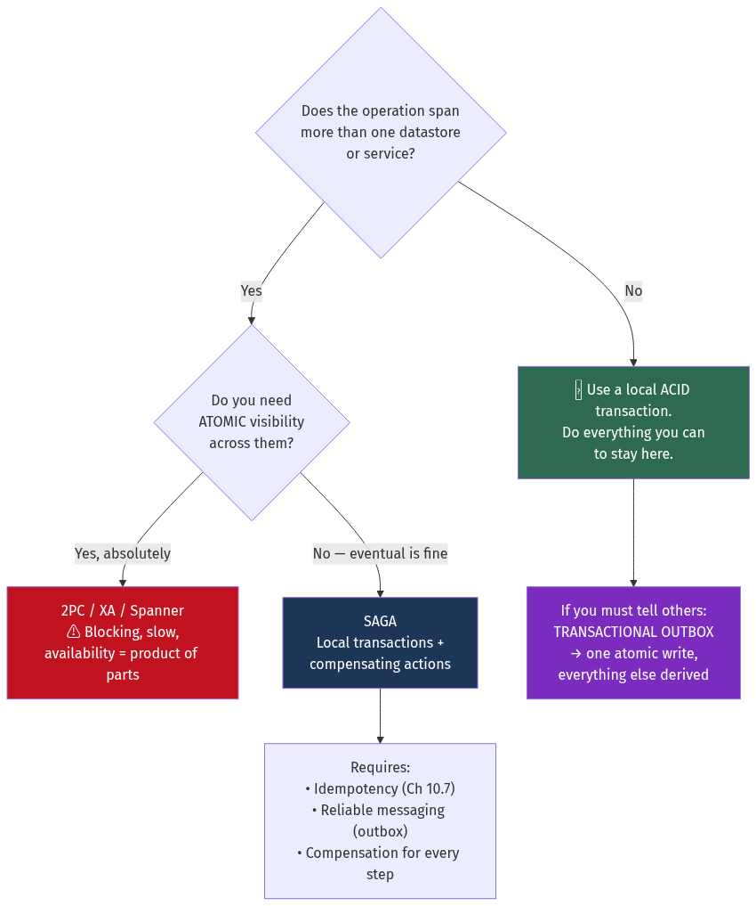

<details>
<summary>Diagram source (Mermaid)</summary>

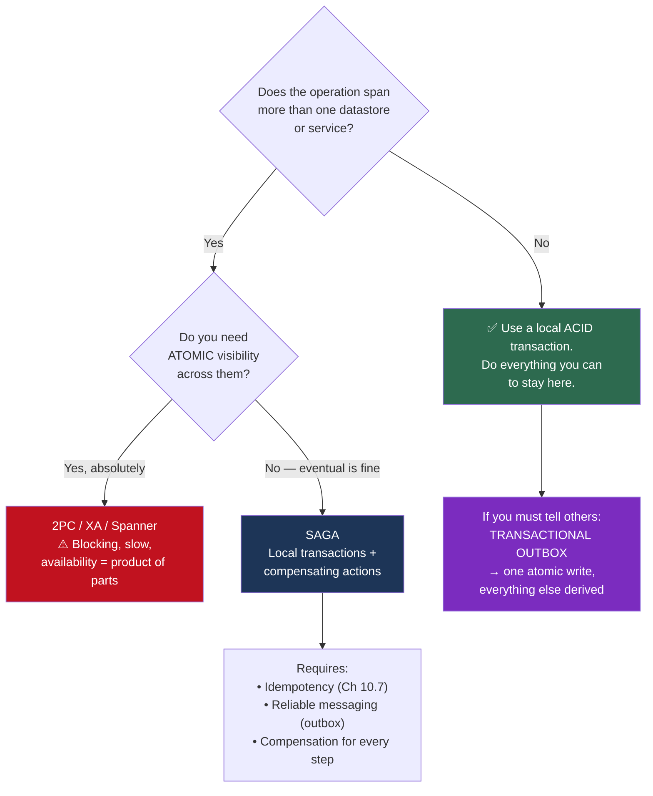

</details>

💡 **The green box is the answer far more often than people think.** Most "distributed
transaction" problems are self-inflicted by splitting services along the wrong boundary. If
two pieces of data must change atomically, that is strong evidence they belong in the same
service ([Chapter 16](./16_microservices_and_service_architecture.md)).

---

## Deep dive

### 10.1 Two-phase commit

A **coordinator** drives participants through two phases.

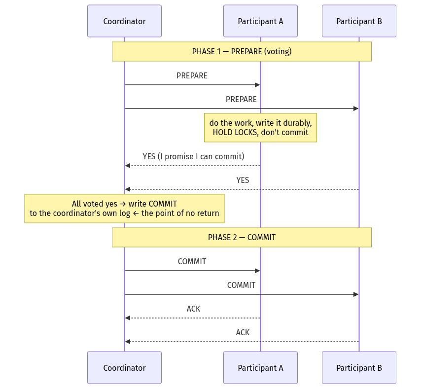

<details>
<summary>Diagram source (Mermaid)</summary>

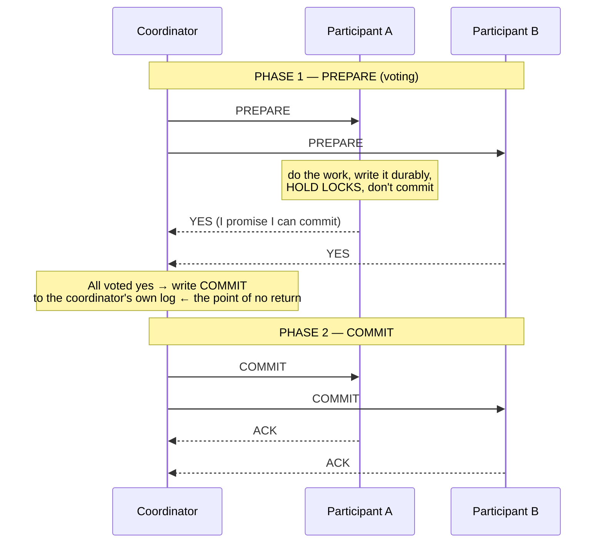

</details>

**The critical property:** once a participant votes YES, it has made an **irrevocable
promise**. It must be able to commit even if it crashes and restarts, so it has written
everything durably — and it must hold its locks until it hears the decision.

#### ⚠️ Why it blocks

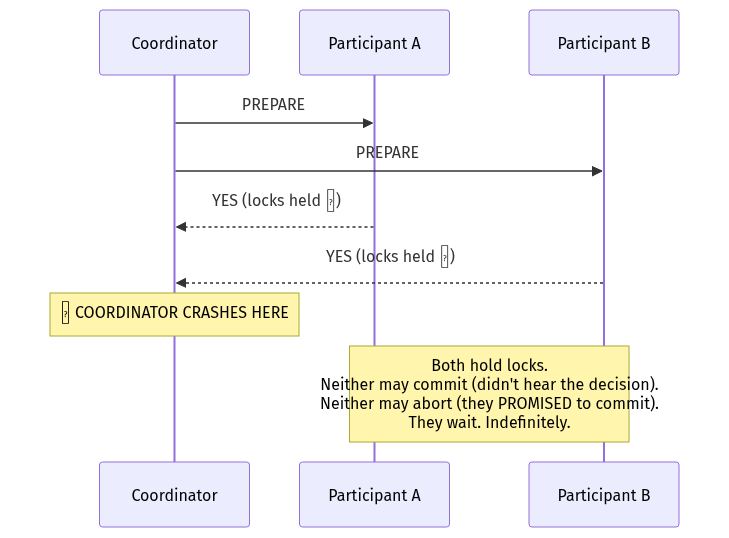

<details>
<summary>Diagram source (Mermaid)</summary>

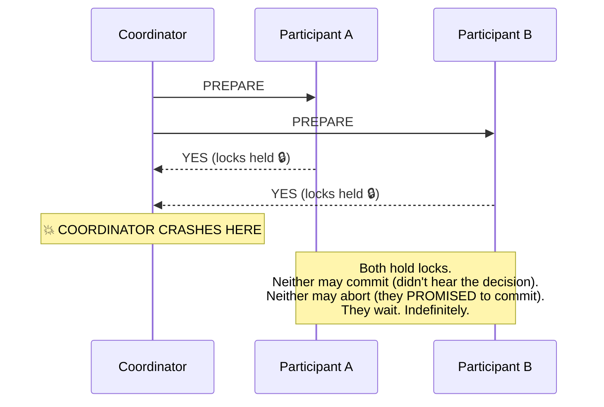

</details>

**The participants cannot resolve this among themselves.** A voted YES and B voted YES, but
neither knows whether the coordinator *decided* to commit before it died — perhaps a third
participant voted NO. Asking each other doesn't help; the information doesn't exist anywhere
except the coordinator's log.

📐 **The concrete cost:**
```
Coordinator crashes and takes 5 minutes to restart.
Rows locked by the in-doubt transaction: unavailable for 5 minutes.
Every transaction touching those rows: blocked or timing out.
This is a partial outage caused by one process dying.
```

**Availability compounds badly** too ([Chapter 3](./03_reliability_availability_performance.md) §3.3):
```
Coordinator 99.9% × Participant A 99.9% × Participant B 99.9% = 99.7%
The transaction is LESS available than any component in it.
Add a fourth participant and it's 99.6%.
```

**Latency:** two round trips plus two durable log writes at each participant.
```
2 RTT × 1 ms (same DC) + 4 × fsync at 1 ms = ~6 ms minimum
Cross-region: 2 × 100 ms = 200 ms+
```

⚠️ **XA** is the standard interface for 2PC across heterogeneous resource managers (databases,
message brokers). It works, and it is rarely the right choice for a hot path — the blocking
behaviour and availability multiplication are inherent, not implementation defects.

#### What 3PC and Paxos Commit actually fix

**3PC** adds a `PRE-COMMIT` phase so participants can infer the decision if the coordinator
dies. ⚠️ It's non-blocking only under a **synchronous network with reliable failure
detection** — assumptions that don't hold in practice, so it's essentially unused.

**The real fix is to make the coordinator fault-tolerant.** Replicate the coordinator's log
using consensus (Raft/Paxos, [Chapter 21](./21_distributed_systems_theory_consensus.md)) so
the decision survives the coordinator's death. This is what Spanner, CockroachDB, YugabyteDB
and TiDB do: **2PC over Raft groups**.

💡 It removes the blocking, not the latency. Spanner's cross-shard transactions still pay a
consensus round trip per participant group, plus TrueTime commit-wait. Correct, and expensive.

### 10.2 Sagas

A **saga** is a sequence of local transactions. Each has a **compensating transaction** that
semantically undoes it. If step 4 fails, you run the compensations for steps 3, 2, 1 in
reverse.

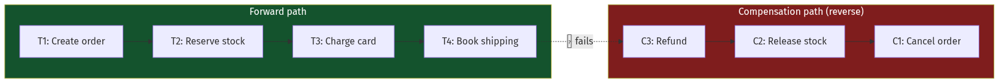

<details>
<summary>Diagram source (Mermaid)</summary>

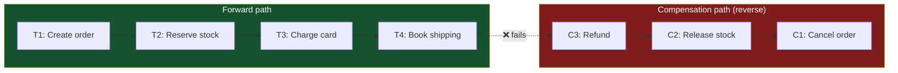

</details>

#### ⚠️ What you give up: it's ACD, not ACID

| Property | Saga | Why |
| --- | --- | --- |
| **A**tomicity | ✅ Semantically | Via compensation, not rollback |
| **C**onsistency | ✅ Eventually | Converges once compensations complete |
| **I**solation | ❌ **Absent** | Intermediate states are **visible to everyone** |
| **D**urability | ✅ | Each local transaction is durable |

**The missing isolation is the hard part.** Between T2 and T3 the stock is reserved but not
paid for, and every other transaction sees that state. If T3 fails and C2 releases the stock,
another customer may have already been told the item was unavailable.

**Countermeasures for missing isolation:**

| Countermeasure | How |
| --- | --- |
| **Semantic lock** | Mark the record `PENDING`; other transactions must handle that state explicitly |
| **Commutative updates** | Design operations so order doesn't matter (`balance += x` rather than `balance = y`) |
| **Pessimistic view** | Reorder the saga so risky steps come last, shrinking the exposure window |
| **Re-read value** | Verify the data hasn't changed before acting on it |
| **By-value** | Route high-risk transactions through 2PC and low-risk ones through a saga |

#### Choreography vs orchestration

**Choreography** — services react to each other's events. No central controller.


<details>
<summary>Diagram source (Mermaid)</summary>

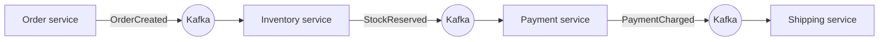

</details>

**Orchestration** — a coordinator explicitly calls each step and each compensation.

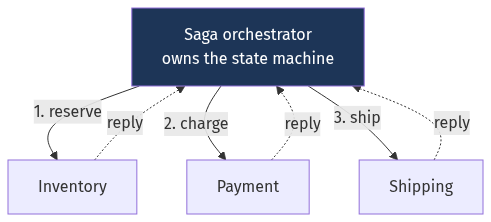

<details>
<summary>Diagram source (Mermaid)</summary>

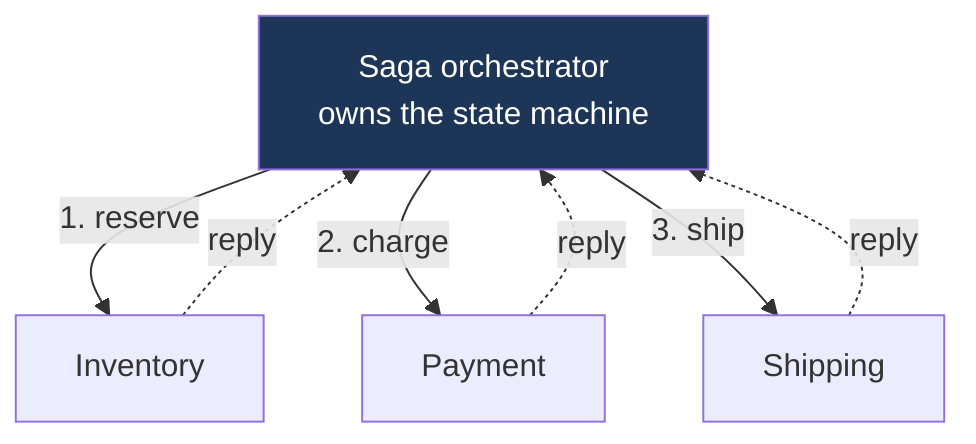

</details>

| | Choreography | Orchestration |
| --- | --- | --- |
| Coupling | Loose — services know only events | Orchestrator knows every participant |
| Where the flow lives | ⚠️ **Nowhere** — implicit across services | ✅ In one place, readable |
| Debugging | ⚠️ Hard — trace events across N services | Easy — inspect the orchestrator's state |
| Cyclic dependency risk | ⚠️ High as steps grow | Low |
| Single point of failure | None | The orchestrator (mitigate by making it durable) |
| **Use when** | 2–4 steps, simple flow | 4+ steps, or compensations are complex |

💡 **The decisive practical argument for orchestration:** when a saga is stuck, someone must
answer *"which step is it on and why?"* at 3 a.m. With choreography that requires
reconstructing the flow from distributed traces. With orchestration you query one table.

⚠️ **The orchestrator must be durable and resumable.** If it crashes mid-saga, it must resume
on restart. Store the saga's state machine in a database and drive it from a workflow engine —
**Temporal**, **AWS Step Functions**, **Camunda** — rather than holding it in memory. An
in-memory orchestrator is a saga that silently abandons work when a pod is rescheduled.

#### Writing compensations

⚠️ **Compensation is not rollback.** Rollback erases history; compensation adds a new fact
that offsets the old one.

| Forward action | ❌ Not this | ✅ Compensation |
| --- | --- | --- |
| Charge £100 | Delete the charge | Issue a £100 **refund** (both appear on the statement) |
| Send email | — | ⚠️ **Cannot be undone.** Send a correction email. |
| Reserve seat 4A | — | Release seat 4A |
| Increment counter | — | Decrement counter |
| Publish an event | — | Publish a compensating event |

**Four rules for compensations:**

1. **They must be idempotent.** They will be retried.
2. **They must be commutative with concurrent operations** where possible, since isolation is
   absent.
3. **They must eventually succeed** — a failing compensation leaves permanent inconsistency,
   so it needs infinite retry with backoff and, ultimately, a human alert.
4. ⚠️ **Some actions cannot be compensated.** Sent email, launched missile, published tweet.
   **Order the saga so irreversible steps come last.**

📐 **The ordering principle, concretely:**
```
❌ Bad:  send confirmation email → charge card → reserve stock
         If stock fails, you've emailed a customer about an order that doesn't exist.

✅ Good: reserve stock → charge card → send confirmation email
         Everything before the irreversible step is compensatable.
```

#### TCC — Try, Confirm, Cancel

A middle ground between 2PC and sagas. Each service exposes three operations:

```
Try     — reserve resources, don't commit the business effect
Confirm — make it permanent (must not fail)
Cancel  — release the reservation
```

```
Try:     mark £100 as "held" on the account (balance unchanged, available reduced)
Confirm: move the held amount out
Cancel:  release the hold
```
✅ Better isolation than a saga — the reservation is invisible to other operations.
⚠️ More invasive — every service must implement three operations and a reservation model.

### 10.3 The dual-write problem and the transactional outbox

⚠️ **The most common distributed-data bug in existence:**

```go
// ❌ BROKEN. This looks obviously correct and is not.
func CreateOrder(ctx context.Context, o Order) error {
    if err := db.Insert(ctx, o); err != nil {        // 1. commits
        return err
    }
    return kafka.Publish(ctx, "order.created", o)     // 2. ⚠️ may fail. Or the process dies here.
}
```

**Four ways this breaks:**
1. The database commits, the process crashes → **event never published**; downstream never
   learns about the order
2. The database commits, Kafka is down → same
3. Kafka publishes, the transaction rolls back → **event for an order that doesn't exist**
4. Both succeed but Kafka's ack is lost → the retry publishes a **duplicate**

There is no ordering of these two operations that is safe, because they are two independent
systems with no shared transaction.

#### The transactional outbox

**Write the event to the same database, in the same transaction.** One atomic write. A
separate relay publishes it.

```sql
BEGIN;
  INSERT INTO orders (id, customer_id, total_cents, status)
  VALUES ('ord_123', 42, 4999, 'created');

  INSERT INTO outbox (id, aggregate_id, event_type, payload, created_at)
  VALUES (gen_random_uuid(), 'ord_123', 'order.created',
          '{"order_id":"ord_123","total":4999}'::jsonb, now());
COMMIT;   -- ✅ Both or neither. One database, one transaction.
```

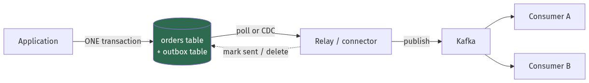

<details>
<summary>Diagram source (Mermaid)</summary>

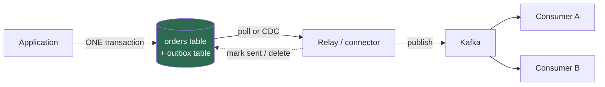

</details>

**Two ways to run the relay:**

| | **Polling** | **CDC (log tailing)** |
| --- | --- | --- |
| How | `SELECT … WHERE sent = false … FOR UPDATE SKIP LOCKED` | Read the WAL directly (Debezium) |
| Latency | Polling interval (100 ms – 1 s) | ~milliseconds |
| Database load | ⚠️ Constant polling queries | Negligible — reads the replication stream |
| Ordering | Needs care | ✅ Exactly the commit order |
| Complexity | Low — just SQL | Requires Debezium/connector infrastructure |

```sql
-- Polling relay. SKIP LOCKED lets many relay instances run safely (Ch 7 §7.9).
UPDATE outbox SET sent_at = now()
WHERE id IN (
    SELECT id FROM outbox WHERE sent_at IS NULL
    ORDER BY created_at LIMIT 100 FOR UPDATE SKIP LOCKED
)
RETURNING *;
```

⚠️ **The outbox gives you at-least-once, never exactly-once.** The relay can publish and then
crash before marking the row sent, so it republishes. **Consumers must be idempotent** —
which is §10.4.

⚠️ **Prune the outbox.** It grows forever otherwise, and in PostgreSQL a high-churn outbox
table bloats badly ([Chapter 6](./06_storage_engines_internals.md) §6.8). Delete sent rows on
a schedule, or partition by day and drop old partitions.

#### The inbox pattern

The mirror image, on the consuming side: record every processed message ID in the same
transaction as its effects, so a redelivery is detected and skipped.

```sql
BEGIN;
  INSERT INTO processed_messages (message_id) VALUES ('msg_abc')
  ON CONFLICT DO NOTHING;
  -- ⚠️ If 0 rows inserted, we've seen this before → skip the side effects.

  UPDATE inventory SET reserved = reserved + 1 WHERE sku = 'ABC';
COMMIT;
```

💡 **Outbox + inbox together give you effectively-once processing** across a message broker,
using nothing but local transactions. No 2PC anywhere.

### 10.4 Idempotency

**An operation is idempotent if performing it twice has the same effect as performing it
once.**

| Operation | Idempotent? |
| --- | --- |
| `SET balance = 100` | ✅ |
| `balance = balance - 10` | ❌ |
| `DELETE FROM x WHERE id = 5` | ✅ |
| `INSERT INTO x VALUES (…)` | ❌ (unless the key is deterministic) |
| HTTP `GET`, `PUT`, `DELETE` | ✅ by specification |
| HTTP `POST` | ❌ by specification |

⚠️ **In a distributed system every operation is retried, whether you designed for it or not.**
Network timeouts are ambiguous: you cannot distinguish "the request never arrived" from "the
response was lost." The client must retry, and the server must tolerate it.

#### Idempotency keys, done properly

The client generates a unique key per logical operation and sends it with every retry.

```http
POST /v1/charges
Idempotency-Key: 8f14e45f-ea0f-4b3e-9a12-7d3c1b2e5f60
Content-Type: application/json

{"amount": 4999, "currency": "gbp", "customer": "cus_42"}
```

**A correct implementation, with the race handled:**

```go
func Charge(ctx context.Context, key string, req ChargeRequest) (*Charge, error) {
    fingerprint := hash(req)

    tx, err := db.BeginTx(ctx, nil)
    if err != nil { return nil, err }
    defer tx.Rollback()

    // Claim the key atomically. The UNIQUE constraint is what makes this safe —
    // two concurrent requests cannot both insert.
    var existing idempotencyRecord
    err = tx.QueryRowContext(ctx, `
        INSERT INTO idempotency_keys (key, fingerprint, state, expires_at)
        VALUES ($1, $2, 'in_progress', now() + interval '24 hours')
        ON CONFLICT (key) DO UPDATE SET key = EXCLUDED.key  -- forces RETURNING to fire
        RETURNING fingerprint, state, response_body`,
        key, fingerprint,
    ).Scan(&existing.Fingerprint, &existing.State, &existing.Response)
    if err != nil { return nil, err }

    switch {
    // ⚠️ Same key, different body: the client has a bug. Never silently return the
    // old result — that would confirm an operation they didn't request.
    case existing.Fingerprint != fingerprint:
        return nil, ErrIdempotencyKeyReuse // 422

    case existing.State == "completed":
        return decode(existing.Response), nil // replay the stored response

    // ⚠️ The race: a concurrent request holds the key and hasn't finished.
    // Returning "not found" would be wrong; doing the work again would double-charge.
    case existing.State == "in_progress" && !isStale(existing):
        return nil, ErrConcurrentRequest // 409, client retries after a moment
    }

    charge, err := performCharge(ctx, tx, req)
    if err != nil { return nil, err }

    if _, err := tx.ExecContext(ctx, `
        UPDATE idempotency_keys SET state = 'completed', response_body = $2
        WHERE key = $1`, key, encode(charge)); err != nil {
        return nil, err
    }
    return charge, tx.Commit()
}
```

**The four design decisions people get wrong:**

| Decision | ⚠️ Wrong | ✅ Right |
| --- | --- | --- |
| **Scope** | Global | Per-endpoint **and** per-customer — otherwise one tenant's key collides with another's |
| **Request matching** | Key only | Key **+ fingerprint of the body** — same key with a different body is a client bug and must error |
| **Concurrency** | Check-then-act | Atomic `INSERT … ON CONFLICT`, with an `in_progress` state so a concurrent duplicate gets 409 rather than executing |
| **Retention** | Forever | 24 hours is standard (Stripe's choice) — long enough for any sane retry, short enough to bound the table |

💡 **The `in_progress` state is the part most implementations omit**, and it's the one that
matters. Without it, two simultaneous requests with the same key both find "no record", both
proceed, and you have charged twice — the exact thing the key was supposed to prevent.

**When you can't accept a client-supplied key**, derive one deterministically:
```
key = hash(user_id, order_id, operation_type, amount)
```
⚠️ This fails if the user legitimately wants to perform the same operation twice — two
identical £5 top-ups. Include a client-generated request ID rather than hashing only business
fields.

### 10.5 "Exactly once" — what it actually means

⚠️ **Exactly-once *delivery* over an unreliable network is impossible.** The proof is short:

```
Sender transmits. No acknowledgement arrives. Two possibilities:
  (a) the message was lost   → must resend, or it's lost forever
  (b) the ACK was lost       → resending creates a duplicate
The sender cannot distinguish them. It must choose:
  Never resend  → at-most-once (may lose)
  Always resend → at-least-once (may duplicate)
```

There is no third behaviour. This is a variant of the **Two Generals' Problem**.

📐 **What is achievable: exactly-once *processing*, or "effectively once".**
```
at-least-once delivery  +  idempotent processing  =  exactly-once effect
```

**How real systems do it:**

| System | Mechanism |
| --- | --- |
| **Kafka transactions (EOS)** | Idempotent producer (sequence numbers deduplicate at the broker) + atomic write of output records *and* consumer offsets in one transaction. ⚠️ Only within Kafka. |
| **Flink** | Distributed checkpoints + two-phase commit to sinks that support it |
| **Stripe** | Idempotency keys (§10.4) |
| **Outbox + inbox** | §10.3 — dedup by message ID in the same transaction as the effects |

⚠️ **Kafka's exactly-once is not end-to-end.** It covers `Kafka → process → Kafka`. The moment
you write to an external database or call an external API, you are back to at-least-once and
you need idempotency. This is very widely misunderstood.

### 10.6 Linearizability, serializability, and strict serializability

Three terms, constantly conflated. They answer different questions.

| Term | Concerns | Question it answers |
| --- | --- | --- |
| **Linearizability** | **One object**, real-time ordering | "Does a read see the most recent completed write?" |
| **Serializability** | **Many objects**, transaction ordering | "Is the result equivalent to *some* serial execution?" |
| **Strict serializability** | Both | "Equivalent to a serial execution that also respects real time" |

**Counterexample 1 — serializable but not linearizable:**
```
T1: write x=1, commit at 10:00:00
T2: read x, at 10:00:05 → returns 0

This is SERIALIZABLE: it's equivalent to the serial order T2, T1.
It is NOT LINEARIZABLE: T2 ran after T1 completed in real time and didn't see it.
```
💡 This is exactly what a stale read from an async replica looks like. Perfectly serializable,
and the user says "my comment disappeared."

**Counterexample 2 — linearizable but not serializable:**
```
Every individual read and write on x and on y is linearizable,
but a transaction reading x and y sees a combination that no serial
execution of the transactions could have produced.
```
Single-object guarantees say nothing about multi-object invariants.

📐 **What each costs:**

| Guarantee | Mechanism | Cost |
| --- | --- | --- |
| Serializable | 2PL or SSI within one node | Contention; abort-and-retry |
| Linearizable | Consensus (Raft/Paxos) on every operation | ⚠️ A quorum round trip per operation |
| Strict serializable | Both | Spanner: consensus + TrueTime commit-wait (~7 ms per write) |

🎯 **The interview line:** *"Linearizability is about a single object and real time.
Serializability is about multiple objects and transaction ordering. They're orthogonal — you
can have either without the other, and Spanner's contribution was making both practical at
global scale."*

### 10.7 Distributed locks — and why Redlock isn't enough

The naive distributed lock:
```
SET lock:resource <random_token> NX PX 30000    -- acquire, 30s TTL
... do work ...
DEL lock:resource                                -- release (via Lua, checking the token)
```

⚠️ **This is unsafe for correctness, and the reason is subtle:**

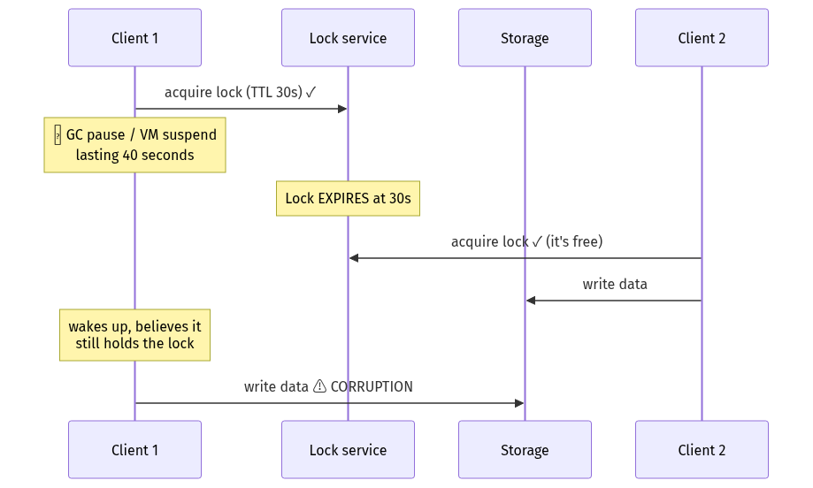

<details>
<summary>Diagram source (Mermaid)</summary>

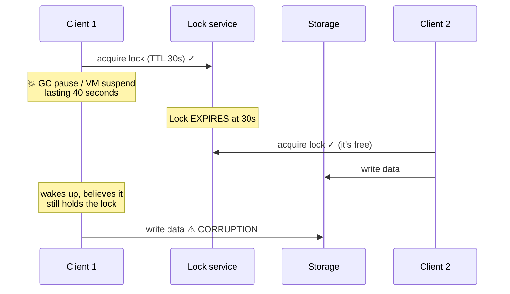

</details>

**The lock holder cannot know it lost the lock.** A stop-the-world GC pause, a hypervisor
suspending the VM, or an unusually slow disk write is enough. No amount of clock precision or
extra Redis nodes fixes this — **Redlock does not solve it**, which is the substance of Martin
Kleppmann's critique.

#### Fencing tokens — the actual fix

The lock service issues a **monotonically increasing token** with each grant. The **storage**
rejects writes carrying a stale token.

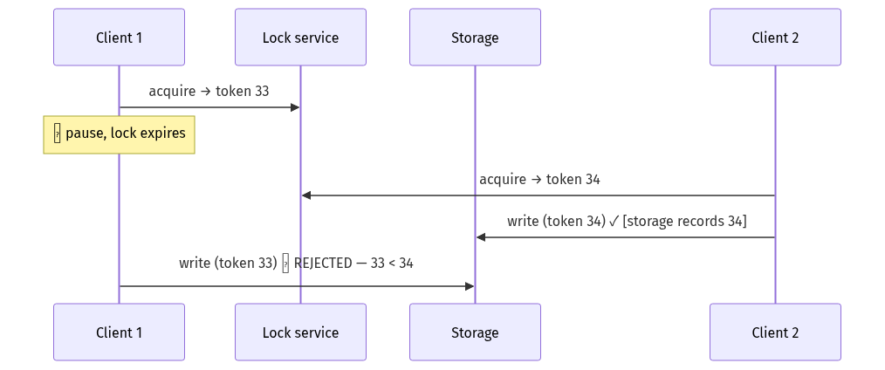

<details>
<summary>Diagram source (Mermaid)</summary>

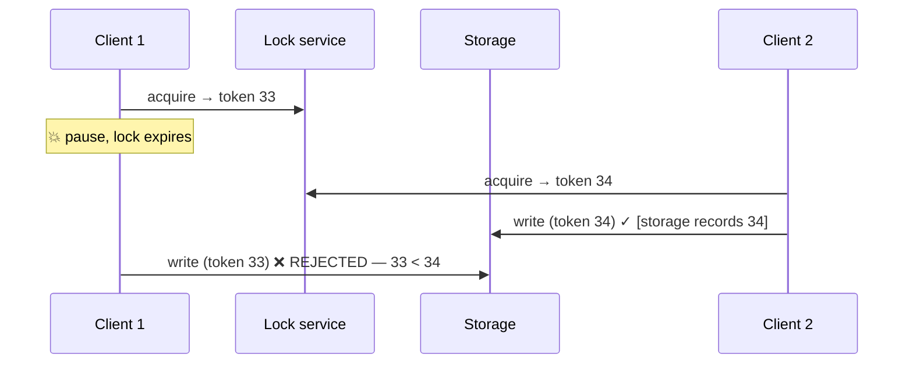

</details>

💡 **The essential requirement: the resource being protected must participate.** A lock is
only safe if the thing it protects can reject stale writers. If your storage layer can't check
a token, you cannot have a safe distributed lock — you can only have an optimisation that
usually reduces duplicate work.

**Which is the practical takeaway:**

| Purpose | Redis lock acceptable? |
| --- | --- |
| **Efficiency** — avoid duplicate work (don't send the same email twice from two workers) | ✅ Yes. Occasional double-execution is a cost, not a bug. |
| **Correctness** — must never happen twice (don't double-charge) | ❌ **No.** Use ZooKeeper/etcd with fencing tokens, or make the operation idempotent so double execution is harmless. |

⚠️ **And the better answer is usually the second one: make the operation idempotent and skip
the lock.** An idempotency key makes double execution harmless, which is strictly more robust
than trying to guarantee single execution.

---

## Worked example — an order and payment flow

*An e-commerce checkout spanning four services: Order, Inventory, Payment and Shipping. It
must never charge a customer without reserving stock, never reserve stock without charging,
and never lose an order. Design it.*

**Step 1 — Can we avoid distributed transactions entirely?**

Always ask this first.
```
Order + Inventory in one service?
  ⚠️ Inventory is shared across the whole catalogue and has a very different
     write profile (high contention on popular SKUs). Merging them makes
     ordering block on inventory contention.
Payment in the same service?
  ❌ Payment is PCI-scoped and calls an external provider. It must be isolated.
```
So: genuinely distributed. But note we asked.

**Step 2 — Rule out 2PC.**
```
Availability: 0.999⁴ = 99.6% → 35 hours of downtime/year   ❌
Latency:      2 RTT + coordinator log writes + the external payment
              provider (which does not speak XA at all)     ❌
Blocking:     coordinator failure locks inventory rows       ❌
```
The external payment provider settles it — you cannot 2PC across a third party's API.

**Step 3 — Design the saga, ordering by reversibility.**

```
T1  Create order (status = PENDING)          ← C1: mark CANCELLED
T2  Reserve stock                            ← C2: release reservation
T3  Authorise payment (not capture!)         ← C3: void the authorisation
T4  Capture payment                          ← C4: refund
T5  Book shipping                            ← C5: cancel shipment
T6  Send confirmation email                  ← ⚠️ IRREVERSIBLE — last
```

💡 **Two deliberate choices here.**

**Authorise then capture, separately.** An authorisation places a hold and can be **voided**
with no customer-visible trace. A capture must be **refunded**, which appears on the
statement and takes days. So we authorise early (to fail fast if the card is bad) and capture
late (once everything else has succeeded). The compensation for T3 is far cheaper than for T4.

**Email last.** It cannot be compensated. Everything irreversible goes at the end.

**Step 4 — Choose orchestration.**

Six steps with non-trivial compensations. Per §10.2, choreography would scatter this flow
across six services with no single place showing "where is order 123 stuck?".

```
Saga state stored in Postgres, driven by Temporal (or Step Functions).
Orchestrator is durable and resumable: a pod restart resumes the saga.
```

**Step 5 — Publish reliably, using the outbox.**

```sql
-- Order service, T1. ONE transaction.
BEGIN;
  INSERT INTO orders (id, customer_id, total_cents, status)
       VALUES ('ord_123', 42, 4999, 'PENDING');
  INSERT INTO outbox (aggregate_id, event_type, payload)
       VALUES ('ord_123', 'order.created', '{"order_id":"ord_123", ...}');
COMMIT;
```
Debezium tails the WAL and publishes to Kafka. **No dual write anywhere.**

**Step 6 — Make every step idempotent.**

```
T2 Reserve stock:
   reservation_id = hash(order_id, sku)     ← deterministic
   INSERT INTO reservations (id, sku, qty) VALUES (...)
   ON CONFLICT (id) DO NOTHING;             ← retry-safe

T3 Authorise payment:
   Idempotency-Key: "auth:" + order_id      ← Stripe dedupes for 24h
   Retrying returns the SAME authorisation, never a second one.

T5 Book shipping:
   Idempotency-Key: "ship:" + order_id
```

📐 **Why this matters concretely:** the orchestrator's call to Payment times out. It cannot
know whether the charge happened. It retries. Without the idempotency key that's a **double
charge**; with it, the provider returns the original authorisation.

**Step 7 — Handle the semantic-isolation gap.**

⚠️ Between T2 and T4 the stock is reserved but unpaid. Another customer querying availability
must not see it as available.

```sql
-- Semantic lock: reservations count against available stock immediately.
SELECT on_hand - COALESCE(SUM(reserved), 0) AS available
FROM inventory LEFT JOIN reservations USING (sku)
WHERE sku = 'ABC' GROUP BY on_hand;
```
And reservations must **expire**, or an abandoned saga holds stock forever:
```sql
DELETE FROM reservations WHERE created_at < now() - interval '30 minutes';
```
💡 The expiry is itself a compensation — one driven by time rather than by an event. Every
`PENDING` state in a saga needs one, because sagas *do* get abandoned.

**Step 8 — Handle compensation failure.**

⚠️ What if C4 (refund) fails? The customer has been charged for an order that won't ship. This
is the worst state in the system.

```
1. Retry with exponential backoff, indefinitely — a refund MUST eventually succeed
2. After N attempts, move to a dead-letter queue AND page a human
3. Never silently give up
4. Emit a metric: saga_compensation_failed_total — alert on any non-zero value
```

**Step 9 — The failure matrix.**

| Fails at | Compensations run | Customer sees |
| --- | --- | --- |
| T2 (no stock) | C1 | "Out of stock", no charge |
| T3 (card declined) | C2, C1 | "Payment declined", no charge, stock released |
| T4 (capture fails) | C3 (void auth), C2, C1 | Auth voided — **never appears on their statement** |
| T5 (shipping down) | C4 (refund), C3, C2, C1 | Refunded within days + apology |
| T6 (email fails) | ⚠️ **None** — do not compensate | Order proceeds; retry the email separately |

💡 **Note the last row.** A failed confirmation email must **not** roll back a completed
order. Deciding which failures are saga-fatal and which are merely logged is part of the
design, and getting it wrong is how you cancel valid orders because SMTP hiccupped.

**Step 10 — What we built.**

| Concern | Mechanism |
| --- | --- |
| Atomicity | Saga with compensations (not 2PC) |
| Ordering | Irreversible steps last; authorise-before-capture |
| Reliable events | Transactional outbox + CDC |
| Retry safety | Idempotency keys / deterministic IDs on every step |
| Missing isolation | Semantic locks (reservations) + TTL expiry |
| Observability | Saga state in one table; compensation-failure alerting |
| Stuck sagas | Durable orchestrator, resumable; timeouts on every step |

---

## Trade-offs

| Decision | Option A | Option B | Choose A when | Never choose A when |
| --- | --- | --- | --- | --- |
| Cross-service atomicity | 2PC / XA | Saga | Short-lived, same trust domain, availability is not critical | External APIs involved, or availability matters |
| Saga style | Choreography | Orchestration | 2–4 simple steps | 4+ steps or complex compensations — debuggability decides it |
| Orchestrator state | In-process | Durable workflow engine | Never in production | Always B — a pod restart must not abandon a saga |
| Publishing events | Dual write | Transactional outbox | ⚠️ Never | Always B |
| Outbox relay | Polling | CDC (Debezium) | Small scale, no appetite for connector infrastructure | High throughput or low latency needed |
| Delivery semantics | At-most-once | At-least-once + idempotency | Loss is acceptable (metrics, telemetry) | Anything involving money or state |
| Payment flow | Charge immediately | Authorise then capture | Digital goods delivered instantly | Physical fulfilment — void beats refund |
| Idempotency key | Client-supplied | Server-derived from fields | Client can generate stable IDs | Legitimate identical repeat operations exist |
| Distributed lock | Redis (`SET NX`) | etcd/ZooKeeper + fencing token | Efficiency only — duplicate work is merely wasteful | Correctness — use B, or make it idempotent and drop the lock |
| Concurrency safety | Locking | Idempotency | Contention must be prevented | Prefer B where possible — it's more robust than locking |

---

## How real companies do it

**Stripe** is the reference implementation of §10.4. Idempotency keys are a first-class part of
their API: the key is scoped per account, results are stored for 24 hours, and reusing a key
with a *different* request body returns an error rather than the cached result. Their
engineering writing also documents the `in_progress` state handling — the part most
re-implementations omit.

**Uber's Cadence** and its successor **Temporal** exist because saga orchestration in ad-hoc
application code kept failing the same way: an orchestrator holding state in memory loses the
saga when the process restarts. Temporal makes the workflow's execution history durable, so
the code reads like a straight-line function while surviving arbitrary process failures. If
you are writing an orchestrator by hand, you are probably rebuilding a worse version of this.

**Google Spanner** is the counterpoint — it *does* provide cross-shard ACID transactions
globally, via 2PC layered over Paxos groups with TrueTime. The cost is explicit and permanent:
a **commit-wait** of a few milliseconds on every write, deliberately pausing to let clock
uncertainty pass. It demonstrates that distributed ACID is achievable when you're willing to
buy atomic clocks and pay latency on every transaction.

**Debezium** is the standard CDC implementation and the reason the outbox pattern became
mainstream — it turned "tail the WAL" from a bespoke engineering project into a connector.
Its documentation includes an explicit outbox-event-router transformation.

**Kafka's exactly-once semantics** (KIP-98, KIP-129) deliver idempotent producers and
transactional writes spanning output topics and consumer offsets. ⚠️ Confluent's own
documentation is careful to scope this to Kafka-to-Kafka pipelines — the widespread belief
that enabling EOS makes an entire system exactly-once, including database writes, is wrong.

---

## Common mistakes

**Dual writes.** Writing to a database and then publishing an event from application code.
There is no safe ordering. Use the outbox.

**Believing Kafka's exactly-once covers external systems.** It covers Kafka → process →
Kafka. Any external write needs its own idempotency.

**Idempotency keys without an `in_progress` state.** Two concurrent requests with the same key
both find nothing, both proceed, and you charge twice — defeating the entire purpose.

**Idempotency keys without a request fingerprint.** The same key with a different body should
error, not return the cached response for a different operation.

**Compensations that aren't idempotent.** They get retried like everything else. A refund
compensation that isn't idempotent refunds twice.

**Irreversible actions in the middle of a saga.** Send the email last. Once it's sent, you
cannot compensate.

**No timeout on `PENDING` states.** Abandoned sagas hold reservations forever, and inventory
silently drains. Every intermediate state needs a TTL and a sweeper.

**Silently giving up on a failed compensation.** That leaves permanent inconsistency —
customer charged, order not shipped. Retry indefinitely and page a human.

**In-memory saga orchestrators.** A pod restart abandons the saga mid-flight with no record.
Use a durable workflow engine.

**Capturing payment before fulfilment is certain.** Voiding an authorisation is invisible to
the customer; refunding a capture appears on their statement and takes days.

**Using Redis locks for correctness.** A GC pause outlives the TTL and two holders write
concurrently. Use fencing tokens with a storage layer that checks them — or, better, make the
operation idempotent and remove the lock.

**Not pruning the outbox table.** It grows unbounded and bloats.

**Treating a failed side-effect as saga-fatal.** A confirmation email failing must not cancel
a paid, stocked, shipped order.

---

## Interview angle

**Q: Why not just use two-phase commit?**

*Weak:* "It's slow."

*Strong:* "Three reasons, and the third is the disqualifying one. Latency — two round trips
plus durable log writes at every participant, so single-digit milliseconds locally and 200 ms+
cross-region. Availability — it's a product: four participants at 99.9% each gives 99.6%, so
the transaction is *less* available than any component in it. But the real problem is
**blocking**. Once a participant votes yes it has made an irrevocable promise, so it holds its
locks until it hears the decision. If the coordinator crashes between the vote and the
decision, participants can neither commit nor abort — they can't resolve it among themselves,
because whether a decision was made only exists in the coordinator's log. Those rows are
locked until the coordinator returns. That's a partial outage caused by one process dying. The
fix is to make the coordinator fault-tolerant by replicating its log through Raft, which is
what Spanner and CockroachDB do — that removes the blocking but not the latency. And in
practice, most cross-service transactions involve a third-party API that doesn't speak XA at
all, which settles it."

**Q: Design a saga for order processing.**

*Strong:* "Local transactions with compensations: create order, reserve stock, authorise
payment, capture payment, book shipping, send email — each with a compensating action. Three
design decisions I'd call out. First, **order the steps by reversibility** — the confirmation
email is irreversible, so it goes last; everything before it must be compensatable. Second,
**authorise and capture separately**: voiding an authorisation is invisible to the customer,
whereas refunding a capture appears on their statement and takes days, so I authorise early to
fail fast and capture late once everything else has succeeded. Third, **orchestration over
choreography** at six steps — when a saga is stuck at 3 a.m. someone has to answer 'which step
and why', and with choreography that means reconstructing the flow from traces across six
services. The thing sagas give up is **isolation** — intermediate states are visible to
everyone — so reservations act as semantic locks and must have a TTL, or abandoned sagas drain
your inventory. And every step needs idempotency, because the orchestrator will retry after
ambiguous timeouts."

**Q: You write to Postgres then publish to Kafka. What's wrong?**

*Strong:* "**Dual write.** They aren't atomic, and there's no ordering that fixes it. Database
first: it commits, the process crashes, the event is never published, and downstream never
learns. Kafka first: the event is published, the transaction rolls back, and you've announced
something that didn't happen. The fix is the **transactional outbox** — insert the event into
an outbox table in the *same transaction* as the business data, so it's one atomic write. Then
a relay publishes from the outbox, either by polling with `FOR UPDATE SKIP LOCKED` or by
tailing the WAL with Debezium, which is lower latency and preserves commit order. The relay
gives at-least-once, never exactly-once — it can publish and crash before marking the row
sent — so consumers must be idempotent, typically with an **inbox** table recording processed
message IDs in the same transaction as their effects. Outbox plus inbox gets you
effectively-once using nothing but local transactions."

**Q: Is exactly-once delivery possible?**

*Strong:* "Not delivery, no — it's provably impossible over an unreliable network. If a sender
gets no acknowledgement it can't distinguish 'the message was lost' from 'the ack was lost'.
Never resending gives at-most-once; always resending gives at-least-once. There's no third
behaviour; it's a form of the Two Generals' Problem. What *is* achievable is exactly-once
**processing**: at-least-once delivery plus idempotent handling produces an
exactly-once effect. That's what everyone means when they say exactly-once. Kafka's EOS is a
good concrete example — idempotent producers deduplicate at the broker via sequence numbers,
and transactions atomically write output records and consumer offsets together. But it's
important to know its boundary: that covers Kafka-to-Kafka. The moment you write to an
external database or call a payment API, you're back to at-least-once and you need your own
idempotency."

**Q: How do you design idempotency for a payments API?**

*Strong:* "Client-supplied key in a header, and four things that are easy to get wrong.
**Scope** it per-endpoint and per-customer, not globally, or one tenant's key collides with
another's. Store a **fingerprint of the request body** alongside the key — the same key with a
different body means the client has a bug, and you must return an error rather than silently
confirming an operation they didn't request. Handle **concurrency atomically** with
`INSERT ... ON CONFLICT`, and crucially record an **`in_progress` state**: two simultaneous
requests with the same key would otherwise both find nothing, both proceed, and double-charge —
which is precisely what the key was meant to prevent. The second one should get a 409. And set
a **TTL**, 24 hours is the industry norm, so the table stays bounded while covering any
reasonable retry window. Then the result: on replay you return the stored response, so the
client sees the same charge object with the same ID."

**Q: Can you use Redis for distributed locking?**

*Strong:* "It depends entirely on whether you need it for **efficiency** or **correctness**.
For efficiency — avoiding duplicate work, like two workers generating the same report — Redis
is fine; occasional double-execution is wasteful, not wrong. For correctness it's **not
safe**, and Redlock doesn't fix it. The failure isn't about clock precision or node count: the
lock holder can be paused by a stop-the-world GC or a hypervisor suspending the VM for longer
than the TTL. The lock expires, another client acquires it, and then the first client wakes up
still believing it holds the lock and writes. No lock service can prevent that on its own,
because the holder cannot know it lost the lock. The fix is **fencing tokens** — the lock
service issues a monotonically increasing number, and the *storage layer* rejects writes with
a stale token. Which means the resource being protected has to participate; if your storage
can't check a token, you can't have a safe distributed lock. Honestly though, the better
answer is usually to **make the operation idempotent and drop the lock entirely** — making
double execution harmless is more robust than trying to guarantee single execution."

**Q: What's the difference between linearizability and serializability?**

*Strong:* "They're orthogonal and answer different questions. **Linearizability** is about a
*single object* and *real time*: once a write completes, every subsequent read must see it.
**Serializability** is about *multiple objects* and *transaction ordering*: the outcome must
equal *some* serial execution of the transactions — but that serial order need not match real
time. So you can have one without the other. A stale read from an async replica is perfectly
serializable — it's equivalent to the order where the read came first — but it's not
linearizable, and it's exactly what a user means by 'my comment disappeared'. Conversely,
every individual operation can be linearizable while a multi-object invariant is still
violated. **Strict serializability** is both, and it's what Spanner provides — which is why it
needs TrueTime and a commit-wait of a few milliseconds on every write. Practically: I need
linearizability for uniqueness, locks and leader election; serializability for multi-row
invariants like write skew."

---

## Recap

- **2PC blocks**: after voting yes, a participant holds locks until it hears the decision, and
  a coordinator crash strands it. Availability is the *product* of all participants.
  Consensus-replicating the coordinator's log (Spanner, CockroachDB) removes the blocking, not
  the latency.
- **Sagas give you ACD, not ACID** — the missing letter is **isolation**. Intermediate states
  are visible to everyone, so you need semantic locks and TTLs.
- **Order saga steps by reversibility.** Irreversible actions last. **Authorise then capture** —
  a void is invisible, a refund is not.
- **Orchestration beats choreography past ~4 steps**, because debuggability decides it. The
  orchestrator must be **durable and resumable**.
- ⚠️ **Dual writes have no safe ordering.** Use the **transactional outbox** — one atomic write —
  with a polling or CDC relay. Add an **inbox** on the consumer for effectively-once.
- **Exactly-once delivery is impossible.** At-least-once + idempotency = exactly-once effect.
  ⚠️ Kafka's EOS covers Kafka→Kafka only.
- **Idempotency keys need**: per-customer scope, a request fingerprint, an atomic claim with an
  **`in_progress` state**, and a 24-hour TTL.
- **Linearizability** = one object + real time. **Serializability** = many objects + ordering.
  Orthogonal. **Strict serializability** = both, and it costs a commit-wait.
- ⚠️ **Redis locks are unsafe for correctness** — a GC pause outlives the TTL. **Fencing tokens**
  fix it, but only if the storage layer checks them. Prefer idempotency over locking.

---

## Test yourself

1. In 2PC, participant A has voted YES and the coordinator crashes. Why can't A ask B what to
   do and decide with it?
2. A saga charges a card at step 2 of 5. Step 5 fails. What appears on the customer's
   statement, and how would you have designed it to avoid that?
3. Your service inserts an order then publishes to Kafka. Under load, ~0.1% of orders never
   reach the warehouse. Explain and fix.
4. Two identical `POST /charges` arrive 5 ms apart with the same idempotency key. Your
   implementation does `SELECT` then `INSERT`. What happens?
5. You enable Kafka exactly-once semantics. Your consumer reads from Kafka and writes to
   PostgreSQL. Are database writes now exactly-once?
6. A worker acquires a Redis lock with a 30-second TTL, experiences a 45-second GC pause, then
   writes. What happened, and give two fixes.
7. A read from a follower returns a value that was overwritten 2 seconds ago. Is this
   serializable? Is it linearizable?
8. Your saga's compensating refund fails permanently after 50 retries. What state is the system
   in and what should happen?
9. Why must reservations in a saga have a TTL? What breaks without one?
10. You have a 6-step saga. Which steps would you make idempotent, and how do you make
    "reserve stock" idempotent without a lock?

<details>
<summary>Answers</summary>

1. Because the information doesn't exist at A or B. Both voting YES means both *could* commit,
   but the **decision** is the coordinator's alone — a third participant might have voted NO,
   or the coordinator might have timed out and decided to abort before crashing. That decision
   was recorded only in the coordinator's log. A and B agreeing to commit could contradict a
   decision to abort that was already communicated to a third participant, producing a
   permanently inconsistent system. So they must wait. This is precisely why the fix is to
   **replicate the coordinator's log via consensus** rather than to add another phase.

2. A **charge followed by a refund** — both visible on their statement, with the refund taking
   3–5 business days to clear. Customers experience this as "you took my money and gave it
   back", which generates support contacts even though the system behaved correctly.
   **Better design:** split into **authorise** (step 2) and **capture** (step 5, or after
   fulfilment is certain). An authorisation places a hold; voiding it is invisible to the
   customer and leaves no statement entry. General principle: **order saga steps by
   reversibility**, and prefer a cheap compensation early over an expensive one late.

3. **Dual write.** The transaction commits, then the Kafka publish fails — broker unavailable,
   network blip, or the process crashing between the two. The order exists in the database but
   no event was emitted, and nothing detects it. 0.1% is consistent with a small rate of
   publish failures or pod restarts.
   **Fix:** transactional outbox. Insert the event into an `outbox` table in the same
   transaction as the order, so both commit or neither does. A relay then publishes from the
   outbox — polling with `FOR UPDATE SKIP LOCKED`, or Debezium tailing the WAL for lower
   latency and correct ordering. The relay retries until Kafka accepts, so nothing is lost.
   Consumers need to be idempotent since the relay may republish after a crash.

4. **A race, and both requests execute.** Request 1's `SELECT` finds no row; request 2's
   `SELECT` also finds no row (request 1 hasn't inserted yet, or has inserted but not
   committed). Both proceed to charge the card. You have **double-charged the customer** — the
   exact failure the idempotency key existed to prevent.
   **Fix:** claim the key atomically with `INSERT ... ON CONFLICT ... RETURNING` **and** record
   an `in_progress` state. The loser of the race sees `in_progress` and returns **409
   Conflict**, prompting the client to retry shortly and then receive the stored response.

5. **No.** Kafka's exactly-once semantics cover `Kafka → process → Kafka`: idempotent producers
   deduplicate at the broker using producer-ID/sequence numbers, and transactions atomically
   commit output records together with consumer offsets. PostgreSQL is not part of that
   transaction. If the consumer writes to Postgres and then crashes before its offset commit,
   the message is redelivered and the write happens again.
   **Fix:** make the database write idempotent — an **inbox** table recording processed
   message IDs, inserted in the same Postgres transaction as the effects, with
   `ON CONFLICT DO NOTHING` so a redelivery is detected and skipped.

6. The lock **expired at 30 seconds** while the worker was paused. Another worker acquired it
   and did the work. At 45 seconds the first worker resumed, still believing it held the lock,
   and wrote — so two writers operated concurrently on data the lock was supposed to protect.
   Crucially the worker had no way to know: a stop-the-world GC pause, a hypervisor
   suspension, or a long disk stall is indistinguishable from normal execution from inside the
   process.
   **Fixes:** (a) **Fencing tokens** — the lock service issues a monotonically increasing
   token, the worker includes it with every write, and the *storage layer* rejects writes with
   a token lower than the highest it has seen. This requires the protected resource to
   participate. (b) **Make the operation idempotent** and remove the lock — if executing twice
   is harmless, the whole failure mode disappears. (b) is usually preferable because it doesn't
   depend on every storage layer supporting token checks.

7. **Serializable: yes.** The execution is equivalent to a serial order in which the read
   occurred before the write. Serializability makes no claim about real time.
   **Linearizable: no.** The write completed 2 seconds before the read began, so a linearizable
   system must return the new value. Linearizability is precisely the added constraint that the
   serial order respects real time.
   This pair is the cleanest illustration that the two properties are orthogonal — and it's
   exactly what users describe as "my update disappeared" after reading from a lagging replica.

8. The customer has been **charged for an order that will not be fulfilled** — money taken,
   nothing delivered. This is the worst state the system can be in, worse than either
   succeeding or failing cleanly, because it is a financial discrepancy that the system cannot
   resolve itself.
   **What should happen:** (a) it must **never be silently dropped** — the saga stays in a
   `COMPENSATION_FAILED` state, not `FAILED`; (b) the failed compensation goes to a
   **dead-letter queue** with the full context needed to retry manually; (c) a metric like
   `saga_compensation_failed_total` fires an alert on any non-zero value, because this needs a
   human; (d) the customer should be proactively contacted rather than left to discover it.
   Design-wise, this is also an argument for authorise-then-capture: voiding an authorisation
   has far fewer ways to fail permanently than issuing a refund.

9. Because **sagas get abandoned**. The orchestrator can crash, a downstream service can be
   unreachable indefinitely, a message can be lost, or a customer can simply abandon checkout.
   Without a TTL, the reservation from step 2 persists forever.
   **What breaks:** reservations count against available stock (they're a semantic lock, since
   sagas have no isolation), so abandoned sagas silently drain inventory. Items appear out of
   stock while physically sitting in the warehouse, and the discrepancy grows monotonically.
   Eventually you cannot sell anything. The fix is a sweeper that releases reservations older
   than a threshold — a **time-driven compensation** — and it applies to every `PENDING` state
   in every saga, not just inventory.

10. **All steps that mutate state** — realistically all of them, because the orchestrator will
    retry after any ambiguous timeout and cannot know whether the previous attempt took effect.
    In practice: create order, reserve stock, authorise, capture, book shipping. The email step
    should be at-least-once-tolerant too (a duplicate confirmation email is a minor annoyance,
    a missing one is worse).
    **Reserve stock without a lock:** use a **deterministic reservation ID** derived from the
    saga —
    ```sql
    INSERT INTO reservations (id, sku, qty, order_id)
    VALUES (md5(order_id || sku), 'ABC', 1, 'ord_123')
    ON CONFLICT (id) DO NOTHING;
    ```
    A retry produces the same ID, conflicts, and does nothing. The database's unique constraint
    provides the atomicity — no distributed lock is involved. Pair it with a conditional
    decrement (`UPDATE inventory SET on_hand = on_hand - 1 WHERE sku = 'ABC' AND on_hand > 0`)
    so overselling is prevented by the database rather than by coordination.

</details>

---

## Further reading

- Garcia-Molina & Salem, *Sagas* (1987) — the original paper, and short
- Pat Helland, *Life Beyond Distributed Transactions: An Apostate's Opinion* (2007) — the clearest argument for why you should avoid them
- Kleppmann, *Designing Data-Intensive Applications*, Chapter 9 — linearizability vs serializability done properly
- Kleppmann, *How to do distributed locking* (2016) — the Redlock critique and fencing tokens
- Corbett et al., *Spanner: Google's Globally-Distributed Database*, OSDI 2012
- Stripe, *Designing robust and predictable APIs with idempotency*
- Chris Richardson, microservices.io — the canonical write-ups of Saga, Outbox and TCC
- Confluent, *Exactly-once Semantics are Possible: Here's How Kafka Does it* — read the scope caveats carefully

---

[← Chapter 9](./09_replication_partitioning_consistency.md) · [Contents](./README.md) · [Next: Chapter 11 — Caching, CDNs and the Edge →](./11_caching_cdn_and_edge.md)
