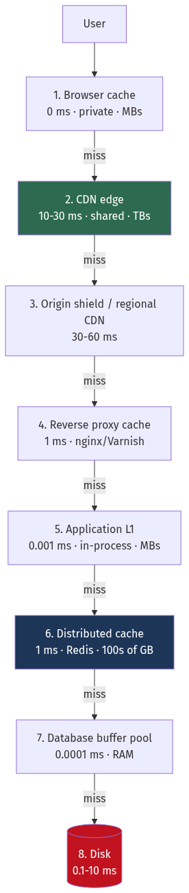
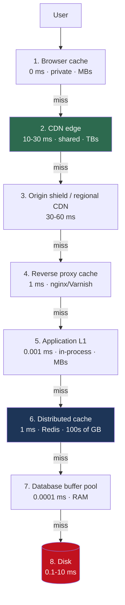
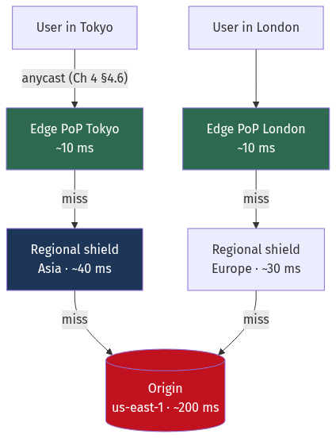
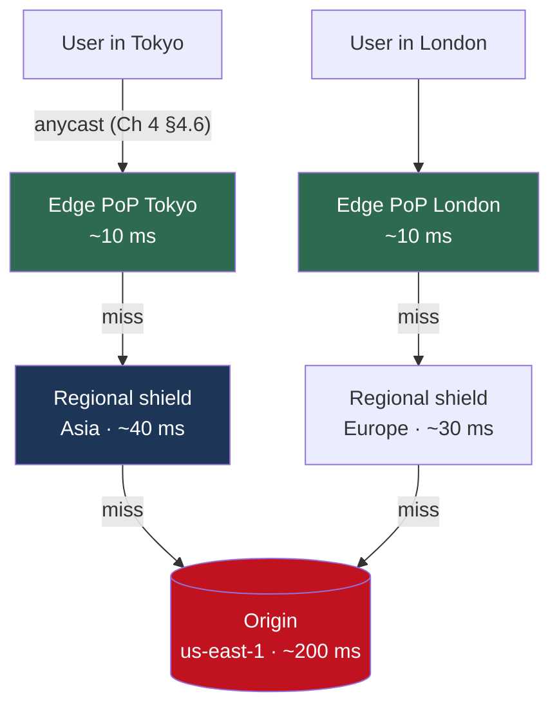

# Chapter 11 — Caching, CDNs and the Edge

[← Chapter 10](./10_distributed_transactions_and_integrity.md) · [Contents](./README.md) · [Next: Chapter 12 →](./12_messaging_and_event_streaming.md)

**Prerequisites:** [Chapter 2](./02_scalability_and_estimation.md) §2.9 (Zipf and hit-rate math), [Chapter 4](./04_networking_deep_dive.md) (RTTs, HTTP), [Chapter 6](./06_storage_engines_internals.md) §6.3 (buffer pools).

---

## What you'll learn

- The six-level caching hierarchy, and how to decide which level a given piece of data belongs at
- **Six caching strategies** — and why write-behind is the one that loses your data
- **Seven eviction policies**, including **W-TinyLFU**, which is what modern caches actually use and why LRU lost
- The five ways caches fail in production — **stampede, penetration, avalanche, hot key, big key** — each with a worked fix
- Why **cache invalidation** is genuinely hard, and the four approaches ranked by correctness
- How to **size a cache** from the access distribution rather than by guessing
- **CDN internals**: cache keys, `Vary`, origin shield, tiered caching, `stale-while-revalidate`, and purge strategies
- **Adaptive bitrate video** — the ladder, the chunk size, and the arithmetic of a buffer

---

## Start from zero

A cache is a small, fast copy of something big and slow, kept close to whoever needs it.

You keep milk in the fridge rather than driving to the shop each time you want tea. The
fridge is smaller than the shop, so you must choose what goes in it. It's closer, so getting
milk takes seconds instead of twenty minutes. And there's a catch: the milk in your fridge
might be older than the milk in the shop. If the shop changes its stock and you don't know,
you're working from stale information.

That's the whole subject:

| Fridge | Cache |
| --- | --- |
| Closer than the shop | Lower latency |
| Smaller than the shop | Must decide what to keep — **eviction** |
| Might hold old milk | **Staleness** |
| Deciding what to throw out | **Eviction policy** |
| "Use by" date | **TTL** |
| Everyone raiding the shop when the fridge is empty | **Cache stampede** |

Caching is the highest-leverage technique in system design, for one reason: it exploits the
fact that **access is never uniform**. A tiny fraction of your data serves most of your
requests ([Chapter 2](./02_scalability_and_estimation.md) §2.9 — 1% of a catalogue serves 72%
of reads). So a cache holding 1% of your data at 100× the speed transforms the system.

And it has exactly one hard problem, which Phil Karlton famously named: *there are only two
hard things in computer science — cache invalidation and naming things.* Everything difficult
in this chapter is a variation of **"how do I know this copy is still correct?"**

---

## The mental model



<details>
<summary>Diagram source (Mermaid)</summary>



</details>

📐 **Each level up is roughly 10× faster and 10× smaller.** The design question for any piece
of data is: *what is the highest level it can safely live at, and for how long?*

💡 **Push work toward the user.** A request served by the browser cache costs you nothing at
all. A request served by the CDN costs you nothing but the CDN's bill. Only requests that
reach your origin cost you compute, database load and engineering attention.

---

## Deep dive

### 11.1 📐 What a hit rate is actually worth

The hit rate is the only number that matters, and it converts into two different benefits.

```
Cache hit latency:  1 ms
Cache miss latency: 50 ms (database round trip)

Effective latency = h × 1 + (1 − h) × 50
```

| Hit rate | Effective latency | Database load |
| --- | --- | --- |
| 0% | 50.0 ms | 100% |
| 50% | 25.5 ms | 50% |
| 80% | 10.8 ms | 20% |
| 90% | 5.9 ms | 10% |
| 95% | 3.5 ms | **5%** |
| 99% | 1.5 ms | **1%** |
| 99.9% | 1.05 ms | 0.1% |

⚠️ **Read the two right-hand columns separately, because they behave differently.**

- **Latency** has sharply diminishing returns. 90% → 99% improves it from 5.9 ms to 1.5 ms — a
  4× gain for a large cache increase.
- **Database load** halves with every halving of the miss rate, all the way down. 90% → 99%
  takes the database from 10% to 1% of traffic — a **10× reduction**, which may be the
  difference between one database and ten.

💡 **So ask which resource is binding.** If you're latency-bound, stop optimising the hit rate
past ~95%. If you're database-capacity-bound, keep going — every point of hit rate is worth
real money.

📐 **The miss cost is what actually kills you.** A 95% hit rate sounds excellent until you
compute the miss traffic:
```
1,000,000 requests/second at 95% hit rate
→ 50,000 requests/second reaching the database

Drop to 90% (a cache node fails, halving capacity):
→ 100,000 requests/second — the database load DOUBLED from a 5-point change.
```
⚠️ **Cache capacity loss is non-linear in origin load.** This is why losing one cache node
often takes down the database, and why cache clusters need headroom just like application
tiers ([Chapter 3](./03_reliability_availability_performance.md) §3.5).

### 11.2 The six caching strategies

#### 1. Cache-aside (lazy loading) — the default

The application manages the cache explicitly.

```go
func GetUser(ctx context.Context, id int64) (*User, error) {
    if u, err := cache.Get(ctx, key(id)); err == nil {
        return u, nil                                  // hit
    }
    u, err := db.GetUser(ctx, id)                      // miss
    if err != nil {
        return nil, err
    }
    // Jittered TTL prevents synchronised expiry (§11.4 avalanche).
    cache.Set(ctx, key(id), u, 300*time.Second+jitter(60*time.Second))
    return u, nil
}
```

✅ Only caches what's actually requested. Resilient — if the cache dies, the app still works.
⚠️ Every miss pays the full latency. Cold start is slow. Code must handle caching everywhere
it reads.

#### 2. Read-through

The cache itself loads from the database on a miss. The application only talks to the cache.

✅ Caching logic lives in one place, not scattered through the application.
⚠️ Requires a cache that supports it (Caffeine, Guava, Ehcache, DynamoDB DAX). If the cache is
down, the app can't read at all — it's now a hard dependency.

#### 3. Write-through

Every write goes to the cache **and** the database, synchronously, before returning.

✅ Cache is never stale.
⚠️ Every write pays both latencies. And you cache data that may never be read — wasting cache
space on write-heavy, read-rarely data.

#### 4. Write-behind (write-back) — ⚠️ the dangerous one

Write to the cache; return immediately; flush to the database asynchronously.

✅ Extremely fast writes. Multiple updates to the same key coalesce into one database write.
⚠️ **If the cache dies before flushing, those writes are gone.** There is no log, no
acknowledgement from a durable store, nothing to recover from.

💡 **When it's legitimate:** view counters, "last seen" timestamps, analytics events —
anything where losing a few seconds of updates is acceptable and the write volume would
otherwise be crushing. A view counter incremented in Redis and flushed to the database every
10 seconds turns 100,000 writes/second into 10.
⚠️ **Never for:** orders, payments, inventory, anything a user was told succeeded.

#### 5. Write-around

Write only to the database; let the cache populate on the next read.

✅ Avoids polluting the cache with write-once-read-never data (bulk imports, logs).
⚠️ The first read after a write is always a miss.

#### 6. Refresh-ahead

Proactively refresh entries that are about to expire and are being actively read.

✅ Popular keys never expire under load, so users never pay a miss.
⚠️ Wastes work refreshing things nobody asks for again. Needs access-frequency tracking.

| Strategy | Read latency | Write latency | Consistency | Data-loss risk |
| --- | --- | --- | --- | --- |
| Cache-aside | Miss = slow | DB only | Eventually | None |
| Read-through | Miss = slow | DB only | Eventually | None |
| Write-through | Fast | ⚠️ Slow (both) | Strong-ish | None |
| **Write-behind** | Fast | **Fastest** | Weak | ⚠️ **Real** |
| Write-around | First read slow | DB only | Eventually | None |
| Refresh-ahead | ✅ Always fast | DB only | Eventually | None |

💡 **The common production combination is cache-aside for reads + write-through-with-invalidate
for writes**: on write, update the database and **delete** the cache key (don't update it —
see §11.5).

### 11.3 Eviction policies

The cache is full. Something must go.

| Policy | Evicts | ✅ | ⚠️ |
| --- | --- | --- | --- |
| **LRU** | Least recently used | Simple, good for temporal locality | **Destroyed by a scan** — one sweep evicts everything |
| **LFU** | Least frequently used | Handles stable popularity | Old popular items never leave ("cache pollution by history") |
| **FIFO** | Oldest inserted | Trivial | Ignores usage entirely |
| **CLOCK / Second-chance** | Approximate LRU via a reference bit | O(1), no list manipulation | Approximate |
| **ARC** | Adaptively balances recency and frequency | Self-tuning | Patented (expired now); complex |
| **W-TinyLFU** | Admission control + segmented LRU | ⭐ **Near-optimal in benchmarks** | More complex to implement |
| **Random** | A random entry | O(1), surprisingly decent | Unpredictable |
| **TTL** | Anything expired | Bounds staleness | Not a capacity policy on its own |

#### ⚠️ Why plain LRU is worse than you think

```
Cache holds 1,000 items. Working set = 900 hot items → 90% hit rate. 
Then one analytics job scans 10,000 cold items.

LRU: each cold item is "most recently used", evicting a hot item.
     After the scan, all 1,000 slots hold cold items nobody wants.
     Hit rate: 90% → ~0%. Database load: 10× overnight.
```

This is **cache pollution by scan**, and it's why PostgreSQL uses a ring buffer for sequential
scans ([Chapter 6](./06_storage_engines_internals.md) §6.3) rather than letting them into the
main buffer pool.

#### 💡 W-TinyLFU — what modern caches actually use

The insight: **the problem isn't which item to evict, it's which item to admit.**

```
1. A new item arrives and the cache is full.
2. Compare its estimated frequency against the frequency of the eviction candidate.
3. Admit the newcomer ONLY if it is more frequent than what it would displace.
```

Frequency is estimated with a **Count-Min Sketch**
([Chapter 23](./23_building_blocks_and_algorithms.md)) — a few bits per counter rather than a
full frequency table — plus a **doorkeeper** Bloom filter that cheaply rejects
seen-exactly-once items. Counters are periodically halved so old popularity decays.

📐 **The result:** a one-off scan sees each item once, so each has frequency 1, so none is
admitted. **The hot set is untouched.** Published benchmarks put W-TinyLFU within a few percent
of Bélády's optimal offline algorithm across most real traces, comfortably ahead of LRU, LFU
and ARC.

**Where you'll meet it:** Caffeine (Java), Ristretto (Go), and — with a different mechanism but
the same goal — Redis's `allkeys-lfu` mode, which uses an 8-bit logarithmic counter with decay.

### 11.4 The five ways caches fail

#### ⚠️ Failure 1 — Cache stampede (thundering herd)

A popular key expires. Every concurrent request misses simultaneously and hits the database.

```
Key "homepage_feed" expires. 10,000 requests/second are in flight.
All 10,000 miss. All 10,000 query the database.
The database, sized for 500 queries/second, falls over.
```

⚠️ **Note the recursion:** the database is now slow, so regeneration takes longer, so more
requests pile up. Stampedes are self-amplifying.

**Four fixes, best last:**

```go
// 1. Mutex / single-flight — only one goroutine regenerates; the rest wait for it.
var group singleflight.Group
func Get(ctx context.Context, key string) (any, error) {
    if v, err := cache.Get(ctx, key); err == nil { return v, nil }
    v, err, _ := group.Do(key, func() (any, error) {   // 10,000 callers → 1 DB query
        v, err := db.Load(ctx, key)
        if err == nil { cache.Set(ctx, key, v, ttl) }
        return v, err
    })
    return v, err
}
```

```go
// 2. Probabilistic early expiration (XFetch) — the elegant one.
// As expiry approaches, each request has a growing chance of refreshing early,
// so exactly one tends to refresh BEFORE anyone experiences a miss.
func shouldRefreshEarly(deltaMs float64, expiry time.Time, beta float64) bool {
    // delta = how long the last regeneration took
    gap := -deltaMs * beta * math.Log(rand.Float64())
    return time.Now().Add(time.Duration(gap) * time.Millisecond).After(expiry)
}
```

```
3. Jittered TTL — spread expiry so keys don't die together:
   ttl = base + rand(0, base * 0.1)

4. Never expire hot keys; refresh them in the background (refresh-ahead, §11.2).
```

💡 **Single-flight is the one to reach for first** — it's a few lines, it's in Go's standard
extended library, and it converts 10,000 concurrent misses into one database query.

#### ⚠️ Failure 2 — Cache penetration

Requests for keys that **don't exist anywhere**. Every one misses the cache *and* finds
nothing in the database, so nothing is ever cached, so every request repeats.

```
Attacker requests /users/999999999, /users/999999998, …
Each: cache miss → DB query → no row → nothing cached → next request repeats.
Effectively a database DoS with no cache protection at all.
```

**Fixes:**
```
1. Cache the negative result — store a null marker with a SHORT TTL (30–60 s).
   ⚠️ Short, because the row may be created later.

2. Bloom filter of all valid keys in front of the cache.
   "definitely doesn't exist" → reject without touching the DB.
   10 bits per key = ~1% false positives, so ~99% of bogus requests stop at the filter.
   (Ch 23 derives the sizing.)

3. Validate input format — a UUID-shaped ID that isn't a valid UUID never reaches the DB.
```

#### ⚠️ Failure 3 — Cache avalanche

Many keys expire simultaneously — because they were all populated simultaneously, typically
after a deploy or a cache restart.

```
Cache restarts at 03:00. All keys repopulate over the next minute with TTL = 3600 s.
At 04:01, they ALL expire within the same minute.
Origin load spikes to 100% of traffic for as long as regeneration takes.
```

**Fixes:** jittered TTLs (again — this is the single most valuable one-line cache
improvement), staggered warm-up after a restart, and a circuit breaker in front of the origin
so the spike sheds rather than cascades.

#### ⚠️ Failure 4 — Hot key

One key receives a disproportionate share of traffic. **Sharding doesn't help** — by
definition that key lives on one node.

```
Celebrity profile: 200,000 requests/second, all for one key.
Redis handles ~100,000 ops/s/node → that node saturates.
The other 19 nodes in the cluster sit at 5%.
```

**Fixes:**

| Fix | Mechanism | Cost |
| --- | --- | --- |
| **Local L1 cache** | Cache in-process for 1–5 seconds | ⚠️ Staleness; per-instance memory |
| **Key replication** | Store as `key#0` … `key#9`; read a random one | Writes must update all N |
| **Client-side caching** | Redis 6 tracking: server invalidates client caches | Complexity |
| **Dedicated node** | Isolate the hot key | Operational |

💡 **The local L1 cache is usually the right answer**, and it's the pattern behind
**multi-tier caching**: a 1-second in-process cache on 100 application servers reduces 200,000
requests/second on Redis to at most 100 per second — a **2,000× reduction** — at the cost of
up to one second of staleness.

#### ⚠️ Failure 5 — Big key

A single value of hundreds of megabytes, or a collection with millions of elements.

```
A 500 MB value in Redis:
  Every GET transfers 500 MB — saturating the network and blocking the single thread
  DEL blocks for hundreds of ms (use UNLINK, which frees asynchronously)
  Replication of that key stalls the replication stream
```

**Fix:** split it. Keep values under ~100 KB and collections under ~10,000 elements. Store
large objects in S3 and cache the pointer.

### 11.5 Cache invalidation

Four approaches, ranked by correctness.

#### 1. TTL only — "eventually correct"

```
Set a TTL. Accept staleness up to that duration.
✅ Trivial. No coupling between writer and cache.
⚠️ Users see stale data for up to the TTL.
```
💡 Perfectly acceptable more often than people admit. A product description stale for 60
seconds harms nobody. **Ask what the actual cost of staleness is before engineering anything
more complex.**

#### 2. Write-through invalidation — delete on write

```go
func UpdateUser(ctx context.Context, u *User) error {
    if err := db.UpdateUser(ctx, u); err != nil { return err }
    return cache.Del(ctx, key(u.ID))   // DELETE, don't Set
}
```

⚠️ **Delete, don't update.** Two reasons:
1. **Concurrent-write race.** Two writers each `Set` their own value; the one that wins the
   race in the cache may not be the one that won in the database. Deleting lets the next read
   re-fetch the true current value.
2. **Wasted work.** Updating caches a value that may never be read.

⚠️ **But delete-on-write still has a race:**
```
T1 (read):  cache miss, reads DB → gets v1
T2 (write): writes v2 to DB, deletes cache key
T1:         writes v1 into the cache   ⚠️ STALE VALUE, and it will persist for the full TTL
```

**Mitigation — delayed double delete:**
```
1. Delete the cache key
2. Write to the database
3. Sleep briefly (e.g. 500 ms — longer than a typical read)
4. Delete the cache key AGAIN
```
This is a heuristic, not a proof. It shrinks the window; it doesn't close it.

#### 3. Versioned keys — ✅ correct, and underused

Include a version in the cache key. Old versions are never read again and simply expire.

```
key = "user:42:v7"
On update, increment the version. All readers now compute "user:42:v8" — a cold miss,
but never a stale hit. The old entry is orphaned and evicted naturally.
```
✅ **No invalidation race is possible**, because you never overwrite; you write somewhere new.
⚠️ Needs a way to distribute the version (a small versions hash, or embed `updated_at` in the
key).

💡 This is the same idea as **content-addressed URLs** for static assets —
`app.a3f9b2.js` with a one-year TTL. The URL changes when the content changes, so you never
need to purge anything.

#### 4. Event-driven invalidation via CDC — ✅ most robust

```
Database → WAL → Debezium → Kafka → invalidation consumer → cache.Del(key)
```
✅ Cannot be forgotten — every change to the database produces an invalidation, including
changes made by migrations, admin tools, or another service.
⚠️ Adds infrastructure and a few hundred milliseconds of lag.

💡 **This is the same mechanism as the transactional outbox**
([Chapter 10](./10_distributed_transactions_and_integrity.md) §10.3), applied to cache
invalidation. If you already run CDC for search indexing, invalidation is nearly free.

### 11.6 Sizing a cache

📐 **From the Zipf math in [Chapter 2](./02_scalability_and_estimation.md) §2.9:**
```
coverage(m) = H(m)/H(N) ≈ (ln m + 0.577)/(ln N + 0.577)
```

**Worked sizing.** 20 million products, 500-byte cached entries, target 90% hit rate:
```
0.90 = (ln m + 0.577)/(ln 20,000,000 + 0.577)
0.90 = (ln m + 0.577)/17.38
ln m = 15.07  →  m ≈ 3,500,000 items

Memory = 3.5M × 500 B = 1.75 GB of values
       + Redis overhead (~60–90 B/key for the dict entry, key string, and expiry) ≈ 0.3 GB
       ≈ 2.1 GB → provision 3 GB for headroom and fragmentation
```

⚠️ **Redis memory overhead is significant for small values.** A 50-byte value can cost 150
bytes of total memory. For millions of tiny keys, check `INFO memory` for
`used_memory_overhead` — and consider hashes, which store small collections far more compactly
with `hash-max-listpack-entries`.

**The empirical approach is better than the model.** Deploy with a modest cache, measure the
hit rate, and plot hit rate against size. The curve tells you where the knee is for *your*
distribution, which is usually not exactly Zipfian.

### 11.7 Redis vs Memcached

| | Redis | Memcached |
| --- | --- | --- |
| Data structures | 9 types ([Ch 8](./08_nosql_and_polyglot_persistence.md) §8.2) | Strings only |
| Threading | Single-threaded execution | **Multi-threaded** |
| Persistence | RDB + AOF | None |
| Replication | Yes | No |
| Cluster | Built-in | Client-side sharding |
| Memory efficiency | Good | **Better for simple KV** (slab allocator, less overhead) |
| Max value | 512 MB | 1 MB (default) |
| Eviction | 8 policies | LRU only |

💡 **Choose Memcached when** you need pure, multi-threaded, memory-efficient string caching at
very high throughput on a big machine. **Choose Redis** for everything else — which is almost
always, because sorted sets, atomic operations, TTLs and replication turn out to matter.

### 11.8 CDN internals

A **CDN** is a globally distributed cache with a routing layer, and understanding four things
covers 90% of using one well.



<details>
<summary>Diagram source (Mermaid)</summary>



</details>

#### The cache key — where most CDN problems live

By default the key is roughly `(host, path, query string)`. Everything about CDN behaviour
follows from what's in that key.

⚠️ **Every distinct key is a separate cache entry.** If your URLs carry tracking parameters:
```
/product/42?utm_source=google&utm_campaign=spring&fbclid=abc123
/product/42?utm_source=email&utm_campaign=spring
/product/42
```
These are **three separate cache entries** for identical content. With a long tail of
marketing parameters, your hit rate collapses toward zero while the origin serves everything.

**Fix:** configure the CDN to **ignore or normalise** query parameters that don't affect the
response — allowlist the ones that do (`?page=2`, `?size=large`) and strip the rest.

📐 **The impact is dramatic:**
```
Before: 40 distinct utm/fbclid combinations per product → hit rate ~8%
After:  1 key per product → hit rate ~96%
Origin load reduced by 12×, from one configuration change.
```

#### `Vary` — the other cache-key trap

`Vary` tells the cache that the response depends on a request header.

```http
Vary: Accept-Encoding          ✅ Sensible — gzip vs brotli vs identity, ~3 variants
Vary: Accept-Language          ✅ Reasonable — one variant per supported language
Vary: User-Agent               ⚠️ CATASTROPHIC — thousands of distinct UA strings,
                                  so essentially every request is a unique cache entry
Vary: Cookie                   ⚠️ Same — every user has a different cookie
```

⚠️ **`Vary: User-Agent` or `Vary: Cookie` effectively disables caching**, and it's a common
accident from a framework default. If you need device-specific responses, use a normalised
device-class header (`CloudFront-Is-Mobile-Viewer`) rather than the raw UA.

#### Cache-control directives worth knowing

```http
Cache-Control: public, max-age=31536000, immutable
```
| Directive | Meaning |
| --- | --- |
| `public` / `private` | May shared caches store it? `private` = browser only |
| `max-age=N` | Freshness lifetime in seconds for **all** caches |
| `s-maxage=N` | Overrides `max-age` **for shared caches only** — the CDN can hold it longer than the browser |
| `immutable` | ✅ The content will never change — the browser won't even revalidate on reload |
| `no-cache` | ⚠️ Store it, but **revalidate before use**. Not "don't cache". |
| `no-store` | Never store it anywhere. This is the "don't cache" one. |
| `stale-while-revalidate=N` | ⭐ Serve the stale copy immediately, refresh in the background |
| `stale-if-error=N` | ⭐ Serve stale if the origin is erroring |

💡 **`stale-while-revalidate` is the single most valuable header in this list.** It eliminates
the user-visible cost of a cache miss on popular content: the user gets an instant (slightly
stale) response while the CDN refreshes behind the scenes. It also blunts stampedes at the
edge.

💡 **`stale-if-error` is free availability.** If your origin returns 5xx, the CDN keeps serving
the last good copy. A total origin outage becomes a stale-content incident rather than a
downtime incident.

📐 **The standard static-asset pattern:**
```
/static/app.a3f9b2c1.js    Cache-Control: public, max-age=31536000, immutable
/index.html                Cache-Control: public, max-age=0, s-maxage=60,
                                          stale-while-revalidate=600
```
The hashed asset is cached for a year and never revalidated — because a content change
produces a new filename. The HTML that references it is cached briefly at the edge. **You
never purge anything.**

#### Origin shield and tiered caching

⚠️ Without a shield, every one of ~300 edge PoPs independently misses and fetches from your
origin.
```
300 PoPs × 1 miss each for a new object = 300 origin requests for one object
```
An **origin shield** designates one PoP as the sole origin-facing cache. All other edges fetch
from it.
```
300 PoPs → 1 shield → 1 origin request
```
📐 This is a **300× reduction in origin load** and it's usually one configuration toggle. It
matters most immediately after a purge or a deploy, when everything is cold at once.

#### Purging

| Method | Speed | Use for |
| --- | --- | --- |
| **Versioned URLs** | ✅ Instant, no purge needed | **Static assets — always prefer this** |
| Purge by URL | Seconds | A single corrected page |
| **Purge by surrogate key / tag** | Seconds | ⭐ "Everything tagged `product-42`" — one call invalidates all related pages |
| Purge everything | Minutes, ⚠️ **dangerous** | Emergencies only |

⚠️ **"Purge everything" causes a self-inflicted stampede.** Every edge is now cold and every
request goes to origin — the avalanche of §11.4 at global scale. If you must, do it gradually,
or rely on the origin shield to absorb it.

💡 **Surrogate keys are the professional approach.** Tag responses on the way out:
```http
Surrogate-Key: product-42 category-shoes brand-nike
```
Then a single purge of `product-42` invalidates the product page, the category listings that
include it, the search results, and the sitemap — without knowing their URLs. Fastly
popularised this; most CDNs now support an equivalent.

### 11.9 Edge compute

CDNs now run your code at the edge: Cloudflare Workers, Lambda@Edge, Fastly Compute.

**Good uses:**
- A/B test assignment and personalisation without an origin round trip
- Auth token validation (reject invalid requests 200 ms before they'd reach you)
- Request routing, header manipulation, redirects
- Assembling a page from cached fragments
- Image resizing on the fly, keyed by URL

⚠️ **Constraints that shape what's possible:** short CPU budgets (a few milliseconds to
~50 ms), small memory limits, and — the important one — **no low-latency access to your
primary database**. Edge compute that calls your origin database on every request has
recreated the round trip it was meant to eliminate. Edge code should work from the request,
the cache, and a globally-replicated store (Workers KV, Durable Objects, D1).

### 11.10 Video delivery

Video is where CDNs stop being an optimisation and become the only possible architecture.
[Chapter 2](./02_scalability_and_estimation.md) §2.3 computed 58 Tbps for a YouTube-scale
service — an origin cannot serve that.

**Adaptive bitrate streaming (HLS, DASH)** splits video into short segments, each encoded at
several qualities. The player measures throughput and picks a rendition per segment.

```
manifest.m3u8
  ├─ 240p  (400 kbps)  → seg001.ts, seg002.ts, …
  ├─ 480p  (1 Mbps)    → seg001.ts, seg002.ts, …
  ├─ 720p  (2.5 Mbps)  → seg001.ts, seg002.ts, …
  ├─ 1080p (5 Mbps)    → seg001.ts, seg002.ts, …
  └─ 4K    (15 Mbps)   → seg001.ts, seg002.ts, …
```

📐 **Segment length is a real trade-off:**

| Segment | Startup latency | Live latency | Overhead | Adaptation |
| --- | --- | --- | --- | --- |
| 2 s | Fast | ~6 s | Higher (more requests, more headers) | ✅ Responsive |
| 6 s | Moderate | ~18 s | Balanced | Standard |
| 10 s | Slow | ~30 s | Lowest | Sluggish |

⚠️ **Live latency ≈ 3 × segment duration**, because players buffer roughly three segments
before starting. This is why standard HLS live streams run 15–30 seconds behind reality, and
why **LL-HLS** and **CMAF chunked transfer** exist — they break segments into sub-second
chunks delivered with chunked transfer encoding, reaching 2–5 second latency.

📐 **Storage cost of the ladder:**
```
One hour of source video, encoded into 5 renditions:
  240p:  0.18 GB    480p: 0.45 GB    720p: 1.1 GB
  1080p: 2.25 GB    4K:   6.75 GB
  Total ≈ 10.7 GB per source hour — roughly 5× the 1080p source alone.
```
💡 This is why **per-title encoding** (Netflix) matters: a simple animated cartoon needs far
less bitrate than a fast-moving action scene for the same perceived quality. Netflix reported
average bitrate reductions around 20% from analysing each title rather than using one fixed
ladder — at their volume, an enormous saving in both storage and egress.

---

## Worked example — caching an e-commerce product page

*20 million products. 500,000 page views/second at peak. Product data changes rarely; prices
change hourly; stock changes constantly. Design the caching, and state the hit rate and origin
load at each layer.*

**Step 1 — Decompose the page by volatility.** This is the whole design.

| Component | Changes | Size | Staleness tolerance |
| --- | --- | --- | --- |
| Product name, description, images | Rarely (weekly) | 5 KB | Hours |
| Price | Hourly | 20 B | ⚠️ Minutes — legally significant |
| Stock level | Constantly | 20 B | Seconds |
| Reviews | Hourly | 10 KB | Minutes |
| Recommendations | Daily | 3 KB | Hours |
| Cart badge, user greeting | Per user | 100 B | ⚠️ Never cacheable publicly |

⚠️ **Caching the page as one blob forces the whole page to the shortest tolerance — seconds —
which makes the CDN nearly useless.** Split by volatility and cache each part appropriately.

**Step 2 — The layered design.**

```
L0 Browser:  static assets, 1 year, immutable (hashed filenames)
L1 CDN edge: product page shell (no price/stock), s-maxage=300,
             stale-while-revalidate=3600, stale-if-error=86400
L2 CDN edge: images, 1 year, immutable
L3 App L1:   in-process cache of hot products, 5 s TTL
L4 Redis:    product data 1 h · prices 60 s · reviews 5 min
L5 Postgres: source of truth
Stock:       fetched client-side after render, from Redis, 5 s TTL — never in the page HTML
```

💡 **Moving stock out of the cached HTML is the key move.** The page becomes cacheable for
minutes instead of seconds, and a tiny JSON call fills in the volatile part.

**Step 3 — Compute the hit rate at each layer.**

```
500,000 page views/second at peak.

L1 CDN (product shell), Zipf over 20M products:
  Edge caches roughly the top 200,000 products (LRU across PoPs)
  coverage = (ln 200,000 + 0.577)/(ln 20,000,000 + 0.577) = 12.79/17.38 = 74%
  Plus stale-while-revalidate keeps popular pages permanently warm → ~85% effective
  → 500,000 × 0.15 = 75,000 requests/second reach origin
```

```
L3 In-process L1 (100 app servers, 5 s TTL, 10,000 hot products each):
  With 75,000 req/s spread over 100 servers = 750 req/s per server
  A 5 s TTL on the top 10,000 products captures ~57% of remaining traffic
  → 75,000 × 0.43 = 32,250 requests/second reach Redis
```

```
L4 Redis (3.5M products cached, from §11.6):
  coverage = (ln 3,500,000 + 0.577)/17.38 = 15.65/17.38 = 90%
  → 32,250 × 0.10 = 3,225 requests/second reach PostgreSQL
```

📐 **The cumulative result:**
```
500,000 req/s at the edge  →  3,225 req/s at the database
= a 155× reduction. PostgreSQL comfortably serves 3,225 reads/second.
```

**Step 4 — Handle the failure modes explicitly.**

*Stampede on a viral product:*
```
Single-flight in the application layer: 10,000 concurrent misses → 1 DB query.
stale-while-revalidate at the CDN: users never wait for a refresh.
```

*Avalanche after a deploy:*
```
Jittered TTLs: ttl = 3600 + rand(0, 360)
Origin shield: 300 PoPs → 1 origin request per object
```

*Hot key (a product on the front page):*
```
The 5 s in-process L1 cache handles it: 200,000 req/s across 100 servers
becomes at most 100 Redis requests per 5 s = 20/s. A 10,000× reduction.
```

*Penetration (scraper enumerating IDs):*
```
Bloom filter of valid product IDs: 20M keys × 10 bits = 25 MB, ~1% false positive
→ 99% of bogus requests rejected before touching Redis or Postgres.
Plus negative caching with a 60 s TTL for the 1% that get through.
```

**Step 5 — Price changes must be prompt.** A stale price is a legal and trust problem, not
just a UX one.

```
Price update → Postgres → CDC (Debezium) → Kafka → invalidation consumer:
    redis.Del("product:42:price")
    cdn.PurgeSurrogateKey("product-42")
Propagation: ~1 second end-to-end.
Plus a 60 s TTL as a backstop if the invalidation pipeline fails.
```
💡 **Belt and braces: event-driven invalidation for speed, TTL for correctness.** If the CDC
pipeline breaks, staleness is bounded at 60 seconds rather than unbounded.

**Step 6 — Verify the failure budget.**
```
If Redis fails entirely:
  32,250 req/s hit PostgreSQL directly. It handles ~10,000. ❌ Outage.
Mitigation:
  - Redis cluster with replicas, so a single node loss removes 1/N of capacity, not all
  - Circuit breaker: on Redis failure, serve from the in-process L1 with an extended TTL
  - Load shedding at the origin (Ch 5 §5.6): serve 80% degraded rather than 0% correct
```
⚠️ **Always compute what happens when the cache is gone.** A system that only works with a
warm cache is a system that fails every time you restart it.

---

## Trade-offs

| Decision | Option A | Option B | Choose A when | Never choose A when |
| --- | --- | --- | --- | --- |
| Strategy | Cache-aside | Read-through | You want the cache to be optional | You want caching logic in one place |
| Writes | Write-through | Write-behind | Data matters | ⚠️ Never B for durable data — cache loss = data loss |
| On write | Update the cache | **Delete** the cache key | Never | Prefer B — updating races and wastes work |
| Eviction | LRU | W-TinyLFU | Simplicity; no scan traffic | Scans pollute your cache — B is scan-resistant |
| Invalidation | TTL only | Event-driven (CDC) | Staleness is genuinely harmless | Prices, permissions, anything with legal weight |
| Invalidation | Delete-on-write | **Versioned keys** | Simplicity | Correctness matters — B has no race at all |
| Cache store | Redis | Memcached | You need structures, TTL, replication | Pure multi-threaded string caching at max efficiency |
| Hot key | Replicate the key | Local L1 cache | Writes are frequent | Prefer B — 1 s of staleness for a 1000× reduction |
| Static assets | Purge on deploy | **Versioned URLs** | Never | Always B — no purge, one-year TTL, no stampede |
| CDN cache key | Include query string | Normalise/allowlist | Query genuinely changes the response | Tracking parameters — they destroy your hit rate |
| `Vary` | On `User-Agent` | On a normalised device class | ⚠️ Never | Always B — raw UA has thousands of values |
| Video segments | 2 s | 6 s | Low-latency live | VOD — longer segments have less overhead |

---

## How real companies do it

**Facebook's memcached deployment** is documented in *Scaling Memcache at Facebook* (NSDI
2013), and two ideas from it are worth stealing. **Leases**: on a miss, the cache hands one
client a token authorising it to set the value — everyone else waits. That's a
server-side single-flight, solving stampedes without application coordination. And
**"gutter" pools**: when a memcached node fails, clients fall back to a small pool of spare
servers rather than all stampeding the database — a direct mitigation for the non-linear
capacity-loss problem in §11.1.

**Netflix Open Connect** places physical appliances inside ISP networks. Content is
**pre-positioned overnight** based on predicted demand rather than pulled on demand, so the
cache hit rate at the ISP edge is extremely high and the origin serves almost nothing. It's
the logical endpoint of "move the bytes closer".

**Cloudflare's tiered cache** implements the origin shield of §11.8 by default, and they have
published the effect: without it, hundreds of data centres each independently miss and fetch
from origin; with it, one does. They've also written about `stale-while-revalidate` as an
availability feature, not just a latency one.

**Caffeine** (the Java cache library by Ben Manes) is the reference W-TinyLFU implementation,
and its published trace-based benchmarks against LRU, LFU, ARC and Bélády's optimal are the
clearest available evidence that admission control beats eviction policy. **Ristretto** is the
Go equivalent, built for Dgraph.

**Twitter's Pelikan** and its predecessor Twemcache exist because Twitter found that generic
cache configurations were badly suited to their workload mix; their published analysis of
cache workloads across hundreds of clusters is one of the few large-scale empirical studies of
real cache access patterns, and it confirms that most are heavily skewed but *not* exactly
Zipfian.

---

## Common mistakes

**Caching the whole page when one component is volatile.** The most volatile element forces
the TTL for everything. Decompose by volatility and fetch the volatile part separately.

**Updating the cache on write instead of deleting.** Concurrent writers race and the loser's
value can persist. Delete and let the next read repopulate.

**No jitter on TTLs.** Keys populated together expire together and avalanche. `ttl = base +
rand(0, base×0.1)` is one line and prevents a class of incidents.

**No single-flight on regeneration.** 10,000 concurrent misses become 10,000 database queries.

**Not caching negative results.** Requests for non-existent keys bypass the cache entirely,
turning the cache into a DoS amplifier.

**`Vary: User-Agent` or `Vary: Cookie`.** Effectively disables CDN caching, usually by
accident.

**Query strings in the CDN cache key.** UTM and click-ID parameters fragment one object into
dozens of cache entries.

**Purging everything.** A self-inflicted global stampede. Use versioned URLs so you never need
to.

**Assuming the cache is always warm.** Compute the origin load at 0% hit rate. If the system
can't survive a cache restart, it will fail every time you deploy.

**Write-behind for durable data.** Cache loss is data loss, with nothing to recover from.

**Ignoring the non-linear relationship between cache capacity and origin load.** Losing a
third of your cache nodes can double origin traffic.

**Storing large blobs in Redis.** Blocks the single thread on transfer, stalls replication,
and `DEL` blocks for hundreds of milliseconds — use `UNLINK` and, better, don't do it.

**Forgetting `stale-if-error`.** It converts an origin outage into a staleness event, free.

---

## Interview angle

**Q: How would you add caching to a slow read path?**

*Strong:* "First I'd check the access distribution, because caching only helps if it's skewed.
If the workload is time-series ingestion or unique-token lookups there's no popular subset and
a cache would have a near-zero hit rate. Assuming it's Zipf-like — which most human-facing
traffic is — then caching around 1% of the catalogue typically gets me 70%+ hit rate. I'd use
**cache-aside** so the cache is optional rather than a hard dependency, with **jittered TTLs**
so keys don't expire together, and **single-flight** so a popular key expiring produces one
database query rather than ten thousand. On writes I'd **delete** the key rather than update
it, because concurrent writers can race and leave the loser's value cached. And I'd
immediately compute what happens at 0% hit rate — if the origin can't survive a cache restart,
I haven't built a cache, I've built a load-bearing dependency with no durability."

**Q: A popular cache key expires and your database falls over. What happened and how do you prevent it?**

*Strong:* "**Cache stampede.** The key expires while thousands of requests are in flight; they
all miss simultaneously and all hit the database. It's self-amplifying — the database gets
slow, regeneration takes longer, more requests pile up. Four fixes, roughly in order of how
often I'd reach for them. **Single-flight**: only one request regenerates and the rest wait on
its result — a few lines, and it turns 10,000 queries into one. **Jittered TTLs** so keys
don't die together in the first place. **Probabilistic early expiration** — as expiry
approaches each request has a growing chance of refreshing early, so one tends to refresh
before anyone experiences a miss. And at the HTTP layer, **`stale-while-revalidate`**, which
serves the stale copy instantly while refreshing in the background so users never wait at all.
I'd also mention Facebook's **lease** mechanism from the memcached paper — the cache itself
hands one client a token authorising the refresh, which is single-flight implemented
server-side."

**Q: Your CDN hit rate is 15%. Diagnose it.**

*Strong:* "Almost certainly **cache-key fragmentation**, and I'd check three things. First,
**query strings**: if UTM parameters and click IDs are in the cache key, one product page
becomes forty separate entries and the hit rate collapses. Fix is to allowlist parameters that
genuinely change the response and strip the rest. Second, **`Vary`**: `Vary: User-Agent` or
`Vary: Cookie` means essentially every request is a unique variant — that's usually a
framework default nobody noticed, and it effectively disables caching. Third, **`Cache-Control`**:
`no-cache` doesn't mean 'don't cache', it means 'revalidate before use', but `private` or
`no-store` on a shared response does disable it. Beyond those, I'd add an **origin shield** —
without one, 300 edge PoPs each miss independently on a cold object, so you get 300 origin
requests for one file. And I'd check whether the TTL is simply too short relative to how often
the content actually changes."

**Q: Why is LRU a bad eviction policy, and what's better?**

*Strong:* "LRU is destroyed by scans. One analytics job reading ten thousand cold rows marks
each as most-recently-used, evicting your entire hot working set — hit rate goes from 90% to
near zero and database load jumps tenfold, from a job that isn't even user-facing. The modern
answer is **W-TinyLFU**, and its insight is that the problem isn't which item to *evict*,
it's which item to *admit*. When a new item arrives it's only admitted if its estimated
frequency exceeds that of the item it would displace — frequency estimated cheaply with a
Count-Min Sketch plus a doorkeeper Bloom filter, with periodic halving so old popularity
decays. A scan sees each item once, so nothing gets admitted, so the hot set survives
untouched. Benchmarks put it within a few percent of Bélády's optimal offline algorithm.
It's what Caffeine and Ristretto implement, and it's why databases like PostgreSQL use ring
buffers for sequential scans — same problem, older solution."

**Q: How do you invalidate a cache correctly?**

*Strong:* "Four approaches with genuinely different guarantees. **TTL only** is the simplest
and, honestly, correct more often than people admit — I'd ask what the actual cost of sixty
seconds of staleness is before engineering anything else. **Delete-on-write** is next, and
note it's delete, not update, because concurrent writers race. But it still has a window: a
reader that missed can write a stale value into the cache *after* the writer deleted it.
Delayed double-delete shrinks that window without closing it. **Versioned keys** actually
close it — put a version in the key so you never overwrite, you write somewhere new, and the
old entry is orphaned. That's the same idea as content-hashed asset URLs, where you get a
one-year TTL and never purge anything. And **CDC-driven invalidation** is the most robust:
every database change produces an invalidation event, including changes from migrations and
admin tools that application-level invalidation would miss. In production I'd combine
CDC for speed with a TTL as a backstop, so if the pipeline breaks, staleness is bounded rather
than permanent."

**Q: One product goes viral and its cache key gets 200,000 requests/second. What do you do?**

*Strong:* "Sharding doesn't help — by definition that key lives on one node, and Redis does
about 100,000 operations per second per node, so it saturates while the rest of the cluster
idles. The fix I'd reach for is a **short-lived in-process L1 cache**. With a one-second TTL
across a hundred application servers, those 200,000 requests per second become at most a
hundred Redis lookups per second — a 2,000× reduction — at the cost of up to one second of
staleness, which for a product page is nothing. If I needed stronger freshness I'd
**replicate the key** under N suffixed names and read a random one, at the cost of writes
having to update all N. Redis 6's client-side caching with server-driven invalidation is a
third option that gets you both, with more complexity. And I'd make sure this is automatic
rather than manual — you don't know in advance which product goes viral, so hot-key detection
should be a runtime property, not a configuration change."

---

## Recap

- **Hit rate converts into two different benefits**: latency has sharply diminishing returns
  past ~95%, but **database load halves with every halving of the miss rate**. Know which one
  you're buying.
- ⚠️ **Cache capacity loss is non-linear in origin load** — a 5-point hit-rate drop can double
  database traffic.
- **Cache-aside for reads, delete-on-write for writes** is the standard combination.
  ⚠️ **Write-behind loses data** — only for genuinely disposable counters.
- **LRU is destroyed by scans.** **W-TinyLFU** uses *admission control* rather than eviction
  policy and is near-optimal.
- The five failures: **stampede** (single-flight, jitter, early expiration), **penetration**
  (negative caching, Bloom filter), **avalanche** (jittered TTLs), **hot key** (local L1
  cache), **big key** (split it).
- **Invalidation ranked**: TTL < delete-on-write < **versioned keys** < **CDC**. Combine CDC
  for speed with a TTL as a correctness backstop.
- ⚠️ **CDN hit rate is destroyed by query strings in the cache key and by `Vary: User-Agent`.**
- **`stale-while-revalidate`** removes the user-visible cost of a miss;
  **`stale-if-error`** converts an origin outage into a staleness event.
- **Origin shield** turns 300 cold-object origin requests into 1.
- **Versioned URLs mean you never purge.** Never purge everything — it's a global stampede.
- **Decompose pages by volatility**, or the most volatile element sets the TTL for everything.
- **Always compute the origin load at 0% hit rate.** If you can't survive it, you don't have a
  cache — you have an undeclared dependency.

---

## Test yourself

1. Your cache hit rate is 92%, miss latency 60 ms, hit latency 1 ms. What is the effective
   latency? What happens to database load if the hit rate falls to 84%?
2. You cache 50,000 items from a 10-million-item Zipf-distributed catalogue. Estimate the hit
   rate. How many items would you need for 85%?
3. A nightly reporting job scans a large table and your API's latency triples for the next
   hour. Explain the mechanism and give two fixes.
4. You set `Cache-Control: no-cache` expecting the CDN not to store the response. What actually
   happens?
5. Your CDN reports a 22% hit rate on product pages that change weekly. Name three likely
   causes.
6. A single key receives 150,000 req/s. Your Redis cluster has 20 nodes each handling 100,000
   ops/s. Why does adding nodes not help, and what's the cheapest fix with its cost?
7. Write the sequence that produces a permanently stale cache entry despite correct
   delete-on-write, and give a design that makes it impossible.
8. You purge your entire CDN cache during an incident. Describe what happens to your origin
   over the next 60 seconds.
9. A live HLS stream with 6-second segments shows 20 seconds of latency. Explain the
   arithmetic and how you'd reduce it to under 5 seconds.
10. Your service caches user permissions with a 15-minute TTL. Security asks for revocation
    within 10 seconds. Design it.

<details>
<summary>Answers</summary>

1. Effective latency = 0.92 × 1 + 0.08 × 60 = 0.92 + 4.8 = **5.72 ms**.
   At 84%: 0.84 × 1 + 0.16 × 60 = **10.44 ms** — latency roughly doubles.
   But the more important number is **database load**: the miss rate goes from 8% to 16%, so
   the database receives **twice the traffic** from an 8-point hit-rate change. This
   non-linearity is why cache clusters need capacity headroom.

2. coverage(50,000) = (ln 50,000 + 0.577)/(ln 10,000,000 + 0.577) = (10.82 + 0.577)/(16.12 +
   0.577) = 11.40/16.70 = **68%**.
   For 85%: 0.85 × 16.70 = 14.19 = ln m + 0.577 → ln m = 13.62 → m ≈ **823,000 items**.
   So going from 68% to 85% requires **16× the cache**. That's the diminishing-returns curve —
   worth it if you're database-bound (miss rate 32% → 15%, halving origin load), probably not
   if you're latency-bound.

3. **Cache pollution by scan under LRU.** The reporting job reads a large number of cold rows;
   each becomes "most recently used" and evicts a hot entry. By the end of the scan the cache
   holds cold data nobody wants, so the hit rate collapses and stays low until the hot set is
   naturally re-cached — hence the hour-long tail.
   **Fixes:** (a) use a **scan-resistant policy** — W-TinyLFU's admission control refuses to
   admit items seen once, so the hot set survives; Redis's `allkeys-lfu` is a partial
   equivalent. (b) **Isolate the scan** — run reporting against a read replica or a separate
   analytical store so it never touches the serving cache, which also protects the database
   buffer pool. (c) If the cache supports it, mark the scan's reads as non-caching (the
   equivalent of PostgreSQL's ring buffer for sequential scans).

4. `no-cache` does **not** mean "don't cache". It means **"you may store this, but you must
   revalidate with the origin before serving it"**. So the CDN stores the response and sends a
   conditional request (`If-None-Match`/`If-Modified-Since`) on each subsequent hit, typically
   getting a cheap `304 Not Modified`. You still save bandwidth but pay an origin round trip
   every time. The directive that means "never store this anywhere" is **`no-store`**. If you
   want the CDN to hold it but not the browser, use `private` (browser only) or
   `s-maxage` (shared caches only).

5. (a) **Query strings in the cache key** — UTM parameters, `fbclid`, session or affiliate IDs
   fragmenting one page into dozens of entries. (b) **`Vary` on a high-cardinality header** —
   `Vary: User-Agent` or `Vary: Cookie` makes nearly every request a unique variant. (c)
   **TTL far shorter than the change frequency** — content changes weekly but `s-maxage` is
   60 seconds, so you're revalidating constantly for no reason. Also plausible: **no origin
   shield**, so hundreds of PoPs each miss independently; or `Set-Cookie` on the response,
   which many CDNs treat as automatically uncacheable.

6. Adding nodes doesn't help because **a key maps to exactly one node** — that's what sharding
   means. The hot key's node is at 150% of its capacity while the other 19 sit near idle;
   more nodes just adds more idle nodes.
   **Cheapest fix: a short-TTL in-process L1 cache** on the application servers. With a 1-second
   TTL across, say, 100 app servers, the 150,000 req/s becomes at most 100 Redis lookups per
   second — a **1,500× reduction** — because each server refreshes at most once per second.
   **Cost: up to 1 second of staleness**, and a small amount of memory per instance. If that
   staleness is unacceptable, replicate the key as `key#0`…`key#9` and read a random suffix,
   which costs write amplification instead.

7. The sequence:
   ```
   T1 (read):  cache miss → reads DB → gets v1  (but hasn't written to cache yet)
   T2 (write): writes v2 to DB → deletes cache key (which is already empty)
   T1:         writes v1 into the cache
   → the cache now holds v1 while the DB holds v2, and it persists for the full TTL
   ```
   **Design that makes it impossible: versioned keys.** Include a version or `updated_at` in
   the cache key — `user:42:v7`. T2's write increments the version to v8, so all subsequent
   readers compute `user:42:v8` and miss. T1's late write lands on `user:42:v7`, which nobody
   will ever read again; it simply expires. Since you never overwrite an existing key, there
   is no race to lose. (Delayed double-delete only shrinks the window; it doesn't eliminate
   it.)

8. **A global cache stampede.** Every edge PoP is now cold, so every request becomes an origin
   fetch. If you were serving 500,000 req/s at a 90% hit rate, origin load jumps from 50,000
   to 500,000 req/s instantly — a **10× spike** with no ramp. The origin saturates, latency
   climbs past the knee of the ρ/(1−ρ) curve, health checks start failing, instances are
   removed from rotation, and you get a cascading failure — *caused by the remediation*.
   Mitigations: an **origin shield** collapses the 300 PoPs into 1 origin request per object;
   **purge by surrogate key** instead of everything; and for static assets, **versioned URLs**
   so purging is never necessary. If you truly must purge broadly, do it in stages by tag or
   by path prefix.

9. **Latency ≈ 3 × segment duration**, because ABR players buffer roughly three segments before
   playback starts and maintain that buffer. At 6-second segments: 3 × 6 = 18 s, plus encoding
   and packaging overhead ≈ **20 s**. 
   **To get under 5 seconds:** (a) shorten segments to 2 s — that alone gets you to ~6–7 s but
   increases request overhead and hurts encoding efficiency; (b) use **LL-HLS or CMAF chunked
   transfer**, which splits each segment into sub-second chunks delivered via HTTP chunked
   transfer encoding so the player can begin consuming a segment before it's fully produced —
   this is what actually gets you to 2–5 s; (c) reduce the player's target buffer, accepting
   more rebuffering risk; (d) at the extreme, use WebRTC for sub-second latency, at the cost of
   losing CDN-scale distribution.

10. Two mechanisms, and you need both.
    **Primary — event-driven invalidation:** on any permission change, publish an event
    (transactional outbox or CDC) that consumers use to `DEL` the affected cache keys, both in
    Redis and in every application instance's in-process cache. In-process caches need a
    broadcast — Redis pub/sub or Redis 6 client-side-caching invalidation — because you can't
    reach them with a single `DEL`. End-to-end this lands in roughly 1 second.
    **Backstop — shorten the TTL** on permission entries from 15 minutes to, say, 30 seconds.
    That bounds staleness if the invalidation pipeline fails, at the cost of more cache misses
    on a small, cheap dataset.
    ⚠️ Also handle the **negative case**: revocation must invalidate *cached allows*, and any
    long-lived artifact derived from permissions — a JWT with embedded scopes, for instance —
    can't be invalidated by clearing a cache at all. If tokens carry permissions, you need
    short token lifetimes plus a revocation list, which is
    [Chapter 18](./18_security_and_identity.md)'s problem.

</details>

---

## Further reading

- Nishtala et al., *Scaling Memcache at Facebook*, NSDI 2013 — leases, gutter pools, and the best real-world cache paper
- Einziger, Friedman & Manes, *TinyLFU: A Highly Efficient Cache Admission Policy* (2017)
- Vietri et al., *Driving Cache Replacement with ML-based LeCaR* — for where eviction research went next
- Yang, Yue et al., *A Large Scale Analysis of Hundreds of In-memory Cache Clusters at Twitter*, OSDI 2020
- Fastly, *Surrogate keys* documentation — the reference for tag-based purging
- Netflix Technology Blog, *Per-Title Encode Optimization* and *Open Connect* overview
- RFC 9111 (HTTP Caching) and RFC 5861 (`stale-while-revalidate`, `stale-if-error`)

---

[← Chapter 10](./10_distributed_transactions_and_integrity.md) · [Contents](./README.md) · [Next: Chapter 12 — Messaging and Event Streaming →](./12_messaging_and_event_streaming.md)
