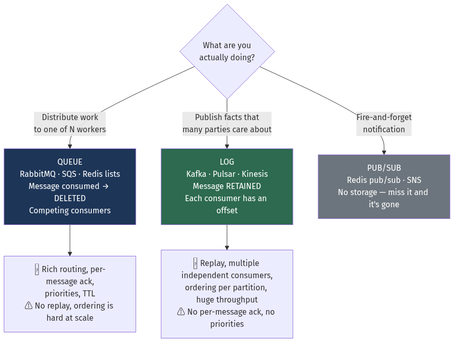
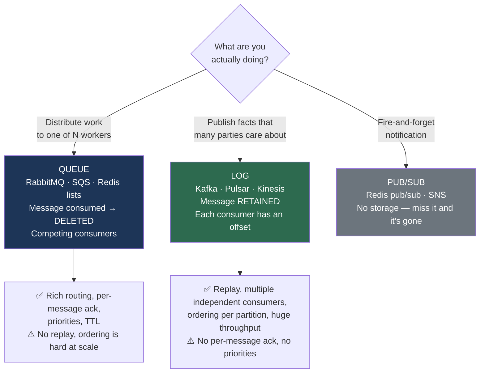
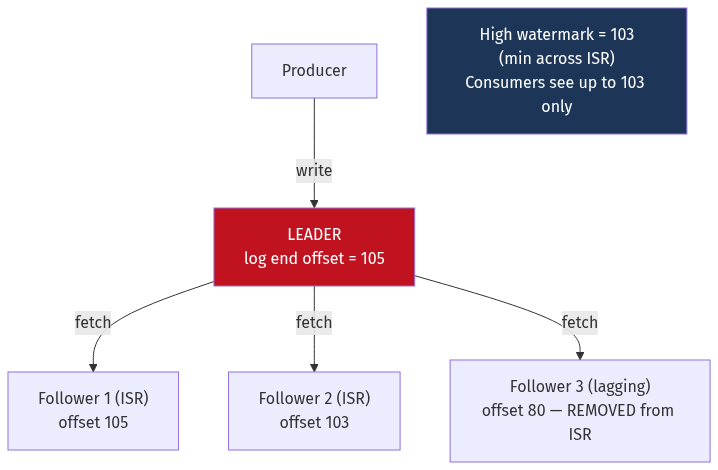
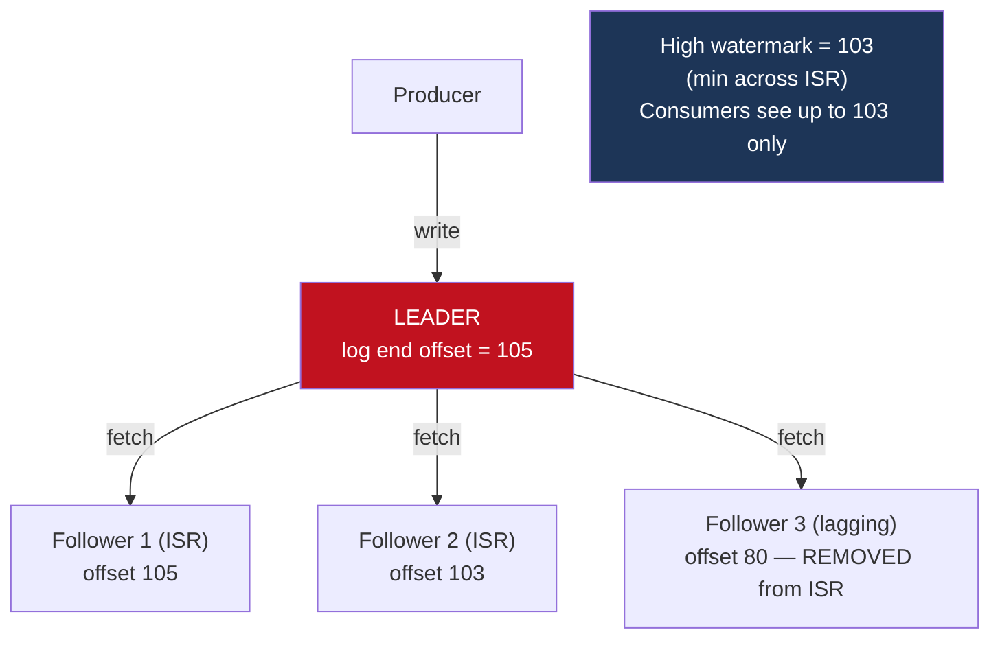
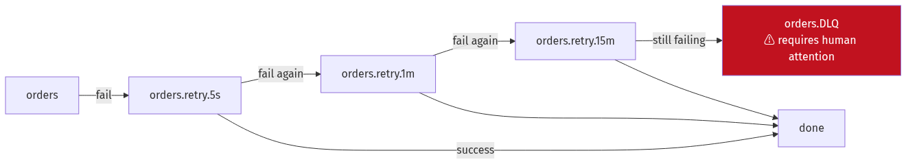
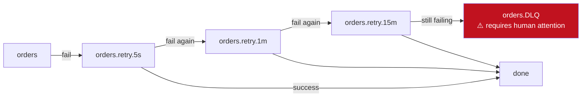
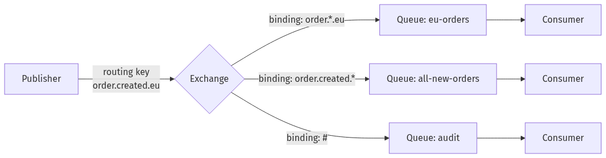
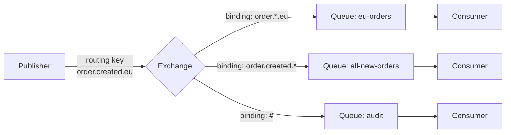
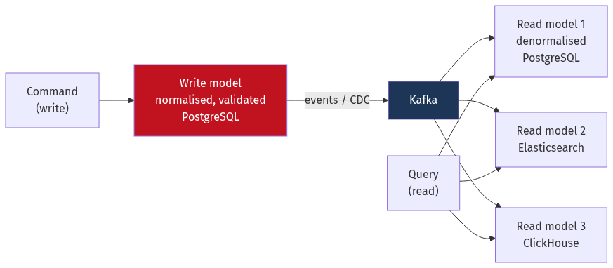
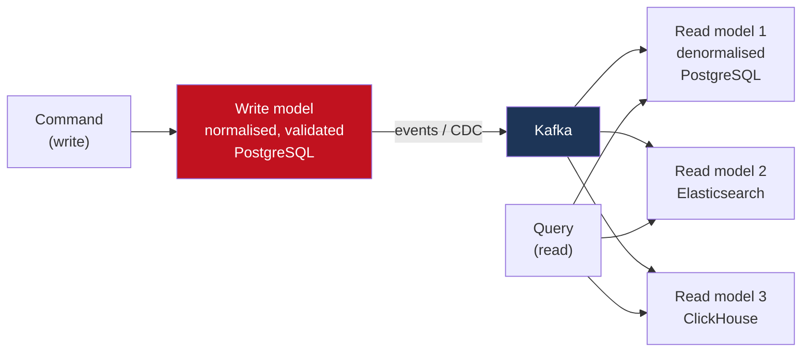

# Chapter 12 — Messaging and Event Streaming

[← Chapter 11](./11_caching_cdn_and_edge.md) · [Contents](./README.md) · [Next: Chapter 13 →](./13_big_data_batch_stream_analytics.md)

**Prerequisites:** [Chapter 6](./06_storage_engines_internals.md) §6.1 (sequential I/O), [Chapter 10](./10_distributed_transactions_and_integrity.md) (idempotency, outbox, exactly-once).

---

## What you'll learn

- The precise difference between a **queue**, a **log** and a **stream**, and why it determines your architecture
- **Kafka internals** — segments, zero-copy, the page cache, ISR and the high watermark, leader epochs, and why one broker does a million messages a second
- How **consumer group rebalancing** works, why the old protocol caused "stop the world", and what cooperative sticky assignment fixed
- **`acks`, `min.insync.replicas`** and the exact configuration that silently loses data
- **Kafka's exactly-once semantics** — what they cover and, more importantly, what they don't
- **RabbitMQ/AMQP** routing, prefetch, and quorum queues — and when a broker beats a log
- **Dead letter queues, poison pills and retry topics** done properly
- **Backpressure** — why unbounded queues are worse than dropping
- **Event sourcing and CQRS**, with the failure modes nobody mentions

---

## Start from zero

Two ways for one part of a system to tell another part something.

**Synchronous — you phone them.** You dial, you wait, they answer, you speak, they respond,
you hang up. You know they got it. But you were blocked the entire time, and if they don't
answer, you're stuck.

**Asynchronous — you post a letter.** You write it, drop it in the box, and carry on with your
day. They read it whenever they get to it. You don't know exactly when. But neither of you had
to be available at the same moment.

That's the whole distinction, and everything follows from it.

```
Sync:  Order service ──calls──> Email service
       If Email is down, the ORDER FAILS.
       Availability: 0.999 × 0.999 = 99.8%

Async: Order service ──writes──> Queue ──> Email service
       If Email is down, the message waits. The order succeeds.
       Availability of ordering: 99.9% (the queue is not in the order's critical path)
```

⚠️ **The thing you're buying is decoupling in time.** Producer and consumer no longer need to
be up simultaneously, or run at the same speed, or scale together.

**The thing you're paying is certainty.** You no longer know when — or, without care, whether —
the work happened. Every guarantee you took for granted with a function call has to be
rebuilt: ordering, exactly-once, error handling, backpressure. This chapter is that rebuild.

And there's a second, subtler idea. A **postbox** is emptied — once the letter is delivered
it's gone. A **ledger** is appended to — every entry stays, and anyone can read the whole
history from the beginning, as many times as they like. That distinction, queue versus log, is
the biggest architectural fork in this chapter.

---

## The mental model



<details>
<summary>Diagram source (Mermaid)</summary>



</details>

💡 **The question that decides it:** *does more than one system care about this message, now
or in the future?* If yes — or if you might ever want to replay it — you want a log. If it's
work to be done exactly once by one worker, a queue is simpler and gives you better tools.

---

## Deep dive

### 12.1 Queue vs log — the differences that matter

| | **Queue** (RabbitMQ, SQS) | **Log** (Kafka, Pulsar) |
| --- | --- | --- |
| After consumption | **Deleted** | **Retained** for the retention period |
| Consumer position | Broker tracks per-message state | **Consumer tracks an offset** |
| Multiple consumers | Compete for messages | Each group reads **everything** independently |
| Replay | ❌ Impossible | ✅ Reset the offset |
| Ordering | Hard once you have >1 consumer | ✅ Guaranteed **per partition** |
| Per-message ack | ✅ Ack, nack, requeue individually | ❌ Offsets are a watermark, not per-message |
| Priorities | ✅ | ❌ (use separate topics) |
| Selective retry | ✅ Requeue one message | ⚠️ Blocks the partition, or use a retry topic |
| Throughput | 10k–100k msg/s | **1M+ msg/s per broker** |
| Storage model | Messages in memory/disk until acked | **Append-only log on disk** |

💡 **The single most consequential difference is replay.** With a log, adding a new consumer
six months later means reading from offset 0 and rebuilding its state from history. With a
queue, that data is gone — you'd need a backfill from the source database. This is why
event-driven architectures gravitate to logs.

⚠️ **The single most annoying difference is selective retry.** In a queue, one poison message
is nacked and set aside. In a log, offsets advance monotonically — you can't skip one message
and commit past it without either dropping it or blocking. §12.6 covers the standard fix.

### 12.2 Kafka's data model

```
Topic: "orders"
 ├─ Partition 0: [msg0][msg1][msg2][msg3] ...   ← ordered, immutable, append-only
 ├─ Partition 1: [msg0][msg1][msg2] ...
 └─ Partition 2: [msg0][msg1][msg2][msg3][msg4] ...
```

**A partition is the unit of everything**: ordering, parallelism, and replication.

📐 **The rules that follow:**
- Ordering is guaranteed **within a partition**, never across partitions
- A partition is consumed by **exactly one consumer** in a group at a time
- Therefore **max parallelism = partition count**. 10 partitions means at most 10 useful
  consumers; an 11th sits idle.

**Partitioning by key:**
```
partition = hash(key) % num_partitions

key = order_id  → all events for one order land in the same partition → ordered ✅
key = null      → round-robin (or sticky batching) → no ordering guarantee
```

⚠️ **Choosing the key is choosing your ordering guarantee**, and it has the same hotspot
problem as sharding ([Chapter 9](./09_replication_partitioning_consistency.md) §9.8). Keying
by `customer_id` when one customer generates 40% of events gives you one saturated partition
and nine idle ones.

⚠️ **You cannot decrease partition count**, and increasing it **breaks key-to-partition
mapping** — `hash(key) % 10` and `hash(key) % 20` send the same key to different partitions,
so ordering is violated across the change. **Over-provision partitions from the start.**

📐 **Sizing partitions:**
```
Target throughput:      500 MB/s
Per-partition ceiling:  ~10 MB/s producer, ~20 MB/s consumer (rules of thumb)
Partitions needed = max(500/10, 500/20) = 50

Then round up for future consumer parallelism: 100 partitions.
```
⚠️ But not arbitrarily many — each partition costs a file handle, memory for buffers, and
recovery time on broker failure. Confluent's guidance is to stay under roughly 4,000 partitions
per broker and 200,000 per cluster (pre-KRaft; KRaft raises this substantially).

### 12.3 Why Kafka is fast

Four mechanisms, all of which come back to
[Chapter 6](./06_storage_engines_internals.md) §6.1.

#### 1. Sequential I/O only

Kafka never updates in place. It appends to a segment file. Per Chapter 6, sequential writes
are ~150× faster than random ones on the same device — and on SSDs they drive write
amplification toward 1 rather than triggering constant garbage collection.

```
Log directory for one partition:
  00000000000000000000.log     ← segment (default 1 GB)
  00000000000000000000.index   ← offset → file position (sparse)
  00000000000000000000.timeindex ← timestamp → offset (sparse)
  00000000000000368120.log     ← next segment
```
💡 **Deletion is a file unlink.** Retention expiry deletes whole segments, so cleanup costs
nothing — contrast with the tombstone problem in
[Chapter 6](./06_storage_engines_internals.md) §6.5.

#### 2. The OS page cache, not a JVM heap cache

Kafka stores nothing in its own heap. Written data lands in the page cache and is flushed by
the kernel; reads come from the page cache if recent.

📐 **Why this is the right choice:**
```
Consumers are usually reading the newest data — the same data just written.
That data is still in the page cache → reads never touch disk at all.

And: no JVM garbage collection pressure from a large cache, and the cache
SURVIVES a broker process restart because it belongs to the kernel.
```

#### 3. Zero-copy (`sendfile`)

Sending a file to a socket normally copies data four times and switches context four times:

```
❌ Traditional:
   disk → kernel page cache → application buffer → kernel socket buffer → NIC
   4 copies, 4 context switches

✅ sendfile():
   disk → kernel page cache → NIC (via DMA, with only descriptors passed)
   ~1 copy, 2 context switches
```
📐 Roughly **2–3× more throughput** and dramatically less CPU per byte.

⚠️ **Zero-copy requires that Kafka not transform the bytes.** Enabling SSL/TLS, or having the
broker recompress messages because producer and topic compression codecs differ, forces the
data through userspace and **disables zero-copy**. This is a real and commonly-overlooked
performance cliff — keep producer and broker compression settings aligned.

#### 4. Batching and compression

Producers accumulate messages and send them as a batch. Compression is applied to the **whole
batch**, not per message.

```
100 JSON messages × 1 KB, individually: 100 KB, 100 network round trips
As one compressed batch:                ~20 KB, 1 round trip
```
📐 Batching is the dominant throughput lever, and it's controlled by two settings that trade
latency for throughput:
```
linger.ms = 0    → send immediately, tiny batches, lowest latency, lowest throughput
linger.ms = 10   → wait up to 10 ms to fill a batch → often 10× throughput
batch.size = 16384 (default) → raise to 64–256 KB for high-throughput pipelines
```

| Codec | Ratio | CPU | Use when |
| --- | --- | --- | --- |
| `none` | 1× | — | Already-compressed payloads |
| `snappy` | ~2× | Low | Balanced default |
| `lz4` | ~2× | **Lowest** | Throughput-critical |
| `zstd` | **~3–4×** | Moderate | ⭐ Best ratio; usually worth it for network/storage savings |
| `gzip` | ~3× | ⚠️ High | Legacy |

### 12.4 Replication, ISR and the high watermark

Each partition has one **leader** and N−1 **followers**. Producers and consumers talk only to
the leader; followers fetch from it exactly like consumers do.

**ISR (In-Sync Replicas)** — the set of replicas caught up with the leader (within
`replica.lag.time.max.ms`, default 30 s).

**High watermark** — the highest offset replicated to **all** ISR members.
⚠️ **Consumers can only read up to the high watermark**, never beyond. This prevents a consumer
from reading a message that could still be lost if the leader fails.



<details>
<summary>Diagram source (Mermaid)</summary>



</details>

#### 📐 `acks` and `min.insync.replicas` — the config that loses data

| `acks` | Leader waits for | Durability |
| --- | --- | --- |
| `0` | Nothing — fire and forget | ⚠️ Loses on any failure, silently |
| `1` | Leader's own log only | ⚠️ **Loses if the leader dies before followers fetch** |
| `all` | All **in-sync** replicas | Depends on `min.insync.replicas` |

⚠️ **The trap that catches everyone:**
```
replication.factor = 3
acks = all
min.insync.replicas = 1     ← THE PROBLEM

Two followers fall behind and leave the ISR. ISR = {leader}.
acks=all is now satisfied by the leader ALONE.
The leader dies. Those writes are gone, and the producer was told they succeeded.
```

✅ **The correct configuration:**
```
replication.factor    = 3
min.insync.replicas   = 2      ← at least 2 replicas must have it
acks                  = all
```
📐 This tolerates **one** replica failure while remaining writable, and guarantees every
acknowledged write exists on at least two brokers. Losing two replicas makes the partition
**read-only** — writes fail with `NotEnoughReplicasException` — which is the correct behaviour:
refuse rather than silently accept unreplicated data.

💡 **The general rule: `replication.factor = min.insync.replicas + 1`.** It's the smallest
setting that lets you lose one node without either losing data or losing availability.

#### ⚠️ Unclean leader election

```
unclean.leader.election.enable = false   ← default, and correct
```
If set to `true`, a replica **outside** the ISR can become leader when no ISR member is
available. That replica is missing data, so **committed messages are silently deleted**. It
trades correctness for availability. Leave it off unless you have explicitly decided that
losing data is preferable to a partition being unavailable — a rare and deliberate choice.

**Leader epochs** solve a subtler problem: after a failover, how does a follower know how much
of its own log is valid? Each leadership term has an **epoch number**; followers ask the new
leader for the offset at which their epoch diverged and truncate to it. This replaced an older
high-watermark-based truncation that could lose or duplicate data in specific failure
sequences.

### 12.5 Consumer groups and rebalancing

A **consumer group** shares the work of a topic: each partition is assigned to exactly one
member.

```
Topic with 6 partitions, consumer group with 3 members:
  Consumer A: partitions 0, 1
  Consumer B: partitions 2, 3
  Consumer C: partitions 4, 5

Add a 4th consumer → rebalance → 2,2,1,1
Add a 7th consumer → one consumer sits IDLE (partitions are the limit)
```

**Offsets** are stored in the internal `__consumer_offsets` topic. On restart, a consumer
resumes from its committed offset.

⚠️ **Auto-commit is a correctness hazard:**
```
enable.auto.commit = true, auto.commit.interval.ms = 5000

Timeline: poll 100 messages → process 40 → auto-commit fires (commits ALL 100)
          → crash
          → restart resumes after message 100
          → messages 41–100 were NEVER PROCESSED and are silently lost.
```
✅ **Commit manually, after processing:**
```go
for {
    msgs := consumer.Poll(ctx)
    for _, m := range msgs {
        if err := process(m); err != nil { /* retry or DLQ — do NOT commit */ }
    }
    consumer.CommitSync()   // only after all messages are durably handled
}
```
📐 This gives **at-least-once**: a crash after processing but before committing replays those
messages. Combine with idempotent processing
([Chapter 10](./10_distributed_transactions_and_integrity.md) §10.4) for effectively-once.

#### Rebalancing protocols

⚠️ **Eager rebalancing** (the original) is a stop-the-world event:
```
1. ALL consumers revoke ALL partitions
2. Group coordinator computes a new assignment
3. All consumers receive new assignments and resume
→ The ENTIRE GROUP stops consuming for the duration (seconds to minutes)
```
With a large group and frequent membership changes, a group can spend more time rebalancing
than consuming — the "rebalance storm".

✅ **Cooperative sticky rebalancing** (KIP-429, default from Kafka 3.0) only revokes the
partitions that actually need to move:
```
partition.assignment.strategy = org.apache.kafka.clients.consumer.CooperativeStickyAssignor
```
Consumers keep partitions that aren't being reassigned and continue processing throughout.

✅ **Static membership** (KIP-345) prevents rebalances entirely for transient restarts:
```
group.instance.id = consumer-3     ← a stable identity across restarts
session.timeout.ms = 45000
```
A consumer that restarts within the session timeout reclaims its exact partitions with **no
rebalance at all**. This is the single most valuable setting for a group running in Kubernetes,
where pods restart routinely.

⚠️ **The classic accidental-rebalance bug:**
```
max.poll.interval.ms = 300000 (5 min, default)

If processing a batch takes longer than this, the coordinator assumes the consumer
is dead and rebalances it out — while it is still working.
The consumer then fails to commit ("rebalance in progress"), the work is redone
elsewhere, and it takes too long again → a permanent rebalance loop.
```
**Fix:** reduce `max.poll.records`, increase `max.poll.interval.ms`, or move slow work to a
separate thread pool and let the poll loop keep heartbeating.

### 12.6 Errors: DLQ, poison pills and retry topics

⚠️ **In a log, a failing message blocks its partition.** Offsets advance in order; you cannot
commit past a message you haven't handled without dropping it.

```
Partition 3: [msg100 ✓][msg101 ✓][msg102 ✗ POISON][msg103][msg104]...
The consumer retries msg102 forever. Messages 103+ are never processed.
The entire partition is stalled by one bad message.
```

**The standard solution — tiered retry topics:**



<details>
<summary>Diagram source (Mermaid)</summary>



</details>

The main consumer never blocks: on failure it **produces the message to a retry topic and
commits**. A separate consumer per retry topic applies the delay and reprocesses.

**Rules for doing this properly:**

| Rule | Why |
| --- | --- |
| ⚠️ **Retrying breaks ordering** | The retried message is now processed after later ones. Only use retry topics when per-key ordering isn't required. |
| **Distinguish retryable from terminal errors** | A malformed payload will never succeed — send it straight to the DLQ, don't burn three retry tiers on it |
| **Preserve the original context** | Headers carrying original topic, partition, offset, error, and attempt count — without these the DLQ is unusable |
| ⚠️ **Alert on any DLQ message** | A DLQ nobody watches is a data-loss mechanism with extra steps |
| **Build a replay tool** | Fixing the bug is half the job; reprocessing the DLQ is the other half |

💡 **When ordering *is* required**, retry topics are wrong. Instead **pause the partition**,
retry in place with backoff, and alert — accepting that the partition stalls. Correctness beats
throughput when order matters.

### 12.7 Exactly-once semantics in Kafka

Two mechanisms, and it's important to know their boundary.

**1. Idempotent producer** (`enable.idempotence=true`, default since Kafka 3.0):
```
Each producer gets a producer ID; each message carries a sequence number per partition.
The broker deduplicates: a retry with a sequence number it has already seen is discarded.
→ Eliminates duplicates from PRODUCER RETRIES.
```

**2. Transactions** — atomically write output records **and** consumer offsets:
```go
producer.InitTransactions()
producer.BeginTransaction()
producer.Produce(outputRecord)
producer.SendOffsetsToTransaction(offsets, groupMetadata)  // offsets are part of the txn
producer.CommitTransaction()   // output + offset commit are atomic
```
Consumers with `isolation.level=read_committed` never see records from aborted transactions.

⚠️ **The boundary, stated plainly: this covers `Kafka → process → Kafka`.**

```
✅ Read from Kafka, transform, write to Kafka        — exactly once
❌ Read from Kafka, write to PostgreSQL              — at-least-once
❌ Read from Kafka, call a payment API               — at-least-once
```
The database is not a participant in Kafka's transaction. For those, you need idempotency at
the destination — an **inbox** table, or an idempotency key
([Chapter 10](./10_distributed_transactions_and_integrity.md)).

📐 **The cost:** transactions add a coordinator round trip per transaction plus commit markers
in the log. Throughput typically drops 3–20% depending on transaction size. Batch many records
per transaction to amortise it.

### 12.8 Log compaction

Instead of deleting old segments by age, **compaction keeps the latest value for each key**.

```
cleanup.policy = compact

Before:  [k1=a][k2=b][k1=c][k3=d][k1=e][k2=f]
After:   [k3=d][k1=e][k2=f]        ← latest value per key retained
```

💡 **This turns a topic into a durable, replayable key-value store.** A new consumer reads from
the beginning and reconstructs the current state of every key. It's the mechanism behind:
- Kafka's own `__consumer_offsets` topic
- Kafka Streams' state-store changelogs
- CDC topics where you want the current row state, not the full history
- Configuration distribution ([Chapter 25](./25_case_studies_part2.md))

**Deletion in a compacted topic** uses a **tombstone** — a record with a key and a `null`
value. It marks the key deleted and is itself removed after `delete.retention.ms` (default
24 h), so consumers have time to observe it. ⚠️ Same resurrection hazard as
[Chapter 9](./09_replication_partitioning_consistency.md) §9.5: a consumer offline longer than
that window may never learn of the deletion.

### 12.9 RabbitMQ and message brokers

Kafka is a log. RabbitMQ is a **broker** with genuinely richer routing, and there are workloads
where it's clearly the better tool.



<details>
<summary>Diagram source (Mermaid)</summary>



</details>

| Exchange type | Routes by | Use for |
| --- | --- | --- |
| `direct` | Exact routing-key match | Point-to-point work distribution |
| `topic` | Pattern with `*` (one word) and `#` (many) | ⭐ Flexible event routing |
| `fanout` | Everything to every bound queue | Broadcast |
| `headers` | Header attribute matching | Rare; complex criteria |

**The settings that matter:**

```
prefetch (QoS) = 1..N     ⚠️ THE most important RabbitMQ setting
```
📐 Prefetch caps unacknowledged messages per consumer.
```
prefetch = 1     → perfect fairness, one message at a time, ⚠️ high round-trip overhead
prefetch = 100   → good throughput, ⚠️ a slow consumer hoards 100 messages
prefetch = 10-50 → the usual balance for variable processing times
```

**Acknowledgement modes:**
```
autoAck = true   ⚠️ message deleted on DELIVERY — a crash loses it
autoAck = false  ✅ explicit ack after processing; nack requeues or dead-letters
```

**Quorum queues** (RabbitMQ 3.8+) replace the old mirrored queues, using **Raft** for
replication. ✅ Use them for anything durable — classic mirrored queues had known
data-loss edge cases during partitions and are deprecated.

#### Kafka vs RabbitMQ

| | Kafka | RabbitMQ |
| --- | --- | --- |
| Model | Distributed log | Message broker |
| Throughput | **1M+ msg/s per broker** | 20k–100k msg/s |
| Retention | Days to forever | Until acknowledged |
| Replay | ✅ | ❌ |
| Routing | Topic + partition key only | ✅ **Rich** — topic patterns, headers, priorities |
| Per-message ack | ❌ | ✅ |
| Priority queues | ❌ | ✅ |
| Delayed delivery | ❌ (needs retry topics) | ✅ (plugin) |
| Consumers per message | Many groups, independently | One (per queue) |
| Ordering | Per partition | Per queue, single consumer |
| Operational weight | Heavier | Lighter |

💡 **Choose RabbitMQ for task distribution** — RPC-style work, jobs with priorities, complex
routing, per-message retry. **Choose Kafka for event streaming** — multiple independent
consumers, replay, high throughput, and events as a durable record rather than as work.

⚠️ **And note they're not exclusive.** Many systems run both: Kafka as the event backbone,
RabbitMQ or SQS for job queues.

### 12.10 The alternatives

| System | Model | Distinctive property |
| --- | --- | --- |
| **AWS SQS** | Queue | Fully managed, ⚠️ standard queues are **unordered and at-least-once**; FIFO queues are ordered but capped at 300 msg/s per message group |
| **AWS SNS** | Pub/sub fan-out | Fans out to SQS, Lambda, HTTP; often paired as SNS→SQS |
| **Apache Pulsar** | Log + queue | ⭐ **Separates compute (brokers) from storage (BookKeeper)** — scale them independently; native multi-tenancy and geo-replication |
| **NATS JetStream** | Log | Extremely lightweight, single binary, very low latency |
| **Redis Streams** | Log | Consumer groups without operating Kafka; ⚠️ limited by memory and Redis's durability model |
| **Google Pub/Sub** | Queue + pub/sub | Managed, global, automatic scaling |

💡 **Pulsar's compute/storage separation is its real differentiator.** Adding a Kafka broker
requires rebalancing partition data onto it — hours of network traffic. Adding a Pulsar broker
is instant because brokers are stateless; storage scales separately by adding bookies. Kafka's
**tiered storage** (KIP-405, GA in 3.6) closes much of this gap by offloading old segments to
object storage.

### 12.11 Backpressure

⚠️ **Producers faster than consumers is not a queue problem — it is an unbounded-growth
problem.**

```
Producer: 10,000 msg/s
Consumer:  8,000 msg/s
Queue grows by 2,000 msg/s, forever. There is no steady state.
```

Per [Chapter 2](./02_scalability_and_estimation.md) §2.4, Little's Law gives no answer here
because the system is unstable. Four responses:

| Strategy | Behaviour | Use when |
| --- | --- | --- |
| **Block the producer** | Producer slows to the consumer's rate | ✅ The producer can tolerate slowing |
| **Drop messages** | Shed load, oldest or newest first | Telemetry, metrics — loss is acceptable |
| **Buffer to disk** | Absorb bursts | Bursts are transient, not sustained |
| **Scale consumers** | Add capacity | ⚠️ Capped by partition count in Kafka |

⚠️ **An unbounded queue is the worst option and the most common default.** It converts a
throughput problem into an out-of-memory crash — and adds latency the whole way there, since
every message waits behind a growing backlog. **Bound every queue.**

```go
// Bounded channel: the producer blocks when full — backpressure by construction.
jobs := make(chan Job, 1000)

select {
case jobs <- job:
    // accepted
default:
    // ⚠️ Full. Decide explicitly: drop, or block, or shed with an error.
    metrics.Inc("jobs_dropped")
}
```

📐 **Monitoring: consumer lag is the metric.**
```
lag = log_end_offset − committed_offset

Lag stable         → consumer keeping up
Lag growing        → ⚠️ under-provisioned; it will never recover on its own
Lag spiky          → bursty producer; check whether it drains
```
💡 Alert on **lag in time**, not in messages. "500,000 messages behind" is meaningless without
throughput; "8 minutes behind" is immediately actionable. Kafka exposes this via
`kafka_consumergroup_lag` combined with consumption rate, or directly with tools like Burrow.

### 12.12 Event sourcing

Instead of storing current state, store the **sequence of events that produced it**. Current
state is a fold over the event log.

```
❌ State-oriented:
   accounts: { id: 1, balance: 750 }
   — you know the balance, and nothing about how it got there

✅ Event-sourced:
   AccountOpened      { id: 1, initial: 0    }
   MoneyDeposited     { id: 1, amount: 1000  }
   MoneyWithdrawn     { id: 1, amount: 250   }
   → fold to balance = 750
```

| ✅ Gains | ⚠️ Costs |
| --- | --- |
| Complete audit trail, by construction | Querying current state requires a fold or a projection |
| Time travel — state as of any moment | Event schema evolution is genuinely hard |
| Debug by replaying exactly what happened | Replaying millions of events is slow → **snapshots** |
| New projections from existing history | ⚠️ **Events are immutable — you cannot fix a bad one** |
| Naturally fits a log-based broker | Steep learning curve; most teams under-estimate it |

⚠️ **The immutability problem is the one that bites.** A bug writes 50,000 incorrect events.
You cannot edit them — the log is append-only and other consumers may have already acted on
them. You must write **compensating events**, and every projection must handle them correctly.

⚠️ **Schema evolution is the second.** An event written three years ago must still be
deserialisable today, because replay reads it. This means additive-only changes, versioned
event types, or an upcasting layer that transforms old events into the current shape on read.

📐 **Snapshots bound replay cost:**
```
Account with 1,000,000 events, replayed from scratch: ~10 seconds
With a snapshot every 1,000 events: load snapshot + replay ≤1,000 → ~10 ms
```

💡 **Be honest about when it's worth it.** Event sourcing is genuinely right for domains where
the *history is the product*: accounting ledgers, trading, regulated audit trails, order
lifecycles. For CRUD over a product catalogue it adds significant complexity for little
benefit. The most common failure is adopting it everywhere because it was adopted somewhere
successfully.

### 12.13 CQRS

**Command Query Responsibility Segregation**: separate the model you write through from the
models you read through.



<details>
<summary>Diagram source (Mermaid)</summary>



</details>

**Why:** reads and writes have genuinely different requirements. Writes want normalisation,
constraints and transactions; reads want denormalisation, precomputed aggregates, and possibly
a completely different storage engine. Forcing both through one model compromises each.

⚠️ **The unavoidable cost is eventual consistency.** A user writes, then immediately reads,
and the projection hasn't caught up — [Chapter 9](./09_replication_partitioning_consistency.md)
§9.3's read-your-writes problem, now by design.

**Mitigations:**
- Return the new state directly from the command, so the UI can render it without a read
- Read from the **write model** for the user's own recent changes
- Pass the projection's version/LSN and have the read wait for it (the causal token again)
- Optimistic UI: render the expected result, reconcile if it differs

💡 **CQRS does not require event sourcing**, and conflating them is the most common
misunderstanding. You can run CQRS with a plain relational write model and CDC-fed read models
— which is what most successful implementations actually are, and it's dramatically simpler
than full event sourcing.

---

## Worked example — order processing pipeline

*An e-commerce platform. 5,000 orders/second at peak. Each order must: update inventory, charge
payment, notify the warehouse, email the customer, and feed analytics. Ordering per customer
matters. Design the messaging.*

**Step 1 — Queue or log?**

```
How many systems care about "order created"?
  Inventory, Payment, Warehouse, Email, Analytics, Fraud, Recommendations = 7 and growing.
Will we want to replay?
  Yes — a new analytics model, a rebuilt search index, a bug fix requiring reprocessing.
```
→ **Log (Kafka).** With a queue, each new consumer would need its own copy of the message from
the producer, and there'd be no replay.

**Step 2 — Topic and partition design.**

```
Topic: orders.events
Key:   customer_id      ← ordering per customer, which is the stated requirement
```
⚠️ Not `order_id` — that would give ordering per order, but events for the *same customer*
could then be processed out of order across different orders, which matters for things like
credit limits.

📐 **Partition count:**
```
5,000 orders/s × ~2 KB per event = 10 MB/s
Per-partition producer ceiling ≈ 10 MB/s → 1 partition would just barely do it. Too tight.

Consumer parallelism is the real driver:
  Email consumer processes ~200 msg/s per instance (external SMTP call)
  5,000 / 200 = 25 instances needed → need ≥ 25 partitions

Round up for growth and for uneven key distribution: 64 partitions.
```
⚠️ Over-provision, because partitions cannot be reduced and increasing them breaks key
ordering.

**Step 3 — Producer configuration.**

```properties
acks=all
enable.idempotence=true          # dedupe producer retries
max.in.flight.requests.per.connection=5   # safe with idempotence enabled
compression.type=zstd            # ~3-4x, worth the CPU at this volume
linger.ms=10                     # batch for 10 ms → large throughput gain
batch.size=131072                # 128 KB
retries=2147483647               # retry indefinitely; delivery.timeout.ms bounds it
delivery.timeout.ms=120000
```

**Broker-side:**
```properties
replication.factor=3
min.insync.replicas=2            # ⚠️ NOT 1 — see §12.4
unclean.leader.election.enable=false
```

**Step 4 — Publish reliably from the order service.**

⚠️ Dual write ([Chapter 10](./10_distributed_transactions_and_integrity.md) §10.3) — the order
must not exist without its event.

```sql
BEGIN;
  INSERT INTO orders (...) VALUES (...);
  INSERT INTO outbox (aggregate_id, event_type, payload) VALUES (...);
COMMIT;
```
Debezium tails the WAL → Kafka. **One atomic write.**

**Step 5 — Consumer groups, one per concern.**

```
Consumer group: inventory-service   → reserve stock
Consumer group: payment-service     → charge
Consumer group: warehouse-service   → dispatch instruction
Consumer group: email-service       → confirmation
Consumer group: analytics-ingest    → ClickHouse
```
💡 Each group reads **all** messages independently at its own pace. The analytics consumer
being 10 minutes behind does not affect payments. This is the property a queue cannot give you.

**Step 6 — Consumer configuration.**

```properties
enable.auto.commit=false                 # ⚠️ commit AFTER processing (§12.5)
isolation.level=read_committed
partition.assignment.strategy=CooperativeStickyAssignor
group.instance.id=${POD_NAME}            # static membership — no rebalance on pod restart
session.timeout.ms=45000
max.poll.records=100
max.poll.interval.ms=300000
```

📐 **Verify the poll interval against real processing time:**
```
Email consumer: 100 records × 50 ms SMTP call = 5 seconds per batch
max.poll.interval.ms = 300,000 (5 min) → 60× headroom ✅

⚠️ If SMTP degrades to 3 s per call: 100 × 3 s = 300 s = exactly the limit
→ rebalance storm. Mitigate: max.poll.records=20, and a per-call timeout.
```

**Step 7 — Idempotency, because delivery is at-least-once.**

```sql
-- Inbox pattern, in the same transaction as the effect (Ch 10 §10.3)
BEGIN;
  INSERT INTO processed_events (event_id) VALUES ($1) ON CONFLICT DO NOTHING;
  -- 0 rows affected → already processed → skip
  UPDATE inventory SET reserved = reserved + $2 WHERE sku = $3;
COMMIT;
```
⚠️ The payment consumer additionally uses an **idempotency key** on the external API call,
because the inbox protects your database but not the payment provider's.

**Step 8 — Error handling per consumer.**

```
Email consumer (ordering NOT required):
  → retry topics: email.retry.30s → email.retry.5m → email.DLQ
  → the main partition never blocks

Inventory consumer (ordering IS required per customer):
  → ⚠️ retry topics would reorder events. Instead: retry in place with backoff,
    pause the partition, and alert. Correctness over throughput.
```
💡 This distinction — which consumers may reorder and which may not — is the design decision
people most often skip.

**Step 9 — Monitoring.**

```
Alert: consumer lag in TIME > 5 minutes (not message count)
Alert: any message in any DLQ (page)
Alert: under-replicated partitions > 0
Alert: ISR shrink rate > 0 sustained
Alert: rebalance rate > 1/hour per group
```

**Step 10 — Retention and compaction.**

```
orders.events:  retention.ms = 7 days      # enough to replay a week of history
                cleanup.policy = delete
                → 5,000/s × 2 KB × 604,800 s = 6 TB, × 3 replicas = 18 TB
                  ⚠️ Enable tiered storage (KIP-405) to offload old segments to S3

order.state:    cleanup.policy = compact   # current state per order, replayable forever
                → bounded by order count, not by event count
```

---

## Trade-offs

| Decision | Option A | Option B | Choose A when | Never choose A when |
| --- | --- | --- | --- | --- |
| Communication | Synchronous call | Async message | You need the result to continue | The callee's availability shouldn't affect yours |
| Broker | Queue (RabbitMQ/SQS) | Log (Kafka) | Task distribution, priorities, per-message retry | Multiple consumers, or you might ever replay |
| Kafka `acks` | `1` | `all` + `min.insync.replicas=2` | Loss is genuinely acceptable | Anything durable — `acks=1` loses on leader failure |
| `min.insync.replicas` | `1` | `2` | ⚠️ Never with `acks=all` — it silently voids the guarantee | Always 2 with RF=3 |
| Offset commit | Auto-commit | Manual after processing | ⚠️ Never in production | Always B |
| Rebalance strategy | Range/RoundRobin (eager) | CooperativeSticky + static membership | Legacy clients | Anything on Kubernetes |
| Error handling | Retry in place | Retry topics + DLQ | Ordering is required | Ordering isn't — B keeps the partition moving |
| Compression | `snappy` | `zstd` | CPU-constrained brokers | Network or storage cost dominates |
| `linger.ms` | `0` | `5–20` | Ultra-low latency required | Throughput matters — B is often 10× |
| Queue bounds | Unbounded | Bounded + explicit policy | ⚠️ Never | Always B — unbounded turns overload into OOM |
| Read model | Same as write model | CQRS projections | Simple CRUD | Reads and writes have genuinely different shapes |
| State storage | Current state | Event sourcing | Most domains | History *is* the product — ledgers, audit, trading |

---

## How real companies do it

**LinkedIn built Kafka** to replace a mess of point-to-point pipelines, and Jay Kreps' essay
*The Log* is the clearest statement of the underlying idea: a single ordered log as the
integration point between every system, with each consumer maintaining its own position. They
reported over 7 trillion messages a day by 2019.

**Uber** runs one of the largest Kafka deployments outside LinkedIn and published **uReplicator**
after finding Kafka's own MirrorMaker unreliable for cross-datacentre replication. Their
engineering posts on consumer-lag management and on their "Chaperone" end-to-end auditing
system are worth reading — they audit that every message produced was actually consumed, which
most organisations never verify.

**Confluent's exactly-once documentation** is careful about scope in a way that most secondary
sources are not. Read the caveats: EOS covers Kafka-to-Kafka, and any external sink needs its
own idempotency. The widespread belief that enabling EOS makes an entire pipeline
exactly-once, including database writes, is simply wrong and causes real bugs.

**Shopify** has written about using Kafka for order events with a strong emphasis on the
outbox pattern, precisely because a dual write between their monolith's database and Kafka
would drop events under load.

**Netflix** runs Kafka as the backbone of their Keystone pipeline, processing trillions of
events daily. A notable design choice: they deliberately run **separate Kafka clusters by
criticality tier**, so a misbehaving analytics producer cannot degrade the cluster carrying
operational events — blast-radius control applied to messaging.

---

## Common mistakes

**`acks=all` with `min.insync.replicas=1`.** Looks safe, isn't. When followers fall out of the
ISR, the leader alone satisfies "all", and its failure loses acknowledged writes. Set
`min.insync.replicas=2` with RF=3.

**Auto-commit enabled.** Commits offsets for messages you haven't processed. A crash silently
drops them. Commit manually after processing.

**Assuming Kafka's exactly-once covers your database.** It covers Kafka → process → Kafka.
Everything else needs its own idempotency.

**Dual-writing to the database and Kafka.** No safe ordering exists. Use the outbox.

**Too few partitions.** Partition count caps consumer parallelism, and you cannot reduce it —
increasing it breaks key ordering. Over-provision from the start.

**Keying by a high-skew field.** One customer generating 40% of events saturates one partition
while the rest idle.

**Retry topics on an order-sensitive stream.** Retrying reorders events. If ordering matters,
retry in place and accept the stall.

**No DLQ, or a DLQ nobody watches.** A DLQ without alerting is silent data loss.

**Processing longer than `max.poll.interval.ms`.** The coordinator evicts a consumer that's
still working, triggering a rebalance loop where nothing ever completes.

**Eager rebalancing with frequent pod restarts.** Every restart stops the whole group. Use
cooperative sticky assignment plus static membership.

**Unbounded queues.** Converts an overload into an out-of-memory crash, having added latency
the entire way.

**Alerting on lag in messages instead of time.** "2 million messages behind" is meaningless
without the consumption rate.

**Enabling TLS or mismatching compression codecs and wondering why throughput halved.** Both
disable zero-copy.

**Event sourcing everywhere.** It's right where history is the product and wrong for CRUD.
Immutable events mean bugs require compensating events, not fixes.

**Conflating CQRS with event sourcing.** CQRS with a relational write model and CDC-fed
projections is vastly simpler and covers most of the benefit.

---

## Interview angle

**Q: Kafka or RabbitMQ?**

*Weak:* "Kafka is faster."

*Strong:* "They solve different problems, and the deciding question is: **does more than one
system care about this message, and might you ever want to replay it?** Kafka is a distributed
log — messages are retained, each consumer group tracks its own offset and reads everything
independently, and you can add a consumer six months later that reads from the beginning and
rebuilds its state from history. RabbitMQ is a broker — a message is delivered, acknowledged
and deleted, with genuinely richer routing: topic patterns, headers, priorities, per-message
retry and delayed delivery. So for **event streaming** with many independent consumers,
replay, and high throughput, Kafka. For **task distribution** — jobs with priorities, complex
routing, per-message nack-and-requeue — RabbitMQ, and it's operationally lighter. They're not
exclusive; plenty of systems run Kafka as the event backbone and SQS or RabbitMQ for job
queues."

**Q: How does Kafka achieve a million messages a second on one broker?**

*Strong:* "Four things, all of which come back to using the operating system properly rather
than fighting it. **Sequential I/O only** — it appends to a segment file and never updates in
place, and sequential writes are around 150× faster than random ones; deletion is just
unlinking a whole segment, so cleanup is free. **The OS page cache instead of a JVM heap
cache** — consumers are usually reading data that was just written, so it's still in the page
cache and reads never touch disk, and there's no GC pressure from a large heap cache. Also the
cache survives a broker restart because it belongs to the kernel. **Zero-copy via `sendfile`**
— sending data to a socket normally involves four copies and four context switches; `sendfile`
does it with roughly one copy, which is 2–3× the throughput and far less CPU per byte. And
**batching with compression applied per batch** rather than per message, which is where
`linger.ms` earns its keep. One caveat worth mentioning: enabling TLS, or having producer and
broker compression codecs mismatch so the broker has to recompress, both force the data
through userspace and **disable zero-copy** — that's a real performance cliff."

**Q: What's wrong with `acks=all, min.insync.replicas=1, replication.factor=3`?**

*Strong:* "It looks safe and silently isn't. `acks=all` means the leader waits for all **in-sync**
replicas — but the ISR shrinks when followers fall behind. If both followers lag past
`replica.lag.time.max.ms`, the ISR becomes just the leader, so `acks=all` is satisfied by the
leader alone. The producer is told the write succeeded, the leader then dies, and that write is
gone. The fix is `min.insync.replicas=2` with replication factor 3, which guarantees every
acknowledged write exists on at least two brokers and still lets you lose one node while
staying writable. Losing two makes the partition read-only with `NotEnoughReplicasException` —
which is correct behaviour: refuse the write rather than accept it unreplicated. The general
rule is `replication.factor = min.insync.replicas + 1`. I'd also check
`unclean.leader.election.enable` is false, because true lets an out-of-sync replica become
leader and silently deletes committed messages."

**Q: A single bad message blocks your consumer. How do you handle it?**

*Strong:* "That's the log model's cost — offsets advance monotonically, so you can't skip a
message and commit past it without dropping it, and retrying forever stalls the whole
partition. The standard fix is **tiered retry topics**: on failure the main consumer produces
the message to `topic.retry.30s` and commits, so the partition keeps moving. A separate
consumer applies the delay and reprocesses, escalating through longer delays and finally into a
DLQ. Three things that make it actually work: **distinguish retryable from terminal errors**,
because a malformed payload will never succeed and should go straight to the DLQ; **preserve
the original topic, partition, offset and error in headers**, or the DLQ is unusable; and
**alert on any DLQ message**, because a DLQ nobody watches is just data loss with extra steps.
The important caveat: **retry topics break ordering**, since the retried message is now
processed after later ones. If per-key ordering matters — inventory, ledger entries — retry
topics are wrong and you should retry in place, pause the partition, and alert. Correctness
beats throughput there."

**Q: Explain consumer group rebalancing and why it causes problems.**

*Strong:* "A consumer group divides partitions among its members, one consumer per partition.
When membership changes, the assignment is recomputed — that's a rebalance. The problem with
the original **eager** protocol is that it's stop-the-world: every consumer revokes every
partition, the coordinator computes a new assignment, and only then does anyone resume. With a
large group and frequent restarts you get rebalance storms where the group spends more time
rebalancing than consuming. Two fixes, both of which I'd enable by default now.
**Cooperative sticky assignment** — KIP-429, default since 3.0 — only revokes the partitions
that actually need to move, so most consumers keep working throughout. And **static
membership** — giving each consumer a stable `group.instance.id` — means a consumer restarting
within the session timeout reclaims its exact partitions with **no rebalance at all**, which is
enormously valuable on Kubernetes where pods restart routinely. There's also a classic
self-inflicted version: if processing a batch takes longer than `max.poll.interval.ms`, the
coordinator assumes the consumer is dead and rebalances it out *while it's still working* —
then the work is redone elsewhere and takes too long again, and you're in a permanent loop. Fix
is fewer records per poll, or a longer interval, or moving the slow work off the poll thread."

**Q: What is backpressure and why does it matter?**

*Strong:* "It's the signal that a consumer can't keep up, propagated back to the producer. It
matters because if producers are faster than consumers there is **no steady state** — the queue
grows forever. Little's Law gives you no answer because the system is unstable. The default
behaviour in most systems is an unbounded queue, which is the worst possible choice: it
converts a throughput problem into an out-of-memory crash, and adds latency the whole way there
because every message waits behind a growing backlog. So **bound every queue** and choose the
overflow policy deliberately: block the producer if it can tolerate slowing, drop messages if
this is telemetry where loss is acceptable, spill to disk if the burst is transient, or scale
consumers — noting that in Kafka you're capped by partition count. And monitor **lag in time,
not in messages**: '500,000 messages behind' is meaningless without a rate, whereas '8 minutes
behind' tells you immediately whether you're in trouble."

**Q: When would you use event sourcing?**

*Strong:* "When the **history is the product** — accounting ledgers, trading systems, regulated
audit trails, order lifecycles. There you genuinely want every state transition as a durable
fact, you want time travel, and you want to build new projections from existing history. For
CRUD over a product catalogue it adds a lot of complexity for very little benefit, and adopting
it everywhere because it worked somewhere is the most common failure. The costs people
under-estimate: **events are immutable**, so a bug that writes 50,000 wrong events can't be
fixed — you write compensating events and every projection must handle them. **Schema evolution
is hard**, because an event written three years ago must still deserialise today for replay to
work, which means additive-only changes or an upcasting layer. And replay gets slow, so you
need snapshots. I'd also separate it clearly from **CQRS** — they're constantly conflated. CQRS
just means separate read and write models, and you can do that perfectly well with a relational
write model and CDC-fed projections. That's dramatically simpler than event sourcing and covers
most of the benefit."

---

## Recap

- **Async buys decoupling in time and costs certainty.** Every guarantee a function call gave
  you — ordering, once-only, error handling, backpressure — must be rebuilt.
- **Queue = consumed and deleted. Log = retained with per-consumer offsets.** The deciding
  question is: does more than one system care, and might you replay?
- **A Kafka partition is the unit of ordering, parallelism and replication.** Partition count
  caps consumer parallelism; you can't reduce it, and increasing it breaks key ordering.
- **Kafka is fast because of sequential I/O, the OS page cache, zero-copy `sendfile`, and
  batched compression.** ⚠️ TLS and mismatched compression codecs disable zero-copy.
- ⚠️ **`acks=all` with `min.insync.replicas=1` silently loses data.** Use RF=3 with
  `min.insync.replicas=2`. Keep `unclean.leader.election` off.
- ⚠️ **Auto-commit drops unprocessed messages.** Commit manually, after processing.
- **Cooperative sticky + static membership** eliminates most rebalance pain on Kubernetes.
- **Retry topics keep partitions moving** — but they **break ordering**, so use them only where
  order doesn't matter. Always alert on the DLQ.
- **Kafka's exactly-once covers Kafka → process → Kafka only.** External sinks need their own
  idempotency.
- **Log compaction** turns a topic into a durable, replayable key-value store.
- ⚠️ **Bound every queue.** Unbounded queues turn overload into OOM. Alert on **lag in time**.
- **Event sourcing** is for domains where history is the product. **CQRS doesn't require it** —
  and usually shouldn't.

---

## Test yourself

1. A topic has 12 partitions and a consumer group has 20 members. How many are doing work? What
   if you have 4 members?
2. Your producer uses `acks=1`. The leader acknowledges a write and then its broker fails
   before any follower has fetched. What happens, and what does the producer believe?
3. You need strict ordering of all events for a given `order_id` and you have 50 partitions.
   How do you achieve it, and what's the risk?
4. A consumer takes 8 minutes to process a batch of 500 records. `max.poll.interval.ms` is the
   default. Describe the failure and give two fixes.
5. Your Kafka throughput drops by 60% after enabling TLS. Explain.
6. A consumer group has a lag of 40 million messages. Is this a problem? What do you need to
   know?
7. You enable Kafka transactions and `read_committed`, then write results to PostgreSQL. Are
   the database writes exactly-once?
8. Design error handling for two consumers of the same topic: one sends emails (ordering
   irrelevant), one applies ledger entries (ordering critical).
9. Your producer writes 50,000 msg/s; your consumers process 45,000 msg/s. Kafka's retention is
   7 days. What happens over the next week, and when do you actually notice?
10. You want to add a new analytics consumer that needs the last 90 days of order events. Your
    retention is 7 days. What are your options?

<details>
<summary>Answers</summary>

1. With 20 members and 12 partitions, **12 consumers are assigned partitions and 8 sit
   completely idle** — a partition is consumed by exactly one member of a group, so partition
   count is a hard ceiling on parallelism. With 4 members, each gets **3 partitions** and all 4
   work. The lesson: scaling consumers beyond partition count achieves nothing, which is why
   you over-provision partitions up front.

2. The message is **lost**, and the producer believes it succeeded. `acks=1` means the leader
   acknowledged after writing to its own log only. When the leader fails, a follower is
   promoted; it never received that record, so it doesn't exist in the new leader's log.
   There's no error, no retry, no detection — the producer got a successful acknowledgement.
   This is precisely why `acks=all` with `min.insync.replicas=2` is the correct setting for
   anything durable.

3. Set the **message key to `order_id`**. Kafka partitions by `hash(key) % num_partitions`, so
   every event for that order lands in the same partition, and ordering is guaranteed within a
   partition.
   **Risks:** (a) **Hot partition** if some orders are far more active than others, or if the
   key has low cardinality — one partition saturates while others idle. (b) ⚠️ **Changing the
   partition count breaks it** — `hash(k) % 50` and `hash(k) % 100` map the same key to
   different partitions, so ordering is violated across the change and old and new events for
   one order can be processed concurrently. (c) A retry topic would reorder events, so error
   handling must retry in place. Over-provision partitions from the start precisely because of
   (b).

4. `max.poll.interval.ms` defaults to **5 minutes**, and processing takes 8. The group
   coordinator sees no `poll()` call within the interval, assumes the consumer is dead, and
   **rebalances it out of the group while it is still working**. When the consumer finally
   tries to commit, it fails with "rebalance in progress"; the partitions have been reassigned,
   another consumer redoes the same 8 minutes of work, and also exceeds the interval — a
   **permanent rebalance loop** in which nothing is ever committed.
   **Fixes:** (a) reduce `max.poll.records` from 500 to, say, 50 so a batch takes under a
   minute; (b) raise `max.poll.interval.ms` above the worst-case batch time with margin; (c)
   best structurally — move the slow processing to a **separate worker pool** and let the poll
   loop keep calling `poll()` to heartbeat, pausing partitions when the pool is saturated.

5. **TLS disables zero-copy.** Normally Kafka serves fetch requests with `sendfile()`, which
   moves data from the page cache to the network socket almost entirely inside the kernel —
   roughly one copy and two context switches. With TLS, every byte must be encrypted, which
   requires bringing it into userspace, so you're back to the four-copy path plus the
   encryption CPU cost itself. A 50–70% throughput reduction is a well-documented consequence.
   Mitigations: newer JDKs with better TLS intrinsics, kernel TLS offload (kTLS) where
   available, or accepting the cost and provisioning more brokers. ⚠️ The same cliff occurs
   without TLS if producer and topic **compression codecs mismatch**, forcing the broker to
   decompress and recompress.

6. **You can't tell without the consumption rate.** 40 million messages at 1 million msg/s is
   40 seconds behind — probably fine. At 1,000 msg/s it's 11 hours behind — a serious incident.
   What you need: (a) **lag expressed in time**, not messages; (b) whether the lag is **stable,
   growing or shrinking** — a stable large lag means a persistent offset, a growing lag means
   the consumer will never catch up on its own; (c) whether it's a **burst that will drain** or
   sustained under-provisioning. Alert on time-based lag and on the *derivative* of lag, not
   the absolute count.

7. **No.** Kafka transactions atomically commit output records and consumer offsets *within
   Kafka*. PostgreSQL is not a participant — there's no two-phase commit between them. If the
   consumer writes to Postgres and then crashes before the Kafka transaction commits, the
   message is redelivered and the database write happens again. `read_committed` only means you
   won't read records from aborted Kafka transactions; it says nothing about your own external
   writes.
   **Fix:** an **inbox table** — insert the event ID with `ON CONFLICT DO NOTHING` in the same
   PostgreSQL transaction as the effects, so a redelivery is detected and skipped. That's
   [Chapter 10](./10_distributed_transactions_and_integrity.md) §10.3's pattern, and it gives
   effectively-once without any distributed transaction.

8. **Email consumer (ordering irrelevant): tiered retry topics.** On failure, produce to
   `email.retry.30s` and commit the original offset immediately, so the partition never blocks.
   Escalate through `email.retry.5m`, `email.retry.1h`, then `email.DLQ`. Distinguish terminal
   errors (invalid address) and send those straight to the DLQ. Alert on any DLQ arrival.
   **Ledger consumer (ordering critical): retry in place.** Retry topics would reorder ledger
   entries, which is unacceptable — a debit applied after a later credit produces a wrong
   balance. So: retry in place with exponential backoff, **pause the partition** while
   retrying, and **alert immediately** because the partition is stalled and lag is growing.
   Accept reduced availability in exchange for correctness. If the message is genuinely
   unprocessable, it needs a human decision, not an automatic skip.

9. The consumer falls behind at **5,000 msg/s**, accumulating 432 million messages of lag per
   day. Latency for the newest messages grows continuously — after one day, a message written
   now won't be processed for hours.
   ⚠️ **The catastrophe happens at day 7**: retention starts deleting segments the consumer
   hasn't read yet. The consumer's committed offset points at a deleted offset, and depending
   on `auto.offset.reset` it either **jumps to the latest offset — silently skipping everything
   in between — or fails**. Either way you have **permanent, unrecoverable data loss**.
   **When you notice:** if you alert on lag in time, within minutes. If you alert only on
   consumer errors, **not until day 7** when offsets go out of range — by which point the data
   is gone. This is the argument for lag-derivative alerting: a persistently positive
   `d(lag)/dt` is an incident even when everything looks healthy.

10. The events older than 7 days **are gone from Kafka**, so:
    (a) ✅ **Backfill from the source of truth.** The orders database still has the history —
    run a batch job that reads Postgres and either loads the analytics store directly or
    republishes to a dedicated backfill topic. This is why the source of truth matters
    ([Chapter 8](./08_nosql_and_polyglot_persistence.md) §8.8): projections are rebuildable.
    (b) ✅ **Tiered storage (KIP-405)** if enabled — old segments are offloaded to object
    storage and remain readable, so you can extend retention to 90 days at S3 prices rather
    than broker-disk prices. This is the right long-term answer.
    (c) **Increase retention going forward** so the next consumer doesn't have the problem —
    but this doesn't recover what's already deleted.
    (d) ❌ If there's no source of truth and no tiered storage, the data is genuinely
    unrecoverable — which is the strongest argument for never treating Kafka as your only
    durable copy.

</details>

---

## Further reading

- Jay Kreps, *The Log: What every software engineer should know about real-time data's unifying abstraction* (2013)
- Kreps, Narkhede & Rao, *Kafka: a Distributed Messaging System for Log Processing* (2011)
- Narkhede, Shapira & Palino, *Kafka: The Definitive Guide* (2nd edition)
- KIP-98 (exactly-once), KIP-429 (cooperative rebalancing), KIP-345 (static membership), KIP-405 (tiered storage)
- Confluent, *Transactions in Apache Kafka* — read the scope caveats carefully
- Martin Fowler, *Event Sourcing* and *CQRS* — including his own cautions about overuse
- RabbitMQ documentation on quorum queues and consumer prefetch

---

[← Chapter 11](./11_caching_cdn_and_edge.md) · [Contents](./README.md) · [Next: Chapter 13 — Big Data: Batch, Stream and Analytics →](./13_big_data_batch_stream_analytics.md)
