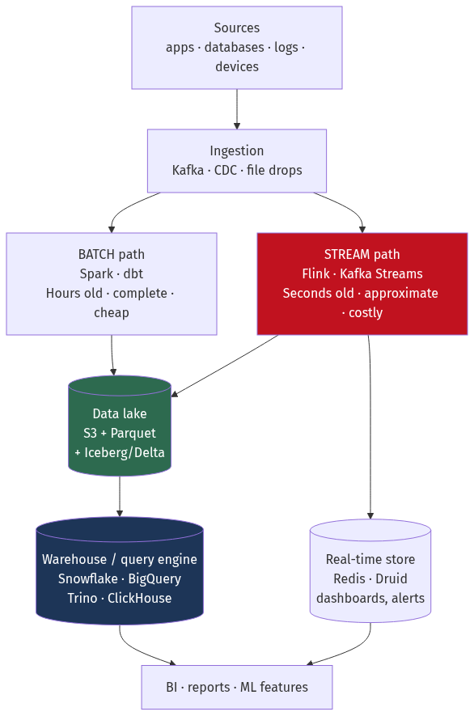
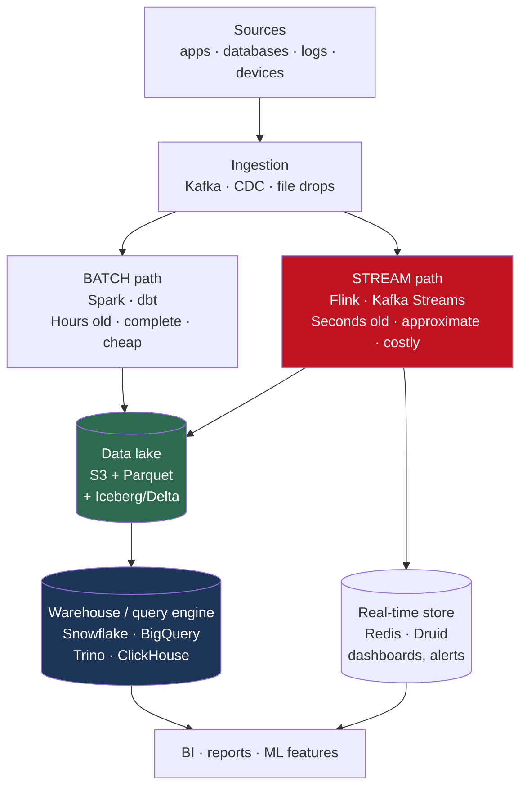
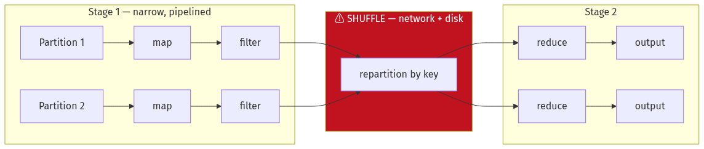
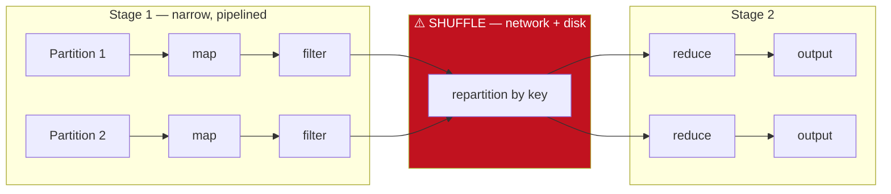
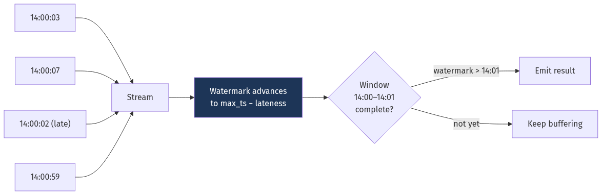
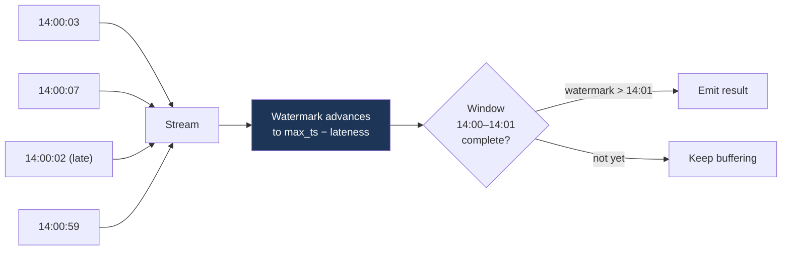
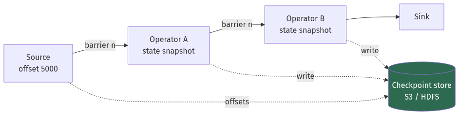
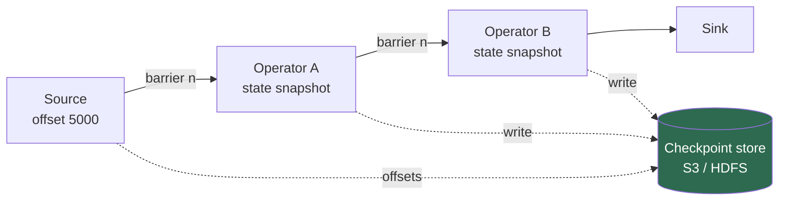
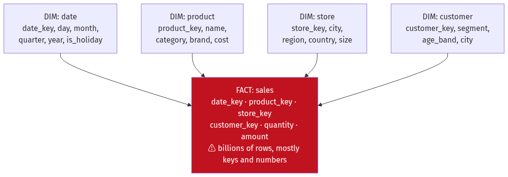
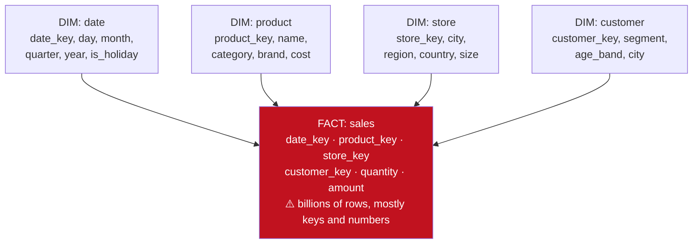

# Chapter 13 — Big Data: Batch, Stream and Analytics

[← Chapter 12](./12_messaging_and_event_streaming.md) · [Contents](./README.md) · [Next: Chapter 14 →](./14_search_systems.md)

**Prerequisites:** [Chapter 6](./06_storage_engines_internals.md) §6.9 (columnar storage) and [Chapter 12](./12_messaging_and_event_streaming.md) (logs, offsets, delivery semantics).

---

## What you'll learn

- Why **OLTP and OLAP** need different systems, quantified rather than asserted
- **MapReduce** traced through an actual word count, and why the **shuffle** is the expensive part
- **Spark**: the DAG, narrow vs wide dependencies, and how to diagnose and fix **data skew** — the single most common Spark problem
- **Event time vs processing time**, **watermarks**, and the four window types — the concepts that make stream processing genuinely different from batch
- How **checkpointing** gives Flink exactly-once state, and where the guarantee ends
- **Lambda vs Kappa** architecture, and why the industry mostly moved
- **Star schemas**, fact and dimension tables, and **slowly changing dimensions**
- **Parquet internals** — row groups, encodings, predicate pushdown — and why file size matters more than you'd think
- The **lakehouse**: how Iceberg and Delta put ACID on object storage

---

## Start from zero

You run a shop. Two completely different questions get asked about it.

**"Has customer 4471 paid for order 9982?"** You need one specific fact, right now,
accurately. You'll ask thousands of questions like this per second, each about a different
tiny slice of data. This is **OLTP** — Online Transaction Processing. It's what Chapters 7 to
10 were about.

**"What were our total sales by region and product category for each month last year?"** You
need to read *every* order — millions of them — but only three columns from each, and you'll
ask this a handful of times a day. Being a few minutes out of date is fine. This is **OLAP** —
Online Analytical Processing.

These are not the same problem, and a system optimised for one is bad at the other.

📐 **How bad:**
```
100 million orders, 200 bytes each.
Query: SUM(amount) GROUP BY region

Row store (OLTP):    must read every row to reach `amount` and `region`
                     100M × 200 B = 20 GB read → ~20 seconds at 1 GB/s

Column store (OLAP): reads only two columns
                     100M × (8 + 4) B = 1.2 GB, compressing ~5× → 240 MB
                     → ~0.25 seconds

80× difference, on identical hardware.
```

⚠️ **And it goes the other way too.** Fetching one complete order from a column store means
reassembling it from twenty separate column files — far slower than a row store's single page
read. Neither is "better"; they're answers to different questions.

The second idea in this chapter is **when** you compute.

**Batch** — collect data all day, process it overnight. Simple, efficient, and your answer is
hours old.
**Stream** — process each event as it arrives. Complex, and your answer is seconds old.

The interesting complication: in a stream, **events arrive out of order**. A phone that was
offline uploads its events an hour late. So "count events per minute" needs a definition of
*when* the minute ended — and that's the hardest idea in this chapter.

---

## The mental model



<details>
<summary>Diagram source (Mermaid)</summary>



</details>

💡 **The single most useful question in data engineering: how fresh does this actually need to
be?** Streaming costs perhaps 3–10× more to build and operate than batch. A dashboard nobody
looks at before 9 a.m. does not need sub-second latency. Fraud detection does. Most things
sit in between and are well served by micro-batching every few minutes.

---

## Deep dive

### 13.1 MapReduce, and why the shuffle is everything

MapReduce is mostly historical as a *product* and entirely current as a *concept* — Spark,
Flink and every distributed query engine still do fundamentally this.

**Three phases:**
```
MAP     — transform each input record into zero or more (key, value) pairs. Parallel.
SHUFFLE — group all values with the same key onto the same machine. ⚠️ Network.
REDUCE  — aggregate the values for each key. Parallel.
```

**Traced through word count on 3 machines:**

```
Input split across 3 nodes:
  Node A: "the cat sat"
  Node B: "the cat ran"
  Node C: "the dog sat"

MAP (local, parallel, no network):
  A → (the,1) (cat,1) (sat,1)
  B → (the,1) (cat,1) (ran,1)
  C → (the,1) (dog,1) (sat,1)

SHUFFLE (⚠️ every record crosses the network, partitioned by hash(word)):
  Reducer 1 gets "the": (the,1) (the,1) (the,1)
  Reducer 2 gets "cat","sat": (cat,1) (cat,1) (sat,1) (sat,1)
  Reducer 3 gets "ran","dog": (ran,1) (dog,1)

REDUCE (local, parallel):
  the=3, cat=2, sat=2, ran=1, dog=1
```

📐 **The shuffle is the cost.** Map and reduce are embarrassingly parallel and local. The
shuffle moves *every intermediate record* across the network and usually to disk.

```
1 TB input producing 1 TB of intermediate data:
  Map phase (local disk read):        1 TB, ~10 minutes on 100 nodes
  Shuffle (network + disk write+read): 1 TB across the network — often 60-80% of total time
  Reduce phase:                        1 TB, ~10 minutes
```

💡 **Every optimisation in distributed data processing is an attempt to shuffle less.** Combiners
(pre-aggregate on the map side), broadcast joins (send the small table everywhere instead of
shuffling both), partitioning the data so joins are already co-located, and pushing filters
before the shuffle.

**The combiner, concretely:**
```
Without a combiner: node A emits (the,1) (the,1) (the,1) … 1,000,000 records shuffled
With a combiner:    node A emits (the,1000000)                 … 1 record shuffled
```
📐 A million-fold reduction in shuffle volume for an associative, commutative aggregation. This
is why `reduceByKey` beats `groupByKey` in Spark — the former combines map-side, the latter
shuffles everything.

### 13.2 Spark

Spark's contributions were keeping intermediate data in memory rather than writing to HDFS
between stages, and exposing a rich API over a lazily-built execution graph.

**The execution model:**
```
Transformations (lazy): map, filter, join, groupBy → build a DAG, execute nothing
Actions (eager):        count, collect, write      → trigger execution of the DAG
```

**Narrow vs wide dependencies — the distinction that determines performance:**

| | **Narrow** | **Wide** |
| --- | --- | --- |
| Each output partition depends on | One input partition | **Many** input partitions |
| Examples | `map`, `filter`, `union` | `groupByKey`, `join`, `distinct`, `repartition` |
| Network | ✅ None — pipelined in memory | ⚠️ **Full shuffle** |
| Stage boundary | No | **Yes** — a new stage starts here |



<details>
<summary>Diagram source (Mermaid)</summary>



</details>

💡 **Reading a Spark UI is mostly counting stages.** Each stage boundary is a shuffle. Fewer
stages means less network.

#### ⚠️ Data skew — the most common Spark problem

```
GROUP BY customer_id, where one customer has 40% of the rows.

200 partitions. 199 finish in 30 seconds. One runs for 45 minutes.
The job's duration = the slowest partition. You have 199 idle executors.
```

**Diagnosing it:** in the Spark UI, look at a stage's task duration distribution. If max is
orders of magnitude above median, you have skew.

**Fixes, in order of preference:**

```scala
// 1. Broadcast join — if one side is small, don't shuffle at all.
//    Sends the small table to every executor; the large table never moves.
largeDF.join(broadcast(smallDF), "key")
```
📐 Spark auto-broadcasts below `spark.sql.autoBroadcastJoinThreshold` (default 10 MB). Raising
it to 100–200 MB is often a large win — a broadcast of 200 MB to 100 executors is 20 GB of
network, but it eliminates shuffling a 2 TB table.

```scala
// 2. Salting — split the hot key artificially, aggregate in two passes.
val salted = df.withColumn("salted_key",
    concat($"customer_id", lit("_"), (rand() * 100).cast("int")))
val partial = salted.groupBy("salted_key").agg(sum("amount").as("partial"))
val result  = partial
    .withColumn("customer_id", split($"salted_key", "_").getItem(0))
    .groupBy("customer_id").agg(sum("partial"))
```
The hot key is spread over 100 partitions in pass one, then combined in a tiny pass two.

```
3. Adaptive Query Execution (Spark 3.0+) — enabled by default, and it handles much of this:
   spark.sql.adaptive.enabled = true
   spark.sql.adaptive.skewJoin.enabled = true
   → splits oversized shuffle partitions at runtime, and coalesces tiny ones
```

```
4. Separate the hot keys — process them with a dedicated job and union the results.
```

#### The other Spark problems worth knowing

⚠️ **`groupByKey` vs `reduceByKey`.** `groupByKey` shuffles every value; `reduceByKey` combines
map-side first. For a large aggregation the difference can be 100×.

⚠️ **The small-files problem.** Writing 100,000 tiny Parquet files is catastrophic — each is a
separate S3 request with a listing cost, and metadata overhead dominates.
```
Target file size: 128 MB – 1 GB
Fix: .repartition(n) or .coalesce(n) before writing, sized from output volume
```

⚠️ **`collect()` on a large dataset.** Pulls everything to the driver, which OOMs. Use
`take(n)`, or write to storage.

### 13.3 Event time, processing time and watermarks

This is the conceptual core of stream processing, and it's what makes it genuinely different
from batch.

**Three notions of time:**

| Time | Meaning |
| --- | --- |
| **Event time** | When the event actually happened, per its own timestamp |
| **Ingestion time** | When it entered the system |
| **Processing time** | When the operator processed it |

⚠️ **They diverge, sometimes wildly.** A phone offline in a tunnel uploads events an hour
late. A Kafka consumer restarting replays two hours of backlog in two minutes — processing
time flies while event time crawls.

```
"How many purchases happened between 14:00 and 14:01?"

By PROCESSING time: whatever we happened to process in that wall-clock minute.
                    ⚠️ Reprocessing gives a DIFFERENT answer. Non-deterministic.
By EVENT time:      purchases whose own timestamp falls in that minute.
                    ✅ Correct, reproducible — but you must decide when to stop waiting.
```

💡 **Almost always use event time.** Processing-time results are not reproducible, which means
a replay after a bug fix produces different numbers — unacceptable for anything financial or
audited.

#### Watermarks

A **watermark** is the system's assertion: *"I believe I have now seen all events with
timestamp ≤ T."* It's how a stream decides a window is complete.

```
Watermark = max_event_time_seen − allowed_lateness

Events seen with max timestamp 14:05:00, allowed lateness 30 s
→ watermark = 14:04:30
→ any window ending at or before 14:04:30 can be closed and emitted
```



<details>
<summary>Diagram source (Mermaid)</summary>



</details>

📐 **The unavoidable trade-off:**
```
Short allowed lateness (5 s):   ✅ low latency   ⚠️ more late events dropped
Long allowed lateness (1 hour): ✅ more complete ⚠️ results delayed by an hour, more state held
```

⚠️ **There is no setting that gets both.** You are choosing between completeness and latency,
and the right answer depends on what the number is used for. This is worth saying explicitly in
an interview.

**Handling events later than the watermark:**

| Strategy | Behaviour |
| --- | --- |
| **Drop** | Simplest. Emit a metric so you know how much you're losing. |
| **Side output** | Route to a "late events" stream for separate handling |
| **Allowed lateness + update** | Keep window state longer and emit a *revised* result |
| **Reprocess in batch** | The Lambda approach — batch fixes what the stream approximated |

#### Window types

```
TUMBLING — fixed, non-overlapping. Every event in exactly one window.
  |--10:00-10:05--|--10:05-10:10--|--10:10-10:15--|
  "Sales per 5 minutes"

SLIDING — fixed size, overlapping. An event appears in multiple windows.
  |--10:00-10:05--|
        |--10:02-10:07--|
              |--10:04-10:09--|
  "5-minute moving average, updated every 2 minutes"

SESSION — dynamic, defined by a gap of inactivity.
  [click click click]------gap 30 min------[click click]
  |----session 1----|                      |--session 2--|
  "User browsing sessions"

GLOBAL — one unbounded window with a custom trigger.
  "Running total, emit every 1,000 events"
```

⚠️ **Sliding windows multiply state.** A 1-hour window sliding every 1 minute means each event
belongs to **60** windows, so you hold 60× the state and do 60× the aggregation work. Use a
tumbling window plus incremental aggregation if you can.

### 13.4 Flink and stateful stream processing

**Micro-batch (Spark Structured Streaming)** treats a stream as a sequence of tiny batches.
**True streaming (Flink)** processes each record as it arrives.

| | Micro-batch | True streaming |
| --- | --- | --- |
| Latency | ~100 ms – seconds | **~1–10 ms** |
| Throughput | Very high | High |
| Model | Batch, repeated | Native streaming |
| Event-time support | Good | **Excellent** |
| Complex state | Awkward | **First class** |

💡 Spark added continuous processing and Flink added batch, so the distinction is narrowing.
Choose on ecosystem and team familiarity as much as on the model.

#### Checkpointing

Flink periodically snapshots all operator state plus source offsets, using the
**Chandy-Lamport** distributed snapshot algorithm: **barriers** flow through the dataflow graph
with the records, and each operator snapshots its state when barriers arrive on all its inputs.



<details>
<summary>Diagram source (Mermaid)</summary>



</details>

**On failure:** restore all state from the last checkpoint and rewind the sources to the
recorded offsets. Everything after the checkpoint is reprocessed from a consistent state.

📐 **This gives exactly-once *state* semantics** — internal state reflects each input exactly
once. ⚠️ **Exactly-once *output* additionally requires a transactional sink** (Kafka
transactions, or a two-phase-commit sink). Writing to a non-transactional sink gives
at-least-once output, and you're back to needing idempotency
([Chapter 10](./10_distributed_transactions_and_integrity.md)).

⚠️ **Checkpoint interval is a real trade-off:**
```
Frequent (10 s):  fast recovery, but checkpoint overhead on every run
Infrequent (10 m): low overhead, but up to 10 minutes of reprocessing after a failure

And: large state makes checkpoints slow. RocksDB state backend with INCREMENTAL
checkpoints only writes changed SST files — essential past a few GB of state.
```

**Savepoints** are manually-triggered checkpoints designed for planned operations: upgrading
the job, changing parallelism, or migrating clusters. Unlike checkpoints they're kept until
you delete them and are compatible across job versions if state schemas are compatible.

### 13.5 Lambda vs Kappa

**Lambda architecture** runs two parallel paths:
```
                ┌── Batch layer (Spark, hourly)  ──> accurate, complete, late
Source ──> ─────┤
                └── Speed layer (Flink, live)    ──> approximate, immediate
                                     ↓
                          Serving layer merges both
```
✅ Accurate eventually, fast immediately.
⚠️ **You maintain the same business logic twice, in two frameworks**, and they will diverge.
Every bug must be fixed in both, and reconciling their answers is its own project.

**Kappa architecture** uses one path — streaming only. Reprocessing means replaying the log
from the beginning through a new version of the job.

```
Source ──> Kafka (long retention) ──> Flink ──> Serving
Reprocess: start a second job from offset 0, let it catch up, swap.
```
✅ **One codebase.** Reprocessing is just replay.
⚠️ Requires long log retention (tiered storage helps —
[Chapter 12](./12_messaging_and_event_streaming.md) §12.10), and replaying years of history
through a stream processor can be slow and expensive.

💡 **The industry has largely moved toward Kappa**, and the lakehouse (§13.9) has made a third
option common: **one storage layer, both access patterns.** Write once to Iceberg/Delta;
stream readers consume incrementally, batch readers scan the same tables. That removes the
duplication without requiring infinite Kafka retention.

### 13.6 Dimensional modelling

Analytical schemas are deliberately denormalised, and the standard shape is the **star
schema**.



<details>
<summary>Diagram source (Mermaid)</summary>



</details>

| | **Fact table** | **Dimension table** |
| --- | --- | --- |
| Contains | Measurements and foreign keys | Descriptive attributes |
| Size | Billions of rows | Thousands to millions |
| Grain | One row per business event | One row per entity |
| Changes | Append-only | ⚠️ Updated (slowly) |

⚠️ **Declaring the grain is the first and most important modelling decision.** "One row per
order line item" is a grain. "One row per order" is a different one. Mixing grains in one fact
table produces double-counting that is very hard to detect.

**Snowflake schema** normalises the dimensions further (product → category → department). ✅
Less redundancy. ⚠️ More joins, and on columnar storage the redundancy costs almost nothing
because it compresses away. **Star is usually right.**

#### Slowly Changing Dimensions

A customer moves from London to Manchester. What happens to last year's sales reports?

| Type | Behaviour | Use when |
| --- | --- | --- |
| **Type 0** | Never changes | Immutable attributes (date of birth) |
| **Type 1** | Overwrite — history is lost | Correcting an error; history genuinely irrelevant |
| **Type 2** | ⭐ **New row with validity dates** | You need historical accuracy |
| **Type 3** | Add a "previous value" column | Only one level of history matters |
| **Type 4** | Separate history table | Rapidly-changing attributes |
| **Type 6** | Hybrid of 1+2+3 | Both current and historical views needed |

**Type 2 in practice:**
```
customer_key | customer_id | city       | valid_from | valid_to   | is_current
-------------+-------------+------------+------------+------------+-----------
1001         | C42         | London     | 2020-01-01 | 2024-06-15 | false
1002         | C42         | Manchester | 2024-06-15 | 9999-12-31 | true
```
💡 The fact table stores the **surrogate key** (`1001` or `1002`), not the business key `C42`.
So a sale from 2023 joins to row 1001 and correctly reports London, while a sale from 2025
reports Manchester. **This is the entire reason surrogate keys exist in dimensional
modelling** — without them you cannot represent history.

⚠️ Type 2 makes dimensions grow, and "current customer count" now requires
`WHERE is_current = true`. Forgetting that filter silently multiplies your counts.

### 13.7 Parquet internals

Parquet is the de-facto columnar file format, and understanding its layout explains most
performance behaviour.

```
┌──────────────────────────────────────────┐
│ Row Group 1 (~128 MB)                    │
│   Column chunk: date    [pages…]         │
│   Column chunk: product [pages…]         │
│   Column chunk: amount  [pages…]         │
│   ⚠️ Statistics per chunk: min, max, nulls│
├──────────────────────────────────────────┤
│ Row Group 2 (~128 MB)                    │
│   …                                      │
├──────────────────────────────────────────┤
│ Footer: schema, row-group metadata,      │
│         column offsets, statistics       │
└──────────────────────────────────────────┘
```

**Three properties that matter:**

**1. Column pruning.** `SELECT amount FROM sales` reads only the `amount` column chunks. In a
50-column table that's ~2% of the bytes.

**2. Predicate pushdown via statistics.** Each column chunk stores min/max. A query with
`WHERE date = '2026-08-31'` skips any row group whose max date is earlier — **without reading
it at all**.

📐 **This only works if the data is sorted or clustered on the predicate column:**
```
Sorted by date:   each row group covers a narrow date range → skip 99% of groups ✅
Randomly ordered: every row group spans the entire date range → skip nothing ❌
```
💡 **Sorting on your most common filter column before writing is one of the highest-leverage
things you can do to a Parquet dataset**, and it's frequently skipped.

**3. Encodings** ([Chapter 6](./06_storage_engines_internals.md) §6.9): dictionary, run-length,
delta, bit-packing — applied per column chunk based on the data.

⚠️ **File sizing is the operational trap:**
```
Too small (< 32 MB):  ⚠️ metadata overhead dominates; thousands of S3 GETs;
                      listing costs; query planning time exceeds execution time
Too large (> 1 GB):   coarse parallelism; a single task must read a whole row group

Target: 128 MB – 1 GB per file, row groups ~128 MB.
```

**Parquet vs ORC:** functionally very similar. Parquet has broader ecosystem support; ORC has
slightly better compression and built-in lightweight indexes, and is more common in the Hive
world. Either is a defensible choice; don't spend long on it.

### 13.8 Warehouses and query engines

| System | Architecture | Distinctive |
| --- | --- | --- |
| **Snowflake** | Separated storage and compute; multiple independent "virtual warehouses" | ✅ Scale compute per workload; zero-copy cloning; time travel |
| **BigQuery** | Serverless; Dremel execution over Colossus | ✅ No cluster to manage; ⚠️ billed per byte **scanned** |
| **Redshift** | Traditional MPP; RA3 nodes separate storage | Mature; more tuning knobs (dist keys, sort keys) |
| **ClickHouse** | Single-purpose columnar OLAP | ⭐ **Fastest for real-time analytics**; ⚠️ hates small inserts |
| **Trino/Presto** | Query engine only, no storage | ✅ Federated queries across S3, MySQL, Kafka in one SQL statement |
| **DuckDB** | In-process, single node | ⭐ Astonishingly capable up to ~1 TB; no infrastructure at all |

💡 **The single most important architectural shift is separating storage from compute.** Once
storage is object storage, you can run several independent compute clusters against the same
data: one for BI, one for data science, one for ETL — each sized and scaled independently, none
contending with the others. That's Snowflake's core idea, and the lakehouse generalises it.

⚠️ **BigQuery's pricing model shapes its usage.** Billing per byte scanned means an unfiltered
`SELECT *` on a large table can cost real money in one query. **Partitioning and clustering are
cost controls**, not just performance controls, and `SELECT *` in an interactive tool is a
genuine financial hazard.

💡 **Don't overlook DuckDB.** A very large fraction of "big data" workloads are under a
terabyte, and DuckDB will query Parquet on S3 from a laptop faster than a small Spark cluster
will start up. Ask what the data volume actually is before provisioning a cluster.

### 13.9 The lakehouse

**Data warehouse** — structured, schema-on-write, expensive, fast, governed.
**Data lake** — raw files on object storage, schema-on-read, cheap, flexible.
⚠️ **And data lakes reliably became "data swamps"**: no schema enforcement, no transactions, no
way to know whether a file is complete, and no way to update a row without rewriting a
partition.

**Table formats** — Apache **Iceberg**, Delta Lake, Apache **Hudi** — fix this by adding a
metadata layer over the files.

```
s3://lake/sales/
  metadata/
    v1.metadata.json        ← schema, partition spec, snapshot list
    snap-8271.avro          ← manifest list for one snapshot
    manifest-a.avro         ← file list + per-file statistics
  data/
    date=2026-08-30/part-0001.parquet
    date=2026-08-31/part-0002.parquet
```

**What the metadata layer buys you:**

| Capability | How it works |
| --- | --- |
| **ACID transactions** | A commit atomically swaps a pointer to a new metadata file |
| **Time travel** | Snapshots are retained — query the table as of any past version |
| **Schema evolution** | Columns tracked by ID, not position — safe rename, add, reorder |
| **Row-level updates/deletes** | Copy-on-write (rewrite files) or merge-on-read (delete files) |
| **Hidden partitioning** (Iceberg) | ⭐ Partition by `day(ts)` without users writing `WHERE dt='...'` |
| **Statistics-driven pruning** | Per-file min/max in the manifest → skip files before reading |

💡 **Iceberg's hidden partitioning solves a genuinely painful Hive problem.** In Hive,
partitioning by a derived column meant users had to know and filter on it explicitly —
`WHERE dt = '2026-08-31'` — and forgetting it caused a full-table scan. Iceberg records the
partition *transform*, so filtering on the underlying timestamp automatically prunes
partitions.

⚠️ **Maintenance is not optional.** Table formats accumulate small files and stale snapshots.
Scheduled compaction (`rewrite_data_files`), snapshot expiry, and orphan-file cleanup must
run, or query planning degrades badly as the manifest grows.

### 13.10 ETL, ELT and orchestration

**ETL** — Extract, **Transform**, Load. Transform before loading, in Spark or a dedicated tool.
**ELT** — Extract, Load, **Transform**. Load raw, transform inside the warehouse with SQL.

💡 **ELT won**, for three reasons: warehouse compute became cheap and elastic; storing the raw
data means you can re-derive everything when requirements change; and SQL is accessible to
analysts in a way that Spark code is not.

**dbt** is the standard tool for the T. It's SQL `SELECT` statements plus dependency
management, tests and documentation:
```sql
-- models/marts/daily_sales.sql
SELECT date_trunc('day', order_ts) AS day,
       region,
       sum(amount) AS revenue
FROM {{ ref('stg_orders') }}          -- dbt builds the DAG from these refs
GROUP BY 1, 2
```
✅ Version-controlled transformations, a generated dependency graph, tests as first-class
objects, and automatic documentation.

**Orchestration** — Airflow, Dagster, Prefect — schedules and manages dependencies between
tasks.

⚠️ **The properties that separate a working pipeline from a fragile one:**

| Property | Why |
| --- | --- |
| **Idempotent** | Re-running a task must produce the same result, not duplicates |
| **Atomic** | Write to a temp location, then swap — never leave a half-written partition |
| **Backfillable** | Parameterised by date so you can reprocess history |
| **Bounded** | A task that processes "everything since the beginning" gets slower forever |

📐 **The idempotency pattern for a partitioned table:**
```sql
-- ❌ Not idempotent: re-running duplicates rows
INSERT INTO daily_sales SELECT ... WHERE day = '2026-08-31';

-- ✅ Idempotent: replaces the partition atomically
DELETE FROM daily_sales WHERE day = '2026-08-31';
INSERT INTO daily_sales SELECT ... WHERE day = '2026-08-31';
-- Or, better, an atomic partition overwrite / MERGE
```

### 13.11 Data quality and lineage

⚠️ **Silent data corruption is worse than a failed pipeline.** A job that crashes gets fixed in
an hour. A job that quietly produces wrong numbers gets discovered in a board meeting three
months later, and by then every downstream decision is suspect.

**Tests that catch most real problems:**

| Test | Catches |
| --- | --- |
| **Freshness** | `max(updated_at) > now() - 2h` — a silently stopped pipeline |
| **Volume** | Row count within ±30% of the trailing average — a partial load |
| **Uniqueness** | Primary key has no duplicates — a double-run |
| **Not null** | Required fields populated — an upstream schema change |
| **Referential** | Every `customer_key` in facts exists in the dimension — a broken join |
| **Distribution** | `sum(amount)` within expected bounds — a unit change (dollars→cents) |
| **Reconciliation** | ⭐ Warehouse totals match the source system's totals |

💡 **Reconciliation is the one that actually catches things.** Comparing a derived aggregate
back against the operational system is the only test that verifies the *whole* pipeline rather
than one step of it.

**Lineage** — the graph of which datasets derive from which — answers two questions you will
definitely be asked: *"if I change this column, what breaks?"* and *"this number looks wrong,
where did it come from?"* dbt generates it from `ref()`, and OpenLineage standardises it
across tools.

---

## Worked example — an analytics platform

*An e-commerce company. 50 million events/day (page views, add-to-cart, purchases). Needs: a
real-time dashboard of revenue (< 1 minute), daily business reports, ad-hoc analyst queries
over 3 years, and ML features. Design it.*

**Step 1 — Establish the volume.**
```
50M events/day ÷ 86,400 = 580 events/second average, ~1,700/s at peak
50M × 1 KB = 50 GB/day raw
3 years = 55 TB raw
```
💡 **55 TB is not "big data" by 2026 standards.** This matters — it rules out a lot of
complexity. A single ClickHouse cluster or a modest Snowflake warehouse handles it. We should
not reach for a hundred-node Spark cluster.

**Step 2 — Ingestion.**
```
App → Kafka topic `events` (partitioned by user_id for session ordering)
      retention 7 days hot + tiered storage to S3 for replay
CDC from Postgres → Kafka (orders, customers, products) via Debezium
```
⚠️ CDC rather than nightly database dumps, so dimensions are current and we get every
intermediate state rather than only the end-of-day value.

**Step 3 — Split by freshness requirement.** This is the design decision.

| Consumer | Freshness needed | Path |
| --- | --- | --- |
| Revenue dashboard | < 1 minute | **Stream** |
| Daily reports | Next morning | **Batch** |
| Analyst ad-hoc | Hours | **Batch** |
| ML features (training) | Daily | **Batch** |
| ML features (serving) | Seconds | **Stream** |

💡 Only two consumers genuinely need streaming. Building everything as a stream would multiply
cost and complexity for no benefit.

**Step 4 — The streaming path.**
```
Kafka → Flink → ClickHouse (revenue aggregates) + Redis (feature serving)

Flink job:
  Event time from the event's own `occurred_at`
  Watermark: max_event_time − 30 s
  Tumbling 1-minute windows on (minute, region, category)
  Aggregate: sum(amount), count(*)
  Late events (> 30 s): side output → S3, reconciled by the batch job
```

📐 **Justifying the 30-second watermark:**
```
Measured p99.9 event delay from client to Kafka: 18 s (mobile networks, retries)
30 s covers p99.9 with margin → ~0.1% of events arrive late and go to the side output
Dashboard latency: window close (60 s) + watermark (30 s) + processing ≈ 95 s
⚠️ That misses the "< 1 minute" requirement.
```
**Adjust:** emit **early results** with the watermark set to 5 s, and update them as late data
arrives:
```
Trigger: emit on every 5 s of event time, refine until the watermark passes
Dashboard shows a value that ticks up within ~10 s and settles at the final number.
```
💡 This is the standard resolution of the completeness/latency conflict: **emit early and
revise** rather than choosing one.

**Step 5 — The batch path.**
```
Kafka → S3 (raw events, Parquet, partitioned by date/hour) — the immutable source
S3 → Spark → Iceberg tables (cleaned, deduplicated, conformed)
Iceberg → dbt → star schema marts
```

**Storage sizing:**
```
50 GB/day raw JSON in Kafka
→ Parquet with zstd: ~5× compression → 10 GB/day
→ 3 years = 11 TB    (vs 55 TB raw — the format choice saved 44 TB)
S3 Standard: 11 TB × $23/TB = ~$250/month
Lifecycle: > 1 year old → Glacier Instant Retrieval → ~$40/month for that tier
```

**Step 6 — The star schema.**
```
FACT: fct_events    grain: one row per event
  event_key, date_key, user_key, product_key, session_key,
  event_type, amount_cents, quantity

DIM: dim_date       (static, generated)
DIM: dim_user       ⚠️ Type 2 SCD — segment and region change over time
DIM: dim_product    ⚠️ Type 2 SCD — price and category change
DIM: dim_session    derived from session windows
```
⚠️ **Type 2 on `dim_product` is essential** — "revenue by category" for last year must use the
category the product had *then*, not now. Using a Type 1 dimension silently rewrites history
whenever a product is recategorised, and nobody notices until someone compares two reports run
months apart.

**Step 7 — Physical layout for query performance.**
```
Iceberg table fct_events:
  PARTITIONED BY (days(occurred_at))        ← hidden partitioning
  SORTED BY (product_id, occurred_at)       ← for predicate pushdown
  Target file size: 256 MB
  Compaction: daily rewrite_data_files
  Snapshot expiry: 7 days
```
📐 **The effect of sorting:**
```
Unsorted: every file's product_id range spans the whole catalogue → skip 0 files
Sorted:   "WHERE product_id = 4471" → min/max stats skip ~99% of files
→ a query reading 2 GB instead of 200 GB
```

**Step 8 — Compute.**
```
Ad-hoc analyst queries → Trino over Iceberg (or DuckDB for smaller ones)
dbt transformations     → Snowflake or Spark
Real-time dashboards    → ClickHouse
```
⚠️ **Isolate the workloads.** An analyst running an unbounded query must not slow the pipeline
that feeds the executive dashboard. Separated storage and compute is what makes this possible.

**Step 9 — Reconciliation, which catches what tests don't.**
```
Daily job:
  warehouse_revenue = SELECT sum(amount) FROM fct_events
                      WHERE date = yesterday AND event_type='purchase'
  source_revenue    = SELECT sum(total) FROM postgres.orders
                      WHERE created_at::date = yesterday
  ALERT if abs(warehouse - source) / source > 0.001
```
💡 A 0.1% tolerance catches dropped events, double-counting, unit errors and broken joins —
things that individual step-level tests miss because each step looks fine in isolation.

**Step 10 — The result.**

| Requirement | Solution | Latency |
| --- | --- | --- |
| Revenue dashboard | Flink → ClickHouse, early-emit windows | ~10 s |
| Daily reports | Spark → Iceberg → dbt → marts | Next morning |
| Ad-hoc analysis | Trino over Iceberg | Seconds to minutes |
| ML training features | Batch from Iceberg | Daily |
| ML serving features | Flink → Redis | Seconds |
| Correctness | Reconciliation + dbt tests | Daily |

⚠️ **Note what we didn't build:** no Lambda architecture with duplicated logic, no Hadoop
cluster, no separate lake and warehouse. One storage layer (Iceberg on S3), two compute paths
(stream for the two things that need it, batch for everything else), and reconciliation to
verify the whole thing.

---

## Trade-offs

| Decision | Option A | Option B | Choose A when | Never choose A when |
| --- | --- | --- | --- | --- |
| Processing | Batch | Streaming | Freshness of hours is fine — 3–10× cheaper | Fraud, alerting, live personalisation |
| Architecture | Lambda | Kappa / lakehouse | You already have both and can't merge | Greenfield — duplicated logic diverges |
| Time semantics | Processing time | **Event time** | Never for anything audited | Prefer B — processing time isn't reproducible |
| Late data | Drop | Allowed lateness + revise | Loss is acceptable and measured | Financial or reported numbers |
| Window | Sliding | Tumbling + incremental | You genuinely need overlapping views | State cost matters — sliding multiplies it |
| Transformation | ETL | ELT | Data must be cleaned before it can be stored (PII) | Warehouse compute is cheap — B is more flexible |
| Schema | Snowflake | Star | Dimensions are huge and highly redundant | Usually — columnar compression makes redundancy free |
| Dimension history | Type 1 (overwrite) | Type 2 (versioned rows) | History genuinely irrelevant | Historical reports must stay correct |
| Storage | Data lake (raw files) | Lakehouse (Iceberg/Delta) | Never, now | Always B — ACID, time travel, schema evolution |
| File format | JSON/CSV | Parquet/ORC | Interchange with external parties | Analytics — B is 5× smaller and far faster |
| Engine | Spark cluster | DuckDB / single node | Data genuinely exceeds one machine | ⚠️ Under ~1 TB, B is faster and free |
| Query cost model | Per-byte-scanned | Per-hour compute | Sporadic, well-filtered queries | Heavy continuous use — unfiltered scans get expensive |

---

## How real companies do it

**Netflix** built and open-sourced **Iceberg** because Hive's directory-listing-based metadata
did not work at their scale — listing millions of S3 objects to plan a query was slower than
running it. Iceberg's manifest files replace directory listing with an indexed file list
carrying statistics, which is why query planning went from minutes to seconds. They also
publish extensively on their Keystone pipeline handling trillions of events daily.

**Uber** built **Hudi** to solve a different problem: they needed **incremental upserts** on a
data lake, because trip records are updated after the fact (fare adjustments, ratings). Hudi's
merge-on-read tables let them update rows without rewriting whole partitions. Their published
migration reduced data latency from hours to minutes.

**Databricks** built **Delta Lake** for essentially the same reasons as Iceberg, and their
"lakehouse" framing — one storage layer serving both BI and ML — is now the dominant industry
model. The three formats have converged substantially in capability; ecosystem and vendor
alignment matter more than features.

**Airbnb** documented the "data swamp" problem honestly: thousands of tables, no ownership,
no idea which were trustworthy. Their response was **Dataportal** (a data catalogue with
lineage and usage signals) and a **certification** process marking tables as trusted. The
lesson is organisational as much as technical — beyond a certain size, discoverability and
trust are the bottleneck, not compute.

**Google's Dremel paper** (2010) is the ancestor of BigQuery and of the columnar
execution model in Parquet and Arrow. The nested-record encoding it introduced — repetition and
definition levels — is why Parquet can represent deeply nested data columnar-ly at all.

---

## Common mistakes

**Using processing time for windowed aggregates.** Results aren't reproducible; a replay after
a bug fix gives different numbers. Use event time.

**Watermark too aggressive.** Drops a meaningful fraction of events silently. Measure the
actual p99.9 delay before choosing, and always emit a metric for dropped late events.

**Watermark too conservative.** Results delayed by the full lateness window and state held
much longer. Emit early and revise instead of choosing one extreme.

**The small-files problem.** Thousands of tiny Parquet files make metadata dominate. Target
128 MB–1 GB and compact regularly.

**Not sorting before writing Parquet.** Predicate pushdown depends on min/max statistics being
narrow. Unsorted data means every file matches every filter.

**`groupByKey` instead of `reduceByKey`.** Shuffles every value rather than pre-aggregating —
often 100× more network.

**Ignoring skew.** One hot key makes 199 of 200 executors idle while one runs for an hour.
Broadcast, salt, or enable adaptive query execution.

**Type 1 dimensions where history matters.** Recategorising a product silently rewrites last
year's revenue-by-category report.

**Mixing grains in a fact table.** Order-level and line-item-level rows in one table produce
double-counting that is extremely hard to detect.

**Non-idempotent pipeline tasks.** A re-run duplicates rows. Delete-then-insert the partition,
or use an atomic overwrite.

**Building Lambda for a greenfield system.** Two implementations of the same logic will
diverge, and reconciling them becomes a permanent project.

**Provisioning a Spark cluster for 200 GB.** DuckDB will query it from a laptop faster than
the cluster starts.

**No reconciliation against the source system.** Step-level tests all pass while the end-to-end
number is wrong. Compare aggregates back to the operational database.

**Forgetting lakehouse maintenance.** Uncompacted small files and unexpired snapshots degrade
query planning until it dominates runtime.

---

## Interview angle

**Q: Batch or streaming?**

*Strong:* "I'd start by asking how fresh the data actually needs to be, per consumer, because
streaming typically costs 3 to 10 times more to build and operate. In practice most systems
need both, but for different consumers — a fraud check needs seconds, an executive dashboard
needs a minute, and a daily finance report needs the next morning. So I'd split by requirement
rather than building everything one way. On architecture, I'd avoid **Lambda** for greenfield —
maintaining the same business logic in two frameworks means they will diverge, every bug has to
be fixed twice, and reconciling their answers becomes a permanent project. I'd prefer **Kappa**
or, more realistically now, a **lakehouse**: one storage layer in Iceberg or Delta that stream
readers consume incrementally and batch readers scan directly. That gets you both access
patterns without duplicating logic or requiring infinite Kafka retention."

**Q: Explain event time vs processing time and why watermarks exist.**

*Strong:* "Event time is when the thing actually happened, per the event's own timestamp;
processing time is when your operator got to it. They diverge — a phone offline in a tunnel
uploads an hour late, and a consumer replaying a backlog processes two hours of event time in
two minutes. The critical consequence is that **processing-time results aren't reproducible**:
replay the same data after a bug fix and you get different numbers, which is unacceptable for
anything audited. So you use event time — but then you need to know when a window is complete,
because events keep arriving late. That's what a **watermark** is: an assertion that you
believe you've seen everything with a timestamp at or before T, usually computed as
`max_event_time_seen − allowed_lateness`. And it's an unavoidable trade-off: a short lateness
gives low latency but drops more late events; a long one is more complete but delays results
and holds far more state. There's no setting that gets both. The practical resolution is to
**emit early results and revise them** as late data arrives, rather than picking an extreme."

**Q: A Spark job has 200 tasks; 199 finish in 30 seconds and one takes 45 minutes. Diagnose.**

*Strong:* "**Data skew.** The partitioning key has a hot value — one customer, one country,
one null — so its partition holds a disproportionate share of the rows, and the job's duration
is the slowest task while 199 executors sit idle. I'd confirm it in the Spark UI by comparing
the max task duration against the median in that stage. Fixes in order of preference. First,
**broadcast join** if one side is small enough — send it to every executor and don't shuffle
the large table at all; I'd consider raising `autoBroadcastJoinThreshold` from the 10 MB
default, since broadcasting 200 MB to 100 executors is cheap next to shuffling two terabytes.
Second, **salting** — append a random suffix to split the hot key across many partitions,
aggregate, then combine in a small second pass. Third, **adaptive query execution**, which is
on by default in Spark 3 and splits oversized shuffle partitions at runtime. And I'd check
whether nulls are the culprit, because `NULL` join keys all hash to one partition and that's a
very common accidental cause."

**Q: How do you get exactly-once processing in a streaming pipeline?**

*Strong:* "You don't get exactly-once *delivery* — that's impossible, as in Chapter 10. What
you get is exactly-once *effect*, and in Flink it comes from **checkpointing**. Flink
periodically snapshots all operator state along with the source offsets, using barriers that
flow through the dataflow graph — Chandy-Lamport. On failure it restores state from the last
checkpoint and rewinds the sources to the recorded offsets, so everything after that point is
reprocessed from a consistent state. That gives exactly-once **state** semantics. But the
guarantee ends at the sink: for exactly-once **output** you additionally need a transactional
sink — Kafka transactions or a two-phase-commit sink. Writing to a plain database gives
at-least-once output, so you need idempotency there, typically an inbox table keyed by event
ID. The other thing I'd mention is that checkpoint interval is a real trade: frequent
checkpoints mean fast recovery but constant overhead; infrequent ones mean up to that interval
of reprocessing after a failure. And with large state you want RocksDB with incremental
checkpoints, or checkpointing itself becomes the bottleneck."

**Q: Why are analytical databases columnar?**

*Strong:* "Because analytical queries touch few columns across many rows, and I/O is the
bottleneck. A `SUM(amount) GROUP BY region` over a hundred million 200-byte rows reads 20 GB
in a row store, because it has to touch every row to reach two fields — versus about 1.2 GB in
a column store, which reads only those two columns. Then compression multiplies it: a column
holds homogeneous values, so dictionary encoding, run-length, delta and bit-packing typically
give 5–20×, versus 2–3× for row data. So 20 GB becomes maybe 240 MB — nearly two orders of
magnitude less I/O. On top of that you get **vectorised execution**, processing a thousand
values per loop with SIMD instead of one row at a time through an interpreter, and **predicate
pushdown** via per-block min/max statistics so you skip blocks that can't match without reading
them. The important caveat about that last one: pushdown only helps if the data is **sorted or
clustered on the filter column** — unsorted data means every block spans the full range and you
skip nothing. Sorting before writing is one of the highest-leverage and most commonly skipped
optimisations."

**Q: Design a star schema for e-commerce sales, and handle a customer moving city.**

*Strong:* "A `fct_sales` fact table at a declared grain — I'd say one row per order line item —
holding foreign keys to date, product, customer and store dimensions plus the measures:
quantity, amount, discount. Declaring the grain first matters, because mixing order-level and
line-item-level rows in one fact table produces double-counting that's very hard to detect
later. Dimensions hold the descriptive attributes. For the customer moving city, that's a
**Type 2 slowly changing dimension**: rather than overwriting, I insert a new row with a new
surrogate key and validity dates, closing the old row. The fact table stores the **surrogate
key**, not the business customer ID — so a sale from 2023 joins to the row that says London and
a sale from 2025 joins to Manchester, and last year's regional report stays correct. That's
actually the whole reason surrogate keys exist in dimensional modelling. Type 1 — just
overwriting — would silently rewrite history, and nobody notices until two runs of the same
report disagree. The costs of Type 2 are that dimensions grow and every 'current' query needs a
`WHERE is_current` filter, and forgetting that filter silently multiplies your counts."

---

## Recap

- **OLTP and OLAP are different problems.** Columnar gives ~80× on aggregates; row stores win
  on fetching whole records.
- **The shuffle is the cost** in every distributed processing framework. Combiners, broadcast
  joins, pre-partitioning and pushed-down filters are all attempts to shuffle less.
- **Spark stage boundaries are shuffles.** Narrow dependencies pipeline; wide ones don't.
- ⚠️ **Data skew is the most common Spark problem.** Broadcast, salt, or enable AQE.
- **Use event time, not processing time** — processing time isn't reproducible.
- **Watermarks trade completeness against latency**, and there's no setting that wins both.
  **Emit early and revise.**
- ⚠️ **Sliding windows multiply state** by the overlap factor.
- **Checkpointing gives exactly-once state**; exactly-once *output* needs a transactional sink.
- **Kappa and the lakehouse beat Lambda** — duplicated business logic diverges.
- **Star schemas with Type 2 dimensions** preserve historical accuracy. Declare the grain first.
- **Parquet pushdown depends on sort order.** Target 128 MB–1 GB files; compact regularly.
- **Iceberg/Delta add ACID, time travel and schema evolution to object storage** — and require
  scheduled maintenance.
- ⚠️ **Reconcile against the source system.** Step-level tests all pass while the end-to-end
  number is wrong.
- **Check the actual data volume.** Under ~1 TB, DuckDB beats a cluster.

---

## Test yourself

1. A query aggregates one column over 500 million rows of 300-byte records. Estimate the bytes
   read in a row store versus a Parquet column store with 5× compression.
2. Your Flink job uses a 10-second watermark. Measurement shows p99 event delay is 8 s and
   p99.9 is 40 s. What fraction of events are dropped, and what would you change?
3. A Spark job writes 80,000 Parquet files averaging 2 MB. Name three problems and the fix.
4. You partition Parquet by date and sort by `user_id`. A query filters
   `WHERE date = '2026-08-01' AND product_id = 99`. Which pruning works and which doesn't?
5. Explain why `reduceByKey` can be 100× faster than `groupByKey` for a sum.
6. Your `dim_product` uses Type 1. A product moves from "Electronics" to "Home". What happens
   to last quarter's category revenue report, and when do you find out?
7. A 1-hour sliding window advancing every minute processes 10,000 events/second. How many
   window instances does each event belong to, and what does that do to state?
8. Your daily pipeline task runs `INSERT INTO summary SELECT ... WHERE date = :d`. It fails
   halfway and Airflow retries it. What's wrong and what's the fix?
9. dbt tests all pass but finance says revenue is 3% too high. What test was missing?
10. Your BigQuery bill tripled after an analyst joined. Nothing else changed. What happened and
    what are two fixes?

<details>
<summary>Answers</summary>

1. **Row store:** must read every row to reach the column → 500,000,000 × 300 B =
   **150 GB**.
   **Parquet:** reads one column. Assume an 8-byte numeric → 500M × 8 B = 4 GB uncompressed,
   at 5× compression = **800 MB**.
   Roughly **187× less I/O**. And if the data is sorted on a filtered column, predicate
   pushdown could reduce it further by skipping row groups entirely.

2. The watermark is `max_event_time − 10 s`, so events arriving more than 10 seconds after the
   maximum observed timestamp are late. p99 delay is 8 s, so about **1% of events exceed 8 s**
   and a meaningful fraction of those exceed 10 s — realistically **~1% dropped**, which for
   revenue data is unacceptable.
   **What I'd change:** raise allowed lateness toward the p99.9 of 40 s so almost nothing is
   dropped — but that delays every result by 40 s. The better answer is **emit early and
   revise**: trigger output every few seconds with the current partial aggregate and update it
   as late events arrive, keeping window state for 60 s. Also route events later than that to a
   **side output** so they're reconciled by the batch job rather than silently lost, and emit a
   metric for dropped-late-event count so you can see the rate.

3. (a) **Metadata overhead dominates** — query planning must open and read the footer of 80,000
   files; planning time can exceed execution time. (b) **Object-store request cost and latency**
   — 80,000 separate S3 GETs, plus listing costs, and S3 request charges are per-request. (c)
   **Poor compression and encoding efficiency** — dictionary and RLE encodings work per column
   chunk, and 2 MB files give tiny chunks with little repetition to exploit. Also (d)
   **scheduling overhead** — one task per file means 80,000 tasks for 160 GB.
   **Fix:** `repartition()` or `coalesce()` before writing to target **128 MB–1 GB per file**
   (here roughly 160 GB ÷ 256 MB ≈ 640 files), and run scheduled compaction
   (`rewrite_data_files` in Iceberg, `OPTIMIZE` in Delta) for tables that accumulate small
   files from streaming writes.

4. **Date pruning works** — partitioning by date means the engine reads only the
   `date=2026-08-01` directory/partition, skipping all others without reading any data.
   **`product_id` pruning does not work.** The files are sorted by `user_id`, so within that
   date partition each file's `product_id` min/max spans essentially the whole catalogue —
   every file's statistics say "product_id ranges from 1 to 100,000", so none can be skipped.
   You read the entire day's data and filter it.
   **Fix:** sort by the column you most often filter on, or use a multi-column sort / z-order
   (`ZORDER BY (user_id, product_id)` in Delta, or Iceberg sort orders) which clusters on both
   at some cost to each individually.

5. `groupByKey` shuffles **every individual value** across the network, grouping them on the
   reducer, and only then applies the sum. `reduceByKey` applies the reduction **map-side
   first** — a combiner — so each mapper sends one partial sum per key rather than every value.
   ```
   1,000,000 records with key "the" on one mapper:
     groupByKey:  1,000,000 records shuffled
     reduceByKey: 1 record shuffled — ("the", 1000000)
   ```
   Since the shuffle is typically 60–80% of a job's runtime, eliminating almost all of it is
   where the 100× comes from. It also avoids the risk of `groupByKey` OOMing when one key's
   values don't fit in a single executor's memory. The requirement is that the operation be
   associative and commutative, which `sum` is.

6. **Last quarter's report silently changes.** Type 1 overwrites the attribute in place, and
   the fact table joins to the single current dimension row — so historical sales that were
   made while the product was "Electronics" now report as "Home". Electronics revenue drops and
   Home revenue rises, retroactively, for periods that were already closed and reported.
   **When you find out:** typically when someone re-runs a report they ran previously and the
   numbers disagree — often weeks or months later, in a meeting. There is no error, no alert,
   and no way to recover the old view because the previous value was overwritten.
   **Fix:** Type 2 — insert a new dimension row with a new surrogate key and validity dates, so
   facts joined by surrogate key continue to resolve to the category that was correct at the
   time.

7. A 1-hour window advancing every 1 minute means **60 overlapping windows** are open at any
   time, and each event belongs to **60** of them.
   **State impact:** you hold 60× the aggregation state and perform 60× the aggregation
   updates per event. At 10,000 events/second that's 600,000 window-state updates per second,
   and the state size is 60 × (number of distinct keys) × (state per key).
   **Mitigation:** for algebraic aggregations (sum, count, min/max) use **tumbling 1-minute
   windows plus incremental combination** — compute per-minute partials once, then sum the
   last 60 partials to answer the hourly question. That's 1× the state and 1× the updates. Only
   use true sliding windows when the aggregation isn't decomposable.

8. It is **not idempotent**. `INSERT` appends, so the first partial run inserts some rows, and
   the retry inserts them again — producing duplicates and inflating every downstream number.
   There's also no atomicity, so a failure leaves a partially-written partition that looks
   complete to readers.
   **Fix:** make the task **replace the partition atomically**:
   ```sql
   DELETE FROM summary WHERE date = :d;
   INSERT INTO summary SELECT ... WHERE date = :d;
   ```
   in one transaction, or better use an atomic partition overwrite (`INSERT OVERWRITE`,
   Iceberg's `replacePartitions`, or a `MERGE`). Then any number of retries produces the same
   result. The general rule: **every pipeline task must be idempotent and parameterised by
   partition**, so it can be re-run and backfilled safely.

9. **Reconciliation against the source system.** dbt's tests — uniqueness, not-null, referential
   integrity, freshness, accepted values — all verify properties *within* the warehouse. Every
   one can pass while the pipeline drops, duplicates or mis-converts data upstream. A 3%
   overstatement is consistent with, for example, double-counting a subset of orders, including
   cancelled orders that should be filtered, or a currency/unit inconsistency.
   **The missing test:** compare an aggregate computed in the warehouse against the same
   aggregate computed in the **operational database**, daily, and alert on any divergence beyond
   a tight tolerance (0.1%). It's the only test that validates the pipeline end-to-end rather
   than one step of it, and it's the one that catches the failures that matter.

10. BigQuery bills **per byte scanned**. The new analyst is almost certainly running
    `SELECT *` or unfiltered queries in an interactive tool — possibly with auto-refresh — over
    large tables. One unfiltered scan of a 50 TB table costs roughly $250 at $5/TB, and a
    dashboard refreshing every few minutes does it repeatedly.
    **Fixes:** (a) **Partitioning and clustering** on the tables, plus
    `require_partition_filter = true`, so a query without a partition filter **fails** rather
    than scanning everything — this turns a cost control into an enforced guardrail. (b)
    **Custom cost controls / quotas** per user or project, capping daily bytes billed. Also
    worth doing: materialised views or pre-aggregated marts so dashboards query small tables
    rather than raw facts; BI Engine or a caching layer for repeated dashboard queries; and
    switching heavy, predictable workloads to **flat-rate/capacity pricing** where the per-byte
    model stops making sense.

</details>

---

## Further reading

- Dean & Ghemawat, *MapReduce: Simplified Data Processing on Large Clusters*, OSDI 2004
- Zaharia et al., *Resilient Distributed Datasets*, NSDI 2012 — the Spark paper
- Akidau et al., *The Dataflow Model*, VLDB 2015 — the definitive treatment of event time, watermarks and triggers
- Melnik et al., *Dremel: Interactive Analysis of Web-Scale Datasets*, VLDB 2010
- Kimball & Ross, *The Data Warehouse Toolkit* — the reference for dimensional modelling and SCDs
- Apache Iceberg specification, and Netflix's posts on why they built it
- Carbone et al., *Lightweight Asynchronous Snapshots for Distributed Dataflows* — Flink's checkpointing

---

[← Chapter 12](./12_messaging_and_event_streaming.md) · [Contents](./README.md) · [Next: Chapter 14 — Search Systems →](./14_search_systems.md)
