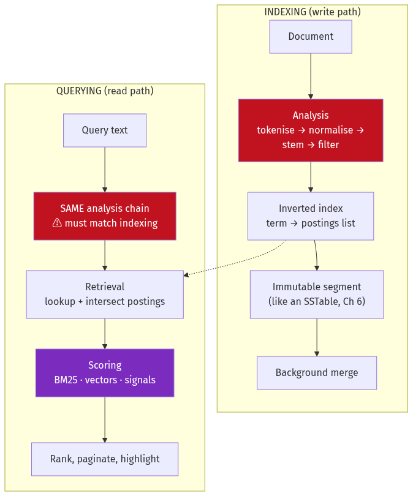
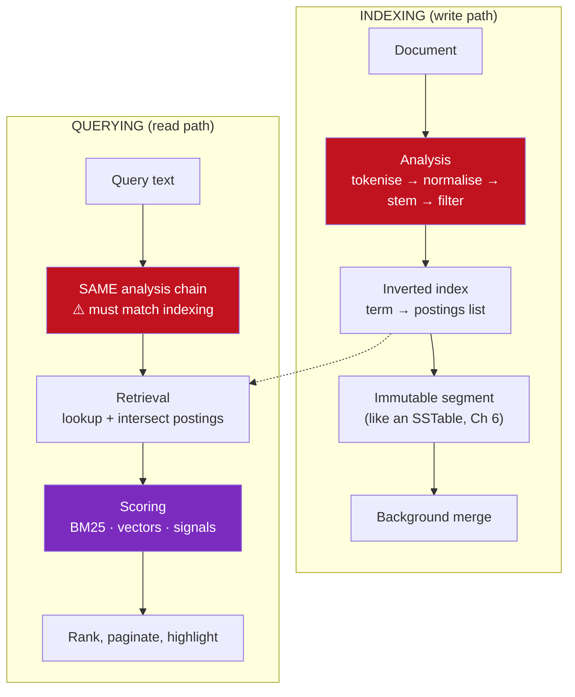
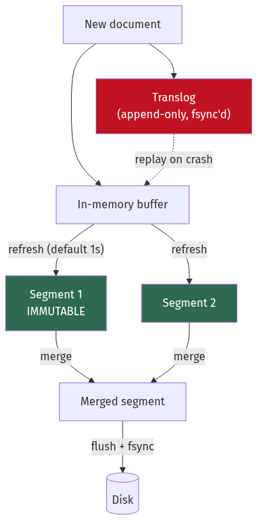
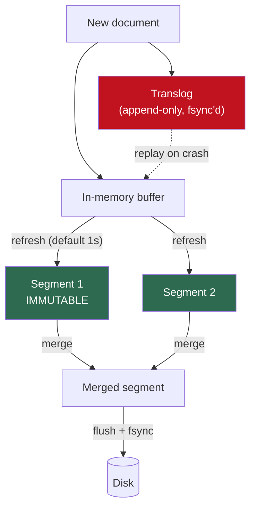
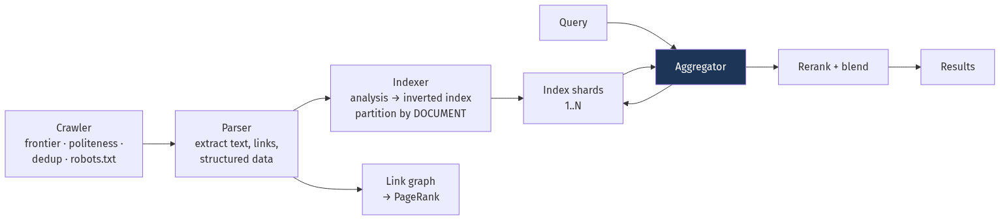
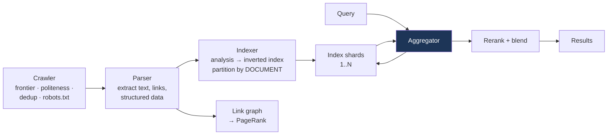

# Chapter 14 — Search Systems

[← Chapter 13](./13_big_data_batch_stream_analytics.md) · [Contents](./README.md) · [Next: Chapter 15 →](./15_apis_and_protocols.md)

**Prerequisites:** [Chapter 6](./06_storage_engines_internals.md) (LSM trees — Lucene segments are the same idea) and [Chapter 8](./08_nosql_and_polyglot_persistence.md) §8.6 (vectors and HNSW).

---

## What you'll learn

- How to build an **inverted index** by hand, and why it's the only structure that makes text search possible
- The **analysis pipeline** — tokenisation, normalisation, stemming, stop words — and the single most common bug it causes
- How postings lists are **compressed** to a fraction of their raw size, and how skip lists make intersection fast
- **TF-IDF then BM25**, derived term by term so you understand what each parameter does
- **Lucene segments**, the near-real-time refresh, and the translog — and why search is "near" real time rather than real time
- **Elasticsearch** sharding, mapping, and the **deep pagination** problem with its correct fix
- **Autocomplete** four ways, and **fuzzy matching** via Levenshtein automata
- **Vector search and hybrid retrieval** — combining BM25 with embeddings, and why RRF is the standard fusion
- How to design a **web-scale search engine** end to end

---

## Start from zero

You have a million documents and someone types "distributed systems". How do you find the
documents containing both words?

**The obvious approach:** open every document and look. A million documents at a millisecond
each is sixteen minutes. Unusable.

**The insight that makes search possible:** don't organise by document. Organise by *word*.

```
Instead of:
  doc1 → "the cat sat on the mat"
  doc2 → "the dog sat on the log"

Build:
  "cat" → [doc1]
  "sat" → [doc1, doc2]
  "dog" → [doc2]
  "mat" → [doc1]
  "log" → [doc2]
```

This is an **inverted index** — inverted because it maps content to documents rather than
documents to content. Now "cat AND sat" is: look up `cat` → `[doc1]`, look up `sat` →
`[doc1, doc2]`, intersect → `[doc1]`. Two lookups and a merge, instead of a million reads.

That's the first half of search. The second half is harder and more interesting.

**A search for "jaguar" returns 40,000 documents. Which one goes first?** A database returns
rows; a search engine returns a *ranked* list, and the ranking is the product. The difference
between a good search engine and a bad one is almost entirely ranking, not retrieval.

So this chapter has two halves: **how you find the candidates** (inverted indexes, analysis,
compression) and **how you order them** (TF-IDF, BM25, learning to rank, and now embeddings).

---

## The mental model



<details>
<summary>Diagram source (Mermaid)</summary>



</details>

💡 **The red boxes are the same pipeline and must stay identical.** If you index with a
stemmer and query without one, "running" indexes as `run` and searches for `running` — zero
results, no error, and it looks like the index is broken. This is the single most common
search bug.

---

## Deep dive

### 14.1 Building an inverted index by hand

Five documents:

```
doc1: "The quick brown fox"
doc2: "The lazy brown dog"
doc3: "Quick brown foxes jump"
doc4: "The dog sleeps"
doc5: "Foxes are quick"
```

**Step 1 — Analyse each document** (§14.2 explains each stage):
```
doc1 → [quick, brown, fox]        (lowercased, "the" removed as a stop word)
doc2 → [lazi, brown, dog]         ("lazy" stemmed to "lazi")
doc3 → [quick, brown, fox, jump]  ("foxes" stemmed to "fox")
doc4 → [dog, sleep]
doc5 → [fox, quick]
```

**Step 2 — Invert.** For each term, record the documents, the frequency, and the positions:

```
TERM     DF   POSTINGS LIST (docID, term_freq, [positions])
──────────────────────────────────────────────────────────
brown     3   (1,1,[2]) (2,1,[2]) (3,1,[2])
dog       2   (2,1,[3]) (4,1,[1])
fox       3   (1,1,[3]) (3,1,[3]) (5,1,[1])
jump      1   (3,1,[4])
lazi      1   (2,1,[1])
quick     3   (1,1,[1]) (3,1,[1]) (5,1,[3])
sleep     1   (4,1,[2])
```

| Field | Purpose |
| --- | --- |
| **DF** (document frequency) | How many documents contain the term → drives **IDF** in scoring |
| **TF** (term frequency) | How often within this document → drives relevance |
| **Positions** | Where in the document → enables **phrase** and **proximity** queries |

**Step 3 — Query "quick brown fox":**
```
quick → {1, 3, 5}
brown → {1, 2, 3}
fox   → {1, 3, 5}
AND intersection → {1, 3}
```

📐 **Intersection cost.** Naively comparing every pair is O(n×m). Because postings are **sorted
by docID**, you can walk both lists in lockstep — a merge — which is O(n+m).

💡 **Always start with the rarest term.** `jump` appears in 1 document, `brown` in 3. Starting
from `jump` means you only check 1 candidate against the others. Lucene sorts query terms by
document frequency ascending for exactly this reason.

**Step 4 — Phrase query `"quick brown"`** needs positions:
```
doc1: quick at position 1, brown at position 2 → adjacent ✅
doc3: quick at position 1, brown at position 2 → adjacent ✅
doc5: quick at position 3, brown absent        → no match
```
⚠️ Positions roughly **double index size**. If you never use phrase queries, disable them
(`index_options: freqs` in Elasticsearch) and save the space.

### 14.2 The analysis pipeline

```
Raw text → Character filters → Tokenizer → Token filters → Terms
```

**1. Character filters** operate before tokenisation: strip HTML, map characters
(`&` → `and`).

**2. Tokenizer** splits text into tokens. This is more consequential than it looks.

| Tokenizer | `"e-mail me at a@b.com"` → |
| --- | --- |
| `whitespace` | `[e-mail, me, at, a@b.com]` |
| `standard` (Unicode segmentation) | `[e, mail, me, at, a, b.com]` |
| `keyword` (no split) | `[e-mail me at a@b.com]` |
| `ngram` | `[e-, -m, ma, ai, il, …]` |

⚠️ **CJK languages have no spaces.** Chinese, Japanese and Korean need dictionary-based or
n-gram tokenisation (`icu_tokenizer`, `kuromoji`, `smartcn`). The `standard` tokenizer splits
Chinese into individual characters, which mostly works but ranks poorly.

**3. Token filters** transform the token stream:

| Filter | Effect |
| --- | --- |
| `lowercase` | `Fox` → `fox` |
| `stop` | Removes `the`, `a`, `is`… |
| `stemmer` | `running`, `runs`, `ran` → `run` |
| `synonym` | `laptop` → `laptop`, `notebook` |
| `asciifolding` | `café` → `cafe` |
| `edge_ngram` | `fox` → `f`, `fo`, `fox` (for autocomplete) |
| `shingle` | Word n-grams: `quick brown` as one token |

#### Stemming vs lemmatisation

**Stemming** chops algorithmically. Fast, crude.
```
Porter stemmer:  studies → studi,  studying → studi   ✅ they match
                 universe → univers, university → univers  ⚠️ FALSE MATCH
```

**Lemmatisation** uses a dictionary and part-of-speech analysis to find the true base form.
```
better → good,  was → be,  mice → mouse
```
✅ More accurate. ⚠️ Slower and language-specific.

⚠️ **Aggressive stemming destroys precision.** English "aggressive" stemmers conflate words
that mean different things. For product search, where users search exact model names, a light
stemmer or none at all is usually better. **Index the field twice** — once analysed, once
`keyword` — and boost exact matches.

#### 🎯 The bug that catches everyone

```
Index-time analyzer:  standard + lowercase + porter_stem
Query-time analyzer:  standard + lowercase          ← MISMATCH

Document "running shoes" indexes as [run, shoe]
Query "running shoes" searches for [running, shoes]
→ ZERO results. No error. The index looks broken.
```
💡 **Query and index analysis must produce compatible terms.** The main legitimate exception
is **synonym expansion at query time only** — expanding at index time bakes the synonym list
into the index, so changing it requires a full reindex.

### 14.3 Compressing postings lists

A large index has billions of postings. Storing raw 32-bit document IDs is wasteful.

**Delta encoding** — store gaps instead of absolute IDs:
```
Doc IDs: [1, 5, 9, 12, 47, 51, 3021]
Deltas:  [1, 4, 4,  3, 35,  4, 2970]      ← much smaller numbers
```

**Variable-byte (varint) encoding** — small numbers take fewer bytes:
```
Value < 128:      1 byte
Value < 16,384:   2 bytes
…
The high bit of each byte is a continuation flag.
```

📐 **Combined effect:**
```
1,000,000 postings, raw 4-byte IDs:       4 MB
Delta + varint (avg delta small → 1-2 B): ~1.5 MB      → ~2.7× smaller
```

**Frame of Reference / PForDelta / SIMD-BP128** go further, encoding blocks of 128 values with
a shared bit width and handling outliers separately — this is what Lucene actually uses, and it
decodes with SIMD instructions at multiple gigabytes per second.

#### Skip lists

⚠️ Delta encoding creates a problem: to find document 50,000 you must decode every preceding
delta. For an AND query where one term is rare, that's wasteful.

**Skip pointers** store, every N postings, the absolute docID and the byte offset:
```
Postings: [d1][d2]…[d128] [d129]…[d256] [d257]…
Skip list:      ↑ (doc=1043, offset=512)  ↑ (doc=2891, offset=1024)
```
📐 Intersecting a 5-document postings list with a 10-million-document one:
```
Without skips: decode 10,000,000 deltas
With skips:    5 × log(10,000,000/128) ≈ 5 × 16 = 80 skip steps
→ ~125,000× less work
```

💡 **This is why "start with the rarest term" works so well** — the rare term drives the
iteration and skip pointers let you leap through the common term's list.

### 14.4 Scoring: from TF-IDF to BM25

#### TF-IDF, built from two intuitions

**Intuition 1 — a term appearing more often in a document makes it more relevant.**
That's **term frequency (TF)**.

**Intuition 2 — a term appearing in *every* document tells you nothing.** "the" is in
everything; "quokka" is in three documents. Rarity is informative. That's **inverse document
frequency (IDF)**.

📐 ```
IDF(t) = log(N / df(t))

N = 1,000,000 documents
"the"    appears in 990,000 → IDF = log(1.01)     = 0.004   ← nearly worthless
"quokka" appears in 3       → IDF = log(333,333)  = 12.7    ← highly informative
```

`score = TF × IDF`, summed over query terms.

#### ⚠️ Why TF-IDF is not good enough

**Problem 1 — TF grows linearly and shouldn't.** A document mentioning "fox" 100 times isn't
100× more about foxes than one mentioning it 10 times. Relevance **saturates**.

**Problem 2 — long documents win unfairly.** A 10,000-word document contains more of every term
simply by being long.

#### BM25, term by term

📐 **The formula:**
```
                                    f(t,d) × (k₁ + 1)
BM25(d,q) = Σ  IDF(t) × ─────────────────────────────────────────
            t∈q          f(t,d) + k₁ × (1 − b + b × |d|/avgdl)
```

Take it apart:

| Piece | What it does |
| --- | --- |
| `IDF(t)` | Rare terms count more. BM25 uses a smoothed variant that can't go negative. |
| `f(t,d)` | Term frequency in this document |
| **`k₁`** (default **1.2**) | **Controls TF saturation.** Low k₁ → the 2nd occurrence adds little. k₁=0 → frequency ignored entirely, only presence matters. |
| **`b`** (default **0.75**) | **Controls length normalisation.** b=0 → length ignored. b=1 → fully normalised by length. |
| `\|d\|/avgdl` | This document's length relative to the average |

📐 **Saturation, concretely** (k₁=1.2, average-length document):
```
TF=1  → 1 × 2.2 / (1 + 1.2)   = 1.00
TF=2  → 2 × 2.2 / (2 + 1.2)   = 1.38   (+38%)
TF=5  → 5 × 2.2 / (5 + 1.2)   = 1.77   (+28%)
TF=10 → 10 × 2.2 / (10 + 1.2) = 1.96   (+11%)
TF=100→ 100 × 2.2/(100 + 1.2) = 2.17   (+11% over TF=10)
```
The curve flattens. **The 100th occurrence adds almost nothing** — which matches how relevance
actually behaves, and incidentally defeats keyword stuffing.

📐 **Length normalisation, concretely** (b=0.75, avgdl=100):
```
A 50-word doc with TF=3:  denominator factor = 1 − 0.75 + 0.75×0.5  = 0.625 → boosted
A 400-word doc with TF=3: denominator factor = 1 − 0.75 + 0.75×4    = 3.25  → penalised
```
A short document mentioning the term three times is *more about it* than a long one that
mentions it three times.

💡 **Tuning guidance:** raise `b` toward 1 when document lengths vary a lot and long documents
are winning unfairly. Lower `k₁` toward 0.5 when repeated terms shouldn't matter much (product
titles). **BM25 is the default in Elasticsearch since 5.0 and in Lucene since 6.0**, and it
outperforms TF-IDF on essentially every standard benchmark.

#### Beyond textual relevance

⚠️ **BM25 only knows about text.** Real ranking blends signals:

```
final_score = w₁·BM25
            + w₂·popularity      (sales, clicks, views)
            + w₃·recency         (decay function on publish date)
            + w₄·quality         (rating, completeness, seller reputation)
            + w₅·personalisation (this user's history)
            + w₆·business        (margin, stock level, promotion)
```

💡 **For e-commerce, BM25 is typically a minority of the final score.** A perfect textual match
for an out-of-stock, one-star product should not outrank a good match for a popular one.

### 14.5 Lucene internals

Lucene is the engine inside Elasticsearch, OpenSearch and Solr. Its architecture is
**structurally identical to an LSM tree** ([Chapter 6](./06_storage_engines_internals.md) §6.5).



<details>
<summary>Diagram source (Mermaid)</summary>



</details>

**Segments are immutable.** A segment is a complete miniature index — its own inverted index,
its own doc values, its own statistics. Once written, it is never modified.

⚠️ **So how do updates and deletes work?**
```
DELETE: mark the docID in a per-segment "deletes" bitmap.
        The data is still there; it's filtered from results.
UPDATE: delete + insert a new document into the current buffer.
        The old version persists until a merge drops it.
```
📐 This is the **tombstone** pattern again, and it has the same consequence: a heavily-updated
index accumulates deleted documents that still cost disk and are still scanned.
`_forcemerge` reclaims them, but ⚠️ never run it on an index still receiving writes — it
produces enormous segments that the normal merge policy will never reconsider.

#### 💡 Why search is *near* real time

```
1. Index a document → it goes into the in-memory buffer and the translog
2. Refresh (every 1s by default) → the buffer becomes a searchable segment
3. ⚠️ Between 1 and 2, the document is INDEXED but NOT SEARCHABLE
```

📐 **The refresh interval is a real throughput lever:**
```
refresh_interval = 1s   (default) → searchable in ≤1 s, many small segments,
                                    heavy merge pressure
refresh_interval = 30s            → ~30 s delay, far fewer segments
refresh_interval = -1             → no refresh at all
```
**For a bulk load, set `refresh_interval: -1` and `number_of_replicas: 0`, then restore both
afterwards.** This routinely gives a 3–10× indexing speedup, because you stop paying for
segment creation and replication during the load.

**The translog** provides durability between flushes — exactly the WAL from
[Chapter 6](./06_storage_engines_internals.md) §6.7. A refresh makes documents *searchable*;
a **flush** fsyncs segments and truncates the translog.
```
index.translog.durability: request  (default) → fsync per request, safest, slower
index.translog.durability: async              → fsync every 5s, ⚠️ up to 5s of loss
```

**Merge policy** is the LSM compaction question again: merging reduces segment count (faster
search, reclaimed deletes) but costs I/O. Tiered merge policy is the default; the practical
knob is `index.merge.scheduler.max_thread_count`, which should be low on spinning disks and
higher on SSDs.

### 14.6 Elasticsearch in practice

#### Shards and replicas

```
Index "products", 5 primary shards, 1 replica each = 10 shards total
Each primary shard is an independent Lucene index.
```

📐 **The routing formula:**
```
shard = hash(_routing) % number_of_primary_shards
```
⚠️ **`number_of_primary_shards` cannot be changed after creation** — changing it would change
the routing for every document. Reindexing or the split/shrink APIs are the only options.

**Sizing shards** — the most common configuration mistake in Elasticsearch:
```
✅ Target 20–50 GB per shard
⚠️ Too small (< 1 GB): overhead per shard dominates; thousands of shards exhaust
                       cluster-state memory and slow every operation
⚠️ Too large (> 100 GB): slow recovery, slow rebalancing, long merges

Rule of thumb: aim for < 20 shards per GB of JVM heap on a node.
```

📐 **Worked sizing:**
```
500 GB of primary data
→ 500 / 40 GB = 13 primary shards. Round to 12 or 15.
With 1 replica: 24–30 total shards.
On 6 data nodes: 4–5 shards per node. ✅ Reasonable.
```

⚠️ **The classic anti-pattern is one index per day with 5 shards each.** After a year that's
1,825 shards, most holding a few hundred megabytes. Use **rollover** with **Index Lifecycle
Management** so indices roll on size, not on time.

#### The query DSL, and the distinction that matters

```json
{ "query": { "bool": {
    "must":   [ { "match": { "title": "wireless headphones" } } ],
    "filter": [ { "term":  { "in_stock": true } },
                { "range": { "price": { "lte": 200 } } } ],
    "should": [ { "match": { "brand": "sony" } } ],
    "must_not":[{ "term":  { "discontinued": true } } ]
}}}
```

| Clause | Scores? | Cached? |
| --- | --- | --- |
| `must` | ✅ Contributes to relevance | ❌ |
| `filter` | ❌ Yes/no only | ✅ **Cached as a bitset** |
| `should` | ✅ Boosts if matched | ❌ |
| `must_not` | ❌ Exclusion | ✅ |

💡 **Put every non-relevance condition in `filter`.** Filters skip scoring entirely and their
results are cached as bitsets that are reused across queries. Moving `in_stock` and `price`
from `must` to `filter` is frequently a 2–5× latency improvement for one line of change.

⚠️ **`match` vs `term`:** `match` analyses the input; `term` does not. Searching a `text` field
with `term` for `"Wireless"` finds nothing, because the index contains `wireless` lowercased.
Use `term` only on `keyword` fields.

#### ⚠️ Deep pagination

```
GET /products/_search { "from": 100000, "size": 10 }
```

📐 **Why this is catastrophic:**
```
Each of 10 shards must return its top 100,010 documents to the coordinator.
The coordinator sorts 1,000,100 documents and discards 1,000,090 of them.
Memory and CPU grow linearly with `from`. Elasticsearch caps it at index.max_result_window
(default 10,000) precisely to stop you.
```

✅ **`search_after` — the correct fix:**
```json
{ "size": 10,
  "sort": [ {"price": "asc"}, {"_id": "asc"} ],   // ⚠️ tiebreaker is required
  "search_after": [199.99, "product_8371"] }      // last result of the previous page
```
Constant cost per page regardless of depth — the same **cursor** idea as
[Chapter 15](./15_apis_and_protocols.md)'s pagination.

| Method | Use for | Cost |
| --- | --- | --- |
| `from`/`size` | First few pages only | ⚠️ O(from) |
| `search_after` | ✅ Infinite scroll, deep paging | O(size) |
| `PIT` + `search_after` | Consistent snapshot across pages | O(size) |
| `scroll` | ⚠️ Deprecated for paging; export only | Holds resources |

#### Aggregations and faceting

```json
{ "size": 0,
  "aggs": {
    "by_brand":  { "terms": { "field": "brand", "size": 20 } },
    "by_price":  { "range": { "field": "price",
                    "ranges": [{"to":50},{"from":50,"to":200},{"from":200}] } },
    "avg_rating":{ "avg": { "field": "rating" } } } }
```

Aggregations use **doc values** — a columnar, on-disk representation of each field
([Chapter 6](./06_storage_engines_internals.md) §6.9 again). Not the inverted index; the
inverted index maps term→docs, and aggregation needs doc→value.

⚠️ **High-cardinality `terms` aggregations are expensive and approximate.** With many shards,
each returns its own top-N and the coordinator merges them — so a term that's 21st on every
shard but globally 5th can be missed. Increase `shard_size` to trade accuracy for memory, and
check `doc_count_error_upper_bound` in the response.

⚠️ **Never enable `fielddata` on a `text` field.** It loads every term of every document into
heap and is a reliable way to OOM a cluster. Use a `keyword` sub-field instead.

### 14.7 Autocomplete

Four approaches, and the choice is genuinely consequential.

| Approach | Latency | Memory | Fuzzy? | Ranking |
| --- | --- | --- | --- | --- |
| **Prefix query** (`title:head*`) | ⚠️ Slow — scans the term dictionary | Low | ❌ | BM25 |
| **Edge n-grams** | Fast | ⚠️ High — index bloat | ❌ | BM25 |
| **FST / completion suggester** | ⭐ **Fastest** | Low (in memory) | ✅ Limited | Static weights |
| **Precomputed top-k** | ⭐ Fastest | Moderate | ❌ | ✅ Fully controllable |

**Edge n-grams** index every prefix:
```
"headphones" → [h, he, hea, head, headp, headph, headpho, headphon, headphone, headphones]
```
📐 ⚠️ **Index size cost:** a term of length L produces L tokens, so index size grows roughly
with the square of average term length. `min_gram: 2, max_gram: 10` bounds it — beyond 10
characters, users have typed enough that a normal query works.

**FST (Finite State Transducer)** — the completion suggester — stores the term dictionary as a
minimised automaton with shared prefixes *and suffixes*.
```
Terms: [cat, cats, dog, dogs]
FST shares the "c-a-t" path and the trailing "s" transition.
```
📐 Extremely compact (often 5–10× smaller than the raw strings) and kept in memory, giving
sub-millisecond lookups. ⚠️ It's built at index time with static weights, so it can't rank by
anything dynamic, and it doesn't handle filters well.

💡 **The precomputed-top-k approach is what large e-commerce sites actually use.** Take your
query logs, compute the top 10 completions for every prefix offline, and store them in Redis:
```
key: "ac:head" → ["headphones", "headphones wireless", "head torch", ...]
```
✅ Sub-millisecond, and ranking is fully under your control — you can rank by conversion rate
rather than by text similarity. ⚠️ Doesn't cover prefixes absent from the logs, so fall back to
an FST or n-gram query for the tail.

### 14.8 Fuzzy matching

Users mistype. **Levenshtein (edit) distance** counts insertions, deletions and substitutions:
```
"helo"    → "hello"    distance 1 (insert l)
"recieve" → "receive"  distance 2 (transpose — or 1 with Damerau-Levenshtein)
```

⚠️ **Naively comparing the query to every term in the dictionary is O(vocabulary × length²)** —
completely impractical for millions of terms.

**The Levenshtein automaton** is the trick that makes it fast: construct a finite automaton
accepting exactly the strings within distance k of the query, then **intersect it with the
term dictionary's FST**. You traverse both simultaneously, pruning branches that can't lead to
a match.

📐 ```
Naive:     compare against 5,000,000 terms
Automaton: traverse the shared FST structure, pruning early
           → typically a few thousand state transitions
```
This is what Lucene's `fuzzy` query does, and it's why `fuzziness: AUTO` is affordable.

**`fuzziness: AUTO`** adapts to term length, which is the sensible default:
```
Length 0–2: distance 0 (no fuzziness — "to" and "go" are different words)
Length 3–5: distance 1
Length 6+:  distance 2
```

⚠️ **Fuzzy matching is dangerous on short terms and on identifiers.** Distance 2 on a
five-character product code matches a large fraction of your catalogue. Restrict fuzziness to
natural-language fields and consider requiring an exact prefix (`prefix_length: 1` or `2`),
which both improves precision and dramatically speeds up the automaton intersection.

**Phonetic matching** (Soundex, Metaphone, Double Metaphone) handles a different error class —
"Smith" vs "Smyth", "Katherine" vs "Catherine". Useful for name search, and usually indexed
into a separate field rather than replacing the main one.

### 14.9 Vector and hybrid search

**Lexical search (BM25) matches words. Semantic search matches meaning.**

```
Query: "how do I stop my laptop overheating"
BM25 finds:     documents containing "laptop", "overheating"
Vector finds:   "reducing thermal throttling in notebooks"  ← no shared keywords
```

**The embedding** is a dense vector from a model; similar meanings sit close together.
Retrieval is approximate nearest neighbour, usually **HNSW**
([Chapter 8](./08_nosql_and_polyglot_persistence.md) §8.6).

#### ⚠️ Each fails where the other succeeds

| | BM25 | Vector |
| --- | --- | --- |
| Exact terms, model numbers, names | ✅ **Excellent** | ⚠️ Poor — "iPhone 14 Pro" and "iPhone 15 Pro" embed almost identically |
| Synonyms and paraphrase | ⚠️ Poor without a synonym list | ✅ Excellent |
| Rare/out-of-vocabulary terms | ✅ Works | ⚠️ Poorly represented by the model |
| Explainability | ✅ You can see which terms matched | ❌ Opaque |
| Index cost | Low | ⚠️ High — RAM for the graph |
| Domain adaptation | Immediate | ⚠️ Needs fine-tuning or a domain model |

💡 **So use both — hybrid retrieval.** Run BM25 and vector search independently and fuse the
ranked lists.

**Reciprocal Rank Fusion (RRF)** is the standard method, and its appeal is that it needs no
score normalisation:

📐 ```
RRF_score(d) = Σ  1 / (k + rank_i(d))        with k = 60 conventionally
              i∈retrievers

Document at rank 1 in BM25, rank 8 in vector:
  1/(60+1) + 1/(60+8) = 0.0164 + 0.0147 = 0.0311
```
✅ Because it uses **ranks, not scores**, you avoid the genuinely hard problem of making a BM25
score (unbounded, corpus-dependent) comparable with a cosine similarity (bounded, 0–1).

**The full modern pipeline:**
```
1. RETRIEVE  — BM25 top 100 + vector top 100        (fast, high recall)
2. FUSE      — RRF → top 100 combined
3. RERANK    — cross-encoder model on those 100      (slow, high precision)
4. BUSINESS  — apply availability, margin, personalisation
5. RETURN    — top 10
```
💡 **The retrieve-then-rerank split exists because of cost.** A cross-encoder that jointly
encodes query and document is far more accurate than comparing independent embeddings, but it
must run per candidate — 50 ms for 100 documents is fine; for 10 million it's impossible. So
you use cheap methods for recall and expensive ones for precision on a small candidate set.

### 14.10 Designing a web-scale search engine



<details>
<summary>Diagram source (Mermaid)</summary>



</details>

**Crawler concerns:** a URL frontier with priority, per-host politeness (rate limits and
`robots.txt`), duplicate detection via content hashing and **SimHash** for near-duplicates,
trap avoidance (infinite calendars, session IDs in URLs), and recrawl scheduling proportional
to observed change rate.

**📐 The critical index-partitioning decision:**

| | **Document partitioning** | **Term partitioning** |
| --- | --- | --- |
| Each shard holds | A subset of documents, all their terms | A subset of terms, all their documents |
| A query | Goes to **every** shard | Goes to only the shards holding its terms |
| Per-shard work | Small | ⚠️ Potentially enormous for a common term |
| Load balance | ✅ Even | ⚠️ Very uneven — "the" is one shard's problem |
| Adding documents | ✅ Add a shard | ⚠️ Touches many shards |
| Result merging | Merge top-k from N shards | Intersect across shards — network-heavy |

💡 **Essentially everyone uses document partitioning**, despite the scatter-gather cost, because
term partitioning's load imbalance and cross-shard intersection are worse. Google's published
architecture, Elasticsearch, and Solr all partition by document.

⚠️ **But scatter-gather has the tail-latency property from
[Chapter 3](./03_reliability_availability_performance.md) §3.10:** your latency is the
*maximum* over all shards. With 100 shards at 1% slow, 63% of queries are slow. Mitigations:
**hedged requests** to a replica, and returning partial results if a shard doesn't answer in
time.

**Tiered indexes** are the other essential trick:
```
Tier 1: the ~1% highest-quality documents — small, entirely in RAM
Tier 2: the rest — larger, mostly on SSD

Query tier 1 first. If it yields enough good results, stop.
→ The vast majority of queries never touch tier 2.
```

**Ranking at web scale** blends hundreds of signals: BM25, **PageRank** (link authority),
freshness, click-through rate from query logs, dwell time, spam scores, and — since 2019 —
transformer models like BERT for query understanding.

💡 **The single most valuable signal is click data.** Which result did users click, and did
they come back? That's implicit relevance judgement at enormous scale, and it's the primary
input to **learning-to-rank** models. ⚠️ It's also strongly **position-biased** — result 1 gets
clicked because it's first, not necessarily because it's best — so it must be debiased before
training, typically with an examination model or by injecting randomisation.

---

## Worked example — e-commerce product search

*10 million products, 5,000 searches/second at peak, P99 under 200 ms. Requirements: typo
tolerance, faceted filtering, autocomplete, relevance blending text match with popularity and
availability, and results updated within a minute of a catalogue change.*

**Step 1 — Size the index.**
```
10M products × ~2 KB of indexed fields = 20 GB of source
Inverted index typically 0.5–1.5× source depending on fields → ~25 GB primary

Shards: 25 GB / 40 GB target = 1 shard is technically enough.
⚠️ But 1 shard means no query parallelism and no incremental scaling.
→ 3 primary shards (~8 GB each) + 1 replica = 6 shards total.

At 5,000 QPS: each replica set handles the full query volume, so add replicas
for throughput, not for storage: 3 primaries × 2 replicas = 9 shards on 3 nodes.
```
💡 **Replicas scale read throughput; primaries scale write throughput and storage.** At 5,000
QPS the constraint is read capacity, so more replicas — not more primaries.

**Step 2 — Design the mapping.** This is where most search quality is won or lost.

```json
{
  "settings": {
    "analysis": {
      "analyzer": {
        "product_index": { "tokenizer": "standard",
          "filter": ["lowercase", "asciifolding", "light_english_stemmer"] },
        "product_search": { "tokenizer": "standard",
          "filter": ["lowercase", "asciifolding", "light_english_stemmer",
                     "product_synonyms"] }
      },
      "filter": {
        "product_synonyms": { "type": "synonym_graph",
          "synonyms": ["laptop, notebook", "tv, television", "trainers, sneakers"] }
      }
    }
  },
  "mappings": { "properties": {
    "title": {
      "type": "text",
      "analyzer": "product_index",
      "search_analyzer": "product_search",
      "fields": {
        "exact":  { "type": "keyword" },
        "prefix": { "type": "text", "analyzer": "edge_ngram_analyzer" }
      }
    },
    "brand":     { "type": "keyword" },
    "category":  { "type": "keyword" },
    "price":     { "type": "scaled_float", "scaling_factor": 100 },
    "in_stock":  { "type": "boolean" },
    "rating":    { "type": "half_float" },
    "sales_30d": { "type": "integer" },
    "embedding": { "type": "dense_vector", "dims": 384,
                   "index": true, "similarity": "cosine" }
  }}
}
```

**Three deliberate choices:**

⚠️ **Synonyms at search time only.** Expanding at index time bakes the list into the index, so
changing a synonym requires a full reindex. Search-time expansion means editing the list is a
settings update.

⚠️ **`light_english_stemmer`, not `english`.** Aggressive stemming conflates distinct product
terms. Light stemming handles plurals without destroying precision.

💡 **`title.exact` as a `keyword` sub-field** lets you boost exact matches heavily. A user
searching "AirPods Pro" should get the exact product first, not a stemmed near-match.

**Step 3 — The query.**

```json
{
  "query": { "bool": {
    "should": [
      { "match_phrase": { "title": { "query": "wireless headphones", "boost": 10 } } },
      { "term": { "title.exact": { "value": "wireless headphones", "boost": 20 } } },
      { "multi_match": {
          "query": "wireless headphones",
          "fields": ["title^3", "brand^2", "description"],
          "fuzziness": "AUTO", "prefix_length": 2, "boost": 1 } }
    ],
    "minimum_should_match": 1,
    "filter": [
      { "term":  { "in_stock": true } },
      { "terms": { "category": ["audio"] } },
      { "range": { "price": { "gte": 20, "lte": 300 } } }
    ]
  }},
  "aggs": {
    "brands":     { "terms": { "field": "brand", "size": 20 } },
    "price_bands":{ "range": { "field": "price",
                     "ranges":[{"to":50},{"from":50,"to":150},{"from":150}] } }
  },
  "size": 24,
  "sort": ["_score", {"_id": "asc"}]
}
```

📐 **Why the filters matter so much:**
```
All conditions in `must`:   every matching doc is scored → ~200 ms
in_stock/price/category in `filter`: filters run first as cached bitsets,
                            scoring applies only to survivors → ~40 ms
5× improvement from moving three clauses.
```

**Step 4 — Blend business signals into the score.**

⚠️ BM25 alone will rank a perfect textual match for a one-star, rarely-sold product above a
good match for a bestseller. That's wrong for e-commerce.

```json
{ "query": { "function_score": {
    "query": { "...the bool query above..." },
    "functions": [
      { "field_value_factor": { "field": "sales_30d",
          "modifier": "log1p", "factor": 0.3, "missing": 0 } },
      { "field_value_factor": { "field": "rating",
          "modifier": "none", "factor": 0.2, "missing": 3.0 } },
      { "gauss": { "created_at": { "origin": "now", "scale": "180d", "decay": 0.5 } } }
    ],
    "score_mode": "sum",
    "boost_mode": "multiply"
}}}
```
💡 **`log1p` on sales is important.** Raw sales counts span orders of magnitude; without a
logarithm, one bestseller dominates every query regardless of text relevance. The log
compresses the range so popularity nudges rather than dictates.

**Step 5 — Autocomplete, at 5,000 QPS.**

⚠️ Running an Elasticsearch query per keystroke at 5,000 searches/second means perhaps 25,000
requests/second of autocomplete — five times the search load.

```
Precompute offline from 90 days of query logs:
  For each prefix (2–12 chars), the top 10 completions ranked by
  CONVERSION RATE, not by frequency.
Store in Redis: "ac:head" → ["headphones", "headphones wireless", ...]

Latency: <1 ms. Elasticsearch load: zero.
Fallback for prefixes absent from logs: completion suggester (FST).
Refresh: nightly batch job.
```
📐 **Memory:** ~2 million distinct prefixes × 10 completions × 40 bytes ≈ **800 MB**. Trivial
next to eliminating 25,000 QPS from the cluster.

💡 **Ranking by conversion rather than frequency is the point.** The most *frequent* completion
is often a query that doesn't convert. Optimising autocomplete for the business metric rather
than the text metric is a meaningful revenue difference.

**Step 6 — Keeping the index fresh within a minute.**

```
Postgres (source of truth) → Debezium CDC → Kafka → indexer → Elasticsearch bulk API
```
⚠️ **Not dual writes** ([Chapter 10](./10_distributed_transactions_and_integrity.md) §10.3) —
CDC, so the index can never silently diverge from the catalogue, and can be rebuilt from
scratch at any time.

```
refresh_interval: 30s     ← 30 s to searchable; comfortably inside the 1-minute budget
Bulk indexing: batches of 1,000 docs or 5 MB, whichever first
```

**Step 7 — Handle the deep-pagination and tail-latency risks.**
```
Pagination: search_after with [_score, _id] — constant cost at any depth
Tail latency: 3 shards means scatter-gather over 3, not 100 — P99 impact is modest.
              Set a per-shard timeout and allow partial results rather than failing.
```

**Step 8 — Add semantic search as a second retriever.**
```
Ingest: product title + description → sentence-transformer (384 dims) → dense_vector field
Query:  kNN search top 100  ⊕  BM25 top 100  →  RRF fusion (k=60)  →  top 24

Memory for HNSW: 10M × 384 × 4 B = 15.4 GB vectors + ~1 GB graph links
⚠️ This roughly doubles cluster memory. Justify it with an A/B test on
   conversion, not on the assumption that semantic search is better.
```

**Step 9 — Measure relevance, because opinions aren't data.**

| Metric | What it tells you |
| --- | --- |
| **NDCG@10** | Ranking quality against graded relevance judgements |
| **MRR** | How high the first relevant result appears |
| **Recall@100** | Is the right answer even in the candidate set? (retrieval, not ranking) |
| **CTR@1–3** | Do users click the top results? |
| **Zero-result rate** | ⚠️ Queries returning nothing — usually the biggest quick win |
| **Conversion from search** | The only metric that pays for the system |

💡 **Start with the zero-result rate.** It's usually 5–15%, it's easy to measure, and the fixes
— synonyms, fuzziness, a fallback to OR matching, spelling correction — are cheap and produce
immediate, measurable revenue.

**Step 10 — The result.**

| Requirement | Solution | Measured |
| --- | --- | --- |
| 5,000 QPS, P99 < 200 ms | 3 primaries × 3 copies; filters cached | ~40 ms P99 |
| Typo tolerance | `fuzziness: AUTO`, `prefix_length: 2` | — |
| Faceting | `terms`/`range` aggregations on `keyword` fields | — |
| Autocomplete | Precomputed top-k in Redis, ranked by conversion | < 1 ms |
| Business ranking | `function_score` with `log1p(sales)` and rating | A/B tested |
| Freshness < 1 min | CDC → Kafka → bulk index, `refresh_interval: 30s` | ~35 s |
| Semantic matching | Hybrid BM25 + kNN, fused with RRF | A/B tested |

---

## Trade-offs

| Decision | Option A | Option B | Choose A when | Never choose A when |
| --- | --- | --- | --- | --- |
| Search backend | Postgres `tsvector` | Elasticsearch | < ~1M docs, simple relevance, no faceting | Need tuned ranking, fuzziness, aggregations, high QPS |
| Stemming | Aggressive (`english`) | Light or none | Long-form prose | Product/identifier search — precision matters more |
| Synonyms | Index time | **Search time** | Never — it bakes the list into the index | Prefer B; changing synonyms shouldn't need a reindex |
| Query clause | `must` | **`filter`** | The clause should affect relevance | Yes/no conditions — `filter` is cached and skips scoring |
| Pagination | `from`/`size` | **`search_after`** | First 2–3 pages only | Deep paging — `from` is O(from) per shard |
| Autocomplete | Live ES query per keystroke | Precomputed top-k | Low traffic | High QPS — B costs the cluster nothing |
| Autocomplete | Edge n-grams | FST / completion suggester | Need filtering and BM25 ranking | Memory and speed dominate |
| Retrieval | BM25 only | Hybrid BM25 + vector | Exact terms dominate; budget is tight | Users phrase queries in natural language |
| Fusion | Score normalisation | **RRF** | You have calibrated scores | Usually B — ranks avoid the normalisation problem |
| Index partitioning | By term | **By document** | Essentially never | Always B — term partitioning load-imbalances badly |
| Refresh interval | 1s (default) | 30s or −1 during bulk | Real-time requirement | Bulk loading — B is 3–10× faster |
| Shard count | Many small | 20–50 GB each | Never | Oversharding exhausts cluster state |

---

## How real companies do it

**Elasticsearch and Solr are both Lucene**, which is why they share deep behaviour — segments,
BM25 defaults, analysis chains — and differ mainly in clustering, APIs and operational model.
Understanding Lucene transfers between them.

**Algolia** built a search engine specifically optimised for the "search-as-you-type" case,
and their published design choices are instructive: they keep indices in memory, rank with a
tie-breaking sequence of criteria rather than a single blended score, and are explicit that
sub-50 ms latency changes user behaviour. Their argument for **explainable, ordered ranking
criteria** over an opaque single score is worth considering — it makes relevance debuggable.

**Amazon's product search (A9)** publicly emphasises that textual relevance is a *minority* of
the final ranking. Purchase probability, conversion rate, delivery speed and availability
dominate. This is the clearest industry example of §14.4's point that BM25 alone is the wrong
objective for commerce.

**Google's BERT deployment (2019)** was described as affecting roughly 10% of queries, and
targeted **query understanding** — particularly the meaning carried by prepositions and word
order, which bag-of-words scoring is blind to. It's the transition point where neural methods
moved from reranking research into mainstream serving.

**Wikipedia/Wikimedia** runs a large public Elasticsearch deployment and publishes its
relevance work openly, including their learning-to-rank plugin and the click-model debiasing
they apply to training data. It's one of the few places you can read a real, complete relevance
pipeline rather than a summary of one.

---

## Common mistakes

**Mismatched index-time and query-time analysers.** Documents index as `run` and queries search
for `running` — zero results, no error. Check with the `_analyze` API on both.

**Over-aggressive stemming on product data.** "universe" and "university" both stem to
`univers`. Use light stemming, and index an unanalysed `keyword` sub-field for exact boosts.

**Putting yes/no conditions in `must`.** They get scored and aren't cached. Move them to
`filter` for a routine 2–5× improvement.

**Using `term` on a `text` field.** `term` doesn't analyse, so it never matches an analysed
index. Use `match`, or `term` on a `keyword` field.

**Deep pagination with `from`/`size`.** Each shard must return `from + size` documents. Use
`search_after`.

**Oversharding.** One index per day with 5 shards is 1,825 shards a year, most nearly empty.
Use rollover and ILM; target 20–50 GB per shard.

**Enabling `fielddata` on a `text` field.** Loads every term into heap. A reliable OOM.

**Running `_forcemerge` on a live index.** Produces enormous segments the merge policy will
never revisit. Only on read-only indices.

**Fuzzy matching on short strings or identifiers.** Distance 2 on a five-character SKU matches
much of the catalogue. Use `prefix_length` and restrict fuzziness to natural-language fields.

**Assuming vector search beats BM25.** It's much worse at exact terms, model numbers and rare
words. Hybrid, measured by A/B test, is the answer — not replacement.

**Ranking by text relevance alone in commerce.** A perfect match for an out-of-stock,
one-star item should not outrank a good match for a bestseller.

**Not measuring the zero-result rate.** Usually 5–15% of queries, usually cheap to fix, usually
the largest single relevance win available.

**Ignoring position bias in click data.** Result 1 gets clicked because it's first. Training a
model on raw clicks entrenches whatever ranking you already had.

---

## Interview angle

**Q: How does full-text search work?**

*Strong:* "An **inverted index**. Instead of mapping documents to their content, you map each
term to a sorted list of the documents containing it — the postings list — along with term
frequency and optionally positions for phrase queries. A boolean query becomes a merge of
sorted lists, which is linear rather than quadratic, and you start with the rarest term so its
short list drives the iteration while skip pointers let you leap through the common terms.
Getting documents in the index requires an **analysis pipeline** — tokenise, lowercase, remove
stop words, stem — and the critical operational point is that **the same pipeline must run at
query time**, or you index `run` and search for `running` and get zero results with no error.
Then the second half, which is really the product: retrieval gives you 40,000 candidates and
**ranking** decides which ten a user sees. That's BM25 plus whatever domain signals matter."

**Q: Explain BM25 and why it replaced TF-IDF.**

*Strong:* "TF-IDF has two intuitions right — a term appearing more often in a document matters,
and a term appearing in every document tells you nothing — but it models both badly. Term
frequency contributes **linearly**, so a document mentioning 'fox' a hundred times scores ten
times one mentioning it ten times, which doesn't match how relevance actually works. And long
documents win unfairly just by containing more of everything. BM25 fixes both with two
parameters. **k₁**, default 1.2, makes term frequency **saturate** — the second occurrence adds
a lot, the hundredth adds almost nothing, which follows a diminishing-returns curve and
incidentally defeats keyword stuffing. **b**, default 0.75, normalises by document length
relative to the corpus average, so a fifty-word document mentioning the term three times
outranks a four-hundred-word one that does. You'd raise b toward 1 when lengths vary a lot, and
lower k₁ when repetition shouldn't matter, like product titles. It's the Lucene and
Elasticsearch default since 2016 and it beats TF-IDF on essentially every standard benchmark."

**Q: A user searches for a product and gets nothing, but the product exists. Debug it.**

*Strong:* "I'd work down the pipeline. First, **analyser mismatch** — run the `_analyze` API on
both the index-time and search-time analysers with the actual query text and compare the
tokens. If indexing stems and querying doesn't, or if a synonym filter is on one side only, you
get exactly this: zero results with no error. Second, **`term` versus `match`** — `term`
doesn't analyse its input, so searching a `text` field with `term` for a capitalised word never
matches the lowercased index. Third, **filters excluding it** — an `in_stock` or category
filter silently removing the document. Fourth, **it isn't searchable yet** — Elasticsearch is
*near* real time, so a document indexed within the last refresh interval isn't visible; check
`refresh_interval`. Fifth, **routing** — if custom routing is used and the query doesn't
specify it, you may be querying the wrong shard. And I'd use the `_explain` API on the specific
document ID, which tells you directly whether it matched and why it scored what it did."

**Q: How would you build autocomplete for 5,000 searches per second?**

*Strong:* "Not with a live query per keystroke — at five keystrokes per search that's 25,000
requests per second, five times your search load. I'd **precompute the top ten completions for
every prefix offline** from 90 days of query logs and store them in Redis, keyed by prefix.
Sub-millisecond lookups and zero load on the search cluster; roughly 800 MB of memory for a
couple of million prefixes, which is nothing. The important design choice is ranking by
**conversion rate rather than query frequency** — the most common completion is often one that
doesn't convert, and optimising for the business metric rather than the text metric is a real
revenue difference. For prefixes absent from the logs I'd fall back to Elasticsearch's
completion suggester, which is an FST — a minimised automaton sharing prefixes and suffixes, so
it's compact, in memory, and sub-millisecond. I'd avoid edge n-grams unless I need BM25 ranking
and filtering on the suggestions, because they inflate the index roughly with the square of
term length."

**Q: When would you use vector search instead of keyword search?**

*Strong:* "Rarely *instead* — usually *alongside*, because they fail in opposite places. Vector
search matches meaning, so it handles paraphrase and synonymy that BM25 misses entirely: 'how
do I stop my laptop overheating' finds 'reducing thermal throttling in notebooks' with no
shared keywords. But it's **worse than BM25 at exact terms** — 'iPhone 14 Pro' and 'iPhone 15
Pro' embed almost identically, which is catastrophic for product search — and at rare or
out-of-vocabulary terms the model hasn't seen. It's also opaque, so you can't explain why
something ranked where it did. So the standard architecture is **hybrid**: retrieve top-100
from each independently, fuse with **Reciprocal Rank Fusion**, then optionally rerank the fused
set with a cross-encoder. RRF uses ranks rather than scores, which sidesteps the genuinely hard
problem of making an unbounded BM25 score comparable to a bounded cosine similarity. And the
retrieve-then-rerank split exists purely because of cost — a cross-encoder is far more accurate
but must run per candidate, so you use it on a hundred documents, not ten million. I'd justify
the extra memory with an A/B test on conversion, not on the assumption that semantic is
better."

**Q: Your search cluster has 2,000 shards and everything is slow. What's wrong?**

*Strong:* "Almost certainly **oversharding**, and the classic cause is one index per day with a
fixed shard count — five shards a day is 1,825 shards a year, most of them holding a few
hundred megabytes. Every shard is a separate Lucene index with its own overhead: file handles,
memory for segment metadata, and an entry in the cluster state that the master must manage and
replicate. Query latency suffers because a search fans out to every shard and the coordinator
merges all the responses — and by the tail-at-scale argument, your latency is the *maximum*
across shards, so with hundreds of them you're effectively sampling the P99.9 of each. The fix
is to target **20–50 gigabytes per shard** and keep under roughly 20 shards per gigabyte of JVM
heap per node. Operationally that means **rollover with Index Lifecycle Management** — roll on
size rather than on date — plus shrinking or reindexing the existing small indices, and using
`_forcemerge` on read-only older indices to reduce their segment count."

---

## Recap

- An **inverted index** maps term → sorted postings list. Boolean queries are sorted-list
  merges; **start with the rarest term**, and **skip pointers** make intersection near-free.
- The **analysis pipeline** must be compatible at index and query time. ⚠️ Mismatch gives zero
  results with no error — the most common search bug.
- **Light stemming beats aggressive stemming** for product and identifier search. Index a
  `keyword` sub-field for exact boosts.
- **Postings compress ~3×** with delta + varint encoding; skip lists avoid decoding what you
  don't need.
- **BM25 fixes TF-IDF's two flaws**: `k₁` saturates term frequency, `b` normalises document
  length.
- ⚠️ **BM25 only knows text.** Commerce ranking must blend popularity, availability, rating and
  margin — and use `log1p` on counts spanning orders of magnitude.
- **Lucene segments are an LSM tree.** Deletes are tombstones; search is *near* real time
  because of the refresh interval. Set `refresh_interval: -1` for bulk loads.
- **Put non-relevance conditions in `filter`** — cached bitsets, no scoring, routinely 2–5×.
- ⚠️ **Deep pagination with `from`/`size` is O(from) per shard.** Use `search_after`.
- **Target 20–50 GB per shard.** Oversharding exhausts cluster state and amplifies tail latency.
- **Precompute autocomplete top-k**, ranked by conversion, not frequency.
- **Hybrid BM25 + vector fused with RRF, then reranked** is the modern pipeline. Ranks avoid
  the score-normalisation problem.
- **Partition by document, not by term.** Everyone does, despite scatter-gather.
- **Measure the zero-result rate first** — usually 5–15%, cheap to fix, biggest immediate win.

---

## Test yourself

1. Index-time analysis is `standard + lowercase + porter_stem`; query-time is
   `standard + lowercase`. A user searches "running shoes". What happens and why is it hard to
   spot?
2. Two documents both mention "quantum" three times. One is 80 words, the other 900. Which
   scores higher under BM25 with default parameters, and which parameter controls it?
3. A postings list has 10 million entries; you're intersecting it with one of 4 entries.
   Estimate the work with and without skip pointers.
4. `GET /logs/_search {"from": 50000, "size": 20}` across 20 shards. How many documents does
   the coordinator sort, and what should you use instead?
5. You have 730 daily indices with 5 shards each. Diagnose the symptoms and give the fix.
6. Why does `term: {"title": "Wireless"}` return nothing on a `text` field containing "Wireless
   Headphones"?
7. Your e-commerce search ranks a perfectly-matching out-of-stock item above a well-matching
   bestseller. Fix it, and say why you'd apply a logarithm.
8. A query for "iPhone 15 Pro" using pure vector search returns iPhone 14 Pro first. Explain
   and fix.
9. You're bulk-loading 50 million documents and indexing takes 6 hours. Name three settings to
   change and their expected effect.
10. Design fuzzy matching for a 5-million-term dictionary without comparing against every term.

<details>
<summary>Answers</summary>

1. The document indexes as `[run, shoe]` (Porter stems "running"→"run", "shoes"→"shoe"), but
   the query analyses to `[running, shoes]`. Those terms don't exist in the index, so the
   result is **zero hits**.
   **Why it's hard to spot:** there's no error — the query is syntactically valid, the index
   contains the documents, and the cluster is green. It looks like a data problem. Some queries
   still work (words the stemmer doesn't change, like "laptop"), so it appears intermittent.
   **Diagnosis:** run `GET /index/_analyze` with the index analyser and again with the search
   analyser on the same text and compare the token streams. Also `_explain` on a document you
   expect to match.

2. **The 80-word document scores higher.** BM25's length normalisation divides by
   `(1 − b + b × |d|/avgdl)`. With b = 0.75 and an average length of, say, 200 words:
   ```
   80-word doc:  1 − 0.75 + 0.75 × (80/200)  = 0.25 + 0.30 = 0.55  → smaller denominator, higher score
   900-word doc: 1 − 0.75 + 0.75 × (900/200) = 0.25 + 3.375 = 3.63 → much larger denominator
   ```
   The intuition BM25 encodes: three mentions in a short document means the document is *about*
   that topic; three mentions in a long one may be incidental. **The parameter is `b`** — set it
   to 0 to disable length normalisation entirely, or toward 1 to normalise fully.

3. **Without skip pointers:** delta encoding means you must decode sequentially to reach any
   position, so intersecting requires decoding all **10,000,000** deltas.
   **With skip pointers** (typically every 128 postings): for each of the 4 documents in the
   short list, binary-search the skip index then decode within one block:
   ```
   4 × log₂(10,000,000 / 128) ≈ 4 × 16.3 ≈ 65 skip steps, plus 4 × up to 128 delta decodes
   ≈ 65 + 512 ≈ 600 operations
   ```
   Roughly **16,000× less work**. This is also why query planners iterate from the rarest term:
   the short list drives, and skips do the rest.

4. Each of the 20 shards must return its top `from + size` = **50,020** documents to the
   coordinator, which then sorts **20 × 50,020 = 1,000,400 documents** and discards 1,000,380 of
   them. Memory and CPU grow linearly with `from`, which is why
   `index.max_result_window` defaults to 10,000 and this request would be rejected.
   **Instead: `search_after`.** Sort by a field plus a unique tiebreaker (`_id`), and pass the
   sort values of the last hit from the previous page. Cost is O(size) per page regardless of
   depth. For a consistent view across many pages, combine it with a **point-in-time (PIT)**
   so the underlying segments don't shift beneath you.

5. **Oversharding**: 730 × 5 = **3,650 shards**, plus replicas = 7,300. Symptoms: slow cluster
   state updates and master overload (every shard is an entry the master must track and
   replicate), high heap usage from per-shard segment metadata, slow queries because a search
   fans out across thousands of shards and the coordinator merges all responses, and terrible
   tail latency because response time is the **maximum** across shards.
   **Fix:** target **20–50 GB per shard**. Use **rollover with ILM** so indices roll on size
   rather than on date — for modest daily volume, one index per week or month with 1 shard is
   right. Reindex or use the shrink API on existing indices, `_forcemerge` read-only older
   ones to reduce segment count, and move older data to warm/cold tiers.

6. Because **`term` does not analyse its input**, but the field was analysed at index time. The
   `text` field "Wireless Headphones" was tokenised and lowercased to `[wireless, headphones]`.
   The `term` query looks for the literal token `Wireless` with a capital W, which doesn't
   exist in the index.
   **Fixes:** use **`match`**, which runs the query through the same analyser and produces
   `wireless`; or use `term` against a **`keyword` sub-field** (`title.exact`) if you want exact,
   unanalysed matching on the full string. This is the single most common Elasticsearch
   beginner error.

7. **Blend business signals into the score** with `function_score`, and put availability in a
   `filter` rather than relying on scoring:
   ```
   filter: { "term": { "in_stock": true } }        ← exclude entirely, not just demote
   function_score:
     field_value_factor(sales_30d, modifier=log1p, factor=0.3)
     field_value_factor(rating, factor=0.2)
     boost_mode: multiply
   ```
   **Why the logarithm:** sales counts span orders of magnitude — a bestseller might have
   50,000 sales and a good product 200. Multiplying by raw sales makes popularity dominate
   entirely, so every query returns the same handful of bestsellers regardless of text
   relevance. `log1p` compresses 50,000 to ~10.8 and 200 to ~5.3, so popularity **nudges**
   ranking rather than dictating it. The same reasoning applies to any count-based signal.

8. **Vector embeddings encode meaning, and "iPhone 14 Pro" and "iPhone 15 Pro" mean almost the
   same thing** — nearly identical semantically, so their embeddings are extremely close, and
   the model has no strong notion that the digit is the single most important token. This is
   vector search's characteristic weakness: it is bad at exact terms, model numbers, versions
   and identifiers.
   **Fix: hybrid retrieval.** Run BM25 alongside the vector search — BM25 treats "15" as a term
   with high IDF and strongly prefers the exact match — and fuse the two ranked lists with
   **RRF**. Additionally boost an unanalysed `title.exact` keyword match heavily, so exact
   product-name matches win outright. The general principle: **never replace lexical search
   with vector search; combine them**, because they fail in opposite places.

9. (a) **`refresh_interval: -1`** — stop creating searchable segments during the load; restore
   to `1s` or `30s` afterwards. Typically **2–4×** faster, since segment creation and the
   associated merge pressure disappear.
   (b) **`number_of_replicas: 0`** — don't replicate every document as it's indexed; set
   replicas after the load and let Elasticsearch do a bulk recovery. Roughly **halves** the
   write work with one replica.
   (c) **Bulk API with tuned batch size** — 1,000–5,000 documents or ~5 MB per request rather
   than single-document indexing. This alone can be **10×** or more, because per-request
   overhead dominates single-doc indexing.
   Also worth doing: use auto-generated IDs (avoids a lookup to check whether the document
   exists), increase `index.translog.flush_threshold_size`, and set
   `index.translog.durability: async` **for the load only** if losing a few seconds of a
   re-runnable bulk load is acceptable.

10. Use a **Levenshtein automaton intersected with the term dictionary's FST**.
    Construct a finite automaton that accepts exactly the set of strings within edit distance k
    of the query — this automaton has size proportional to the query length and k, not to the
    dictionary. The term dictionary is itself stored as an **FST**, a minimised automaton
    sharing prefixes and suffixes. Then traverse **both simultaneously**, following only
    transitions valid in both. Any branch that can't lead to an accepting state is pruned
    immediately, so you never enumerate terms that share no viable prefix with the query.
    ```
    Naive:      5,000,000 dynamic-programming comparisons
    Automaton:  a few thousand state transitions
    ```
    Additional practical constraints: use **`fuzziness: AUTO`** so short terms get distance 0
    and only 6+ character terms get distance 2 — distance 2 on a 4-character term matches
    almost everything. And set **`prefix_length: 1` or `2`**, requiring the first characters to
    match exactly, which both improves precision and prunes the automaton traversal enormously
    at the root.

</details>

---

## Further reading

- Manning, Raghavan & Schütze, *Introduction to Information Retrieval* — free online, and the standard text
- Robertson & Zaragoza, *The Probabilistic Relevance Framework: BM25 and Beyond* (2009)
- Turnbull & Berryman, *Relevant Search* — the best practical book on tuning Elasticsearch relevance
- Schütze/Lucene: Michael McCandless's blog on FSTs, Levenshtein automata and segment merging
- Cormack, Clarke & Büttcher, *Reciprocal Rank Fusion outperforms Condorcet* (2009) — the RRF paper
- Brin & Page, *The Anatomy of a Large-Scale Hypertextual Web Search Engine* (1998)
- Elasticsearch: *A Heap of Trouble* and the official guidance on shard sizing

---

[← Chapter 13](./13_big_data_batch_stream_analytics.md) · [Contents](./README.md) · [Next: Chapter 15 — APIs and Communication Protocols →](./15_apis_and_protocols.md)
