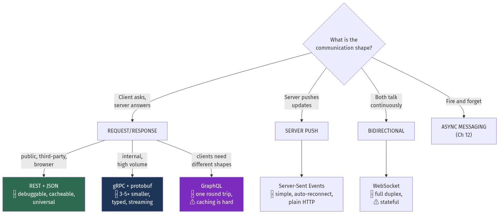
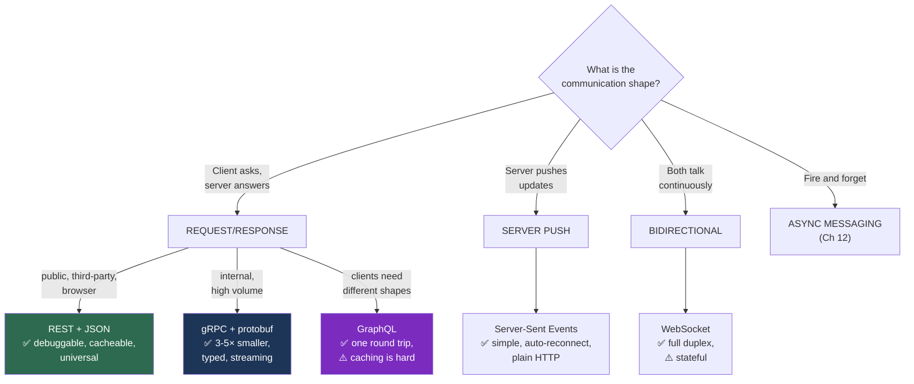

# Chapter 15 — APIs and Communication Protocols

[← Chapter 14](./14_search_systems.md) · [Contents](./README.md) · [Next: Chapter 16 →](./16_microservices_and_service_architecture.md)

**Prerequisites:** [Chapter 4](./04_networking_deep_dive.md) (HTTP/1.1, HTTP/2, TLS) and [Chapter 10](./10_distributed_transactions_and_integrity.md) §10.4 (idempotency keys).

---

## What you'll learn

- REST done properly — resources, status codes, the **Richardson Maturity Model**, and four versioning strategies with their real costs
- **Cursor vs offset pagination**, and why offset pagination is both slow *and* incorrect
- **RFC 9457 problem details**, conditional requests, and long-running operations
- The **protobuf wire format decoded byte by byte**, plus the schema-evolution rules that keep old clients working
- gRPC's four streaming modes, **deadline propagation**, and why gRPC needs special load balancing
- **GraphQL's N+1 problem** and how DataLoader fixes it, plus the security controls it *requires*
- **WebSockets vs SSE vs long polling** — and the scaling problem all persistent connections share
- **Webhooks** done properly: HMAC signing, retries, replay protection, and the thundering-herd trap

---

## Start from zero

An API is a contract. One program promises another: *"send me a message shaped like this, and
I'll send back a message shaped like that."*

The value is that **neither side needs to know how the other works**. Your mobile app doesn't
know whether the server is Go or Java, one machine or five hundred. It knows the contract.

Three questions define any API, and every technology in this chapter is a different set of
answers:

| Question | Possible answers |
| --- | --- |
| **What shape are the messages?** | JSON, XML, protobuf, MessagePack |
| **How are they addressed?** | URLs and verbs (REST), method names (RPC), a query (GraphQL) |
| **Who speaks first, and how often?** | Request/response, streaming, server push, fire-and-forget |

The reason there are several answers rather than one is that the requirements genuinely
differ. A public API consumed by third parties needs to be **discoverable, debuggable and
stable for years** — so text, standard verbs, and careful versioning. A call between two of
your own services 50,000 times a second needs to be **small and fast** — so binary, with a
schema, and no human ever reads it.

⚠️ **The most common architectural mistake in this chapter is using one answer everywhere.**
JSON over REST between internal services burns CPU on parsing and bandwidth on repeated field
names. gRPC exposed to browsers creates a compatibility problem you didn't need. Match the
protocol to the boundary.

---

## The mental model



<details>
<summary>Diagram source (Mermaid)</summary>



</details>

💡 **The most common production architecture is a hybrid:** REST or GraphQL at the edge for
browsers and third parties, gRPC between internal services, and a message broker for anything
that doesn't need an answer.

---

## Deep dive

### 15.1 REST

**REST** is an architectural style, not a protocol. Its core idea: model your domain as
**resources** identified by URLs, and manipulate them with the **uniform interface** HTTP
already provides.

#### The Richardson Maturity Model

A useful ladder for judging how RESTful something actually is:

| Level | Description | Example |
| --- | --- | --- |
| **0** | One URL, one verb — HTTP as a tunnel | `POST /api` with `{"action":"getUser","id":5}` |
| **1** | Multiple resources | `POST /users/5`, `POST /orders/9` |
| **2** | ⭐ **HTTP verbs and status codes used properly** | `GET /users/5` → 200, `DELETE /users/5` → 204 |
| **3** | HATEOAS — responses contain links to next actions | `{"id":5, "_links":{"orders":"/users/5/orders"}}` |

💡 **Level 2 is where essentially every good production API sits, and that's fine.** Level 3 is
theoretically purer but has almost no adoption outside a few standards-driven domains, because
clients rarely navigate links dynamically — they're coded against known endpoints.

#### Resource design

```
✅ GET    /users                 list
✅ POST   /users                 create
✅ GET    /users/42              read
✅ PUT    /users/42              replace
✅ PATCH  /users/42              partial update
✅ DELETE /users/42              delete
✅ GET    /users/42/orders       sub-resource
✅ POST   /orders/99/cancel      ⚠️ an action that isn't CRUD — acceptable, see below

❌ GET  /getUser?id=42           verb in the path
❌ POST /users/42/delete         wrong method
❌ GET  /user                    inconsistent plurality
```

⚠️ **Not everything is a resource, and forcing it is worse than the alternative.** "Cancel an
order", "send a password reset", "run a report" are actions. Two defensible patterns:
`POST /orders/99/cancel` (pragmatic, widely used) or modelling the action as a resource —
`POST /order-cancellations` with a body. Don't contort a genuine action into `PATCH` with a
magic status field.

#### Verb properties that actually matter

| Method | Safe (no side effects) | Idempotent | Cacheable |
| --- | --- | --- | --- |
| `GET` | ✅ | ✅ | ✅ |
| `HEAD` | ✅ | ✅ | ✅ |
| `PUT` | ❌ | ✅ | ❌ |
| `DELETE` | ❌ | ✅ | ❌ |
| `POST` | ❌ | ❌ | Rarely |
| `PATCH` | ❌ | ⚠️ **Not necessarily** | ❌ |

💡 **Idempotency here is a real operational property, not pedantry.** A proxy, a client library
or a service mesh may safely retry a `GET`, `PUT` or `DELETE` after a timeout. It must **not**
retry a `POST` — which is exactly why you need idempotency keys
([Chapter 10](./10_distributed_transactions_and_integrity.md) §10.4) on non-idempotent
operations.

⚠️ **`PATCH` is idempotent only if your patch format is.** `{"status": "shipped"}` is
idempotent. A JSON Patch `[{"op":"add","path":"/tags/-","value":"x"}]` appends to an array, so
applying it twice appends twice.

#### Status codes worth knowing

| Code | Meaning | Use when |
| --- | --- | --- |
| 200 | OK | Successful GET/PUT/PATCH |
| 201 | Created | POST created a resource — include a `Location` header |
| 202 | Accepted | ⭐ Async work queued; not yet done |
| 204 | No Content | Successful DELETE, or PUT with nothing to return |
| 206 | Partial Content | Range requests |
| 301 / 308 | Moved permanently | 308 preserves the method; 301 may not |
| 304 | Not Modified | ⭐ Conditional request — the client's cached copy is valid |
| 400 | Bad Request | Malformed syntax |
| 401 | Unauthorized | ⚠️ Actually means *unauthenticated* |
| 403 | Forbidden | Authenticated but not permitted |
| 404 | Not Found | Also used to hide existence from unauthorised callers |
| 409 | Conflict | Version conflict, duplicate, concurrent idempotency key |
| 410 | Gone | Deliberately removed — better than 404 for deprecated resources |
| 412 | Precondition Failed | ⭐ `If-Match` failed — optimistic concurrency |
| 422 | Unprocessable Entity | Syntactically valid, semantically wrong |
| 428 | Precondition Required | Force clients to use `If-Match` |
| 429 | Too Many Requests | ⭐ Rate limited — **always** include `Retry-After` |
| 500 | Internal Server Error | Your bug |
| 502 / 503 / 504 | Bad gateway / Unavailable / Timeout | Infrastructure — 503 should carry `Retry-After` |

⚠️ **The two most common mistakes:** returning 200 with `{"error": "..."}` in the body — which
defeats every piece of infrastructure that inspects status codes, including retries, alerting
and CDN caching — and using 500 for client errors, which pollutes your error-rate SLI with
things that aren't your fault.

#### Error responses — RFC 9457

Use a standard shape rather than inventing one:

```http
HTTP/1.1 422 Unprocessable Entity
Content-Type: application/problem+json

{
  "type": "https://api.example.com/errors/insufficient-funds",
  "title": "Insufficient funds",
  "status": 422,
  "detail": "Account has 4500 pence; the transfer requires 10000 pence.",
  "instance": "/accounts/12345/transfers/98765",
  "balance_pence": 4500,
  "required_pence": 10000,
  "trace_id": "4bf92f3577b34da6a3ce929d0e0e4736"
}
```

💡 **Include the `trace_id`.** When a user reports an error, that single field takes you
straight to the distributed trace ([Chapter 19](./19_observability_and_operations.md)). It is
the cheapest debugging investment in an API.

⚠️ **Don't leak internals.** Stack traces, SQL fragments and internal hostnames in error
responses are an information-disclosure vulnerability
([Chapter 18](./18_security_and_identity.md)).

#### 📐 Pagination: cursor beats offset, twice over

```
❌ GET /items?offset=100000&limit=20
```

**Problem 1 — it's slow.** The database must scan and discard 100,000 rows:
```sql
SELECT * FROM items ORDER BY created_at LIMIT 20 OFFSET 100000;
-- reads 100,020 rows, returns 20. Cost grows linearly with offset.
```

**Problem 2 — it's *incorrect*.** If a row is inserted while the user pages:
```
Page 1 (offset 0):     rows 1..20
[a new row is inserted at the top]
Page 2 (offset 20):    rows 20..39     ← ⚠️ row 20 shown TWICE, and one row is skipped
```
This isn't theoretical — it's the standard behaviour of every offset-paginated list under
concurrent writes.

```
✅ GET /items?limit=20&cursor=eyJjcmVhdGVkX2F0IjoiMjAyNi0wOC0zMVQxMDoxNTowMFoiLCJpZCI6ODcxfQ
```
```sql
SELECT * FROM items
WHERE (created_at, id) < ('2026-08-31T10:15:00Z', 871)   -- ⚠️ tuple comparison
ORDER BY created_at DESC, id DESC
LIMIT 20;
-- Index seek. Constant cost at ANY depth. No duplicates, no skips.
```

⚠️ **The tiebreaker is mandatory.** Sorting by `created_at` alone breaks when two rows share a
timestamp — you either loop or skip. Always include a unique column in both the sort and the
cursor. Same requirement as Elasticsearch's `search_after`
([Chapter 14](./14_search_systems.md) §14.6).

| | Offset | Cursor |
| --- | --- | --- |
| Deep-page cost | ⚠️ O(offset) | ✅ O(limit) |
| Correct under writes | ❌ Duplicates and skips | ✅ Stable |
| Jump to page 500 | ✅ | ❌ Not supported |
| Total count | ✅ Easy | ⚠️ Expensive or approximate |

💡 **Offset is acceptable for small, bounded, admin-facing lists.** For anything user-facing,
infinite-scrolling, or large, use cursors. And **encode the cursor opaquely** (base64 JSON) so
clients can't construct one and you can change the underlying scheme.

#### Conditional requests and optimistic concurrency

```http
GET /users/42
→ 200 OK
  ETag: "a3f9b2c1"

# Later, a conditional GET saves bandwidth:
GET /users/42
If-None-Match: "a3f9b2c1"
→ 304 Not Modified          (no body)

# And a conditional WRITE prevents lost updates:
PUT /users/42
If-Match: "a3f9b2c1"
→ 412 Precondition Failed   if someone else changed it first
```

💡 **`If-Match` is HTTP's built-in optimistic concurrency control** — the same mechanism as the
version column in [Chapter 7](./07_relational_databases_and_transactions.md) §7.7, expressed in
the protocol. It solves the lost-update problem without any application-level version field,
and it's badly under-used.

#### Long-running operations

```http
POST /reports
→ 202 Accepted
  Location: /operations/abc123

GET /operations/abc123
→ 200 { "status": "running", "progress": 0.4 }
...
→ 200 { "status": "succeeded", "result": "/reports/xyz789" }
```
⚠️ Don't hold an HTTP connection open for a two-minute job. Proxies and load balancers time out
(often at 30–60 seconds), the client can't retry safely, and you've made a worker unavailable
for the duration. Return 202 immediately and let the client poll — or send a webhook (§15.6).

#### Versioning

| Strategy | Example | ✅ | ⚠️ |
| --- | --- | --- | --- |
| **URL path** | `/v1/users` | Obvious, cacheable, trivially routable | Not "pure" REST; duplicates routes |
| **Header** | `Accept: application/vnd.api.v2+json` | Clean URLs | Harder to test in a browser; cache keys need `Vary` |
| **Query param** | `/users?version=2` | Simple | Pollutes the cache key |
| **Date-based** | `Stripe-Version: 2026-08-31` | ⭐ Fine-grained; per-account pinning | Requires maintaining transformation layers |

💡 **Stripe's date-based versioning is the most sophisticated approach in wide use.** Each
account is pinned to the version current when it first integrated, and the server applies a
chain of small transformations to convert between versions. Old clients never break, and
Stripe can evolve the API continuously — at the cost of maintaining every transformation
forever.

⚠️ **The practical advice: version in the URL path, and version as rarely as possible.** Most
changes can be **additive**, which requires no version bump at all:

| Change | Breaking? |
| --- | --- |
| Adding an optional field to a response | ✅ No |
| Adding an optional request parameter | ✅ No |
| **Removing or renaming a field** | ❌ **Yes** |
| **Changing a field's type** | ❌ **Yes** |
| Making an optional parameter required | ❌ Yes |
| Adding a new enum value | ⚠️ **Yes, in practice** — clients switch exhaustively and crash |
| Changing an error code | ❌ Yes |

⚠️ **Tolerant readers.** Clients must ignore unknown fields, not reject them. State it in your
API documentation, and enforce it in the SDKs you publish — it's what makes additive change
safe.

### 15.2 gRPC and Protocol Buffers

#### The schema

```protobuf
syntax = "proto3";
package orders.v1;

service OrderService {
  rpc GetOrder(GetOrderRequest) returns (Order);
  rpc ListOrders(ListOrdersRequest) returns (stream Order);           // server streaming
  rpc UploadEvents(stream Event) returns (UploadSummary);             // client streaming
  rpc Chat(stream ChatMessage) returns (stream ChatMessage);          // bidirectional
}

message Order {
  string id           = 1;
  int64  customer_id  = 2;
  int64  total_cents  = 3;
  Status status       = 4;
  repeated OrderItem items = 5;
  google.protobuf.Timestamp created_at = 6;
}

enum Status {
  STATUS_UNSPECIFIED = 0;   // ⚠️ field 0 MUST be the default/unknown value
  STATUS_PENDING     = 1;
  STATUS_SHIPPED     = 2;
}
```

#### 📐 The wire format, decoded by hand

This is where protobuf's size advantage comes from, and it's worth seeing concretely.

Each field is encoded as a **tag byte** followed by the value:
```
tag = (field_number << 3) | wire_type

wire types: 0 = varint (int32/64, bool, enum)
            1 = 64-bit (fixed64, double)
            2 = length-delimited (string, bytes, embedded messages, packed repeated)
            5 = 32-bit (fixed32, float)
```

**Encode `{id: "ab", customer_id: 300}`:**
```
Field 1 (id, string):
  tag  = (1 << 3) | 2 = 0x0A
  len  = 2            = 0x02
  data = "ab"         = 0x61 0x62
Field 2 (customer_id, varint 300):
  tag  = (2 << 3) | 0 = 0x10
  varint 300: 300 = 0b100101100
    → 7-bit groups, little-endian, high bit = "more follows"
    → 0xAC 0x02

Bytes: 0A 02 61 62 10 AC 02   → 7 bytes total
```

**The same thing in JSON:**
```json
{"id":"ab","customer_id":300}      → 29 bytes
```
📐 **4.1× smaller**, and the gap widens with more fields because **JSON repeats every field
name in every message** while protobuf sends a one-byte tag.

💡 **Varint encoding is why field numbers matter.** Fields 1–15 use a **one-byte** tag; fields
16–2047 use two. **Assign your most frequently-set fields numbers 1–15.** On a message sent
billions of times, that's a real saving.

⚠️ **Varints are inefficient for large or negative numbers.** A negative `int32` always encodes
as 10 bytes because of sign extension. Use **`sint32`/`sint64`** for values that can be
negative — they use zigzag encoding (`-1→1, 1→2, -2→3`) so small magnitudes stay small.

#### Schema evolution rules

| Change | Safe? |
| --- | --- |
| Add a new field with a **new** number | ✅ Old clients ignore it |
| Remove a field | ⚠️ Only if you **`reserved`** the number and name |
| **Rename** a field | ✅ On the wire (numbers matter, not names) — ❌ breaks generated code |
| **Change a field's number** | ❌ **Never.** Catastrophic and silent. |
| Change `int32` → `int64` | ✅ Compatible |
| Change `int32` → `string` | ❌ Never |
| Add an enum value | ⚠️ Old clients see it as unknown — handle explicitly |

```protobuf
message Order {
  reserved 4, 7 to 9;              // ⚠️ never reuse these numbers
  reserved "legacy_status";        // nor this name
  string id = 1;
}
```
⚠️ **Reusing a deleted field's number is the worst protobuf bug**, because it fails *silently*:
an old client sends field 4 as an integer, the new server reads field 4 as a string, and you
get garbage rather than an error.

#### The four streaming modes

| Mode | Shape | Use for |
| --- | --- | --- |
| **Unary** | 1 request → 1 response | Ordinary RPC |
| **Server streaming** | 1 → N | Large result sets, live feeds, log tailing |
| **Client streaming** | N → 1 | File upload, batched telemetry |
| **Bidirectional** | N ↔ N | Chat, real-time sync, interactive sessions |

💡 **Server streaming is the underused one.** Returning 100,000 rows as a stream lets the
client process them incrementally with bounded memory, instead of buffering the whole response
— and it starts delivering immediately rather than after the last row is computed.

#### Deadlines — gRPC's best feature

```go
ctx, cancel := context.WithTimeout(ctx, 300*time.Millisecond)
defer cancel()
resp, err := client.GetOrder(ctx, req)
```

💡 **The deadline propagates automatically across every hop.** If service A calls B with a
300 ms deadline and B has already used 250 ms, B calls C with a **50 ms** deadline. C knows not
to start work that can't finish in time.

This is [Chapter 3](./03_reliability_availability_performance.md) §3.12's "timeouts must
decrease with depth" implemented in the protocol rather than by convention, and it's a genuine
advantage over plain HTTP, where each hop invents its own timeout.

⚠️ **Always set a deadline.** gRPC's default is *no deadline* — a hung server holds the call
forever.

#### ⚠️ gRPC load balancing

```
gRPC uses HTTP/2: ONE long-lived connection carrying many multiplexed requests.
An L4 load balancer balances CONNECTIONS, not requests.
→ One client's 50,000 requests all land on ONE backend. (Ch 5 §5.2)
```

**Three fixes:**
1. **L7 proxy** that understands HTTP/2 streams (Envoy, nginx `grpc_pass`, Linkerd)
2. **Client-side load balancing** — resolve all backends (a headless Kubernetes Service) and
   let the gRPC client's `round_robin` policy pick per request
3. **`MAX_CONNECTION_AGE`** on the server, forcing periodic reconnection so connections
   redistribute as the backend set changes

#### Errors and retries

gRPC has a fixed status-code set (`OK`, `NOT_FOUND`, `PERMISSION_DENIED`,
`RESOURCE_EXHAUSTED`, `DEADLINE_EXCEEDED`, `UNAVAILABLE`…). Rich details go in
`google.rpc.Status` as typed messages, which is genuinely better than parsing an error string.

```json
// Retry policy in the service config — declarative, no client code
{"methodConfig": [{
  "name": [{"service": "orders.v1.OrderService"}],
  "retryPolicy": {
    "maxAttempts": 3,
    "initialBackoff": "0.1s", "maxBackoff": "1s", "backoffMultiplier": 2,
    "retryableStatusCodes": ["UNAVAILABLE", "RESOURCE_EXHAUSTED"]
  }}]}
```
⚠️ Note `retryableStatusCodes` deliberately excludes `INTERNAL` and `UNKNOWN` — those may mean
the operation partially succeeded.

#### gRPC-Web

⚠️ **Browsers cannot speak gRPC.** They can't control HTTP/2 framing or read trailers. **gRPC-Web**
is a variant that works over HTTP/1.1 or HTTP/2 with a proxy (Envoy) translating. Newer
alternatives — **Connect** — speak a protocol that's simultaneously gRPC-compatible and
curl-friendly, which is a meaningful ergonomic improvement.

#### REST vs gRPC

| | REST + JSON | gRPC + protobuf |
| --- | --- | --- |
| Payload size | Baseline | **3–5× smaller** |
| Parse cost | ~100 ns/field | **~10 ns/field** |
| Schema | Optional (OpenAPI) | **Required** |
| Browser support | ✅ Native | ⚠️ Needs gRPC-Web + proxy |
| Streaming | SSE / WebSocket | ✅ Four modes, native |
| Human-debuggable | ✅ `curl` | ⚠️ Needs `grpcurl` |
| HTTP caching | ✅ Works | ❌ Doesn't |
| Deadline propagation | ❌ Manual | ✅ Automatic |
| Load balancing | ✅ Standard | ⚠️ Needs L7 or client-side |

💡 **The standard split: REST at the edge, gRPC internally.** You get debuggability and
universal client support where third parties touch you, and efficiency and type safety where
volume is high and both sides are yours.

### 15.3 GraphQL

**The problem it solves:** REST endpoints return a fixed shape, so clients either **over-fetch**
(getting fields they don't need) or **under-fetch** (needing several round trips).

```graphql
query {
  user(id: 42) {
    name
    orders(last: 5) {
      total
      items { product { name price } }
    }
  }
}
```
One round trip, exactly the requested fields. For a mobile client on a high-latency connection
replacing four sequential REST calls, this is a genuine improvement —
[Chapter 4](./04_networking_deep_dive.md)'s round-trip arithmetic applies directly.

#### ⚠️ The N+1 problem

```
Query: 100 users, each with their country

Naive resolvers:
  1 query:   SELECT * FROM users LIMIT 100
  100 queries: SELECT * FROM countries WHERE id = ?   ← once per user
  = 101 database queries
```

**DataLoader** fixes it by batching within a single tick of the event loop:
```javascript
const countryLoader = new DataLoader(async (ids) => {
  const rows = await db.query('SELECT * FROM countries WHERE id = ANY($1)', [ids]);
  return ids.map(id => rows.find(r => r.id === id));   // ⚠️ must preserve input order
});
// 101 queries → 2
```
💡 It also **deduplicates**: 100 users from 12 countries produces one query for 12 distinct
IDs. This is not optional for a production GraphQL server — without it, every non-trivial query
is an N+1.

#### ⚠️ GraphQL's security problems

Because the client controls the query shape, it also controls the cost. These are not optional
hardening; they are required.

**1. Query depth attack:**
```graphql
{ user { friends { friends { friends { friends { ... } } } } } }
```
Exponential expansion from a tiny request. **Fix:** depth limiting (typically 10–15).

**2. Query complexity attack:**
```graphql
{ users(first: 1000) { orders(first: 1000) { items(first: 1000) { ... } } } }
```
10⁹ nodes from one request. **Fix:** assign each field a cost, compute the total before
execution, and reject beyond a budget.

**3. Introspection disclosure.** The schema reveals every type, field and mutation.
**Fix:** disable introspection in production, or restrict it to authenticated internal users.

**4. Batching amplification.** A single HTTP request can carry an array of queries, so
per-request rate limits are trivially bypassed. **Fix:** rate-limit on **computed complexity**,
not on request count.

💡 **Persisted queries solve several of these at once.** Clients register queries at build time
and send only a hash at runtime:
```
POST /graphql  {"id": "a3f9b2c1", "variables": {"userId": 42}}
```
✅ Arbitrary queries become impossible, the payload shrinks, and — importantly — the request
becomes **cacheable at the CDN**, which plain GraphQL over POST is not.

#### GraphQL vs REST

| | REST | GraphQL |
| --- | --- | --- |
| Over/under-fetching | ⚠️ Common | ✅ Solved |
| Round trips for nested data | ⚠️ Several | ✅ One |
| HTTP caching | ✅ Native | ⚠️ Hard (POST, one URL) |
| Rate limiting | ✅ Per endpoint | ⚠️ Must be complexity-based |
| Monitoring per operation | ✅ Per route | ⚠️ Needs operation-name instrumentation |
| Server complexity | Lower | ⚠️ Higher — resolvers, loaders, cost analysis |
| Schema/type safety | Optional | ✅ Built in |
| File upload | ✅ Natural | ⚠️ Requires an extension |

💡 **GraphQL earns its complexity when you have many diverse clients** — web, iOS, Android,
partners — each needing different data shapes, and you don't want to maintain a bespoke
endpoint for each. **Federation** (Apollo Federation) extends this across teams: each service
owns part of one schema and a gateway composes them.

⚠️ **For a single first-party client with stable needs, GraphQL usually adds cost without
benefit.** The honest question is whether you actually have the client diversity that justifies
it.

### 15.4 Real-time: WebSocket, SSE, long polling

| | Long polling | SSE | WebSocket |
| --- | --- | --- | --- |
| Direction | Server → client | Server → client | **Bidirectional** |
| Protocol | Plain HTTP | Plain HTTP | Upgraded from HTTP |
| Auto-reconnect | Manual | ✅ **Built in** (`Last-Event-ID`) | Manual |
| Message framing | Per response | Text events | Text or binary |
| Proxy/firewall friendly | ✅ Best | ✅ Good | ⚠️ Some block upgrades |
| Overhead | ⚠️ Full headers per poll | Low | **Lowest** |
| Browser connection limit | 6/host (HTTP/1.1) | ⚠️ 6/host on HTTP/1.1 | ~255 |
| Complexity | Low | **Low** | Higher |

```
SSE — genuinely simple, and under-used:
  Content-Type: text/event-stream

  id: 1
  event: price_update
  data: {"symbol":"ACME","price":42.50}

  id: 2
  data: {"symbol":"ACME","price":42.55}
```

💡 **SSE is the right default for one-way push** — notifications, live scores, progress
updates, streamed LLM tokens. It's plain HTTP, so it works with every proxy, CDN and load
balancer, and reconnection with resumption from `Last-Event-ID` is built into the browser. Use
WebSocket only when the client genuinely needs to send a continuous stream too.

⚠️ **The SSE trap on HTTP/1.1:** browsers cap at 6 connections per host, and an open SSE stream
consumes one permanently. Two tabs with SSE plus normal traffic can exhaust the budget. **HTTP/2
removes this** because streams are multiplexed over one connection — a strong reason to serve
SSE over HTTP/2.

#### ⚠️ The scaling problem all persistent connections share

```
1 million concurrent WebSocket connections.
Each server holds ~500,000 → 2 servers minimum, realistically more for headroom.

Now: user A (server 1) sends a message to user B (server 3).
Server 1 has no connection to B.
```

**The connection registry + pub/sub pattern:**
```
Redis: user_id → server_id            (which server holds this connection)
Server 1: lookup B → server 3 → PUBLISH to channel "server:3"
Server 3: subscribed to "server:3" → pushes down B's socket
```

📐 **Memory per connection:**
```
Minimum kernel socket buffers:  ~4 KB
Realistic with app state:       ~50 KB
500,000 × 50 KB = 25 GB per server
```
⚠️ Plus you must raise the file-descriptor limit — the default 1,024 is comically low
([Chapter 1](./01_from_zero_computers_networks_web.md) §1.10).

⚠️ **Persistent connections make deploys hard.** Restarting a server disconnects everyone on
it, and they all reconnect at once — a thundering herd. Mitigations: **jittered reconnect
backoff on the client**, and draining connections gradually during a deploy rather than all at
once.

### 15.5 Webhooks

The inverse of an API: **you** call **their** server when something happens.

```http
POST https://customer.example.com/webhooks/orders
Content-Type: application/json
Webhook-Id: msg_2b8f1c
Webhook-Timestamp: 1756640400
Webhook-Signature: v1,g0hM9SsE+OTPJTGt/tmIKtSyZlE3uFJELVlNIOLJ1OE=

{"event":"order.completed","order_id":"ord_123","amount_cents":4999}
```

#### Signing — non-negotiable

⚠️ **Without a signature, anyone who learns the URL can post fake events.** "Payment received"
from an attacker is a direct financial exploit.

```go
// ⚠️ Sign timestamp + id + body, not just the body — otherwise it's replayable forever.
func sign(secret, id string, ts int64, body []byte) string {
    mac := hmac.New(sha256.New, []byte(secret))
    fmt.Fprintf(mac, "%s.%d.%s", id, ts, body)
    return "v1," + base64.StdEncoding.EncodeToString(mac.Sum(nil))
}

func verify(secret, id, sig string, ts int64, body []byte) bool {
    // ⚠️ Reject old timestamps — this is what prevents replay.
    if math.Abs(float64(time.Now().Unix()-ts)) > 300 {
        return false
    }
    // ⚠️ Constant-time comparison — a normal == leaks the signature via timing.
    return hmac.Equal([]byte(sig), []byte(sign(secret, id, ts, body)))
}
```

**Three details that are easy to get wrong:**
1. **Sign the timestamp**, or a captured request is replayable indefinitely
2. **Constant-time comparison** — `==` on a signature is a timing oracle
3. **Support two active secrets** so you can rotate without downtime

#### Delivery

```
Retry schedule (exponential + jitter): 5s, 30s, 2m, 10m, 1h, 6h, 24h
After the final attempt → disable the endpoint and notify the customer
```

⚠️ **The consumer must be idempotent.** A retry after a lost acknowledgement delivers the same
event twice. Send a stable `Webhook-Id` and tell consumers to deduplicate on it — this is
[Chapter 10](./10_distributed_transactions_and_integrity.md)'s inbox pattern, pushed to your
customer.

⚠️ **The thundering-herd trap:** a customer's endpoint goes down for an hour and 100,000 events
queue. When it recovers, delivering them all at once takes it down again. **Rate-limit
per-endpoint delivery** and ramp up gradually.

💡 **Return 2xx immediately and process asynchronously.** Consumers that do work synchronously
inside the webhook handler time out, causing retries, causing duplicates. Say so explicitly in
your documentation.

### 15.6 The API gateway

A single entry point in front of many services
([Chapter 5](./05_load_balancing_proxies_traffic.md) §5.1).

| Responsibility | Why at the gateway |
| --- | --- |
| **Authentication** | Verify once; services trust the gateway's assertion |
| **Rate limiting** | Reject before it costs you anything |
| **Routing** | Path/host → service, without clients knowing the topology |
| **Protocol translation** | REST outside → gRPC inside |
| **Request/response shaping** | Aggregate several services into one response |
| **Observability** | One place for request IDs, tracing, access logs |
| **Versioning** | Route `/v1` and `/v2` to different implementations |

⚠️ **The anti-pattern is business logic in the gateway.** It becomes a distributed monolith
that every team must coordinate to change, and it's the single point of failure for everything.
Keep it to cross-cutting concerns.

**BFF (Backend for Frontend)** is the useful refinement: one gateway per client type, owned by
that client's team.
```
Mobile BFF  → small payloads, aggregated calls, optimised for high latency
Web BFF     → richer payloads, more parallel calls
Partner API → stable, versioned, heavily rate-limited
```
✅ Each team optimises for its own client without negotiating with the others.

---

## Worked example — designing a public payments API

*A payments platform. Third-party developers integrate over the internet; internal services
talk to each other; merchants need real-time notification of payment events. Design the API
surface.*

**Step 1 — Pick a protocol per boundary.**

| Boundary | Choice | Why |
| --- | --- | --- |
| Third-party developers | **REST + JSON** | Universal, `curl`-debuggable, works from any language without codegen |
| Internal service-to-service | **gRPC** | 3–5× smaller, typed, deadline propagation, 200k RPC/s |
| Merchant notification | **Webhooks** | Merchants can't hold a connection open; push is the only option |
| Merchant dashboard live updates | **SSE** | One-way, plain HTTP, auto-reconnect |

⚠️ Not GraphQL: a payments API has a small, stable set of resources and one dominant client
shape. GraphQL's complexity would buy nothing, and complexity-based rate limiting on a
financial API is a liability.

**Step 2 — Resource design.**
```
POST   /v1/payment_intents           create
GET    /v1/payment_intents/:id       read
POST   /v1/payment_intents/:id/confirm    action
POST   /v1/payment_intents/:id/cancel     action
GET    /v1/payment_intents?customer=cus_1&limit=20&starting_after=pi_9
POST   /v1/refunds
GET    /v1/events                    ← webhook events, also queryable
```
💡 **Confirm and cancel as sub-resource actions.** Modelling them as `PATCH` with a magic
`status` field would be worse: it hides the state machine, permits illegal transitions, and
makes authorisation harder to express.

**Step 3 — Idempotency, because this is money.**

```http
POST /v1/payment_intents
Idempotency-Key: 8f14e45f-ea0f-4b3e-9a12-7d3c1b2e5f60

{"amount": 4999, "currency": "gbp", "customer": "cus_42"}
```
Full implementation in [Chapter 10](./10_distributed_transactions_and_integrity.md) §10.4 —
the parts that matter here:
```
Scope:        per (account, endpoint) — never global
Fingerprint:  hash the body; same key + different body → 422, never the cached response
Concurrency:  atomic INSERT ... ON CONFLICT with an in_progress state → 409 for a racing duplicate
TTL:          24 hours
```
⚠️ **Document that clients must send it.** An API where idempotency is optional will have
customers double-charging their users, and it will be your incident.

**Step 4 — Pagination.**
```
GET /v1/payment_intents?limit=20&starting_after=pi_3KxYz
```
Cursor-based, using the object ID directly as the cursor (Stripe's approach — simple and
opaque enough).
```sql
SELECT * FROM payment_intents
WHERE account_id = $1 AND (created_at, id) < (
    SELECT created_at, id FROM payment_intents WHERE id = $2)
ORDER BY created_at DESC, id DESC
LIMIT 20;
```
📐 Constant cost at any depth, and stable under concurrent inserts — which for a payments list
that's constantly growing is not optional.

**Step 5 — Errors.**
```http
HTTP/1.1 402 Payment Required
Content-Type: application/problem+json

{ "type": "https://api.example.com/errors/card-declined",
  "title": "Your card was declined",
  "status": 402,
  "detail": "The issuing bank declined this charge.",
  "decline_code": "insufficient_funds",
  "payment_intent": "pi_3KxYz",
  "doc_url": "https://docs.example.com/errors/card-declined",
  "trace_id": "4bf92f3577b34da6a3ce929d0e0e4736" }
```
💡 `decline_code` is machine-readable so integrators can branch; `detail` is human-readable so
they can show something useful; `doc_url` reduces support load; `trace_id` makes support
tickets debuggable in one lookup.

**Step 6 — Versioning.**
```
URL path for the major version: /v1/
Date-based pinning for behavioural changes:  Stripe-Version: 2026-08-31
Account default: pinned at signup; upgrade is explicit and opt-in
```
📐 **Why both:** the URL version handles genuinely incompatible redesigns (rare); date-based
pinning handles the constant stream of small changes — a renamed field, a new required
parameter, a changed default — without breaking anyone. Transformations are applied
server-side per request based on the caller's pinned version.

**Step 7 — Rate limiting.**
```
Per account: 100 req/s sustained, burst 200
Per endpoint on writes: 25 req/s
Response on limit:
  429 Too Many Requests
  Retry-After: 1
  RateLimit-Limit: 100
  RateLimit-Remaining: 0
  RateLimit-Reset: 1756640460
```
⚠️ Without `Retry-After`, well-behaved clients retry immediately and your rate limit becomes a
busy loop ([Chapter 5](./05_load_balancing_proxies_traffic.md) §5.9).

**Step 8 — Webhooks.**
```
Events:  payment_intent.succeeded, payment_intent.failed, refund.created
Signing: HMAC-SHA256 over "{id}.{timestamp}.{body}", 5-minute tolerance
Retries: 5s, 30s, 2m, 10m, 1h, 6h, 24h with jitter
Per-endpoint delivery rate limit: 20/s, ramping after an outage
Dashboard: delivery log, response codes, manual replay
GET /v1/events: the same events, queryable — so a merchant who missed deliveries
                can reconcile without contacting support
```
💡 **The queryable event log is the safety net.** Webhooks are best-effort by nature; giving
merchants a pull-based way to reconcile turns a support escalation into self-service.

**Step 9 — Internal gRPC.**
```protobuf
service LedgerService {
  rpc PostEntry(PostEntryRequest) returns (Entry);
  rpc StreamEntries(StreamEntriesRequest) returns (stream Entry);
}
```
```
Deadline: 300 ms on the synchronous path, propagated automatically
Retries:  UNAVAILABLE and RESOURCE_EXHAUSTED only — never INTERNAL,
          which may mean partial success
LB:       Envoy sidecar (L7, HTTP/2-aware) — an L4 balancer would pin
          each client's connection to one backend
```

**Step 10 — Contract and compatibility.**
```
OpenAPI 3.1 spec, generated from code and published
SDKs generated from the spec for 7 languages
CI check: openapi-diff fails the build on any breaking change
Contract tests: every SDK runs against a spec-generated mock
Deprecation policy: 12 months' notice, Sunset and Deprecation headers,
                    plus usage metrics per deprecated field so you know who to email
```
💡 **Per-field usage metrics are what make deprecation possible.** Without knowing which
accounts still send a field, "we'll remove it in 12 months" is a guess.

---

## Trade-offs

| Decision | Option A | Option B | Choose A when | Never choose A when |
| --- | --- | --- | --- | --- |
| Public API style | REST + JSON | gRPC | Third parties, browsers, debuggability | Internal high-volume calls |
| Internal calls | REST + JSON | gRPC | Small scale, mixed stacks, simplicity | 10k+ RPC/s — B is 3–5× smaller and typed |
| Client-shape flexibility | REST | GraphQL | One or two stable clients | Many diverse clients with different data needs |
| Pagination | Offset | **Cursor** | Small bounded admin lists | User-facing or deep — offset is slow *and* incorrect |
| Versioning | URL path | Date-based pinning | Simplicity; rare major changes | Continuous evolution with third-party integrators |
| Long operations | Hold the connection | **202 + polling** | Sub-second work | Anything over ~10 s — proxies time out |
| Server push | WebSocket | **SSE** | Client must stream up too | One-way — SSE is simpler and proxy-friendly |
| Real-time transport | Long polling | SSE/WebSocket | Ancient client support required | Modern clients |
| Errors | 200 + error body | **Correct status codes** | ⚠️ Never | Always B — infrastructure depends on status |
| Webhook auth | Shared secret in URL | **HMAC signature** | ⚠️ Never | Always B, over `{id}.{ts}.{body}` |
| GraphQL queries | Arbitrary | **Persisted** | Internal, trusted clients | Public — persisted queries also make it CDN-cacheable |
| gRPC balancing | L4 | L7 or client-side | ⚠️ Never | Always B — L4 pins connections |

---

## How real companies do it

**Stripe** is the reference for public API design, and three choices are worth copying:
**date-based versioning** with per-account pinning, so old integrations never break while the
API evolves continuously; **idempotency keys** as a documented, first-class requirement rather
than an optional extra; and error responses carrying both a machine-readable code and a
documentation URL. Their published position is that API design is a product decision, and the
maintenance burden of the transformation layers is a deliberate cost.

**GitHub** migrated its public API from REST (v3) to GraphQL (v4) and kept both. Their stated
reason was client diversity — the same data needed in very different shapes by the web UI,
mobile apps, integrations and the CLI — and their published complexity-scoring model is a good
concrete example of §15.3's cost-based rate limiting done properly.

**Google** publishes its **API Improvement Proposals** (aip.dev), which are the most detailed
public specification of resource-oriented design in existence — standard methods, long-running
operations, field masks, error models. Even if you don't follow them exactly, they answer
questions like "how should partial updates work" with a considered position rather than an
opinion.

**Slack** documented the **thundering-herd problem** in webhook delivery: when a customer's
endpoint recovers after an outage, delivering the backlog at full speed knocks it over again.
Their fix — per-endpoint rate limiting with gradual ramp-up — is the standard answer and is
frequently missed by first implementations.

**Netflix** pioneered the **BFF pattern** out of necessity: hundreds of device types
(televisions, consoles, phones) with radically different capabilities and bandwidth. A single
API couldn't serve a smart TV and an iPhone well, and per-device backends let each team
optimise independently.

---

## Common mistakes

**Returning 200 with an error body.** Defeats retries, alerting, CDN caching and every piece of
infrastructure that reads status codes.

**Offset pagination on user-facing lists.** It's O(offset) *and* it duplicates and skips rows
under concurrent writes.

**Cursor pagination without a unique tiebreaker.** Ties on the sort column cause infinite loops
or silently skipped rows.

**Holding an HTTP connection open for a long job.** Proxies time out at 30–60 seconds, retries
are unsafe, and a worker is blocked. Return 202.

**No idempotency key on payment-like operations.** Network timeouts are ambiguous; the client
must retry; without a key you double-charge.

**Reusing a protobuf field number.** Fails silently with garbage data. Always `reserved`.

**Not setting gRPC deadlines.** The default is unlimited — a hung server holds the call
forever.

**Putting gRPC behind an L4 load balancer.** One HTTP/2 connection per client pins all its
requests to one backend.

**GraphQL without depth and complexity limits.** A short query can request billions of nodes.

**GraphQL without DataLoader.** Every nested field is an N+1.

**Webhooks without HMAC signing over the timestamp.** Body-only signatures are replayable
forever.

**Comparing webhook signatures with `==`.** A timing oracle. Use constant-time comparison.

**Full-speed webhook redelivery after an outage.** Takes the recovered endpoint down again.

**Adding a new enum value and calling it non-breaking.** Clients that switch exhaustively will
crash on the unknown case.

**Leaking stack traces in error responses.** Information disclosure.

**Business logic in the API gateway.** Creates a distributed monolith that becomes a
coordination bottleneck and a single point of failure.

---

## Interview angle

**Q: REST or gRPC?**

*Strong:* "Depends on the boundary, and the usual answer is both. For a **public API** consumed
by third parties, REST with JSON — it's debuggable with `curl`, needs no code generation, works
from any language and any browser, and gets HTTP caching for free. For **internal
service-to-service** at volume, gRPC — payloads are three to five times smaller because
protobuf sends a one-byte field tag instead of repeating the field name, parsing is roughly ten
times cheaper, and you get a required schema with compile-time type safety. Two gRPC features I'd
specifically call out: **native streaming** in four modes, and **automatic deadline
propagation** — if A calls B with 300 ms and B has used 250, B calls C with 50 ms, so nobody
starts work that can't finish. That's a genuine advantage over HTTP, where each hop invents its
own timeout. The costs are that browsers can't speak it without gRPC-Web and a proxy, it isn't
HTTP-cacheable, and it needs L7 or client-side load balancing because one HTTP/2 connection
carries everything."

**Q: Why is offset pagination bad?**

*Strong:* "Two independent reasons, and the second is the one people forget. **It's slow** —
`OFFSET 100000` makes the database scan and discard a hundred thousand rows to return twenty,
so cost grows linearly with depth. And **it's incorrect** — if a row is inserted while a user
pages, everything shifts by one, so page two repeats a row from page one and skips another. That
happens on every offset-paginated list under concurrent writes; it's not an edge case. **Cursor
pagination** fixes both: you send back an opaque cursor encoding the sort position, and the next
query is `WHERE (created_at, id) < (cursor_values)` with an index seek — constant cost at any
depth and stable under inserts. Two details that matter: the cursor **must include a unique
tiebreaker** or ties on the sort column cause loops or skips, and it should be **opaque**, base64
JSON, so clients can't construct one and you can change the scheme. The trade-off is you lose
'jump to page 500' and cheap total counts, which is almost always acceptable for user-facing
lists."

**Q: How do you version an API without breaking clients?**

*Strong:* "The first move is to **avoid versioning** by making changes additive — adding an
optional response field or an optional parameter breaks nobody, provided clients are **tolerant
readers** that ignore unknown fields. I'd state that requirement in the docs and enforce it in
the SDKs I publish. When a genuinely breaking change is needed, I'd use the **URL path** for
major versions because it's obvious, cacheable and trivially routable. But the more
sophisticated approach, and what Stripe does, is **date-based versioning with per-account
pinning** — each integration is pinned to the version current when it was built, and the server
applies a chain of small transformations to convert between versions. Old clients never break
and you can evolve continuously; the cost is maintaining every transformation forever. One
subtlety worth mentioning: **adding an enum value is breaking in practice**, even though it
looks additive, because clients that switch exhaustively crash on the unknown case. And you
need **per-field usage metrics** or deprecation is guesswork — you can't remove something
without knowing who still sends it."

**Q: Explain GraphQL's N+1 problem.**

*Strong:* "GraphQL resolvers are per-field, so fetching 100 users and each user's country runs
one query for the users and then a hundred separate queries for countries — 101 round trips
where a REST endpoint with a join would do one. It's the structural consequence of resolvers
being independent. The fix is **DataLoader**: instead of querying immediately, each resolver
registers the ID it needs, and at the end of the event-loop tick the loader issues one batched
query with all of them — `WHERE id = ANY($1)` — and distributes the results. It also
**deduplicates**, so a hundred users from twelve countries produces one query for twelve IDs.
That takes 101 queries to two. It is not optional for a production GraphQL server — without it,
every non-trivial query is an N+1. And I'd mention the related point that GraphQL needs
security controls REST doesn't, because the **client controls query cost**: depth limiting,
complexity scoring with rejection above a budget, disabled introspection in production, and
rate limiting on computed complexity rather than request count, since a single HTTP request can
batch many queries."

**Q: WebSocket or Server-Sent Events?**

*Strong:* "**SSE unless the client needs to stream upward.** For one-way push — notifications,
live prices, progress updates, streaming LLM tokens — SSE is plain HTTP, so it passes through
every proxy, CDN and load balancer without special configuration, and the browser handles
reconnection automatically, resuming from `Last-Event-ID`. WebSocket needs an HTTP upgrade some
corporate proxies block, and you implement reconnection and heartbeats yourself. I'd use
WebSocket when there's genuine bidirectional volume — a chat client, collaborative editing,
a game. One SSE trap: on HTTP/1.1 browsers cap at six connections per host and an open stream
holds one permanently, so a couple of tabs can starve normal requests — serve it over HTTP/2,
where streams multiplex. And both share the hard scaling problem: with a million connections
across many servers, a message for a user connected elsewhere needs a **connection registry**
mapping user to server, plus pub/sub to route it. Plus persistent connections make deploys
painful, because restarting disconnects everyone at once and they all reconnect
simultaneously — so you need jittered client backoff and gradual draining."

**Q: Design a webhook system.**

*Strong:* "Four things, and the first is non-negotiable. **Signing**: HMAC-SHA256, and sign
`{id}.{timestamp}.{body}` — not the body alone, because a body-only signature is replayable
forever. The receiver rejects timestamps outside a five-minute window and must compare in
**constant time**, since `==` on a signature is a timing oracle. Support two active secrets so
rotation doesn't need downtime. **Retries** with exponential backoff and jitter — 5 seconds
through 24 hours — then disable the endpoint and notify. **Idempotency**: retries mean
duplicates, so send a stable `Webhook-Id` and document that consumers must deduplicate on it.
And the one first implementations miss: **per-endpoint rate limiting on delivery**. If a
customer is down for an hour and a hundred thousand events queue, delivering them at full speed
when they recover takes them down again — so ramp up gradually. I'd also expose a **queryable
event log** so a merchant who missed deliveries can reconcile themselves rather than opening a
support ticket, and a dashboard with delivery history and manual replay. And tell consumers to
return 2xx immediately and process asynchronously, because synchronous processing causes
timeouts, which cause retries, which cause duplicates."

---

## Recap

- **Match the protocol to the boundary**: REST at the edge, gRPC internally, a broker for
  fire-and-forget. Using one everywhere is the common mistake.
- **Richardson Level 2 is the right target.** HATEOAS has almost no real adoption.
- ⚠️ **Never return 200 with an error body** — it defeats retries, alerting and caching.
- **`GET`/`PUT`/`DELETE` are idempotent and safely retryable. `POST` is not** — hence
  idempotency keys.
- 📐 **Offset pagination is O(offset) *and* incorrect under writes.** Use cursors with a unique
  tiebreaker, opaquely encoded.
- **`If-Match`/`ETag` is HTTP's built-in optimistic concurrency** and is badly under-used.
- **Return 202 + a polling URL** for long operations; don't hold a connection open.
- **Protobuf is 3–5× smaller** because it sends one-byte field tags instead of repeating names.
  Put hot fields in **numbers 1–15**. ⚠️ **Never reuse a field number** — always `reserved`.
- **gRPC propagates deadlines automatically** — timeouts decreasing with depth, built into the
  protocol. ⚠️ Always set one; the default is unlimited.
- ⚠️ **gRPC behind an L4 balancer pins each client to one backend.** Use L7 or client-side.
- **GraphQL requires DataLoader** (N+1), **depth and complexity limits** (DoS), and **persisted
  queries** (security + CDN cacheability).
- **SSE is the right default for one-way push.** WebSocket only for genuine bidirectional
  streams. Both need a **connection registry + pub/sub** to scale.
- **Webhooks: sign `{id}.{ts}.{body}`, compare in constant time, retry with backoff, rate-limit
  redelivery, and publish a queryable event log.**

---

## Test yourself

1. A client `POST`s an order, the response is lost to a network timeout, and the client retries.
   What happens with and without an idempotency key?
2. `GET /orders?offset=50000&limit=20` takes 4 seconds and users report seeing duplicate orders.
   Explain both problems and give the fix.
3. Decode the protobuf bytes `08 96 01 12 03 61 62 63` given field 1 is `int32 id` and field 2
   is `string name`.
4. Your team renames a protobuf field from `user_id` to `account_id`, keeping number 3. What
   breaks?
5. You expose a gRPC service through an AWS Network Load Balancer. One backend is at 95% CPU
   and four are at 5%. Why, and what are two fixes?
6. A GraphQL query is `{ users(first:100) { orders { items { product { name } } } } }`. Estimate
   the database queries without DataLoader, and with it.
7. Your webhook signature covers only the request body. What attack does this permit?
8. A customer's webhook endpoint is down for 2 hours; 200,000 events queue. Describe what
   happens on recovery with naive delivery, and the fix.
9. Which of these are breaking changes: (a) adding an optional response field, (b) adding a new
   enum value, (c) changing `int32` to `int64` in protobuf, (d) making an optional query
   parameter required?
10. You need to push live updates to 500,000 browser clients across 10 servers. Design it.

<details>
<summary>Answers</summary>

1. **Without a key:** the server has no way to distinguish a retry from a new request. It
   creates a **second order** and charges the customer twice. The client can't tell either — a
   timeout is ambiguous between "never arrived" and "response lost", so it must retry, and
   retrying is unsafe. This is unavoidable without server-side support.
   **With a key:** the server records the key atomically before doing the work. The retry finds
   the existing record in `completed` state and **returns the stored response** — the same order
   ID, the same result — so the client sees exactly what it would have seen originally. If the
   retry arrives while the first request is still in flight, it finds `in_progress` and gets a
   **409**, prompting a short retry rather than a duplicate charge.

2. **Slow:** `OFFSET 50000` forces the database to read and discard 50,000 rows before returning
   20 — cost is O(offset), so page 2,500 costs 2,500× page 1.
   **Duplicates:** new orders are being inserted at the top while the user pages. After a row is
   inserted, every subsequent row shifts by one position, so the row that was #20 on page 1
   becomes #21 and appears again as the first row of page 2 — and one row is silently skipped
   further down.
   **Fix:** cursor pagination. `WHERE (created_at, id) < ($1, $2) ORDER BY created_at DESC, id
   DESC LIMIT 20`, with a composite index on `(created_at, id)`. Constant cost at any depth, and
   stable because the cursor anchors to a position in the data rather than a count. Encode the
   cursor as opaque base64 so clients can't construct one.

3. ```
   08       tag: field 1, wire type 0 (varint)
   96 01    varint: 0x96 = 1001 0110 → high bit set, take low 7 bits 0010110
            0x01 = 0000 0001 → low 7 bits 0000001
            little-endian 7-bit groups: 0000001_0010110 = 150
   12       tag: (2 << 3) | 2 = 0x12 → field 2, wire type 2 (length-delimited)
   03       length: 3
   61 62 63 "abc"
   ```
   **Result: `{id: 150, name: "abc"}`** in 8 bytes. The JSON equivalent
   `{"id":150,"name":"abc"}` is 23 bytes — nearly 3× larger, and the gap grows with more fields
   because JSON repeats every key.

4. **Nothing breaks on the wire** — protobuf identifies fields by **number**, not by name, so
   serialised messages are unchanged and old and new binaries interoperate perfectly.
   **What breaks is the generated code**: every call site referring to `GetUserId()` or
   `user_id` fails to compile until updated. So it's a source-compatibility break, not a wire
   break — which means you can roll it out safely across services in any order, but you must
   update all the code in each repository at once.
   ⚠️ The genuinely dangerous change is the opposite: **keeping the name and changing the
   number**, or **reusing a retired number**. Those are wire-incompatible and fail *silently*,
   producing garbage rather than an error, which is why you always `reserved` retired numbers.

5. gRPC runs over **HTTP/2**, where a client opens **one long-lived connection** and multiplexes
   many requests over it. An NLB is a **layer 4** balancer: it makes its decision once, at TCP
   connection setup, and pins that connection to one backend. So all of a client's requests —
   potentially all its traffic — land on a single backend. With few clients, load is wildly
   uneven.
   **Fixes:** (a) **L7 load balancer** that understands HTTP/2 and balances per stream — Envoy,
   an ALB with gRPC support, or nginx `grpc_pass`. (b) **Client-side load balancing** — resolve
   all backend addresses (a headless Kubernetes Service) and use gRPC's built-in `round_robin`
   policy to choose per request. (c) Set **`MAX_CONNECTION_AGE`** on the server so connections
   are periodically closed and re-established, forcing redistribution — a partial mitigation
   worth combining with the others.

6. **Without DataLoader**, assuming 100 users, ~5 orders each, ~3 items each:
   ```
   1 query    users
   100        orders (one per user)
   500        items (one per order)
   1,500      products (one per item)
   = 2,101 queries
   ```
   **With DataLoader**, batching per level:
   ```
   1 query    users
   1          orders   WHERE user_id = ANY([100 ids])
   1          items    WHERE order_id = ANY([500 ids])
   1          products WHERE id = ANY([unique product ids])   ← deduplicated
   = 4 queries
   ```
   Roughly a **500×** reduction, and the product query benefits further from deduplication since
   1,500 items likely reference far fewer distinct products.

7. **Replay attacks.** An attacker who captures a single legitimate webhook request — from
   logs, a proxy, a compromised intermediary, or by being a malicious recipient themselves — can
   resend that exact request indefinitely, and it verifies every time because the body and its
   signature are unchanged. For a `payment.succeeded` event, replaying it repeatedly could cause
   a merchant's system to credit an account many times over.
   **Fix:** sign `{id}.{timestamp}.{body}` and have the receiver reject requests whose timestamp
   is outside a tolerance window (5 minutes is standard). The timestamp is inside the signed
   material, so it can't be altered. For stronger protection, the receiver also deduplicates on
   the webhook ID, which is needed anyway for legitimate retries.

8. **Naive delivery:** the queue drains at full rate — potentially thousands of requests per
   second at the endpoint. The endpoint, which has just restarted with cold caches and empty
   connection pools, is immediately overwhelmed and starts failing or timing out. Those failures
   trigger **retries**, adding to the load, and the endpoint goes down again. It may never
   successfully recover, and eventually gets auto-disabled — turning a two-hour outage into a
   permanent integration failure.
   **Fix:** **per-endpoint delivery rate limiting with gradual ramp-up**. Start well below the
   endpoint's known-good rate (say 5/s), monitor response codes and latency, and increase only
   while responses stay healthy — backing off immediately on errors. Combine with jitter so
   retries of different events don't align. And expose a **queryable event log** so the merchant
   can reconcile in bulk rather than depending entirely on redelivery.

9. (a) **Adding an optional response field — not breaking**, provided clients are tolerant
   readers that ignore unknown fields. This is why that requirement must be documented and
   enforced in SDKs.
   (b) **Adding an enum value — breaking in practice.** It looks additive, but any client with
   an exhaustive `switch` or a strict deserialiser will crash or reject on the unknown value.
   The mitigation is to define an `UNKNOWN`/`UNSPECIFIED` variant from day one and require
   clients to handle it.
   (c) **`int32` → `int64` in protobuf — not breaking.** Both use varint wire type 0, and the
   encoding is compatible; an old client reading a value that fits in 32 bits works fine.
   ⚠️ It *does* truncate if the value exceeds int32 range, so it's compatible but not entirely
   free.
   (d) **Making an optional parameter required — breaking.** Every existing client that omits it
   starts failing immediately.

10. **Transport:** SSE over HTTP/2. One-way push, plain HTTP so proxies and CDNs handle it,
    browser-native reconnection with `Last-Event-ID` resumption, and HTTP/2 multiplexing avoids
    the six-connections-per-host limit.
    **Capacity:** 500,000 ÷ 10 = 50,000 connections per server. At ~50 KB of buffers and
    application state each, that's **~2.5 GB per server** — comfortable. Raise the file
    descriptor limit well above the 1,024 default.
    **Routing:** a **connection registry** in Redis mapping `user_id → server_id`, written on
    connect and removed on disconnect with a TTL as a safety net. To push to a user, look up
    their server and `PUBLISH` to a per-server Redis channel; each server subscribes to its own
    channel and writes to the matching socket.
    **Fan-out:** for broadcast events, publish once to a shared channel that all servers consume,
    rather than 500,000 individual lookups.
    **Deploys:** ⚠️ restarting a server disconnects 50,000 clients who then reconnect
    simultaneously. Drain gradually — stop accepting new connections, then close existing ones
    in batches — and require **jittered exponential backoff** in the client so reconnection is
    spread over tens of seconds rather than arriving as a spike.
    **Backpressure:** bound each connection's outbound buffer; if a client can't keep up, drop
    the slowest-consumer's connection rather than growing memory without limit.

</details>

---

## Further reading

- Google, *API Improvement Proposals* (aip.dev) — the most detailed public spec of resource-oriented design
- RFC 9457 — Problem Details for HTTP APIs
- RFC 9110 — HTTP Semantics (methods, status codes, conditional requests)
- Stripe API documentation and their engineering posts on versioning and idempotency
- *Protocol Buffers* language guide and encoding reference — the encoding page is short and worth reading in full
- grpc.io documentation on deadlines, retries and load balancing
- Marc-André Giroux, *Production Ready GraphQL* — the best treatment of GraphQL's operational problems
- Standard Webhooks specification (standardwebhooks.com) — a good baseline for signing and delivery

---

[← Chapter 14](./14_search_systems.md) · [Contents](./README.md) · [Next: Chapter 16 — Microservices and Service Architecture →](./16_microservices_and_service_architecture.md)
