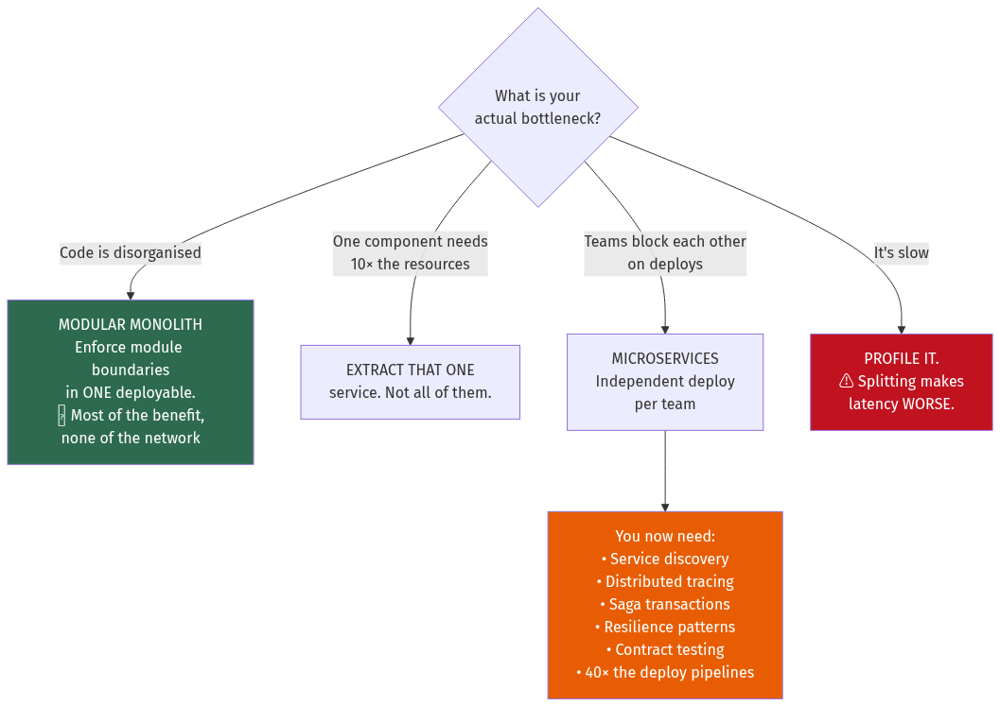
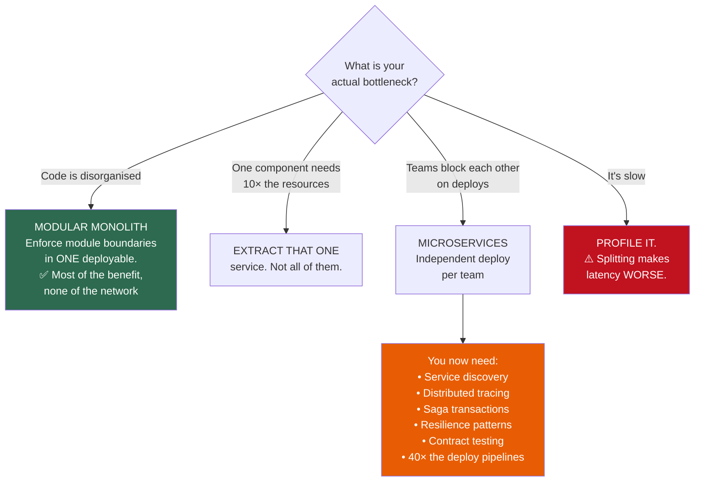
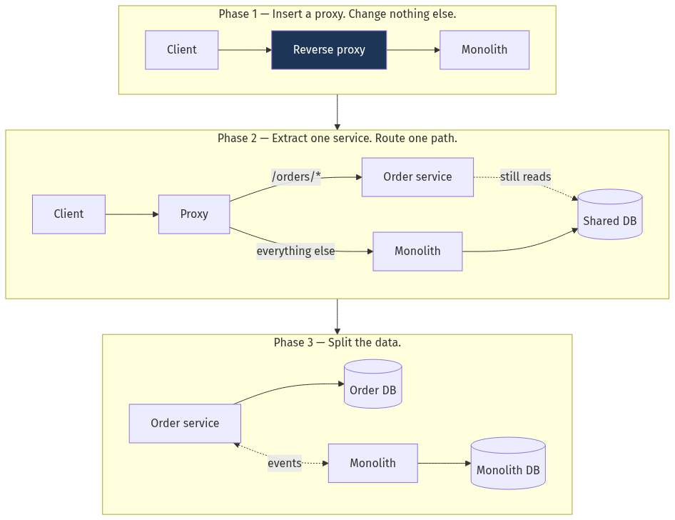
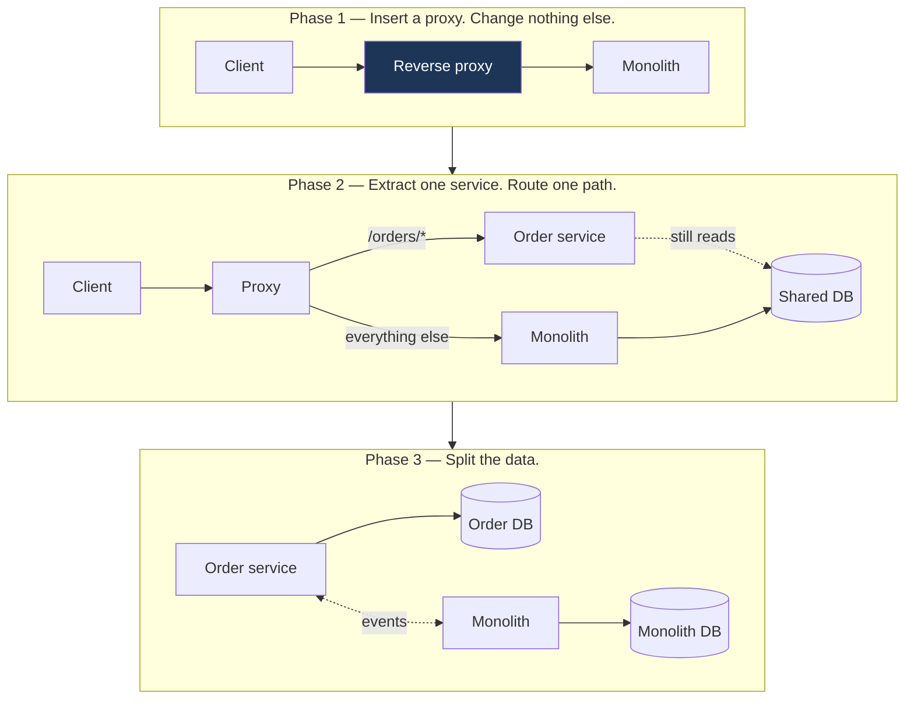
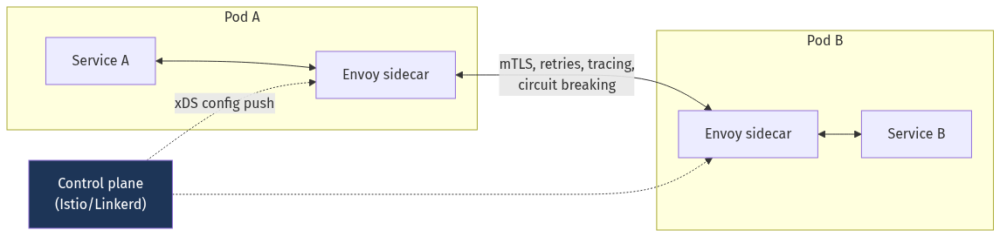
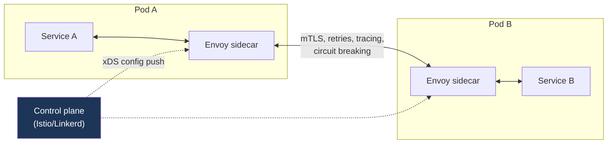
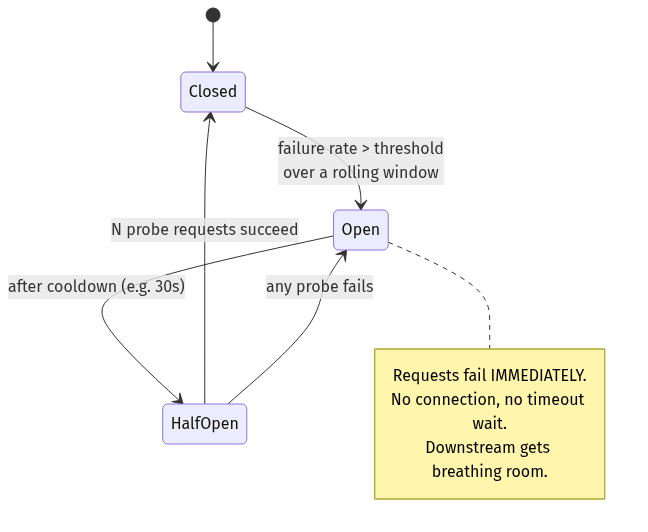
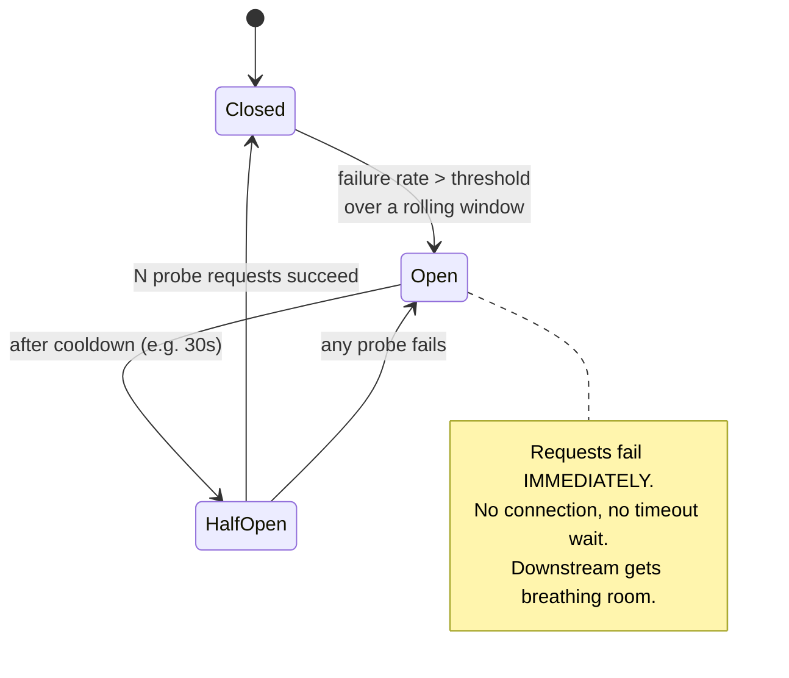
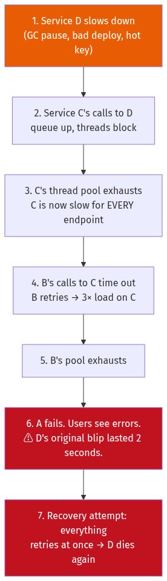
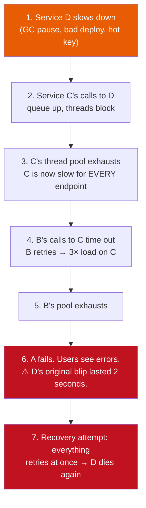

# Chapter 16 — Microservices and Service Architecture

[← Chapter 15](./15_apis_and_protocols.md) · [Contents](./README.md) · [Next: Chapter 17 →](./17_containers_docker_kubernetes.md)

**Prerequisites:** [Chapter 3](./03_reliability_availability_performance.md) §3.3 (availability composition) and §3.12–3.13 (timeouts, retries, degradation), [Chapter 10](./10_distributed_transactions_and_integrity.md) (sagas, outbox).

---

## What you'll learn

- The honest case **against** microservices, with the availability arithmetic that most advocacy skips
- **Domain-Driven Design** — bounded contexts, aggregates, and how to find a service boundary that doesn't move
- The **strangler fig** migration, step by step, and why the reverse proxy comes first
- **Database per service**, and the four ways to answer a query that spans two of them
- **Service mesh** — what a sidecar actually does, the ambient alternative, and the honest cost
- **Nine resilience patterns** with implementations: timeout, retry with jitter, circuit breaker, bulkhead, fallback, hedging, load shedding, rate limiting, graceful degradation
- How **cascading failures** propagate, and the specific mechanisms that stop them
- The **distributed monolith** — how to recognise you've built one

---

## Start from zero

You have one program. Everything lives in it: users, orders, payments, email. One codebase,
one deployment, one database.

This is a **monolith**, and for most companies most of the time it is the correct architecture.
A function call takes a nanosecond. A transaction spans whatever tables it likes. You debug
with a stack trace. There is one thing to deploy, monitor and reason about.

Then the team grows. Now forty engineers share one codebase, and the problems are
**organisational** rather than technical:

- A one-line change to the email template requires deploying the payments code
- Someone's bad query in reporting takes down checkout
- Deploys need coordination across six teams, so they happen weekly instead of hourly
- Merge conflicts everywhere
- The image-resizing endpoint needs 32 GB of RAM, so *every* instance gets 32 GB

**Microservices** split the program along business boundaries. Each service is a separate
program with its own database, deployed independently by one team.

⚠️ **And here is the sentence most microservices advocacy omits.** You have converted **local
function calls into network calls**, and every property you took for granted disappears:

| Monolith | Microservices |
| --- | --- |
| Function call: ~1 ns, cannot fail | Network call: ~1 ms, fails constantly |
| ACID transaction across tables | Saga with compensating actions ([Ch 10](./10_distributed_transactions_and_integrity.md)) |
| Stack trace | Distributed trace across 12 services |
| One thing to deploy | 40 things, with version compatibility |
| `JOIN` | API composition or data duplication |
| Availability = one service's | ⚠️ **Product of every synchronous dependency** |

💡 **Microservices are an organisational solution with a technical cost.** You adopt them when
team coordination is the bottleneck — not when the code is messy, which a modular monolith
fixes far more cheaply.

---

## The mental model



<details>
<summary>Diagram source (Mermaid)</summary>



</details>

---

## Deep dive

### 16.1 📐 The availability argument nobody makes

From [Chapter 3](./03_reliability_availability_performance.md) §3.3: **synchronous dependencies
compose in series, and series multiplies.**

```
A request that synchronously touches 10 services, each 99.9% available:
  0.999¹⁰ = 99.0%
  = 3.65 DAYS of downtime per year — before any bug in your own code.

The monolith it replaced was 99.9%: 8.8 hours per year.
You made availability 10× WORSE by splitting.
```

⚠️ **This is the single strongest technical argument against fine-grained microservices**, and
it's almost never stated in the pro-microservices literature.

**The mitigations are what §16.8 is about:**
```
Circuit breaker + fallback → converts a HARD dependency into a SOFT one
                             → it drops out of the series product entirely
Async messaging            → removes it from the synchronous path
Caching                    → survives the dependency being down
Merging services           → fewer things in series
```

📐 **With three of ten dependencies made soft:**
```
0.999⁷ × 1.0³ = 99.3%  (2.5 days/year — still worse than the monolith)
```
💡 **The lesson: every synchronous dependency you add must be justified.** "Service B needs data
from service A" is not automatically an argument for a synchronous call.

### 16.2 When *not* to split

| Symptom | ❌ Microservices | ✅ Actual fix |
| --- | --- | --- |
| "The code is a mess" | Distributed mess | Refactor into modules |
| "Deploys are risky" | 40 risky deploys | CI/CD, tests, canary ([Ch 20](./20_deployment_multiregion_dr_cost.md)) |
| "It's slow" | ⚠️ Network calls make it slower | Profile; add indexes and caches |
| "We can't scale" | Maybe — measure first | Usually one component needs extraction, not forty |
| "We want to use Go for one part" | Valid, but extract *one* service | Same |
| **"Six teams block each other on every deploy"** | ✅ **Valid reason** | — |
| **"This one component needs 20× the memory"** | ✅ Extract that one | — |
| **"This part is regulated and must be isolated"** | ✅ Valid — PCI, HIPAA scope reduction | — |

💡 **The modular monolith is the under-used middle ground.** Enforce module boundaries *within*
one deployable: separate packages, no cross-module imports except through defined interfaces,
separate database schemas with no cross-schema queries. You get the organisational clarity, and
extraction later becomes mechanical because the seams already exist.

⚠️ **Shopify runs one of the world's largest Rails monoliths** deliberately, having invested in
modularity rather than distribution. **Stack Overflow** serves enormous traffic from nine web
servers. The default should be "don't split", with splitting justified by a specific,
measured, organisational or resource constraint.

### 16.3 Finding the boundary: Domain-Driven Design

The hardest problem in microservices is **where to cut**. Cut wrongly and every feature touches
five services — you've built a distributed monolith with all the costs and none of the benefits.

**Bounded context** — a boundary within which a term has one unambiguous meaning.

```
"Customer" means different things in different contexts:

Sales context:     name, company, lead source, deal stage, contract value
Support context:   name, tickets, satisfaction score, entitlements
Billing context:   name, payment methods, tax ID, credit limit, invoices
Shipping context:  name, addresses, delivery preferences
```

⚠️ **The instinct is to build one canonical Customer service.** That's usually wrong. A single
shared model must satisfy every context, so it grows fields nobody in a given context cares
about, every team must coordinate on changes, and it becomes a coupling point that every
service depends on synchronously.

✅ **Better: each context owns its own model**, linked by a shared **identity** (`customer_id`)
rather than a shared *entity*.

**Aggregates** — a cluster of objects treated as one unit for consistency.

```
Order aggregate:
  Order (the aggregate ROOT)
    ├─ OrderLine
    ├─ OrderLine
    └─ ShippingAddress (a value object copied in, not referenced)

Rules:
  • External code references only the ROOT, by ID
  • Invariants hold within the aggregate ("total = sum of lines")
  • ⚠️ ONE transaction modifies ONE aggregate
  • Across aggregates: eventual consistency via events
```

💡 **The aggregate is the natural transaction boundary — and therefore the natural service
boundary.** If two things must change atomically, they belong in the same aggregate, and
therefore the same service. That is the single most useful heuristic in this chapter: **if you
find yourself needing a distributed transaction, you have probably drawn the boundary in the
wrong place.**

#### Context mapping — the relationships between services

| Pattern | Meaning |
| --- | --- |
| **Shared kernel** | Two contexts share code/model. ⚠️ High coupling — use sparingly |
| **Customer-supplier** | Downstream has influence over upstream's roadmap |
| **Conformist** | Downstream accepts upstream's model as-is |
| **Anti-corruption layer** | ⭐ Downstream translates upstream's model into its own — **essential when integrating a legacy system** |
| **Open host service** | Upstream publishes a well-defined protocol for many consumers |
| **Published language** | A shared schema (protobuf, JSON Schema, Avro) both sides agree on |

💡 **The anti-corruption layer is the pattern that saves migrations.** When wrapping a legacy
system, translate its model at the boundary rather than letting its concepts leak into your new
services. Without it, the legacy data model becomes permanent.

#### Sizing heuristics

```
✅ A service should:
   • Have ONE reason to change (one business capability)
   • Own its data — no other service touches its database
   • Be understandable by one person
   • Be rewritable in a few weeks
   • Be owned by exactly one team

⚠️ Too small — the "nanoservice" smell:
   • It calls three other services to do anything
   • It has no data of its own
   • A typical feature requires changing it plus four others

⚠️ Too large:
   • Multiple teams change it
   • Multiple unrelated reasons to deploy
   • Its database has clearly separable schemas
```

📐 **The test that actually works: how many services must change for a typical feature?**
```
1 service        ✅ boundaries are right
2-3 services     ⚠️ acceptable, watch it
4+ services      ❌ boundaries are wrong — you have a distributed monolith
```

### 16.4 The strangler fig migration

Named after a vine that grows around a tree until the tree dies and the vine stands alone. You
never do a big-bang rewrite.



<details>
<summary>Diagram source (Mermaid)</summary>



</details>

**Why the proxy comes first:** it gives you a **routing seam** with zero risk. Nothing has
changed behaviourally, but you can now redirect any path to a new implementation, at any
percentage, and revert in seconds.

**The order of operations that works:**

```
1. Reverse proxy in front of the monolith. No behaviour change. Verify.
2. Pick the FIRST service carefully:
     ✅ Clear boundary, few dependencies, meaningful but not critical
     ❌ Not the core domain (too risky), not something trivial (proves nothing)
3. Extract the CODE first; keep using the shared database.
4. Route a small percentage of traffic; compare behaviour (shadow reads).
5. Ramp to 100%.
6. THEN split the data (Ch 9 §9.9's dual-write → backfill → verify → cutover).
7. Repeat.
```

⚠️ **Splitting the code and the data at the same time is the classic mistake.** Two large risky
changes at once, with no way to isolate which one broke. Code first — it's reversible with a
routing flag. Data second — it's the hard part and deserves its own migration.

⚠️ **Have an exit criterion.** Many strangler migrations stall halfway, leaving you permanently
operating both a monolith *and* a fleet of services — the worst of both. Decide up front what
"done" means and whether the remaining monolith is acceptable as a permanent service.

### 16.5 Database per service — and the query problem

**The rule: a service owns its database. No other service reads it directly.**

⚠️ **Why the rule is absolute.** A shared database is a shared, implicit, unversioned API. If
service B reads service A's tables, A can never change its schema. You have all the coupling of
a monolith plus all the operational cost of distribution.

**But now: "show me orders with customer names" spans two services.** Four options:

#### 1. API composition

```
Order service:    GET /orders?customer=42     → 20 orders
Customer service: GET /customers/42           → 1 customer
Caller joins in memory.
```
✅ Simple, always current.
⚠️ N+1 across the network if done naively — a list of 100 orders from 100 customers means 101
calls. **Batch the second call** (`GET /customers?ids=1,2,3`). And latency is now the sum, and
availability is the product.

#### 2. CQRS read model

```
Order service ──events──> Kafka ──> Read-model service ──> denormalised view DB
Queries hit the view directly. One service, one query.
```
✅ Fast, no fan-out, survives the source services being down.
⚠️ Eventually consistent, and it's another datastore to operate
([Chapter 12](./12_messaging_and_event_streaming.md) §12.13).

#### 3. Data replication (reference data)

```
Customer service publishes CustomerChanged events.
Order service keeps a LOCAL COPY of the fields it needs (id, name, tier).
```
✅ No runtime dependency at all — the strongest availability property.
⚠️ Duplicated data that must be kept in sync; only viable for slowly-changing reference data
where staleness of seconds is fine.

💡 **This is the most under-used option.** Copying three fields of customer data into the order
service eliminates a synchronous dependency entirely — removing it from the availability
product in §16.1. Purists object to the duplication; the availability arithmetic is on the
pragmatists' side.

#### 4. ⚠️ Redraw the boundary

If two services constantly need each other's data in the same transaction, **they are one
service**. Merging is a legitimate and under-used refactoring.

| Option | Consistency | Availability | Latency | Complexity |
| --- | --- | --- | --- | --- |
| API composition | Strong | ⚠️ Product | ⚠️ Sum | Low |
| CQRS read model | Eventual | ✅ High | ✅ Low | High |
| Data replication | Eventual | ✅ **Highest** | ✅ Lowest | Medium |
| Merge services | Strong | ✅ Highest | ✅ Lowest | ✅ Lowest |

### 16.6 Service discovery and the service mesh

Discovery mechanics are in [Chapter 5](./05_load_balancing_proxies_traffic.md) §5.10. Here we
cover what a **service mesh** adds.

#### The problem a mesh solves

Every service needs the same cross-cutting behaviour: mTLS, retries with backoff, timeouts,
circuit breaking, load balancing, tracing headers, metrics. Implementing that in a library
means:
```
⚠️ One library per language (Go, Java, Python, Node, Rust…)
⚠️ Upgrading the retry policy = redeploying every service
⚠️ Every team implements it slightly differently
```

**The sidecar model** moves it into a proxy deployed alongside each service:



<details>
<summary>Diagram source (Mermaid)</summary>



</details>

Service A makes a plain HTTP call to `localhost`. The sidecar intercepts it (via iptables or
eBPF) and handles everything else. **The application code contains no networking logic at all.**

| Capability | What you get |
| --- | --- |
| **mTLS everywhere** | ⭐ Automatic certificate issuance and rotation — the biggest single win |
| Retries, timeouts, circuit breaking | Configured centrally, changed without redeploying |
| Traffic splitting | Canary by percentage or header ([Ch 20](./20_deployment_multiregion_dr_cost.md)) |
| Observability | Consistent golden-signal metrics and trace propagation for free |
| Authorisation policy | "Only service X may call service Y" |
| Locality-aware routing | Prefer same-AZ backends ([Ch 2](./02_scalability_and_estimation.md) §2.10) |

⚠️ **The honest costs:**

```
Latency:    +0.5-2 ms per hop (two extra proxy traversals)
Memory:     ~50-100 MB per sidecar × every pod
CPU:        ~0.1-0.5 cores per sidecar
Complexity: a distributed control plane that can fail in novel ways
Debugging:  "is it my service, the sidecar, or the control plane?"
```

📐 **The overhead at scale:**
```
500 pods × 80 MB = 40 GB of RAM spent on sidecars
500 pods × 0.2 cores = 100 cores
That is real money for infrastructure that does no business work.
```

💡 **Ambient mesh** (Istio) and **eBPF-based approaches** (Cilium) remove the per-pod sidecar:
a per-node component handles L4 and mTLS, with an optional L7 proxy only where you need
policy or retries. This cuts the overhead substantially and is where the technology is heading.

⚠️ **Don't adopt a mesh for fewer than ~20 services.** Below that, a good HTTP client library
with sensible defaults gives you most of the value at a fraction of the operational cost. The
threshold where a mesh pays for itself is roughly "several languages **and** enough services
that library upgrades are a coordination problem."

### 16.7 Resilience patterns

These are the mechanisms that stop one service's failure becoming everyone's failure.

#### 1. Timeout

Covered in [Chapter 3](./03_reliability_availability_performance.md) §3.12. Set from the
downstream P99.9, decreasing with depth, ideally via a propagated deadline.

⚠️ **A call with no timeout will eventually hang forever and exhaust your worker pool.**

#### 2. Retry with exponential backoff and full jitter

```go
func retry(ctx context.Context, attempts int, fn func() error) error {
    var err error
    for i := 0; i < attempts; i++ {
        if err = fn(); err == nil || !isRetryable(err) {
            return err
        }
        // ⚠️ FULL jitter: random(0, backoff), not backoff + small random.
        // Partial jitter leaves clients partially synchronised.
        backoff := min(time.Duration(1<<i)*100*time.Millisecond, 5*time.Second)
        sleep := time.Duration(rand.Int63n(int64(backoff)))
        select {
        case <-time.After(sleep):
        case <-ctx.Done():
            return ctx.Err()
        }
    }
    return err
}
```

📐 **Retry amplification** ([Chapter 3](./03_reliability_availability_performance.md) §3.12):
3 retries × 4 layers = 81× load. Controls: **full jitter**, a **retry budget** (retries ≤ 10%
of requests), and **retry at exactly one layer**.

⚠️ **Only retry idempotent operations**, or operations protected by an idempotency key.

#### 3. Circuit breaker

Three states. When a dependency is failing, stop calling it — fail fast instead of queueing.



<details>
<summary>Diagram source (Mermaid)</summary>



</details>

```go
type Breaker struct {
    mu           sync.Mutex
    state        State
    failures     int
    successes    int
    openedAt     time.Time
    // ⚠️ Tune these against real traffic, not by guessing.
    threshold    float64       // e.g. 0.5 = 50% failure rate
    minRequests  int           // ⚠️ don't trip on 2 failures out of 2
    cooldown     time.Duration // how long to stay open
    halfOpenMax  int           // probes allowed in half-open
}

func (b *Breaker) Do(fn func() error) error {
    if !b.allow() {
        return ErrCircuitOpen // fail fast — microseconds, not a 30s timeout
    }
    err := fn()
    b.record(err == nil)
    return err
}
```

⚠️ **`minRequests` is the setting people forget.** Without it, two failed requests out of two
is a 100% failure rate and the breaker trips on a service that's perfectly healthy but idle.

📐 **What the breaker actually buys you:**
```
Without: downstream is down. Every request waits the full 5s timeout.
         100 req/s × 5s = 500 concurrent threads blocked → pool exhausted
         → YOUR service is now down too.

With:    breaker opens after ~20 failures. Subsequent requests fail in ~1 µs.
         Threads stay free. Your service degrades but survives.
```

💡 **The breaker's real purpose is protecting the *caller*, not the callee.** It stops your
worker pool being consumed by calls that are going to fail anyway.

#### 4. Bulkhead

Isolate resources per dependency so one slow dependency can't consume everything.

```go
// Separate semaphores per downstream. Payment being slow cannot
// starve the recommendation calls, or vice versa.
var pools = map[string]chan struct{}{
    "payment":         make(chan struct{}, 50),
    "inventory":       make(chan struct{}, 100),
    "recommendations": make(chan struct{}, 20),  // low priority, small pool
}
```
📐 Named after a ship's compartments: a hull breach floods one compartment, not the vessel.
Without bulkheads, a single slow dependency consumes every worker and takes down endpoints that
don't even call it.

#### 5. Fallback

```go
recs, err := recommendationService.Get(ctx, userID)
if err != nil {
    recs = cachedPopularItems() // stale but useful
    metrics.Inc("recommendations_fallback")   // ⚠️ MUST be measured
}
```
💡 **This is what converts a hard dependency into a soft one** — removing it from the
availability product in §16.1. ⚠️ And it must emit a distinct metric, or you'll serve fallbacks
for a week without noticing
([Chapter 3](./03_reliability_availability_performance.md) §3.13).

#### 6. Hedged requests

Send to a second replica if the first hasn't answered by P95; take whichever returns first.
From [Chapter 3](./03_reliability_availability_performance.md) §3.10: ~5% extra load for a
large P99 reduction. ⚠️ Idempotent reads only.

#### 7. Load shedding

Covered in [Chapter 5](./05_load_balancing_proxies_traffic.md) §5.6: bounded concurrency, LIFO
under overload, priority-based shedding, adaptive limits.

#### 8. Rate limiting

Per [Chapter 5](./05_load_balancing_proxies_traffic.md) §5.9 — at the edge, layered, cheap to
reject.

#### 9. Graceful degradation

The dependency classification from
[Chapter 3](./03_reliability_availability_performance.md) §3.13: critical / important /
optional, decided **before** the incident.

#### The combination that actually works

```
Request → [Rate limit] → [Bulkhead] → [Circuit breaker] → [Timeout] → [Retry] → downstream
                                              ↓ open
                                          [Fallback]
```
⚠️ **Order matters.** The bulkhead must be *outside* the breaker, so a saturated pool rejects
before consuming a breaker slot. The retry must be *inside* the timeout budget, or retries
outlive the caller's deadline.

### 16.8 Cascading failure



<details>
<summary>Diagram source (Mermaid)</summary>



</details>

**Where each mechanism breaks the chain:**

| Step | Mechanism that stops it |
| --- | --- |
| 2 → 3 | **Bulkhead** — D's calls use a bounded pool; other endpoints keep working |
| 3 → 4 | **Circuit breaker** — C stops calling D and fails fast |
| 4 → 5 | **Retry budget** — retries capped at 10%, so no 3× amplification |
| 5 → 6 | **Fallback** — B serves degraded results instead of failing |
| 6 → 7 | **Jittered backoff** — recovery is spread, not simultaneous |

⚠️ **Step 7 is the one that turns an incident into an outage.** Everything reconnects and
retries at the same instant, so the recovering service is immediately killed again. Mitigations:
full jitter on all retries, gradual traffic ramp-up after a breaker closes, and **cold-cache
protection** — a recovered service with an empty cache may be unable to serve full load
([Chapter 9](./09_replication_partitioning_consistency.md) §9.2).

### 16.9 The distributed monolith

The worst outcome: all the costs of distribution, none of the benefits.

**Symptoms:**

| Symptom | What it means |
| --- | --- |
| Services must be deployed **together in a specific order** | ❌ No independent deployability — the whole point |
| A typical feature touches 5+ services | ❌ Boundaries follow technical layers, not business capabilities |
| Services share a database | ❌ Implicit unversioned coupling |
| Changing one service's API breaks others immediately | ❌ No versioning or tolerant readers |
| One service down = everything down | ❌ No resilience patterns |
| You need the whole system running locally to develop | ❌ No contract testing or stubbing |

⚠️ **The most common cause is splitting by technical layer instead of business capability:**
```
❌ Layer split:     API service → Business-logic service → Data-access service
   Every feature touches all three. This is a monolith with network calls between its layers.

✅ Capability split: Order service │ Payment service │ Inventory service
   Each owns its API, logic and data. A feature usually touches one.
```

### 16.10 Contract testing

⚠️ **Integration testing every combination of 40 services is combinatorially impossible.**
**Contract testing** verifies each pair independently.

```
Consumer test:  "When I call GET /users/42, I expect a response with
                 fields id and name." → generates a CONTRACT

Provider test:  Replay every consumer's contract against the real provider.
                If any fails, the provider's change is breaking.
```

💡 **The key property: the provider's CI knows, before merge, which consumers it would break.**
Pact and Spring Cloud Contract implement this. It's what makes independent deployment safe
without a full end-to-end environment.

**Combine with:**
- **Schema registries** (protobuf/Avro) with automated compatibility checks
- **Consumer-driven contracts** — consumers declare what they need; providers guarantee it
- **Tolerant readers** ([Chapter 15](./15_apis_and_protocols.md) §15.1) — ignore unknown fields

---

## Worked example — decomposing an e-commerce monolith

*A Rails monolith, 500k lines, 60 engineers across 8 teams. Deploys take 4 hours and happen
twice a week because every deploy needs cross-team coordination. Checkout has been taken down
twice this quarter by unrelated reporting queries. Decompose it.*

**Step 1 — Confirm the reason is organisational, and be honest about it.**

```
✅ 8 teams blocking each other on deploys → the valid reason
✅ Reporting queries taking down checkout → isolation is genuinely needed
❌ "The code is messy" → would be fixed more cheaply by modularisation
❌ "It's slow" → splitting makes latency worse
```
💡 Two of four reasons are valid. That's enough — but I'd say explicitly that if only the
latter two applied, the answer would be a modular monolith.

**Step 2 — Identify bounded contexts, not technical layers.**

```
Identity & Access   — accounts, auth, sessions
Catalogue           — products, categories, pricing
Inventory           — stock levels, reservations
Cart                — session-scoped baskets
Order               — order lifecycle, state machine
Payment             — ⚠️ PCI-scoped; isolation is a compliance win
Fulfilment          — warehouse, shipping
Notification        — email, SMS, push
Search              — indexing and query (Ch 14)
Analytics           — reporting  ⚠️ the thing taking down checkout
```

**Step 3 — Sequence the extractions by risk-adjusted value.**

| Order | Service | Why |
| --- | --- | --- |
| 1 | **Analytics/reporting** | ⭐ Solves the checkout outages immediately; read-only, so failure is low-risk; proves the pattern |
| 2 | **Notification** | Async by nature, no synchronous dependency, easy compensation if wrong |
| 3 | **Search** | Already a separate index; naturally decoupled |
| 4 | **Payment** | High value (PCI scope reduction); risky, so do it after the team is practised |
| 5 | **Catalogue** | Read-heavy, cacheable, many consumers |
| 6 | **Inventory + Order** | ⚠️ Extract **together** — see step 5 |
| — | **Cart** | Leave in the monolith initially — it's session state and touches everything |

💡 **Starting with reporting is deliberate.** It's read-only, it delivers the most visible win
(no more checkout outages), and if the extraction is wrong, nobody's order fails. Starting with
Payment would be the highest-value target and the worst first choice.

**Step 4 — The strangler mechanics.**

```
1. Put Envoy in front of the monolith. No behaviour change. Verify for a week.
2. Build the Analytics service reading a REPLICA of the monolith DB
   → immediately solves the "reporting kills checkout" problem, with no
     data migration at all.
3. Route /admin/reports/* to it at 1% → 10% → 100%, comparing outputs.
4. Only later, feed it via CDC into its own store.
```
⚠️ **Note step 2 solves the actual business problem before any data migration.** Read-replica
isolation is a one-day change; the full extraction is a quarter. Do the cheap fix first.

**Step 5 — Where the boundary is genuinely hard: Order and Inventory.**

```
The invariant: "never sell stock you don't have."
Reserving stock and creating an order must be atomic — or you oversell.
```
Three options:
```
(a) Distributed transaction (2PC)
    ❌ Blocking, and payment involves an external provider that can't participate.

(b) Saga with compensations (Ch 10)
    ✅ Works. Reserve → charge → confirm, with compensations in reverse.
    ⚠️ No isolation: reserved-but-unpaid stock is visible to everyone,
       so reservations act as semantic locks and MUST have a TTL.

(c) ⭐ Merge them into one "Ordering" service
    ✅ The invariant becomes a local ACID transaction. No saga at all.
    ⚠️ A larger service, owned by one team.
```

💡 **Choose (c) initially.** Per §16.3, **if two things must change atomically, they belong in
one service.** The need for a distributed transaction is evidence that the boundary is wrong.
Split later only if inventory develops genuinely independent scaling needs — and then accept
the saga knowingly.

🎯 This is the strongest thing to say in an interview about decomposition: **the requirement for
a distributed transaction is a boundary smell, not a technical problem to solve.**

**Step 6 — Data ownership and cross-service queries.**

```
"Order history with product names and images"

Options:
  API composition:   order-service → catalogue-service per order  ⚠️ N+1
  Batched:           GET /products?ids=1,2,3                       ✅ 2 calls
  Replicated:        order-service stores product name + image URL
                     AT ORDER TIME                                 ✅✅ BEST
```
💡 **Replication wins here for a domain reason, not just an availability one:** the product
name **at the time of the order** is a different fact from the name now. Copying it isn't
denormalisation — it's correct modelling ([Chapter 7](./07_relational_databases_and_transactions.md)
§7.2). And it eliminates a synchronous dependency entirely.

**Step 7 — Communication style per interaction.**

| Interaction | Style | Reason |
| --- | --- | --- |
| Checkout → Payment | **Sync gRPC** | The user is waiting for a yes/no |
| Order created → Notification | **Async event** | Nobody waits for an email |
| Order created → Analytics | **Async event** | Never on the critical path |
| Order → Catalogue (product data) | **Replicated locally** | No runtime dependency at all |
| Cart → Inventory (availability) | **Sync, cached 5s, with fallback** | Show "may be low stock" if unavailable |

📐 **The availability arithmetic that justifies this:**
```
All synchronous (7 services @ 99.9%):    0.999⁷ = 99.30%  → 61 hours/year
Only Payment synchronous, rest async/replicated/soft:
                                          0.999¹ = 99.90%  → 8.8 hours/year
A 7× improvement from communication style alone — no extra redundancy.
```

**Step 8 — Resilience configuration.**

```yaml
# Envoy, per upstream cluster
payment-service:
  timeout: 3s                    # P99.9 is 800ms; generous but bounded
  retry: { attempts: 2, on: "connect-failure,unavailable", budget: 20% }
  circuit_breaker: { max_pending_requests: 100, max_requests: 1000 }
  outlier_detection: { consecutive_5xx: 5, max_ejection_percent: 50 }

recommendation-service:
  timeout: 200ms                 # OPTIONAL dependency — fail fast
  retry: { attempts: 0 }         # ⚠️ don't retry something we can live without
  fallback: cached_popular_items
```
💡 **Note the asymmetry.** Payment gets a generous timeout and retries because it's critical.
Recommendations get 200 ms and zero retries because a fallback exists — spending 3 seconds
retrying an optional dependency is pure latency cost.

**Step 9 — What we deliberately did *not* split.**

| Kept together | Why |
| --- | --- |
| Order + Inventory | Shared invariant — a distributed transaction would be required |
| Cart in the monolith | Session state touching everything; low value to extract |
| Identity | Every service depends on it — extract it and it becomes a hard dependency for all. Better: **stateless JWT validation** locally, so no runtime call |

💡 **Identity is the classic trap.** Extracting auth into a service that every request must call
synchronously creates a single point of failure with a 100% blast radius. Issue signed tokens
and validate them locally instead — no network call, no dependency
([Chapter 18](./18_security_and_identity.md)).

**Step 10 — The outcome.**

| Metric | Before | After |
| --- | --- | --- |
| Deploy frequency | 2/week, coordinated | Per team, per day |
| Deploy duration | 4 hours | 12 minutes |
| Checkout outages from reporting | 2/quarter | 0 |
| Services | 1 | **7** (not 40) |
| Synchronous dependencies in checkout | — | 1 (Payment) |
| Availability | 99.9% | 99.9% (unchanged — protected deliberately) |

⚠️ **Seven services, not forty.** The temptation is to keep splitting. Every additional
synchronous dependency multiplies into your availability, and every split adds a deploy
pipeline, a runbook and an on-call surface. Stop when the organisational bottleneck is gone.

---

## Trade-offs

| Decision | Option A | Option B | Choose A when | Never choose A when |
| --- | --- | --- | --- | --- |
| Architecture | Monolith | Microservices | Small team; unclear domain; startup | Teams genuinely block each other on deploys |
| Architecture | **Modular monolith** | Microservices | Code organisation is the problem | Independent deployment is the requirement |
| Boundary | By technical layer | **By business capability** | ⚠️ Never | Always B — layers give you a distributed monolith |
| Two entities sharing an invariant | Saga across services | **One service** | The saga is genuinely justified | Prefer B — needing a distributed transaction is a boundary smell |
| Cross-service data | API composition | Replicate reference data | Data changes constantly | Slowly-changing — B removes the dependency entirely |
| Data access | Shared database | Database per service | ⚠️ Never | Always B — shared DB is unversioned coupling |
| Cross-cutting concerns | Client libraries | Service mesh | < 20 services, 1–2 languages | Many languages + upgrade coordination pain |
| Mesh model | Sidecar per pod | Ambient / eBPF | Need per-workload L7 policy | Overhead matters — B is much cheaper |
| Auth | Central auth service call | **Local token validation** | Never | Always B — A is a 100%-blast-radius dependency |
| Communication | Synchronous | Asynchronous | The caller genuinely needs the answer now | Fire-and-forget — sync couples availability |
| Migration | Big-bang rewrite | **Strangler fig** | ⚠️ Never | Always B |
| Migration order | Code and data together | **Code first, data second** | Never | Always B — two risky changes at once is unisolatable |
| Testing | Full end-to-end | Contract testing | Small number of services | 40 services — E2E is combinatorially impossible |

---

## How real companies do it

**Amazon's "two-pizza teams"** and the 2002 mandate that all teams expose functionality only
through service interfaces is the origin story. The mandate was **organisational**, and the
architecture followed — which is the correct causal direction. Conway's Law made explicit.

**Netflix** built most of the resilience vocabulary: Hystrix (circuit breakers and bulkheads),
Ribbon (client-side load balancing), Zuul (gateway), and Chaos Monkey. Notably, **Hystrix is
now in maintenance mode** — Netflix moved to adaptive concurrency limits and service-mesh-level
controls, on the reasoning that statically-configured thresholds are always wrong as hardware
and code change.

**Uber's 2020 "Domain-Oriented Microservice Architecture"** post is the most valuable public
document on *over*-decomposition. Having reached thousands of microservices, they found the
coordination cost had exceeded the benefit and consolidated into larger **domains** with
well-defined interfaces. The lesson: microservices have an optimal granularity, and it's
coarser than the enthusiasm suggests.

**Shopify** deliberately runs one of the world's largest Rails monoliths, investing in
**modularity** (enforced component boundaries, no cross-component database access) rather than
distribution. Their published position is that the modular monolith gave them most of the
organisational benefit without the distributed-systems cost — and that the boundaries they
enforced would make extraction straightforward if they ever needed it.

**Segment** publicly reversed course, moving **from microservices back to a monolith** in 2018.
Their reasoning: with 140+ services and a small team, the operational burden — dependency
management, deploy pipelines, on-call surface — dwarfed the benefit. It is one of the few
honest public accounts of a reversal and worth reading precisely because it's unfashionable.

---

## Common mistakes

**Splitting by technical layer.** API / logic / data services means every feature touches all
three. That's a monolith with added latency.

**Splitting because the code is messy.** A distributed mess is harder to fix than a local one.
Modularise first.

**Ignoring the availability arithmetic.** Ten synchronous dependencies at 99.9% caps you at
99.0% — worse than the monolith.

**Sharing a database between services.** An implicit, unversioned API. All the coupling of a
monolith, all the cost of distribution.

**Building a saga where you should merge two services.** Needing a distributed transaction is
evidence the boundary is wrong.

**Extracting auth into a synchronously-called service.** A single point of failure with a 100%
blast radius. Validate signed tokens locally.

**Splitting code and data simultaneously.** Two large risky changes with no way to isolate the
failure.

**No exit criterion for a strangler migration.** You end up permanently running a monolith *and*
a service fleet.

**Retrying without a budget or jitter.** 3 retries × 4 layers = 81× amplification, arriving
simultaneously.

**Circuit breaker without `minRequests`.** Trips on two failures out of two on an idle service.

**Fallbacks with no metric.** You serve degraded results for a week and nobody notices.

**Bulkhead inside the circuit breaker.** Wrong order — a saturated pool should reject before
consuming a breaker slot.

**Adopting a service mesh for six services.** ~80 MB and 0.2 cores per pod plus a distributed
control plane, to replace what a decent HTTP client library provides.

**Requiring the whole system to run locally.** A sign of missing contract tests and stubs.

**Continuing to split after the bottleneck is gone.** Every service is a deploy pipeline, a
runbook, an on-call surface and another term in the availability product.

---

## Interview angle

**Q: When would you use microservices?**

*Weak:* "When you need to scale."

*Strong:* "When **team coordination is the bottleneck** — that's the honest reason, and it's
organisational rather than technical. If six teams block each other on every deploy, or one
component genuinely needs twenty times the resources of the rest, or something must be isolated
for compliance like PCI scope, those justify it. What doesn't justify it: 'the code is messy',
which a modular monolith fixes far more cheaply, or 'it's slow', because turning function calls
into network calls makes latency worse. And I'd state the cost explicitly, because advocacy
usually skips it: **synchronous dependencies compose in series**. Ten services at 99.9% each
gives you 99.0% — three and a half days of downtime a year, worse than the monolith you
replaced. So every synchronous dependency has to be justified, and the mitigations — circuit
breakers with fallbacks, async messaging, replicating reference data — are what convert hard
dependencies into soft ones so they drop out of that product."

**Q: How do you decide service boundaries?**

*Strong:* "**Bounded contexts** from domain-driven design — a boundary within which a term has
one unambiguous meaning. 'Customer' means something different in sales, support and billing, and
the instinct to build one canonical Customer service is usually wrong: it has to satisfy every
context, so it accumulates fields nobody needs and becomes a coupling point everything depends
on. Better for each context to own its own model, linked by a shared **identity** rather than a
shared entity. The sharpest practical heuristic is the **aggregate**: a cluster of objects that
must change atomically. One transaction modifies one aggregate, so the aggregate is the natural
transaction boundary and therefore the natural service boundary. Which gives you the test I'd
actually apply — **if you find yourself needing a distributed transaction, the boundary is
probably wrong**. Needing a saga between order and inventory is evidence they should be one
service, not a problem to engineer around. And the empirical check: count how many services a
typical feature touches. One is right, two or three is acceptable, four or more means you've
split by technical layer instead of business capability."

**Q: How do you migrate a monolith to microservices?**

*Strong:* "**Strangler fig**, never a big-bang rewrite. First step is a **reverse proxy in
front of the monolith with no behaviour change at all** — that gives you a routing seam with
zero risk, so you can redirect any path to a new implementation at any percentage and revert in
seconds. Then pick the first service carefully: clear boundary, few dependencies, meaningful but
not critical. I'd typically start with something read-only like reporting, because it delivers a
visible win and if it's wrong nobody's order fails. The critical sequencing point is **extract
the code first and keep the shared database**, then split the data separately. Doing both at once
is two large risky changes with no way to isolate which broke. The data split is then its own
migration — dual-write, backfill, shadow-read verification, percentage cutover. And I'd insist
on an **exit criterion up front**, because a lot of these stall halfway and you end up
permanently operating both a monolith and a service fleet, which is the worst of both."

**Q: How do you stop one slow service taking down everything?**

*Strong:* "It's a chain, and you break it at several points. The chain is: service D slows
down, C's calls to it queue, C's thread pool exhausts so **C is now slow for every endpoint
including ones that never touch D**, B times out and retries which triples the load, B exhausts,
and the user sees errors — from a two-second blip. Five mechanisms. **Bulkheads** give each
dependency a bounded pool, so D's problems can't consume all of C's workers. **Circuit
breakers** stop calling D after a failure threshold and fail fast in microseconds rather than
waiting a five-second timeout — and the important framing is that a breaker protects the
*caller*, not the callee. **Retry budgets** cap retries at around 10% of requests so you can't
get the 3-times-4-layers-equals-81× amplification. **Fallbacks** let B serve degraded results
rather than failing. And **full jitter on backoff**, which matters most during recovery — the
step people miss is that when the service comes back, everything reconnects and retries at the
same instant and kills it again. Order matters too: the bulkhead goes outside the breaker, so a
saturated pool rejects before consuming a breaker slot."

**Q: Two services need each other's data for a query. What do you do?**

*Strong:* "Four options, and I'd genuinely consider all of them. **API composition** — call
both and join in memory. Simple and always current, but you get an N+1 across the network
unless you batch, and latency becomes the sum while availability becomes the product. **CQRS
read model** — build a denormalised view fed by events, so the query hits one place. Fast and
resilient, but eventually consistent and it's another datastore. **Replicate the reference
data** — the order service keeps a local copy of the three customer fields it needs, updated by
events. That's the most under-used option and often the best, because it removes the runtime
dependency *entirely*, which takes it out of the availability product. Purists object to the
duplication, but the arithmetic favours it. And often the right answer is the fourth: **merge
the services**. If two services constantly need each other's data in the same transaction,
they're one service. I'd also point out that for something like a product name on a historical
order, copying it isn't even denormalisation — the name at order time is a genuinely different
fact from the name now."

**Q: Do you need a service mesh?**

*Strong:* "Probably not below about twenty services. What it gives you is real: **automatic
mTLS with certificate rotation** is the biggest single win, plus retries, timeouts, circuit
breaking, traffic splitting and consistent golden-signal metrics — all configured centrally and
changeable without redeploying anything. The alternative is a client library per language,
which means upgrading the retry policy requires redeploying every service and every team
implements it slightly differently. But the cost is genuine: half a millisecond to two
milliseconds per hop, 50 to 100 megabytes of memory and a fraction of a core per pod, so five
hundred pods is forty gigabytes and a hundred cores spent on infrastructure that does no
business work — plus a distributed control plane with novel failure modes and the 'is it my
service, the sidecar, or the control plane' debugging problem. So the threshold is roughly
'several languages **and** enough services that library upgrades are a coordination problem'.
And I'd look at **ambient mesh or eBPF-based approaches**, which move L4 and mTLS to a per-node
component and only inject an L7 proxy where you need policy — that cuts the overhead
substantially and is where the technology is going."

**Q: What's a distributed monolith and how do you recognise one?**

*Strong:* "All the costs of distribution with none of the benefits. The clearest symptom is
that **services must be deployed together in a specific order** — which means you've lost
independent deployability, the entire point of splitting. Others: a typical feature touches
five or more services; services share a database, which is an implicit unversioned API;
changing one service's API immediately breaks others because there's no versioning or tolerant
readers; one service being down takes everything down because there are no resilience patterns;
and you need the whole system running locally to develop anything, which means there's no
contract testing. The most common cause is **splitting by technical layer rather than business
capability** — an API service calling a business-logic service calling a data-access service.
Every feature touches all three, so you've built a monolith and put a network between its
layers. The fix is to re-cut along capabilities, and often to merge services back together —
which is a legitimate and under-used refactoring. Uber publicly did exactly that, consolidating
thousands of microservices into coarser domains after finding the coordination cost had exceeded
the benefit."

---

## Recap

- **Microservices solve an organisational problem at a technical cost.** Adopt them when team
  coordination is the bottleneck, not when the code is messy.
- 📐 **Synchronous dependencies multiply**: ten at 99.9% gives 99.0% — worse than the monolith.
  Every synchronous dependency must be justified.
- **The modular monolith is the under-used middle ground** — module boundaries without network
  boundaries.
- **Bounded contexts, not technical layers.** Each context owns its own model, linked by shared
  **identity**, not shared entities.
- ⭐ **The aggregate is the transaction boundary and therefore the service boundary. Needing a
  distributed transaction means the boundary is wrong.**
- **Test: how many services does a typical feature touch?** 1 ✅, 2–3 ⚠️, 4+ ❌.
- **Strangler fig, always.** Reverse proxy first, then **code before data** — never both at once.
  Define an exit criterion.
- **Database per service is absolute.** Cross-service queries: API composition, CQRS read model,
  **replicate reference data** (best — removes the dependency), or **merge the services**.
- **Service mesh gives you automatic mTLS and centrally-managed resilience** at ~80 MB and
  0.2 cores per pod. ⚠️ Not worth it below ~20 services.
- **Nine resilience patterns**, and order matters: rate limit → bulkhead → circuit breaker →
  timeout → retry → fallback.
- ⚠️ **Cascading failure is broken at five points**, and the one people miss is **jittered
  recovery** — everything retrying at once kills the service again.
- **Contract testing replaces combinatorial end-to-end testing** and is what makes independent
  deployment safe.
- **Stop splitting when the bottleneck is gone.** Uber and Segment both consolidated back.

---

## Test yourself

1. Your request path synchronously touches 6 services, each 99.95% available. What is the
   end-to-end availability, and how much downtime per year?
2. Two services need to update data atomically. Name three options and say which you'd choose
   first and why.
3. A feature request requires changes to 6 of your 12 services. What does this tell you?
4. Your circuit breaker has `threshold: 50%` and no minimum request count. Describe the failure
   at 3 a.m. on a low-traffic service.
5. Service C calls D. D has a 2-second GC pause. Ten minutes later your entire platform is down.
   Trace the mechanism and name the four controls that would have stopped it.
6. You extract an auth service that every request calls synchronously to validate a session.
   What have you built, and what should you have done?
7. Your order service needs product names for the order-history page. Compare API composition
   against local replication on availability, latency and correctness.
8. Which is worse: 3 services at 99.9% in series, or 1 service at 99.5%? Show the arithmetic.
9. You have 8 services, 2 languages, and a small platform team. Should you deploy Istio?
10. Your migration has been running 18 months. Half the functionality is in services, half in
    the monolith, and both are actively developed. What went wrong?

<details>
<summary>Answers</summary>

1. 0.9995⁶ = **0.99700 = 99.70%**. Downtime = 0.003 × 8,760 = **26.3 hours/year**.
   Note that every individual service is better than 99.9% (8.8 hours) yet the composite is
   three times worse. That's the series-multiplication effect, and it's why the number of
   synchronous hops is an architectural decision rather than an implementation detail. To get
   back to 99.9% end-to-end you'd need each service at roughly 99.983% — or, far more
   practically, to remove hops from the synchronous path.

2. (a) **Two-phase commit** — blocking, availability is the product of participants, and
   impossible if any participant is an external API. (b) **Saga with compensating actions** —
   works, and is the standard answer, but you lose isolation so intermediate states are visible
   and you need semantic locks with TTLs. (c) **Merge the two services** so the update becomes
   one local ACID transaction.
   **I'd choose (c) first.** The requirement for a distributed transaction is a **boundary
   smell** — it's strong evidence that the two things belong to the same aggregate and therefore
   the same service. Only if there's a compelling independent reason to keep them separate
   (radically different scaling profiles, separate compliance scope, different teams with
   genuinely independent roadmaps) would I accept the saga, and I'd do so knowingly rather than
   by default.

3. **The boundaries are wrong.** Almost certainly split by **technical layer** rather than
   business capability — an API tier calling a logic tier calling a data tier means every
   feature necessarily touches all of them. The symptom set is a **distributed monolith**: you
   have the deployment coordination cost of a monolith plus network latency, partial failure and
   distributed debugging. The fix is to re-cut along business capabilities so a feature lives
   inside one service, which usually means **merging** several existing services — a legitimate
   refactoring that teams resist because it feels like going backwards.

4. At 3 a.m. traffic is low — say two requests per minute. If both fail (a transient network
   blip, a single slow query), the observed failure rate is **100%**, which exceeds the 50%
   threshold, and the breaker **opens**. Now every subsequent request fails immediately for the
   full cooldown period, even though the service is perfectly healthy. Worse, in half-open the
   single probe may hit the same transient condition and re-open it, so the service is
   effectively unavailable for an extended window caused entirely by the breaker.
   **Fix:** a `minRequests` (or `minimumNumberOfCalls`) threshold — typically 20 — so the
   breaker only evaluates the failure rate once it has a statistically meaningful sample. Use a
   rolling time window as well, and consider a lower threshold with a larger sample rather than
   a high threshold with a small one.

5. **The mechanism:** D pauses for 2 s → C's in-flight calls to D block, holding threads → C's
   pool exhausts, so **C is now slow for every endpoint, including ones that never call D** →
   B's calls to C exceed their timeout → B **retries**, tripling the load on an
   already-struggling C → B's pool exhausts → A fails → users see errors. Then, when D recovers,
   everything reconnects and retries simultaneously and kills it again.
   **Four controls:** **Bulkhead** — D's calls use a bounded, separate pool, so C's other
   endpoints keep working. **Circuit breaker** — after N failures C stops calling D and fails in
   microseconds instead of waiting the full timeout, keeping threads free. **Retry budget** —
   caps retries at ~10% of requests so B can't amplify load 3×. **Full jitter on backoff** plus
   gradual ramp-up after the breaker closes, so recovery isn't a synchronised stampede. A fifth
   worth naming: a **fallback** at B so users get degraded results rather than errors.

6. You've built a **single point of failure with 100% blast radius**. Every request in the
   entire platform now depends synchronously on one service, so its availability multiplies into
   everything — and if it's down, *nothing* works, including endpoints that have nothing to do
   with the user's identity. You've also added a network round trip to every request and made
   the auth service a scaling bottleneck for the whole system.
   **What you should have done:** issue **signed tokens** (JWT or similar) at login, and have
   each service **validate them locally** using the public key — no network call, no runtime
   dependency. The auth service is then only on the login path, which is a tiny fraction of
   traffic. The trade-off is revocation: tokens are valid until they expire, so you keep
   lifetimes short (5–15 minutes) with refresh tokens, and maintain a small revocation list for
   the exceptional cases ([Chapter 18](./18_security_and_identity.md)).

7. **API composition:**
   - *Availability:* order-service × catalogue-service. At 99.9% each, 99.8% — the page fails if
     catalogue is down.
   - *Latency:* sum of both calls, plus an N+1 unless you batch the product lookups.
   - *Correctness:* ⚠️ returns the product's **current** name, which for a historical order is
     arguably **wrong** — a product renamed or recategorised makes an old order display something
     the customer never bought.

   **Local replication (copy the name at order time):**
   - *Availability:* 99.9% — order-service alone. Catalogue can be down entirely and order
     history still renders.
   - *Latency:* one query, no fan-out.
   - *Correctness:* ✅ **more** correct — it shows what the customer actually ordered.

   Replication wins on all three, and the correctness argument is the decisive one: this isn't
   denormalisation, it's recognising that "product name at time of order" is a genuinely
   different fact from "product name now". The cost is a small amount of duplicated data updated
   by events, which is exactly what you want for a slowly-changing reference attribute.

8. **3 services at 99.9% in series:** 0.999³ = 0.99700 = **99.70%** → 26.3 hours/year.
   **1 service at 99.5%:** **99.50%** → 43.8 hours/year.
   So the single 99.5% service is **worse** — 43.8 hours versus 26.3. But the interesting point
   is how close they are: three "three nines" services chained together land only about half a
   nine better than one distinctly mediocre service. It illustrates that composition erodes
   availability fast, and that a small number of hops each at a high individual availability can
   still produce a disappointing end-to-end figure.

9. **No.** Eight services and two languages is well below the threshold where a mesh pays for
   itself. The costs are concrete: 50–100 MB of memory and roughly 0.2 cores per pod for
   sidecars, half a millisecond to two milliseconds of added latency per hop, plus a distributed
   control plane that a small platform team must now learn, operate, upgrade and debug — and the
   "is it my service, the sidecar, or the control plane?" question during every incident.
   With two languages, a shared HTTP client library with sensible defaults — timeouts, retries
   with jitter, circuit breaking, trace propagation — gives you most of the value at a fraction
   of the cost. The one thing genuinely harder without a mesh is **automatic mTLS with
   certificate rotation**, so if zero-trust networking is a hard requirement I'd look at a
   lighter option like Linkerd, or an ambient/eBPF approach, rather than full Istio. I'd revisit
   the decision at around twenty services or a third language.

10. **No exit criterion, and probably no forcing function.** A strangler migration is only
    finished when the monolith is either gone or explicitly accepted as a permanent service; if
    neither was defined, the migration has no completion condition and drifts.
    The compounding problem is that **both are actively developed** — every new feature has to
    decide which side it lives on, teams maintain two sets of patterns, tooling and runbooks,
    and cross-boundary features are the most expensive kind. You're paying the operational cost
    of distribution *and* the coordination cost of the monolith simultaneously.
    **What should have happened:** an explicit target ("these six capabilities become services;
    the remaining monolith becomes the 'legacy-orders' service permanently"), a **freeze on new
    development in the monolith** so all new work lands on the target side, and a deadline with
    a named owner. **What to do now:** stop extracting, decide whether to finish or to stop and
    formalise the monolith as a first-class service, and pick one — the worst outcome is
    continuing to drift.

</details>

---

## Further reading

- Sam Newman, *Building Microservices* (2nd ed.) and *Monolith to Microservices* — the latter is specifically about migration
- Eric Evans, *Domain-Driven Design*, and Vaughn Vernon, *Implementing Domain-Driven Design*
- Chris Richardson, microservices.io — the canonical pattern catalogue
- Michael Nygard, *Release It!* — the origin of circuit breaker, bulkhead and most stability patterns
- Uber Engineering, *Introducing Domain-Oriented Microservice Architecture* (2020) — on over-decomposition
- Segment, *Goodbye Microservices: From 100s of problem children to 1 superstar* (2018)
- Shopify Engineering, *Deconstructing the Monolith* — the modular monolith case
- Amazon Builders' Library — *Timeouts, retries and backoff with jitter*, and *Avoiding fallback in distributed systems*

---

[← Chapter 15](./15_apis_and_protocols.md) · [Contents](./README.md) · [Next: Chapter 17 — Containers, Docker and Kubernetes →](./17_containers_docker_kubernetes.md)
