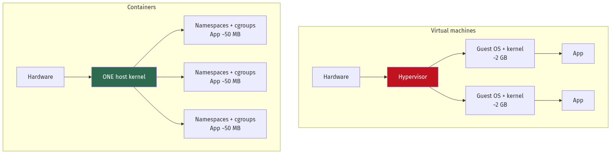
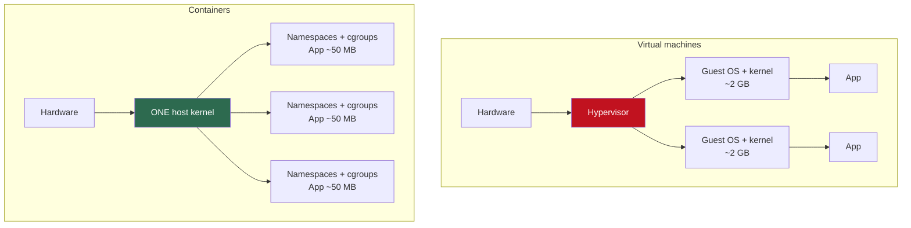
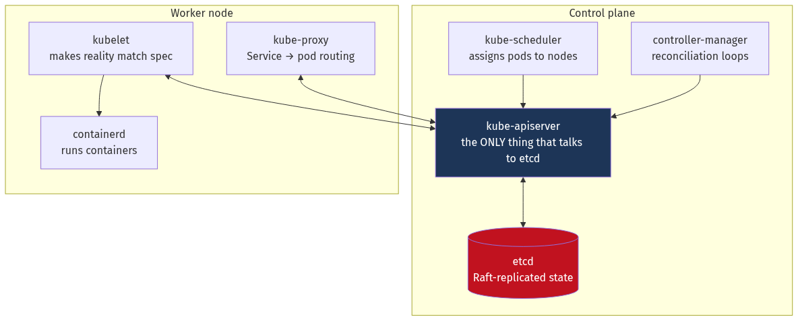
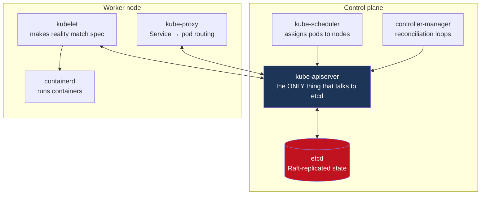

# Chapter 17 — Containers, Docker and Kubernetes

[← Chapter 16](./16_microservices_and_service_architecture.md) · [Contents](./README.md) · [Next: Chapter 18 →](./18_security_and_identity.md)

**Prerequisites:** [Chapter 1](./01_from_zero_computers_networks_web.md) (processes, filesystems), [Chapter 5](./05_load_balancing_proxies_traffic.md) §5.4 (health checks, draining), [Chapter 16](./16_microservices_and_service_architecture.md).

---

## What you'll learn

- What a container **actually is** — namespaces, cgroups, capabilities and overlay filesystems — built up from Linux primitives rather than treated as magic
- Why **layer order** determines your build time, and the image-size arithmetic behind multi-stage builds
- ⚠️ The **PID 1 signal problem** that makes containers ignore `SIGTERM`
- Kubernetes' **reconciliation loop**, and why "declarative" is the whole architecture rather than a syntax preference
- Every object you'll actually use, including **StatefulSets**, **PodDisruptionBudgets** and the ones people skip
- **QoS classes**, why CPU limits cause throttling at 30% utilisation, and why memory limits are different from CPU limits
- **Probes done correctly** — and the liveness probe misconfiguration that restarts your entire fleet
- The **full packet path** from client to container, through Ingress, Service, kube-proxy and CNI
- A **debugging playbook** for the failures you'll actually hit

---

## Start from zero

You have a program that runs on your laptop. It needs Python 3.11, a specific library version,
and an environment variable. You send it to a colleague. It doesn't work — they have Python
3.9.

The obvious fix is to ship the whole computer. That's a **virtual machine**: a complete
simulated machine with its own kernel, its own operating system, its own everything. It works,
and it costs gigabytes and takes a minute to boot.

But notice what's actually different between your laptop and your colleague's. Not the kernel —
you're both running Linux. What differs is the *stuff around* the program: which files it sees,
which processes it can see, which network it's on, how much memory it may use.

**A container is a normal process that has been given a restricted view of the machine.**

There is no "container" object in Linux. There is a process, and the kernel has been told:
- "Show this process only these files" — **mount namespace**
- "Show it only its own processes" — **PID namespace**
- "Give it its own network stack" — **network namespace**
- "Limit it to 2 GB of RAM and 1 CPU" — **cgroups**
- "Don't let it load kernel modules" — **capabilities**

That's it. A container is a process wearing blinkers.

📐 **Which explains the numbers.** A VM boots an entire operating system: gigabytes, and tens of
seconds. A container starts a process: megabytes, and milliseconds. The container is not a
lightweight VM — it's not a VM at all.

⚠️ **And it explains the security caveat.** Containers share the host kernel. A kernel
vulnerability is a container escape. VMs have a hypervisor boundary; containers have a syscall
boundary, which is much larger and more attackable.

---

## The mental model



<details>
<summary>Diagram source (Mermaid)</summary>



</details>

💡 **The single sentence to remember: a VM virtualises hardware; a container isolates a
process.** Everything else — startup time, image size, density, and the security trade-off —
follows from that.

---

## Deep dive

### 17.1 The Linux primitives

#### Namespaces — what the process can *see*

| Namespace | Isolates | Consequence |
| --- | --- | --- |
| **PID** | Process IDs | The container's first process is PID 1 and can't see host processes |
| **Mount (mnt)** | Filesystem tree | Its own `/`, its own `/etc/hosts` |
| **Network (net)** | Interfaces, routes, ports | Its own `eth0`, its own port space — two containers can both bind :8080 |
| **UTS** | Hostname, domain | Its own hostname |
| **IPC** | Shared memory, semaphores | Can't touch another container's shared memory |
| **User** | UID/GID mapping | ⭐ Root **inside** maps to an unprivileged UID **outside** |
| **Cgroup** | The cgroup hierarchy view | Can't see the host's cgroup tree |
| **Time** (5.6+) | System clock offset | Rarely used |

You can create these directly — no Docker involved:
```bash
sudo unshare --pid --mount --net --uts --ipc --fork --mount-proc /bin/bash
# You are now in a new PID/mount/network namespace.
ps aux          # shows only bash — PID 1
hostname foo    # doesn't affect the host
```
💡 **This is genuinely all a container is.** Docker automates the setup and adds an image
format; the isolation is entirely the kernel's.

⚠️ **User namespaces are the most important and least used.** Without them, root in a container
is UID 0 on the host — so a container escape gives immediate host root. With them, container
root maps to an unprivileged host UID and an escape lands you as nobody. Kubernetes support
(`hostUsers: false`) reached beta in 1.30.

#### cgroups — what the process may *consume*

**cgroups v2** (unified hierarchy, the default on modern distributions):

```bash
/sys/fs/cgroup/mygroup/
  memory.max        # hard limit — exceed it and you're OOM-killed
  memory.high       # soft limit — the kernel throttles reclaim above this
  cpu.max           # "200000 100000" = 2 CPUs (quota/period in µs)
  cpu.weight        # relative share under contention
  io.max            # device IOPS and bandwidth limits
  pids.max          # ⚠️ prevents fork bombs
```

📐 **How `cpu.max` actually works, because this trips people constantly:**
```
cpu.max = "50000 100000"
→ 50 ms of CPU time per 100 ms period → 0.5 CPU

⚠️ It is NOT "run at half speed". It is "run at FULL speed for 50 ms,
then be COMPLETELY FROZEN for the remaining 50 ms."
```
This distinction is the source of the CPU-throttling problem in §17.8.

#### Capabilities, seccomp, and the rest

Traditional Unix has two privilege levels: root and not-root. **Capabilities** split root's
powers into ~40 separate bits.

```
CAP_NET_BIND_SERVICE  bind to ports < 1024
CAP_NET_ADMIN         configure networking
CAP_SYS_ADMIN         ⚠️ "the new root" — enormously broad, avoid
CAP_CHOWN, CAP_SETUID, CAP_SYS_PTRACE, ...
```
Docker drops most by default. ✅ Best practice is to drop **all** and add back only what's
needed:
```yaml
securityContext:
  capabilities: { drop: ["ALL"], add: ["NET_BIND_SERVICE"] }
```

**seccomp** filters syscalls. The default profile blocks ~44 of ~350, which removes a large
share of known kernel-exploit surface. **AppArmor/SELinux** add mandatory access control on
files and operations.

#### OverlayFS — how layers work

```
Upper layer (writable container layer)  ← your changes go here
      ↓
Layer 3: COPY app /app
Layer 2: RUN pip install ...
Layer 1: FROM python:3.11-slim
      ↓
Merged view: what the container actually sees
```

📐 **Copy-on-write**: reading a file finds it in the topmost layer containing it. **Writing**
copies the whole file up to the writable layer first.

⚠️ **This has a real performance consequence.** Modifying one byte of a 2 GB file copies all
2 GB into the writable layer. Databases in containers must use **volumes**, not the container
filesystem — otherwise every write does copy-up on the data file.

💡 **Layer sharing is why registries are efficient.** A hundred containers from the same base
image share those layers on disk and pull them once.

### 17.2 Images and registries

An **OCI image** is a manifest plus content-addressed layers:

```
Manifest (JSON): { config digest, [layer digests], platform }
Config (JSON):   env, entrypoint, cmd, user, exposed ports, layer history
Layers:          gzipped tarballs, each identified by sha256
```

💡 **Content addressing means layers are deduplicated globally.** Two images sharing a base
layer store it once and transfer it once.

⚠️ **`:latest` is not a version.** It's a mutable pointer that can change under you, breaking
reproducibility and rollback. **Pin by digest** for anything you care about:
```
image: myapp@sha256:a3f9b2c1...   ✅ immutable, verifiable
image: myapp:v1.4.2               ⚠️ better than latest, but tags can be moved
image: myapp:latest               ❌ never in production
```

### 17.3 Dockerfile: the things that matter

```dockerfile
# ---------- Build stage ----------
FROM golang:1.22-alpine AS builder
WORKDIR /src

# ⚠️ Copy dependency manifests FIRST. This layer is cached until go.mod changes,
# so a code edit doesn't re-download every module.
COPY go.mod go.sum ./
RUN go mod download

COPY . .
# CGO_ENABLED=0 produces a static binary that needs no libc at runtime.
RUN CGO_ENABLED=0 GOOS=linux go build -ldflags="-s -w" -o /app ./cmd/server

# ---------- Runtime stage ----------
# distroless: no shell, no package manager, no coreutils → tiny attack surface
FROM gcr.io/distroless/static-debian12:nonroot
COPY --from=builder /app /app
USER nonroot:nonroot
EXPOSE 8080
ENTRYPOINT ["/app"]
```

📐 **Image size, and why it matters:**
```
golang:1.22 (full)                     ~840 MB
golang:1.22-alpine                     ~250 MB
Multi-stage → alpine runtime           ~15 MB
Multi-stage → distroless static        ~8 MB
Multi-stage → scratch (static binary)  ~6 MB

Pull time on a 100 Mbps link: 840 MB = 67 s   vs   8 MB = 0.6 s
Multiply by every node during a rollout, and by every autoscale event.
```

⚠️ **Size matters for cold-start latency, not just disk.** A node scaling up during a traffic
spike must pull the image before it can serve. A 67-second pull is 67 seconds of unserved
traffic ([Chapter 2](./02_scalability_and_estimation.md) §2.11).

#### 💡 Layer caching — the highest-leverage Dockerfile skill

```dockerfile
# ❌ WRONG — any source change invalidates the dependency install
COPY . .
RUN npm install
RUN npm run build

# ✅ RIGHT — dependencies cached until package.json changes
COPY package.json package-lock.json ./
RUN npm ci
COPY . .
RUN npm run build
```
📐 **Order layers from least- to most-frequently-changed.** A cache miss invalidates that layer
*and every layer after it*. Getting this wrong turns a 15-second build into a 4-minute one, on
every commit.

Also: use **`.dockerignore`** (excluding `.git`, `node_modules`, test fixtures) — build context
is uploaded to the daemon before anything runs, and a 500 MB context adds seconds to every
build.

#### ⚠️ The PID 1 signal problem

This one causes real incidents and is genuinely surprising.

```dockerfile
CMD npm start          # shell form → runs `/bin/sh -c "npm start"`
```
The shell is PID 1; your app is a child. **PID 1 has special kernel semantics: signals without
an explicit handler are ignored.** `sh` doesn't forward `SIGTERM`. So:

```
Kubernetes sends SIGTERM → shell ignores it → app never learns it should stop
→ 30 seconds pass → SIGKILL → in-flight requests dropped, no graceful drain
```

**Two fixes:**
```dockerfile
# 1. Exec form — your app IS PID 1 and receives signals directly
CMD ["node", "server.js"]

# 2. An init process that forwards signals and reaps zombies
ENTRYPOINT ["/usr/bin/tini", "--", "node", "server.js"]
```
Or in Kubernetes, `shareProcessNamespace` / a proper init container. ⚠️ The second problem PID 1
has is **zombie reaping** — PID 1 is responsible for reaping orphaned children, and an
application that doesn't will accumulate zombie processes until it hits `pids.max`.

#### Other rules worth following

```dockerfile
USER 10001:10001              # ⚠️ never run as root
COPY --chown=10001 ...        # so the non-root user can read its files
HEALTHCHECK --interval=10s CMD ["/app", "healthcheck"]
```
⚠️ **Never bake secrets into an image.** Every layer is stored and distributed; `docker history`
reveals build arguments, and deleting a file in a later layer doesn't remove it from the earlier
one. Use BuildKit secret mounts at build time and mounted secrets at runtime.

### 17.4 Kubernetes architecture



<details>
<summary>Diagram source (Mermaid)</summary>



</details>

#### 💡 The reconciliation loop — the whole idea

```
for {
    desired := readFromAPIServer()
    actual  := observeWorld()
    if desired != actual {
        takeActionToConverge()
    }
}
```

⚠️ **This is why Kubernetes is declarative rather than imperative, and it isn't a syntax
preference — it's the architecture.**

```
Imperative: "start 3 pods"  → a pod dies → still 2 pods. Nothing notices.
Declarative: "I want 3 pods" → a pod dies → the controller sees 2 ≠ 3 → creates one.
```

The system is **self-healing by construction** and **level-triggered** rather than
edge-triggered: it acts on the current state, not on events. A missed event doesn't matter,
because the next loop iteration observes reality again. That property is what makes it robust
to controller restarts, network blips and lost messages.

**The components:**

| Component | Responsibility |
| --- | --- |
| **kube-apiserver** | The only component that reads or writes etcd. Validates, authorises, admits. |
| **etcd** | Raft-replicated key-value store ([Ch 21](./21_distributed_systems_theory_consensus.md)). ⚠️ The whole cluster's state. |
| **scheduler** | Filters nodes by feasibility, scores them, binds the pod |
| **controller-manager** | Deployment, ReplicaSet, Node, Job and dozens of other loops |
| **kubelet** | Per node: starts containers via CRI, runs probes, reports status |
| **kube-proxy** | Programs iptables/IPVS so Service IPs route to pods |
| **CNI plugin** | Gives each pod an IP and connects it to the pod network |

⚠️ **etcd is the fragile part.** It's a Raft cluster, so it needs an odd number of members
(3 or 5), it's extremely sensitive to disk latency (fsync per write —
[Chapter 6](./06_storage_engines_internals.md) §6.2), and it has a practical database size limit
around 8 GB. Most large-cluster problems are ultimately etcd problems.

### 17.5 The objects

#### Workloads

| Object | Purpose | ⚠️ Note |
| --- | --- | --- |
| **Pod** | One or more containers sharing network and storage | You rarely create these directly |
| **ReplicaSet** | Maintains N identical pods | Managed by Deployment; don't use directly |
| **Deployment** | ReplicaSets + rollout strategy + history | ✅ The default for stateless services |
| **StatefulSet** | Stable identity, ordered operations, per-pod storage | For databases, queues, anything with identity |
| **DaemonSet** | One pod per node | Log shippers, node exporters, CNI agents |
| **Job** | Run to completion | Batch work |
| **CronJob** | Scheduled Jobs | ⚠️ Can overlap — set `concurrencyPolicy` |

#### 💡 StatefulSet vs Deployment — the difference that matters

| | Deployment | StatefulSet |
| --- | --- | --- |
| Pod names | `web-7d4b8-x9k2f` (random) | `db-0`, `db-1`, `db-2` (**stable, ordinal**) |
| DNS | Service name only | ⭐ `db-0.db-headless.ns.svc` — **per-pod DNS** |
| Storage | Shared or none | ⭐ **One PVC per pod, retained across restarts** |
| Start/stop order | Parallel | **Ordered** (0, then 1, then 2) |
| Rolling update | Any order | Reverse ordinal |

```
db-0 is ALWAYS db-0. It always gets the same PVC. It always resolves to the
same DNS name. After a reschedule to a different node, it reattaches its volume.
```
📐 **This is what a database cluster needs**: the replica must find "the primary" at a stable
address and reattach its own data, not a random peer's.

⚠️ **StatefulSets do not make an application distributed.** They give you stable identity and
storage; replication, leader election and failover are still the application's job (or an
operator's). Running PostgreSQL in a StatefulSet without an operator gives you three
independent databases, not a cluster.

#### Services

| Type | Behaviour |
| --- | --- |
| **ClusterIP** | Virtual IP reachable only inside the cluster (default) |
| **NodePort** | Opens a port (30000–32767) on **every** node |
| **LoadBalancer** | Provisions a cloud load balancer |
| **ExternalName** | A CNAME to an external host |
| **Headless** (`clusterIP: None`) | ⭐ No VIP — DNS returns **pod IPs directly** |

💡 **Headless Services are essential for two cases**: StatefulSet per-pod DNS, and **client-side
load balancing** for gRPC ([Chapter 15](./15_apis_and_protocols.md) §15.2) — the client resolves
all pod IPs and balances per request rather than being pinned by an L4 proxy.

⚠️ **A Service load-balances at L4 (connections), not L7 (requests).** For HTTP/2 and gRPC this
means one long-lived connection goes to one pod. Use a headless Service with client-side
balancing, or an L7 proxy.

#### Configuration

```yaml
# ConfigMap → non-secret configuration
# Secret    → ⚠️ base64-ENCODED, not encrypted. Anyone with API read access can decode it.
```
⚠️ **Kubernetes Secrets are not secret by default.** They're base64 in etcd. You must:
1. Enable **encryption at rest** for etcd (`EncryptionConfiguration`)
2. Restrict access with **RBAC** — `get secrets` is effectively "read all credentials"
3. Prefer an **external secret store** (Vault, cloud KMS) via the Secrets Store CSI driver or
   External Secrets Operator ([Chapter 18](./18_security_and_identity.md))

💡 **Mounted secrets update automatically** (within ~1 minute); environment-variable secrets do
**not** — they're fixed at container start. If you rotate credentials, mount them as files and
have the application reload.

#### Storage

```
StorageClass → describes a type of storage (gp3, io2, NFS) and its provisioner
PVC          → a request: "10 GB, ReadWriteOnce, class gp3"
PV           → the actual provisioned volume
CSI driver   → the plugin that creates/attaches/mounts it
```

| Access mode | Meaning |
| --- | --- |
| `ReadWriteOnce` (RWO) | One **node** may mount it read-write. Most block storage. |
| `ReadWriteOncePod` | ⭐ Exactly one **pod** — stronger, prevents split-brain |
| `ReadOnlyMany` | Many nodes, read-only |
| `ReadWriteMany` (RWX) | Many nodes read-write. Needs a shared filesystem (NFS, EFS, CephFS) |

⚠️ **RWO means one node, not one pod.** Two pods on the *same* node can both mount an RWO
volume — which for a database is silent data corruption. Use `ReadWriteOncePod` (stable since
1.29) for anything where concurrent writers would corrupt data.

#### Autoscaling

| Scaler | Scales | Based on |
| --- | --- | --- |
| **HPA** | Pod **count** | CPU, memory, or custom/external metrics |
| **VPA** | Pod **requests/limits** | Historical usage. ⚠️ Conflicts with HPA on the same metric |
| **Cluster Autoscaler / Karpenter** | **Node** count | Unschedulable pods |
| **KEDA** | Pod count | ⭐ Queue depth, Kafka lag, cron, ~60 sources |

💡 **KEDA is the right tool for consumers.** Scaling a Kafka consumer on CPU is nearly
meaningless — a consumer waiting on I/O shows low CPU while lag grows. Scaling on **consumer
lag** ([Chapter 12](./12_messaging_and_event_streaming.md) §12.11) is the correct signal.

⚠️ **HPA cannot scale below the partition count for a Kafka consumer** — extra pods sit idle
([Chapter 12](./12_messaging_and_event_streaming.md) §12.2).

#### PodDisruptionBudget — the object people skip

```yaml
apiVersion: policy/v1
kind: PodDisruptionBudget
spec:
  minAvailable: 2          # or maxUnavailable: 1
  selector: { matchLabels: { app: api } }
```
⚠️ **Without a PDB, a node drain can evict every replica of your service at once.** During a
cluster upgrade, nodes are drained one by one — and if all three of your pods happen to be on
one node, they all go simultaneously. The PDB makes the eviction API refuse.

⚠️ **But a PDB that can never be satisfied blocks node drains forever.** `minAvailable: 3` with
`replicas: 3` means no pod can ever be evicted, and your cluster upgrade hangs. Always leave
headroom.

### 17.6 Resources, QoS and the throttling trap

```yaml
resources:
  requests: { cpu: "250m", memory: "256Mi" }   # ⭐ used for SCHEDULING
  limits:   { cpu: "1000m", memory: "512Mi" }  # ⭐ enforced at RUNTIME
```

**QoS classes**, which determine eviction order under node pressure:

| Class | Condition | Evicted |
| --- | --- | --- |
| **Guaranteed** | requests == limits, for every container | **Last** |
| **Burstable** | requests < limits | Middle |
| **BestEffort** | No requests or limits at all | ⚠️ **First** |

#### ⚠️ CPU limits cause throttling at low average utilisation

📐 **This is the most consequential and least understood Kubernetes performance issue.**

```
cpu.limit = 1000m → cgroup quota: 100 ms of CPU per 100 ms period

Your app is multi-threaded with 4 worker threads.
A request arrives; all 4 threads run for 25 ms → 100 ms of CPU consumed in 25 ms of wall time.
→ Quota exhausted. The container is FROZEN for the remaining 75 ms.

Average CPU utilisation: 25%.  ⚠️ P99 latency: +75 ms.
```

You see **throttling at 25% average CPU**, which looks impossible until you understand that the
quota is enforced per 100 ms period, not on average.

**Check it:**
```bash
kubectl exec pod -- cat /sys/fs/cgroup/cpu.stat
# nr_throttled / nr_periods > 0.01  →  you are being throttled
```

**The options:**

| Approach | Trade-off |
| --- | --- |
| **Remove the CPU limit**, keep the request | ✅ No throttling; requests still guarantee a share. ⚠️ A noisy pod can burst — but `cpu.weight` still protects others under contention |
| Raise the limit well above steady-state | Reduces throttling, wastes headroom |
| Reduce thread count to match the limit | `GOMAXPROCS`, JVM `ActiveProcessorCount` |
| Increase the CFS period | Rarely available in managed clusters |

💡 **The emerging consensus is: set CPU *requests*, omit CPU *limits*.** Requests guarantee your
share under contention via `cpu.weight`; limits only add throttling. Memory is different —
memory limits are essential, because memory is not compressible.

⚠️ **In Go, set `GOMAXPROCS` from the CPU limit** (`automaxprocs`). Otherwise Go sees the
*node's* core count — 64 on a large node — and creates 64 OS threads for a container limited to
1 CPU, guaranteeing severe throttling. The equivalent JVM flag is
`-XX:ActiveProcessorCount` or `UseContainerSupport` (default since JDK 10).

#### Memory limits are different

```
Exceed the CPU limit  → throttled (slow, but alive)
Exceed the MEMORY limit → ⚠️ OOMKilled immediately. No warning, no grace.
```
Memory is **incompressible** — the kernel can't give you "less memory more slowly". This is why
memory limits must be set (to protect the node) and must be generous enough to cover peaks.

⚠️ **For the JVM and other runtimes with their own heap management, set the heap below the
container limit.** `-XX:MaxRAMPercentage=75` leaves room for metaspace, thread stacks, and
direct buffers. A JVM with `-Xmx` equal to the container limit will be OOMKilled by the kernel
before it ever throws `OutOfMemoryError`.

### 17.7 Probes — and the outage they cause

| Probe | Question | On failure |
| --- | --- | --- |
| **Liveness** | Is the process wedged? | ⚠️ **Restart the container** |
| **Readiness** | Can it serve traffic *now*? | Remove from Service endpoints |
| **Startup** | Has initialisation finished? | Keep waiting; suppresses the others |

```yaml
startupProbe:                     # ⭐ for slow-starting apps
  httpGet: { path: /healthz, port: 8080 }
  failureThreshold: 30
  periodSeconds: 10               # allows up to 5 minutes to start

livenessProbe:
  httpGet: { path: /healthz, port: 8080 }   # ⚠️ MUST NOT check dependencies
  periodSeconds: 10
  failureThreshold: 3

readinessProbe:
  httpGet: { path: /readyz, port: 8080 }    # ✅ MAY check dependencies
  periodSeconds: 5
  failureThreshold: 2
```

#### ⚠️ The liveness-probe outage

```
Liveness probe checks the database.
The database has a 30-second hiccup.
→ EVERY pod's liveness probe fails simultaneously
→ Kubernetes restarts EVERY pod
→ Now: zero capacity, cold caches, and a thundering herd of reconnections
   hitting an already-struggling database
→ The restarts continue because the database is now worse
```

**A 30-second degradation became a 20-minute total outage, caused entirely by the probe.**

📐 **The rule, stated plainly:**
```
Liveness  = "is MY process wedged?"  → check nothing external. Often just `return 200`.
Readiness = "can I serve RIGHT NOW?" → may check the DB pool, cache, warm state.
```
Because readiness failure only removes you from load balancing, a shared dependency failure
causes graceful degradation rather than a restart loop. Liveness failure is destructive, so it
must only fire on conditions a **restart would actually fix** — a deadlock, an unrecoverable
internal state.

💡 **Many teams' best liveness probe is a trivial one.** If your process can respond to HTTP at
all, it isn't wedged.

#### Graceful shutdown, with the `preStop` fix

From [Chapter 5](./05_load_balancing_proxies_traffic.md) §5.4 — the timing is the point:

```yaml
lifecycle:
  preStop:
    exec: { command: ["sleep", "15"] }   # ⚠️ THE critical line
terminationGracePeriodSeconds: 45
```

```
T+0   Pod marked Terminating; endpoints controller begins removing it
T+0   SIGTERM sent to the container
      ⚠️ But kube-proxy on every node takes 2-10s to reprogram iptables
T+0   preStop sleep begins — the pod KEEPS SERVING
T+15  preStop ends; app closes listeners, drains in-flight requests
T+45  SIGKILL if still running
```
⚠️ **Without the `preStop` sleep, requests routed during that 2–10 second window fail.** This is
the cause of the near-universal "we see 502s on every deploy" complaint.

### 17.8 Scheduling

**How the scheduler decides:**
```
1. FILTER  — which nodes are feasible?
             enough allocatable CPU/memory, tolerates taints, matches affinity,
             has required volumes, port available
2. SCORE   — rank the feasible nodes
             least-allocated, image already present, spread across zones,
             affinity preferences
3. BIND    — write the assignment to the API server
```

**Taints and tolerations** — nodes *repel* pods:
```bash
kubectl taint nodes gpu-1 workload=gpu:NoSchedule
```
```yaml
tolerations:
  - { key: "workload", operator: "Equal", value: "gpu", effect: "NoSchedule" }
```
💡 Taints reserve nodes; **node affinity** attracts pods to nodes; **pod anti-affinity** keeps
replicas apart.

**Topology spread — the modern way to spread replicas:**
```yaml
topologySpreadConstraints:
  - maxSkew: 1
    topologyKey: topology.kubernetes.io/zone
    whenUnsatisfiable: DoNotSchedule
    labelSelector: { matchLabels: { app: api } }
```
📐 This is the direct mitigation for **correlated failure**
([Chapter 3](./03_reliability_availability_performance.md) §3.4). Without it, the scheduler may
place all three replicas in one zone, and your `1 − (1−A)³` availability calculation is
fiction.

⚠️ **`whenUnsatisfiable: DoNotSchedule` means pods stay Pending if the spread can't be met.**
Use `ScheduleAnyway` where availability during capacity crunches matters more than perfect
spread.

**Priority and preemption:**
```yaml
priorityClassName: high-priority   # low-priority pods get evicted to make room
```
⚠️ Use sparingly. Preemption evicts running workloads, and a misconfigured priority class can
cause cascading evictions across the cluster.

### 17.9 Networking

**The Kubernetes network model** makes three demands of any CNI plugin:
```
1. Every pod gets its own IP
2. Pods can reach any other pod directly, without NAT
3. Node agents can reach any pod on that node
```

| CNI | Approach |
| --- | --- |
| **Calico** | BGP routing or IP-in-IP; strong NetworkPolicy; eBPF mode available |
| **Cilium** | ⭐ eBPF-based; L7 policy; can replace kube-proxy entirely |
| **Flannel** | Simple VXLAN overlay; no policy |
| **AWS VPC CNI** | ⚠️ Pods get **real VPC IPs** — great integration, but ENI IP limits cap pod density per node |

#### 📐 The full packet path

```
1. Client → DNS resolves the Ingress hostname → cloud LB IP
2. Cloud LB → NodePort on some node
3. iptables/IPVS DNAT → the ingress controller pod (possibly on another node)
4. Ingress controller (nginx/Envoy) terminates TLS, matches host+path rules
5. Looks up the Service's Endpoints (pod IPs) — ⭐ it bypasses the Service VIP entirely
6. Sends the request directly to a pod IP
7. CNI routes pod-to-pod (overlay encapsulation, or native routing)
8. The pod's network namespace receives it on its veth pair
```

💡 **Step 5 is the one people don't know.** A modern ingress controller watches the Endpoints
API and load-balances to pod IPs itself, giving it **L7 per-request** balancing. It does not go
through kube-proxy's L4 Service VIP — which is exactly why an ingress controller balances
gRPC correctly while a plain Service does not.

**kube-proxy modes:**

| Mode | Mechanism | Scaling |
| --- | --- | --- |
| `iptables` | One chain per Service; **sequential** rule evaluation | ⚠️ O(n) — degrades past ~5,000 Services |
| `ipvs` | Kernel hash table | ✅ O(1); better for large clusters |
| **eBPF** (Cilium) | Replaces kube-proxy entirely | ✅ Best; also removes the iptables rule explosion |

**DNS:**
```
service.namespace.svc.cluster.local
```
⚠️ **CoreDNS is a very common source of mysterious latency.** Two classic problems:
1. **`ndots: 5`** — the default `/etc/resolv.conf` means `api.example.com` (3 dots) is tried
   with every search-domain suffix *first*: `api.example.com.default.svc.cluster.local`, etc. —
   **four failed lookups before the correct one**. Fix: use a fully-qualified name with a
   trailing dot (`api.example.com.`) or set `ndots: 1` in `dnsConfig`.
2. **Under-provisioned CoreDNS** — it's a Deployment with default replicas, and DNS is on the
   critical path of every outbound connection. Scale it, and consider **NodeLocal DNSCache**.

**NetworkPolicy** — default-deny, then allow explicitly:
```yaml
apiVersion: networking.k8s.io/v1
kind: NetworkPolicy
metadata: { name: default-deny-all }
spec:
  podSelector: {}
  policyTypes: ["Ingress", "Egress"]
```
⚠️ **NetworkPolicies do nothing unless your CNI implements them.** Flannel doesn't. Applying
policies with an unsupporting CNI gives you a false sense of security with no enforcement.

### 17.10 Rollouts

```yaml
strategy:
  type: RollingUpdate
  rollingUpdate:
    maxSurge: 25%          # extra pods allowed above replicas
    maxUnavailable: 25%    # ⚠️ set to 0 for zero-capacity-loss rollouts
minReadySeconds: 10        # ⭐ pod must be Ready this long before counting as available
progressDeadlineSeconds: 600
```

💡 **`minReadySeconds` is under-used and valuable.** Without it, a pod that becomes Ready and
then immediately crashes still counts as a successful step, so a broken rollout proceeds. With
it, the pod must stay healthy for a period before the rollout continues.

```bash
kubectl rollout status deployment/api
kubectl rollout undo deployment/api              # instant rollback
kubectl rollout undo deployment/api --to-revision=3
```

⚠️ **`kubectl rollout restart` is the correct way to force a restart** (it patches an
annotation, triggering a normal rolling update). Deleting pods is not — it bypasses the
rollout strategy and PDBs.

**Beyond rolling updates** — blue-green, canary and progressive delivery are
[Chapter 20](./20_deployment_multiregion_dr_cost.md); Argo Rollouts and Flagger implement them
as CRDs.

### 17.11 Operators and CRDs

A **Custom Resource Definition** extends the API with your own object types. An **operator** is
a controller implementing the reconciliation loop for it.

```yaml
apiVersion: postgresql.cnpg.io/v1
kind: Cluster
metadata: { name: orders-db }
spec:
  instances: 3
  storage: { size: 100Gi }
  backup: { barmanObjectStore: { destinationPath: s3://backups/orders } }
```

💡 **The operator encodes operational knowledge as code.** This one handles leader election,
streaming replication, failover, backups, PITR and version upgrades. That's a database
administrator's runbook, executed by a controller that never sleeps.

⚠️ **A bad operator is worse than no operator**, because it will take automated destructive
action based on incomplete information. Evaluate operators on their failure handling —
specifically, what happens during a network partition — not on their feature list.

### 17.12 Debugging playbook

| Symptom | Likely cause | Command |
| --- | --- | --- |
| `Pending` | No node fits: insufficient resources, unsatisfied affinity, unbound PVC, taints | `kubectl describe pod` → **Events** |
| `ImagePullBackOff` | Wrong tag, private registry without `imagePullSecrets`, rate-limited | `kubectl describe pod` |
| `CrashLoopBackOff` | App exits on start: bad config, missing env var, failed migration | `kubectl logs pod --previous` |
| `OOMKilled` | Memory limit exceeded | `kubectl describe pod` → Last State; raise the limit or fix the leak |
| `Error: CreateContainerConfigError` | Missing ConfigMap/Secret | `kubectl describe pod` |
| Ready but no traffic | Service selector doesn't match pod labels | `kubectl get endpoints svc-name` — ⭐ **empty means the selector is wrong** |
| Intermittent 502s on deploy | Missing `preStop` delay | Add the sleep (§17.7) |
| Slow but low CPU | ⚠️ **CPU throttling** | `cat /sys/fs/cgroup/cpu.stat` → `nr_throttled` |
| Random DNS latency | `ndots: 5` search-domain expansion | Use FQDNs; check CoreDNS capacity |
| Node `NotReady` | kubelet down, disk/PID pressure, network | `kubectl describe node` → Conditions |

```bash
# ⭐ The single most useful command — Events explain almost everything
kubectl describe pod <name>

kubectl logs <pod> --previous              # logs from the CRASHED container
kubectl get events --sort-by=.lastTimestamp
kubectl get endpoints <svc>                # empty = selector mismatch
kubectl debug -it <pod> --image=busybox --target=<container>   # distroless has no shell
kubectl top pods --containers
```

💡 **`kubectl get endpoints` is the fastest way to diagnose "my Service doesn't work".** An
empty list means the label selector matches nothing, or no pod is Ready. That's the cause the
majority of the time, and it takes two seconds to check.

---

## Worked example — production-grade deployment

*A Go API. 5,000 req/s peak, P99 target 200 ms, 99.95% availability, zero-downtime deploys,
across 3 availability zones.*

**Step 1 — Size the resources from measurement.**
```
Measured: 1 pod handles 500 req/s at 0.6 cores and 380 MB.
Target 60% utilisation (Ch 2 §2.7):
  5,000 / (500 × 0.6) = 17 pods
N+2 across 3 AZs, evenly divisible: 18 pods (6 per zone)
```

**Step 2 — The manifest, with the reasoning inline.**

```yaml
apiVersion: apps/v1
kind: Deployment
metadata:
  name: api
spec:
  replicas: 18
  strategy:
    rollingUpdate:
      maxSurge: 25%
      maxUnavailable: 0        # ⭐ never lose capacity during a rollout
  minReadySeconds: 15          # a pod must stay healthy before the rollout continues
  progressDeadlineSeconds: 600
  selector:
    matchLabels: { app: api }
  template:
    metadata:
      labels: { app: api }
    spec:
      # ⭐ Spread across zones — without this, all 18 could land in one AZ
      # and the availability math in Ch 3 §3.4 becomes fiction.
      topologySpreadConstraints:
        - maxSkew: 1
          topologyKey: topology.kubernetes.io/zone
          whenUnsatisfiable: DoNotSchedule
          labelSelector: { matchLabels: { app: api } }
        - maxSkew: 2
          topologyKey: kubernetes.io/hostname
          whenUnsatisfiable: ScheduleAnyway   # softer — don't block scheduling
          labelSelector: { matchLabels: { app: api } }

      securityContext:
        runAsNonRoot: true
        runAsUser: 10001
        fsGroup: 10001
        seccompProfile: { type: RuntimeDefault }

      terminationGracePeriodSeconds: 45
      containers:
        - name: api
          image: registry.example.com/api@sha256:a3f9b2c1...   # ⭐ digest, not tag
          ports: [{ containerPort: 8080, name: http }]

          resources:
            requests: { cpu: "600m", memory: "512Mi" }
            # ⚠️ NO CPU LIMIT — see §17.6. Requests guarantee the share;
            # a limit would only add throttling.
            limits:   { memory: "768Mi" }

          env:
            # ⭐ Without this, Go sees the NODE's core count (64) and creates
            # 64 threads for a 0.6-core share.
            - name: GOMAXPROCS
              valueFrom: { resourceFieldRef: { resource: requests.cpu } }
            - name: POD_NAME
              valueFrom: { fieldRef: { fieldPath: metadata.name } }

          startupProbe:
            httpGet: { path: /healthz, port: http }
            failureThreshold: 30
            periodSeconds: 2          # up to 60s to start

          livenessProbe:
            httpGet: { path: /healthz, port: http }   # ⚠️ checks NOTHING external
            periodSeconds: 10
            failureThreshold: 3

          readinessProbe:
            httpGet: { path: /readyz, port: http }    # ✅ checks DB pool, cache
            periodSeconds: 5
            failureThreshold: 2

          lifecycle:
            preStop:
              exec: { command: ["sleep", "15"] }      # ⚠️ THE line that prevents deploy 502s

          securityContext:
            allowPrivilegeEscalation: false
            readOnlyRootFilesystem: true
            capabilities: { drop: ["ALL"] }

          volumeMounts:
            - { name: tmp, mountPath: /tmp }          # readOnlyRootFilesystem needs this
      volumes:
        - name: tmp
          emptyDir: {}
---
apiVersion: policy/v1
kind: PodDisruptionBudget
metadata: { name: api }
spec:
  # ⚠️ NOT minAvailable: 18 — that would block node drains forever.
  maxUnavailable: 3
  selector: { matchLabels: { app: api } }
---
apiVersion: autoscaling/v2
kind: HorizontalPodAutoscaler
metadata: { name: api }
spec:
  scaleTargetRef: { apiVersion: apps/v1, kind: Deployment, name: api }
  minReplicas: 18
  maxReplicas: 60
  metrics:
    - type: Resource
      resource: { name: cpu, target: { type: Utilization, averageUtilization: 60 } }
  behavior:
    scaleUp:
      stabilizationWindowSeconds: 30      # react fast
      policies: [{ type: Percent, value: 50, periodSeconds: 30 }]
    scaleDown:
      stabilizationWindowSeconds: 600     # ⭐ scale down SLOWLY (Ch 2 §2.11)
      policies: [{ type: Percent, value: 10, periodSeconds: 60 }]
```

**Step 3 — Verify the availability math.**
```
Per-pod availability (restarts, evictions, node issues): ~99.5%
18 pods, need 12 to serve peak: effectively 100% from a pure count perspective

But correlated failure dominates (Ch 3 §3.4):
  ✅ Zone spread → an AZ loss removes 6 of 18, leaving 12 = exactly enough
  ✅ PDB → node drains can't take more than 3 at once
  ⚠️ A bad deploy hits ALL pods → this is the binding constraint
     → mitigate with canary (Ch 20), not with more replicas

Realistic: 99.95% ✅ — but achieved through blast-radius control, not redundancy.
```

**Step 4 — Verify the deploy is genuinely zero-downtime.**
```
maxUnavailable: 0        → capacity never drops below 18
maxSurge: 25%            → up to 22 pods briefly (needs cluster headroom)
preStop: sleep 15        → old pods keep serving while endpoints propagate
minReadySeconds: 15      → a crash-on-start doesn't advance the rollout
terminationGracePeriod 45 > preStop 15 + longest request (~10s) ✅
```

**Step 5 — Check throttling explicitly.**
```bash
kubectl exec deploy/api -- cat /sys/fs/cgroup/cpu.stat
# nr_periods 84213
# nr_throttled 0        ✅ no CPU limit set, so no throttling by construction
```
📐 Had we set `limits.cpu: 600m` with `GOMAXPROCS` at the node's 64, we'd expect heavy
throttling and a P99 inflated by tens of milliseconds despite low average CPU.

**Step 6 — What we deliberately did.**

| Decision | Reason |
| --- | --- |
| No CPU limit | Avoids throttling; requests still guarantee the share |
| `GOMAXPROCS` from requests | Prevents 64 threads on a 0.6-core budget |
| `maxUnavailable: 0` | Capacity never dips during a rollout |
| `preStop: sleep 15` | Covers endpoint-propagation delay — prevents deploy 502s |
| Liveness checks nothing external | Prevents a DB blip restarting the fleet |
| Zone topology spread | Makes the redundancy math real |
| `maxUnavailable: 3` PDB | Protects during drains without blocking them |
| Image by digest | Reproducible and rollback-safe |
| `readOnlyRootFilesystem` | Defence in depth |
| Slow scale-down | Scaling in too fast causes an outage; scaling out too fast costs money |

---

## Trade-offs

| Decision | Option A | Option B | Choose A when | Never choose A when |
| --- | --- | --- | --- | --- |
| Isolation | Container | VM / microVM (Firecracker, Kata) | Trusted, first-party workloads | Multi-tenant untrusted code — shared kernel is the boundary |
| Base image | `alpine` | `distroless` / `scratch` | You need a shell for debugging | Prefer B; use `kubectl debug` for shells |
| CPU limits | Set them | **Omit them (keep requests)** | Hard multi-tenant cost isolation required | Latency-sensitive services — limits cause throttling |
| Memory limits | Omit | **Always set** | ⚠️ Never omit | Memory is incompressible — a leak takes the node |
| Workload type | Deployment | StatefulSet | Stateless | Needs stable identity, ordered start, or per-pod storage |
| Storage access | `ReadWriteOnce` | `ReadWriteOncePod` | Multiple pods on one node genuinely need it | Databases — RWO permits two pods on the same node |
| Service for gRPC | ClusterIP | Headless + client-side LB | ⚠️ Never | L4 pins connections; you need per-request balancing |
| Secrets | Kubernetes Secret | External store (Vault/KMS) | Small scale with etcd encryption + tight RBAC | Regulated data, or you need rotation and audit |
| Secret delivery | Env vars | **Mounted files** | Never changes | Rotation matters — env vars are fixed at start |
| Autoscaling signal | CPU | Custom (queue depth, lag) | CPU genuinely tracks load | I/O-bound consumers — CPU is meaningless there |
| kube-proxy | iptables | IPVS or eBPF | Small clusters | > ~1,000 Services — iptables is O(n) |
| Ingress | Ingress API | Gateway API | Simple HTTP routing, existing tooling | Need advanced routing, or role separation |
| Config management | Raw YAML | Helm / Kustomize | 1–2 services | Many services or environments |

---

## How real companies do it

**Google's Borg paper** (2015) is Kubernetes' direct ancestor, and its stated lessons are the
ones Kubernetes implemented: **declarative specification** over imperative commands, **labels**
instead of rigid hierarchies for grouping, and a single scheduler managing both latency-
sensitive and batch workloads on shared machines. Reading it makes Kubernetes' design choices
look inevitable rather than arbitrary.

**Datadog** published detailed analysis of the **CPU throttling** problem in §17.6 —
specifically that CFS quota is enforced per 100 ms period, so multi-threaded applications
exhaust it in a fraction of a period and freeze for the rest. Their measurements showed
significant P99 impact at low average CPU, and it's the clearest public data on why the
"set CPU limits" advice is often wrong.

**Zalando** runs a large multi-cluster Kubernetes platform and publishes their production
guidelines openly, including specific advice against CPU limits and detailed HPA configuration.
Their postmortems are unusually candid about Kubernetes-specific failure modes.

**Cilium/Isovalent** demonstrated that **eBPF can replace kube-proxy entirely**, eliminating the
iptables rule explosion that makes large clusters slow. In big clusters this is a substantial
improvement in both Service latency and rule-programming time, and it's the direction the
ecosystem is moving.

**Spotify's Kubernetes migration postmortem** is worth reading for the operational reality:
their most significant incidents came from misconfigured resource requests and probes, not from
Kubernetes itself. That matches the general pattern — the platform is rarely the problem; the
configuration is.

---

## Common mistakes

**Setting CPU limits on latency-sensitive services.** Causes throttling at low average
utilisation because quota is per-100 ms period. Set requests, omit limits.

**Not setting `GOMAXPROCS` / `ActiveProcessorCount`.** The runtime sees the node's core count,
not the container's share, and creates far too many threads.

**Liveness probes that check dependencies.** A shared dependency blip restarts the entire
fleet — turning a degradation into an outage.

**No `preStop` delay.** Endpoint propagation takes 2–10 seconds; without the sleep, requests
routed in that window fail. This causes the near-universal "502s on every deploy".

**Using `:latest`.** Not a version. Breaks reproducibility and rollback. Pin by digest.

**Secrets as environment variables.** They don't update on rotation, and they leak into crash
dumps, `/proc/<pid>/environ` and child processes. Mount them as files.

**Assuming Kubernetes Secrets are encrypted.** They're base64 in etcd. Enable encryption at
rest and restrict RBAC.

**Shell-form `CMD`.** The shell becomes PID 1 and doesn't forward `SIGTERM`, so graceful
shutdown never happens. Use exec form or an init like `tini`.

**No PodDisruptionBudget.** A node drain can evict every replica simultaneously.

**A PDB that can never be satisfied.** `minAvailable` equal to `replicas` blocks node drains
forever and hangs cluster upgrades.

**No topology spread constraints.** All replicas land in one zone and your availability
calculation is fiction.

**Running a database in a Deployment.** No stable identity, no per-pod storage. Use a
StatefulSet — and preferably an operator.

**Assuming `ReadWriteOnce` means one pod.** It means one *node*. Two pods on the same node can
both mount it — silent corruption for a database. Use `ReadWriteOncePod`.

**gRPC behind a plain ClusterIP Service.** L4 pins one connection to one pod. Use a headless
Service with client-side balancing, or an L7 ingress.

**Applying NetworkPolicies with a CNI that ignores them.** Flannel doesn't implement them —
you get a false sense of security with zero enforcement.

**Ignoring `ndots: 5`.** External DNS lookups try four wrong suffixes first. Use FQDNs with a
trailing dot.

**Scaling down as aggressively as scaling up.** Scaling out too eagerly costs money; scaling in
too eagerly causes an outage.

---

## Interview angle

**Q: What is a container, really?**

*Strong:* "A normal Linux process with a restricted view of the machine. There's no 'container'
object in the kernel — there's a process, plus **namespaces** controlling what it can see and
**cgroups** controlling what it can consume. Mount namespace gives it its own filesystem view,
PID namespace means it's PID 1 and can't see host processes, network namespace gives it its own
interfaces and port space so two containers can both bind 8080. cgroups cap memory and CPU.
Capabilities and seccomp restrict what it's allowed to ask the kernel to do. You can create all
of that with `unshare` and no Docker at all. That framing explains the numbers — a VM boots an
entire OS, gigabytes and tens of seconds; a container starts a process, megabytes and
milliseconds. And it explains the security caveat: containers **share the host kernel**, so the
isolation boundary is the syscall interface, which is large and attackable. A kernel
vulnerability is a container escape. That's why untrusted multi-tenant workloads use microVMs
like Firecracker or Kata, which restore a hypervisor boundary."

**Q: Why is my service slow when CPU sits at 30%?**

*Strong:* "Very likely **CPU throttling from a cgroup limit**, and the reason it's counter-
intuitive is that the quota isn't enforced on average — it's enforced per **100 millisecond
period**. If the limit is one CPU, that's 100 ms of CPU time per 100 ms of wall clock. A
multi-threaded app with four workers can burn all 100 ms in 25 ms of wall time, and then it's
**completely frozen for the remaining 75 ms**. Average utilisation reads 25%; P99 latency is up
75 ms. I'd confirm it by reading `/sys/fs/cgroup/cpu.stat` and checking whether `nr_throttled`
is a meaningful fraction of `nr_periods`. The usual root cause in Go or Java is that the runtime
sees the **node's** core count rather than the container's share — 64 cores on a big node — and
creates 64 threads for a one-core budget. So: set `GOMAXPROCS` from the CPU request, or
`ActiveProcessorCount` for the JVM. And the broader recommendation, which is now fairly
mainstream, is to **set CPU requests and omit CPU limits** — requests still guarantee your share
under contention through cgroup weights, while limits only add throttling. Memory is different:
memory is incompressible, so memory limits are essential."

**Q: Explain liveness vs readiness probes and the outage a bad one causes.**

*Strong:* "**Liveness answers 'is my process wedged?' and failing it restarts the container.
Readiness answers 'can I serve traffic right now?' and failing it just removes me from the
Service endpoints.** The distinction matters because one action is destructive and the other
isn't. The classic outage: someone makes the liveness probe check the database. The database has
a thirty-second hiccup, so **every pod's liveness probe fails simultaneously**, Kubernetes
restarts every pod, and now you have zero capacity, cold caches, and a thundering herd of
reconnections hitting an already-struggling database — so the restarts continue. A thirty-second
degradation becomes a twenty-minute outage caused entirely by the probe. The rule is that
**liveness must never check external dependencies**; it should only fire on conditions a restart
would actually fix, like a deadlock. Often the best liveness probe is trivially `return 200` —
if the process can answer HTTP at all, it isn't wedged. Readiness may check dependencies,
because failing it degrades gracefully. And I'd add a **startup probe** for slow-starting apps,
so a long initialisation doesn't trip liveness before the app is up."

**Q: You see 502 errors during every deploy. Why?**

*Strong:* "A race between pod termination and endpoint propagation. When a pod is deleted, two
things happen **in parallel**: the kubelet sends `SIGTERM` to the container, and the endpoints
controller starts removing the pod from the Service. But that removal has to propagate to
kube-proxy on **every node**, which takes two to ten seconds. If the application stops accepting
connections the moment it gets `SIGTERM`, every request routed during that window fails. The fix
is a **`preStop` hook that sleeps ten to fifteen seconds** — the pod keeps serving while the
endpoint removal propagates, and only then closes listeners and drains. You need
`terminationGracePeriodSeconds` greater than the preStop sleep plus the longest in-flight
request. There's a second, related cause worth checking: **shell-form `CMD` in the Dockerfile**
means `/bin/sh` is PID 1, and PID 1 ignores signals it has no handler for, so the app never
receives `SIGTERM` at all and gets `SIGKILL`ed after the grace period. Use exec form or an init
process like `tini`."

**Q: When do you need a StatefulSet?**

*Strong:* "When pods need **stable identity**, **stable storage**, or **ordered operations** —
which in practice means databases, message brokers and anything doing leader election. A
Deployment gives you interchangeable pods with random names, and if one is rescheduled it comes
back as a different pod with no memory of what it was. A StatefulSet gives you `db-0`, `db-1`,
`db-2` — names that persist across rescheduling — plus a **PersistentVolumeClaim per pod** that
follows its ordinal, and **per-pod DNS** through a headless Service, so `db-0` is always
reachable at a stable address. It also starts and stops in order, which matters for clusters
that need a primary up before replicas join. The important caveat is that a **StatefulSet does
not make an application distributed** — it gives you identity and storage, but replication,
leader election and failover are still the application's problem. Running PostgreSQL in a bare
StatefulSet gives you three independent databases, not a cluster. That's why you use an operator
like CloudNativePG, which encodes the actual operational runbook — failover, backups,
point-in-time recovery — as a controller."

**Q: How does a request get from a browser to a container?**

*Strong:* "DNS resolves the hostname to the cloud load balancer, which forwards to a NodePort on
some node. iptables or IPVS DNATs that to the ingress controller pod, possibly on a different
node. The ingress controller — nginx or Envoy — terminates TLS and matches host and path rules.
Then the part people often don't know: **the ingress controller watches the Endpoints API and
sends the request directly to a pod IP, bypassing the Service's virtual IP entirely.** That's
why an ingress controller can do L7 per-request load balancing while a plain ClusterIP Service
can't — kube-proxy operates at L4 and pins a connection to a pod, which is exactly why gRPC
behind a plain Service load-balances badly. From there the CNI routes pod-to-pod, either through
an overlay like VXLAN or with native routing, and the packet arrives on the pod's veth pair in
its network namespace. Worth adding that kube-proxy in iptables mode evaluates rules
**sequentially**, so it's O(n) in Service count and degrades noticeably past a few thousand —
IPVS uses a hash table, and eBPF-based CNIs like Cilium replace kube-proxy entirely."

**Q: How do you make a deploy genuinely zero-downtime?**

*Strong:* "Six things, and missing any one of them causes errors. **`maxUnavailable: 0`** with
some `maxSurge`, so capacity never dips below the target. A **`preStop` sleep** of ten to
fifteen seconds so terminating pods keep serving while endpoint removal propagates.
**`terminationGracePeriodSeconds`** longer than the preStop plus the longest in-flight request.
A **readiness probe that's actually meaningful** — if it returns 200 before the app can serve,
traffic arrives too early. **`minReadySeconds`**, so a pod that becomes Ready and then crashes
doesn't count as a successful rollout step and let a broken deploy proceed. And a
**PodDisruptionBudget** so voluntary disruptions like node drains can't remove too many at once
— but with headroom, because a PDB that can never be satisfied blocks node drains forever and
hangs cluster upgrades. I'd also make sure the application handles `SIGTERM` properly, which
means exec-form `CMD` so it's PID 1 and actually receives the signal. And beyond rolling
updates, for anything risky I'd use a **canary** — because the binding constraint on availability
at this point isn't pod count, it's a bad build reaching 100% of traffic."

---

## Recap

- **A container is a process with namespaces (what it sees) and cgroups (what it consumes).**
  Not a lightweight VM — not a VM at all. ⚠️ Shared kernel means the isolation boundary is the
  syscall interface.
- **Layer order determines build time.** Copy dependency manifests before source. Use
  multi-stage builds — 840 MB → 8 MB, which matters for cold-start latency.
- ⚠️ **Shell-form `CMD` makes `/bin/sh` PID 1, which ignores `SIGTERM`.** Use exec form or `tini`.
- **The reconciliation loop is the architecture.** Declarative + level-triggered = self-healing
  and robust to lost events.
- **StatefulSets give identity, storage and ordering** — not distribution. You still need an
  operator for a real database cluster.
- ⚠️ **CPU limits cause throttling at low average utilisation** because quota is per-100 ms
  period. Set requests, omit CPU limits, always set memory limits, and set
  `GOMAXPROCS`/`ActiveProcessorCount`.
- ⚠️ **Liveness probes must never check dependencies** — that turns a dependency blip into a
  full-fleet restart.
- ⚠️ **`preStop: sleep 15` is the fix for deploy 502s** — endpoint propagation takes seconds.
- **Topology spread constraints** are what make your redundancy math real.
- **PodDisruptionBudgets** protect against drains — but must leave headroom or they block
  upgrades.
- **Kubernetes Secrets are base64, not encrypted.** Enable encryption at rest, restrict RBAC,
  prefer an external store, and **mount as files** so rotation works.
- **`kubectl get endpoints` diagnoses most "my Service doesn't work" problems in two seconds.**

---

## Test yourself

1. Your pod has `limits.cpu: 1000m`, runs 8 threads, and averages 30% CPU — but P99 latency is
   terrible. Diagnose and give two fixes.
2. A `Dockerfile` ends with `CMD npm start`. Kubernetes deploys take 30 seconds per pod and
   in-flight requests are dropped. What's happening?
3. You deploy PostgreSQL with a Deployment, 3 replicas, and a PVC. What breaks?
4. During a cluster upgrade, one of your services goes completely down even though it has 6
   replicas. What was missing?
5. `kubectl get pods` shows Running and Ready, but the Service returns no response. What's the
   first command you run and what are you looking for?
6. Your liveness probe hits `/health`, which queries the database. The database is briefly slow.
   Describe the cascade.
7. Why does gRPC load-balance badly behind a ClusterIP Service, and what are two fixes?
8. Your JVM container has `limits.memory: 2Gi` and `-Xmx2g`. What happens and why?
9. A pod is `Pending` for 10 minutes. List four possible causes and the one command that
   distinguishes them.
10. Your `ndots` is the default and outbound calls to `api.stripe.com` have 40 ms of DNS
    latency. Explain and fix.

<details>
<summary>Answers</summary>

1. **CPU throttling.** The cgroup quota is enforced per **100 ms period**, not on average. With
   a 1000m limit that's 100 ms of CPU per 100 ms of wall clock; 8 threads consume it in ~12.5 ms
   and the container is then **frozen for ~87 ms**. Average CPU reads 30%; tail latency is
   destroyed.
   **Confirm:** `cat /sys/fs/cgroup/cpu.stat` — a non-trivial `nr_throttled / nr_periods` ratio.
   **Fixes:** (a) **Remove the CPU limit**, keeping the request — the request still guarantees a
   proportional share under contention via cgroup weight, and throttling disappears entirely.
   (b) **Match thread count to the limit** — set `GOMAXPROCS` from the CPU request in Go, or
   `-XX:ActiveProcessorCount` for the JVM — so the app doesn't try to use 8 cores' worth of
   parallelism on a 1-core budget. (c) Raise the limit substantially above steady-state, which
   reduces but doesn't eliminate the problem.

2. **Shell-form `CMD` makes `/bin/sh` PID 1.** The kernel gives PID 1 special semantics: signals
   without an explicit handler are **ignored**. `sh` has no `SIGTERM` handler and doesn't forward
   it to the child, so the Node process never learns it should shut down. Kubernetes waits the
   full `terminationGracePeriodSeconds` (default 30) and then `SIGKILL`s — which explains both
   the 30-second termination and the dropped in-flight requests, since there was no graceful
   drain.
   **Fixes:** use **exec form** — `CMD ["node", "server.js"]` — so the app is PID 1 and receives
   signals directly; or use an init process like `tini` as the entrypoint, which forwards signals
   and also reaps zombie children (the other PID 1 responsibility). Then add a `preStop` sleep so
   endpoint removal propagates before you stop serving.

3. Several things, and they compound:
   - **All three pods mount the same PVC** (or fail to). If the volume is `ReadWriteOnce` only
     one node can attach it, so two pods stay `ContainerCreating` indefinitely. If they land on
     the *same* node, RWO permits both to mount it — and **two PostgreSQL processes writing the
     same data directory is immediate, silent corruption**.
   - **No stable identity.** Pods get random names, so there's no way to say "pod X is the
     primary". Replication configuration referring to a specific peer can't work.
   - **No stable DNS.** Replicas can't find the primary at a fixed address.
   - **Rescheduling loses everything** — a new pod has a new name and, without per-pod PVCs, no
     way to reclaim its own data.
   **Fix:** a **StatefulSet** with `volumeClaimTemplates` (one PVC per ordinal), a **headless
   Service** for per-pod DNS, and `ReadWriteOncePod` access mode. And realistically an
   **operator** like CloudNativePG, because a StatefulSet gives you identity and storage but not
   replication, leader election or failover.

4. **A PodDisruptionBudget.** During an upgrade, nodes are cordoned and drained one at a time.
   Without a PDB, the eviction API has no reason to refuse, so if several — or all — of your
   6 replicas happen to be scheduled on the node being drained, they're all evicted
   simultaneously and the service has zero capacity until replacements schedule and become
   ready.
   **Fix:** a PDB with `maxUnavailable: 1` or `minAvailable: 4`, which makes the eviction API
   reject requests that would breach it, forcing the drain to proceed gradually. ⚠️ With
   headroom — `minAvailable: 6` on 6 replicas means no pod can ever be evicted and the drain
   hangs forever. I'd also add **topology spread constraints** so replicas aren't concentrated
   on one node in the first place.

5. **`kubectl get endpoints <service-name>`.**
   You're looking for whether the endpoint list is **empty**. If it is — and it usually is —
   the cause is one of two things: the Service's `selector` doesn't match the pods' `labels`
   (a typo, or the Deployment's pod template labels differ from what you assumed), or no pod is
   **Ready**, since only Ready pods are added to endpoints. Note the pods can be `Running` while
   failing their readiness probe, which is exactly the state described.
   If endpoints *are* populated, move on to: `targetPort` not matching the container's actual
   listening port, the app bound to `127.0.0.1` instead of `0.0.0.0`, or a NetworkPolicy blocking
   the traffic.

6. ```
   DB slows → every pod's liveness probe times out simultaneously (they all query the same DB)
   → failureThreshold reached on ALL pods at roughly the same moment
   → kubelet restarts EVERY container
   → zero capacity; all in-flight requests dropped
   → pods restart with COLD caches and empty connection pools
   → they all reconnect to the database simultaneously — a thundering herd
   → the DB, already struggling, is now much worse
   → liveness probes fail again → restart loop
   ```
   **A 30-second database degradation becomes a 20-minute total outage, caused entirely by the
   probe.** The system had no independent failure — the probe manufactured one.
   **Fix:** liveness must check **only whether the process itself is wedged** — often literally
   `return 200`. Dependency checks belong in **readiness**, where failure merely removes the pod
   from load balancing, producing graceful degradation instead of a restart storm.

7. gRPC runs over **HTTP/2**: the client opens **one long-lived connection** and multiplexes
   thousands of requests over it. A ClusterIP Service is implemented by kube-proxy at **layer 4**
   — it makes its decision once, at connection establishment, and DNATs that connection to one
   pod. Every subsequent request on that connection goes to the same pod. With few clients, load
   is severely uneven, and scaling up doesn't help because existing connections never move.
   **Fixes:** (a) **Headless Service** (`clusterIP: None`) so DNS returns all pod IPs, combined
   with gRPC's built-in client-side `round_robin` load-balancing policy — the client picks a pod
   per RPC. (b) **An L7 proxy** that understands HTTP/2 streams — an ingress controller, Envoy,
   or a service mesh sidecar — which balances per request rather than per connection. (c) A
   partial mitigation: set `MAX_CONNECTION_AGE` on the server so connections are periodically
   recycled and redistribute across the current pod set.

8. **The container gets OOMKilled**, and the JVM never gets a chance to throw
   `OutOfMemoryError`. `-Xmx2g` sets the **maximum heap** to 2 GiB, but total JVM memory is heap
   **plus** metaspace, thread stacks (~1 MB each), code cache, GC structures, and direct/NIO
   buffers. That overhead is easily 300–500 MB. So as the heap approaches 2 GiB, total RSS
   exceeds the 2 GiB cgroup limit and the kernel kills the process immediately — no warning, no
   heap dump, no graceful shutdown.
   **Fix:** leave headroom. Use `-XX:MaxRAMPercentage=75` (which is container-aware and scales
   with the limit) rather than a fixed `-Xmx`, so a 2 GiB limit gives ~1.5 GiB of heap. Modern
   JVMs (10+) detect cgroup limits automatically with `UseContainerSupport`, but you still need
   to leave room for non-heap memory.

9. **Causes:** (a) **Insufficient allocatable resources** — no node has enough free CPU or
   memory to satisfy the requests. (b) **Unsatisfiable scheduling constraints** — node affinity,
   pod anti-affinity, or `topologySpreadConstraints` with `whenUnsatisfiable: DoNotSchedule`.
   (c) **Taints without matching tolerations** — e.g. GPU or spot nodes. (d) **Unbound PVC** —
   the volume can't be provisioned, or it's zone-bound and no node in that zone fits. Also
   possible: the Cluster Autoscaler is trying to add a node and hasn't succeeded, or a
   `ResourceQuota` on the namespace is exhausted.
   **The command: `kubectl describe pod <name>`** and read the **Events** section at the bottom.
   The scheduler emits a `FailedScheduling` event stating precisely why, usually in the form
   "0/12 nodes are available: 5 Insufficient cpu, 4 node(s) had taint {...}, 3 node(s) didn't
   match pod topology spread constraints" — which distinguishes all four causes directly.

10. `ndots: 5` in the pod's `/etc/resolv.conf` means: any name with **fewer than 5 dots** is
    treated as potentially relative and tried against each **search domain first**.
    `api.stripe.com` has 2 dots, so the resolver tries:
    ```
    api.stripe.com.default.svc.cluster.local     → NXDOMAIN
    api.stripe.com.svc.cluster.local             → NXDOMAIN
    api.stripe.com.cluster.local                 → NXDOMAIN
    api.stripe.com.ec2.internal (or similar)     → NXDOMAIN
    api.stripe.com                               → ✅ finally
    ```
    Five queries where one would do — and with IPv4 and IPv6 lookups that's often ten. Each
    round trip to CoreDNS adds latency, and it multiplies CoreDNS load by ~5× for all external
    traffic.
    **Fixes:** (a) Use a **fully-qualified name with a trailing dot** — `api.stripe.com.` — which
    the resolver treats as absolute and queries directly. (b) Set `ndots: 1` in the pod's
    `dnsConfig`, so anything with a dot is tried absolutely first. ⚠️ This breaks short in-cluster
    names like `my-service`, so use full `svc.cluster.local` names internally if you do it. (c)
    Deploy **NodeLocal DNSCache**, which puts a caching resolver on each node and removes both
    the latency and the CoreDNS load.

</details>

---

## Further reading

- Verma et al., *Large-scale cluster management at Google with Borg*, EuroSys 2015
- Burns, Beda & Hightower, *Kubernetes: Up and Running*
- Kubernetes documentation: Pod Lifecycle, Assigning Pods to Nodes, and the Resource Management docs
- Datadog, *How to monitor and debug CPU throttling in Kubernetes*
- Zalando, *Running Kubernetes in Production* — their production guidelines repository
- Cilium documentation on eBPF-based kube-proxy replacement
- *Container Security* by Liz Rice — namespaces, capabilities and the escape surface
- CNCF landscape and the Gateway API specification for where ingress is heading

---

[← Chapter 16](./16_microservices_and_service_architecture.md) · [Contents](./README.md) · [Next: Chapter 18 — Security and Identity →](./18_security_and_identity.md)
