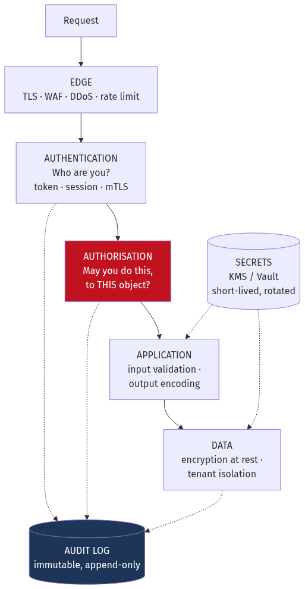
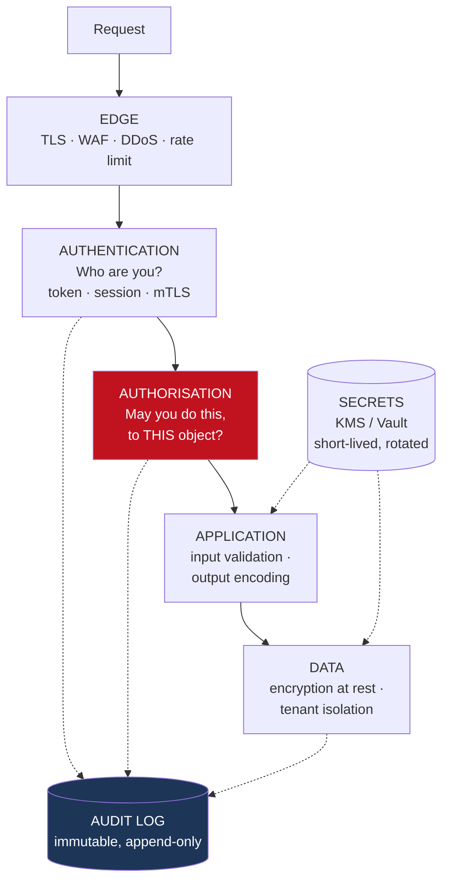
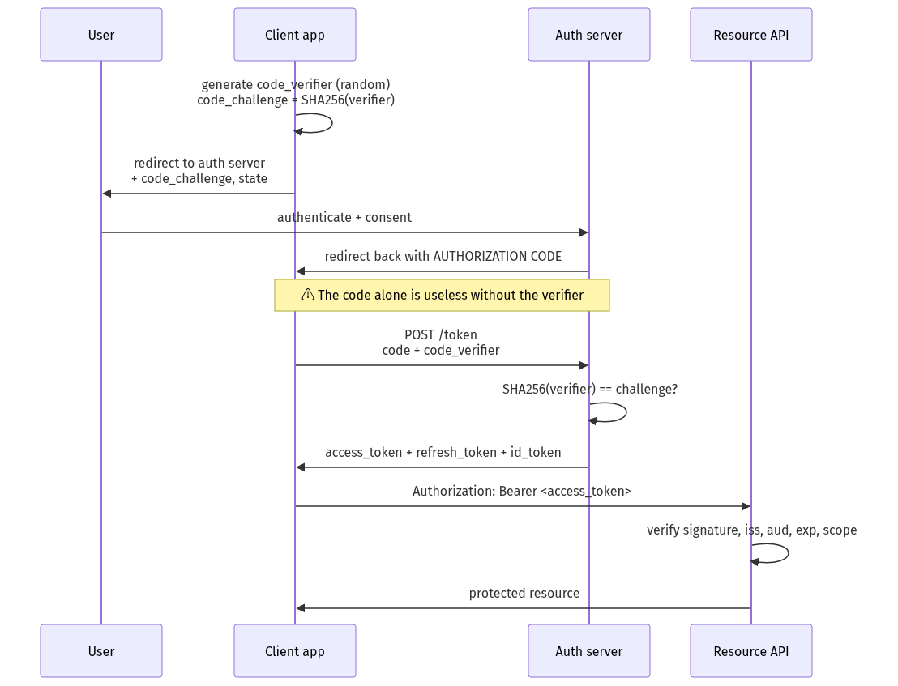
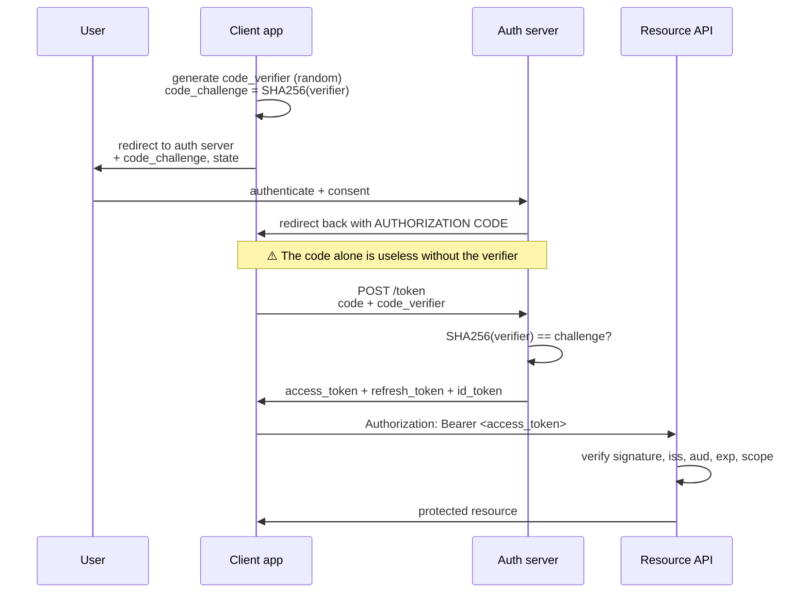
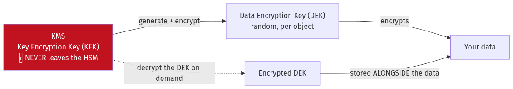
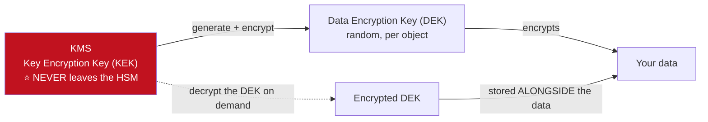

# Chapter 18 — Security and Identity

[← Chapter 17](./17_containers_docker_kubernetes.md) · [Contents](./README.md) · [Next: Chapter 19 →](./19_observability_and_operations.md)

**Prerequisites:** [Chapter 4](./04_networking_deep_dive.md) §4.4 (TLS, certificates), [Chapter 15](./15_apis_and_protocols.md) (APIs, webhooks), [Chapter 17](./17_containers_docker_kubernetes.md) §17.5 (Secrets).

---

## What you'll learn

- **Threat modelling** with STRIDE — how to decide what to defend before writing any code
- Why **bcrypt and Argon2** exist and why SHA-256 is the wrong tool for passwords
- **JWT anatomy**, the two signing families, and the three things JWTs are genuinely bad at
- **OAuth 2.0** traced through the authorisation-code flow with PKCE, plus what **OIDC** adds
- **RBAC, ABAC and ReBAC** — and why Google built Zanzibar rather than using any of them
- **Envelope encryption** and why every cloud KMS works this way
- The **OWASP Top 10** with a vulnerable and a fixed version of each
- **CORS** explained properly — it protects the *browser's user*, not your server
- **Multi-tenancy isolation** models, and the query that leaks another tenant's data

---

## Start from zero

Security is three separate questions that get collapsed into one word.

**"Who are you?"** — **authentication**. You present a password, a token, a certificate. The
system decides whether it believes you.

**"What may you do?"** — **authorisation**. You are Alice. May Alice delete this invoice?

**"What actually happened?"** — **audit**. Someone deleted the invoice at 03:14. Who, from
where, and can we prove it?

⚠️ **The most common security bug in software is confusing the first two.** A system checks
that you're logged in, and then trusts whatever object ID you send. You're authenticated, so
you must be allowed — except you just changed `/invoices/551` to `/invoices/552` and read
someone else's data. That's **broken access control**, and it's been near the top of the OWASP
Top 10 for over a decade.

There's a fourth idea underlying all of it: **defence in depth**. Any single control will
eventually fail — a library has a vulnerability, an engineer misconfigures something, a
credential leaks. So you assume each layer will be breached and ask what the *next* layer does.

```
Attacker gets your app's database password
  → Does the database only accept connections from the app's subnet? (network policy)
  → Is the data encrypted with keys the database doesn't hold? (envelope encryption)
  → Does the credential expire in an hour? (short-lived credentials)
  → Does anything alert on an unusual access pattern? (detection)
```

💡 **Security is not a feature you add; it's a property of how the system is arranged.** This
chapter is about that arrangement.

---

## The mental model



<details>
<summary>Diagram source (Mermaid)</summary>



</details>

💡 **The red box is where the bugs are.** Authentication is largely a solved problem you can buy.
Authorisation is domain-specific, has to be applied at every single access point, and is
therefore where things actually go wrong.

---

## Deep dive

### 18.1 Threat modelling with STRIDE

Before defending anything, decide what you're defending against. **STRIDE** is a checklist that
maps threats to the property they violate:

| Threat | Violates | Example | Control |
| --- | --- | --- | --- |
| **S**poofing | Authentication | Pretending to be another user | Strong authn, MFA, mTLS |
| **T**ampering | Integrity | Modifying a price in transit | TLS, signatures, HMAC |
| **R**epudiation | Non-repudiation | "I never made that transfer" | Immutable audit logs, signing |
| **I**nformation disclosure | Confidentiality | Reading another tenant's data | Authorisation, encryption |
| **D**enial of service | Availability | Resource exhaustion | Rate limiting, quotas, shedding |
| **E**levation of privilege | Authorisation | User becomes admin | Least privilege, input validation |

📐 **Apply it per trust boundary**, not per feature. A trust boundary is anywhere data crosses
from less-trusted to more-trusted:

```
Internet          → your edge         ⚠️ the big one
Your services     → your database
Your app          → a third-party API
Tenant A's data   → tenant B's request path
CI pipeline       → production
```

💡 **The output of a threat model is a prioritised list, not a document.** "An attacker
enumerating invoice IDs reads other customers' data" is a threat with an owner and a fix. A
40-page report nobody reads is not.

### 18.2 Password storage

⚠️ **Never store passwords. Store a slow, salted hash.**

**Why a normal hash is wrong:** SHA-256 is designed to be *fast* — billions of hashes per
second on a GPU is a feature for its intended use and a catastrophe here.

📐 **The arithmetic:**
```
An 8-character lowercase-alphanumeric password: 36⁸ ≈ 2.8 × 10¹² combinations

SHA-256 on a modern GPU rig: ~100 billion hashes/second
  → 2.8 × 10¹² / 1 × 10¹¹ = 28 SECONDS to exhaust the whole space

bcrypt at cost factor 12: ~1,000 hashes/second (deliberately)
  → 2.8 × 10¹² / 1,000 = 89 YEARS
```

**A password hash must be:**

| Property | Why |
| --- | --- |
| **Salted** (unique per password) | Defeats rainbow tables and makes identical passwords hash differently |
| **Slow** (tunable cost) | Makes brute force economically infeasible |
| **Memory-hard** | Defeats GPU and ASIC parallelism — the modern requirement |

| Algorithm | Status | Configuration |
| --- | --- | --- |
| **Argon2id** | ⭐ Current recommendation (OWASP) | m=19 MiB, t=2, p=1 minimum |
| **scrypt** | Good | N=2¹⁷, r=8, p=1 |
| **bcrypt** | Fine; ⚠️ **72-byte input limit** | cost ≥ 12 |
| PBKDF2 | Acceptable where FIPS is required | ≥ 600,000 iterations (SHA-256) |
| MD5, SHA-1, SHA-256 alone | ❌ **Never** | — |

💡 **Argon2id is memory-hard**, which is the property that matters now. GPUs have thousands of
cores but limited memory bandwidth; requiring 19 MiB per hash means a GPU can't run thousands
of them in parallel. bcrypt is only mildly memory-hard, which is why it's slowly being
superseded.

⚠️ **bcrypt's 72-byte truncation is a real vulnerability**, not trivia. A passphrase longer than
72 bytes has its tail silently ignored, so two different long passwords can collide. The fix is
to pre-hash with SHA-256 and base64-encode before passing to bcrypt — or use Argon2id.

**Peppering** adds a secret (stored outside the database, e.g. in KMS) to the hash input. If the
database leaks but the pepper doesn't, offline cracking is impossible. ⚠️ Rotating a pepper
requires re-hashing on next login, so plan for versioned peppers.

**Two more essentials:**
- ⚠️ **Constant-time comparison.** `==` on a hash or token leaks information through timing. Use
  `hmac.Equal` / `crypto.timingSafeEqual`.
- ⚠️ **Check against breach corpora.** Have I Been Pwned's k-anonymity API lets you check a
  password against billions of known-breached passwords without sending it. Rejecting known-bad
  passwords is more effective than complexity rules, which mostly produce `Password1!`.

### 18.3 Sessions and tokens

**Two models, with genuinely different trade-offs:**

| | **Server-side session** | **Stateless token (JWT)** |
| --- | --- | --- |
| Where state lives | Server (Redis/DB) | ⭐ In the token itself |
| Validation | Lookup per request | Signature check, no I/O |
| **Revocation** | ⭐ **Instant** — delete the row | ⚠️ **Hard** — valid until expiry |
| Scaling | Needs a shared store | ✅ Nothing shared |
| Size | Small cookie (~32 bytes) | 500–2,000 bytes **per request** |
| Contains user data | No | ⚠️ Yes — visible to anyone holding it |

#### JWT anatomy

```
eyJhbGciOiJSUzI1NiIsImtpZCI6ImsxIn0.eyJzdWIiOiIxMjM0Iiwic2NvcGUiOiJyZWFkIn0.SflKxwRJ...
└──────── header ────────┘└──────── payload ────────┘└─── signature ───┘
```
```json
// Header
{"alg": "RS256", "kid": "k1", "typ": "JWT"}
// Payload — ⚠️ base64, NOT encrypted. Anyone can read it.
{"sub":"1234","iss":"https://auth.example.com","aud":"api.example.com",
 "exp":1756644000,"iat":1756640400,"jti":"a3f9b2c1","scope":"orders:read"}
```

| Claim | Meaning | ⚠️ Must validate |
| --- | --- | --- |
| `iss` | Issuer | ✅ Yes — is this from *my* auth server? |
| `aud` | Audience | ✅ Yes — was this token meant for *this* service? |
| `exp` | Expiry | ✅ Yes |
| `nbf` | Not before | ✅ Yes |
| `sub` | Subject (user ID) | — |
| `jti` | Unique token ID | For revocation lists |

**Signing families:**
```
HS256  symmetric — one shared secret signs AND verifies
       ⚠️ Every verifier can also FORGE tokens. Unusable across trust boundaries.
RS256/ES256  asymmetric — private key signs, public key verifies
       ✅ Services verify without being able to mint. Use these.
```

#### ⚠️ The JWT attacks you must defend against

**1. `alg: none`.** Some libraries historically accepted a token declaring no algorithm and
skipped verification entirely.
```
❌ jwt.decode(token)                              # trusts the header's alg
✅ jwt.decode(token, key, algorithms=["RS256"])   # you specify it, not the attacker
```

**2. Algorithm confusion (RS256 → HS256).** An attacker changes `alg` to `HS256` and signs with
your **public key** as the HMAC secret. A naive library verifies successfully, because the
public key is public.
**Fix:** always pin the expected algorithm explicitly. Never let the token choose.

**3. Missing `aud` validation.** A token issued for the analytics service is accepted by the
payments service. Always check the audience.

**4. Unvalidated `kid`.** A `kid` header of `../../etc/passwd` or an injected SQL fragment has
caused real vulnerabilities. Treat it as untrusted input and look it up in an allowlist.

#### ⚠️ The revocation problem, stated honestly

```
A user is fired at 14:00. Their JWT expires at 14:30.
For 30 minutes they retain full access, and there is nothing you can do about it
within the pure stateless model.
```

**The mitigations, all of which are compromises:**

| Approach | Cost |
| --- | --- |
| **Short expiry (5–15 min) + refresh tokens** | ⭐ Bounds the window; refresh is revocable |
| Denylist by `jti` | Requires a lookup — you've reintroduced state |
| Per-user "not valid before" timestamp | One lookup, but revokes *all* of that user's tokens |
| Token version in the payload, checked against the user record | Same trade |

💡 **The honest architecture is a hybrid.** Short-lived access tokens (15 minutes, verified
statelessly with zero I/O) plus long-lived **refresh tokens** stored server-side and therefore
instantly revocable. You get stateless verification on the hot path and real revocation on the
control path.

⚠️ **Refresh tokens must rotate.** Each use issues a new refresh token and invalidates the old
one. If an old one is ever presented again, that's **token theft** — the legitimate client and
the attacker now both hold one, and one of them will replay. Detect it and revoke the entire
token family.

⚠️ **Never store tokens in `localStorage`.** Any XSS reads it instantly. Use an
`HttpOnly; Secure; SameSite=Strict` cookie, which JavaScript cannot access.

### 18.4 OAuth 2.0 and OIDC

⚠️ **The single most common misconception: OAuth 2.0 is an *authorisation* framework, not an
authentication protocol.** It answers "may this application access this resource on the user's
behalf?" — not "who is this user?". **OpenID Connect (OIDC)** is the thin layer on top that adds
authentication, via the **ID token**.

#### The authorisation-code flow with PKCE

This is the flow you should use for essentially everything now — web apps, mobile apps and SPAs.



<details>
<summary>Diagram source (Mermaid)</summary>



</details>

💡 **What PKCE actually prevents.** On mobile, the redirect back to the app uses a custom URL
scheme that a malicious app could also register — so it could intercept the authorisation code.
With PKCE, the code is worthless without the `code_verifier`, which never left the legitimate
app. **PKCE is now recommended for all clients, including confidential server-side ones**
(OAuth 2.1 makes it mandatory).

⚠️ **The `state` parameter is separate and equally required** — it prevents CSRF on the redirect
by binding the callback to the session that initiated it.

#### The grant types, and which to use

| Grant | Use for | Status |
| --- | --- | --- |
| **Authorization Code + PKCE** | ⭐ Web apps, SPAs, mobile | **Use this** |
| **Client Credentials** | ⭐ Machine-to-machine (no user) | Use this |
| **Device Code** | TVs, CLIs, input-constrained devices | Use this |
| Refresh Token | Getting a new access token | Use, with rotation |
| ~~Implicit~~ | — | ❌ **Removed in OAuth 2.1** — leaked tokens in URLs |
| ~~Resource Owner Password~~ | — | ❌ **Removed** — the app sees the password |

#### What OIDC adds

```json
// ID token — about the USER. For the CLIENT to consume.
{"iss":"https://auth.example.com","sub":"1234","aud":"client_abc",
 "exp":1756644000,"email":"alice@example.com","email_verified":true,
 "nonce":"n-0S6_WzA2Mj"}
```

⚠️ **The distinction that matters operationally:**
```
ID token     → identity, for the CLIENT. Never send it to an API.
Access token → authorisation, for the API. It's opaque to the client.
```
Sending an ID token as a bearer credential to an API is a common and serious mistake — the API
would be authorising based on an assertion that wasn't scoped to it.

#### SAML vs OIDC

| | SAML 2.0 | OIDC |
| --- | --- | --- |
| Format | XML | JSON/JWT |
| Age | 2005 | 2014 |
| Mobile/SPA friendly | ⚠️ Poor | ✅ Good |
| Enterprise adoption | ⭐ Still dominant | Growing |
| Complexity | ⚠️ High (XML signatures are notoriously hard to implement safely) | Moderate |

💡 If you're selling to enterprises, you will need SAML regardless of preference. XML signature
verification has a long history of subtle vulnerabilities (signature wrapping) — **use a
well-maintained library and never hand-roll it.**

### 18.5 Authorisation models

#### RBAC — Role-Based Access Control

```
User → Role → Permissions
alice → editor → [posts:read, posts:write]
```
✅ Simple, auditable, universally understood.
⚠️ **Role explosion.** "Editor for the marketing team in the EU region who can also approve
budgets under £10k" isn't a role — it's a combinatorial product of attributes, and encoding it
as roles gives you hundreds.

#### ABAC — Attribute-Based Access Control

Decisions are computed from attributes of the subject, resource, action and environment.

```rego
# Open Policy Agent (Rego)
allow {
    input.user.department == input.resource.department
    input.user.clearance >= input.resource.classification
    input.action == "read"
    time.now_ns() < input.user.access_expires
}
```
✅ Expressive; handles context (time, location, device posture).
⚠️ Hard to answer "who can access this document?" — you'd have to evaluate the policy against
every user.

#### ReBAC — Relationship-Based Access Control (Zanzibar)

Google built **Zanzibar** because neither RBAC nor ABAC answers the question a document-sharing
system actually asks: *"is there a path of relationships from this user to this object?"*

```
document:readme#owner@user:alice
document:readme#viewer@group:engineering#member
group:engineering#member@user:bob
folder:docs#viewer@user:carol
document:readme#parent@folder:docs
→ Carol can view readme, via INHERITANCE from the folder
```

💡 **This is the model that fits real products.** Google Docs, GitHub, Notion and Slack all have
permissions that are fundamentally about relationships and inheritance, not roles.

📐 **Zanzibar's hard problem is consistency, not modelling.** If Alice removes Bob's access and
Bob immediately loads the document, a stale cached decision leaks data — the **"new enemy"
problem**. Zanzibar solves it with **zookies**: an opaque consistency token that pins a read to
a point in the relationship graph's history, so a permission check can't be answered from data
older than the revocation.

**Open-source implementations:** SpiceDB, Ory Keto, OpenFGA.

#### Where to enforce

| Layer | ✅ | ⚠️ |
| --- | --- | --- |
| Gateway | Coarse-grained, one place | Can't see object-level context |
| Service | Business context available | Must be applied at **every** entry point |
| **Data layer** (row-level security) | ⭐ **Impossible to bypass** | Harder to express complex policy |

⚠️ **Object-level authorisation must be at the data layer or immediately adjacent to it**,
because the failure mode of forgetting it once is a data breach.

```sql
-- PostgreSQL row-level security: the check cannot be forgotten
ALTER TABLE invoices ENABLE ROW LEVEL SECURITY;
CREATE POLICY tenant_isolation ON invoices
    USING (tenant_id = current_setting('app.tenant_id')::uuid);
```
💡 **This is the strongest available control against the tenant-isolation bug in §18.10.** A
developer who forgets the `WHERE tenant_id = ?` clause gets zero rows rather than everyone's
data.

### 18.6 Secrets management

⚠️ **Secrets in environment variables and config files are the default and are inadequate.**
They appear in `/proc/<pid>/environ`, in crash dumps, in `docker inspect`, in CI logs, and they
never rotate.

#### Envelope encryption — how every cloud KMS works



<details>
<summary>Diagram source (Mermaid)</summary>



</details>

```
Encrypt:  1. Ask KMS to generate a DEK → returns plaintext DEK + encrypted DEK
          2. Encrypt data locally with the plaintext DEK (fast, AES-GCM)
          3. Store: encrypted data + encrypted DEK
          4. ⚠️ Zero the plaintext DEK from memory

Decrypt:  1. Send the encrypted DEK to KMS → get the plaintext DEK back
          2. Decrypt the data locally
```

📐 **Why not just encrypt everything with KMS directly?**
```
KMS API: ~4 KB payload limit, ~10,000 requests/second, ~10 ms latency, billed per call
Envelope: ONE KMS call per DEK, which can encrypt gigabytes locally at GB/s
```
💡 **And key rotation becomes cheap:** rotating the KEK means re-encrypting only the DEKs — a
few kilobytes — not petabytes of data.

#### Short-lived, dynamically-generated credentials

```
❌ Static: DB_PASSWORD=hunter2 in the environment, unchanged for three years
✅ Dynamic: Vault generates a unique database user valid for 1 hour, then deletes it
```
📐 **The value is bounding the blast radius.** A leaked static credential is valid until someone
notices. A leaked dynamic credential is valid for an hour, is attributable to one specific
workload, and is automatically revoked.

**Workload identity** removes the bootstrap problem entirely:
```
❌ How does the pod authenticate to Vault? With a secret. How does it get that secret?
✅ The platform attests the workload's identity (Kubernetes ServiceAccount token,
   AWS IRSA, SPIFFE) — no long-lived credential exists anywhere.
```
💡 **This is the single biggest improvement available to most systems**: eliminate the
long-lived credential rather than trying to protect it.

⚠️ **Detect secrets in source control** with pre-commit hooks and repository scanning
(`gitleaks`, `trufflehog`). And when one leaks, **rotate it** — deleting the commit does not
help, because the object remains in the git history and in every clone and fork.

### 18.7 The OWASP Top 10, with fixes

#### A01 — Broken Access Control ⚠️ *the #1 risk*

```go
// ❌ IDOR (Insecure Direct Object Reference): authenticated, but not authorised
func GetInvoice(w http.ResponseWriter, r *http.Request) {
    id := r.PathValue("id")
    inv, _ := db.GetInvoice(id)   // ⚠️ any logged-in user reads any invoice
    json.NewEncoder(w).Encode(inv)
}

// ✅ Scope every query to the authenticated principal
func GetInvoice(w http.ResponseWriter, r *http.Request) {
    user := auth.FromContext(r.Context())
    inv, err := db.GetInvoiceForTenant(r.PathValue("id"), user.TenantID)
    if err != nil {
        http.Error(w, "not found", 404)   // ⚠️ 404, not 403 — don't confirm existence
        return
    }
    json.NewEncoder(w).Encode(inv)
}
```
💡 **Return 404, not 403, for objects the caller may not see.** A 403 confirms the object
exists, which is itself an information leak that enables enumeration.

#### A02 — Cryptographic Failures

```
❌ MD5/SHA-1 for passwords · ECB mode · hardcoded keys · missing TLS · a static IV
✅ Argon2id for passwords · AES-256-GCM (authenticated) · KMS-managed keys · TLS 1.3
```
⚠️ **Always use authenticated encryption (AEAD).** AES-CBC without a MAC is malleable — an
attacker can flip bits in the ciphertext to produce predictable plaintext changes. AES-GCM and
ChaCha20-Poly1305 authenticate as well as encrypt.

#### A03 — Injection

```go
// ❌ SQL injection
query := "SELECT * FROM users WHERE email = '" + email + "'"

// ✅ Parameterised — the driver sends query and data separately
db.Query("SELECT * FROM users WHERE email = $1", email)
```
⚠️ **Parameterisation doesn't cover identifiers.** Table and column names can't be
parameterised, so `ORDER BY ` + userInput is injectable — **allowlist** those against a fixed
set. And injection isn't only SQL: command injection, LDAP, NoSQL operator injection
(`{"$gt": ""}` in MongoDB), and template injection are all the same class.

#### A04 — Insecure Design

Not a bug — a missing control. No rate limit on password reset. No spending limit. No approval
step for a high-value action. **This is what threat modelling (§18.1) catches**, and no amount
of code review will.

#### A05 — Security Misconfiguration

```
❌ Default credentials · debug mode in production · stack traces in responses ·
   directory listing · unnecessary ports open · an S3 bucket set public
✅ Hardened baseline images · IaC scanning · CIS benchmarks · least privilege by default
```

#### A06 — Vulnerable and Outdated Components

📐 The **Log4Shell** vulnerability (CVE-2021-44228) was a single logging library that allowed
remote code execution by logging a user-supplied string. Automated dependency scanning
(Dependabot, Renovate, Snyk) plus an **SBOM** so you can answer "are we affected?" in minutes
rather than days.

#### A07 — Identification and Authentication Failures

```
❌ No MFA · unlimited login attempts · session ID in the URL · no session rotation on login
✅ MFA · rate limiting + account lockout · HttpOnly cookies · rotate the session ID at login
```
⚠️ **Rotate the session identifier on privilege change** (login, role escalation). Otherwise
**session fixation**: an attacker sets a known session ID, the victim logs in, and the attacker's
pre-known ID is now authenticated.

#### A08 — Software and Data Integrity Failures

```
❌ Unsigned artifacts · unpinned dependencies · unvalidated deserialisation
✅ Signed images (cosign) · lockfiles with hashes · never deserialise untrusted data into
   arbitrary types
```
⚠️ **Insecure deserialisation is remote code execution.** Java's `ObjectInputStream`, Python's
`pickle` and PHP's `unserialize` on untrusted input all permit arbitrary object construction.
Use JSON with an explicit schema.

#### A09 — Security Logging and Monitoring Failures

```
✅ Log: authn success and failure, authz denials, privilege changes, data exports,
        admin actions, secret access
❌ Never log: passwords, tokens, full card numbers, session IDs, personal data
```
⚠️ **The mean time to detect a breach is measured in months.** Logging is what makes detection
possible at all — and the logs themselves must be append-only and shipped off-host, or an
attacker's first act is deleting them.

#### A10 — Server-Side Request Forgery (SSRF)

```go
// ❌ The server fetches a URL the user supplied
resp, _ := http.Get(r.FormValue("url"))
// Attacker sends: http://169.254.169.254/latest/meta-data/iam/security-credentials/
// → your cloud instance credentials, returned to the attacker
```
**Defences, and you need several:**
```
1. Allowlist destinations — never a denylist
2. Resolve DNS first, then check the IP against private ranges
   ⚠️ Validating the hostname alone loses to DNS rebinding
3. Block link-local (169.254.0.0/16) at the network layer
4. Require IMDSv2 (token-based) — it defeats the classic metadata SSRF
5. Egress network policy from the workload
```

### 18.8 CORS — what it actually does

⚠️ **The near-universal misunderstanding: CORS does not protect your server.**

```
CORS is a BROWSER mechanism that protects a USER from a MALICIOUS WEBSITE
reading responses from a site they are logged into.

It does NOT stop curl, Postman, a script, or any non-browser client.
Your API still needs its own authentication and authorisation.
```

```http
# Preflight for non-simple requests
OPTIONS /api/orders
Origin: https://app.example.com
Access-Control-Request-Method: POST

HTTP/1.1 204
Access-Control-Allow-Origin: https://app.example.com    # ⚠️ NOT "*" with credentials
Access-Control-Allow-Methods: GET, POST
Access-Control-Allow-Headers: Content-Type, Authorization
Access-Control-Allow-Credentials: true
Access-Control-Max-Age: 86400
```

⚠️ **Two dangerous configurations:**
1. `Access-Control-Allow-Origin: *` **with** `Allow-Credentials: true` — browsers reject this
   combination, but reflecting the `Origin` header back achieves the same thing and is a real
   vulnerability. **Allowlist origins explicitly.**
2. Reflecting `Origin` without validation is equivalent to allowing every origin.

### 18.9 Multi-tenancy isolation

📐 **Four models, from strongest to cheapest:**

| Model | Isolation | Cost | Blast radius of a bug |
| --- | --- | --- | --- |
| **Separate infrastructure** | Strongest | ⚠️ Very high | One tenant |
| **Separate database per tenant** | Strong | High | One tenant |
| **Shared DB, schema per tenant** | Medium | Moderate | Usually one tenant |
| **Shared DB, `tenant_id` column** | ⚠️ **Weakest** | Lowest | ⚠️ **Everyone** |

⚠️ **The shared-table model is the most common and the most dangerous**, because a single
forgotten `WHERE` clause exposes every tenant:

```go
// ❌ One missing predicate = full cross-tenant data breach
db.Query("SELECT * FROM invoices WHERE status = $1", status)
```

**Three defences, in increasing strength:**

```sql
-- 1. ⭐ Row-level security — enforced by the database, cannot be forgotten
ALTER TABLE invoices ENABLE ROW LEVEL SECURITY;
CREATE POLICY tenant_isolation ON invoices
    USING (tenant_id = current_setting('app.tenant_id')::uuid);
-- Set per connection/transaction from the authenticated context:
SET LOCAL app.tenant_id = '...';
```
```go
// 2. Repository layer that makes tenant-less queries impossible to express
func (r *Repo) Invoices(ctx context.Context) *Query {
    return r.db.Where("tenant_id = ?", tenantFrom(ctx))  // always applied
}
```
```
3. Automated tests that assert cross-tenant access returns zero rows,
   run against every endpoint in CI.
```

💡 **Row-level security is the strongest available control** because it moves enforcement below
the application. Even a raw SQL query written by hand in a migration script is filtered.

⚠️ **Noisy neighbours** are the other multi-tenancy problem: one tenant's expensive query
degrades everyone. Mitigations: per-tenant rate limits and quotas, query timeouts, and moving
very large tenants to dedicated infrastructure — the "whale tenant" pattern from
[Chapter 9](./09_replication_partitioning_consistency.md) §9.7.

### 18.10 Supply chain

⚠️ **Your code is a small fraction of what you ship.** A typical application has hundreds of
transitive dependencies, and any of them can be compromised.

| Control | What it does |
| --- | --- |
| **SBOM** (SPDX, CycloneDX) | ⭐ Answers "are we affected by CVE-X?" in minutes, not days |
| **Dependency scanning** | Automated PRs for known vulnerabilities |
| **Lockfiles with hashes** | Reproducible builds; prevents substitution |
| **Image signing** (cosign/Sigstore) | Verify the artifact came from your pipeline |
| **Admission control** | ⭐ Cluster refuses unsigned or unscanned images |
| **SLSA levels** | A framework for build-provenance maturity |

⚠️ **Dependency confusion** is worth knowing specifically: if your build resolves an internal
package name from a *public* registry first, an attacker who registers that name publicly gets
code execution in your build. **Pin your registry order and claim your internal names publicly.**

### 18.11 Privacy and data protection

| Requirement | Implementation |
| --- | --- |
| **Data minimisation** | Don't collect it if you don't need it — the cheapest control |
| **Right to erasure** | ⚠️ Requires knowing every place personal data lives, including backups and derived stores |
| **Data residency** | Region-pinned storage; geographic sharding ([Ch 9](./09_replication_partitioning_consistency.md)) |
| **Encryption** | At rest and in transit |
| **Pseudonymisation** | Replace identifiers with tokens; keep the mapping separately |
| **Retention limits** | Automated deletion — not a policy document |
| **Breach notification** | 72 hours under GDPR — you need detection to meet it |

⚠️ **The right to erasure is architecturally hard**, and it's usually underestimated. Personal
data has been copied into search indexes, analytics warehouses, caches, logs, backups and
third-party processors. **Crypto-shredding** is the practical technique: encrypt each user's
data with a per-user key, and "delete" by destroying that key — every copy everywhere becomes
unreadable simultaneously, including in immutable backups.

---

## Worked example — securing a multi-tenant SaaS

*A B2B SaaS. Enterprise customers require SSO. Users belong to organisations and have roles.
The API is used by a web app, a mobile app and customer-built integrations. Design the security
architecture.*

**Step 1 — Threat model the trust boundaries.**

| Boundary | Top threats (STRIDE) | Priority |
| --- | --- | --- |
| Internet → API | Spoofing, DoS, injection | High |
| **Tenant A → Tenant B's data** | **Information disclosure** | ⚠️ **Critical** |
| App → database | Elevation of privilege via a leaked credential | High |
| CI → production | Tampering (supply chain) | Medium |
| Support staff → customer data | Information disclosure, repudiation | High |

💡 **Cross-tenant leakage is the existential risk for a B2B SaaS.** One incident ends enterprise
contracts. It gets disproportionate investment.

**Step 2 — Authentication, by client type.**

| Client | Mechanism |
| --- | --- |
| Web app | OIDC authorisation code + PKCE → short-lived access token in memory, refresh token in an `HttpOnly` cookie |
| Mobile | Same flow; refresh token in the OS keychain |
| Enterprise SSO | **SAML 2.0 or OIDC federation** to the customer's IdP |
| Customer integrations | **OAuth client credentials** — scoped machine tokens, not user tokens |
| Internal services | **mTLS** via the service mesh ([Ch 16](./16_microservices_and_service_architecture.md) §16.6) |

```
Access token:  15 minutes, RS256, verified locally with the JWKS public key
               → zero I/O per request, so no auth-service dependency on the hot path
Refresh token: 30 days, stored server-side, ROTATED on every use,
               reuse detection revokes the whole family
```
📐 **Why 15 minutes:** it bounds the post-revocation window to 15 minutes while keeping
verification stateless. Shorter means more refresh traffic; longer means a fired employee
retains access. ⚠️ For genuinely sensitive operations, additionally check a revocation list —
accepting the lookup cost where it matters.

**Step 3 — Authorisation: three layers.**

```
Layer 1 — Gateway:  is the token valid? does its scope cover this endpoint?
Layer 2 — Service:  does this user's ROLE permit this action?
Layer 3 — Data:     ⭐ does this row belong to this user's TENANT?
```

⚠️ **Layer 3 is not optional and must be enforced below the application:**
```sql
ALTER TABLE invoices ENABLE ROW LEVEL SECURITY;
ALTER TABLE invoices FORCE ROW LEVEL SECURITY;   -- ⚠️ applies even to the table owner
CREATE POLICY tenant_isolation ON invoices
    USING (tenant_id = current_setting('app.tenant_id')::uuid);
```
```go
// Set from the VERIFIED token, per transaction — never from a request parameter
tx.Exec("SET LOCAL app.tenant_id = $1", claims.TenantID)
```
💡 **`SET LOCAL` scopes it to the transaction**, so a pooled connection can't leak one tenant's
context into another request — which is exactly the bug that would otherwise make this worse
than no control at all.

**Step 4 — The permission model.**

The product has documents shared with individuals, teams and via folder inheritance. **RBAC
can't express that** — it's relationships, not roles.

```
document:doc1#owner@user:alice
document:doc1#viewer@team:eng#member
document:doc1#parent@folder:specs
folder:specs#viewer@user:bob        → Bob sees doc1 by inheritance
```
Use a Zanzibar-style store (SpiceDB/OpenFGA) for object-level sharing, with **coarse RBAC at
the gateway** as a cheap first filter.

⚠️ **Cache permission decisions carefully.** A revocation must not be defeated by a stale cache
— the "new enemy" problem. Use consistency tokens, or keep the TTL very short (a few seconds)
for permission checks specifically.

**Step 5 — Secrets and credentials.**
```
Database:    Vault dynamic credentials, 1-hour TTL, unique per pod
Signing keys: KMS — the private key NEVER leaves the HSM; sign via API
Customer data: envelope encryption, per-TENANT DEK
              ⭐ enables crypto-shredding on contract termination
Workload identity: Kubernetes ServiceAccount → Vault (no bootstrap secret exists)
Third-party keys: Vault, rotated quarterly, with two active versions during rotation
```

📐 **Per-tenant DEKs are the decisive choice**, and it's worth stating why:
```
Tenant offboarding: destroy their DEK
→ Their data becomes unreadable EVERYWHERE simultaneously — primary database,
  replicas, backups, analytics warehouse, search index — including in immutable
  backups you cannot legally or technically delete from.
This is the only practical way to satisfy erasure obligations against backups.
```

**Step 6 — Edge defences.**
```
CDN/WAF:  OWASP core rule set, bot detection, TLS 1.2+ only
Rate limits (layered, Ch 5 §5.9):
  Per IP:              100 req/s
  Per tenant:        1,000 req/s   ⚠️ prevents noisy neighbours
  Per user:             50 req/s
  /auth/login:           5 req/min per IP AND per account
                         ⭐ per-account too, or credential stuffing rotates IPs
  /password/reset:       3 req/hour per account
DDoS:     anycast + upstream scrubbing (Ch 4 §4.6, Ch 5 §5.9)
```

**Step 7 — Audit logging.**
```
Log:  authn success/failure, authz DENIALS, role changes, data exports,
      admin impersonation, secret access, permission-graph writes
Fields: actor, tenant, action, resource, source IP, user agent, trace_id, result
Storage: append-only, shipped off-host within seconds, WORM retention 7 years
         (Ch 6 §6.10)
Never log: passwords, tokens, full card numbers, session IDs, PII values
```
⚠️ **Support impersonation needs special treatment.** "Log in as customer" is necessary for
support and is a standing information-disclosure risk. Require a ticket reference, time-box the
session, log every action under both identities, and notify the customer.

**Step 8 — The supply chain.**
```
Dependencies: Renovate + Snyk, SBOM per build (CycloneDX)
Images:       distroless, non-root, signed with cosign
Admission:    the cluster REJECTS unsigned images or those with critical CVEs
Pipeline:     OIDC federation to the cloud — ⭐ no long-lived CI credentials exist
Registry:     internal names claimed publicly (dependency-confusion defence)
```

**Step 9 — Verify with adversarial testing.**
```
✅ Automated cross-tenant tests on EVERY endpoint in CI:
   authenticate as tenant A, request tenant B's object ID, assert 404
✅ Fuzzing on all parsers
✅ Annual third-party penetration test
✅ Bug bounty
✅ Detection tests: does exfiltrating 10,000 records actually trigger an alert?
```
💡 **The cross-tenant CI test is the highest-value control in this design.** It catches the
class of bug that would end the business, on every pull request, automatically.

**Step 10 — Summary.**

| Threat | Control | Depth |
| --- | --- | --- |
| Cross-tenant read | RLS + repository layer + CI tests | ⭐ 3 layers |
| Credential theft | Short tokens + rotation + reuse detection | 3 layers |
| Database credential leak | Dynamic 1-hour creds + network policy + per-tenant encryption | 3 layers |
| Injection | Parameterised queries + WAF + RLS | 3 layers |
| Supply chain | Scanning + signing + admission control | 3 layers |
| Data erasure | Per-tenant DEK crypto-shredding | 1, but complete |
| Detection | Audit log + anomaly alerting + tested | 2 |

---

## Trade-offs

| Decision | Option A | Option B | Choose A when | Never choose A when |
| --- | --- | --- | --- | --- |
| Sessions | Server-side | Stateless JWT | Instant revocation matters | Prefer hybrid: short JWT + revocable refresh |
| JWT signing | HS256 (symmetric) | RS256/ES256 | Single service signs and verifies | Multiple verifiers — they could forge |
| Token storage (browser) | `localStorage` | `HttpOnly` cookie | ⚠️ Never | Always B — XSS reads `localStorage` |
| Password hashing | bcrypt | **Argon2id** | Existing system, cost ≥ 12 | New systems — B is memory-hard |
| Authorisation | RBAC | ReBAC (Zanzibar) | Simple, stable role sets | Sharing, inheritance, per-object grants |
| Authorisation enforcement | Application | **Row-level security** | Policy is too complex for SQL | Prefer B — it can't be forgotten |
| Tenancy | Shared table + `tenant_id` | DB per tenant | Cost matters and RLS is in place | Regulated data or very large tenants |
| Secrets | Env vars | KMS/Vault + short-lived | Local development | Production — env vars never rotate |
| Encryption | Direct KMS | **Envelope** | Tiny payloads only | Any real data volume |
| Error on forbidden object | 403 | **404** | You want to be explicit | B avoids confirming existence |
| CORS | Reflect `Origin` | Explicit allowlist | ⚠️ Never | Always B |
| Deserialisation | Native (pickle, ObjectInputStream) | JSON + schema | ⚠️ Never on untrusted input | Always B |

---

## How real companies do it

**Google's Zanzibar paper** (2019) is the reference for authorisation at scale — over two
trillion relationship tuples, serving millions of checks per second globally at single-digit
millisecond latency. The genuinely interesting contribution isn't the data model but the
**consistency mechanism**: zookies prevent the "new enemy" problem where a stale cache serves a
permission that has just been revoked.

**Google's BeyondCorp** replaced the perimeter model with per-request authorisation based on
device and user trust — the foundational **zero trust** work. The observation that drove it: a
VPN converts "on the network" into "trusted", so one compromised laptop compromises everything.

**Stripe's Radar and their API design** treat security controls as product features:
idempotency keys prevent double-charging, per-account rate limits prevent abuse, and restricted
API keys let customers grant minimal scopes. Their published engineering writing makes the case
that security constraints and good API design converge.

**Cloudflare's post-quantum rollout** and their published TLS data are useful for understanding
what's actually deployed rather than what's specified. They also publish detailed post-incident
analyses of large-scale attacks.

**The Log4Shell response (December 2021)** is the best available case study in why SBOMs matter.
Organisations with a dependency inventory answered "are we affected?" in minutes; those without
spent days grepping build files across hundreds of repositories while actively being exploited.

---

## Common mistakes

**Confusing authentication with authorisation.** Checking that someone is logged in, then
trusting the object ID they send. This is IDOR and it's the #1 OWASP risk.

**Storing JWTs in `localStorage`.** Any XSS exfiltrates them instantly. Use `HttpOnly` cookies.

**Not validating `aud` and `iss` on a JWT.** A token minted for one service is accepted by
another.

**Letting the token choose its algorithm.** `alg: none` and RS256→HS256 confusion. Pin the
expected algorithm explicitly.

**Using SHA-256 for passwords.** It's fast by design — 100 billion/second on GPUs. Use Argon2id.

**Comparing secrets with `==`.** A timing oracle. Use constant-time comparison.

**Treating CORS as a server-side control.** It protects browser users from other websites. It
stops nothing that isn't a browser.

**`Access-Control-Allow-Origin` reflecting the request's `Origin`.** Equivalent to allowing
every origin. Use an allowlist.

**Returning 403 for objects the user may not see.** Confirms existence and enables enumeration.
Return 404.

**Relying on the application for tenant isolation.** One forgotten `WHERE tenant_id` is a full
breach. Use row-level security.

**Long-lived static credentials.** Valid until someone notices. Use short-lived dynamic
credentials with workload identity.

**Secrets in environment variables.** Visible in `/proc`, crash dumps and `docker inspect`, and
they never rotate.

**Deserialising untrusted input with a native serialiser.** `pickle` and `ObjectInputStream` on
user data is remote code execution.

**Validating an SSRF target by hostname.** DNS rebinding defeats it. Resolve first, check the
IP, and block link-local at the network layer.

**No rate limit on password reset or login.** Enables credential stuffing and enumeration. Limit
per IP **and** per account.

**Logging tokens, passwords or PII.** Your logs become the breach.

**No audit log, or one an attacker can delete.** Append-only and shipped off-host, or it's
worthless.

**Treating erasure as a `DELETE` statement.** Data exists in indexes, warehouses, caches and
backups. Crypto-shredding is the practical answer.

---

## Interview angle

**Q: How do you store passwords?**

*Strong:* "With a **slow, salted, memory-hard hash** — Argon2id is the current OWASP
recommendation, bcrypt at cost 12 or above is acceptable for existing systems. The key point is
that ordinary hashes are the wrong tool because they're *designed* to be fast: SHA-256 does
about a hundred billion hashes per second on a GPU rig, so an eight-character alphanumeric
password falls in under thirty seconds. bcrypt at cost 12 does about a thousand per second, and
the same space takes eighty-nine years. **Salting** is per-password and defeats rainbow tables
and identical-password correlation. **Memory-hardness** is the modern requirement — Argon2id
needs ~19 MiB per hash, and GPUs have thousands of cores but limited memory bandwidth, so they
can't parallelise it. Two details: bcrypt silently **truncates at 72 bytes**, so long
passphrases can collide unless you pre-hash; and comparisons must be **constant-time** or you
leak information through timing. I'd also add a **pepper** in KMS so a database-only leak
doesn't permit offline cracking, and check new passwords against breach corpora via HIBP's
k-anonymity API — that's far more effective than complexity rules, which mostly produce
`Password1!`."

**Q: JWT or server-side sessions?**

*Strong:* "It's a trade between **stateless verification** and **instant revocation**, and the
honest answer is a hybrid. A JWT verifies with a signature check and zero I/O, which means no
shared session store and no dependency on the auth service in the request path. The cost is
that you **cannot revoke it** — if someone is fired at 14:00 and their token expires at 14:30,
they have thirty minutes of access and there's nothing you can do within the pure stateless
model. So: **short-lived access tokens**, fifteen minutes, verified statelessly, plus **long-lived
refresh tokens stored server-side** and therefore instantly revocable. That bounds the exposure
window while keeping the hot path stateless. Two things I'd insist on. **Refresh token
rotation** — every use issues a new one and invalidates the old, so if an old one is ever
presented again you know it's been stolen and you revoke the whole family. And **never store
tokens in `localStorage`**, because any XSS reads them; use an `HttpOnly; Secure; SameSite`
cookie. On validation, always pin the expected algorithm rather than trusting the header —
otherwise you're vulnerable to `alg: none` and RS256-to-HS256 confusion, where an attacker signs
with your public key as an HMAC secret."

**Q: Design authorisation for a document-sharing product.**

*Strong:* "RBAC won't express it. The requirement is 'Alice owns this document, the engineering
team can view it, and Bob can view it because he can view the parent folder' — that's
**relationships and inheritance**, not roles, and encoding it as roles gives you combinatorial
explosion. So I'd use a **ReBAC model** in the Zanzibar style — SpiceDB or OpenFGA — storing
relationship tuples like `document:doc1#viewer@team:eng#member` and answering 'is there a path
from this user to this object with this permission?'. The genuinely hard part isn't the model,
it's **consistency**: if Alice revokes Bob's access and Bob immediately reloads, a stale cached
decision leaks the document. Zanzibar calls that the 'new enemy' problem and solves it with
**zookies**, opaque consistency tokens that pin a check to a point in the graph's history so it
can't be answered from data older than the revocation. Practically, I'd layer it: coarse RBAC at
the gateway as a cheap filter, ReBAC for object-level decisions, and — critically —
**row-level security at the database** as the backstop, because the failure mode of forgetting
an authorisation check once is a data breach, and a control the application can forget isn't
really a control."

**Q: How do you prevent one tenant reading another's data?**

*Strong:* "Defence in depth, because the failure mode is existential for a B2B product — one
cross-tenant leak ends enterprise contracts. The weakest common model is a shared table with a
`tenant_id` column, where one forgotten `WHERE` clause exposes everyone. So three layers. First
and most important, **row-level security in the database** — a policy filtering on a session
variable set from the verified token, using `SET LOCAL` so it's scoped to the transaction and
can't leak across a pooled connection. That's the strongest control because it's *below* the
application: even a hand-written query in a migration script is filtered, and a developer who
forgets the predicate gets zero rows rather than everyone's data. Second, a **repository layer**
where a tenant-less query is impossible to express — the tenant filter comes from the request
context, not from a parameter. Third, **automated cross-tenant tests in CI on every endpoint**:
authenticate as tenant A, request tenant B's object ID, assert 404. That last one is the
highest-value control in the whole design, because it catches the business-ending bug on every
pull request. And I'd return **404 rather than 403**, so we don't confirm the object exists. For
very large or regulated tenants I'd move to a dedicated database, which also solves noisy
neighbours."

**Q: What is SSRF and how do you prevent it?**

*Strong:* "**Server-Side Request Forgery** — you make your server fetch a URL the user
controls, and the attacker points it somewhere internal. The classic target is the cloud
metadata endpoint at `169.254.169.254`, which returns your instance's IAM credentials — so a
webhook-URL field or an image-import feature becomes full cloud account compromise. It was the
mechanism in the Capital One breach. Defences, and you need several because each has a bypass.
**Allowlist destinations**, never a denylist — the denylist will miss an encoding or an IPv6
form. **Resolve DNS first and check the resulting IP** against private and link-local ranges,
because validating the hostname alone loses to **DNS rebinding**, where the name resolves
publicly on validation and privately on fetch. **Block link-local at the network layer** with an
egress policy, so it fails even if the application check is bypassed. **Require IMDSv2**, which
is token-based and needs a PUT the attacker can't make through a simple GET proxy. And disable
redirect following, or re-validate after each redirect, because a redirect to an internal
address defeats a one-time check."

**Q: Explain envelope encryption and why it's used.**

*Strong:* "You encrypt data with a **data encryption key** generated per object, and encrypt
that DEK with a **key encryption key** that never leaves the KMS hardware module. The encrypted
DEK is stored alongside the ciphertext. To read, you send the encrypted DEK to KMS, get the
plaintext DEK back, and decrypt locally. Two reasons it's universal. **Performance and cost** —
KMS APIs have payload limits around four kilobytes, latency around ten milliseconds, request
quotas, and per-call billing; envelope encryption means one KMS call per DEK, and that DEK then
encrypts gigabytes locally at AES-GCM speeds. **Cheap key rotation** — rotating the KEK means
re-encrypting only the DEKs, a few kilobytes, rather than petabytes of data. And there's a third
benefit that's often the decisive one in a multi-tenant system: if you use a **per-tenant DEK**,
you get **crypto-shredding**. Destroying that tenant's DEK makes their data unreadable
everywhere simultaneously — primary, replicas, backups, the analytics warehouse, the search
index — including in immutable backups you can't technically or legally delete from. That is
genuinely the only practical way to satisfy erasure obligations against a backup regime."

---

## Recap

- **Authentication ≠ authorisation.** Confusing them produces IDOR, the #1 OWASP risk.
- **Threat model per trust boundary** with STRIDE. The output is a prioritised list with owners.
- **Passwords need slow, salted, memory-hard hashing** — Argon2id. SHA-256 falls in seconds.
  ⚠️ bcrypt truncates at 72 bytes.
- **JWT: pin the algorithm, validate `iss`/`aud`/`exp`, never use `localStorage`.** The
  revocation problem is real — use **short access tokens + revocable rotating refresh tokens**.
- **OAuth 2.0 is authorisation; OIDC adds authentication.** Use **authorisation code + PKCE**
  for everything. ID tokens are for the client; access tokens are for the API.
- **RBAC → ABAC → ReBAC** as expressiveness grows. Zanzibar's hard problem is **consistency**,
  not modelling.
- ⭐ **Enforce object-level authorisation at the data layer** (row-level security) — a control
  the application can forget isn't a control.
- **Envelope encryption** is universal because of KMS limits and cheap rotation — and
  **per-tenant DEKs enable crypto-shredding**, the only practical erasure mechanism against
  backups.
- ⚠️ **CORS protects the browser's user, not your server.** Never reflect `Origin`.
- **Return 404, not 403**, for objects the caller may not see.
- ⚠️ **SSRF needs layered defence**: allowlist, resolve-then-check-IP, network egress policy,
  IMDSv2.
- **Multi-tenant isolation deserves three independent layers**, and the CI cross-tenant test is
  the highest-value one.
- **Eliminate long-lived credentials** via workload identity — better than protecting them.

---

## Test yourself

1. Your API validates a JWT signature but nothing else. Name three attacks this permits.
2. A user is deactivated at 14:00 but keeps accessing the API until 14:25. Explain and give two
   fixes with their costs.
3. `GET /api/invoices/{id}` checks the session is valid, then returns the invoice. What's the
   vulnerability and what are three layers of defence?
4. Why is `Access-Control-Allow-Origin: *` with `Access-Control-Allow-Credentials: true` a
   problem, and what's the equivalent mistake that browsers *don't* block?
5. Your image-upload feature accepts a URL. An attacker submits
   `http://169.254.169.254/latest/meta-data/iam/security-credentials/`. What happens and what
   are four defences?
6. You hash passwords with `SHA256(password + salt)`. Quantify why this is inadequate.
7. A pentest finds that changing `tenant_id` in a request body returns another tenant's data,
   even though the endpoint checks authentication. What went wrong architecturally?
8. Explain why per-tenant encryption keys make GDPR erasure tractable.
9. Your refresh token is stolen. With and without rotation, what does the attacker get?
10. You must let support staff view customer data. Design it.

<details>
<summary>Answers</summary>

1. (a) **Algorithm confusion.** If you don't pin the expected algorithm, an attacker changes
   `alg` from `RS256` to `HS256` and signs the token using your **public key** as the HMAC
   secret. A naive library "verifies" it successfully because the public key is public. Some
   libraries also historically accepted `alg: none` and skipped verification entirely.
   (b) **Missing `aud` validation.** A token legitimately issued for the analytics service is
   accepted by the payments service — the signature is valid, it just wasn't meant for you.
   (c) **Missing `exp` validation.** Expired tokens are accepted forever, so revocation via short
   lifetimes doesn't work at all.
   Also: missing `iss` validation means a token from *any* issuer whose key you happen to trust
   is accepted, and an unvalidated `kid` header has caused path-traversal and injection
   vulnerabilities when used to look up keys.

2. **The token was still within its validity window.** JWTs are self-contained: the API verifies
   the signature and expiry with no lookup, so it has no idea the account was deactivated. If
   the token was issued at 14:00 with a 30-minute expiry, it remains cryptographically valid
   until 14:30 regardless of anything that happens server-side.
   **Fix 1 — shorter expiry.** Reduce access tokens to five minutes. *Cost:* six times more
   refresh traffic, and a hard dependency on the auth service being available every five
   minutes.
   **Fix 2 — revocation check.** Maintain a denylist keyed by `jti`, or a per-user
   "tokens-not-valid-before" timestamp checked on each request. *Cost:* you've reintroduced a
   lookup on the hot path, giving up the main benefit of stateless verification — though a
   cached lookup with a short TTL is a reasonable middle ground, and applying it only to
   sensitive endpoints is better still.
   The usual production answer is **both**: 15-minute access tokens, plus a revocation check on
   privileged operations, plus immediate revocation of the server-side refresh token so the
   session can't be extended.

3. **IDOR — Insecure Direct Object Reference**, an instance of broken access control. The
   endpoint authenticates (who you are) but never authorises (whether *this* invoice is yours),
   so any logged-in user can enumerate IDs and read every invoice in the system.
   **Three layers:**
   (a) **Scope the query to the principal** — `GetInvoiceForTenant(id, claims.TenantID)` — so
   the authorisation check is inseparable from the fetch, and return **404** rather than 403 so
   you don't confirm the object exists.
   (b) **Row-level security in the database**, filtering on a session variable set from the
   verified token with `SET LOCAL`. This is the strongest layer because it's below the
   application — even raw SQL is filtered, and forgetting the predicate yields zero rows.
   (c) **Automated cross-tenant tests in CI** — authenticate as tenant A, request tenant B's
   object, assert 404 — run against every endpoint on every pull request.

4. **Browsers reject that exact combination** — the spec forbids `*` when credentials are
   allowed, precisely because it would let any website read authenticated responses from your
   API using the victim's cookies.
   **The equivalent mistake browsers don't block: reflecting the request's `Origin` header back
   in `Access-Control-Allow-Origin`.** That's a specific, valid origin as far as the browser is
   concerned, so with `Allow-Credentials: true` it works — and it means *every* origin is
   allowed. `evil.com` can now make credentialed requests to your API and read the responses,
   which is a full account-takeover primitive. The fix is an **explicit allowlist** of known
   origins, compared exactly. ⚠️ And note that CORS misconfiguration only matters for browser
   clients — it's never a substitute for authentication and authorisation.

5. **The server fetches the cloud metadata endpoint and returns your instance's IAM credentials
   to the attacker.** With those they can act with the instance's permissions — read S3 buckets,
   query databases, potentially escalate. This is exactly the Capital One breach mechanism.
   **Four defences:**
   (a) **Allowlist destinations** — permitted hosts or CIDR ranges only, never a denylist,
   because denylists miss encodings (`0x A9FE A9FE`, decimal, IPv6-mapped) and alternate forms.
   (b) **Resolve DNS first, then validate the resulting IP** against private (RFC 1918),
   loopback and link-local ranges. Validating the hostname alone loses to **DNS rebinding**,
   where the name resolves publicly during validation and privately at fetch time.
   (c) **Network egress policy** blocking `169.254.0.0/16` and private ranges from the workload,
   so it fails even if the application check is bypassed.
   (d) **Require IMDSv2**, which needs a PUT to obtain a session token — a simple GET proxy
   can't perform it. Also: disable redirect-following or re-validate after each redirect, since
   a redirect to an internal address defeats a one-time check.

6. **It's fast, and speed is the entire problem.** SHA-256 is designed for throughput — a modern
   GPU rig does roughly 10¹¹ hashes per second.
   ```
   8-char lowercase alphanumeric: 36⁸ ≈ 2.8 × 10¹² combinations
   At 10¹¹ hashes/second → 28 seconds to exhaust the entire keyspace
   ```
   The salt does its job — it defeats rainbow tables and stops identical passwords producing
   identical hashes — but it does **nothing** against brute force, because the attacker simply
   includes the (stored, non-secret) salt in each attempt. Against a leaked database, every
   password up to a reasonable length falls in hours.
   **What's needed is deliberate slowness and memory-hardness.** bcrypt at cost 12 does ~1,000
   hashes/second, taking that same keyspace to 89 years. Argon2id additionally requires ~19 MiB
   per hash, which defeats GPU parallelism because GPUs have many cores but limited memory
   bandwidth. Use Argon2id, with a pepper in KMS so a database-only compromise can't be cracked
   offline at all.

7. **Authorisation is being derived from client-controlled input rather than from the
   authenticated identity.** The endpoint checks the session is valid, then reads `tenant_id`
   from the request body and uses it in the query. Authentication says who you are;
   authorisation must be derived from *that*, never from a parameter the caller chose.
   **The architectural failure is that tenant scoping is an application-level convention rather
   than an enforced invariant.** Any new endpoint, any hand-written query, any developer who
   doesn't know the convention reintroduces it.
   **Fix:** derive tenant from the **verified token claims** only, and enforce it below the
   application with **row-level security** driven by a session variable set from those claims.
   Then make it impossible to express a tenant-less query in the repository layer, and add CI
   tests that assert cross-tenant requests return 404.

8. Because **erasure against backups is otherwise intractable.** Personal data doesn't live in
   one place — it's in the primary database, read replicas, the analytics warehouse, the search
   index, caches, log archives, and nightly backups going back months, some of which are on
   immutable WORM storage specifically so ransomware can't delete them. A `DELETE` statement
   touches the first of those and none of the rest, and you cannot selectively edit an immutable
   backup.
   **With a per-tenant (or per-user) data encryption key**, all of those copies are ciphertext
   encrypted with that one key. **Destroying the key renders every copy unreadable
   simultaneously** — primary, replicas, warehouse, index, and every backup ever taken —
   without touching any of them. That's **crypto-shredding**, and it's the standard practical
   answer to the right-to-erasure requirement.
   ⚠️ Caveats worth stating: the key must be genuinely destroyed including in KMS backups; data
   that leaked into logs in plaintext isn't covered; and you need per-tenant granularity, so
   this is a design decision made before you have customers, not after.

9. **Without rotation:** the attacker has a token valid for its full lifetime — often 30 days —
   and can mint fresh access tokens indefinitely. The legitimate user notices nothing, because
   their own refresh token still works too. **Detection is essentially impossible**, and the
   attacker has a month of persistent access.
   **With rotation:** each use of a refresh token issues a new one and invalidates the old. So
   whichever party refreshes second presents an **already-used** token — and that's an
   unambiguous signal that the token was duplicated. The correct response is to **revoke the
   entire token family** immediately and force re-authentication. The attacker gets access only
   until the next refresh by either party, typically minutes, and you get a **detection event**
   you can alert on rather than a silent compromise. That detection property is the main reason
   to rotate; the shortened window is secondary.

10. **The requirement is legitimate and the risk is standing**, so it needs controls rather than
    a prohibition.
    - **Separate, explicit impersonation mechanism** — never share customer credentials, and
      never a generic super-admin account. Support authenticates as themselves and *assumes* a
      customer context.
    - **Justification required** — a ticket reference recorded with the session, so every access
      is attributable to a business reason.
    - **Time-boxed** — the impersonation session expires in, say, 30 minutes and must be
      re-justified.
    - **Least privilege within impersonation** — read-only by default; write actions require a
      second approval. And **field-level masking** so support sees what they need (order status)
      but not what they don't (full card numbers, message contents).
    - **Dual-identity audit logging** — every action logged under *both* the support agent's
      identity and the customer's, appended to an immutable off-host log.
    - **Customer visibility** — notify the customer, and expose the access log to them. This is
      both a trust feature and a deterrent.
    - **Anomaly detection** — alert on unusual volume, out-of-hours access, or an agent
      accessing accounts unrelated to their assigned tickets.
    ⚠️ The control that matters most is **dual-identity logging plus customer notification**,
    because it makes misuse detectable and attributable, which is what actually changes
    behaviour.

</details>

---

## Further reading

- OWASP Top 10 and the OWASP **Cheat Sheet Series** — the cheat sheets are the practical resource
- Pang et al., *Zanzibar: Google's Consistent, Global Authorization System*, USENIX ATC 2019
- *BeyondCorp* papers (Google) — the foundational zero-trust work
- RFC 6749 (OAuth 2.0), RFC 7636 (PKCE), RFC 8252 (OAuth for native apps), the OAuth 2.1 draft
- Aaron Parecki, *OAuth 2.0 Simplified* — far more readable than the RFCs
- NIST SP 800-63B — Digital Identity Guidelines (the source of modern password advice)
- Liz Rice, *Container Security* — for the container-specific attack surface
- Google/OpenSSF **SLSA** framework for supply-chain integrity levels

---

[← Chapter 17](./17_containers_docker_kubernetes.md) · [Contents](./README.md) · [Next: Chapter 19 — Observability and Operations →](./19_observability_and_operations.md)
