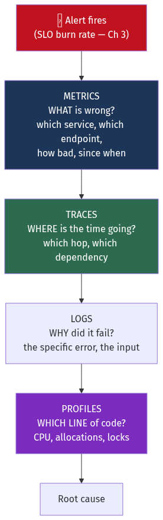
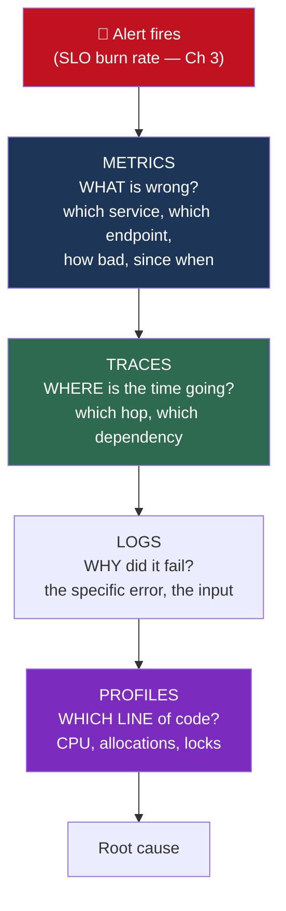

# Chapter 19 — Observability and Operations

[← Chapter 18](./18_security_and_identity.md) · [Contents](./README.md) · [Next: Chapter 20 →](./20_deployment_multiregion_dr_cost.md)

**Prerequisites:** [Chapter 3](./03_reliability_availability_performance.md) (SLIs, SLOs, error budgets, percentiles) — this chapter is its operational half.

---

## What you'll learn

- The difference between **monitoring** and **observability**, stated in a way that's actually useful rather than marketing
- The **four telemetry signals** and what each is uniquely good at
- **Prometheus' data model**, PromQL by example, and the **cardinality explosion** that takes down monitoring systems
- Why **you cannot average percentiles**, and what histograms do instead
- **RED, USE and the four golden signals** — three frameworks, applied to a real service
- **Distributed tracing**: context propagation, and why **tail-based sampling** exists
- **Multi-window burn-rate alerting** — the correct way to alert on an SLO
- **Incident response**: roles, severity levels, and a blameless postmortem that produces change
- A **worked debugging investigation** of a P99 spike, from alert to root cause

---

## Start from zero

Your service is slow. How do you find out why?

The naive approach is to add print statements. That works on your laptop with one request. In
production, with fifty instances handling ten thousand requests per second across twelve
services, it produces a firehose of text nobody can read.

So you need three different things, and they answer different questions:

**"How many, how fast, how often?"** — a **metric**. A number over time. Requests per second,
P99 latency, memory used. Cheap to store, cheap to query, and you can alert on it. But a metric
tells you *that* something is wrong, never *why*.

**"What exactly happened in this one case?"** — a **log**. A detailed record of one event.
Expensive to store, hard to aggregate, but it contains the specific detail.

**"Where did the time go in this one request?"** — a **trace**. The path of a single request
across every service it touched, with timings. This is the one that answers "which of the twelve
services was slow?".

⚠️ **The distinction people actually care about:**

**Monitoring** answers questions you thought of in advance. You built a dashboard for CPU, so
you can see CPU.

**Observability** is the property that you can answer questions you *didn't* think of in
advance, without shipping new code. "Is the latency spike specific to iOS users in Germany on
the new checkout flow?" — if you can answer that from data you already have, your system is
observable.

💡 **The practical implication is that observability is a design property, not a tool
purchase.** It comes from emitting high-cardinality, structured, correlated telemetry. Buying a
vendor's product and emitting the same three metrics gives you a more expensive dashboard.

---

## The mental model



<details>
<summary>Diagram source (Mermaid)</summary>



</details>

💡 **The signals form a funnel, and each narrows the search.** Metrics tell you *something* is
wrong across millions of requests. Traces narrow it to one hop. Logs narrow it to one error.
Profiles narrow it to one function. Skipping a level means searching a much larger space —
which is why "let's grep the logs" is such a slow way to start an investigation.

📐 **The cost gradient matters too:**
```
Metrics:  ~$0.01 per series per month     → keep everything, forever
Traces:   ~$1 per million spans           → sample
Logs:     ~$0.50 per GB ingested          → sample, and structure
Profiles: continuous, low overhead (~1%)  → keep everything
```

---

## Deep dive

### 19.1 Metrics

#### The four metric types

| Type | Behaviour | Example | ⚠️ |
| --- | --- | --- | --- |
| **Counter** | Only increases (resets to 0 on restart) | `http_requests_total` | Always use `rate()` — the raw value is meaningless |
| **Gauge** | Goes up and down | `memory_bytes`, `queue_depth` | Point-in-time; can miss spikes between scrapes |
| **Histogram** | ⭐ Bucketed distribution | `http_duration_seconds_bucket` | Percentiles computed **at query time** — aggregatable |
| **Summary** | Percentiles computed client-side | `http_duration_seconds{quantile="0.99"}` | ⚠️ **Cannot be aggregated across instances** |

#### 📐 Why you cannot average percentiles

This is the single most common monitoring error, and it's worth being precise about.

```
Instance A: P99 = 100 ms  (from 1,000 requests)
Instance B: P99 = 200 ms  (from 1,000,000 requests)

avg(P99) = 150 ms          ❌ MEANINGLESS
True combined P99 ≈ 200 ms  (B's requests dominate the distribution)
```

The percentile is a property of a **distribution**, not a number you can arithmetically combine.
You need the underlying distribution to recompute it.

**Histograms solve this** by storing bucket counts, which *are* additive:

```
http_duration_seconds_bucket{le="0.005"} 24054
http_duration_seconds_bucket{le="0.01"}  33444
http_duration_seconds_bucket{le="0.025"} 100392
http_duration_seconds_bucket{le="0.05"}  129389
http_duration_seconds_bucket{le="+Inf"}  144320
```

```promql
# Sum the buckets across instances FIRST, then compute the percentile.
histogram_quantile(0.99,
  sum by (le, service) (rate(http_duration_seconds_bucket[5m])))
```

⚠️ **Classic histograms have a precision limit.** `histogram_quantile` interpolates linearly
within a bucket, so if your P99 falls in the `[0.5, 1.0]` bucket, the answer is a guess anywhere
in that range. Choose buckets around your SLO threshold. **Native histograms** (Prometheus 2.40+)
use exponential buckets with automatic resolution and largely solve this.

#### ⚠️ Cardinality explosion

Every unique combination of label values is a separate **time series**, and each costs memory
and disk.

📐 **The multiplication:**
```
http_requests_total{
  method,        # 5 values
  status,        # 10 values
  endpoint,      # 50 values
  instance       # 100 values
}
= 5 × 10 × 50 × 100 = 250,000 series          ✅ manageable

Add ONE label:
  user_id        # 1,000,000 values
= 250,000,000,000 series                       ❌ your monitoring system is dead
```

**Never use as a label:** user ID, request ID, trace ID, email, session ID, full URL path with
IDs in it, timestamp, or any unbounded string.

💡 **Put high-cardinality data in traces and logs, where it belongs.** The whole reason those
signals exist is that metrics fundamentally cannot carry per-request identity. **Exemplars** are
the bridge: attach a trace ID to a histogram bucket sample, so a spike in the chart links
directly to an example trace.

⚠️ **`/api/users/12345` as a label value is the same mistake in disguise** — it's unbounded.
Normalise to `/api/users/{id}` in the instrumentation, not in the query.

📐 **The memory arithmetic:**
```
Prometheus: roughly 1-3 KB of RAM per active series
1,000,000 series ≈ 1-3 GB just for the series index
10,000,000 series ≈ 10-30 GB → most incidents are cardinality incidents
```

#### PromQL, by example

```promql
# Request rate per second, by endpoint
sum by (endpoint) (rate(http_requests_total[5m]))

# Error RATIO — always a ratio, never a raw count
sum(rate(http_requests_total{status=~"5.."}[5m]))
  / sum(rate(http_requests_total[5m]))

# P99 latency, aggregated correctly
histogram_quantile(0.99,
  sum by (le) (rate(http_duration_seconds_bucket[5m])))

# ⭐ Little's Law (Ch 2 §2.4) in PromQL — average concurrency
sum(rate(http_requests_total[5m]))
  * (sum(rate(http_duration_seconds_sum[5m]))
     / sum(rate(http_duration_seconds_count[5m])))

# Predict when a disk fills, from a 6-hour trend
predict_linear(node_filesystem_avail_bytes[6h], 4*3600) < 0

# ⚠️ Detect a counter reset / restart
resets(http_requests_total[1h]) > 0
```

⚠️ **`rate()` vs `irate()`:** `rate()` averages over the window and is what you want for alerts
and graphs. `irate()` uses only the last two samples — spiky, and it will trigger false alerts.
Use `rate()` unless you're deliberately looking at instantaneous behaviour.

⚠️ **The window must cover at least 4 scrape intervals.** `rate(x[15s])` with a 15-second scrape
interval has one sample and returns nothing. `rate(x[1m])` with a 15s interval is the minimum;
`[5m]` is the safe default.

**Recording rules** pre-compute expensive queries so dashboards and alerts are fast:
```yaml
groups:
  - name: slo
    interval: 30s
    rules:
      - record: job:http_error_ratio:rate5m
        expr: |
          sum by (job) (rate(http_requests_total{status=~"5.."}[5m]))
            / sum by (job) (rate(http_requests_total[5m]))
```

#### Pull vs push

| | **Pull** (Prometheus) | **Push** (StatsD, OTLP) |
| --- | --- | --- |
| Who initiates | The monitoring system scrapes | The app sends |
| Target discovery | ⭐ Service discovery; you know what *should* exist | Only what happens to report |
| Detecting a dead target | ✅ `up == 0` — a scrape failure **is** a signal | ⚠️ Silence is ambiguous |
| Short-lived jobs | ⚠️ Needs a Pushgateway | ✅ Natural |
| Through NAT/firewall | ⚠️ Needs reachability | ✅ Works |

💡 **Pull's underrated advantage is `up`.** With push, a service that stops reporting looks
identical to a service with no traffic. With pull, the scrape fails and you get an explicit
signal that the target is down.

### 19.2 The three frameworks

**RED — for request-driven services:**
```
Rate      — requests per second
Errors    — failed requests per second (or as a ratio)
Duration  — latency distribution
```

**USE — for resources** (Brendan Gregg):
```
Utilisation — % of time the resource was busy
Saturation  — ⭐ how much work is QUEUED
Errors      — error events
```

💡 **Saturation is the one people omit, and it's the leading indicator.** A CPU at 100%
utilisation with a run queue of 1 is fine; at 100% with a run queue of 40 it's a crisis. Disk
utilisation of 90% with a queue depth of 1 is fine; with a queue depth of 64 you're throttled.
**Utilisation tells you the resource is busy; saturation tells you it's overwhelmed.**

**The four golden signals** (Google SRE) — RED plus saturation:
```
Latency · Traffic · Errors · Saturation
```

📐 **Applied to one service:**

| Signal | Metric | Alert on |
| --- | --- | --- |
| Latency | `histogram_quantile(0.99, ...)` | SLO burn rate, not the raw value |
| Traffic | `sum(rate(http_requests_total[5m]))` | Anomalous drop (⚠️ often the first sign of an outage upstream) |
| Errors | 5xx ratio | SLO burn rate |
| Saturation | Connection pool in use / max; queue depth; CPU run queue | > 80% sustained |

⚠️ **Separate latency for successes and failures.** A service that fails fast has excellent P99
latency and is completely broken. Measuring them together hides it.

### 19.3 Logging

**Structured, always:**
```json
{"ts":"2026-08-31T14:23:45.123Z","level":"error","service":"payment-api",
 "trace_id":"4bf92f3577b34da6a3ce929d0e0e4736","span_id":"00f067aa0ba902b7",
 "user_id":"u_8271","order_id":"ord_9982","event":"charge_failed",
 "error":"card_declined","decline_code":"insufficient_funds","duration_ms":234}
```

⚠️ **The `trace_id` is the most valuable field in that line.** Without it, a log entry is an
isolated fact. With it, you can pivot instantly to the full distributed trace and see every
other service involved in that request.

**Log levels, used consistently:**

| Level | Meaning | Volume |
| --- | --- | --- |
| `ERROR` | ⭐ Something needs human attention | Should be low enough to read |
| `WARN` | Unexpected but handled | Moderate |
| `INFO` | Notable business events | High |
| `DEBUG` | Diagnostic detail | ⚠️ Off in production, or sampled |

⚠️ **If `ERROR` is noisy, it stops meaning anything.** A validation failure from a client is not
an error in *your* system — it's expected behaviour, and logging it at ERROR trains everyone to
ignore the level.

📐 **Log volume and cost:**
```
10,000 req/s × 2 KB per log line = 20 MB/s = 1.7 TB/day
At ~$0.50/GB ingested: ~$850/day = $310,000/year

⚠️ Frequently the observability bill exceeds the compute bill.
```

**Reducing it without losing value:**

| Technique | Effect |
| --- | --- |
| **Sample successes, keep all errors** | ⭐ 1% of successes + 100% of errors ≈ 99% cost reduction, near-zero information loss |
| Structured over free text | Compresses better; queryable without regex |
| Shorter retention for high-volume, low-value | Access logs 7 days, audit logs 7 years |
| Metrics instead of logs for counting | Don't log every request to count them |
| ⭐ **Trace-based sampling** | Keep all logs for sampled traces — coherent, not random |

⚠️ **Never log:** passwords, tokens, session IDs, full card numbers, personal data. Your logs
have wider access than your database and are shipped to third parties — they become the breach
([Chapter 18](./18_security_and_identity.md)).

### 19.4 Distributed tracing

A **trace** is a tree of **spans**, each representing one operation.

```
Trace 4bf92f35... (total 847 ms)
├─ api-gateway            [====================================] 847 ms
│  ├─ auth-service        [==]                                    12 ms
│  ├─ order-service       [==============================]       612 ms
│  │  ├─ postgres:SELECT  [=]                                       8 ms
│  │  ├─ inventory-svc    [====]                                   45 ms
│  │  └─ payment-svc      [========================]              540 ms  ⚠️
│  │     └─ stripe-api    [=======================]               521 ms  ⚠️ HERE
│  └─ notification-svc    [=]                                       9 ms
```
💡 **This is what makes tracing irreplaceable.** In one view you can see that 521 of 847
milliseconds are an external API call. No metric or log tells you that; you'd be guessing across
five services.

#### Context propagation

```http
traceparent: 00-4bf92f3577b34da6a3ce929d0e0e4736-00f067aa0ba902b7-01
             │  └── trace ID (16 bytes) ──┘ └─ parent span ─┘ └ flags
             └ version
```
The **W3C Trace Context** standard means a Go service, a Java service and an nginx proxy all
propagate the same header.

⚠️ **Propagation breaks at asynchronous boundaries and you must fix it explicitly.** When a
request publishes to Kafka and a consumer picks it up minutes later, the trace context has to
travel **in the message headers** or the trace ends at the producer. Same for thread pools, job
queues and callbacks. This is the most common cause of "our traces are incomplete".

#### Sampling

📐 **You cannot store every span.** At 10,000 req/s with 20 spans each, that's 200,000 spans per
second — roughly 17 billion a day.

| Strategy | How | ⚠️ |
| --- | --- | --- |
| **Head-based** | Decide at the root, propagate the decision | Simple, but you decide **before** knowing if the request was interesting |
| **Tail-based** | ⭐ Buffer the whole trace, then decide | Keeps **all errors and all slow traces** |
| Rate-limiting | N traces/second per service | Predictable cost |
| Adaptive | Higher rate for rare endpoints | Rare paths stay visible |

💡 **Tail-based sampling is what you want**, because the interesting traces are the anomalous
ones and head-based sampling keeps a random 1% — which by definition mostly misses them.

```yaml
# OpenTelemetry Collector — tail sampling
processors:
  tail_sampling:
    decision_wait: 10s
    policies:
      - { name: errors,      type: status_code, status_code: {status_codes: [ERROR]} }
      - { name: slow,        type: latency,     latency: {threshold_ms: 500} }
      - { name: baseline,    type: probabilistic, probabilistic: {sampling_percentage: 1} }
```
⚠️ **Tail sampling requires buffering complete traces**, so all spans of a trace must reach the
same collector instance — which means a load-balancing exporter keyed on trace ID in front of the
collector fleet.

### 19.5 Continuous profiling

The fourth signal, and the newest. Traces tell you *which service*; profiles tell you *which
line*.

```
CPU profile of payment-service (last 5 minutes):
  47%  encoding/json.Marshal          ← ⚠️ serialisation dominating
  18%  crypto/tls.(*Conn).Write
  12%  database/sql.(*Rows).Scan
   8%  runtime.mallocgc               ← allocation pressure
```

**Profile types and what each finds:**

| Type | Finds |
| --- | --- |
| **CPU** | Hot functions |
| **Heap / allocations** | ⭐ Memory leaks and allocation churn driving GC |
| **Goroutine / thread** | Leaked goroutines, blocked threads |
| **Mutex / block** | ⭐ Lock contention — invisible in CPU profiles |
| **Off-CPU** | Time spent waiting rather than computing |

💡 **Continuous profiling (Pyroscope, Parca, Datadog, Cloud Profiler) samples at ~1% overhead
and stores it**, which means you can profile an incident **after it ends**. That's the key
advantage — traditionally you had to reproduce a problem to profile it, and the interesting
problems are exactly the ones that don't reproduce.

⚠️ **Mutex contention is invisible in a CPU profile.** A thread blocked on a lock isn't
consuming CPU, so the CPU profile looks idle while throughput collapses. If CPU is low and
latency is high, look at the block and mutex profiles.

### 19.6 SLO-based alerting

From [Chapter 3](./03_reliability_availability_performance.md) §3.8: alert on **burn rate**,
not on raw thresholds.

📐 **Burn rate = observed error rate ÷ budgeted error rate.**

```
SLO: 99.9% → error budget 0.1%
Observed error rate: 1.44%
Burn rate = 0.0144 / 0.001 = 14.4×
→ A 30-day budget will be exhausted in 30/14.4 = 2.1 days
```

**Multi-window, multi-burn-rate alerting:**

| Burn rate | Budget gone in | Long window | Short window | Action |
| --- | --- | --- | --- | --- |
| 14.4× | 2 days | 1 hour | 5 min | 🔴 **Page** |
| 6× | 5 days | 6 hours | 30 min | 🔴 Page |
| 3× | 10 days | 1 day | 2 hours | 🟡 Ticket |
| 1× | 30 days | 3 days | 6 hours | 🟡 Ticket |

```yaml
- alert: ErrorBudgetBurnFast
  expr: |
    (job:http_error_ratio:rate1h  > 14.4 * 0.001)
      and
    (job:http_error_ratio:rate5m  > 14.4 * 0.001)
  for: 2m
  labels: { severity: page }
```

💡 **Why two windows.** The long window is the signal; the **short window makes the alert
resolve quickly**. Without it, a five-minute incident keeps a one-hour alert firing for a full
hour after it's over, which trains people to ignore alerts.

#### Alerting philosophy

| ✅ Alert on | ❌ Don't alert on |
| --- | --- |
| **Symptoms** users experience | Causes that may be harmless |
| SLO burn rate | "CPU > 80%" |
| Error ratio, latency, queue growth | Individual pod restarts |
| Capacity trends (disk full in 4 h) | Every anomaly |

⚠️ **Every page must be actionable, urgent and user-visible.** If the answer is "acknowledge and
go back to sleep", it should have been a ticket. **Alert fatigue is the primary failure mode of
monitoring** — a team receiving 50 pages a week stops reading them, and the one that mattered is
missed.

📐 **A useful audit:** for each alert over the last quarter, ask "did a human take action?" If
under ~50% did, the alert is noise and should be deleted or downgraded.

### 19.7 Incident response

**Severity levels, defined in advance:**

| Sev | Definition | Response |
| --- | --- | --- |
| **SEV1** | Total outage or data loss | Page immediately, all hands, exec comms |
| **SEV2** | Major degradation, significant user impact | Page, dedicated responders |
| **SEV3** | Minor degradation, workaround exists | Business hours |
| **SEV4** | Cosmetic or internal | Backlog |

**Roles — separated because one person cannot do all three:**

| Role | Does | ⚠️ Does **not** |
| --- | --- | --- |
| **Incident Commander** | Coordinates, decides, delegates | ⚠️ Debug. The IC must stay out of the terminal. |
| **Operations lead** | Investigates and applies fixes | Communicate externally |
| **Communications lead** | Status page, stakeholders, support | Debug |
| **Scribe** | Timeline of actions and findings | Anything else |

💡 **The IC not debugging is the rule most often broken and most important.** Someone with their
head in a terminal cannot simultaneously track what's been tried, decide whether to roll back,
and manage the flow of people asking questions. In a small team the IC may also be the scribe;
they must not be the operator.

**The response sequence:**
```
1. DETECT     — alert fires (or a human notices, which is a monitoring gap)
2. TRIAGE     — how bad? assign severity, appoint an IC
3. MITIGATE   — ⭐ STOP THE BLEEDING FIRST. Root cause comes later.
                roll back · fail over · disable the feature · shed load
4. INVESTIGATE— now find out why
5. RESOLVE    — permanent fix
6. LEARN      — blameless postmortem
```

⚠️ **Step 3 before step 4, always.** The instinct to understand before acting is correct in
engineering and wrong in an incident. If a deploy went out ten minutes ago, **roll it back
before diagnosing it** — you can investigate the artifact at leisure once users are served.

**The mitigations that work, in order of speed:**
```
Roll back the deploy      seconds  ⭐ the highest-value action, and the most under-used
Fail over to a replica    seconds
Disable via feature flag  seconds
Scale up                  minutes
Shed load                 seconds
Fix forward               ⚠️ SLOWEST — do this only when rollback is impossible
```

### 19.8 Blameless postmortems

📐 **The premise: humans acting reasonably on the information available do not cause outages —
systems that permit a reasonable action to cause an outage do.**

"Engineer ran the wrong command" is not a root cause. The questions are: why was the command
available? why did it not require confirmation? why did nothing catch it before production? why
did it take 40 minutes to detect?

**A postmortem that produces change:**

```markdown
## Summary
One paragraph: what broke, for whom, for how long, why.

## Impact
- Duration: 14:23–15:07 UTC (44 min)
- Users affected: ~340,000 (23% of active)
- Error budget consumed: 61% of the monthly budget
- Revenue impact: estimated £48,000

## Timeline (all UTC)
14:18  Deploy of order-service v2.4.1 begins
14:23  Error rate crosses 5%; burn-rate alert fires
14:26  On-call acknowledges
14:31  IC appointed; SEV2 declared
14:38  ⚠️ Root cause hypothesis #1 (database) — INCORRECT, cost 12 min
14:52  Deploy correlation identified in the change log
14:55  Rollback initiated
15:07  Error rate normal

## Root causes (plural — usually there are several)
1. A migration added a NOT NULL column without a default; old pods crashed on write
2. Canary ran for 5 min at 5% — not long enough to exceed the alert threshold
3. No automated rollback on error-rate regression

## What went well
- Burn-rate alert fired within 5 min of impact
- Rollback took 12 min once identified

## What went badly
- ⚠️ 29 minutes from alert to rollback — 12 of them on a wrong hypothesis
- No link from the alert to recent deploys

## Action items          ⚠️ each with an OWNER and a DATE
| # | Action | Owner | Due | Status |
|---|--------|-------|-----|--------|
| 1 | Automated rollback on error-rate regression during canary | @alice | 2026-09-15 | Open |
| 2 | Canary duration 5 → 20 min | @bob | 2026-09-05 | Open |
| 3 | Show recent deploys in the alert payload | @carol | 2026-09-10 | Open |
| 4 | Lint rule: NOT NULL requires a default | @dave | 2026-09-20 | Open |
```

⚠️ **A postmortem without owned, dated action items is a diary entry.** The output of an
incident is a change to the system, not a document. Track completion — an organisation with 60%
of postmortem actions still open a year later will have the same incident again.

💡 **Note item 3.** "Show recent deploys in the alert" addresses the 12 minutes lost on a wrong
hypothesis — an **observability** fix, not a reliability one. The fastest available improvement
to MTTR is usually reducing MTTD and MTTU (time to *understand*), not making the system fail
less.

### 19.9 Chaos engineering

⚠️ **Untested failover does not work.** The only way to know your redundancy functions is to
exercise it deliberately, in controlled conditions, rather than discovering it at 3 a.m.

```
1. Define steady state         — "checkout success rate > 99.5%"
2. Hypothesise                 — "killing one AZ will not affect it"
3. Introduce the fault         — smallest blast radius first
4. Measure                     — was the hypothesis right?
5. ⭐ Have an abort button      — stop the experiment instantly
```

**A progression, smallest first:**
```
Kill one pod              → does the replica set recover?
Kill a whole AZ           → does topology spread hold? (Ch 17 §17.8)
Add 200 ms latency to a dependency → do timeouts and circuit breakers work?
Fail a dependency entirely→ does the fallback engage? (Ch 16 §16.7)
Exhaust a connection pool → does the bulkhead contain it?
Fill a disk               → does the alert fire before it's full?
Expire a certificate      → do you find out before customers do?
```

⚠️ **Start in staging, then production during business hours with everyone watching.** Chaos
experiments at 2 a.m. on a Friday are not chaos engineering; they're an outage you scheduled.

💡 **The value is often in the surprises rather than the confirmations.** Teams routinely
discover that a "non-critical" dependency is actually on the synchronous path, or that a
fallback path has never executed and is broken.

---

## Worked example — investigating a P99 spike

*Alert: `ErrorBudgetBurnFast` on `checkout-service`. P99 latency has gone from 180 ms to
2,400 ms. Error rate is 3%. Walk the investigation.*

**Step 0 — Mitigate first.**
```
Was anything deployed in the last hour?
  → checkout-service v3.2.0 deployed 40 minutes ago.
⚠️ ROLL BACK NOW. Investigate afterwards.

...rollback completes. P99 → 900 ms. Errors → 0.4%.
⚠️ BETTER, BUT NOT FIXED. So the deploy was a contributing factor, not the whole cause.
```
💡 **This is a common and important outcome.** The rollback bought time and reduced impact; it
didn't resolve it. Now investigate properly rather than assuming you're done.

**Step 1 — Metrics: what and where?**

```promql
# Is it all endpoints or one?
histogram_quantile(0.99,
  sum by (le, endpoint) (rate(http_duration_seconds_bucket{service="checkout"}[5m])))
→ /checkout/submit  P99 2,400 ms   ⚠️
→ /checkout/cart    P99   150 ms   ✅ normal
→ /checkout/validate P99  140 ms   ✅ normal

# All instances or some?
histogram_quantile(0.99,
  sum by (le, instance) (rate(http_duration_seconds_bucket{endpoint="/checkout/submit"}[5m])))
→ ⚠️ ALL 40 instances affected equally
```
📐 **Two conclusions immediately.** One endpoint means it isn't a host, node or network problem —
those would affect everything on the instance. All instances equally means it isn't a single bad
pod; it's something **shared** — a downstream dependency, a database, or a shared cache.

**Step 2 — Saturation: are we resource-bound?**
```promql
rate(container_cpu_usage_seconds_total{service="checkout"}[5m])    → 35%  ✅
container_memory_working_set_bytes / container_spec_memory_limit   → 61%  ✅
sum(pg_pool_connections_in_use) / sum(pg_pool_connections_max)     → 98%  ⚠️⚠️
```
💡 **Connection pool saturation at 98%.** But per [Chapter 2](./02_scalability_and_estimation.md)
§2.4, that's usually a *symptom*: requests holding connections longer than expected. **Something
downstream is slow and connections are queueing behind it.** Don't just raise the pool size —
that would hide the cause and move the queue.

**Step 3 — Traces: where is the time going?**

Query traces for `/checkout/submit` with duration > 2 s:
```
checkout-service /checkout/submit            [==========================] 2,380 ms
├─ validate-cart                             [=]                             18 ms
├─ inventory-service.Reserve                 [=]                             22 ms
├─ pricing-service.Calculate                 [========================]   2,180 ms  ⚠️⚠️
│  └─ redis.GET pricing:rules:v2             [=======================]     2,150 ms  ⚠️
└─ payment-service.Authorize                 [=]                            140 ms
```
📐 **A Redis GET taking 2,150 ms.** Redis operations are microseconds. This is the answer to
"where", and it reframes the whole investigation.

**Step 4 — Why is Redis slow?**
```promql
redis_commands_duration_seconds{quantile="0.99"}  → 8 ms      ⚠️ high but not 2,150
redis_connected_clients                            → 4,200
redis_blocked_clients                              → 0
redis_memory_used_bytes / redis_maxmemory          → 94%       ⚠️
rate(redis_evicted_keys_total[5m])                 → 12,000/s  ⚠️⚠️
rate(redis_keyspace_misses_total[5m])
  / rate(redis_keyspace_hits_total[5m])            → 0.62      ⚠️⚠️ 62% MISS RATE
```

💡 **Now it connects.** Redis is at 94% of `maxmemory` and evicting 12,000 keys/second, so the
hit rate has collapsed from ~99% to 38%. Every miss falls through to a database query — and the
2,150 ms isn't Redis being slow, it's the **client-side wait for a connection plus the fallback
path**, all attributed to that span because the instrumentation wraps the cache-aside function.

📐 **The [Chapter 11](./11_caching_cdn_and_edge.md) §11.1 arithmetic, exactly as predicted:**
```
Hit rate 99% → 1% of traffic reaches the database
Hit rate 38% → 62% of traffic reaches the database
= a 62× increase in database load from a cache capacity problem
```

**Step 5 — Why did Redis fill up?**
```promql
# Sudden growth, or gradual?
redis_memory_used_bytes[7d]
→ steady at 61% for 6 days, then a step change to 94% 40 minutes ago.
```
**40 minutes ago is when v3.2.0 deployed.** The rollback reduced the *rate* of the problem but
did not reclaim the memory — which is exactly why P99 improved from 2,400 ms to 900 ms rather
than recovering fully.

**Step 6 — Logs: what did the new version write?**
```
Filter logs to trace IDs from slow requests, service=checkout, deploy=v3.2.0:

{"event":"cache_set","key":"pricing:rules:v2:user:u_8271:session:s_9982:...",
 "ttl_seconds":86400,"size_bytes":48200}
```
⚠️ **Two bugs visible in one line.**
1. The cache key includes **user ID and session ID** — so instead of one shared entry for the
   pricing rules, there is now **one entry per user per session**. Cardinality explosion applied
   to a cache.
2. The TTL is **86,400 seconds** (24 hours) for what is session-scoped data.

📐 **The arithmetic:**
```
Before: 1 shared key × 48 KB               = 48 KB
After:  200,000 active sessions × 48 KB    = 9.6 GB, held for 24 hours
Redis maxmemory: 10 GB
→ Fills in ~40 minutes and begins evicting everything else.
```

**Step 7 — Root causes.** There are four, and only the first is "the bug".

```
1. v3.2.0 changed the pricing cache key to include user and session identifiers
2. TTL of 24 hours on session-scoped data compounded it
3. ⚠️ No alert on Redis memory utilisation or eviction rate — we discovered
   this from a latency symptom, not from the cause
4. ⚠️ Rolling back the deploy did not reclaim the memory, so recovery was partial
   and the rollback appeared not to work
```

**Step 8 — Mitigate fully.**
```
1. FLUSH the affected key prefix (not FLUSHALL — that would stampede the DB)
   → hit rate recovers, P99 → 180 ms ✅
2. Confirm eviction rate → 0
```

**Step 9 — Action items.**

| # | Action | Type | Owner |
| --- | --- | --- | --- |
| 1 | Alert on Redis `memory_used/maxmemory > 80%` and on eviction rate > 0 | **Detection** | @alice |
| 2 | Alert on cache hit-rate drop > 10 points | **Detection** | @alice |
| 3 | Code review checklist: cache keys must not contain unbounded identifiers | Prevention | @bob |
| 4 | TTL upper bound enforced in the cache client wrapper | Prevention | @bob |
| 5 | Runbook: how to selectively flush a key prefix | **Recovery** | @carol |
| 6 | Canary must run 20 min and include cache-metric checks | Prevention | @dave |

💡 **Note that items 1, 2 and 5 are observability and recovery, not reliability.** The bug would
have been caught in minutes rather than found through a latency investigation. Reducing **time
to understand** is usually the cheapest available MTTR improvement.

**Step 10 — The signals, in the order they were used.**

| Signal | Told us |
| --- | --- |
| **Alert (SLO burn rate)** | Something is wrong, and how urgently |
| **Metrics** | *Which* endpoint, all instances → a shared dependency |
| **Metrics (saturation)** | Connection pool exhausted — a symptom, not the cause |
| **Traces** | *Where* — a Redis call in pricing-service |
| **Metrics (Redis)** | *Why* — memory full, evictions, hit rate collapsed |
| **Metrics (time series)** | *When* — correlated with the deploy |
| **Logs** | *What exactly* — the cache key and TTL |

📐 **This is the funnel from §19.0 working as designed.** Each signal narrowed the search space
by roughly an order of magnitude. Starting with logs would have meant searching 1.7 TB of text
with no idea what to look for.

---

## Trade-offs

| Decision | Option A | Option B | Choose A when | Never choose A when |
| --- | --- | --- | --- | --- |
| Metric type | Summary | **Histogram** | Single instance only | Multiple instances — summaries can't aggregate |
| Percentiles | Compute per instance, average | Aggregate buckets, then compute | ⚠️ Never | Always B — averaging percentiles is meaningless |
| Collection | Push | **Pull** | Short-lived jobs, NAT traversal | You need to detect dead targets (`up == 0`) |
| Trace sampling | Head-based | **Tail-based** | Simplicity, no collector fleet | You care about errors and slow requests — head-based misses them |
| Log level in prod | DEBUG | INFO + sampled DEBUG | Actively debugging | Steady state — cost and noise |
| Log sampling | Keep everything | Sample successes, keep all errors | Regulatory requirement | Prefer B — ~99% cost cut, near-zero loss |
| Alerting | Threshold on a resource | **SLO burn rate** | Capacity trends (disk full) | User-facing symptoms — thresholds are noisy |
| Alert windows | Single window | **Multi-window** | Never | Always B — the short window makes it resolve |
| Cardinality | Rich labels | Bounded labels + exemplars | ⚠️ Never | Always B — put identity in traces |
| Incident priority | Find root cause | **Mitigate first** | Never | Always B — roll back, then investigate |
| Postmortem | Identify who | **Identify what enabled it** | ⚠️ Never | Always B — blame stops information flowing |

---

## How real companies do it

**Google's SRE books** are the origin of most of this vocabulary — error budgets, the four
golden signals, multi-window burn-rate alerting, and blameless postmortems. The specific
contribution worth internalising is the argument that **100% reliability is the wrong target**,
because the marginal cost of the last nine exceeds its value and users can't perceive it anyway.

**Honeycomb** made the strongest case for **high-cardinality, high-dimensionality events** over
pre-aggregated metrics. Their argument: metrics force you to decide in advance which dimensions
matter, so you can only answer questions you anticipated. Wide events let you ask "was it iOS
users in Germany on the new build?" after the fact. Charity Majors' writing is the clearest
statement of what observability means as distinct from monitoring.

**Netflix's Chaos Monkey** and the broader Simian Army operationalised the insight that
**untested failover doesn't work**. Randomly terminating instances continuously means you cannot
accumulate hidden single points of failure — they surface immediately, during business hours,
rather than during an incident.

**Cloudflare** publishes unusually detailed and prompt post-incident analyses, including ones
where their own tooling was the cause. They're worth reading as models of the blameless format
applied at scale, with genuine technical depth rather than corporate summary.

**Twitter/X's Zipkin** and **Uber's Jaeger** are the open-source implementations that made
distributed tracing mainstream, both derived from Google's **Dapper** paper. The industry has now
largely converged on **OpenTelemetry** for instrumentation, which decouples the code you write
from the backend you send it to — a genuinely valuable standardisation.

---

## Common mistakes

**Averaging percentiles.** `avg(P99)` across instances is meaningless. Aggregate histogram
buckets, then compute.

**Using summaries instead of histograms.** Summaries compute quantiles client-side and cannot be
aggregated across instances.

**High-cardinality metric labels.** User ID or request ID as a label multiplies your series count
by millions and kills the monitoring system. Use exemplars to link to traces instead.

**Alerting on causes rather than symptoms.** "CPU > 80%" pages someone for a condition that may
be entirely fine. Alert on SLO burn rate.

**Single-window alerts.** A five-minute incident keeps a one-hour alert firing for an hour after
it's over.

**Not separating success and failure latency.** A service failing fast has excellent P99 and is
completely broken.

**`irate()` in alerts.** It uses only the last two samples and produces spiky false positives.
Use `rate()`.

**Rate windows shorter than 4 scrape intervals.** `rate(x[15s])` with a 15s scrape returns
nothing.

**Head-based trace sampling.** Keeps a random 1%, which by definition mostly misses the errors
and slow requests you need.

**Losing trace context at async boundaries.** Publishing to a queue without propagating
`traceparent` in the message headers truncates every trace at the producer.

**Unstructured logs.** Not queryable without regex, compress badly, and can't be correlated.

**No `trace_id` in logs.** Each log line is an isolated fact with no way to pivot to the
distributed context.

**Logging secrets or PII.** Logs have broader access than your database and go to third parties.

**Debugging before mitigating.** If a deploy went out ten minutes ago, roll it back first.

**The Incident Commander also debugging.** Nobody is then coordinating, tracking or deciding.

**Postmortems that name a person.** Blame stops information flowing, and the next person hides
the near-miss.

**Postmortems without owned, dated action items.** A diary entry. The output of an incident is a
change to the system.

**Alert fatigue.** 50 pages a week means nobody reads them. Audit whether each alert produced
action; delete the ones that didn't.

---

## Interview angle

**Q: What's the difference between monitoring and observability?**

*Strong:* "**Monitoring answers questions you thought of in advance; observability lets you
answer ones you didn't.** If you built a CPU dashboard, you can see CPU — that's monitoring. If
someone asks 'is the latency spike specific to iOS users in Germany on the new checkout flow?'
and you can answer it from data you already have without shipping code, that's observability.
The practical implication is that it's a **design property, not a tool purchase** — it comes from
emitting structured, correlated, high-cardinality telemetry. Buying a vendor product and emitting
the same three metrics gives you a more expensive dashboard. Concretely it means the four signals
working together: metrics tell you *what* is wrong across millions of requests, traces tell you
*where* the time went in one request, logs tell you *why* it failed, and profiles tell you *which
line*. They form a funnel, and each narrows the search by roughly an order of magnitude — which
is why starting an investigation by grepping logs is so slow."

**Q: Why can't you average P99 latencies from ten servers?**

*Strong:* "Because a percentile is a property of a **distribution**, not a value you can
arithmetically combine. If instance A has a P99 of 100 ms from a thousand requests and instance B
has 200 ms from a million, the average is 150 ms but the true combined P99 is close to 200 ms,
because B's requests dominate the merged distribution. The fix is to store **histograms** — bucket
counts, which *are* additive. You sum the buckets across instances first, then compute the
quantile: `histogram_quantile(0.99, sum by (le) (rate(bucket[5m])))`. That's also why you should
use histograms rather than summaries, because summaries compute the quantile client-side and the
result can't be aggregated at all. One caveat: classic histograms interpolate within a bucket, so
your precision depends on bucket boundaries — put them around your SLO threshold, or use native
histograms which handle resolution automatically."

**Q: Your monitoring system fell over. What's the most likely cause?**

*Strong:* "**Cardinality explosion.** Every unique combination of label values is a separate time
series, and each costs a couple of kilobytes of RAM in the index. If someone adds a label like
`user_id` or `request_id` or an unnormalised URL path with IDs in it, you go from a few hundred
thousand series to hundreds of millions overnight, and Prometheus OOMs. The arithmetic is
multiplicative — five methods times ten statuses times fifty endpoints times a hundred instances
is 250,000 series, which is fine; multiply by a million users and it isn't. The rule is that
**metric labels must be bounded**, so normalise `/api/users/12345` to `/api/users/{id}` in the
instrumentation. High-cardinality data belongs in traces and logs, and **exemplars** are the
bridge — attach a trace ID to a histogram sample so a spike in the graph links straight to an
example trace. That gives you the drill-down without paying for it in the metrics store."

**Q: How would you alert on an SLO?**

*Strong:* "On **burn rate**, using **multiple windows**. Burn rate is your observed error rate
divided by your budgeted error rate — so at a 99.9% SLO the budget is 0.1%, and if you're seeing
1.44% errors that's a burn rate of 14.4×, which exhausts a thirty-day budget in about two days.
I'd configure a tiered set: 14.4× over one hour pages, 6× over six hours pages, 3× over a day
tickets, 1× over three days tickets. The reason for **two windows per tier** — say one hour and
five minutes for the fast one — is that the long window is the signal but the short window makes
the alert **resolve quickly**. Without it, a five-minute incident keeps a one-hour alert firing
for an hour afterwards, and that's how you train a team to ignore alerts. The broader principle
is **alert on symptoms, not causes**: 'CPU above 80%' might be completely fine, whereas 'we're
burning error budget fourteen times faster than sustainable' is always worth waking someone for.
And I'd audit alerts quarterly — if fewer than half of a given alert's firings produced human
action, it's noise and should be deleted or downgraded."

**Q: Walk me through debugging a P99 latency spike.**

*Strong:* "First, **mitigate before investigating**. If something deployed in the last hour, roll
it back immediately — you can analyse the artifact once users are being served. Then the funnel.
**Metrics** to scope it: is it one endpoint or all of them, one instance or all of them? One
endpoint across all instances rules out a host or network problem and points at something shared —
a downstream service, a database, a cache. Then check **saturation**, not just utilisation:
connection pool in use over max, queue depth, run queue length — and remember that pool exhaustion
is usually a *symptom* of something downstream being slow, so raising the pool size just moves the
queue. Then **traces** for the slow requests specifically, which shows exactly which span is
consuming the time — that's the step no metric or log gives you. Then **metrics for that
dependency** to find out why. Then **logs filtered by the trace IDs of slow requests** for the
specific detail. And **profiles** if it turns out to be in-process, remembering that lock
contention is invisible in a CPU profile — low CPU with high latency means look at the block and
mutex profiles."

**Q: How do you run an incident?**

*Strong:* "Separate the roles, and **mitigate before diagnosing**. The **Incident Commander**
coordinates and decides and — critically — **does not debug**. That's the rule most often broken:
someone with their head in a terminal can't simultaneously track what's been tried, decide whether
to roll back, and handle people asking for updates. Then an **operations lead** who investigates
and applies fixes, a **communications lead** for the status page and stakeholders, and a
**scribe** keeping a timeline. In a small team the IC can also scribe, but never operate. The
sequence is detect, triage and assign severity, **mitigate**, then investigate, then resolve, then
learn. Mitigation before root cause is counter-intuitive for engineers but correct — roll back,
fail over, disable the feature flag, shed load. Rollback in particular is the highest-value and
most under-used action. Then a **blameless postmortem**: the premise is that people acting
reasonably on the information they had don't cause outages, systems that let a reasonable action
cause an outage do. So 'engineer ran the wrong command' isn't a root cause — the questions are why
the command was available, why it had no confirmation, why nothing caught it before production,
and why detection took forty minutes. And every action item needs an **owner and a date**, tracked
to completion, or the postmortem is a diary entry and you'll have the same incident again."

---

## Recap

- **Monitoring answers questions you anticipated; observability answers the ones you didn't.**
  It's a design property, not a purchase.
- **The four signals form a funnel:** metrics (*what*) → traces (*where*) → logs (*why*) →
  profiles (*which line*). Each narrows the search by an order of magnitude.
- ⚠️ **You cannot average percentiles.** Aggregate histogram buckets, then compute. Never use
  summaries across instances.
- ⚠️ **Cardinality explosion is the leading cause of monitoring outages.** Bounded labels only;
  put identity in traces, and link with **exemplars**.
- **Pull beats push for one specific reason:** `up == 0` distinguishes "dead" from "no traffic".
- **USE's saturation is the leading indicator** — utilisation says busy, saturation says
  overwhelmed.
- **Structured logs with a `trace_id`.** Sample successes, keep all errors — ~99% cost reduction
  for near-zero information loss.
- ⚠️ **Trace context must be propagated across async boundaries** or every trace truncates at the
  producer.
- **Tail-based sampling** keeps errors and slow traces; head-based keeps a random 1% and misses
  them.
- **Alert on SLO burn rate, multi-window.** The short window is what makes the alert resolve.
- ⚠️ **Mitigate before diagnosing.** Roll back first, investigate after.
- **The Incident Commander must not debug.**
- **Blameless postmortems with owned, dated action items** — and the cheapest MTTR improvement is
  usually reducing time-to-*understand*, not making the system fail less.

---

## Test yourself

1. Three instances report P99 latencies of 50 ms, 80 ms and 400 ms. What is the fleet P99, and
   what do you need to compute it properly?
2. Your Prometheus is using 40 GB of RAM and OOMing. Give the most likely cause and how you'd
   confirm it in one query.
3. `rate(http_requests_total[30s])` returns no data with a 30-second scrape interval. Why?
4. Your P99 latency looks excellent but users complain. Give two explanations.
5. Traces for requests that go through a Kafka topic always end at the producer. What's wrong?
6. You sample traces at 1% head-based. An engineer says "we never see the failures in traces".
   Explain and fix.
7. Write the burn-rate condition for a 99.95% SLO that would exhaust the monthly budget in 3 days.
8. Your service has 0.1% errors but CPU is at 20% and latency is fine. Should you page someone?
9. During an incident, the on-call engineer spends 25 minutes finding the root cause before
   acting. Critique this.
10. A postmortem concludes: "root cause: engineer deployed untested code." What's wrong and what
    should it say?

<details>
<summary>Answers</summary>

1. **You cannot compute it from those three numbers.** The fleet P99 depends on the *volume* and
   *shape* of each instance's distribution. If the 400 ms instance handled 1% of traffic, the
   fleet P99 might be around 90 ms; if it handled 60%, it's close to 400 ms. Averaging gives
   177 ms, which corresponds to nothing.
   **What you need: the underlying histograms.** Store `histogram_bucket` counts per instance —
   which are additive — sum them across instances, and *then* compute the quantile:
   `histogram_quantile(0.99, sum by (le) (rate(http_duration_seconds_bucket[5m])))`. This is also
   why Prometheus summaries are unsuitable for multi-instance services: they compute the quantile
   client-side and expose only the result, which can't be recombined.

2. **Cardinality explosion** — almost certainly a label with unbounded values (`user_id`,
   `request_id`, `trace_id`, an email, or an unnormalised URL path containing IDs). At roughly
   1–3 KB per active series, 40 GB implies somewhere in the region of 15–40 million series.
   **Confirm with:**
   ```promql
   topk(10, count by (__name__)({__name__=~".+"}))
   ```
   which shows which metric names have the most series. Then for the offending metric, check
   which label is responsible:
   ```promql
   count(count by (suspect_label) (metric_name))
   ```
   Also useful: Prometheus' own `/status/tsdb` page lists the highest-cardinality label values
   directly. **Fix:** drop or normalise the label via `metric_relabel_configs` at scrape time,
   fix the instrumentation, and move the identity into traces with an exemplar linking them.

3. `rate()` needs **at least two samples** in the window to compute a difference, and in practice
   Prometheus requires the window to comfortably span multiple scrape intervals to be reliable. A
   30-second window with a 30-second scrape interval contains at most one or two samples, and
   with any jitter or a single missed scrape it contains one — so `rate()` has nothing to
   differentiate and returns empty.
   **Rule: the range window should be at least 4× the scrape interval.** With 30-second scrapes,
   use `[2m]` at minimum; `[5m]` is the conventional safe default and smooths over a missed
   scrape without hiding real changes.

4. (a) **You're measuring the wrong thing.** Server-side latency excludes DNS resolution, TCP and
   TLS handshakes, network transit, and client-side rendering. A server-side P99 of 50 ms can sit
   underneath a user-perceived 3 seconds — measure at the load balancer or, better, with real
   user monitoring from the client.
   (b) **You're mixing successes and failures.** A service that fails fast has excellent latency
   — a 500 returned in 2 ms improves your P99. Separate the metric by status class.
   Two more worth naming: **P99 isn't high enough** — with a page fanning out to many backend
   calls, [Chapter 3](./03_reliability_availability_performance.md) §3.10's tail amplification
   means your users experience roughly your P99.9; and **you're averaging percentiles** across
   instances, which understates the true figure.

5. **Trace context isn't being propagated through the message.** HTTP propagation works because
   `traceparent` travels as a header and instrumentation libraries handle it automatically. A
   message broker is a different transport — the producer must **inject** the trace context into
   the message headers, and the consumer must **extract** it and use it as the parent for its
   spans. Without that, the consumer starts a brand-new trace with no link to the request that
   caused it.
   **Fix:** use OpenTelemetry's propagator API explicitly at both ends —
   `propagator.Inject(ctx, carrier)` before publishing and `propagator.Extract(carrier)` on
   consumption — putting `traceparent` in the Kafka record headers. Note the consumer's span
   should be linked as a **follows-from** relationship rather than a child, since the consumer may
   run long after the producer's span ended. The same problem occurs with thread pools, job
   queues and callbacks.

6. With **head-based sampling** the decision is made at the root span, before anything is known
   about how the request will turn out, and propagated to all children. A uniform 1% keeps a
   random 1% of traces — so if 0.5% of requests fail, you retain roughly 1% of those failures.
   The traces you actually need are, by definition, the anomalous ones, and random sampling
   preferentially keeps the boring ones.
   **Fix: tail-based sampling.** Buffer complete traces in the collector for a few seconds, then
   decide — keep **100% of traces containing an error**, **100% above a latency threshold**, and a
   1% probabilistic baseline for normal traffic. ⚠️ This requires that all spans of a trace reach
   the same collector instance, so you need a load-balancing exporter keyed on trace ID in front
   of the collector fleet. Cost stays similar because errors and slow requests are rare; the value
   increases enormously.

7. SLO 99.95% → error budget = 0.05% = 0.0005.
   Exhausting a 30-day budget in 3 days means burning at 30/3 = **10×**.
   Threshold error ratio = 10 × 0.0005 = **0.005 = 0.5%**.
   ```yaml
   - alert: ErrorBudgetBurn10x
     expr: |
       (job:http_error_ratio:rate6h > 0.005)
         and
       (job:http_error_ratio:rate30m > 0.005)
     for: 5m
     labels: { severity: page }
   ```
   The long window (6h) is the signal; the short window (30m) ensures the alert **resolves** once
   the burn stops, rather than continuing to fire for six hours after a brief incident. Both must
   exceed the threshold simultaneously.

8. **It depends entirely on the SLO, which is the point.** Compute the burn rate:
   - If the SLO is **99.9%** (budget 0.1%), then 0.1% errors is a burn rate of **1×** — you'll
     exactly consume the budget over the window. That's a **ticket**, not a page: it needs
     attention this week, not tonight.
   - If the SLO is **99.99%** (budget 0.01%), then 0.1% is a burn rate of **10×** — the monthly
     budget is gone in three days. **Page.**
   The CPU and latency figures are irrelevant to the decision; they're causes, not symptoms. This
   is exactly why alerting on SLO burn rate rather than on raw thresholds matters — the same 0.1%
   error rate is routine for one service and an emergency for another, and only the SLO tells you
   which.

9. **The order is wrong: mitigate first, diagnose second.** Twenty-five minutes of user-visible
   impact was accepted in exchange for understanding, and understanding could have been acquired
   afterwards at no cost to users. The instinct to understand before acting is correct in normal
   engineering and wrong during an incident.
   **What should have happened:** check for recent changes immediately — if anything deployed in
   the last hour, **roll it back before diagnosing**. Otherwise fail over, disable the feature
   flag, or shed load. Any of those takes seconds to minutes and can be reversed if wrong.
   The counter-argument is worth acknowledging: a blind mitigation can occasionally make things
   worse, and for a stateful system a rollback may not be safe (a database migration, for
   instance). So the rule is "mitigate first **where mitigation is reversible**" — which covers
   the large majority of cases. And the 25 minutes should generate an action item about
   **reducing time-to-understand**, such as surfacing recent deploys in the alert payload.

10. **It names a person and stops at the human action, which is neither a root cause nor
    actionable.** It also guarantees that the next engineer who has a near-miss will hide it,
    which removes the information you most need. And "untested" begs the question: the system
    permitted untested code to reach production, which is the actual finding.
    **What it should say:** the human action is the *starting point* of the investigation, not
    its conclusion. The questions are — why was it possible to deploy without tests passing? Was
    there no required status check? Did the canary not catch it, and if not, why — too short, too
    small a traffic percentage, or no automated analysis? Why did detection take as long as it
    did? Was there a rollback mechanism and was it obvious how to use it?
    So the root causes might read: *(1) CI was not a required check on the deploy pipeline;
    (2) the canary ran for 5 minutes at 5% traffic, below the threshold that would have surfaced
    the error rate; (3) no automated rollback on error-rate regression* — each with an owned,
    dated action item. Every one of those is a change to the system, which is what a postmortem
    is for.

</details>

---

## Further reading

- Google, *Site Reliability Engineering* and *The SRE Workbook* — free online; the SLO and alerting chapters are canonical
- Charity Majors, Liz Fong-Jones & George Miranda, *Observability Engineering*
- Brendan Gregg, *Systems Performance* — the source of the USE method, and the best book on performance analysis
- Sigelman et al., *Dapper, a Large-Scale Distributed Systems Tracing Infrastructure* (Google, 2010)
- OpenTelemetry documentation and the W3C Trace Context specification
- Prometheus documentation on histograms, native histograms and recording rules
- Netflix, *The Netflix Simian Army*; Principles of Chaos Engineering (principlesofchaos.org)
- Cloudflare's post-incident blog posts — models of the blameless format with real technical depth

---

[← Chapter 18](./18_security_and_identity.md) · [Contents](./README.md) · [Next: Chapter 20 — Deployment, Multi-Region, Disaster Recovery and Cost →](./20_deployment_multiregion_dr_cost.md)
