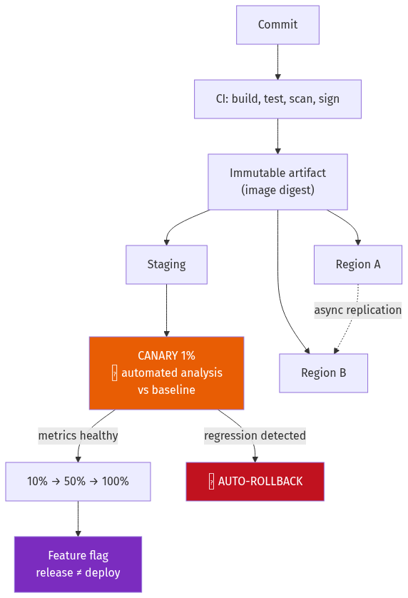
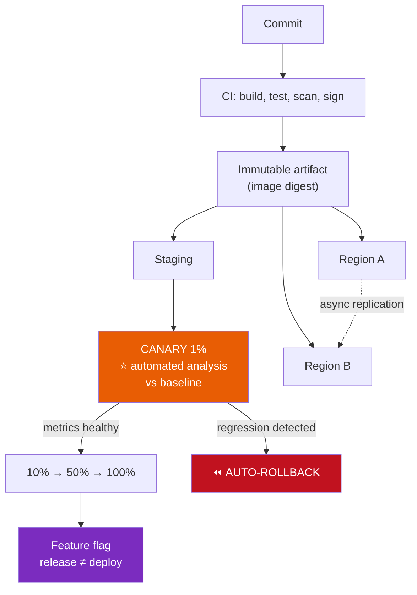
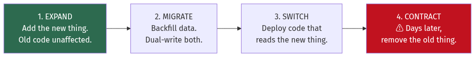
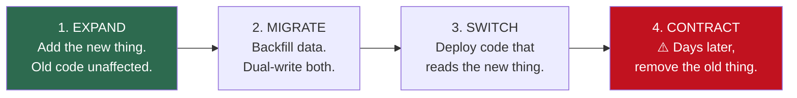
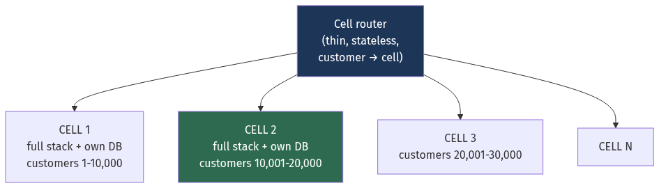
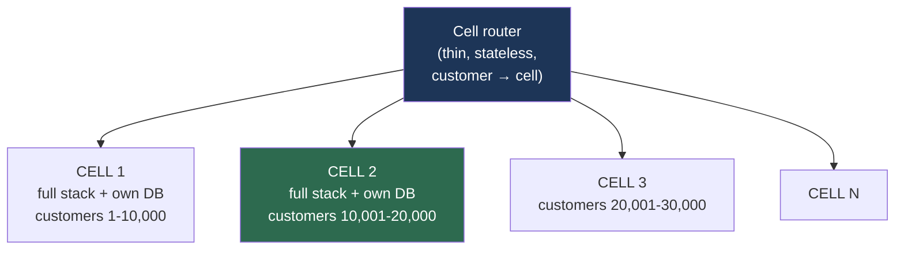

# Chapter 20 — Deployment, Multi-Region, Disaster Recovery and Cost

[← Chapter 19](./19_observability_and_operations.md) · [Contents](./README.md) · [Next: Chapter 21 →](./21_distributed_systems_theory_consensus.md)

**Prerequisites:** [Chapter 3](./03_reliability_availability_performance.md) §3.4 and §3.14 (correlated failure, multi-region math), [Chapter 17](./17_containers_docker_kubernetes.md) (rollouts), [Chapter 19](./19_observability_and_operations.md) (SLOs).

---

## What you'll learn

- Five deployment strategies, and why **canary with automated analysis** is the one that matters
- **Safe database migrations** — the expand/contract pattern, and the specific `ALTER` statements that will take you down
- **Feature flags** as the mechanism that decouples deploy from release
- **Multi-region topologies**, and why active-passive usually fails when you need it
- **Cell-based architecture** — the strongest available blast-radius control
- **RPO and RTO**, what they cost, and how to actually hit them
- **Backup strategy**: 3-2-1-1-0, immutability, and why an untested backup isn't a backup
- **Cloud cost**: the unit economics that decide whether an architecture is viable, and where the money actually goes

---

## Start from zero

You have working code. Getting it in front of users, keeping it there when a datacentre burns
down, and doing both without spending more than you earn — that's this chapter.

Three ideas underpin it, and each is counter-intuitive until you've seen it fail.

**One: deployment is the leading cause of outages.** Not hardware, not traffic spikes —
*changes*. Somewhere between 60% and 80% of incidents follow a change. So the goal isn't to
deploy less; it's to make each deploy affect fewer users and be reversible in seconds.

**Two: redundancy you don't exercise doesn't work.** A standby region nobody has failed over to
is a *hypothesis*, not a capability. The failover path is code, and untested code doesn't work.

**Three: cost is an architectural constraint, not an afterthought.** A design that costs more
per user than the user pays isn't a design, it's a countdown. And the money is rarely where you
expect — in most systems, **network egress and idle capacity beat compute**.

💡 **The unifying principle is blast radius.** Every technique here — canary, cells, regions,
feature flags — is a way of ensuring that when something goes wrong, and it will, it goes wrong
for 1% of users instead of 100%.

---

## The mental model



<details>
<summary>Diagram source (Mermaid)</summary>



</details>

---

## Deep dive

### 20.1 The five deployment strategies

| Strategy | Mechanism | Downtime | Rollback | Cost | Blast radius |
| --- | --- | --- | --- | --- | --- |
| **Recreate** | Stop all, start all | ⚠️ Yes | Redeploy | 1× | 100% |
| **Rolling** | Replace instances gradually | None | Roll forward/back gradually | ~1.25× | Grows over the rollout |
| **Blue-green** | Two full environments, switch traffic | None | ⭐ **Instant** | **2×** | 100% at the switch |
| **Canary** | Small % first, then ramp | None | Instant | ~1.1× | ⭐ **1%** |
| **Shadow** | Mirror traffic, discard responses | None | N/A | ~2× | ⭐ **0%** |

#### Rolling — the Kubernetes default

Covered mechanically in [Chapter 17](./17_containers_docker_kubernetes.md) §17.10.

⚠️ **Its weakness is that the blast radius grows monotonically.** Ten minutes into a rollout,
half your users are on the new version, and if the problem only manifests under sustained load
you find out when 50% are affected.

#### Blue-green

```
Blue (v1) ← 100% traffic          Green (v2) ← 0%, but fully deployed and warm
                     ↓ switch the load balancer
Blue (v1) ← 0%                    Green (v2) ← 100%
```
✅ **Instant rollback** — flip back. And the old environment stays warm for a while.
⚠️ **Costs 2× the infrastructure** during the transition, and the switch is all-or-nothing, so
a problem that only appears at scale hits everyone at once.

⚠️ **The database is the hard part.** Both environments share it, so the schema must be
compatible with **both versions simultaneously** — which is §20.2.

#### 💡 Canary with automated analysis — the one that matters

```
1%  ──5 min──> compare metrics against the baseline
     ↓ pass
10% ──10 min──> compare
     ↓ pass
50% ──10 min──> compare
     ↓ pass
100%
     ↓ any regression at any stage → automatic rollback
```

📐 **Why the blast radius arithmetic is decisive:**
```
Bad deploy, rolling:  ~50% of users affected before you notice   → 500,000 users
Bad deploy, canary:    1% affected for 5 minutes                 → 10,000 users
                                                                   for 5 min, not 40
```

⚠️ **"Canary" without automated analysis is just a slow rolling deploy.** If a human has to
watch a dashboard and decide, they will be in a meeting. **The comparison must be automatic and
must be able to roll back on its own.**

```yaml
# Argo Rollouts — the analysis is the whole point
analysis:
  templates: [{ templateName: success-rate }]
  args: [{ name: service-name, value: api-canary }]
---
metrics:
  - name: success-rate
    interval: 1m
    successCondition: result[0] >= 0.99
    failureLimit: 2                     # 2 failed checks → abort and roll back
    provider:
      prometheus:
        query: |
          sum(rate(http_requests_total{service="{{args.service-name}}",status!~"5.."}[2m]))
            / sum(rate(http_requests_total{service="{{args.service-name}}"}[2m]))
```

⚠️ **Compare canary against a *concurrent baseline*, not against yesterday.** Traffic patterns
change hourly; comparing 2 p.m. canary metrics to 2 a.m. baseline metrics produces false
signals in both directions. Run a baseline pod on the *old* version receiving the same
proportion of traffic, and compare the two.

📐 **Statistical significance matters at small percentages:**
```
1% of 10,000 req/s = 100 req/s. Over 5 minutes = 30,000 requests.
Baseline error rate 0.1% → expect 30 errors.
Observing 45 errors is within normal variation. Observing 300 is not.
⚠️ Set thresholds from the actual variance, or you'll roll back on noise.
```

#### Shadow (dark) traffic

Mirror production requests to the new version; **discard its responses**.
✅ Zero user risk, real production traffic and data distributions.
⚠️ **Side effects must be suppressed** — a shadowed service must not send emails, charge cards
or write to the primary database. This is the trap, and it's why shadow deployment is used less
than it should be.

💡 **Shadow traffic is the right tool for validating a rewrite or a datastore migration** —
compare old and new outputs on real traffic without any user exposure. It's the same mechanism
as the shadow reads in [Chapter 9](./09_replication_partitioning_consistency.md) §9.9.

### 20.2 Database migrations without downtime

⚠️ **This is where most "zero-downtime" deployments actually fail**, because the schema is
shared between old and new code.

📐 **The invariant: at any instant, the schema must work with both the version being removed and
the version being added.**

#### Expand / contract



<details>
<summary>Diagram source (Mermaid)</summary>



</details>

**Worked example — renaming `email` to `email_address`:**

```sql
-- ❌ NEVER. Old pods immediately break.
ALTER TABLE users RENAME COLUMN email TO email_address;
```

```sql
-- ✅ Step 1 — EXPAND (deploy 1)
ALTER TABLE users ADD COLUMN email_address TEXT;
-- Old code ignores it. Nothing breaks.

-- Step 2 — dual-write (deploy 2): app writes BOTH columns, reads the OLD one.

-- Step 3 — backfill, in batches, throttled
UPDATE users SET email_address = email
WHERE email_address IS NULL AND id BETWEEN $1 AND $2;
-- ⚠️ Batches of ~10,000 with a pause, watching replica lag (Ch 9 §9.3).

-- Step 4 — SWITCH (deploy 3): read the NEW column, still write both.
-- Step 5 — (deploy 4): stop writing the old column.

-- Step 6 — CONTRACT, days later, once rollback is no longer plausible
ALTER TABLE users DROP COLUMN email;
```

📐 **Six steps and four deploys to rename a column.** That's the actual cost of zero downtime,
and it's why "just rename it during a maintenance window" remains a legitimate choice for some
organisations.

#### ⚠️ The DDL statements that will take you down

| Operation | PostgreSQL | ⚠️ Danger |
| --- | --- | --- |
| `ADD COLUMN` (nullable, no default) | Metadata only | Safe |
| `ADD COLUMN ... DEFAULT x` | Metadata only (PG 11+) | ⚠️ **Full rewrite before PG 11** |
| `ADD COLUMN ... DEFAULT now()` | ⚠️ **Full table rewrite** — volatile default | Avoid |
| `DROP COLUMN` | Metadata only | Safe (space reclaimed by vacuum) |
| `ALTER COLUMN TYPE` | ⚠️ **Full rewrite + `ACCESS EXCLUSIVE`** | Use expand/contract instead |
| `ADD CONSTRAINT ... NOT VALID` then `VALIDATE` | ✅ Weak lock | ⭐ The safe pattern |
| `CREATE INDEX` | ⚠️ Blocks writes | Use `CONCURRENTLY` |
| `SET NOT NULL` | ⚠️ Full scan under `ACCESS EXCLUSIVE` | Add a `CHECK ... NOT VALID`, validate, then set |

⚠️ **And regardless of the operation, always:**
```sql
SET lock_timeout = '3s';
ALTER TABLE ...;
```
Because of the **lock queue** from [Chapter 7](./07_relational_databases_and_transactions.md)
§7.9: a pending `ACCESS EXCLUSIVE` request blocks every query behind it, so an instant DDL
queued behind one slow `SELECT` becomes a total outage on that table.

💡 **For large MySQL tables, use `gh-ost` or `pt-online-schema-change`** — they build a shadow
table, replay changes from the binlog, throttle on replica lag, and do a fast atomic swap.
PostgreSQL's equivalent for table rewrites is `pg_repack`.

### 20.3 Feature flags — decoupling deploy from release

```go
if flags.Enabled(ctx, "new-checkout-flow", user) {
    return newCheckout(ctx, req)
}
return oldCheckout(ctx, req)
```

💡 **This is the single most valuable operational tool in the chapter**, because it makes
"turning a feature off" a **configuration change taking seconds**, rather than a deploy taking
minutes — and it works even when your deploy pipeline is broken.

| Flag type | Lifetime | ⚠️ |
| --- | --- | --- |
| **Release** | Days–weeks | Must be **removed** after rollout |
| **Experiment** (A/B) | Weeks | Removed when the experiment concludes |
| **Ops / kill switch** | ⭐ Permanent | Disable an expensive feature under load |
| **Permission** | Permanent | Really entitlement, not a flag |

⚠️ **Flag debt is real and compounds.** Each flag doubles the notional number of code paths;
ten flags is 1,024 combinations, only a handful of which are ever tested. **Set an expiry date
at creation and fail the build on flags past it.**

⚠️ **The evaluation must not be a network call on the hot path.** Poll or stream the flag set
into memory and evaluate locally — otherwise the flag service becomes a synchronous dependency
of everything ([Chapter 16](./16_microservices_and_service_architecture.md) §16.1), and its
outage is your outage. And **fail to a safe default** if the flag set is unavailable.

💡 **Ops flags are the under-used category.** A permanent kill switch on every expensive,
non-critical feature — recommendations, related items, personalisation — gives you a way to shed
load in seconds during an incident ([Chapter 3](./03_reliability_availability_performance.md)
§3.13).

### 20.4 Multi-region topologies

| Topology | Writes | RTO | RPO | Cost | ⚠️ |
| --- | --- | --- | --- | --- | --- |
| **Single region, multi-AZ** | 1 region | AZ loss: seconds | 0 | 1× | Region loss = outage |
| **Backup & restore** | 1 region | ⚠️ Hours–days | Hours | 1.05× | Slow |
| **Pilot light** | 1 region | 10s of minutes | Minutes | 1.2× | Scale-up needed |
| **Warm standby** | 1 region | Minutes | Seconds | 1.5× | ⚠️ Standby is undersized |
| **Active-active** | ⭐ All regions | Seconds | ~0 | 2×+ | Conflict resolution required |

#### ⚠️ Why active-passive usually fails

From [Chapter 3](./03_reliability_availability_performance.md) §3.14 — the failover *mechanism*
is in series with the region pair, and it is usually the least reliable component.

**Four things that must all hold, and typically at least one doesn't:**

```
1. Failover is AUTOMATIC          ⚠️ Manual failover takes 15-60 min and dominates RTO
2. The standby actually WORKS     ⚠️ Untested = broken
3. The standby has CAPACITY       ⚠️ A region at 20% cannot absorb 100%
4. Failover doesn't depend on
   the thing that failed          ⚠️ ← the one people miss
```

📐 ```
Two regions at 99.95%, failover mechanism 99.9%, shared DNS/control plane 99.99%:
  (1 − 0.0005²) × 0.999 × 0.9999 = 99.89%
A single well-run region is 99.95%.
→ The two-region setup is WORSE, because the failover path dominates.
```

💡 **Which is the argument for active-active.** If both regions already serve traffic,
"failover" is just removing a health-checked endpoint from a global load balancer — no
orchestration, no cold standby, and the capability is exercised continuously by construction.
That's **static stability**: the system keeps working from pre-existing state without needing a
control plane to act.

#### The hard part of active-active is data

| Data type | Strategy |
| --- | --- |
| **Read-only reference** | Replicate everywhere. Trivial. |
| **User-partitioned** | ⭐ **Pin each user to a home region.** Writes go there; reads local. |
| **Globally mutable** | ⚠️ Genuinely hard — needs consensus (Spanner, CockroachDB) or CRDTs |
| **Uniqueness constraints** | ⚠️ Requires linearizability ([Ch 9](./09_replication_partitioning_consistency.md) §9.13) — a single global authority |

💡 **Home-region pinning is how most real active-active systems work**, and it dodges the
conflict problem entirely: every key has exactly one region that accepts writes for it, so
there are never concurrent conflicting writes. Cross-region reads may be stale; cross-region
*writes* are routed home.

### 20.5 Cell-based architecture

The strongest blast-radius control available, and increasingly the standard pattern at scale.



<details>
<summary>Diagram source (Mermaid)</summary>



</details>

**Each cell is a complete, independent copy of the stack** — its own services, its own database,
its own cache. Cells do not talk to each other.

📐 **The property that makes it worth the cost:**
```
Monolithic deployment: a bad config or a poison record affects 100% of customers
20 cells:              it affects 5%

Deployment: roll cell by cell. A regression is caught at 5%, not 100%.
Noisy neighbour: contained to one cell.
Poison-pill data: contained to one cell.
```

⚠️ **The costs are real:**
- **Cross-cell operations are hard.** If customer A in cell 1 must transact with customer B in
  cell 3, you've reintroduced a distributed transaction.
- **The router is a single point of failure** — so it must be extremely simple, stateless, and
  ideally just a lookup with a cached mapping.
- **Cell rebalancing** is a migration, with all of
  [Chapter 9](./09_replication_partitioning_consistency.md) §9.9's machinery.
- **Fixed overhead per cell** — you now run 20 databases, 20 monitoring stacks, 20 of everything.

💡 **Cells work best where customers are naturally isolated** — B2B SaaS, where a tenant never
interacts with another tenant. They fit poorly where the product is inherently cross-customer,
like a social network.

### 20.6 RPO and RTO

```
        ← RPO →              ← RTO →
─────────────┬───────────────────┬─────────
   last good │  💥 DISASTER      │ service restored
    backup   │                   │
             └─ data lost ─┘     └ downtime ┘
```

| Target | RPO | RTO | Mechanism | Relative cost |
| --- | --- | --- | --- | --- |
| Casual | 24 h | 24 h | Nightly backup to object storage | 1× |
| Standard | 1 h | 4 h | Hourly snapshots + WAL archive | 1.2× |
| Serious | 5 min | 30 min | Continuous WAL shipping, warm standby | 1.5× |
| Critical | ~0 | < 1 min | Synchronous replication, active-active | 2–3× |
| Zero | 0 | 0 | ⚠️ Does not exist | ∞ |

📐 **RPO ≈ 0 requires synchronous replication, which costs latency on every write:**
```
Sync replication to a region 100 ms away → +100 ms on EVERY write (Ch 9 §9.1)
Async replication                        → RPO = the replication lag, typically seconds
```
⚠️ **You cannot have zero RPO across regions without paying cross-region latency on the write
path.** Anyone claiming otherwise is describing async replication and calling it something else.

💡 **Set RPO and RTO per data class, not for the whole system.** The orders table might need
RPO 0; the analytics warehouse can happily be RPO 24 hours. Applying the strictest requirement
uniformly multiplies cost for no benefit.

### 20.7 Backups

**3-2-1-1-0**, the ransomware-updated version of the classic rule:
```
3 copies of the data
2 different media/storage types
1 off-site
1 IMMUTABLE or offline          ⭐ the ransomware addition
0 errors on a TESTED restore    ⭐ the one that's actually skipped
```

| Type | Contains | Restore speed | Storage |
| --- | --- | --- | --- |
| Full | Everything | Fast | ⚠️ Large |
| Incremental | Changes since the last backup of any type | ⚠️ Slow — needs the whole chain | Smallest |
| Differential | Changes since the last **full** | Medium — needs full + one | Medium |
| **Synthetic full** | ⭐ A full, assembled from a previous full + increments | Fast | Small |

💡 **Synthetic fulls are the best of both**: you only ever transfer incrementals from the source,
but the backup system merges them so a restore reads a single full. This is what modern backup
products do.

⚠️ **Immutability is the ransomware control.** An attacker with admin credentials deletes
snapshots — that's the standard playbook now. **S3 Object Lock in compliance mode** cannot be
deleted by *anyone*, including the account root, until the retention period expires
([Chapter 6](./06_storage_engines_internals.md) §6.10).

#### ⚠️ An untested backup is not a backup

📐 **The failure modes, all of which are common:**
```
• The backup job has failed silently for three months (nobody alerts on success, only failure —
  and a job that stops running produces no failure)
• The backup is corrupt and unreadable
• Restore takes 18 hours; your RTO is 4
• The restore procedure depends on credentials only one person has
• The runbook is in a wiki hosted on the system that's down
• You restored the database but not the encryption keys
```

**What a real restore test looks like:**
```
Monthly, automated:
  1. Provision a fresh environment from infrastructure-as-code
  2. Restore the most recent backup
  3. ⭐ Verify data integrity — row counts, checksums, a reconciliation query
  4. Run application smoke tests against it
  5. MEASURE the elapsed time → this is your ACTUAL RTO
  6. Destroy the environment
```
💡 **Step 5 is the point.** Most organisations have an aspirational RTO and a measured RTO, and
they differ by an order of magnitude. You only find out which by measuring.

### 20.8 Cloud cost

📐 **Order-of-magnitude prices, from [Chapter 2](./02_scalability_and_estimation.md) §2.10:**

| Resource | Approximate |
| --- | --- |
| Compute (on-demand vCPU) | ~$30/month |
| Compute (3-yr reserved / savings plan) | ~40% of on-demand |
| Compute (spot) | ~10–30% of on-demand |
| Memory | ~$3.50/GB/month |
| Block storage (gp3) | ~$80/TB/month |
| Object storage (S3 Standard) | ~$23/TB/month |
| Object storage (Glacier Deep Archive) | ~$1/TB/month |
| **Egress to internet** | ⚠️ **~$50–90/TB** |
| Cross-AZ transfer | ~$10–20/TB (**both directions**) |
| Same-AZ transfer | Free |
| NAT Gateway data processing | ⚠️ ~$45/TB **on top of** egress |
| Managed database premium | ~2–3× the raw instance |

⚠️ **Where the money actually is, in rough order of how often it's the surprise:**

**1. Idle capacity.** The largest single waste in most organisations.
```
Non-production environments running 24/7 but used 40 hours/week:
  → 76% waste. Scheduled shutdown is the single easiest saving available.
Over-provisioned production: requests set at 4 cores for a service using 0.5.
```

**2. Egress and cross-AZ traffic.**
```
Chatty microservices across AZs: 100,000 req/s × 10 KB = 1 GB/s
= 2.6 PB/month × $20/TB = $52,000/month
...for traffic that never leaves the cloud.
```
💡 **AZ-aware routing is the fix** ([Chapter 5](./05_load_balancing_proxies_traffic.md) §5.11's
`locality_weighted_lb_config`) — prefer a replica in your own AZ, where transfer is free.

**3. Storage that's never deleted.** Logs, snapshots, orphaned volumes, old object versions.
```
Lifecycle policy: Standard (30 d) → Infrequent Access (90 d) → Glacier (1 yr) → delete
Typical saving on a log/backup bucket: 60-80%.
```

**4. Not using the discount instruments.** Spot for anything fault-tolerant (batch, CI, stateless
workers), reserved or savings plans for steady baseline load.

📐 **A realistic optimisation, worked:**
```
Baseline:                                                  $100,000/month
  Rightsize over-provisioned requests (measure, then set)   −$18,000
  Savings plan on the steady baseline (40% of on-demand)    −$22,000
  Spot for batch and CI                                      −$8,000
  Shut down non-prod outside working hours                   −$9,000
  S3 lifecycle policies                                      −$6,000
  AZ-aware routing                                           −$7,000
  CDN in front of egress-heavy endpoints                    −$11,000
Total                                                        $19,000/month remaining
                                                            = 81% reduction
```
⚠️ **None of these are architectural changes.** They're configuration. Which is why cost
optimisation usually starts with the boring items rather than a redesign.

#### 💡 Unit economics — the number that actually matters

```
$ per active user / per order / per GB stored, per month

$180,000/month ÷ 3,000,000 MAU = $0.06/user/month
If ARPU is $0.50 → infrastructure is 12% of revenue → healthy
If ARPU is $0.08 → infrastructure is 75% of revenue → the business doesn't work
```

📐 **And the more important question: does it scale sub-linearly?**
```
$0.06/user at 1M users and $0.06/user at 10M users → ⚠️ no leverage, cost scales with revenue
$0.06/user at 1M users and $0.02/user at 10M users → ✅ economies of scale
```
🎯 **Tying an architecture to a per-unit cost and stating whether it improves with scale is the
most senior-sounding thing you can say in a design interview**, because it demonstrates that
engineering decisions are business decisions.

**FinOps practices that work:** mandatory cost-allocation tags with enforcement, per-team
budgets and showback, anomaly alerting on daily spend, and cost as a review criterion in design
documents.

---

## Worked example — designing DR for a payments platform

*Payments platform. £2M/day processed. Requirements: RPO 0 for transactions, RTO under 5
minutes, survive the loss of an entire region. Budget is a constraint but not the primary one.*

**Step 1 — Classify data. This is the decision that controls cost.**

| Data | RPO | RTO | Why |
| --- | --- | --- | --- |
| Transaction ledger | **0** | 5 min | ⚠️ Losing a payment is unrecoverable — regulatory and financial |
| Customer accounts | 1 min | 5 min | Recreatable from the ledger if necessary |
| Session state | ∞ | — | ⭐ Disposable — users log in again |
| Analytics warehouse | 24 h | 24 h | Rebuildable from the ledger |
| Audit log | **0** | 1 h | ⚠️ Regulatory; needed for reconstruction, not for serving |

💡 **Only the ledger and audit log need RPO 0.** Applying that requirement to everything would
multiply cost several times over for no benefit. This classification step is where most of the
money is saved.

**Step 2 — Reject active-passive, with the arithmetic.**
```
Two regions at 99.95%, automated failover mechanism at 99.9%:
  (1 − 0.0005²) × 0.999 = 99.90%  → 43 min/month
⚠️ Worse than a single region at 99.95% (22 min/month), because the failover
   path is now the least reliable component and everything depends on it.

Also: RTO under 5 minutes requires automatic failover, and an untested
      automatic failover on a payments system is a worse risk than the outage.
```
→ **Active-active.** Both regions serve production continuously, so the capability is exercised
by construction rather than assumed.

**Step 3 — Solve RPO 0 for the ledger.**

⚠️ **Synchronous cross-region replication would add ~80 ms to every write** — unacceptable on a
payment authorisation path.

```
✅ Use a database with consensus-based replication and regional quorums:
   Spanner / CockroachDB / YugabyteDB, with 3 replicas in region A and 2 in region B.

Write path: commit requires a quorum of 3 of 5.
  → Normally satisfied by the 3 local replicas → LOCAL latency
  → Region A lost: B's 2 replicas cannot reach quorum alone
```
⚠️ **That last line is the problem.** 3+2 across two regions means losing the 3-replica region
leaves you unable to commit.

📐 **The fix is three regions:**
```
5 replicas: 2 in region A, 2 in region B, 1 in region C (a witness)
Quorum = 3.
  Lose region A → B(2) + C(1) = 3 ✅ still writable
  Lose region B → A(2) + C(1) = 3 ✅ still writable
  Lose region C → A(2) + B(2) = 4 ✅ still writable

RPO = 0 (a committed write is on a majority by definition)
RTO ≈ seconds (leader re-election — Ch 21)
```
💡 **Three regions is not optional for genuine RPO 0 with region-loss survival.** Two regions
cannot form a majority when one is gone — this is the even-split problem from
[Chapter 21](./21_distributed_systems_theory_consensus.md), and it's the most common flaw in
two-region DR designs.

**Step 4 — Route traffic.**
```
Anycast / global load balancer (Ch 4 §4.6) → nearest healthy region
Health checks every 5 s, 2 failures → withdraw the region
⚠️ NOT DNS-based failover — TTLs are advisory and propagation is unpredictable
   (Ch 4 §4.5). Withdrawal at the routing layer takes seconds.
```
📐 **RTO budget:**
```
Detect region failure:        10 s (2 × 5 s health checks)
Withdraw from anycast:         5 s
Database leader re-election:  10 s (Raft election timeout — Ch 21)
Connection re-establishment:  15 s (client retry with jitter)
Cache warm-up (degraded):     60 s
Total: ~100 s  ✅ inside the 5-minute RTO, with 3× margin
```

**Step 5 — The asymmetry: reads and writes are handled differently.**
```
Writes: routed to the region holding the Raft leader for that range
Reads:  served LOCALLY from a follower, using a bounded-staleness read
        → low latency, and correct for balance display
⚠️ Authorisation decisions ("does this account have funds?") must be
   LINEARIZABLE — they read through the leader. (Ch 9 §9.13)
```
💡 **This is the key design decision.** Not every read needs the same guarantee. Displaying a
balance can be 200 ms stale; deciding whether to authorise a payment cannot.

**Step 6 — Backups, in addition to replication.**

⚠️ **Replication is not backup.** It replicates a `DROP TABLE` and a corrupt row just as
faithfully as a correct write.

```
Continuous:      WAL archived to object storage in 2 regions → PITR to any second
Daily:           Full snapshot, S3 Object Lock (compliance mode), 7-year retention
Immutable copy:  ⭐ Separate AWS account, cross-account replication
                 → a compromise of the production account cannot delete it
Encryption:      Per-tenant DEKs (Ch 18 §18.6) → crypto-shredding for erasure requests
```

**Step 7 — Deployment, because deploys cause more outages than regions failing.**
```
Artifact:  immutable image, signed, referenced by digest
Pipeline:  region B first (lower traffic) → soak 30 min → region A
Within a region: canary 1% → 10% → 50% → 100%, automated analysis at each step
Analysis: error rate, P99, and ⭐ a business metric — authorisation success rate
Rollback: automatic on any regression; manual kill switch always available
Schema:   expand/contract only; ⚠️ NO destructive DDL without a full deploy cycle
```
💡 **Including a business metric in the canary analysis matters here.** A deploy can leave
technical metrics perfectly healthy while quietly declining 5% more payments. Error rate and
latency would not catch it; authorisation success rate would.

**Step 8 — Test it, or it isn't real.**
```
Weekly:    automated restore test → measure and record actual RTO
Monthly:   game day — fail over one region during business hours, everyone watching
Quarterly: full region-loss exercise, unannounced to the on-call team
Always:    chaos experiments in production (Ch 19 §19.9)
```
⚠️ **The quarterly unannounced exercise is the one that finds the real problems** — expired
credentials, a runbook referencing a decommissioned host, a dependency nobody knew was
single-region.

**Step 9 — The cost.**
```
Three regions, 5 database replicas:            ~2.4× a single-region deployment
Cross-region replication traffic:               ~$8,000/month
Backup storage (7-year retention, tiered):      ~$3,000/month
Total DR premium:                              ~£140,000/month

Against £2M/day processed:
  One hour of downtime ≈ £83,000 of transactions, plus regulatory exposure,
  plus reputational damage in a trust-dependent business.
→ The DR premium is roughly 1.7 hours of downtime per month. Clearly justified.
```
💡 **Always express the DR cost in units of the thing it prevents.** "£140,000/month" invites
argument; "less than two hours of outage" ends it.

**Step 10 — What was deliberately *not* done.**

| Not done | Why |
| --- | --- |
| RPO 0 for analytics | Rebuildable from the ledger; would have doubled warehouse cost |
| Synchronous cross-region replication | +80 ms on every write, and unnecessary given consensus quorums |
| Four+ regions | Three satisfies majority-survives-one-loss; a fourth adds cost, not resilience |
| Multi-cloud | ⚠️ Doubles operational complexity and expertise; the failure modes it protects against are rarer than the ones it introduces |
| DNS-based failover | TTLs are advisory; can't meet a 5-minute RTO |

---

## Trade-offs

| Decision | Option A | Option B | Choose A when | Never choose A when |
| --- | --- | --- | --- | --- |
| Deployment | Rolling | **Canary + auto-analysis** | Low-risk internal service | User-facing — blast radius decides it |
| Deployment | Blue-green | Canary | You need instant, total rollback | Cost matters, or you want a small blast radius |
| Canary decision | Human watching | **Automated** | Never | Always B — humans are in meetings |
| Canary baseline | Yesterday's metrics | **Concurrent baseline pod** | Never | Always B — traffic patterns vary hourly |
| Schema change | Direct `ALTER` | **Expand/contract** | Maintenance window is acceptable | Zero-downtime is required |
| DDL safety | Just run it | **`SET lock_timeout` first** | ⚠️ Never | Always B — the lock queue blocks everything |
| Feature control | Deploy to release | **Feature flag** | Trivial changes | Anything risky — flags flip in seconds |
| Flag evaluation | Remote call per check | **Local, streamed config** | Never | Always B — a flag service outage is your outage |
| Multi-region | Active-passive | **Active-active** | Budget is the hard constraint | RTO in minutes — untested failover fails |
| Consensus regions | 2 | **3** | ⚠️ Never for RPO 0 | Two regions can't form a majority when one is lost |
| Blast radius | Shared deployment | **Cells** | Small scale; cross-customer product | Multi-tenant at scale — cells contain everything |
| Backup | Replication | **Replication + backup** | ⚠️ Never — replication copies your mistakes | Always both |
| Backup immutability | Snapshots | **Object Lock, separate account** | Ransomware isn't in your threat model | It is |
| Restore | Documented | **Tested monthly, timed** | Never | Always B — measured RTO ≠ aspirational RTO |
| Cost | Optimise the architecture | **Optimise the configuration first** | Architecture is clearly wrong | Usually B — rightsizing and lifecycle beat redesign |

---

## How real companies do it

**Amazon's cell-based architecture** is documented in the Builders' Library, and the core
argument is blast radius: partition customers into cells that share nothing, so any failure —
bad deploy, poison record, noisy neighbour, resource exhaustion — is bounded to a fraction of
customers. They pair it with **static stability**: the data plane keeps working using
pre-existing state even when the control plane is unavailable, which is precisely the failure
mode that makes active-passive failover unreliable.

**Netflix's Spinnaker** made automated canary analysis mainstream. Two details worth copying:
they compare the canary against a **concurrently-running baseline of the old version** rather
than historical data, and they run **regional failover exercises regularly** — their published
position is that a failover capability you don't exercise is a capability you don't have.

**GitHub's `gh-ost`** exists because `ALTER TABLE` on a large busy MySQL table is not viable. It
builds a shadow table, replays changes from the binlog, **throttles based on replica lag**, and
performs an atomic swap — and can be paused mid-migration. The general lesson: at scale, don't
do the migration the database's built-in DDL wants you to do.

**Google's Spanner** is the production answer to §20.3's RPO-0 problem: consensus-replicated
ranges with quorums spanning regions, giving zero RPO and seconds of RTO — at the cost of
TrueTime commit-wait on every write and a genuinely expensive infrastructure investment.

**The 2017 GitLab incident** is the canonical backup cautionary tale: an engineer removed the
wrong directory, and then discovered that **five of five backup and replication mechanisms had
silently failed** — none had ever been restore-tested. They recovered from a staging snapshot
taken by chance six hours earlier. They also live-streamed the recovery, which is a remarkable
act of transparency and makes it unusually well documented.

---

## Common mistakes

**Canary without automated analysis.** A human watching a dashboard will be in a meeting. The
comparison and the rollback must be automatic.

**Comparing the canary to historical metrics.** Traffic varies hourly. Use a concurrent baseline
on the old version.

**Canary percentage too small for significance.** 1% for two minutes may be a few hundred
requests — indistinguishable from noise. Compute the sample size you need.

**Direct `ALTER TABLE RENAME` or type changes.** Breaks the running version instantly. Use
expand/contract.

**DDL without `lock_timeout`.** A pending `ACCESS EXCLUSIVE` queues behind one slow query and
blocks every subsequent query on the table.

**Backfilling without throttling.** Saturates the primary and inflates replica lag, breaking
production reads.

**Feature flags evaluated over the network on the hot path.** The flag service becomes a
synchronous dependency of everything.

**Feature flags that never get removed.** Ten flags is 1,024 code paths, of which you test
maybe five. Set expiry dates and fail the build.

**Assuming active-passive works.** Untested failover is a hypothesis. And an undersized standby
cannot absorb full production load.

**Two regions for a consensus system with RPO 0.** Losing one leaves the other unable to form a
majority. You need three.

**DNS-based failover with a tight RTO.** TTLs are advisory; resolvers and JVMs cache far longer
than you specify.

**Treating replication as backup.** It faithfully replicates `DROP TABLE` and corrupt rows.

**Backups nobody has restored.** GitLab had five mechanisms and all five had failed silently.
Test monthly, and **measure** the restore time — that's your real RTO.

**Alerting only on backup failure.** A job that stops running produces no failure event. Alert
on backup *age*.

**Optimising cost by redesigning first.** Rightsizing, scheduled shutdowns, lifecycle policies
and savings plans typically deliver most of the saving without touching the architecture.

**Ignoring cross-AZ transfer.** Billed in both directions, and chatty services can spend tens of
thousands a month on traffic that never leaves the cloud.

**Reporting total cost instead of unit economics.** "$180,000/month" isn't actionable; "$0.06
per user, falling as we grow" is.

---

## Interview angle

**Q: How do you deploy without downtime?**

*Strong:* "Rolling updates handle the mechanics — `maxUnavailable: 0`, a `preStop` delay so
endpoint removal propagates before you stop serving, and a meaningful readiness probe. But
zero-*downtime* isn't the same as zero-*risk*, and the risk is that a bad version reaches
everyone. So I'd use a **canary with automated analysis**: 1% for a few minutes, compare error
rate, latency and a business metric against a concurrently-running baseline of the old version,
then ramp. Two details that make the difference between a real canary and a slow rolling deploy.
The analysis must be **automated with automatic rollback** — a human watching a dashboard will
be in a meeting. And the baseline must be **concurrent**, not yesterday's data, because traffic
patterns vary hourly and you'd get false signals in both directions. The blast-radius arithmetic
is what justifies it: a bad rolling deploy affects roughly half your users before you notice; a
canary affects 1% for five minutes. And the genuinely hard part is usually **the database** —
the schema has to work with both versions simultaneously, which means expand/contract."

**Q: How do you rename a database column with zero downtime?**

*Strong:* "You don't rename it — a rename breaks every running instance of the old code the
instant it executes. You use **expand/contract**, and it's six steps across four deploys. Add
the new column, nullable, which is metadata-only and safe. Deploy code that writes **both**
columns and reads the old one. Backfill in throttled batches, watching replica lag, because an
unthrottled backfill saturates the primary and breaks production reads. Deploy code that reads
the new column and still writes both. Deploy code that stops writing the old one. Then, days
later — once you're confident you won't roll back — drop the old column. The invariant
throughout is that **at any instant the schema works with both the version being removed and the
version being added**. I'd also always `SET lock_timeout` before any DDL, because of the lock
queue: a pending `ACCESS EXCLUSIVE` request blocks every query behind it, so an instant
metadata-only change queued behind one slow `SELECT` becomes a total outage on that table. Four
deploys to rename a column is the real cost of zero downtime, which is why a maintenance window
remains a legitimate choice for some organisations."

**Q: Design DR for a system needing RPO 0 and RTO under 5 minutes.**

*Strong:* "First I'd **classify the data**, because applying the strictest requirement uniformly
multiplies cost for no benefit — the transaction ledger might need RPO 0, but session state is
disposable and the analytics warehouse is rebuildable. Then I'd rule out active-passive with
arithmetic: two regions at 99.95% behind a failover mechanism at 99.9% gives you 99.89%, which
is **worse than a single region**, because the failover path becomes the least reliable
component and everything depends on it. So **active-active**, where both regions serve
continuously and 'failover' is just withdrawing a health-checked endpoint — the capability is
exercised by construction. For RPO 0, synchronous cross-region replication would add 80
milliseconds to every write, so instead I'd use a consensus-replicated database where a commit
requires a majority. And critically that needs **three regions, not two** — with replicas split
two-two across two regions, losing one leaves the other unable to form a majority. Two-two-one
across three regions with a quorum of three survives the loss of any region. RTO then breaks
down as detection, route withdrawal, leader re-election and client reconnection — roughly a
hundred seconds, comfortably inside five minutes. And I'd add backups *in addition* to
replication, because replication faithfully copies a `DROP TABLE`."

**Q: What's cell-based architecture and when is it worth it?**

*Strong:* "You partition customers into **cells**, each a complete independent copy of the stack
— its own services, its own database, its own cache — with a thin stateless router mapping
customers to cells. Cells never talk to each other. The point is **blast radius**: a bad deploy,
a poison record, a noisy neighbour or a resource exhaustion affects one cell rather than
everyone. With twenty cells that's 5% instead of 100%, and you deploy cell by cell so a
regression is caught at 5%. It's the strongest blast-radius control available. The costs are
genuine though. **Cross-cell operations become distributed transactions**, so it fits poorly
where the product is inherently cross-customer, like a social network. The **router is a single
point of failure**, so it has to be trivially simple and stateless. **Rebalancing cells is a
data migration** with all of that machinery. And there's fixed overhead per cell — twenty
databases, twenty monitoring stacks. So it's worth it for **multi-tenant B2B at scale**, where
tenants are naturally isolated and a single blast radius is an existential risk, and it's
over-engineering below that."

**Q: Where does cloud spend actually go, and how do you reduce it?**

*Strong:* "Rarely where people expect. The largest single waste is usually **idle capacity** —
non-production environments running 24/7 but used forty hours a week is 76% waste, and
production requests set at four cores for a service using half a core. Second is **network**,
and specifically **egress at fifty to ninety dollars a terabyte**, plus cross-AZ transfer billed
in both directions — chatty microservices across AZs can spend tens of thousands a month on
traffic that never leaves the cloud, which AZ-aware routing fixes for free. Third is **storage
nobody deletes** — logs, orphaned volumes, old object versions — where a lifecycle policy
typically saves 60 to 80%. Fourth is **not using the discount instruments**: spot for anything
fault-tolerant, savings plans for the steady baseline. The important framing is that **none of
those are architectural changes** — they're configuration, and they typically deliver most of
the available saving. I'd optimise those before redesigning anything. And I'd report
**unit economics** rather than totals: dollars per active user per month, and whether that
number falls as you grow. That's what tells you whether the architecture is viable, and it's the
number a CFO can act on."

**Q: Your backups have never been restored. What's the risk?**

*Strong:* "You don't have backups; you have an untested hypothesis. The failure modes are all
common. The **job has failed silently** — and note that if you only alert on failure, a job that
*stops running* produces no event at all, which is why you alert on backup **age**. The backup
is **corrupt or unreadable**. The **restore takes eighteen hours** and your RTO is four, so it
technically works and is operationally useless. The **procedure depends on credentials one
person has**, or on a runbook hosted on the system that's down, or you restored the database but
not the encryption keys. GitLab's 2017 incident is the reference case: five separate backup and
replication mechanisms, and **all five had silently failed** — they recovered from a staging
snapshot taken by chance. So: monthly automated restore into a fresh environment from
infrastructure-as-code, verify integrity with checksums and a reconciliation query, run smoke
tests, and — the point of the exercise — **measure the elapsed time**, because that's your real
RTO and it's usually an order of magnitude off the aspirational one. And separately, replication
is not backup: it replicates your `DROP TABLE` faithfully. You need immutable backups in a
separate account, because deleting snapshots is the standard ransomware playbook."

---

## Recap

- **Deployment causes most outages.** The goal isn't fewer deploys — it's **smaller blast radius
  and instant reversibility**.
- **Canary with automated analysis** is the strategy that matters. ⚠️ Without automation and a
  concurrent baseline, it's just a slow rolling deploy.
- **Expand/contract** is the only safe way to change a schema during a rolling deploy — six
  steps, four deploys, and worth it.
- ⚠️ **Always `SET lock_timeout` before DDL** — the lock queue turns an instant change into a
  total outage.
- **Feature flags decouple deploy from release** and flip in seconds. ⚠️ Evaluate locally, set
  expiry dates, and keep permanent **kill switches** on expensive optional features.
- ⚠️ **Active-passive usually fails** because the failover mechanism is in series and untested.
  **Active-active** exercises the capability continuously — that's **static stability**.
- ⚠️ **RPO 0 with region-loss survival needs three regions**, not two. Two cannot form a majority
  when one is gone.
- **Cells contain everything** — deploys, poison data, noisy neighbours. Best for multi-tenant
  B2B; poor fit for cross-customer products.
- **Replication is not backup.** 3-2-1-1-0, with **immutable** copies in a separate account.
- ⭐ **An untested backup is not a backup.** Restore monthly, and **measure** — that's your real
  RTO.
- **Cost: idle capacity, egress and cross-AZ, undeleted storage, unused discounts** — all
  configuration, not architecture. Report **unit economics**, and whether they improve with scale.

---

## Test yourself

1. You canary at 1% for 2 minutes on a service doing 5,000 req/s with a 0.2% baseline error
   rate. Is that enough to detect a doubling of the error rate?
2. You need to change a column from `INT` to `BIGINT` on a 500-million-row PostgreSQL table with
   zero downtime. Describe the steps.
3. Two regions, 3 database replicas in A and 2 in B, quorum of 3. Region A is lost. What
   happens, and what should the topology have been?
4. Your RTO is 4 hours. A restore test takes 11 hours. Name three ways to close the gap.
5. Your monthly bill is $200,000. Traffic doubles and it becomes $410,000. Is this good or bad?
   What would you want to know?
6. A feature flag service goes down. Your application can't evaluate flags. What should happen,
   and what does it tell you about the design?
7. Compare blast radius for a bad deploy under: rolling, blue-green, canary at 1%, and 20 cells.
8. Your nightly backup job hasn't run for 6 weeks. Your monitoring shows no alerts. Explain.
9. Your DR plan says "fail over to region B". Region B runs at 15% capacity to save money. What
   happens during failover?
10. A microservice architecture spans 3 AZs with 200,000 internal req/s at 8 KB each. Estimate
    the monthly cross-AZ cost and give the fix.

<details>
<summary>Answers</summary>

1. **No — nowhere near.**
   ```
   1% of 5,000 req/s = 50 req/s × 120 s = 6,000 canary requests
   Baseline 0.2% → expect 12 errors
   Doubled to 0.4% → expect 24 errors
   ```
   The standard deviation of a Poisson count with mean 12 is √12 ≈ 3.5, so 24 is about 3.4σ
   above 12 — borderline, and a single unlucky burst of 20 errors in a healthy canary would
   trigger a false rollback. You need substantially more samples for a confident decision.
   **Fixes:** run longer (10 minutes gives 30,000 requests and ~60 expected errors), use a larger
   percentage (5% for 5 minutes gives 75,000 requests), or use a sequential statistical test
   rather than a fixed threshold. The general rule: **compute the sample size your detection
   threshold requires** rather than picking round numbers for percentage and duration.

2. `ALTER COLUMN TYPE` rewrites the entire table under `ACCESS EXCLUSIVE` — on 500 million rows
   that's many minutes of total unavailability. Use **expand/contract**:
   ```
   1. ALTER TABLE t ADD COLUMN id_new BIGINT;              -- metadata only, safe
   2. Deploy code writing BOTH columns, reading the old one
   3. Backfill in throttled batches:
        UPDATE t SET id_new = id WHERE id_new IS NULL AND id BETWEEN $1 AND $2;
      ⚠️ ~10,000 rows per batch, pausing and watching replica lag
   4. Add a NOT VALID constraint, then VALIDATE separately (weak lock):
        ALTER TABLE t ADD CONSTRAINT id_new_nn CHECK (id_new IS NOT NULL) NOT VALID;
        ALTER TABLE t VALIDATE CONSTRAINT id_new_nn;
   5. Create any needed indexes CONCURRENTLY on id_new
   6. Deploy code reading id_new, still writing both
   7. Deploy code writing only id_new
   8. Days later: ALTER TABLE t DROP COLUMN id;
   ```
   ⚠️ `SET lock_timeout = '3s'` before every DDL step. If `id` is a primary key referenced by
   foreign keys, this is considerably more involved — you'd typically use `pg_repack` or a
   shadow-table tool instead.

3. **Region B cannot form a quorum.** With 5 replicas the quorum is 3, and B has only 2. All
   **writes fail** — the cluster is unavailable for writes until region A returns or you
   manually and dangerously reduce the replication factor, which risks data loss.
   This is the most common flaw in two-region DR designs: **two regions can never both be able
   to survive losing the other**, because a majority of the replicas must live somewhere, and
   wherever that is, losing it breaks quorum.
   **The topology should have been three regions**: 2 replicas in A, 2 in B, 1 in C (which can
   be a small witness node). Quorum is still 3, and:
   ```
   Lose A → B(2) + C(1) = 3 ✅
   Lose B → A(2) + C(1) = 3 ✅
   Lose C → A(2) + B(2) = 4 ✅
   ```
   Any single region loss leaves a writable majority. The third region carries very little cost
   — a witness needs no data-serving capacity — and it is what makes RPO 0 with region-loss
   survival actually achievable.

4. (a) **Restore in parallel.** Shard the restore across multiple workers, or restore the most
   critical tables first and bring the service up degraded while the rest continues.
   (b) **Change the backup format.** Physical/block-level restores are far faster than logical
   dumps; a snapshot restore that attaches a volume is minutes rather than hours. Synthetic fulls
   avoid replaying long incremental chains.
   (c) **Keep a warm standby** that's continuously restored — replaying WAL into a standing
   replica means recovery is promotion (seconds) rather than restoration (hours). This changes
   the RTO by two orders of magnitude and is usually the right answer for a 4-hour target.
   Also: (d) restore into pre-provisioned infrastructure rather than provisioning during the
   incident, and (e) reduce the data volume that must be restored quickly by classifying data —
   restore the transactional core first, the analytics history later.

5. **It's bad, and it's the key question.** Cost scaled linearly with traffic (2× traffic → 2.05×
   cost), which means **no economies of scale**. Every additional user costs the same as the
   last, so infrastructure remains a constant percentage of revenue forever and you never get
   operating leverage.
   **What I'd want to know:**
   - **Unit economics**: cost per active user or per transaction, before and after. If it's flat,
     confirm the linearity; if it fell, the total is fine.
   - **ARPU**, so I can express infrastructure as a percentage of revenue — 12% is healthy, 75%
     means the business model doesn't work.
   - **The breakdown by resource**: if the growth is all egress, a CDN fixes it; if it's all
     compute, look at whether the extra load is being served efficiently or by over-provisioned
     instances.
   - Whether **fixed costs** are being amortised at all — a genuinely scalable architecture has
     a fixed component (control plane, monitoring, baseline capacity) that doesn't double.
   Sub-linear scaling usually comes from better cache hit rates at scale, amortised fixed costs,
   and volume discounts. Linear scaling suggests none of those are being realised.

6. **The application should continue working, using safe default values, and emit a metric.**
   That it *can't* evaluate flags means the design is wrong in two ways.
   First, flags are being evaluated by a **network call on the hot path**, making the flag service
   a synchronous dependency of every request — so per
   [Chapter 16](./16_microservices_and_service_architecture.md) §16.1 its availability multiplies
   into yours, and you've created a single point of failure for the entire system out of
   something that's meant to *increase* resilience.
   Second, there's **no safe default**. Every flag evaluation should have a defined fallback, and
   the application should hold the last-known-good flag set in memory.
   **The correct design:** the SDK streams or polls the flag configuration into local memory, and
   evaluation is a local map lookup taking nanoseconds. If the flag service is unreachable, the
   application keeps using its cached set indefinitely and alerts on staleness. A flag service
   outage then means "flags can't be *changed*", which is an inconvenience, not "the site is
   down".

7. ```
   Rolling:      grows monotonically — by the time you notice, typically 25-50% of users
                 have been served by the bad version, over tens of minutes
   Blue-green:   0% until the switch, then 100% instantly — a problem that only manifests
                 under full load hits everyone at once, though rollback is instant
   Canary 1%:    1% of users, for the duration of the first analysis window (~5 min),
                 then automatic rollback
   20 cells:     5% of users (one cell), and combinable with canary INSIDE the cell —
                 1% of 5% = 0.05% before the first check
   ```
   The ordering by exposure is: cells+canary ≪ canary ≪ rolling ≪ blue-green. Note blue-green's
   trade — worst blast radius at the moment of switch, best rollback speed. Canary trades a
   slightly slower rollout for two orders of magnitude less exposure, which is why it's the
   default for user-facing services.

8. **You're alerting on job failure, and the job isn't failing — it isn't running at all.** A
   cron that was removed, a scheduler that's down, a node that was decommissioned, or an expired
   credential causing the job to exit before it starts producing events. There is no failure
   event because there is no execution.
   This is a general monitoring anti-pattern: **absence of a signal is not a signal**. Related
   cases include a Prometheus target that disappeared entirely (which is why `up == 0` from
   pull-based collection matters, per
   [Chapter 19](./19_observability_and_operations.md) §19.1) and a consumer that stopped
   consuming.
   **Fix: alert on backup *age*, not on backup failure.**
   ```promql
   time() - backup_last_success_timestamp_seconds > 36 * 3600
   ```
   That fires whether the job failed, never ran, or ran and silently produced nothing. Combine
   with alerting on **backup size** deviating from expectation (a 0-byte "successful" backup) and
   with the monthly restore test, which is the only check that verifies the backup is actually
   usable.

9. **Region B is overwhelmed and the failover fails.** Region A was serving 100% of load; B is
   provisioned for 15% of it. On failover, B receives roughly 6.7× its capacity: it saturates
   immediately, latency goes past the knee of the ρ/(1−ρ) curve
   ([Chapter 2](./02_scalability_and_estimation.md) §2.7), health checks start failing, instances
   are removed from rotation, and the remaining ones receive even more load — a cascading
   failure. You have converted a single-region outage into a total outage.
   Autoscaling doesn't save you: per [Chapter 2](./02_scalability_and_estimation.md) §2.11,
   reactive scaling takes two to twelve minutes, and cold caches mean the new instances can't
   serve full load immediately anyway.
   **Options:** (a) provision B for full production capacity — expensive but honest; (b) run
   **active-active** so B is already handling half the traffic and only needs to double, which is
   also cheaper because nothing is idle; (c) pre-scale B on failover *detection* rather than on
   load, accepting a longer RTO; (d) plan for **degraded operation** — shed non-critical traffic
   via kill switches so the essential path fits in B's capacity. (b) is usually the right answer,
   and it's why active-active is often cheaper than a genuinely adequate active-passive setup.

10. ```
    200,000 req/s × 8 KB = 1.6 GB/s
    Assume ~2/3 of traffic crosses an AZ boundary with random placement across 3 AZs:
      1.6 × 0.67 ≈ 1.07 GB/s cross-AZ
    Per month: 1.07 GB/s × 2,592,000 s = 2.77 PB = 2,770 TB
    At ~$20/TB (billed both directions on many providers): ≈ $55,000/month
    ```
    **The fix: AZ-aware / locality-weighted routing.** Configure the service mesh or load
    balancer to prefer backends in the caller's own AZ, falling back cross-AZ only when local
    capacity is unhealthy or insufficient — Envoy's `locality_weighted_lb_config`, or
    Kubernetes' topology-aware routing. With good locality you can push cross-AZ traffic below
    10%, taking the bill to roughly **$8,000/month — an 85% reduction**, and it's a configuration
    change, not an architectural one.
    ⚠️ The trade-off to state: strict AZ affinity reduces your effective redundancy, because a
    caller now depends on its own AZ's replicas. Use *weighted* preference with automatic
    cross-AZ failover rather than hard affinity. Secondary savings: compress inter-service
    payloads (often 3–5× on JSON), and batch chatty calls to reduce per-request overhead.

</details>

---

## Further reading

- Amazon Builders' Library — *Static stability using Availability Zones*, *Workload isolation using shuffle-sharding*, and the cell-based architecture guidance
- Nicole Forsgren, Jez Humble & Gene Kim, *Accelerate* — the DORA metrics and the evidence that deploy frequency correlates with stability
- Jez Humble & David Farley, *Continuous Delivery*
- GitHub Engineering, *gh-ost: online schema migrations for MySQL*
- GitLab, *Postmortem of database outage of January 31 2017* — the definitive backup cautionary tale
- Netflix, *Automated Canary Analysis* and the Spinnaker/Kayenta documentation
- AWS Well-Architected Framework — Reliability and Cost Optimization pillars
- FinOps Foundation framework, for the organisational side of cost management

---

[← Chapter 19](./19_observability_and_operations.md) · [Contents](./README.md) · [Next: Chapter 21 — Distributed Systems Theory and Consensus →](./21_distributed_systems_theory_consensus.md)
