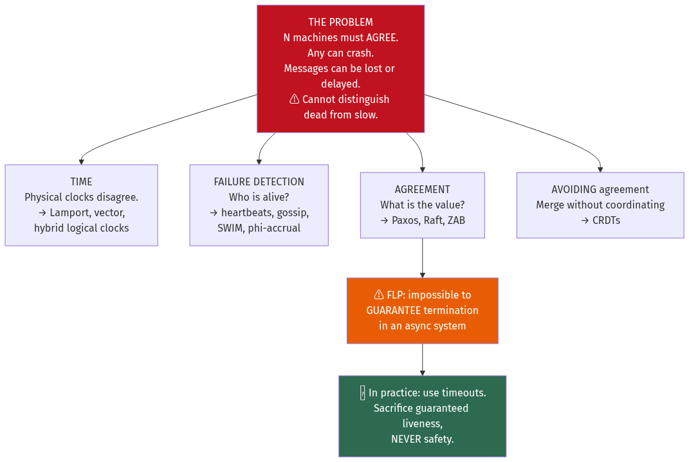
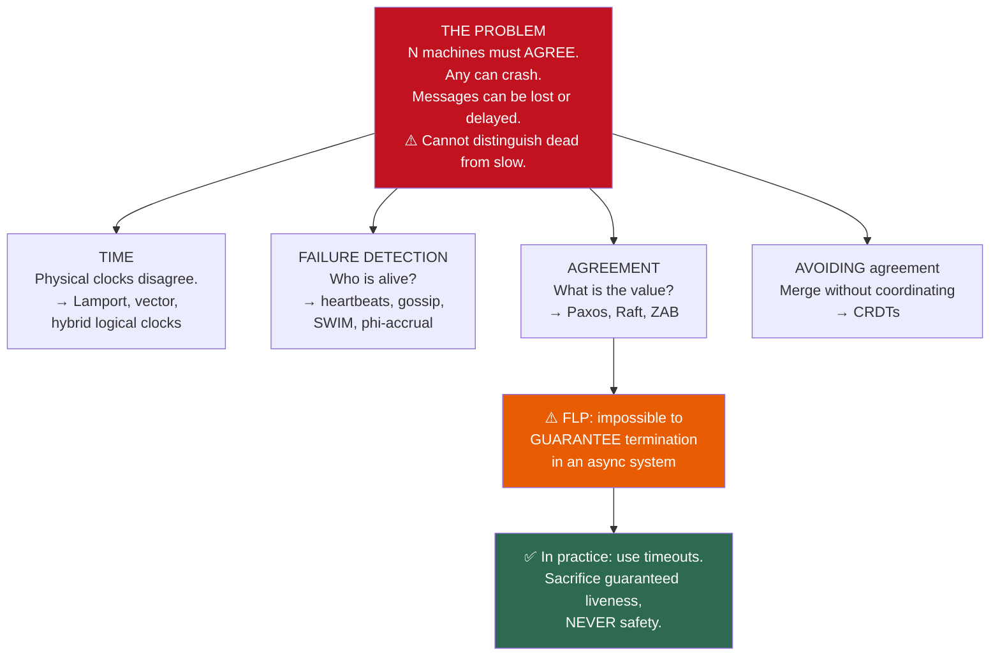
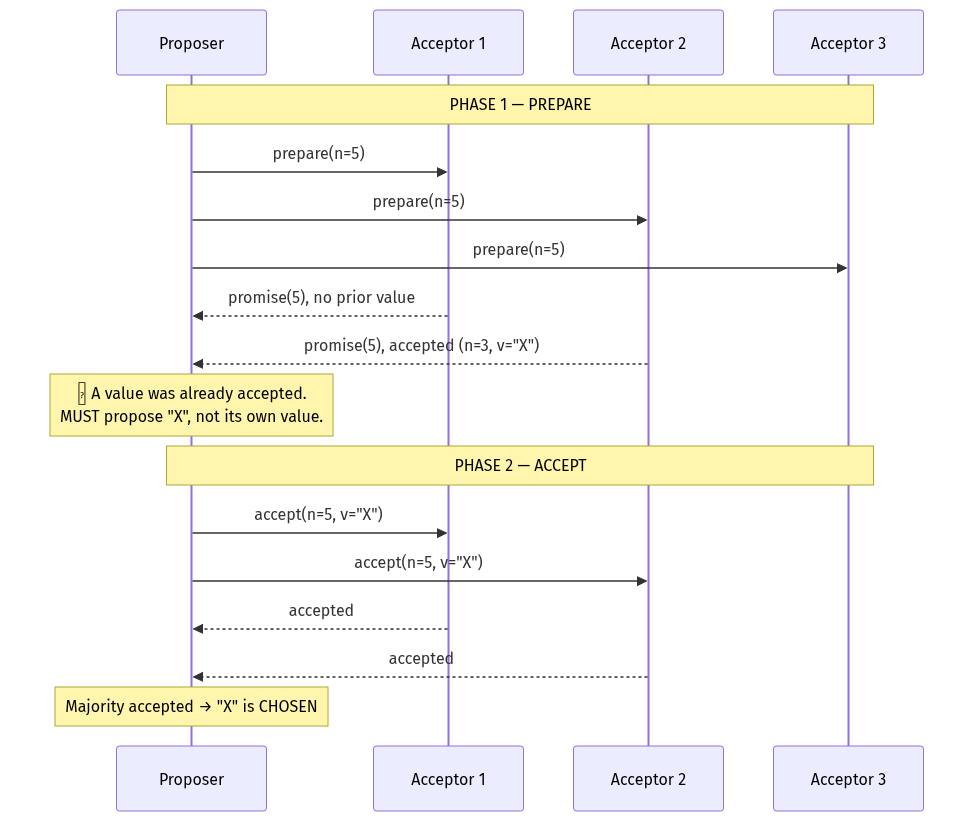
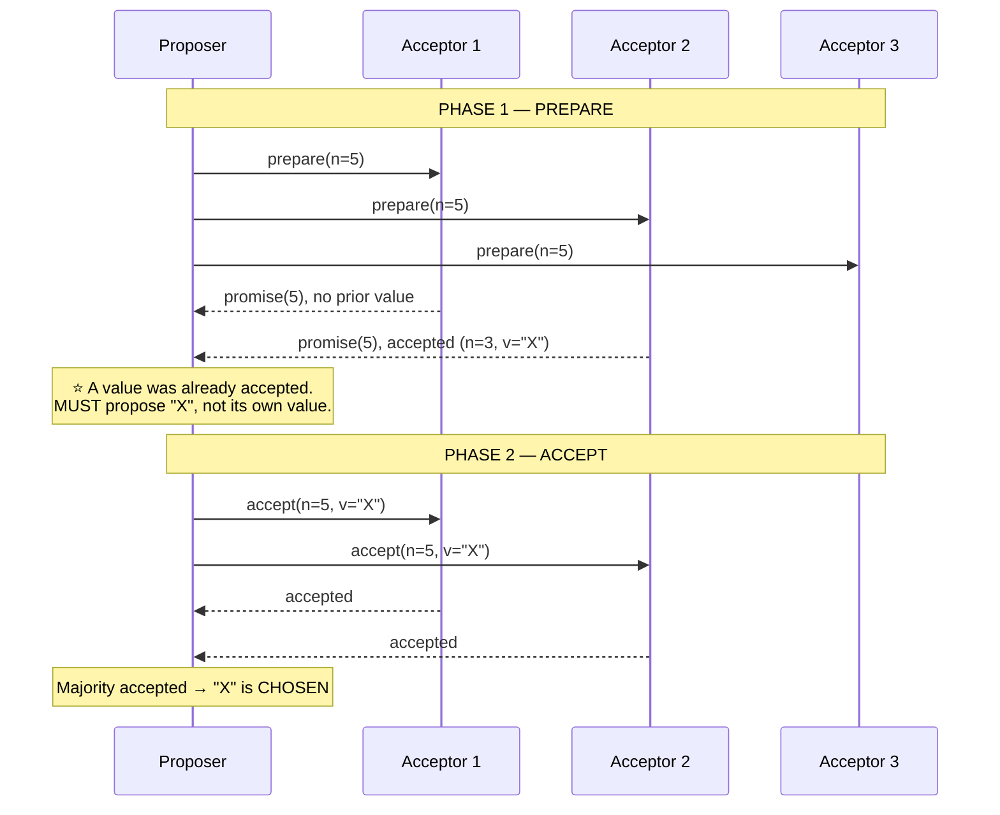
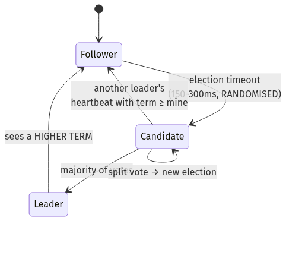
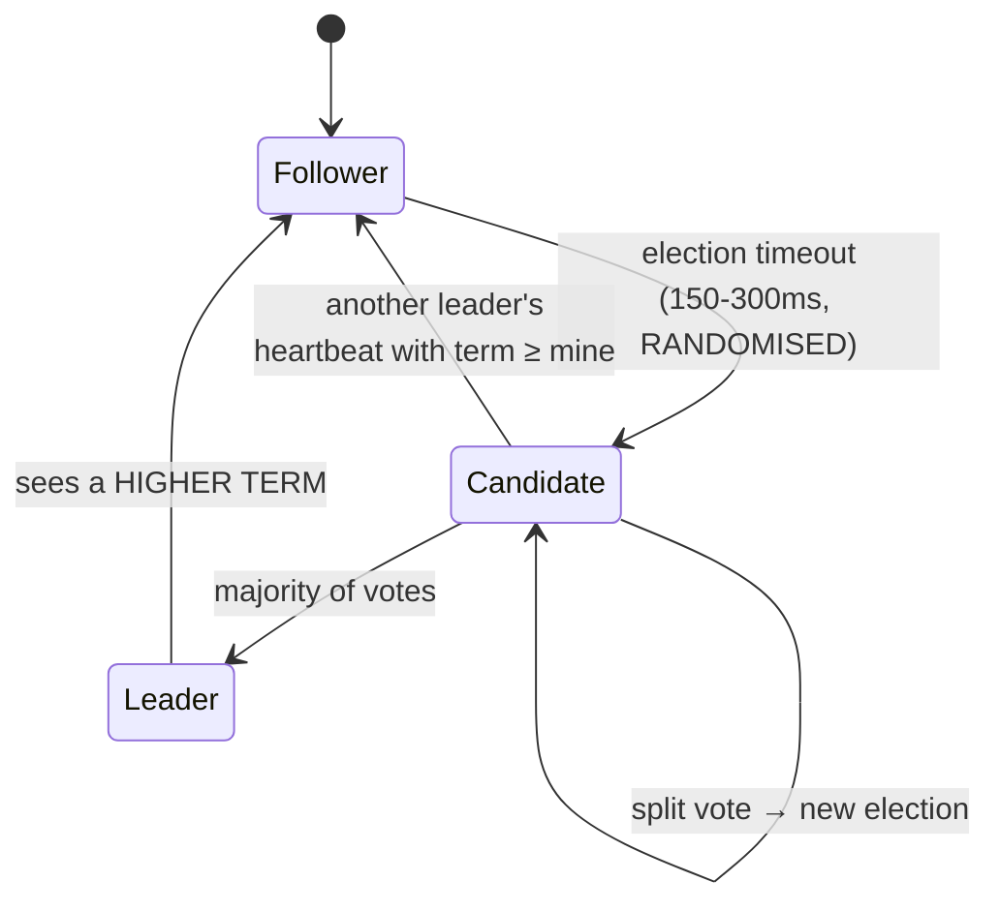
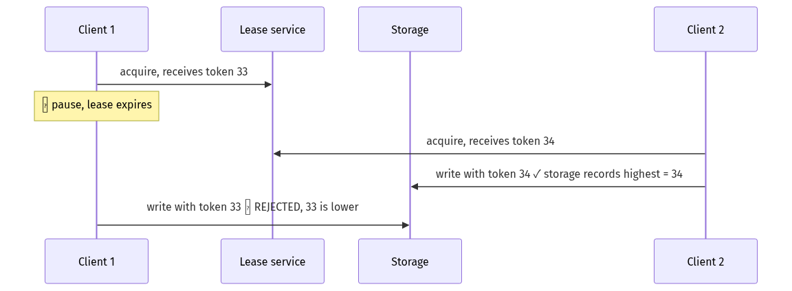
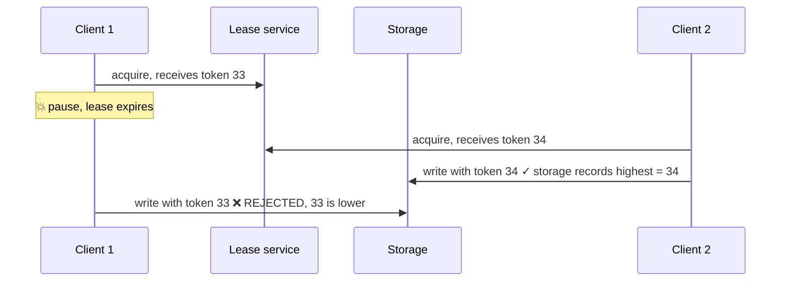

# Chapter 21 — Distributed Systems Theory and Consensus

[← Chapter 20](./20_deployment_multiregion_dr_cost.md) · [Contents](./README.md) · [Next: Chapter 22 →](./22_landmark_papers_and_architectures.md)

**Prerequisites:** [Chapter 9](./09_replication_partitioning_consistency.md) (replication, quorums, CAP) and [Chapter 10](./10_distributed_transactions_and_integrity.md) (2PC, linearizability).

---

## What you'll learn

- The **eight fallacies of distributed computing**, each with the outage it caused
- Why **clocks lie**, and the three kinds of logical clock that fix different parts of the problem
- **Vector clocks** worked through by hand, and what "concurrent" actually means
- **FLP impossibility** explained without the proof — what it forbids and what it permits
- **Paxos** and **Raft**, both traced through a real failure sequence
- Why an **even number of nodes is worse than odd**, with the arithmetic
- **Leases and fencing tokens** — the only correct way to build a distributed lock
- **Gossip and SWIM** — how a thousand nodes agree on who's alive without a coordinator
- The full **CRDT catalogue**, and why Google Docs uses OT instead

---

## Start from zero

One computer is easy to reason about. It has one clock, one memory, one notion of "now". If you
write a value and then read it, you get the value.

Add a second computer and every one of those guarantees disappears.

**The clocks disagree.** Machine A says 14:00:00.000; machine B says 14:00:00.037. Neither is
wrong — they're just independently drifting quartz crystals with a correction protocol that has
its own error.

**You cannot tell "dead" from "slow".** Machine A asks B a question and gets no answer within a
second. Is B down? Is the network partitioned? Is B garbage-collecting? Is the answer in flight
right now? **There is no way to distinguish these**, and that single fact generates most of this
chapter.

**Messages arrive out of order, twice, or never.** The network is not a wire; it's a series of
queues with independent policies.

📐 **So the central problem is this:** several machines must agree on something — who is the
leader, what the value is, what order things happened in — while any of them can crash at any
moment, the network can arbitrarily delay or drop messages, and nobody can reliably tell the
difference.

That problem is **consensus**, and it turns out to be both provably impossible in the general
case (§21.5) and routinely solved in practice (§21.6–21.7). Understanding how both of those are
true is the point of this chapter.

---

## The mental model



<details>
<summary>Diagram source (Mermaid)</summary>



</details>

---

## Deep dive

### 21.1 The eight fallacies

Peter Deutsch's list, with what each one actually costs.

| # | Fallacy | Reality | Real consequence |
| --- | --- | --- | --- |
| 1 | **The network is reliable** | Packets drop; links fail; switches reboot | Every remote call needs a timeout and a retry policy |
| 2 | **Latency is zero** | 0.5 ms in-rack; 150 ms transcontinental | A loop with a network call inside is 1,000× slower than you think |
| 3 | **Bandwidth is infinite** | 1 Gbps = 125 MB/s | Chatty protocols saturate links before CPU |
| 4 | **The network is secure** | It is not | mTLS everywhere; assume the network is hostile |
| 5 | **Topology doesn't change** | Autoscaling changes it constantly | Never hardcode addresses; use service discovery |
| 6 | **There is one administrator** | Dozens of teams, several clouds | Config drift; you can't coordinate a change globally |
| 7 | **Transport cost is zero** | Egress at $50–90/TB; serialisation costs CPU | Cross-AZ chatter can cost more than compute |
| 8 | **The network is homogeneous** | Wildly varying MTUs, latencies, loss rates | What works in the datacentre fails on mobile |

💡 **Fallacy 1 has a corollary that matters more than the fallacy itself:** because the network
is unreliable, **you can never know whether a message was received**. A timeout tells you
nothing — the request may have been lost, or executed successfully with the response lost. That
ambiguity is why idempotency
([Chapter 10](./10_distributed_transactions_and_integrity.md) §10.4) is not optional.

**Two documented cases:**
- **Facebook, 2021** (fallacy 5 and 6): a BGP configuration change withdrew the routes to
  Facebook's DNS servers. Because the topology *did* change and the tools needed to fix it
  depended on the DNS that had just disappeared, recovery took six hours.
- **Knight Capital, 2012** (fallacy 6): a deploy reached seven of eight servers. The eighth ran
  old code that reinterpreted a repurposed flag. It lost **$440 million in 45 minutes** and
  destroyed the company.

### 21.2 Failure models

| Model | The node… | Difficulty |
| --- | --- | --- |
| **Crash-stop (fail-stop)** | Halts and stays halted | Easiest |
| **Crash-recovery** | Halts, then returns — possibly with stale state | Standard assumption |
| **Omission** | Drops some messages | Handled by retries |
| **Timing** | Responds correctly but far too late | ⚠️ Indistinguishable from crashed |
| **Byzantine** | Arbitrary — may lie, or tell different nodes different things | Hardest; needs 3f+1 nodes |

**Timing assumptions matter as much as failure models:**

```
SYNCHRONOUS         — known bounds on message delay and clock drift
                      ✅ Consensus is easy.  ⚠️ Not the real world.
ASYNCHRONOUS        — no bounds at all
                      ⚠️ Consensus is IMPOSSIBLE with even one crash (FLP, §21.5)
PARTIALLY SYNCHRONOUS — bounds exist but are unknown, or hold only eventually
                      ⭐ The model real systems assume. Raft and Paxos live here.
```

💡 **Partial synchrony is the honest model.** It says: the network is usually well-behaved, and
occasionally isn't, and you don't know which period you're in. Algorithms designed for it
guarantee **safety always** and **liveness during good periods** — which is exactly the right
trade.

### 21.3 Physical clocks lie

**How NTP works:** query a time server, measure the round trip, estimate the offset, and
**slew** the local clock (adjusting its rate rather than jumping) to converge.

📐 **The accuracy you actually get:**
```
Public NTP over the internet:        ±10-100 ms
Datacentre NTP:                      ±1-10 ms
PTP (Precision Time Protocol):       ±1-100 µs
GPS/atomic + PTP (Spanner TrueTime): ±1-7 ms of BOUNDED uncertainty
```

⚠️ **The dangerous failure modes:**

**Clock jumps.** If NTP finds a large offset it may **step** the clock rather than slew it —
time goes backwards. Code computing `end - start` gets a negative duration; a cache TTL never
expires; a lease appears valid forever.

**Leap seconds.** In 2012, a leap second caused widespread Linux kernel livelocks — high CPU
across thousands of machines simultaneously. Google's response was **leap smearing**: spread the
extra second across a whole day so no discontinuity ever occurs.

**VM suspension.** A hypervisor pauses a VM for 30 seconds. From inside, wall-clock time jumps
forward with no CPU consumed. Any lease or lock the VM held has silently expired.

💡 **Always use a monotonic clock for measuring durations.**
```go
start := time.Now()          // ⚠️ wall clock — can jump backwards or forwards
elapsed := time.Since(start) // ✅ Go uses the MONOTONIC reading here
```
Go's `time.Time` carries both readings and `Since` uses the monotonic one. In other languages
you must choose explicitly: `clock_gettime(CLOCK_MONOTONIC)`, `System.nanoTime()`,
`time.monotonic()`.

⚠️ **Never use wall-clock timestamps to order events across machines.** A write that happened
*later* in real time can carry an *earlier* timestamp if its machine's clock is behind — which
is precisely the last-write-wins data-loss scenario from
[Chapter 9](./09_replication_partitioning_consistency.md) §9.4.

### 21.4 Logical clocks

#### Lamport clocks — ordering causality, cheaply

```
1. Every node keeps a counter L, starting at 0
2. Before any local event:  L = L + 1
3. When sending:            attach L
4. When receiving m:        L = max(L, m.L) + 1
```

📐 **The guarantee, and its limit:**
```
If a → b (a happened-before b), then L(a) < L(b).       ✅
If L(a) < L(b), it does NOT follow that a → b.          ⚠️
```
So a Lamport clock gives you a **total order** consistent with causality, but it cannot tell you
whether two events were genuinely concurrent or causally related. For that you need vectors.

#### Vector clocks — detecting concurrency

Each node keeps a **vector** of counters, one per node.

📐 **Worked example, three nodes:**
```
Start:  A[0,0,0]  B[0,0,0]  C[0,0,0]

A does a local write        → A[1,0,0]
A sends to B                → B receives, takes max, increments own: B[1,1,0]
B does a local write        → B[1,2,0]
C does a local write        → C[0,0,1]        ⚠️ C knows nothing of A or B
B sends to C                → C[1,2,2]
```

**Comparing two vectors:**
```
V1 ≤ V2  iff  every element of V1 ≤ the corresponding element of V2

V1 < V2   → V1 happened-before V2
V2 < V1   → V2 happened-before V1
Neither   → ⭐ CONCURRENT — a genuine conflict
```

```
A[1,0,0] vs C[0,0,1]:
  A[0]=1 > C[0]=0  and  A[2]=0 < C[2]=1
  → neither dominates → CONCURRENT → the application must resolve it
```

💡 **This is the difference that matters.** Last-write-wins silently discards one of two
concurrent writes. Vector clocks *detect* that they were concurrent, so the system can surface
both versions (Dynamo's siblings) or apply a domain-specific merge — union the shopping carts
rather than dropping one.

⚠️ **Vector clocks grow with the number of nodes**, which is why Dynamo used them on a bounded
replica set rather than cluster-wide, and why **version vectors** (one entry per *replica*, not
per client) are the practical variant.

#### Hybrid Logical Clocks

Combine a physical timestamp with a logical counter:
```
HLC = (physical_time, logical_counter)

On a local event:  if now() > pt: (now(), 0)   else: (pt, lc + 1)
On receive(m):     pt' = max(pt, m.pt, now());  adjust lc accordingly
```
✅ **Close to wall-clock time** (so timestamps are human-meaningful and comparable across
systems) **and** guaranteed to respect causality. Bounded size, unlike vector clocks.

💡 **HLCs are what modern distributed databases actually use** — CockroachDB, YugabyteDB and
MongoDB all rely on them. They're the pragmatic middle ground between "wall clocks are wrong"
and "vector clocks are too big".

#### TrueTime — buying certainty with hardware

Google's Spanner uses GPS receivers and atomic clocks in every datacentre, and exposes an API
that returns an **interval**, not a timestamp:
```
TT.now() → [earliest, latest]     with a guarantee that true time is within it
Typical width ε: 1-7 ms
```

📐 **The `commit-wait` trick:**
```
1. Pick a commit timestamp s = TT.now().latest
2. ⭐ WAIT until TT.now().earliest > s
3. Only then make the commit visible
```
The wait — a few milliseconds — guarantees that any transaction starting later in real time will
have a strictly greater timestamp. That's what gives Spanner **external consistency** (strict
serializability) globally.

⚠️ **The cost is real and permanent: every write pays the uncertainty interval as latency.**
Spanner buys global strict serializability with hardware and with milliseconds on every commit.

### 21.5 FLP impossibility

📐 **Fischer, Lynch and Paterson (1985): in an asynchronous system where even one process may
crash, there is no deterministic algorithm that guarantees consensus will terminate.**

**Why**, without the proof: in a truly asynchronous system you cannot distinguish a crashed
process from an arbitrarily slow one. Any algorithm must either wait forever for a process that
may be dead (violating **liveness**), or proceed without it and risk it waking up with a
different decision (violating **safety**).

⚠️ **What FLP does *not* say.** It doesn't say consensus is impossible in practice. It says no
algorithm can guarantee termination *in all executions*.

**How real systems escape it:**

| Escape | Mechanism |
| --- | --- |
| **Partial synchrony** | ⭐ Assume the network is *eventually* well-behaved. Use timeouts. |
| **Randomisation** | Ben-Or's algorithm terminates with probability 1 |
| **Failure detectors** | Assume an oracle that eventually stops suspecting live processes |

💡 **The practical consequence is a design rule: never sacrifice safety for liveness.** Raft and
Paxos guarantee that **two different values are never committed** — always, in every execution,
including during arbitrary partitions. What they cannot guarantee is that they will *make
progress* during a partition. A stalled cluster is acceptable; a cluster that commits two
conflicting values is a corrupted database.

🎯 **Safety versus liveness is the framing to use in interviews:**
```
SAFETY   — "nothing bad ever happens"  (never two leaders committing conflicting entries)
LIVENESS — "something good eventually happens" (a leader is eventually elected)

FLP: in an asynchronous system you cannot have both, guaranteed.
Practice: choose safety unconditionally; get liveness during good periods.
```

### 21.6 Paxos

Paxos solves consensus for a **single value**. Three roles, often played by the same processes:
**proposers**, **acceptors**, **learners**.



<details>
<summary>Diagram source (Mermaid)</summary>



</details>

**The three rules that make it safe:**
```
1. An acceptor promises never to accept a proposal numbered lower than one it has promised
2. ⭐ If any acceptor has already accepted a value, the proposer MUST re-propose the
   highest-numbered such value instead of its own
3. A value is chosen when a MAJORITY have accepted it
```

💡 **Rule 2 is the whole algorithm.** It's why Paxos is safe: once a value might have been
chosen, every subsequent proposal is forced to propose that same value. Agreement becomes
inevitable rather than negotiated.

⚠️ **Paxos has two practical problems:**
1. **Duelling proposers.** Two proposers can repeatedly out-number each other, and neither ever
   completes — a liveness failure, exactly as FLP predicts. Mitigated by electing a distinguished
   proposer.
2. **Two round trips per value.** Prohibitive for a replicated log with thousands of entries.

**Multi-Paxos** fixes both: elect a stable leader, run Phase 1 **once** for all future entries,
and then each new value needs only Phase 2 — **one round trip**.

⚠️ **And this is Paxos's real problem: the paper describes the single-value protocol, but every
production system needs Multi-Paxos, which the paper doesn't specify.** Every implementation
made different choices, and the result was decades of subtly incompatible, hard-to-verify
systems. Which is exactly why Raft was written.

### 21.7 Raft

Raft solves the same problem as Multi-Paxos and was designed explicitly **for
understandability**. Its central idea: decompose consensus into three independent pieces.

```
1. Leader election
2. Log replication
3. Safety (constraints ensuring the above can't produce divergence)
```

**Three states:**
```
FOLLOWER  → passive; responds to leaders and candidates
CANDIDATE → campaigning for votes
LEADER    → handles all client requests; replicates to followers
```

#### Leader election



<details>
<summary>Diagram source (Mermaid)</summary>



</details>

```
1. A follower hears no heartbeat within its election timeout
2. It increments currentTerm, becomes a candidate, votes for itself
3. It requests votes from everyone
4. A voter grants its vote if:
     • the candidate's term ≥ its own, AND
     • it hasn't already voted this term, AND
     • ⭐ the candidate's log is at least as up-to-date as its own
5. Majority → leader. It immediately sends heartbeats to suppress other elections.
```

💡 **Randomised election timeouts (150–300 ms) are the mechanism that avoids duelling
proposers.** Nodes time out at different moments, so one almost always wins before the others
start. That single design choice replaces Paxos's liveness problem with a probabilistic one that
resolves in a round or two.

⚠️ **Rule 4's last condition is what makes Raft safe.** A candidate whose log is missing
committed entries **cannot win**, so a new leader always contains every committed entry. That
one restriction eliminates an entire class of Paxos complexity.

#### Log replication

```
Leader log:   [1:x=1][2:y=2][3:x=5][4:z=9]
                 ↓ AppendEntries
Follower A:   [1:x=1][2:y=2][3:x=5][4:z=9]   ✅ matched
Follower B:   [1:x=1][2:y=2]                  ⚠️ behind — leader retries from index 3
Follower C:   [1:x=1][2:y=2][3:q=7]           ⚠️ CONFLICT — leader overwrites index 3
```

📐 **The commit rule:**
```
An entry is COMMITTED once it is replicated on a MAJORITY of servers.
⚠️ A leader may only mark an entry committed if it was created in the leader's
   CURRENT term. Older entries commit implicitly, via a later current-term entry.
```
⚠️ That second sentence looks like an obscure detail and it is genuinely load-bearing — without
it, a specific sequence of leader changes can cause a committed entry to be overwritten. It's
the subtlest part of Raft.

#### A failure walkthrough

```
Term 5. Leader L1, followers F1-F4. Log: [1..10] all committed.

t=0    Client sends x=11. L1 appends at index 11, sends AppendEntries.
t=1    F1, F2 acknowledge. ⭐ Majority (L1+F1+F2 = 3 of 5) → COMMITTED.
       L1 applies it and replies to the client.
t=2    💥 L1 crashes BEFORE F3 and F4 receive entry 11.
t=3    F3's election timeout fires (it's 210 ms; F1's is 280 ms).
       F3 → candidate, term 6, requests votes.
t=4    ⚠️ F1 REFUSES: F3's log ends at index 10; F1's ends at 11.
       F3's log is NOT as up-to-date. No vote.
       F2 refuses for the same reason.
       F4 votes yes (its log also ends at 10).
t=5    F3 has 2 votes of 5. NOT a majority. Election fails.
t=6    F1's timeout fires. F1 → candidate, term 7. Its log ends at 11.
       F2, F3, F4 all vote yes (F1's log is at least as complete as theirs).
t=7    ✅ F1 becomes leader with entry 11 intact. It replicates 11 to F3 and F4.
```

💡 **The committed entry survived the loss of the leader that created it**, because the
up-to-date-log voting restriction made it impossible for a node missing it to win. That's the
safety property, demonstrated.

#### Membership changes and snapshots

⚠️ **Naively changing the cluster from 3 to 5 nodes can produce two disjoint majorities** — one
computed under the old configuration, one under the new — and therefore two leaders.

**Two safe approaches:**
- **Joint consensus**: a transitional configuration requiring majorities in *both* old and new
  before switching.
- **Single-server changes**: add or remove **one node at a time**, which provably cannot create
  disjoint majorities. Simpler, and what most implementations use.

**Snapshots** bound the log. Without them it grows forever and a restarting node replays
everything. Each node periodically snapshots its state machine and truncates the log before that
point. ⚠️ A follower too far behind can't be caught up with `AppendEntries` — the leader must
ship the entire snapshot.

#### Paxos vs Raft

| | Paxos | Raft |
| --- | --- | --- |
| Leader | Optional (required in practice) | ⭐ Mandatory by design |
| Log entries | Can commit out of order | ⭐ Strictly sequential |
| Understandability | ⚠️ Notoriously difficult | Designed for it |
| Flexibility | More | Less, deliberately |
| Used by | Chubby, Spanner, Cassandra LWT | ⭐ etcd, Consul, CockroachDB, TiKV, RabbitMQ quorum queues |

💡 **They solve the same problem with the same guarantees.** Raft won on adoption because it can
be implemented correctly by a normal team, which turned out to matter more than flexibility.

### 21.8 Quorum arithmetic — and the even-node trap

📐 **Majority = ⌊N/2⌋ + 1. Tolerates ⌊(N−1)/2⌋ failures.**

| N | Majority | Failures tolerated | Comment |
| --- | --- | --- | --- |
| 1 | 1 | 0 | No fault tolerance |
| 2 | 2 | **0** | ⚠️ **Worse than 1** — two ways to fail, no tolerance gained |
| 3 | 2 | 1 | ⭐ Minimum useful |
| 4 | 3 | **1** | ⚠️ Same tolerance as 3, 33% more cost |
| 5 | 3 | 2 | ⭐ Standard for critical systems |
| 6 | 4 | 2 | Same as 5, more cost |
| 7 | 4 | 3 | Diminishing returns |

⚠️ **Always use an odd number.** Going from 3 to 4 nodes gains you nothing in fault tolerance
and adds a node that can fail, a node to pay for, and a node to include in every quorum round
trip — so it's strictly worse on availability *and* latency.

📐 **And more nodes is not linearly better:**
```
Every write must reach a majority.
N=3:  2 acknowledgements → latency = the 2nd-fastest node
N=7:  4 acknowledgements → latency = the 4th-fastest node
More nodes = more tolerance, but SLOWER writes and more replication traffic.
```
💡 5 is the usual sweet spot for a critical control plane; 3 for most things.

**Flexible quorums** are a useful refinement: consensus only requires that the Phase 1 and
Phase 2 quorums *intersect*, not that both are majorities. So with N=5 you could use a Phase 2
quorum of 2 (faster commits) and a Phase 1 quorum of 4 (slower, rarer leader elections).

### 21.9 Leases, fencing and split brain

**A lease is a lock with an expiry.** It solves the "holder crashed while holding the lock"
problem — the lease simply expires.

⚠️ **But a lease does not solve the pause problem**, and this is the crucial point from
[Chapter 10](./10_distributed_transactions_and_integrity.md) §10.7:

```
Client acquires a 30-second lease.
💥 Stop-the-world GC pause / VM suspension for 45 seconds.
Lease expires at 30 s. Another client acquires it and writes.
The first client wakes at 45 s, still believing it holds the lease, and writes.
→ Two writers. Corruption.
```

**The holder cannot know it lost the lease**, because from inside the process nothing happened.

#### Fencing tokens — the only correct fix



<details>
<summary>Diagram source (Mermaid)</summary>



</details>

💡 **The essential requirement: the resource being protected must check the token.** A lock is
only safe if the thing it protects can reject stale writers. If your storage layer can't do
that, you don't have a safe distributed lock — you have an optimisation that usually reduces
duplicate work.

⚠️ **Which is why the better answer is usually to make the operation idempotent and remove the
lock entirely.** Making double execution harmless is more robust than trying to guarantee single
execution.

#### Split brain

Two nodes both believe they are the leader. Prevention:

| Mechanism | How |
| --- | --- |
| **Quorum** | ⭐ Only a majority can elect a leader; two majorities cannot exist |
| **Fencing** | Stale leaders' writes are rejected by the storage layer |
| **STONITH** | "Shoot The Other Node In The Head" — power off the old primary |
| **Witness/tiebreaker** | A third lightweight node in a third location |
| **Lease with a bounded clock** | The old leader stands down before the new one starts |

⚠️ **Quorum alone doesn't prevent a *stale* leader from writing** — it prevents a *second* leader
from being elected. A partitioned old leader that hasn't yet noticed can still accept writes
until its lease expires. That's why leader leases are strictly shorter than election timeouts,
and why fencing exists.

### 21.10 Failure detection and gossip

**Heartbeats** are the basic mechanism, and they have an inherent trade-off:
```
Short timeout → fast detection, ⚠️ false positives from GC pauses and network blips
Long timeout  → few false positives, ⚠️ slow detection
```

💡 **Phi-accrual failure detectors** (used by Cassandra and Akka) replace the binary decision
with a **suspicion level**. They model the distribution of recent heartbeat inter-arrival times
and output φ = −log₁₀(probability this delay is normal). The application chooses its own
threshold — φ=8 means roughly a 1-in-10⁸ chance of a false positive — and different subsystems
can use different thresholds from the same signal.

#### Gossip

⚠️ **All-to-all heartbeating is O(N²)** — 1,000 nodes means a million messages per interval, and
[Chapter 2](./02_scalability_and_estimation.md) §2.6's coherency term takes over.

**Gossip** instead: each node periodically picks a few random peers and exchanges state.

📐 **Information spreads exponentially — O(log N) rounds to reach everyone:**
```
1,000 nodes, fanout 3:
  Round 1: 1 node knows → 3 more
  Round 2: 4 → 12
  Round 3: 16 → 48
  ...
  Round ~7: everyone
Messages per node per round: 3, not 999.
```

**SWIM** (Scalable Weakly-consistent Infection-style process group Membership) improves on naive
gossip with two ideas:
```
1. DIRECT PROBE:   A pings B. No response within the timeout?
2. INDIRECT PROBE: ⭐ A asks k other nodes to ping B on its behalf.
                   → distinguishes "B is dead" from "the A-B path is broken"
3. SUSPICION:      B is marked suspect, not dead, and gossiped as such.
                   B can refute it before being declared dead.
```
💡 **The indirect probe is SWIM's key contribution.** It dramatically reduces false positives
caused by a single bad network path, which naive heartbeating cannot distinguish from node
failure. Used by Consul (Serf), HashiCorp's memberlist, and Cassandra's newer membership.

### 21.11 CRDTs — agreement without coordination

**A Conflict-free Replicated Data Type** is a data structure whose merge operation is
**commutative, associative and idempotent**. Replicas can be updated independently and merged in
any order, any number of times, and always converge to the same state — **with no coordination
at all**.

📐 **That's the appeal: no consensus, no leader, no quorum round trip.** Availability during
partitions comes for free.

**State-based (CvRDT)** replicas exchange full state and merge with a join operation.
**Operation-based (CmRDT)** replicas exchange operations, which must be commutative and
delivered exactly once in causal order.

#### The catalogue

| CRDT | Merge | Use for |
| --- | --- | --- |
| **G-Counter** | Per-node counters; merge takes max per node, value is the sum | Increment-only counters |
| **PN-Counter** | Two G-Counters (increments, decrements) | Counters that go both ways |
| **G-Set** | Union | Add-only sets |
| **2P-Set** | Add-set ∪ minus remove-set | ⚠️ Once removed, can never be re-added |
| **OR-Set** | ⭐ Each add carries a unique tag; remove deletes observed tags | Sets with add and remove |
| **LWW-Register** | Highest timestamp wins | ⚠️ Loses data on concurrent writes |
| **MV-Register** | Keeps all concurrent values | The application resolves |
| **RGA / Logoot / YATA** | Ordered sequence with unique position identifiers | Collaborative text |

📐 **G-Counter, worked:**
```
Node A: [A:5, B:0, C:0]     Node B: [A:0, B:3, C:0]
Merge (element-wise max):   [A:5, B:3, C:0]
Value = 5 + 3 + 0 = 8       ✅ Any merge order gives the same answer.
```

📐 **Why OR-Set needs tags:**
```
Naive set, concurrent add and remove of "x":
  Replica A: add "x"      Replica B: remove "x"
  Merge → is "x" present? ⚠️ Undefined; depends on merge order.

OR-Set:
  A: add("x", tag=a1) → {x:[a1]}
  B (which had seen {x:[a0]}): remove("x") removes only the OBSERVED tag a0
  Merge → {x:[a1]}  → x is PRESENT
  ⭐ Deterministic, because remove only deletes tags it actually saw.
```

⚠️ **The costs are real:**
- **Metadata grows.** OR-Sets accumulate tombstones for removed tags; text CRDTs accumulate
  position identifiers. Garbage collection needs its own coordination or a causal-stability
  mechanism.
- **Not everything can be a CRDT.** Anything requiring a global invariant — "the balance must not
  go below zero", "this username is unique" — cannot be expressed, because that invariant is
  precisely what coordination is *for*.

#### OT vs CRDT for collaborative text

**Operational Transformation** transforms concurrent operations against each other so they can
be applied in any order:
```
Doc: "HELLO"
A: insert "X" at 0      B: insert "Y" at 5
B's op, transformed against A's → insert "Y" at 6
```
✅ Compact — no per-character metadata.
⚠️ Requires a **central server** to order operations, and the transformation functions are
notoriously hard to get right (several published OT algorithms were later shown incorrect).

**CRDTs for text** give each character a unique, densely-ordered identifier.
✅ **No central server**; works peer-to-peer and offline.
⚠️ Metadata per character — though modern implementations (Yjs, Automerge, Diamond Types) have
reduced this dramatically with run-length encoding.

💡 **Google Docs uses OT; Figma, Notion and Linear use CRDTs.** The difference is architectural:
Google Docs was designed around a central server that can order operations, so OT's requirement
costs nothing. Figma needed offline editing and peer-to-peer merging, where OT's central
ordering assumption doesn't hold.

### 21.12 Byzantine fault tolerance

Everything above assumes nodes **fail** but don't **lie**. Byzantine fault tolerance handles
nodes that behave arbitrarily — including maliciously, and including telling different nodes
different things.

📐 **You need 3f + 1 nodes to tolerate f Byzantine faults**, versus 2f + 1 for crash faults.
```
Tolerate 1 Byzantine node: 4 nodes
Tolerate 2:                7 nodes
```
**PBFT** achieves this in three phases (pre-prepare, prepare, commit) with O(N²) messages per
round.

⚠️ **You almost certainly don't need BFT.** Inside your own datacentre, nodes fail by crashing
and by being slow, not by lying. BFT costs more nodes, more messages and more latency to defend
against a threat model that doesn't apply. It matters for **blockchains** (mutually distrusting
participants), some aerospace systems, and cross-organisational consensus — not for your
service's replicated log.

💡 **The one place Byzantine-*ish* thinking helps in ordinary systems: checksums.** A disk that
returns wrong data ([Chapter 3](./03_reliability_availability_performance.md) §3.5's "response
failure") is behaving Byzantine-ly in a small way, and end-to-end checksums are the cheap
defence — which is exactly what ZFS does.

---

## Worked example — a distributed lock service

*Build a lock service for a system where at most one worker may process a given job. Jobs take
5–300 seconds. Workers run in Kubernetes and are subject to eviction, GC pauses and node
failures. Correctness matters — double processing charges a customer twice.*

**Step 1 — Rule out the naive approach and say why.**
```
❌ Redis SET NX PX 30000
   Redis replication is ASYNCHRONOUS. A failover loses recent writes,
   so two clients can hold the "same" lock. Redis's own docs say so.

❌ Redlock across 5 Redis instances
   ⚠️ Doesn't fix the real problem, which is not replication — it's that a
   PAUSED CLIENT cannot know it lost the lock. No lock service can fix that
   from the outside.
```

**Step 2 — The actual problem is the pause, not the lock service.**
```
t=0    Worker A acquires a 30 s lease for job J
t=5    Worker A begins processing
t=8    💥 Stop-the-world GC pause (or the node is under memory pressure,
       or the hypervisor suspends the VM)
t=35   Lease expires. Worker B acquires it and starts processing J.
t=50   Worker A wakes up. It has no idea any time passed.
       It completes processing and writes the result.
→ J processed TWICE. The customer is charged twice.
```
⚠️ **No amount of lock-service quality prevents this.** The lock service behaved correctly
throughout.

**Step 3 — Use a consensus-backed lease service.**
```
etcd (Raft) or ZooKeeper (ZAB), 5 nodes across 3 availability zones.

Why consensus rather than a single Redis:
  • Linearizable — Ch 9 §9.13: locking requires linearizability, full stop
  • A majority is required to grant, so two disjoint majorities cannot exist
  • Survives losing 2 of 5 nodes

Why 5 and not 3 or 4:
  N=3 tolerates 1 failure. During a rolling upgrade you're temporarily at 2,
    so one failure during maintenance is an outage.
  N=4 tolerates 1 — same as 3, more cost. ⚠️ Never use an even number.
  N=5 tolerates 2. ✅
```

```go
// etcd concurrency package: lease + session, with automatic keep-alive
session, err := concurrency.NewSession(client, concurrency.WithTTL(15))
defer session.Close()

mutex := concurrency.NewMutex(session, "/locks/job/"+jobID)
if err := mutex.Lock(ctx); err != nil { return err }
defer mutex.Unlock(ctx)
```
💡 **The session keeps the lease alive with a background heartbeat.** ⚠️ But if the *process*
pauses, the heartbeat pauses too — which is correct behaviour (the lease should expire) and
exactly why step 4 is required.

**Step 4 — ⭐ Fencing tokens. This is the part that actually makes it correct.**

```go
// The lease revision is monotonically increasing across the whole cluster.
token := mutex.Header().Revision

result := process(job)

// ⚠️ The STORAGE checks the token. The lock alone cannot.
_, err = db.Exec(`
    UPDATE jobs
    SET result = $1, status = 'done', fence_token = $2
    WHERE id = $3
      AND (fence_token IS NULL OR fence_token < $2)`,   -- ⭐ the fence
    result, token, jobID)
if rowsAffected == 0 {
    // Someone with a HIGHER token already wrote. We were fenced. Discard our work.
    metrics.Inc("job_fenced")
    return ErrFenced
}
```

📐 **Trace the failure again with fencing:**
```
t=0   A acquires lease, token = 33
t=8   💥 A pauses
t=35  Lease expires. B acquires, token = 34.
t=40  B completes and writes with token 34. DB records fence_token = 34. ✅
t=50  A wakes, completes, writes with token 33.
      WHERE fence_token < 33 → 34 is not < 33 → 0 rows updated. ❌ REJECTED.
→ Exactly one result is recorded. Correct.
```

**Step 5 — Choose the lease TTL.**
```
Jobs take 5-300 s. Lease TTL of 300 s?
  ⚠️ A crashed worker holds the lock for 5 minutes before anyone can retry.

Better: short TTL (15 s) with automatic renewal every 5 s.
  Crashed worker  → lease expires in 15 s → fast recovery
  Healthy worker  → renews indefinitely, however long the job takes
  Paused worker   → renewal stops, lease expires, and FENCING handles the
                    wake-up correctly
```
💡 **Short TTL plus renewal plus fencing is the combination.** Each piece fixes what the others
can't: renewal handles long jobs, short TTL handles crashes, fencing handles pauses.

**Step 6 — Handle the etcd cluster being unavailable.**
```
etcd needs a majority. During a partition, the minority side cannot acquire leases.

⚠️ FAIL CLOSED. Do not process without a lease.
   Availability of job processing < correctness of not double-charging.

Behaviour: workers that cannot acquire block and retry with backoff + jitter.
           Alert on lock-acquisition failure rate.
```
📐 **This is a deliberate CAP choice** ([Chapter 9](./09_replication_partitioning_consistency.md)
§9.11): **CP** for this operation. The system stops rather than risking double processing.

**Step 7 — The better design, stated honestly.**

⚠️ **All of the above is second-best. The best answer is to not need the lock.**

```go
// Make the operation IDEMPOTENT, and the lock becomes an optimisation
// rather than a correctness mechanism.
_, err := db.Exec(`
    INSERT INTO job_results (job_id, result, worker_id)
    VALUES ($1, $2, $3)
    ON CONFLICT (job_id) DO NOTHING`,    -- ⭐ the database's unique constraint
    jobID, result, workerID)
```
📐 **Now double processing is *wasteful* rather than *incorrect*.** The unique constraint —
enforced by a single linearizable database — is the real coordination point, and it can't be
defeated by a GC pause. The lock still earns its keep by avoiding duplicate work, but a lock
failure is no longer a correctness failure.

💡 **The general principle: prefer making concurrency harmless over preventing it.** It's more
robust, it degrades better, and it doesn't depend on every storage layer supporting fencing.

**Step 8 — Summary of what each mechanism buys.**

| Mechanism | Protects against |
| --- | --- |
| Consensus-backed lease (etcd, 5 nodes) | Two clients being granted the lock simultaneously |
| Short TTL + renewal | A crashed holder blocking the job for its full duration |
| ⭐ **Fencing token checked by storage** | A **paused** holder writing after its lease expired |
| ⭐ **Idempotent write with a unique constraint** | **Everything above failing** |
| Fail closed on lock-service unavailability | Correctness during a partition |

---

## Trade-offs

| Decision | Option A | Option B | Choose A when | Never choose A when |
| --- | --- | --- | --- | --- |
| Ordering events | Wall-clock timestamps | Logical clocks | ⚠️ Never across machines | Always B — clocks disagree by tens of ms |
| Logical clock | Lamport | Vector | You only need a total order | You must **detect** concurrency |
| Logical clock | Vector | ⭐ Hybrid Logical Clock | Small, fixed replica set | Large clusters — vectors grow with N |
| Consensus | Paxos | ⭐ Raft | You need Paxos's flexibility | Your team must implement and verify it |
| Cluster size | 4 nodes | ⭐ 3 or 5 | ⚠️ Never even | Even N gains no tolerance and costs latency |
| Cluster size | 3 | 5 | Cost matters; maintenance is rare | You need tolerance **during** maintenance |
| Failure detection | Fixed heartbeat timeout | Phi-accrual | Simple, uniform environment | Variable latency — accrual adapts |
| Membership | All-to-all heartbeats | ⭐ Gossip / SWIM | < ~20 nodes | Larger — O(N²) doesn't scale |
| Conflict handling | Last-write-wins | CRDT / app merge | Loss is acceptable | Data you can't recreate |
| Convergence | Consensus | CRDT | You need global invariants | Availability during partitions matters more |
| Distributed lock | Lock alone | ⭐ Lock + fencing token | ⚠️ Never for correctness | Storage can check tokens |
| Concurrency safety | Locking | ⭐ Idempotency | Contention must be prevented | Prefer B — it survives everything |
| Fault model | Crash | Byzantine | Your own datacentre | Mutually distrusting parties |

---

## How real companies do it

**Google's Chubby** is the original lock service, and the paper's most quoted observation is that
although it was built as a *lock* service, most users wanted it as a **small, highly-available
store for configuration and leader election**. That reframing is why etcd and ZooKeeper look the
way they do. Chubby also documented the operational reality: coarse-grained locks held for hours
or days, not fine-grained locks held for milliseconds.

**Raft's design paper** (Ongaro & Ousterhout, 2014) is unusual in that its stated goal was
**understandability**, and it included a user study to measure it. That's a defensible engineering
objective, and the outcome — etcd, Consul, CockroachDB, TiKV, RabbitMQ quorum queues and dozens
of others — suggests it was the right one.

**Amazon Dynamo** used vector clocks to detect concurrent writes and returned **siblings** to the
client to resolve. Their published experience was mixed: application developers found sibling
resolution genuinely hard, and later Dynamo-derived systems mostly moved to last-write-wins or
CRDTs precisely because the burden was too high.

**Cassandra** uses gossip with a **phi-accrual failure detector** rather than a fixed timeout,
letting each subsystem choose its own suspicion threshold from a shared signal. It also
demonstrates the mixed model: gossip for membership (AP), and Paxos for lightweight transactions
when linearizability is genuinely needed (CP).

**Figma's multiplayer implementation** is a good public account of choosing CRDTs over OT. Their
reasoning was specific: they needed offline editing and a model where the server doesn't have to
transform every operation, which OT's central-ordering requirement makes awkward.

---

## Common mistakes

**Using wall-clock timestamps to order events across machines.** Clocks disagree by tens of
milliseconds. A later write can carry an earlier timestamp, and last-write-wins then silently
discards it.

**Measuring durations with a wall clock.** NTP can step it backwards; a VM suspension steps it
forwards. Use a monotonic clock.

**An even number of consensus nodes.** 4 tolerates the same single failure as 3 while costing
more and making every quorum round trip slower.

**Assuming more nodes is always better.** 7 nodes means every write waits for the 4th-fastest
acknowledgement. Tolerance improves; latency degrades.

**Sacrificing safety for liveness.** A stalled cluster is recoverable; a cluster that committed
two conflicting values may not be.

**Believing a lease prevents two writers.** It prevents two *grants*. A paused holder cannot know
it lost the lease. You need fencing.

**Fencing tokens the storage layer doesn't check.** A token nobody validates is decoration.

**Using Redis for correctness-critical locking.** Asynchronous replication loses the lock on
failover, and Redlock doesn't address the pause problem at all.

**All-to-all heartbeating past ~20 nodes.** O(N²) messages, and it contributes directly to the
coherency term that makes throughput decline with cluster size.

**Fixed heartbeat timeouts in a variable-latency environment.** Either false positives or slow
detection. Phi-accrual adapts.

**Last-write-wins on data you can't recreate.** It discards a write silently, and it depends on
clocks that disagree.

**Trying to express a global invariant as a CRDT.** "Balance must not go negative" is exactly
what coordination is for; CRDTs deliberately avoid coordination.

**Adding Byzantine fault tolerance inside your own datacentre.** 3f+1 nodes and O(N²) messages to
defend against a threat model that doesn't apply.

**Changing cluster membership by more than one node at a time.** Can create two disjoint
majorities and therefore two leaders.

---

## Interview angle

**Q: Why can't you just use timestamps to order events across servers?**

*Strong:* "Because clocks disagree, and by enough to matter. NTP over the internet gives you
tens of milliseconds of error; even in a datacentre it's single-digit milliseconds. So a write
that genuinely happened *later* in real time can carry an *earlier* timestamp if its machine's
clock is behind — and if you're using last-write-wins, you then silently discard the newer
write, with no error and no way to detect it. There are worse failure modes too: NTP can **step**
the clock rather than slew it, so time goes backwards and a duration computation returns a
negative number; and a hypervisor suspending a VM makes wall-clock time jump forward with no CPU
consumed, which silently expires any lease you hold. So: use a **monotonic clock** for durations,
and **logical clocks** for ordering. Lamport clocks give a total order consistent with causality
but can't tell you whether two events were concurrent. **Vector clocks** can — if neither vector
dominates the other, the events are genuinely concurrent and you have a real conflict to resolve.
In practice modern databases use **hybrid logical clocks**, which stay close to wall time so
timestamps remain meaningful, while guaranteeing causal ordering, and don't grow with cluster
size the way vectors do."

**Q: Explain FLP impossibility and why we have Raft anyway.**

*Strong:* "FLP says that in a fully asynchronous system, where even one process may crash, no
deterministic algorithm can *guarantee* that consensus terminates. The intuition is that you
can't distinguish a crashed process from an arbitrarily slow one — so any algorithm must either
wait forever for something that might be dead, which breaks **liveness**, or proceed without it
and risk it waking with a different decision, which breaks **safety**. What FLP does *not* say is
that consensus is impossible in practice. It's a statement about guarantees in all executions,
not about typical behaviour. Real systems escape it by assuming **partial synchrony** — the
network is *eventually* well-behaved — and using timeouts. And the design rule that falls out is
the important part: **never sacrifice safety for liveness**. Raft guarantees that two conflicting
values are never committed, always, in every execution including arbitrary partitions. What it
can't guarantee is that it makes progress during a partition. A stalled cluster is an
inconvenience you recover from; a cluster that committed two conflicting values is a corrupted
database you might not."

**Q: Walk me through Raft leader election.**

*Strong:* "Three states — follower, candidate, leader — and a monotonically increasing **term**
number acting as a logical clock. A follower that hears no heartbeat within its election timeout
increments the term, becomes a candidate, votes for itself and requests votes. A voter grants its
vote if the candidate's term is at least its own, it hasn't already voted this term, and —
critically — **the candidate's log is at least as up-to-date as its own**. Majority wins, and the
new leader immediately sends heartbeats to suppress other elections. Two design choices carry
most of the weight. **Randomised election timeouts**, typically 150 to 300 milliseconds, mean
nodes rarely time out simultaneously, so one usually wins before the others start — that replaces
Paxos's duelling-proposers liveness problem with a probabilistic one that resolves in a round or
two. And the **up-to-date-log restriction** is what makes it safe: a node missing committed
entries cannot win, so every new leader contains every committed entry by construction. That
single rule eliminates a whole class of complexity that Paxos handles by forcing proposers to
re-propose previously-accepted values."

**Q: Should you use 3, 4 or 5 nodes for a consensus cluster?**

*Strong:* "**Never 4, and usually 3 or 5.** A majority is floor(N/2)+1, so you tolerate
floor((N−1)/2) failures. Three tolerates one, four *also* tolerates one — so the fourth node buys
you nothing in fault tolerance while adding another thing that can fail, another thing to pay
for, and another node in every quorum round trip. Even numbers are strictly worse. Between 3 and
5: three is fine for most things, but during a rolling upgrade you're temporarily at two, so a
single failure during maintenance is an outage. Five tolerates two failures and therefore
survives a failure during maintenance, which is why control planes and anything critical use it.
Beyond five you're into diminishing returns *and* increasing latency — with seven nodes every
write waits for the fourth-fastest acknowledgement rather than the second-fastest. So more nodes
means more tolerance but slower writes and more replication traffic; five is usually the sweet
spot for critical systems."

**Q: How do you implement a correct distributed lock?**

*Strong:* "The lock service itself must be **linearizable**, which means consensus-backed —
etcd or ZooKeeper, not Redis, because Redis replication is asynchronous and a failover can lose
the lock, letting two clients hold it. But the bigger point is that **even a perfect lock service
isn't enough**, and this is the part people miss. A client can acquire a 30-second lease, get
stop-the-world garbage-collected or have its VM suspended for 45 seconds, and wake up still
believing it holds the lock — while another client legitimately acquired it and is writing. The
holder has no way to know it lost the lock, because from inside the process nothing happened. No
lock service can fix that externally. The fix is **fencing tokens**: the lease service issues a
monotonically increasing number with each grant, the client includes it with every write, and
the **storage layer rejects writes carrying a token lower than the highest it has seen**. Which
means the resource being protected has to participate — if your storage can't check a token, you
can't have a safe distributed lock. And honestly, the better answer is usually to **make the
operation idempotent and drop the lock**: a unique constraint in a single linearizable database
makes double execution merely wasteful rather than incorrect, and that can't be defeated by a
pause."

**Q: What's a CRDT and when would you use one?**

*Strong:* "A data structure whose merge operation is commutative, associative and idempotent —
so replicas can be updated independently and merged in any order, any number of times, and always
converge. The point is that you get convergence **without any coordination**: no leader, no
quorum, no consensus round trip. That means full availability during a network partition, which
is the property you can't get from consensus. Concrete examples: a G-Counter keeps a per-node
count and merges by taking the max of each, so the total is order-independent. An OR-Set tags
every addition with a unique identifier so a remove only deletes tags it actually observed —
which makes concurrent add and remove resolve deterministically, whereas a naive set is
undefined. The costs are real though. **Metadata grows** — tombstones in sets, position
identifiers in text — and garbage-collecting it needs its own causal-stability mechanism. And
crucially, **not everything can be a CRDT**: anything requiring a global invariant, like 'the
balance must not go negative' or 'this username is unique', can't be expressed, because that
invariant is exactly what coordination exists to provide. So: CRDTs for collaborative editing,
presence, counters and shopping carts; consensus for anything with a global invariant."

---

## Recap

- **The core difficulty: you cannot distinguish a crashed node from a slow one.** Almost
  everything in this chapter follows from that.
- ⚠️ **Physical clocks disagree by milliseconds to tens of milliseconds** and can jump in both
  directions. Use **monotonic** clocks for durations, **logical** clocks for ordering.
- **Lamport** gives a causally-consistent total order; **vector clocks** additionally **detect
  concurrency**; **HLCs** are the practical compromise; **TrueTime** buys certainty with hardware
  and pays commit-wait on every write.
- **FLP:** no deterministic algorithm guarantees consensus terminates in an asynchronous system.
  ⭐ **The rule that follows: never trade safety for liveness.**
- **Paxos** is safe because a proposer must re-propose any previously-accepted value. **Raft**
  achieves the same guarantee more understandably via **randomised timeouts** and the
  **up-to-date-log voting restriction**.
- 📐 **Never use an even number of consensus nodes.** 4 tolerates the same failures as 3, more
  slowly and expensively. More nodes = more tolerance, slower writes.
- ⚠️ **A lease does not prevent a paused holder from writing.** Only **fencing tokens checked by
  the storage layer** do — and making the operation idempotent is better still.
- **Gossip spreads information in O(log N) rounds**; **SWIM's indirect probe** distinguishes a
  dead node from a broken path.
- **CRDTs converge without coordination** — but cannot express global invariants, which is
  precisely what coordination is for.
- **You almost certainly don't need Byzantine fault tolerance** inside your own infrastructure.

---

## Test yourself

1. Node A has vector clock `[3,1,0]`, node B has `[2,2,0]`. What is their relationship?
2. Your Raft cluster has 5 nodes. Two crash. Can it still commit writes? Three crash?
3. Explain why a 4-node consensus cluster is worse than a 3-node one.
4. A worker holds a 30-second lease and experiences a 40-second GC pause. Describe the failure
   and the only correct fix.
5. Why does Raft randomise election timeouts, and what happens without it?
6. Your service uses NTP and orders events by wall-clock timestamp. Two datacentres have a 40 ms
   clock offset. Describe a concrete data-loss scenario.
7. Can a G-Counter CRDT be used to enforce "stock must not go below zero"? Explain.
8. 1,000 nodes need to know which members are alive. Compare all-to-all heartbeating with gossip
   numerically.
9. During a network partition, your Raft cluster of 5 splits 3–2. What happens on each side?
10. Explain why FLP doesn't prevent etcd from working in production.

<details>
<summary>Answers</summary>

1. Compare element-wise:
   ```
   A[0]=3 > B[0]=2   → A is ahead on the first component
   A[1]=1 < B[1]=2   → B is ahead on the second
   ```
   Neither vector dominates the other, so **the events are CONCURRENT** — neither
   happened-before the other. This is a genuine conflict, and the system must either surface both
   versions to the application (Dynamo's siblings) or apply a domain-specific merge. ⚠️ Applying
   last-write-wins here would silently discard one of two legitimately concurrent updates, which
   is exactly the data loss vector clocks exist to detect.

2. **Two crash: yes.** Majority of 5 is 3, and 3 nodes remain — they can elect a leader and
   commit. Note performance degrades: every write now needs all 3 survivors to acknowledge, so
   latency is bounded by the slowest of them, and any further failure stops the cluster.
   **Three crash: no.** Only 2 nodes remain, which is not a majority, so no leader can be elected
   and no entry can be committed. The cluster is **read-only at best** and unavailable for writes
   until a node returns. ⚠️ This is the correct behaviour — proceeding without a majority would
   risk two disjoint groups both committing, which is a corrupted log. Safety over liveness.

3. Majority of 4 is 3, so it tolerates **1** failure — exactly the same as a 3-node cluster,
   whose majority is 2. The fourth node therefore adds:
   - **No fault tolerance** whatsoever
   - **Another node that can fail**, so the probability of *some* node being down increases
   - **More cost** — 33% more infrastructure
   - **Slower writes**, because a quorum is now 3 acknowledgements instead of 2, so latency is
     bounded by the third-fastest node rather than the second-fastest
   - **More replication traffic**
   So it is strictly worse on availability, latency and cost. **Always use an odd number.** The
   only legitimate use of an even count is transiently, during a membership change made one node
   at a time.

4. **The failure:** the lease expires at 30 s while the worker is paused. Another worker
   legitimately acquires it and begins processing. At 40 s the first worker resumes — from inside
   the process, no time has passed and nothing indicates a problem — and completes its work,
   writing results. Two workers have now processed the same job, and for something like a payment
   that means charging twice. ⚠️ Crucially, **the lock service behaved perfectly correctly
   throughout**; the fault is that a paused process cannot learn it lost the lease.
   **The only correct fix: fencing tokens.** The lease service issues a monotonically increasing
   token with each grant; every write carries the token; and the **storage layer rejects any write
   whose token is lower than the highest it has recorded**. The paused worker's write with token
   33 is rejected because the storage has already seen 34. This requires the protected resource to
   participate — if your storage can't check tokens, you cannot have a safe distributed lock.
   **The better fix**, where possible, is to make the operation **idempotent** — a unique
   constraint on `job_id` makes double processing wasteful rather than incorrect, and that
   survives every failure mode above.

5. **To avoid split votes and duelling candidates.** If every follower used the same fixed
   timeout, they would all detect leader loss at the same instant, all become candidates
   simultaneously, and all vote for themselves — so nobody reaches a majority. The election
   fails, they all time out together again, and the cycle repeats. That's Paxos's duelling-
   proposers liveness problem, and FLP says you can't eliminate it deterministically.
   **With randomisation** (typically 150–300 ms), one node's timer fires meaningfully earlier than
   the others'. It becomes a candidate, collects votes and sends heartbeats before the others
   time out, suppressing further elections. If a split vote does occur, the next round has fresh
   random timeouts and almost certainly resolves. This converts a deterministic livelock into a
   probabilistic delay that terminates within a round or two — which is precisely the practical
   escape from FLP.

6. ```
   DC-West clock is 40 ms BEHIND DC-East.

   t=1000ms real: user in DC-West updates their profile → "correct name"
                  DC-West's clock reads 1000
   t=1010ms real: a stale retry from DC-East writes → "old name"
                  DC-East's clock reads 1050 (40 ms ahead)

   Replication merges them. Last-write-wins compares 1050 > 1000.
   → The EARLIER write (DC-East's) WINS.
   → The user's genuine, later update is silently discarded.
   ```
   No error is raised, nothing is logged, and the user simply sees their change revert. This is
   the standard last-write-wins data-loss scenario, and it's why LWW is unsafe for data you can't
   recreate. **Fixes:** use **vector clocks or version vectors** to detect that the writes were
   concurrent and surface both, or use **hybrid logical clocks** which guarantee causal ordering
   regardless of physical clock skew, or route all writes for a given key to a single home region
   so concurrent conflicting writes cannot occur.

7. **No.** A G-Counter is increment-only and — more fundamentally — CRDTs are designed to
   converge **without coordination**, which means each replica accepts operations locally without
   consulting the others. So during a partition, two replicas each holding "stock = 1" can both
   accept a decrement, converging afterwards to −1. The invariant is violated and there is no
   point at which anything could have prevented it, because preventing it requires the replicas
   to agree *before* accepting the operation — which is exactly the coordination CRDTs avoid.
   Even a PN-Counter (which supports decrements) has the same problem: it converges to a
   consistent value, but that value can be negative.
   ⚠️ **Global invariants require coordination, by definition.** For inventory you need either
   consensus (a linearizable check-and-decrement) or a reservation model where stock is
   partitioned in advance — each region holds a disjoint allocation it may decrement locally, so
   no cross-region invariant needs checking. That partitioning approach is how real systems get
   both availability and correctness.

8. ```
   ALL-TO-ALL: each node heartbeats every other node each interval.
     Messages per interval = N × (N−1) = 1,000 × 999 = 999,000
     Per node: 999 outbound messages per interval
     Bandwidth at 1-second intervals and 100-byte heartbeats:
       ~100 MB/s across the cluster, purely for liveness
     ⚠️ Scales as O(N²) — doubling the cluster quadruples the traffic

   GOSSIP (fanout 3):
     Messages per interval = N × 3 = 3,000
     Per node: 3 outbound messages
     Propagation: O(log N) rounds ≈ log₃(1000) ≈ 7 rounds to reach everyone
     Bandwidth: ~0.3 MB/s
   ```
   **Gossip uses roughly 333× fewer messages** and scales linearly rather than quadratically, at
   the cost of eventual rather than immediate convergence — about 7 intervals for information to
   reach every node. That trade is obviously correct at 1,000 nodes, and this is also the
   coherency term from [Chapter 2](./02_scalability_and_estimation.md) §2.6: all-to-all
   communication is exactly the N² behaviour that makes throughput decline as clusters grow.
   **SWIM** improves further by adding indirect probes, which distinguish a dead node from a
   single broken network path and so cut false positives substantially.

9. **Majority side (3 nodes):** retains or elects a leader — 3 is a majority of 5 — and
   **continues committing writes normally**. It may be briefly unavailable during a leader
   election if the old leader was on the minority side, typically a few hundred milliseconds.
   **Minority side (2 nodes):** cannot elect a leader, because 2 is not a majority. If it
   contains the old leader, that leader **steps down** when its leadership lease expires or when
   it sees a higher term. It **cannot commit any writes**. It can serve stale reads if the system
   permits follower reads, and clients attempting writes get an error or a timeout.
   ⚠️ **This is correct and deliberate.** The alternative — letting the minority commit — would
   produce two divergent logs and a corrupted database. Availability is sacrificed for safety, as
   FLP's design rule requires. When the partition heals, the minority nodes discover the higher
   term, truncate any uncommitted entries that conflict, and catch up from the leader.

10. Because FLP is a statement about **guarantees in all possible executions**, not about typical
    behaviour. It proves that no deterministic algorithm can guarantee termination in a **fully
    asynchronous** system with even one crash fault — because you cannot distinguish crashed from
    slow, so any algorithm must risk either waiting forever or proceeding unsafely.
    etcd escapes this in two ways. First, it assumes **partial synchrony**: real networks are
    *usually* well-behaved, so timeouts are a reasonable — if imperfect — failure detector. When
    the assumption holds, Raft makes progress; when it doesn't, Raft simply doesn't make progress,
    which is permitted. Second, **randomised election timeouts** make the pathological case FLP
    constructs — an adversarial schedule that keeps a system permanently undecided — vanishingly
    improbable rather than impossible.
    The crucial point is **what etcd never gives up: safety.** It will never commit two
    conflicting entries, in any execution, under any partition. It only ever gives up **liveness**
    — it may stall. And a stalled cluster is something you recover from, whereas a divergent log
    may not be recoverable at all. FLP forces the choice; every correct system makes the same one.

</details>

---

## Further reading

- Fischer, Lynch & Paterson, *Impossibility of Distributed Consensus with One Faulty Process* (1985)
- Lamport, *Time, Clocks, and the Ordering of Events in a Distributed System* (1978) — short and foundational
- Lamport, *Paxos Made Simple* (2001); Ongaro & Ousterhout, *In Search of an Understandable Consensus Algorithm* (Raft, 2014)
- Burrows, *The Chubby Lock Service for Loosely-Coupled Distributed Systems*, OSDI 2006
- Das, Gupta & Motivala, *SWIM: Scalable Weakly-consistent Infection-style Process Group Membership Protocol* (2002)
- Shapiro et al., *Conflict-free Replicated Data Types* (2011)
- Kleppmann, *Designing Data-Intensive Applications*, Chapters 8 and 9
- Kleppmann, *How to do distributed locking* — the fencing-token argument
- The Raft visualisation at thesecretlivesofdata.com — genuinely the fastest way to build intuition

---

[← Chapter 20](./20_deployment_multiregion_dr_cost.md) · [Contents](./README.md) · [Next: Chapter 22 — Landmark Papers and Real Architectures →](./22_landmark_papers_and_architectures.md)
