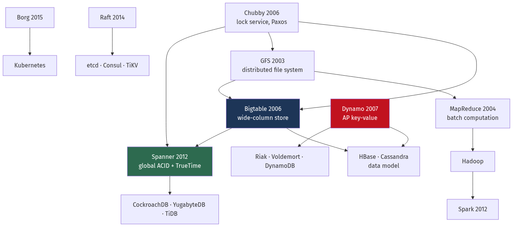
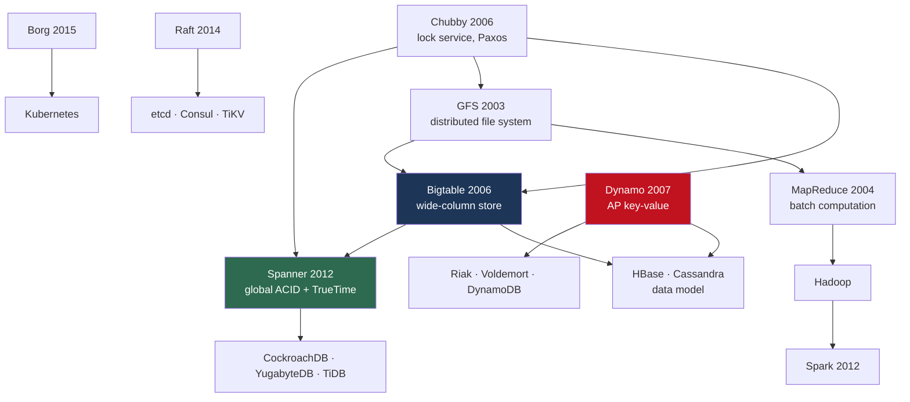

# Chapter 22 — Landmark Papers and Real Architectures

[← Chapter 21](./21_distributed_systems_theory_consensus.md) · [Contents](./README.md) · [Next: Chapter 23 →](./23_building_blocks_and_algorithms.md)

**Prerequisites:** Most of the book. This chapter connects everything to its source.

---

## What you'll learn

- The **fifteen papers** that produced almost every distributed system you use, each distilled to its one central idea
- **What to steal** from each — the specific technique that transfers
- ⚠️ **What aged badly** — the parts that were right for 2004 and are wrong now
- How the papers **relate to each other**: which ones are reactions to which
- Real production architectures — Facebook's TAO, Netflix, Discord, Uber — and the constraint that drove each

---

## Start from zero

Almost nothing in distributed systems is new. The techniques you use daily were invented
between roughly 2003 and 2015, by a handful of organisations solving problems nobody had faced
before, and published.

Reading the originals is worth doing for a reason that isn't obvious: **the papers state the
constraints**. A blog post tells you Cassandra uses consistent hashing; the Dynamo paper tells
you *why* — Amazon needed the shopping cart to accept writes during a network partition, and
decided a cart that occasionally resurrects a deleted item is better than one that refuses to
accept items. That's a **business decision expressed as an architecture**, and it's the part
that transfers.

💡 **The most useful habit this chapter can give you: when you read about a technique, ask what
constraint produced it.** If your constraints differ, the technique may not apply. Bigtable
exists because Google had no joins to perform and petabytes to store. If you have joins and
gigabytes, Bigtable's descendants will make your life worse, not better.

⚠️ **And the papers describe what was true then.** GFS assumed 64 MB chunks were large and that
a single master was acceptable. Both assumptions were later abandoned by Google itself. Read
them as engineering history with transferable ideas, not as instructions.

---

## The mental model



<details>
<summary>Diagram source (Mermaid)</summary>



</details>

💡 **Two families, and they represent opposite answers to CAP.** Google's line (GFS → Bigtable →
Spanner) chose **consistency** and built increasingly sophisticated machinery to make it
affordable. Amazon's line (Dynamo) chose **availability** and pushed conflict resolution onto
the application. Nearly every modern datastore descends from one or the other.

---

## Deep dive

### 22.1 Google File System (2003)

**Constraint:** store petabytes on thousands of cheap machines that fail constantly, for
workloads that append large files and read them sequentially.

**Central idea:** design for the *actual* workload rather than the general case. Files are huge
and append-only; random writes essentially don't happen; component failure is normal rather than
exceptional.

```
Single MASTER holds all metadata (file → chunk mapping) IN MEMORY
Chunks are 64 MB, replicated 3×, stored on chunkservers
⭐ Clients get chunk locations from the master, then talk DIRECTLY to chunkservers
   → the master is never on the data path
```

**What to steal:**
- **Separate the control plane from the data plane.** The master handles metadata only, so one
  machine can coordinate petabytes. This pattern is everywhere now — Kafka's controller, Kubernetes'
  API server, every object store.
- **Relaxed consistency where the application tolerates it.** GFS offered "at least once" append
  with possible duplicates, because MapReduce could handle it. Weakening a guarantee the caller
  doesn't need is free performance.
- **Design for the workload you have.** 64 MB chunks are absurd for small files and perfect for
  MapReduce inputs.

⚠️ **What aged badly:**
- **The single master became the bottleneck** — memory limited the number of files, and it was a
  single point of failure. Google replaced GFS with **Colossus**, which distributes metadata.
- **64 MB chunks are terrible for small files.** GFS was bad at exactly the workload most
  applications have.
- **Replication (3×) rather than erasure coding.** Colossus uses Reed-Solomon at roughly half the
  storage cost ([Chapter 6](./06_storage_engines_internals.md) §6.10).

### 22.2 MapReduce (2004)

**Constraint:** let engineers who are not distributed-systems experts process petabytes.

**Central idea:** ⭐ **restrict the programming model so the system can handle the hard parts.**
If you can only express `map` and `reduce`, the framework can automatically parallelise,
distribute, retry and handle stragglers.

```
map(k1, v1)    → list(k2, v2)
shuffle        → group by k2          ⚠️ the expensive part (Ch 13 §13.1)
reduce(k2, list(v2)) → list(v3)
```

**What to steal:**
- **A restricted model buys automatic distribution.** The same bargain underlies SQL, Spark's
  DataFrames and every serverless platform.
- ⭐ **Backup tasks for stragglers.** Near the end of a job, speculatively re-execute
  slow-running tasks on other machines and take whichever finishes first. Google reported this
  cut job completion time by ~44% in one case. It's the same idea as hedged requests
  ([Chapter 3](./03_reliability_availability_performance.md) §3.10).
- **Move computation to the data.** Schedule map tasks on the machines holding the input.

⚠️ **What aged badly:** materialising intermediate results to disk between every stage. Spark's
central contribution was keeping them in memory, giving 10–100× on iterative workloads. Google
themselves moved to Flume/Dataflow. **The programming model survived; the execution engine
didn't.**

### 22.3 Chubby (2006)

**Constraint:** Google needed a reliable way to elect leaders and store small critical
configuration.

**Central idea:** a **lock service with a filesystem interface**, built on Paxos, deliberately
designed for *coarse-grained* locks held for hours or days.

⭐ **The most quoted finding in the paper is about how it was used**, not how it was built: most
users didn't want locks. They wanted **a small, highly-available, strongly-consistent store** for
configuration and name resolution.

**What to steal:**
- **That reframing.** It's why etcd and ZooKeeper are configuration stores that happen to support
  locking, and why Kubernetes stores its entire state in etcd.
- **Coarse-grained locking.** Chubby explicitly discouraged fine-grained locks — the overhead and
  the failure modes aren't worth it at millisecond granularity.
- ⚠️ **Sequencers** — Chubby's name for **fencing tokens**
  ([Chapter 21](./21_distributed_systems_theory_consensus.md) §21.9). The paper documents that
  locks alone are insufficient, in 2006.

⚠️ **What aged badly:** the filesystem abstraction is more awkward than a plain key-value API,
which is why etcd chose the latter. And Chubby's client-side caching with invalidations added
complexity that later systems mostly avoided.

### 22.4 Bigtable (2006)

**Constraint:** store the web index and Google Earth tiles — petabytes, sparse, with no joins.

**Central idea:** ⭐ **a sparse, distributed, persistent, multi-dimensional sorted map.**
```
(row key, column family:qualifier, timestamp) → value
```
Rows are sorted lexicographically and partitioned into **tablets** by range. The LSM machinery
from [Chapter 6](./06_storage_engines_internals.md) §6.5 — memtable, SSTables, compaction —
originates here.

**What to steal:**
- ⭐ **Sorted row keys make range scans free.** Bigtable's canonical example is reversing URLs
  (`com.google.maps/index.html`) so pages from one domain sort together. **Key design is the
  entire data model.**
- **Column families** as the unit of locality and access control — columns in a family are
  stored together.
- **Range partitioning with automatic splitting** as tablets grow.

⚠️ **What aged badly:**
- **No transactions across rows.** Google had to build Percolator (§22.9) on top, and later
  Spanner, precisely because this was too restrictive.
- ⚠️ **Range partitioning creates hotspots on sequential keys** — the timestamp-prefix problem
  from [Chapter 9](./09_replication_partitioning_consistency.md) §9.7. Every Bigtable descendant
  documents "don't use a monotonically increasing row key" as its top warning.

### 22.5 Dynamo (2007)

⭐ **The most influential systems paper of the 2000s, and the clearest example of a business
constraint producing an architecture.**

**Constraint:** the Amazon shopping cart must **always accept writes**, even during a network
partition. An "add to cart" that fails costs a sale.

**Central idea:** choose **availability over consistency**, and push conflict resolution to the
application.

```
Consistent hashing with virtual nodes  → Ch 23 §23.1
Quorums: W + R > N                     → Ch 9 §9.5
Sloppy quorum + hinted handoff         → availability during partitions
Vector clocks                          → detect concurrent writes (Ch 21 §21.4)
Merkle trees                           → anti-entropy repair
Gossip                                 → membership without a coordinator
```

💡 **Almost every technique in [Chapter 9](./09_replication_partitioning_consistency.md) comes
from this one paper.**

**What to steal:**
- ⭐ **"Always writeable" as a product decision.** The paper is explicit: a cart that occasionally
  resurrects a deleted item is better than one that rejects an add. State the business trade,
  then choose the architecture.
- **Tunable consistency per operation** — N, R and W as knobs rather than a system-wide property.
- **Zero-downtime membership changes** via consistent hashing.

⚠️ **What aged badly — and Amazon said so:**
- **Vector clocks and sibling resolution proved too hard for application developers.** Later
  Dynamo-derived systems, including DynamoDB itself, largely moved to last-write-wins or CRDTs.
- **The fully decentralised, gossip-based design was operationally painful.** DynamoDB's 2022
  paper describes a much more centrally-managed system with a Paxos-based control plane.
- 💡 **The irony worth noting: DynamoDB is not Dynamo.** It kept the availability goals and
  replaced most of the mechanisms.

### 22.6 Cassandra (2010)

**Constraint:** Facebook's inbox search — write-heavy, geographically distributed, must survive
datacentre loss.

**Central idea:** ⭐ **Dynamo's distribution model with Bigtable's data model.** Consistent
hashing, gossip and tunable quorums from one; column families, SSTables and LSM storage from the
other.

**What to steal:** the synthesis itself. Two orthogonal design axes — how you *distribute* and
how you *store* — can be chosen independently.

⚠️ **What aged badly:** the JVM. Cassandra's characteristic operational problem is
garbage-collection pauses interacting with compaction to produce tail-latency spikes, which is
precisely why Discord replaced it with **ScyllaDB** — a C++ reimplementation with a
shard-per-core architecture and no GC ([Chapter 6](./06_storage_engines_internals.md)).

### 22.7 Spanner (2012)

**Constraint:** Google's advertising system needed **global ACID transactions**. The consensus
at the time was that this was impossible.

**Central idea:** ⭐ **make clock uncertainty explicit and bounded, then wait it out.**

**TrueTime** returns an interval `[earliest, latest]` rather than a timestamp, guaranteed to
contain the true time, with ε typically 1–7 ms — achieved with GPS receivers and atomic clocks in
every datacentre.

```
Commit protocol:
  1. Choose commit timestamp s = TT.now().latest
  2. ⭐ WAIT until TT.now().earliest > s          ← "commit-wait"
  3. Only then make the commit visible
```
📐 The wait guarantees any transaction starting later in real time gets a strictly greater
timestamp — which delivers **external consistency** (strict serializability) globally.

**What to steal:**
- ⭐ **Making uncertainty explicit rather than pretending it doesn't exist.** Most systems assume
  clocks are correct and break silently when they aren't. Spanner assumes they're wrong, bounds
  by how much, and waits.
- **Paying a known, bounded cost for a strong guarantee** is often better than an unbounded
  unknown risk.

⚠️ **What aged badly / what to be careful of:**
- **It requires special hardware.** CockroachDB and YugabyteDB implement Spanner-like semantics
  with hybrid logical clocks instead ([Chapter 21](./21_distributed_systems_theory_consensus.md)
  §21.4), accepting weaker guarantees — CockroachDB provides serializability, not strict
  serializability.
- ⚠️ **Commit-wait is a permanent latency tax on every write.** Spanner is expensive in
  milliseconds as well as money.

### 22.8 Borg (2015) → Kubernetes

**Constraint:** run every Google workload — latency-sensitive services and batch jobs — on shared
machines at high utilisation.

**Central ideas, and Kubernetes inherited all of them:**
```
⭐ DECLARATIVE specification  — say what you want, not how (Ch 17 §17.4)
⭐ LABELS, not hierarchies    — flexible grouping via selectors
   Reconciliation loops       — controllers converge actual toward desired
   Mixed workloads            — batch fills the gaps left by services
   Resource requests/limits   — with priority-based preemption
```

**What to steal:** the **declarative + level-triggered** model. It's the reason Kubernetes
self-heals: a controller acts on *current state*, not on events, so a missed event doesn't matter
and a restarted controller recovers automatically.

⚠️ **What Kubernetes changed deliberately:** the Borg paper's own "lessons learned" section
criticised its job/task hierarchy as inflexible, and recommended labels — which Kubernetes
adopted. It also identified the lack of an IP-per-container as a mistake, which Kubernetes fixed
with its network model.

### 22.9 Percolator (2010)

**Constraint:** Google needed **incremental** updates to the web index. MapReduce required
reprocessing everything.

**Central idea:** ⭐ **cross-row transactions built on top of a store that doesn't support
them**, using a client-side 2PC with lock and write columns in Bigtable itself.

**What to steal:** you can layer transactions over a non-transactional store using
single-row atomicity as the primitive. **TiDB's transaction model is directly derived from
Percolator.**

⚠️ **What aged badly:** latency. Percolator traded ~100× worse latency per document for
incremental processing — acceptable for indexing, unacceptable for a serving path.

### 22.10 Zanzibar (2019)

**Constraint:** authorisation for Google Docs, Drive, YouTube, Photos — trillions of
relationships, global, single-digit millisecond checks.

**Central idea:** ⭐ **model permissions as a graph of relationship tuples**, and answer "is there
a path from this user to this object?"

```
document:readme#viewer@group:eng#member
group:eng#member@user:alice
```

💡 **The genuinely hard problem is consistency, not modelling.** If Alice revokes Bob's access
and Bob immediately loads the document, a stale cache leaks it — the **"new enemy" problem**.
Zanzibar's answer is **zookies**: opaque consistency tokens pinning a check to a point in the
graph's history, so a decision cannot be answered from data older than the revocation.

**What to steal:** the tuple model (implemented by SpiceDB, OpenFGA, Ory Keto) and, more
importantly, the recognition that **caching an authorisation decision is a security decision**.

### 22.11 Facebook TAO (2013)

**Constraint:** serve the social graph — a read:write ratio of roughly **500:1**, at
billions of reads per second.

**Central idea:** a **read-optimised graph cache in front of sharded MySQL**, with a
deliberately simple data model (objects and associations) and **eventual consistency by
default**.

```
Objects:      typed nodes with key-value data
Associations: typed directed edges, with a timestamp, queryable as a sorted list
```

**What to steal:**
- ⭐ **Optimise for the actual ratio.** At 500:1 reads, almost any cost on the write path is
  worth paying to make reads cheap.
- **Restrict the data model to make caching tractable.** TAO deliberately doesn't support
  arbitrary graph traversal, because that would make cache invalidation impossible.
- **A leader region per shard** — writes go to one region, reads are local everywhere.

### 22.12 The Tail at Scale (2013)

Not an architecture — an **argument**, and one of the most useful papers in this book.

📐 **The core claim:** at scale, tail latency dominates.
```
A service with a 1% chance of being slow, fanned out to 100 servers:
  1 − 0.99¹⁰⁰ = 63% of requests contain a slow call.
```

**Techniques it introduced:**
- ⭐ **Hedged requests** — send to a second replica if the first hasn't answered by P95. Google
  reported reducing P99 from 1,800 ms to 74 ms for 2% extra load in one BigTable service.
- **Tied requests** — both replicas cancel each other when one starts.
- **Micro-partitioning** — far more partitions than machines, so hot ones can be moved.
- **Selective replication** — extra replicas for hot partitions only.

💡 **This paper is why [Chapter 3](./03_reliability_availability_performance.md) §3.10 exists**,
and why hedging is built into gRPC.

### 22.13 The rest, briefly

| Paper | Constraint | ⭐ Central idea | What to steal |
| --- | --- | --- | --- |
| **Raft** (2014) | Paxos is too hard to implement correctly | Decompose consensus into election, replication, safety | Randomised timeouts; the up-to-date-log voting restriction ([Ch 21](./21_distributed_systems_theory_consensus.md)) |
| **Kafka** (2011) | Unify a mess of point-to-point pipelines | A distributed, partitioned, replayable **log** as the integration point | Consumers track their own offsets; the log is the source of truth ([Ch 12](./12_messaging_and_event_streaming.md)) |
| **Dremel** (2010) | Interactive queries over petabytes | Columnar storage for **nested** data + a multi-level serving tree | Repetition/definition levels — the basis of Parquet ([Ch 13](./13_big_data_batch_stream_analytics.md)) |
| **Aurora** (2017) | Cloud databases waste network I/O | ⭐ **"The log is the database"** — ship only redo records to a distributed storage fleet | 7.7× reduction in network I/O; separate compute from storage |
| **Haystack** (2010) | Facebook photos — one file per photo exhausted inodes | Pack many photos into large append-only volumes with an in-memory index | Small-object storage needs packing, not a filesystem |
| **Gorilla** (2015) | Facebook's time-series volume | Delta-of-delta timestamps + XOR-encoded values → **~1.37 bytes/point** | The encoding behind Prometheus ([Ch 2](./02_scalability_and_estimation.md) §2.3) |
| **Calvin** (2012) | 2PC is slow | ⭐ **Determinism**: agree the transaction *order* first, then execute — no commit protocol needed | The basis of FaunaDB; a genuinely different approach to distributed transactions |
| **Chord / consistent hashing** (1997/2001) | Distributed lookup without a coordinator | Hash ring with O(log N) routing | Consistent hashing ([Ch 23](./23_building_blocks_and_algorithms.md)) |

### 22.14 Production architectures worth studying

#### Netflix

**Constraint:** stream a double-digit percentage of North American internet traffic, with a
service that must degrade rather than fail.

```
Open Connect     — appliances INSIDE ISP networks; content pre-positioned overnight
Chaos Monkey     — continuously kill instances so failover is always exercised
Hystrix          — circuit breakers and bulkheads (⚠️ now maintenance-only; replaced
                   by adaptive concurrency limits — static thresholds are always wrong)
Per-title encode — analyse each title rather than using one bitrate ladder (~20% saving)
```
💡 **The pattern: push work as close to the user as physically possible**, and assume every
component will fail.

#### Discord

**Constraint:** trillions of messages, and a hard requirement on tail latency.
```
MongoDB (2015) → Cassandra (2017) → ScyllaDB (2022)
177 Cassandra nodes → 72 ScyllaDB nodes; P99 read latency ~40 ms → ~15 ms
```
⚠️ **The migration was driven by *tail latency*, not throughput** — JVM garbage collection and
compaction produced spikes severe enough to page engineers routinely. They also switched to
**Rust** for the data-service layer. The key data-modelling detail is the bucketed partition key
`((channel_id, bucket), message_id)` from
[Chapter 8](./08_nosql_and_polyglot_persistence.md) §8.3.

#### Uber

**Constraint:** real-time dispatch at city scale, then global scale.
```
Python monolith → Schemaless (MySQL as an append-only KV store, custom sharding)
                → Go for dispatch; Ringpop for consistent hashing + gossip
                → M3 (metrics), Jaeger (tracing), both open-sourced
2020: ⚠️ Domain-Oriented Microservice Architecture — CONSOLIDATING thousands
      of microservices into coarser domains
```
💡 **The 2020 reversal is the most valuable part.** Uber publicly documented that
over-decomposition made coordination cost exceed the benefit — the clearest counterweight to
microservices enthusiasm ([Chapter 16](./16_microservices_and_service_architecture.md)).

#### Stack Overflow

**Constraint:** a top-50 website, and a deliberate decision not to distribute.
```
9 web servers, 1 SQL Server primary, Redis, Elasticsearch
Database CPU routinely in single digits
```
💡 **The counter-example that should inform every architecture discussion.** They scaled
vertically and cached obsessively, and published the numbers. Most organisations distribute far
earlier than necessary.

#### Cloudflare

**Constraint:** operate a global anycast network and be transparent about failures.
```
Anycast from 300+ cities (Ch 4 §4.6)
Workers — V8 isolates rather than containers, ~5 ms cold start
Unimog — eBPF/XDP load balancing (Ch 5 §5.11)
```
💡 **Their post-incident reports are unusually detailed and prompt**, including ones where their
own tooling caused the outage. Read them as models of the blameless format applied publicly.

---

## Worked example — deriving a design from the papers

*Design a globally-distributed collaborative document editor supporting 100 million documents,
offline editing, and real-time multi-user presence. Justify each choice by the paper it comes
from.*

**Step 1 — What guarantee does each part actually need?**

| Component | Requirement | CAP position |
| --- | --- | --- |
| Document content | ⭐ Must accept edits **offline** | **AP** — availability is the product |
| Document metadata (title, owner) | Consistent enough | AP with a home region |
| **Permissions** | ⚠️ Revocation must take effect | **CP** — a stale allow is a breach |
| Presence ("Alice is typing") | Ephemeral | AP, best-effort |
| Billing | ⚠️ Correctness | **CP** |

💡 **Different components get different guarantees.** Applying one consistency model uniformly
would either make offline editing impossible or make permission revocation unsafe.

**Step 2 — Document content: CRDTs, not consensus.**

*From Shapiro et al. (CRDTs) and against Spanner.*
```
Offline editing means a client accepts writes with NO connectivity.
→ Consensus is impossible by definition — you cannot reach a quorum from a plane.
→ Sequence CRDT (RGA/YATA — Yjs or Automerge)

⚠️ NOT Operational Transformation: OT requires a central server to order and
   transform operations, which offline editing rules out. (Ch 21 §21.11)
   This is exactly why Google Docs uses OT and Figma uses CRDTs — different
   constraints, different answer.
```
📐 **Cost:** per-character position identifiers. Modern implementations use run-length encoding,
bringing overhead to roughly 1.5–3× the document size rather than the 10×+ of naive designs.

**Step 3 — Storage: the log is the database.**

*From Aurora and Kafka.*
```
Store the CRDT UPDATE LOG, not repeated document snapshots.
  • An edit is an append — sequential I/O (Ch 6 §6.1)
  • Any historical version is reconstructible → version history for free
  • Periodic SNAPSHOTS bound replay cost (Ch 12 §12.12)

📐 Sizing:
  100M documents × ~50 KB average = 5 TB of current state
  Update log at ~10× the state before compaction = 50 TB
  → Compact aggressively; keep snapshots + recent deltas
```

**Step 4 — Partitioning: Bigtable's key design, Dynamo's ring.**

*From Bigtable and Dynamo.*
```
Partition key: document_id (hashed)
  ✅ High cardinality, even distribution, query-aligned (Ch 9 §9.7)
  ✅ All operations on one document hit one partition
  ⚠️ NOT range-partitioned on document_id — sequential IDs would hotspot the
     newest partition, which is Bigtable's documented top warning.

Consistent hashing with virtual nodes for placement (Dynamo)
  → adding capacity moves 1/N of data, not 95% (Ch 23 §23.1)
```

**Step 5 — Geo-distribution: TAO's leader region.**

*From TAO and Spanner (by contrast).*
```
Each document has a HOME REGION, chosen at creation (usually the creator's).
  Writes  → routed to the home region, then replicated asynchronously
  Reads   → served locally from any region

⚠️ Why not Spanner-style global consensus? Commit-wait adds milliseconds to
   every write, and for a keystroke-level editor that is unacceptable —
   and unnecessary, because CRDTs converge without coordination anyway.
```
📐 **The read:write asymmetry justifies it**, exactly as TAO's does: a document is read far more
often than edited, so optimise reads and accept cross-region write routing.

**Step 6 — Permissions: Zanzibar, and it must be CP.**

*From Zanzibar.*
```
document:doc1#owner@user:alice
document:doc1#viewer@group:eng#member
document:doc1#parent@folder:specs      ← inheritance

⚠️ Permission checks must be LINEARIZABLE (Ch 9 §9.13). A stale "allow" after
   a revocation is a data breach — the "new enemy" problem.
   → Use consistency tokens (zookies), or a very short cache TTL (seconds).
```
💡 **This is the one component where availability loses.** If the permission service is
unreachable, **fail closed** — deny access. Serving a document to someone whose access was
revoked is worse than a brief outage.

**Step 7 — Presence: gossip, and deliberately unreliable.**

*From Dynamo/SWIM.*
```
Presence is ephemeral, high-churn, and worthless after 10 seconds.
→ Redis with a 10 s TTL, plus pub/sub for fan-out (Ch 15 §15.4)
→ ⚠️ Do NOT persist it. Ch 2 §2.3's Uber example: durable storage for
   ephemeral data is the most common over-engineering there is.
```

**Step 8 — Real-time transport: SSE and WebSocket.**

*From [Chapter 15](./15_apis_and_protocols.md).*
```
Editing session: WebSocket (genuinely bidirectional — the client streams edits up)
Presence/cursors: multiplexed on the same connection
Connection registry: user → server in Redis, pub/sub for cross-server routing

📐 1M concurrent editors ÷ 500k per server = 2 servers minimum;
   realistically 6 for headroom and AZ spread.
```

**Step 9 — Tail latency: hedge the reads.**

*From The Tail at Scale.*
```
Loading a document fans out: content + permissions + presence + metadata.
📐 4 calls, each with a 1% slow tail → 1 − 0.99⁴ = 3.9% of loads are slow.

Mitigations:
  • Hedged requests to a second replica at P95 (~5% extra load)
  • ⭐ Return partial results: render the document while presence still loads
  • Reduce fan-out: co-locate metadata with content
```

**Step 10 — The full attribution.**

| Decision | Paper | Why it applies here |
| --- | --- | --- |
| CRDT for content | Shapiro et al. | Offline editing makes consensus impossible |
| **Not** OT | (Google Docs uses OT) | OT needs a central orderer; offline rules it out |
| Log-structured storage | Aurora, Kafka | Sequential writes; free version history |
| Hash partition by doc ID | Bigtable (inverted) | Avoid the sequential-key hotspot Bigtable warns about |
| Consistent hashing | Dynamo | Membership changes move 1/N |
| Home region per document | TAO | Read:write asymmetry; avoids global consensus |
| **Not** TrueTime | Spanner (rejected) | Commit-wait is unacceptable per keystroke |
| Zanzibar tuples for permissions | Zanzibar | Inheritance and sharing are relationships, not roles |
| Fail-closed permissions | Zanzibar | A stale allow is a breach |
| Ephemeral presence | Dynamo/SWIM | Don't persist what expires in 10 seconds |
| Hedged requests | Tail at Scale | 4-way fan-out amplifies the tail |

💡 **Notice how many decisions are papers *rejected*.** Not using Spanner's TrueTime and not
using OT are as important as the techniques adopted — and both rejections come from the same
place: **stating the constraint first, then checking whether the technique's originating
constraint matches.**

---

## Trade-offs

| Decision | Option A | Option B | Choose A when | Never choose A when |
| --- | --- | --- | --- | --- |
| Consistency philosophy | Google line (CP, Spanner) | Amazon line (AP, Dynamo) | Global invariants; correctness dominates | Writes must succeed during a partition |
| Conflict resolution | Vector clocks + siblings | LWW or CRDTs | You can push resolution to the app | ⚠️ Amazon found app developers can't do it |
| Global transactions | Spanner (TrueTime) | HLC-based (CockroachDB) | You have GPS/atomic hardware | Commodity infrastructure — accept serializability, not strict |
| Batch execution | MapReduce (disk between stages) | Spark (in-memory) | Datasets exceed memory by far | Iterative workloads — B is 10–100× |
| Storage engine | Replication (GFS) | Erasure coding (Colossus) | Hot, small, latency-critical | Large cold objects — B halves the cost |
| Metadata | Single master (GFS) | Distributed (Colossus) | Simplicity; bounded file count | Memory limits the number of files |
| Collaborative editing | OT | CRDT | Central server always available | Offline or peer-to-peer editing |
| Service granularity | Many microservices | Domain-oriented | Teams genuinely block each other | ⚠️ Uber found thousands was too many |
| Resilience config | Static thresholds (Hystrix) | Adaptive limits | Never — hardware and code change | Netflix themselves moved to adaptive |

---

## How to read a paper

💡 A method that makes this tractable, adapted from Keshav's three-pass approach:

```
PASS 1 (10 min):  Title, abstract, intro, section headings, conclusion.
                  ⭐ Answer: what CONSTRAINT were they solving?
PASS 2 (1 hour):  Figures, tables, the main mechanism. Skip proofs.
                  ⭐ Answer: what is the ONE central idea?
PASS 3 (several): Reproduce the reasoning. Challenge assumptions.
                  ⭐ Answer: does that constraint apply to ME?
```

⚠️ **Most papers only need pass 1 or 2.** And the questions that matter for engineering are the
starred ones — the mechanism is usually less transferable than the constraint that produced it.

**A reading order, if you're starting:**
```
1. Dynamo          — the most techniques per page
2. The Tail at Scale — short, and changes how you think about latency
3. Raft            — the most readable consensus paper by a wide margin
4. Bigtable        — the LSM/wide-column model everything descends from
5. Spanner         — the opposite pole from Dynamo
6. Borg            — why Kubernetes is shaped as it is
7. Zanzibar        — a modern paper on a problem you probably have
```

---

## Common mistakes

**Copying a technique without its constraint.** Bigtable exists because Google had no joins and
petabytes of data. Adopting a wide-column store for a relational workload makes everything
harder.

**Treating papers as current.** GFS's single master and 64 MB chunks were both later abandoned
**by Google**. Read them as history with transferable ideas.

**Assuming DynamoDB is Dynamo.** DynamoDB kept the availability goals and replaced most of the
mechanisms — including dropping vector clocks, which Amazon found application developers
couldn't use.

**Adopting Spanner-like consistency without the hardware.** TrueTime needs GPS and atomic
clocks. HLC-based systems provide serializability, not strict serializability, and the
difference matters for some workloads.

**Using Hystrix-style static thresholds.** Netflix moved away from them because a threshold
correct at deploy time is wrong six months later. Use adaptive concurrency limits.

**Citing Netflix or Google to justify complexity.** Their constraints are not yours. Stack
Overflow served a top-50 website from nine servers, and that's the more relevant reference for
most organisations.

**Reading only the abstract.** The constraints and the "lessons learned" sections are where the
transferable value is — Borg's criticism of its own job hierarchy is more useful than its
architecture diagram.

**Ignoring what the authors said aged badly.** Dynamo on sibling resolution, Borg on hierarchies,
GFS on small files — the papers frequently tell you their own limitations.

---

## Interview angle

**Q: What's the most influential distributed systems paper and why?**

*Strong:* "**Dynamo, 2007** — it has the highest density of transferable techniques of any paper
I know: consistent hashing with virtual nodes, quorums with W plus R greater than N, sloppy
quorums and hinted handoff, vector clocks, Merkle-tree anti-entropy, and gossip membership. Most
of what you'd say about a modern AP datastore traces to it. But the more valuable thing is the
*framing*. The paper opens with a business constraint — the Amazon shopping cart must accept
writes during a network partition, because a failed 'add to cart' costs a sale — and explicitly
argues that a cart occasionally resurrecting a deleted item is preferable to one that rejects
additions. That's a **business decision expressed as an architecture**, and it's the reasoning
that transfers even when the mechanisms don't. And it's worth knowing what Amazon later said
aged badly: vector clocks and sibling resolution proved too hard for application developers, and
the fully decentralised design was operationally painful — DynamoDB today has a Paxos-based
control plane and doesn't expose siblings at all."

**Q: How does Spanner provide global ACID transactions?**

*Strong:* "By making clock uncertainty **explicit and bounded**, then waiting it out. TrueTime
returns an interval rather than a timestamp — `[earliest, latest]`, guaranteed to contain the
true time, with an uncertainty of roughly one to seven milliseconds, achieved with GPS receivers
and atomic clocks in every datacentre. The commit protocol picks a timestamp at
`TT.now().latest`, then **waits until `TT.now().earliest` has passed it** before making the
commit visible. That commit-wait guarantees any transaction starting later in real time gets a
strictly greater timestamp, which is what delivers external consistency — strict serializability
— globally. The insight worth stealing is the general one: most systems assume clocks are correct
and break silently when they aren't; Spanner assumes they're wrong, bounds by how much, and pays
a known cost. The trade-off is that **every write pays the uncertainty as latency**, permanently.
And it needs special hardware, which is why CockroachDB and YugabyteDB implement Spanner-like
semantics with hybrid logical clocks instead — giving serializability rather than strict
serializability, on commodity infrastructure."

**Q: Why did Kubernetes turn out the way it did?**

*Strong:* "It's Borg's lessons applied deliberately, and the Borg paper's own 'lessons learned'
section reads like a Kubernetes design document. Three ideas carried over. **Declarative
specification** — you state desired state and controllers converge toward it, rather than issuing
imperative commands. **Reconciliation loops** that are *level-triggered* rather than
edge-triggered, meaning they act on current state rather than on events — which is why Kubernetes
self-heals and why a missed event or a restarted controller doesn't matter. And **labels with
selectors** instead of a rigid hierarchy: Borg had a fixed job-and-task structure, and the paper
explicitly criticises it as inflexible and recommends labels, which Kubernetes adopted. Borg also
identified the lack of an IP per container as a mistake, which Kubernetes fixed with its network
model where every pod gets its own IP and no NAT is needed between pods. So Kubernetes isn't
Borg — it's Borg with the retrospective applied, which is unusually honest engineering."

**Q: When should you read the original paper rather than a blog post?**

*Strong:* "When you need the **constraints**, which is most of the time if you're making a
decision rather than just implementing one. A blog post tells you Cassandra uses consistent
hashing; the Dynamo paper tells you it was chosen because Amazon needed zero-downtime membership
changes on an always-writeable store — and that lets you check whether your situation matches.
The papers also frequently document their own limitations in ways secondary sources drop: GFS on
small files, Borg on its job hierarchy, Dynamo on developers struggling with sibling resolution.
And they contain the numbers — the Tail at Scale reports P99 falling from 1,800 milliseconds to
74 for 2% extra load, which is far more persuasive than 'hedging helps'. Practically I'd use the
three-pass method: ten minutes for the abstract, intro and conclusion to extract the constraint;
an hour on figures and the main mechanism if it's relevant; and a full read only if I'm actually
implementing something similar. Most papers stop at pass one, and that's fine."

**Q: Give an example of a technique that aged badly.**

*Strong:* "Several, and they're instructive. **GFS's single master** — metadata in one machine's
memory limited the number of files and was a single point of failure, so Google replaced it with
Colossus, which distributes metadata. **GFS's 64 MB chunks** were perfect for MapReduce inputs
and terrible for the small-file workloads most applications actually have. **MapReduce
materialising intermediate results to disk** between every stage — Spark's whole contribution was
keeping them in memory, giving 10 to 100× on iterative workloads, and Google themselves moved to
Flume and Dataflow. **Dynamo's vector clocks with sibling resolution** — Amazon found application
developers couldn't reliably do the merges, and DynamoDB doesn't expose them. And **Hystrix's
static circuit-breaker thresholds** — Netflix put it into maintenance mode and moved to adaptive
concurrency limits, because a threshold that's correct at deploy time is wrong six months later
as hardware and code change. The common thread is that the *problem framing* usually survives
while the *mechanism* gets replaced — which is a good argument for reading papers for their
constraints rather than their implementations."

---

## Recap

- **Two families**: Google's line (GFS → Bigtable → Spanner) chose **consistency** and built
  machinery to afford it; Amazon's **Dynamo** chose **availability** and pushed conflict
  resolution to the application.
- ⭐ **Read papers for the constraint, not the mechanism.** If your constraint differs, the
  technique may not transfer.
- **GFS**: separate control plane from data plane. ⚠️ Single master and 64 MB chunks both
  abandoned.
- **MapReduce**: a restricted model buys automatic distribution. ⭐ **Backup tasks for
  stragglers** — the ancestor of hedged requests.
- **Chubby**: users wanted a **consistent store**, not a lock service — which is why etcd exists.
  Documented **fencing tokens** in 2006.
- **Bigtable**: sorted row keys make range scans free, and **key design is the data model**.
  ⚠️ Sequential keys hotspot.
- ⭐ **Dynamo**: the highest technique density of any paper, and the clearest case of a business
  constraint producing an architecture. ⚠️ Vector clocks proved too hard for app developers.
- **Spanner**: make clock uncertainty **explicit and bounded**, then wait it out. Permanent
  latency cost on every write.
- **Borg → Kubernetes**: declarative, level-triggered reconciliation, labels over hierarchies.
- **Tail at Scale**: 1% slow × 100 fan-out = 63% slow. **Hedged requests** cut P99 24× for 2%
  load.
- ⚠️ **Uber consolidated thousands of microservices**; **Netflix retired Hystrix**; **Stack
  Overflow never distributed**. The counter-examples matter as much as the successes.

---

## Test yourself

1. Why did Google build Spanner when they already had Bigtable and Megastore?
2. Dynamo and Bigtable were published a year apart and make opposite choices. Name the
   constraint behind each.
3. What does "backup tasks" in MapReduce have in common with hedged requests?
4. Chubby was built as a lock service. What did its users actually want, and which systems
   reflect that?
5. Why can't CockroachDB provide exactly what Spanner provides?
6. Name three things the GFS paper got right and three that Google later abandoned.
7. Explain why Google Docs uses OT while Figma uses CRDTs.
8. Uber went from a monolith to thousands of microservices and then consolidated. What does that
   tell you?
9. Facebook's TAO has a 500:1 read:write ratio. Name two design decisions that follow directly.
10. You're designing a system and someone cites Netflix's architecture as justification. What
    should you ask?

<details>
<summary>Answers</summary>

1. Because **Bigtable had no cross-row transactions**, and that turned out to be too restrictive
   for the advertising business. Google first built **Megastore** on top of Bigtable to add
   transactions within entity groups, but it had poor write throughput and high latency. Spanner
   was the response: genuinely global ACID transactions, with the key enabler being **TrueTime** —
   bounded clock uncertainty plus commit-wait — which made externally-consistent timestamps
   possible across datacentres. The general pattern is visible across the whole Google line: each
   system relaxes a guarantee for scale, then the next one works out how to get the guarantee
   back affordably. Percolator was another attempt at the same problem, layering client-side 2PC
   over Bigtable, and it traded roughly 100× worse latency — acceptable for indexing, not for
   serving.

2. **Bigtable's constraint:** store the web index — petabytes of sparse data with **no joins and
   no cross-row transactions needed**, on Google's own infrastructure with a strongly-consistent
   file system (GFS) and lock service (Chubby) already available. Given that, choosing consistency
   was cheap. **Dynamo's constraint:** the Amazon shopping cart must **accept writes during a
   network partition**, because a failed "add to cart" is lost revenue. Given that, availability
   had to win, and the paper explicitly argues a cart that occasionally resurrects a deleted item
   beats one that rejects additions.
   The lesson is that neither choice is "better" — they're correct answers to different business
   requirements, and this is precisely why you read papers for their constraints.

3. Both are **speculative redundant execution to defeat stragglers**. MapReduce, near the end of a
   job, re-executes slow-running tasks on other machines and takes whichever finishes first —
   Google reported this cutting completion time by around 44% in one case. Hedged requests send a
   duplicate to a second replica if the first hasn't answered by, say, P95, and take whichever
   returns first — Google reported P99 falling from 1,800 ms to 74 ms for about 2% extra load.
   The shared insight is that **a small amount of duplicated work buys a large reduction in tail
   latency**, because the slow case is usually caused by a transient local condition (a busy
   machine, a GC pause, a bad disk) rather than something inherent to the request. Both require
   the work to be **idempotent** or cancellable, which is the constraint on applying them.

4. They wanted a **small, highly-available, strongly-consistent store for configuration and name
   resolution** — and for leader election, which is a use of locking but a very coarse one. The
   paper is explicit that most usage was not fine-grained mutual exclusion. That reframing is why
   **etcd** and **ZooKeeper** are, in practice, consistent key-value stores that happen to support
   locking primitives, and why **Kubernetes stores its entire cluster state in etcd** rather than
   using it as a lock manager. Chubby also documented **sequencers** — fencing tokens — noting in
   2006 that a lock alone is insufficient because a paused holder cannot know it lost the lock.

5. Because **CockroachDB doesn't have TrueTime.** Spanner's strict serializability depends on
   GPS receivers and atomic clocks giving a *bounded* uncertainty interval, plus commit-wait to
   let that interval pass. CockroachDB runs on commodity cloud infrastructure where clock
   uncertainty is unbounded in the worst case, so it uses **hybrid logical clocks** with a
   configured maximum offset assumption. The result is **serializability, not strict
   serializability** — transactions are equivalent to *some* serial order, but that order need
   not respect real time across nodes. Practically: a transaction that starts after another has
   committed might be ordered before it. For most applications this is invisible; for anything
   relying on external ordering across independent clients it matters. The trade CockroachDB
   makes is deliberate — a slightly weaker guarantee in exchange for running anywhere.

6. **Got right:** (a) **Separating the control plane from the data plane** — clients get chunk
   locations from the master and then talk directly to chunkservers, so one machine can coordinate
   petabytes; this pattern is now universal. (b) **Designing for the actual workload** rather than
   the general case — large sequential appends, not random writes. (c) **Treating component
   failure as normal** rather than exceptional, with automatic re-replication.
   **Abandoned:** (a) **The single master** — its in-memory metadata limited the file count and
   was a single point of failure; Colossus distributes metadata. (b) **64 MB chunks** — excellent
   for MapReduce, terrible for the small files most applications have. (c) **3× replication** —
   Colossus uses Reed-Solomon erasure coding at roughly half the storage cost for comparable
   durability.

7. **Different constraints, and the constraint dictates the technique.** Operational Transformation
   requires a **central server** to establish a canonical order and transform concurrent operations
   against each other. Google Docs was designed around exactly that — an always-available server
   ordering every keystroke — so OT's requirement costs nothing, and in exchange OT is compact,
   with no per-character metadata.
   Figma needed **offline editing and peer-to-peer merging**, where there is no server to order
   operations at the moment the edit occurs. CRDTs converge without any coordination, so a client
   on a plane can accept edits and merge them correctly on reconnection. The cost is per-character
   position identifiers, though modern implementations use run-length encoding to keep the
   overhead to roughly 1.5–3×.
   ⚠️ There's a secondary reason too: OT's transformation functions are notoriously difficult to
   get right — several published algorithms were later shown incorrect — whereas CRDT correctness
   follows from the algebraic properties of the merge.

8. That **microservices have an optimal granularity, and it's coarser than the enthusiasm
   suggests.** Uber's published account is that with thousands of services the **coordination
   cost exceeded the benefit**: a typical feature touched many services, dependency management
   and version compatibility became dominant work, and debugging required tracing across dozens of
   hops. Their Domain-Oriented Microservice Architecture consolidates services into coarser
   **domains** with well-defined interfaces.
   It also tells you that **decomposition is reversible**, and that merging services is a
   legitimate refactoring rather than an admission of failure. The general lesson from
   [Chapter 16](./16_microservices_and_service_architecture.md): split when a specific measured
   organisational or resource constraint requires it, and **stop when that constraint is
   resolved** — because every additional service is a deploy pipeline, a runbook, an on-call
   surface, and another term in the availability product. Segment's public reversal from 140+
   services back to a monolith makes the same point from the other end of the scale.

9. (a) **Optimise reads at almost any cost to the write path.** At 500:1, spending significant
   work on every write to make reads cheap is obviously correct — so TAO maintains a
   read-through cache tier in front of sharded MySQL, with writes invalidating and updating
   caches synchronously in the leader region.
   (b) **Deliberately restrict the data model** to objects and associations, with no arbitrary
   graph traversal. Unrestricted traversal would make cache invalidation intractable, because you
   couldn't determine which cached results a write affects. Restricting the query surface is what
   makes the cache correct.
   A third: **eventual consistency by default with a leader region per shard** — writes route to
   one region, reads are served locally everywhere, which is exactly the read:write asymmetry
   argument again.

10. **"What was their constraint, and is it mine?"** Netflix's architecture is shaped by streaming
    a double-digit percentage of North American internet traffic, with hundreds of device types,
    thousands of engineers, and a business where partial degradation is vastly better than an
    outage. Almost none of that is true for most organisations.
    Specific follow-ups: *What scale are we actually at?* (measure, don't assume) *Which specific
    component of theirs solves a problem we've measured?* *What does it cost us in operational
    complexity, and who operates it at 3 a.m.?* And I'd offer the counter-reference: **Stack
    Overflow served a top-50 website from nine web servers and one SQL Server primary**, with the
    database at single-digit CPU. That's a more relevant model for most companies than Netflix is.
    I'd also note that Netflix themselves **retired Hystrix** in favour of adaptive concurrency
    limits, so even citing them accurately requires knowing which era you're citing.

</details>

---

## Further reading

All of these are freely available. Listed roughly in the order I'd read them.

- DeCandia et al., *Dynamo: Amazon's Highly Available Key-value Store*, SOSP 2007
- Dean & Barroso, *The Tail at Scale*, CACM 2013
- Ongaro & Ousterhout, *In Search of an Understandable Consensus Algorithm* (Raft), 2014
- Chang et al., *Bigtable: A Distributed Storage System for Structured Data*, OSDI 2006
- Corbett et al., *Spanner: Google's Globally-Distributed Database*, OSDI 2012
- Verma et al., *Large-scale cluster management at Google with Borg*, EuroSys 2015
- Ghemawat, Gobioff & Leung, *The Google File System*, SOSP 2003
- Dean & Ghemawat, *MapReduce*, OSDI 2004
- Burrows, *The Chubby Lock Service*, OSDI 2006
- Pang et al., *Zanzibar: Google's Consistent, Global Authorization System*, USENIX ATC 2019
- Verbitski et al., *Amazon Aurora*, SIGMOD 2017
- Bronson et al., *TAO: Facebook's Distributed Data Store for the Social Graph*, USENIX ATC 2013
- Pelkonen et al., *Gorilla: A Fast, Scalable, In-Memory Time Series Database*, VLDB 2015
- Thomson et al., *Calvin: Fast Distributed Transactions for Partitioned Database Systems*, SIGMOD 2012
- Elhemali et al., *Amazon DynamoDB: A Scalable, Predictably Performant, and Fully Managed NoSQL Database Service*, USENIX ATC 2022

**Curated lists:** the *Papers We Love* repository, and Murat Demirbas' blog for readable summaries.

---

[← Chapter 21](./21_distributed_systems_theory_consensus.md) · [Contents](./README.md) · [Next: Chapter 23 — Building Blocks and Algorithms →](./23_building_blocks_and_algorithms.md)
