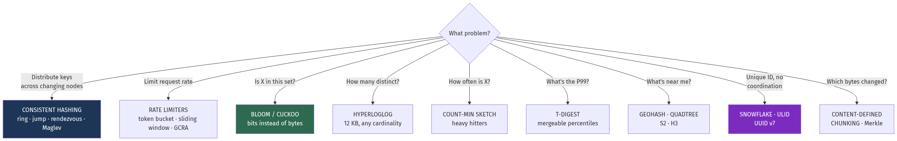
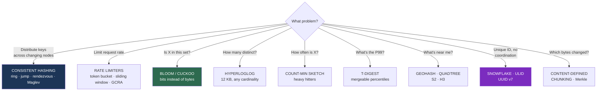

# Chapter 23 — Building Blocks and Algorithms

[← Chapter 22](./22_landmark_papers_and_architectures.md) · [Contents](./README.md) · [Next: Chapter 24 →](./24_case_studies_part1.md)

**Prerequisites:** [Chapter 9](./09_replication_partitioning_consistency.md) (partitioning), [Chapter 11](./11_caching_cdn_and_edge.md) (caching), [Chapter 5](./05_load_balancing_proxies_traffic.md) §5.9 (rate limiting context).

---

## What you'll learn

- **Consistent hashing** derived from the failure of modulo hashing, through virtual nodes to jump hash, rendezvous and Maglev
- **Six rate limiters** with implementations, memory costs and accuracy — and the distributed variant of each
- **Probabilistic structures**: Bloom filters with the false-positive formula derived, cuckoo filters, HyperLogLog, Count-Min Sketch, t-digest — and the sizing arithmetic for each
- **Geospatial indexing** four ways, with "find drivers within 3 km" solved in each
- **ID generation**: why UUID v4 is wrong for a primary key, and the Snowflake bit layout
- **Content-defined chunking** — the rolling hash that makes deduplication survive insertions
- **Machine learning in production** — feature stores, training/serving skew, and shadow deployment for models

---

## Start from zero

Every system in this book is assembled from a small set of algorithms that show up repeatedly.
Consistent hashing appears in caches, databases, load balancers and CDNs. Bloom filters appear
in storage engines, caches, crawlers and browsers. Rate limiters appear at every network
boundary.

They share a common shape: **they trade a guarantee you don't need for a resource you do.**

```
Bloom filter:      gives up certainty (1% false positives) → uses 10 bits instead of 100
HyperLogLog:       gives up exactness (±0.8% error)        → uses 12 KB instead of 4 GB
Consistent hashing: gives up perfect balance (±5%)          → moves 1/N keys instead of 95%
Count-Min Sketch:  gives up precision (overestimates)      → uses KB instead of GB
```

💡 **That's the pattern to internalise.** When someone says "we can't store that", the question
is what property you can relax. An exact count of unique visitors needs a set of every visitor
ID. An estimate within 1% needs twelve kilobytes, regardless of whether you have a thousand
visitors or a billion.

⚠️ **The corresponding discipline is knowing what you gave up.** A Bloom filter says "definitely
not present" or "probably present" — never "definitely present". Building on the wrong side of
that guarantee is a correctness bug, not a performance one.

---

## The mental model



<details>
<summary>Diagram source (Mermaid)</summary>



</details>

---

## Deep dive

### 23.1 Consistent hashing

#### 📐 Why modulo hashing fails

```
4 cache nodes:  node = hash(key) % 4
Add a 5th:      node = hash(key) % 5

A key stays put only when h mod 4 == h mod 5.
Over a uniform hash space that happens for roughly 1 in 20 keys.
→ ~95% of keys move.
```

⚠️ **For a cache this is catastrophic.** Every moved key is a miss, so a single node addition
flushes almost the entire cache at once and stampedes the database
([Chapter 11](./11_caching_cdn_and_edge.md) §11.4). For a database it's a full data migration to
add one machine.

#### The ring

Hash both **keys and nodes** onto the same circular space (0 to 2³²−1). A key belongs to the
first node clockwise from it.

```
Ring positions:
    0 ────── A(1000) ────── B(2000) ────── C(3000) ────── 2³²
              ↑
        key hashing to 1500 → belongs to B (next clockwise)
```

📐 **Adding node D at 2500:** only keys between 2000 and 2500 move — from C to D. Everything else
is untouched. **On average `1/N` of keys move**, not 95%.

#### ⚠️ Virtual nodes — why the naive ring doesn't work

With 3 nodes placed randomly on a ring, the arcs between them are **wildly uneven**. One node
might own 60% of the space.

📐 **The distribution of the maximum arc:**
```
N nodes placed uniformly at random:
  Expected max share ≈ (ln N)/N + 1/N
  With N=10:  max node holds ~33% instead of 10% → a 3.3× imbalance
```

**Fix: place each physical node at many positions.**
```
Node A → A#0, A#1, ... A#149    (150 virtual nodes)
```
📐 **Averaging across 150 arcs per node reduces the standard deviation by √150 ≈ 12×.** With
100–200 virtual nodes per physical node, load balance is typically within ±5%.

💡 **Virtual nodes give you a second benefit: weighting.** A machine with twice the capacity gets
twice the virtual nodes, and heterogeneous clusters balance correctly.

```go
type Ring struct {
    sorted []uint32          // sorted virtual-node hash positions
    nodes  map[uint32]string // position → physical node
    vnodes int
}

func (r *Ring) Add(node string) {
    for i := 0; i < r.vnodes; i++ {
        h := crc32.ChecksumIEEE([]byte(node + "#" + strconv.Itoa(i)))
        r.sorted = append(r.sorted, h)
        r.nodes[h] = node
    }
    sort.Slice(r.sorted, func(i, j int) bool { return r.sorted[i] < r.sorted[j] })
}

func (r *Ring) Get(key string) string {
    h := crc32.ChecksumIEEE([]byte(key))
    // First virtual node clockwise from h; wrap to 0 if past the end.
    i := sort.Search(len(r.sorted), func(i int) bool { return r.sorted[i] >= h })
    return r.nodes[r.sorted[i%len(r.sorted)]]
}
```
📐 Lookup is O(log V) where V = N × vnodes. Memory is O(V) — for 100 nodes at 150 vnodes that's
15,000 entries, trivially small.

#### The alternatives, and when each wins

| Algorithm | Lookup | Memory | Balance | Handles arbitrary removal |
| --- | --- | --- | --- | --- |
| **Ring + vnodes** | O(log V) | O(N × vnodes) | ±5% | ✅ Yes |
| **Jump hash** | O(ln N) | ⭐ **O(1)** | ⭐ Near-perfect | ❌ Only removal from the end |
| **Rendezvous (HRW)** | O(N) | O(N) | ⭐ Near-perfect | ✅ Yes |
| **Maglev** | ⭐ O(1) | O(table size) | ±1% | ✅ Yes, minimal disruption |

**Jump consistent hash** (Google, 2014) — seven lines, no memory, near-perfect balance:
```go
func JumpHash(key uint64, numBuckets int) int32 {
    var b, j int64 = -1, 0
    for j < int64(numBuckets) {
        b = j
        key = key*2862933555777941757 + 1
        j = int64(float64(b+1) * (float64(1<<31) / float64((key>>33)+1)))
    }
    return int32(b)
}
```
⚠️ **The limitation is severe though: buckets must be numbered 0..N−1, so you can only remove the
*last* one.** Perfect for "shard into N partitions"; useless for "node 7 died".

**Rendezvous (Highest Random Weight)** — compute `hash(key, node)` for every node and take the
maximum. Elegant, handles arbitrary membership, and O(N) per lookup limits it to small N (or use
a skeleton-based variant for large N).

**Maglev** (Google) builds a fixed-size lookup table (a prime, e.g. 65,537) via a preference-list
filling algorithm. ⭐ **Every load balancer computes the same table independently with no
coordination**, and lookup is one array index. Used in Google's frontend and in Cilium.

💡 **Which to use:** ring with virtual nodes for caches and databases (arbitrary membership,
weighting); jump hash for fixed partition counts; Maglev for L4 load balancers needing
coordination-free agreement.

### 23.2 Rate limiting

#### Fixed window

```go
key := fmt.Sprintf("rl:%s:%d", userID, time.Now().Unix()/60)
count, _ := redis.Incr(ctx, key).Result()
redis.Expire(ctx, key, time.Minute)
allowed := count <= limit
```
✅ Trivial, O(1) memory.
⚠️ **The boundary problem: allows 2× the limit.**
```
Limit 100/minute.
100 requests at 11:00:59  → allowed (window 11:00)
100 requests at 11:01:00  → allowed (window 11:01)
→ 200 requests in ONE SECOND.
```

#### Sliding window log

Store every request timestamp; count those within the window.
```
ZADD reqs <now> <uuid>
ZREMRANGEBYSCORE reqs 0 <now-60>
ZCARD reqs
```
✅ **Exact.**
⚠️ **O(limit) memory per key.** A 10,000/minute limit means 10,000 timestamps per user.

#### 💡 Sliding window counter — the practical default

Interpolate between the previous and current fixed windows:
```
📐 estimate = current_count + previous_count × (fraction of the previous window still in view)

At 11:01:15 with a 60 s window:
  75% of the previous window is still in scope.
  previous = 80, current = 30
  estimate = 30 + 80 × 0.75 = 90
```
✅ O(1) memory, no boundary spike, error typically under 1% for real traffic.
⚠️ Assumes uniform distribution within the previous window — mildly wrong for bursty traffic.

#### Token bucket — allows bursts, deliberately

```go
type TokenBucket struct {
    mu         sync.Mutex
    tokens     float64
    capacity   float64
    refillRate float64 // tokens per second
    last       time.Time
}

func (tb *TokenBucket) Allow(n float64) bool {
    tb.mu.Lock()
    defer tb.mu.Unlock()
    now := time.Now()
    // Refill lazily — no background timer needed.
    tb.tokens = math.Min(tb.capacity, tb.tokens+now.Sub(tb.last).Seconds()*tb.refillRate)
    tb.last = now
    if tb.tokens >= n {
        tb.tokens -= n
        return true
    }
    return false
}
```
📐 **`capacity` controls burst size; `refillRate` controls sustained rate.**
```
capacity 100, refill 10/s → an idle client can burst 100 immediately,
                             then is limited to 10/s sustained.
```
💡 **This burst allowance is usually what you want.** Real clients are bursty — a page load fires
20 requests at once — and a strict rate limit rejects legitimate traffic. Token bucket is the
default in AWS, Stripe and most API gateways.

#### Leaky bucket

Requests queue and drain at a constant rate. **Smooths output** rather than allowing bursts.
✅ Downstream sees perfectly even traffic.
⚠️ Adds latency (queueing) and needs a bounded queue.

#### GCRA — token bucket in O(1) with no state

The **Generic Cell Rate Algorithm** stores a single timestamp — the "theoretical arrival time" —
instead of a token count.
```
If now >= TAT − burst_tolerance: allow, and TAT = max(TAT, now) + emission_interval
Else: reject
```
✅ One value per key, and it's **atomic in a single Redis operation**, so it's the cleanest
distributed implementation.

#### The comparison

| Algorithm | Memory/key | Accuracy | Bursts | Distributed |
| --- | --- | --- | --- | --- |
| Fixed window | O(1) | ⚠️ 2× at boundaries | Yes, at boundaries | Trivial |
| Sliding log | ⚠️ O(limit) | ⭐ Exact | No | Expensive |
| **Sliding counter** | O(1) | ~1% error | No | ⭐ Easy |
| **Token bucket** | O(1) | Exact | ⭐ Configurable | Needs Lua for atomicity |
| Leaky bucket | O(queue) | Exact | ❌ Smooths | Harder |
| **GCRA** | ⭐ O(1), one value | Exact | Configurable | ⭐ Single atomic op |

⚠️ **Distributed rate limiting** ([Chapter 5](./05_load_balancing_proxies_traffic.md) §5.9): with
N balancers, enforcing locally gives N× the limit. Options are dividing by N (breaks on uneven
hashing), a central Redis counter (exact, but ~1 ms and a hard dependency per request), or
**local counters with async reconciliation** — approximately right, no synchronous dependency,
and what Envoy and the CDNs actually do.

### 23.3 Bloom filters

**"Definitely not present" or "probably present".** Never "definitely present".

```
Insert(x):  set bits at h₁(x), h₂(x), ... hₖ(x)
Query(x):   if ANY of those bits is 0 → DEFINITELY NOT PRESENT
            if ALL are 1 → probably present (may be a false positive)
```
⚠️ **No deletion** — clearing a bit might unset it for a different element.

#### 📐 The false-positive rate, derived

```
m = bits, n = elements, k = hash functions

Probability a specific bit is still 0 after n insertions of k bits each:
  (1 − 1/m)^(kn) ≈ e^(−kn/m)

False positive = all k bits set:
  p ≈ (1 − e^(−kn/m))^k

Optimal k (minimising p):   k = (m/n) ln 2 ≈ 0.693 × (m/n)
Substituting back:          m = −(n ln p) / (ln 2)²  ≈  −1.44 n log₂(p)
```

📐 **The sizing table worth memorising:**

| Target FP rate | Bits per element | Optimal k |
| --- | --- | --- |
| 10% | 4.8 | 3 |
| **1%** | ⭐ **9.6** | 7 |
| 0.1% | 14.4 | 10 |
| 0.01% | 19.2 | 13 |

💡 **~10 bits per element for 1%.** That's the number to remember.

📐 **Why it's worth it:**
```
1 billion 64-byte keys in a hash set: 64 GB (plus overhead — realistically 100 GB+)
1 billion elements at 1% FP:          1.2 GB
→ 80× smaller, at the cost of 1% false positives.
```

**Where they're used:**
| System | Purpose |
| --- | --- |
| **LSM engines** (Cassandra, RocksDB) | ⭐ Skip SSTables that can't contain the key — load-bearing, not optional ([Ch 6](./06_storage_engines_internals.md) §6.5) |
| **Cache penetration** | Reject queries for non-existent keys before they hit the DB ([Ch 11](./11_caching_cdn_and_edge.md) §11.4) |
| **Web crawlers** | "Have I seen this URL?" |
| **CDNs** | "Has this object been requested twice?" — avoid caching one-hit wonders |
| **Chrome (historically)** | Malicious URL checking |

**Variants:**
- **Counting Bloom filter** — 4-bit counters instead of bits, enabling deletion at 4× the space.
- **Cuckoo filter** — ⭐ supports deletion, better space efficiency below ~3% FP, and better
  lookup locality (2 cache lines instead of k random probes).
- **Blocked Bloom filter** — confines all k probes to one cache line, dramatically faster.

### 23.4 HyperLogLog

**Count distinct elements in fixed memory, regardless of cardinality.**

📐 **The intuition:** hash each element and look at the leading zeros of the hash. Seeing a hash
with 10 leading zeros suggests you've observed roughly 2¹⁰ distinct values, because that's how
often it should happen by chance.

```
Single estimator: extremely high variance.
→ Split the hash space into m registers (buckets), keep the max leading-zero
  count per register, and combine with a HARMONIC mean.
```

📐 **The error:**
```
standard error ≈ 1.04 / √m

m = 16,384 registers (2¹⁴), 6 bits each = 12 KB
→ error ≈ 1.04/128 = 0.81%
```

📐 **Compared to exactness:**
```
1 billion unique 16-byte IDs in a set: 16 GB minimum, ~40 GB with overhead
HyperLogLog:                            12 KB
→ 3,000,000× smaller, for ±0.8% error.
```

💡 **And they merge.** `PFMERGE` unions two HLLs, so you can compute daily uniques per server and
combine them for a global count — which a plain count cannot do without deduplication.

```
PFADD visitors:2026-08-31 user_8271
PFCOUNT visitors:2026-08-31
PFMERGE visitors:week visitors:2026-08-25 ... visitors:2026-08-31   ⭐ union, deduplicated
```

⚠️ **Not suitable when you need the actual set** — you cannot ask "is user X in here?" or list
members. It counts, nothing else.

### 23.5 Count-Min Sketch

**Estimate the frequency of any element in sub-linear space.**

```
A 2D array: d rows (one per hash function) × w columns

Increment(x): for each row i: table[i][hᵢ(x) % w] += 1
Estimate(x):  min over all rows of table[i][hᵢ(x) % w]
```
📐 **Taking the minimum is the trick** — collisions can only *inflate* a counter, so the smallest
of d independent estimates is the closest to the truth. **CMS never underestimates.**

```
error ≤ ε × total_count  with probability 1 − δ
w = ⌈e/ε⌉,  d = ⌈ln(1/δ)⌉

ε = 0.001, δ = 0.01:  w = 2,718, d = 5 → 13,590 counters ≈ 54 KB
→ estimates within 0.1% of the total stream count, 99% of the time
```

**Uses:** heavy-hitter detection (top-k traffic sources), DDoS identification,
**W-TinyLFU cache admission** ([Chapter 11](./11_caching_cdn_and_edge.md) §11.3), and
approximate query frequency.

⚠️ **It overestimates rare items badly.** For an element appearing 3 times in a stream of a
billion, collision noise swamps the signal. CMS is for **heavy hitters**, not for the tail.

### 23.6 t-digest

**Mergeable, accurate percentiles** — the structure that solves
[Chapter 19](./19_observability_and_operations.md) §19.1's "you cannot average percentiles"
problem.

💡 **The key property: it's much more accurate at the extremes than in the middle**, which is
exactly backwards from a naive histogram and exactly what you want. It clusters points into
centroids whose size is bounded by a scale function, keeping tiny centroids near q=0 and q=1 and
larger ones near the median.

```
Relative error at q=0.5:    ~1%
Relative error at q=0.99:   ⭐ ~0.1%
Relative error at q=0.999:  ~0.01%
Size: a few kilobytes for any stream length
```
✅ **Merges losslessly enough** that per-instance digests can be combined into a fleet-wide P99 —
which averaging cannot do.

### 23.7 Similarity: MinHash and SimHash

**MinHash** estimates **Jaccard similarity** (|A∩B| / |A∪B|) between sets.
```
signature(S) = [min over x∈S of h₁(x), min of h₂(x), ..., min of hₖ(x)]
📐 P(minhash values match) = Jaccard similarity
→ compare 128-value signatures instead of full sets
```

**SimHash** produces a fingerprint where **similar documents have a small Hamming distance** —
used by Google for near-duplicate web-page detection.

⚠️ **Comparing every pair is O(n²)**, which is impossible at scale. **Locality-sensitive hashing
(LSH)** banding solves it: split the signature into bands, hash each band, and only compare
documents colliding in at least one band — reducing candidate pairs by orders of magnitude.

### 23.8 Geospatial indexing

*"Find all drivers within 3 km of this point"* — four ways.

#### Geohash

Interleave latitude and longitude bits, then base-32 encode. **Nearby points share a prefix.**

| Length | Cell size |
| --- | --- |
| 4 | ~39 km |
| 5 | ~4.9 km |
| **6** | **~1.2 km** |
| 7 | ~153 m |
| 8 | ~38 m |

```sql
-- Prefix match = a range scan on a B-tree index. Works in ANY database.
SELECT * FROM drivers WHERE geohash LIKE 'gcpuv%';
```
✅ Works with any ordered index; trivially shardable.
⚠️ **The edge problem:** two points 10 m apart can have completely different prefixes if they
straddle a cell boundary. **Always query the cell plus its 8 neighbours**, then filter by exact
distance.

#### Quadtree

Recursively subdivide space into four quadrants, splitting a cell when it exceeds a capacity
threshold.
✅ ⭐ **Adapts to density** — dense cities get deep subdivision, oceans stay shallow.
⚠️ Rebalancing is expensive; harder to distribute than a prefix scheme.

#### S2 (Google) and H3 (Uber)

**S2** projects the sphere onto a cube, then uses a Hilbert curve for ordering.
✅ ⭐ **The Hilbert curve preserves locality far better than geohash's Z-order**, so cells near in
value are near in space, with fewer discontinuities. Cell sizes are much more uniform than
geohash's (which distort badly near the poles).

**H3** uses **hexagons**.
✅ ⭐ **All six neighbours are equidistant** — with squares, diagonal neighbours are 1.41× further
than edge neighbours, which distorts every radius query and every flow calculation. This is why
Uber built it for surge pricing and supply/demand analysis.
⚠️ Hexagons cannot perfectly tile a sphere — H3 needs 12 pentagons, which are special cases.

#### The comparison

| Method | Query | Adapts to density | Neighbours | Used by |
| --- | --- | --- | --- | --- |
| **Geohash** | Prefix scan | ❌ | ⚠️ 8, unequal, edge problem | Redis GEO, Elasticsearch |
| **Quadtree** | Tree descent | ✅ | Variable | In-memory spatial indexes |
| **R-tree** | Bounding-box tree | ✅ | — | PostGIS, spatial DBs |
| **S2** | Range on Hilbert curve | Partially | Good | Google Maps, MongoDB |
| **H3** | Hex cell + rings | ❌ | ⭐ 6, equidistant | Uber |

💡 **For most applications: use PostGIS (R-tree via GiST) or Redis GEO (geohash).** Reach for S2
or H3 when you're doing spatial *analytics* — aggregating over regions, computing flows — where
cell uniformity and neighbour equidistance genuinely matter.

### 23.9 Unique ID generation

| Scheme | Bits | Sortable | Coordination | ⚠️ |
| --- | --- | --- | --- | --- |
| Auto-increment | 64 | ✅ | ⚠️ Single writer | Doesn't distribute |
| **UUID v4** | 128 | ❌ **Random** | None | ⚠️ **Terrible as a clustered key** |
| UUID v1 | 128 | Partially | None | Leaks MAC address; poor sort order |
| **UUID v7** | 128 | ⭐ **Yes** (timestamp prefix) | None | The modern default |
| **Snowflake** | ⭐ 64 | ✅ | Node ID assignment | Clock-skew sensitive |
| ULID | 128 | ✅ | None | 26-char base32, lexicographically sortable |
| KSUID | 160 | ✅ | None | Second-resolution timestamp |

#### ⚠️ Why UUID v4 is the wrong primary key

From [Chapter 6](./06_storage_engines_internals.md) §6.4:
```
Random keys insert across the WHOLE B-tree, not at the end.
  → constant page splits everywhere
  → fill factor drops from ~95% to ~65%
  → 📐 ~47% larger index → worse buffer-pool hit rate for the same RAM
  → writes scatter across the file → SSD write amplification (Ch 6 §6.1)
Plus: 16 bytes vs 8, inflating EVERY secondary index too.
```

✅ **UUID v7 fixes it** while keeping distributed generation:
```
 0                   1                   2                   3
┌───────────────────────────────────────┬─────────┬──────────────┐
│  48-bit Unix timestamp (ms)           │ ver+rand│  62-bit rand │
└───────────────────────────────────────┴─────────┴──────────────┘
⭐ Globally unique AND locally sequential.
```

#### Snowflake — 64 bits, which matters

```
 1        41 bits            10 bits      12 bits
┌─┬──────────────────────┬───────────┬──────────────┐
│0│  ms since epoch      │ machine   │  sequence    │
└─┴──────────────────────┴───────────┴──────────────┘
41 bits ≈ 69 years · 1,024 machines · 4,096 IDs per ms per machine
= 4.1 million IDs/second per machine
```
✅ **Fits in a `bigint`**, so it's half the size of a UUID in every index.

⚠️ **Clock skew is the failure mode.** If the clock moves backwards — NTP step, VM migration —
you can generate duplicate IDs. Handle it explicitly:
```go
if now < s.lastTimestamp {
    // ⚠️ Clock went backwards. Options: block until it catches up (correct but
    // stalls), or borrow from the sequence bits, or refuse and alert.
    // NEVER silently continue — that produces duplicate IDs.
    return 0, ErrClockBackwards
}
```

💡 **Choosing:** UUID v7 if you want no coordination and 128 bits is fine. Snowflake if index
size matters enough to justify machine-ID assignment. **Never UUID v4 as a clustered primary
key.**

### 23.10 Merkle trees and content-defined chunking

**Merkle trees** ([Chapter 9](./09_replication_partitioning_consistency.md) §9.5): hash data
hierarchically so two replicas can find their differences in O(log n) comparisons instead of
comparing everything. Used by Cassandra and DynamoDB for anti-entropy, by Git for commits, and by
every blockchain.

**Content-defined chunking** ([Chapter 6](./06_storage_engines_internals.md) §6.10) makes
deduplication survive insertions:
```
Slide a window computing a ROLLING hash (Rabin, or the faster Gear/FastCDC).
Cut a boundary wherever (hash & 0x1FFF) == 0  → average 8 KB chunks.

⭐ Because boundaries depend on CONTENT, not offset, inserting one byte changes
   only the chunk containing it. Fixed-size chunking would shift every
   subsequent boundary and match nothing.
```

### 23.11 Machine learning in production

The engineering around a model matters far more than the model.

#### ⚠️ Training/serving skew — the defining failure

```
Training:  features computed in Python over a Parquet dataset, with full history
Serving:   features computed in Go, from a live request, under 10 ms

Any difference in the computation — a different default for a missing value, a
different time window, a subtly different join — silently degrades the model.
⚠️ No error is raised. Accuracy just drops, and nobody knows why.
```

💡 **The feature store exists to solve exactly this**: define a feature once, and serve it to
both the training pipeline and the online inference path from the same definition.

```
Offline store (warehouse) → training, with point-in-time-correct historical values
Online store (Redis)      → serving, low latency
⭐ ONE feature definition materialises to both.
```

⚠️ **Point-in-time correctness is the subtle part.** Training on "the customer's lifetime order
count" computed *today* leaks future information into a model predicting the past — the model
looks excellent in evaluation and fails in production. The feature store must reconstruct
feature values **as they were at the moment of each training example**.

#### Batch vs online inference

| | Batch (precompute) | Online (on request) |
| --- | --- | --- |
| Latency | ⭐ A lookup — sub-ms | Model inference — 10–100 ms |
| Freshness | ⚠️ Hours old | ⭐ Current |
| Cost | Predictable | Scales with traffic |
| Use for | Recommendations, risk scores, segments | Fraud, personalisation on live context |

💡 **Precompute where you can.** Nightly recommendations for 100 million users cost one batch
job; computing them per request costs 100 million inferences.

#### Deploying a model

⚠️ **A model is a deployment artifact and needs the same discipline as code** — plus one extra
stage:
```
1. Model registry — versioned artifacts with lineage (which data, which code)
2. ⭐ SHADOW deployment — run the new model on live traffic, LOG its predictions,
      serve the old model's. Compares on real data with zero risk. (Ch 20 §20.1)
3. Canary — route a small percentage of real traffic
4. A/B test with GUARDRAIL metrics — not just model accuracy, but the business
      outcome AND the things that must not regress (latency, error rate, revenue)
5. Monitor for DRIFT
```

📐 **Two kinds of drift, and they're different problems:**
```
DATA drift:    the input distribution changed (a new device type, a new market)
CONCEPT drift: the relationship changed (fraud patterns adapted to your model)

Detection: monitor the distribution of each input feature and of the model's
           output scores. A shift in output distribution with stable inputs
           usually means something upstream broke.
```

⚠️ **The most common production ML incident is not model quality — it's a broken feature
pipeline.** An upstream schema change makes a feature null, the model silently treats null as
zero, and predictions degrade with no error anywhere. Monitor **feature freshness and null rates**
as first-class SLIs.

#### Serving efficiently

```
Batching:      accumulate requests for 5-10 ms and infer as a batch
               📐 GPU throughput is often 10-50× higher batched
Quantisation:  float32 → int8 gives ~4× memory reduction and 2-4× speedup,
               typically at <1% accuracy loss
Distillation:  train a small model to mimic a large one
Caching:       identical inputs → identical outputs. Cache them.
```

---

## Worked example — a real-time fraud detection system

*Score 50,000 transactions/second for fraud in under 50 ms. Detect velocity attacks (one card
used in many places quickly), identify heavy-hitter attackers, and deduplicate near-identical
transactions. Design it using the structures in this chapter.*

**Step 1 — Decompose into the primitives.**

| Requirement | Structure | Why |
| --- | --- | --- |
| "Is this card known-stolen?" | **Bloom filter** | 500M entries, must not hit the DB per transaction |
| "How many distinct IPs used this card today?" | **HyperLogLog** | Exact count needs a set per card — 500M sets |
| "Which IPs are attacking most?" | **Count-Min Sketch** | Heavy hitters, sub-linear space |
| "Rate-limit per card" | **Token bucket / GCRA** | Bursts are legitimate; sustained rate is not |
| "Are these two transactions near-duplicates?" | **MinHash + LSH** | O(n²) comparison is impossible |
| "Which merchants are near this location?" | **Geohash / H3** | Radius query |
| "Distribute state across nodes" | **Consistent hashing** | Scale without cache flush |
| "P99 scoring latency" | **t-digest** | Mergeable across instances |

**Step 2 — Stolen-card check with a Bloom filter.**
```
📐 500 million known-compromised cards, target 0.1% false positive:
   bits = 500M × 14.4 = 7.2 Gbit = 900 MB
   k = 10 hash functions

Compare: a hash set of 500M × 16-byte card hashes = 8 GB minimum, ~20 GB with overhead.
→ 22× smaller, fits in memory on every node.
```
⚠️ **The 0.1% false-positive direction matters.** A false positive says "possibly stolen" for a
legitimate card — so it must **escalate to a database lookup, not decline**. A Bloom filter can
never produce a false *negative*, so a genuinely stolen card is never missed. **The asymmetry is
the whole reason this is safe.**

**Step 3 — Velocity detection with HyperLogLog.**
```
"How many distinct IPs has this card been used from in the last hour?"

Exact: a set per card per hour → 500M cards × maybe 3 IPs × 16 B = 24 GB, plus
       enormous per-set overhead. Impractical.
HLL:   sparse representation for low cardinality (most cards see 1-2 IPs),
       promoting to the dense 12 KB form only for high-cardinality cards.
📐 Realistically ~200 bytes average → 500M × 200 B = 100 GB across the cluster,
   sharded by card. ✅ Feasible.

Signal: distinct_ips > 5 in an hour → high fraud score
```
💡 **The ±0.8% error is irrelevant here** — the decision boundary is "more than 5", and the
difference between 5 and 5.04 doesn't exist.

**Step 4 — Heavy hitters with Count-Min Sketch.**
```
📐 ε = 0.0001, δ = 0.001:
   w = ⌈e/0.0001⌉ = 27,183   d = ⌈ln(1000)⌉ = 7
   = 190,281 counters × 4 bytes = 761 KB

⭐ Tracks the frequency of EVERY source IP in under a megabyte.
Pair with a min-heap of the top 100 to maintain a live attacker list.
```
⚠️ CMS **overestimates**, never underestimates — so a heavy hitter is never missed, but a rare IP
may appear more frequent than it is. For "find the attackers" that error direction is exactly
right.

**Step 5 — Rate limiting with GCRA.**
```
Per card: 10 transactions/minute sustained, burst 5
GCRA stores ONE timestamp per card, updated atomically in Redis.

📐 500M cards × 8 bytes = 4 GB, sharded.
   Token bucket would need two values plus a Lua script for atomicity;
   GCRA is a single atomic operation. ⭐ Simpler in the distributed case.
```

**Step 6 — Near-duplicate detection with MinHash + LSH.**
```
Feature the transaction: {merchant, amount_bucket, hour, city, device_fingerprint}
MinHash signature: 128 values

⚠️ Comparing every pair: 50,000/s × previous transactions = impossible.
✅ LSH banding: 128 values → 32 bands of 4.
   Two transactions are candidates only if they collide in ≥1 band.
   📐 For Jaccard ≥ 0.8, P(candidate) ≈ 1 − (1 − 0.8⁴)³² ≈ 99.9%
      For Jaccard ≤ 0.4, P(candidate) ≈ 1 − (1 − 0.4⁴)³² ≈ 56%... too high
   → tune to 16 bands of 8: P at 0.8 ≈ 98%, P at 0.4 ≈ 1.6% ✅
```
💡 **The band/row tuning is the whole design.** It sets the S-curve — how sharply you separate
"similar" from "not similar" — and it's the parameter people skip.

**Step 7 — Geospatial: impossible travel.**
```
"Was this card used 500 km away 10 minutes ago?"

Store the last transaction location per card as an H3 cell (resolution 7, ~5 km edge).
⭐ H3 rather than geohash: all 6 neighbours are equidistant, so a "within N rings"
   query is a genuine radius rather than a distorted square.
Compute the great-circle distance and divide by elapsed time.
→ implied velocity > 900 km/h and not near an airport → strong fraud signal
```

**Step 8 — Distribute the state with consistent hashing.**
```
State is sharded by card_id across 40 nodes.
⭐ Ring with 150 virtual nodes per physical node:
   • Adding a node moves 1/41 ≈ 2.4% of state, not 95%
   • ±5% load balance
   • Weighted: larger machines get more virtual nodes

⚠️ NOT jump hash — we need arbitrary node removal when one fails,
   and jump hash only supports removing the last bucket.
```

**Step 9 — Measure with t-digest.**
```
Each of 40 nodes maintains a t-digest of scoring latency.
⭐ Merge them for a true fleet-wide P99 — which averaging per-node P99s
   cannot produce (Ch 19 §19.1).
Size: a few KB per node.
```

**Step 10 — The ML layer, and its failure modes.**
```
Features: the outputs above (distinct IP count, velocity, CMS frequency,
          duplicate score, implied travel speed) + card history

Online store: Redis, sub-ms lookup
Offline store: the same feature DEFINITIONS materialised to the warehouse
               ⭐ point-in-time correct, or the model learns from the future

Serving: gradient-boosted trees, int8-quantised, batched at 10 ms
📐 Latency budget:
   Bloom filter check      0.001 ms
   HLL + CMS + GCRA reads  2 ms (Redis, pipelined)
   LSH candidate lookup    3 ms
   Feature assembly        5 ms
   Model inference         8 ms (batched)
   Total ≈ 18 ms ✅ well inside 50 ms

Deployment: shadow → canary → A/B with guardrails (Ch 20 §20.1)
Monitoring: ⚠️ feature NULL RATE and FRESHNESS as first-class SLIs —
            the most common ML incident is a broken feature pipeline,
            not a bad model.
```

💡 **Note what the ML model is doing: combining signals that the algorithmic structures
computed.** The probabilistic data structures do the heavy lifting in constant space; the model
weighs their outputs. Trying to feed raw transaction history to a model at 50,000/s would be
impossible.

---

## Trade-offs

| Decision | Option A | Option B | Choose A when | Never choose A when |
| --- | --- | --- | --- | --- |
| Key distribution | `hash % N` | Consistent hashing | ⚠️ Never for a cache or live datastore | Node count ever changes |
| Consistent hashing | Ring + vnodes | Jump hash | Arbitrary node removal; weighting | Fixed partition count — jump is O(1) memory |
| Consistent hashing | Ring | Maglev | General use | L4 balancers needing coordination-free agreement |
| Rate limiter | Fixed window | Sliding counter | Never — 2× boundary burst | Any real limit |
| Rate limiter | Sliding log | Token bucket / GCRA | You need exactness at any cost | High limits — O(limit) memory per key |
| Rate limiter | Token bucket | GCRA | You want explicit burst semantics | Distributed — GCRA is one atomic op |
| Set membership | Hash set | Bloom filter | You need exactness or enumeration | Memory-bound and false positives are safe |
| Bloom | Standard | Cuckoo filter | Insert-only | You need deletion, or FP < ~3% |
| Distinct count | Exact set | HyperLogLog | You need the members | You only need the count — 3,000,000× smaller |
| Frequency | Exact counters | Count-Min Sketch | You need rare-item accuracy | Heavy hitters only — CMS is fine |
| Percentiles | Per-instance quantiles | t-digest | Never across instances | Always B — you cannot average percentiles |
| Geo index | Geohash | H3 / S2 | Any ordered index; simplicity | Spatial analytics — neighbour equidistance matters |
| Primary key | UUID v4 | ⭐ UUID v7 / ULID | ⚠️ Never as a clustered key | Always B — v4 costs ~47% index bloat |
| Primary key | UUID v7 | Snowflake | 128 bits is fine; no coordination | Index size matters — Snowflake is 64 bits |
| ML inference | Online | Batch precompute | Needs live request context | Predictable inputs — precompute is far cheaper |
| ML rollout | Deploy and watch | Shadow → canary → A/B | Never | Always B — models fail silently |

---

## How real companies do it

**Google's Maglev** builds its lookup table so that every load balancer node computes the same
mapping **independently, with no coordination** — which is what allows any node to handle any
packet and makes the fleet stateless. The paper also documents the connection-tracking layer that
keeps existing flows pinned when the backend set changes.

**Facebook's Gorilla** achieves ~1.37 bytes per time-series point through delta-of-delta
timestamp encoding and XOR value encoding — the scheme Prometheus adopted. It's the clearest
demonstration that **choosing the right encoding beats buying a bigger cluster**.

**Uber built H3** because square grids distort radius queries: with squares, diagonal neighbours
are 1.41× further than edge neighbours, which biases every supply/demand and surge calculation.
Hexagons have six equidistant neighbours. They open-sourced it, and it's now used well beyond
ride-hailing.

**Twitter's Snowflake** solved ID generation when they moved off MySQL auto-increment. The 64-bit
constraint was deliberate — fitting in a `bigint` halves index size versus a UUID, which at their
scale was worth the operational cost of assigning machine IDs.

**Caffeine's W-TinyLFU** ([Chapter 11](./11_caching_cdn_and_edge.md) §11.3) combines a Count-Min
Sketch with a doorkeeper Bloom filter to make **admission** decisions rather than eviction
decisions. Its published trace-based benchmarks are the clearest evidence that admission control
beats eviction policy, and it lands within a few percent of Bélády's optimal offline algorithm.

**Uber's Michelangelo** and **Airbnb's Zipline** are the origin of the feature-store pattern.
Both were built after discovering that **training/serving skew** — features computed differently
in the training pipeline and the serving path — was the dominant cause of models underperforming
in production.

---

## Common mistakes

**Using `hash % N` for anything that scales.** Adding a node moves ~95% of keys, flushing the
cache and stampeding the database.

**Consistent hashing without virtual nodes.** With 10 nodes placed randomly, the busiest can own
~33% of the keyspace instead of 10%. Use 100–200 virtual nodes each.

**Fixed-window rate limiting.** Allows 2× the limit across the boundary.

**Sliding-window-log rate limiting with a high limit.** O(limit) memory per key — a 10,000/minute
limit stores 10,000 timestamps per user.

**Treating a Bloom filter "possibly present" as "present".** It's a probabilistic *positive* —
always escalate to an authoritative check. The value is that negatives are certain.

**Under-sizing a Bloom filter.** The false-positive rate degrades sharply as it fills. Size for
your maximum expected element count, not your current one.

**Using Count-Min Sketch for rare items.** It overestimates, and for infrequent elements the
collision noise swamps the signal. Heavy hitters only.

**Averaging percentiles across instances.** Use t-digest or merge histogram buckets.

**Geohash without querying neighbours.** Two points 10 m apart can have entirely different
prefixes across a cell boundary. Always query the cell plus its 8 neighbours.

**UUID v4 as a clustered primary key.** ~47% index bloat, constant page splits, and SSD write
amplification. Use UUID v7 or ULID.

**Snowflake without clock-skew handling.** If the clock steps backwards you generate duplicate
IDs silently. Block, borrow from the sequence, or refuse — never continue.

**Computing features differently in training and serving.** Training/serving skew degrades models
with no error anywhere. Use one definition, materialised to both.

**Training on features computed "as of today".** Leaks future information; the model evaluates
brilliantly and fails in production. Feature values must be point-in-time correct.

**Deploying a model without shadow evaluation.** Models fail silently — accuracy drops without a
single error being raised.

**Monitoring model accuracy but not feature pipelines.** The most common ML incident is a null
feature from an upstream schema change, not a bad model.

---

## Interview angle

**Q: Why not just use `hash(key) % N` to shard?**

*Strong:* "Because N changes. When you go from four nodes to five, a key only stays put if
`h mod 4 == h mod 5`, which for a uniform hash happens for roughly one key in twenty — so about
**95% of keys move**. For a cache that means a near-total flush and an immediate stampede on the
database; for a datastore it's a full data migration to add one machine. **Consistent hashing**
fixes it by placing both keys and nodes on a ring and assigning each key to the next node
clockwise, so adding a node only moves the keys in its arc — on average **1/N**. The essential
refinement is **virtual nodes**: with nodes placed randomly, the arcs are very uneven, and with
ten nodes the busiest can own around a third of the keyspace. Giving each physical node 100 to
200 positions averages across many arcs and brings balance within about ±5% — and it also lets
you weight a bigger machine by giving it more positions. If the partition count is fixed rather
than the node set, **jump hash** is better: seven lines, O(1) memory, near-perfect balance —
though it can only remove the *last* bucket, so it can't handle an arbitrary node dying."

**Q: Design a rate limiter for an API.**

*Strong:* "I'd use a **token bucket**, or **GCRA** if it's distributed. The reason not to use a
fixed window is the boundary problem — a hundred requests at 11:00:59 and another hundred at
11:01:00 both pass, so you've allowed 2× the limit in one second. A sliding-window *log* is exact
but costs O(limit) memory per key, so a 10,000-per-minute limit stores ten thousand timestamps
per user. Token bucket gives O(1) memory and, importantly, **allows configurable bursts**, which
you usually want — real clients are bursty, a page load fires twenty requests at once, and a
strict rate limit rejects legitimate traffic. Capacity controls the burst, refill rate controls
the sustained rate. For the distributed case, **GCRA** is cleaner: it stores a single timestamp
rather than a token count, so it's one atomic Redis operation rather than a read-modify-write
needing a Lua script. And the distributed enforcement question matters — with twenty balancers,
enforcing locally gives twenty times the limit. Dividing by N breaks under uneven hashing, and a
central counter adds a millisecond and a hard dependency to every request, so the standard answer
is **local counters with asynchronous reconciliation** — approximately right without a
synchronous dependency."

**Q: How would you check whether a URL has been crawled, with a billion URLs?**

*Strong:* "A **Bloom filter**. A hash set of a billion URLs is tens of gigabytes; a Bloom filter
at a 1% false-positive rate needs about **10 bits per element**, so 1.2 GB — roughly 80× smaller.
The sizing comes from `m = −n·ln(p)/(ln 2)²`, with the optimal number of hash functions
`k = (m/n)·ln 2`, which is 7 at 1%. The reason it's *safe* here is the direction of the error:
Bloom filters produce **false positives but never false negatives**. So a 1% false positive means
you occasionally skip a URL you haven't actually crawled — a small coverage loss — whereas
recrawling everything would be the failure you can't tolerate. If I needed deletions, say for an
expiring set, I'd use a **cuckoo filter** instead, which supports removal and is more
space-efficient below about 3% false positive. And a **blocked** Bloom filter confines all k
probes to a single cache line, which matters a lot for throughput at this scale."

**Q: Count unique visitors per day across a hundred servers.**

*Strong:* "**HyperLogLog**, and the decisive property is that it **merges**. Each server maintains
its own HLL, and you union them with `PFMERGE` to get a global count with duplicates removed —
which you simply cannot do by adding per-server counts, because a visitor hitting three servers
would be counted three times. The memory is the striking part: 16,384 registers at 6 bits each is
**12 kilobytes**, with about 0.8% standard error, and that's constant regardless of whether you
have a thousand visitors or a billion. An exact set of a billion 16-byte IDs would be 16 gigabytes
minimum — so it's roughly three million times smaller. The trade is that you give up the set: you
cannot ask 'was user X here?' or enumerate members, only count. Which for a daily-uniques metric
is exactly the right thing to give up. If I also needed heavy hitters — which pages, which IPs —
I'd add a **Count-Min Sketch** alongside, which tracks frequencies in sub-megabyte space and
never underestimates."

**Q: Why is UUID v4 a bad primary key, and what would you use?**

*Strong:* "Because it's **random**, and a clustered index wants sequential inserts. Random keys
insert across the entire B-tree rather than appending at the right edge, so you get constant page
splits everywhere, and the average page fill factor drops from around 95% to about 65% — meaning
roughly a **47% larger index**, which directly worsens your buffer-pool hit rate for the same
RAM. It also scatters writes across the whole file, which fights the SSD's flash translation
layer and amplifies device-level writes. And it's 16 bytes rather than 8, inflating every
secondary index too, since they all carry the primary key. **UUID v7** fixes it — a 48-bit
millisecond timestamp in the high bits followed by randomness, so IDs are globally unique
*and* locally sequential, restoring insert locality while keeping distributed generation. If
index size matters enough, **Snowflake** fits in 64 bits — 41 bits of timestamp, 10 of machine
ID, 12 of sequence — which halves the index size, at the cost of assigning machine IDs and
handling clock skew, because if the clock steps backwards you'll silently generate duplicates
unless you explicitly block or refuse."

**Q: What's the hardest part of running ML in production?**

*Strong:* "**Training/serving skew**, and it's not a modelling problem — it's a data engineering
one. Features get computed one way in the training pipeline, in Python over a warehouse table
with full history, and a different way in the serving path, in a different language under a
ten-millisecond budget. Any difference — a different default for a missing value, a slightly
different time window, a subtly different join — degrades the model, and **no error is raised**.
Accuracy just quietly drops. That's what **feature stores** exist to solve: define a feature once
and materialise it to both an offline store for training and an online store for serving. The
subtle part is **point-in-time correctness** — if you train on 'lifetime order count' computed
today, you've leaked future information into a model predicting the past, so it evaluates
brilliantly and fails in production. Beyond that, the most common actual incident isn't model
quality at all: it's a **broken feature pipeline**, where an upstream schema change makes a
feature null, the model treats null as zero, and predictions degrade with nothing alerting. So
I'd monitor **feature freshness and null rates as first-class SLIs**, and I'd deploy models with
**shadow evaluation first** — run the new model on live traffic, log its predictions, serve the
old one's — because models fail silently in a way code usually doesn't."

---

## Recap

- **The pattern: trade a guarantee you don't need for a resource you do** — and know precisely
  what you gave up.
- ⚠️ **`hash % N` moves ~95% of keys when N changes.** Consistent hashing moves 1/N. **Virtual
  nodes (100–200 each)** are mandatory, or balance is ±33% not ±5%.
- **Jump hash** is O(1) memory but can only remove the last bucket. **Maglev** gives
  coordination-free agreement for L4 balancers.
- **Token bucket** for burst-tolerant limiting; **GCRA** when distributed (one atomic op).
  ⚠️ Never fixed-window — it allows 2× at boundaries.
- 📐 **Bloom filter: ~10 bits per element for 1% false positives.** False positives only, never
  false negatives — build on the *negative* side.
- 📐 **HyperLogLog: 12 KB for ±0.8% at any cardinality**, and it **merges**.
- **Count-Min Sketch never underestimates** — correct for heavy hitters, wrong for rare items.
- **t-digest** gives mergeable percentiles, most accurate at the extremes.
- **H3's hexagons have 6 equidistant neighbours**; squares' diagonals are 1.41× further, which
  distorts radius queries.
- ⚠️ **UUID v4 as a clustered key costs ~47% index bloat.** Use **UUID v7** or **Snowflake**.
- **Content-defined chunking** makes deduplication survive insertions; fixed-size chunking
  doesn't.
- ⚠️ **Training/serving skew is the defining ML production problem.** One feature definition, two
  stores, point-in-time correct. Monitor **feature null rate and freshness**.

---

## Test yourself

1. You shard across 8 cache nodes with `hash % 8` and add a ninth. Estimate the fraction of keys
   that move, and the immediate operational consequence.
2. Size a Bloom filter for 200 million elements at a 0.5% false-positive rate. How many hash
   functions?
3. Your rate limiter uses a fixed 1-minute window with a limit of 60. Describe the maximum burst
   a client can achieve and over what interval.
4. You need distinct-visitor counts per hour for 10,000 websites, retained 90 days. Compare exact
   sets against HyperLogLog.
5. A Count-Min Sketch estimates that IP `1.2.3.4` appeared 1,000 times. The true count is 40.
   Explain, and say whether the structure is being used correctly.
6. Two GPS points are 20 m apart but have completely different geohash prefixes. Explain and give
   the standard fix.
7. Your table has 2 billion rows with UUID v4 primary keys. Estimate the index size penalty
   versus a sequential key, and name two other costs.
8. Explain why a Snowflake generator can produce duplicate IDs, and how to prevent it.
9. Your model scored 0.94 AUC in evaluation and 0.71 in production, with no errors in any log.
   Give three hypotheses in order of likelihood.
10. You need mergeable P99 latency across 200 service instances. Why can't you average, and what
    do you use?

<details>
<summary>Answers</summary>

1. A key stays put only when `h mod 8 == h mod 9`. Over a uniform hash space that holds for
   roughly 1 key in 72, so approximately **98–99% of keys move**.
   **Operational consequence:** essentially the entire cache becomes invalid at once. Every
   request that previously hit now misses and falls through to the origin, so if you were running
   at a 95% hit rate, database load jumps **20×** instantaneously — a self-inflicted stampede
   ([Chapter 11](./11_caching_cdn_and_edge.md) §11.4). The database almost certainly can't absorb
   it, so adding cache capacity causes an outage.
   **Fix:** consistent hashing with virtual nodes, where adding a ninth node moves about 1/9 ≈
   11% of keys, which a healthy origin can absorb.

2. ```
   m = −n·ln(p) / (ln 2)²
     = −200,000,000 × ln(0.005) / 0.4805
     = 200,000,000 × 5.298 / 0.4805
     = 2.205 × 10⁹ bits = 276 MB

   k = (m/n) × ln 2 = (2.205e9 / 2e8) × 0.693 = 11.03 × 0.693 ≈ 7.6 → use 8
   ```
   So **~276 MB and 8 hash functions**, about 11 bits per element — consistent with the rule of
   thumb that 1% costs ~10 bits and each additional order of magnitude costs roughly 4.8 more.
   ⚠️ Size for the **maximum** expected element count, not the current one: the false-positive
   rate degrades sharply as the filter fills beyond its design point, and there's no way to
   resize a standard Bloom filter without rebuilding it.

3. **120 requests in a two-second interval** — 2× the limit.
   ```
   11:00:59.000 → 60 requests, all counted in the 11:00 window → allowed
   11:01:00.000 → the window key changes; counter resets to 0
                  60 more requests → allowed
   ```
   The client has issued 120 requests spanning barely more than an instant around the boundary,
   and could sustain that pattern every minute. This is the fundamental flaw of fixed windows and
   the reason to use a **sliding window counter** (which interpolates against the previous
   window), a **token bucket**, or **GCRA** — all of which give O(1) memory without the boundary
   spike.

4. ```
   Scale: 10,000 sites × 24 hours × 90 days = 21,600,000 (site, hour) buckets

   EXACT SETS: assume 10,000 unique visitors per site-hour on average,
               16-byte visitor IDs:
     21.6M buckets × 10,000 × 16 B = 3.46 TB of raw IDs
     ...plus per-set data-structure overhead, realistically 2-3× → ~8-10 TB
     And union queries (weekly/monthly uniques) require deduplicating across sets.

   HYPERLOGLOG: 12 KB per bucket (dense), far less sparse for low-cardinality buckets
     21.6M × 12 KB = 259 GB worst case
     Realistically most site-hours have low cardinality and stay sparse → well under 100 GB
   ```
   **Roughly 30–100× smaller**, and critically HLLs **merge**, so weekly and monthly uniques are
   a `PFMERGE` rather than a deduplication job over billions of IDs. The cost is ±0.8% error and
   losing the ability to ask "did user X visit?" — neither of which matters for a uniques metric.

5. **Collisions in the sketch.** CMS hashes each element into one counter per row, and other
   elements hashing to the same counters inflate it. Taking the **minimum** across rows reduces
   but doesn't eliminate this, so **CMS always overestimates and never underestimates**.
   A 25× overestimate means the sketch is **badly under-sized for this stream**, or — more
   likely — it's being used for the wrong thing. The error bound is `ε × total_count`, which is
   *absolute*, not relative. With a billion-event stream and ε = 0.001, the bound is 1,000,000 —
   so a true count of 40 is completely swamped by noise, and the estimate is meaningless.
   **CMS is only correct for heavy hitters.** For an element appearing 40 times in a large
   stream, the answer is essentially "somewhere between 40 and the error bound". If you need
   accuracy on rare items you need exact counting, or a structure like a Space-Saving/Misra-Gries
   summary that explicitly tracks a top-k set.

6. **They straddle a geohash cell boundary.** Geohash interleaves latitude and longitude bits, so
   the encoding is a Z-order (Morton) curve — and Z-order has **discontinuities**: adjacent
   points in space can be far apart in the encoded value whenever a high-order bit flips. Two
   points either side of such a boundary share almost no prefix despite being metres apart.
   **The standard fix: query the target cell plus its 8 neighbours**, then filter by exact
   great-circle distance. Every geohash library provides a neighbour function for this, and Redis
   GEO does it internally.
   Structural alternatives: **S2** uses a **Hilbert curve** instead of Z-order, which has far
   better locality preservation and fewer discontinuities; and **H3** uses hexagons where all six
   neighbours are equidistant, so "within k rings" is a genuine radius rather than a distorted
   square.

7. **Index size penalty:**
   ```
   Sequential keys → pages fill to ~95% before splitting
   Random UUID v4  → splits everywhere, average fill ~65-70%
   📐 Penalty ≈ 95/67 ≈ 1.42 → roughly 40-47% larger index
   ```
   For a 2-billion-row table with, say, a 60 GB primary index, that's **25 GB of extra index**,
   which directly reduces how much of it fits in the buffer pool.
   **Two other costs:** (a) **Key width** — 16 bytes versus 8 for a bigint, and since every
   secondary index stores the primary key, *every* index is inflated too; on a table with five
   secondary indexes that's substantial. (b) **SSD write amplification** — random insertion
   scatters writes across the whole file rather than appending, so the flash translation layer
   must relocate far more valid data during garbage collection
   ([Chapter 6](./06_storage_engines_internals.md) §6.1). A third: **constant page splits** make
   write latency spiky, since a split touches three pages and can cascade.
   **Fix:** UUID v7 or ULID — same uniqueness and distributed generation, timestamp in the high
   bits so insertion is sequential.

8. **Clock skew.** Snowflake encodes a millisecond timestamp in the high bits and a per-millisecond
   sequence in the low bits, and it assumes time only moves forward. If the system clock steps
   **backwards** — an NTP correction, a VM migration or restore, a hypervisor adjustment — the
   generator can re-enter a millisecond it has already used, restart the sequence from zero, and
   emit IDs identical to ones already issued. There is no error; duplicates simply appear, and
   you discover them as primary-key violations or, worse, as silently merged records.
   **Prevention:** track the last timestamp used and compare on every generation.
   ```go
   if now < s.lastTimestamp { /* clock went backwards */ }
   ```
   Then choose deliberately: **block** until the clock catches up (correct, but stalls generation
   — acceptable for a small skew), **refuse and alert** (safest), or **borrow from the sequence
   bits** if the skew is under a millisecond. What you must never do is continue silently.
   Additionally: use a **monotonic** clock source where possible, run NTP with slewing rather than
   stepping, and ensure machine IDs are uniquely assigned — two generators sharing a machine ID
   is the other duplicate source.

9. (a) ⭐ **Training/serving skew** — the most likely by a wide margin. Features are computed
   differently in the training pipeline and the serving path: a different default for missing
   values, a different aggregation window, a different join, a unit mismatch. Nothing errors; the
   model simply receives inputs it wasn't trained on. **Check by logging serving features and
   scoring the model offline on them** — if offline AUC on served features is also 0.71, it's
   skew.
   (b) **Target leakage in training** — a feature computed "as of today" rather than
   point-in-time-correct, so the model learned from information unavailable at prediction time.
   This produces exactly this signature: excellent evaluation, poor production. **Check the
   feature definitions for anything aggregating over the full history.**
   (c) **Distribution shift** — the production population differs from the training sample
   (different segment, geography, time period), or genuine concept drift since training.
   **Check by comparing input feature distributions between training and serving.**
   A fourth worth mentioning: **evaluation methodology** — a random train/test split on temporal
   data inflates AUC, because the model sees the future in training.

10. **You can't average because a percentile is a property of a distribution, not a value you can
    combine arithmetically.** If instance A reports a P99 of 50 ms from 1,000 requests and
    instance B reports 400 ms from 10 million, the average is 225 ms while the true combined P99
    is close to 400 ms, because B's requests overwhelmingly dominate the merged distribution.
    Weighting by request count helps but is still wrong, since the shape of each distribution
    matters, not just its 99th percentile.
    **Use a t-digest** (or merge Prometheus histogram bucket counts, which are additive). Each
    instance maintains a t-digest of its latency observations, and you **merge the digests** and
    then compute the quantile from the merged structure. t-digest is designed for exactly this:
    it's a few kilobytes regardless of stream length, merges with bounded error, and — usefully —
    is **most accurate at the extremes**, with roughly 0.1% relative error at q=0.99 versus about
    1% at the median. That's the opposite of a fixed-bucket histogram and precisely the accuracy
    profile you want for tail-latency monitoring.

</details>

---

## Further reading

- Karger et al., *Consistent Hashing and Random Trees* (1997) — the original
- Lamping & Veach, *A Fast, Minimal Memory, Consistent Hash Algorithm* (jump hash, 2014)
- Eisenbud et al., *Maglev*, NSDI 2016
- Bloom, *Space/Time Trade-offs in Hash Coding with Allowable Errors* (1970)
- Fan et al., *Cuckoo Filter: Practically Better Than Bloom* (2014)
- Flajolet et al., *HyperLogLog* (2007); Heule et al., *HyperLogLog in Practice* (Google, 2013)
- Cormode & Muthukrishnan, *An Improved Data Stream Summary: The Count-Min Sketch* (2005)
- Dunning & Ertl, *Computing Extremely Accurate Quantiles Using t-Digests*
- Uber Engineering, *H3: A Hexagonal Hierarchical Spatial Index*
- Xia et al., *FastCDC: a Fast and Efficient Content-Defined Chunking Approach*, USENIX ATC 2016
- Sculley et al., *Hidden Technical Debt in Machine Learning Systems*, NeurIPS 2015 — still the best paper on production ML

---

[← Chapter 22](./22_landmark_papers_and_architectures.md) · [Contents](./README.md) · [Next: Chapter 24 — Case Studies I →](./24_case_studies_part1.md)
