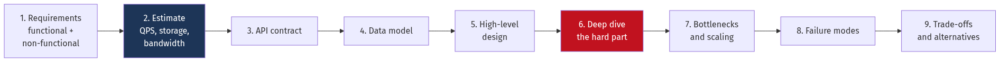
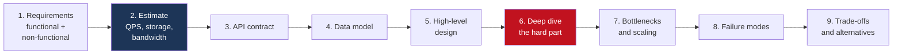
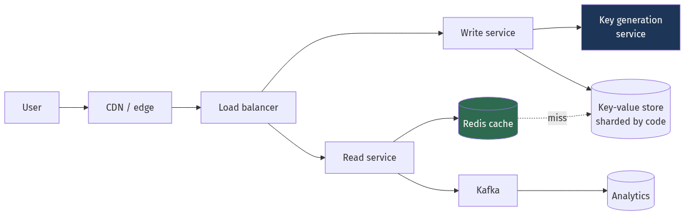
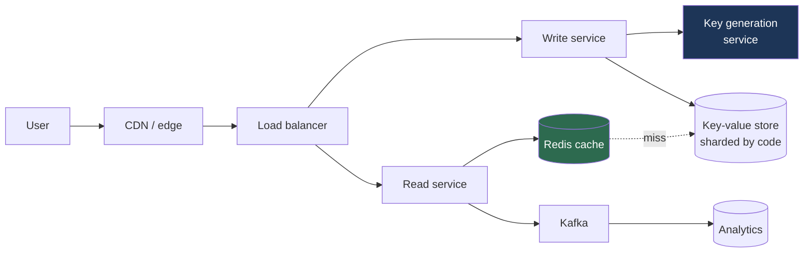
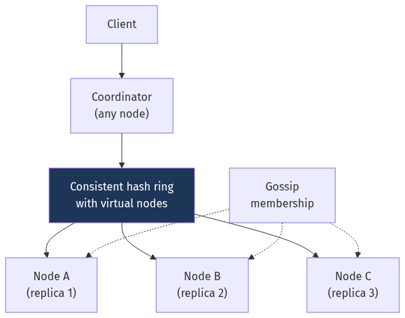
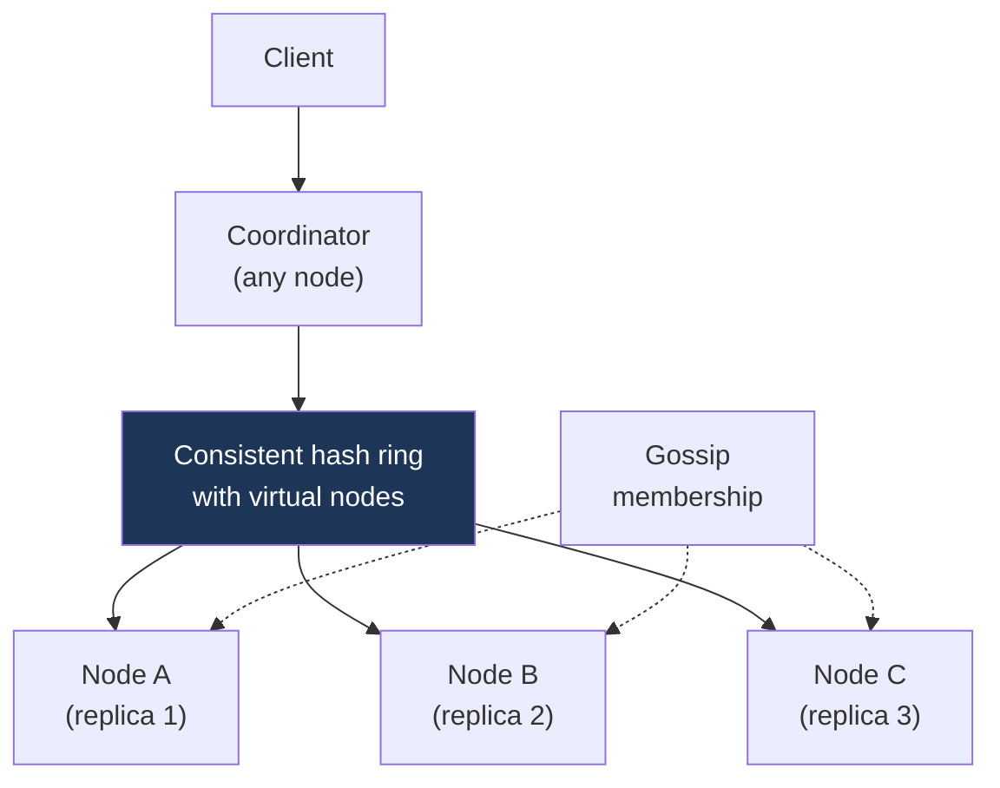
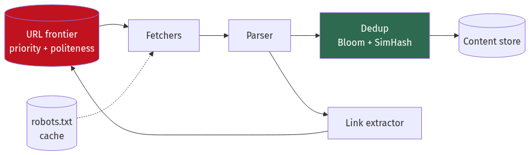
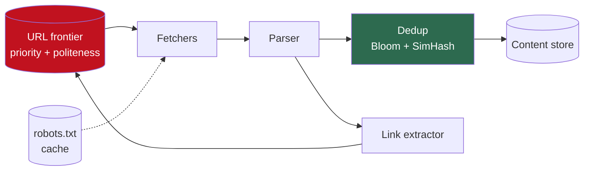
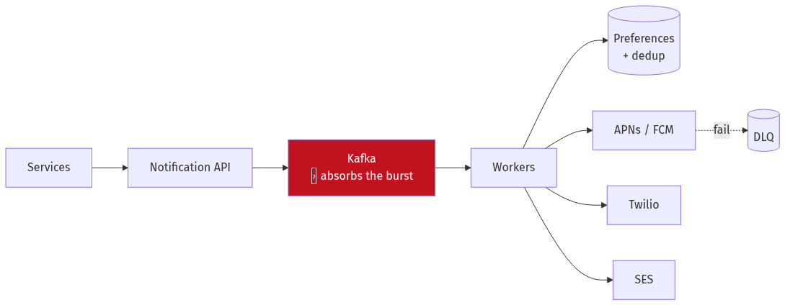
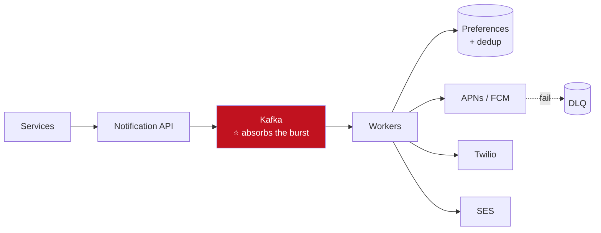

# Chapter 24 — Case Studies I: Foundations

[← Chapter 23](./23_building_blocks_and_algorithms.md) · [Contents](./README.md) · [Next: Chapter 25 →](./25_case_studies_part2.md)

**Prerequisites:** Chapters 2, 3, 9, 11, 12 and 23. These designs assemble what those chapters taught.

---

## What you'll learn

Eight complete designs, each in the same nine-step format. These are the "warm-up" problems —
the ones with a single dominant constraint, where the value is in seeing the method applied
cleanly.

| # | System | The one thing it teaches |
| --- | --- | --- |
| 1 | **URL shortener** | Read:write ratio drives everything |
| 2 | **Pastebin** | Where to store the blob vs the metadata |
| 3 | **Distributed rate limiter** | Approximate coordination beats exact |
| 4 | **Distributed key-value store** | Quorums, and what you give up |
| 5 | **Unique ID generator** | Coordination-free vs coordinated |
| 6 | **Web crawler** | Politeness and the frontier are the hard parts |
| 7 | **Notification system** | Fan-out, and per-channel failure |
| 8 | **Typeahead** | Precompute, and rank by the business metric |

---

## The method

Use the same nine steps every time. In an interview this structure alone earns marks, because it
demonstrates you're driving rather than free-associating.



<details>
<summary>Diagram source (Mermaid)</summary>



</details>

⚠️ **Two habits that separate strong candidates:**
1. **Estimate before designing.** The numbers pick the architecture. Designing first and
   estimating afterwards means you defend a design instead of deriving one.
2. **Identify the single hard part and spend your time there.** Every one of these problems has
   one genuinely interesting constraint and a lot of routine machinery. Say which is which.

---

## Design 1 — URL shortener

### 1. Requirements

```
Functional:
  • Shorten a long URL → a short one
  • Redirect a short URL → the original
  • Optional custom aliases and expiry
  • Basic analytics (click count)

Non-functional:
  • 100M new URLs/day
  • ⭐ Redirect latency < 50 ms (it's on the critical path of someone's page load)
  • Highly available — a broken redirect is a broken link, forever
  • Short URLs must not be guessable (for private links)
```

### 2. Estimate

```
Writes: 100,000,000 / 100,000 s = 1,000/s average, ~3,000/s peak (Ch 2 §2.3)
Reads:  ⭐ read:write ratio ~100:1 for a shortener
        → 100,000/s average, 300,000/s peak

Storage: 100M/day × 500 bytes (URL + metadata) = 50 GB/day
         5 years = 91 TB, × 3 replication = 273 TB

Key space: how short can the code be?
📐 base62 (a-zA-Z0-9):  62⁶ = 56.8 billion
                        62⁷ = 3.5 trillion
   100M/day × 365 × 5 = 182 billion URLs in 5 years
   → 6 chars is NOT enough. Use 7.
```
💡 **That key-space calculation is the whole point of estimating first.** Choosing 6 characters
because it looks tidy means running out in 18 months.

### 3. API

```
POST /api/v1/urls          {"long_url": "...", "custom_alias": "...", "ttl_days": 365}
                        →  201 {"short_url": "https://sho.rt/aB3xK9p"}
GET  /{code}            →  301 or 302 redirect
GET  /api/v1/urls/{code}/stats
```

⚠️ **301 vs 302 is a real decision, not a detail:**
```
301 Permanent → the browser caches it forever
                ✅ Fastest for the user; ❌ you never see the click again — no analytics,
                   and you can't change or revoke the target
302 Found     → the browser asks every time
                ✅ Analytics and revocation work; ❌ every click hits your servers
```
💡 **Use 302** unless you genuinely don't need analytics or revocation. And use `Cache-Control:
private, max-age=0` to make the intent explicit.

### 4. Data model

```sql
CREATE TABLE urls (
    code        VARCHAR(7) PRIMARY KEY,   -- the short code
    long_url    TEXT NOT NULL,
    user_id     BIGINT,
    created_at  TIMESTAMPTZ NOT NULL,
    expires_at  TIMESTAMPTZ
);
-- Click counts are NOT in this table — see step 6.
```

### 5. High-level design



<details>
<summary>Diagram source (Mermaid)</summary>



</details>

### 6. Deep dive — generating the code

⚠️ **The obvious approaches both fail:**

```
❌ hash(long_url)[:7]
   Collisions. At 182 billion URLs in a 3.5-trillion space, the birthday bound
   makes collisions certain. You'd need a read-before-write to check — which
   turns every insert into a read plus a conditional write.

❌ base62(auto_increment_id)
   ⚠️ Sequential and therefore GUESSABLE — anyone can enumerate every private link.
   Also needs a single writer, which doesn't shard.
```

✅ **Two workable designs:**

**(a) Pre-generated key service.** A separate service generates random unused 7-character keys in
bulk, stores them in an "available" table, and hands out batches to writers.
```
Writer requests 10,000 keys → gets a block → serves them from memory
⭐ No coordination on the write path; no collision check per insert.
⚠️ Keys are lost if a writer dies holding a block — acceptable, the space is huge.
```

**(b) Counter + encryption.**
```
id = distributed_counter()          (Snowflake, or a range-allocating ticket server)
code = base62(FPE_encrypt(id))      format-preserving encryption with a secret key
⭐ Unique by construction (encryption is a bijection) AND unguessable.
```

💡 **(b) is more elegant; (a) is simpler to operate.** Both eliminate the collision check, which
is the actual goal.

**The click counter — don't put it in the URL row.**
```
❌ UPDATE urls SET clicks = clicks + 1 WHERE code = ?
   📐 300,000 writes/second on hot rows → lock contention and massive MVCC bloat
      (Ch 7 §7.7). And it destroys the read cache, since the row changes constantly.

✅ Emit a click event to Kafka; aggregate asynchronously (Ch 12).
   Or increment in Redis and flush periodically — this is the legitimate
   write-behind case from Ch 11 §11.2, because losing a few counts is fine.
```

### 7. Scaling

📐 **The cache does the heavy lifting**, and the Zipf math from
[Chapter 2](./02_scalability_and_estimation.md) §2.9 says how much:
```
Access is heavily skewed — a few links go viral, most are used once.
Cache the top 1M codes: 1M × 500 B = 500 MB
Realistic hit rate: 90-95%
→ Database sees 300,000 × 0.08 = 24,000 reads/s, sharded by code.
```

**Sharding:** by `code`, using consistent hashing
([Chapter 23](./23_building_blocks_and_algorithms.md) §23.1). Every lookup is a single-key read,
so it's perfectly partitionable — no cross-shard queries exist.

### 8. Failure modes

| Failure | Effect | Mitigation |
| --- | --- | --- |
| Cache down | 300k req/s hits the DB | ⚠️ Compute this: the DB can't take it. Need enough replicas or load shedding ([Ch 5](./05_load_balancing_proxies_traffic.md) §5.6) |
| Key service down | Cannot create new URLs | Writers hold a local block — degrades gracefully for hours |
| Analytics pipeline down | Counts lost | ✅ Acceptable — redirects unaffected, which is the point of decoupling |
| A shard down | Some codes unresolvable | Replication with automatic failover |

### 9. Trade-offs

| Decision | Chosen | Alternative | Why |
| --- | --- | --- | --- |
| Code generation | Pre-generated keys | Hash of URL | Avoids collision checks and is unguessable |
| Redirect | 302 | 301 | Analytics and revocation; costs a request per click |
| Click counting | Async via Kafka | Synchronous update | 300k writes/s on hot rows is not viable |
| Store | Key-value, sharded | Relational | No joins, no transactions, pure key lookup |

---

## Design 2 — Pastebin

Structurally similar to a URL shortener, with one important difference: **the payload is large**.

### 1–2. Requirements and estimate

```
10M pastes/day, average 10 KB, max 10 MB. Read:write ~10:1. Expiry supported.

Writes:  100/s average, 300/s peak
Reads:   1,000/s average, 3,000/s peak
Storage: 10M × 10 KB = 100 GB/day → 36 TB/year
Bandwidth (read): 3,000/s × 10 KB = 30 MB/s
```

### 5–6. The one design decision that matters

⚠️ **Do not store the paste content in the database.**

```
❌ Content in a Postgres TEXT column:
   • Destroys the buffer-pool hit rate — a 10 MB row evicts thousands of useful pages
     (Ch 6 §6.3)
   • Backups become enormous
   • Replication streams megabytes per write

✅ Content in object storage (S3); metadata in the database:
   pastes table: id, s3_key, size, content_type, created_at, expires_at, user_id
   ⭐ The DB row is ~200 bytes regardless of a 10 MB paste.
```

📐 **The saving:**
```
36 TB/year in Postgres:  ~$2,900/month block storage, plus 3× replication = $8,700
36 TB/year in S3:        ~$830/month, with lifecycle tiering to Glacier ≈ $200
Plus the DB stays small enough to fit its working set in RAM.
```

💡 **Serve reads directly from object storage via a CDN with a pre-signed URL.** The application
never touches the bytes:
```
GET /paste/abc123  → 302 to a pre-signed CloudFront URL, expiring in 5 minutes
→ 30 MB/s of egress never touches your servers.
```

### 8. Failure modes and expiry

```
Expiry: ⭐ use S3 lifecycle rules, not a cron job deleting rows.
        The database row is deleted by a sweeper; the object expires by policy.
⚠️ Deleting 10M objects a day with individual API calls is slow and expensive —
   lifecycle policies do it for free.
```

---

## Design 3 — Distributed rate limiter

### 1. Requirements

```
• Limit by user, API key, and IP
• Multiple rules simultaneously (per-second, per-minute, per-day)
• 1M requests/second across 50 gateway nodes
• ⭐ Adds < 1 ms to request latency
• Must not be a single point of failure
```

### 2. Estimate

```
1M req/s × 3 rules = 3M rate-limit checks/second
📐 If each check were a Redis round trip at 1 ms, that's 3M × 1 ms = 3,000
   concurrent connections' worth of latency, plus Redis at 3M ops/s
   (30 nodes at 100k ops/s each — Ch 8 §8.2).
   ⚠️ And it makes Redis a hard synchronous dependency of every request.
```

### 6. Deep dive — the coordination question

💡 **This is the interesting part of the problem, and it's a distributed-systems question, not an
algorithms one.**

| Approach | Accuracy | Latency added | ⚠️ |
| --- | --- | --- | --- |
| Local only, limit ÷ N | Poor | 0 | Breaks when traffic hashes unevenly — a client on one node gets limit/50 |
| Central Redis per request | ⭐ Exact | ~1 ms | Hard dependency; Redis outage = total outage |
| **Local + async reconciliation** | ~95% | ⭐ ~0 | Approximately right; no synchronous dependency |

✅ **Choose local counters with asynchronous reconciliation:**
```
1. Each gateway keeps a local token bucket per key, in memory
2. Every 100 ms, it publishes its consumption to a shared store
3. It fetches the global view and adjusts its local allowance

📐 With 50 nodes and a 100 ms sync interval, worst-case overshoot is bounded by
   what 50 nodes can consume in 100 ms before they learn about each other —
   typically 5-10% over the limit.
```
⚠️ **State the trade explicitly: a rate limiter is a *defensive* mechanism.** Being 5% over
occasionally is fine; adding a millisecond and a hard dependency to every request is not.

**The algorithm:** GCRA ([Chapter 23](./23_building_blocks_and_algorithms.md) §23.2) — one
timestamp per key, one atomic operation, burst-tolerant.

### 7. Layered rules

```
Global:              1,000,000 req/s   → platform protection
Per API key:            1,000 req/s
Per user:                  50 req/s
Per user on /search:       10 req/s    → protects an expensive backend
Per IP on /login:           5 req/min  → ⭐ AND per account, or credential
                                          stuffing just rotates IPs
```

### 8. Failure modes

⚠️ **Fail open or closed?**
```
Rate limiter store unavailable:
  FAIL OPEN  → allow everything. ✅ Availability preserved.
               ❌ No protection exactly when you might be under attack.
  FAIL CLOSED→ reject everything. ❌ Self-inflicted outage.

✅ The right answer: fail open, but fall back to LOCAL-ONLY limits.
   You lose global coordination, not all protection.
```

### 3. The response

```http
HTTP/1.1 429 Too Many Requests
Retry-After: 2
RateLimit-Limit: 100
RateLimit-Remaining: 0
RateLimit-Reset: 1756640460
```
⚠️ **429, not 503** — 503 means *you* are broken. And **without `Retry-After` clients retry
immediately**, turning your rate limit into a busy loop.

---

## Design 4 — Distributed key-value store

The Dynamo problem ([Chapter 22](./22_landmark_papers_and_architectures.md) §22.5), built from
first principles.

### 1. Requirements

```
• get(key), put(key, value)
• Values up to 1 MB
• ⭐ Highly available — accept writes during a network partition
• Tunable consistency
• Scale to petabytes, add nodes without downtime
```

### 5. High-level design



<details>
<summary>Diagram source (Mermaid)</summary>



</details>

### 6. Deep dive — the four mechanisms

**(a) Partitioning: consistent hashing with virtual nodes**
([Chapter 23](./23_building_blocks_and_algorithms.md) §23.1). 150 vnodes per physical node gives
±5% balance and lets you weight heterogeneous machines.

**(b) Replication:** the key's coordinator plus the next N−1 distinct physical nodes clockwise.
⚠️ **Distinct physical nodes** — with virtual nodes, the next three ring positions might all
belong to the same machine.

**(c) Consistency: quorums** ([Chapter 9](./09_replication_partitioning_consistency.md) §9.5)
```
📐 W + R > N guarantees the read and write sets overlap.
N=3, W=2, R=2 → 4 > 3 ✅  the balanced default
N=3, W=1, R=1 → 2 ≤ 3 ❌  fast, eventually consistent
```

**(d) Conflict resolution.** ⚠️ **This is where the real design decision is.**
```
Vector clocks (Dynamo's choice):
  ✅ Detects genuinely concurrent writes rather than silently discarding one
  ⚠️ Returns SIBLINGS — the application must merge them.
     Amazon's own retrospective: developers found this too hard.

Last-write-wins:
  ✅ Simple
  ❌ Silently loses data, and depends on clocks that disagree by tens of ms
     (Ch 21 §21.3)

⭐ Best answer: offer BOTH, and default to LWW while supporting a
   register type with CRDT semantics for callers who need it.
```

### 7. Availability mechanisms

```
Sloppy quorum + hinted handoff:
  If a home replica is unreachable, write to any available node with a HINT.
  ⚠️ This VOIDS the W+R>N guarantee (Ch 9 §9.5) — say so explicitly.
  The hint is delivered when the home node returns.

Read repair:      on read, push the newest value back to stale replicas — free,
                  but only fixes data that is read
Merkle-tree
anti-entropy:     scheduled full comparison — ⚠️ mandatory, not optional; without
                  it, rarely-read data never converges and deleted data can
                  resurrect (Ch 9 §9.5)
Gossip:           membership without a coordinator (Ch 21 §21.10)
```

### 8. Failure modes

| Failure | Behaviour |
| --- | --- |
| One replica down | Quorum still met; hinted handoff buffers writes |
| Two of three down | ⚠️ With W=2, writes fail. Sloppy quorum allows them, giving up the guarantee. |
| Network partition | Both sides accept writes (AP); conflicts detected on heal |
| Node permanently lost | Ring rebalances; 1/N of data re-replicates |

---

## Design 5 — Unique ID generator

### 1. Requirements

```
• Globally unique 64-bit IDs
• ⭐ Roughly time-sortable (so they work as clustered primary keys — Ch 6 §6.4)
• 10,000 IDs/second per node, 1,000 nodes
• No single point of failure
```

### 6. Deep dive — four options, and the choice

| Approach | Unique | Sortable | Coordination | ⚠️ |
| --- | --- | --- | --- | --- |
| DB auto-increment | ✅ | ✅ | ⚠️ Single writer | Doesn't scale or survive failure |
| **Ticket server with ranges** | ✅ | ✅ | Occasional | ⭐ Simple; gaps on restart |
| UUID v4 | ✅ | ❌ | None | ⚠️ Terrible clustered key (~47% index bloat) |
| **Snowflake** | ✅ | ✅ | Machine-ID assignment | ⭐ 64 bits; clock-skew sensitive |
| UUID v7 | ✅ | ✅ | None | 128 bits |

✅ **Snowflake**, because 64 bits matters:
```
 1        41 bits             10 bits      12 bits
┌─┬───────────────────────┬───────────┬─────────────┐
│0│ ms since custom epoch │ machine   │  sequence   │
└─┴───────────────────────┴───────────┴─────────────┘
📐 41 bits ≈ 69 years · 1,024 machines · 4,096 IDs/ms/machine
   = 4.1M IDs/second/machine ≫ the 10,000 required
```

⚠️ **The three real problems:**

**(1) Clock skew.** If the clock steps backwards you generate duplicates, silently.
```go
if now < s.lastTimestamp {
    // Never continue silently. Block, or refuse and alert.
    return 0, ErrClockBackwards
}
```

**(2) Machine-ID assignment.** 1,024 IDs must be uniquely allocated. Options: static config
(brittle), ZooKeeper/etcd ephemeral sequential nodes (⭐ correct), or derive from the pod ordinal
in a StatefulSet ([Chapter 17](./17_containers_docker_kubernetes.md) §17.5).

**(3) Sequence exhaustion.** More than 4,096 IDs in one millisecond → **block until the next
millisecond**. Don't borrow from the timestamp.

💡 **The simpler alternative worth mentioning: a ticket server handing out ranges.** A node
requests a block of 10,000 IDs, serves them from memory, and requests another when it runs low.
No clock dependency at all, and gaps on restart are harmless. It's less elegant and easier to
operate.

---

## Design 6 — Web crawler

### 1. Requirements

```
• Crawl 1 billion pages/month
• ⭐ Politeness: respect robots.txt and per-host rate limits
• Detect and skip duplicates (exact and near-duplicate)
• Prioritise: important pages more often, changed pages sooner
• Avoid traps (infinite calendars, session IDs in URLs)
```

### 2. Estimate

```
1B pages/month ÷ 2.6M s = 385 pages/second average, ~1,000/s peak
Page size ~500 KB (HTML + assets we fetch)
📐 Bandwidth: 1,000/s × 500 KB = 500 MB/s = 4 Gbps sustained
   Storage: 1B × 500 KB = 500 TB/month raw; compressed ~5:1 → 100 TB
```

### 5. High-level design



<details>
<summary>Diagram source (Mermaid)</summary>



</details>

### 6. Deep dive — the frontier is the hard part

⚠️ **The naive design — one global priority queue — fails on politeness.** You'd hammer one host
with a thousand concurrent requests while ignoring others.

✅ **The two-level queue design (from the Mercator crawler):**
```
FRONT QUEUES (prioritisation):
  N queues by priority. A page's priority comes from PageRank,
  update frequency, and depth from a seed.

BACK QUEUES (politeness):
  ⭐ M queues, each assigned to EXACTLY ONE HOST.
  A worker takes from a back queue and must wait `crawl_delay` before
  taking from that same queue again.

A router moves URLs from front to back queues, maintaining
host → back-queue mapping.
```
💡 **The invariant that makes it work: one host maps to one back queue, and one worker services
one back queue at a time.** Politeness becomes structural rather than something you check.

**Deduplication, two kinds:**
```
Exact duplicate:  ⭐ Bloom filter of URL hashes (Ch 23 §23.3)
                  📐 10 billion URLs at 1% FP = 12 GB. A hash set would be 200 GB+.
                  ⚠️ FP means we skip a URL we haven't crawled — acceptable.

Near-duplicate:   SimHash fingerprint + LSH banding (Ch 23 §23.7)
                  Catches the same article on 50 syndication sites.
```

⚠️ **Crawler traps** — the failure mode that wastes most of a naive crawler's budget:
```
• Infinite calendars: /events?date=2026-08-31 → next month → forever
• Session IDs in URLs: the same page with infinite distinct URLs
• Deep directory recursion: /a/b/a/b/a/b/...

Defences: max URL depth, max URLs per host, URL normalisation (strip session
          params), and detecting near-duplicate content per host.
```

### 8. Failure modes

| Failure | Mitigation |
| --- | --- |
| Fetcher crashes mid-URL | Frontier uses at-least-once delivery with a visibility timeout; re-crawling is harmless |
| A host is slow or hostile | Per-host circuit breaker; exponential back-off |
| Frontier grows unbounded | Bound it; spill to disk; prioritise ruthlessly |
| robots.txt unreachable | ⚠️ **Fail closed** — don't crawl. Politeness is a legal and ethical requirement, not an optimisation. |

---

## Design 7 — Notification system

### 1. Requirements

```
• Push, SMS, email, in-app
• 10M notifications/day, bursty (a marketing send is 5M in 10 minutes)
• User preferences: channels, quiet hours, opt-outs
• ⭐ At-least-once delivery, deduplicated by the client
• Third-party providers (APNs, FCM, Twilio, SES) will fail
```

### 2. Estimate

```
10M/day average = 100/s
⚠️ But a marketing burst is 5M in 10 min = 8,300/s — an 83× spike.
📐 THE BURST is the design constraint, not the average.
```
💡 **Say this explicitly.** Designing for 100/s and discovering the 8,300/s burst in production
is the failure this estimate prevents.

### 5. High-level design



<details>
<summary>Diagram source (Mermaid)</summary>



</details>

### 6. Deep dive — the queue is the design

⭐ **Kafka's role here is buffering, not messaging.** The burst of 8,300/s is absorbed and drained
by workers at whatever rate the third-party providers allow.

```
📐 Provider rate limits are the real ceiling:
   APNs:   ~10,000/s per connection, multiple connections allowed
   Twilio: ~100/s per number by default — ⚠️ 5M SMS would take 14 hours
   SES:    14/s default, raisable on request

→ A marketing send of 5M SMS is NOT a technical problem you can engineer
  around. It's a provider-capacity problem, and the answer is more numbers
  or a longer send window. Say so.
```

**Separate topics per channel**, because their throughput and failure characteristics differ by
orders of magnitude. A slow SMS provider must not block push notifications.

**Preferences and quiet hours:**
```
⚠️ Check preferences at SEND time, not at enqueue time. A user who opts out
   after a 5M-message batch is enqueued must not receive it.
```

**Deduplication:** an idempotency key per logical notification
([Chapter 10](./10_distributed_transactions_and_integrity.md) §10.4), checked in the inbox table
before sending. At-least-once delivery from Kafka means retries will happen.

### 8. Failure modes

| Failure | Mitigation |
| --- | --- |
| APNs down | Per-channel circuit breaker; messages stay in Kafka and drain on recovery |
| Invalid device token | Terminal error → DLQ immediately; don't burn retry tiers |
| Provider rate limit | ⭐ Back-pressure into the queue; do not drop |
| Duplicate send | Inbox dedup by idempotency key |
| Retry storm on recovery | ⚠️ Ramp up gradually — full-speed redelivery kills the recovered provider ([Ch 15](./15_apis_and_protocols.md) §15.5) |

---

## Design 8 — Typeahead / autocomplete

### 1. Requirements

```
• Suggestions after each keystroke, < 100 ms
• 10 billion queries/day of search traffic → ⭐ 5× that in keystrokes
• Top 10 suggestions, ranked
• Reflect trending queries within hours
```

### 2. Estimate

```
📐 THE key number:
   Searches: 10B/day ÷ 100,000 s = 100,000/s
   Keystrokes: ~5 per search → 500,000/s of autocomplete requests
   ⚠️ Autocomplete is 5× the load of search itself.
```
💡 **This estimate is the entire design.** At 500,000/s you cannot run a search query per
keystroke — it must be a lookup.

### 6. Deep dive — precompute, and rank by conversion

```
❌ Query Elasticsearch per keystroke: 500,000 QPS of prefix queries.
   Even at 10,000 QPS per node that's 50 nodes doing nothing else.

✅ Precompute the top 10 for every prefix, offline, and serve from memory.
```

```
Offline pipeline (hourly):
  1. Aggregate query logs from the last 30 days
  2. For each prefix (2-20 chars), find the top 10 completions
  3. ⭐ Rank by CONVERSION RATE, not raw frequency
  4. Write to Redis: "ac:head" → ["headphones", "headphones wireless", ...]

Serving: one Redis GET. < 1 ms.
```

📐 **Memory:**
```
~50M distinct prefixes (from real query logs, not all possible strings)
× 10 suggestions × ~40 bytes = 20 GB
Sharded across a small Redis cluster. ✅
```

💡 **Ranking by conversion rather than frequency is the commercially important detail.** The most
*frequent* completion is often one that doesn't convert. Optimising autocomplete for the business
metric rather than the text metric is a measurable revenue difference
([Chapter 14](./14_search_systems.md) §14.7).

**The trie/FST alternative:**
```
A trie with the top-k cached at each node is the textbook answer.
⚠️ In practice, precomputed Redis lookups are simpler to operate and faster,
   and an FST (Lucene's completion suggester) handles the long tail of
   prefixes absent from the logs.
→ Use both: Redis for the hot 50M prefixes, FST as the fallback.
```

### 7. Freshness

⚠️ **Hourly batch means trending queries take an hour to appear**, which for breaking news is too
slow.
```
✅ Hybrid: hourly batch for the bulk + a real-time layer.
   A Flink job counts queries in a 5-minute sliding window and injects
   fast-rising terms into a separate Redis key, merged at serve time.
```

### 8. Failure modes

| Failure | Mitigation |
| --- | --- |
| Redis down | Fall back to the FST/completion suggester — degraded but working |
| Batch job fails | Serve yesterday's data — ⚠️ alert on **data age**, not job failure ([Ch 19](./19_observability_and_operations.md) §19.7) |
| Cold prefix (no data) | FST fallback, or return nothing gracefully |

---

## Cross-cutting lessons

📐 **The eight designs, and the number that decided each:**

| Design | The decisive number | What it forced |
| --- | --- | --- |
| URL shortener | 62⁶ < 182 billion | 7-character codes, not 6 |
| URL shortener | 100:1 read:write | Cache-first architecture |
| Pastebin | 10 MB payloads | Blobs in S3, metadata in the DB |
| Rate limiter | 1 ms × 3M checks/s | Local counters, not central Redis |
| KV store | W + R > N | The quorum configuration |
| ID generator | 4,096 IDs/ms/machine | Snowflake's bit allocation |
| Crawler | 10 billion URLs | Bloom filter, not a hash set |
| Notifications | 83× burst | Kafka as a buffer |
| Typeahead | ⭐ 5× search traffic | Precompute, never query per keystroke |

💡 **Every one of those is an estimate that eliminated an architecture.** That's what step 2 is
for, and it's why doing it before designing rather than after is the difference between deriving
a design and defending one.

**Patterns that recurred:**
```
• Cache-aside with a high hit rate            (shortener, typeahead)
• Async via a queue to decouple failure       (shortener analytics, notifications)
• Precompute at write time to make reads O(1) (typeahead)
• Probabilistic structures to fit in memory   (crawler dedup, rate limiter)
• Blobs in object storage, metadata in a DB   (pastebin)
• Fail open for defensive systems,
  fail closed for correctness systems         (rate limiter vs robots.txt)
```

---

## Interview angle

**Q: Design a URL shortener.** *(the classic warm-up)*

*Strong:* "I'd start with the numbers, because two of them decide the architecture. First,
**key space**: at 100 million URLs a day for five years that's 182 billion, and base62 with six
characters gives 56.8 billion — so six characters runs out in eighteen months and I need seven.
Second, the **read:write ratio is about 100:1**, which tells me this is a caching problem, not a
database problem — caching the hot million codes gets a 90-plus percent hit rate and takes the
database from 300,000 reads a second to about 24,000. For **code generation** I'd avoid hashing
the URL, because collisions at that density mean a read-before-write on every insert, and I'd
avoid a sequential counter because it's guessable — anyone could enumerate private links.
Instead, a pre-generation service handing out blocks of random unused keys, or a counter passed
through format-preserving encryption, which is unique by construction and unguessable. And I'd
call out one non-obvious thing: **don't put the click counter in the URL row** — 300,000 updates
a second on hot rows is lock contention and MVCC bloat, and it invalidates your cache constantly.
Emit click events to Kafka and aggregate asynchronously."

**Q: Design a distributed rate limiter.**

*Strong:* "The interesting part isn't the algorithm — it's the **coordination**. With fifty
gateway nodes, enforcing a limit locally on each gives you fifty times the intended limit.
Dividing by fifty breaks whenever traffic hashes unevenly, since a client whose connections all
land on one node gets a fiftieth of its allowance. A central Redis counter is exact but adds
about a millisecond and, worse, makes Redis a **hard synchronous dependency of every single
request** — so a Redis outage becomes a total outage, for a mechanism that's purely defensive.
So the right answer is **local counters with asynchronous reconciliation**: each node enforces
from a recently-synced view and publishes its consumption every hundred milliseconds. You
overshoot by maybe five to ten percent, and you accept that explicitly because being slightly
over on a defensive control is far better than adding a millisecond and a failure mode to every
request. For the algorithm I'd use **GCRA** — it stores one timestamp rather than a token count,
so it's a single atomic operation, and it's burst-tolerant, which matters because real clients
are bursty. And **fail open** if the store is unavailable, falling back to local-only limits — you
lose global coordination, not all protection."

**Q: Design autocomplete for a search engine.**

*Strong:* "The estimate decides it. Ten billion searches a day is a hundred thousand a second,
but autocomplete fires on every keystroke — roughly five per search — so it's **five hundred
thousand requests a second, five times the search load itself**. At that rate you cannot run a
prefix query per keystroke; even at ten thousand queries per second per Elasticsearch node that's
fifty nodes doing nothing but autocomplete. So: **precompute**. An hourly batch job aggregates
thirty days of query logs and writes the top ten completions for every prefix into Redis — about
fifty million real prefixes, twenty gigabytes, served with a single GET in under a millisecond.
The detail I'd emphasise is **ranking by conversion rate rather than raw frequency**, because the
most common completion is frequently one that doesn't convert, and optimising for the business
metric rather than the text metric is a measurable revenue difference. Two gaps to cover: an
**FST or completion suggester** as fallback for prefixes absent from the logs, and a **real-time
layer** — a Flink job over a five-minute window — for trending terms, because an hourly batch is
too slow for breaking news."

**Q: How do you make a crawler polite?**

*Strong:* "Structurally, rather than by checking a rule. The naive design — one global priority
queue — makes politeness impossible, because you'd have a thousand workers hitting whichever host
happens to be at the head. The standard answer is the **two-level queue** from the Mercator
design: **front queues** handle prioritisation, ranked by PageRank, update frequency and depth
from a seed, and **back queues** handle politeness, with the invariant that **each back queue
maps to exactly one host and is serviced by one worker at a time**. A worker that takes a URL
from a back queue must wait the host's crawl delay before taking another from that queue. So
politeness is a property of the data structure rather than a check that can be forgotten. On top
of that: cache and respect `robots.txt`, and **fail closed** if it's unreachable — don't crawl —
because politeness is a legal and ethical requirement, not an optimisation. And I'd mention
**traps**, which waste most of a naive crawler's budget: infinite calendars, session IDs
generating unbounded distinct URLs, deep recursion. Defences are URL normalisation, depth and
per-host limits, and near-duplicate content detection with SimHash."

---

## Recap

- **Use the nine-step method every time.** Estimate *before* designing — the numbers eliminate
  architectures.
- **URL shortener:** key space picks the code length; a 100:1 read ratio makes it a caching
  problem; never count clicks synchronously.
- **Pastebin:** blobs in object storage, metadata in the database. The DB row stays 200 bytes
  regardless of a 10 MB paste.
- **Rate limiter:** the coordination question dominates the algorithm question. Local counters +
  async reconciliation; **fail open** to local-only.
- **KV store:** consistent hashing + quorums + read repair + anti-entropy. ⚠️ Sloppy quorums void
  `W + R > N`; say so.
- **ID generator:** Snowflake's 64 bits halve index size versus a UUID. ⚠️ Handle clock skew
  explicitly or you emit duplicates silently.
- **Crawler:** the **frontier** is the hard part, and the two-level queue makes politeness
  structural. Bloom filters make 10 billion URLs fit in 12 GB.
- **Notifications:** design for the **burst**, not the average. Third-party rate limits are the
  real ceiling and cannot be engineered around.
- **Typeahead:** autocomplete is **5× search traffic** — precompute or fail. Rank by conversion.

---

## Test yourself

1. A URL shortener uses 6-character base62 codes. At 50M new URLs/day, when does it run out?
2. Why is `301 Moved Permanently` a poor choice for a shortener that wants analytics?
3. Your rate limiter runs on 30 nodes with a central Redis check per request. Redis has a 40 ms
   blip. What happens, and how would the alternative design behave?
4. A KV store uses N=3, W=1, R=1. A client writes then immediately reads. What can happen?
5. Two Snowflake generators are accidentally configured with the same machine ID. What breaks,
   and when do you notice?
6. Your crawler's frontier is one global priority queue with 500 workers. Describe the problem.
7. A marketing campaign enqueues 5 million SMS. Twilio allows 100/s. How long, and what should
   you tell the marketing team?
8. Estimate the memory for autocomplete over 50 million prefixes with 10 suggestions each.
9. Your pastebin stores 10 MB pastes in a Postgres `TEXT` column. Name three things that degrade.
10. For a URL shortener, compare sharding by `code` against sharding by `user_id`.

<details>
<summary>Answers</summary>

1. 62⁶ = **56.8 billion** codes. At 50M/day: 56.8e9 / 50e6 = **1,136 days ≈ 3.1 years**.
   ⚠️ But that's the *exhaustion* point, not the point at which it becomes a problem. As the space
   fills, randomly-generated codes collide increasingly often — by the birthday bound, collisions
   become frequent well before exhaustion, so a generate-and-check scheme degrades badly from
   around 50% occupancy, i.e. **about 18 months in**. Use 7 characters (3.5 trillion), which gives
   190 years at this rate, or use a counter-plus-encryption scheme where uniqueness is guaranteed
   by construction rather than by chance.

2. Because **301 tells the browser to cache the redirect indefinitely**. After the first click, a
   given browser goes straight to the destination without ever contacting your server again. So:
   **click counts are wrong** — you see roughly one click per browser rather than per click;
   **you cannot revoke or change a link**, because browsers hold the old target possibly forever;
   and **you lose all subsequent analytics** — geography, referrer, timing.
   **302 Found** (or 307) makes the browser ask each time, so analytics and revocation both work,
   at the cost of one request per click. Given a shortener's read-heavy profile that cost is
   real but manageable with caching — and it's why essentially every commercial shortener uses
   302. If you genuinely don't need analytics or revocation, 301 is faster for users.

3. **With central Redis:** every request blocks on the rate-limit check, so a 40 ms Redis stall
   adds 40 ms to *every* request across all 30 nodes. At, say, 30,000 req/s that's 1,200 requests
   in flight extra, which consumes connections and worker slots; if the stall is longer, thread
   pools exhaust and the gateway starts failing requests that have nothing to do with rate
   limiting. You have converted a defensive mechanism into a **hard synchronous dependency** and
   a single point of failure.
   **With local counters + async reconciliation:** the request path never touches Redis, so a
   40 ms blip is invisible to users. The background sync misses one cycle, so nodes operate on a
   slightly stale global view for 100 ms — worst case they collectively allow a few percent over
   the limit. **No user-visible impact at all.** That asymmetry is the whole argument for
   approximate coordination in defensive systems.

4. `W + R = 1 + 1 = 2`, which is **not** greater than N=3, so the write set and read set are not
   guaranteed to overlap. The write is acknowledged by one replica and propagates asynchronously;
   the read may be served by either of the two replicas that haven't received it yet.
   **The client may not see its own write** — a read-your-writes violation
   ([Chapter 9](./09_replication_partitioning_consistency.md) §9.3). Worse, repeated reads can
   **flip between the old and new value** depending on which replica answers, violating monotonic
   reads and making time appear to go backwards.
   **Fix:** use `W=2, R=2` (4 > 3) for read-your-writes on paths where it matters, or pin the
   client's reads to the coordinator that handled its write for a short window.

5. **They emit duplicate IDs**, because the machine ID is the only thing distinguishing two
   generators that share a millisecond and a sequence number. Both nodes will independently
   produce, say, `(timestamp=T, machine=7, sequence=0)`.
   **When you notice** depends entirely on whether anything enforces uniqueness. If the ID is a
   **primary key**, you get constraint violations — noisy, but safe, and you find out quickly. If
   it's used as an identifier without a unique constraint — an event ID, a request ID, a
   partition key — the collision is **silent**, and two logically distinct records merge or
   overwrite each other. You may not discover it for months, and reconstructing what was lost may
   be impossible.
   **Prevention:** allocate machine IDs through a coordination service — ZooKeeper or etcd
   ephemeral sequential nodes, so an ID is released when a node dies — or derive them from a
   StatefulSet pod ordinal, which is unique by construction. Never static configuration files,
   which get copied.

6. **Politeness becomes impossible.** With one global queue ordered by priority, the 500 workers
   all pull from the head — and if the highest-priority URLs happen to be from one host (which
   they will, since a high-PageRank site has many high-priority pages), you send hundreds of
   concurrent requests to a single server. That's indistinguishable from a denial-of-service
   attack, it will get you blocked, and it may have legal consequences.
   You also can't respect per-host `crawl_delay` from `robots.txt`, because there's no structure
   associating a URL with the last time that host was contacted.
   **Fix: the two-level queue.** Front queues handle prioritisation; **back queues handle
   politeness, with each back queue dedicated to exactly one host and serviced by one worker at a
   time**, which waits the crawl delay between fetches. A router maintains the host→queue mapping.
   Politeness becomes an invariant of the data structure rather than a check that can be
   forgotten.

7. ```
   5,000,000 messages ÷ 100/s = 50,000 seconds = 13.9 hours
   ```
   **What to tell them:** this is a **provider capacity constraint, not an engineering problem**.
   No amount of infrastructure changes it — the messages leave through Twilio at 100 per second
   regardless of how many workers you run. The options are (a) request a higher rate limit from
   Twilio, (b) provision more sending numbers and shard across them, (c) accept a 14-hour send
   window, or (d) send to a subset.
   ⚠️ And there's a second point worth raising: a 14-hour send means the **last recipients get the
   message half a day after the first**, which may break the campaign's intent (a flash sale
   ending in 6 hours) and will certainly break quiet-hours handling across time zones. The system
   should also **check preferences and opt-outs at send time, not enqueue time**, so anyone
   unsubscribing during those 14 hours isn't messaged.

8. ```
   50,000,000 prefixes × 10 suggestions × ~25 bytes per suggestion string = 12.5 GB
   Plus Redis overhead: key strings (~10 B each), dict entries and list structure
     ≈ 50M × 150 B = 7.5 GB
   Total ≈ 20 GB
   ```
   That shards comfortably across a small Redis cluster — say 4 nodes with replicas, which also
   gives you the read throughput for 500,000 requests/second (each node handles ~125,000/s, at
   the upper end of a single Redis instance, so 6–8 nodes is safer).
   💡 Two optimisations worth mentioning: store the ten suggestions as a **single serialised
   string** rather than a Redis list, which removes most of the per-element overhead; and cap
   prefix length at around 12 characters, since beyond that the user has typed enough that a
   normal query works and the prefix count explodes.

9. (a) **Buffer-pool pollution.** Postgres reads whole 8 KB pages; a 10 MB value is TOASTed into
   many out-of-line chunks, and reading one paste can evict thousands of genuinely hot pages,
   collapsing the cache hit rate for every other query
   ([Chapter 6](./06_storage_engines_internals.md) §6.3).
   (b) **Backup and restore time.** The database grows by 100 GB/day, so `pg_dump` and restore
   times grow proportionally — and your measured RTO degrades until it breaches the target
   ([Chapter 20](./20_deployment_multiregion_dr_cost.md) §20.7).
   (c) **Replication bandwidth.** Every write ships megabytes through the WAL to every replica,
   inflating replication lag and cross-AZ transfer costs
   ([Chapter 2](./02_scalability_and_estimation.md) §2.10).
   Also: **vacuum pressure** from large dead tuples, and the fact that you're paying $80/TB-month
   for block storage where object storage costs $23 and tiers to $1.
   **Fix:** content in S3, a ~200-byte metadata row in Postgres, and serve reads via a pre-signed
   CDN URL so the bytes never touch your application.

10. **Shard by `code`** ✅ — this is correct.
    - Every read is `GET /{code}`, which resolves to exactly one shard. **No scatter-gather ever.**
    - Codes are effectively random, so distribution is uniform with no hotspots.
    - Writes distribute evenly too.
    - The read path — 300,000/s — is perfectly partitionable.
    **Shard by `user_id`** ❌ — this is wrong for the dominant access pattern.
    - The redirect lookup only has the *code*, not the user, so **every redirect would have to
      query every shard** and merge — turning a single-key read into a scatter-gather at 300,000
      requests per second.
    - You'd need a secondary global index from code → shard, which is an extra network hop on the
      critical path and its own consistency problem
      ([Chapter 9](./09_replication_partitioning_consistency.md) §9.10).
    - Distribution would be skewed by power users.
    💡 The general rule: **shard by whatever the highest-volume query has in hand.** Here that's
    the code. "List my URLs" is a rare, low-volume query, and it's fine for that one to
    scatter-gather or to be served from a separate index.

</details>

---

## Further reading

- Alex Xu, *System Design Interview* volumes 1 and 2 — the standard reference for this problem set
- Najork & Heydon, *Mercator: A Scalable, Extensible Web Crawler* (1999) — the two-level frontier
- DeCandia et al., *Dynamo* — for design 4
- Twitter Engineering, *Announcing Snowflake* (2010)
- The engineering blogs of Bitly, Cloudflare and Stripe for real shortener and rate-limiter designs

---

[← Chapter 23](./23_building_blocks_and_algorithms.md) · [Contents](./README.md) · [Next: Chapter 25 — Case Studies II →](./25_case_studies_part2.md)
