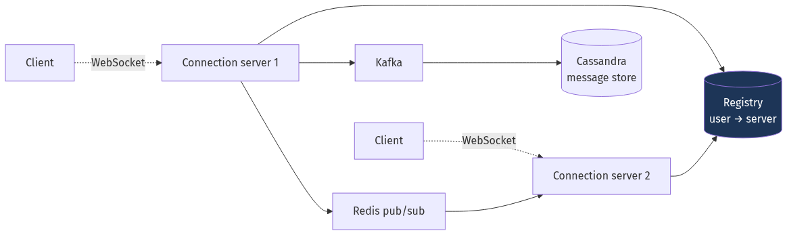
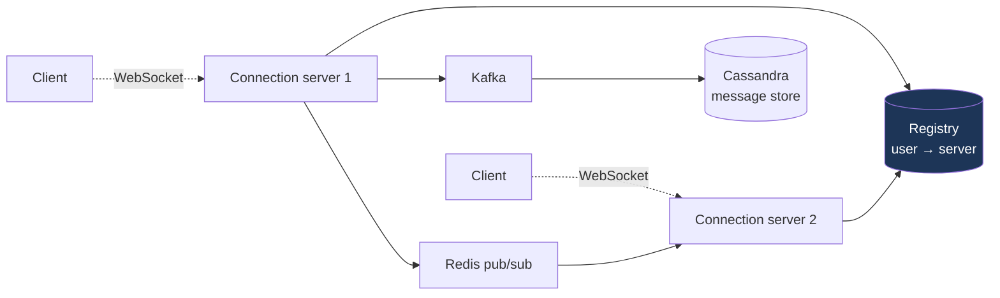
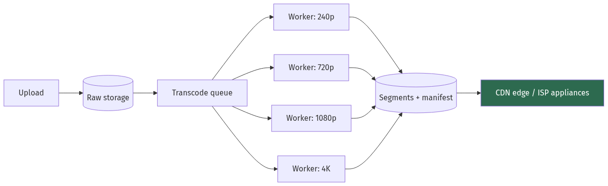
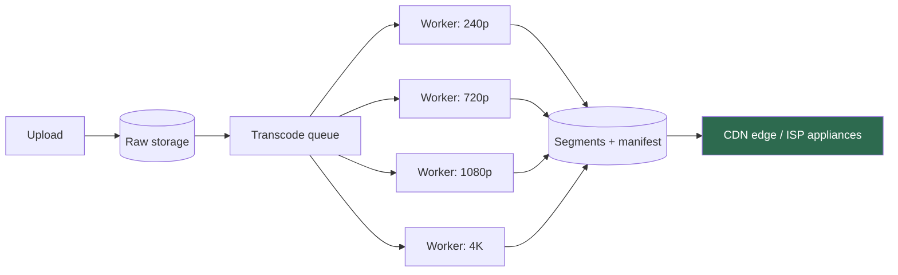
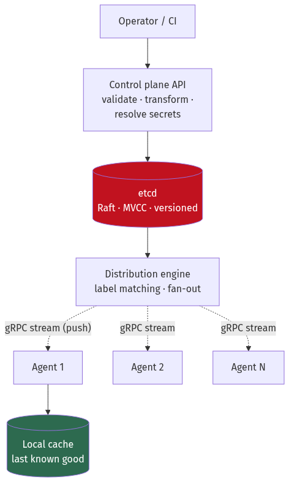
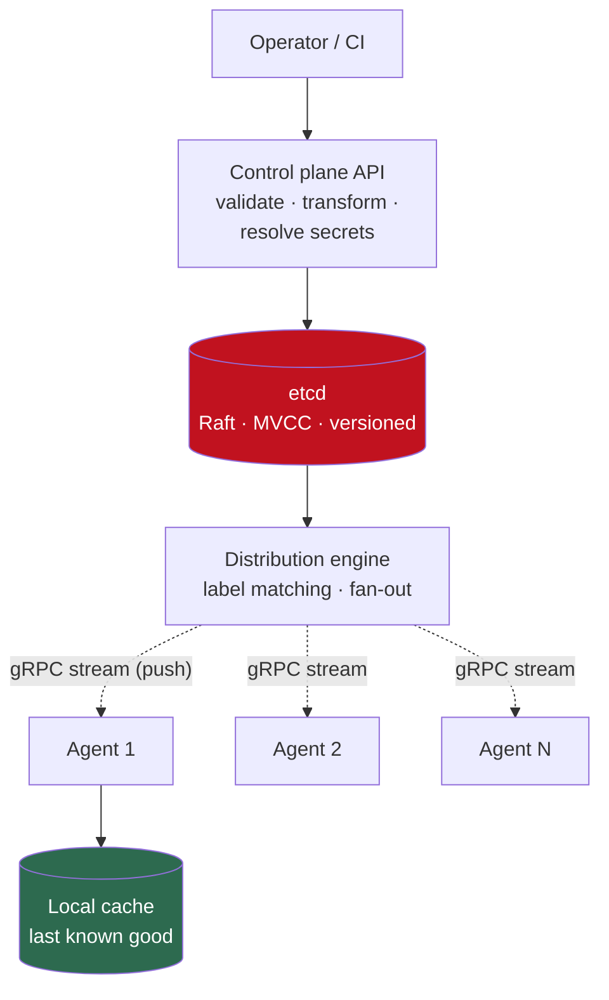

# Chapter 25 — Case Studies II: Advanced

[← Chapter 24](./24_case_studies_part1.md) · [Contents](./README.md) · [Next: Chapter 26 →](./26_interview_playbook_and_question_bank.md)

**Prerequisites:** [Chapter 24](./24_case_studies_part1.md) for the method, and most of the book for the mechanisms.

---

## What you'll learn

Fifteen designs where the difficulty is real. Each has a genuine tension — not just scale, but a
constraint that rules out the obvious answer.

| # | System | The tension |
| --- | --- | --- |
| 1 | **News feed** | Fan-out on write vs read, and the celebrity problem |
| 2 | **Chat** | Connection state at scale |
| 3 | **Video streaming** | 58 Tbps cannot come from an origin |
| 4 | **File sync** | Bandwidth, conflicts, and delta transfer |
| 5 | **Ride sharing** | Geospatial matching in real time |
| 6 | **Ticketing** | ⚠️ Must not oversell, under a 100× spike |
| 7 | **Payments** | Exactly-once with money |
| 8 | **Maps** | Precompute vs compute for routing |
| 9 | **Ad click aggregation** | Exactly-once counting for billing |
| 10 | **Job scheduler** | At-least-once vs at-most-once execution |
| 11 | **Object store** | Eleven nines of durability |
| 12 | **Backup & dedup** | Restore speed vs storage cost |
| 13 | **Metrics platform** | 1.4 bytes per data point |
| 14 | **Collaborative editing** | Convergence without a coordinator |
| 15 | **Config distribution** | Push to 10,000 agents in 100 ms |

---

## Design 1 — News feed (Twitter/Facebook)

### 1–2. Requirements and estimate

```
500M DAU · 2 posts/user/day · 20 feed loads/user/day · 500 followers average

Writes: 1B posts/day    = 10,000/s average, 30,000/s peak
Reads:  10B feed loads  = 100,000/s average, 300,000/s peak
⭐ Read:write = 100:1
```

### 6. Deep dive — the fan-out decision

**Fan-out on read** (compute the feed when requested):
```
SELECT * FROM posts WHERE author_id IN (500 followees)
ORDER BY created_at DESC LIMIT 50
📐 At 300,000 reads/s, each a 500-way merge over a huge index → not viable.
```

**Fan-out on write** (push into each follower's inbox):
```
On post: write the post ID into 500 follower inboxes
📐 30,000 posts/s × 500 = 15,000,000 writes/s
Read: ZREVRANGE feed:{user} 0 49 → O(log N + 50), sub-millisecond ✅
```

⚠️ **Then a celebrity posts.** 100 million followers = 100 million writes for one post. At 30,000
posts/s that's not a spike, it's an impossibility — and the post takes minutes to reach everyone.

✅ **The hybrid, which is what Twitter actually does:**
```
followers < 10,000  → fan out on write (99.9% of users)
followers ≥ 10,000  → do NOT fan out; store in a "celebrity posts" list

Read = merge(precomputed_inbox, recent_posts_from_followed_celebrities)
📐 An average user follows maybe 2 celebrities → a 3-way merge, not 500.
```

📐 **Memory for the inboxes:**
```
Cap each feed at 800 entries. 5M DAU actually active in a window:
5,000,000 × 800 × 70 B = 280 GB in Redis sorted sets ✅
⚠️ Materialising for all 500M users would be 28 TB — don't.
Inactive users fall back to read-time computation.
```

### 8. Failure modes

| Failure | Mitigation |
| --- | --- |
| Fan-out worker backlog | Kafka absorbs it; feeds go stale, not broken |
| Redis inbox lost | Rebuild from posts on read — degraded latency, correct content |
| Celebrity threshold too low | Fan-out cost explodes; make it a tunable, monitor the distribution |

💡 **The threshold is the design parameter.** Too low and you do too many read-time merges; too
high and fan-out cost explodes. Measure the follower-count distribution and set it where the
curve bends.

---

## Design 2 — Chat (WhatsApp)

### 1–2. Requirements and estimate

```
500M DAU · 40 messages/user/day · 100-byte messages · 30-day retention
Delivery receipts (sent / delivered / read)

Messages: 20B/day = 200,000/s average, 400,000/s peak
Storage:  2 TB/day × 30 days × 3 replicas = 180 TB
⭐ Concurrent connections: 10% of DAU online = 50 MILLION WebSockets
```
💡 **The estimate says this is a *connection* problem, not a storage or throughput problem.**
180 TB is unremarkable; 50 million persistent connections is the whole design.

### 5–6. Design



<details>
<summary>Diagram source (Mermaid)</summary>



</details>

📐 **Connection capacity:**
```
50M connections ÷ 500,000 per server = 100 connection servers minimum
Memory: 500,000 × 50 KB (socket buffers + app state) = 25 GB/server ✅
⚠️ Requires tuned file descriptors — the 1,024 default is useless (Ch 1 §1.10)
```

**Cross-server routing:**
```
Alice (server 1) → Bob (server 37)
1. Look up Bob in the registry: user → server
2. PUBLISH to channel "server:37"
3. Server 37, subscribed to its own channel, writes to Bob's socket
```

**Storage model** ([Chapter 8](./08_nosql_and_polyglot_persistence.md) §8.3):
```sql
PRIMARY KEY ((conversation_id, bucket), sent_at, message_id)
-- ⚠️ The bucket is essential. Without it, a busy group chat's partition
--    grows forever and exceeds the ~100 MB guideline.
```

⚠️ **Offline delivery:** if the recipient isn't connected, the message must persist and be
delivered on reconnect. Keep a per-user "undelivered" queue; the client acknowledges, and only
then do you drop it.

⚠️ **Deploys are painful.** Restarting a connection server drops 500,000 clients who all reconnect
at once. Drain gradually, and require **jittered exponential backoff** in the client
([Chapter 15](./15_apis_and_protocols.md) §15.4).

---

## Design 3 — Video streaming (YouTube/Netflix)

### 2. Estimate — the number that ends the discussion

```
1 billion hours watched/day ÷ 86,400 s = 11.6 million concurrent streams
At 1080p ≈ 5 Mbps:
📐 11,600,000 × 5 Mbps = 58 Tbps
```
⚠️ **For comparison, a large internet exchange handles single-digit Tbps.** No origin can serve
this. **The CDN is not an optimisation; it is the architecture.**

### 6. Deep dive — the pipeline



<details>
<summary>Diagram source (Mermaid)</summary>



</details>

📐 **Transcoding cost:**
```
500 hours uploaded/minute = 720,000 hours/day
Encoding is ~2-5× realtime per rendition on CPU; ~0.2× on hardware encoders
720,000 h × 5 renditions ÷ (hardware, 5× realtime) = 720,000 GPU-hours/day
⚠️ This is the second-largest cost after bandwidth.
```

**Parallelise by splitting the source into chunks** and transcoding them independently — a
2-hour film becomes 240 thirty-second jobs, so wall-clock time is minutes rather than hours.

**Adaptive bitrate** ([Chapter 11](./11_caching_cdn_and_edge.md) §11.10): segments of 2–6
seconds, the player measures throughput and picks a rendition per segment.
```
📐 Live latency ≈ 3 × segment duration (players buffer ~3 segments)
   6 s segments → ~18-20 s behind live
   → LL-HLS / CMAF chunked transfer gets this to 2-5 s
```

💡 **Netflix's Open Connect** takes the CDN argument to its conclusion: appliances physically
inside ISP networks, with content **pre-positioned overnight** based on predicted demand. The
bytes never traverse the public internet.

💡 **Per-title encoding**: analyse each title rather than using one fixed bitrate ladder — a
static cartoon needs far less bitrate than an action scene for the same perceived quality.
Netflix reported ~20% average bitrate reduction, which at 58 Tbps is enormous.

---

## Design 4 — File sync (Dropbox)

### 6. Deep dive — the three ideas

**(a) Chunking.** Split files into ~4 MB chunks, content-addressed by hash.
```
⭐ Only changed chunks are transferred.
Editing 1 KB of a 1 GB file uploads 4 MB, not 1 GB.
```

**(b) Deduplication** ([Chapter 6](./06_storage_engines_internals.md) §6.10). Chunks are stored
once globally, keyed by hash.
```
📐 The same 50 MB PDF shared by 10,000 users: stored ONCE.
   Real dedup ratios for a consumer sync service: 3:1 to 10:1.
⚠️ Cross-user dedup has a privacy consideration: it leaks whether a file exists.
   Mitigate with per-user encryption keys, at the cost of dedup ratio.
```

**(c) Metadata is the source of truth, not the blobs.**
```
Metadata DB (Postgres/MySQL): file tree, versions, chunk lists, ACLs — small, transactional
Block store (S3):             content-addressed chunks — huge, immutable
⭐ A "file" is a metadata row pointing at a list of chunk hashes.
```

⚠️ **Conflicts.** Two devices edit the same file offline.
```
Detection: version vectors per file (Ch 21 §21.4)
Resolution: ❌ do NOT merge automatically for binary files
            ✅ create "document (Alice's conflicted copy).docx" and let the
               user decide. Losing someone's work silently is unforgivable.
```

**Sync protocol:**
```
Long-poll or WebSocket notification of "your namespace changed, cursor X"
→ client fetches the delta since its last cursor
⭐ Never poll for the full tree — a user with 500,000 files would poll
   megabytes of metadata continuously.
```

---

## Design 5 — Ride sharing (Uber)

### 2. Estimate

```
1M concurrent drivers · location every 4 seconds
📐 250,000 location writes/second
20M rides/day = 230/s average
```

### 6. Deep dive — location is ephemeral

⚠️ **The instinct is to persist locations. Don't.**
```
❌ Postgres: 250,000 writes/s needs ~25 shards, and the data is worthless
   after 10 seconds.
✅ Redis: 1M drivers × 100 bytes = 100 MB. One node handles 250,000 ops/s.
⭐ 25 database shards replaced by one Redis instance, because we noticed the
   data doesn't need durability (Ch 2 §2.3).
```

**Matching — the geospatial query:**
```
"Find available drivers within 3 km"

Option A: Redis GEO (geohash under the hood)
  GEOSEARCH drivers FROMLONLAT <lng> <lat> BYRADIUS 3 km ASC COUNT 20
  ✅ Simple, fast, built in

Option B: H3 hexagonal cells (Ch 23 §23.8)
  ⭐ All 6 neighbours equidistant — a "within k rings" query is a genuine
     radius rather than a distorted square.
  This is why Uber built H3, specifically for supply/demand and surge.
```

**Matching is not just nearest.** The dispatch decision optimises globally:
```
score = f(ETA, driver rating, vehicle type, driver's direction of travel,
          expected next trip, fairness across drivers)
⚠️ Greedy nearest-driver matching produces worse aggregate outcomes than
   batched optimisation over a short window.
```

**Surge pricing:** compute supply/demand per H3 cell over a rolling window; a multiplier per
cell. ⚠️ It must be smoothed spatially and temporally, or riders see wild differences across a
street.

---

## Design 6 — Ticketing (Ticketmaster)

⭐ **The most interesting correctness problem in this chapter.**

### 1–2. Requirements

```
• 50,000 seats for a popular event
• ⚠️ 1 million people arrive within 10 seconds of on-sale
• ⭐ MUST NOT OVERSELL — a double-sold seat is a legal and reputational failure
• Users hold a seat for 10 minutes while paying
```

📐 **The spike:** 1,000,000 requests in 10 seconds = **100,000/s against 50,000 items**. This is
extreme contention on a tiny inventory, which is the opposite of most scaling problems.

### 6. Deep dive — three mechanisms

**(a) The virtual waiting room.** ⭐ **The single most important design element.**
```
Users do NOT hit the booking system directly.
They enter a queue, receive a position, and are admitted in batches.

📐 Admit 1,000 users per 30 seconds → the booking system sees ~33 req/s,
   not 100,000/s.
The 100,000/s spike hits a stateless queue service that does nothing but
issue tokens — which is trivially scalable.
```
💡 **This converts an impossible contention problem into an ordinary one.** Everything else is
routine once the waiting room exists.

**(b) Seat holds, not seat sales.**
```sql
-- Atomic conditional update — no distributed lock (Ch 21 §21.9)
UPDATE seats
SET status = 'held', held_by = $1, hold_expires_at = now() + interval '10 minutes'
WHERE seat_id = $2 AND status = 'available';
-- 0 rows affected → someone else got it. Tell the user immediately.
```
⚠️ **The hold MUST expire.** An abandoned checkout must not lock a seat forever
([Chapter 10](./10_distributed_transactions_and_integrity.md) §10.2's semantic-lock TTL). A
sweeper releases expired holds every few seconds.

**(c) Where correctness comes from.**
```
⭐ A single relational database with row-level locking, per event.
⚠️ NOT an eventually-consistent store — overselling is exactly the invariant
   that requires linearizability (Ch 9 §9.13).

📐 Is one database enough? 50,000 seats sold over even a 5-minute window is
   167 writes/second. Trivially yes.
→ The contention is on ARRIVAL, which the waiting room absorbed.
   The database only ever sees admitted, serialised traffic.
```

💡 **This is the key insight to state:** the correctness requirement forces a single-writer
database, and the waiting room is what makes a single-writer database sufficient. They're two
halves of one decision.

### 8. Failure modes

| Failure | Mitigation |
| --- | --- |
| Waiting-room service down | ⚠️ **Fail closed** — better no sales than overselling |
| User abandons after holding | Hold expires; sweeper releases |
| Payment succeeds, booking fails | Saga with compensation: refund + release ([Ch 10](./10_distributed_transactions_and_integrity.md)) |
| Bots | Rate limit per account and per payment method; CAPTCHA in the waiting room |

---

## Design 7 — Payment system

### 6. Deep dive — the ledger

⭐ **Use double-entry bookkeeping. It is not optional.**
```
Every transaction creates TWO entries that sum to zero:

  entry 1: account=user_123      amount=-5000  (debit)
  entry 2: account=merchant_456  amount=+5000  (credit)

📐 INVARIANT: SUM(amount) over the entire ledger is always 0.
   ⭐ This is a continuously-checkable global correctness property.
   If it's ever non-zero, you have a bug, and you know immediately.
```

```sql
CREATE TABLE ledger_entries (
    id              BIGSERIAL PRIMARY KEY,
    transaction_id  UUID NOT NULL,
    account_id      BIGINT NOT NULL,
    amount_cents    BIGINT NOT NULL,     -- ⚠️ integer, NEVER float (Ch 7 §7.2)
    currency        CHAR(3) NOT NULL,
    created_at      TIMESTAMPTZ NOT NULL DEFAULT now()
);
-- ⭐ APPEND-ONLY. No UPDATE, no DELETE, ever.
-- A correction is a new compensating pair of entries.
```

⚠️ **Immutability is the point.** A ledger you can edit is not a ledger. Reversals are new
entries, so the history remains a complete and auditable record of what happened.

**Idempotency** ([Chapter 10](./10_distributed_transactions_and_integrity.md) §10.4) — mandatory,
with the `in_progress` state that most implementations omit:
```
Client sends Idempotency-Key with every request and every retry.
Same key + same body  → return the STORED response
Same key + diff body  → 422 (the client has a bug)
Key in progress       → 409 (a concurrent duplicate)
```

**Authorise then capture** ([Chapter 10](./10_distributed_transactions_and_integrity.md) §10.2):
```
Authorise early  → fails fast on a bad card; a VOID is invisible to the customer
Capture late     → only once fulfilment is certain; a REFUND appears on their
                   statement and takes days
⭐ Order saga steps by reversibility.
```

**Reconciliation** — the control that catches what tests don't:
```
Daily: compare your ledger totals against the payment processor's settlement file.
Alert on any discrepancy beyond a tight tolerance.
💡 This is the only check that validates the END-TO-END system rather than
   one component of it (Ch 13 §13.11).
```

---

## Design 8 — Maps and routing

### 6. Deep dive — routing is a precompute problem

```
📐 Plain Dijkstra over a country-scale road graph (50M nodes):
   ~1-10 seconds per query. At 10,000 queries/s that's impossible.
```

**The technique that makes it viable: Contraction Hierarchies.**
```
Preprocess: order nodes by "importance", then contract them one by one,
adding SHORTCUT edges that preserve shortest-path distances.

Query: a bidirectional search that only ever moves UPWARD in the hierarchy.
📐 ~1-10 MILLISECONDS. A 1,000× speedup.
⚠️ Preprocessing takes hours and must be redone when the graph changes.
```

**Real-time traffic** is the complication: it changes edge weights continuously, and CH
preprocessing assumes static weights.
```
✅ Customisable Route Planning (CRP): separate the METRIC-INDEPENDENT
   preprocessing (which depends only on graph topology) from a fast
   metric customisation step that takes seconds.
→ Update traffic every few minutes without redoing the hours-long stage.
```

**Map tiles:**
```
Pre-render raster or vector tiles at each zoom level, serve from a CDN.
📐 Zoom 0-20: 4²⁰ tiles at max zoom = 1.1 trillion — you cannot pre-render all.
✅ Pre-render popular areas; render the rest on demand and cache.
   ⭐ Vector tiles are far smaller and let the client restyle without refetching.
```

---

## Design 9 — Ad click aggregation

⭐ **The interesting constraint: the counts are used for billing, so they must be right.**

### 2. Estimate

```
1 billion clicks/day = 10,000/s average, 50,000/s peak
Queries: "clicks per ad per minute", ad-hoc slices by dimension
```

### 6. Deep dive — exactly-once counting

⚠️ **At-least-once delivery means duplicate clicks, and duplicates mean over-billing
advertisers.**

```
Layer 1 — DEDUPLICATION at ingest:
  Each click carries a unique click_id.
  ⭐ Bloom filter (Ch 23 §23.3) over recent click_ids to reject obvious duplicates
     cheaply, then an exact check for the small number of possible-positives.
  📐 1B clicks/day at 1% FP = 1.2 GB, versus 200 GB for an exact set.

Layer 2 — Flink with EXACTLY-ONCE STATE (Ch 13 §13.4):
  Checkpointed windowed aggregation + a transactional sink.
  ⚠️ Exactly-once STATE, not exactly-once delivery — the sink must
     participate, or you're back to at-least-once (Ch 12 §12.7).

Layer 3 — RECONCILIATION:
  ⭐ A nightly batch job recomputes the same aggregates from raw logs
     and compares against the streaming output.
  Discrepancy > 0.01% → alert. The batch result is authoritative for billing.
```

💡 **Layer 3 is the one that matters.** Streaming gives you a fast approximate answer for
dashboards and budget pacing; batch gives you the authoritative number for invoices. This is a
**legitimate use of the Lambda pattern** — precisely because the streaming and batch outputs have
genuinely different purposes, not because you're duplicating logic
([Chapter 13](./13_big_data_batch_stream_analytics.md) §13.5).

**Event time, not processing time** ([Chapter 13](./13_big_data_batch_stream_analytics.md) §13.3):
a click at 23:59:58 that arrives at 00:00:03 belongs to **yesterday's** billing period.
Processing-time windows would misattribute revenue across billing boundaries.

---

## Design 10 — Distributed job scheduler

### 6. Deep dive — the two hard questions

**(a) At-least-once or at-most-once?**
```
⚠️ You cannot have exactly-once (Ch 10 §10.5).
   Sending an email twice: annoying.
   Charging a card twice: unacceptable.
   Not sending a critical alert: unacceptable.

⭐ Choose at-least-once + IDEMPOTENT jobs. It's the only combination
   that's both safe and complete.
```

**(b) Claiming work without a distributed lock.**
```sql
-- ⭐ SKIP LOCKED makes a queue out of a table (Ch 7 §7.9)
UPDATE jobs SET status='running', worker_id=$1, lease_expires_at=now()+interval '5 min'
WHERE id IN (
    SELECT id FROM jobs
    WHERE status='pending' AND run_at <= now()
    ORDER BY priority DESC, run_at
    LIMIT 10
    FOR UPDATE SKIP LOCKED       -- other workers skip these rows, no blocking
)
RETURNING *;
```

⚠️ **Leases, not locks.** A worker that dies holding a job must not block it forever:
```
Worker renews its lease every 60 s while working.
A sweeper reclaims jobs whose lease has expired.
⚠️ A PAUSED worker (GC, VM suspend) will wake up and complete a job that has
   been reassigned → the job runs twice.
   ✅ Which is fine, BECAUSE JOBS ARE IDEMPOTENT. That's why (a) matters.
```

**Cron semantics** — the details that cause incidents:
```
⚠️ Overlap: the previous run hasn't finished when the next is due.
   Policy must be explicit: skip, queue, or run concurrently.
⚠️ Missed runs: the scheduler was down over a scheduled time.
   Catch up, or skip? For a report, catch up. For "send a reminder", skip —
   nobody wants 40 reminders when the scheduler recovers.
⚠️ Time zones and DST: a 02:30 daily job runs twice or zero times when clocks
   change. Schedule in UTC and convert for display.
```

---

## Design 11 — Object store (S3-like)

### 6. Deep dive — where eleven nines comes from

⚠️ **Not from replication.** From **erasure coding across independent failure domains**
([Chapter 6](./06_storage_engines_internals.md) §6.10).

```
Reed-Solomon(k=10, m=4): any 10 of 14 shards reconstruct the object
📐 Storage overhead 1.4× (vs 3× replication)
   Tolerates 4 simultaneous shard losses (vs 2 for 3× replication)
   ⭐ Better durability at less than half the cost.

⚠️ Shards MUST be placed across independent failure domains — different racks,
   power, and ideally AZs. The durability math assumes independence, and
   correlated failure breaks it (Ch 3 §3.4).
```

**The other three components of durability:**
```
1. Background SCRUBBING with checksums — detect silent corruption (bit rot)
   before a second failure makes it unrecoverable. Without this, you discover
   corruption only when you try to reconstruct.
2. FAST REPAIR — when a node is lost, re-shard its data quickly. Durability
   depends on repair time being short relative to failure rate.
3. Versioning + object lock — ⚠️ eleven nines doesn't help if an API call
   deletes the object. Durability ≠ protection from mistakes or ransomware.
```

**Metadata is the hard part at scale:**
```
Trillions of objects → the key→location index is enormous.
Shard it by a hash of the key, and serve it from a separate, highly-available tier.
⭐ Small objects are packed into large containers before erasure coding —
   a 1 KB object split into 14 shards would be 14 tiny I/Os (Haystack's approach).
```

**Consistency:** S3 moved from eventual to **strong read-after-write consistency** in 2020,
implemented with a strongly-consistent metadata layer. It's a good example of a system tightening
a guarantee once the infrastructure made it affordable.

---

## Design 12 — Backup and deduplication

### 6. Deep dive — the four techniques

**(a) Content-defined chunking** ([Chapter 6](./06_storage_engines_internals.md) §6.10):
```
⚠️ Fixed-size chunking fails on insertion — prepend one byte and every
   subsequent boundary shifts, so nothing matches.
✅ Rolling hash (Gear/FastCDC): cut where (hash & 0x1FFF) == 0
   Boundaries depend on CONTENT, so an insertion changes only one chunk.
```

**(b) Global deduplication:**
```
📐 Daily fulls of 1 TB changing 2%/day, 30-day retention:
   Without dedup: 30 TB
   With dedup:    1 TB + 29 × 20 GB = 1.58 TB  → ⭐ 19:1
```

**(c) Synthetic fulls:**
```
Transfer only incrementals from the source; the backup system MERGES them
into a full internally.
⭐ Fast restore (read one full) with incremental-only network cost.
```

**(d) Immutability** ([Chapter 20](./20_deployment_multiregion_dr_cost.md) §20.7):
```
S3 Object Lock in compliance mode — cannot be deleted by ANYONE, including
the account root, until retention expires.
⚠️ This is the ransomware control. Deleting snapshots is the standard playbook.
```

⚠️ **The costs of deduplication, which are real:**
```
1. The chunk index doesn't fit in RAM at petabyte scale. This is THE
   engineering problem of a dedup system — solved with Bloom filters,
   locality-preserving caches and sparse indexing (Ch 6 §6.10).
2. ⭐ RESTORE FRAGMENTATION: a logically contiguous file is scattered across
   thousands of chunks written years apart. Restore throughput can be far
   WORSE than backup throughput.
3. FRAGILITY: one lost chunk corrupts every file referencing it.
   Needs aggressive checksumming and its own redundancy.
```

💡 **And the rule that overrides all of it: an untested backup is not a backup.** Restore monthly,
into a fresh environment, and **measure the elapsed time** — that's your real RTO, and it's
usually an order of magnitude off the aspirational one.

---

## Design 13 — Metrics platform

### 2. Estimate — the compression is the design

```
10,000 hosts × 500 metrics ÷ 10 s = 500,000 data points/second

📐 Naive: timestamp(8) + value(8) + series ID(50) = 66 bytes
   43.2 billion points/day × 66 B = 2.85 TB/day → 20 TB for 7 days

📐 With time-series compression (Gorilla — Ch 22 §22.13):
   • Series identifier stored ONCE per series, not per point
   • Delta-of-delta timestamps: regular 10 s intervals → ~1 bit
   • XOR-encoded values: ~1.3 bytes
   → ~1.4 bytes/point → 60 GB/day → 420 GB for 7 days
⭐ 48× reduction. This is why you cannot store metrics in PostgreSQL.
```

### 6. Deep dive

**Cardinality is the operational risk** ([Chapter 19](./19_observability_and_operations.md) §19.1):
```
⚠️ A single high-cardinality label (user_id, request_id, unnormalised URL path)
   multiplies series count by millions and OOMs the ingest tier.
Defences: per-tenant series limits, cardinality alerting, and
          metric_relabel_configs dropping offending labels at ingest.
```

**Downsampling** bounds long-term storage:
```
Raw (10 s):     7 days    → 420 GB
1-min rollup:  30 days    → 302 GB
1-hour rollup:  2 years   → 123 GB
⭐ Total under 1 TB for two years of history at 500,000 points/second.
```

**Query:** an inverted index from label pairs to series IDs
([Chapter 14](./14_search_systems.md) §14.1 — the same structure as text search), then a scan of
the matching series' compressed blocks.

---

## Design 14 — Collaborative document editing

### 6. Deep dive — OT or CRDT

```
⭐ The requirement decides it:

OT (Operational Transformation):
  Transform concurrent ops against each other so any order converges.
  ⚠️ REQUIRES A CENTRAL SERVER to establish the canonical order.
  ✅ Compact — no per-character metadata.
  → Google Docs, because it was designed around an always-available server.

CRDT (sequence type — RGA/YATA):
  Each character gets a unique, densely-ordered identifier.
  ✅ NO central server — works offline and peer-to-peer.
  ⚠️ Per-character metadata (mitigated by run-length encoding — ~1.5-3× now).
  → Figma, Notion, Linear, because they need offline editing.
```

💡 **The honest framing: it isn't that one is better. It's that OT's central-ordering requirement
is free if you have a server and disqualifying if you don't.**

**Presence** (cursors, selections) is separate and deliberately unreliable:
```
Ephemeral, high-churn, worthless after 10 seconds.
→ Redis with a 10 s TTL + pub/sub. ⚠️ Never persisted.
```

**Persistence:**
```
Store the operation LOG, not repeated snapshots.
⭐ Free version history; periodic snapshots bound replay cost.
```

---

## Design 15 — Configuration distribution control plane

⭐ **A genuinely good design problem, and one that appears in real infrastructure — it's
essentially what Envoy's xDS does.**

### 1. Requirements

```
• Distribute configuration to 10,000+ agents (proxies, load balancers, caches)
• ⭐ Propagation in under 100 ms
• Label-based targeting: "all edge proxies in eu-west with version ≥ 2.1"
• Full version history and instant rollback
• ⚠️ An agent must NEVER be left with no configuration
• Audit trail of every change
```

### 2. Estimate

```
10,000 agents · configuration changes are RARE (tens per day) but must be FAST
Config size: 10 KB - 1 MB per agent
📐 A full push to all agents: 10,000 × 100 KB = 1 GB
   ⚠️ If every agent polled every second, that's 1 GB/s of pointless traffic.
```

### 5. Design — control plane and data plane



<details>
<summary>Diagram source (Mermaid)</summary>



</details>

### 6. Deep dive — the four decisions

**(a) ⭐ Push, not poll.**
```
❌ Poll every 1 s: 10,000 agents × 1 req/s = 10,000 req/s of mostly-unchanged
   responses, and still up to 1 s of latency.
✅ Long-lived gRPC server stream per agent. The control plane pushes only
   when something changes.
📐 Latency: ~10 ms. Steady-state traffic: ~0.
   Memory: goroutine-per-agent ≈ 2-5 KB → 10,000 agents = 50 MB. ✅
```

**(b) Storage: etcd, and why.**
```
⭐ Raft consensus → linearizable, which config distribution needs:
   two agents must never receive contradictory config claiming to be current.
⭐ MVCC → every revision is retained → version history and rollback are free.
⭐ Watch API → the change notification mechanism, already built.
⭐ Compare-and-swap → optimistic concurrency for concurrent operators.

⚠️ etcd's practical limits: ~8 GB database, and it's sensitive to disk latency
   (fsync per write). Config is small, so this fits — but don't put large
   blobs in it.
```

**(c) Label-based targeting, and the index that makes it fast.**
```
Agent labels: {role: edge-proxy, region: eu-west, version: 2.1, cluster: prod}
Config selector: {role: edge-proxy, region: eu-west}

⚠️ Naive: on every change, scan all 10,000 agents and evaluate the selector.
   At tens of changes/day that's fine — but it's O(agents × configs).
✅ Maintain an inverted index label→agents (Ch 14 §14.1 again).
   Matching becomes a set intersection: microseconds.
```

**(d) ⭐ The agent must never be left without configuration.**
```
1. LOCAL CACHE: the agent persists the last-known-good config to disk.
   ⚠️ On restart with the control plane unreachable, it loads from disk
      and keeps serving. This is STATIC STABILITY (Ch 20 §20.4) — the data
      plane works without the control plane.
2. VALIDATION BEFORE APPLY: the agent validates the config (schema, and
   ideally a dry-run) before swapping it in. A bad config is rejected and
   the previous one retained.
3. VERSIONED APPLY: config carries a monotonically increasing revision.
   ⚠️ The agent REJECTS a revision lower than its current one — a FENCING
      TOKEN (Ch 21 §21.9), preventing a delayed or replayed message from
      reverting a newer config.
```

💡 **Point 3 is the subtle one.** A network partition can deliver an old push after a new one. A
revision check makes that harmless.

### 7. Reconciliation and drift

⚠️ **Push alone is not enough** — a message can be lost, or an agent can be disconnected during a
change.
```
✅ Every agent reports its CURRENT REVISION back to the control plane
   every 30 s (the same stream, in reverse).
The distribution engine compares desired vs actual and re-pushes to any
agent that has drifted.

⭐ This is the reconciliation loop from Ch 17 §17.4 — level-triggered rather
   than edge-triggered, so a lost event is self-correcting.
```

📐 **The observability that matters:**
```
Metric: histogram of (now − agent_last_applied_revision_timestamp)
→ answers "how many agents are behind, and by how long?"
Alert: any agent > 5 minutes behind, or > 1% of the fleet behind at all.
```

### 8. Failure modes

| Failure | Behaviour | Why it's acceptable |
| --- | --- | --- |
| Control plane down | Agents keep serving from local cache | ⭐ Data plane independent of control plane |
| etcd loses quorum | No new config accepted; existing config unaffected | Fail closed on writes, open on reads |
| Agent disconnected | Reconnects with exponential backoff + jitter; reconciliation catches it up | Self-healing |
| Bad config pushed | Agent validation rejects it; keeps the previous | Validation at the edge, not just centrally |
| Bad config *passes* validation | ⚠️ **Staged rollout**: 1% → 10% → 100%, with health checks between | Blast-radius control ([Ch 20](./20_deployment_multiregion_dr_cost.md) §20.1) |

💡 **That last row is the most important.** Validation catches malformed config; only a staged
rollout catches config that is *valid but wrong*.

### 9. Trade-offs

| Decision | Chosen | Alternative | Why |
| --- | --- | --- | --- |
| Delivery | Push (gRPC stream) | Poll | 10 ms vs 1 s, and no idle traffic |
| Store | etcd | Postgres / S3 | Linearizability + watch + MVCC in one |
| Targeting | Label selectors + inverted index | Explicit agent lists | Declarative; agents can change attributes |
| Consistency | Eventual across the fleet | Atomic global switch | ⚠️ Atomic across 10,000 agents needs 2PC — blocking, and unnecessary |
| Agent behaviour | Last-known-good on disk | Fail if no config | ⭐ Static stability |
| Ordering | Revision fencing | Timestamps | Clocks disagree ([Ch 21](./21_distributed_systems_theory_consensus.md) §21.3) |

---

## Cross-cutting lessons

📐 **The constraint that decided each design:**

| Design | Decisive constraint | Consequence |
| --- | --- | --- |
| News feed | Celebrity with 100M followers | Hybrid fan-out |
| Chat | 50M concurrent connections | Connection registry + pub/sub |
| Video | 58 Tbps | CDN *is* the architecture |
| File sync | Editing 1 KB of a 1 GB file | Content-defined chunking |
| Ride sharing | Locations worthless after 10 s | Redis, not 25 DB shards |
| Ticketing | ⚠️ Must not oversell | Single writer + virtual waiting room |
| Payments | Money must reconcile | Double-entry, append-only ledger |
| Maps | 1–10 s per Dijkstra query | Contraction hierarchies |
| Ad clicks | Counts drive billing | Stream + batch reconciliation |
| Job scheduler | Exactly-once impossible | At-least-once + idempotency |
| Object store | 11 nines | Erasure coding + scrubbing + fast repair |
| Backup | Restore fragmentation | Synthetic fulls |
| Metrics | 66 B → 1.4 B per point | Specialised TSDB |
| Collaborative editing | Offline capability | CRDT over OT |
| Config distribution | Agent must never be config-less | Local cache + static stability |

**The patterns that recurred most:**
```
⭐ Notice what DOESN'T need durability     (locations, presence, cursors)
⭐ Precompute at write time                (feeds, typeahead, routes, tiles)
⭐ Make the operation idempotent            (jobs, payments, notifications)
⭐ Bound the partition/queue/hold           (chat buckets, seat holds, feeds)
⭐ Reconcile against an independent source  (payments, ad clicks, config)
⭐ Data plane survives control plane loss   (config, load balancers, K8s)
```

---

## Interview angle

**Q: Design a news feed.**

*Strong:* "The ratio decides it: about a hundred reads per write. So I'd **fan out on write** —
when someone posts, push the post ID into each follower's precomputed inbox, stored as a Redis
sorted set. A feed read is then `ZREVRANGE`, which is O(log N + 50) and sub-millisecond, versus a
500-way merge over a huge index at three hundred thousand reads a second, which isn't viable.
**Then the celebrity problem breaks it**: a user with a hundred million followers would need a
hundred million writes for one post, which isn't a spike, it's an impossibility. So the answer is
**hybrid** — fan out on write below a threshold of roughly ten thousand followers, which covers
99.9% of users, and for accounts above it, don't fan out at all; store their posts separately and
**merge at read time**. Since an average user follows only a couple of celebrities, that's a
three-way merge, not a five-hundred-way one. The threshold is the tunable parameter, and I'd set
it from the actual follower distribution. One more sizing point: I'd only materialise inboxes for
**recently active** users — capping each at 800 entries, five million active users is 280
gigabytes, whereas doing it for all five hundred million would be 28 terabytes."

**Q: Design a ticketing system for a high-demand event.**

*Strong:* "The requirement that shapes everything is **must not oversell** — that's a legal and
reputational failure, so it's a correctness constraint, not a performance one. And correctness
here means **linearizability**, which rules out an eventually-consistent store: two nodes on
either side of a partition could each sell the last seat. So the inventory lives in a **single
relational database with row-level locking**, one per event. The obvious objection is the load —
a million people arriving in ten seconds is a hundred thousand requests a second against fifty
thousand seats, which is extreme contention on tiny inventory. That's solved by a **virtual
waiting room**: users don't touch the booking system at all, they get a queue position and are
admitted in batches of, say, a thousand every thirty seconds. That takes the booking system from
a hundred thousand requests a second to about thirty-three, and the spike hits a stateless
token-issuing service that scales trivially. **The two halves are one decision** — correctness
forces a single writer, and the waiting room is what makes a single writer sufficient. Then seat
selection is an atomic conditional update — `SET status='held' WHERE status='available'` — where
zero rows affected means someone else got it, with **a ten-minute hold that must expire**, or an
abandoned checkout locks a seat forever."

**Q: Design a system to distribute configuration to 10,000 servers in under 100 ms.**

*Strong:* "**Push, not poll.** Polling every second would be ten thousand requests a second of
mostly-unchanged responses and still give you up to a second of latency. Instead, each agent
holds a long-lived gRPC server stream, and the control plane pushes only on change — about ten
milliseconds, and essentially no steady-state traffic. Memory is fine: goroutine-per-agent is a
few kilobytes, so ten thousand agents is around fifty megabytes. For storage I'd use **etcd**,
for four reasons that all matter: Raft gives **linearizability**, so two agents can never receive
contradictory configs both claiming to be current; **MVCC** means every revision is retained, so
version history and rollback are free; the **watch API** is the change notification mechanism
already built; and **compare-and-swap** gives optimistic concurrency for concurrent operators.
Targeting is label selectors with an inverted index so matching is a set intersection rather than
a scan. But the most important design point is that **the agent must never be left without
config**: it persists last-known-good to disk and loads from there if the control plane is
unreachable — that's **static stability**, the data plane working without the control plane. And
I'd add **revision fencing**, where an agent rejects a revision lower than its current one, so a
delayed or replayed push can't revert newer config. Finally, push alone isn't sufficient because
messages get lost, so agents report their current revision back and the control plane re-pushes to
anyone who has drifted — a **reconciliation loop**, level-triggered, so a lost event is
self-correcting."

**Q: How do you count ad clicks accurately enough to bill on?**

*Strong:* "Three layers, because no single one is sufficient. **Deduplication at ingest** — each
click carries a unique ID, and I'd use a Bloom filter over recent IDs to reject obvious
duplicates cheaply, since an exact set of a billion daily click IDs is around two hundred
gigabytes while the filter is one point two. Then **stream processing with exactly-once state** —
Flink with checkpointing and a transactional sink — and I'd be careful with the terminology,
because that gives exactly-once *state*, not exactly-once *delivery*; if the sink isn't
transactional you're back to at-least-once. And critically, **event-time windows, not
processing-time**, because a click at 23:59:58 arriving at 00:00:03 belongs to yesterday's
billing period, and processing-time windows would misattribute revenue across billing
boundaries. But the layer that actually makes it billable is the third: a **nightly batch job
that recomputes the same aggregates from raw logs and reconciles against the streaming output**,
alerting on any divergence beyond about 0.01%. The batch result is authoritative for invoices;
the stream is for dashboards and budget pacing. That's a legitimate use of a Lambda-style split —
not because we're duplicating logic for its own sake, but because the two outputs genuinely have
different purposes and different accuracy requirements."

---

## Recap

- **News feed:** hybrid fan-out. Write-fan-out below ~10k followers, read-merge above.
- **Chat:** the estimate says it's a **connection** problem — registry plus pub/sub, not storage.
- **Video:** 58 Tbps means the **CDN is the architecture**, and Open Connect is that argument
  taken to its conclusion.
- **File sync:** content-defined chunking plus global dedup. ⚠️ Never auto-merge binary
  conflicts.
- **Ride sharing:** locations are ephemeral — Redis replaces 25 database shards.
- **Ticketing:** ⭐ correctness forces a single writer; the **virtual waiting room** makes a single
  writer sufficient.
- **Payments:** double-entry, append-only, integer cents, idempotency keys, authorise-then-capture,
  and **daily reconciliation**.
- **Maps:** contraction hierarchies turn seconds into milliseconds; CRP handles live traffic.
- **Ad clicks:** dedup + exactly-once state + **batch reconciliation** as the billing authority.
- **Job scheduler:** at-least-once plus idempotency, with **leases not locks** and `SKIP LOCKED`.
- **Object store:** erasure coding across independent failure domains, plus **scrubbing and fast
  repair** — durability is a *rate* problem, not just a coding one.
- **Backup:** ⚠️ dedup causes **restore fragmentation**; synthetic fulls fix it. Test restores.
- **Metrics:** 48× compression is why specialised TSDBs exist. Cardinality is the operational risk.
- **Collaborative editing:** OT if you have a server, CRDT if you need offline.
- **Config distribution:** push + etcd + label index + **local last-known-good** + revision
  fencing + reconciliation.

---

## Test yourself

1. A user has 80 million followers. What happens with pure fan-out-on-write, and what's the fix?
2. Your chat service has 40 million concurrent WebSockets across 80 servers. A deploy restarts
   them all. Describe the failure and two mitigations.
3. Why can't a ticketing system use an eventually-consistent datastore for seat inventory?
4. A job scheduler guarantees at-least-once execution. A job sends an email. What must be true?
5. Compare 3× replication and RS(10,4) for 100 PB: raw capacity, failures tolerated, and the
   read-path cost.
6. Your dedup backup system achieves 20:1 and backups are fast. Restores take 12 hours for a
   500 GB dataset. Explain.
7. A metrics system stores 500,000 points/second. Compare naive storage against Gorilla encoding
   for 30 days.
8. Your config control plane pushes to 10,000 agents. 200 agents miss the push. How do you detect
   and fix it?
9. An ad click arrives at 00:00:04 with an event timestamp of 23:59:57. Which billing day, and
   what does that require of your pipeline?
10. A ride-sharing service stores driver locations in PostgreSQL, sharded 25 ways. Critique.

<details>
<summary>Answers</summary>

1. **80 million writes for one post.** At a sustained fan-out capacity of, say, a million writes
   per second, that's 80 seconds of the entire fan-out fleet doing nothing else — and meanwhile
   every other user's posts are queued behind it. The post also reaches followers unevenly: the
   first sees it immediately, the last over a minute later.
   **Fix: the hybrid model.** Above a threshold — around 10,000 followers — **don't fan out at
   all**. Store the celebrity's posts in a separate per-author list, and merge them into the feed
   **at read time**. Since a typical user follows only a handful of high-follower accounts,
   that's a small merge — maybe three or four lists — rather than the 500-way merge that
   fan-out-on-read would require for everyone. The threshold is a tunable you set from the actual
   follower-count distribution, and it's worth monitoring, because it shifts as the platform
   grows.

2. **The failure:** all 40 million clients disconnect simultaneously and immediately attempt to
   reconnect. That's a **thundering herd** — 40 million TCP handshakes, TLS negotiations and
   authentication requests arriving in a few seconds. The connection servers, the auth service
   and the registry are all overwhelmed; connections fail; clients retry; and the system may never
   converge. You've turned a routine deploy into an outage.
   **Mitigations:** (a) **Jittered exponential backoff in the client** — reconnect after
   `random(0, min(cap, base × 2^attempt))` so reconnections spread over tens of seconds rather
   than arriving as a spike. This is the single most important one, and it must be in the client,
   which means shipping it before you need it. (b) **Gradual draining** — restart servers a few
   at a time rather than all at once, so at most a few hundred thousand clients reconnect per
   wave; combine with a `preStop` delay so in-flight messages complete. Also worth doing:
   **connection-establishment rate limiting** at the server, so excess reconnections are shed
   cheaply rather than overwhelming auth.

3. Because **preventing overselling is a linearizability requirement**, and eventual consistency
   is precisely the absence of it. During a network partition, two nodes can each hold a replica
   showing "1 seat available", each accept a sale, and each be locally correct. When the partition
   heals you have two tickets for one seat, and no merge function can fix it — the seat physically
   exists once. Last-write-wins would silently void one customer's purchase; keeping both is the
   oversell you were trying to avoid.
   This is the same class of problem as enforcing uniqueness
   ([Chapter 9](./09_replication_partitioning_consistency.md) §9.13): it's a **global invariant**,
   and global invariants require coordination by definition. So inventory must live behind a
   single linearizable authority — a relational database with row-level locking, or a
   consensus-backed store. The volume objection doesn't hold: 50,000 seats sold over even five
   minutes is 167 writes per second, which is trivial. **The contention is on arrival, not on
   writes**, and that's what the virtual waiting room absorbs.

4. **The job must be idempotent** — executing it twice must have the same effect as once. For an
   email that means: generate a **deterministic message ID** from the job identity (say
   `hash(job_id, recipient)`), record it in a `sent_messages` table with a unique constraint, and
   insert-before-send with `ON CONFLICT DO NOTHING`. If the insert affects zero rows, the email
   has already been sent and you skip.
   ⚠️ The subtlety is the **crash window**: if you send first and record after, a crash between
   the two sends a duplicate; if you record first and send after, a crash sends nothing. Neither
   is avoidable — this is [Chapter 10](./10_distributed_transactions_and_integrity.md) §10.5's
   point that exactly-once delivery is impossible. For email, **record-then-send** is usually
   right, because a missing email is recoverable by a user request whereas duplicates erode trust.
   For a payment it's the opposite calculus, which is why payments use provider-side idempotency
   keys.
   The reason this matters for the scheduler specifically: a **paused worker** (GC, VM suspend)
   will wake and complete a job that has already been reassigned. Leases don't prevent that
   ([Chapter 21](./21_distributed_systems_theory_consensus.md) §21.9) — only idempotency does.

5. ```
   3× replication:  100 PB × 3 = 300 PB raw
                    Tolerates 2 simultaneous shard losses per object
                    Read: 1 replica → 1 I/O, lowest latency

   RS(10,4):        overhead 14/10 = 1.4× → 140 PB raw
                    Tolerates 4 simultaneous shard losses per object
                    Read (healthy): 1 shard set → similar latency
                    ⚠️ Read (degraded): must fetch 10 shards from 10 nodes and
                       run the Reed-Solomon reconstruction → ~10× the network
                       I/O, plus CPU, plus tail latency across 10 nodes
   ```
   **Erasure coding gives better fault tolerance at 47% of the raw capacity** — 160 PB saved,
   which at even $20/TB-month is roughly $3.2M/month.
   The trade is the **degraded read path**, and the **repair cost**: rebuilding a lost node
   requires reading 10 shards for every object it held, which is far more network traffic than
   re-replicating. That's why S3 uses erasure coding for large, cooler objects and hot databases
   use replication — and why small objects are packed into large containers before coding, since
   a 1 KB object split into 14 shards is 14 tiny I/Os.

6. **Restore fragmentation**, and it's the characteristic weakness of deduplication.
   A 20:1 ratio means most chunks are shared and were written at different times — many of them
   during backups from months ago. So a logically contiguous 500 GB dataset is physically
   scattered across hundreds of thousands of chunks distributed across the entire chunk store,
   with no locality whatsoever. Backup was fast because it wrote a small amount of new data
   sequentially; restore is slow because it reads a huge number of small pieces **randomly**.
   ```
   500 GB in 8 KB chunks = ~62 million chunk reads
   At even 1 ms each (random I/O, possibly across the network): 17 hours
   ```
   **Mitigations:** (a) **Synthetic fulls** — periodically have the backup system merge
   increments into a contiguous full, so restores read sequentially. (b)
   **Locality-preserving containers** — group chunks written together into large containers, so a
   restore reads containers rather than individual chunks. (c) **Read-ahead and parallelism**
   during restore. (d) Accept a **lower dedup ratio** in exchange for locality — the storage
   saving is often less valuable than meeting your RTO.
   💡 And the general point: **measure restore time**, because it's your real RTO and it's
   frequently an order of magnitude off the assumed one.

7. ```
   500,000 points/s × 86,400 s = 43.2 billion points/day

   NAIVE: timestamp(8 B) + value(8 B) + series identifier(~50 B) = 66 B/point
     43.2e9 × 66 B = 2.85 TB/day
     30 days = 85.5 TB   (× replication → 250 TB+)

   GORILLA-STYLE:
     • Series identifier stored ONCE per series, not per point
       (5M series × 50 B = 250 MB total, not per point)
     • Delta-of-delta timestamps: regular 10 s intervals compress to ~1 bit
     • XOR-encoded float values: ~1.3 bytes typical
     → ~1.4 B/point
     43.2e9 × 1.4 B = 60 GB/day
     30 days = 1.8 TB
   ```
   **~48× reduction — 85 TB versus 1.8 TB.** That single number is why you cannot store metrics
   in a general-purpose database, and why Prometheus, InfluxDB and TimescaleDB exist as separate
   products. Add downsampling (1-minute rollups for 30 days, 1-hour for 2 years) and the whole
   long-term store fits in under a terabyte.

8. **Detection: agents report their current revision back to the control plane.** Each agent
   sends its applied revision on the same stream every 30 seconds; the control plane compares
   desired against actual and knows exactly which 200 agents are behind.
   **The metric to expose:** a histogram of `desired_revision − applied_revision`, or better, of
   `now − applied_revision_timestamp`, which answers "how many agents are behind and by how long".
   **Alert** on any agent more than five minutes behind, or on more than 1% of the fleet being
   behind at all.
   **Fix: re-push.** The distribution engine's reconciliation loop simply pushes the current
   config to any agent whose reported revision doesn't match. ⭐ The important property is that
   this is **level-triggered rather than edge-triggered** — it acts on the current state
   difference, not on a "config changed" event — so a lost push is **self-correcting** without
   any special handling. That's the same reconciliation pattern as Kubernetes controllers
   ([Chapter 17](./17_containers_docker_kubernetes.md) §17.4), and it's why you don't need
   reliable delivery to build a reliable system.

9. **It belongs to the previous billing day**, because the click *happened* at 23:59:57 — the
   advertiser's budget for that day should be charged, and the daily report for that day should
   include it.
   **What that requires:** (a) **Event-time windowing** rather than processing-time
   ([Chapter 13](./13_big_data_batch_stream_analytics.md) §13.3) — the window is defined by the
   event's own timestamp, not by when your operator saw it. (b) **Watermarks with an allowed
   lateness** exceeding the observed delay distribution, so the 23:00–00:00 window stays open
   long enough to accept it — you'd measure the p99.9 client-to-ingest delay and set lateness
   above it. (c) **The ability to emit revised results**, since the daily total will change after
   you first emit it; downstream billing must handle an update rather than assuming the first
   number is final. (d) A **side output** for events arriving after even the extended lateness,
   plus the **nightly batch reconciliation** which recomputes from raw logs and catches anything
   the stream dropped — that batch figure is what you actually invoice on.

10. **The core mistake: treating ephemeral data as durable.**
    ```
    📐 1M drivers reporting every 4 s = 250,000 writes/second
       PostgreSQL does 1,000-10,000 write transactions/s per node
       → ~25-50 shards needed, purely for location updates
    ```
    And every one of those writes is to data that is **worthless after ten seconds** — nobody
    ever queries where a driver was five minutes ago. You are paying for durability, WAL writes,
    fsync, replication, backups and vacuum on data with a ten-second useful life.
    Worse, the update pattern is pathological for MVCC: constantly overwriting the same rows
    generates enormous **dead tuple churn**, so autovacuum can't keep up, tables bloat, and
    performance degrades over time ([Chapter 6](./06_storage_engines_internals.md) §6.8).
    **Better: Redis with geospatial support.**
    ```
    1M drivers × ~100 B = 100 MB — fits comfortably in memory
    Redis handles 250,000 ops/s on a single node
    GEOSEARCH gives the radius query directly
    ⭐ 25 database shards replaced by one Redis instance
    ```
    Persist only what genuinely needs durability — the **trip** records, at 230/s, which one
    modest Postgres instance handles easily. If you want location *history* for analytics, stream
    it to Kafka and land it in a columnar store, where append-only bulk writes are cheap.

</details>

---

## Further reading

- Twitter Engineering on timeline architecture and the hybrid fan-out model
- Netflix Technology Blog — Open Connect, per-title encoding, and the streaming pipeline
- Uber Engineering — H3, Ringpop, and the marketplace matching posts
- Stripe's engineering writing on idempotency and ledger design
- Geisberger et al., *Contraction Hierarchies* (2008); Delling et al., *Customizable Route Planning*
- Beaver et al., *Finding a Needle in Haystack: Facebook's Photo Storage*, OSDI 2010
- Pelkonen et al., *Gorilla*, VLDB 2015
- Envoy's **xDS** protocol documentation — the reference implementation of design 15
- Zhu et al., *Avoiding the Disk Bottleneck in the Data Domain Deduplication File System*, FAST 2008

---

[← Chapter 24](./24_case_studies_part1.md) · [Contents](./README.md) · [Next: Chapter 26 — The Interview Playbook →](./26_interview_playbook_and_question_bank.md)
