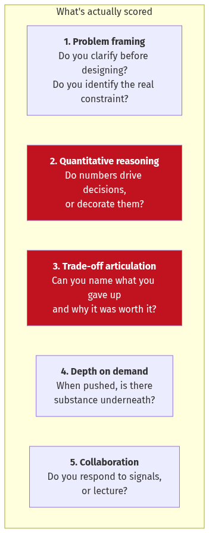
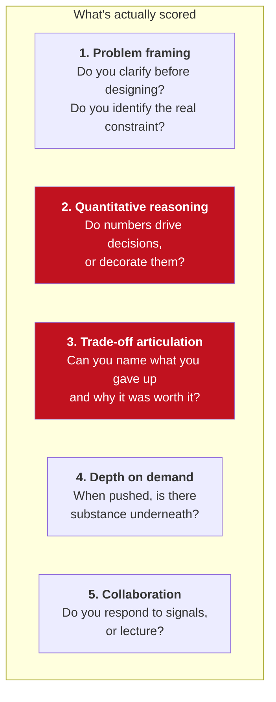
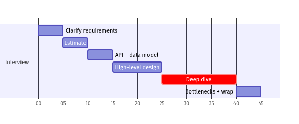
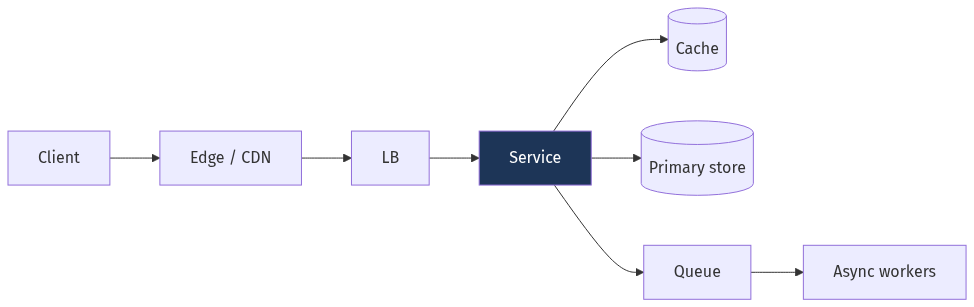
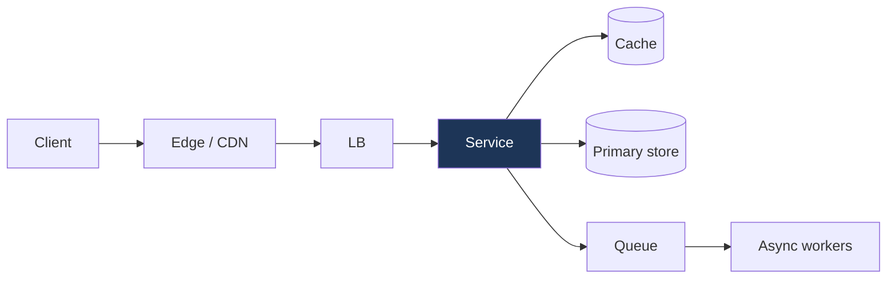

# Chapter 26 — The Interview Playbook and Question Bank

[← Chapter 25](./25_case_studies_part2.md) · [Contents](./README.md)

**Prerequisites:** Everything before it. This chapter is about *delivery* — turning what you know into what an interviewer can see.

---

## What you'll learn

- A minute-by-minute plan for a 45-minute design interview
- What is actually being assessed, which is not what most candidates think
- How to say "I don't know" in a way that scores points
- Calibration: what mid, senior and staff answers sound like for the *same* question
- The ten mistakes that sink otherwise-good candidates
- A question bank of 100+ questions with the key insight for each
- A numbers sheet worth memorising

---

## 26.1 What is actually being assessed

⚠️ **The most common misconception: that the interview tests whether you know the "right"
architecture.** It doesn't. There isn't one, and the interviewer knows it.

Every rubric I've seen — Google, Amazon, Meta, and the ones I've written — measures roughly these
five things:



<details>
<summary>Diagram source (Mermaid)</summary>



</details>

💡 **Two of these — quantitative reasoning and trade-off articulation — separate candidates more
than anything else.** They're also the two most easily practised.

**What is *not* being assessed:**

| Not assessed | Why candidates think it is |
| --- | --- |
| Knowing a specific product | Because blog posts name-drop them |
| Reciting an architecture from memory | Because "the answer" feels like a thing |
| Drawing the most boxes | Because complexity looks like effort |
| Never being wrong | Because wrongness feels fatal |

⚠️ **The last one deserves emphasis.** Being wrong and *correcting yourself when given evidence*
scores **higher** than being right by luck. Interviewers deliberately probe; the response to the
probe is the signal.

---

## 26.2 The 45-minute plan

```mermaid
gantt
    dateFormat mm
    axisFormat %M
    section Interview
    Clarify requirements       :a1, 00, 5m
    Estimate                   :a2, after a1, 5m
    API + data model           :a3, after a2, 5m
    High-level design          :a4, after a3, 10m
    Deep dive                  :crit, a5, after a4, 15m
    Bottlenecks + wrap         :a6, after a5, 5m
```



<details>
<summary>Diagram source (Mermaid)</summary>



</details>

| Minutes | Phase | ⭐ The thing to get right |
| --- | --- | --- |
| 0–5 | **Clarify** | Establish scale, and pick 2–3 features. Not 10. |
| 5–10 | **Estimate** | ⭐ Produce at least one number that *eliminates an architecture* |
| 10–15 | **API + data model** | Keep it brief; it's scaffolding |
| 15–25 | **High-level design** | Boxes and arrows, request path narrated end to end |
| 25–40 | ⭐ **Deep dive** | This is where the grade is decided |
| 40–45 | **Wrap** | Bottlenecks, failure modes, what you'd do next |

⚠️ **The single most common time-management failure: spending 25 minutes on the high-level design
and 5 on the deep dive.** The high-level design is table stakes — every candidate produces
something workable. **The deep dive is where differentiation happens**, and running out of time
before reaching it caps your score regardless of how good the boxes were.

💡 **Watch the clock explicitly and say so:** *"We're about 20 minutes in — I'd like to spend the
bulk of the remaining time on the fan-out problem, since that's the hard part. Does that work, or
would you rather I go elsewhere?"* This reads as senior. It shows time awareness and it invites
the interviewer to steer.

---

## 26.3 Phase 1 — Clarify (0–5 min)

Ask **five to seven** questions. Fewer looks careless; more looks like stalling.

```
SCALE
  "Roughly how many daily active users are we designing for?"
  "What's the read-to-write ratio, roughly?"

SCOPE
  "Should I include [X], or focus on the core [Y] path?"
  "Is this a new build or evolving an existing system?"

CONSTRAINTS
  ⭐ "What latency do users expect on the critical path?"
  ⭐ "Is this a system where we can trade consistency for availability,
      or is correctness non-negotiable?"

NON-GOALS
  "I'll assume auth, billing and abuse prevention are out of scope
   unless you'd like them included."
```

⭐ **The consistency question is the highest-value one you can ask**, because the answer changes
the entire architecture. "Can a user briefly see a stale value?" is the difference between an
eventually-consistent multi-region design and a single-writer one.

💡 **Then state your assumptions out loud and write them down.**
> *"So: 100 million daily actives, read-heavy at roughly 100 to 1, sub-100-millisecond p99 on
> the read path, and brief staleness is acceptable. I'll design for that and flag where it
> would change if any of those are wrong."*

⚠️ **A vague interviewer is a deliberate test.** If they say "you decide", pick something
specific and justify it: *"I'll assume 10 million DAU — large enough that a single database won't
do, small enough that we're not designing for Facebook. That keeps the design honest."*

---

## 26.4 Phase 2 — Estimate (5–10 min)

⭐ **This phase produces the strongest signal per minute of any part of the interview.**

**The four numbers to produce:**
```
1. QPS      — average and peak (peak ≈ 2-3× average; state your multiplier)
2. Storage  — per day, and over the retention period
3. Bandwidth— especially for media
4. Memory   — what fits in cache, and what the hit rate implies
```

📐 **Use the round numbers from [Chapter 2](./02_scalability_and_estimation.md):**
```
1 day ≈ 100,000 seconds        (86,400, rounded — say you're rounding)
1 million/day ≈ 12/s
1 billion/day ≈ 12,000/s
1 KB × 1 million = 1 GB
1 MB × 1 million = 1 TB
```

⭐ **The move that scores: connect a number to a decision, immediately.**

| Weak | Strong |
| --- | --- |
| "That's about 50,000 QPS." | "That's about 50,000 QPS, and since a Postgres primary tops out around 10,000 write TPS, this can't be single-writer — so I need partitioning, and the partition key is now the important decision." |
| "About 100 TB of storage." | "About 100 TB. At 3× replication that's 300 TB, which at roughly $80/TB-month on block storage is $24,000 a month — enough that tiering cold data to object storage is worth designing in from the start." |
| "Read-heavy workload." | "Read:write is about 100:1, so this is a caching problem before it's a database problem. If I can get a 95% hit rate, the database sees 5% of 300,000 — 15,000 reads a second, which a handful of replicas handle." |

💡 **You only need *one* of these to land.** One number that visibly eliminates an option
demonstrates the whole skill.

⚠️ **Don't estimate things that don't matter.** Computing the byte size of a username field wastes
90 seconds. Estimate what will *change a decision*.

---

## 26.5 Phases 3–4 — API, data model, high-level design (10–25 min)

**API — 2 minutes, not 5.** Three to five endpoints with the important parameters. Its purpose is
to pin down the contract, not to be complete.
```
POST /v1/rides           {pickup, dropoff, product}  → 202 {ride_id}
GET  /v1/rides/{id}                                  → 200 {status, eta, driver}
POST /v1/drivers/location {lat, lng, heading}        → 204
```
⭐ **Mention pagination style, idempotency and versioning in one sentence each** — cursor
pagination, an `Idempotency-Key` header on writes, URL versioning. Three sentences that show
API maturity.

**Data model — the schema matters, the DDL doesn't.** Show the tables/collections, the keys, and
⭐ **say why you chose the primary/partition key**, because that's the real content.

**High-level design — narrate the request path end to end.**



<details>
<summary>Diagram source (Mermaid)</summary>



</details>

> *"A write comes in at the edge, hits the API gateway which does auth and rate limiting, goes to
> the ride service, which writes to the sharded store and emits an event to Kafka. Matching
> consumes that event asynchronously — so a slow matching engine can't fail a ride request. Reads
> go cache-first with a 90-plus percent expected hit rate."*

⚠️ **Draw only what you'll use.** A box labelled "Service Mesh" that you never mention again is
noise. Every component should earn its place with one sentence about *why it exists*.

---

## 26.6 Phase 5 — The deep dive (25–40 min)

⭐ **This is the graded portion.** Fifteen minutes on the one genuinely hard thing.

**Choose it explicitly:**
> *"There are three things here that could be hard: the geospatial index, the matching algorithm,
> and consistency of ride state. I think **matching under contention** is the interesting one,
> because two riders can be assigned the same driver. Shall I go there?"*

💡 **Even the act of correctly identifying the hard part is a strong signal.** Many candidates
deep-dive on something routine because it's what they're comfortable with.

**The structure that works, four steps:**

```
1. NAME THE PROBLEM PRECISELY
   "Two dispatch workers can offer the same driver to two riders simultaneously."

2. GIVE THE NAIVE SOLUTION AND WHY IT FAILS
   "A distributed lock per driver. But a lock held by a process that GC-pauses
    can be broken while the holder still thinks it holds it — the fencing
    problem — so it doesn't actually guarantee mutual exclusion."

3. GIVE THE REAL SOLUTION
   "An atomic conditional update: UPDATE drivers SET status='offered'
    WHERE driver_id=? AND status='available'. Zero rows means someone else won,
    and we move to the next candidate. Correctness comes from the database's
    row lock, which is short-lived and doesn't depend on process liveness."

4. STATE THE COST
   "This makes the driver table a contention point. At 230 rides a second
    it's fine; at 10,000 I'd shard by geography, since matching is inherently local."
```

⭐ **Step 4 is the differentiator.** Presenting a solution with its cost named is what makes it
read as engineering rather than recitation.

---

## 26.7 Phase 6 — Wrap up (40–45 min)

Three things, in order:

```
1. THE BOTTLENECK YOU'D HIT NEXT
   "The first thing to break at 10× is the matching write path — I'd shard
    by H3 cell."

2. THE FAILURE MODE YOU'RE LEAST HAPPY ABOUT
   ⭐ "Cache loss. A cold cache sends 300,000 reads a second to a database
    sized for 15,000. I'd want request coalescing and load shedding before
    this goes to production."

3. WHAT YOU'D CUT FOR V1
   "I'd ship with a single region and Redis GEO, and defer H3 and multi-region
    until the traffic justifies them."
```

💡 **Point 2 — volunteering the weakness — is counterintuitive but scores well.** It demonstrates
you can evaluate your own design, which is exactly what the job involves. Candidates who present
their design as flawless read as inexperienced.

---

## 26.8 Saying "I don't know" well

⚠️ **Everyone hits something they don't know. The handling is scored, not the gap.**

| ❌ Bad | ✅ Good |
| --- | --- |
| Silence | "I haven't worked with that directly — let me reason about it from what I do know." |
| Bluffing with vocabulary | "I know Raft is used for this; I don't know its exact leader-election timing. What I *can* say is that it needs a majority, so we need an odd number of nodes." |
| "I don't know." (full stop) | "I don't know. Here's how I'd find out: I'd benchmark X against Y under our actual write pattern, because the answer depends on it." |

⭐ **The pattern: acknowledge the boundary, then demonstrate reasoning up to it.**

> *"I don't know Cassandra's exact repair behaviour under a partition. But I know the general
> shape of the problem: with an AP store, both sides accept writes, so you need a
> conflict-resolution strategy — last-write-wins, vector clocks or CRDTs — and you need
> anti-entropy to converge data that's never read. I'd verify the specifics before committing to
> it in production."*

💡 **That answer is often better than a memorised correct one**, because it shows the reasoning
transfers to systems you *haven't* memorised.

⚠️ **And if the interviewer corrects you: accept it immediately and incorporate it.** Arguing a
losing point is the single fastest way to fail, because it signals exactly the behaviour that
makes someone hard to work with.

---

## 26.9 Seniority calibration

The same question, answered at three levels. **The difference is not vocabulary.**

**Question: "How would you cache this?"**

**Mid-level** — knows the mechanisms:
> "Cache-aside with Redis. On a read, check the cache; on a miss, read the database and populate
> it. Invalidate on write. I'd set a TTL of a few minutes."

✅ Correct. ⚠️ But it's a description of a pattern, not a decision.

**Senior** — reasons about the failure modes:
> "Cache-aside with Redis, with a few specifics. First, **stampede protection** — on a miss I'd
> use a per-key lock or `singleflight` so one request populates and the rest wait, because
> otherwise a hot key expiring sends thousands of identical queries to the database at once.
> Second, **jittered TTLs** — uniform TTLs mean everything cached at the same time expires at the
> same time. Third, on writes I'd **delete rather than update** the cache entry, because
> update-on-write has a race where a slow read repopulates a stale value after the write. And I'd
> size it from the Zipf distribution: caching the top 1% of keys typically gets us to a 90%-plus
> hit rate."

✅ Failure modes, races, and a sizing argument.

**Staff** — reasons about the system and the organisation:
> "Before the mechanism, I'd want to know what the cache is *for*, because that changes the
> answer. If it's protecting the database from load, then the number that matters is what happens
> at **zero hit rate** — if the database can't survive a cold cache, the cache isn't an
> optimisation, it's a load-bearing dependency, and it needs the same availability engineering as
> the database. That usually means request coalescing, load shedding, and a documented recovery
> procedure that's actually been rehearsed. If instead it's for latency, then a smaller,
> shorter-TTL cache is fine and the failure mode is benign. Second, I'd push back on caching at
> all until I'd looked at the query — a lot of caches exist to hide a missing index, and that's a
> worse system for the same latency. Third, if we do cache, I'd want **staleness as an explicit,
> monitored SLO** rather than an accident of TTL choice, because eventually someone will ask
> 'how stale can this be?' during an incident and 'about five minutes, probably' is not an
> answer. And I'd note the organisational cost: a cache adds a system to operate, a new failure
> mode, and a class of bug that's hard to reproduce."

✅ Questions the premise, considers operations and the team, treats staleness as a contract.

📐 **The progression:**
```
Mid    → knows the mechanism
Senior → knows how the mechanism fails
Staff  → knows whether the mechanism should exist, and what it costs the org
```

💡 **You cannot fake the level above yours, but you can avoid performing below yours.** Most
candidates under-perform their actual level by describing rather than deciding.

---

## 26.10 The ten mistakes

| # | Mistake | ⭐ Fix |
| --- | --- | --- |
| 1 | Designing before clarifying | Always ask about scale and consistency first |
| 2 | Estimating after designing | The numbers pick the design, not the reverse |
| 3 | ⚠️ Never reaching the deep dive | Watch the clock; be at high-level design by minute 15 |
| 4 | Name-dropping without reasoning | Say *why* Kafka, not just "Kafka" |
| 5 | Presenting a flawless design | Volunteer the weakest point yourself |
| 6 | Ignoring interviewer signals | If they ask twice about something, that's the deep dive |
| 7 | Over-engineering | 10,000 users doesn't need multi-region active-active |
| 8 | Silence while thinking | Narrate: "I'm weighing X against Y because…" |
| 9 | Arguing when corrected | Accept, incorporate, move on |
| 10 | ⚠️ Skipping failure modes | Every design should end with "here's what breaks" |

💡 **On #6:** interviewers repeat themselves when a candidate misses a hint. If they ask "what
happens if that node fails?" twice, they are *telling you* where the marks are.

⚠️ **On #7:** over-engineering is scored as *negative*, not neutral. Proposing Kubernetes,
service mesh, multi-region and event sourcing for a system with 10,000 users signals that you
can't calibrate — which is a genuine and expensive failure mode in real work.

---

## 26.11 Numbers worth memorising

📐 **Latency:**
```
L1 cache                    0.5 ns
Main memory                   100 ns
SSD random read              16 µs        (~150,000 IOPS)
Network round trip, same DC  500 µs
HDD seek                       10 ms       (~100 IOPS)
Cross-region (US↔EU)       ~ 70-100 ms    ⭐ physics; cannot be optimised away
```

📐 **Throughput (single node, order of magnitude):**
```
Redis                    100,000 ops/s
Postgres reads            50,000/s (cached)
Postgres writes            5,000-10,000 TPS
Kafka broker             100,000+ msg/s
Nginx proxying            50,000 req/s
Elasticsearch queries      1,000-10,000/s
WebSocket connections    500,000/server (tuned)
```

📐 **Cost (rough, 2024-25 public cloud):**
```
Block storage       $80 /TB/month
Object storage      $23 /TB/month
Glacier             $ 1 /TB/month
⭐ Egress          $50-90 /TB       ← usually the surprise line item
Cross-AZ transfer   $20 /TB each way
```

📐 **Conversions:**
```
1 day ≈ 100,000 s
1M/day ≈ 12/s · 1B/day ≈ 12,000/s
1 KB × 1M = 1 GB · 1 MB × 1M = 1 TB
2^10 ≈ 1K · 2^20 ≈ 1M · 2^30 ≈ 1B · 2^32 ≈ 4B · 2^64 ≈ 1.8×10^19
```

📐 **Availability:**
```
99%     = 3.65 days/year   99.9%   = 8.77 hours/year
99.95%  = 4.38 hours/year  99.99%  = 52.6 minutes/year
99.999% = 5.26 minutes/year  ⚠️ less than most deploy windows
```

---

## 26.12 The question bank

Each entry gives the question and ⭐ **the insight that distinguishes a strong answer**. Use it as
a self-test: cover the right column and see whether you'd produce it.

### Fundamentals

| Question | ⭐ Key insight |
| --- | --- |
| Vertical vs horizontal scaling? | Vertical is simpler and often correct; horizontal is forced by failure tolerance, not just size |
| What is a p99 and why not use the mean? | Averages hide the tail; ⚠️ and 100 backend calls at p99=1% means most requests are slow |
| Why does adding servers sometimes slow things down? | USL — coherency cost is quadratic and eventually dominates |
| Latency vs throughput? | Little's Law connects them: `L = λW` |
| What's the cost of a cross-region round trip? | ~70–100 ms, set by the speed of light in fibre — a design constraint, not a tuning target |

### Networking and traffic

| Question | ⭐ Key insight |
| --- | --- |
| L4 vs L7 load balancing? | L7 can route on content and retry safely; L4 is faster and protocol-agnostic |
| Why is a health check that only pings a port dangerous? | It reports a process, not a service — deep checks catch the failure that matters |
| ⚠️ Why can a health check cause a total outage? | Dependency checking: a shared dependency blip fails every instance at once. Check *self*, not dependencies |
| What is head-of-line blocking, at which layers? | HTTP/1.1 at the app layer; HTTP/2 at TCP; QUIC fixes it with independent streams |
| Least-connections vs round-robin? | Least-connections adapts to heterogeneous request cost; ⚠️ but routes traffic *toward* a failing fast-erroring node |
| What does a CDN actually do beyond caching? | TLS termination at the edge, connection reuse to origin, DDoS absorption — often bigger wins than the cache |

### Data stores

| Question | ⭐ Key insight |
| --- | --- |
| B-tree vs LSM tree? | Read-optimised vs write-optimised; LSM trades read and space amplification for write throughput |
| What is write amplification? | One logical write causing many physical writes — the dominant cost in LSM and SSD wear |
| Why is `SELECT COUNT(*)` slow in Postgres? | MVCC — visibility is per-transaction, so it must scan |
| What breaks when a transaction is long-running? | It holds back the vacuum horizon, so dead tuples accumulate globally |
| ⭐ When is a UUID a bad primary key? | As a *clustered* key: random inserts fragment the B-tree, ~47% bloat. UUIDv7 or Snowflake fixes it |
| Why does `OFFSET 100000` get slower? | It fetches and discards; use keyset/cursor pagination |
| What's the N+1 query problem? | One query per row of a result set — usually invisible in dev, fatal in production |
| Connection pooling — why does it matter so much? | Postgres forks a process per connection; ⚠️ 10,000 connections is 10,000 processes |
| Read replicas — what do they *not* solve? | Write capacity, and they introduce replication lag → read-your-writes violations |

### Distributed systems

| Question | ⭐ Key insight |
| --- | --- |
| CAP theorem — the precise statement? | Under a *network partition*, choose consistency or availability. ⚠️ It says nothing about normal operation |
| Why is PACELC more useful? | It covers the else-case: even without partitions, latency vs consistency |
| Two Generals — what does it prove? | Common knowledge is unattainable over a lossy channel — hence no exactly-once delivery |
| FLP — what does it prove? | No deterministic consensus with one faulty process in a fully async model. ⭐ Practical systems escape via timeouts/randomisation |
| Raft vs Paxos? | Same guarantees; Raft optimises for understandability with a strong leader |
| ⚠️ Why is a distributed lock unsafe? | A GC pause can expire the lease while the holder still believes it holds it. Need **fencing tokens** |
| Vector clocks vs Lamport clocks? | Lamport gives a total order but can't detect concurrency; vector clocks detect it at O(N) size |
| What's a sloppy quorum and what does it cost? | Writes to any available node; ⚠️ voids the `W+R>N` overlap guarantee |
| Read repair vs anti-entropy? | Read repair only fixes data that's read; anti-entropy is required for convergence |

### Consistency

| Question | ⭐ Key insight |
| --- | --- |
| Linearizability vs serializability? | Recency of single objects vs equivalence to a serial order of transactions. Different axes |
| ⭐ Read-your-writes — how do you get it with replicas? | Route reads to the primary for a window after write, or track a version token per client |
| What is write skew? | Two transactions each read a valid state and each write, jointly violating an invariant — snapshot isolation permits it |
| Why is "eventually consistent" insufficient as a spec? | It gives no bound. ⚠️ Ask: eventually *how long*, and what can I observe meanwhile? |
| Causal consistency — what does it buy? | Preserves happens-before, so replies never precede messages. ⭐ Achievable without coordination |

### Caching

| Question | ⭐ Key insight |
| --- | --- |
| Cache-aside vs write-through vs write-behind? | Aside is default; write-behind is only for loss-tolerant data |
| What is a cache stampede and the two fixes? | Simultaneous misses on a hot key. Fix: single-flight locking + probabilistic early expiry |
| Why delete rather than update the cache on write? | Update has a race with a concurrent slow read repopulating a stale value |
| ⚠️ Your cache dies. What happens? | Compute the cold-cache load. If the DB can't take it, the cache is load-bearing and needs the same rigour |
| Negative caching — why? | Absent keys otherwise hit the DB every time; a small TTL on "not found" prevents an easy DoS |

### Queues and streams

| Question | ⭐ Key insight |
| --- | --- |
| Kafka vs RabbitMQ? | Log vs broker: replayable ordered partitions vs flexible routing and per-message ack |
| Why is exactly-once delivery impossible? | Two Generals. ⭐ You get at-least-once + idempotency, or exactly-once *state* within one system |
| What does a consumer group rebalance cost? | A stop-the-world pause; ⚠️ frequent rebalances from long processing look like an outage |
| At-least-once + idempotency — how, concretely? | Deterministic key + unique constraint + insert-before-act |
| What belongs in a DLQ, and what doesn't? | Terminal failures. ⚠️ Transient failures should retry; a DLQ nobody reads is a data-loss mechanism |
| Ordering guarantees in Kafka? | Per-partition only. Ordering across a topic requires one partition — i.e. no parallelism |

### Reliability

| Question | ⭐ Key insight |
| --- | --- |
| Circuit breaker — why not just retry? | Retries *amplify* load on a struggling dependency; the breaker stops the amplification |
| Why must retries have jitter? | Without it, retries synchronise into waves that recreate the overload |
| ⚠️ What's a retry storm at depth? | Retries multiply per layer: 3 retries at 3 layers is 27× load |
| Bulkheads — what do they isolate? | Resource pools, so one slow dependency can't exhaust all threads |
| Load shedding vs autoscaling? | Shedding acts in milliseconds; autoscaling takes minutes. ⭐ You need both |
| Graceful degradation — example? | Serve the feed without personalisation rather than erroring |

### Operations

| Question | ⭐ Key insight |
| --- | --- |
| SLI, SLO, SLA — the difference? | Measurement, internal target, external contract with penalties |
| ⭐ What is an error budget for? | Converting reliability from an argument into arithmetic: budget spent → stop shipping features |
| Why alert on symptoms, not causes? | Cause-alerts are noisy and incomplete; symptom-alerts catch failures you didn't predict |
| Blue-green vs canary? | Instant switch with double cost vs gradual exposure with mixed versions |
| ⚠️ What makes a rollback fail? | An unrollbackable migration. Expand-migrate-contract exists for this |
| Metrics vs logs vs traces? | Aggregate, discrete events, causal chains. ⭐ Traces answer "which service was slow"; metrics answer "how often" |
| What is cardinality and why does it kill TSDBs? | Each label combination is a series; a `user_id` label multiplies series by millions |

### Security

| Question | ⭐ Key insight |
| --- | --- |
| Authn vs authz? | Who you are vs what you may do — different failures, different mitigations |
| ⚠️ Why is JWT revocation hard? | Stateless validation means no lookup; use short TTLs + refresh tokens, or accept a revocation list |
| Why hash passwords with Argon2/bcrypt, not SHA-256? | ⭐ Speed is the vulnerability. Deliberately slow, memory-hard, per-user salt |
| How do parameterised queries actually prevent injection? | Query and data travel on separate channels — the data is never parsed as SQL |
| What is SSRF and why is it dangerous in cloud? | Server-side fetch of attacker URLs reaching internal endpoints — e.g. the metadata service |
| Encryption at rest — what threat does it address? | Physical media theft and improper disposal. ⚠️ Not a compromised application |

### Architecture

| Question | ⭐ Key insight |
| --- | --- |
| When should you *not* use microservices? | ⭐ Almost always at the start. A modular monolith gives the boundaries without the distribution tax |
| What is a distributed monolith? | Services deployed separately but coupled — all the cost, none of the benefit |
| Saga vs 2PC? | Compensations without blocking vs atomicity with blocking. ⭐ Sagas expose intermediate states; design for them |
| ⚠️ What's the hardest part of event sourcing? | Schema evolution of events you can never rewrite, plus replay time |
| Idempotency key — the full state machine? | New / in-progress (409) / completed (return stored response) / different body (422) |
| Strangler fig — why incrementally? | Big-bang rewrites fail because behaviour is undocumented; the facade lets you migrate route by route |

---

## 26.13 Practice regimen

```
WEEK 1-2  Estimation drills. 10 minutes daily.
          Pick a system; produce QPS, storage, bandwidth. ⭐ Then name one
          decision each number forces. That last step is the whole exercise.

WEEK 3-4  Deep dives. Take one mechanism per day from Ch 23 and explain it
          aloud in 5 minutes: what it does, why the naive version fails,
          what it costs.

WEEK 5-6  Full mocks. 45 minutes, timed, out loud, ideally recorded.
          ⚠️ Reading a design is not practice. The failure mode is verbal.

ONGOING   For every system you use at work, ask: what's the read:write ratio,
          where's the bottleneck, and what happens when the cache dies?
```

⭐ **Record yourself once.** Almost everyone discovers they narrate far less than they think, and
that silence is where the interviewer loses the thread.

---

## Interview angle

**Q: How would you approach a system design problem you've never seen before?**

*Strong:* "The same way as one I have, because the method doesn't depend on the domain. I'd
spend the first five minutes clarifying — scale, the read-write ratio, the latency target, and
critically **whether correctness or availability wins under partition**, since that single answer
changes the whole architecture. Then I'd estimate, and the goal there isn't the numbers
themselves, it's to produce **at least one number that eliminates an option** — something like
'this is fifty thousand writes a second, and a single Postgres primary does ten thousand, so this
cannot be single-writer, which makes the partition key the important decision'. Then a quick API
and data model, then boxes and arrows with the request path narrated end to end. And then I'd
deliberately name what I think the hard part is and ask whether the interviewer agrees, because
I'd want to spend the bulk of the time there rather than polishing the high-level diagram.
Unfamiliarity mostly shows up in the deep dive, and there I'd reason from principles rather than
recall — if I don't know how a specific database handles something, I know what constraints it's
subject to, and I'd say which parts I'd want to verify before committing to them."

**Q: You're 30 minutes in and realise your data model is wrong. What do you do?**

*Strong:* "Say so, immediately, and fix it. Something like: 'I've been sharding by user ID, but
the highest-volume query only has the item ID, which means every read becomes a scatter-gather.
That's wrong — I should shard by item ID.' Two reasons that's the right move. First, the cost of
continuing is worse: everything I build on a broken foundation compounds, and the interviewer has
almost certainly already noticed. Second, **catching your own mistake is a positive signal, not a
negative one** — it demonstrates that I'm evaluating my design rather than defending it, which is
exactly what the job consists of. What I'd avoid is quietly patching around it with a secondary
index and hoping nobody asks, because that produces a worse design *and* signals that I'd do the
same thing on a real project."

**Q: The interviewer keeps asking about something you consider a minor detail. What's happening?**

*Strong:* "They're telling me where the marks are, and I should follow. If someone asks twice
about what happens when a node fails mid-write, that's not idle curiosity — either it's on their
rubric, or they've spotted a hole I haven't. Either way the correct response is to go deep on it
rather than steering back to what I'd planned. I'd say something like 'you've come back to this
twice, so let me work through it properly', and treat it as the deep dive. The mistake would be
to give a short answer and redirect, because that reads as either missing the signal or avoiding
the question — and both are worse than whatever I'd lose by abandoning my planned structure. The
interview is collaborative; their attention is the best available information about what's being
assessed."

---

## Recap

- **The rubric measures framing, quantitative reasoning, trade-offs, depth and collaboration.**
  Not knowledge of a specific architecture.
- **Time discipline:** be at the high-level design by minute 15, in the deep dive by 25. ⚠️ Not
  reaching the deep dive caps your score.
- **Estimate before designing, and connect each number to a decision.** One number that eliminates
  an architecture demonstrates the whole skill.
- **Present designs with their costs named.** A solution without a stated trade-off reads as
  recitation.
- **Volunteer your design's weakest point.** Self-evaluation is a senior signal.
- **"I don't know" + reasoning to the boundary** beats bluffing, and often beats a memorised
  answer.
- **Follow the interviewer's signals.** Repeated questions mark the rubric.
- ⚠️ **Over-engineering is scored negatively.** Calibration is part of the assessment.
- **Practise out loud and timed.** Reading designs does not transfer.

---

## Test yourself

1. You're 20 minutes into a 45-minute interview and still drawing boxes. What do you do?
2. The interviewer says "assume whatever scale you like." How do you respond?
3. You're asked about a database you've never used. Give the shape of a good answer.
4. What single sentence best demonstrates quantitative reasoning?
5. Why is proposing multi-region active-active for a 5,000-user internal tool a negative signal?
6. The interviewer says "are you sure that's how quorums work?" What do you do?
7. What's the difference between a mid-level and a staff-level answer to the same question?
8. Name three things to cover in the final five minutes.

<details>
<summary>Answers</summary>

1. **Say it out loud and cut scope.** Something like: *"I'm conscious of time — I've got the
   high-level shape, so rather than keep adding components I'd like to go deep on the fan-out
   problem, which I think is the hard part here."* Then go.
   The failure mode is finishing a beautiful diagram at minute 38 and having seven minutes for
   the part that's actually graded. ⚠️ **A complete high-level design with no deep dive scores
   worse than a rough one with fifteen minutes of substance.** Every candidate produces a
   workable box diagram; not every candidate can explain why the naive solution to the hard part
   fails.

2. **Pick something specific, justify the choice, and move.** *"I'll assume 10 million daily
   actives. That's large enough that a single database won't work, so the interesting problems
   are real, but small enough that I'm not designing for Facebook — and it keeps the design
   honest about what's actually needed."*
   ⚠️ The wrong answers are (a) asking again, which reads as needing to be led, and (b) designing
   for an unstated scale, which means every subsequent decision is unanchored. The interviewer is
   often testing **whether you can commit to an assumption**, because that's what you do on real
   projects when the product manager doesn't know either.

3. **Acknowledge the boundary, then reason from constraints.** *"I haven't run FoundationDB in
   production, so I'd want to verify specifics. But I can reason about what it must be subject
   to: it advertises strict serializability across shards, which means it needs distributed
   consensus per transaction, so I'd expect commit latency of at least one or two round trips
   and worse behaviour for cross-shard transactions than single-key ones. If our workload is
   mostly single-key, that cost is avoidable and I'd want to know whether it charges for it
   anyway. I'd benchmark against our actual write distribution before committing."*
   ⭐ That answer is often **better than a memorised correct one**, because it shows the reasoning
   generalises to systems you haven't memorised — which is the actual job.

4. Any sentence with the form **"[number], therefore [architecture X] is out, so [Y]."**
   For example: *"Read-to-write is about 100 to 1, so this is a caching problem before it's a
   database problem — a 95% hit rate takes the database from 300,000 reads a second to 15,000,
   which a few replicas handle comfortably."*
   💡 The key is that the number **does work**. "That's about 50,000 QPS" on its own is arithmetic;
   "that's 50,000 QPS, and since a Postgres primary tops out around 10,000 write TPS this can't
   be single-writer" is engineering. ⚠️ Estimates that don't change a decision are wasted minutes,
   which is why sizing a username column is a trap.

5. Because **it demonstrates you can't calibrate**, and mis-calibration is expensive in real work.
   For 5,000 internal users, active-active multi-region adds: data-conflict resolution you don't
   need, roughly double the infrastructure cost, cross-region replication lag, a far harder
   testing and debugging story, and an operational burden that a small team will not sustain.
   You'd be trading a large amount of complexity for availability the business hasn't asked for
   and won't notice.
   ⚠️ Interviewers explicitly look for this because **over-engineering is a common and costly
   failure mode in real teams** — someone builds for a scale that never arrives, and the team
   pays maintenance costs forever. The strong answer for that system is a single region with good
   backups and a documented recovery procedure, plus a sentence about what would change the
   answer: *"If this became customer-facing with a contractual uptime commitment, I'd revisit."*

6. **Assume they're right and re-derive it out loud.** *"Let me re-check. `W + R > N` guarantees
   the write set and read set overlap by at least one node… with N=3, W=2, R=2, that's 4 > 3, so
   yes. But I said sloppy quorums preserve that — actually they don't, because writes can go to
   nodes outside the home replica set, so the overlap guarantee is void until hinted handoff
   completes. That's the correction."*
   Two things score here: **you re-derived rather than restated**, showing the knowledge is
   structural rather than memorised, and **you accepted the correction immediately**. ⚠️ Arguing
   is the fastest way to fail a design interview — not because being wrong is fatal, but because
   defending a losing position signals exactly the behaviour that makes someone difficult to work
   with. And note that interviewers sometimes challenge a *correct* answer to see whether you'll
   fold under pressure; re-deriving handles both cases, because if you're right the derivation
   shows it.

7. **Not vocabulary — scope of consideration.**
   ```
   Mid    → describes the mechanism correctly
   Senior → describes how the mechanism FAILS, and the races and edge cases
   Staff  → questions whether the mechanism should exist, and accounts for
            operational and organisational cost
   ```
   On caching: mid says "cache-aside with Redis, TTL of five minutes." Senior adds stampede
   protection, jittered TTLs, delete-don't-update, and sizes it from the access distribution.
   Staff asks what the cache is *for* — if it's protecting the database, then a cold cache is a
   total outage and the cache is a load-bearing dependency requiring the same rigour as the
   database; and separately, whether a missing index would solve the same problem with one fewer
   system to operate.
   💡 You can't fake the level above yours, but most candidates **perform below** theirs by
   describing rather than deciding. The fix is to state a trade-off with every mechanism.

8. **(a) The next bottleneck** — *"The first thing to break at 10× is the matching write path;
   I'd shard by geography."*
   **(b) The failure mode you're least comfortable with** — *"Cache loss worries me most: a cold
   cache sends 300,000 reads a second to a database sized for 15,000. I'd want request coalescing
   and load shedding before production."*
   **(c) What you'd cut for v1** — *"I'd ship single-region with Redis GEO and defer H3 and
   multi-region until traffic justifies them."*
   ⭐ (b) is the counterintuitive one and the most valuable. Volunteering your design's weakest
   point demonstrates that you can **evaluate** a design rather than only produce one, which is
   the difference between someone who builds what they're told and someone you'd trust with an
   ambiguous problem. Candidates who present their design as flawless read as inexperienced,
   because every real system has a weakest point and the engineer who can't name it hasn't
   looked.

</details>

---

## Where to go from here

You've reached the end of the book. What matters now is **transfer** — turning reading into
judgement.

```
1. BUILD SOMETHING THAT BREAKS.
   ⭐ Run a load test until something falls over, then find out why.
   The gap between knowing about connection-pool exhaustion and having
   watched it happen is enormous.

2. READ YOUR OWN SYSTEM'S NUMBERS.
   What's the p99? The read:write ratio? The cache hit rate? Most engineers
   don't know, and knowing changes how you think.

3. READ THE PAPERS (Ch 22).
   Dynamo, Spanner, Kafka, Raft, MapReduce. They're more readable than
   their reputation, and they contain the reasoning that blog posts omit.

4. WRITE DESIGN DOCUMENTS.
   ⭐ The discipline of writing down alternatives-considered is the single
   best practice for developing design judgement — because it forces you
   to articulate why you rejected things.

5. RUN INCIDENT REVIEWS.
   Nothing teaches distributed systems like a blameless postmortem on a
   failure you caused.
```

💡 **A closing thought.** The recurring theme of this book is that **there are no free wins** —
every mechanism buys something and costs something, and the engineering is in knowing which
trade you're making and why it's the right one *here*. Caching buys latency and costs staleness.
Replication buys availability and costs consistency. Microservices buy independence and cost a
distributed system. Denormalisation buys read speed and costs write complexity.

⭐ **Someone who can name both sides of that trade — and pick deliberately — is doing system
design. Someone who can only name one side is following a pattern.** That distinction is what
this book was for.

---

[← Chapter 25](./25_case_studies_part2.md) · [Contents](./README.md)
