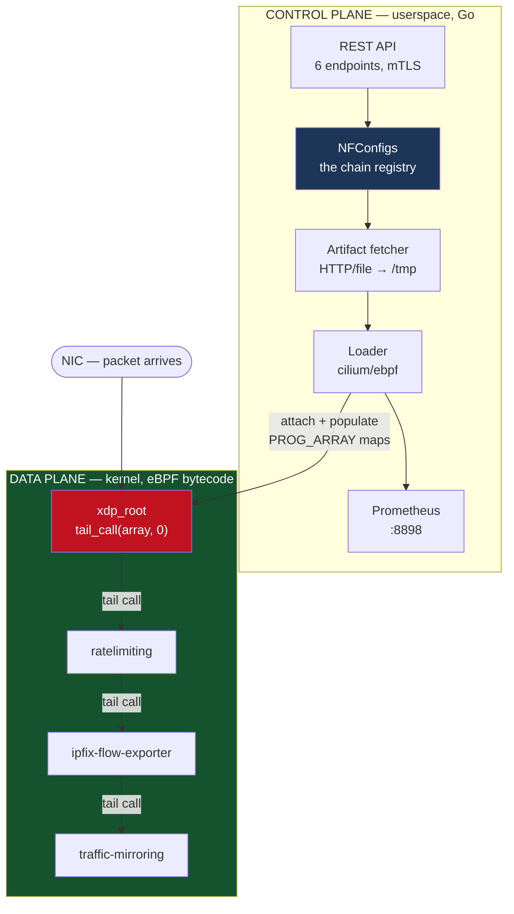
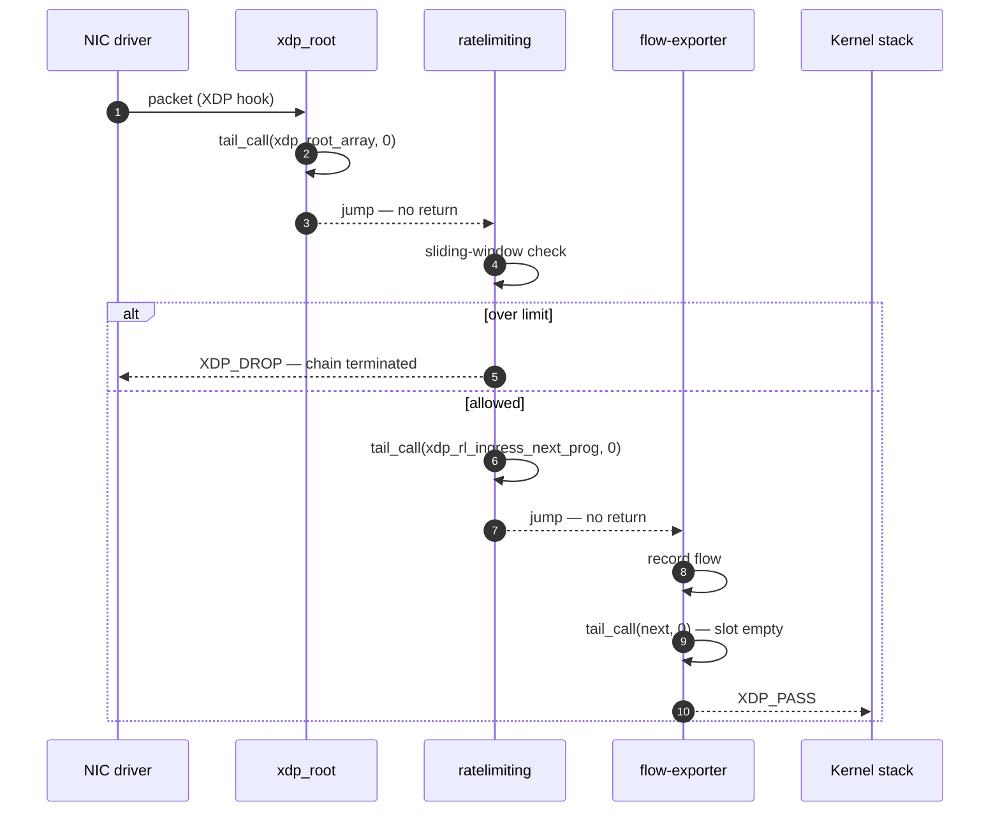
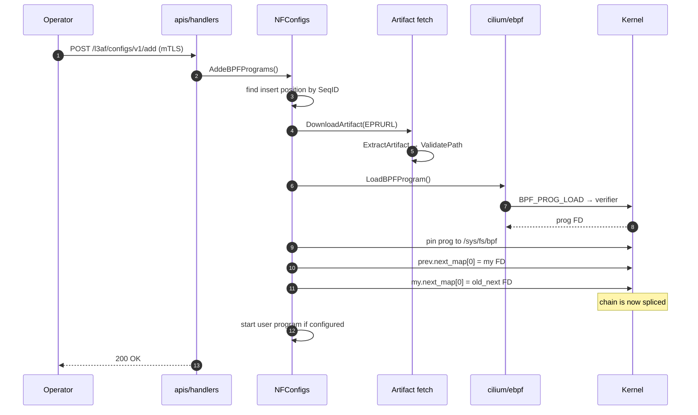

# Appendix B — Case Study: Reading a Real System (L3AF)

[← Chapter 26](./26_interview_playbook_and_question_bank.md) · [Contents](./README.md) · [Glossary](./99_glossary_and_cheatsheets.md)

**Prerequisites:** [Chapter 1](./01_from_zero_computers_networks_web.md) §1.12–1.14, [Chapter 17](./17_containers_docker_kubernetes.md), [Chapter 19](./19_observability_and_operations.md), [Chapter 25](./25_case_studies_part2.md) design 15.

---

## What you'll learn

Every other chapter designs systems from a blank page. This one does the opposite: it reads
an existing system and applies the book's method to it. That is what the job actually looks
like.

The subject is **[L3AF](https://github.com/l3af-project)** — a control plane for chaining
eBPF programs, originally from LinkedIn, now under LF Networking.

- How a control plane / data plane split works when the data plane is **inside the kernel**
- How eBPF **tail-call chaining** works, mechanism by mechanism, and where its ceilings are
- A file-by-file map of ~12,000 lines of Go and ~3,000 lines of C
- Nine concrete kernel-side improvements and eleven application-side ones
- ⚠️ One finding severe enough to fix before any production use

---

## B.0 Is this a good example? An honest answer

You asked whether L3AF is the right repository to learn from. Partly.

**What it is genuinely excellent for:**

| Strength | Why it matters |
| --- | --- |
| ⭐ **Spans kernel and userspace** | Very few readable projects do. You see a C program compiled to bytecode, verified, loaded, attached, and then *managed* by Go code — end to end |
| **Small enough to read completely** | 12,083 lines of Go, ~3,000 of C. You can hold all of it in your head in a weekend |
| **One clear idea, executed** | Program chaining. Not a grab-bag |
| **Real production lineage** | LinkedIn origin, LF Networking governance, Apache-2.0 |
| **Control plane vs data plane** | The single most transferable pattern in infrastructure |

**What it is not good for:**

⚠️ **L3AF is a node agent, not a distributed system.** It exercises maybe six of this book's
twenty-six chapters. There is no sharding, no consensus, no replication, no caching tier,
no multi-region topology, no stream processing. The "control plane" is per-node — there is
no fleet-level component in the open-source organisation at all.

📐 **Coverage against this book:**
```
Strongly exercised:  Ch 1 (kernel, memory, scheduling), Ch 17 (containers,
                     capabilities), Ch 19 (metrics), Ch 20 (graceful restart)
Partly exercised:    Ch 15 (REST API), Ch 18 (mTLS), Ch 10 (partial-failure rollback)
Not exercised:       Ch 6-9, 11-14, 21-22 — storage, replication, consensus,
                     caching, streaming, search
```

💡 **So the honest recommendation: use L3AF for the kernel/userspace boundary and the
control-plane pattern, and pair it with a second repository for distributed systems.**

**Better or complementary repositories, by what you want to learn:**

| Goal | Repository | Size | Why |
| --- | --- | --- | --- |
| **Same domain, real distributed control plane** | `cilium/cilium` | ~1M LOC ⚠️ | The grown-up version of exactly this problem. Read `pkg/datapath/loader` and `bpf/` only |
| **Consensus, MVCC, leases, watches** | `etcd-io/etcd` | ~140k LOC | ⭐ The best single repo for [Ch 21](./21_distributed_systems_theory_consensus.md). `raft/` is separable and readable |
| **Reconciliation loops done properly** | `kubernetes-sigs/controller-runtime` | ~50k LOC | ⭐ Level-triggered reconciliation in its purest form — the pattern L3AF most needs |
| **Config distribution at fleet scale** | `envoyproxy/go-control-plane` | ~30k LOC | The xDS pattern from [Ch 25](./25_case_studies_part2.md) design 15 |
| **Storage engine internals** | `etcd-io/bbolt` | ~7k LOC ⭐ | A complete B+tree with MVCC in one readable package. Perfect for [Ch 6](./06_storage_engines_internals.md) |
| **TSDB and cardinality** | `prometheus/prometheus` | `tsdb/` ~40k | [Ch 19](./19_observability_and_operations.md) and [Ch 13](./13_big_data_batch_stream_analytics.md) made concrete |
| **Pipelines and backpressure** | `vectordotdev/vector` | Rust | [Ch 12](./12_messaging_and_event_streaming.md) §12.9 in production form |
| **eBPF, minimal** | `cilium/ebpf` (the library) | ~40k LOC | L3AF depends on it. Reading the library explains what L3AF is doing |

⭐ **If you read exactly two: L3AF for the kernel boundary, and `bbolt` or `etcd/raft` for
the distributed-systems half.** They overlap in nothing and together cover most of this
book.

---

## B.1 Analysis boundary

**Inspected** (cloned at analysis time, `main` branch):

| Repository | Language | Size | Role |
| --- | --- | --- | --- |
| `l3afd` | Go 98.9% | **12,083 LOC**, 51 files | ⭐ The node daemon. Everything happens here |
| `eBPF-Package-Repository` | C | ~2.6 MB | The kernel-side programs and root programs |
| `l3af-arch` | Shell 98.5% | ~13 MB | Dev environment (Vagrant), docs, images |
| `governance` | Markdown | small | Process documents. Not analysed |
| `l3af-repo-stats` | — | small | CI statistics. Not analysed |

**Not inspected:** the Windows eBPF path beyond noting its existence; the Vagrant
provisioning scripts in detail; test files except to gauge coverage.

**Claims in this document are marked:** *verified* (read in source), *inferred* (strongly
implied by structure or naming), *external* (kernel behaviour, from documentation).

---

## B.2 Start from zero — what problem does L3AF solve?

Imagine a network interface as a doorway, and you want to inspect everything passing
through it. You can attach one program to that doorway. **One.** The kernel's XDP hook
takes a single program per interface.

Now three teams each want their own program there: security wants a rate limiter, the
network team wants a flow exporter, observability wants traffic mirroring.

```
❌ The naive answers:

"Write one big program"     → three teams editing one C file, deployed together.
                               Every change risks every function.

"Take turns"                → whoever attaches last wins, silently.
                               The others simply stop running.
```

✅ **L3AF's answer: make the single attached program a dispatcher, and chain the rest
behind it.** Teams ship independent programs; L3AF orders them and wires them together at
runtime, without recompiling anything.

That is the entire product. Everything in the codebase serves it.

---

## B.3 The mental model



⭐ **The load-bearing property: the data plane keeps running if the control plane dies.**
The eBPF programs are attached to the interface and pinned in `/sys/fs/bpf`. Kill `l3afd`
and packets keep being processed exactly as before. You lose the ability to *change* the
chain, not the chain itself.

That is **static stability** from [Chapter 20](./20_deployment_multiregion_dr_cost.md) §20.4,
and it is the same property that makes Envoy survive a control-plane outage. L3AF gets it
almost for free because the kernel holds the state.

---

## B.4 The kernel side

### B.4.1 The root program — twenty lines that define the architecture

*Verified —* `eBPF-Package-Repository/xdp-root/xdp_root.bpf.c`, complete:

```c
#define ROOT_ARRAY_SIZE 1

struct {
    __uint(type, BPF_MAP_TYPE_PROG_ARRAY);
    __uint(key_size, sizeof(int));
    __uint(value_size, sizeof(int));
    __uint(max_entries, ROOT_ARRAY_SIZE);
    __uint(pinning, LIBBPF_PIN_BY_NAME);
} xdp_root_array SEC(".maps");

SEC("xdp-root")
int xdp_root(struct xdp_md *ctx) {
  bpf_tail_call(ctx, &xdp_root_array, 0);
  return XDP_PASS;
}
```

Four things to notice, and each has consequences:

**(1) `BPF_MAP_TYPE_PROG_ARRAY`.** A map whose values are *program file descriptors*. This
is the only mechanism the kernel offers for one eBPF program to invoke another at runtime.

**(2) `bpf_tail_call` does not return on success.** *External — kernel semantics.* It
replaces the current program's stack frame and jumps. The `return XDP_PASS` on the next
line executes **only if the tail call fails** — which happens when slot 0 is empty.

⭐ **So "no programs configured" and "the chain finished" are the same code path.** That's
elegant: an empty chain passes traffic.

**(3) `max_entries` is 1.** The root does not hold an array of chained programs. It holds
exactly one — the first. The rest of the chain is a **linked list built out of maps**, one
map per program.

**(4) `LIBBPF_PIN_BY_NAME`.** The map is pinned into `/sys/fs/bpf`, so it outlives the
process that created it. This is what makes the data plane survive a daemon restart.

The TC root is identical in structure — *verified*, `tc-root/tc_root_ingress.bpf.c` uses
`tc_ingress_root_array` and returns `TC_ACT_OK`.

### B.4.2 How a chained program continues the chain

*Verified —* the tail of `ratelimiting/ratelimiting.bpf.c`:

```c
SEC("xdp_ratelimiting")
int _xdp_ratelimiting(struct xdp_md *ctx)
{
   int rc = _xdp_ratelimit(ctx);

   if (rc == XDP_DROP) {
      return XDP_DROP;          // terminate the chain: verdict is final
   }

   bpf_tail_call(ctx, &xdp_rl_ingress_next_prog, 0);
   return XDP_PASS;             // reached only if nothing is chained after us
}
```

⚠️ **This is the single most important thing to understand about L3AF, and it is not
enforced anywhere: the chain contract is a convention implemented by hand in every
program.**

```
The contract each program must honour:
  • decide your verdict
  • if the verdict is terminal (DROP), return it — the chain stops
  • otherwise, tail_call into YOUR OWN "next prog" map at key 0
  • if that returns, you are last — return PASS

⚠️ A program that forgets the tail_call compiles, verifies, loads, attaches,
   and silently truncates the chain. Every program after it stops running.
   Traffic still flows. No error is raised anywhere.
```

💡 That failure mode — *silently correct-looking* — is exactly the class the book keeps
flagging. It is the eBPF equivalent of a health check that only pings a port.

### B.4.3 The chain, drawn properly



⚠️ **Note what the diagram cannot show: there is no return path.** Program 2 cannot hand a
result back to program 1. Each hop is one-way. Any data shared between chained programs must
go through a map, or through `bpf_xdp_adjust_meta` — and L3AF uses neither for inter-program
communication.

### B.4.4 📐 The ceilings

**Ceiling 1 — chain depth is 33.** *External — `MAX_TAIL_CALL_CNT`, Linux ≥ 5.10.*

```
The kernel counts tail calls per packet and refuses the 34th.
Root program + 32 chained programs = the hard maximum.

⚠️ On exceeding it, bpf_tail_call simply FAILS — which means the calling
   program's `return XDP_PASS` runs. The chain silently truncates again.
```

*Verified:* I found no validation of chain length in `l3afd`. `Deploy()`
(`bpfprogs/nfconfig.go:693`) and `AddProgramsOnInterface()` (`:1167`) insert by `SeqID`
without a bound check. **This is a real gap** — see §B.7.

**Ceiling 2 — per-hop cost.** *Inferred, order of magnitude.* Each hop is a map lookup plus
an indirect jump, and the indirect jump defeats branch prediction and is affected by
Spectre mitigations (`retpoline`).

```
📐 Rough budget at 10 Gbps, 64-byte packets ≈ 14.8 Mpps:
     Time budget per packet: 1/14.8M ≈ 67 ns
     A tail call: on the order of 10-30 ns (highly kernel/CPU dependent)

⚠️ A chain of 5 programs may spend a meaningful fraction of the per-packet
   budget on dispatch alone, before any program does useful work.
```

💡 **This is the same trade as microservices** ([Ch 16](./16_microservices_and_service_architecture.md)):
you buy independent deployability with per-hop overhead. State it that way in an interview
and it lands.

**Ceiling 3 — same program type only.** *External.* A tail call can only target a program
of the same type. XDP chains to XDP, TC to TC. This is why L3AF keeps separate root programs
and separate lists per `(interface, direction)`.

---

## B.5 The application side — `l3afd`

### B.5.1 Where the code is

*Verified —* line counts:

| Package | LOC | % | Owns |
| --- | --- | --- | --- |
| ⭐ `bpfprogs/` | **7,609** | **63%** | Everything: chain state, loading, attaching, metrics, process supervision |
| `apis/` | 1,769 | 15% | REST handlers, TLS/mTLS setup |
| `config/` | 474 | 4% | INI-style config loading |
| `restart/` | 449 | 4% | Graceful daemon upgrade |
| `stats/` | 245 | 2% | Prometheus metric definitions |
| `models/` | 194 | 2% | Wire types |
| `pidfile/`, `utils/`, `routes/`, `signals/` | 290 | 2% | Support |
| *(root: `main.go`, `version.go`, …)* | ~1,050 | 9% | Startup |

Inside `bpfprogs/`, two files dominate:

```
bpfprogs/nfconfig.go   1,853 LOC   — the CHAIN MANAGER (39 methods)
bpfprogs/bpf.go        1,798 LOC   — ONE PROGRAM's lifecycle (43 methods)
bpfprogs/bpf_unix.go     603 LOC   — Linux attach: XDP, TCX, netlink
bpfprogs/nfconfig_test.go 1,110    — tests
bpfprogs/bpf_test.go        976    — tests
```

⚠️ **Two 1,800-line files with 40+ methods each is the main structural problem in this
codebase.** Not a bug — a maintainability tax. See §B.8.

💡 **Positive signal, though:** 2,086 lines of test against those two files is a genuinely
healthy ratio for infrastructure code.

### B.5.2 The core data structure

*Verified —* `bpfprogs/nfconfig.go`. `NFConfigs` holds, per interface and direction, a
**`container/list.List`** — a doubly-linked list — of `*BPF` objects.

```
NFConfigs
├── IngressXDPBpfs  map[iface] → *list.List   ordered chain
├── IngressTCBpfs   map[iface] → *list.List
├── EgressTCBpfs    map[iface] → *list.List
└── ProbesBpfs      list.List                 kprobe/tracepoint/uprobe
```

⭐ **The linked list mirrors the kernel's map-linked chain exactly.** `list.Element.Next()`
in Go corresponds to "the program whose FD is in my `next_prog` map". Insert into the middle
of the Go list, then update two maps, and the kernel chain matches.

*Verified —* `LinkBPFPrograms` (`nfconfig.go:653`) is the join operation, and the map surgery
lives in three methods on `BPF`:

| Method | `bpf.go` | Does |
| --- | --- | --- |
| `PutNextProgFDFromID(progID)` | :873 | Write program `progID`'s FD into **my** next-prog map at key 0 |
| `RemoveNextProgFD()` | :929 | Delete key 0 — I become the chain tail |
| `LoadBPFProgramChain(iface, dir)` | :1559 | Load, pin, then write **my** FD into the **previous** program's map |

*Verified — the actual splice*, `bpf.go:1585`:

```go
key := 0
fd := bpfProg.FD()
if err = ebpfMap.Update(unsafe.Pointer(&key), unsafe.Pointer(&fd), 0); err != nil {
    return fmt.Errorf("unable to update prog next map %s %v", b.Program.MapName, err)
}
```

⭐ **That one map update is the whole chaining mechanism.** Everything else in 12,000 lines
is orchestration around it.

### B.5.3 End-to-end: adding a program to the middle of a chain



⚠️ **Steps 10 and 11 are two separate map updates and they are not atomic together.**
Between them, packets in flight see a chain where the new program is reachable but its
successor is not yet wired — so the chain terminates early at the new program. Each
individual `bpf_map_update_elem` is atomic; the *sequence* is not.

*Inferred:* the window is microseconds, so at 14.8 Mpps this affects on the order of tens of
packets. Usually harmless. For a security program in the chain, "usually harmless" is not
the standard. §B.7 proposes a fix.

💡 **The project is aware of this class of problem.** A commit from two months before
analysis reads *"fix: rollback list insertion when BPF program fails to attach (#756)"* —
which is exactly the compensating-transaction pattern from
[Chapter 10](./10_distributed_transactions_and_integrity.md) §10.2, arrived at the hard way.

### B.5.4 The API

*Verified —* `apis/routes.go`, complete. Six routes:

```
POST /l3af/configs/{version}/update      replace the whole desired state
GET  /l3af/configs/{version}/{iface}     read one interface
GET  /l3af/configs/{version}            read all
POST /l3af/configs/{version}/add         add programs
POST /l3af/configs/{version}/delete      remove programs
PUT  /l3af/configs/{version}/restart     graceful self-upgrade
```

Assessment against [Chapter 15](./15_apis_and_protocols.md):

| Aspect | Status |
| --- | --- |
| Versioned | ✅ In-path `{version}` |
| Authenticated | ✅ mTLS on by default, with SAN match rules — *verified*, `config.go:157` |
| ⚠️ Idempotency keys | ❌ Absent. A retried `add` after a timeout has undefined effect |
| ⚠️ Verbs in paths | `/update`, `/add`, `/delete` are RPC-shaped, not resource-shaped |
| Pagination | N/A — bounded collections |

💡 **The verb-shaped paths are defensible here.** These are *operations on a chain*, not CRUD
on a resource, and `PUT /l3af/configs/v1/restart` is honest about being an action. The book's
REST purism ([Ch 15](./15_apis_and_protocols.md) §15.1) is about predictability, and this is
predictable.

### B.5.5 What is genuinely well done

Give credit where it's earned — three things here are better than most infrastructure code:

**(1) ⭐ Modern attach APIs.** *Verified —* `bpf_unix.go:544,581` use `link.AttachTCX` and
`link.AttachXDP` from `cilium/ebpf v0.22.0`, not raw netlink. `bpf_link` means the attachment
is refcounted by the kernel and auto-detached when the link closes — no orphaned programs
after a crash.

**(2) ⭐ Graceful restart with state handoff.** *Verified —* `restart/` (449 LOC), plus
`models.CloseForRestart`, `models.IsReadOnly`, `models.CurrentWriteReq`, `models.StateLock`
in `main.go`. The daemon enters read-only mode, drains in-flight writes, serialises state
over a Unix socket, and hands off. That is a real graceful-shutdown implementation, and it is
the [Chapter 20](./20_deployment_multiregion_dr_cost.md) §20.3 pattern done properly.

**(3) Zip-slip protection.** *Verified —* `ValidatePath` (`bpf.go:1789`) is called on every
entry in both the zip and tar.gz paths before any file is written. That is the correct
defence against `../../etc/passwd` in an archive, and it is frequently missing in code that
extracts downloaded archives.

---

## B.6 ⚠️ The finding that matters most

*Verified by exhaustive search —* there is **no signature or checksum verification of
downloaded artifacts** anywhere in `l3afd`:

```
$ grep -rni "sha256|signature|checksum|cosign|sigstore|gpg" --include=*.go .
(no matches outside tests)
```

*Verified —* `DownloadArtifact` (`bpf.go:1646`) accepts `http`, `https` and `file` schemes,
fetches the bytes, and hands them straight to `ExtractArtifact`. The extracted `.o` file is
then loaded into the kernel.

📐 **Threat model:**
```
An attacker who can:
  • compromise the artifact repository, OR
  • MITM an http:// (non-TLS) EPRURL, OR
  • influence the ebpf_package_repo_url field in an API request

...gets ARBITRARY CODE EXECUTION IN THE KERNEL on every node that
deploys that program.

Mitigating factors: mTLS on the API restricts who can request a deployment,
and the eBPF verifier constrains what the program can do.

⚠️ But the verifier is a safety check, not a security boundary. It permits
   reading every packet, dropping traffic, and writing to maps. A verified
   program can still exfiltrate or silently drop.
```

⭐ **This is the highest-severity finding in this analysis, and the fix is well understood:**

```
1. Add `artifact_sha256` to models.BPFProgram and verify after download,
   before extraction. ~20 lines. Closes the MITM and tampering cases today.

2. Sigstore/cosign signature verification against a configured trust root,
   with a config flag to require it. Closes the repository-compromise case.

3. Reject the `http://` scheme unless explicitly allowed for development.

4. Ship an SBOM per artifact and record what was loaded, for incident response.
```

💡 This is a good illustration of [Chapter 18](./18_security_and_identity.md)'s point that
**transport security and artifact integrity are different problems.** L3AF does mTLS
carefully and then loads unsigned code.

---

## B.7 Improving the kernel side

Nine changes, ordered by value.

### K1 ⭐ Make chain reconfiguration atomic — double-buffer the root array

**Problem:** §B.5.3 — multi-map splices have a visible intermediate state.

**Fix:** `ROOT_ARRAY_SIZE` is currently 1. Make it 2, build the new chain into the unused
slot, then flip a single index.

```c
#define ROOT_ARRAY_SIZE 2

struct { /* ... */ __uint(max_entries, ROOT_ARRAY_SIZE); } xdp_root_array SEC(".maps");

struct {
    __uint(type, BPF_MAP_TYPE_ARRAY);
    __type(key, int); __type(value, int);
    __uint(max_entries, 1);
    __uint(pinning, LIBBPF_PIN_BY_NAME);
} xdp_root_active SEC(".maps");

SEC("xdp-root")
int xdp_root(struct xdp_md *ctx) {
    int k = 0;
    int *active = bpf_map_lookup_elem(&xdp_root_active, &k);
    if (!active) return XDP_PASS;
    bpf_tail_call(ctx, &xdp_root_array, *active & 1);
    return XDP_PASS;
}
```

⭐ **Now the switch is one atomic map update.** Every packet sees either the entire old chain
or the entire new one. This is blue-green deployment
([Ch 20](./20_deployment_multiregion_dr_cost.md) §20.1) applied inside the kernel, and it
costs one extra map lookup per packet — a few nanoseconds.

⚠️ Cost: the old chain's programs must be kept alive until in-flight packets drain. An RCU
grace period or a short timer before unloading covers it.

### K2 ⭐ Enable `BPF_ENABLE_STATS` and export per-program cost

*Verified —* no use of BPF statistics anywhere.

**Problem:** with a five-program chain you cannot answer "which program is eating the packet
budget?" You have aggregate CPU and nothing else.

**Fix:** the kernel already tracks `run_time_ns` and `run_cnt` per program when statistics are
enabled (kernel ≥ 5.1, `BPF_ENABLE_STATS`).

```go
// once at startup
closer, err := ebpf.EnableStats(unix.BPF_STATS_RUN_TIME)

// per scrape, per program
info, _ := prog.Info()
runTime, _ := info.Runtime()
runCount, _ := info.RunCount()
```

Export as `l3af_bpf_prog_run_time_ns_total` and `l3af_bpf_prog_run_count_total`, labelled by
program and interface.

📐 **Why this is the highest-value observability change:**
```
run_time_ns / run_cnt = mean nanoseconds per packet, per program.

Suddenly you can say: "ratelimiting costs 40 ns/packet, flow-export costs 180 ns,
mirroring costs 25 ns" — and the 180 ns one is the reason you cannot hit line rate.

Without it, that question is unanswerable.
```

⚠️ Enabling statistics costs roughly 1–2% throughput. Make it a config flag, default on for
non-production.

### K3 Enforce the 33-program ceiling in the control plane

**Problem:** §B.4.4 — exceeding `MAX_TAIL_CALL_CNT` truncates the chain silently.

**Fix:** validate at `Deploy()` and `AddProgramsOnInterface()`:

```go
const maxChainLength = 32 // + root = 33, the kernel's MAX_TAIL_CALL_CNT

if bpfList.Len() >= maxChainLength {
    return fmt.Errorf("chain on %s/%s would exceed the kernel tail-call limit of %d",
        ifaceName, direction, maxChainLength)
}
```

Plus a Prometheus gauge `l3af_chain_length` and an alert at 80% of the limit — the
saturation-alerting pattern from [Ch 19](./19_observability_and_operations.md) §19.6.

### K4 Make the chain contract enforceable rather than conventional

**Problem:** §B.4.2 — a program that omits its `bpf_tail_call` silently truncates the chain.

**Fix, in three layers:**

```c
/* l3af_chain.h — shipped with the SDK */
#define L3AF_CHAIN_MAP(name)                          \
    struct { __uint(type, BPF_MAP_TYPE_PROG_ARRAY);   \
             __type(key, int); __type(value, int);    \
             __uint(max_entries, 1);                  \
             __uint(pinning, LIBBPF_PIN_BY_NAME);     \
    } name SEC(".maps")

#define L3AF_CONTINUE(ctx, map, pass_verdict)  \
    do { bpf_tail_call((ctx), &(map), 0); return (pass_verdict); } while (0)
```

1. **Macro** so the pattern is one token and hard to get wrong.
2. **CI check** — after building, disassemble the object and assert every non-terminal exit
   path reaches a `bpf_tail_call`. `llvm-objdump -d` plus a small script.
3. ⭐ **Runtime detection** — with K2's statistics, compare `run_cnt` between adjacent
   programs in a chain. If program *N* ran 10 million times and *N+1* ran zero, the chain is
   broken. Alert on it. **This catches the failure that has no other symptom.**

### K5 Replace per-CPU-hostile shared maps

*Verified —* `ratelimiting.bpf.c` increments shared counters (`cw_count`, `pw_count`,
`drop_count`) from every CPU.

⚠️ **This is [Chapter 1](./01_from_zero_computers_networks_web.md) §1.12's false-sharing
problem, at 14 million packets per second.** Every CPU writing the same cache line bounces it
between cores at 50–100 ns per bounce.

```
📐 On a 16-core box at 10 Gbps with all cores receiving:
   Shared counter: every increment may miss and bounce.
   Per-CPU array:  every increment is a local, uncontended write.

Expected improvement on the counter path: substantial — this is
precisely the workload per-CPU maps exist for.
```

**Fix:** `BPF_MAP_TYPE_PERCPU_ARRAY` / `BPF_MAP_TYPE_PERCPU_HASH`, and sum across CPUs in
userspace at scrape time.

⚠️ **Caveat that must be stated:** the rate limiter's *decision* depends on a global count.
Per-CPU counters make the limit approximate — you would enforce roughly `rate/num_cpus` per
CPU. That is exactly the trade from [Chapter 25](./25_case_studies_part2.md) design 3:
**approximate coordination beats exact coordination for a defensive control.** Make it a
documented mode, not a silent change.

### K6 Pass metadata between chained programs via `xdp_md`

**Problem:** a chained program cannot tell the next one what it decided. Sharing requires a
map lookup — a hash lookup keyed by flow, per packet, per hop.

**Fix:** `bpf_xdp_adjust_meta()` reserves up to 32 bytes ahead of the packet that travel with
it through the chain at zero lookup cost.

```c
struct l3af_meta { __u32 flags; __u32 flow_hash; __u16 classified_as; };

/* producer */
bpf_xdp_adjust_meta(ctx, -(int)sizeof(struct l3af_meta));
struct l3af_meta *m = (void *)(long)ctx->data_meta;
if ((void *)(m + 1) > (void *)(long)ctx->data) return XDP_PASS;
m->flow_hash = hash;
```

⭐ This turns inter-program communication from a map lookup into a pointer dereference. For a
five-program chain doing flow classification once and reusing it, that is four saved hash
lookups per packet.

### K7 Evaluate native TCX multi-attach for the TC path

*External —* since kernel 6.6, **TCX supports multiple programs on one hook with explicit
`BPF_F_BEFORE` / `BPF_F_AFTER` ordering**, managed by the kernel.

*Verified —* L3AF already uses `link.AttachTCX` (`bpf_unix.go:544`), so the plumbing exists.

```
For the TC path on kernel ≥ 6.6, the kernel can do the chaining natively:
  ✅ no tail-call overhead, no 33 limit, no PROG_ARRAY bookkeeping
  ✅ ordering is kernel-enforced, so K4's whole problem disappears
  ⚠️ requires 6.6+, so L3AF must keep the tail-call path as fallback
  ⚠️ programs would no longer need the tail_call idiom — an artifact
     compatibility break
```

💡 **The strategic version of this suggestion: L3AF's tail-call chaining is a userspace
workaround for a kernel limitation that the kernel is now fixing.** Long term, the value
moves from *how to chain* to *what to chain and how to manage it fleet-wide*. Plan for that.

### K8 Full CO-RE so one artifact runs everywhere

*Verified —* `xdp_root.bpf.c` includes `vmlinux.h`, so BTF-based CO-RE is partly adopted.
But the repository also carries pre-CO-RE files (`xdp_root_kern.c`, `ratelimiting_kern.c`)
alongside the `.bpf.c` versions.

**Fix:** complete the migration, compile once with `-g -target bpf`, and ship a single
portable object per program. That removes per-kernel build matrices from the artifact
pipeline and makes the "package marketplace" in the README actually feasible — a marketplace
where every package needs rebuilding per kernel is not a marketplace.

### K9 Add a synthetic chain-integrity probe

Load a trivial "canary" program at the end of every chain that increments a per-CPU counter.
If the chain is intact, the canary's count tracks the root's. If it doesn't, the chain is
broken somewhere.

⭐ This is a **synthetic monitor** ([Ch 19](./19_observability_and_operations.md) §19.9) and
it converts the entire class of silent-truncation bugs into a single alertable signal.

---

## B.8 Improving the application side

### A1 ⭐ Artifact signature verification

§B.6. Highest severity. Do this first.

### A2 ⭐ Adopt a level-triggered reconciliation loop

**Problem:** *inferred from structure —* `l3afd` is **edge-triggered**. An API call causes an
action. Nothing periodically compares desired state against actual kernel state.

```
⚠️ Consequences:
  • An operator running `bpftool prog detach` out of band is never noticed.
  • A program killed by the OOM killer stays dead until someone calls the API.
  • A failed splice can leave Go's linked list and the kernel's map chain
    disagreeing — precisely the bug that issue #756 patched by hand.
```

**Fix:** a reconcile loop, every 30 seconds:

```go
func (c *NFConfigs) Reconcile(ctx context.Context) error {
    actual, err := c.readKernelState()   // walk pinned progs + PROG_ARRAY maps
    if err != nil { return err }

    desired := c.desiredState()
    for _, d := range diff(desired, actual) {
        if err := c.apply(d); err != nil {
            metrics.ReconcileErrors.Inc()
        }
    }
    metrics.LastReconcile.SetToCurrentTime()
    return nil
}
```

⭐ **This is the single biggest architectural improvement available, and the book says why:
level-triggered reconciliation makes lost events self-correcting**
([Ch 17](./17_containers_docker_kubernetes.md) §17.4,
[Ch 25](./25_case_studies_part2.md) design 15). You stop needing every operation to succeed;
you only need convergence.

It also subsumes several other fixes: drift detection, crash recovery, and the
list/kernel divergence that #756 addressed.

### A3 Split `bpfprogs/`

7,609 LOC in one package, with two 1,800-line files carrying 40+ methods each. Suggested
decomposition along the seams already visible in the method names:

```
bpfprogs/chain/      NFConfigs, list management, splice/unsplice     (~900)
bpfprogs/artifact/   download, extract, validate, verify signature   (~400)
bpfprogs/lifecycle/  BPF load/attach/pin/unload state machine        (~800)
bpfprogs/attach/     unix.go, windows.go — the platform backends     (~700)
bpfprogs/userprog/   process supervision (processCheck.go)           (~150)
bpfprogs/metrics/    map polling and Prometheus                      (~250)
```

💡 The `_unix.go` / `_windows.go` build-tag split is already the right idea; `attach/` just
makes the boundary explicit and testable with a fake.

### A4 Add idempotency keys to write endpoints

§B.5.4. A client that times out on `POST /add` cannot know whether it succeeded. Retrying may
double-insert.

Implement the state machine from [Ch 10](./10_distributed_transactions_and_integrity.md)
§10.4 — and the working reference implementation is in this book's
[`code/idempotency_keys/`](./code/idempotency_keys/idempotency.go), including the in-progress
state most implementations omit.

### A5 ⚠️ Drop `--privileged`

*Verified —* the README instructs:

```bash
docker run -d -v /sys/fs/bpf:/sys/fs/bpf ... --privileged --net=host l3afd:<version>
```

⚠️ `--privileged` grants every capability, disables seccomp and AppArmor, and exposes all
devices. For a daemon that also **spawns arbitrary user programs** (`CmdStart` in
`models.BPFProgram`), that is a very large blast radius.

**Fix** — on kernel ≥ 5.8 the required capabilities are specific:

```bash
docker run -d \
  --cap-add=CAP_BPF --cap-add=CAP_NET_ADMIN --cap-add=CAP_PERFMON \
  --cap-add=CAP_SYS_RESOURCE \
  --security-opt seccomp=l3afd-seccomp.json \
  -v /sys/fs/bpf:/sys/fs/bpf --net=host l3afd:<version>
```

Document the minimum set, verify it in CI, and keep `--privileged` only as a documented
fallback for older kernels. This is [Ch 17](./17_containers_docker_kubernetes.md) §17.8.

### A6 Sandbox or reconsider user programs

*Verified —* `BPFProgram` carries `CmdStart`, `CmdStop`, `CmdStatus`, `CmdConfig`,
`CmdUpdate` plus argument maps, and `processCheck.go` (148 LOC) supervises the spawned
processes. `CPU` and `Memory` limit fields exist.

⚠️ **So deploying an "eBPF program" can also execute an arbitrary userspace binary as a child
of a privileged daemon.** Combined with A1 (unsigned artifacts), that is a direct path from
"repository compromise" to "root on every node".

```
Options, in order of preference:
1. Run user programs in a separate, unprivileged process with seccomp
   and a cgroup enforcing the existing CPU/Memory fields.
2. Require a separate signature and an explicit allowlist for artifacts
   that carry user programs.
3. Offer a mode that disables user programs entirely, for deployments
   that only need kernel-side logic.
```

### A7 Structured error taxonomy for partial failures

*Verified —* errors are `fmt.Errorf` strings throughout. A chain splice touches several
kernel objects, and callers cannot distinguish "verifier rejected the program" (permanent,
do not retry) from "map update failed under memory pressure" (transient, retry).

```go
type ErrKind int
const (
    ErrVerifier ErrKind = iota // permanent — artifact is wrong
    ErrResource                // transient — retry with backoff
    ErrChainState              // needs reconcile, not retry
    ErrArtifact                // permanent — download/signature
)
```

Then classify at the boundary, and let A2's reconcile loop retry only the transient ones.
This is the retryable/permanent distinction from
[Ch 16](./16_microservices_and_service_architecture.md) §16.7 — and the reference
implementation is in [`code/retry_backoff_jitter/`](./code/retry_backoff_jitter/retry.go).

### A8 Kernel-in-the-loop CI

*Verified —* the tests are unit tests with mocks (`mocks/mocked_interfaces.go`, uber-go/mock).
Good, but they cannot catch a chain-ordering regression.

```
Add a CI job that, in a VM or privileged container:
  1. loads a root program plus three canary programs, each bumping a counter
  2. injects packets with a generator (or bpf_prog_test_run)
  3. asserts all three counters incremented, in order
  4. splices a fourth into the middle; asserts ordering again
  5. removes the middle; asserts the chain reconnected

⭐ Step 5 is the one that would have caught #756.
```

`l3af-arch/dev_environment` already provides Vagrant machines — the ingredients exist.

### A9 Export the metrics that answer operational questions

*Verified —* current metrics are `BPFStartCount`, `BPFStopCount`, `BPFUpdateCount`,
`BPFUpdateFailedCount`, `BPFRunning`, `BPFStartTime`, `BPFMonitorMap`, `BPFDeployFailedCount`.

Solid lifecycle coverage. Missing the ones you need during an incident:

```
l3af_chain_length{iface,direction}              → K3, distance from the 33 ceiling
l3af_bpf_prog_run_time_ns_total{prog}           → K2, per-program cost
l3af_bpf_prog_run_count_total{prog}             → K2 + K4, chain integrity
l3af_reconcile_last_success_timestamp_seconds   → A2, DATA AGE not job success
l3af_reconcile_drift_total{type}                → A2, how often reality diverges
l3af_artifact_verify_failures_total{reason}     → A1
```

⭐ **Note `reconcile_last_success_timestamp`, not `reconcile_failures`.** Alerting on **data
age** rather than job failure is the [Ch 19](./19_observability_and_operations.md) §19.7
principle — it catches the reconcile loop being *wedged*, which a failure counter does not.

### A10 Bound the artifact download

*Verified —* `DownloadArtifact` (`bpf.go:1646`) does `buf.ReadFrom(resp.Body)` into an
in-memory `bytes.Buffer` with a timeout but **no size limit**.

⚠️ A hostile or misconfigured repository returning a multi-gigabyte body will OOM a daemon
that is running privileged on a production node.

```go
const maxArtifactBytes = 256 << 20
if _, err := buf.ReadFrom(io.LimitReader(resp.Body, maxArtifactBytes+1)); err != nil { ... }
if buf.Len() > maxArtifactBytes {
    return fmt.Errorf("artifact exceeds %d bytes", maxArtifactBytes)
}
```

Apply the same bound to the *decompressed* size in `ExtractArtifact` — a 1 MB gzip can expand
to 10 GB. That is a zip bomb, and `ValidatePath` does not defend against it.

### A11 Persist chain state transactionally

*Verified —* `SaveConfigsToConfigStore()` (`nfconfig.go:815`) writes the configuration to a
file. *Inferred:* a crash mid-write could leave a truncated store.

**Fix:** write to a temp file in the same directory, `fsync`, then `rename` — rename is atomic
within a filesystem. This is the same durability argument as
[Chapter 6](./06_storage_engines_internals.md) §6.7's write-ahead log, in miniature.

---

## B.9 What's missing entirely

Beyond improving what exists, three things are absent:

**(1) ⭐ A fleet-level control plane.** *Verified —* the organisation has five repositories and
none of them is a multi-node controller. `l3afd` is a per-node agent with a REST API; something
must call that API for every node.

```
📐 The gap, at scale:
   10,000 nodes × a REST call each per config change
   = 10,000 outbound connections from wherever the orchestration lives
   ⚠️ with no ordering guarantees, no drift detection, no staged rollout,
      and no fleet-wide view of what is actually running

This is precisely Chapter 25 design 15. The answer is known:
  • long-lived gRPC streams (push, ~10 ms) instead of N REST calls
  • etcd or similar for linearizable desired state with revision history
  • label-based targeting with an inverted index
  • agents reporting applied revision back → reconciliation
  • revision fencing so a delayed push cannot revert newer config
  • staged rollout 1% → 10% → 100% with health gates
```

💡 **This is the highest-leverage thing the project could build**, and the design is already
written down — in [Chapter 25](./25_case_studies_part2.md) design 15 and in Envoy's xDS
protocol.

**(2) The package marketplace.** The `l3afd` README says *"we envision the creation of a
community-driven eBPF package marketplace."* It does not exist. K8 (full CO-RE) and A1
(signing) are its prerequisites — a marketplace of unsigned, per-kernel-compiled artifacts is
not viable.

**(3) A written chain-semantics specification.** The contract in §B.4.2 exists only as a
pattern in example code. It needs to state: what a program may assume on entry, what it must
guarantee on exit, which verdicts are terminal, how metadata is passed, and what happens when
a program is inserted or removed mid-flight.

---

## B.10 Priority order

If you were handed this codebase on Monday:

| # | Change | § | Effort | Why first |
| --- | --- | --- | --- | --- |
| 1 | ⚠️ Artifact SHA-256 + signature | A1/B.6 | S | Kernel-level RCE. Nothing else matters until this is closed |
| 2 | Bound download and decompressed size | A10 | S | Trivial fix, OOM on a privileged node |
| 3 | ⭐ `BPF_ENABLE_STATS` + per-program metrics | K2 | S | Unlocks every performance conversation |
| 4 | Enforce the 33-program ceiling | K3 | S | Silent truncation, ~10 lines |
| 5 | ⭐ Reconciliation loop | A2 | L | Biggest architectural win; subsumes several bug classes |
| 6 | Chain-integrity detection | K4/K9 | M | Catches the failure with no other symptom |
| 7 | Drop `--privileged` | A5 | M | Blast radius |
| 8 | ⭐ Double-buffered atomic chain switch | K1 | M | Correctness during reconfiguration |
| 9 | Kernel-in-the-loop CI | A8 | M | Prevents regressions in 5, 6, 8 |
| 10 | Split `bpfprogs/` | A3 | L | Maintainability; do it *while* doing 5 |
| 11 | Per-CPU maps in packages | K5 | M | Throughput on the hot path |
| 12 | Fleet control plane | B.9 | XL | The strategic bet |

💡 **Note the shape: the top four are all small.** That is typical of a codebase that is
fundamentally sound but under-instrumented. The expensive items (5, 12) are architectural
rather than remedial.

---

## B.11 What to run to see it yourself

```bash
git clone --depth 50 https://github.com/l3af-project/l3afd.git
cd l3afd && go build ./... && go test ./...

# The chaining mechanism, in order:
sed -n '1559,1600p' bpfprogs/bpf.go     # LoadBPFProgramChain — the splice
sed -n '873,900p'   bpfprogs/bpf.go     # PutNextProgFDFromID — the map write
sed -n '653,665p'   bpfprogs/nfconfig.go # LinkBPFPrograms — the join

# The kernel side is 20 lines:
cat ../eBPF-Package-Repository/xdp-root/xdp_root.bpf.c

# The end of a chained program — the convention that is not enforced:
tail -15 ../eBPF-Package-Repository/ratelimiting/ratelimiting.bpf.c
```

`l3af-arch/dev_environment` has a Vagrant setup that brings up a working node.

⚠️ **Inspecting live chains needs root:**
```bash
bpftool prog list                          # loaded programs and IDs
bpftool map list | grep prog_array         # the chain maps
bpftool map dump name xdp_root_array       # what the root points at
bpftool net show                           # what is attached where
```

---

## B.12 How this maps back to the book

| L3AF mechanism | Book chapter | Concept |
| --- | --- | --- |
| Data plane survives daemon death | [Ch 20](./20_deployment_multiregion_dr_cost.md) §20.4 | Static stability |
| Pinned maps in `/sys/fs/bpf` | [Ch 6](./06_storage_engines_internals.md) | Durability outside process lifetime |
| Proposed reconcile loop | [Ch 17](./17_containers_docker_kubernetes.md) §17.4 | Level- vs edge-triggered |
| Rollback on failed attach (#756) | [Ch 10](./10_distributed_transactions_and_integrity.md) §10.2 | Compensating transactions |
| Shared counters across CPUs | [Ch 1](./01_from_zero_computers_networks_web.md) §1.12 | ⭐ False sharing |
| Per-CPU maps make limits approximate | [Ch 25](./25_case_studies_part2.md) design 3 | ⭐ Approximate coordination |
| Tail-call cost per hop | [Ch 16](./16_microservices_and_service_architecture.md) | Modularity costs dispatch |
| Missing fleet controller | [Ch 25](./25_case_studies_part2.md) design 15 | Config distribution |
| Unsigned artifacts | [Ch 18](./18_security_and_identity.md) | Supply chain ≠ transport security |
| Graceful restart with handoff | [Ch 20](./20_deployment_multiregion_dr_cost.md) §20.3 | Draining |
| Alert on reconcile *age* | [Ch 19](./19_observability_and_operations.md) §19.7 | Data age, not job success |
| mTLS with SAN rules | [Ch 18](./18_security_and_identity.md) | Mutual authentication |

---

## Interview angle

**Q: Walk me through a system you've read but not written.**

*Strong:* "I read L3AF, a control plane for chaining eBPF programs. The interesting
constraint is that the Linux XDP hook takes **one program per interface**, so if three teams
each want a program there, they either merge into one codebase or they silently overwrite
each other. L3AF's answer is to make the single attached program a **dispatcher** — a
twenty-line root program that does nothing but `bpf_tail_call` into slot zero of a program
array — and then each chained program tail-calls into its own successor. The whole chaining
mechanism reduces to one map update: write the next program's file descriptor into the
previous program's map at key zero. Twelve thousand lines of Go are orchestration around that
single line. The property I'd highlight is that **the data plane survives the control plane** —
the programs are attached and pinned in the BPF filesystem, so killing the daemon doesn't
drop a packet. You lose the ability to change the chain, not the chain. That's static
stability, and it's the same reason Envoy keeps routing when its control plane is down."

**Q: You reviewed that codebase. What would you fix first?**

*Strong:* "**Artifact signing**, and it isn't close. The daemon downloads a compiled eBPF
object over HTTP or HTTPS and loads it into the kernel, and I grepped the whole repository —
there is no checksum, no signature, no digest pinning anywhere. So anyone who can compromise
the artifact repository, or MITM a plain-HTTP URL, gets code execution in the kernel on every
node. People sometimes argue the eBPF verifier mitigates it, but the verifier is a **safety**
check, not a **security boundary** — a verified program can still read every packet and drop
traffic. The fix is small: a SHA-256 field on the program spec verified before extraction
closes tampering today, and cosign signature verification against a trust root closes
repository compromise. What makes it notable is the contrast — the project does mTLS on its
API carefully, with SAN match rules, and then loads unsigned code. Transport security and
artifact integrity are different problems and it's easy to think you've solved the second by
solving the first."

**Q: How would you make chain reconfiguration safe?**

*Strong:* "Right now inserting a program into the middle of a chain is **two map updates** —
wire the predecessor to the new program, then wire the new program to the old successor.
Each update is individually atomic but the pair isn't, so packets in flight between them see
a chain that terminates early at the new program. It's a microsecond window, so tens of
packets at line rate, and for a flow exporter that's fine — but if the truncated tail
contains a security program, 'usually harmless' is the wrong standard. The fix is
**double-buffering**: the root array currently has one entry, so make it two, build the new
chain into the inactive slot, and flip a single index that the root reads. Now the switch is
one atomic map update and every packet sees either the entire old chain or the entire new
one. It costs one extra map lookup per packet — a few nanoseconds — and you need to keep the
old programs alive for an RCU grace period so in-flight packets drain. It's blue-green
deployment, applied inside the kernel."

**Q: The chain silently stops working. How do you detect it?**

*Strong:* "This is the nastiest failure in the system, because the symptom is **nothing**.
The chain contract is a convention — each program must tail-call its successor — and a
program that omits it compiles, passes the verifier, loads, attaches, and truncates the
chain. Traffic still flows, no error is raised, and everything after that program silently
stops running. Three layers of defence. First, make it hard to get wrong: ship a
`L3AF_CONTINUE` macro in an SDK header so the pattern is one token, and add a CI check that
disassembles the object and asserts every non-terminal exit path reaches a `bpf_tail_call`.
Second, **enable `BPF_ENABLE_STATS`** — the kernel already tracks `run_cnt` per program — and
compare counts between adjacent programs in a chain. If program N ran ten million times and
N+1 ran zero, the chain is broken, and that's alertable. Third, a **canary program** pinned
at the end of every chain incrementing a counter; if the root's count and the canary's
diverge, something in between is swallowing packets. The second one is the highest value
because it costs about one percent throughput and turns an invisible failure into a metric."

---

## Recap

- ⭐ **L3AF is an excellent read for the kernel/userspace boundary and the control-plane
  pattern, and a poor one for distributed systems.** Pair it with `etcd/raft` or `bbolt`.
- The **entire chaining mechanism** is `bpf_tail_call` into a `PROG_ARRAY` at key 0, plus one
  map update per splice. 12,000 lines of Go orchestrate one line of effect.
- ⭐ **The data plane survives the control plane** — pinned maps and `bpf_link` mean killing
  the daemon drops no packets. Static stability, for free.
- ⚠️ **The chain contract is convention, not enforcement.** A missing `tail_call` truncates
  the chain silently, with traffic still flowing.
- ⚠️ **Ceilings:** 33 programs (`MAX_TAIL_CALL_CNT`, unchecked in the code), and a per-hop
  dispatch cost against a ~67 ns budget at line rate.
- ⚠️ **Highest-severity finding: no artifact signature or checksum verification.** Kernel-level
  RCE from a compromised repository. mTLS on the API does not address it.
- ⭐ **Highest-value architectural change: a level-triggered reconciliation loop.** It
  subsumes drift detection, crash recovery and the list/kernel divergence bugs.
- ⭐ **Highest-value observability change: `BPF_ENABLE_STATS`.** Per-program `run_time_ns` and
  `run_cnt` make chain cost and chain integrity both measurable.
- ⭐ **Best correctness change: double-buffer the root array** so chain switches are atomic.
- **The strategic gap is a fleet-level control plane** — and its design is
  [Chapter 25](./25_case_studies_part2.md) design 15, essentially unchanged.

---

## Test yourself

1. Why is `return XDP_PASS` after `bpf_tail_call` reachable at all?
2. A chain has 40 programs configured. What happens at runtime, and what does the operator see?
3. Why can't a chained program return a result to the program that called it?
4. `l3afd` is killed with `SIGKILL`. What happens to traffic? What breaks?
5. The rate limiter uses shared counters across all CPUs at 14 Mpps. Name the problem and the
   trade-off in fixing it.
6. Why does mTLS on the API not mitigate the unsigned-artifact finding?
7. Someone runs `bpftool prog detach` on a chained program. How long until `l3afd` notices?
8. You have a five-program chain and cannot hit line rate. How do you find the expensive one?

<details>
<summary>Answers</summary>

1. Because **`bpf_tail_call` does not return on success** — it replaces the current stack
   frame and jumps, so the following instruction never executes. It *does* return on
   **failure**, and the two failure modes are (a) the target slot in the `PROG_ARRAY` is
   empty, and (b) the tail-call depth limit of 33 has been reached.
   ⭐ Case (a) is the elegant part of the design: "no programs are chained after me" and
   "the chain has finished" become the same code path, so an empty chain passes traffic with
   no special handling. Case (b) is the dangerous part — see question 2.

2. **The first 33 run and the remaining 7 never execute.** The kernel enforces
   `MAX_TAIL_CALL_CNT = 33` per packet; the 34th `bpf_tail_call` fails, so program 33's
   `return XDP_PASS` executes and the packet proceeds to the stack as though the chain had
   completed.
   ⚠️ **The operator sees nothing.** No error, no log, no dropped traffic — programs 34–40
   are loaded, attached, pinned, and visible in `bpftool prog list`, and their maps exist.
   They simply never run. If one of them was a security control, it is silently absent.
   *Verified:* `l3afd` does not validate chain length at `Deploy()` or
   `AddProgramsOnInterface()`. The fix is §B.7 K3 — about ten lines of validation plus a
   `l3af_chain_length` gauge alerting at 80% of the limit. Detection, if it already happened,
   is §B.7 K4: compare `run_cnt` between adjacent programs.

3. Because a tail call is a **jump, not a call**. It reuses the current stack frame rather
   than pushing a new one, so there is no return address to come back to — that is precisely
   what makes it cheap and what keeps the verifier able to bound stack usage.
   The practical consequence: the chain is a **one-way pipeline**. Program 1 cannot learn
   what program 2 decided, and cannot run any "after" logic. Communication is forward-only,
   via either a shared map (a hash lookup per packet per hop) or —
   better — `bpf_xdp_adjust_meta()`, which reserves up to 32 bytes ahead of the packet that
   travel with it at pointer-dereference cost (§B.7 K6).

4. **Traffic is completely unaffected.** The eBPF programs are attached to the interface via
   `bpf_link` and their maps are pinned in `/sys/fs/bpf`, so the kernel holds every piece of
   state the data plane needs. Not one packet is dropped or mis-handled.
   **What breaks is the control plane:** you cannot add, remove, reorder or reconfigure
   programs; Prometheus metrics stop being scraped, so you go blind; map-based configuration
   updates stop; and supervised user programs lose their supervisor.
   ⭐ This is **static stability** ([Ch 20](./20_deployment_multiregion_dr_cost.md) §20.4) and
   it is the single best architectural property of the system. It is also why the graceful
   restart machinery in `restart/` is worth its 449 lines — a planned upgrade can hand off
   cleanly, and an unplanned death is survivable.

5. **False sharing** ([Ch 1](./01_from_zero_computers_networks_web.md) §1.12). Every CPU
   incrementing the same counter writes the same 64-byte cache line, so the line bounces
   between cores under the coherency protocol at roughly 50–100 ns per bounce. At 14 Mpps
   across 16 cores this is on the hot path of every single packet.
   **The fix is per-CPU maps** — `BPF_MAP_TYPE_PERCPU_ARRAY` — where each CPU increments its
   own cache line with no contention, and userspace sums across CPUs at scrape time.
   ⚠️ **The trade-off, which must be stated:** the rate limiter's *decision* depends on a
   global count. Per-CPU counters make it approximate — you would enforce roughly
   `rate / num_cpus` per CPU, and the aggregate limit becomes fuzzy at the edges.
   ⭐ That is exactly the argument from [Ch 25](./25_case_studies_part2.md) design 3:
   **for a defensive control, approximate coordination beats exact coordination**, because
   being a few percent off occasionally is far cheaper than contending on every packet. Ship
   it as a documented mode, not a silent behaviour change.

6. Because they defend different things. **mTLS authenticates the caller of the API** — it
   answers "who is allowed to ask for a deployment". **Artifact signing authenticates the
   artifact** — it answers "is this the code we intended to run".
   A fully authenticated, authorised operator can legitimately request the deployment of a
   program whose artifact has been tampered with at the repository, or served over plain
   `http://` and modified in flight. *Verified:* `DownloadArtifact` accepts the `http` scheme.
   mTLS is entirely satisfied in that scenario, and the kernel still loads attacker-controlled
   bytecode.
   ⚠️ And the common counter-argument — "the eBPF verifier makes it safe" — confuses **safety**
   with **security**. The verifier proves the program terminates and does not read out of
   bounds. It does not prevent a verified program from reading every packet on the wire or
   returning `XDP_DROP` for traffic the attacker chooses.

7. **Never, in the current design** — until something else triggers a code path that happens
   to notice. *Inferred from structure:* `l3afd` is edge-triggered; API calls cause actions,
   and nothing periodically compares desired state against actual kernel state. The Go
   `list.List` still contains the program, `BPFRunning` still reports 1, and the chain is
   silently broken.
   ⭐ **The fix is §B.8 A2, a level-triggered reconciliation loop**: every 30 seconds, walk the
   pinned programs and `PROG_ARRAY` maps to read *actual* kernel state, diff against desired,
   and re-apply the difference. Detection time becomes bounded by the reconcile interval.
   The same loop also fixes crash recovery, out-of-band changes generally, and the
   list/kernel divergence that issue #756 patched by hand — which is the argument for
   reconciliation over event handling generally: **you stop needing every operation to
   succeed, and only need convergence** ([Ch 17](./17_containers_docker_kubernetes.md) §17.4).

8. **Enable `BPF_ENABLE_STATS`** (§B.7 K2). The kernel already tracks `run_time_ns` and
   `run_cnt` per loaded program; the daemon simply does not read them. *Verified:* no use of
   BPF statistics anywhere in `l3afd`.
   ```
   mean ns/packet per program = run_time_ns / run_cnt
   ```
   Export both as Prometheus counters labelled by program and interface, and the question
   answers itself — you can say "flow-export costs 180 ns per packet and the other four
   together cost 90, against a 67 ns budget at line rate", which both identifies the culprit
   and tells you the chain cannot hit line rate at all.
   ⚠️ Statistics collection costs roughly 1–2% throughput, so gate it behind a config flag.
   Without it, the only tools are aggregate CPU and guesswork — you would be reduced to
   removing programs one at a time in production, which is exactly the situation good
   instrumentation exists to prevent. The same counters also give you chain-integrity
   detection for free (§B.7 K4).

</details>

---

## Further reading

- [L3AF](https://l3af.io/) — project site; `l3af-arch` for the dev environment
- Brendan Gregg, *BPF Performance Tools* — the standard reference for the kernel side
- `cilium/ebpf` library documentation — what `l3afd` actually calls
- Cilium's `pkg/datapath/loader` — the same problem solved at much larger scale
- Envoy **xDS** protocol documentation — the fleet control plane L3AF lacks
- Linux kernel `Documentation/bpf/` — `prog_array`, tail calls, and TCX multi-attach

---

[← Chapter 26](./26_interview_playbook_and_question_bank.md) · [Contents](./README.md) · [Glossary](./99_glossary_and_cheatsheets.md)
